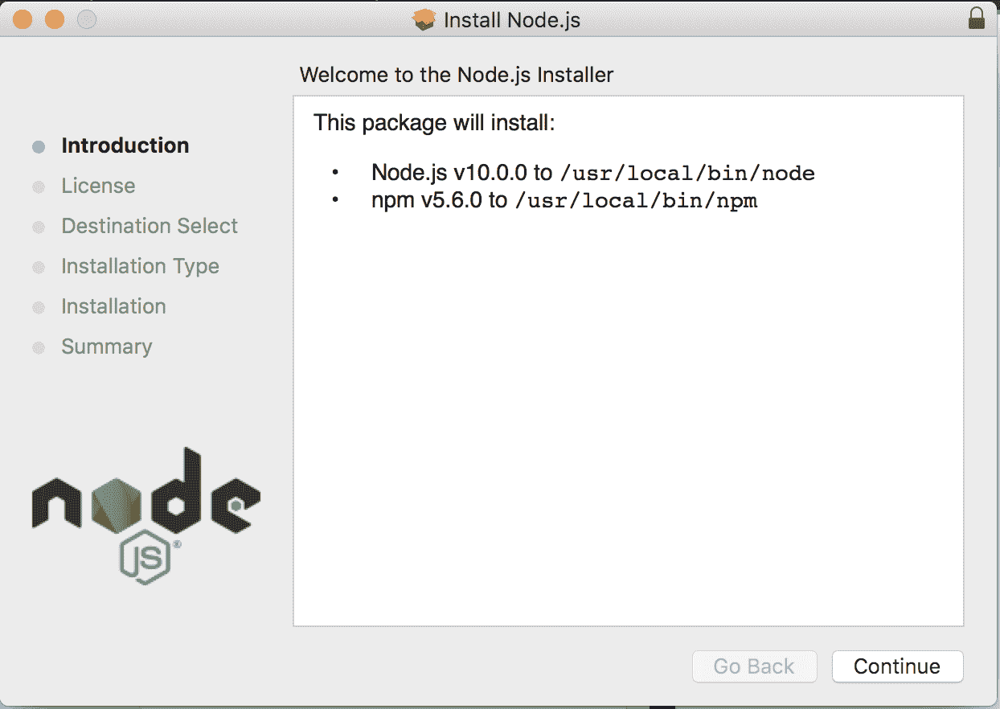
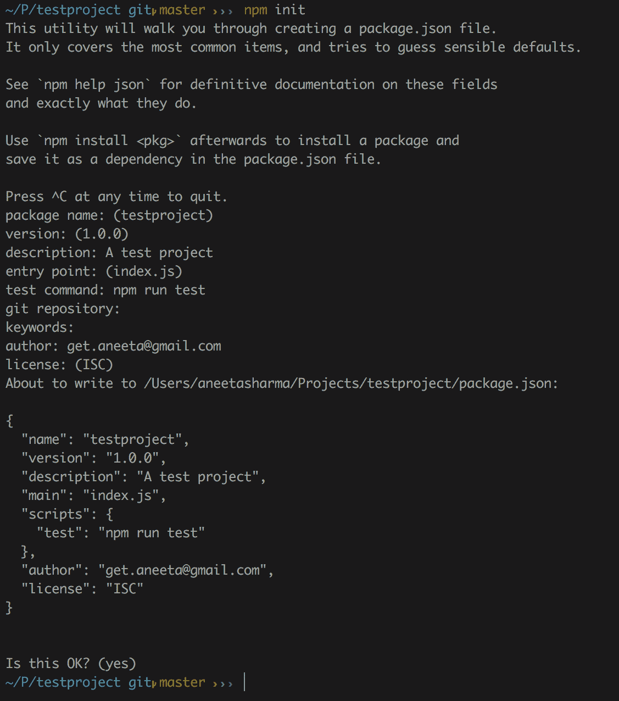
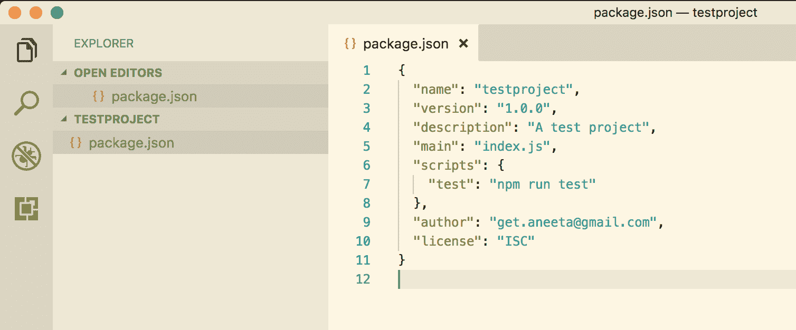
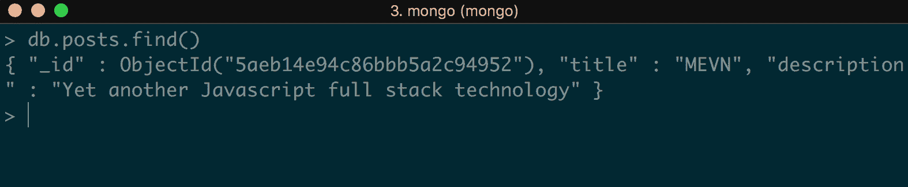
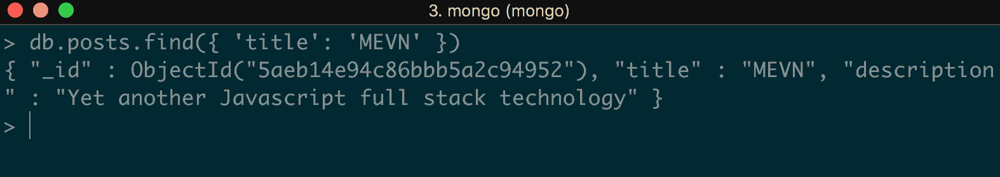
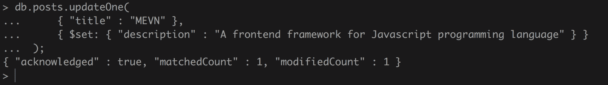
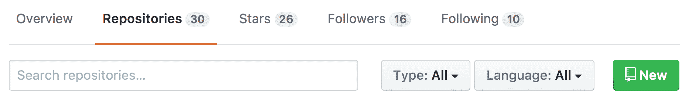
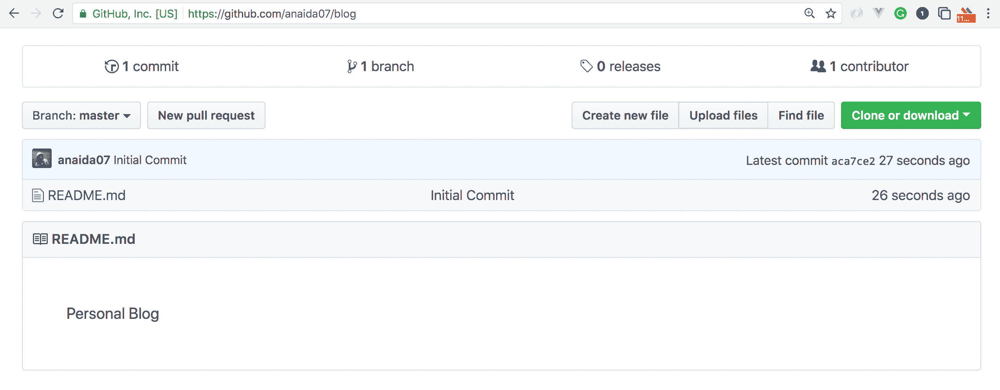

# 第一章：MEVN 简介

**Mongo, Express, Vue.js, and Node.js**（**MEVN**）是一组 JavaScript 技术，就像**MongoDB**、**Express**、**Angular**和**Node.js**（**MEAN**）一样，以及像**MongoDB**、**Express**、**React**和**Node.js**（**MERN**）一样。它是一个全栈解决方案，用于构建使用 MongoDB 作为数据存储、Express.js 作为后端框架（该框架建立在 Node.js 之上）、Vue.js 作为前端 JavaScript 框架以及 Node.js 作为后端主要引擎的基于 Web 的应用程序。

本书面向对使用 MongoDB、Express.js、Vue.js 和 Node.js 构建全栈 JavaScript 应用程序感兴趣的 Web 开发者。它适合对 HTML、CSS 和 JavaScript 有基本知识的初学者和中级开发者。

MEVN 这个术语可能很新，但其中使用的技术并不新。这里介绍的唯一新技术是 Vue.js。Vue.js 是一个开源的 JavaScript 框架，其受欢迎程度正在迅速增长。Vue.js 的学习曲线并不陡峭，它也是 AngularJS 和 ReactJS 等其他 JavaScript 框架的激烈竞争对手。

现代 Web 应用程序需要快速且易于扩展。在过去，JavaScript 仅在需要添加一些正常 HTML 和 CSS 无法实现的视觉效果或动画时才用于 Web 应用程序。但今天，JavaScript 已经改变了。今天，JavaScript 几乎用于所有基于 Web 的应用程序，从小型到大型应用程序。当应用程序需要更快和更交互式时，会选择 JavaScript。

使用 JavaScript 作为唯一编程语言构建全栈应用程序有其自身的好处：

+   如果你刚开始学习编程，你只需要掌握一种语言：JavaScript。

+   全栈工程师需求量大。成为一名全栈开发者意味着你了解数据库的工作原理，你知道如何构建后端和前端，并且你还具备 UI/UX 的技能。

在本书中，我们将使用这些技术栈来构建应用程序。

本章我们将涵盖以下主题：

+   MEVN 技术栈简介

+   Node.js 及其在 Windows、Linux 和 macOS 上的安装简介

+   `npm`及其安装概述

+   MongoDB 及其安装简介以及 MongoDB 中的一些基本命令

+   GitHub 版本控制简介及其如何帮助软件工程师轻松访问代码历史和协作

# JavaScript 技术栈的演变

JavaScript 是当今最重要的编程语言之一。由 Brendan Eich 于 1995 年创立，它做得非常出色，不仅保持了其地位，而且还在所有其他编程语言之上脱颖而出。

JavaScript 的流行度一直在增长，而且似乎没有尽头。以 JavaScript 作为唯一编程语言构建 Web 应用程序一直很受欢迎。随着这种快速的增长速度，软件工程师对 JavaScript 的知识需求也在不断增加。无论你选择哪种编程语言来精通，JavaScript 总是以某种方式渗透进来，与其他编程语言一起参与，无论方式如何。

在开发应用程序时，前端和后端有很多技术可供选择。虽然这本书使用 Express.js 作为后端框架，但还有其他框架可供学习，如果你愿意的话。

其他可用的后端框架包括 **Meteor.js**、**Sails.js**、**Hapi.js**、**Mojito**、**Koa.js** 以及更多。

类似地，对于前端，技术包括 **Vue.js**、**React**、**Angular**、**Backbone** 以及更多。

对于数据库，除了 MongoDB 之外，还有 **MySQL**、**PostgreSQL**、**Cassandra** 以及其他选项。

# 介绍 MEVN

JavaScript 框架正日益增多，无论是数量还是使用频率都在上升。JavaScript 最初仅用于客户端逻辑实现，但经过多年的发展，现在它既用于前端也用于后端。

在 MEVN 堆栈中，Express.js 用于管理所有与后端相关的内容，Vue.js 处理所有与视图相关的内容。使用 MEVN 堆栈的优势如下：

+   整个应用程序中只使用一种语言，这意味着你只需要了解 JavaScript。

+   使用一种语言理解客户端和服务器端非常简单。

+   这是一个非常快速且可靠的应用程序，具有 Node.js 的非阻塞 I/O。

+   这是一种很好的方式，可以保持对 JavaScript 不断增长的生态系统的了解。

# 安装 Node.js

要开始，我们需要添加 MEVN 堆栈应用程序所需的全部依赖项。我们还可以参考官方网站（[`nodejs.org/`](https://nodejs.org/)）上的文档，了解如何在任何操作系统上安装 Node.js 的详细信息。

# 在 macOS 上安装 Node.js

在 macOS 上安装 Node.js 有两种方式：使用安装程序或使用 bash。

# 使用安装程序安装 Node.js

要使用安装程序安装 Node.js，请执行以下步骤：

1.  安装安装程序：我们可以从官方网站的下载页面（[`nodejs.org/en/#download`](https://nodejs.org/en/#download)）下载 macOS 的安装程序。我们将安装最新的 `node` 版本，即 `10.0.0`。你可以安装任何你想要的 `node` 版本，但我们在本书中构建的应用程序将需要 `node` 版本 `>= 6.0.0`。运行安装程序并遵循给出的说明。当我们下载并运行安装程序时，我们将看到一个如下对话框：



1.  点击继续，直到安装完成。一旦安装完成，我们将能够看到以下对话框：


只需点击关闭，我们就会完成。

# 使用 bash 安装 Node.js

Node.js 可以很容易地使用 macOS 中的 Homebrew 安装。Homebrew 是一个免费的开源软件包管理器，用于在 macOS 上安装软件。我个人更喜欢 Homebrew，因为它使得在 Mac 上安装不同的软件变得非常容易：

1.  要安装`Homebrew`，请输入以下命令：

```js
$ /usr/bin/ruby -e "$(curl -fsSL https://raw.githubusercontent.com/Homebrew/install/master/install)"
```

1.  现在，使用以下命令通过`Homebrew`安装 Node.js：

```js
$ brew install node
```

# 在 Linux 上安装 Node.js

对于 Linux，我们可以安装 Node.js 的默认发行版，或者我们可以从 NodeSource 下载它以使用最新版本。

# 从默认发行版安装 Node.js

要从默认发行版安装，我们可以使用以下命令在 Linux 上安装 Node.js：

```js
$ sudo apt-get install -y nodejs
```

# 从 NodeSource 安装 Node.js

要从 NodeSource 安装 Node.js，请执行以下步骤：

1.  首先从 NodeSource 下载最新版本的 Node.js：

```js
$ curl -sL https://deb.nodesource.com/setup_9.x | sudo -E bash 
```

1.  然后，使用以下命令安装 Node.js：

```js
$ sudo apt-get install -y nodejs
```

`apt`是高级包工具的简称，用于在 Debian 和 Linux 发行版上安装软件。基本上，这相当于 macOS 中的 Homebrew 命令。

# 在 Windows 上安装 Node.js

我们可以通过以下步骤在 Windows 上安装 Node.js：

1.  从官方网站下载 Node.js 安装程序（[`nodejs.org/en/download/`](https://nodejs.org/en/download/)）。

1.  运行安装程序并按照给定的说明操作。

1.  点击关闭/完成按钮。

通过安装程序在 Windows 上安装 Node.js 几乎与在 macOS 上相同。一旦我们下载并运行安装程序，我们将看到一个对话框。只需点击继续，直到安装完成。当我们最终看到一个带有确认的对话框时，我们点击关闭。Node.js 将被安装！

# 介绍 NVM

**NVM**代表**Node 版本管理器**。NVM 跟踪我们安装的所有`node`版本，并允许我们在不同版本之间切换。当我们为 Node.js 的一个版本构建的应用程序与另一个版本不兼容时，我们需要那个特定的`node`版本来使事情正常工作，这非常有用。NVM 使我们能够轻松管理这些版本。当我们需要升级或降级`node`版本时，这也非常有帮助。

# 从 NVM 安装 Node.js

1.  要下载 NVM，请使用以下命令：

```js
$ curl -o- https://raw.githubusercontent.com/creationix/nvm/v0.33.0/install.sh | bash
```

1.  我们也可以使用以下命令：

```js
$ wget -qO- https://raw.githubusercontent.com/creationix/nvm/v0.33.6/install.sh | bash
```

1.  使用以下命令检查`nvm`是否已成功安装：

```js
$ nvm --version 
```

1.  现在，要使用`nvm`安装`node`，请使用以下命令：

```js
$ nvm install node
```

# 介绍 npm

npm 是 **Node Package Manager** 的缩写。基本上，它是一个负责我们为 Node.js 安装的所有包的工具。我们可以在官方网站 ([`www.npmjs.com/`](https://www.npmjs.com/)) 上找到所有现有的包。`npm` 使开发者能够轻松地保持他们的代码更新，并重用许多其他开发者共享的代码。

开发者经常被包和模块这两个术语所困惑。然而，这两个术语之间有一个清晰的区分。

# 模块

模块是可以通过 Node.js 的 `require` 命令加载并具有命名空间的东西。一个模块会关联一个 `package.json` 文件。

# 包

一个 `package` 只是一个文件，或者一组文件，它能够独立运行。每个包也都有一个 `package.json` 文件，其中包含描述该包的所有相关元数据信息。模块的组合构成了一个 `node` 包。

# 安装 npm

当我们从安装程序本身安装 Node.js 时，`npm` 作为 `node` 的一部分被安装。我们可以通过使用以下命令来检查 `npm` 是否已安装：

```js
$ npm --version
```

如果 `npm` 未安装，命令会显示错误，而如果已安装，它只会打印出已安装的 `npm` 版本。

# 使用 npm

`npm` 用于在我们的应用程序中安装不同的包。安装包有两种方式：本地和全局。当我们想要安装针对我们应用程序的特定包时，我们希望将其本地安装。然而，如果我们想要将某个包用作命令行工具或能够在我们应用程序外部访问它，我们则希望将其作为全局包安装。

# 本地安装 npm 包

要仅安装针对我们应用程序的特定包，我们可以使用以下命令：

```js
$ npm install <package_name> --save
```

# 全局安装 npm 包

要全局安装包，我们可以使用以下命令：

```js
 $ npm install -g <package_name>
```

# 介绍 `package.json`

所有的 `node` 包和模块都包含一个名为 `package.json` 的文件。这个文件的主要功能是携带与该包或模块相关的所有元信息。一个 `package.json` 文件要求内容是一个 JSON 对象。

至少，一个 `package.json` 文件包含以下内容：

+   **name**：包的名称。这是 `package.json` 文件的一个重要部分，因为它主要是区分其他包的东西，因此是一个必填字段。

+   **version**：包的版本。这也是一个必填字段。为了能够安装我们的包，需要提供 `name` 和 `version` 字段。

+   **description**：包的简要总结。

+   **main**：这是用于查找包的主要入口点。基本上，它是一个文件路径，因此当用户安装此包时，它会知道从哪里开始查找模块。

+   **脚本**：此字段包含可以在应用程序的各种状态下运行的命令。它由键值对组成。`key` 是命令应该运行的触发事件，而 `value` 是实际的命令。

+   **作者/贡献者**：作者和贡献者是人们。它包含一个个人标识符。作者是一个单独的人，而贡献者可以是一组人。

+   **许可协议**：当提供许可字段时，使用户能够轻松使用我们的包。这有助于在使用包时识别权限和限制。

# 创建一个 package.json 文件

我们可以手动创建一个 `package.json` 文件并自行指定选项，或者我们可以使用命令从命令提示符交互式地创建它。

让我们继续使用 `npm` 初始化一个带有 `package.json` 的示例应用程序。

首先，使用以下命令在项目目录中创建一个文件夹：

```js
$ mkdir testproject
```

要创建一个 `package.json` 文件，请在我们创建的应用程序中运行以下命令：

```js
$ npm init
```

运行此命令将向我们提出一系列问题，我们可以通过命令行交互式地回答这些问题：



最后，它将创建一个 `package.json` 文件，其中将包含以下内容：



# 安装 MongoDB

MongoDB 是 MEVN 技术栈中的第一个部分。MongoDB 是一个在 GNU 许可下发布的免费和开源文档型数据库。它是一个 NoSQL 数据库，这意味着它是一个非关系型数据库。与使用表和行来表示数据的关系型数据库不同，MongoDB 使用集合和文档。MongoDB 将数据表示为 JSON 文档的集合。它为我们提供了以任何我们想要的方式添加字段的灵活性。单个集合中的每个文档都可以有完全不同的结构。除了添加字段外，它还提供了以任何我们想要的方式从文档到文档更改字段的灵活性，这在关系型数据库中是一个繁琐的任务。

# 与关系型数据库管理系统（RDBMS）相比，MongoDB 的优势

与关系型数据库管理系统（RDBMS）相比，MongoDB 提供了许多好处：

+   无模式架构：MongoDB 不要求我们为其集合设计特定的模式。一个文档的模式可以不同，另一个文档则可能完全不同。

+   每个文档都存储在 JSON 结构化格式中。

+   查询和索引 MongoDB 非常容易。

+   MongoDB 是一个免费和开源的程序。

# 在 macOS 上安装 MongoDB

安装 MongoDB 有两种方式。我们可以从官方 MongoDB 网站下载它（[`www.mongodb.org/downloads#production`](https://www.mongodb.org/downloads#production)），或者我们可以使用 Homebrew 来安装它。

# 通过下载安装 MongoDB

1.  从 [`www.mongodb.com/download-center#production`](https://www.mongodb.com/download-center#production) 下载您想要的 MongoDB 版本。

1.  将下载的 gzipped 文件复制到根目录。将其添加到根目录将允许我们全局使用它：

```js
 $ cd Downloads $ mv mongodb-osx-x86_64-3.0.7.tgz ~/
```

1.  解压 gzipped 文件：

```js
 $ tar -zxvf mongodb-osx-x86_64-3.0.7.tgz
```

1.  创建一个目录，该目录将由 Mongo 用于保存数据：

```js
 $ mkdir -p /data/db
```

1.  现在，为了检查安装是否成功，启动 Mongo 服务器：

```js
 $ ~/mongodb/bin/mongod
```

在这里，我们已经成功安装并启动了 `mongo` 服务器。

# 通过 Homebrew 安装 MongoDB

要在 macOS 上使用 Homebrew 安装 MongoDB，请按照以下步骤操作：

1.  使用 Homebrew，我们只需要一个命令来安装 MongoDB：

```js
$ brew install mongodb
```

1.  创建一个目录，该目录将由 Mongo 用于保存数据：

```js
 $ sudo mkdir -p /data/db
```

1.  启动 Mongo 服务器：

```js
 $ ~/mongodb/bin/mongod 
```

因此，MongoDB 最终已安装。

# 在 Linux 上安装 MongoDB

在 Linux 上安装 MongoDB 也有两种方式：我们可以使用 `apt-get` 命令，或者我们可以下载 tarball 并解压它。

# 使用 apt-get 安装 MongoDB

要使用 `apt-get` 安装 MongoDB，请执行以下步骤：

1.  运行以下命令以安装 MongoDB 的最新版本：

```js
 $ sudo apt-get install -y mongodb-org
```

1.  通过运行以下命令来验证 `mongod` 是否已成功安装：

```js
 $ cd /var/log/mongodb/mongod.log
```

1.  要启动 `mongod` 进程，请在终端中执行以下命令：

```js
 $ sudo service mongod start
```

1.  查看日志文件是否有表示 MongoDB 连接成功建立的行：

```js
 $ [initandlisten] waiting for connections on port<port>
```

1.  要停止 `mongod` 进程：

```js
 $ sudo service mongod stop
```

1.  要重新启动 `mongod` 进程：

```js
 $ sudo service mongod restart
```

# 使用 tarball 安装 MongoDB

1.  从 [`www.mongodb.com/download-center?_ga=2.230171226.752000573.1511359743-2029118384.1508567417`](https://www.mongodb.com/download-center?_ga=2.230171226.752000573.1511359743-2029118384.1508567417) 下载二进制文件。使用以下命令：

```js
 $ curl -O https://fastdl.mongodb.org/linux/mongodb-linux-x86_64-
 3.4.10.tgz
```

1.  解压下载的文件：

```js
 $ tar -zxvf mongodb-linux-x86_64-3.4.10.tgz
```

1.  复制并解压到目标目录：

```js
 $ mkdir -p mongodb $ cp -R -n mongodb-linux-x86_64-3.4.10/ mongodb
```

1.  在 PATH 变量中设置二进制文件的位置：

```js
 $ export PATH=<mongodb-install-directory>/bin:$PATH
```

1.  创建一个目录，供 Mongo 用于存储所有数据库相关数据：

```js
 $ mkdir -p /data/db
```

1.  要启动 `mongod` 进程：

```js
 $ mongod
```

# 在 Windows 上安装 MongoDB

从安装程序安装 MongoDB 与在 Windows 上安装任何其他软件一样简单。就像我们为 Node.js 所做的那样，我们可以从官方网站 ([`www.mongodb.com/download-center#atlas`](https://www.mongodb.com/download-center#atlas)) 下载 MongoDB 安装程序。这将下载一个可执行文件。

一旦可执行文件下载完成，运行安装程序并按照说明操作。只需浏览对话框，仔细阅读说明。安装完成后，只需点击“关闭”按钮即可完成。

# 使用 MongoDB

让我们更深入地了解 MongoDB。正如之前提到的，Mongo 包含一个数据库，其中包含集合（表格/数据组）和文档（行/条目/记录）。我们将使用 MongoDB 提供的一些命令来创建、更新和删除文档：

首先，使用以下命令启动 Mongo 服务器：

```js
$ mongod
```

然后，使用以下命令打开 Mongo shell：

```js
$ mongo
```

# 创建或使用 MongoDB 数据库

这是我们可以看到所有数据库、集合和文档的地方。

要显示我们拥有的数据库列表，我们可以使用以下命令：

```js
> show dbs
```

现在，此命令应该列出所有现有数据库。要使用我们想要的数据库，我们可以简单地运行此命令：

```js
> use <database_name>
```

但是，如果没有列出数据库，请不要担心。MongoDB 为我们提供了一个功能，当我们运行前面的命令时，即使该数据库不存在，它也会自动为我们创建一个具有给定名称的数据库。

因此，如果我们已经有一个想要使用的数据库，我们只需运行该命令，如果没有数据库，我们将使用此命令创建一个：

```js
> use posts
```

当我们运行此命令时，将创建一个名为`posts`的数据库。

# 创建文档

现在，让我们快速回顾一下在 MongoDB 中使用的命令。`insert`命令用于在 MongoDB 中的集合中创建新文档。让我们向刚刚创建的名为`posts`的数据库中添加一条新记录。

在这里也是如此，为了向集合中添加文档，我们首先需要一个集合，我们还没有。但是 MongoDB 允许我们通过运行`insert`命令轻松创建集合。同样，如果集合存在，它将文档添加到指定的集合中，如果集合不存在，它将简单地创建一个新的集合。

现在，在 Mongo shell 中，运行以下命令：

```js
> db.posts.insertOne({
 title: 'MEVN',
 description: 'Yet another Javascript full stack technology'
});
```

此命令将在`posts`数据库中创建一个名为`posts`的新集合。此命令的输出是：


它将返回一个 JSON 对象，其中包含我们在`insertedId`键中创建的文档的 ID，以及事件被接收为`acknowledged`的标志。

# 获取文档

此命令用于当我们想要从一个集合中获取记录时。我们可以通过传递参数来获取所有记录或特定文档。我们可以向`posts`数据库添加一些更多文档，以便更好地学习该命令

# 获取所有文档

要获取`posts`集合中的所有记录，请运行以下命令：

```js
> db.posts.find()
```

这将返回`posts`集合中我们拥有的所有文档：



# 获取特定文档

让我们找到一个标题为`MEVN`的帖子。为此，我们可以运行：

```js
> db.posts.find({ 'title': 'MEVN' }) 
```

此命令将只返回标题为`MEVN`的文档：



# 更新文档

此命令用于当我们想要更新集合的某个部分时。比如说，我们想要更新标题为`Vue.js`的帖子的描述；我们可以运行以下命令：

```js
> db.posts.updateOne(
 { "title" : "MEVN" },
 { $set: { "description" : "A frontend framework for Javascript programming language" } }
 )
```

此命令的输出将是：



我们可以看到这里`matchedCount`是`1`，这意味着在`posts`集合中有一个文档与我们要更新的标题`MEVN`的查询参数相匹配。

另一个关键值`modifiedCount`给出了更新文档的数量。

# 删除文档

`delete`命令用于从集合中删除文档。从 MongoDB 中删除文档有几种方法。

# 删除符合给定条件的文档

要删除具有特定条件的所有文档，我们可以运行：

```js
> db.posts.remove({ title: 'MEVN' })
```

此命令将从`posts`集合中删除所有标题为`MEVN`的文档。

# 删除符合给定条件的单个文档

要删除仅满足给定条件的第一个记录，我们只需使用：

```js
> db.posts.deleteOne({ title: 'Expressjs' })
```

# 删除所有记录

要删除集合中的所有记录，我们可以使用：

```js
> db.posts.remove({})
```

# 介绍 Git

Git 是我们应用程序中跟踪代码变更的版本控制系统。它是一个免费的开源软件，用于在构建应用程序时跟踪和协调多个用户。

要开始使用此软件，我们首先需要安装它。在每种操作系统上安装它都非常简单。

# 在 Windows 上安装 Git

我们可以在[`gitforwindows.org/`](https://gitforwindows.org/)找到 Git for Windows 的安装程序。

下载 Windows 的可执行安装文件并按照相应的步骤进行操作。

# 在 Mac 上安装 Git

我们可以轻松通过 Homebrew 在 Mac 上安装 Git。只需在命令行中输入以下命令即可在 Mac 上安装 Git：

```js
$ brew install git 
```

# 在 Linux 上安装 Git

在 Linux 上安装 Git 与在 macOS 上安装 Git 一样简单。只需在命令行中输入以下命令并按回车键即可在 Linux 上安装 Git：

```js
$ sudo apt-get install git
```

# 介绍 GitHub

GitHub 是一个版本控制系统。它是一个专门设计用来跟踪代码变更的源代码管理工具。GitHub 还提供了社交网络功能，例如添加评论和显示动态，这使得它更加强大，因为多个开发者可以在单个应用程序中同时协作。

# 为什么选择 GitHub？

GitHub 是软件工程师的救星。GitHub 提供了许多优势，使其值得使用。以下是 GitHub 提供的一些好处：

+   **跟踪代码变更**：GitHub 帮助跟踪代码变更，这意味着它维护了我们代码的历史记录。这使得我们能够查看在任何时间段内对代码库进行的修订。

+   **文档**：GitHub 为我们提供了添加文档、维基等功能，这些可以使用简单的 Markdown 语言编写。

+   **图表和报告**：GitHub 提供了对各种指标的洞察，包括对代码进行了多少次添加和删除，谁是主要贡献者，以及谁提交最多。

+   **错误跟踪**：由于 GitHub 跟踪每个时间点的所有活动，当出现问题时，我们可以轻松回溯到导致代码中断的点。我们还可以集成第三方工具，如 Travis 进行持续集成，这有助于我们轻松跟踪和识别错误。

+   **协作简单**：GitHub 跟踪项目中每个协作者的所有活动，并为此发送电子邮件通知。它还提供社交媒体功能，如动态、评论、表情符号和提及。

+   **托管自己的网站**：我们还可以使用 GitHub 的 GitHub Pages 功能托管自己的网站。我们只需要为我们的项目创建一个仓库，并使用 GitHub Pages 托管它，这样网站就会适用于 URL：`https://<username>.github.io`。

# 使用 GitHub

GitHub 非常易于使用。然而，要开始使用 GitHub，我们至少需要了解一些在 GitHub 中使用的术语：

+   **仓库/Repo**：仓库是我们所有代码库存储的地方。仓库可以是私有的或公共的。

+   **ssh-key**：ssh-key 是 GitHub 中授权的一种方式。它存储我们的身份信息。

+   **分支**：分支可以被定义为仓库的多个状态。任何仓库的主要分支是`master`分支。多个用户可以在不同的分支上并行工作。

+   **提交**：提交使得在给定时间区分文件的不同状态变得容易。当我们提交时，会为该提交分配一个唯一的标识符，这样我们就可以轻松检查在该提交中做了哪些更改。提交以消息作为参数，描述正在进行的更改类型。

+   **推送**：推送将我们做出的提交发送回我们的仓库。

+   **拉取**：与推送相反，拉取是从远程仓库将提交拉取到我们的本地项目。

+   **合并**：合并基本上是在多个分支之间进行的。它用于将一个分支的更改应用到另一个分支。

+   **拉取请求**：创建一个`pull request`基本上是将我们对我们代码库所做的更改发送给其他开发者的审批。我们可以在`pull request`上开始讨论，以检查代码质量并确保更改不会破坏任何东西。

要了解更多关于 GitHub 中使用的词汇，请访问[`help.github.com/articles/github-glossary/`](https://help.github.com/articles/github-glossary/)。

# 设置 GitHub 仓库

现在我们已经了解了 GitHub 的基础知识，让我们开始创建我们想要构建的项目 GitHub 仓库： 

1.  首先，在根目录下为应用程序创建一个文件夹。让我们把这个应用程序命名为`blog`：

```js
 $ mkdir blog
```

1.  在[`github.com/`](https://github.com/)上创建一个 GitHub 账户。

1.  前往您的个人资料。在“仓库”选项卡下，点击“新建”，如下所示：



1.  将此仓库命名为`blog`。

1.  现在，在终端中，转到此应用程序的位置，并使用以下命令初始化一个空的仓库：

```js
 $ cd blog $ git init
```

1.  现在，让我们创建一个名为`README.md`的文件，为应用程序编写描述，然后保存它：

```js
 $ echo 'Blog' > README.md 
```

1.  将此文件添加到 GitHub：

```js
 $ git add README.md
```

1.  添加一个`提交`，以便我们有这个代码更改的历史记录：

```js
 $ git commit -m 'Initial Commit'
```

1.  现在，为了将本地应用程序与 GitHub 中的`远程`仓库链接起来，请使用以下命令：

```js
$ git remote add origin https://github.com/{github_username}/blog.git
```

1.  最后，我们需要将这个`提交``push`到 GitHub：

```js
 $ git push -u origin master
```

完成后，访问 GitHub 仓库，在那里你可以找到对我们仓库所做的提交历史，如下所示：



就这样。现在，当我们想要编写更改时，我们首先会创建一个分支，然后将更改`push`到该分支。

# 摘要

在本章中，我们学习了 MEVN 栈是什么。我们还了解了 Node.js、npm 和 MongoDB 是什么，以及 GitHub 的简要概述，以及它是如何帮助软件工程师方便地访问代码历史和协作的。

在下一章中，我们将学习更多关于 Node.js 和 Node.js 模块的知识。我们将了解 MVC 架构以及如何通过使用 Express.js 构建应用程序来实现它。
