# 构建 Express 应用

Express.js 是一个 Node.js 网络应用框架。Express.js 使得使用 Node.js 更加容易，并利用了其强大功能。在本章中，我们将仅使用 Express.js 创建一个应用。Express.js 也是一个`node`包。我们可以使用应用程序生成器工具，它让我们可以轻松地创建 Express 应用的骨架，或者我们可以从头开始自己创建。

在上一章中，我们学习了`npm`是什么，包是什么，以及如何安装一个包。在本章中，我们将涵盖以下元素：

+   Node.js 是什么以及它能做什么

+   它带来的好处

+   Node.js 的基本编程

+   Node.js 核心和自定义模块

+   Express.js 简介

+   使用 Express.js 创建应用

+   Express.js 中的路由

+   MVC 架构：它是什么以及它在应用中实现时增加了什么价值

+   应用的文件命名规范

+   对文件夹进行重组以融入 MVC 模式

+   为 Express.js 应用创建视图

有很多`npm`包可以帮助我们创建 Express.js 应用的骨架。其中一个这样的包是`express-generator`。它让我们能在几秒钟内搭建整个应用。它将以模块化结构创建所有必要的文件和文件夹。它生成的文件结构非常易于理解。我们唯一需要做的是定义模板视图和路由。

我们也可以根据我们的需求和需求修改这个结构。当我们面临紧迫的截止日期，想在一天或几天内构建一个应用时，这非常方便。这个过程极其简单。

`express-generator`只是众多可用于创建 Express 应用骨架或模块化结构的工具之一。每个生成器工具都有其自己的文件结构构建方式，这可以根据其标准轻松定制。

如果你是一个初学者并且想了解文件夹结构是如何工作的，我建议你从头开始构建应用。我们将在本章中进一步讨论这一点。

要开始，我们首先需要了解 Node.js，然后再深入研究 Express.js。

# Node.js 简介

Node.js 是一个基于 JavaScript 引擎构建的 JavaScript 运行时。它是一个开源框架，用于服务器端管理。Node.js 轻量级且高效，可在 Windows、Linux 和 macOS 等平台上运行。

Node.js 由 Ryan Dahl 于 2009 年创建。JavaScript 过去主要用于客户端脚本，但 Node.js 使得 JavaScript 也可以在服务器端使用。Node.js 的发明引入了在 Web 应用中使用单一编程语言的做法。Node.js 带来了很多好处，其中一些如下：

+   **事件驱动编程**：这意味着改变一个对象的状态从一个变为另一个。Node.js 使用事件驱动编程，这意味着它使用用户的交互动作，如鼠标点击和按键，来改变对象的状态。

+   **非阻塞 I/O**：非阻塞 I/O 或非同步 I/O 意味着异步 I/O。同步进程会等待当前运行进程完成，因此会阻塞进程。另一方面，异步进程不需要等待该进程完成，这使得它既快速又可靠。

+   **单线程**：单线程意味着 JavaScript 只在单个事件循环中运行。由于异步进程允许我们同时拥有多个进程，这可能会让人感觉所有这些进程都在它们自己的特定线程中运行。但 Node.js 处理异步的方式略有不同。Node.js 中的事件循环在相应事件发生后触发下一个已安排执行的回调函数。

# 理解 Node.js

在深入研究 Node.js 编程之前，让我们先了解一下 Node.js 的一些基础知识。Node.js 运行在 JavaScript V8 引擎上。JavaScript V8 引擎是由*Chromium 项目*为 Google Chrome 和 Chromium 网络浏览器构建的。这是一个用 C++编写的开源项目。这个引擎用于客户端和服务器端 Web 应用程序的 JavaScript。

# Node.js 编程

让我们从运行一个`node`进程开始。打开终端并输入以下命令：

```js
$ node
```

这将启动一个新的`node`进程。我们在这里可以编写正常的 JavaScript 代码。

例如，我们可以在新的 Node shell 中编写以下 JavaScript 命令：

```js
> var a = 1;
```

当我们输入`a`并按回车键时，它返回`1`。

我们也可以在`node`进程中运行扩展名为`.js`的文件。让我们在根目录下使用命令`mkdir tutorial`创建一个名为`tutorial`的文件夹，并在其中创建一个名为`tutorial.js`的文件。

现在，在终端中，让我们使用以下命令进入该目录：

```js
$ cd tutorial $ node tutorial.js
```

我们应该看到以下类似的内容：

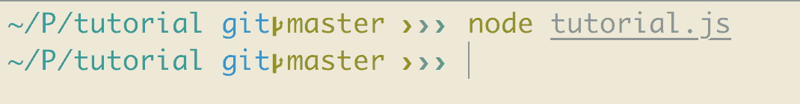

由于我们还没有为`tutorial.js`编写任何内容，所以它不会返回任何内容。

现在，让我们向`tutorial.js`文件中添加一些代码：

```js
console.log('Hello World');
```

现在，使用以下命令运行文件：

```js
$ node tutorial.js
```

我们将看到一个输出显示`Hello World`。这就是我们在 Node.js 中执行文件的方式。

除了在 V8 引擎上运行并在浏览器中执行 JavaScript 代码之外，Node.js 还提供了一个服务器运行环境。这是 Node.js 最强大的功能。Node.js 提供了一个自带的 HTTP 模块，它实现了一个非阻塞的 HTTP 实现。让我们构建一个简单的 Web 服务器来理解这一点。

在同一文件`tutorial.js`中，用以下代码覆盖文件：

```js
const http = require('http');

http.createServer(function (req, res) {
 res.writeHead(200, { 'Content-Type': 'text/plain' });
 res.end('Hello World\n');
}).listen(8080, '127.0.0.1');

console.log('Server running at http://127.0.0.1:8080/');
```

在这里，`var http = require('http');`这段代码将 HTTP 模块引入到我们的应用程序中。这意味着现在我们可以通过`http`变量访问 HTTP 库中定义的函数。现在我们需要创建一个 Web 服务器。前面的代码告诉 Node.js 在 8080 端口运行 Web 服务器。`createServer`方法中的`function`参数接受两个参数，分别是`req`和`res`，它们分别是请求和响应的简称。在这个函数内部，我们首先需要做的是设置 HTTP 头。这基本上是定义我们希望从该请求中获取哪种类型的响应。然后，我们使用`res.send`定义我们希望在响应中获取的内容。最后，我们要求 Web 服务器监听 8080 端口。

当我们使用`$ node tutorial.js`运行此代码时，输出看起来像这样：

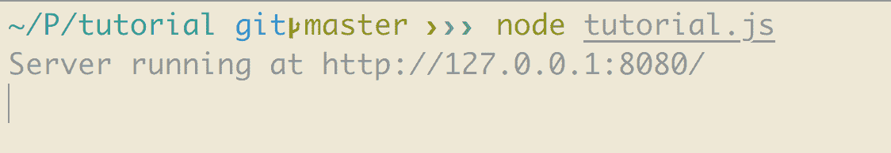

当我们在浏览器中输入该 URL 时，我们应该能够看到以下内容：

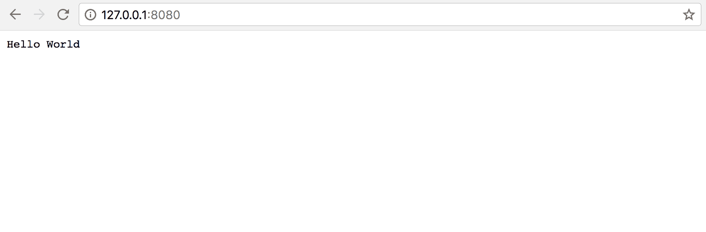

这就是 Node.js 作为服务器程序的工作方式。

要退出`node`控制台，请按*Ctrl* *+* *C*两次。

# Node.js 模块

Node.js 模块只是一个普通的 JavaScript 文件，它包含可重用的代码。每个模块都有自己的特定功能。我们可以将其视为一个库。

例如，如果我们想在应用程序中隔离所有与用户相关的活动，我们可以为它创建一个模块，该模块将处理所有关于用户的数据库。

在 Node.js 中使用模块的方式是通过`require`。我们刚才向您展示的创建 Web 服务器的例子也是一个 Node.js 模块。

# Node.js 核心模块

在 Node.js 中有两种类型的模块。核心模块是在 Node.js 中构建的模块。在我们安装 Node.js 时它们就存在了。这些也被称为内置模块。Node.js 中有许多核心模块：

+   调试器

+   文件系统

+   HTTP

+   路径

+   处理

+   事件

如果你想详细了解每个核心模块的更多细节，你可以访问以下文档：

[`nodejs.org/api/.`](https://nodejs.org/api/)

# 自定义模块

这些是我们自己基于 Node.js 创建的模块。由于 Node.js 有一个非常大的生态系统，因此有大量的不同模块可供我们根据需要免费获取。我们可以自己构建一个，或者直接使用别人的模块。这也是 Node.js 强大之处的一个方面。它为我们提供了使用社区模块或自己构建模块的灵活性。

我们可以在[`www.npmjs.com/browse/depended`](https://www.npmjs.com/browse/depended)查看所有现有可用模块的列表：

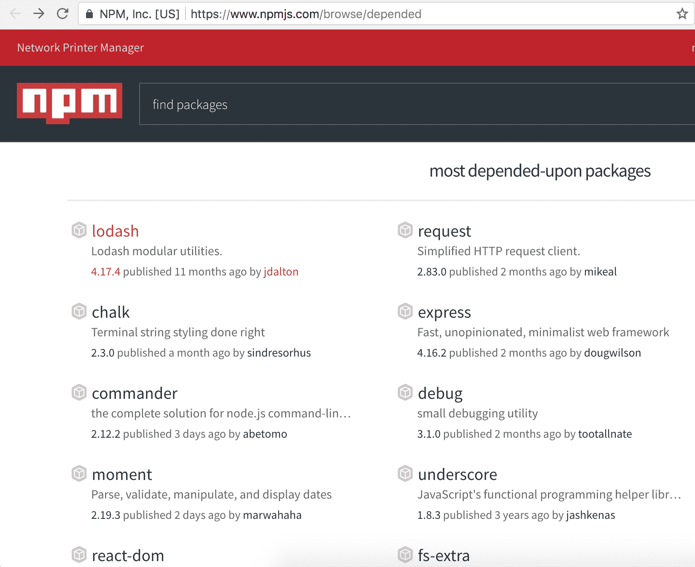

# 介绍 Express.js

Express.js 是一个用于 Node.js 的极简服务器端网络框架。它建立在 Node.js 之上，以便更容易地管理 Node.js 服务器。Express.js 最重要的优势是它使路由变得非常简单。它提供的强大 API 非常容易配置。从前端接收请求和连接到数据库都很简单。Express.js 也是 Node.js 最受欢迎的网络框架。它使用 **模型-视图-控制器**（**MVC**）设计模式，我们将在本章后面讨论。

# 安装 Express.js

我们已经介绍了如何通过 `npm` 安装 `node` 模块。同样，我们可以使用此命令通过 NPM 安装 Express.js：

```js
$ npm install express
```

这是一种安装 `node` 模块的简单方法。但是，在构建应用程序时，我们需要很多不同种类的模块。我们还想在多个应用程序之间共享这些模块。因此，为了使模块全局可用，我们必须全局安装它。为此，`npm` 提供了在安装 `node` 模块时添加 `-g` 选项的功能。所以，现在我们可以使用：

```js
$ npm install -g express
```

这将全局安装 Express.js，这允许我们在多个应用程序中使用 `express` 命令。

# 创建 Express.js 应用程序

现在我们已经安装了 Express.js，让我们开始使用 Express.js 创建应用程序。

我们将命名我们的应用程序为 `express_app`。使用 `express` 命令构建 express 应用的轮廓非常简单。我们可以简单地使用：

```js
$ express express_app
```

输出如下所示：

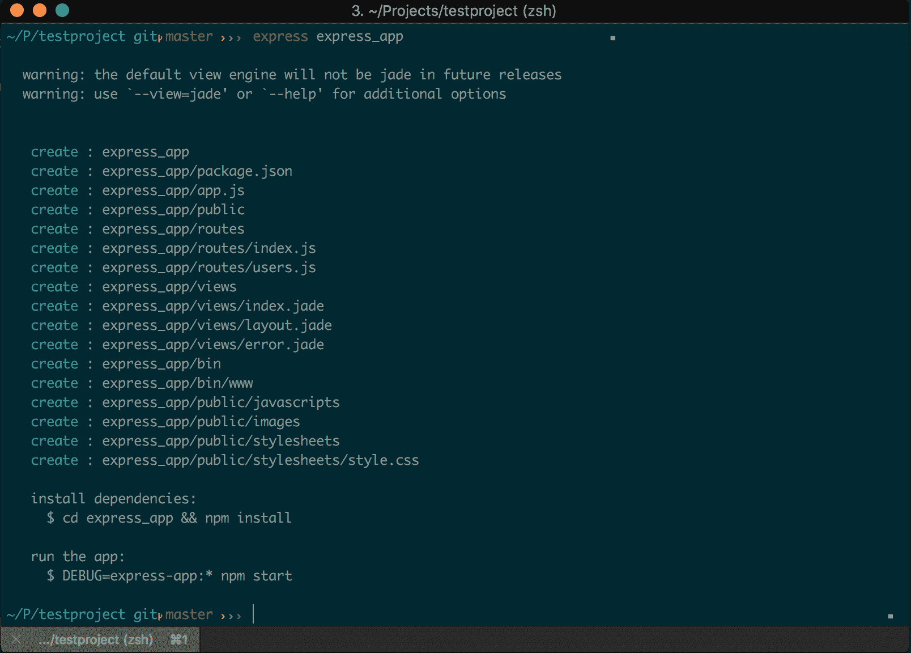

此命令会在我们的应用程序中创建大量的文件和文件夹。让我们快速看一下这些：

+   `package.json`：此文件包含我们在应用程序中安装的所有 `node` 包的列表以及应用程序的简介。

+   `app.js`：此文件是 express 应用的主入口页面。网络服务器代码位于此文件中。

+   `public`：我们可以使用此文件夹来插入我们的资产，例如图片、样式表或自定义 JavaScript 代码。

+   `views`：此文件夹包含所有将在浏览器中渲染的视图文件。它包含主布局文件（其中包含视图文件的 HTML 模板），一个 `index.jade` 文件（它扩展了布局文件，只包含可变或动态的内容），以及一个 `error.jade` 文件（当我们需要向前端显示某种错误消息时显示）。

+   `routes`：此文件夹包含我们将构建的所有路由，以便访问应用程序的不同页面。我们将在后续章节中进一步讨论。

+   `bin`：此文件夹包含 Node.js 的可执行文件。

因此，这些都是我们需要了解的基本知识。现在，使用您喜欢的文本编辑器来处理应用程序，让我们开始吧。现在，如果我们查看 `package.json`，会发现某些我们没有安装但列在依赖项中的包：

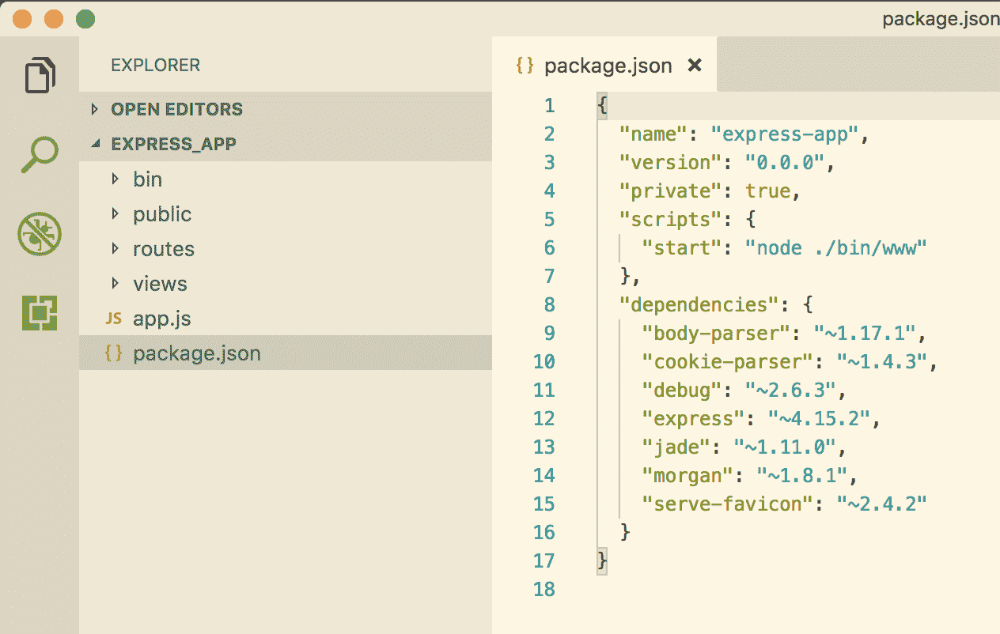

这是因为这些是 Express.js 任何应用程序的依赖项。这意味着，当我们使用 `express` 命令创建应用程序时，它将自动安装它需要的所有依赖项。例如，前面 `package.json` 文件中列出的依赖项执行以下操作：

+   **body-parser**：用于解析我们在发起 HTTP 请求时提供的请求体参数

+   **debug**：这是一个提供 `console.log` 返回值的格式化工具的 JavaScript 实用程序包

    我们可以通过 `package.json` 文件安装或删除包。只需在 `package.json` 文件中添加或删除包的名称，然后运行 `$ npm install`。

+   **express**：这是一个 Node.js JavaScript 框架，用于在 Node.js 上构建可扩展的 Web 应用程序。

+   **jade**：如前所述，这是 Node.js 的默认模板引擎。我们应该在用 `express` 命令创建应用程序时看到一条警告信息，说明在未来的版本中默认视图引擎将不再是 jade。这是因为 `jade` 被一家公司拥有版权，后来将其名称更改为 `pug`。

Express 生成器使用过时的 `jade` 模板引擎。要更改模板引擎，请按照以下步骤操作：

1.  在 `package.json` 文件中，删除 `"jade": "~1.11.0"` 行并运行：

```js
$ cd express_app
$ npm install
```

1.  现在，要安装新的 `pug` 模板引擎，请运行：

```js
$ npm install pug --save
```

1.  如果我们查看 `package.json` 文件，我们应该看到一条类似以下内容的行：

    `"pug": "².0.0-rc.4"`。

1.  重命名 `views` 文件夹中的文件：

    +   将 `error.jade` 重命名为 `error.pug`

    +   将 `index.jade` 重命名为 `index.pug`

    +   将 `layout.jade` 重命名为 `layout.pug`

1.  最后，在 `app.js` 中，删除显示以下内容的行：

```js
app.set('view engine', 'jade');
```

1.  添加以下行以使用 `pug` 作为视图引擎：

```js
app.set('view engine', 'pug');
```

+   **morgan**：这是一个用于记录 HTTP 请求的中间件

+   **serve-favicon**：这是在浏览器中显示 favicon 以识别我们的应用程序

对于我们的应用程序来说，没有必要拥有所有这些依赖项。它们来自安装 Express.js。只需查找你想要的，然后根据应用程序的需求添加或删除包。

目前，我们将保持原样。`express` 命令只是将依赖项添加到我们的 `package.json` 文件中，并为我们的应用程序创建一个骨架。为了实际安装 `package.json` 文件中列出的这些模块和包，我们需要运行：

```js
$ npm install
```

这个命令实际上会安装所有依赖项。现在，如果我们查看文件夹结构，我们可以看到一个名为 `node_modules` 的新文件夹被添加。这就是我们在这个应用程序中安装的所有包的存放地。

现在，我们首先想要做的是设置一个 Web 服务器。为此，在 `app.js` 文件中添加以下行：

```js
// error handler
app.use(function(err, req, res, next) {
  // set locals, only providing error in development
  res.locals.message = err.message;
  res.locals.error = req.app.get('env') === 'development' ? err : {};

  // render the error page
  res.status(err.status || 500);
  res.render('error');
});

app.listen(3000, function() { console.log('listening on 3000') })

module.exports = app;

```

现在，运行以下命令：

```js
$ node app.js
```

这将启动我们的应用程序服务器。现在，当我们访问 `http://localhost:3000/` URL 时，我们应该能够得到以下内容：

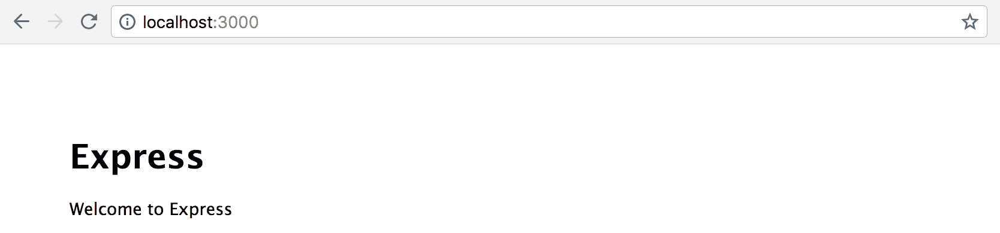

就这些。我们已经成功创建了一个 Express 应用程序。

# Express 路由器

让我们继续到 Express 路由器。如本章前面所述，Express.js 最重要的一点是它为应用程序提供了简单的路由。路由是应用程序 URL 的定义。如果我们查看 `app.js`，我们会看到一个类似以下的部分：

```js
...
app.use('/', index);
app.use('/users', users);
...
```

这意味着当我们访问一个网页，并且当对主页发起请求时，Express 路由器将其重定向到名为 `index` 的路由器。现在，看看 `routes/index.js` 文件，它包含以下代码：

```js
var express = require('express');
var router = express.Router();

/* GET home page. */
router.get('/', function(req, res, next) {
  res.render('index', { title: 'Express' });
});

module.exports = router;
```

这意味着当我们访问主页时，它会渲染一个名为 `index` 的页面，该页面位于 `views/index.pug` 内，并将要显示在页面上的 `title` 参数传递过去。现在，看看位于视图文件夹中的 `index.pug` 文件，它包含以下代码：

```js
extends layout

block content
  h1= title
  p Welcome to #{title}
```

这意味着它使用了 `layout.pug` 文件中的布局，并显示了一个 `h1` 标题以及一个渲染我们从前端文件传递过来的标题的段落。因此，输出如下：


非常简单直接，对吧？

# 请求对象

请求对象是一个包含 HTTP 请求信息的对象。请求的属性包括：

+   **query:** 这包含有关解析查询字符串的信息。通过 `req.query` 访问。

+   **params:** 这包含有关解析路由参数的信息。通过 `req.params` 访问。

+   **body:** 这包含有关解析请求体的信息。通过 `req.body` 访问。

# 响应对象

在 `req` 变量上接收到 `request` 之后，`res` 对象是我们想要发送回的 `response`。

响应对象的属性包括：

+   **send:** 这用于向视图发送响应。通过 `res.send` 访问。它接受两个参数，状态码和响应体。

+   **status:** 如果我们想要发送应用程序的成功或失败，使用 `res.status`。这是 HTTP 状态码。

+   **redirect:** 当我们想要重定向到某个页面而不是以其他格式发送响应时，使用 `res.redirect`。

# MVC 简介

MVC 模型在构建应用程序时至关重要，无论使用哪种编程语言。MVC 架构使得组织我们应用程序的结构和分离逻辑部分和视图部分变得容易。我们可以在任何时间点整合这个 MVC 结构，即使我们已经完成了应用程序的一半。最佳实施时间是任何应用程序的开始。

如其名所示，它有三个部分：

+   **Model:** 所有应用程序的业务逻辑都位于这些 `models` 之下。它们处理数据库。它们处理应用程序的所有逻辑部分。

+   **视图：**浏览器渲染的任何内容——用户看到的内容——都由这些视图文件处理。它处理我们发送给客户端的任何内容。

+   **控制器：**`Controllers`基本上连接这些`models`和视图。它负责将`models`中完成的逻辑计算传递到`views`部分：

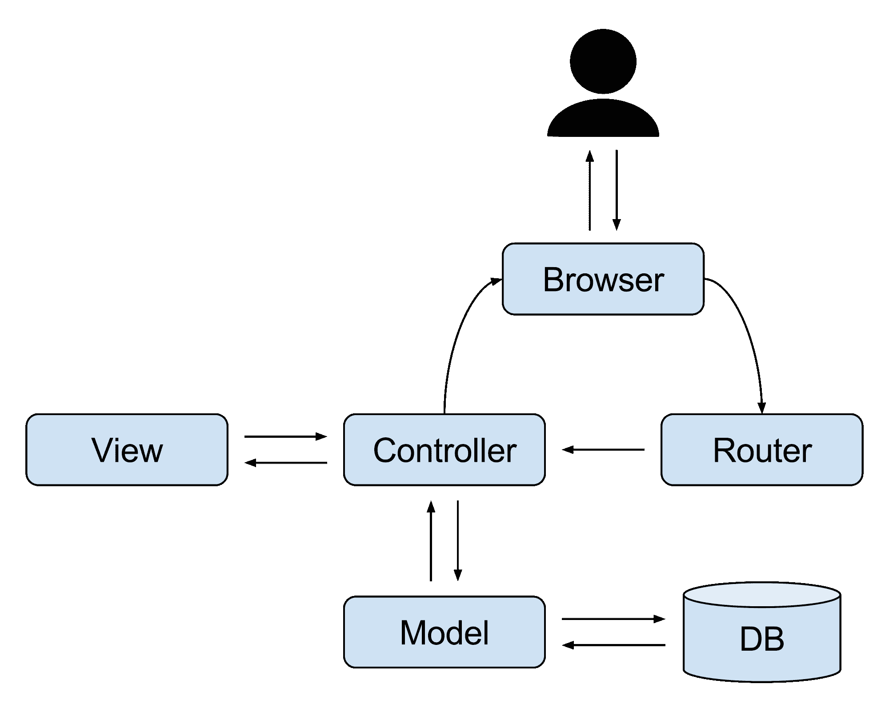

在我们构建的应用程序中实现 MVC 平台并不是必需的。JavaScript 是无模式的，这意味着我们可以创建自己的文件夹结构。与其他编程语言不同，我们可以选择对我们来说最容易的结构。

# 为什么使用 MVC？

当我们将 MVC 架构实现到我们的应用程序中时，会添加很多好处：

+   商业逻辑和视图的清晰分离。这种分离使我们能够在整个应用程序中重用业务逻辑。

+   开发过程变得更快。这一点很明显，因为各个部分已经清晰地分离出来。我们只需将视图添加到视图文件夹中，并在`models`文件夹中添加逻辑。

+   修改现有代码很容易。当多个开发者共同参与同一项目时，这一点非常方便。任何人都可以从任何地方开始修改应用程序。

# 将文件夹结构修改为包含 MVC

既然我们已经对 MVC 有了足够的了解，让我们修改一下我们创建的应用程序的文件夹结构，该应用程序名为`express_app`。首先，我们需要在根目录中创建这三个文件夹。已经有一个`views`文件夹，所以我们可以跳过它。让我们继续创建`models`和`controllers`文件夹。

之后，在我们的`app.js`中，我们需要包含我们的控制器文件。为此，我们首先需要引入一个新的包，称为 filesystem。这个模块使得执行与文件相关的操作变得容易，例如读取/写入文件。

因此，要将这个包添加到我们的应用程序中，请运行：

```js
$ npm install file-system --save 
```

这个`--save`参数用于当我们想要一个`node`模块只在我们应用程序中安装时。此外，安装后，这个包将自动包含在我们的`package.json`中。

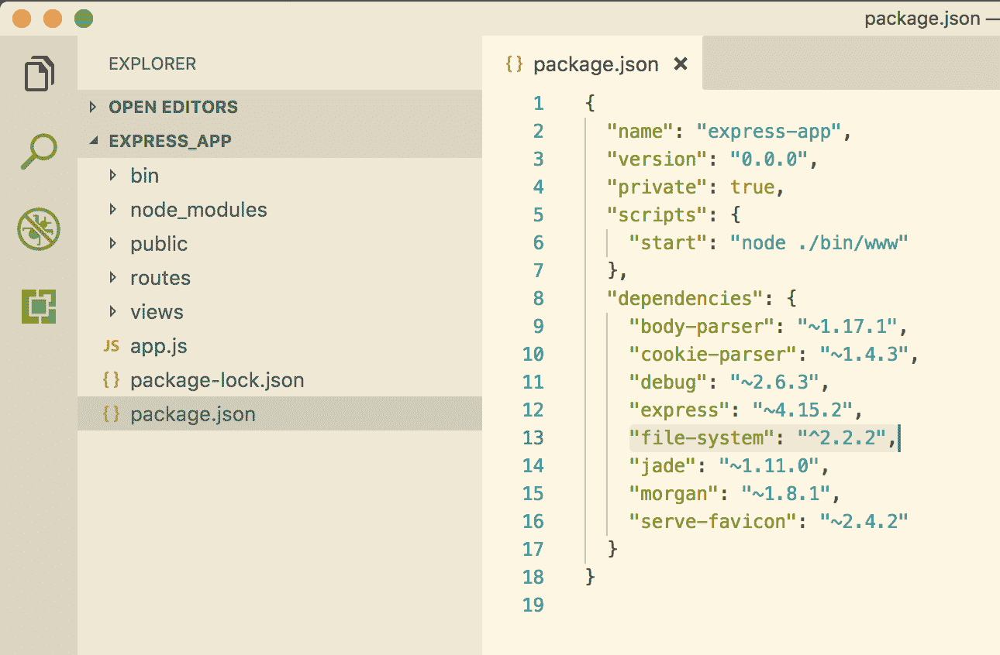

现在，我们需要引入这个模块并使用它来包含所有位于控制器中的文件。为此，在`app.js`中添加以下代码行。确保在运行我们的网络服务器代码之前添加这些行：

```js
var index = require('./routes/index');
var users = require('./routes/users');

var app = express();

// Require file system module
var fs = require('file-system');

// Include controllers
fs.readdirSync('controllers').forEach(function (file) {
 if(file.substr(-3) == '.js') {
 const route = require('./controllers/' + file)
 route.controller(app)
 }
})

// view engine setup
app.set('views', path.join(__dirname, 'views'));
app.set('view engine', 'pug');
```

让我们继续添加一个路由到我们的控制器。让我们在应用程序的根目录中创建一个名为`controllers`的文件夹，并在`controllers`文件夹中添加一个`index.js`文件，并将以下代码粘贴进去：

```js
module.exports.controller = (app) => {
 // get homepage
 app.get('/', (req, res) => {
 res.render('index', { title: 'Express' });
 })
}
```

现在，所有路由都将由控制器文件处理，这意味着我们不需要在`app.js`中控制路由的代码。因此，我们可以从文件中删除这些行：

```js
var index = require('./routes/index');
var users = require('./routes/users');

app.use('/', index);
app.use('/users', users);
```

实际上，我们不再需要那个`routes`文件夹。让我们也删除`routes`文件夹。

同样，让我们添加一个新的路由来控制所有与用户相关的操作。为此，在 `controllers` 文件夹中添加一个名为 `users.js` 的新文件，并将以下代码粘贴到其中：

```js
module.exports.controller = (app) => {
 // get users page
 app.get('/users', (req, res) => {
 res.render('index', { title: 'Users' });
 })
}
```

现在，让我们使用以下命令重新启动我们的应用节点服务器：

```js
$ node app.js
```

通过这种方式，当我们访问 `http://localhost:3000/users` 时，我们将能够看到以下内容：

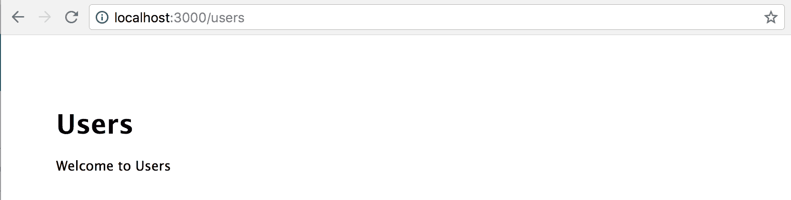

我们已经成功设置了 MVC 架构中的 `controllers` 和 `views` 部分。我们将在后续章节中进一步介绍 `models` 部分。

在上一章中，我们讨论了 GitHub 以及如何通过进行小提交来使用它来记录代码历史。不要忘记设置仓库并持续将代码推送到 GitHub。

npm 包存储在 `node_modules` 目录中，我们不应将其推送到 GitHub。为了忽略此类文件，我们可以添加一个名为 `.gitignore` 的文件，并指定我们不想推送到 GitHub 的文件。

让我们在我们的应用程序中创建一个名为 `.gitignore` 的文件，并添加以下内容：

```js
node_modules/
```

这样，当我们安装任何包时，它不会在向 GitHub 提交代码时显示为代码差异。

每当我们对代码进行一些更改时，我们都需要重新启动我们的 `node` 服务器，这非常耗时。为了简化这个过程，`node` 提供了一个名为 `nodemon` 的包，它会在我们更改代码时自动重新启动服务器。

要安装该包，请运行：

```js
$ npm install nodemon --save
```

要运行服务器，请使用以下命令：

```js
$ nodemon app.js
```

# 文件命名规范

在开发应用程序时，我们需要遵循一定的命名约定来命名文件。随着我们继续构建应用程序，我们将拥有大量的文件，这可能会变得混乱。MVC 允许在不同的文件夹之间有并行的命名规范，这可能导致不同文件夹中存在相同的文件名。

如果我们认为这样做既简单又易于维护，我们也可以处理这样的文件名。否则，我们只需将文件类型追加到每个文件中，例如，在以下示例中；对于处理用户相关活动的控制器文件，我们可以将其保留为 `controllers/users.js`，或者我们可以将其重命名为 `controllers/users_controller.js`。我们将为我们的应用程序使用 `controllers/users`。

对于 `models`、`services` 或任何需要在应用程序的不同区域之间共享的文件夹也是如此。对于这个应用程序，我们将使用以下命名约定：

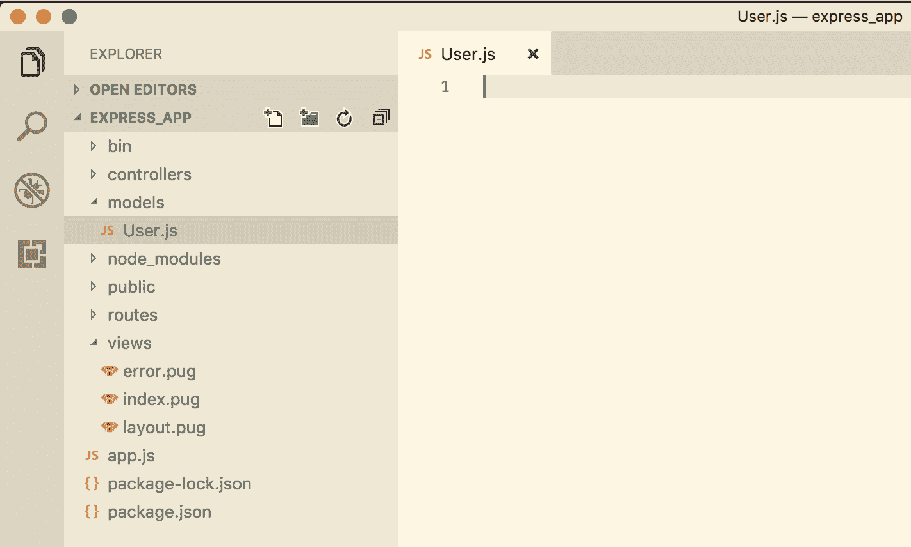

记住，Node.js 中没有官方的命名规范。我们绝对可以自定义我们找到的更简单的方式。我们将在后续章节中进一步讨论创建 `models` 的问题。这需要我们与 Mongo 建立连接，我们将在后续章节中描述。

# 为 Express.js 应用程序创建视图文件

在上一节中，我们学习了如何创建 `controllers`。在本节中，我们将讨论如何添加和自定义视图文件。如果您还记得，我们在 `controllers/users.js` 中有这段代码：

```js
module.exports.controller = (app) => {
  // get users page
  app.get('/users', (req, res) => {
    res.render('index', { title: 'Users' });
  })
}
```

让我们更改渲染 `index` 文件的行，改为以下内容：

```js
module.exports.controller = (app) => {
  // get users page
  app.get('/users', (req, res) => {
    res.render('users', { title: 'Users' });
  })
}
```

这意味着控制器想要加载 `views` 文件夹中的 `users` 文件。让我们继续在 `views` 文件夹中创建一个 `users.pug` 文件。

创建文件后，粘贴以下代码；这与我们在 `views` 文件夹中的 `index.pug` 文件中的代码相同：

```js
extends layout

block content
 h1= title
 p Welcome to #{title}
```

现在，如果我们使用了 `nodemon`，我们不需要重新启动服务器；只需用位置 `http://localhost:3000/users` 重新加载浏览器。这应该会渲染以下内容：


现在我们已经知道了如何连接 `controllers` 和 `views` 以及如何创建视图文件，让我们来获取一些关于文件代码的更多信息。

第一行表示：

```js
extends layout
```

这意味着它要求扩展 `layout.pug` 文件中已经存在的视图。现在，看看 `layout.pug`：

```js
doctype html
html
  head
    title= title
    link(rel='stylesheet', href='/stylesheets/style.css')
  body
    block content
```

这是一个简单的 HTML 文件，包含 `doctype`、`HTML`、`head` 和 `body` 标签。在 `body` 标签内，它指示阻塞内容，这意味着它从任何其他文件中产生内容，这些文件都写在 `block content` 语句之下。如果我们查看 `users.jade`，我们可以看到内容是写在 `block content` 语句之下的。现在，这非常实用，因为我们不需要在创建的每个视图文件中重复整个 HTML 标签。

此外，如果我们查看控制器中的 `users.js`，有一行写着：

```js
res.render('users', { title: 'Users' });
```

渲染方法有两个参数：它想要加载的视图以及想要传递给该视图的变量。在这个例子中，`Users` 被传递给标题变量。在 `views` 文件夹中的 `users.jade` 文件里，我们有：

```js
block content
  h1= title
  p Welcome to #{title}
```

这会在 `h1` 标签和 `p` 标签内渲染该变量。这样，我们可以从 `controllers` 向视图传递任何我们想要的内容。让我们在 `users.js` 控制器的 `render` 方法中添加一个新的变量 `description`：

```js
module.exports.controller = (app) => {
  // get homepage
  app.get('/users', (req, res) => {
    res.render('users', { title: 'Users', description: 'This is the description of all the users' });
  })
}
```

此外，让我们在 `users.pug` 中创建一个渲染该内容的区域：

```js
extends layout

block content
  h1= title
  p Welcome to #{title}
  p #{description}
```

如果我们重新加载浏览器，我们会得到：

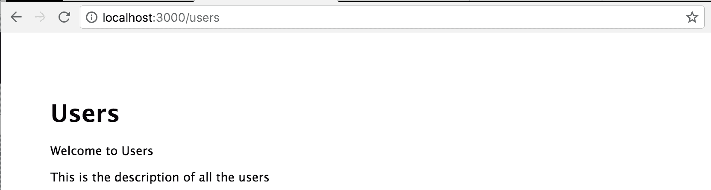

这就是我们在 Express 应用程序中创建视图的方法。现在，继续添加您希望为我们的应用程序添加的视图。

总是要确保将更改提交并推送到 GitHub。提交越小，代码的可维护性就越高。

# 摘要

在这一章中，我们学习了 Node.js 是什么以及 Express.js 是什么。我们学习了如何使用 Express.js 创建应用程序，并了解了 MVC 架构。

在下一章中，我们将讨论 MongoDB 及其查询。我们还将讨论使用 Mongoose 进行快速开发和 Mongoose 查询和验证。
