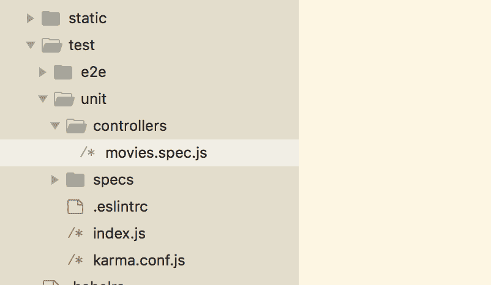

# 测试 MEVN 应用

让我们快速回顾一下在前几章中我们已经做了什么：

+   我们为不同的页面创建了不同的 Vue 组件

+   我们实现了 Vuex——Vue.js 应用的集中式状态管理，并为组件定义了状态、获取器、突变和动作

+   我们创建了控制器和模型来与 Node.js 后端交互

在本章中，我们将讨论如何编写测试代码以确保应用中的所有内容都能正常工作。编写测试代码是任何应用的组成部分。它有助于确保我们编写的功能不会崩溃，并保持我们编写代码的质量。

在编写测试时可以遵循不同的实践。始终先编写测试代码，然后再编写实际代码是一个好习惯。编写测试代码确保我们的应用不会崩溃，并且一切都会按预期工作。

这有助于我们编写更好的代码，也有助于在问题出现之前揭示潜在的问题。

# 编写测试的好处

在开发应用时编写测试代码有很多好处。以下是一些：

+   **确保代码按预期工作**：它有助于确保我们应用中编写的每一块功能都按预期工作。

+   **提高代码质量**：它提高了代码质量。由于编写测试代码有助于预防可能出现的缺陷，因此在编写实际代码之前，它提高了代码的质量。

+   **提前识别 bug**：它有助于在早期阶段识别 bug。由于为每个功能编写了测试代码，因此可以提前识别 bug 和问题。

+   **作为新开发者的文档**：测试代码就像文档一样。如果我们需要新开发者开始在同一应用上工作，测试代码帮助他们理解应用是如何工作的，而不是通过所有应用代码。

+   **测试代码使应用开发更快**：如果我们不编写测试代码，我们会更快地编写代码。然而，如果我们跳过这个过程，我们后来会花费大部分时间来修复开始爬入的 bug，而这些 bug 本可以用测试代码提前识别出来。

+   **应用无需运行**：编写测试代码并运行它不需要应用处于运行状态。它也不需要构建应用。这显著减少了开发时间。

因此，在本章中，我们将讨论以下主题：

+   学习为什么以及如何编写单元测试和端到端测试

+   了解为 Vue.js 和 Node.js 应用编写测试代码的技术

+   修改我们的应用结构以实现单元和端到端代码

+   为 Vue 组件编写测试代码

# 单元测试简介

单元测试是一种软件开发过程，其中测试并检查应用程序的最小功能是否按预期工作。单元是任何应用程序的最小部分。为应用程序的每个单元编写的测试代码都是相互独立的。单元测试本身的目标是执行单个测试并确保每个部分都是正确的。

# 编写单元测试的约定

如果你在编写单元测试时遵循某些指南和原则，这将使你的代码易于维护和阅读。以下是一些我们可以在为任何应用程序编写单元测试时使用的技巧：

+   单元测试应该在小的单元中进行——针对单个类或方法。

+   单元测试应在隔离状态下进行，这意味着单元测试不应依赖于任何其他类或方法，这通过模拟这些依赖关系来实现。

+   由于单元测试是在较小的部分中进行的，因此它们应该非常轻量级，这使得测试运行得更快。

+   单元测试应测试应用程序单元的行为。它应期望一个特定的值并返回一个特定的输出。

+   由于单元测试是在隔离状态下进行的，因此不同单元的测试顺序不会造成问题。

+   遵循**不要重复自己**（**DRY**）的原则；代码不应该可重复。

+   在可能的地方添加注释，解释测试的“为什么”，以便它易于理解。

# 端到端测试简介

端到端测试是从头到尾测试我们的应用程序。而单元测试测试的是应用程序的功能是否独立工作——端到端测试检查应用程序的流程是否按预期执行。通常，端到端测试确保所有用户交互都按预期进行。端到端测试确保应用程序的流程按预期工作。

# 编写端到端测试的约定

编写端到端测试时有一些需要遵循的指南：

+   编写测试用例时应考虑最终用户和实际场景

+   应为不同的场景创建多个测试用例

+   应为所有涉及的软件或应用程序收集需求

+   对于每个需求，尽可能收集尽可能多的条件或场景

+   为每个场景编写单独的测试用例

# 我们将使用的技术

这里有一些我们将用于编写应用程序测试的包：

+   **Mocha**：一个用于编写单元测试的 JavaScript 测试框架 ([`mochajs.org/`](https://mochajs.org/))

+   **Chai**：Node.js 框架的断言库 ([`chaijs.com/`](http://chaijs.com/))

+   **Sinon**：`sinon`用于测试间谍、存根和模拟 ([`sinonjs.org/`](http://sinonjs.org/))

+   **Nightwatch**：一个用于编写端到端测试的 JavaScript 库 ([`nightwatchjs.org/`](http://nightwatchjs.org/))

+   **Karma**：`karma`是 JavaScript 的测试运行器([`karma-runner.github.io/2.0/index.html`](https://karma-runner.github.io/2.0/index.html))

我们将在学习过程中讨论这些技术。

# 介绍 Mocha

让我们创建一个单独的工作目录来学习编写测试。创建一个名为`test_js`的文件夹，并切换到`test_js`目录：

```js
> mkdir test_js
> cd test_js
```

让我们在`test_js`文件夹内创建一个名为`test`的单独文件夹：

```js
> mkdir test
```

要访问`mocha`，您必须全局安装它：

```js
$ npm install mocha -g --save-dev
```

让我们在`mocha`中编写一个简单的测试代码。我们将为简单的函数编写一个测试，该函数接受两个参数并返回参数的和。

让我们在`test`文件夹内创建一个名为`add.spec.js`的文件，并添加以下代码：

```js
const addUtility = require('./../add.js');
```

然后，从`test_js`文件夹中运行以下命令：

```js
$ mocha
```

这个测试将失败，我们需要一个名为`add.js`的工具，它不存在。它显示以下错误：


让我们编写足够的代码来通过测试。在`test_js`项目的根目录下创建一个名为`add.js`的文件，然后再次运行代码，应该可以通过：


让我们继续给测试代码添加逻辑来检查我们的`add`函数。在`add.spec.js`中，添加以下代码行：

```js
var addUtility = require('./../add.js');

describe('Add', function(){
 describe('addUtility', function(){
 it('should have a sum method', function(){
 assert.equal(typeof addUtility, 'object');
 assert.equal(typeof addUtility.sum, 'function');
 })
 })
});
```

现在是`assert`库的时间。`assert`库有助于检查传递的表达式是正确还是错误。在这里，我们将使用 Node.js 的内置断言库。

要包含`assert`库，让我们在`add.spec.js`中添加以下代码行：

```js
var assert = require("assert")
var addUtility = require("./../add.js");

describe('Add', function(){
  describe('addUtility', function(){
    it('should have a sum method', function(){
      assert.equal(typeof addUtility, 'object');
      assert.equal(typeof addUtility.sum, 'function');
    })
  })
});
```

让我们重新运行`mocha`。这应该再次失败，因为我们还没有向我们的模块添加方法。所以，让我们继续并添加以下代码到`add.js`中：

```js
var addUtility = {}

addUtility.sum = function () {
 'use strict';
 return true;
}

module.exports = addUtility;
```

让我们重新运行`mocha`。现在应该可以通过测试了：


现在，让我们将功能部分添加到求和方法中。在`add_spec.js`中添加以下代码：

```js
var assert = require("assert")
var addUtility = require("./../add.js");

describe('Add', function(){
  describe('addUtility', function(){
    it('should have a sum method', function(){
      assert.equal(typeof addUtility, 'object');
      assert.equal(typeof addUtility.sum, 'function');
    })

    it('addUtility.sum(5, 4) should return 9', function(){
 assert.deepEqual(addUtility.sum(5, 4), 9)
 })
  })
});
```

然后，看看测试；它失败了。然后，向我们的模块中添加逻辑：

```js
var addUtility = {}

addUtility.sum = function (a, b) {
  'use strict';
  return a + b;
}

module.exports = addUtility;
```

然后，重新运行`mocha`，测试应该可以通过。就这样！：


您可以继续添加更多测试案例以确保没有东西出错。

# 介绍 chai

让我们讨论`chai`。`chai`是一个断言库，与`mocha`一起使用。我们也可以使用本地的`assertion`库，但`chai`提供了更多的灵活性。

`chai`使编写测试定义变得容易得多。让我们安装`chai`并修改前面的测试，使其看起来更简单易懂：

```js
$ npm install chai -g
```

我们传递了`-g`选项来全局安装它，因为我们没有`package.json`配置。

让我们在之前的测试中使用`chai`。在`add.spec.js`中，添加以下代码行：

```js
var expect = require('chai').expect;
var addUtility = require("./../add.js");

describe('Add', function(){
  describe('addUtility', function(){
    it('should have a sum method', function(){
      expect(addUtility).to.be.an('object');
 expect(addUtility).to.have.property('sum');
    })

    it('addUtility.sum(5, 4) should return 9', function(){
      expect(addUtility.sum(5, 4)).to.deep.equal(9);
    })

    it('addUtility.sum(100, 6) should return 106', function(){
      expect(addUtility.sum(100, 6)).to.deep.equal(106);
    })
  })
});
```

我们已经将`assertion`库替换为`chai`的`expect()`方法，这使得代码更加简单易懂。

# 介绍 sinon

`sinon` 用于测试 JavaScript 测试中的 spies、stubs 和 mocks。为了了解这些，让我们继续学习我们 `controller` 文件 `controller/movies.js` 中的电影评分应用程序：

```js
const Movie = require("../models/Movie");
const passport = require("passport");

module.exports.controller = (app) => {
  // fetch all movies
  app.get("/movies", function(req, res) {
    Movie.find({}, 'name description release_year genre', function 
    (error, movies) {
      if (error) { console.log(error); }
       res.send({
        movies: movies
      })
    })
  })

  // add a new movie
  app.post('/movies', (req, res) => {
    const movie = new Movie({
      name: req.body.name,
      description: req.body.description,
      release_year: req.body.release_year,
      genre: req.body.genre
    })

    movie.save(function (error, movie) {
      if (error) { console.log(error); }
      res.send(movie)
    })
  })
}               
```

在前面的代码中，每个 API 调用都需要一个请求和一个响应对象，我们需要对其进行模拟。为此，我们使用了 `sinon`。`sinon` 提供了一种机制来 `stub` 和 `mock` 请求。

`sinon` 提供的三个主要方法是 spies、stubs 和 mocks：

+   **间谍（Spies）**：间谍有助于创建假函数。我们可以使用间谍来跟踪函数是否被执行。

+   **存根（Stubs）**：存根帮助我们使函数返回我们想要的任何内容。当我们想要测试给定函数的不同场景时，这很有用。

+   **模拟（Mocks）**：模拟用于伪造网络连接。它们帮助我们创建一个模拟的类实例，这有助于设定预定的期望。

让我们在 `movies` 控制器中编写一个 `get` 调用的测试：

```js
// fetch all movies
  app.get("/movies", function(req, res) {
    Movie.find({}, 'name description release_year genre', function 
    (error, movies) {
      if (error) { console.log(error); }
       res.send({
        movies: movies
      })
    })
  })
```

让我们在 `test/units` 文件夹内创建一个新文件，称为 `movies.spec.js`：

```js
var movies = require("./../../../controllers/movies.js");
var expect = require('chai').expect;

describe('controllers.movies.js', function(){
 it('exists', function(){
 expect(movies).to.exist
 })
})
```

这段测试代码简单地检查 `controller` 是否存在，当我们运行以下命令时应该通过：

```js
$ mocha test/unit/controllers/movies.spec.js
```

这个命令运行我们的 `controller/movies.js` 的测试，并且应该通过以下输出：


让我们先为这个简单的方法写一个测试。让我们创建一个只响应一个具有名称的对象的请求。在 `movies.js` 中，让我们添加以下代码来创建一个模拟的 API：

```js
const Movie = require("../models/Movie");
const passport = require("passport");

module.exports.controller = (app) => {
 // send a dummy test
 app.get("/dummy_test", function(req, res) {
 res.send({
 name: 'John'
 })
 })
```

在前面的代码中，我们有一个简单的返回对象的函数。

让我们继续添加功能测试部分。我们将为 `/dummy_test` 方法编写测试。

在 `movies.spec.js` 中，让我们添加以下代码行：

```js
var controller = require("./../../../controllers/movies.js");
let chaiHttp = require('chai-http');
let chai = require('chai');
var expect = chai.expect;
var should = chai.should();
var express = require("express");
let server = require('./../../../server.js');
var app = express();
chai.use(chaiHttp);

function buildResponse() {
 return http_mocks.createResponse({eventEmitter: require('events').EventEmitter})
}

describe('controllers.movies', function(){
 it('exists', function(){
 expect(controller).to.exist
 })
})

describe('/GET dummy_test', () => {
 it('it should respond with a name object', (done) => {
 chai.request(server)
 .get('/dummy_test')
 .end((err, res) => {
 res.should.have.status(200);
 res.body.should.be.an('object');
 done();
 });
 });
});
```

在前面的代码中，我们添加了一个名为 `chai-http` 的新包，用于模拟请求。让我们按照以下方式安装此包：

```js
$ npm install chai-http --save
```

让我们现在使用以下命令运行测试：

```js
$ mocha test/unit/controllers/movies.spec.js
```

前面的命令应该给出以下输出：


# 编写 Node.js 服务器的测试

让我们从为后端部分的 `node` 服务器构建的应用程序编写测试开始。

我们将使用以下文件夹结构：



在 `test` 文件夹内有两个文件夹。一个用于单元测试，称为 `unit`，另一个用于端到端测试，称为 `e2e`。我们将从编写单元测试开始，这些测试将放在 `unit` 目录下。命名约定是给每个我们将为其编写测试的文件添加 `.spec` 部分。

# 编写控制器的测试

让我们从编写我们添加的控制器测试开始。在`test/unit/specs`中创建一个名为`controllers`的文件夹，并在其中创建一个名为`movies.spec.js`的新文件。这将是我们创建任何组件（控制器、模型或 Vue 组件）测试文件时遵循的命名约定：实际的文件名后跟`.spec.js`。这有助于保持代码的可读性。

让我们先回顾一下`movies.js`文件中有什么：

```js
var Movie = require("../models/Movie");

module.exports.controller = (app) => {
  // fetch all movies
  app.get("/movies", function(req, res) {
    Movie.find({}, 'name description release_year genre', function  
    (error, movies) {
      if (error) { console.log(error); }
       res.send({
        movies: movies
      })
    })
  })

  // add a new movie
  app.post('/movies', (req, res) => {
    const movie = new Movie({
      name: req.body.name,
      description: req.body.description,
      release_year: req.body.release_year,
      genre: req.body.genre
    })

    movie.save(function (error, movie) {
      if (error) { console.log(error); }
      res.send(movie)
    })
  })
}
```

这个控制器有两个方法——一个 GET 请求和一个 POST 请求。GET 请求用于从数据库中获取所有电影，而 POST 请求将带有给定参数的电影保存到数据库中。

让我们先添加 GET 请求的规范。在刚刚创建的`movies.spec.js`文件中添加以下内容：

```js
const controller = require("./../../../../controllers/movies.js");
const Movie = require("./../../../../models/Movie.js");
let server = require('./../../../../server.js');
let chai = require('chai');
let sinon = require('sinon');
const expect = chai.expect;
let chaiHttp = require('chai-http');
chai.use(chaiHttp);
const should = chai.should();
```

前两行需要相应的`Movie`组件控制器和模型，我们稍后会用到。我们还需要服务器文件。

其他包，如`chai`、`sinon`、`expect`和`should`，也是为了断言所需的。

接下来，我们需要一个名为`chai-http`的包来向服务器发送请求。这个包将用于 HTTP 请求断言。所以，让我们首先使用以下命令安装这个包：

```js
$ npm install chai-http --save
```

现在，我们可以开始添加第一个测试。用以下代码替换`movies.spec.js`中的内容：

```js
const controller = require("./../../../../controllers/movies.js");
const Movie = require("./../../../../models/Movie.js");
let server = require('./../../../../server.js');
let chai = require('chai');
let sinon = require('sinon');
const expect = chai.expect;
let chaiHttp = require('chai-http');
chai.use(chaiHttp);
const should = chai.should();

describe('controllers.movies', function(){
 it('exists', function(){
 expect(controller).to.exist
 })
})
```

前面的方法描述了`movies`控制器。它只是简单地检查我们描述的控制器是否存在。

为了确保我们的`node`服务器有连接，让我们从`server.js`导出服务器。将以下代码添加到`server.js`中：

```js
...
const port = process.env.API_PORT || 8081;
app.use('/', router);
var server = app.listen(port, function() {
  console.log(`api running on port ${port}`);
});

module.exports = server
```

现在，让我们使用以下命令运行测试：

```js
$ mocha test/unit/specs/controllers/movies.spec.js
```

测试应该通过。

让我们继续添加 GET 请求的测试。在`movies.js`中，我们有以下代码：

```js
var Movie = require("../models/Movie");

module.exports.controller = (app) => {
  // fetch all movies
  app.get("/movies", function(req, res) {
 Movie.find({}, 'name description release_year genre', function 
    (error, movies) {
 if (error) { console.log(error); }
 res.send({
 movies: movies
 })
 })
 })  ...
}
```

由于这个方法是从数据库中获取所有现有电影，我们首先需要在这里构建模拟电影来实际测试它。让我们用以下代码替换`movies.spec.js`中的内容：

```js
const controller = require("./../../../../controllers/movies.js");
const Movie = require("./../../../../models/Movie.js");
let server = require('./../../../../server.js');
let chai = require('chai');
let sinon = require('sinon');
const expect = chai.expect;
let chaiHttp = require('chai-http');
chai.use(chaiHttp);
const should = chai.should();

describe('controllers.movies', function(){
  it('exists', function(){
    expect(controller).to.exist
  })

  describe('/GET movies', () => {
 it('it should send all movies', (done) => {
 var movie1 = {
 name: 'test1',
 description: 'test1',
 release_year: 2017,
 genre: 'test1'
 };
 var movie2 = {
 name: 'test2',
 description: 'test2',
 release_year: 2018,
 genre: 'test2'
 };
 var expectedMovies = [movie1, movie2];
 sinon.mock(Movie)
 .expects('find')
 .yields('', expectedMovies);
 chai.request(server)
 .get('/movies')
 .end((err, res) => {
 res.should.have.status(200);
 res.body.should.be.an('object');
 expect(res.body).to.eql({
 movies: expectedMovies
 });
 done();
 });
 });
 });
})
```

让我们一步一步地了解我们在这里做了什么：

+   我们使用`sinon`模拟创建了一些电影。

+   我们使用`chai`创建了一个 HTTP GET 请求

+   我们有三个期望：

    +   请求的状态应该是`200`

    +   请求响应应该是一个对象

    +   响应应包含我们使用模拟创建的电影列表。

让我们再次使用以下命令运行测试：

```js
$ mocha test/unit/specs/controllers/movies.spec.js 
```

测试应该通过。

现在让我们继续添加`movies.js`的 POST 请求测试。在`movies.js`中，我们有以下代码：

```js
var Movie = require("../models/Movie");

module.exports.controller = (app) => {
  ...

  // add a new movie
  app.post('/movies', (req, res) => {
    const movie = new Movie({
      name: req.body.name,
      description: req.body.description,
      release_year: req.body.release_year,
      genre: req.body.genre
    })

    movie.save(function (error, movie) {
      if (error) { console.log(error); }
      res.send(movie)
    })
  })
}
```

POST 方法接受电影的前四个属性并将它们保存到数据库中。让我们为这个 POST 请求添加测试。用以下代码替换`movies.spec.js`中的内容：

```js
const controller = require("./../../../../controllers/movies.js");
const Movie = require("./../../../../models/Movie.js");
let server = require('./../../../../server.js');
let chai = require('chai');
let sinon = require('sinon');
const expect = chai.expect;
let chaiHttp = require('chai-http');
chai.use(chaiHttp);
const should = chai.should();

describe('controllers.movies', function(){
  it('exists', function(){
    expect(controller).to.exist
  })

  describe('/GET movies', () => {
    it('it should send all movies', (done) => {
      var movie1 = {
        name: 'test1',
        description: 'test1',
        release_year: 2017,
        genre: 'test1'
      };
      var movie2 = {
        name: 'test2',
        description: 'test2',
        release_year: 2018,
        genre: 'test2'
      };
      var expectedMovies = [movie1, movie2];
      sinon.mock(Movie)
        .expects('find')
        .yields('', expectedMovies);
      chai.request(server)
        .get('/movies')
        .end((err, res) => {
          res.should.have.status(200);
          res.body.should.be.an('object');
          expect(res.body).to.eql({
            movies: expectedMovies
          });
          done();
      });
    });
  });

  describe('POST /movies', () => {
 it('should respond with the movie that was added', (done) => {
 chai.request(server)
 .post('/movies')
 .send({
 name: 'test1',
 description: 'test1',
 release_year: 2018,
 genre: 'test1'
 })
 .end((err, res) => {
 should.not.exist(err);
 res.status.should.equal(200);
        res.body.should.be.an('object');
 res.body.should.include.keys(
 '_id', 'name', 'description', 'release_year', 'genre'
 );
 done();
 });
 });
 });
})
```

在前面的代码块中，我们所做的是，对于 POST 请求：

+   我们正在使用电影参数：`name`、`description`、`release_year`和`genre`发送 POST 请求。

+   我们有三个预期：

    +   请求的状态应该是`200`

    +   请求响应应该是一个对象

    +   响应应该包含所有四个属性，以及电影的 ID

现在如果我们再次运行测试，它们都应该通过。

同样，我们也可以为其他控制器添加测试。

# 编写模型的测试

让我们继续添加对我们定义的模型进行的测试。在`test/unit/specs`中创建一个名为`models`的文件夹，并为我们的`Movie.js`模型创建一个测试文件。因此，规范文件的名称将是`Movie.spec.js`。

让我们首先看看我们的`Movie.js`中有什么：

```js
const mongoose = require('mongoose');
const Schema = mongoose.Schema
const MovieSchema = new Schema({
  name: String,
   description: String,
   release_year: Number,
   genre: String
})

const Movie = mongoose.model('Movie', MovieSchema)
module.exports = Movie
```

我们在这里只定义了一个`Schema`，它定义了`Movie`集合的数据类型。

让我们在`Movie.spec.js`中添加这个模型的规范。添加以下内容到其中：

```js
var Movie = require("./../../../../models/Movie.js");
let chai = require('chai');
var expect = chai.expect;
var should = chai.should();
```

我们不需要在控制器测试中添加的所有组件。我们这里只有简单的断言测试，所以我们需要`Movie`模型和`chai`方法。

让我们像为控制器添加测试一样，添加对`Movie`存在的测试。将`Movie.spec.js`中的内容替换为以下代码：

```js
var Movie = require("./../../../../models/Movie.js");
let chai = require('chai');
var expect = chai.expect;
var should = chai.should();

describe('models.Movie', function(){
 it('exists', function(){
 expect(Movie).to.exist
 })
})
```

这个测试检查我们描述的`Model`是否存在。让我们使用以下命令运行测试：

```js
$ mocha test/unit/specs/models/Movie.spec.js
```

测试应该通过以下输出：


让我们继续添加当我们将`Movie`的`release_year`属性发送为字符串时的测试。由于我们对`release_year`属性有验证，向其发送字符串值应该抛出错误。

将`Movie.spec.js`中的内容替换为以下代码：

```js
var Movie = require("./../../../../models/Movie.js");
let chai = require('chai');
var expect = chai.expect;
var should = chai.should();

describe('models.Movie', function(){
  it('exists', function(){
    expect(Movie).to.exist
  })

  describe('Movie', function() {
 it('should be invalid if release_year is not an integer', 
    function(done){
 var movie = new Movie({
 name: 'test',
 description: 'test',
 release_year: 'test',
 genre: 'test'
 });

 movie.validate(function(err){
 expect(err.errors.release_year).to.exist;
 done();
 })
 })
 })
})
```

这里，我们准备了一个具有无效`release_year`值的电影对象。我们在这里的预期是，在验证模型时，应该发送一个错误。

让我们运行测试，它应该通过以下输出：


同样，我们也可以为其他模型添加测试。

# 编写 Vue.js 组件的测试

让我们继续编写我们的 Vue.js 组件的测试规范。我们将从最简单的组件开始，即`Contact.vue`页面。

到目前为止，我们的`Contact.vue`页面是这样的：

```js
<template>
  <v-layout>
    this is contact
  </v-layout>
</template>
```

让我们稍微修改一下组件，使测试更易于理解。将`Contact.vue`中的内容替换为以下代码：

```js
<template>
 <div class="contact">
 <h1>this is contact</h1>
 </div>
</template>
```

现在，让我们首先创建必要的文件夹和文件来编写我们的测试。在`test/unit/specs`目录中创建一个名为`Contact.spec.js`的文件，并将以下内容添加到其中：

```js
import Vue from 'vue';
import Contact from '@/components/Contact';

describe('Contact.vue', () => {
 it('should render correct contents', () => {
 const Constructor = Vue.extend(Contact);
 const vm = new Constructor().$mount();
 expect(vm.$el.querySelector('.contact h1').textContent)
 .to.equal('this is contact');
 });
});
```

在前面的代码中，我们添加了一个测试来检查 Vue 组件`Contact.vue`是否渲染了正确的内容。我们期望有一个带有`contact`类的`div`元素，并且在其内部，应该有一个包含`this is contact`内容的`h1`标签。

现在，为了确保我们的测试运行，让我们验证我们是否在`package.json`中设置了正确的脚本以运行单元测试：

```js
...
"scripts": {
    "dev": "webpack-dev-server --inline --progress --config build/webpack.dev.conf.js",
    "start": "nodemon server.js",
    "unit": "cross-env BABEL_ENV=test karma start test/unit/karma.conf.js --single-run",
    "e2e": "node test/e2e/runner.js",
 "test": "npm run unit && npm run e2e",
    "lint": "eslint --ext .js,.vue src test/unit test/e2e/specs",
    "build": "node build/build.js",
    "heroku-postbuild": "npm install --only=dev --no-shrinkwrap && npm run build"
  },
...
```

现在，让我们使用以下命令运行测试：

```js
$ npm run unit
```

测试应该通过以下输出：


让我们继续添加名为`AddMovie.vue`的组件的规格。在`test/unit/specs`内创建一个名为`AddMovie.spec.js`的文件，并将以下内容添加到其中：

```js
import Vue from 'vue';
import AddMovie from '@/components/AddMovie';

describe('AddMovie', () => {
 let cmp, vm;

 beforeEach(() => {
 cmp = Vue.extend(AddMovie);
 vm = new cmp({
 data: {
 years: ['2018', '2017', '2016', '2015']
 }
 }).$mount()
 })

 it('equals years to ["2018", "2017", "2016", "2015"]', () => {
 console.log(vm.years);
 expect(vm.years).to.eql(['2018', '2017', '2016', '2015'])
 })
})
```

此测试声明`years`变量应该有给定的值，即`['2018', '2017', '2016', '2015']`。

让我们添加另一个测试来检查我们的`vue`组件`AddMovie.js`中是否存在所需的方法。用以下代码替换`AddMovie.spec.js`中的内容：

```js
import Vue from 'vue';
import AddMovie from '@/components/AddMovie';

describe('AddMovie', () => {
  let cmp, vm;

  beforeEach(() => {
    cmp = Vue.extend(AddMovie);
    vm = new cmp({
      data: {
        years: ['2018', '2017', '2016', '2015']
      }
    }).$mount()
  })

  it('equals years to ["2018", "2017", "2016", "2015"]', () => {
    console.log(vm.years);
    expect(vm.years).to.eql(['2018', '2017', '2016', '2015'])
  })

  it('has a submit() method', () => {
 assert.deepEqual(typeof vm.submit, 'function')
 })

 it('has a clear() method', () => {
 assert.deepEqual(typeof vm.clear, 'function')
 })
})
```

现在，让我们使用以下命令运行测试：

```js
$ npm run unit
```

测试应该通过。

最后，要运行所有测试，我们可以简单地运行以下命令：

```js
$ npm run test 
```

# 编写 e2e 测试

使用`vue-cli`命令创建的 vue.js 应用程序包含对使用`Nightwatch`的端到端测试的支持。`Nightwatch`是一个非常容易编写端到端测试的框架。`Nightwatch`使用`Selenium`命令来运行 JavaScript。

# 安装 Nightwatch

如果你还没有为`e2e`设置应用程序，那么让我们首先安装运行`e2e`测试所需的包：

```js
$ npm install nightwatch --save
```

# 配置 Nightwatch

现在，我们需要一个配置文件来运行测试。在`test`文件夹内创建一个名为`e2e`的文件夹。添加`nightwatch.conf.js`文件，并将以下内容添加到其中：

```js
require('babel-register')
var config = require('../../config')

// http://nightwatchjs.org/gettingstarted#settings-file
module.exports = {
 src_folders: ['test/e2e/specs'],
 custom_assertions_path: ['test/e2e/custom-assertions'],

 selenium: {
 start_process: true,
 server_path: require('selenium-server').path,
 host: '127.0.0.1',
 port: 4444,
 cli_args: {
 'webdriver.chrome.driver': require('chromedriver').path
 }
 },

 test_settings: {
 default: {
 selenium_port: 4444,
 selenium_host: 'localhost',
 silent: true,
 globals: {
 devServerURL: 'http://localhost:' + (process.env.PORT || config.dev.port)
 }
 },

 chrome: {
 desiredCapabilities: {
 browserName: 'chrome',
 javascriptEnabled: true,
 acceptSslCerts: true
 }
 },

 firefox: {
 desiredCapabilities: {
 browserName: 'firefox',
 javascriptEnabled: true,
 acceptSslCerts: true
 }
 }
 }
}
```

在前面的代码中，在`test_settings`属性内的设置中，我们可以看到为不同浏览器设置的不同配置。在这种情况下，Chrome、Firefox 以及开发环境在浏览器上运行的宿主和端口设置。

此外，在前面的代码中，我们指定了两个文件夹：`specs`和`custom-assertions`。

+   `specs`文件夹包含应用程序的主要测试代码。

+   `custom-assertion`包含一个脚本，该脚本包含在命令行上运行断言测试时显示的自定义消息。

让我们首先设置我们的`custom-assertions`。在`custom-assertions`内创建一个名为`elementCount.js`的文件，并将以下内容添加到其中：

```js
// A custom Nightwatch assertion.
// The assertion name is the filename.
// Example usage:
//
// browser.assert.elementCount(selector, count)
//
// For more information on custom assertions see:
// http://nightwatchjs.org/guide#writing-custom-assertions

exports.assertion = function (selector, count) {
 this.message = 'Testing if element <' + selector + '> has count: ' + count
 this.expected = count
 this.pass = function (val) {
 return val === this.expected
 }
 this.value = function (res) {
 return res.value
 }
 this.command = function (cb) {
 var self = this
 return this.api.execute(function (selector) {
 return document.querySelectorAll(selector).length
 }, [selector], function (res) {
 cb.call(self, res)
 })
 }
}
```

如果你创建此应用程序时选择了`e2e`选项，那么你也应该有`test/e2e/specs/test.js`文件。如果没有，请继续创建此文件并将以下内容添加到其中：

```js
// For authoring Nightwatch tests, see
// http://nightwatchjs.org/guide#usage

module.exports = {
 'default e2e tests': function test(browser) {
 // automatically uses dev Server port from /config.index.js
 // default: http://localhost:8080
 // see nightwatch.conf.js
 const devServer = browser.globals.devServerURL;
 console.log(devServer);

 browser
 .url(devServer)
 .waitForElementVisible('#app', 5000)
 .assert.elementPresent('.hello')
 .assert.containsText('h1', 'Welcome to Your Vue.js App')
 .assert.elementCount('img', 1)
 .end();
 },
};
```

这是主文件，我们将在此添加我们的应用程序测试用例。

端到端测试确保我们的应用程序的所有流程都按预期执行。当我们运行`e2e`测试时，我们希望应用程序的某些部分被点击并按预期的方式表现。这可以描述为测试应用程序的行为。

要能够运行`e2e`测试，我们需要启动一个`selenium-server`。如果我们查看`test/e2e/nightwatch.conf.js`文件，我们可以找到一个说：

```js
...
selenium: {
 start_process: true,
    server_path: require('selenium-server').path,
    host: '127.0.0.1',
    port: 4444,
    cli_args: {
      'webdriver.chrome.driver': require('chromedriver').path
    }
  },
...
```

这意味着当我们运行 `e2e` 测试时，会自动启动 `selenium-server`，我们不需要运行单独的服务器。端口号定义了用于 `selenium-server` 的端口号。您可以保持原样并运行测试，或者您可以更改这些值并自行配置。

最后，我们需要一个 `runner` 文件来让 `Nightwatch` 运行测试。在 `e2e` 文件夹内创建一个名为 `runner.js` 的文件，并添加以下内容：

```js
// 1\. start the dev server using production config
process.env.NODE_ENV = 'testing'

const webpack = require('webpack')
const DevServer = require('webpack-dev-server')

const webpackConfig = require('../../build/webpack.prod.conf')
const devConfigPromise = require('../../build/webpack.dev.conf')

let server

devConfigPromise.then(devConfig => {
 const devServerOptions = devConfig.devServer
 const compiler = webpack(webpackConfig)
 server = new DevServer(compiler, devServerOptions)
 const port = devServerOptions.port
 const host = devServerOptions.host
 return server.listen(port, host)
})
.then(() => {
 // 2\. run the nightwatch test suite against it
 // to run in additional browsers:
 // 1\. add an entry in test/e2e/nightwatch.conf.js under "test_settings"
 // 2\. add it to the --env flag below
 // or override the environment flag, for example: `npm run e2e -- --env chrome,firefox`
 // For more information on Nightwatch's config file, see
 // http://nightwatchjs.org/guide#settings-file
 let opts = process.argv.slice(2)
 if (opts.indexOf('--config') === -1) {
 opts = opts.concat(['--config', 'test/e2e/nightwatch.conf.js'])
 }
 if (opts.indexOf('--env') === -1) {
 opts = opts.concat(['--env', 'chrome'])
 }

 const spawn = require('cross-spawn')
 const runner = spawn('./node_modules/.bin/nightwatch', opts, { stdio: 'inherit' })

 runner.on('exit', function (code) {
 server.close()
 process.exit(code)
 })

 runner.on('error', function (err) {
 server.close()
 throw err
 })
})
```

我们将使用独立的 Selenium 服务器和端口 `5555` 来运行此应用程序。为此，我们首先需要安装独立服务器：

```js
$ npm install selenium-standalone
```

使用以下命令运行包：

```js
$ npx selenium-standalone start -- -port 5555
```

`npx` 是一个运行 npm 包的命令。

由于我们使用的是 `5555` 端口，我们还需要在 `nightwatch.conf.js` 文件中更新它。

使用以下代码更新 `nightwatch.conf.js` 中的 Selenium 配置：

```js
...
selenium: {
    start_process: false,
    server_path: require('selenium-server').path,
    host: '127.0.0.1',
    port: 5555,
    cli_args: {
      'webdriver.chrome.driver': require('chromedriver').path
    }
  },

  test_settings: {
    default: {
      selenium_port: 5555,
      selenium_host: 'localhost',
      silent: true,
      globals: {
 devServerURL: 'http://localhost:8081'
      }
    },
...
```

由于我们使用 `8081` 端口运行 `node` 服务器，请确保您已更新 `devServerURL` 属性，正如前面代码所示。

现在，我们已经准备好使用以下命令运行测试：

```js
$ npm run e2e
```

测试应该会失败，并显示以下输出：


测试失败是因为在我们的应用程序中没有具有 `.hello` 类的元素。因此，为了使测试通过，我们首先需要向元素添加一个标识符，我们将通过以下步骤在 `e2e` 测试中完成这一操作。

这里是我们想要通过 `e2e` 测试捕获的内容：

1.  使用 `http://localhost:8081` 打开浏览器

1.  检查具有 `#inspire` ID 的元素是否存在。我们已在 `App.vue` 中定义了以下代码：

```js
<template>
  <v-app id="inspire">
    <v-navigation-drawer
      fixed
      v-model="drawer"
      app
    >
```

1.  检查侧边栏是否包含 `Home` 和 `Contact` 页面链接

1.  点击 `Contact` 页面

1.  联系页面应包含文本 `this is contact`

1.  点击登录页面以确保登录正常工作

1.  向我们的应用程序添加电影

1.  评分电影

1.  最后，添加用户退出应用程序的功能

这些是我们应用程序的重要部分。因此，我们需要为所有前面的组件添加一个标识符。向元素添加标识符的最佳实践是在构建应用程序本身时定义一个 `class` 或 `id`。然而，我们将现在为它们分配一个标识符。

在 `App.vue` 中，使用以下代码更新高亮部分：

```js
<template>
  <v-app id="inspire">
    <v-navigation-drawer
      fixed
      v-model="drawer"
      app
    >
      <v-list dense>
        <router-link v-bind:to="{ name: 'Home' }" class="side_bar_link">
          <v-list-tile>
            <v-list-tile-action>
              <v-icon>home</v-icon>
            </v-list-tile-action>
            <v-list-tile-content id="home">Home</v-list-tile-content>
          </v-list-tile>
        </router-link>
        <router-link v-bind:to="{ name: 'Contact' }" class="side_bar_link">
          <v-list-tile>
            <v-list-tile-action>
              <v-icon>contact_mail</v-icon>
            </v-list-tile-action>
            <v-list-tile-content id="contact">Contact</v-list-tile-content>
          </v-list-tile>
        </router-link>
      </v-list>
    </v-navigation-drawer>
    <v-toolbar color="indigo" dark fixed app>
      <v-toolbar-side-icon id="drawer" @click.stop="drawer = !drawer"></v-toolbar-side-icon>
      <v-toolbar-title>Home</v-toolbar-title>
      <v-spacer></v-spacer>
      <v-toolbar-items class="hidden-sm-and-down">
        <v-btn id="add_movie_link" flat v-bind:to="{ name: 'AddMovie' }"
          v-if="current_user && current_user.role === 'admin'">
          Add Movie
        </v-btn>
        <v-btn id="user_email" flat v-if="current_user">{{ current_user.email }}</v-btn>
        <v-btn flat v-bind:to="{ name: 'Register' }" v-if="!current_user" id="register_btn">
          Register
        </v-btn>
        <v-btn flat v-bind:to="{ name: 'Login' }" v-if="!current_user" id="login_btn">Login</v-btn>
        <v-btn id="logout_btn" flat v-if="current_user" @click="logout">Logout</v-btn>
      </v-toolbar-items>
    </v-toolbar>
    <v-content>
      <v-container fluid>
        <div id="app">
          <router-view/>
        </div>
      </v-container>
    </v-content>
    <v-footer color="indigo" app>
      <span class="white--text">&copy; 2017</span>
    </v-footer>
  </v-app>
</template>

<script>
import axios from 'axios';

import './assets/stylesheets/main.css';
import bus from './bus';

export default {
  name: 'app',
  data: () => ({
    drawer: null,
    current_user: null,
  }),
  props: {
    source: String,
  },
  mounted() {
    this.fetchUser();
    this.listenToEvents();
  },
  methods: {
    listenToEvents() {
      bus.$on('refreshUser', () => {
        this.fetchUser();
      });
    },
    async fetchUser() {
      return axios({
        method: 'get',
        url: '/api/current_user',
      })
        .then((response) => {
          this.current_user = response.data.current_user;
        })
        .catch(() => {
        });
    },
    logout() {
      return axios({
        method: 'get',
        url: '/api/logout',
      })
        .then(() => {
          bus.$emit('refreshUser');
 this.$router.push({ name: 'Home' });
        })
        .catch(() => {
        });
    },
  },
};
</script>

```

此外，让我们更新 `AddMovie.vue` 中的 `id`：

```js
<template>
  <v-form v-model="valid" ref="form" lazy-validation>
    <v-text-field
      label="Movie Name"
      v-model="name"
      :rules="nameRules"
      id="name"
      required
    ></v-text-field>
    <v-text-field
      name="input-7-1"
      label="Movie Description"
      v-model="description"
      id="description"
      multi-line
    ></v-text-field>
    <v-select
      label="Movie Release Year"
      v-model="release_year"
      required
      :rules="releaseRules"
      :items="years"
      id="release_year"
    ></v-select>
    <v-text-field
      label="Movie Genre"
      v-model="genre"
      id="genre"
      required
      :rules="genreRules"
    ></v-text-field>
    <v-btn
      @click="submit"
      :disabled="!valid"
      id="add_movie_btn"
    >
      submit
    </v-btn>
    <v-btn @click="clear">clear</v-btn>
  </v-form>
</template>
```

此外，在 `Login.vue` 中，让我们为表单字段添加相应的 `id`：

```js
<template>
  <div>
    <div class="login">
      <a href="/login/facebook">Facebook</a>
      <a href="/login/twitter">Twitter</a>
      <a href="/login/google">Google</a>
      <a href="/login/linkedin">Linkedin</a>
    </div>
    <v-form v-model="valid" ref="form" lazy-validation>
      <v-text-field
        label="Email"
        v-model="email"
        :rules="emailRules"
        id="email"
        required
      ></v-text-field>
      <v-text-field
        label="Password"
        v-model="password"
        :rules="passwordRules"
        id="password"
        required
      ></v-text-field>
      <v-btn
        @click="submit"
        :disabled="!valid"
        id="login"
      >
        submit
      </v-btn>
      <v-btn @click="clear" id="clear_input">clear</v-btn><br/>
    </v-form>
  </div>
</template>
```

在 `Movie.vue` 中，使用以下命令更新 `Rate this Movie` 的 `id`：

```js
<template>
  <v-layout row wrap>
    <v-flex xs4>
      <v-card>
        <v-card-title primary-title>
          <div>
            <div class="headline">{{ movie.name }}</div>
            <span class="grey--text">{{ movie.release_year }} ‧ {{ movie.genre }}</span>
          </div>
        </v-card-title>
        <h6 class="card-title" id="rate_movie" v-if="current_user" @click="rate">
          Rate this movie
        </h6>
        <v-card-text>
          {{ movie.description }}
        </v-card-text>
      </v-card>
    </v-flex>
  </v-layout>
</template>
```

我们已为所有组件添加了必要的标识符。现在，让我们为之前提到的场景添加 `e2e` 测试。

将 `test/e2e/specs/test.js` 中的内容替换为以下代码：

```js
// For authoring Nightwatch tests, see
// http://nightwatchjs.org/guide#usage

module.exports = {
  'default e2e tests': function test(browser) {
    // automatically uses dev Server port from /config.index.js
    // default: http://localhost:8080
    // see nightwatch.conf.js
    const devServer = browser.globals.devServerURL;
    console.log(devServer)

    browser
 .url(devServer)
 .waitForElementVisible('#inspire', 9000)
 .assert.elementPresent('.list')
 .assert.elementPresent('.list .side_bar_link')
 .assert.elementPresent('.side_bar_link #home')
 .assert.elementPresent('.side_bar_link #contact')
 .click('#drawer')
 .pause(1000)
 .click('#contact')
 .pause(1000)
 .assert.elementPresent('#inspire .contact')
 .assert.containsText('#inspire .contact h1', 'this is contact')
 .pause(1000)
 .click('#login_btn')
 .pause(1000)
 .assert.elementCount('input', 2)
 .setValue('input#email', 'get.aneeta@gmail.com')
 .setValue('input#password', 'secret')
 .pause(1000)
 .click('#login')
 .pause(1000)
 .click('.swal-button--confirm')
 .pause(1000)
 .assert.containsText('#user_email', 'GET.ANEETA@GMAIL.COM')
 .click('#add_movie_link')
 .pause(2000)
 .assert.elementCount('input', 3)
 .assert.elementCount('textarea', 1)
 .setValue('input#name', 'Avengers: Infinity War')
 .setValue('textarea#description', 'Iron Man, Thor, the Hulk and the rest of the Avengers unite 
      to battle their most powerful enemy yet -- the evil Thanos. On a mission to collect all six 
      Infinity Stones, Thanos plans to use the artifacts to inflict his twisted will on reality.')
 .click('.input-group__selections')
 .pause(1000)
 .click('.list a ')
 .setValue('input#genre', 'Fantasy/Science fiction film')
 .click('#add_movie_btn')
 .pause(1000)
 .click('.swal-button--confirm')
 .pause(1000)
 .click('.headline:nth-child(1)')
 .pause(1000)
 .assert.containsText('#rate_movie', 'Rate this movie')
 .click('#rate_movie')
 .pause(1000)
 .click('.vue-star-rating span:nth-child(3)')
 .pause(1000)
 .click('.swal-button--confirm')
 .pause(1000)
 .click('.swal-button--confirm')
 .pause(1000)
 .click('#logout_btn')
 .end();
  },
};
```

要运行 `e2e` 脚本，请确保我们在 `package.json` 中设置了正确的命令：

```js
...
"scripts": {
    "dev": "webpack-dev-server --inline --progress --config build/webpack.dev.conf.js",
    "start": "nodemon server.js",
    "unit": "cross-env BABEL_ENV=test karma start test/unit/karma.conf.js --single-run",
    "e2e": "node test/e2e/runner.js",
    "test": "npm run unit && npm run e2e",
    "lint": "eslint --ext .js,.vue src test/unit test/e2e/specs",
    "build": "node build/build.js",
    "heroku-postbuild": "npm install --only=dev --no-shrinkwrap && npm run build"
  },
...
```

添加 `e2e` 脚本后，我们应该能够使用以下命令运行测试：

```js
$ npm run e2e 
```

现在，所有的测试都应该通过，输出应该看起来像这样：


# 摘要

在本章中，你学习了如何编写单元测试，我们讨论了你可以用来编写测试的不同技术，例如 `chai`、`mocha` 和 `sinon`。你还学习了如何编写控制器、模型和 Vue 组件的测试。

在下一章中，你将了解持续集成以及如何使用 GitHub 将你的应用部署到 Heroku。
