# 上线

在上一章中，我们学习了如何为我们的应用程序编写 Node.js 和 Vue.js 组件的测试。我们学习了我们可以使用哪些技术来测试 MEVN 应用程序。

在本章中，我们将学习什么是**持续集成**（**CI**），它如何让我们的生活更轻松，以及我们如何在 Heroku 上部署我们的应用程序。

# 持续集成

CI 是软件开发过程中的一个实践，其中团队中的每个成员都会对代码进行持续的小幅更改，并将它们集成回原始代码库。每次更改后，开发者都会将其推送到 GitHub，并在该更改上自动运行测试。这有助于检查更改后的代码中是否存在任何错误或问题。

考虑一个场景，多个开发者正在同一个应用程序上工作。每个开发者都在独立的分支上工作，开发不同的功能。他们构建功能并为他们构建的功能编写测试代码。一切都很顺利。然后当功能完成时，他们尝试集成所有功能，突然一切都崩溃了。测试也失败了，许多错误开始出现。

如果应用程序很小，那不会是很大的问题，因为错误可以很容易地修复。但如果是一个大型项目，那么仅仅找出出了什么问题就很困难，更不用说修复所有错误了。这就是 CI 的起源。

CI 是为了在集成软件时减轻此类风险而出现的。CI 的规则是尽早和经常集成，这有助于在向现有代码库添加新功能的过程中早期发现错误和问题。因此，我们不必等待每个组件的完成，CI 鼓励我们在代码库中提交的每个更改上构建代码库并运行测试套件。

# CI 工作流程

下面是一个解释 CI 如何工作的图解：

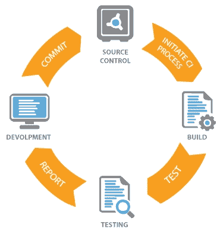

在现实世界的场景中，多个开发者正在同一个应用程序上工作。他们各自在自己的机器上独立工作。当他们对代码库进行更改时，他们会将其推送到他们使用的版本控制系统的仓库中。

现在，这个更改触发了我们集成到应用程序中的 CI 过程，自动运行测试套件并对我们更改的代码进行质量检查。

如果测试套件通过，则进入进一步测试完整应用程序的流程，并交给质量保证团队。

但是，如果测试失败，那么正在该应用程序上工作的开发者或整个团队都会收到通知。然后，负责该更改的开发者会进行必要的更改以修复错误，提交更改，并将修复后的代码更改推送到仓库。然后，重复同样的过程，直到测试通过。因此，如果有任何错误，它们会在早期被发现并修复。

# CI 的好处

现在我们已经了解了 CI 是什么以及为什么我们应该使用它，让我们来看看它带来的好处：

+   **自动构建和测试应用程序**：虽然预期开发者在将更改后的代码推送到仓库之前会构建应用程序并运行测试，但有时开发者可能会忘记。在这种情况下，集成持续集成过程有助于使流程自动化。

+   **增强部署信心**：由于 CI 会检查测试套件，并且我们可以配置它来检查代码库中代码的质量，因此我们不必担心在将代码推送到 GitHub 之前忘记运行测试。

+   **易于配置**：CI 非常容易配置。我们只需要创建一个包含所有配置的单个文件。

+   **错误报告**：这是 CI 的强大功能之一。当构建或运行测试时出现问题时，团队会收到通知。它还可以提供有关谁做了什么更改的信息，这非常棒。

# Travis CI 简介

现在我们已经了解了 CI，我们需要开始在应用程序中使用它。有许多技术可以用于跟踪任何应用程序的 CI 流程。有很多工具，每个都有其使用的优点；我们将为我们的应用程序选择的是 **Travis CI**。

Travis CI 是一种用于构建 CI 服务器的技术。Travis CI 与 GitHub 结合使用得非常广泛。还有一些其他工具。其中一些是：

+   Circle CI

+   Jenkins

+   Semaphore CI

+   Drone

如果你想了解更多关于每个选项的信息，这里有一些好的阅读材料：

[`blog.github.com/2017-11-07-github-welcomes-all-ci-tools/`](https://blog.github.com/2017-11-07-github-welcomes-all-ci-tools/)

Travis CI 用于为 GitHub 上的每次推送构建，并且设置起来非常简单。

# 在应用程序中设置 Travis

让我们继续到设置部分。这里要做的第一件事是查看 Travis CI 的官方网站 [`travis-ci.org/`](https://travis-ci.org/)。

# 激活仓库

我们需要先注册，这可以通过使用“GitHub 登录”轻松完成。完成之后，你应该能看到你现有的仓库列表。选择你想要设置 Travis CI 的应用程序，你将能够看到以下页面：

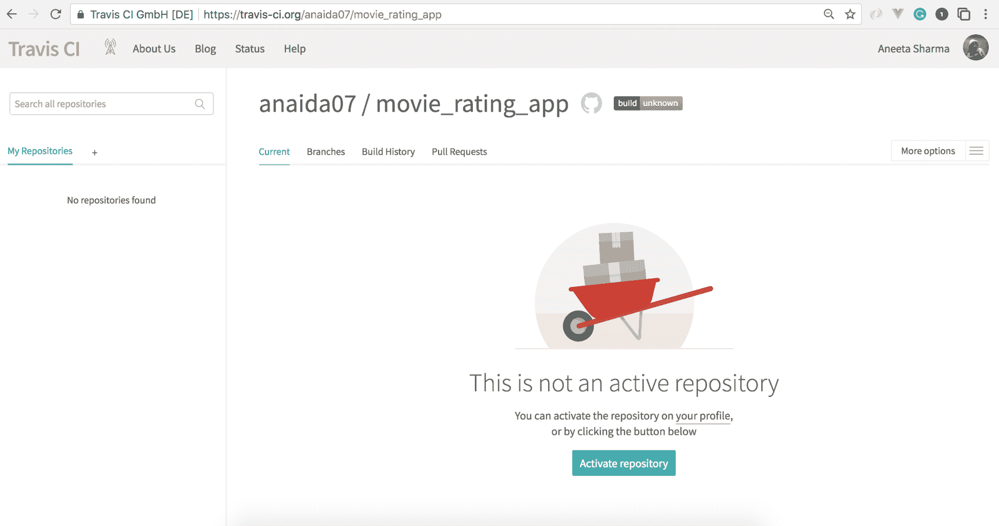

# 指定 Node.js 版本

现在，激活你想要添加 Travis CI 的仓库。我们可以在我们的个人资料中看到我们的仓库列表。选择应用程序并点击勾选标记以在仓库中激活 Travis CI。接下来，需要添加配置细节。首先，需要指定我们将为应用程序使用的 `node` 版本。

在应用程序的根目录中创建 `.travis.yml` 文件：

```js
// travis.yml
language: node_js
node_js:
 - "10.0.0"
```

现在，这个代码块表明这是一个 Node.js 项目，并且该项目的 Node.js 版本是 `10.0.0`。你必须指定应用程序中安装的 Node.js 版本。你可以使用以下命令检查版本：

```js
$ node -v 
```

你也可以在 `.travis.yml` 文件中指定相同的版本。

如果指定的版本不是 Node.js 的标准或可用版本，则会引发错误。

我们还可以在名为 `.nvmrc` 的文件中指定我们想要用于构建项目的 Node.js 版本。如果 `.travis.yml` 文件中没有指定版本，`travis.yml` 文件会读取此文件的内容。

# 构建脚本

现在的下一步是告诉 Travis 运行测试套件。这部分在 `.travis.yml` 文件中的 `script` 键中指定。Node.js 项目的默认构建脚本为 `npm test`。但让我们先从添加一个运行单个文件的命令开始，这样会更快。使用以下内容更新 `.travis.yml` 文件的内容：

```js
language: node_js
node_js:
  - "10.0.0"
script: npm run unit
```

这告诉 `script` 在对仓库进行任何更改时运行单元测试。

# 管理依赖项

下一步是安装依赖项。默认情况下，Travis CI 不会添加任何依赖项。以下命令告诉 Travis CI 在构建 `script` 之前下载依赖项。它使用 `npm` 安装依赖项，所以让我们添加一个 `script` 来安装这些依赖项：

```js
language: node_js
node_js:
  - "10.0.0"
before_script:
 - npm install
script: npm run unit
```

就这样。我们已经成功为我们的应用程序配置了 Travis CI。

现在，让我们提交并把这个文件推送到 GitHub。当你这样做时，检查 `travis.org` 上的分支以查看所有构建：

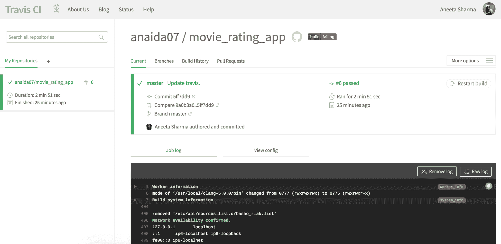

在这里，master 分支是我们添加了 Travis CI 构建并成功通过构建的分支。你可以通过点击构建来查看 `master` 分支的详细信息。

虽然查看构建是一个好的方法，但最好的方法是为每个分支创建一个 pull request，并查看该 pull request 中的构建是否通过或失败。所以，让我们创建一个新的 pull request 来看看我们如何最好地使用 Travis CI 来简化我们的生活。

让我们使用以下命令创建一个名为 `setup_travis` 的分支（你可以将分支命名为任何名称，但确保它表明了一个特定的更改，这样更容易识别该分支可以期待哪些更改）：

```js
$ git checkout -b setup_travis 
```

让我们对应用程序进行一些简单的修改，以便我们的 pull request 包含一些差异。

使用以下内容更新 `README.md` 文件：

```js
# movie_rating_app

> A Vue.js project

## Build Setup

``` bash

# 安装依赖项

npm install

# 在 localhost:8080 上提供带有热重载的服务

npm run dev

# 为生产构建并启用压缩

npm run build

# 为生产构建并查看包分析报告

npm run build --report

# 运行单元测试

npm run unit

# 运行端到端测试

npm run e2e

# 运行所有测试

npm test

```js
```

然后，使用以下命令对更改进行 `commit`：

```js
$ git add README.md
$ git commit -m 'Update readme'
```

最后，使用以下命令将更改推送到 GitHub：

```js
$ git push origin setup_travis
```

现在，如果我们访问这个应用程序的 GitHub 仓库页面，我们应该能看到以下内容：

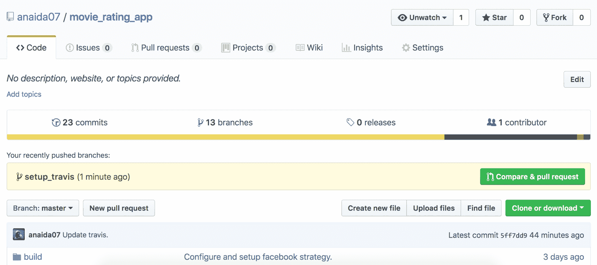

点击“比较与拉取请求”按钮。然后添加必要的描述并点击“创建拉取请求”按钮。

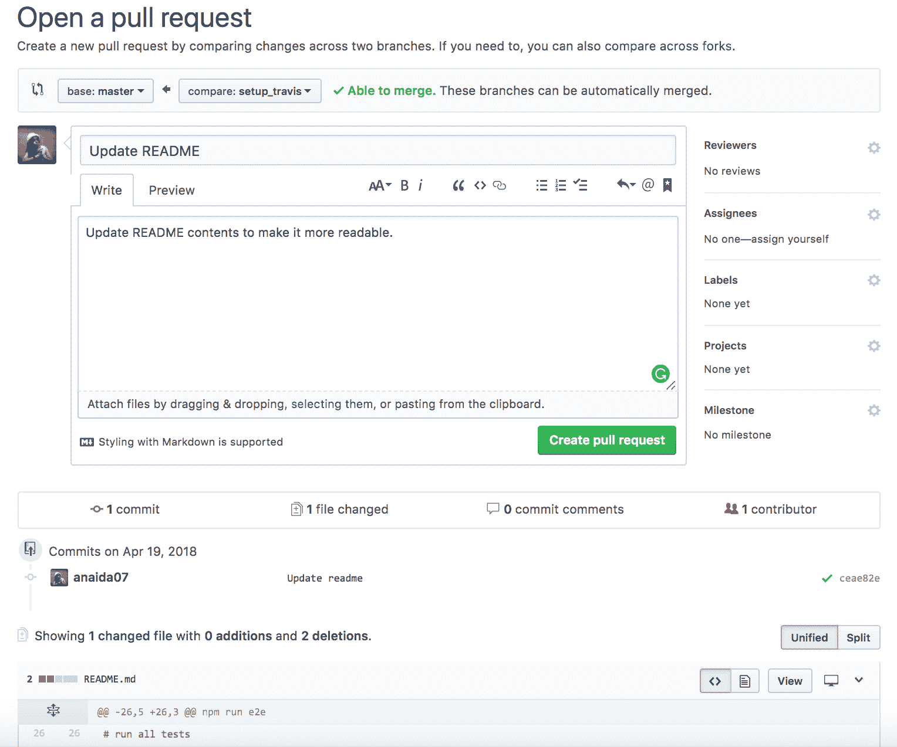

一旦您创建拉取请求，Travis CI 将开始构建应用程序，并且随着您继续添加更多提交并将更改推送到，Travis CI 将为每个提交构建应用程序。

在我们将任何更改推送到 GitHub 之前运行测试是一个好习惯，Travis CI 构建可以帮助通过为每个提交构建应用程序来通知我们是否有任何东西出错。

我们还可以添加设置，以便在构建失败或成功时通过电子邮件或其他机制通知我们。默认情况下，Travis CI 将通过电子邮件通知我们，如下面的截图所示：

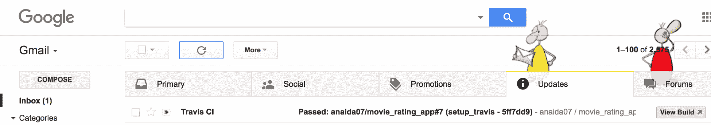

你可以看到这里 Travis CI 已经成功集成，并且测试也通过了：

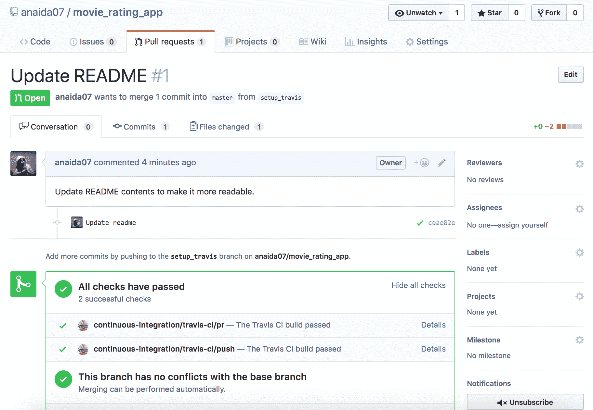

当我们点击“详情”时，我们可以看到构建的详细日志：

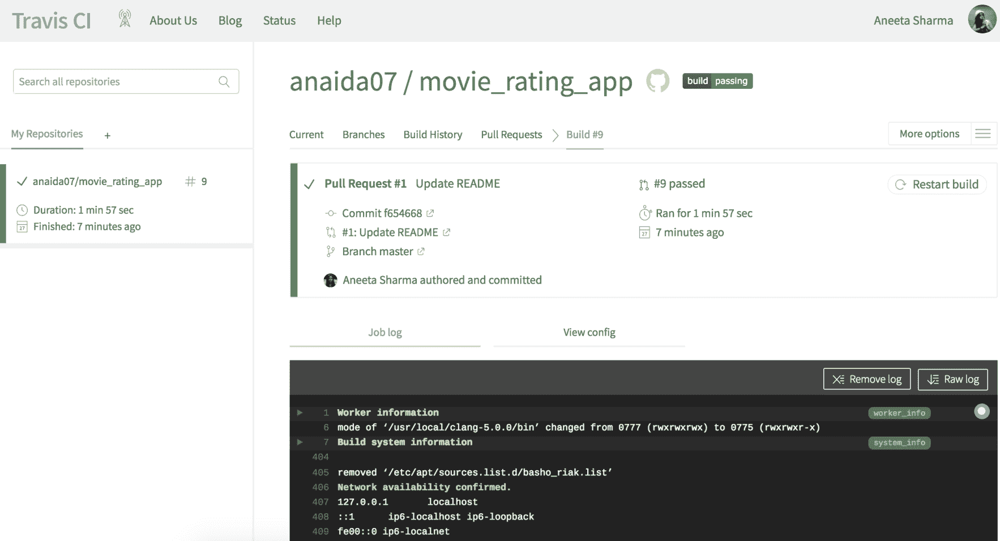

一旦我们对这些更改有信心，我们就可以将拉取请求合并到主分支：

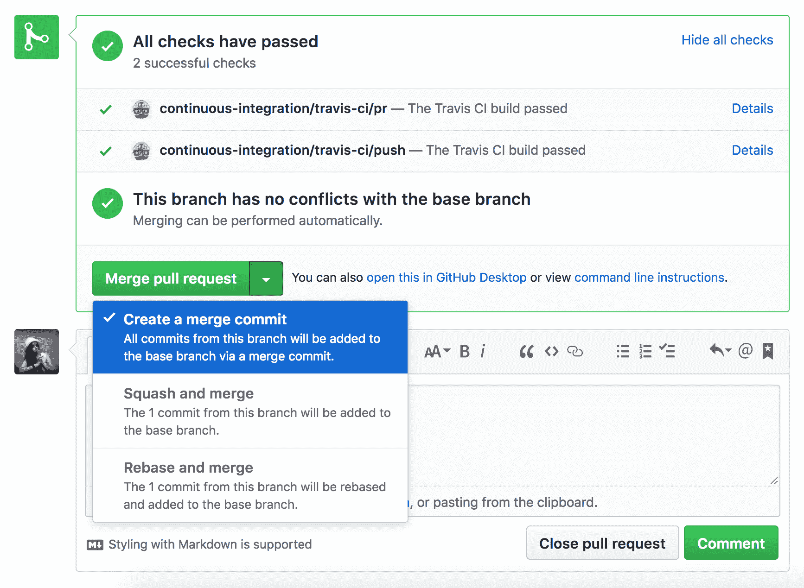

# Heroku 简介

开发应用程序的最后也是最重要的部分是将它部署。Heroku 是一个云平台即服务。这是一个我们可以托管我们应用程序的云平台。Heroku 是部署和管理我们应用程序的一种简单而优雅的方式。

使用 Heroku，我们可以部署用 Node.js 编写的应用程序，以及许多其他编程语言，如 Ruby、Java 和 Python。无论编程语言是什么，Heroku 应用程序的设置对所有语言都是相同的。

使用 Heroku 部署我们的应用程序有几种方式，例如使用 Git、GitHub、Dropbox 或通过 API。在本章中，我们将专注于使用 Heroku 客户端部署我们的应用程序。

# 设置 Heroku 账户

要开始在 Heroku 上部署应用程序，我们首先需要创建一个账户。您可以直接从 [`www.heroku.com/`](https://www.heroku.com/) 创建您的账户。如果您想了解更多关于不同类型应用程序的信息，您可以查看官方文档，网址为 [`devcenter.heroku.com/`](https://devcenter.heroku.com/)。

一旦您创建账户，您应该能看到自己的仪表板：

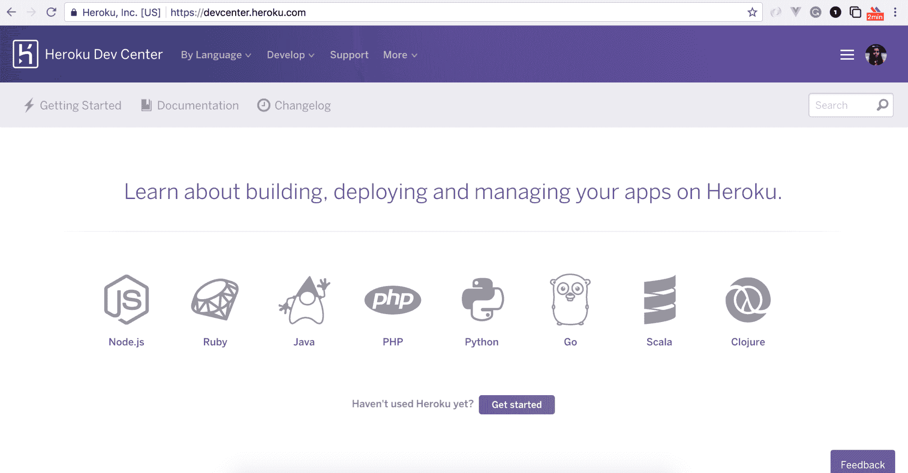

# 创建一个 Node.js 应用

Heroku 为我们将要构建的应用程序提供了很多选项。它支持 Node.js、Ruby、Java、PHP、Python、Go、Scala 和 Clojure。让我们继续从仪表板中选择 Node.js。

本文档本身将指导你在遵循每个步骤时。让我们继续并在 Heroku 上部署我们自己的应用程序。

# 安装 Heroku

首要的事情是安装 Heroku。

# 在 Windows 上安装 Heroku

我们可以通过从官方页面下载安装程序，[`devcenter.heroku.com/articles/heroku-cli#download-and-install`](https://devcenter.heroku.com/articles/heroku-cli#download-and-install)，并运行安装程序来在 Windows 上简单地安装 Heroku。

# 在 Linux 上安装 Heroku

Heroku 可以通过单个命令在 Linux 上安装：

```js
$ wget -qO- https://cli-assets.heroku.com/install-ubuntu.sh | sh
```

# 在 macOS X 上安装 Heroku

我们可以使用 `homebrew` 在 macOS 上安装 Heroku：

```js
$ brew install heroku/brew/heroku
```

我们可以使用以下命令检查 `Heroku` 是否已安装：

```js
$ heroku -v
```

这应该会打印出我们刚刚安装的 Heroku 版本。

# 部署到 Heroku

一旦安装了 Heroku，让我们转到 `https://dashboard.heroku.com/apps`，在那里我们将为我们的项目创建一个 Heroku 应用程序。点击创建新应用按钮，输入您想要提供给应用程序的应用程序名称。我们将为我们的应用程序命名为 `movie-rating-app-1`：

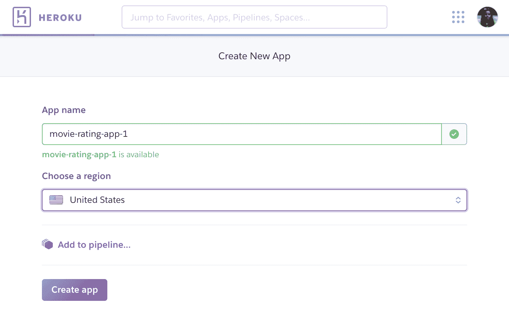

这将创建一个 Heroku 应用程序。现在，让我们切换到终端中的我们的应用程序并运行以下命令：

```js
$ cd movie_rating_app
$ heroku login
```

此命令将提示您输入您的电子邮件和密码：

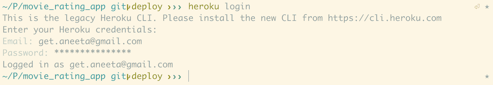

现在，如果您已经在您的应用中初始化了 Git 仓库，您可以在以下代码片段中跳过 `git init` 部分：

```js
$ git init
$ heroku git:remote -a movie-rating-app-1
```

此命令将把我们应用链接到我们刚刚创建的 Heroku 应用程序。

设置部分已完成。现在，我们可以继续在我们的应用程序中进行一些更改。像之前一样提交到 GitHub 仓库，并推送更改。

现在部署到 Heroku 应用的简单命令是运行以下命令：

```js
$ git push heroku master
```

在这里，我们需要注意几件事情。

由于我们通过在 `server.js` 中使用 `serve-static` 包将 Vue.js 组件转换为静态文件来提供 Vue.js 组件，因此我们需要更新 `package.json` 中的启动脚本以运行 `node` 服务器。让我们在 `package.json` 中更新启动脚本，添加以下行：

```js
"scripts": {
    "dev": "webpack-dev-server --inline --progress --config build/webpack.dev.conf.js",
    "start": "nodemon server.js",
    "unit": "cross-env BABEL_ENV=test karma start test/unit/karma.conf.js --single-run",
    "e2e": "node test/e2e/runner.js",
    "test": "npm run unit && npm run e2e",
    "lint": "eslint --ext .js,.vue src test/unit test/e2e/specs",
    "build": "node build/build.js",
    "heroku-postbuild": "npm install --only=dev --no-shrinkwrap && npm run build"
  },
```

此外，在 `config/Config.js` 文件中，我们有以下内容：

```js
module.exports = {
  DB: 'mongodb://localhost/movie_rating_app',
  SECRET: 'movieratingappsecretkey',
  FACEBOOK_APP_ID: <facebook_client_id>,
  FACEBOOK_APP_SECRET: <facebook_client_secret>,
  TWITTER_APP_ID: <twitter_consumer_id>,
  TWITTER_APP_SECRET: <twitter_consumer_secret>,
  GOOGLE_APP_ID: <google_consumer_id>,
  GOOGLE_APP_SECRET: <google_consumer_secret>,
  LINKEDIN_APP_ID: <linkedin_consumer_id>,
  LINKEDIN_APP_SECRET: <linkedin_consumer_secret>
}
```

在这里，我们指定了本地 MongoDB URL，当我们在 Heroku 上托管我们的应用程序时将不起作用。为此，我们可以使用一个名为 **mLab** 的工具。mLab 是 MongoDB 的数据库即服务工具。mLab 允许我们为沙盒数据库创建任意数量的数据库。

让我们继续创建一个 [`mlab.com/`](https://mlab.com/) 上的账户。登录后，点击创建新按钮以创建一个新的数据库：

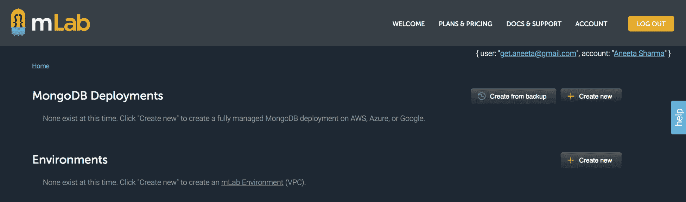

我们可以选择我们想要的任何云服务提供商。选择计划类型为沙盒，然后点击 CONTINUE。选择任何区域，然后点击 CONTINUE 并添加您想要的应用程序数据库名称。最后，点击提交订单：

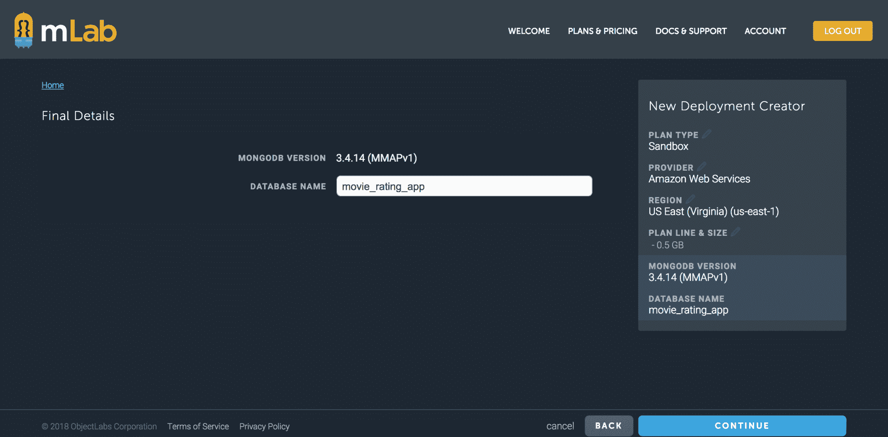

现在，如果我们点击数据库名称，我们可以看到 mLab 提供的 MongoDB URL 的链接。我们还需要创建一个数据库用户，以便能够对数据库进行认证。

前往用户选项卡，点击添加数据库用户，提供用户名和密码，然后点击创建。

我们应该能够在数据库配置页面中看到 MongoDB URL：

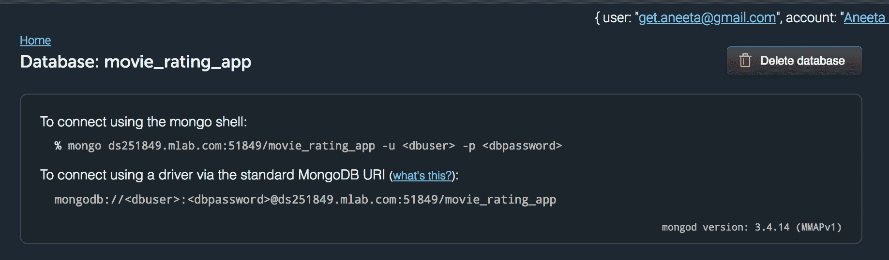

让我们更新我们的`config/Config.js`中的 MongoDB URL：

```js
module.exports = {
  mongodb://<dbuser>:<dbpassword>@ds251849.mlab.com:51849/movie_rating_app
  SECRET: 'movieratingappsecretkey',
  FACEBOOK_APP_ID: <facebook_client_id>,
  FACEBOOK_APP_SECRET: <facebook_client_secret>,
  TWITTER_APP_ID: <twitter_consumer_id>,
  TWITTER_APP_SECRET: <twitter_consumer_secret>,
  GOOGLE_APP_ID: <google_consumer_id>,
  GOOGLE_APP_SECRET: <google_consumer_secret>,
  LINKEDIN_APP_ID: <linkedin_consumer_id>,
  LINKEDIN_APP_SECRET: <linkedin_consumer_secret>
}
```

我们需要更改的最后一件事是应用程序的端口。Heroku 应用程序在部署应用程序时会自动分配一个端口。我们只应使用开发环境的端口`8081`。因此，让我们验证我们的`server.js`是否具有以下代码：

```js
const port = process.env.PORT || 8081;
app.use('/', router);
var server = app.listen(port, function() {
  console.log(`api running on port ${port}`);
});

module.exports = server
```

现在，让我们提交并推送更改到`master`分支，然后再次部署：

```js
$ git add package.json config/Config.js server.js
$ git commit 'Update MongoDB url and app port'
$ git push origin master
$ git push heroku master
```

应用程序应该已成功部署到 Heroku，我们应该能够在[`movie-rating-app-1.herokuapp.com/`](https://movie-rating-app-1.herokuapp.com/)查看我们的应用程序：

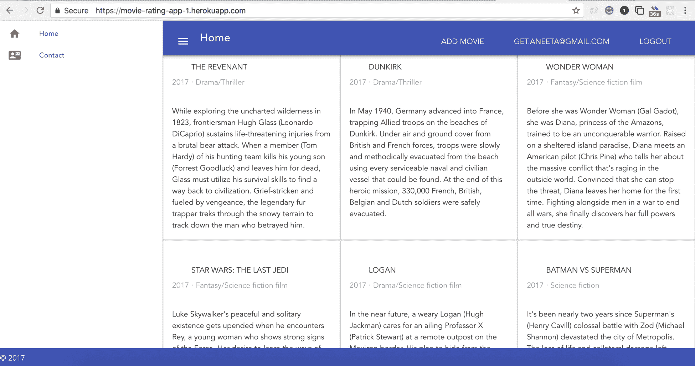

# Heroku 错误日志

如果我们在 Heroku 部署时出现问题，我们还可以查看 Heroku 提供的以下命令的错误日志：

```js
$ heroku logs -t
```

# 摘要

在本章中，我们学习了什么是 CI 以及如何使用它使应用程序的构建自动化。我们还学习了如何使用 Heroku 集成部署应用程序。总的来说，我们学习了如何使用 Vue.js 和 Node.js 技术构建全栈 Web 应用程序，我们集成了不同的认证机制，我们还学习了如何为应用程序编写测试以及如何部署应用程序。恭喜！

这只是您将要继续前进的旅程的开始。现在，您应该能够使用我们在这里学习到的所有技术构建从小到大的应用程序。

本书已为您提供使用 MEVN 堆栈以 JavaScript 作为唯一编程语言构建应用程序的技能。如果您计划构建自己的完整应用程序，这将是一个很好的开始。希望您喜欢阅读这本书，并且继续构建出色的应用程序！
