# 第一章. 什么是 Flux？

Flux 应该是一种构建复杂用户界面的新方法，这种方法可以很好地扩展。至少，这是关于 Flux 的一般信息，如果你只是浏览互联网文献。但是，我们如何定义这种“构建用户界面的新方法”呢？是什么让它优于其他更成熟的前端架构？

本章的目的是透过销售要点，明确说明 Flux 是什么，以及它不是什么，通过观察 Flux 提供的模式来实现。由于 Flux 在传统意义上不是一个软件包，我们将探讨我们试图用 Flux 解决的问题的概念性问题。

最后，我们将通过介绍任何 Flux 架构中找到的核心组件来结束本章，并立即安装 Flux 的`npm`包，编写一个 hello world 的 Flux 应用程序。让我们开始吧。

# Flux 是一套模式

我们可能首先应该澄清一个严峻的现实——Flux 不是一个软件包。它是一套我们应遵循的架构模式。虽然这可能会让一些人感到失望，但不要绝望——不实现另一个框架有很好的理由。在本书的整个过程中，我们将看到 Flux 作为一套模式而不是既定实现存在的价值。现在，我们将探讨 Flux 实施的一些高级架构模式。

## 数据输入点

在使用传统方法构建前端架构时，我们并没有太多考虑数据如何进入系统。我们可能会考虑数据输入点的概念，但不会详细考虑。例如，在**MVC**（**模型-视图-控制器**）架构中，控制器应该控制数据的流动。在大多数情况下，它确实做到了这一点。另一方面，控制器实际上只是控制数据到来之后发生的事情。控制器最初是如何获得数据的呢？考虑以下插图：

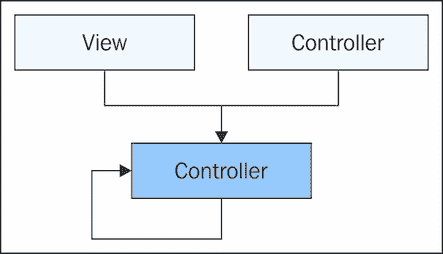

初看这幅图，似乎没有什么问题。数据流，由箭头表示，很容易跟随。但是数据从哪里来呢？例如，视图可以创建新数据并将其传递给控制器，作为对用户事件的响应。控制器可以创建新数据并将其传递给另一个控制器，这取决于我们控制器层次结构的组成。那么，关于这个特定的控制器——它能否自己创建数据然后使用它呢？

在这样的图表中，这些问题并没有多少价值。但是，如果我们试图扩展一个架构以包含数百个这样的组件，数据进入系统的点就变得非常重要。由于 Flux 用于构建可扩展的架构，它将数据输入点视为一个重要的架构模式。

## 状态管理

状态是我们在前端开发中需要应对的现实之一。不幸的是，我们不能因为两个原因而将整个应用程序完全由没有副作用的纯函数组成。首先，我们的代码需要以某种方式与 DOM 接口交互。这就是用户看到 UI 变化的方式。其次，我们并不将所有应用数据都存储在 DOM 中（至少我们不应该这样做）。随着时间的推移和用户与应用程序的交互，这些数据将发生变化。

在 Web 应用程序中管理状态没有一刀切的方法，但有一些方法可以限制可能发生的状态改变的数量，并强制规定它们如何发生。例如，纯函数不会改变任何东西的状态，它们只能创建新的数据。以下是一个这样的例子：

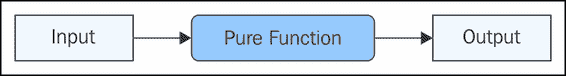

如您所见，纯函数没有副作用，因为调用它们不会导致任何数据状态改变。那么，如果状态改变是不可避免的，为什么这是一个期望的特性呢？其理念是强制规定状态改变发生的*位置*。例如，我们可能只允许某些类型的组件改变应用数据的状态。这样，我们可以排除几个可能成为状态改变原因的来源。

Flux 非常注重控制状态改变发生的位置。在章节的后面部分，我们将看到 Flux 存储如何管理状态改变。Flux 管理状态的重要之处在于它是在架构层处理的。与规定哪些组件类型允许修改应用数据的一套规则的方法相比——事情会变得混乱。在 Flux 中，猜测状态改变发生的位置的空间更小。

## 保持更新同步

与数据输入点相辅相成的是更新同步性的概念。也就是说，除了管理状态改变起源的位置外，我们还需要管理这些改变相对于其他事物的顺序。如果数据输入点是我们的数据的*什么*，那么在系统中同步应用所有数据的状态改变就是*何时*。

让我们思考一下这为什么很重要。在一个数据异步更新的系统中，我们必须考虑到竞争条件。竞争条件可能是有问题的，因为一块数据可能依赖于另一块，如果它们以错误的顺序更新，我们就会看到从组件到组件的级联问题。看看这个图表，它说明了这个问题：

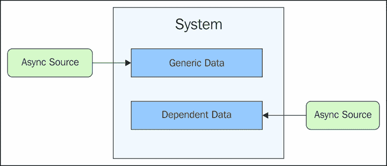

当某事是异步的，我们就无法控制它何时改变状态。因此，我们所能做的就是等待异步更新发生，然后遍历我们的数据，确保所有数据依赖都得到满足。如果没有自动处理这些依赖的工具，我们最终会编写大量的状态检查代码。

Flux 通过确保跨我们的数据存储发生的更新是同步的来解决此问题。这意味着前面图中展示的场景是不可能的。以下是 Flux 如何处理 JavaScript 应用程序中典型的数据同步问题的更好可视化：

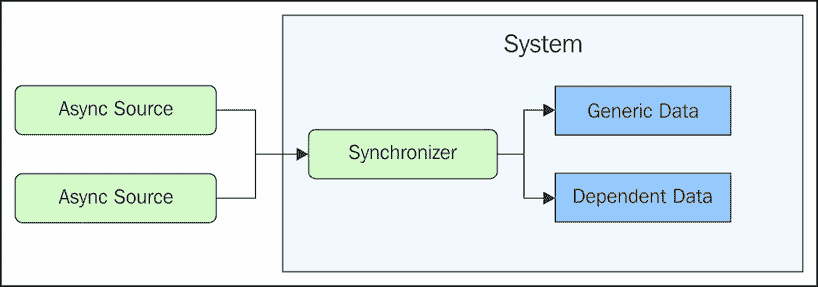

## 信息架构

很容易忘记我们在信息技术领域工作，我们应该围绕信息构建技术。然而，近年来，我们似乎走向了另一个方向，即在考虑信息之前被迫考虑实现。很多时候，我们应用程序使用的源数据中暴露的数据并不包含用户所需的内容。这取决于我们的 JavaScript 将原始数据转换为用户可消费的内容。这就是我们的信息架构。

这是否意味着 Flux 是用来设计信息架构而不是软件架构的？这根本不是事实。实际上，Flux 组件被实现为真正的软件组件，它们执行实际的计算。诀窍在于 Flux 模式使我们能够将信息架构视为一等的设计考虑因素。我们不必筛选各种组件及其实现问题，而可以确保我们向用户提供正确的信息。

当我们的信息架构成形后，我们的应用程序的更大架构也随之而来，作为我们试图向用户传达的信息的自然扩展。从数据中产生信息是困难的部分。我们必须将许多数据源提炼成不仅包含信息，而且对用户有价值的信息。做错这一点对任何项目都是一个巨大的风险。当我们做对的时候，我们就可以继续处理特定的应用程序组件，比如按钮小部件的状态等等。

Flux 架构将数据转换限制在其存储中。存储是一个信息工厂——原始数据进入，新的信息出来。存储控制数据如何进入系统，状态变化的同步性，以及它们定义状态变化的方式。当我们随着本书的进展更深入地探讨存储时，我们将看到它们是如何成为我们信息架构的支柱的。

# Flux 不是另一个框架

现在我们已经探索了一些 Flux 的高级模式，是时候重新审视这个问题了：Flux 究竟是什么？嗯，它只是一套我们可以应用于前端 JavaScript 应用程序的架构模式。Flux 之所以能够很好地扩展，是因为它将信息放在首位。信息是软件中最难扩展的方面；Flux 直面信息架构问题。

那么，为什么 Flux 模式不以框架的形式实现？这样，Flux 将为每个人提供一个标准实现；并且像任何其他大型开源项目一样，随着时间的推移，随着项目的成熟，代码会得到改进。

主要问题是 Flux 在架构层面运作。它用于解决防止特定应用程序扩展以满足用户需求的信息问题。如果 Facebook 决定将 Flux 作为另一个 JavaScript 框架发布，它可能会遇到其他框架中普遍存在的相同类型的实现问题。例如，如果框架中的某些组件没有以最适合我们正在工作的项目的方式进行实现，那么在不破坏框架的情况下实现更好的替代方案并不容易。

Flux 的优点在于，Facebook 决定将实现选项留给了我们。他们确实提供了一些 Flux 组件实现，但这些是参考实现。它们是功能性的，但目的是它们是我们理解诸如派发器等事物预期如何工作的起点。我们可以自由地实现我们看到的相同的 Flux 架构模式。

Flux 不是一个框架。这意味着我们必须自己实现一切吗？不，我们不必这样做。实际上，开发者正在实现 Flux 库，并将它们作为开源项目发布。一些 Flux 库更紧密地遵循 Flux 模式，而其他则不是。这些实现是有偏见的，如果它们适合我们正在构建的内容，使用它们是没有问题的。Flux 模式旨在用 JavaScript 开发解决通用概念性问题，所以在深入 Flux 实现讨论之前，你会了解它们是什么。

# Flux 解决概念性问题

如果 Flux 仅仅是一系列架构模式而不是一个软件框架，那么它解决了哪些问题？在本节中，我们将从架构的角度探讨 Flux 解决的一些概念性问题。这包括单向数据流、可追溯性、一致性、组件分层和松散耦合的组件。这些概念性问题中的每一个都对我们软件的某些方面构成了一定的风险，特别是其可扩展性。Flux 帮助我们提前解决这些问题，在我们构建软件的过程中。

## 数据流方向

我们正在创建一个信息架构来支持最终将位于这个架构之上的功能丰富的应用程序。数据流入系统，最终会达到一个端点，终止数据流。在入口点和终止点之间发生的事情决定了 Flux 架构中的数据流。这在此处得到了说明：

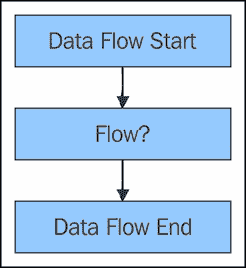

数据流是一个有用的抽象，因为它很容易将数据视为它进入系统并在一个点到另一个点之间移动。最终，流动会停止。但在它停止之前，沿途会发生几个副作用。我们关注的是前面图中的中间块，因为我们不知道数据流是如何到达终点的。

假设我们的架构对数据流没有任何限制。任何组件都可以将数据传递给任何其他组件，无论该组件位于何处。让我们尝试可视化这个设置：

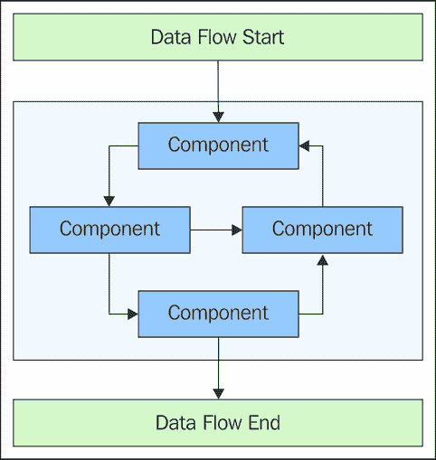

如您所见，我们的系统对我们的数据有明确的入口和出口点。这是好事，因为它意味着我们可以自信地说数据流通过我们的系统。这幅图的问题在于数据流在系统组件之间的流动方式。没有方向，或者说，它是*多向的*。这不是好事。

Flux 是一种*单向*数据流架构。这意味着前面的组件布局是不可能的。问题是——这有什么关系？有时，能够以任何方向传递数据可能看起来很方便，也就是说，从任何组件到任何其他组件。这本身并不是问题——仅仅传递数据本身并不会破坏我们的架构。然而，当数据以多个方向在我们的系统中移动时，组件之间失去同步的机会就更多了。这仅仅意味着如果数据不总是朝同一方向移动，就总有可能出现排序错误。

Flux 强制数据流的方向，从而消除了组件以破坏系统顺序的方式自行更新的可能性。无论什么数据刚刚进入系统，它总是会按照与其他任何数据相同的顺序通过系统，如下所示：

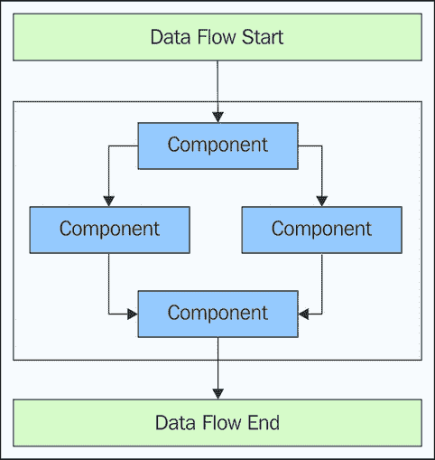

## 可预测的根本原因

当数据以一个方向进入我们的系统并通过我们的组件流动时，我们可以更容易地将任何影响追溯到其根本原因。相比之下，当一个组件向任何其他组件发送数据，而这些组件位于任何架构层时，确定数据如何到达目的地就困难得多。这有什么关系？调试器足够复杂，我们可以在运行时轻松地穿越任何复杂度。这个概念的问题在于它假设我们只需要追踪代码中的行为以进行调试。

Flux 架构具有固有的可预测数据流。这对于许多设计活动来说很重要，而不仅仅是调试。在 Flux 应用程序上工作的程序员将开始直观地感觉到将要发生的事情。预期是关键，因为它让我们在遇到它们之前避免设计死胡同。当原因和结果容易分辨时，我们可以花更多的时间专注于构建应用程序功能——客户关心的事情。

## 一致的提醒

在 Flux 架构中，我们从组件到组件传递数据的方向应该是一致的。在一致性的方面，我们还需要考虑用于在系统中移动数据的机制。

例如，发布/订阅（pub/sub）是用于组件间通信的一种流行机制。这种方法的优点在于，我们的组件可以相互通信，同时我们还能保持一定程度的解耦。实际上，这在前端开发中相当常见，因为组件通信主要是由用户事件驱动的。这些事件可以被视为一次性触发。任何其他想要以某种方式对这些事件做出响应的组件，都需要自行订阅特定的事件。

虽然 pub/sub 确实有一些不错的特性，但它也带来了架构挑战，特别是扩展复杂性。例如，假设我们刚刚为新的功能添加了几个新组件。那么，这些组件相对于现有组件接收更新消息的顺序是什么？它们是在所有现有组件之后被通知的吗？它们应该排在第一位吗？这提出了数据依赖性扩展问题。

Pub/Sub（发布/订阅）的另一个挑战是发布的事件通常非常细粒度，以至于我们可能想要订阅这些通知，然后在之后取消订阅。这导致了一致性挑战，因为当系统中存在大量组件时，尝试编码生命周期变化是困难的，并且会错过事件的机会。

Flux 的想法是通过维护一个静态的组件间消息基础设施来规避问题，该基础设施向每个组件发布通知。换句话说，程序员不能选择他们的组件将订阅哪些事件。相反，他们必须弄清楚哪些被发送给他们的事件是相关的，忽略其余的。以下是 Flux 向组件分发事件的可视化：

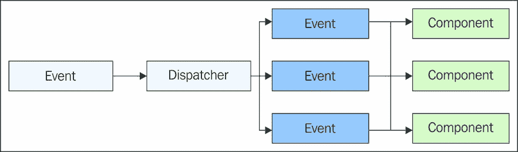

Flux 调度器将事件发送到每个组件；这是无法避免的。我们不是试图调整难以扩展的消息基础设施，而是在组件内部实现逻辑以确定消息是否感兴趣。同样，我们可以在组件内部声明对其他组件的依赖，这有助于影响消息的顺序。我们将在后面的章节中更详细地介绍这一点。

## 简单的架构层次

层次结构可以是一种组织组件架构的绝佳方式。一方面，它是一种显而易见的方式来对构成我们应用程序的各种组件进行分类。另一方面，层次结构充当了限制通信路径的手段。这一点对于 Flux 架构尤其相关，因为数据流向一个方向是很重要的。相对于单个组件，对层次结构应用约束要容易得多。以下是一个 Flux 层次的示例：

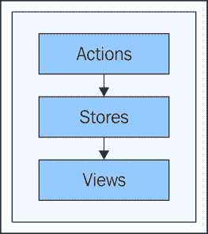

### 注意

此图并不是为了捕捉 Flux 架构的整个数据流，而是展示数据如何在主要三个层次之间流动。它也没有提供关于层次结构中内容的任何细节。请放心，下一节将介绍 Flux 组件的类型及其在层次结构之间的通信，这是本书的重点。

如您所见，数据流从一个层次流向下一个层次，方向一致。Flux 只有几个层次，并且随着我们的应用程序在组件数量方面进行扩展，层次数量保持不变。这为向已经很大的应用程序添加新功能涉及的复杂性设置了上限。除了限制层次数量和数据流向之外，Flux 架构对哪些层次可以相互通信也非常严格。

例如，动作层可以与视图层通信，而我们仍然在向一个方向移动。我们仍然会有 Flux 期望的层次结构。然而，跳过这样的层次是禁止的。通过确保层次结构只与直接下方的层次结构通信，我们可以排除因顺序不当而引入的 bug。

## 松散耦合的渲染

Flux 设计者做出的一个引人注目的决定是，Flux 架构并不关心 UI 元素是如何渲染的。也就是说，视图层与架构的其他部分松散耦合。这有很好的理由。

Flux 首先是一个信息架构，其次才是软件架构。我们从这个开始，逐步过渡到后者。视图技术的挑战在于它可能会对整个架构产生负面影响。例如，一个视图有与 DOM 交互的特定方式。如果我们已经决定了这项技术，我们最终会让它影响我们的信息架构结构。这并不一定是坏事，但它可能导致我们在最终向用户展示的信息上做出妥协。

我们真正应该考虑的是信息本身以及这些信息随时间的变化。涉及哪些动作导致了这些变化？一条数据如何依赖于另一条数据？Flux 自然地摆脱了当时浏览器技术的限制，以便我们首先关注信息。随着它演变成一个软件产品，很容易将视图插入到我们的信息架构中。

# 流量组件

在本节中，我们将开始探索 Flux 的概念。这些概念是构建 Flux 架构的基本成分。虽然没有详细说明这些组件应该如何实现，但它们仍然为我们实现奠定了基础。这是对我们将在这本书中实现的所有组件的高级介绍。

## 动作

动作是系统的*动词*。实际上，如果我们直接从句子中推导出动作的名称，这很有帮助。这些句子通常是功能声明——我们希望应用程序执行的操作。以下是一些例子：

+   获取会话

+   导航到设置页面

+   过滤用户列表

+   切换详细信息的可见性

这些是应用程序的简单功能，当我们将其作为 Flux 架构的一部分实现时，动作是起点。这些可读的动作声明通常需要在系统其他地方实现其他新组件，但第一步始终是动作。

那么，Flux 动作究竟是什么呢？在最简单的情况下，动作不过是一个字符串——一个帮助识别动作目的的名称。更典型的是，动作由*名称*和*负载*组成。现在不必担心负载的具体细节——就动作而言，它们只是被传递到系统中的不透明数据块。换句话说，动作就像邮件包裹。我们的 Flux 系统的入口点不关心包裹的内部结构，只关心它们能否到达目的地。以下是一个动作进入 Flux 系统的示意图：

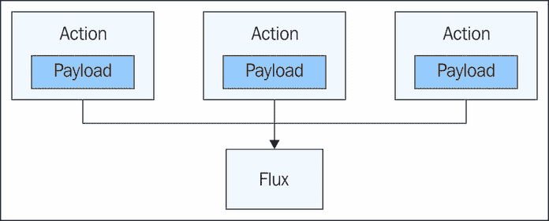

这张图可能会给人一种动作是 Flux 外部的感觉，但实际上它们是系统的一个组成部分。这种观点有价值的原因在于它迫使我们把动作视为将新数据输入系统的唯一手段。

### 注意

**黄金 Flux 规则**：如果不是行动，就无法发生。

## 调度器

在 Flux 架构中，调度器负责将行动分发到存储组件（我们将在下一节讨论存储）。调度器实际上有点像经纪人——如果行动想要将新数据传递给存储，它们必须与经纪人交谈，以便找出最佳传递方式。想想像 RabbitMQ 这样的系统中的消息经纪人。它是所有消息在真正传递之前发送到的中心枢纽。以下是描述 Flux 调度器接收行动并将它们分发给存储的图示：

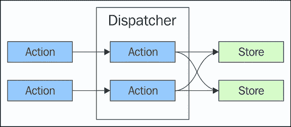

本章的早期部分——“简单的架构层”——没有为调度器设置一个明确的层。这是故意的。在 Flux 应用中，只有一个调度器。它更像是伪层而不是明确层。我们知道调度器在那里，但它不是这个抽象级别的必需品。我们在架构层面关心的是确保当某个特定的行动被调度时，我们知道它将到达系统中的每个存储。

话虽如此，调度器在 Flux 的工作方式中起着至关重要的作用。它是注册存储回调函数的地方，也是处理数据依赖的地方。存储告诉调度器它依赖的其他存储，而调度器负责确保这些依赖得到适当处理。

### 注意

**黄金 Flux 规则**：调度器是数据依赖的最终仲裁者。

## 存储

在 Flux 应用中，存储是保持状态的地方。通常，这意味着从 API 发送到前端的应用数据。然而，Flux 存储更进一步，明确地模拟整个应用的状态。如果这听起来很困惑或者像是一个普遍的坏主意，不用担心——随着我们进入后续章节，我们会澄清这一点。现在，只需知道存储是重要状态可以找到的地方。其他 Flux 组件没有状态——它们在代码级别有隐式状态，但我们对此不感兴趣，从架构的角度来看。

行动是系统中新数据进入的传递机制。术语“新数据”并不意味着我们只是将其附加到存储中的某个集合。所有进入系统的数据都是新的，因为在意义上它还没有被作为行动发出——实际上它可能导致存储状态改变。让我们看看一个导致存储状态改变的行动的可视化：

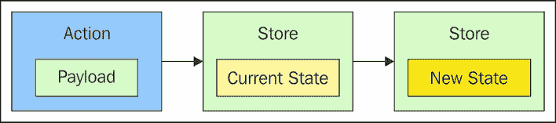

存储如何改变状态的关键方面是没有任何外部逻辑决定状态变化应该发生。只有存储，并且只有存储，才会做出这个决定并执行状态转换。这一切都紧密封装在存储中。这意味着当我们需要推理特定信息时，我们不需要再往其他地方看，只需查看存储即可。他们是自己的老板——他们是自雇的。

### 注意

**黄金 Flux 规则**：状态存储在存储中，只有存储本身可以改变这种状态。

## 视图

在本节中，我们将要查看的最后一个 Flux 组件是视图，从技术上讲，它甚至不是 Flux 的一部分。同时，视图显然是我们应用程序的一个关键部分。视图几乎被普遍理解为负责向用户显示数据的架构部分——它是数据流通过我们的信息架构的最后一站。例如，在 MVC 架构中，视图接收模型数据并显示它。从这个意义上说，基于 Flux 的应用程序中的视图与 MVC 视图并没有太大的不同。它们之间的显著差异在于处理事件的方式。让我们看一下以下图表：

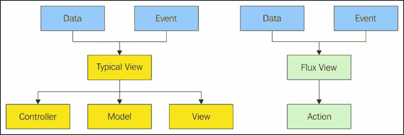

在这里，我们可以看到 Flux 视图与典型 MVC 架构中找到的视图组件的对比责任。这两种视图类型接收到的数据类型相似——用于渲染组件的应用数据以及事件（通常是用户输入）。这两种类型视图之间的不同之处在于它们流出的内容。

典型的视图在事件处理函数如何与其他组件通信方面并没有任何限制。例如，在用户点击按钮的响应中，视图可以直接在控制器上调用行为，改变模型的状态，或者它可能查询另一个视图的状态。另一方面，Flux 视图只能分派新的动作。这保持了我们的系统单入口的完整性和一致性，与其他想要改变我们存储数据状态的机制相一致。换句话说，API 响应更新状态的方式与用户点击按钮的方式完全相同。

由于在 Flux 架构中，视图应该限制数据流出的方式（除了 DOM 更新），因此人们可能会认为视图应该是一个实际的 Flux 组件。这在某种程度上是有道理的，因为使动作成为视图的唯一可能选项。然而，也没有理由我们现在不能强制执行这一点，好处是 Flux 可以完全专注于创建信息架构。

然而，请记住，Flux 仍然处于起步阶段。随着越来越多的人开始采用 Flux，无疑会有外部影响。也许 Flux 将来会对视图有所评论。在此之前，视图存在于 Flux 之外，但受到 Flux 单向特性的限制。

### 注意

**黄金 Flux 规则**：数据从视图中流出的唯一方式是通过分发一个动作。

# 安装 Flux 包

我们将通过编写一些代码来结束第一章，因为每个人都需要一个基础的好莱坞应用。我们还将完成一些样板代码的设置任务，因为我们将在整个书中使用类似的设置。

### 注意

我们将跳过 Node + NPM 的安装说明，因为互联网上已经有很多详细的覆盖。我们将假设从现在开始 Node 已经安装并准备就绪。

我们首先需要安装的 NPM 包是 Webpack。这是一个适用于现代 JavaScript 应用（包括基于 Flux 的应用）的高级模块打包器。我们希望全局安装此包，以便`webpack`命令可以在我们的系统上安装：

```js
npm install webpack -g

```

在 Webpack 配置就绪的情况下，我们可以构建本书附带的所有代码示例。然而，我们的项目需要安装几个本地的 NPM 包，这些包可以按照以下步骤安装：

```js
npm install flux babel-core babel-loader babel-preset-es2015 --save-dev

```

`--save-dev`选项将这些开发依赖项添加到我们的文件中，如果存在的话。这只是开始——手动安装这些包来运行本书中的代码示例并不是必需的。你下载的示例已经包含了`package.json`文件，因此要安装本地依赖项，只需在`package.json`文件所在的目录中运行以下命令：

```js
npm install

```

现在，可以使用`webpack`命令来构建示例。这是第一章中唯一的示例，因此很容易在终端窗口中导航并运行`webpack`命令，该命令会构建`main-bundle.js`文件。如果你打算玩转代码，这显然是被鼓励的，可以尝试运行`webpack --watch`。这个命令的后者形式将监视用于构建的文件的变化，并在它们发生变化时运行构建。

这确实是一个简单的 hello world，让我们能够顺利地开始阅读本书的其余部分。我们已经通过安装 Webpack 及其支持模块来处理了所有样板设置任务。现在让我们看看代码。我们将从使用的标记开始看起。

```js
<!doctype html>
<html>
  <head>
    <title>Hello Flux</title>
    <script src="img/main-bundle.js" defer></script>
  </head>
  <body></body>
</html>
```

这并没有什么复杂的地方，对吧？甚至`body`标签内也没有内容。重要的是`main-bundle.js`脚本——这是 Webpack 为我们构建的代码。现在让我们看看这段代码：

```js
// Imports the "flux" module.
import * as flux from 'flux';

// Creates a new dispatcher instance. "Dispatcher" is
// the only useful construct found in the "flux" module.
const dispatcher = new flux.Dispatcher();

// Registers a callback function, invoked every time
// an action is dispatched.
dispatcher.register((e) => {
  var p;

  // Determines how to respond to the action. In this case,
  // we're simply creating new content using the "payload"
  // property. The "type" property determines how we create
  // the content.
  switch (e.type) {
    case 'hello':
      p = document.createElement('p');
      p.textContent = e.payload;
      document.body.appendChild(p);
      break;
    case 'world':
      p = document.createElement('p');
      p.textContent = `${e.payload}!`;
      p.style.fontWeight = 'bold';
      document.body.appendChild(p);
      break;
    default:
      break;
  }
});

// Dispatches a "hello" action.
dispatcher.dispatch({
  type: 'hello',
  payload: 'Hello'
});

// Dispatches a "world" action.
dispatcher.dispatch({
  type: 'world',
  payload: 'World'
});
```

如您所见，这个 hello world Flux 应用并没有什么复杂的地方。实际上，这段代码创建的唯一 Flux 特定组件是一个分发器。然后它分发几个动作，注册到存储中的处理函数处理这些动作。

不要担心这个示例中没有存储或视图。我们的想法是，我们已经安装并准备好了基本的 Flux NPM 包。

# 概述

本章向您介绍了 Flux。具体来说，我们探讨了 Flux 是什么以及它不是什么。Flux 是一套架构模式，当应用于我们的 JavaScript 应用程序时，有助于正确处理架构中的数据流方面。Flux 并不是用于解决特定实现挑战的另一个框架，无论是浏览器怪癖还是性能提升——已有众多工具可用于这些目的。也许 Flux 最重要的定义特征是它解决的问题的概念性——比如单向数据流。这是没有默认 Flux 实现的主要原因之一。

我们通过回顾本书中使用的构建组件的设置来结束本章。为了测试所有包是否就绪，我们创建了一个非常基础的 hello world Flux 应用程序。

现在我们已经了解了 Flux 是什么，是时候看看为什么 Flux 是这样的了。在下一章中，我们将更详细地探讨驱动 Flux 应用程序设计的原则。
