# 第二章. Flux 原则

在上一章中，你以 10,000 英尺的高度了解了 Flux 的一些核心原则。例如，单向数据流是 Flux 存在的基础。本章的目标是超越对 Flux 原则的简单看法。

我们将从一点 MVC 回顾开始，以确定当我们试图扩展前端架构时，它在哪里失败了。在此之后，我们将更深入地探讨单向数据流以及它是如何解决我们在 MVC 架构中确定的一些扩展问题的。

接下来，我们将解决 Flux 架构面临的一些高级组合问题，例如使一切变得明确，并优先考虑层而不是深层层次结构。最后，我们将比较 Flux 架构中发现的各类状态，并介绍更新轮的概念。

# MV* 的挑战

MV* 是前端 JavaScript 应用程序的流行架构模式。我们称之为 MV*，因为存在许多被接受的模式变体，每个变体都以模型和视图为核心概念。在我们的讨论中，它们都可以被视为同一种 JavaScript 架构风格。

MV* 并不是因为它是一套糟糕的模式而在开发社区中获得了影响力。不，MV*之所以受欢迎，是因为它有效。尽管 Flux 可以被视为一种 MV*的替代品，但无需去拆解一个正在运行的应用程序。

没有任何一种架构是完美的，Flux 也不例外。本节的目标不是贬低 MV*及其做得好的所有事情，而是要看看 MV*的一些弱点，以及 Flux 是如何介入并改善情况的。

## 关注点分离

MV* 真正擅长的一件事是建立清晰的关注点分离。也就是说，一个组件有一个责任，而另一个组件负责其他事情，如此类推，贯穿整个架构。与“关注点分离”原则相辅相成的是“单一责任”原则，它强制执行清晰的关注点分离。

我们为什么要关心这个问题呢？简单的答案是，当我们把责任分解成不同的组件时，系统的不同部分自然会相互解耦。这意味着我们可以改变一件事，而不必必然影响另一件事。这是任何软件系统都希望拥有的特性，无论其架构如何。但是，我们真的通过 MV*得到了这些，这真的是我们应该追求的目标吗？

例如，将一个特性划分为五个不同的职责可能并没有明显的优势。也许特性行为的解耦实际上并没有达到任何效果，因为我们每次想要更改任何东西时，都必须触及这五个组件。因此，关注点分离原则并没有帮助我们构建一个健壮的架构，反而变成了阻碍生产力的间接手段。以下是一个将特性分解为几个具有聚焦职责的部分的例子：

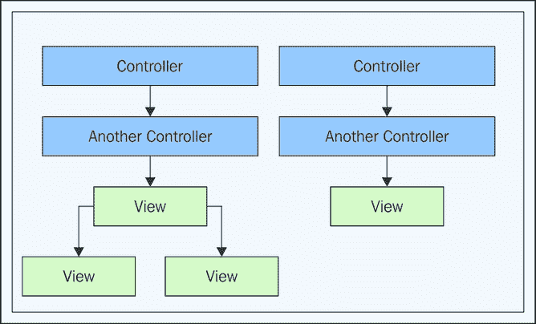

任何需要拆分特性以理解其工作方式的开发者，最终都会花费更多的时间在源代码文件之间跳转。特性感觉是碎片化的，这种代码结构并没有明显的优势。以下是 Flux 架构中构成特性的各个运动部件的观察：

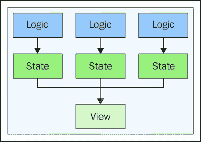

Flux 特性分解让我们有一种可预测的感觉。我们排除了视图本身可能被分解的潜在方式，但这是因为视图位于 Flux 之外。就我们的 Flux 架构而言，我们关心的是当状态发生变化时，始终将正确的信息传递给我们的视图。

你会注意到，给定 Flux 特性的逻辑和状态紧密耦合在一起。这与 MV*不同，在 MV*中，我们希望应用逻辑是一个独立的实体，可以在任何数据上操作。而在 Flux 中，情况正好相反，我们会发现负责改变状态的逻辑与该状态紧密相邻。这是一个有意的设计特性，其含义是我们不需要过分追求关注点之间的分离，而且这种活动有时可能会适得其反。

正如我们将在接下来的章节中看到的那样，这种数据和逻辑的紧密耦合是 Flux 存储的特征。前面的图示表明，对于复杂特性，添加更多逻辑和状态要容易得多，因为它们总是位于特性的表面，而不是隐藏在组件的嵌套树中。

## 级联更新

当我们有一个“只需工作”的软件组件时，这感觉很好。这可能意味着许多事情，但通常它的意义是围绕自动为我们处理事情。例如，我们不需要手动调用这个方法，然后是那个方法，等等，所有的事情都由组件为我们处理。让我们看看以下插图：

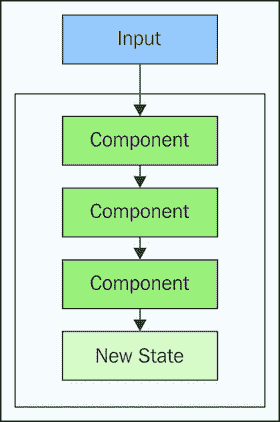

当我们将输入传递给一个更大的组件时，我们可以期望它会自动为我们做正确的事情。这些类型组件的吸引力在于，这意味着我们需要维护的代码更少。毕竟，组件知道如何通过协调任何子组件之间的通信来自动更新自己。

这就是级联效应开始的地方。我们告诉一个组件执行某些行为。这反过来又导致另一个组件做出反应。我们给它一些输入，这又导致另一个组件做出反应，以此类推。很快，就很难理解我们代码中的情况了。这是因为为我们“处理”的事情被隐藏了起来。这是有意为之的设计，但产生了意想不到的后果。

之前的图表并不太糟糕。当然，如果添加到较大组件中的子组件数量较多，可能会稍微难以理解，但总的来说，这是一个可处理的问题。让我们看看这个图表的一个变体：

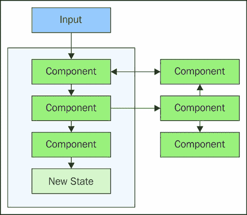

刚才发生了什么？又增加了三个框和四条线，导致级联更新复杂性的爆炸式增长。问题不再可处理，因为我们根本无法处理这种类型的复杂性，并且大多数依赖这种类型自动更新的 MV*应用程序有超过六个组件。我们所能期望的最好的结果就是，一旦它按照我们想要的方式工作，它就会继续工作。

这是我们对自动更新组件做出的天真假设——这是我们想要封装的东西。问题是这通常并不成立，至少如果我们打算维护软件的话。Flux 通过只有存储可以改变其自身状态，并且这种改变总是对动作的反应来规避级联更新的问题。

## 模型更新责任

在 MV*架构中，状态存储在模型中。为了初始化模型状态，我们可以从后端 API 获取数据。这已经很清晰了：我们创建一个新的模型，然后告诉该模型去获取一些数据。然而，MV*并没有说明谁负责更新这些模型。有人可能会认为控制器组件应该完全控制模型，但在实践中这真的会发生吗？

例如，在响应用户交互而调用的视图事件处理器中会发生什么？如果我们只允许控制器更新我们模型的状态，那么视图事件处理器函数应该直接与相关的控制器通信。以下图表是控制器以不同方式更改模型状态的可视化：

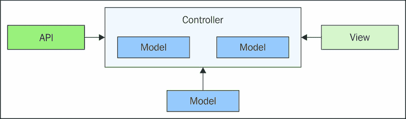

乍一看，这种控制器设置似乎非常合理。它作为存储状态的模型的包装器。假设任何想要修改这些模型中的任何模型的东西都需要通过控制器进行。毕竟，这是它的责任——控制事物。来自 API 的数据、由用户触发并由视图处理的事件，以及其他模型——所有这些都需要与控制器通信，如果它们想要改变模型的状态。

随着我们的控制器增长，确保模型状态更改由控制器处理将产生越来越多的更改模型状态的方法。如果我们退后一步，看看这些方法如何累积，我们会开始注意到很多不必要的间接。通过代理这些状态更改，我们能够获得什么？

另一个原因是，控制器在尝试在 MV* 中建立一致的状态更改时是一个死胡同，因为模型可以对自己进行更改。例如，设置模型中的一个属性可能会作为副作用更改其他模型属性。更糟糕的是，我们的模型可能有监听器，它们会响应系统其他地方（级联更新问题）的状态更改。

Flux 存储通过仅允许通过操作进行状态更改来解决级联更新问题。这个相同的机制解决了这里讨论的 MV* 挑战；我们不必担心视图或其他存储直接更改我们存储的状态。

# 单向数据

任何 Flux 架构的基石是单向数据流。其想法是数据从点 A 流向点 B，或者从点 A 流向 B 再流向 C，或者从点 A 流向 C。在单向数据流中，重要的是方向，其次是顺序。因此，当我们说我们的架构使用单向数据流时，我们可以这样说：数据永远不会从点 B 流向点 A。这是 Flux 架构的一个重要特性。

如前节所述，MV* 架构的数据流没有明显的方向。在本节中，我们将讨论一些使单向数据流值得实施的特征。我们将从查看数据流的起点和终点开始，然后考虑如何避免数据单向流动时的副作用。

## 从开始到结束

如果数据流仅在一个方向上，必须有起点和终点。换句话说，我们不能只有一个无限的数据流，它任意地影响数据流通过的各种组件。当数据流具有明确定义的起点和终点时，我们不可能有循环流。相反，在 Flux 中，我们有一个大的数据流循环，如图所示：

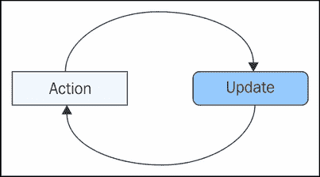

这显然是对任何 Flux 架构的过度简化，但它确实有助于说明任何给定数据流的起点和终点。我们所观察到的被称为**更新轮次**。一轮是原子的，意味着它运行到完成——无法停止更新轮次以完成（除非抛出异常）。

JavaScript 是一种运行到完成的语言，这意味着一旦代码块开始运行，它就会完成。这是好事，因为它意味着一旦我们开始更新 UI，回调函数就无法中断我们的更新。例外情况是当我们的代码中断更新过程时。例如，我们打算修改存储状态的存储逻辑分发了动作。这对我们的 Flux 架构来说是个坏消息，因为它会违反单向数据流。为了防止这种情况，调度器实际上可以检测到在更新轮次内部发生分发。我们将在后面的章节中了解更多关于这一点。

更新轮次负责更新整个应用程序的状态，而不仅仅是订阅了特定类型动作的部分。这意味着随着我们的应用程序增长，我们的更新轮次也在增长。由于更新轮次会触及每个存储，可能会开始感觉数据似乎正通过我们所有的存储横向流动。以下是这个想法的说明：

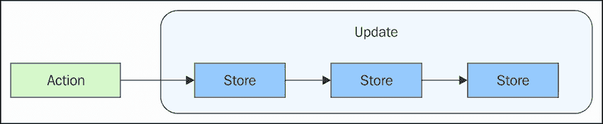

从单向数据流的角度来看，实际上并不重要有多少个存储。重要的是要记住，更新不会被其他正在分发的动作所中断。

## 无副作用

正如我们在 MV* 架构中看到的那样，自动状态变化的优点也是其终结之处。当我们通过隐藏规则编程时，本质上是在通过拼接一系列副作用来编程。这并不容易扩展，主要是因为在某个特定时间点，我们不可能在脑海中保留所有这些隐藏的连接。Flux 喜欢尽可能避免副作用。

让我们暂时考虑一下存储。这些是我们应用程序状态的主宰。当某个东西的状态发生变化时，它有可能导致另一段代码作为响应而运行。这确实在 Flux 中发生了。当一个存储改变状态时，如果它们已经订阅了存储，视图可能会被通知变化。这是 Flux 中发生副作用的唯一地方，这是不可避免的，因为我们在状态变化时确实需要更新 DOM。但 Flux 与之不同之处在于，当涉及数据依赖时，它如何避免副作用。处理用户界面中数据依赖的典型方法是通过通知依赖模型发生了某些事情。想想级联更新，如下所示：

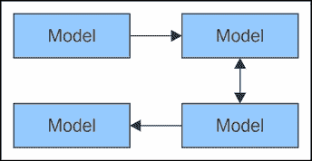

当在 Flux 中两个存储之间存在依赖关系时，我们只需要在依赖存储中声明这个依赖关系。这样做是告诉调度器确保我们依赖的存储始终是最先更新的。然后，依赖存储可以直接使用它所依赖的存储数据。这样，所有的更新仍然可以在同一个更新轮次内进行。

# 显式优于隐式

在架构模式中，趋势是通过随着时间的推移变得越来越复杂的抽象来简化事物。最终，系统中的更多数据会自动更改，开发者的便利性被隐藏的复杂性所取代。

这是一个真正的可扩展性问题，Flux 通过优先考虑显式动作和数据转换而不是隐式抽象来处理它。在本节中，我们将探讨显式性的好处以及需要做出的权衡。

## 通过隐藏的副作用进行更新

我们在本章中已经看到，处理隐藏在抽象背后的状态变化有多么困难。它们帮助我们避免编写代码，但同时也使得在稍后回顾代码时理解整个工作流程变得困难。在 Flux 中，状态被保存在存储中，存储负责改变自己的状态。这很好，因为当我们想要了解某个存储如何改变状态时，所有的状态转换代码都集中在一个地方。让我们看看一个示例存储：

```js
// A Flux store with state.
class Store {
  constructor() {

    // The initial state of the store.
    this.state = { clickable: false };

    // All of the state transformations happen
    // here. The "action.type" property is how it
    // determines what changes will take place.
    dispatcher.register((e) => {

      // Depending on the type of action, we
      // use "Object.assign()" to assign different
      // values to "this.state".
      switch (e.type) {
        case 'show':
          Object.assign(this.state, e.payload,
            { clickable: true });
          break;
        case 'hide':
          Object.assign(this.state, e.payload,
            { clickable: false });
          break;
        default:
          break;
      }
    });
  }
}

// Creates a new store instance.
var store = new Store();

// Dispatches a "show" action.
dispatcher.dispatch({
  type: 'show',
  payload: { display: 'block' }
});

console.log('Showing', store.state);
// → Showing {clickable: true, display: "block"}

// Dispatches a "hide" action.
dispatcher.dispatch({
  type: 'hide',
  payload: { display: 'none' }
});

console.log('Hiding', store.state);
// → Hiding {clickable: false, display: "none"}
```

在这里，我们有一个包含简单`state`对象的存储。在构造函数中，存储向`dispatcher`注册了一个回调函数。所有状态转换都明确地在一个函数中发生。这就是数据变成用户界面信息的地方。我们不必在多个组件中寻找数据的小片段，因为它们的状态发生变化时，这种情况不会在 Flux 中发生。

因此，现在的问题变成了，视图如何利用这种单一的状态数据？在其他类型的客户端架构中，视图会在任何状态发生变化时收到通知。在前面的例子中，当`clickable`属性发生变化时，视图会收到通知，同样，当`display`属性发生变化时，视图也会收到通知。视图有逻辑来独立渲染这两个变化。然而，在 Flux 中，视图不会收到这样精细的更新。相反，它们会在存储状态变化时收到通知，并且状态数据就是提供给它们的内容。

这里的含义是，我们应该倾向于使用擅长重新渲染整个组件的视图技术。这正是 React 适合 Flux 架构的原因。尽管如此，我们仍然可以自由地使用我们喜欢的任何视图技术，正如我们将在本书后面的内容中看到的。

## 数据状态在一个地方发生变化

如前所述，存储转换代码被封装在存储中。这是故意的。那些改变存储状态的转换代码应该靠近存储。这种紧密的邻近性大大减少了随着系统变得更加复杂时确定状态变化发生位置的复杂性。这使得状态变化变得明确，而不是抽象和隐含的。

存储器管理所有状态转换代码的一个潜在权衡是可能会有很多这样的代码。我们之前看到的代码使用单个`switch`语句来处理所有的状态转换逻辑。这显然会在以后处理大量情况时引起一些头痛。我们将在本书稍后更详细地考虑这一点，当考虑大型、复杂的存储器时。只需知道我们可以重构我们的存储器，以优雅地处理大量情况，同时保持业务逻辑和状态的耦合紧密。

这直接把我们带回到了关注点分离原则。在 Flux 存储器中，数据和操作它的逻辑完全没有分离。但这实际上是不是一件坏事呢？一个行动被派发，存储器被通知此事，并改变其状态（或者什么都不做，忽略该行动）。改变状态的逻辑位于同一组件中，因为将其移动到其他地方没有任何好处。

## 行动太多？

行动使 Flux 架构中发生的所有事情都变得明确。通过“所有事情”，我的意思是所有事情——如果发生了，那一定是某个行动被派发的结果。这是好事，因为很容易找出行动是从哪里派发的。即使系统在增长，行动派发在我们的代码中也很容易找到，因为它们只能来自少数几个地方。例如，我们不会在存储器中找到正在派发的行动。

我们创建的任何功能都有可能创建数十个甚至更多的行动。我们倾向于认为更多意味着不好，从架构的角度来看。如果某物越多，就越难进行扩展和编程。在这方面有一些真实性，但如果我们要有很多某物，这在任何大型系统中都是不可避免的，那么它是行动就很好。行动相对较轻，因为它们描述了在我们应用程序中发生的事情。换句话说，行动不是我们需要担心拥有很多的重型项目。

拥有许多行动是否意味着我们需要将它们全部塞入一个巨大的单体行动模块中？幸运的是，我们不必这样做。仅仅因为行动是进入任何 Flux 系统的入口点，并不意味着我们不能按我们的喜好对它们进行模块化。这对我们开发的 Flux 组件都适用，并且我们将保持警惕，寻找我们可以在阅读本书的过程中保持代码模块化的方法。

# 层次结构之上的层

用户界面在本质上具有层次性，部分原因是因为 HTML 本身是层次化的，部分原因是因为我们构建用户所呈现信息的方式。例如，这就是为什么在一些应用程序中我们会有嵌套的导航层级——我们不可能一次性将所有内容都放在屏幕上。自然地，我们的代码开始反映这种层次结构，通过自身成为一个层次结构。这在某种程度上是好的，因为它反映了用户所看到的内容。但在另一方面，深层次的层次结构很难理解。

在本节中，我们将探讨前端架构中的层次结构以及 Flux 如何避免复杂的层次结构。我们首先将介绍拥有多个顶级组件的概念，每个组件都有自己的层次结构。然后，我们将探讨在层次结构内部发生的副作用以及数据如何在 Flux 层中流动。

## 多个组件层次结构

一个特定的应用程序可能只有几个主要功能。这些通常作为我们代码中的顶级组件或模块实现。这些不是单体组件；它们被分解成越来越小的组件。也许其中一些组件共享较小的多功能组件。例如，一个顶级组件层次结构可能由模型、视图和控制器组成，如图所示：

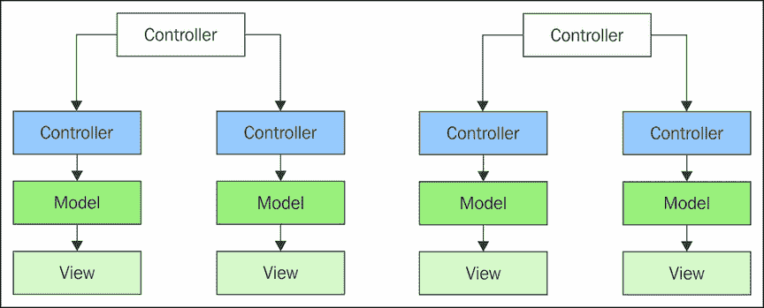

这在我们的应用程序结构中是有意义的。当我们查看组件层次结构的图片时，很容易看出我们的应用程序是由什么构成的。这些层次结构，以顶级组件为根，就像独立于彼此存在的小宇宙。再次，我们回到了关注点分离的概念。我们可以开发一个功能，而不会影响另一个。

这种方法的缺点是用户界面功能通常依赖于其他功能。换句话说，一个组件层次结构的状态可能会依赖于另一个组件的状态。当没有机制来控制状态何时可以改变时，我们如何保持这两个组件树之间的同步？最终发生的情况是，一个层次结构中的组件将向另一个层次结构中的组件引入任意的依赖。这服务于单一目的，因此我们必须不断引入新的层次间依赖，以确保一切同步。

## 层次深度和副作用

层次结构的一个挑战是深度。也就是说，一个特定的层次结构会延伸多深？我们应用程序的功能不断变化和扩展范围。这可能导致我们的组件树变得更高。但它们也变得更宽。例如，假设我们的功能使用的是一个三级深的组件层次结构。

然后，我们添加一个新的层级。嗯，我们可能需要向这个新层级和更高层级添加几个新组件。因此，为了在层次结构上构建，我们必须在多个方向上进行扩展——水平和垂直。这个想法在这里得到了说明：

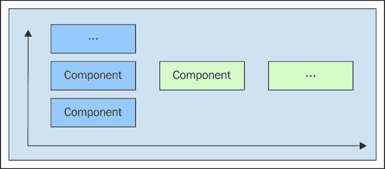

在多个方向上扩展组件很困难，尤其是在没有数据流方向的组件层次结构中。也就是说，最终改变某个状态输入可以进入层次结构的任何级别。毫无疑问，这会有某种副作用，如果我们依赖于其他层次结构中的组件，所有的希望都破灭了。

## 数据流和层

Flux 具有独特的架构层，这些层比层次结构更适合扩展架构。原因很简单——我们只需要在架构的每一层中水平扩展组件。我们不需要向一个层添加新组件，也不需要添加新层。让我们看看以下图中 Flux 架构扩展的样子：

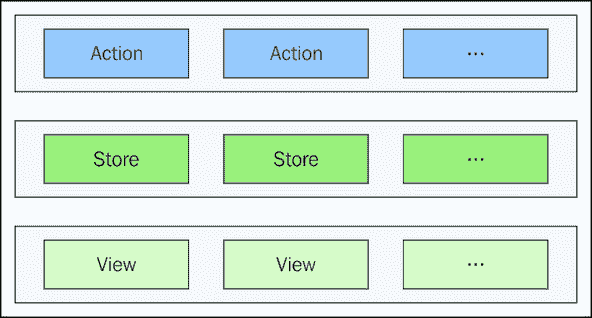

无论应用程序有多大，都不需要添加新的架构层。我们只需向这些层添加新组件。我们之所以能够这样做而不在给定层内创建组件连接的混乱，是因为这三个层都在更新轮次中发挥作用。更新轮次从动作开始，以渲染的最后一个视图结束。数据从层到层通过我们的应用程序单向流动。

# 应用程序数据和 UI 状态

当我们有职责分离，将表示固定在一个地方，将应用程序数据放在另一个地方时，我们需要管理状态的两个不同的地方。但在 Flux 中，唯一有状态的地方是在存储中。在本节中，我们将比较应用程序数据和 UI 数据。然后，我们将讨论最终导致用户界面变化的转换。最后，我们将讨论 Flux 存储以功能为中心的特性。

## 两样相同的东西

很常见，从 API 获取的应用程序数据会被输入到某种视图层。这也被称为表示层，负责将应用程序数据转换为对用户有价值的东西——换句话说，从数据到信息。在这些层中，我们最终得到状态来表示 UI 元素。例如，复选框是否被勾选？以下是我们倾向于在我们组件内分组这两种状态的说明：

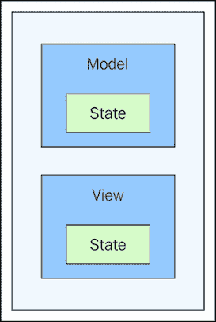

这与 Flux 架构不太相符，因为存储是状态所在的地方，包括 UI。那么，存储能否同时包含应用和 UI 状态呢？好吧，对此并没有强烈的反对意见。如果所有具有状态的事物都包含在存储中，那么区分应用数据和属于 UI 元素的状态应该相当简单。以下是在 Flux 存储中找到的状态类型的说明：

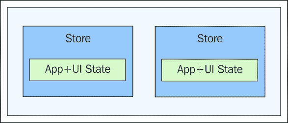

尝试将 UI 状态与其他状态分开的基本误解在于，组件通常依赖于 UI 状态。即使是不同功能中的 UI 组件也可能以不可预测的方式相互依赖。Flux 认识到这一点，并不试图将 UI 状态视为应该与应用数据分开的特殊事物。

最终存储中结束的 UI 状态可以由许多因素推导而来。通常，我们应用数据中的两个或更多项可以确定一个 UI 状态项。一个 UI 状态可以由另一个 UI 状态推导而来，或者由更复杂的事物推导而来，例如 UI 状态和其他应用数据。在其他情况下，应用数据足够简单，可以直接由视图消费。关键是视图拥有足够的信息，可以自行渲染而无需跟踪自己的状态。

## 紧密耦合的转换

在 Flux 存储中，应用数据和 UI 状态紧密耦合在一起。这个数据上操作的转换紧密耦合到存储中是有意义的。这使得我们可以根据其他应用数据或其他存储的状态轻松地更改 UI 的状态。

如果我们的业务逻辑代码不在存储中，那么我们就需要开始向包含存储所需逻辑的组件引入依赖。当然，这意味着通用的业务逻辑，它转换状态，并且可以在多个存储中共享，但这在高层次上很少发生。存储最好保持其转换存储状态的业务逻辑紧密耦合。如果我们需要减少重复代码，我们可以引入更小、更精细的实用函数来帮助数据转换。

### 注意

我们也可以使我们的存储变得通用。这些存储是抽象的，并且不直接与视图接口。我们将在本书的后面部分更详细地介绍这个高级主题。

## 以功能为中心

如果改变存储状态的数据转换与存储本身紧密耦合，这意味着存储是为特定功能定制的吗？换句话说，我们关心存储在其他功能中被重用吗？当然，在某些情况下，我们有通用数据，在多个存储中重复几次并没有太多意义。但一般来说，存储是针对特定功能的。在 Flux 术语中，功能与域同义——每个人都会以不同的方式划分他们 UI 的功能。

这与其他架构不同，这些架构基于 API 的数据模型构建其数据模型。然后，他们使用这些模型来创建更具体的视图模型。任何给定的 MV*框架在其模型抽象中都会有大量的功能，比如数据绑定和自动 API 获取。他们只关心在状态改变时存储状态和发布通知。

当存储鼓励我们创建和存储特定于 UI 的新状态时，我们可以更容易地为用户设计。这是 Flux 中的存储与其他架构中的模型之间的基本区别——UI 数据模型优先。存储内的转换存在是为了确保正确的状态被发布到视图中——其他一切都是次要的。

# 摘要

本章向您介绍了 Flux 的驱动原则。这些原则应在您处理任何 Flux 架构时牢记在心。我们以对前端开发中普遍存在的 MV*风格架构的简要回顾开始本章。这种架构风格的一些挑战包括模型更新的级联和缺乏数据流方向。然后，我们探讨了 Flux 的奖赏概念——单向数据流。

接下来，我们讨论了 Flux 如何更倾向于显式动作而非隐式抽象。这使得阅读 Flux 代码时更容易理解，因为我们不必挖掘状态变化的原因。我们还探讨了 Flux 如何利用架构层来可视化数据在系统中的单向流动。

最后，我们比较了应用数据与通常被认为是特定于 UI 元素的州。Flux 存储通常关注与它所支持的功能相关的状态，并且不区分应用数据和 UI 状态。现在我们已经掌握了驱动 Flux 架构的原则，是时候我们来编写一个了。在下一章中，我们将实现我们的 Flux 架构骨架，这样我们可以专注于信息设计。
