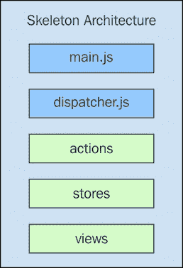
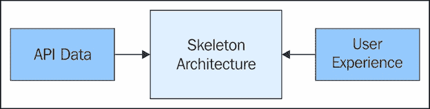
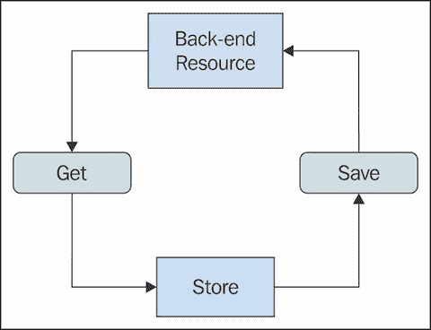

# 第三章 建立骨架架构

以 Flux 的方式思考的最佳方法是使用 Flux 编写代码。这就是为什么我们希望尽早开始构建骨架架构。我们称构建我们应用程序的这个阶段为骨架架构，因为它还不是完整的架构。它缺少许多关键的应用程序组件，这是故意的。骨架的目的是将移动部件保持在最低限度，使我们能够专注于我们的存储将为我们的视图生成的信息。

我们将以一种极简的结构开始，虽然规模不大，但不需要做很多工作就能将我们的骨架架构转换为我们的代码库。然后，我们将继续探讨骨架架构的一些信息设计目标。接下来，我们将深入实施存储的一些方面。

在我们开始构建的过程中，我们将开始了解这些存储如何映射到领域——用户将与之交互的功能。在此之后，我们将创建一些非常简单的视图，这有助于我们确保我们的数据流确实达到了最终目的地。最后，我们将通过检查每个 Flux 架构层的清单来结束本章，以确保我们在进行其他开发活动之前已经验证了我们的骨架。

# 一般组织

在构建骨架 Flux 架构的第一步，我们将花几分钟时间进行组织。在本节中，我们将建立一个基本的目录结构，弄清楚我们将如何管理我们的依赖关系，并选择我们的构建工具。这一切都不是一成不变的——我们的想法是快速开始，同时建立一些规范，以便将我们的骨架架构转换为应用程序代码尽可能无缝。

## 目录结构

用于开始构建我们的骨架的目录结构不需要很复杂。这是一个骨架架构，而不是完整的架构，因此初始目录结构应该与之相匹配。话虽如此，我们也不想使用一个难以演变成产品实际使用的目录结构。让我们看看我们将在项目目录根目录中找到的项目：



很简单，对吧？让我们逐一了解这些项目代表什么：

+   `main.js`: 这是应用程序的主要入口点。这个 JavaScript 模块将启动系统的初始动作。

+   `dispatcher.js`: 这是我们的调度器模块。这是 Flux 调度器实例创建的地方。

+   `actions`: 这个目录包含所有我们的动作创建函数和动作常量。

+   `stores`: 这个目录包含我们的存储模块。

+   `views`: 这个目录包含我们的视图模块。

这可能看起来不多，这是有意为之。目录结构反映了 Flux 的架构层。显然，一旦我们过了骨架架构阶段，实际应用将会有更多内容，但不会太多。不过，在这个阶段，我们应避免添加任何额外的组件，因为骨架架构完全是关于信息设计的。

## 依赖管理

作为起点，我们将需要 Facebook Flux 分发器作为我们骨架架构的依赖项——即使我们最终的产品中不会使用这个分发器。我们需要开始设计我们的存储，因为这是骨架架构中最关键且最耗时的方面；在这个阶段担心像分发器这样的问题根本不值得。

我们需要从某个地方开始，Facebook 分发器的实现已经足够好。问题是，我们是否需要其他包？在第一章中，*什么是 Flux？*我们介绍了 Facebook Flux NPM 包的设置，并使用 Webpack 构建我们的代码。这可以作为我们最终的生产构建系统吗？

没有包管理器或模块打包器让我们从一开始就处于不利地位。这就是为什么我们需要将依赖管理视为骨架架构的第一步，即使目前我们没有很多依赖。如果我们是第一次构建一个背后有 Flux 架构的应用程序，我们处理依赖的方式将作为未来 Flux 项目的蓝图。

在开发骨架架构期间添加更多的模块依赖是否是一个坏主意？根本不是。事实上，使用适合这项工作的工具会更好。在我们实现骨架的过程中，我们将开始看到在存储中一些地方使用库会有所帮助。例如，如果我们对数据集合进行大量的排序和过滤，并构建高阶函数，使用类似 lodash 这样的工具是完美的。

另一方面，在这个阶段引入像 ReactJS 或 jQuery 这样的东西并不合理，因为我们还在考虑信息而不是如何在 DOM 中呈现它。所以，这本书中我们将采用这种方法——NPM 作为我们的包管理器，Webpack 作为我们的打包器。这是我们需要的最基本的基础设施，没有太多开销来分散我们的注意力。

# 信息设计

我们知道我们正在尝试构建的骨架架构特别关注将正确的信息传递给我们的用户。这意味着我们并没有太多关注用户的交互性或以用户友好的方式格式化信息。如果我们为自己设定一些粗略的目标——我们如何知道我们的信息设计实际上有所进展？

在本节中，我们将讨论 API 数据模型对我们用户界面设计可能产生的负面影响。然后，我们将探讨将数据映射到用户所看到的内容，以及这些映射应该如何在我们的商店中得到鼓励。最后，我们将思考我们正在工作的环境。

## 用户不理解模型

作为用户界面程序员，我们的任务是确保在正确的时间将正确的信息提供给用户。我们如何做到这一点？传统智慧围绕着从 API 获取一些数据，然后将其渲染为 HTML。除了语义标记和一些样式外，自数据从 API 到达以来，数据并没有发生太大的变化。我们说的是“这里有我们的数据，让我们让它对用户看起来更美观。”以下是这个想法的说明：


这里没有进行数据转换，这是可以接受的，只要用户得到他们需要的东西。这幅图描绘的问题在于 API 的数据模型已经绑架了 UI 功能开发。我们必须注意从后端发送给我们的每一件事。这是因为我们实际上能为用户提供的东西有限。我们可以做的一件事是让我们的模型增强从 API 返回的数据。这意味着如果我们正在开发一个需要的信息与 API 意图不完全一致的功能，我们可以像这里展示的那样，在前端模型中构建它。


这让我们在某种程度上更接近我们的目标，因为我们可以创建一个我们试图实现的特性的模型，并将其展示给用户。所以尽管 API 可能无法提供我们想在屏幕上显示的确切内容，但我们可以使用我们的转换函数来生成所需信息的模型。

在我们的设计过程的骨架架构阶段，我们应该尽可能独立于 API 来考虑商店。不是完全独立；我们不希望偏离太远，危及产品。但生产 Flux 骨架架构的想法是确保我们首先产生正确的信息。如果 API 无法支持我们试图做的事情，那么我们可以在花费大量时间实现完整功能之前采取必要的步骤。

## 商店映射用户所看到的内容

状态并不是我们 Flux 架构中商店唯一封装的东西。还有将旧状态映射到新状态的数据转换。我们应该花更多的时间思考用户需要看到什么，而不是花更多的时间思考 API 数据，这意味着商店转换函数是至关重要的。

我们需要在 Flux 存储中拥抱数据转换，因为它们是用户眼前事物变化的最终决定因素。没有这些转换，用户只能查看静态信息。当然，我们可以试图设计一个只使用传入系统的“原样”数据的架构，而不进行转换。这永远不会按照我们的意图实现，简单的理由是我们将发现与其他 UI 组件的依赖关系。

我们在存储方面应该设定什么样的早期目标？我们如何转换它们的状态？嗯，骨架架构完全是关于实验的，如果我们一开始就编写转换功能，我们可能会更早地发现依赖关系。依赖关系并不一定是坏事，除非我们在项目后期发现了很多依赖关系，那时我们早已完成了骨架架构阶段。当然，新功能会添加新的依赖关系。如果我们能尽早使用状态转换来识别潜在的依赖关系，那么我们可以避免未来的麻烦。

## 我们有什么可以工作的？

在我们卷起袖子开始实现这个骨架 Flux 架构之前，我们需要考虑的最后一件事情是已经存在的东西。例如，这个应用程序已经有一个建立的 API，我们正在重构前端？我们需要保留现有 UI 的用户体验吗？项目是完全的绿色地带，没有任何 API 或用户体验输入？

以下图表说明了这些外部因素如何影响我们对待骨架架构实现的方式：



让这两个因素塑造我们的 Flux 架构并没有什么不妥。在现有 API 的情况下，我们将有一个起点，从这里我们可以开始编写我们的状态转换函数，为用户提供他们所需的信息。在保持现有用户体验的情况下，我们已经知道我们的目标信息的形状，我们可以从不同的角度工作转换函数。

当 Flux 架构完全是绿色地带时，我们可以让它指导用户体验和需要实现的 API。我们发现自己构建骨架架构的任何场景都不太可能是非黑即白的。这些只是我们可能发现自己处于的起点。话虽如此，是时候开始实现一些骨架存储了。

# 将存储付诸实践

在本节中，我们将在我们骨架架构中实现一些存储。它们不会是完整的存储，能够支持端到端的工作流程。然而，我们将能够看到存储在我们应用程序的上下文中的位置。

我们将从所有商店动作中最基本的开始，即用一些数据填充它们；这通常是通过通过某些 API 获取数据来完成的。然后，我们将讨论更改远程 API 数据的状态。最后，我们将查看不使用 API 而更改商店本地状态的动作。

## 获取 API 数据

无论是否有准备好的应用程序数据 API 可供消费，我们都知道最终我们将以这种方式填充我们的商店数据。因此，将这视为实现骨架商店的第一个设计活动是有意义的。

让我们为我们的应用程序的主页创建一个基本的商店。用户在这里想要看到的最明显的信息是当前登录的用户、一个导航菜单，以及可能是一些与用户相关的最近事件的总结列表。这意味着获取这些数据将是我们的应用程序必须做的第一件事。这是我们的商店的第一个实现：

```js
// Import the dispatcher, so that the store can
// listen to dispatch events.
import dispatcher from '../dispatcher';

// Our "Home" store.
class HomeStore {
  constructor() {

    // Sets a default state for the store. This is
    // never a bad idea, in case other stores want to
    // iterate over array values - this will break if
    // they're undefined.
    this.state = {
      user: '',
      events: [],
      navigation: []
    };

    // When a "HOME_LOAD" event is dispatched, we
    // can assign "payload" to "state".
    dispatcher.register((e) => {
      switch (e.type) {
        case 'HOME_LOAD':
          Object.assign(this.state, e.payload);
          break;
      }
    });
  }
}

export default new HomeStore();
```

这相当容易理解，所以让我们指出重要的部分。首先，我们需要导入分发器，以便我们可以注册我们的商店。当商店被创建时，默认状态存储在`state`属性中。当`HOME_LOAD`动作被分发时，我们改变商店的状态。最后，我们将商店实例作为默认模块成员导出。

如动作名称所暗示的，当商店的数据加载完成时，会触发`HOME_LOAD`。我们可能将从某些 API 端点拉取这些数据用于主商店。让我们继续在`main.js`模块中使用这个商店——我们的应用程序入口点：

```js
// Imports the "dispatcher", and the "homeStore".
import dispatcher from './dispatcher';
import homeStore from './stores/home';

// Logs the default state of the store, before
// any actions are triggered against it.
console.log(`user: "${homeStore.state.user}"`);
// → user: ""

console.log('events:', homeStore.state.events);
// → events: []

console.log('navigation:', homeStore.state.navigation);
// → navigation: []

// Dispatches a "HOME_LOAD" event, when populates the
// "homeStore" with data in the "payload" of the event.
dispatcher.dispatch({
  type: 'HOME_LOAD',
  payload: {
    user: 'Flux',
    events: [
      'Completed chapter 1',
      'Completed chapter 2'
    ],
    navigation: [
      'Home',
      'Settings',
      'Logout'
    ]
  }
});

// Logs the new state of "homeStore", after it's
// been populated with data.
console.log(`user: "${homeStore.state.user}"`);
// → user: "Flux"

console.log('events:', homeStore.state.events);
// → events: ["Completed chapter 1", "Completed chapter 2"]

console.log('navigation:', homeStore.state.navigation);
// → navigation: ["Home", "Settings", "Logout"]
```

这是对我们主页商店的一些相当直接的使用。我们正在记录商店的默认状态，使用一些新的有效载荷数据分发`HOME_LOAD`动作，并再次记录状态以确保商店的状态确实发生了变化。所以问题是，这段代码与 API 有什么关系？

这是我们骨架架构的一个很好的起点，因为在我们开始实现 API 调用之前，有许多事情需要考虑。我们甚至还没有开始实现动作，因为如果我们这样做，它们只是另一个干扰。此外，一旦我们完善了我们的商店，动作和真实的 API 调用就很容易实现了。

关于`main.js`模块的第一个问题可能是`HOME_LOAD`的`dispatch()`调用的位置。在这里，我们正在将数据引导到商店中。这是否是做这件事的正确地方？当`main.js`模块运行时，我们是否总是需要这个商店被填充？这是否是我们想要将数据引导到所有商店的地方？我们不需要立即回答这些问题，因为这可能会让我们在一个架构方面停留得太久，而且还有许多其他问题需要考虑。

例如，我们的存储耦合是否合理？我们刚刚实现的首页存储有一个`navigation`数组。这些现在只是简单的字符串，但它们很可能会变成对象。更大的问题是，导航数据甚至可能不属于这个存储——几个其他存储可能也需要导航状态数据。另一个例子是我们设置存储新状态的方式。使用`Object.assign()`是有优势的，因为我们可以用只有一个状态属性的负载派发`HOME_LOAD`事件，而一切都将继续正常工作。实现这个存储几乎花了我们很少的时间，但我们提出了一些非常重要的问题，并学习了一种强大的分配新存储状态的技术。

这是骨架架构，所以我们不关心实际获取 API 数据的机制。我们更关心的是由于 API 数据到达浏览器而派发的行动；在这种情况下，它是`HOME_LOAD`。在骨架 Flux 架构的上下文中，信息通过存储流动的机制才是重要的。关于这一点，让我们稍微扩展一下我们存储的能力：

```js
// We need the "dispatcher" to register our store,
// and the "EventEmitter" class so that our store
// can emit "change" events when the state of the
// store changes.
import dispatcher from '../dispatcher';
import { EventEmitter } from 'events';

// Our "Home" store which is an "EventEmitter"
class HomeStore extends EventEmitter {
  constructor() {

    // We always need to call this when extending a class.
    super();

    // Sets a default state for the store. This is
    // never a bad idea, in case other stores want to
    // iterate over array values - this will break if
    // they're undefined.
    this.state = {
      user: '',
      events: [],
      navigation: []
    };

    // When a "HOME_LOAD" event is dispatched, we
    // can assign "payload" to "state", then we can
    // emit a "change" event.
    dispatcher.register((e) => {
      switch (e.type) {
        case 'HOME_LOAD':
          Object.assign(this.state, e.payload);
          this.emit('change', this.state);
          break;
      }
    });
  }
}

export default new HomeStore();
```

存储仍然做它之前所做的一切，但现在存储类从`EventEmitter`继承，当派发`HOME_LOAD`行动时，它使用存储状态作为事件数据发出一个`change`事件。这让我们更接近拥有完整的工作流程，因为视图现在可以监听`change`事件以获取存储的新状态。让我们更新我们的主模块代码来看看这是如何完成的：

```js
// Imports the "dispatcher", and the "homeStore".
import dispatcher from './dispatcher';
import homeStore from './stores/home';

// Logs the default state of the store, before
// any actions are triggered against it.
console.log(`user: "${homeStore.state.user}"`);
// → user: ""

console.log('events:', homeStore.state.events);
// → events: []

console.log('navigation:', homeStore.state.navigation);
// → navigation: []

// The "change" event is emitted whenever the state of The
// store changes.
homeStore.on('change', (state) => {
  console.log(`user: "${state.user}"`);
  // → user: "Flux"

  console.log('events:', state.events);
  // → events: ["Completed chapter 1", "Completed chapter 2"]

  console.log('navigation:', state.navigation);
  // → navigation: ["Home", "Settings", "Logout"]
});

// Dispatches a "HOME_LOAD" event, when populates the
// "homeStore" with data in the "payload" of the event.
dispatcher.dispatch({
  type: 'HOME_LOAD',
  payload: {
    user: 'Flux',
    events: [
      'Completed chapter 1',
      'Completed chapter 2'
    ],
    navigation: [
      'Home',
      'Settings',
      'Logout'
    ]
  }
});
```

我们骨架架构中对存储的这种增强带来了更多的问题，即关于在存储上设置事件监听器。正如你所看到的，我们必须确保在派发任何行动之前，处理程序实际上正在监听存储。我们需要解决所有这些关注点，而我们刚刚才开始设计我们的架构。让我们继续到改变后端资源的状态。

## 更改 API 资源状态

在我们通过向 API 请求一些数据设置初始存储状态后，我们可能最终需要改变后端资源的状态。这是对用户活动的响应。事实上，常见的模式看起来像以下图表：



让我们在 Flux 存储的上下文中思考这个模式。我们已经看到了如何将数据加载到存储中。在我们构建的骨架架构中，我们实际上并没有进行这些 API 调用，即使它们存在——我们只专注于当前前端产生的信息。当我们派发一个改变存储状态的行动时，我们可能需要更新这个存储的状态，以响应 API 调用的成功完成。真正的问题是，这具体意味着什么？

例如，我们调用更改后端资源状态实际上会返回更新后的资源，还是只返回一个成功的指示？这些类型的 API 模式对我们存储库的设计有重大影响，因为它意味着在必须始终进行二次调用或数据在响应中可用之间的区别。

让我们看看一些代码。首先，我们有一个如下所示的用户存储库：

```js
import dispatcher from '../dispatcher';
import { EventEmitter } from 'events';

// Our "User" store which is an "EventEmitter"
class UserStore extends EventEmitter {
  constructor() {
    super();
    this.state = {
      first: '',
      last: ''
    };

    dispatcher.register((e) => {
      switch (e.type) {
        // When the "USER_LOAD" action is dispatched, we
        // can assign the payload to this store's state.
        case 'USER_LOAD':
          Object.assign(this.state, e.payload);
          this.emit('change', this.state);
          break;

        // When the "USER_REMOVE" action is dispatched,
        // we need to check if this is the user that was
        // removed. If so, then reset the state.
        case 'USER_REMOVE':
          if (this.state.id === e.payload) {
            Object.assign(this.state, {
              id: null,
              first: '',
              last: ''
            });

            this.emit('change', this.state);
          }

          break;
      }
    });
  }
}

export default new UserStore();
```

我们假设这个单一的用户存储库是我们应用程序中的一个页面，其中只显示单个用户。现在，让我们实现一个用于跟踪多个用户状态的存储库：

```js
import dispatcher from '../dispatcher';
import { EventEmitter } from 'events';

// Our "UserList" store which is an "EventEmitter"
class UserListStore extends EventEmitter {
  constructor() {
    super();

    // There's no users in this list by default.
    this.state = []

    dispatcher.register((e) => {
      switch (e.type) {

        // The "USER_ADD" action adds the "payload" to
        // the array state.
        case 'USER_ADD':
          this.state.push(e.payload);
          this.emit('change', this.state);
          break;

        // The "USER_REMOVE" action has a user id as
        // the "payload" - this is used to locate the
        // user in the array and remove it.
        case 'USER_REMOVE':
          let user = this.state.find(
            x => x.id === e.payload);

          if (user) {
            this.state.splice(this.state.indexOf(user), 1);
            this.emit('change', this.state);
          }

          break;
      }
    });
  }
}

export default new UserListStore();
```

现在，让我们创建`main.js`模块，它将与这些存储库一起工作。特别是，我们想看看与 API 交互以更改后端资源的状态将如何影响我们存储库的设计：

```js
import dispatcher from './dispatcher';
import userStore from './stores/user';
import userListStore from './stores/user-list';

// Intended to simulate a back-end API that changes 
// state of something. In this case, it's creating
// a new resource. The returned promise will resolve
// with the new resource data.
function createUser() {
  return new Promise((resolve, reject) => {
    setTimeout(() => {
      resolve({
        id: 1,
        first: 'New',
        last: 'User'
      });
    }, 500);
  });
}

// Show the user when the "userStore" changes.
userStore.on('change', (state) => {
  console.log('changed', `"${state.first} ${state.last}"`);
});

// Show how many users there are when the "userListStore"
// changes.
userListStore.on('change', (state) => {
  console.log('users', state.length);
});

// Creates the back-end resource, then dispatches actions
// once the promise has resolved.
createUser().then((user) => {

  // The user has loaded, the "payload" is the resolved data.
  dispatcher.dispatch({
    type: 'USER_LOAD',
    payload: user
  });
  // Adds a user to the "userListStore", using the resolved
  // data.
  dispatcher.dispatch({
    type: 'USER_ADD',
    payload: user
  });

  // We can also remove the user. This impacts both stores.
  dispatcher.dispatch({
    type: 'USER_REMOVE',
    payload: 1
  });
});
```

在这里，我们可以看到`createUser()`函数充当实际 API 实现的代理。记住，这是一个骨架架构，主要关注的是我们存储库构建的信息。实现一个返回 Promise 的函数在这里是完全可接受的，因为一旦我们开始与真实 API 通信，这很容易在以后进行更改。

我们正在寻找我们存储库的有趣方面——它们的状态、状态如何变化以及存储库之间的依赖关系。在这种情况下，当我们创建新用户时，API 返回新对象。然后，这作为`USER_LOAD`操作被派发。现在我们的`userStore`已经填充。我们还派发了一个`USER_ADD`操作，以便将新用户数据添加到这个列表中。假设这两个存储库服务于我们应用程序的不同部分，但更改后端中某物状态的相同 API 调用是相关的。

我们能从所有这些中学到关于我们架构的什么？首先，我们可以看到 Promise 回调将不得不为多个存储库派发多个操作。这意味着我们可能期望在创建资源的类似 API 调用中看到更多相同的情况。那么，修改用户的调用会看起来相似吗？

我们在这里缺少的是更新`userListStore`中用户数组中用户对象状态的操作。或者，我们也可以让这个存储库也处理`USER_LOAD`操作。任何方法都可以，构建骨架架构的练习应该帮助我们找到最适合我们应用程序的方法。例如，我们在这里也派发了一个单一的`USER_REMOVE`操作，并且这两个存储库都能轻松处理。这可能就是我们要找的方法？

## 本地操作

我们将用查看本地操作来结束存储库操作的章节。这些操作与 API 无关。本地操作通常是响应用户交互的，派发它们将对 UI 产生可见的影响。例如，用户想要切换页面上某些组件的可见性。

典型的应用程序会执行一个 jQuery 单行代码来定位 DOM 中的元素并做出适当的 CSS 更改。这种类型的事情在 Flux 架构中行不通，而且我们应该在我们的应用程序骨架架构阶段开始考虑这种类型的事情。让我们实现一个简单的存储库来处理本地动作：

```js
import dispatcher from '../dispatcher';
import { EventEmitter } from 'events';

// Our "Panel" store which is an "EventEmitter"
class PanelStore extends EventEmitter {
  constructor() {

    // We always need to call this when extending a class.
    super();

    // The initial state of the store.
    this.state = {
      visible: true,
      items: [
        { name: 'First', selected: false },
        { name: 'Second', selected: false }
      ]
    };

    dispatcher.register((e) => {
      switch (e.type) {

        // Toggles the visibility of the panel, which is
        // visible by default.
        case 'PANEL_TOGGLE':
          this.state.visible = !this.state.visible;
          this.emit('change', this.state);
          break;

        // Selects an object from "items", but only
        // if the panel is visible.
        case 'ITEM_SELECT':
          let item = this.state.items[e.payload];

          if (this.state.visible && item) {
            item.selected = true;
            this.emit('change', this.state);
          }

          break;
      }
    });
  }
}

export default new PanelStore();
```

`PANEL_TOGGLE`动作和`ITEM_SELECT`动作是这个存储库处理的两个本地动作。它们是局部的，因为它们很可能是用户点击按钮或选择复选框触发的。让我们分派这些动作，以便我们可以看到我们的存储库如何处理它们：

```js
import dispatcher from './dispatcher';
import panelStore from './stores/panel';

// Logs the state of the "panelStore" when it changes.
panelStore.on('change', (state) => {
  console.log('visible', state.visible);
  console.log('selected', state.items.filter(
    x => x.selected));
});

// This will select the first item.
dispatcher.dispatch({
  type: 'ITEM_SELECT',
  payload: 0
});
// → visible true
// → selected [ { name: First, selected: true } ]

// This disables the panel by toggling the "visible"
// property value.
dispatcher.dispatch({ type: 'PANEL_TOGGLE' });
// → visible false
// → selected [ { name: First, selected: true } ]

// Nothing the second item isn't actually selected,
// because the panel is disabled. No "change" event
// is emitted here either, because the "visible"
// property is false.
dispatcher.dispatch({
  type: 'ITEM_SELECT',
  payload: 1
});
```

这个例子说明了为什么在骨架架构实现阶段，我们应该考虑所有与状态相关的事项。仅仅因为我们现在没有实现实际的 UI 组件，并不意味着我们不能猜测一些常见构建块的潜在状态。在这段代码中，我们发现`ITEM_SELECT`动作实际上依赖于`PANEL_TOGGLE`动作。这是因为我们实际上不希望在面板禁用时选择一个项目并更新视图。

建立在这一点上，其他组件是否应该首先能够分派这个动作？我们刚刚发现一个潜在的存储依赖，其中依赖的存储库在实际上启用 UI 元素之前会查询`panelStore`的状态。所有这些都是从甚至不与 API 交谈的本地动作中发现的，而且没有实际的用户界面元素。我们可能会在我们的骨架架构过程中发现更多这样的项目，但不要陷入寻找所有事物的困境。我们的想法是在有机会的时候学习我们能学到的东西，因为一旦我们开始实现真实的功能，事情就会变得更加复杂。

# 存储和特性领域

在更传统的前端架构中，直接映射到 API 返回结果的模型为我们的 JavaScript 组件提供了一个清晰简洁的数据模型。正如我们所知，Flux 更倾向于用户方向，并专注于他们需要看到和交互的信息。这不应该成为我们的巨大头痛，特别是如果我们能够将用户界面分解为领域。将领域想象成一个非常大的特性。

在本节中，我们将讨论识别构成我们 UI 核心的顶级特性。然后，我们将努力从方程式中去除无关的 API 数据。我们将以查看我们的存储数据结构及其在骨架架构设计中的作用来结束本节。

## 识别顶级特性

在我们 Flux 项目的骨架架构阶段，我们应该积极参与并开始编写 store 代码，就像我们在本章中所做的那样。我们一直在思考用户可能需要的信息以及我们如何最好地将这些信息传递给用户。我们一开始并没有花太多时间去尝试识别应用程序的最高级功能。这是可以的，因为在本章中我们已经完成的练习通常是确定如何组织用户界面的先决条件。

然而，一旦我们确定了如何实现一些低级 store 机制来获取我们所需的信息，我们就需要开始考虑这些最高级功能。这样做有一个很好的理由——我们最终维护的 store 将映射到这些功能上。当我们说最高级时，很容易以导航作为参考点。实际上，使用页面导航作为指南并没有什么不妥；如果它足够大，可以用于主要导航，那么它可能是一个值得拥有自己 Flux store 的最高级功能。

除了是一个最高级功能之外，我们还需要考虑 store 的作用——为什么它存在？它为用户增加了什么价值？这些问题之所以重要，是因为我们可能会最终有六个页面，它们都可以使用同一个 store。因此，这是一个在将价值整合到一个 store 和确保 store 不是太大且通用之间取得平衡的问题。

应用程序很复杂，有很多动态部分驱动着许多功能。我们的用户界面可能拥有 50 个令人惊叹的功能。但这不太可能需要 50 个令人惊叹的最高级导航链接和 50 个 Flux store。我们的 store 将不得不在某个时候用它们的数据表示这些功能的复杂细节。但这将在稍后进行，现在我们只需要大致了解我们正在处理多少个 store，以及它们之间有多少依赖关系。

## 无关的 API 数据

用之或不弃之——这是 Flux store 数据的座右铭。API 数据的挑战在于它是对后端资源的表示——它不会返回专门为我们 UI 所需的数据。API 的存在是为了让多个 UI 可以基于它构建。然而，这意味着我们经常在我们的 store 中遇到无关数据。例如，如果我们只需要从 API 资源中获取几个属性，我们不想存储 36 个属性。尤其是当其中一些本身可以是集合时。这在内存消耗方面是浪费的，在存在性方面也是令人困惑的。实际上，后一点更令人担忧，因为我们很容易误导其他在这个项目上工作的程序员。

一种可能的解决方案是排除 API 响应中的这些未使用值。许多 API 今天支持这一点，允许我们选择我们想要返回的属性。如果这意味着大幅减少网络带宽，这可能是一个好主意。然而，这种方法也可能存在错误，因为我们必须在 AJAX 调用级别执行此过滤，而不是在存储级别。让我们看看一个采用不同方法的例子，通过指定存储记录：

```js
import dispatcher from '../dispatcher';
import { EventEmitter } from 'events';

class PlayerStore extends EventEmitter {
  constructor() {
    super();

    // The property keys in the default state are
    // used to determine the allowable properties
    // used to set the state.
    this.state = {
      id: null,
      name: ''
    };

    dispatcher.register((e) => {
      switch (e.type) {
        case 'PLAYER_LOAD':

          // Make sure that we only take payload data
          // that's already a state property.
          for (let key in this.state) {
            this.state[key] = e.payload[key];
          }

          this.emit('change', this.state);
          break;
      }
    });
  }
}

export default new PlayerStore();
```

在这个例子中，默认的 `state` 对象除了提供默认状态值外，还扮演着重要的角色，它还提供了存储记录。换句话说，默认状态使用的属性键决定了在派发 `PLAYER_LOAD` 动作时的允许值。让我们看看它是否按预期工作：

```js
import dispatcher from './dispatcher';
import playerStore from './stores/player';

// Logs the state of the player store when it changes.
playerStore.on('change', (state) => {
  console.log('state', state);
});

// Dispatch a "PLAYER_LOAD" action with more payload
// data than is actually used by the store.
dispatcher.dispatch({
  type: 'PLAYER_LOAD',
  payload: {
    id: 1,
    name: 'Mario',
    score: 527,
    rank: 12
  }
});
// → state {id: 1, name: "Mario"}
```

## 结构化存储数据

本章中迄今为止展示的所有示例都在存储中具有相对简单的状态对象。一旦我们构建起骨架架构，这些简单的对象将变得更为复杂。记住，存储的状态反映了用户查看的信息的状态。这包括页面上的某些元素的状态。

这是我们需要关注的事情。仅仅因为我们完成了骨架架构练习，并不意味着一个想法在我们开始实现更复杂的功能时仍然有效。换句话说，如果一个存储状态变得太大——太嵌套和深入——那么是时候考虑稍微移动我们的存储了。

理念是我们不希望有太多的存储驱动我们的视图，因为它们在这个阶段更像是 MVC 架构中的模型。我们希望存储代表应用程序的特定功能。这并不总是行得通，因为我们可能会在存储中为该功能结束一些复杂和混乱的状态。在这种情况下，我们的顶级功能需要以某种方式拆分。

这无疑会在我们使用 Flux 的时间段的某个时刻发生，而且没有规则规定何时应该重构存储。相反，如果状态数据的大小让你感觉可以舒适地与之工作，那么你很可能对当前的存储状态感到满意。

# 简洁的视图

我们在骨架存储方面取得了一些进展，现在我们准备开始查看骨架视图。这些是简单的类，与存储的精神非常相似，但我们实际上并没有将任何内容渲染到 DOM 中。这些简洁视图的目的是确认我们架构的坚实基础，并确保这些视图组件确实获得了他们期望的信息。这是至关重要的，因为视图是 Flux 数据流中的最后一项，所以如果它们没有得到他们需要的信息，或者在他们需要的时候没有得到，我们就需要回去修复我们的存储。

在本节中，我们将讨论我们的基本视图如何帮助我们更快地识别存储缺失特定信息的情况。然后，我们将探讨这些视图如何帮助我们识别 Flux 应用程序中的潜在动作。

## 寻找缺失数据

我们将使用基本视图执行的第一项活动是确定存储是否传递了视图所需的所有基本信息。就基本而言，我们谈论的是如果它们不存在，就会对用户造成问题的东西。例如，我们正在查看一个设置页面，有一个整个部分缺失。或者，有一个选项列表可供选择，但我们实际上没有字符串标签来显示，因为它们是某个其他 API 的一部分。

一旦我们确定这些关键信息缺失，下一步就是确定它们是否可能，因为如果它们不可能，我们就避免了花费大量时间实现一个完整的视图。然而，这些是罕见的情况。通常，回到有问题的存储并添加缺失的转换，以计算和设置我们正在寻找的缺失状态，并不是什么大问题。

我们需要在这些基本视图上花费多少时间？可以这样想——当我们开始实现实际视图，这些视图将渲染到 DOM 中时，我们会发现更多从存储中缺失的状态。然而，这些只是表面的，并且容易修复。对于基本视图，我们更关注挖掘缺失的关键部分。完成这些视图后，我们能做什么？它们是垃圾吗？不一定，根据我们如何实现我们的生产视图，我们可以调整它们成为 ReactJS 组件，或者我们可以在基本视图内嵌入实际视图，使其更像是一个容器。

## 识别动作

如本章前面所述，给定 Flux 架构将要分发的第一组动作将与从后端 API 获取数据有关。最终，这些是导致视图的数据流的开始。有时，这些仅仅是*加载*类型的动作，我们明确表示去获取资源并填充我们的存储。有时，我们可能有更抽象的动作，这些动作描述了用户采取的动作，导致多个存储从许多不同的 API 端点被填充。

这将用户带到我们可以开始考虑他们如何与这些信息交互的点。他们唯一能这样做的方式就是通过分发更多的动作。让我们创建一个带有一些动作方法的视图。本质上，目标是能够从浏览器 JavaScript 控制台访问我们的视图。这让我们可以在任何给定点查看与视图关联的状态信息，以及调用方法来分发给定的动作。

要做到这一点，我们需要稍微调整我们的 Webpack 配置：

```js
output: {
  …
  library: 'views'
}
```

这一行将导出一个全局的`views`变量到浏览器窗口中，其值将是我们的`main.js`模块导出的内容。现在让我们来看看这一点：

```js
import settingsView from './views/settings';
export { settingsView as settings };
```

嗯，这看起来很有趣。我们只是将视图导出为`settings`。因此，当我们创建骨架架构中的基本视图时，我们只需在`main.js`中遵循此模式，不断将视图添加到浏览器控制台以进行实验。现在让我们来看看设置视图本身：

```js
import dispatcher from '../dispatcher';
import settingsStore from '../stores/settings';

// This is a "bare bones" view because it's
// not rendering anything to the DOM. We're just
// using it to validate our Flux data-flows and
// to think about potential actions dispatched
// from this view.
class SettingsView {
  constructor() {

    // Logs the state of "settingsStore" when it
    // changes.
    settingsStore.on('change', (state) => {
      console.log('settings', state);
    });

    // The initial state of the store is logged.
    console.log('settings', settingsStore.state);
  }

  // This sets an email value by dispatching
  // a "SET_EMAIL" action.
  setEmail(email) {
    dispatcher.dispatch({
      type: 'SET_EMAIL',
      payload: 'foo@bar.com'
    });
  }

  // Do all the things!
  doTheThings() {
    dispatcher.dispatch({
      type: 'DO_THE_THINGS',
      payload: true
    })
  }
}

// We don't need more than one of these
// views, so export a new instance.
export default new SettingsView();
```

现在剩下的唯一事情就是看看当我们加载这个页面时浏览器控制台中有什么。我们应该有一个全局的`views`变量，并且这个变量应该有我们每个视图实例作为属性。现在，我们可以像用户在 DOM 中点击一样玩转视图派发的操作。让我们看看这看起来怎么样：

```js
views.settings.setEmail()
// → settings {email: "foo@bar.com", allTheThings: false}

views.settings.doTheThings()
// → settings {email: "foo@bar.com", allTheThings: true}
```

# 端到端场景

在某个时候，我们将不得不结束项目骨架架构阶段，并开始实现真实的功能。我们不希望骨架阶段拖得太久，因为这会导致我们对实现现实的假设过多。同时，在我们继续前进之前，我们可能想要走几个端到端场景。

本节的目标是向您提供一些高级要点，以便在每一层架构中留意。这些不是严格的标准，但它们确实可以帮助我们制定自己的衡量标准，以确定通过构建骨架是否充分回答了关于信息架构的问题。如果我们感到自信，那么是时候全力以赴，详细阐述应用程序的细节了——本书的后续章节将深入探讨实现 Flux 的细节。

## 操作清单

当我们实现操作时，以下项目值得思考：

+   我们的功能是否有通过从 API 获取数据来引导存储数据的操作？

+   我们是否有改变后端资源状态的操作？这些更改如何在我们的前端 Flux 存储中反映？

+   给定的功能是否有任何本地操作，并且它们是否与发出 API 请求的操作不同？

## 存储清单

在实现存储时，以下项目值得思考：

+   存储是否映射到我们应用程序中的顶级功能？

+   存储的数据结构是否满足使用它的视图的需求？结构是否过于复杂？如果是这样，我们能否将存储重构为两个存储？

+   存储是否丢弃了未使用的 API 数据？

+   存储是否将 API 数据映射到用户所需的相关信息？

+   当我们开始添加更复杂视图功能时，我们的存储结构是否易于更改？

+   我们是否有太多的存储？如果是这样，我们是否需要重新思考我们构建顶级应用程序功能的方式？

## 视图清单

在实现视图时，以下项目值得思考：

+   视图是否从存储中获取所需的信息？

+   哪些操作会导致视图渲染？

+   视图在响应用户交互时派发了哪些动作？

# 摘要

本章是关于通过构建一些骨架组件来开始使用 Flux 架构。目标是思考信息架构，而不受其他实现问题的干扰。我们可能会发现自己处于 API 已经定义好或者用户体验已经到位的情况。这两个因素中的任何一个都将影响我们存储的设计，以及最终我们向用户展示的信息。

我们实现的存储是基本的，当应用程序启动时加载数据，并响应 API 调用更新其状态。然而，我们确实学会了提出关于我们存储的相关问题，例如，如何解析新数据并将其设置为存储的状态，以及这种新状态将如何影响其他存储。

然后，我们思考了构成我们应用程序核心的顶级特性。这些特性为我们架构所需存储提供了良好的指示。在骨架架构阶段的后期，我们希望通过几个端到端场景来验证我们选择的信息设计是否合理。我们查看了一些高级清单项，以确保我们没有遗漏任何重要内容。在下一章中，我们将更深入地探讨动作及其分发方式。
