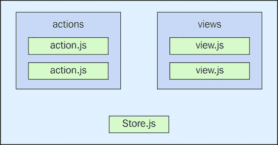

# 第四章：创建操作

在上一章中，我们致力于构建我们的 Flux 应用的骨架架构。操作是由分发器直接分发的。现在我们已经掌握了骨架 Flux 架构，是时候更深入地研究操作了，特别是操作的创建方式。

我们将从讨论我们赋予操作的名称以及用于识别系统中可用操作的常量开始。然后，我们将实现一些操作创建函数，并考虑如何保持这些模块化。尽管我们可能已经完成了骨架架构的实现，但我们可能仍然需要模拟一些 API 数据——我们将通过操作创建函数介绍如何完成这项工作。

典型的操作创建函数是无状态的——输入数据，输出数据。我们将讨论一些操作创建函数实际上依赖于状态的情况，例如涉及长时间运行连接的情况。我们将以参数化操作创建函数的介绍来结束本章，这将允许我们为不同的目的重用它们。

# 操作名称和常量

任何大型 Flux 应用都会有很多操作。这就是为什么拥有操作常量和合理的操作名称很重要的原因。本节的重点是讨论操作的可能命名约定，并整理我们的操作。常量有助于减少重复且易出错的字符串，但我们也需要考虑如何最好地组织我们的常量。我们还将查看静态操作数据——这也有助于我们减少必须编写的操作分发代码的数量。

## 操作名称约定

Flux 系统中的所有操作都有一个名称。名称很重要，因为它告诉查看它的人很多关于它做什么的信息。如果一个应用中少于十个操作，不太可能对命名约定有强烈的要求，因为我们很容易就能弄清楚这些操作做什么。然而，同样不太可能我们会使用 Flux 来实现一个小型应用——Flux 是用于需要扩展的系统。这意味着有很多操作的可能性很大。

操作名称可以分为两个部分——*主题*和*操作*。例如，一个名为 `ACTIVATE` 的操作不会非常有帮助——我们在激活什么？在名称中添加一个主题通常就足以提供所需的大量上下文。以下是一些示例：

+   `ACTIVATE_SETTING`

+   `ACTIVATE_USER`

+   `ACTIVATE_TAB`

主题只是我们系统中的一种抽象类型的东西——它甚至不需要对应一个具体的软件实体。然而，如果我们的系统中有很多具有相似操作的主题，我们可能想要改变操作名称的格式，例如：

+   `SETTING_ACTIVATE`

+   `USER_ACTIVATE`

+   `TAB_ACTIVATE`

最后，这实际上是一个个人（或团队）偏好问题，只要名称足够描述性，足以向查看代码的人提供意义即可。如果主题和操作不够用怎么办？例如，可能有几个相似的主题，这可能会引起混淆。然后，我们可以在名称中添加另一个主题层——将其视为动作的命名空间。

### 注意

尽量不要在 Flux 动作名称中超过三个部分。如果你觉得需要这样做，那么你的架构中可能还有其他地方需要关注。

## 静态动作数据

一些动作与其他动作非常相似，相似之处在于发送到存储器的有效负载数据具有许多相同的属性。如果我们直接使用分发器实例分发这些动作，那么我们通常需要重复对象字面量代码。让我们看看一个动作创建函数：

```js
import dispatcher from '../dispatcher';

// The action name.
export const SORT_USERS = 'SORT_USERS';

// This action creator function hard-codes
// the action payload.
export function sortUsers() {
  dispatcher.dispatch({
    type: SORT_USERS,
    payload: {
      direction: 'asc'
    }
  });
}
```

这个动作的目标非常直接——对用户列表进行排序，这些用户可能是 UI 组件。所需的有效负载数据仅是一个排序方向，该方向在 `direction` 属性中指定。这个动作创建函数的问题在于这个有效负载数据是硬编码的。例如，这里讨论的有效负载数据似乎相当通用，其他对数据进行排序的动作创建函数应该遵循这个模式。但这同时也意味着它们各自都会有自己的硬编码值。

我们可以做的关于这一点的事情是在 `actions` 目录中创建一个模块，该模块导出可以在多个动作创建函数之间共享的任何默认有效负载数据。继续使用排序示例，该模块可能开始看起来像这样：

```js
// This object is used by several action
// creator functions as part of the action
// payload.
export const PAYLOAD_SORT = {
  direction: 'asc'
};
```

这很容易扩展。当需要新的属性或旧默认值需要更改时，我们可以扩展 `PAYLOAD_SORT`。当需要时，添加新的默认有效负载也很容易。让我们看看另一个使用此默认有效负载的动作创建函数：

```js
import dispatcher from '../dispatcher';
import { PAYLOAD_SORT } from './payload-defaults';

// The action name.
export const SORT_TASKS = 'SORT_TASKS';

// This action creator function is using
// the "PAYLOAD_SORT" default object as the
// payload.
export function sortTasks() {
  dispatcher.dispatch({
    type: SORT_TASKS,
    payload: PAYLOAD_SORT
  });
}
```

如我们所见，`PAYLOAD_SORT` 对象被 `sortTasks()` 函数使用，而不是在动作创建器中硬编码有效负载。这减少了我们需要编写的代码量，并将通用有效负载数据放在一个中心位置，使我们能够轻松地更改许多动作创建函数的行为。

### 注意

你可能已经注意到，默认的有效负载对象是直接传递给 `dispatch()` 的。大多数情况下，我们会有部分有效负载对象在多个函数中是通用的，而另一部分则是动态的。我们将在本章的最后部分构建本节的示例，届时将考虑参数化动作创建函数。

现在，让我们来看看这两个动作创建函数的实际应用，以确保我们得到预期的结果。而不是为这个设置存储，我们只需直接监听分发器：

```js
import dispatcher from './dispatcher';

// Gets the action constant and creator function
// for "SORT_USERS".
import {
  SORT_USERS,
  sortUsers
} from './actions/sort-users';

// Gets the action constant and creator function
// for "SORT_TASKS".
import {
  SORT_TASKS,
  sortTasks
} from './actions/sort-tasks';

// Listen for actions, and log some information
// depending on which action was dispatched.
// Note that we're using the action name constants
// here, so there's less chance of human error.
dispatcher.register((e) => {
  switch (e.type) {
    case SORT_USERS:
      console.log(`Sorting users "${e.payload.direction}"`);
      break;
    case SORT_TASKS:
      console.log(`Sorting tasks "${e.payload.direction}"`);
      break;
  }
});

sortUsers();
// → Sorting users "asc"

sortTasks();
// → Sorting tasks "asc"
```

## 组织动作常量

你可能已经注意到，在之前的例子中已经有一些关于操作常量的组织性。例如，`SORT_USERS`常量是在与`sortUsers()`操作创建函数相同的模块中定义的。这通常是一个好主意，因为这两者之间关系密切。然而，这也存在一个缺点。想象一个需要处理大量操作的更复杂的存储器。如果每个单独的操作常量都在自己的模块中声明，存储器将不得不执行大量的导入，只是为了获取这些常量。如果有多个复杂的存储器，每个都需要访问大量操作，导入的数量开始真正增加。这个问题在这里得到了说明：

```js
import { ACTION_A } from '../actions/action-a';
import { ACTION_B } from '../actions/action-b';
import { ACTION_C } from '../actions/action-c';
// …
```

如果我们发现自己处于这种情况下，即几个存储器需要访问几个模块，可能我们需要在`actions`目录中创建一个`constants.js`模块。这个模块将暴露系统中的每一个操作。以下是这个模块可能的样子：

```js
export { ACTION_A } from './action-a';
export { ACTION_B } from './action-b';
export { ACTION_C } from './action-c';
```

随着我们的系统增长和新操作的添加，这就是我们集中管理操作常量的地方，以便于需要大量常量的存储器轻松访问。它们在这里没有定义；这只是一个代理，减少了从存储器中导入的数量，因为存储器从不需要操作创建函数。让我们看看从需要操作常量的存储器的角度来看，情况是否有所改善：

```js
import {
  ACTION_A,
  ACTION_B,
  ACTION_C
} from './actions/constants';

console.log(ACTION_A);
// → ACTION_A

console.log(ACTION_B);
// → ACTION_B

console.log(ACTION_C);
// → ACTION_C
```

这样更好。只有一个`import`语句就能获取我们所需的一切，而且代码依然清晰易读。我们可以有几种方法来调整这种做法，使其更符合我们的需求。例如，我们可能不想创建一个大的常量模块，而是希望将我们的操作分组到逻辑模块中，这些模块更接近我们的功能，同样也适用于我们的操作创建函数。我们将在下一节讨论与我们的应用程序功能相关的操作模块化。

# 功能操作创建函数

操作创建函数需要组织，就像操作常量一样。在本章前面的代码示例中，我们已经将我们的操作常量和操作创建函数组织到模块中。这使我们的操作代码保持整洁且易于遍历。在本节中，我们将从功能的角度来构建这个想法。我们将探讨为什么一开始就值得考虑这个问题，然后我们将讨论这些想法如何使整体架构更加模块化。

## 当需要模块化时

我们是否需要在 Flux 项目的开始阶段就深入思考模块化的操作创建函数？当项目规模还较小时，如果所有操作创建函数都是单一的操作创建模块的一部分，这是可以接受的——这根本不会对架构产生有意义的影响。只有当我们有十几个或更多的操作时，我们才需要开始考虑模块化，特别是功能。

我们可以将动作创建者模块拆分为几个更小的模块，每个模块都有自己的动作创建者函数。这当然是一个正确的方向，但从本质上讲，我们只是将问题移动到了目录级别。因此，我们不再有一个单一的模块，而是一个包含许多文件的单一目录。这个目录在这里得到了说明：


这种布局本身并没有什么固有的错误——只是没有指示哪个功能包含特定的操作。这可能甚至不是必要的，但当架构增长到一定规模时，通常有助于按功能分组操作模块。这个概念在这里得到了说明：


一旦我们能够以这种方式组织系统的操作，使它们反映任何给定功能的任何行为，我们就可以开始考虑与模块化相关的其他架构挑战。我们将在下一节讨论这些内容。

## 模块化架构

当 Flux 架构中的模块开始呈现出我们应用提供的功能形状时，这是一件好事。这在架构的其他地方也有影响。例如，如果我们按功能组织操作，那么我们是否也应该按功能组织存储和视图？存储很容易——它们不能精确地分解成更小的存储；它们自然地代表了一个功能的全貌。另一方面，视图可能包含许多 JavaScript 模块来组织在一个功能内。以下是一个 Flux 功能的潜在目录结构：



这是一个结构紧凑的布局——所有需要执行这些操作的视图都在同一个父目录中。同样，通知视图关于状态变化的存储也在同一个地方。我们可以通过遵循类似的模式来处理我们所有的功能，这还有一个额外的优点，就是促进了一致性。

我们将在本书的结尾重新审视功能模块的结构。现在，我们主要关心的是其他功能可能对一组操作具有的依赖关系。例如，我们的功能定义了几个由视图分发的操作。那么，其他想要对这些操作做出响应的功能应该怎么办——它们需要依赖这个功能来执行操作吗？还有关于动作创建者本身的问题，以及其他功能是否可以分发它们。答案是响亮的“是”，原因很简单——动作是 Flux 架构中事情发生的方式。没有事件总线，模块可以以“点火并忘记”的方式发布事件。动作在我们的 Flux 架构的模块化中起着至关重要的作用。

# 模拟数据

Flux 架构中的调度器是新数据进入系统的单一入口点。这使得我们能够轻松地制造模拟数据以帮助我们更快地生成功能。在本节中，我们将讨论模拟现有 API，以及是否值得将其构建到与它们通信的动作创建器函数中。然后，我们将介绍为尚未存在的 API 实现模拟，接着探讨用模拟动作创建器替代真实动作创建器的策略。

## 模拟现有 API

为了在 Flux 系统中模拟数据，需要分发的动作必须将这个模拟数据传递给存储。这是通过创建一个替代的动作创建器函数实现，该函数分发动作。当动作创建器已经有一个可以针对的 API 时，我们不一定需要在开发特定功能时模拟数据——数据已经存在了。然而，动作创建器使用的 API 的存在不应排除存在一个模拟版本的可能性。

我们想要这样做的主要原因是因为在我们产品的生命周期中的任何时刻，都可能存在一个我们需要但尚未出现的 API。正如我们将在下一节中看到的，显然我们想要模拟这个 API 返回的数据，以便我们能够继续实现我们正在工作的功能。但我们真的想要模拟一些动作而不模拟其他动作吗？这个想法在这里得到了说明：


这种方法——模拟一些动作而实际实现其他动作——的挑战在于一致性。当我们模拟进入系统的数据时，我们必须意识到一组数据与另一组数据之间的关系。从我们存储的角度来看——它们之间可能存在依赖关系。我们能否使用模拟数据和实际数据混合来捕捉这些依赖关系？以下是一个模拟整个系统动作的示例：


在我们尝试新功能时，最好对所使用的数据有完全的控制。这消除了由于我们数据中的一些不一致性而导致的错误行为。构建这样的模拟数据需要更多的努力，但当我们添加新功能时，这会带来回报，因为我们每次只需要模拟一个新动作，就像它被添加到系统中一样。正如我们将在本节后面看到的那样，用模拟动作创建器替代生产动作创建器很容易。

## 模拟新 API

在实现新功能的过程中，当我们缺少 API 功能时，我们必须进行模拟。我们可以使用这个新的模拟与我们已经创建的其他模拟一起支持应用程序中的其他功能。这样做的好处是，它允许我们立即创建一些东西，我们可以向利益相关者展示。将 API 作为动作创建者函数进行模拟的另一个好处是，它们可以帮助将 API 引导到正确的方向。没有 UI，API 没有任何东西可以基于其设计，所以这是一个征求与我们要构建的应用程序最兼容的设计的好机会。

让我们看看一些模拟作为动作有效载荷分发的数据的动作创建者函数。我们将从一个基本的加载函数开始，这个函数将一些数据引导到存储中供我们使用：

```js
import dispatcher from '../dispatcher';

// The action identifier...
export const LOAD_TASKS = 'LOAD_TASKS';

// Immediately dispatches the action using an array
// of task objects as the mock data.
export function loadTasks() {
  dispatcher.dispatch({
    type: LOAD_TASKS,
    payload: [
      { id: 1, name: 'Task 1', state: 'running' },
      { id: 2, name: 'Task 2', state: 'queued' },
      { id: 3, name: 'Task 3', state: 'finished'}
    ]
  });
}
```

这相当简单。我们想要模拟的数据是函数的一部分，作为动作有效载荷。现在让我们看看另一个模拟动作创建者，它是在数据已经被引导后操纵存储状态的：

```js
import dispatcher from '../dispatcher';

// The action identifier...
export const RUN_TASK = 'RUN_TASK';

// Uses "setTimeout()" to simulate latency we'd
// likely see in a real network request.
export function runTask() {
  setTimeout(() => {
    dispatcher.dispatch({
      type: RUN_TASK,

      // Highly-specific mock payload data. This
      // mock data doesn't necessarily have to
      // be hard-coded like this, but it does make
      // experimentation easy.
      payload: {
        id: 2,
        state: 'running'
      }
    });
  }, 1000);
}
```

再次强调，我们在这里使用的是非常具体的模拟数据，这是可以接受的，因为它直接耦合到正在分发动作的动作创建者函数——这也是数据进入系统的唯一方式。这个函数与其他函数不同的另一个特点是，它通过在`setTimeout()`回调在 1 秒后触发之前不分发动作来模拟延迟。

### 注意

我们将在后面的章节中更详细地探讨异步动作，包括延迟、承诺和多个 API 端点。

到目前为止，我们有可用的两个模拟动作创建者函数。但在我们开始使用这些函数之前，让我们创建一个任务存储，以确保正确的信息被存储：

```js
import EventEmitter from 'events';
import dispatcher from '../dispatcher';
import { LOAD_TASKS } from '../actions/load-tasks';
import { RUN_TASK } from '../actions/run-task';

// The store for tasks displayed in the application.
class TaskStore extends EventEmitter {
  constructor() {
    super();

    this.state = [];

    dispatcher.register((e) => {
      switch(e.type) {

        // In the case of "LOAD_TASKS", we can use the
        // "payload" as the new store state.
        case LOAD_TASKS:
          this.state = e.payload;
          this.emit('change', this.state);
          break;

        // In the case of "RUN_TASK", we need to look
        // up a specific task object and change it's state.
        case RUN_TASK:
          let task = this.state.find(
            x =>x.id === e.payload.id);

          task.state = e.payload.state;

          this.emit('change', this.state);

          break;
      }
    });
  }
}

export default new TaskStore();
```

现在我们有一个存储来处理我们刚刚实现的所有动作，让我们在应用程序的`main.js`模块中使用存储和动作：

```js
import taskStore from './stores/task';
import { loadTasks } from './actions/load-tasks';
import { runTask } from './actions/run-task';

// Logs the state of the store, as a mapped array
// of strings.
taskStore.on('change', (state) => {
  console.log('tasks',
    state.map(x => `${x.name} (${x.state})`));
});

loadTasks();
// →
// tasks [
//   "Task 1 (running)",
//   "Task 2 (queued)",
//   "Task 3 (finished)"
// ]

runTask();
// →
// tasks [
//   "Task 1 (running)",
//   "Task 2 (running)",
//   "Task 3 (finished)"
// ]
```

正如你所见，通过调用`loadTasks()`，任务已成功引导到存储中，当我们调用`runTask()`时，第二个任务的状态被更新。这个后者的更新直到一秒后才会被记录。

## 替换动作创建者

到目前为止，我们有一个工作的动作创建者函数，它将模拟有效载荷数据的动作分发到系统中。回想一下，我们不一定想摆脱这些动作创建者函数，因为当我们需要实现新功能时，我们还想再次使用这些模拟。

我们真正需要的是一个全局开关，可以切换系统的模拟模式，这将改变使用的动作创建者函数的实现。以下是一个显示这可能如何工作的图解：


这里的想法是在模块内部存在同一动作创建函数的模拟版本和生产版本。这是容易的部分；困难的部分是实现一个全局模拟开关，以便根据应用程序的模式导出正确的函数：

```js
import { MOCK } from '../settings';
import dispatcher from '../dispatcher';

// The action identifier...
export const LOAD_USERS = 'LOAD_USERS';

// The mock implementation of the action creator.
function mockLoadUsers() {
  dispatcher.dispatch({
    type: LOAD_USERS,
    payload: [
      { id: 1, name: 'Mock 1' },
      { id: 2, name: 'Mock 2' }
    ]
  });
}

// The production implementation of the action creator.
function prodLoadUsers() {
  dispatcher.dispatch({
    type: LOAD_USERS,
    payload: [
      { id: 1, name: 'Prod 1' },
      { id: 2, name: 'Prod 2' }
    ]
  });
}

// Here's where the "loadUsers" value is determined, based
// on the "MOCK" setting. It's always going to be exported
// as "loadUsers", meaning that no other code needs to change.
const loadUsers = MOCK ? mockLoadUsers : prodLoadUsers;
export { loadUsers as loadUsers };
```

在开发过程中，这非常方便，因为我们的模拟函数的范围仅限于动作创建模块，并且由一个设置控制。让我们看看这个动作创建函数是如何使用的，无论导出的是模拟还是生产实现：

```js
import dispatcher from './dispatcher';

// This code never has to change, although the actual
// function that's exported will change, depending on
// the "MOCK" setting.
import { loadUsers } from './actions/load-users';

dispatcher.register((e) => {
  console.log('Users', e.payload.map(x =>x.name));
});

loadUsers();
// → Users ["Mock 1", "Mock 2"]
// When the "MOCK" setting is set to true...
// → Users ["Prod 1", "Prod 2"]
```

# 有状态动作创建者

在本章中我们讨论的动作创建函数相对简单——当被调用时，它们会分发一些动作。但在那之前，这些动作创建者通常会联系某个 API 端点以检索一些数据，然后使用这些数据作为有效载荷分发动作。这些被称为无状态动作创建函数，因为它们没有中间状态——换句话说，没有生命周期。

在本节中，我们将思考那些有状态的事物，以及我们如何将它们集成到我们的 Flux 架构中。我们可能面临的另一个挑战是将我们的 Flux 应用程序集成到另一个架构中。首先，我们将介绍一些关于有状态动作创建者的基础知识，然后我们将通过使用 Web sockets 的实例来查看一个具体的例子。

## 与其他系统集成

大多数情况下，Flux 应用程序在浏览器中是独立的。也就是说，它们不是更大机器上的一个齿轮。然而，我们可能会遇到需要我们的 Flux 架构适应更大系统的案例。例如，如果我们需要与使用完全不同框架的组件进行接口，那么我们需要想出一个方法来嵌入我们的软件，同时不破坏 Flux 模式。或者，也许我们的应用程序与我们集成的应用程序之间的耦合稍微松散一些，就像在与另一个浏览器标签页通信时那样。无论情况如何，我们必须能够向这个外部系统发送消息，并且我们需要能够从它那里接收消息，将它们转换为操作。以下是这个想法的说明：


如您所见，这里描述的 Flux 架构不是一个封闭系统。主要影响是，我们习惯于在系统中调用的典型动作创建函数并不一定在系统中被调用。也就是说，它们正在处理外部消息流，使用与另一个系统的有状态连接。这正是 Web sockets 的工作方式。接下来，我们将查看这些有状态的动作创建函数。

## Web socket 连接

WebSocket 连接在现代 Web 应用程序中越来越普及，如果我们正在构建 Flux 架构，那么我们很可能需要构建 WebSocket 支持。当后端的状态发生变化时，WebSocket 连接是通知客户端这种变化的好方法。例如，想象一个 Flux 存储正在管理某些后端数据的状态，如果有什么原因导致其状态发生变化——我们难道不希望存储知道这一点吗？

挑战在于，我们需要一个有状态的连接来接收 WebSocket 消息并将它们转换为 Flux 操作。这就是 WebSocket 数据进入系统的方式。让我们看看一些 socket 监听器代码：

```js
// Get the action constants and action functions
// that we need.
import { ONE, one } from './one';
import { TWO, two } from './two';
import { THREE, three } from './three';

var ws;
var actions = {};

// Create a mapping of constants to functions
// that the web socket handler can use to call
// the appropriate action creator.
actions[ONE] = one;
actions[TWO] = two;
actions[THREE] = three;

// Connects the web socket...
export default function connect() {
  ws = new WebSocket('ws://127.0.0.1:8000');

  ws.addEventListener('message', (e) => {

    // Parses the message data and uses the
    // "actions" map to call the corresponding
    // action creator function.
    let data = JSON.parse(e.data);
    actionsdata.task;
  });
}
```

在这里我们只是创建了一个简单的 `actions` 映射。这是根据接收到的消息的 `task` 属性调用正确的操作创建函数的方法。这种方法的优点是，为了使它工作，所需的额外功能非常少；前面的代码就是全部。实际的操作创建函数、常量等等，都是典型的 Flux 项目。让我们看看生成这些 WebSocket 消息的服务器代码，以便了解实际上传递给 socket 监听器代码的内容：

```js
// The HTTP server...
var server = require('http').createServer();

// The web socket server...
var ws = new require('ws').Server({
  server: server,
});

// Makes life worth living...
var express = require('express');
var app = express();

// So we can serve "index.html"...
app.use(express.static(__dirname));

// Handler for when a client connects via web socket.
ws.on('connection', function connection(ws) {
  let i = 0;
  const names = [ null, 'one', 'two', 'three' ];

  // Sends the client 3 messages, spaced by 1 second
  // intervals.
  function interval() {
    if (++i< 4) {
      ws.send(JSON.stringify({
        value: i,
        task: names[i]
      }));

      setTimeout(interval, 1000);
    }
  }

  setTimeout(interval, 1000);
});

// Fire up the HTTP and web socket servers.
server.on('request', app);
server.listen(8000, () => {
  console.log('Listening on', server.address().port)
});
```

在接下来的三秒钟内，我们将看到三个 WebSocket 消息被发送到客户端。每个消息都有一个 `task` 属性，这是我们用来确定要派发哪个操作的值。让我们看一下 `main.js` 前端模块，确保一切按预期工作：

```js
import dispatcher from './dispatcher';
import connect from './actions/socket-listener';
import { ONE } from './actions/one';
import { TWO } from './actions/two';
import { THREE } from './actions/three';

// Logs the web socket messages that have been
// dispatched as Flux actions.
dispatcher.register((e) => {
  switch (e.type) {
    case ONE:
      console.log('one', e.payload);
      break;
    case TWO:
      console.log('two', e.payload);
      break;
    case THREE:
      console.log('three', e.payload);
      break;
  }
});
// →
// one 1
// two 2
// three 3

// Establishes the web socket connection. Note
// that it's important to connect after everything
// with the Flux dispatcher is setup. 
connect();
```

如您所见，`connect()` 函数负责建立 WebSocket 连接。这是一个简单的实现，缺乏一些生产级功能，例如重新连接丢失的连接。然而，这里需要注意的是，这个监听器实际上位于其他操作模块相同的目录中。我们实际上希望这里有一个紧密耦合，因为 socket 监听器的主要目标是通过转换 WebSocket 消息来派发操作。

# 参数化操作创建者

本章的最后一节重点介绍了参数化操作创建者。到目前为止，本章中我们看到的操作创建者函数都是不接受任何参数的基本函数。这很好，除非我们开始积累几个几乎相同的独特操作。如果没有参数化操作创建者函数，我们很快就会有无穷无尽的函数；这并不适合扩展。

首先，我们将确定传递参数到操作创建函数的目标，然后是一些实现通用操作创建函数的示例代码。然后我们将探讨创建部分函数，通过组合操作创建者来进一步减少重复性。

## 移除冗余操作

操作创建者是普通的 JavaScript 函数。这意味着它们在调用时可以接受零个或多个参数。无论是否在 Flux 的上下文中实现函数，其整个目的都是减少我们必须编写的代码量。在 Flux 应用程序中的操作创建者可能会积累，因为它们驱动着我们的应用程序的行为。如果发生任何事情，都可以追溯到操作。因此，在一天之内引入几个新的操作是很常见的。

一旦我们的应用程序实现了几个功能，我们肯定会有一大堆操作。其中一些操作将服务于一个特定的目的，而其他操作将彼此非常相似。换句话说，一些操作开始感觉重复。目标是通过引入参数来移除重复的操作创建函数。

我们在重构操作创建函数的方式上应该谨慎行事。有一个强有力的论点支持为系统中的每种类型的操作保留一个专门的函数。也就是说，一个操作创建函数应该只派发一种类型的操作，而不是几种选项中的一种。否则，我们代码的可追溯性将会降低。我们应该努力减少系统中的操作总数。

## 保持操作通用

当操作通用时，架构对它们的需求更少。这是一件好事，因为它意味着我们在编写代码时需要记住的知识更少。让我们看看几个本质上做同样事情的几个操作；换句话说，它们根本不是通用的。第一个操作如下：

```js
import dispatcher from '../dispatcher';
import sortBy from 'lodash/sortBy';

// The action identifier...
export const FIRST = 'FIRST';

export function first() {

  // The payload data.
  let payload = [ 20, 10, 30 ];

  // Dispatches the "FIRST" action with
  // the payload sorted in ascending order.
  dispatcher.dispatch({
    type: FIRST,
    payload: sortBy(payload)
  });
}
```

简单到足以——这是使用 lodash 的 `sortBy()` 函数在派发操作之前对有效负载进行排序。

### 注意

注意，我们实际上不会在操作创建函数中这样排序有效负载数据。把这看作是一个 API 模拟。重点是操作创建函数正在向 Flux 之外请求数据。

让我们看看另一个类似但不同的操作：

```js
import dispatcher from '../dispatcher';
import sortBy from 'lodash/sortBy';

// The action identifier...
export const SECOND = 'SECOND';

export function second() {

  // The payload data.
  let payload = [ 20, 10, 30 ];

  // Dispatches the action, with the
  // payload sorted in descending order.
  dispatcher.dispatch({
    type: SECOND,
    payload: sortBy(payload, x => x * -1)
  });
}
```

这里的唯一区别是我们如何排序数据。如果这是一个生产操作创建函数，我们会告诉 API 按降序排序数据，而不是在操作创建函数中使用 lodash 来做。我们需要两个不同的操作来处理这两种排序方向吗？或者我们可以通过一个接受排序方向参数的通用操作来消除这两个操作？以下是通用实现的示例：

```js
import dispatcher from '../dispatcher';
import sortBy from 'lodash/sortBy';

// The action identifier...
export const THIRD = 'THIRD';

// Accepts a sort direction, but defaults
// to descending.
export function third(dir='desc') {

  // The payload data.
  let payload = [ 20, 10, 30 ];

  // The iteratee function that's passed
  // to "sortBy()".
  let iteratee;

  // Sets up the custom "iteratee" if we
  // want to sort in descending order.
  if (dir === 'desc') {
    iteratee = x => x * -1;
  }

  // Dispatches the action, sorting the payload
  // based on "dir".
  dispatcher.dispatch({
    type: THIRD,
    payload: sortBy(payload, iteratee)
  });
}
```

这里是所有三个正在使用的操作。请注意，第三个操作涵盖了两种情况，而且无论传递什么参数，基本的排序操作都是相同的。您可以在存储回调函数中看到，存储器会更愿意监听一个操作而不是两个或更多：

```js
import dispatcher from './dispatcher';
import { FIRST, first } from './actions/first';
import { SECOND, second } from './actions/second';
import { THIRD, third } from './actions/third';

// Logs the specific action payloads as
// they're dispatched.
dispatcher.register((e) => {
  switch(e.type) {
    case FIRST:
      console.log('first', e.payload);
      break;
    case SECOND:
      console.log('second', e.payload);
      break;
    case THIRD:
      console.log('third', e.payload);
      break;
  }
});

first();
// → first [10, 20, 30]

second();
// → second [30, 20, 10]

third();
// → third [30, 20, 10]

third('asc');
// → third [10, 20, 30]
```

## 创建操作部分

在某些情况下，函数参数是直接的——比如有一个或两个参数。在其他情况下，参数列表可能会令人望而生畏，尤其是当我们反复使用相同的一小部分参数调用它们时。Flux 应用中的动作创建函数也不例外。会有一些情况，我们有一个通用函数，它支持偶尔的情况，即不是提供一个新的动作创建函数，而是提供一个不同的参数。但在最常见的情况下，必须始终提供相同的参数，这可能会变得重复，以至于失去了通用函数的意义。

让我们看看一个通用的动作创建函数，它接受可变数量的参数。由于在大多数情况下，相同的参数会被传递给函数，因此我们还会导出一个部分应用了这些参数的函数的版本。

### 注意

在 ES2015 语法中，默认参数是创建部分函数的良好替代品，但只有当参数数量固定时。

```js
import dispatcher from '../dispatcher';
import partial from 'lodash/partial';

// The action identifier...
export const FIRST = 'FIRST';

// The generic implementation of the action creator.
export function first(...values) {

  // The payload data.
  let defaults = [ 'a', 'b', 'c' ];

  // Dispatches the "FIRST" action with
  // the "values" array concatenated to
  // the "defaults" array.
  dispatcher.dispatch({
    type: FIRST,
    payload: defaults.concat(values)
  });
}

// Exports a common version of "first()" with
// the common arguments already applied.
export const firstCommon = partial(first, 'd', 'e', 'f');
```

现在，让我们看看这两个相同动作创建函数版本的使用方法：

```js
import dispatcher from './dispatcher';
import { FIRST, first, firstCommon } from './actions/first';

// Logs the specific action payloads as
// they're dispatched.
dispatcher.register((e) => {
  switch(e.type) {
    case FIRST:
      console.log('first', e.payload);
      break;
  }
});

// Calls the action creator with a common set
// of arguments. This is the type of code we
// want to avoid repeating all over the place.
first('d', 'e', 'f');
// → first ["a", "b", "c", "d", "e", "f"]

// The exact same thing as the "fist()" call above.
// The common arguments have been partially-applied.
firstCommon();
// → first ["a", "b", "c", "d", "e", "f"]
```

### 注意

重要的是要注意，`first()` 和 `firstCommon()` 函数是同一个动作创建函数，这就是为什么它们被定义在同一个模块中的原因。如果我们把 `firstCommon()` 定义在另一个动作模块中，这会导致混淆，因为它们都使用相同的动作类型——`FIRST`。

# 摘要

在本章中，你学习了 Flux 应用利用的动作创建函数，以便分发动作。如果没有动作创建函数，我们就必须直接在我们的代码中与分发器接口，这使得架构更难推理。

我们首先思考了动作命名约定和我们的动作模块的一般组织结构。按功能分组动作创建函数对模块化也有影响，尤其是在它如何影响架构的其他方面。

接下来，我们讨论了使用动作创建函数来模拟数据。在 Flux 应用中模拟数据很容易做到，并且是被鼓励的。动作是数据进入系统的唯一方式，这使得我们能够轻松地在模拟动作数据和我们的生产实现之间切换。我们通过查看监听诸如 WebSocket 连接等内容的可状态动作创建函数，以及查看将重复代码保持在最低限度的参数化动作创建函数来结束这一章。

在下一章中，我们将解决动作创建函数的另一个关键方面——异步性。
