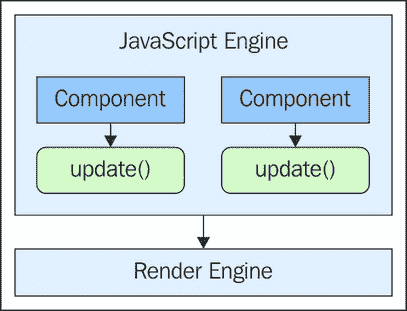
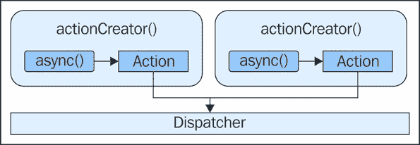
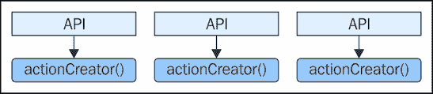
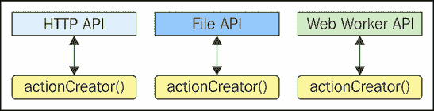
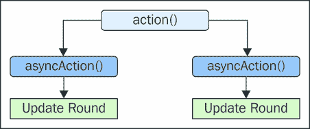
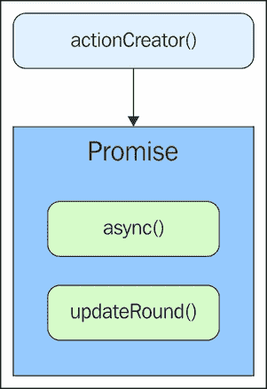

# 第五章。异步动作

在第四章，“创建动作”中，我们详细考察了 Flux 动作——特别是动作创建函数。动作创建者我们没有涉及的一个方面是异步行为。异步性对于任何 Web 应用程序都是核心的，在本章中，我们将思考这对于 Flux 架构意味着什么。

我们将首先介绍 Flux 的同步性质，因为打破这种同步性会破坏整个架构。接下来，我们将深入研究一些进行 API 调用的代码和一些在实际上派发动作之前需要同步多个 API 调用的动作创建者。然后，我们将介绍动作创建函数的返回值作为承诺。

# 保持 Flux 同步

我们可能听起来会想保持架构同步——尤其是在 Web 上。当所有操作都是同步执行时，会发生延迟的用户体验怎么办？

就只是 Flux 的数据流是同步的，而不是整个应用程序。在本节中，我们将探讨为什么保持我们架构的核心数据流机制同步是一个好主意。接下来，我们将讨论我们应该如何封装应用程序中的异步行为。最后，我们将概述异步动作创建函数的一般语义。

## 为什么是同步的？

简单的答案是，任何异步操作都会引入一种不确定性，否则不会存在。鉴于 Web 浏览器中所有的新潮功能，可能会让人想将所有事情都并行执行——尽可能利用尽可能多的并发 Web 请求和处理器核心。一旦我们走上这条路，就很难回头，而且我们走得越远，同步语义就越复杂。

让我们暂时思考一下 DOM API。JavaScript 应用程序使用这个 API 来改变页面上的元素状态。当这些变化发生时，浏览器的渲染引擎会介入并更新屏幕，以便用户实际上可以看到这些变化。DOM API 并不直接与屏幕上显示的内容接口——渲染引擎为我们处理了一大堆棘手的细节。这个想法在这里得到了说明：



这里的要点是，不是我们组件做出的单个更新导致渲染引擎更新屏幕。JavaScript 引擎是运行到完成，这意味着它在将控制权交给渲染引擎之前，会等待所有这些组件完成它们对更新 DOM（以及它们正在运行的任何其他代码）的调用。这意味着用户看到的任何更新在本质上都是同步的——世界上所有的并发代码都不会改变 JavaScript 引擎和渲染引擎之间的同步通信路径。

你可能现在会想知道这与 Flux 有什么关系。实际上，这非常相关，因为 Flux 的作者理解这种同步 DOM 更新机制，所以他们不是在复杂异步代码的每个地方与之抗争，而是提出了拥抱 DOM 更新同步特性的数据流语义。

Flux 用于同步数据流的核心理念是**更新轮次**，这一概念在第二章 *Flux 原理* 中被引入。没有任何东西可以中断一个更新轮次，因为参与其中的每个组件都没有异步行为。如果 Flux 有一个杀手级特性，那就是这个。更新轮次是 Flux 架构的一个关键特性，我们必须特别小心地维护它。它就像一个伞形概念——由异步行为引起的数十个小边缘情况都超出了它的范围。

## 封装异步行为

由于 Flux 更新轮次是同步的，我们应该在哪里放置我们的异步代码呢？让我们稍微思考一下。抛开 Flux 架构不谈，任何异步行为在动作完成并与其他代码同步时，都会以某种方式更新系统的状态。在某些架构中，这种情况无处不在，而且没有任何机制来防止这些类型的异步动作从不应调用它们的地方被调用。

例如，Flux 更新轮次绝不应该导致新的异步行为运行。我们知道更新轮次是同步的，所以这是一个不可能的情况。尽管如此，我们确实需要以某种方式封装我们的异步行为。这正是动作创建函数擅长的——在异步部分完成后执行异步工作并管理动作派发。以下是一个动作创建函数封装异步调用的可视化：



将异步行为保持在动作创建函数中有两个好处。首先，我们知道调用动作创建函数时没有涉及任何同步语义——这一切都由函数为我们处理。第二个优点是，我们所有的异步行为都可以在单个架构层中找到。也就是说，如果有什么是异步的，比如进行 API 调用，我们知道在哪里查找这段代码。

## 异步动作语义

我们的动作创建函数负责在派发任何动作之前执行任何同步操作。一个动作创建函数有两个部分。第一部分是异步调用（如果有），第二部分是实际的动作派发。这些动作创建函数的职责是将异步调用与 Flux 派发器同步，这意味着函数必须在动作可以派发之前等待某种响应。

这是因为异步操作有有效负载数据。让我们看看一个例子，好吗？这里有一个调用 API 来加载用户对象列表的动作创建函数：

```js
import dispatcher from '../dispatcher';

// The action identifier...
export const LOAD_USERS = 'LOAD_USERS';

// Performs some asynchronous behavior, and once
// complete, dispatches the action.
export function loadUsers() {

  // Creates a new promise, intended to simulate
  // a call to some API function, which would likely
  // also return a promise.
  let api = new Promise((resolve, reject) => {

    // Resolves the promise with some data after half
    // a second.
    setTimeout(() => {
      resolve([
        { id: 1, name: 'User 1' },
        { id: 2, name: 'User 2' },
        { id: 3, name: 'User 3' }
      ]);
    }, 500);
  });

  // When the promise resolves, the callback that's
  // passed to "then()" is called with the resolved
  // value. This is the payload that's dispatched.
  api.then((response) => {
    dispatcher.dispatch({
      type: LOAD_USERS,
      payload: response
    });
  });
}
```

如您所见，我们使用了一个承诺来代替实际的 API 调用。一般来说，我们的应用程序可能有一个返回承诺的 API 函数调用。这正是我们在做的事情——在我们实际上只是在处理一个承诺时，让它看起来像我们正在与 API 交谈。不管`setTimeout()`还是实际的 AJAX 响应解决了承诺，其机制都是相同的。

需要注意的重要一点是，`loadUsers()`函数在承诺解决后负责分发动作。可以这样想——除非我们有新数据供系统使用，否则调度器永远不会被调用。等待部分超出了 Flux 更新轮次，这就是为什么将所有内容都放在这样一个函数中很棒。以下是使用`loadUsers()`函数的方法：

```js
import dispatcher from './dispatcher';
import { 
  LOAD_USERS, 
  loadUsers
} from './actions/load-users';

// Logs the specific action payloads as
// they're dispatched.
dispatcher.register((e) => {
  switch(e.type) {
    case LOAD_USERS:
      console.log('users', e.payload.map(x =>x.id));
      break;
  }
});

loadUsers();
// → users [1, 2, 3]
```

### 注意

在这个例子中可能遗漏的是任何错误处理方式。例如，如果 API 有问题，调用`loadUsers()`而它默默地失败将是不愉快的。我们将在本章的最后部分更深入地讨论错误处理。

# 调用 API

在本节中，我们将介绍 Flux 架构中异步行为的常见情况——通过网络调用 API。然后，我们将讨论异步行为在用户交互和 Flux 工具可用性方面的含义。

## APIs are the common case

Flux 架构是针对 Web 应用程序的前端。话虽如此，我们的架构的一些组件和后端 API 之间将会有大量的网络通信。这是异步行为的常见情况，不仅限于 Flux，而且在大多数 JavaScript 应用程序中都是如此。因此，在设计直接与这些 API 端点异步通信的动作创建者时，应该在这里强调。以下是 Flux 应用程序中最常见的通信路径：



存储需要填充数据，这是获取数据最常见的方式——通过从 API 获取。事实上，用户可能花费更多的时间消费信息而不是与 UI 元素交互。正如您在上一个部分所看到的，使用承诺与调度器同步响应并不困难。

这些类型的 API 调用并不是 Flux 架构中异步数据的唯一来源。例如，使用文件 API 读取文件需要使用异步函数调用。与 Web Workers 交互是另一种异步通信形式——你要求工作者计算某些内容，并通过回调函数的形式获得响应。尽管不如 HTTP 调用常见，但这些异步接口可以像这里所示的那样以相同的方式处理。



同样的同步机制——承诺（promises）——可以用于所有这些类型的异步通信通道。就动作创建函数而言，它们都具有相同的接口——一个在稍后时间解决的承诺值。这里的分发语义也是相同的。

由于所有内容都封装在动作创建函数内部，因此 Flux 更新周期中没有异步行为。此外，可能需要多个 API 才能获取动作负载所需的所有数据。我们稍后将讨论这个问题。现在，让我们关注异步动作创建者如何影响用户交互。

## API 调用和用户交互

异步调用和用户界面元素的主要挑战是我们必须管理请求的状态，这反过来又反映了 UI 元素的状态。例如，当用户提交表单时，我们必须提供某种视觉指示，表明请求已被提交并且正在处理。此外，我们还需要防止用户在收到请求状态的响应之前与某些 UI 元素交互。

在 Flux 架构中，存储库包含所有应用程序状态，包括我们想要跟踪的任何网络请求的状态。这可以帮助我们协调与给定请求相关的 UI 元素的状态。让我们看看一个发送异步 API 请求以启动某项操作的动作创建者：

```js
import dispatcher from '../dispatcher';

// The action identifier...
export const START = 'START';

export function start() {

  // Simulate an async API call that starts
  // something. The promise resolves after
  // one second.
  let api = new Promise((resolve, reject) => {
    setTimeout(resolve, 1000);
  });

  // Dispatches the action after the promise
  // has resolved.
  api.then((response) => {
    dispatcher.dispatch({ type: START });
  });
}
```

如您所见，`start()` 函数在承诺解决后分发 `START` 动作。就像真正的 API 调用一样，这种延迟为用户提供了足够的时间在调用返回之前与 UI 交互。因此，我们必须采取措施防止这种情况发生。让我们看看另一个动作创建函数，它告诉系统我们刚刚发起的 API 请求的状态：

```js
import dispatcher from '../dispatcher';

export const STARTING = 'STARTING';

export function starting() {
  dispatcher.dispatch({ type: STARTING });
}
```

通过调用 `starting()`，我们可以通知可能正在监听的任何存储库，我们即将发起一个 API 调用以启动某项操作。这可能包括我们需要处理 UI 元素的状态，以通知用户请求正在进行中，并在请求发生时禁用用户不应触摸的元素。让我们看看一个处理这些类型操作的存储库。

### 注意

存储库还处理 `STOP` 和 `STOPPING` 动作。这些模块在这里没有单独列出，因为它们与 `START` 和 `STARTING` 动作几乎相同。

```js
import dispatcher from '../dispatcher';
import {
  START,
  STARTING,
  STOP,
  STOPPING
} from '../actions/constants';

import { EventEmitter } from 'events';

class MyStore extends EventEmitter {
  constructor() {
    super();

    this.state = {
      startDisabled: false,
      stopDisabled: true
    };

    dispatcher.register((e) => {
      switch(e.type) {

        // If starting or stopping, we don't want any
        // buttons enabled.
        case STARTING:
        case STOPPING:
          this.state.startDisabled = true;
          this.state.stopDisabled = true;
          this.emit('change', this.state);
          break;

        // Disable the stop button after being started.
        case START:
          this.state.startDisabled = true;
          this.state.stopDisabled = false;
          this.emit('change', this.state);
          break;

        // Disabled the start button after being stopped.
        case STOP:
          this.state.startDisabled = false;
          this.state.stopDisabled = true;
          this.emit('change', this.state);
          break;
      }
    });
  }
}

export default new MyStore();
```

存储器对`start`和`stop`按钮的禁用状态有明确的表示。如果`STARTING`或`STOPPING`动作被分发，则可以将两个按钮都标记为禁用。在`START`或`STOP`的情况下，我们可以将适当的按钮标记为禁用，而将另一个标记为启用。现在存储器已经拥有了它们所需的所有状态，让我们现在看看一个实际渲染按钮元素的视图。

### 注意

你可能想知道为什么我们将这两个动作分别分离成两个动作创建函数——`start()`和`starting()`。原因很简单：一个动作创建函数分发一个动作。然而，这并不是固定不变的，而是个人偏好的问题。例如，`start()`可以在实际进行 API 调用之前分发`STARTING`动作。这里的优点是只有一个函数负责所有事情。缺点是我们失去了动作创建函数与动作之间的一对一对应关系，这可能会引起混淆。

```js
import myStore from '../stores/mystore';
import {
  start,
  starting,
  stop,
  stopping
} from '../actions/functions';

class MyView {
  constructor() {

    // The elements our view interacts with...
    this.start = document.getElementById('start');
    this.stop = document.getElementById('stop');

    // The start button was clicked. Dispatch the
    // "STARTING" action, and the "START" action
    // once the asynchronous call resolves.
    this.start.addEventListener('click', (e) => {
      starting();
      start();
    });

    // The stop button was clicked. Dispatch the
    // "STOPPING" action, and the "STOP" action
    // once the asynchronous call resolves.
    this.stop.addEventListener('click', (e) => {
      stopping();
      stop();
    });

    // When the store state changes, update the UI
    // by enabling or disabling the buttons,
    // depending on the store state.
    myStore.on('change', (state) => {
      this.start.disabled = state.startDisabled;
      this.stop.disabled = state.stopDisabled;
    });
  }
}

export default new MyView();
```

注意，点击处理程序的主要任务是调用动作创建函数。它们不会执行额外的状态检查以确保可以调用动作，等等。这类事情不应该放在视图中，而应该放在存储器中。我们在这里遵循这种策略，通过改变特定状态来禁用存储器中的按钮。如果我们检查视图事件处理程序中的这类事情，最终会导致状态与其操作逻辑解耦，而在 Flux 中这并不是一个好现象。

# 组合 API 调用

随着开发进程的推进和功能的日益复杂，我们不可避免地面临复杂的 API 场景。这意味着不再有一个简单的 API 端点可以通过一次调用提供所有功能所需的数据。相反，我们的代码必须将来自不同端点的两个或多个资源拼接在一起，才能获取功能所需的数据。

在本节中，我们将探讨从多个异步资源获取数据并将其作为有效负载数据传递给存储器的动作创建函数。然后，这些存储器将这些数据转换为功能所需的信息。接下来，我们将探讨一种替代方法，即通过较小的动作创建函数组合动作创建函数，每个函数从自己的异步资源中获取数据。

## 复杂的动作创建函数

有时，单个 API 端点可能没有我们为给定存储器所需的所有数据。这意味着我们必须从多个 API 端点获取数据。挑战在于这些是异步资源，在将它们作为动作有效负载分发之前，需要将它们同步传递给存储器。让我们看看一个从三个异步 API 端点获取数据的动作创建函数。但首先，这是我们将用于模拟异步网络调用的 API 函数：

```js
// API helper function - resolves the given
// "data" after the given MS "delay".
function api(data, delay=1000) {
  return new Promise((resolve, reject) => {
    setTimeout(() => {
      resolve(data);
    }, delay);
  });
}

// The first API...
export function first() {
  return api([ 'A', 'B', 'C' ], 500);
}

// The second API...
export function second() {
  return api([ 1, 2, 3 ]);
}

// The third API...
export function third() {
  return api([ 'D', 'E', 'F' ], 1200);
}
```

因此，我们从这些 API 函数中获得了一致的返回值——承诺。从给定函数返回的每个承诺都负责同步那个 API 调用。但是，当我们的存储需要将这些已解析的值组合起来形成存储的状态时怎么办呢？现在让我们看看一个处理这个问题的动作创建函数：

```js
import dispatcher from '../dispatcher';

// The mock API functions we need.
import {
  first,
  second,
  third
} from './api';

// The action identifier...
export constMY_ACTION = 'MY_ACTION';

export function myAction() {

  // Calls all three APIs, which all resolve
  // after different delay times. The "Promise.all()"
  // method synchronizes them and returns a new promise.
  Promise.all([
    first(),
    second(),
    third()
  ]).then((values) => {

    // These are the resolved values...
    let [ first, second, third ] = values;

    // All three API calls have resolved, meaning we
    // can now dispatch "MY_ACTION" with the three
    // resolved async values as the payload.
    dispatcher.dispatch({
      type: MY_ACTION,
      payload: {
        first: first,
        second: second,
        third, third
      }
    });
  });
}
```

只有当所有三个异步值都已解析后，才会分派`MY_ACTION`动作，因为存储依赖于这三个值。当动作被分派时，所有三个值在单个更新轮次内都可用于存储。关于这段代码，虽然不那么明显但同样重要的是，我们在分派有效载荷之前没有在动作创建函数内部执行任何数据转换。相反，我们以有效载荷属性的形式提供已解析的 API 数据。这确保存储是唯一负责其信息状态的组件。让我们看看存储现在如何使用这个有效载荷：

```js
import { EventEmitter } from 'events';
import dispatcher from '../dispatcher';
import { MY_ACTION } from '../actions/myaction';

class MyStore extends EventEmitter {
  constructor() {
    super();

    this.state = [];

    dispatcher.register((e) => {
      switch(e.type) {
        case MY_ACTION:

          // Get the resolved async values from the
          // action payload.
          let { first, second, third } = e.payload;

          // Zip the three arrays and set the resulting
          // array as the store state.
          this.state = first.map((item, i) =>
            [ item, second[i], third[i] ]);

          this.emit('change', this.state);
          break;
      }
    });
  }
}

export default new MyStore();
```

如你所见，存储在有效载荷中拥有执行必要转换所需的一切。让我们调用动作创建函数，看看这个存储是否按预期工作：

```js
import { myAction } from './actions/myaction';
import myStore from './stores/mystore';

myStore.on('change', (state) => {
  console.log('changed', state);
});

myAction();
// → changed
// [
//   [ 'A', 1, 'D' ],
//   [ 'B', 2, 'E' ],
//   [ 'C', 3, 'F' ]
// ]
```

## 组合动作创建者

正如你在本章前面看到的，当涉及到用户交互时，我们的动作创建函数调用可能会变得相当冗长。这是因为我们必须对动作创建函数进行两个或更多的调用。一个调用确保在用户等待异步操作完成时 UI 元素处于适当的状态。另一个调用调用异步行为。为了避免在所有地方都进行两次调用，我们可以在动作创建函数中分派两个动作。然而，这并不总是理想的，因为我们可能在某个时候需要调用第一个动作创建函数而不调用第二个动作创建函数。这更多是一个粒度问题。

简单的解决方案是从两个函数中组合出一个函数。这样，我们保持了粒度，同时减少了在许多地方需要调用的函数数量。让我们回顾一下我们之前的代码，当时我们必须手动调用`starting()`然后`start()`：

```js
import { start as _start } from './start';
import { starting } from './starting';
import { stop as _stop } from './stop';
import { stopping } from './stopping';

// The "start()" function now automatically
// calls "starting()".
export function start() {
  starting();
  _start();
}

// The "stop()" function now automatically
// calls "stopping()"
export function stop() {
  stopping();
  _stop();
}

// Export "starting()" and "stopping()" so
// that they can still be used on their
// own, or composed into other functions.
export { starting, stopping };
```

现在视图可以直接调用`start()`或`stop()`，并将必要的状态更改应用到相关的 UI 元素上。这是因为第一个动作创建函数是同步的——这意味着在执行异步调用之前，完整的 Flux 更新轮次就已经完成。这种行为是一致的，无论什么情况。我们开始遇到问题的地方是当我们开始从几个异步动作创建者中组合函数时，如这里所示：



这里的问题是，我们用来组合`action()`结果的每个`asyncAction()`函数都会导致一个更新轮次。首先发生的更新轮次是一个竞争条件。我们不能将它们组合成一个对多个 API 端点发出请求的单个动作创建器，因为它们服务于两个不同的存储。Flux 的一切都是关于可预测的数据流，这意味着始终知道更新轮次的顺序。在下一节中，我们将重新审视动作创建器函数中的承诺，以帮助我们解决这些棘手的异步动作创建器场景。

# 返回承诺

本章到目前为止，我们查看的所有动作创建器函数都没有返回任何值。这是因为它们的主要任务是分发动作，同时隐藏任何并发同步语义。另一方面，动作创建器函数可以返回一个承诺，这样我们就可以组合跨越多个存储的更复杂的异步行为。在上一节中，我们看到了使用动作创建器函数组合异步行为可能会很困难，甚至不可能。

在本节中，我们将重新审视在组合更大功能时异步行为带来的挑战。然后，我们将创建一个示例实现，使用返回承诺的动作创建器，并通过它们相互同步。最后，我们将看看从动作创建器返回承诺是否可以帮助我们处理在与我们通信的异步资源中发生的错误。

## 无承诺的同步

Flux 架构的一个优点是它的大部分都是同步的。例如，当我们用一个新动作和一个新有效负载调用分发器时，我们可以确信调用将阻塞，直到更新轮次完成，UI 中的所有内容都反映了当前的状态。在异步行为中，情况就不同了——特别是在 Flux 架构中，这种类型的行为严格限于动作创建器函数。因此，我们面临着从大量的异步资源中拼凑复杂系统的必然挑战。

我们在本章早期看到了如何部分实现这一点。单个动作创建器函数可以将几个异步资源的解决值组合成一个动作和一个有效负载。然后，存储中的逻辑可以找出如何利用这些数据并更新其状态。当只有一个存储参与时，这工作得很好，但当我们试图在多个存储和功能之间同步资源时，就会失败。

这时，能够同步异步数据和 Flux 更新轮次变得很重要。为了做到这一点，我们的动作创建器函数需要返回在两者都完成时解决的承诺。以下是我们需要完成的工作的说明：



## 组合异步行为

要绕过这些棘手的异步动作创建器场景，这些函数应该返回在异步行为和更新轮完成后解决的承诺。这会让调用者知道更新轮已完成，并且我们现在调用的任何内容都将在此之后发生。我们追求的是一致性，所以让我们看看一个返回承诺的动作创建器函数：

```js
// The action identifier...
export const FIRST = 'FIRST';

// The API function that returns a promise that's
// resolved after 1.5 seconds.
function api() {
  return new Promise((resolve, reject) => {
    setTimeout(() => {
      resolve({ first: 'First Name' });
    }, 1500);
  });
}

export function first() {

  // Returns a promise so that the caller
  // knows when the update round is complete,
  // regardless of the asynchronous behavior
  // that takes place before the action is dispatched.
  return new Promise((resolve, reject) => {
    api().then((response) => {

      // Action is dispatched after the asynchronous
      // value is resolved.
      dispatcher.dispatch({
        type: FIRST,
        payload: response
      });

      // Resolve the promise returned by "first()",
      // after the update round.
      resolve();
    });
  });
}
```

因此，这个动作创建器调用一个在 1.5 秒后解决的异步 API，此时动作有效载荷被分发，返回的承诺被解决。让我们看看另一个使用不同 API 函数的动作创建器：

```js
import dispatcher from '../dispatcher';

// The action identifier...
export const LAST = 'LAST';

// The API function that returns a promise that's
// resolved after 1.5 seconds.
function api() {
  return new Promise((resolve, reject) => {
    setTimeout(() => {
      resolve({ last: 'Last Name' });
    }, 1000);
  });
}

export function last() {
  return new Promise((resolve, reject) => {
    api().then((response) => {
      dispatcher.dispatch({
        type: LAST,
        payload: response
      });

      resolve();
    });
  });
}
```

你可以看到，这两个动作创建器函数——`first()`和`last()`——通过返回承诺遵循相同的策略。然而，API 函数解析不同的数据，并且只需要 1 秒钟就能完成。让我们看看当我们尝试一起使用这两个函数时会发生什么：

```js
import dispatcher from './dispatcher';
import { FIRST, first } from './actions/first';
import { LAST, last } from './actions/last';

// Logs the payload as actions are dispatched...
dispatcher.register((e) => {
  switch (e.type) {
    case FIRST:
      console.log('first', e.payload.first);
      break;
    case LAST:
      console.log('last', e.payload.last);
      break;
  }
});

// Order of update rounds isn't guaranteed here.
first();
last();
// →
// last Last Name
// first First Name

// With promises, update round order is consistent.
first().then(last);
// →
// first First Name
// last Last Name
```

## 处理错误

当 Flux 动作创建器交互的 API 失败时会发生什么？一般来说，当我们进行 AJAX 调用时，我们提供成功和错误回调函数。这样，我们可以优雅地失败。我们必须小心处理 Flux 动作创建器中的失败，因为，就像存储需要知道动作一样，他们也需要知道失败。

所以问题是——我们在动作创建器函数中做了什么不同的事情？当 API 失败时，我们只是在动作创建器内部分发某种错误动作吗？我们确实想分发一个错误动作，以便存储可以相应地调整其状态，但动作创建器的调用者怎么办？例如，我们可能有一个通用的动作创建器函数，它在许多地方使用，并且错误处理可能是上下文相关的。

答案是让动作创建器返回的承诺拒绝。这允许调用者在 API 调用失败的情况下指定自己的行为。让我们看看一个以这种方式处理错误的动作创建器函数：

```js
import dispatcher from '../dispatcher';

// The action identifier...
export const UPDATE_TASK = 'UPDATE_TASK';

// The action error identifier...
export const UPDATE_TASK_ERROR = 'UPDATE_TASK_ERROR';

// Returns a promise that's rejected with an error
// message after 0.5 seconds.
function api() {
  return new Promise((resolve, reject) => {
    setTimeout(() => {
      reject('Failed to update task');
    }, 500);
  });
}

export function updateTask() {
  return new Promise((resolve, reject) => {

    // Dispatches the "UPDATE_TASK" action as usual
    // when the promise resolves. Then resolves
    // the promise returned by "updateTask()".
    api().then((response) => {
      dispatcher.dispatch({
        type: UPDATE_TASK
      });

      resolve();

    // If the API promise rejects, reject the promise
    // returned by "updateTask()" as well.
    }, (error) => {
      reject(error);
    });
  });
}

// A basic helper action creator for when the
// "updateTask()" function is rejected.
export function updateTaskError(error) {
  dispatcher.dispatch({
    type: UPDATE_TASK_ERROR,
    payload: error
  });
}
```

现在让我们调用这个`updateTask()`函数，看看我们是否可以给它分配错误处理行为：

```js
import dispatcher from './dispatcher';
import {
  UPDATE_TASK,
  UPDATE_TASK_ERROR,
  updateTask,
  updateTaskError
} from './actions/update-task';

// Logs the payload as actions are dispatched...
dispatcher.register((e) => {
  switch (e.type) {
    case UPDATE_TASK:
      console.log('task updated');
      break;
    case UPDATE_TASK_ERROR:
      console.error(e.payload);
      break;
  }
});

// We can tell "updateTask()" how to respond when
// the underlying API call fails.
updateTask().catch(updateTaskError);
// → Failed to update task
```

# 摘要

本章重点介绍了 Flux 架构中的异步动作创建器。这些是需要分发动作的函数，但在它们可以这样做之前，它们必须等待某些异步资源解决。我们探讨了同步更新轮的概念，这是任何 Flux 架构的核心。然后，我们讨论了动作创建器如何封装异步行为，以便它们保留同步更新轮。

网络调用是 JavaScript 应用程序中最常见的异步通信形式，包括 Flux 架构。我们涵盖了这些与其他异步通道之间的区别，以及如何使用承诺来弥合它们之间的差距。我们还探讨了承诺如何被动作创建器函数利用，以允许更复杂功能的组合。

在下一章中，我们将更深入地探讨存储以及它们在保持我们的 Flux 架构中一致状态所需做的一切。
