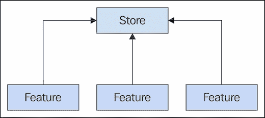

# 第六章。改变 Flux 存储状态

本章讲述了我们 Flux 存储的持续进化，因为我们所实现的应用功能推动了架构的改进。事实上，这正是 Flux 架构擅长的——随着应用的变化而适应变化。本章深入探讨了存储设计的改变，并强调了存储将经常发生变化的观点。对我们存储的更高层次改变可能是必要的，例如引入由多个其他存储共享的通用存储，这些存储针对特定的功能。随着存储的进化，它们之间的依赖关系也会发生变化；我们将探讨如何使用分发器来管理存储间的依赖关系。我们将以讨论如何控制存储复杂性来结束本章。

# 适应变化的信息

在本书的早期，我提到存储不是 MV*架构中的模型。它们在多个方面都不同，包括它们处理其他架构领域（如 API 和变化的功能需求）中变化模式的能力。在本节中，我们将探讨 Flux 存储适应变化 API 的能力。我们还将讨论变化的相反方向，即当消耗存储数据的视图有变化需求时。最后，我们将讨论其他可能作为存储持续进化的直接结果的组件发生变化。

## 改变 API 数据

API 数据的变化，尤其是在开发的早期阶段。尽管我们告诉自己，某个 API 将随着时间的推移而稳定下来，但在实践中这很少奏效。或者，如果 API 确实变得稳定且不变，我们最终不得不使用不同的 API。安全的假设是，这些数据将会变化，我们的存储将需要适应这些变化。

Flux 存储的美丽之处在于它们更多地由功能驱动，而不是由 API 驱动。这意味着 API 数据的变化对存储的影响较小，因为它们的任务是转换 API 数据为功能所需的信息。以下是这个想法的可视化：


与模型不同，我们并不是试图将 API 数据原封不动地表示在存储中。存储保留着状态，这些状态是客户使用的功能所消耗的信息。这意味着当特定存储所依赖的 API 数据发生变化时，我们只需重新审视创建特征信息的转换函数。另一方面，被应用中许多不同视图和许多不同功能使用的模型在应对这些 API 数据变化时则更加困难。这是因为这些组件与 API 数据的模式有关，而不是与我们需要渲染的 UI 元素相关的实际状态。

在 API 更改发生后，我们是否总能重新创建我们在架构中使用的功能信息？不一定。这需要我们重新审视我们的视图如何与存储交互。例如，如果某个 API 模式中完全删除了属性，这很可能会要求我们在存储中进行比简单转换更新更复杂的更新。但这是一种罕见的情况；最常见的情况是，Flux 存储可以轻松适应变化的 API 数据。

## 改变功能功能

存储通过变化的 API 数据发生变化和演变。这可能会影响依赖于存储的功能可用的信息。随着我们的应用程序的增长，存储可能会面临相反方向的压力——改变功能功能通常需要新的信息。这个概念在以下图中得到了说明：


不是 API 数据单独决定`transform()`函数中发生什么，而是相反。功能和驱动它的信息作为存储转换设计的设计输入。这实际上可能比适应变化的 API 数据更困难。有两个主要原因。

首先，是信息本身。存储可以将资源转换为功能所需的内容。但存储并不是神奇的——API 数据需要在数据方面提供至少基本需求；否则，我们就会陷入死胡同。其次，还有 UI 元素本身，其中一些需要存储来捕获状态。结合这两个因素可能会带来挑战。

最好尽早而不是晚些时候回答这些关于信息的困难功能相关问题。能够朝这个方向工作意味着我们正在让用户关心的信息驱动设计，而不是让可用的 API 决定可能发生的事情。

## 受影响的组件

正如我们在本节前面所看到的，存储将它们的数据源转换为用户功能可消费的信息。这是 Flux 的一个很好的架构特性，因为它意味着监听这些存储的视图不需要不断改变，以适应对 API 所做的更改。然而，当存储演变时，我们需要保持对其他组件影响的警觉。

让我们暂时思考一下动作。当 API 数据发生变化时，这很可能会产生我们需要分派的新动作吗？不，因为我们很可能会处理现有的系统入口点——这些动作已经存在。关于功能功能，这会导致新的动作吗？这是可能的，因为我们可能会看到新的用户交互被引入到功能中，或者新的数据和 API。现有的动作有效载荷也可以随着响应变化的 UI 元素而演变，例如。

另一个需要考虑的是，存储变化对依赖于它的其他存储的影响。变化后，它是否还能获取所需的信息？视图并不是唯一具有存储依赖的 Flux 组件。我们将在本章后面更深入地探讨存储间的依赖关系。

# 减少重复存储数据

存储帮助我们将架构中找到的状态分离成特性。这很好，因为我们可以在不同的特性之间有截然不同的数据结构。或者，我们可能会发现，随着新特性的引入，大量相同的数据开始出现在不同的存储中。没有人愿意重复自己——这是低效的，我们可以做得更好。

在本节中，我们将介绍**通用存储**的概念。这类存储不一定被视图使用，而是由其他存储作为公共数据的一种存储库。然后我们将介绍通用存储的基本设置以及如何在我们的更专业化的存储中使用通用存储。

## 通用存储数据

通用存储类似于类层次结构中的父类。父类具有在多个子类中找到的常见行为和属性。然而，与类层次结构不同，我们没有多个结构层级。通用存储在 Flux 架构中的目标相当简单——尽可能减少重复。以下是一个通用存储的示例：


这允许具有特定功能的服务存储共享也通用的状态。否则，每个更新轮次都不得不在不同的存储上执行相同的更新。最好将更新保留在一个地方，让存储查询通用存储以计算它们自己的状态。

### 注意

需要指出的是，特定存储实际上并没有从通用存储那里继承任何东西，就像子类从其父类继承属性一样。将通用存储视为实例，就像任何其他存储一样。同样，就像任何其他存储一样，通用存储会从分发器接收动作来计算状态变化。

## 注册通用存储

在数据依赖方面，例如我们最终将在我们的 Flux 架构中的存储中找到的依赖，顺序很重要。例如，如果一个特定存储在更新轮次中先于它所依赖的存储被处理，我们可能会得到意外的结果。通用存储始终需要首先处理动作，以便它有机会在任何依赖存储访问它之前执行任何转换并设置其状态。

让我们看看一个例子。首先，我们将实现一个通用存储，它接受一组文档对象并将其映射到一组文档名称：

```js
import { EventEmitter } from 'events';
import dispatcher from '../dispatcher';
import { LOAD_DOC } from '../actions/load-doc';

// The generic "Docs" store keeps an index
// of document names, since they're used
// by many other stores.
class Docs extends EventEmitter {
  constructor() {
    super();

    this.state = [];

    dispatcher.register((e) => {
      switch(e.type) {
        case LOAD_DOC:

          // When a "LOAD_DOC" action is dispatched,
          // we take the "payload.docs" data and
          // transform it into the generic state that's
          // required by many other stores.
          for (let doc of e.payload.docs) {
            this.state[doc.id] = doc.name;
          }

          this.emit('change', this.state);
          break;
      }
    });
  }
}

export default new Docs();
```

接下来，我们将实现一个依赖于这个通用`Docs`存储库的特定存储库。它将是一个特定的文档，用于显示文档名称的页面。这个存储库将必须根据通用存储库中的`id`属性定位名称：

```js
import { EventEmitter } from 'events';
import dispatcher from '../dispatcher';
import docs from './docs';
import { LOAD_DOC } from '../actions/load-doc';

// The specific store that depends on the generic
// "docs" store.
class Doc extends EventEmitter {
  constructor() {
    super();

    this.state = {
      name: ''
    };

    dispatcher.register((e) => {
      switch(e.type) {
        case LOAD_DOC:

          // The "id" of the document...
          let { id } = e.payload;

          // Here's where the generic store data
          // comes in handy - we only care about
          // the document name. We can use the "id"
          // to look this up from the generic store.
          this.state.name = docs.state[id];

          this.emit('change', this.state);
          break;
      }
    });
  }
}

export default new Doc();
```

让我们停下来思考一下我们在这里做了什么，以及我们为什么要这样做。这个通用的`Docs`存储库实现了一个转换，将文档数据集合映射到名称数组。我们之所以这样做，是因为我们还有几个其他存储库需要通过`id`查找文档名称。如果只有`Doc`存储库需要这些数据，那么这几乎不值得实现。我们的想法是减少重复，而不是引入间接性。

说到这里，让我们看看这两个存储库都会监听的动作创建函数：

```js
import dispatcher from '../dispatcher';

// The action identifier...
export constLOAD_DOC = 'LOAD_DOC';

// Loads the name of a specific document.
export function loadDoc(id) {

  // The API data resolves raw document data...
  new Promise((resolve, reject) => {
    resolve([
      { id: 1, name: 'Doc 1' },
      { id: 2, name: 'Doc 2' },
      { id: 3, name: 'Doc 3' }
    ]);
  }).then((docs) => {

    // The payload contains both the raw document
    // collection and the specific document "id".
    // The generic "docs" store uses the raw
    // "docs" data while the specific store depends
    // on this generic collection.
    dispatcher.dispatch({
      type: LOAD_DOC,
      payload: {
        id: id,
        docs: docs
      }
    });
  });
}
```

如您所见，这个函数接受一个文档`id`作为参数，并异步调用以加载所有文档。一旦加载完成，就会分发`LOAD_DOC`动作，两个存储库可以设置它们的状态。那么挑战就变成了——我们如何确保在依赖于它的任何存储库之前更新通用存储库？让我们看看`main.js`模块，看看这个动作创建函数以及两个存储库是如何被投入使用的：

```js
// We have to import the generic "docsStore", even though
// we're not using it here, so that it can register with
// the dispatcher and respond to "LOAD_DOC" actions.
import docsStore from './stores/docs';
import docStore from './stores/doc';
import { loadDoc } from './actions/load-doc';

// Logs the data our specific store gets from
// the generic store.
docStore.on('change', (state) => {
  console.log('name', `"${state.name}"`);
});

// Load the document with an id of 2.
loadDoc(2);
// → name "Doc 2"
```

当调用`loadDoc(2)`时，特定存储库的状态设置正如我们所期望的那样。这仅仅是因为我们将两个存储库导入`main.js`的顺序。实际上，如果我们交换顺序，在导入`docStore`之前导入`docsStore`，那么我们就不会看到我们期望的结果。原因是简单的——存储库注册到调度器的顺序决定了它们处理动作的顺序。在本章的后面，我们将探讨一种处理存储库依赖关系不那么繁琐的方法。

## 结合通用和特定数据

通用存储库的优点是它们可以直接由视图使用。也就是说，它们不是某种抽象概念。这些相同的存储库也可以由更具体的存储库使用，以扩展它们的数据并将它们的州转换成其他视图所需的东西。让我们看看一个特定存储库如何将更通用存储库的状态与其自己的状态结合的例子。我们将首先查看一个通用组存储库：

```js
import { EventEmitter } from 'events';
import dispatcher from '../dispatcher';
import { LOAD_GROUPS } from '../actions/load-groups';

// A generic store for user groups...
class Groups extends EventEmitter {
  constructor() {
    super();

    this.state = [];

    dispatcher.register((e) => {
      switch(e.type) {

        // Stores the payload of a group array "as-is".
        case LOAD_GROUPS:
          this.state = e.payload;
          this.emit('change', this.state);
          break;
      }
    });
  }
}

export default new Groups();
```

在状态转换方面，这里并没有太多的事情发生——存储库只是将有效载荷设置为它的状态。现在，我们将看看更具体的用户存储库，它依赖于组存储库：

```js
import { EventEmitter } from 'events';
import dispatcher from '../dispatcher';
import groups from './groups';
import { LOAD_USERS } from '../actions/load-users';

// A users store that depends on the generic
// groups store so that it can perform the necessary
// state transformations.
class Users extends EventEmitter {
  constructor() {
    super();

    this.state = [];

    dispatcher.register((e) => {
      switch(e.type) {
        case LOAD_USERS:

          // We only want to keep enabled users.
          let users = e.payload.filter(
            x => x.enabled);

          // Maps to a new users array, each user object
          // containing a new "groupName" property. This
          // comes from the generic group store, and is
          // looked up by id.
          this.state = users.map(
            x =>Object.assign({
              groupName: groups.state.find(
                y =>y.id === x.group
              ).name
            }, x));

          this.emit('change', this.state);
          break;
      }
    });
  }
}

export default new Users();
```

在这个存储库中发生的状态转换要复杂一些。`LOAD_USERS`有效载荷是一个用户对象的数组，每个对象都有一个`group`属性。然而，观察这个存储库的视图需要的是组名，而不是`id`。因此，在这里我们执行映射，创建一个新的用户对象数组，这个数组包含视图所需的`groupName`属性。下面是`loadUsers()`动作创建函数的示例：

```js
import dispatcher from '../dispatcher';

// The action identifier...
export constLOAD_USERS = 'LOAD_USERS';

// Dispatches a "LOAD_USERS" action once the
// asynchronous data has resolved.
export function loadUsers() {
  new Promise((resolve, reject) => {
    resolve([
      { group: 1, enabled: true, name: 'User 1' },
      { group: 2, enabled: false, name: 'User 2' },
      { group: 2, enabled: true, name: 'User 3' }
    ]);
  }).then((users) => {
    dispatcher.dispatch({
      type: LOAD_USERS,
      payload: users
    });
  });
}
```

接下来，这是如何加载通用组的数据，然后是依赖于它的用户数据的：

```js
import groupsStore from './stores/groups';
import usersStore from './stores/users';
import { loadGroups } from './actions/load-groups';
import { loadUsers } from './actions/load-users';

// Log the state of the "usersStore" to make
// sure that includes data from the generic
// "groupsStore"
usersStore.on('change', (state) => {
  state.forEach(({ name, groupName }) => {
    console.log(`${name} (${groupName})`);
  });
});

// We always load the generic data first. Especially
// if it doesn't change often.
loadGroups();
loadUsers();
// →
// User 1 (Group 1)
// User 3 (Group 2)
```

这样的通用存储数据如果被许多其他特定存储使用，并且其状态不经常改变，特别有用。例如，加载这个通用存储数据可能是应用程序初始化活动的一部分，之后就不需要再接触它了。

# 处理存储依赖

到目前为止，在这本书中，我们隐式地处理了我们的 Flux 存储依赖。我们导入存储模块的顺序决定了处理动作的顺序，如果我们所依赖的东西还没有更新，这会有影响。是时候开始用更多的严谨性来处理我们的存储依赖了。

在本节中，我们将介绍 Flux 调度器的 `waitFor()` 机制来管理存储依赖。然后，我们将讨论我们可能遇到的两种存储依赖类型。第一种依赖严格相关于应用程序数据。第二种依赖与 UI 元素相关。

## 等待存储

调度器有一个内置机制，允许我们显式解决存储依赖。更重要的是，依赖在回调函数中声明，即依赖实际被使用的地方。让我们看看一个突出显示处理存储依赖改进代码的例子。首先，我们有一个基本的存储，它没有做太多：

```js
import { EventEmitter } from 'events';
import dispatcher from '../dispatcher';
import { MY_ACTION } from '../actions/my-action';

class Second extends EventEmitter {
  constructor() {
    super();

    // Registering a callback with the dispatcher
    // returns an identifier...
    this.id = dispatcher.register((e) => {
      switch(e.type) {
        case MY_ACTION:
          this.emit('change');
          break;
      }
    });
  }
}

export default new Second();
```

你会注意到这个存储看起来略有不同。我们将 `dispatcher.register()` 的返回值分配给存储的 `id` 属性。这个值用于识别我们在调度器中刚刚注册的回调函数。现在，让我们定义一个依赖于这个存储的存储，这样我们就可以看到为什么这个 `id` 属性是相关的：

```js
import { EventEmitter } from 'events';
import dispatcher from '../dispatcher';
import { MY_ACTION } from '../actions/my-action';
import second from './second';

class First extends EventEmitter {
  constructor() {
    super();

    // Registering a callback with the dispatcher
    // returns an identifier...
    this.id = dispatcher.register((e) => {
      switch(e.type) {
        case MY_ACTION:

          // This tells the dispatcher to process any
          // callback functions that were registered
          // to "second.id" before continuing here.
          dispatcher.waitFor([ second.id ]);
          this.emit('change');
          break;
      }
    });
  }
}

export default new First();
```

`id` 属性被 `dispatcher.waitFor()` 调用所使用。这个调度器的这个方法强制在继续进行状态转换之前，将动作分发给我们所依赖的存储。这确保了我们始终在依赖的存储中使用最新数据。让我们看看 `myAction()` 函数的使用情况，以及我们两个存储之间的依赖管理是否按预期工作：

```js
// The order of store imports no longer matters,
// since the stores use the dispatcher to
// explicitly handle dependency resolution.
import first from './stores/first';
import second from './stores/second';
import { myAction } from './actions/my-action';

// The first store changed...
first.on('change', () => {
  console.log('first store changed');
});

// The second store changed...
second.on('change', () => {
  console.log('second store changed');
});

// Dispatches "MY_ACTION"...
myAction();
```

在 `main.js` 中，或者架构中的任何其他地方，事情发生的顺序不再重要。依赖在它重要的地方声明，靠近使用依赖数据的代码。这是由调度器组件强制执行的。

### 注意

注意，`waitFor()` 方法接受一个 ID 数组。这意味着在更复杂的场景中，如果我们依赖于多个存储的状态，我们可以传递我们依赖的每个存储 ID。然而，更常见的情况是依赖于一个存储的状态。如果架构中到处都是多存储依赖，这可能意味着复杂性过高。

## 数据依赖

在 Flux 存储中，有两种值得思考的依赖类型。最常见的是数据依赖。当特定存储依赖于通用存储时，就存在这种依赖关系——它有一些通用数据，多个存储需要访问。这种应用程序数据通常来自 API，并最终由视图渲染。然而，当我们谈论数据依赖时，并不局限于通用存储。

例如，假设我们有一个用户界面，主布局通过标签页进行分隔。在我们的 Flux 架构中，存储与这些标签页一致。如果一个存储执行 API 调用，然后进行一些数据转换以设置其状态，另一个存储可以依赖这个存储来使用这些数据吗？共享此类数据是有意义的，否则，我们不得不重复相同的 API 请求、数据转换等等——这会变得重复且我们希望避免这种情况。

然而，当存储明确建模顶级功能，如标签页时，我们开始注意到一些并非严格与数据相关的其他依赖。这些是 UI 依赖，并且完全可能存在。例如，用户在一个标签页中看到的内容可能依赖于另一个标签页中复选框的状态。以下是两种存储依赖类型的说明：


## UI 依赖

在典型的前端架构中，UI 元素的状态可能是状态建模中最容易出错的部分。UI 元素的主要问题是，当我们没有明确建模它们的状态时，当这些状态发生变化时，我们很难理解因果关系。当一个 UI 元素的状态依赖于另一个 UI 元素的状态时，这尤其麻烦。我们最终得到的是将这些项目隐式关联在一起的代码。

Flux 存储在处理此类依赖关系方面更胜一筹，因为在存储中，UI 依赖与数据依赖相同——它们都是状态。我们能够轻松地在 Flux 架构中做到这一点是个好事，因为这些类型的依赖关系往往会迅速变得复杂。为了说明 Flux 如何处理 UI 依赖，让我们来看一个例子。我们将为 UI 的不同部分创建两个存储：一个用于复选框，一个用于标签。其理念是标签依赖于复选框的状态，因为当复选框改变时，它们的样式也会改变。

首先，我们有代表复选框元素的存储：

```js
import { EventEmitter } from 'events';
import dispatcher from '../dispatcher';
import { FIRST } from '../actions/first';
import { SECOND } from '../actions/second';

class Checkboxes extends EventEmitter {
  constructor() {
    super();

    this.state = {
      first: true,
      second: true
    };

    // Sets the dispatch id of this store
    // so that other stores can depend on it.
    // Depending on the action, this handler
    // changes the boolean UI state of a given
    // checkbox.
    this.id = dispatcher.register((e) => {
      switch(e.type) {
        case FIRST:
          this.state.first = e.payload;
          this.emit('change', this.state);
          break;
        case SECOND:
          this.state.second = e.payload;
          this.emit('change', this.state);
          break;
      }
    });
  }
}

export default new Checkboxes();
```

该存储通过两个复选框元素进行建模——`first` 和 `second`。状态是布尔值，选中时为 `true`，未选中时为 `false`。默认情况下，两个复选框都被选中，当 `FIRST` 或 `SECOND` 动作被分发时，相应复选框的状态会更新以反映有效载荷。现在让我们看看依赖于 `Checkboxes` 存储状态的 `Labels` 存储：

```js
import { EventEmitter } from 'events';
import dispatcher from '../dispatcher';
import { FIRST } from '../actions/first';
import { SECOND } from '../actions/second';
import checkboxes from './checkboxes';

class Labels extends EventEmitter {
  constructor() {
    super();

    // The initial state of this store depends
    // on the initial state of the "checkboxes"
    // store.
    this.state = {
      first: checkboxes.state.first ?
        'line-through' : 'none',
      second: checkboxes.state.second ?
        'line-through' : 'none'
    };

    this.id = dispatcher.register((e) => {
      switch(e.type) {

        // The "FIRST" action was dispatched, so wait
        // for the "checkboxes" UI state, then update
        // the UI state of the "first" label.
        case FIRST:
          dispatcher.waitFor([ checkboxes.id ]);

          this.state.first = checkboxes.state.first ?
            'line-through' : 'none';

          this.emit('change', this.state);
          break;

        // The "SECOND" action was dispatched, so wait
        // for the "checkboxes" UI state, then update
        // the UI state of the "second" label.
        case SECOND:
          dispatcher.waitFor([ checkboxes.id ]);

          this.state.second = checkboxes.state.second ?
            'line-through' : 'none';

          this.emit('change', this.state);
          break;
      }
    });
  }
}

export default new Labels();
```

你可以看到，这个存储的初始状态实际上也依赖于`Checkboxes`存储的状态。这个存储中`first`或`second`状态属性的值实际上是 CSS 值。在这里对这些值进行建模很重要，因为毕竟，这些都是状态——所有状态都进入存储。这意味着以后其他东西可以依赖于这些值。当一切都很明确时，我们知道事情为什么会是这样，这转化为稳定的软件。

现在，让我们看看使用这些存储来渲染 UI 元素和响应用户输入的视图。首先，是`Checkboxes`视图：

```js
import checkboxes from '../stores/checkboxes';
import { first } from '../actions/first';
import { second } from '../actions/second';

class Checkboxes {
  constructor() {

    // The DOM elements our view manipulates (these
    // are checkboxes).
    this.first = document.getElementById('first');
    this.second = document.getElementById('second');

    // Dispatch the appropriate action when either
    // of the checkboxes change. The action payload
    // is the "checked" property of the UI element.
    this.first.addEventListener('change', (e) => {
      first(e.target.checked);
    });

    this.second.addEventListener('change', (e) => {
      second(e.target.checked);
    });

    // When the "checkboxes" store changes state,
    // render the view using the new state.
    checkboxes.on('change', (state) => {
      this.render(state);
    });

  }

  // Sets the "checked" properties of the checkbox
  // UI elements. By default, we use the initial
  // state of the "checkboxes" store. Otherwise,
  // we use whatever state is passed.
  render(state=checkboxes.state) {
    this.first.checked = state.first;
    this.second.checked = state.second;
  }
}

export default new Checkboxes();
```

这里使用了两个复选框元素，在视图的构造函数中做的第一件事是为复选框设置`change`事件处理器。这些处理器将根据复选框及其选中状态分派适当的操作——`FIRST`或`SECOND`。`render()`函数实际上根据状态更新 DOM。现在，让我们看看`Labels`视图：

```js
import labels from '../stores/labels';

class Labels {
  constructor() {

    // The DOM elements this view manipulates (these
    // are labels).
    this.first = document.querySelector('[for="first"]');
    this.second = document.querySelector('[for="second"]');

    // When the "labels" store changes, render
    // the view using the new state.
    labels.on('change', (state) => {
      this.render(state);
    });
  }

  // Updates the "textDecoration" style of our
  // label UI elements, using the "labels" store
  // state as the default. Otherwise, we use whatever
  // state is passed in.
  render(state=labels.state) {
    this.first.style.textDecoration = state.first;
    this.second.style.textDecoration = state.second;
  }
}

export default new Labels();
```

这个视图的工作方式与`Checkboxes`视图类似。主要区别在于这里没有用户交互，并且对 UI 元素所做的更改是`Labels`存储中设置的样式属性值。这些最终取决于`Checkboxes`存储的状态，因此当用户更改复选框的状态时，他们会看到相应的标签样式发生变化。

如果这感觉像是一大堆代码来完成一个简单的任务，那是因为确实如此。记住，我们在这里实际上完成的事情远不止简单的复选框切换和标签样式更新。我们已经在 UI 的两个不同部分之间建立了明确的 UI 状态依赖关系。这对我们的架构来说是一个胜利，因为当给定的架构在扩展时遇到困难时，我们无法弄清楚为什么会发生这种情况。在整个 Flux 架构的生命周期中，我们积极采取措施确保这种情况不会发生，就像我们刚才在这里所展示的那样。

# 查看更新顺序

虽然能够使用`waitFor()`显式控制存储的依赖性很方便，但视图没有这样的奢侈。在本节中，我们将查看我们的视图渲染 UI 元素的顺序。首先，我们将查看存储在视图更新顺序中扮演的角色。然后，我们将讨论视图顺序实际上影响用户体验的情况，以及那些顺序并不重要的情况。

## 存储注册顺序

将操作分派给存储的顺序很重要。当存储转换其状态时，它也会通知任何监听存储的视图。这意味着如果某个视图正在监听首先注册到调度器的存储，那么这个视图将在任何其他视图之前渲染。这个想法在这里得到了说明：


如您所见，调度器内存储回调函数的顺序明显影响了视图的渲染顺序。存储依赖也可以影响视图渲染的顺序。例如，如果存储 A 依赖于存储 B，那么任何监听存储 B 的视图将会首先渲染。这可能是无关紧要的，或者可能会有一些有趣的副作用。我们将在下一节中查看这两种结果。

## 优先渲染视图

由于构成我们 Flux 架构核心的存储也可以确定我们视图的渲染顺序，我们必须注意根据用户体验来优先处理。例如，我们可能有一个表示页面顶部区域头部存储的存储，另一个存储用于主要内容区域。现在，如果主要内容区域首先渲染，在页面顶部留下一个明显的空白，我们将想要修复这个问题。

由于用户将从页面顶部开始并向下工作，我们必须确保首先注册头部内容的存储。我们如何做到这一点？再一次，我们又回到了处理存储依赖时的那个地方。我们必须注意以正确的顺序导入我们的视图——一个反映渲染顺序的顺序。正如我们所看到的，这并不是一个理想的情况。

一个解决方案是引入存储依赖。即使内容存储实际上并没有使用来自头部存储的任何数据，它仍然可以为了渲染顺序的目的而依赖它。通过使用`waitFor()`方法，我们会知道任何监听头部存储的视图将会首先渲染，从而消除与渲染顺序相关的可用性问题。当然，这里的风险与任何存储依赖相同——复杂性。当我们达到有太多存储依赖难以理解的程度时，就是时候重新思考我们的存储设计了。

# 处理存储复杂性

Flux 存储复杂性的主要原因是依赖管理。尽管有调度器作为管理这些依赖的工具，但当依赖太多时，总会有些东西会丢失。在本章的最后部分，我们将讨论在架构中拥有太多存储的后果以及可以采取哪些措施来解决这个问题。

## 存储过多

我们应用程序的最高级特性在为我们的存储和它们封装的状态提供边界方面做得相当不错。存储的挑战在于当它们太多时。例如，随着我们的应用程序随着时间的推移而增长，将会有更多特性被构建，这转化为更多存储被投入到架构中。此外，现有的存储也可能会变得更加复杂，因为它们必须找到与其他应用程序中所有变化特性相协调的方法。

这导致了一个复杂的情况——商店的复杂性不断增长，总体上商店数量也在增加。这几乎肯定会导致依赖关系的爆炸性增长，因为我们会挖掘出用户界面的所有边缘情况。由许多特定商店共享的通用商店也可能成为问题的来源。例如，我们可能会拥有过多的通用商店，最终导致所有状态数据都是间接的。

当我们达到架构中商店数量无法承受的程度时，是时候开始重新思考构成功能的内容了。

## 重新思考功能域

当顶层功能映射到我们的商店通常足够好，直到我们有很多顶层功能。在这个时候，是时候重新评估功能映射到商店的策略了。例如，如果我们有很多顶层功能，那么很可能有很多可以合并到单个商店中的相似数据，这个商店可以驱动许多功能。减少驱动我们功能的商店数量的另一个潜在影响是移除通用商店。通用商店只有在我们有太多重复数据时才有效，而当商店数量减少时，这通常不是一个问题。以下是一个展示商店如何成为多个功能驱动者的图表：



我们也可能发现自己处于相反的情况，即商店的复杂性过于巨大，我们需要通过重构将其分解成多个商店来减少其责任。为了解决这个问题，我们必须考虑如何将一个大功能分解成两个更小的功能。如果我们想不出一个好的方法来划分功能，那么商店的复杂性可能就是我们能做的最好的，它应该保持原样。

# 摘要

在本章中，我们详细探讨了 Flux 架构中的商店，从我们离开骨架架构阶段后最有可能发生变化的角度开始。然后我们介绍了通用商店的概念，其目的是减少单个商店需要保持的状态量。通用商店的尴尬之处在于它们引入的依赖关系，为了处理这些依赖关系，你学习了如何使用派发器的`waitFor()`机制。

商店之间的依赖关系有两种类型，数据依赖和 UI 依赖，你了解到 UI 依赖是任何 Flux 架构的关键部分。最后，我们讨论了商店在复杂性方面可能失控的一些方式，以及如何应对这种情况。在下一章中，我们将探讨 Flux 架构中的视图组件。
