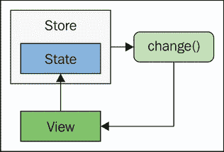
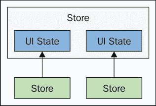
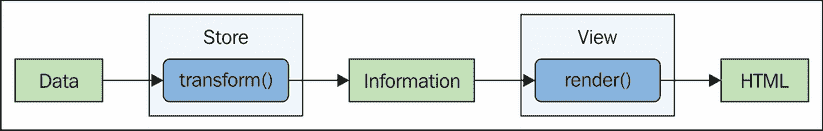
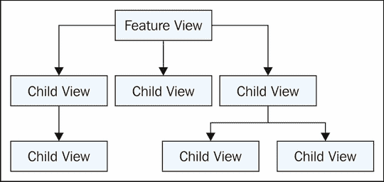

# 第七章：视觉信息

视图层是 Flux 架构中数据流的最后一个停止点。视图是我们应用程序的本质，因为它们直接向用户提供信息并直接响应用户交互。本章将详细探讨在 Flux 架构背景下视图组件。

我们将从讨论如何获取视图数据以及它们拥有数据后可以做什么开始。接下来，我们将查看一些强调 Flux 视图无状态特性的示例。然后，我们将回顾 Flux 架构中视图的责任，这与其他类型的前端架构中的视图责任不同。

我们将用使用 ReactJS 组件作为视图层的例子来结束本章。让我们开始吧！

# 向视图传递数据

视图没有它们自己的数据源来渲染 UI 元素。相反，它们依赖于 Flux 存储的状态，并监听状态的变化。在本节中，我们将介绍存储将发出以表示视图可以渲染自己的变化事件。我们还将讨论最终由视图决定何时以及如何渲染 UI 的想法。

## 通过变化事件传递数据

在本书中我们迄今为止看到的视图组件都依赖于存储在状态发生变化时发出的变化事件。这就是视图知道它可以渲染到 DOM 的原因——因为存在新的存储状态，这意味着可能有一个我们希望用户看到的视觉变化。

你可能已经注意到，从早期示例中，所有监听变化事件的处理器函数都有一个状态参数——这是存储的状态。问题是——为什么我们需要包含这些状态数据？视图为什么不能直接引用存储来引用状态数据？这个想法在这里得到了说明：



即使视图直接引用存储的状态，变化事件仍然是必要的——否则它如何知道要渲染呢？变化事件被发出，然后视图知道它引用的状态也发生了变化。这种方法存在一个潜在问题，这与不可变性有关。让我们看看一些代码来更好地理解这个问题。这是一个具有`name`属性作为其状态的存储：

```js
import { EventEmitter } from 'events';
import dispatcher from '../dispatcher';
import { NAME_CAPS } from '../actions/name-caps';

class First extends EventEmitter {
  constructor() {
    super();

    // The default state is a "name" property
    // with a lower-case string.
    this.state = {
      name: 'foo'
    };

    this.id = dispatcher.register((e) => {
      switch(e.type) {

        // Mutates the "name" property, keeping
        // the "state" object intact.
        case NAME_CAPS:
          let { state } = this;
          state.name = state.name.toUpperCase();
          this.emit('change', state);
          break;
      }
    });
  }
}

export default new First();
```

当这个存储响应`NAME_CAPS`动作时，它的任务是使用简单的`toUpperCase()`调用转换`name`属性的状态。然后，变化事件以状态作为事件数据被发出。让我们看看另一个执行相同操作但使用不同方法更新`state`对象的存储：

```js
import { EventEmitter } from 'events';
import dispatcher from '../dispatcher';
import { NAME_CAPS } from '../actions/name-caps';

class Second extends EventEmitter {
  constructor() {
    super();

    // The defaul state is a name property
    // with a lower-case string.
    this.state = {
      name: 'foo'
    };

    this.id = dispatcher.register((e) => {
      switch(e.type) {

        // Assigns a new "state" object, invalidating
        // any references to any previous state.
        case NAME_CAPS:
          this.state = {
            name: this.state.name.toUpperCase()
          };
          this.emit('change', this.state);
          break;
      }
    });
  }
}

export default new Second();
```

如您所见，这两个商店基本上是相同的，当`NAME_CAPS`动作被分发时，它们会产生相同的结果。然而，请注意，这种转换不会改变`state`对象。相反，它会替换它。这种方法使状态对象不可变，这意味着商店永远不会改变其任何属性。差异在视图层感受到，并突出了在更改事件处理程序中需要状态参数的需求：

```js
import first from './stores/first';
import second from './stores/second';
import { nameCaps } from './actions/name-caps';

// Setup references to the state of the
// two stores.
var firstState = first.state;
var secondState = second.state;

first.on('change', () => {
  console.log('firstState', firstState.name);
});
// → firstState FOO

second.on('change', () => {
  console.log('secondState', secondState.name);
});
// → secondState foo

second.on('change', (state) => {
  console.log('state', state.name);
});
// → state FOO

nameCaps();
```

这就是为什么我们不能对商店的状态做出假设。在前面的代码中，我们犯了一个关键的错误，假设我们可以保留`secondStore.state`引用。结果证明，这个对象是不可变的，因此视图访问新状态的唯一方法是通过更改处理程序中的状态参数。

## 视图决定何时渲染

Flux 商店的工作主要集中在为视图生成正确的信息。不属于商店工作描述的一部分是知道视图是否实际上需要更新。这意味着当商店触发一个更改事件时，决定发生什么的是视图——可能 DOM 中没有任何东西需要更新。那么问题就变成了——如果没有任何变化，为什么商店会发出更改事件？

简单的答案是商店没有做足够的账目记录来确定是否有什么变化。商店知道如何执行正确的状态转换，但它不一定跟踪以前的状态以进行差异比较——尽管它当然可以这么做。

让我们看看一个不改变其状态的商店。相反，当某个东西被转换时，它会创建新的状态：

```js
import { EventEmitter } from 'events';
import dispatcher from '../dispatcher';
import { NAME_CAPS } from '../actions/name-caps';

class MyStore extends EventEmitter {
  constructor() {
    super();

    this.state = {
      name: 'foo'
    };

    this.id = dispatcher.register((e) => {
      switch(e.type) {
        case NAME_CAPS:

          // Convert to upper-case.
          let name = this.state.name.toUpperCase();

          // Only assign the new state object if
          // the "name" isn't already in upper-case.
          this.state = this.state.name === name ?
            this.state : {
              name: this.state.name.toUpperCase()
            };

          // Tell views about the state change, even
          // if the state object is the same.
          this.emit('change', this.state);
          break;
      }
    });
  }
}

export default new MyStore();
```

这个商店正在监听来自上一个示例的相同`NAME_CAPS`消息。它的任务仍然是相同的——将`name`属性转换为大写。然而，这段代码与商店的上一版本不同。它是不可变的，因为它不会改变`state`对象——它会替换它。但它只会在值实际发生变化时这么做。否则，`state`对象保持不变。这里的想法不是表明商店应该检测单个属性的状态变化，而是表明即使在状态没有变化的情况下，也可以发出更改事件。换句话说，我们的视图不应该假设仅仅因为更改事件，渲染到 DOM 就是必要的。

现在，让我们把注意力转向视图。计划很简单——除非必要，否则不要渲染：

```js
import myStore from '../stores/my-store';

class MyView {
  constructor() {

    // The view keeps a copy of the previous
    // store state.
    this.previousState = null;

    myStore.on('change', (state) => {

      // Make sure we have a new state before
      // rendering. If "state" is equal to
      // "previousState", then we know there's
      // nothing new to render.
      if (state !== this.previousState) {
        console.log('name', state.name);
      }

      // Keep a reference of the state, so that
      // we can use it in the next "change"
      // event.
      this.previousState = state;
    });
  }
}

export default new MyView();
```

你可以看到`previousState`属性保留了对存储状态的引用。但是等等，根据前面的章节，这不是一件坏事吗？嗯，不是的，因为我们实际上并没有使用这个引用做任何其他事情，只是进行严格的相等性检查。这是用来确定视图是否需要渲染的。由于存储状态是不可变的，我们可以断言，如果相同的引用作为参数传递给更改事件处理器，实际上并没有发生任何变化，我们可以安全地忽略该事件。让我们看看当我们连续多次调用同一个动作会发生什么：

```js
import myView from './views/my-view';
import { nameCaps } from './actions/name-caps';

// Despite repeated calls to "nameCaps()",
// "myView" is only rendered once.
nameCaps();
nameCaps();
nameCaps();
// → name FOO
```

在本章稍后当我们查看 ReactJS 时，我们将看到只渲染所需内容的视图的更高级场景。在本书稍后当我们查看`Immutable.js`时，我们将处理更高级的状态变化检测。

# 保持视图无状态

视图不能完全无状态，因为它们与 DOM 交互，并且与视图关联的 DOM 元素将始终具有状态。然而，我们可以在 Flux 架构的上下文中采取步骤将视图视为无状态实体。在本节中，我们将讨论无状态视图的两个方面。

首先，我们将介绍 Flux 架构中的所有状态都属于存储的想法，包括我们可能倾向于保存在我们的视图组件中的任何 UI 状态。其次，我们将探讨 DOM 查询以及为什么我们想要避免在 Flux 视图中进行这种操作。

## UI 状态属于存储

如同你在上一章所学到的，UI 状态就像是从应用数据派生出来的状态——它们都属于存储。UI 状态包括按钮的`disabled`属性或应用于`div`的类的名称。这些状态片段属于存储的原因是其他存储可能依赖于它们。这反过来又影响了其他视图的渲染结果。这种依赖关系如下所示：



如果其他存储可能依赖的 UI 状态没有保存在存储中，那么它们将不得不依赖于视图或 DOM 本身。这是不一致的，并且与 Flux 所代表的原则相悖——严格的更新顺序和将状态限制在范围内。

## 不查询 DOM

当 UI 状态保存在 Flux 存储中时，无需查询 DOM 以确定按钮是否被禁用。想想 jQuery 处理应用状态的方法。首先，我们必须发出一个 DOM 查询来获取相关的 DOM 元素，然后我们必须通过读取它们的某些属性来确定它们是否处于适当的状态。然后，我们可以在应用程序的其他地方进行更改。或者可能有一些状态直接保存在 DOM 中，以及一些 JavaScript 对象。

一致性是 Flux 架构中最大的区别制造者，因为我们不需要查询 DOM 来获取链接的`href`属性。保留 UI 状态的存储已经拥有了这些信息。这始终是这种情况——永远不是在 DOM 或其他组件中寻找信息的问题。

在我们的存储中拥有所有必要的 UI 状态以做出渲染决策的另一个优点是，没有性能瓶颈。查询 DOM 一次或两次并不是什么大问题，而且如果我们想要向用户显示更改，这确实需要发生。我们不希望有一系列冗长的 DOM 查询调用，而这些调用甚至没有导致任何渲染。换句话说，当信息已经在存储中时，没有必要查询 DOM 来提取信息。

这与虚拟 DOM 树技术（如 ReactJS）所使用的相同策略，其中 DOM 数据全部存储在 JavaScript 对象中。从 JavaScript 对象中查找一些 UI 状态比查找 DOM 元素属性要快得多，这就是 ReactJS 能够表现得如此出色的原因——通过最小化给定 UI 更改的 DOM 交互次数。

# 视图职责

到这本书的这一部分，你可能已经很好地掌握了视图组件在 Flux 架构中的作用。简单来说，它们的任务是通过将其插入 DOM 来向用户显示存储信息。在本节中，我们将这个核心视图概念分为三个部分。

首先是视图的输入——存储数据。接下来是视图本身的架构，以及它可以分解成更小视图的各种方式。最后是用户交互。视图组件的这三个领域都与我们的 Flux 架构中的数据流有关。现在让我们看看每一个。

## 渲染存储数据

如果存储将数据转换成用户需要的信息，那么为什么还需要视图呢？为什么不直接让存储将信息渲染到 DOM 中呢？我们需要视图有几个原因。首先，存储实际上可以在多个地方使用，由多个视图渲染。其次，Flux 并不一定关心信息的视觉显示。例如，如果我们设计了一些不渲染 HTML 而渲染其他显示格式的视图，那也是完全可以的。

视图不保留任何状态或对存储信息进行任何转换。然而，它们确实需要稍微转换信息，将其转换为浏览器或任何其他运行我们应用程序的显示介质中显示的有效标记。但除了标记从存储返回的信息之外，视图几乎没有其他事情要做。在标记 JavaScript 对象并将它们插入 DOM 方面，视图技术（如 ReactJS）做了大部分基础工作。以下是展示该过程的图解：



## 子视图结构

Flux 架构中商店的目标是结构化它们，使得每个顶级特性只有一个商店。这使我们绕过了由大量数据结构层次结构引起的问题。另一方面，视图可以从一点层次结构中受益。仅仅因为顶级特性是由单个商店的信息驱动的，并不意味着只有一个视图可以驱动用户体验。

在本书的早期，我们讨论了层次结构的概念以及如何在 Flux 架构中避免它。这在一定程度上对视图仍然适用，因为无论如何划分，深层层次结构都是难以理解的。视图确实需要在一定程度上进行分解，否则我们最终会将所有标记复杂度放在一个地方。HTML 标记本质上是层次化的，因此从某种程度上说，我们的视图应该模仿这种结构，如图所示：



与商店可以通用一样，视图也可以通用。多个特性可以使用通用组件以通用显示模式展示信息。例如，考虑一种可展开/可折叠的面板，它被我们所有的特性使用——将其插入到我们的更大特性中而不是重复功能，不是更有意义吗？我们使用的视图技术也是我们想要将视图分解成更小、可重用部分的决策因素，因为某些框架比其他框架更容易做到这一点。例如，我们将在下一节中看到，ReactJS 使得从更小的、更精细的视图组合出粗粒度视图变得容易，因为它们在很大程度上是自包含的。

### 注意

在组合此类视图层次结构时需要注意的事项——注意数据流。例如，当 Flux 商店发生变化时，它会发出变化事件，以便顶级视图可以渲染自身。然后它渲染其直接子视图，这些子视图再渲染它们的直接子视图，依此类推。随着商店状态通过这些视图流动，沿途不应发生任何数据转换。换句话说，树中的叶视图应该获得与根视图相同的信息。

## 用户交互

我们需要考虑的最后一个视图责任领域是用户交互。除了被动地观察屏幕上的信息随我们架构的底层商店处理动作而变化之外，他们还需要做一些事情。如果至少，用户需要能够导航到应用程序的不同功能。为了处理这类事情，渲染 UI 的视图组件也应该拦截它们被触发时的 DOM 事件。这通常会导致发出新的动作，正如我们在本书前面已经看到的。

关于这些事件处理程序，要记住的关键点是它们应该基本上只有一个职责——调用正确的动作创建函数。这些事件处理程序应该避免尝试执行任何逻辑——这属于库，以及受逻辑影响的州。这是 Flux 的基础，所以我很可能在书中至少重复它十二次。一旦我们在库之外的地方引入逻辑，我们就失去了对某物状态的推理能力——状态在很大程度上决定了用户看到的内容。

### 注意

直接将动作创建函数作为事件处理程序传递给 DOM 节点是完全可能的。这实际上可能对我们有所帮助，因为它提供了非常低的逻辑被引入错误位置的风险。

# 使用 ReactJS 与 Flux

ReactJS 是一个用于创建视图组件的库。实际上，React 甚至不将自己标榜为视图库——它是一套用于创建渲染 UI 元素组件的工具。这个简单的原则易于理解且功能强大——完美地适合作为我们 Flux 架构中的视图技术。

在本节中，我们将探讨将 ReactJS 作为我们 Flux 应用程序中视图的首选技术，从将状态信息从库传递到 React 组件开始。接下来，我们将讨论视图的组合，以及 Flux 状态如何从库流向父视图再到子视图。最后，我们将使用 React 机制和 `react-router` 库中的路由器在我们的视图中实现一些事件处理功能。

## 设置视图状态

根据我们 Flux 库的状态渲染 React 组件有两种方式。这涉及到两种不同类型的组件——有状态和无状态——我们都会在这里讨论。首先，让我们看看包含驱动我们视图的状态的库：

```js
import { EventEmitter } from 'events';
import dispatcher from '../dispatcher';
import { ADD } from '../actions/add';

class MyStore extends EventEmitter {
  constructor() {
    super();

    // The "items" state is an empty array
    // by default...
    this.state = {
      items: []
    };

    this.id = dispatcher.register((e) => {
      switch(e.type) {

        // Push the "payload" to the "items"
        // array when the "ADD" action is
        // dispatched.
        case ADD:
          let { state } = this;

          state.items.push(e.payload);
          this.emit('change', state);
          break;
      }
    });
  }
}

export default new MyStore();
```

这里的想法很简单——每当分发 `ADD` 动作时，我们都会将动作有效载荷推送到 `items` 数组。任何希望响应这种库状态变化的 React 组件都可以通过监听变化事件来实现。首先，让我们看看渲染项目列表的有状态 React 组件：

```js
import { default as React, Component } from 'react';
import myStore from '../stores/my-store';

// A stateful React component that relies on
// it's on state in order to render updates.
export default class Stateful extends Component {
  constructor() {
    super();

    // When "myStore" changes, we set the state of
    // this component by calling "setState()", causing
    // a render to happen.
    myStore.on('change', (state) => {
      this.setState(state);
    });

    // The initial state of the component is
    // taken from the initial state of the Flux store.
    this.state = myStore.state;
  }

  // Renders a list of items.
  render() {
    return (
      <ul>
        {this.state.items.map(item =>
          <li key={item}>{item}</li>)}
      </ul>
    );
  }
}
```

这是一个典型的 React 组件，使用 ES2015 类语法创建，并扩展了基本的 React `Component` 类。这种做法对于有状态的组件是必要的。正如你所看到的，这个组件的构造函数直接与 Flux 库交互。当库发生变化时，它会调用 `setState()`，这就是组件如何渲染以反映新的库状态。构造函数还通过设置 `state` 属性来设置初始状态。接下来，我们有 `render()` 方法，它根据这个状态返回 React 元素。

注意，我们的 React 组件正在使用 JSX 语法来定义元素。我们不会在这本书中介绍它是如何工作的，也不会详细介绍 React 的其他方面。这是一本关于 Flux 架构的书，我们将介绍在 Flux 环境中相关的 React 部分。如果你想要对 React 本身进行更深入的技术研究，有大量的免费资源，以及许多关于这个主题的其他书籍。

现在，让我们看看这个组件的另一种实现，这意味着完全相同的输出。这是 React 组件/视图的无状态方法：

```js
import React from 'react';

// The stateless version of the React
// component is a much stripped-down
// version of a class component. Since
// it only relies on properttes passed
// into it, it can be a basic arrow function
// that returns a React element.
export default ({ items }) => (
  <ul>
    {items.map(item =>
      <li key={item}>{item}</li>)}
  </ul>
);
```

等等，这是什么？这是完全相同的组件，只是它不依赖于状态。如果我们将其作为 Flux 架构中的视图组件实现，这可能是个好事。这个实现最引人注目的是，注释比代码多，这是好事，因为它让我们能够关注生成的 DOM 结构。你会注意到在这个模块中没有与 Flux 存储的交互。记住，这是一个无状态的 React 组件，一个简单的箭头函数，这意味着我们不需要定义任何生命周期方法，包括初始状态。这是可以的；让我们看看我们如何在`main.js`模块中使用这两种类型的组件：

```js
import React from 'react';
import { render } from 'react-dom';

import Stateful from './views/stateful';
import Stateless from './views/stateless';
import myStore from './stores/my-store';
import { add } from './actions/add';

// These are the DOM element "containers" that
// our React components are rendered into.
var statefulContainer =
  document.getElementById('stateful');
var statelessContainer =
  document.getElementById('stateless');

// Sets up the store change listener for our
// "Stateless" React component. This is simple
// "render()" call, React efficiently handles
// the DOM diffing semantics.
myStore.on('change', (state) => {
  render(
    <Stateless items={myStore.state.items}/>,
    statelessContainer
  );
});

// Initial rendering of our two components.
render(
  <Stateful/>,
  statefulContainer
);

render(
  <Stateless items={myStore.state.items}/>,
  statelessContainer
);

// Dispatch some actions, causing our store to change,
// and our React components to re-render.
add('first');
add('second');
add('third');
```

这里的关键区别在于，`Stateless` 视图需要在这里手动设置与存储的交互。有状态组件通过在构造函数中设置更改监听器来封装这一点。

一种方法是否优于另一种方法？在 Flux 架构中，无状态 React 组件通常比它们的有状态对应物有优势。这仅仅是因为它们强制执行状态属于存储，而不属于其他地方的理念。当我们的 React 组件是简单的函数时，我们别无选择，只能找出正确的方式将存储状态转换成可以被消费为简单不可变属性的东西。

## 组合视图

就像我们的应用程序状态是由存储组成的一样，该状态的观点也是以某种程度进行分层组合的。我说到某种程度，是因为我们希望避免在深度上分解我们的 UI 结构，因为这只会使其难以理解。视图组合真正重要的时候是我们有较小的部分被许多较大的组件使用时。React 擅长在不引入太多复杂性的情况下组合视图。特别是，无状态视图是保持单向数据流在穿越视图层级时保持一致的好方法。让我们看看一个例子。这是一个具有一些初始状态的存储，它会在特定操作上对这个状态进行排序：

```js
import { EventEmitter } from 'events';
import dispatcher from '../dispatcher';
import { SORT_DESC } from '../actions/sort-desc';

class MyStore extends EventEmitter {
  constructor() {
    super();

    // The default store state has an array of
    // strings.
    this.state = {
      items: [
        'First',
        'Second',
        'Third'
      ]
    };

    this.id = dispatcher.register((e) => {
      switch(e.type) {

        // The "SORT_DESC" action sorts the
        // "items" array in descending order.
        case SORT_DESC:
          let { state } = this;

          state.items.sort().reverse();
          this.emit('change', state);
          break;
      }
    });
  }
}

export default new MyStore();
```

在这种情况下，我们预计当`SORT_DESC`操作被分派时，数组将是*第三*，*第二*，*第一*（按字母顺序）。现在，让我们看看监听此存储的主要视图组件：

```js
import React from 'react';
import Item from './item';

// The application view. Renders a list of
// "Item" components.
export default ({ items }) => (
  <ul>
    {items.map(item =>
      <Item key={item}>{item}</Item>)}
  </ul>
);
```

再次，我们有一个简单的函数视图，它不保留任何状态，因为没有这个必要——所有状态都保留在 Flux 存储中。而不是在这里使用`li`元素，我们使用了一个自定义的`Item` React 组件，这是我们为应用程序实现的。这是更大的`App`视图的一部分，也许也是其他更大视图的一部分。结果是代码重用和简化了聚合视图。现在让我们看看`Item`组件：

```js
import React from 'react';

// An "li" component with "strong" text.
export default (props) => (
  <li>
    <strong>{props.children}</strong>
  </li>
);
```

这不是世界上最令人兴奋的视图，在实践中，你会发现比这更复杂的原子视图。但理念是相同的——`props.children`的值最终来自 Flux 存储，并且它通过父视图传递到这里。让我们看看所有这些部分如何在`main.js`中组合在一起：

```js
import React from 'react';
import { render } from 'react-dom';

import myStore from './stores/my-store';
import App from './views/app';
import { sortDesc } from './actions/sort-desc';

// The containiner element for our application.
var appContainer = document.getElementById('app');

// Renders the "App" view component when
// the store state changes.
myStore.on('change', (state) => {
  render(
    <App {...state}/>,
    appContainer
  );
});

// Initial rendering...
render(
  <App {...myStore.state}/>,
  appContainer
);

// Perform the descending sort...
sortDesc();
```

## 对事件做出反应

React 组件自身包含一个事件系统。实际上，它们是 DOM 事件系统的包装器，这使得我们更容易将事件处理函数作为组件 JSX 标记的一部分。这对我们的 Flux 架构也有影响，因为这些事件通常直接转换为动作创建函数调用。

为了在 Flux 环境中感受 React 事件，让我们基于之前的示例继续构建。我们将添加一个按钮来切换项目的排序顺序。但在做之前，我们先看看支持这种新行为所需的存储修改：

```js
import { EventEmitter } from 'events';
import dispatcher from '../dispatcher';
import { SORT } from '../actions/sort';

// Constants for the direction label
// of the sort button.
const ASC = 'sort ascending';
const DESC = 'sort descending';

class MyStore extends EventEmitter {
  constructor() {
    super();

    // We have some "items", and a "direction"
    // as the default state of this store.
    this.state = {
      direction: ASC,
      items: [
        'Second',
        'First',
        'Third'
      ]
    };

    this.id = dispatcher.register((e) => {
      switch(e.type) {
        case SORT:
          let { state } = this;

          // The "items" are always sorted.
          state.items.sort()

          // If the current "direction" is ascending,
          // then update it to "DESC". Otherwise, it's
          // updated to "ASC" and the order is reversed.
          if (state.direction === ASC) {
            state.direction = DESC;
          } else {
            state.direction = ASC;
            state.items.reverse();
          }

          this.emit('change', state);
          break;
      }
    });
  }
}

export default new MyStore();
```

在`MyStore`中有一个新的状态片段——`direction`。它与项目的排序方向以及视图中的排序按钮的文本内容相关。现在让我们看看新的应用程序视图：

```js
import React from 'react';
import Sort from './sort';
import Item from './item';

// The application view. Renders a sort
// button and a list of "Item" components.
export default ({ items, direction }) => (
  <div>
    <Sort direction={direction}/>
    <ul>
      {items.map(item =>
        <Item key={item}>{item}</Item>)}
    </ul>
  </div>
);
```

你可以看到，这个无状态函数返回的元素是一个`div`。虽然从标记的角度来看不是严格必要的，但从`React`组件的角度来看是必要的——渲染函数只能返回一个元素。我们添加在列表上方的`Sort`元素代表排序按钮。现在让我们看看这个组件：

```js
import React from 'react';
import { sort } from '../actions/sort';

// Some inline styles for the React view...
var style = {
  textTransform: 'capitalize'
};

// Renders a "button" element, with the
// "direction" store state as the label
// and the "sort()" action creator function
// is called when the button is clicked.
export default ({ direction }) => (
  <button
    style={style}
    onClick={sort}>{direction}
  </button>
);
```

这个元素是一个简单的`button` HTML 元素，其样式将使`direction`标签大写。你还可以看到，`onClick`属性用于指定事件处理器。在这种情况下，它是简单的——当按钮被点击时，我们直接调用`sort()`动作创建函数。

### 注意

在实践中，可能需要与其他状态处理动作一起调度`SORT`动作。例如，可能需要一个`PRE_SORT`动作来处理按钮状态。

## 路由和动作

`react-router`库是 ReactJS 项目的既定路由解决方案。如果我们使用 React 组件作为 Flux 架构视图层的组件，那么我们很可能希望在这个应用程序中使用这个包进行路由。然而，在使用 Flux 环境中的`react-router`时，有一些细微之处需要注意。在本章的最后部分，我们将通过在 Flux 架构中实现它来讨论我们需要与`react-router`做出的权衡。

`react-router`的基本前提是它最初吸引人的原因。路由器及其内部的路线本身就是我们可以渲染到 DOM 中的 React 组件。我们可以声明，当路线激活时，应该渲染给定的 React 组件。路由器为我们处理所有琐碎的细节。问题是，在 Flux 应用程序的上下文中，它是如何工作的？正如我们所知，存储是我们应用程序中状态所在的地方。这意味着它们可能还想了解路由器的状态。

让我们从`main.js`模块开始看起，在那里声明并渲染了路由组件：

```js
import React from 'react';
import { render } from 'react-dom';
import { Router, Route, IndexRoute } from 'react-router';

import App from './views/app';
import First from './views/first';
import Second from './views/second';
import { routeUpdate } from './actions/route-update';

// The containiner element for our application.
var appContainer = document.getElementById('app');

// Called by the "Router" whenever a route changes.
// This is where we call the action creator
// "routeUpdate()", passing it the path of the
// new route.
function onUpdate() {
  routeUpdate(this.state.location.pathname);
}

// Renders the router components. Each route
// has an associated React component that's
// rendered when the route is activated.
render((
  <Router onUpdate={onUpdate}>
    <Route path="/" component={App}>
      <IndexRoute component={First}/>
      <Route path="first" components={First}/>
      <Route path="second" component={Second}/>
    </Route>
  </Router>
), appContainer);
```

你可以看到这里有三个主要路线，默认的`/`路线，然后是`/first`和`/second`路线。每个路线都有一个相应的组件，当路线变为活动状态时渲染。这些路线声明有趣的地方在于，`First`和`Second`组件是`App`的子组件。这意味着当它们的路线激活时，它们实际上是在`App`内部渲染的。现在让我们看看`App`组件：

```js
import React from 'react';
import { Link } from 'react-router';

// Renders some links to the routes in the app.
// The "props.children" are any sub-components.
export default (props) => (
  <div>
    <ul>
      <li><Link to="/first">First</Link></li>
      <li><Link to="/second">Second</Link></li>
    </ul>
    {props.children}
  </div>
);
```

这个组件渲染了一个指向我们的两个路线——`first`和`second`——的链接列表。它还通过`props.children`渲染子组件。这就是子组件被渲染的地方。现在让我们转向`routeUpdate()`动作创建函数。这个函数由`Router`组件在路线更改时调用：

```js
import dispatcher from '../dispatcher';

// The action identifiers...
export const ROUTE_UPDATE = 'ROUTE_UPDATE';
export const PRE_ROUTE_UPDATE = 'PRE_ROUTE_UPDATE';

export function routeUpdate(payload) {

  // Immediately dispatch the "PRE_ROUTE_UPDATE"
  // action, giving stores a chance to adjust
  // their state while asynchronous activities happen.
  dispatcher.dispatch({
    type: PRE_ROUTE_UPDATE,
    payload: payload
  });

  // Dispatches the "ROUTE_UPDATE" action
  // after one second.
  setTimeout(() => {
    dispatcher.dispatch({
      type: ROUTE_UPDATE,
      payload: payload
    });
  }, 1000);
}
```

实际上，这个函数派发了两个动作。首先，有`PRE_ROUTE_UPDATE`动作，它被派发，以便存储有机会为更改的路线做准备。然后，我们使用`setTimeout()`执行一些异步行为，然后派发`ROUTE_UPDATE`动作。现在让我们看看我们组件使用的其中一个存储。然后我们将看看监听这个存储的一个视图。存储和视图几乎相同，所以没有必要查看每个都超过一个：

```js
import { EventEmitter } from 'events';
import dispatcher from '../dispatcher';

// We need a couple action constants from
// the same action module.
import {
  PRE_ROUTE_UPDATE,
  ROUTE_UPDATE
} from '../actions/route-update';

class First extends EventEmitter {
  constructor() {
    super();

    // The "content" state is initially an
    // empty string.
    this.state = {
      content: ''
    };

    this.id = dispatcher.register((e) => {
      let { state } = this;

      switch(e.type) {

        // The "PRE_ROUTE_UPDATE" action means the
        // route is about to change once the
        // asynchronous code in the action creator
        // resolves. We can update the "content"
        // state here.
        case PRE_ROUTE_UPDATE:
          if (e.payload.endsWith('first')) {
            state.content = 'Loading...';
            this.emit('change', state);
          }
          break;

        // When the "ROUTE_UPDATE" action is dispatched,
        // we can change the content to show that it has
        // loaded.
        case ROUTE_UPDATE:
          if (e.payload.endsWith('first')) {
            state.content = 'First Loaded';
            this.emit('change', state);
          }
          break;
      }
    });
  }
}

export default new First();
```

根据动作类型和当前路线，存储更新其`content`状态。这很重要，因为应用程序的其他区域可能想知道这个存储正在等待路线更新完成。现在让我们看看监听这个存储的视图：

```js
import { default as React, Component } from 'react';
import first from '../stores/first';

export default class First extends Component {
  constructor() {
    super();

    // The initial state comes from the store.
    this.state = first.state;

    // The store "change" callback function is
    // defined here so that it can be bound to
    // "this" and set the component state.
    this.onChange = (state) => {
      this.setState(state);
    };
  }

  // Renders the HTML using "content".
  render() {
    return (
      <p>{this.state.content}</p>
    );
  }

  // Sets up the store "change" listener.
  componentWillMount() {
    first.on('change', this.onChange);
  }

  // Removes the store "change" listener.
  componentWillUnmount() {
    first.removeListener('change', this.onChange);
  }
}
```

这个组件是状态化的，因为它必须如此。由于它是路由器最初渲染该组件，所以我们不能通过其他方式重新渲染它，只能通过设置其状态。这就是我们能够通过设置更改事件处理程序来重新渲染组件以反映存储状态的方式。这个组件还有生命周期方法来监听存储的更改事件，以及移除监听器。如果我们不移除它，它将尝试在一个未挂载的组件上设置状态。

# 摘要

本章详细介绍了 Flux 架构的视图层。从将信息引入视图开始，你了解到变化事件是反映存储在视图中的状态的基本方式，并且视图通常在它们的初始渲染期间直接从存储中读取。然后，我们讨论了视图是无状态的这一观点。给定 UI 元素的状态属于存储，因为应用程序的其他部分可能依赖于这个状态，我们不希望不得不查询 DOM。

接下来，我们讨论了视图组件的一些高级职责。这包括渲染存储信息，将较小的视图组件组合成较大的视图结构，以及处理用户交互。我们以使用 ReactJS 组件作为 Flux 架构中的视图技术为例，结束了这一章。在下一章中，我们将深入探讨 Flux 组件的生命周期以及它们与其他架构的不同之处。
