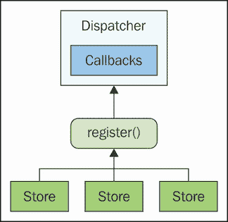
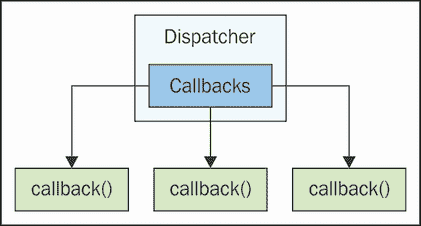
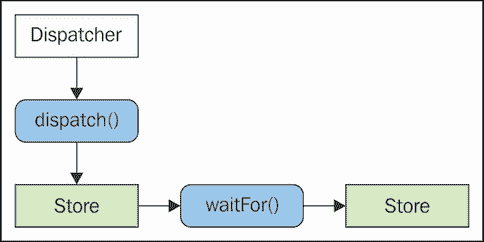
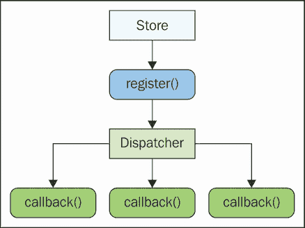
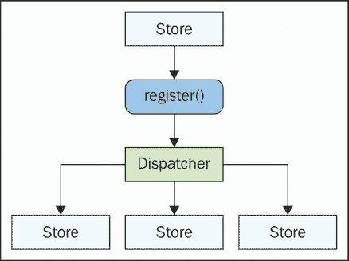
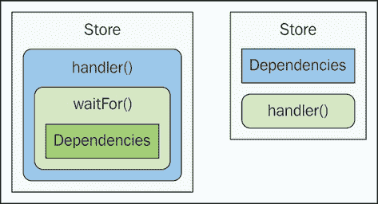
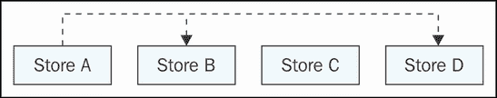
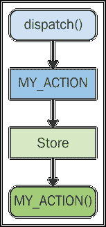
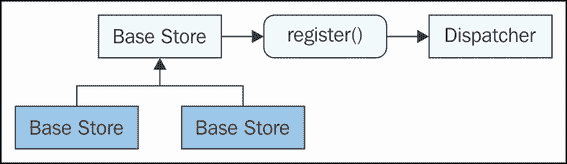

# 第十章 实现分发器

到目前为止，本书中我们一直依赖于 Flux 分发器的参考实现。这样做并没有什么问题——它是一块功能性的软件，分发器没有太多可移动的部分。另一方面，它只是更大想法的一个参考实现——动作需要被分发到存储中，存储依赖项需要被管理。

我们将从讨论 Flux 架构所需的抽象分发器接口开始。接下来，我们将讨论实现我们自己的分发器的动机。最后，我们将在本章的剩余部分致力于实现我们自己的分发器模块，并改进我们的存储组件，以便它们能够无缝地与新的分发器交互。

# 抽象分发器接口

任何参考实现的思路都是直接通过代码来展示某物应该如何工作。Facebook 对 Flux 分发器的参考实现正是如此——我们可以在实际的 Flux 架构中使用它并获得结果。我们还获得了对抽象分发器接口的理解。换句话说，参考实现有点像软件需求，只是以代码的形式表达。

在我们深入自己的分发器实现之前，本节将尝试更好地理解这些最小要求。分发器必须实现的第一项基本功能是存储注册，以便分发器可以向其分发有效载荷。然后，我们需要实际的分发机制，它遍历已注册的存储并交付有效载荷。最后，我们在分发有效载荷时需要考虑依赖语义。

## 存储注册

当我们实例化一个存储时，我们必须告诉分发器关于它的信息。否则，分发器不知道存储的存在。通常的模式看起来像这样：



分发器维护一个内部回调集合，以便在分发动作时运行。它只需要遍历这个回调函数集合，依次调用每个函数。这听起来真的很简单，当 Flux 更新周期中的所有操作都是同步的时候。问题是，我们想改变存储注册过程的方式吗？

也许我们不是在存储构造函数内部注册回调函数，而是将存储实例本身的引用传递给分发器？那么，当需要通知存储有关已分发的动作时，分发器将遍历存储实例的集合并调用一些预定义的方法。这种方法的优点是，由于分发器有存储的引用，它可以访问存储的其他元数据，例如其依赖项。

当我们开始编写代码时，我们将在本章稍后进一步探讨这个想法。底线是——我们需要一种方法来告诉调度器，给定的存储实例希望接收动作通知。

## 分发有效载荷

实际上分发有效载荷相当简单。唯一复杂的部分是处理存储之间的依赖关系——我们将在下一节讨论这个问题。现在，只需想象一个没有存储间依赖关系的架构。它只是一个简单的集合，可以迭代，每个函数都使用动作有效载荷作为参数。以下是这个过程的一个说明：



除了依赖管理之外，这幅图景中是否还缺少其他内容？嗯，我们可能会遇到一种情况——嵌套调度。在 Flux 架构中，嵌套调度是严格禁止的，因为它们会破坏同步单向更新轮次。实际上，Facebook 对调度器的参考实现会跟踪任何给定更新轮次的状态，并在发生这种情况时捕获它。

这并不意味着我们实现的调度器组件必须检查这种条件。然而，当发生如此破坏架构本质的事情时，快速失败从不是个坏主意。

值得思考的另一件事是在给定更新轮次中调用每个已注册存储的必要性。当然，从一致性角度来看，这样做是有意义的——对待每个存储都一样，并通知他们关于*所有事情*。另一方面，我们可能有一个拥有数百个动作被分发的庞大应用。总是向那些从未对这些动作做出响应的存储分发动作有意义吗？当我们实现自己的调度器组件时，我们可以自由地思考如何实现这样的启发式方法，以使我们的应用受益，同时保持对 Flux 原则的忠诚。

## 处理依赖关系

分发动作最具挑战性的方面可能是确保存储依赖被正确处理。另一方面，调度器只需确保以正确的顺序调用存储动作处理器。考虑到依赖关系的动作分发在此处得到说明：



只要`waitFor()`调用右侧的存储在收到调度通知，那么一切就绪。所以从本质上讲，对于调度器来说，存储依赖是一个排序问题。以满足依赖图的方式排序回调，然后迭代并调用每个处理器。

问题是——我们真的想依赖`waitFor()`调度器方法来管理存储依赖吗？可能有一种更好的方法来处理这个问题，那就是声明一个我们依赖的存储数组。这样，在注册时就会将其传递给调度器，我们就不再需要`waitFor()`调用。

我们已经有了实现我们自己的分发器所需的基本蓝图。但在我们开始实施之前，让我们花更多的时间讨论一下面对 Facebook 分发器所遇到的挑战。

# 分发器的挑战

在上一节中，我们瞥见了 Facebook Flux 分发器参考实现的一些潜在挑战。在本节中，我们将详细阐述一些这种推理，试图提供实施我们自己的自定义分发器的动机。

在本节中，我们将重申 Flux NPM 包主要作为一个教育工具而存在的事实。依赖这样的包是可以的，特别是因为它完成了工作，但我们将讨论一些这种东西在生产环境中可能带来的风险。然后，我们将讨论分发器组件是单例实例的事实，它们可能并不需要是单例。

然后，我们将思考存储注册过程，以及它比必要的更手动的事实。最后，我们将再次讨论存储依赖管理问题，并讨论 `waitFor()` 和可能的声明式替代方案。

## 教育目的

如我们所知，Facebook Flux NPM 包提供了一个分发器的参考实现。了解这样一个组件应该如何工作的最佳方式是编写使用它的代码。换句话说，这是为了教育目的。这使我们能够快速起步，因为我们找到了编写 Flux 代码的最佳方式。Facebook 本可以省略分发器实现，让阅读 Flux 文档的程序员自己找出这一点。代码是非常有教育意义的，它也充当了一种文档形式。即使我们决定我们并不喜欢分发器的实现方式，我们至少可以阅读代码来了解分发器应该做什么。

如果我们在生产环境中使用这个包，会有任何风险吗？如果我们使用项目中默认的 Flux 分发器，并且针对它开发的一切都正常工作，那么我们没有理由不能在生产应用程序中使用它。如果它工作，它就工作。然而，这个参考实现是为了教育目的而设计的，这很可能意味着它没有进行严肃的开发。以 React 为反例，数百万人在生产环境中使用这个软件。这种技术向前推进并自我改进是有动力的。然而，对于参考分发器实现来说，情况并非如此。自己动手实现肯定值得考虑，尤其是如果还有改进的空间的话。

## 单例分发器

如果我们使用 Facebook 的 Flux 分发器，我们必须实例化它，因为它只是一个类。然而，由于在任何给定时间只有一个更新轮次发生，整个应用程序中不需要超过一个分发器实例。这是单例模式，而且并不总是最好的模式。一方面，它是无用的间接引用。

例如，每次我们想要派发一个动作时，我们需要访问分发器的`dispatch()`方法。这意味着我们必须导入分发器实例，并使用实例作为上下文调用方法，就像这样：`dispatcher.dispatch()`。`register()`方法也是一样；当存储想要将自己注册到分发器时，它首先需要访问实例，然后再调用方法。

因此，似乎这个单例分发器实例除了妨碍和使代码更加冗长之外，没有真正的作用。如果我们不是使用单例类实例，而是将分发器仅仅作为一个导出相关函数的简单模块，会怎么样呢？这将大大简化需要分发器的地方的代码，如果我们的应用程序有很多存储和动作，那么这个地方可能相当多。

## 手动存储注册

Flux 架构的一个不变量是存储连接到分发器。除了通过派发动作之外，没有其他方式可以改变存储的状态。所以除非我们想要一个永远不会改变状态的静态存储，否则我们需要将其注册到分发器上。我们在这本书中迄今为止看到的所有示例存储都在构造函数中设置了它们的分发器处理器。这就是我们处理可能改变存储状态的动作的地方。

由于分发器注册是既定的，我们真的需要在每个存储创建时显式注册一个回调函数吗？另一种方法可能涉及一个基类存储，它会为我们处理这个注册；这并不一定是分发器特定的一个问题。

存储注册的另一个方面，大部分情况下感觉是不必要的，是管理分发器 ID。例如，如果我们实现一个依赖于另一个存储的存储，我们必须引用那个其他存储的派发 ID。使用 ID 的原因很简单——回调函数不能识别存储。因此，我们必须使用分发器将回调 ID 映射到存储。整个方法感觉非常混乱，所以当我们实现自己的分发器时，我们可以完全去掉这些派发 ID。

## 容易出错的依赖管理

我们还希望解决默认 Facebook Flux 分发器处理存储之间依赖关系的方式。`waitFor()`机制完成了它的任务，即在所有依赖都处理了动作之前，它会阻塞处理器的进一步执行。这样，我们知道我们依赖的存储总是最新的。问题是`waitFor()`感觉有点容易出错。

首先，它必须始终位于相同的位置——存储动作处理器的顶部。我们必须记住使用我们所依赖的存储的调度 ID，这样 `waitFor()` 才知道要处理哪些存储。一种更声明式的方法意味着我们可以将存储的依赖项设置为一个存储引用数组或类似的东西。这样，依赖关系就在实际的回调函数之外声明，并且更加明显。我们将找出在我们的调度器中实现这一方法的方式，我们现在就开始着手。

# 构建调度器模块

在本节中，我们将实现我们自己的调度器模块。这将成为我们迄今为止在这本书中依赖的 Facebook 参考实现的替代品。首先，我们将考虑调度器将如何跟踪存储模块的引用。然后，我们将讨论该模块需要公开的函数，接着将介绍 `dispatch()` 的实现过程。最后，我们将确定我们想要如何使用这个调度器模块来处理依赖关系管理。

## 封装存储引用

我们需要考虑的调度器模块的第一个方面是存储本身。在 Facebook 的参考实现中，没有存储的引用——只有回调函数的引用。也就是说，当我们向 Facebook 的调度器注册时，我们传递的是 `register()` 方法的一个函数，而不是存储实例本身。我们的调度器模块将保留存储引用，而不仅仅是回调函数。以下是一个说明参考实现采用的方法的图表：



每次调用 `register()` 时，它都会将一个回调函数添加到回调函数列表中，该列表将由调度器在任何动作被调度时处理。然而，缺点是调度器可能需要访问存储以获取我们想要实现的高级功能，正如我们很快就会看到的。因此，我们将想要注册存储实例本身，而不仅仅是回调函数。这里展示了这种方法：



回调函数列表现在是一个存储实例的列表，当动作被调度时，调度器现在可以访问存储数据，这对于像方法和依赖列表这样的功能非常有用。这里的权衡是回调函数更通用，它们只是被调度器调用。正如我们很快就会看到的，这种方法有一些优势，可以使存储代码更加简化。

## 处理依赖关系

在我们的调度器实现方面，我们首先考虑的是存储之间的依赖关系是如何管理的。标准的方法是实现一个`waitFor()`方法，该方法在存储处理函数中阻塞执行，直到它所依赖的存储被处理。如您现在所意识到的，这种方法由于它在处理函数中使用，可能会出现问题。我们正在追求的实现是一个更声明性的方法。

策略是，依赖于存储的列表被声明为存储的一个属性。这允许存储查询它所依赖的其他存储。它还把存储的依赖管理方面从应该专注于动作的处理代码中分离出来。以下是两种方法的视觉比较：



尝试访问在`waitFor()`中指定的依赖关系就像剥洋葱——它们是隐藏的。我们的目标是分离处理代码和依赖关系指定。那么我们到底该如何做呢？

而不是在调度过程中尝试处理依赖关系，我们可以在存储注册时解决我们的依赖关系。如果一个存储在其属性中列出了依赖项，那么调度器可以组织存储列表，以满足这些依赖项。以下是我们的调度器模块的`register()`函数的一个实现：

```js
// This is used by stores so that they can register
// themselves with the dispatcher.
export function register(store) {

  // Don't let a store register itself twice...
  if (stores.includes(store)) {
    throw `Store ${store} already registered`;
  }

  // Adds the "store" reference to "stores".
  stores.push(store);

  // Sorts our stores based on dependencies. If a store
  // depends on another store, the other store is
  // considered "less than" the store. This means that
  // dependencies will be satisfied if the stores are
  // processed in this sort order.
  stores.sort((a, b) => {
    if (a.deps.includes(b)) {
      return 1;
    }

    if (b.deps.includes(a)) {
      return -1;
    }

    return 0;
  });
}
```

这是存储可以使用来注册自己的函数。这个函数首先做的事情是检查存储是否已经通过调度器进行了注册。这是一个简单的检查，因为引用存储在一个数组中；我们可以使用`includes()`方法。如果存储尚未注册，那么我们可以将存储推送到数组中。

接下来，我们处理存储依赖关系。每次存储注册时，我们都会重新排序`stores`数组。这个排序基于存储的`deps`属性。这就是存储的依赖关系被声明的地方。排序比较器很简单。它基于**存储 A**是否依赖于**存储 B**或反之。例如，假设这些存储按照以下顺序注册：


现在，让我们假设以下存储依赖关系已经被声明：



这意味着**存储 A**依赖于**存储 B**和**存储 D**。在所有这些存储都注册后，我们的调度器模块中存储列表的顺序如下：


现在商店列表的顺序满足商店的依赖关系。当调度器遍历商店列表并调用每个商店处理程序时，它将按正确的顺序完成。由于**商店 A**依赖于**商店 C**和**商店 D**，唯一重要的是这两个商店首先被处理。**商店 A**和**商店 C**的顺序无关紧要，因为它们之间没有声明依赖关系。现在，让我们看看如何实现我们模块的分派逻辑。

## 分派操作

在 Facebook 对 Flux 调度器的参考实现中，分派机制是调度器实例的一个方法。由于实际上并不需要一个单例调度器实例，我们的调度器是一个简单的模块，公开了一些函数，包括一个`dispatch()`函数。多亏了我们在`register()`函数中实现的依赖关系排序逻辑，`dispatch()`的工作流程将非常直接。现在让我们看看这段代码：

```js
// Used by action creator functions to dispatch an
// action payload.
export function dispatch(payload) {

  // The dispatcher is busy, meaning that we've
  // called "dispatch()" while an update round
  // was already taking place.
  if (busy) {
    throw 'Nested dispatch() call detected';
  }

  // Marks the dispatcher as "busy" before we
  // start calling any store handlers.
  busy = true;

  // The action "type" determines the method
  // that we'll call on a the store.
  let { type } = payload;

  // Iterates over each registered store, looking
  // for a method name that matches "type". If found,
  // then we call it, passing it the "payload" that
  // was dispatched.
  for (let store of stores) {
    if (typeof store[type] === 'function') {
      storetype;
    }
  }

  // The dispatcher isn't busy any more, so unmark it.
  busy = false;
}
```

您可以看到，在函数顶部有一个检查的`busy`变量。这正是在我们开始调用商店处理程序之前设置的。本质上，这是检查是否有任何调用`dispatch()`作为商店处理操作的后果。例如，我们可能不小心从商店或从监听商店的视图中调用`dispatch()`。这是不允许的，因为它破坏了我们 Flux 架构的单向数据流。当这种情况发生时，检测它并快速失败比让嵌套更新轮次运行要好。

除了忙状态处理逻辑之外，这个函数遍历商店集合，并检查是否有适当的方法可以调用。方法名称基于操作类型。例如，如果操作是`MY_ACTION`并且商店有相同名称的方法，那么该方法将使用有效载荷作为参数被调用。这个过程在这里被可视化：



这与我们在本书中迄今为止使用的标准`switch`语句方法有很大的不同。相反，找到在商店中运行的适当代码的责任在于调度器。这意味着如果商店没有实现与已分发的操作相对应的方法，它将被商店忽略。这是我们商店分派处理程序中经常发生的事情，但现在它更高效，因为它绕过了`switch`情况检查。在下一节中，我们将看到我们的商店如何与这种新的调度器实现一起工作。但首先，这里是完整的调度器模块，这样您就可以看到所有内容是如何结合在一起的：

```js
// References to registered stores...
const stores = [];

// This is true when the dispatcher is performing
// an update round. By default, it's not busy.
var busy = false;

// This is used by stores so that they can register
// themselves with the dispatcher.
export function register(store) {

  // Don't let a store register itself twice...
  if (stores.includes(store)) {
    throw `Store ${store} already registered`;
  }

  // Adds the "store" reference to "stores".
  stores.push(store);

  // Sorts our stores based on dependencies. If a store
  // depends on another store, the other store is
  // considered "less than" the store. This means that
  // dependencies will be satisfied if the stores are
  // processed in this sort order.
  stores.sort((a, b) => {
    if (a.deps.includes(b)) {
      return 1;
    }

    if (b.deps.includes(a)) {
      return -1;
    }

    return 0;
  });
}

// Used by action creator functions to dispatch an
// action payload.
export function dispatch(payload) {

  // The dispatcher is busy, meaning that we've
  // called "dispatch()" while an update round
  // was already taking place.
  if (busy) {
    throw 'Nested dispatch() call detected';
  }

  // Marks the dispatcher as "busy" before we
  // start calling any store handlers.
  busy = true;

  // The action "type" determines the method
  // that we'll call on a the store.
  let { type } = payload;

  // Iterates over each registered store, looking
  // for a method name that matches "type". If found,
  // then we call it, passing it the "payload" that
  // was dispatched.
  for (let store of stores) {
    if (typeof store[type] === 'function') {
      storetype;
    }
  }

  // The dispatcher isn't busy any more, so unmark it.
  busy = false;
}
```

# 改进商店注册

我们不能在不改进存储的工作流程的情况下改进分发器的工作流程。幸运的是，分发器已经实现了这项艰苦的工作。我们只需要以最佳方式实现我们的存储，以充分利用我们对分发器所做的改进。在本节中，我们将讨论实现基础存储类，然后是一些扩展它的存储的示例实现，这些存储实现了它们自己的动作方法。

## 基础存储类

我们刚刚实现的新分发器与 Facebook 的参考实现有一些重要的不同之处。两个关键的区别是，存储注册了一个自身的实例而不是回调函数，以及存储需要实现动作方法。基础存储类应该能够在创建时自动与分发器注册。这意味着扩展此基础类的存储不需要担心分发器——只需实现相应改变存储状态的动作方法。

分发器、基础存储以及扩展它的存储的布局在此图中展示：



让我们继续查看我们基础存储类的实现。然后，我们将实现一些扩展它的存储，这样我们就可以看到我们的新分发器模块的实际应用：

```js
import { EventEmitter } from 'events';
import { register } from './dispatcher';

// Exports the base store for others to extend.
export default class Store extends EventEmitter {

  // The constructor sets the initial "state" of the
  // store, as well as any dependencies "deps" with
  // other stores.
  constructor(state = {}, deps = []) {
    super();

    // Stores the state and dependencies. The "deps"
    // property is actually required by the
    // dispatcher.
    this.state = state;
    this.deps = deps;

    // Registers the store with the dispatcher.
    register(this);
  }

  // This is a simple helper method that changes the
  // state of the store, by setting the "state"
  // property and then emitting the "change" event.
  change(state) {
    this.state = state;
    this.emit('change', state);
  }

}
```

就这样，很简单对吧？构造函数接受存储的初始状态和存储依赖项的数组。这两个参数都是可选的——它们有默认参数值。这对于 `deps` 属性尤为重要，因为我们的分发器模块期望它存在。然后，我们调用 `register()` 函数，以便分发器自动了解任何存储。记住，如果分发器无法处理分发的动作，那么 Flux 存储就没有任何用处。

我们还添加了一个方便的小 `change()` 方法，它会更新状态并为我们发出更改事件。现在我们有了基础存储类，我们可以自由地实现这样的小辅助方法，以减少重复的存储代码。

## 动作方法

让我们完成现在已经讨论了几段的示例。为了做到这一点，我们将实现几个扩展我们刚刚创建的基础存储的存储。这是第一个存储：

```js
import Store from '../store';
import second from './second';
import third from './third';

// The initial state of the store, we'll
// pass this to "super()" in the constructor.
const initialState = {
  foo: false
};

// The dependencies this store has on other
// stores. In this case, it's "second" and
// "third". These too, are passed through
// "super()".
const deps = [ second, third ];

class First extends Store {

  // The call to "super()" takes care for setting up
  // the initial store state, and the dependencies
  // for us.
  constructor() {
    super(initialState, deps);
  }

  // Called in response to the "FOO" action
  // being dispatched...
  FOO(payload) {
    this.change({ foo: true });
  }

  // Called in response to the "BAR" action
  // being dispatched...
  BAR(payload) {
    this.change(Object.assign({
      bar: true
    }, this.state));
  }
}

export default new First();
```

这个存储拥有所有与我们的新基础存储类和新分发器模块一起工作的相关组件。您可以在构造函数中看到，我们正在将 `initialState` 和 `deps` 值传递给 `Store` 构造函数。您还可以看到，在这个存储中实现了两个动作方法：`FOO()` 和 `BAR()`。这意味着如果有任何类型为 `FOO` 或 `BAR` 的动作被分发，这个存储将响应它们。现在让我们实现这个存储所依赖的两个存储：

### 注意

如果你实在无法忍受全大写的方法名外观，你可以随意更改要派发的动作类型的大小写。另一个选择是在派发器中实现不区分大小写的匹配。反对这种后者的权衡是我们将失去从动作类型到方法名的直接映射。小心你所期望的。

```js
import Store from '../store';
import third from './third';

class Second extends Store {

  // The call to "super()" sets the initial
  // state for us.
  constructor() {
    super({
      foo: false
    });
  }

  // Called in response to the "FOO" action
  // being dispatched...
  FOO(payload) {
    this.change({ foo: true });
  }

  // Called in response to the "BAR" action
  // being dispatched. Note that we're
  // dependent on the "third" store, yet
  // we don't make this dependency explicit.
  // This could lead to trouble.
  BAR(payload) {
    this.change({
      foo: third.state.foo
    });
  }
}

export default new Second();
```

`Second`存储类似于`First`存储。它扩展了基`Store`类并设置了一个默认状态。它还响应两个动作，正如我们可以通过两个方法名看到的那样。然而，这个存储没有声明任何依赖关系，但它显然依赖于`BAR()`动作处理器中的第三个存储。这可能会或可能不会工作，这取决于`third`存储在派发器持有的存储集合中的位置。如果我们声明`third`为依赖项，那么我们可以确定它将始终在存储之前更新。现在让我们看看我们的最后一个存储：

```js
import Store from '../store';

class Third extends Store {

  // The call to "super()" sets the initial
  // state for us...
  constructor() {
    super({
      foo: false
    });
  }

  // Called in response to the "FOO" action
  // being dispatched.
  FOO(payload) {
    this.change({ foo: 'updated' });
  }
}

export default new Third();
```

再次强调，这个存储遵循其两个后继者的相同模式。关键区别在于它没有`BAR()`动作处理器。这意味着当派发`BAR`动作时，这个存储中的任何内容都不会被调用。这与我们早期的处理器形成对比，其中每个动作都会通过一个`switch`语句进行过滤，然后被忽略。最后，让我们看看`main.js`来将这些内容串联起来：

```js
import first from './stores/first';
import second from './stores/second';
import third from './stores/third';

import { foo } from './actions/foo';
import { bar } from './actions/bar';

// Logs the state of each store as it changes...
first.on('change', (state) => {
  console.log('first', state);
});

second.on('change', (state) => {
  console.log('second', state);
});

third.on('change', (state) => {
  console.log('third', state);
});

foo();
// →
// third {foo: "updated"}
// second {foo: true}
// first {foo: true}

bar();
// →
// second {foo: "updated"}
// first {bar: true, foo: true}
```

注意`foo()`的输出反映了正确的依赖顺序，而`bar()`的输出反映了`Third`中缺失的动作处理器。

# 摘要

在本章中，你了解了一些与 Facebook Flux 组件固有的局限性。首先，它并不是针对生产环境设计的，因为它是对 Flux 模式的参考实现。我们可以自由地以我们喜欢的方式实现这些派发模式。

派发器的本质方面是能够注册处理派发动作的存储代码，以及执行派发的能力。鉴于要求的简单性，实现另一个单例类是没有意义的。相反，派发器只需要公开一个`register()`和`dispatch()`函数。

我们实现中的重大变化是关于依赖管理。不是每次派发动作时都确定依赖关系，而是`register()`函数以满足存储依赖关系的方式对`stores`集合进行排序。然后我们实现了一个基类存储，它通过自动为我们注册存储到派发器来简化我们的存储代码。

在下一章中，我们将探讨依赖于除 ReactJS 以外的技术来渲染自己的视图组件。
