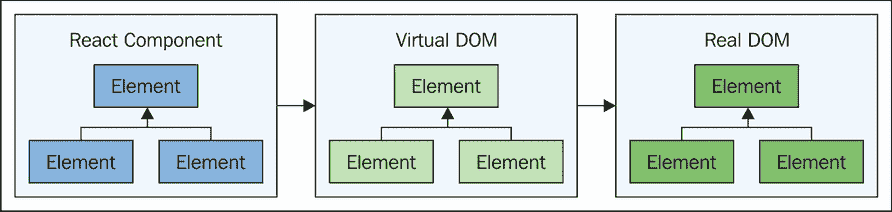

# 第十一章. 替代视图组件

Flux 文档并没有太多关于视图组件的说明。然而，视图是任何 Flux 架构中不可或缺的一部分。也许 Flux 的作者真正想要表达的是，Flux 并不真正关心我们渲染视图所使用的机制——只要它们以某种方式被渲染即可。

没有人会不知道 Flux 是为了与 React 配合而设计的。Facebook 已经为他们的视图组件构建了 React——Flux 是缺失的那一块，使得他们能够构建一个完整的、前端架构。我们将从讨论是什么让 React 如此适合 Flux 架构开始这一章。然后，我们将权衡这些好处与 React 的缺点。

接下来，我们将花一些时间使用 jQuery 和 Handlebars 模板引擎构建视图。这些是两个可能在任何开发者的职业生涯中某个时刻都曾接触过的流行技术。然后，我们将通过思考那些不需要特定渲染技术的视图来结束这一章，这样我们就可以灵活地处理视图，并在新热点到来时采用它。

# ReactJS 非常适合 Flux

React 适合 Flux 架构并不令人惊讶。这两种技术都是由同一家公司创造的，并且它们都解决了互补的问题。在本节中，我们将深入了解 React 与 Flux 配合得如此之好的原因。我们将从查看 Flux 和 React 中都存在的单向流开始。接下来，我们将讨论重新渲染 DOM 结构比操作特定的 DOM 节点更容易，以及为什么这对存储更改事件处理器来说是一个很好的选择。最后，我们将讨论 React 组件相对较小的代码占用。

## ReactJS 是单向的

在 Flux 架构中，数据流是单向的。它从动作开始，以视图更新结束——数据进入视图组件没有其他方式。React 本身也与 Flux 共享相同的单向哲学。数据流入根 React 组件，并逐渐流入用于组成根组件的任何组件。这个过程在组件层次结构中是递归的。

数据通过动作流入 Flux 存储，并以更改事件的形式流出。React 组件保持这种单向流。一旦 React 组件根据存储状态重新渲染自己，流程就结束了。唯一的选择是重新开始，通过派发一个新的动作。Flux 和 React 组件之间的流程在此处展示：


我们数据流的前三项是 Flux 实体。每当一个动作被分发时，就会启动一个给定的数据流。然后，该动作本身进入分发器，并发送到每个存储。然后存储根据需要做出任何状态更改。从这里，数据流被传递给 React 组件。这是我们指定要渲染的标记结构的结构，使用 JSX。组件随后与虚拟 DOM 协商，以确定是否需要在实际 DOM 中进行任何更改。一旦这些更改完成，数据流就达到了终点。

我们为 React 组件概述的流程，即使它们不是 Flux 架构的一部分，看起来也不会有任何不同。Flux 组件只是以同步方式添加可预测的状态更改，然后在将数据传递给组件进行渲染之前。没有 Flux，React 仍然需要从顶部开始传递数据，以便重新渲染过程可以开始。这与 Flux 存储发出的更改事件非常契合。

与 React 不太匹配的是双向数据绑定的概念。有些人喜欢这个想法，并找到了使其与 React 一起工作的方法，但我在这里跑题了。为了使双向绑定有效，我们的视图组件需要与可变数据紧密相邻。然后，视图可以直接监听这些数据以重新渲染自身。我们并没有设置好使用 Flux 架构来处理这种情况，更不用说 React 了。我们可以直接修改某个状态，而不必首先进入一个管理应用程序全局状态同步更新的工作流程，这与 Flux 的每个想法都相悖。简单来说，Flux 架构倾向于具有可预测结果的单向数据流，而 React 有助于完成这一使命。

## 重新渲染新数据很容易

关于 ReactJS 的一个真正突出之处在于它重新渲染整个 DOM 树的能力。嗯，任何 JavaScript 代码都可以通过重新构建来替换现有的 DOM 树。React 使用所谓的虚拟 DOM 来比较用户当前正在查看的现有元素，以及我们刚刚渲染的新元素。React 不会替换整个树，而只会触及两个树不同的 DOM 位置。除了 React 内置的启发式方法外，基本性能优势来自于虚拟 DOM 位于 JavaScript 内存中——我们不需要查询真实 DOM 中的元素。查询 DOM 可能会产生负面的性能影响。

为了解决这些性能问题，我们的视图代码可以发出特定的查询，这些查询运行效率高，并且只获取我们需要的精确元素。我们的视图代码还可以缓存它需要的特定元素。这种方法的缺点是，一旦我们有了超过几个视图组件，就会感觉零散。当组件都针对它们自己的特定性能要求定制时，它们很难共享代码，而且这高度依赖于组件的 DOM 结构。

对于程序员来说，能够说出“这里是一个快照，展示了这些视图元素在这个时间点应该看起来是什么样子”更为自然。我们不应该需要拆解 DOM 结构，并说这个`div`应该看起来像这样，而那个`span`应该隐藏，等等。这就是为什么 JSX 起作用的原因；我们可以更容易地可视化我们组件的输出将是什么样子，因为它结构化得就像元素的结构一样。

## 小型代码占用

与具有大量命令式 DOM 操作代码的视图组件相比，React 组件通常包含更少的代码。React 没有这种类型的代码，因为它只需要通过 JSX 表达 DOM 的结构。然而，如果没有 Flux 作为架构，使用 React 的应用程序可能会发现 React 组件包含更多的数据转换代码。

例如，当 React 组件挂载到 DOM 中时，我们可能需要对来自某些来源的数据进行某种转换，可能是 AJAX 响应。有了 Flux，来源始终是存储的状态，因此我们知道数据转换已经在它们传递给 React 视图之前发生了。记住，是视图驱动我们的存储状态的结构，而不是存储驱动视图的结构。

事件处理代码是另一个 React 组件可以具有小型代码占用的领域。好吧，这里实际上有两个维度。首先，React 中的事件处理程序直接在 JSX 中声明，因此它们就像 DOM 树结构中的任何其他元素属性一样——不需要将元素插入 DOM，然后在稍后查找它们，以便我们可以将事件处理函数附加到它们上。第二个维度实际上并不特定于 React，而更多的是 Flux 现象。事件处理程序本身通常是动作创建函数。我们视图中的所有逻辑现在都是我们存储的一部分。

# ReactJS 的缺点

现在你已经很好地掌握了在 Flux 架构中使用 ReactJS 作为视图层的优点，是时候看看一些缺点了。任何事物都有其负面权衡——没有完美技术的存在。因此，在应用 Flux 架构的背景下，这些因素是值得考虑的。

首先，我们将考虑内存消耗。React 是一个相当大的库，对应用程序加载时间有明显的影響。然而，与虚拟 DOM 消耗的内存量相比，这只是一个次要问题。接下来，我们将探讨将 JSX 语法引入我们的 JavaScript 模块，以及这可能会给那些不习惯将其他语言混合到他们的 JavaScript 模块中的人带来的问题。

## 虚拟 DOM 和内存

JavaScript 应用程序应尽可能追求内存效率。那些感觉臃肿且对用户不响应的应用程序。使用大量内存的应用程序本质上比使用较少内存的应用程序慢，因为它们需要执行更多的工作。例如，如果我们需要在集合中查找某个东西，如果集合中有大量对象，那么显然需要更多的计算资源，而不是一个对象数量小得多的集合。这种做法还会在垃圾回收期间损害应用程序性能。如果我们有大量分配后从未释放（可能由于其他问题如泄漏）的集合，那么这就不成问题了。但更常见的行为是，在用户操作时分配大量内存，然后在用户继续操作时释放该内存。这种行为将触发频繁的垃圾回收运行，这会导致响应性暂停。

React 的架构比其他内存处理方法需要更多的内存。这是由于 React 维护的虚拟 DOM。这个内存结构旨在反映真实 DOM 的结构。它不跟踪真实 DOM 中每个元素的每一份数据。它只跟踪计算 diff 所必需的数据。以下是我们组件、虚拟 DOM 和真实 DOM 之间映射的示意图：



我们 React 组件中的元素不一定占用很多内存，因为它们只是组件的声明部分，指定了要使用哪些元素以及它们应该具有哪些属性值。虚拟 DOM 反映了我们在 JSX 中指定的结构和属性；这些元素实际上确实占用了内存。最后，我们有用户看到并与之交互的真实 DOM 元素。这些也占用了相当大的内存。

这种方法的主要挑战是我们对 DOM 中渲染的任何内容都进行了重复。换句话说，虚拟 DOM 出于必要增加了我们的 DOM 元素消耗的总内存。没有虚拟 DOM，React 和 JSX 只是另一个模板引擎。虚拟 DOM 解决了其他地方的性能问题。React 在性能方面表现优异的主要领域是高效的 DOM API 交互，因为虚拟 DOM 消除了许多这些调用的需要。

你的典型 React 应用程序消耗的内存是否是一个致命的问题？绝对不是。内存正迅速成为一种商品，甚至在移动空间也是如此。所以如果我们能分配更多的内存来解决真正的性能问题，我们应该尽一切可能这样做。然而，在某些情况下，过度的内存分配可能会成为 React 应用程序的问题。例如，如果我们只是需要渲染大量的元素怎么办？当且仅当这成为一个性能问题时，你最好的选择可能是设计更少的元素。

## JSX 和标记

JSX 实质上是 HTML（好吧，技术上来说是 XML）与 JavaScript 代码混合。如果你的初始反应对这个方法并不满意，你并不孤单。在漫长的岁月里，实际上几十年，我们都习惯了将关注点分开。像 HTML 这样的东西永远不应该和那些控制何时以及如何显示该标记的 JavaScript 逻辑放在同一个模块中。如果我们已经习惯了多年的关注点分离原则，那么对将两个关注点合并到一个模块中的想法感到抵触是很自然的。

很可能你最近工作的最后一个项目涉及到在模板文件中指定标记。然后这些模板被输入到视图层进行渲染。从这种设置转向 Flux 可能是一次性难以全部接受的事情。一方面，我们有一个全新的单向数据流需要考虑。另一方面，我们正在谈论放弃我们辛苦构建到单独层中的所有东西。

我们不要忘记关注点分离原则确实有其作用。如果两个关注点在不同的地方实现，那么一个关注点的变化影响另一个关注点的可能性就小得多。想想看，将模板视为将任何给定组件的视觉方面隔离开来的方式。至少在理论上，我们可以让设计团队自由地处理模板，而不用担心它们会破坏组件的 JavaScript 实现。

如果你在这本书中学到了什么，那可能就是 UI 组件的复杂性远不止其各部分的总和。Flux 通过在存储中显式地建模这些复杂性来试图承认这些复杂性。在 Flux 中更新 UI 的严格顺序和同步性是有原因的：尽管涉及所有这些复杂性，但仍然具有可预测性。这和 JSX 有什么关系呢？好吧，在将其视为违反关注点分离原则的东西之前，想想它如何与 Flux 存储很好地匹配。还要考虑这样一个想法：标记和渲染它的逻辑最终可能是同一个关注点。

## 供应商锁定

你是否曾听到有人这么说：“我正在使用库 x，因为我不想被锁定在库 y 中？”供应商锁定是一个棘手的问题领域。尽管如今，大多数项目都依赖于开源项目，这更像是一种*技术方法锁定*。如果我不在这里至少提及与 Flux 和 React 相关的话题，那将是一个疏忽。

一旦我们开始使用 React 和 JSX，我们基本上就下了赌注。这不仅仅是因为它是一个安全的赌注。尽管如此，我们已经走上了一条非常难以摆脱的道路，这正是过去三个部分的核心观点。即使你的心中 95%已经决定选择 React，知道你已经权衡了利弊，你也会睡得更香。

# 使用 jQuery 和 Handlebars

jQuery 和 Handlebars 是现代 Web 应用中普遍使用的两种技术。对于新接触 Flux 的人来说，有很大概率他们已经使用过其中一种或两种技术，因此我们将在这个部分实现一些使用 jQuery 和 Handlebars 的视图。

我们将从讨论 jQuery 和 Handlebars 为何适合实现视图组件开始。然后，我们将实现一个使用这些技术来渲染 Flux 存储状态的视图。之后，我们将思考如何从更小的部分组合更大的视图，以及如何最好地处理用户事件。

## 为什么是 jQuery 和 Handlebars？

在 JavaScript 框架出现之前，jQuery 就已经存在。这个小库旨在解决前端开发中普遍存在的跨浏览器问题，总的来说是为了让开发更加愉快。如今，jQuery 在 JavaScript 库领域仍然是一个主导者。许多大型框架都依赖于 jQuery，因为它非常有效，而且学习它的工作原理的门槛很低。

jQuery 不太擅长的一件事是使用 HTML 指定 UI 组件的布局。例如，我们可以使用 jQuery 动态构建新元素并将它们插入 DOM。然而，这种方法的某些方面感觉笨拙且不自然。通常，能够使用与页面显示相同的结构来编写 HTML 会更清晰。这消除了间接层，使我们更容易将标记映射到渲染输出。

进入 Handlebars。这个库为我们前端添加了一个复杂的模板引擎。编写 Handlebars 模板意味着我们可以编写 HTML，以及一些特定的 Handlebars 语法用于动态部分，并避免使用 jQuery 尝试组装元素的混乱。这两个库是互补的。我们有 Handlebars 模板来声明我们应用程序的结构，我们使用 Handlebars 渲染引擎来渲染这个结构。然后，jQuery 可以处理视图组件的各个方面，例如选择 DOM 元素和处理事件。让我们看看在 Flux 架构的上下文中这看起来是什么样子，通过实现一个渲染 Handlebars 模板的视图：

## 渲染模板

让我们从最基本的使用场景开始——使用 jQuery 将 Handlebars 模板渲染到 DOM 元素中。首先，让我们看看 Handlebars 模板文件本身：

```js
<p><strong>First: </strong>{{first}}</p>
<p><strong>Last: </strong>{{last}}</p>
```

如您所见，这基本上是基本的 HTML，其中混合了一些用于动态部分的特定 Handlebars 语法。这个模板存储在一个 `.hbs` 文件中（代表 *handlebars*——有些人使用完整的 `.handlebars` 扩展名）。我们可以更新我们的 Webpack 配置以添加 Handlebars 加载器。这个加载器会解析和编译 `.hbs` 模板，这意味着使用这些模板的代码可以像导入常规 JavaScript 模块一样导入它们。让我们看看在我们的视图组件中这看起来是什么样子：

```js
// Imports the compiled Handlebars "template"
// function just like a regular JavaScript module.
import template from './my-view.hbs';
import myStore from '../stores/my-store';

export default class MyView {
  constructor(element) {

    // Sets the container element that
    // we'll use to place the rendered template
    // content. Expected to be a jQuery object.
    this.element = element;

    // When the store state changes, we can
    // re-render the view.
    myStore.on('change', (state) => {
      this.render(state);
    });
  }

  // Renders the view. The default state is
  // the initial "myStore.state". We use the
  // "element" property of the view to set the
  // HTML to the rendered output of the Handlebars
  // "template()".
  render(state = myStore.state) {
    this.element.html(template(state));
    return this;
  }
}
```

这个视图模块导入的 `template()` 函数是作为 Webpack 插件编译模板为我们创建的函数的结果。Handlebars 的运行时作为 Webpack 创建的包的一部分包含在内。我们的视图组件的 `render()` 方法调用 `template()` 函数，传递一个上下文，并使用返回值作为视图元素的新的内容。上下文只是存储的状态，每次存储状态改变时，`html()` jQuery 函数都会用来替换现有的元素内容。

### 注意

ReactJS 与像 Handlebars 模板引擎这样的方法之间的基本区别在于，React 尝试进行小范围的更新。使用 Handlebars，我们可能会替换大量的 DOM 内容，性能问题可能会对用户变得明显。为了解决这类问题，我们必须改变我们应用程序的构建方式。这本身可能会让我们在使用像 React 这样的工具时处于不利地位，因为我们可以重新渲染大量的 DOM 结构，同时仍然保持效率。

现在，让我们看看驱动这个视图内容的存储：

```js
import { EventEmitter } from 'events';

import dispatcher from '../dispatcher';
import { MY_ACTION } from '../actions/my-action';

// The initial state of the store. Instead of
// empty strings, this state uses labels that
// indicate that there's still data to come.
var state = {
  first: 'loading...',
  last: 'loading...'
};

class MyStore extends EventEmitter {
  constructor() {
    super();

    this.id = dispatcher.register((e) => {
      switch(e.type) {

        // When the "MY_ACTION" action is
        // dispatched, we extend the state
        // with the value of "payload",
        // overriding any existing property values.
        case MY_ACTION:
          this.emit('change',
            (state = Object.assign(
              {},
              state,
              e.payload
            ))
          );
          break;
      }
    });
  }

  get state() {
    return state;
  }
}

export default new MyStore();
```

这是一个相当典型的存储——与我们在本书中看到的大多数存储没有太大区别。作为 `MY_ACTION` 动作一部分发送的有效负载用于扩展存储的状态，如果有的话，将覆盖现有的属性名称。现在让我们看看主程序：

```js
import $ from 'jquery';

import { myAction } from './actions/my-action';
import MyView from './views/my-view';

// Constructs the new view and performs the
// initial render by calling "render()". Note
// that there's now stored reference to this view,
// because we don't actually need to. If we
// did, "render()" returns the view instance.
new MyView($('#app')).render();

// After 1 second, dispatch "MY_ACTION", which
// will replace the "loading..." labels.
setTimeout(() => {
  myAction({
    first: 'Face',
    last: 'Book'
  });
}, 1000);
```

这是我们初始化视图组件实例的地方，传递给它一个 jQuery 实例。这个 jQuery 对象代表 `#app` 元素，并由视图用来持有渲染的 Handlebars 模板内容。在一秒延迟后，我们调用 `myAction()`，这会导致 `myStore` 状态改变，并且 Handlebars 模板重新渲染。

### 注意

通常，当我们的 Handlebars 模板开始变大时，我们会开始添加专门的处理程序，它们只对特定的存储属性做出响应。原因是属性变化得太频繁，它们只影响可见 UI 的一小部分。然后这些微处理程序就会扩散，我们开始失去可预测性，因为我们正在向渲染代码中引入更多的路径。在 ReactJS 中，这种情况不太可能发生，因为我们很少需要像这样分解视图更新。

## 组成视图

如果我们将 Handlebars 模板作为视图组件的主要成分，我们可能需要能够将我们的模板分解成更小的块。想想我们分解 React 组件的方式——我们最终得到更小的组件，这些组件通常可以在功能之间共享。使用 Handlebars 模板，我们可以通过使用部分模板实现类似的效果。部分是一个较小的部分，它适合于更大的整体，以形成由视图组件渲染的模板。

让我们从查看一个作为具有用户数据数组的存储库的列表视图的 Handlebars 模板开始。

```js
<ul>
  {{#each users}}
  <li>{{> item-view}}</li>
  {{/each}}
</ul>
```

这个模板正在遍历我们的存储库的 `users` 属性，它是一个数组。然而，它并没有直接渲染每个项目，而是简单地使用特殊语法引用一个部分模板。现在让我们看看这个部分模板，这样我们就可以了解传递给它的是什么：

```js
<span style="text-transform: capitalize">{{first}}</span>
<span style="text-transform: capitalize">{{last}}</span>
```

在这个模板中，我们不需要对在这种情况下使用的属性进行限定：`first` 和 `last`。父模板中的上下文传递给部分模板，在这个例子中是用户对象。所以这有点像从父组件向子 React 组件传递 props。然而，再次强调，区别在于我们使用的每个 Handlebars 组件来组合 DOM 元素的结构的组件都会重新渲染，因为没有虚拟 DOM。让我们看看用来填充这个视图数据的存储库：

```js
import { EventEmitter } from 'events';

import dispatcher from '../dispatcher';
import { REVERSE } from '../actions/reverse';

// The initial state is a list of
// user objects.
var state = {
  users: [
    { first: 'first 1', last: 'last 1' },
    { first: 'first 2', last: 'last 2' },
    { first: 'first 3', last: 'last 3' }
  ]
};

class MyStore extends EventEmitter {
  constructor() {
    super();

    this.id = dispatcher.register((e) => {
      switch(e.type) {

        // When the "REVERSE" action is dispatched,
        // the "state.users" array is reversed by
        // calling "reverse()".
        case REVERSE:
          this.emit('change',
            (state = Object.assign(
              {},
              state,
              { users: state.users.reverse() }
            ))
          );
          break;
      }
    });
  }

  get state() {
    return state;
  }
}

export default new MyStore();
```

最后，主程序。在这里，我们将设置一个间隔计时器，不断分发 `REVERSE` 动作。这会导致整个 UI 在每次分发时重新渲染：

```js
import $ from 'jquery';

import { reverse } from './actions/reverse';
import ListView from './views/list-view';

// Performs the initial rendering of
// the list view, after initializing
// the view using the "#app" element.
new ListView($('#app')).render();

// Every second, toggle the sort
// order of the list by re-rendering
// the main template and it's partial
// templates.
setInterval(reverse, 1000);
```

### 注意

一般而言，Flux 架构应该尽可能少地使用存储库。然而，如果我们使用 Handlebars 在视图层，我们可能会受到影响而以不同的方式设计我们的存储库。例如，我们可能想要以这种方式分割整个应用程序状态，从而减少需要重新插入文档的 DOM 结构。

## 处理事件

在任何现代 Web 框架出现之前，jQuery 就已经解决了跨浏览器事件处理问题。尽管 API 在多年中有所变化，但 jQuery 事件处理功能仍然强大。如果我们正在构建由 jQuery 和 Handlebars 驱动的视图，这显然是相关的。

在这个上下文中处理事件的最紧迫的挑战是我们每次 Handlebars 模板需要更新时都会重新渲染元素。我们不希望每次将元素插入 DOM 时都要重新附加事件处理程序。ReactJS 利用了一种策略，实际上并没有直接将事件处理程序绑定到我们想要监听的元素上。相反，处理程序绑定到`body`元素上，当事件冒泡时，调用适当的处理程序。事实证明，这种方法具有性能优势，因为它避免了需要反复将同一个处理程序函数绑定到同一个元素上。以下是这个想法的说明：


我们可以使用 jQuery 实现类似的效果。首先让我们看看 Handlebars 模板文件，这样我们就可以了解我们正在处理的 UI 类型。我们将通过添加反向按钮和选择功能来扩展前面的示例。以下是新的项目视图模板：

```js
<a href="#{{@index}}" style="font-weight: {{fontWeight}}"
  <span style="text-transform: capitalize">{{first}}</span>
  <span style="text-transform: capitalize">{{last}}</span>
</a>
```

该项目现在是一个链接。请注意，我们能够使用`@index` Handlebars 语法，它允许访问我们正在迭代的集合中当前项的索引。即使迭代发生在另一个模板中，这个特殊值仍然可以访问。现在让我们看看主列表视图 Handlebars 模板中有什么：

```js
<button>Reverse</button>
<ul>
  {{#each users}}
  <li>{{> item-view}}</li>
  {{/each}}
</ul>
```

构建列表的`ul`与之前相同。现在我们有一个新的按钮来反转列表的排序顺序，而不是一个间隔计时器。现在让我们看看视图组件的事件处理能力：

```js
import template from './list-view.hbs';
import { reverse } from '../actions/reverse';
import { select } from '../actions/select';
import myStore from '../stores/my-store';

export default class ListView {
  constructor(element) {

    this.element = element;

    // When the store state changes, re-render
    // the view.
    myStore.on('change', (state) => {
      this.render(state);
    });

    this.element

      // Binds the click event to "#app", but
      // is only handled if a "button" element
      // generated the event. The "reverse()"
      // action creator is used as the handler.
      .on('click', 'button', reverse)

      // Binds the click event to "#app", but
      // is only handled if an "a" element
      // generated the event. The index is parsed
      // from the "href" attribute, and this is
      // passed as the payload to the "select()"
      // action creator.
      .on('click', 'a', (e) => {
        e.preventDefault();

        let index = +(/(\d+)$/)
          .exec(e.currentTarget.href)[1];

        select(index);
      });
  }

  // Sets the HTML of "element" to the rendered
  // Handlebars "template()". The context of
  // the template is always the Flux store state.
  render(state = myStore.state) {
    this.element.html(template(state));
    return this;
  }
}
```

我们遵循 React 的模式，其中处理程序永远不会直接绑定到经常需要重新渲染的东西上。实际上，你可以看到事件处理程序是在视图组件的构造函数中设置的，在视图渲染任何内容之前。这是因为`#app`元素已经就位，这是我们感兴趣的元素。

第一个处理程序是为反向按钮，它使用`reverse()`动作创建函数。这是`on()`的第二个参数，它提供了元素上下文，因此我们知道这个处理程序是为`button`元素。同样的原则也应用于我们的第二个处理程序，当用户点击链接时被调用。在这里，我们只是阻止默认的浏览器行为并派发`select`事件。现在，让我们看看我们为了支持这种新的事件行为对存储所做的某些更改：

```js
import { EventEmitter } from 'events';

import dispatcher from '../dispatcher';
import { REVERSE } from '../actions/reverse';
import { SELECT } from '../actions/select';

// The initial state is a list of
// user objects. They each have a
// "fontWeight" property which is
// translated to a CSS value when
// rendered.
var state = {
  users: [
    {
      first: 'first 1',
      last: 'last 1',
      fontWeight: 'normal'
    },
    {
      first: 'first 2',
      last: 'last 2',
      fontWeight: 'normal'
    },
    {
      first: 'first 3',
      last: 'last 3',
      fontWeight: 'normal'
    }
  ]
};

class MyStore extends EventEmitter {
  constructor() {
    super();

    this.id = dispatcher.register((e) => {
      switch(e.type) {

        // When the "REVERSE" action is dispatched,
        // the "state.users" array is reversed by
        // calling "reverse()".
        case REVERSE:
          this.emit('change',
            (state = Object.assign(
              {},
              state,
              { users: state.users.reverse() }
            ))
          );
          break;

        // When the "SELECT" action is dispatched, we
        // need to find the appropriate item based on
        // the "payload" index and mark it as selected.
        case SELECT:
          this.emit('change',
            (state = Object.assign(
              {},
              state,
              { users: state.users.map((v, i) => {

                // If the current index is the selected
                // item, change the "fontWeight" property.
                if (i === e.payload) {
                  return Object.assign({}, v,
                    { fontWeight: 'bold' });

                // Otherwise, set the "fontWeight" back
                // to "normal" so that any previously
                // selected items are reset.
                } else {
                  return Object.assign({}, v,
                    { fontWeight: 'normal' });
                }
              })}
            ))
          );
          break;
      }
    });
  }

  get state() {
    return state;
  }
}

export default new MyStore();
```

这里有两个重要的更改值得指出。第一个更改是我们现在的`users`数组中的每个项目都有一个新的`fontWeight`属性。这是必要的，因为它控制着我们的链接的显示，以表明某些内容已被选中。由于尚未选择任何内容，所以一切默认为`normal`。

### 注意

我们可以在视图组件中放入一些代码，用于查找`fontWeight`属性，如果找不到，则默认为正常。这种策略的问题在于它向视图组件中引入了不必要的逻辑。我们试图将所有东西都保留在存储中，即使是看似微不足道的事情，比如这个。即使这意味着在存储中添加默认值，这些默认值在浏览器中也是默认的。

对存储的第二次更改是添加了`SELECT`处理逻辑。当这个动作被分发时，我们将项目索引与有效负载索引匹配，并更改字体粗细。所有不匹配的其他内容都会被重置为正常的`font-weight`。

# 使用纯 JavaScript

在前端 JavaScript 渲染库的生态系统中的多样性不足不是一个问题。事实上，对我们来说，问题正好相反——可供选择的库和框架太多了。虽然 JavaScript 社区中的一些人认为这种多样化的选择是一个问题，但这并不一定如此。有太多的技术可供选择，总比选择不足要好。

在本节中，我们将讨论使用纯 JavaScript 作为我们的视图技术——不使用任何库或框架。这个想法并不是要完全避免使用框架，而是要保持我们的选择多样化，随着我们应用程序架构的展开。最终，我们可能会将视图组件移动到使用 React，或者也许有一些其他新潮的技术我们一直在关注。

## 保持选择多样化

在某个时刻，我们必须选择一种与我们的视图组件一起使用的技术。这取决于我们目前的项目处于哪个阶段。如果游戏还处于早期，并且我们已经决定使用一个视图库，我们可能会长时间限制自己使用这项技术。鉴于 JavaScript 及其周围生态系统的发展速度如此之快，长时间停留在任何技术上通常并不是一件好事。我们必须接受这样一个事实：变化不断使曾经的新潮事物变得过时。

另一方面，我们不想等待太久才为我们的视图做出技术决策，因为使用纯 JavaScript 构建的东西越多，将这些视图迁移到更具意见导向的方法就越困难。那么，最佳平衡点在哪里呢？

最好的策略是在可能的情况下避免锁定。这涉及到保持事物松散耦合，以便它们可以互换。幸运的是，Flux 架构使这变得容易，因为视图层的责任相当有限。它们需要监听存储更改事件并渲染存储状态。也许我们应该尝试构建两套视图组件。第一套使用像 React 这样的技术，另一套使用像 jQuery 和 Handlebars 这样的其他技术。这不仅允许我们选择最适合我们产品的视图技术，还让我们测试我们采用新技术的准备情况，这是我们不可避免地想要做的。

## 转向 React

正如你在本章中看到的，我们可以在 Flux 架构的视图组件中使用像 jQuery 和 Handlebars 这样的技术。更重要的是，它们不会干扰 Flux 架构中发现的单向数据流。话虽如此，React 可能是作为 Flux 架构一部分使用的最佳视图技术。从单向数据流的角度来看，React 自然地吸收了这一点。即使没有 Flux，无状态的函数式 React 组件也会表现得像我们在 Flux 架构中期望视图那样。当新的属性到来时，新的 HTML 就会被渲染。

除了 React 对单向数据流的自然倾向之外，重新渲染大型 DOM 结构的感觉也不那么令人畏惧。多亏了 React 用来修补渲染输出的虚拟 DOM——而不是替换整个内容——我们可以高效地将存储状态传递给顶层视图以进行重新渲染。React 还为我们处理其他边缘情况，例如在重新渲染期间保持表单控件的关注点。

真正的问题是双重的：转向 React 的必然性有多强，以及我们现有的代码有多容易挽救？好吧，第一个问题通常很容易回答——你很可能会在你的 Flux 架构中使用 React。它只是 Flux 架构的一个很好的匹配。然而，认为没有负面权衡是天真了，比如更高的内存消耗。所以，如果我们决定在已经开发了一些视图组件之后转向 React，我们需要把所有东西都扔掉吗？不太可能。视图在 Flux 架构中扮演着相对较小的角色，正如我在整本书中强调的那样。所以，如果转向 React 解决了你的 Flux 视图组件中的问题，那就这么做吧——这是一个好的发展方向。目前是这样的。

## 新的热门技术

几年前，React 还是一种全新的热门技术。就像任何新热门技术一样，开发者应该以一定程度的怀疑态度来接近这项技术。结果证明，React 对许多早期采用者来说是一个不错的选择。另一方面，并非所有新潮的技术都能成功。这就是进步的途径，也是为什么 JavaScript 生态系统取得了如此多的进步。这个故事的要点是什么？总会出现一些比你已经下注的更好的新热门技术。准备好去采纳和再次采纳。

例如，谷歌目前正在实施一种名为 Incremental DOM 的视图技术（[`google.github.io/incremental-dom/`](http://google.github.io/incremental-dom/)），它采用了一种不同的渲染方法，使用更少的内存。还有 `Veu.js`（[`vuejs.org/`](http://vuejs.org/)）。未来还有无数其他可能性。只需确保你的视图可以转向并拥抱最新的最佳视图技术——它很快就会到来。

# 摘要

本章的重点是 Flux 架构中的视图组件以及它们如何松散耦合到可以替换渲染技术的程度。我们从一个关于 React 本身的讨论开始，讨论了它为什么适合 Flux 架构。然后，我们转换了话题，讨论了使用 ReactJS 的潜在缺点。

我们花了一些时间实现了一些利用 jQuery 和 Handlebars 的视图。这些是许多开发者熟悉的成熟技术，可以作为实现 Flux 架构的良好起点。然而，对于任何实现 Flux 的人来说，将 React 视为首选的视图技术有着强烈的动机。

我们以讨论使用 VanillaJS 渲染视图组件结束本章。在我们理解了选择该技术的后果之前，没有必要急于采用特定的技术。总会出现更新、更好的视图库，而 Flux 架构使得转向和拥抱新热门技术变得容易。
