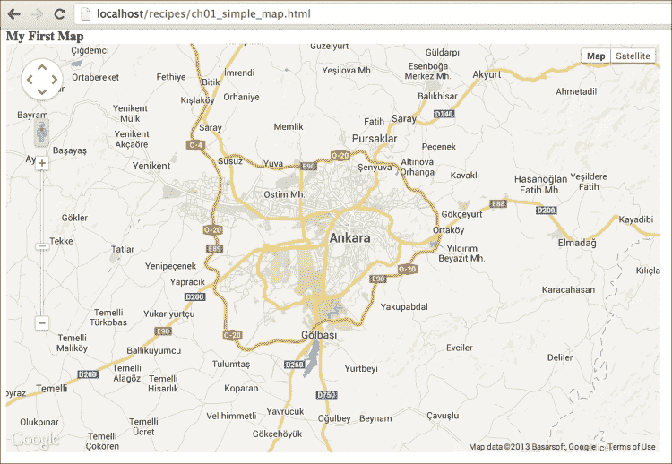
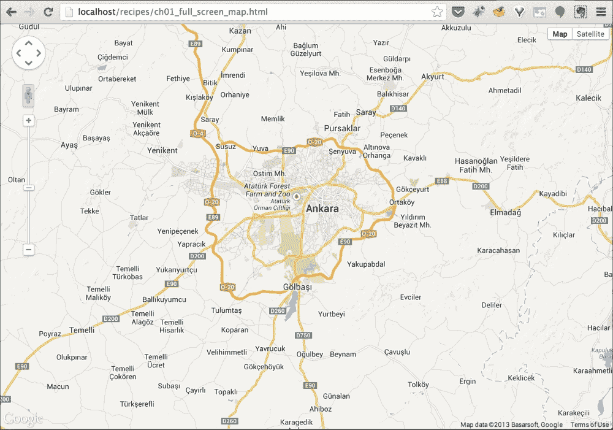
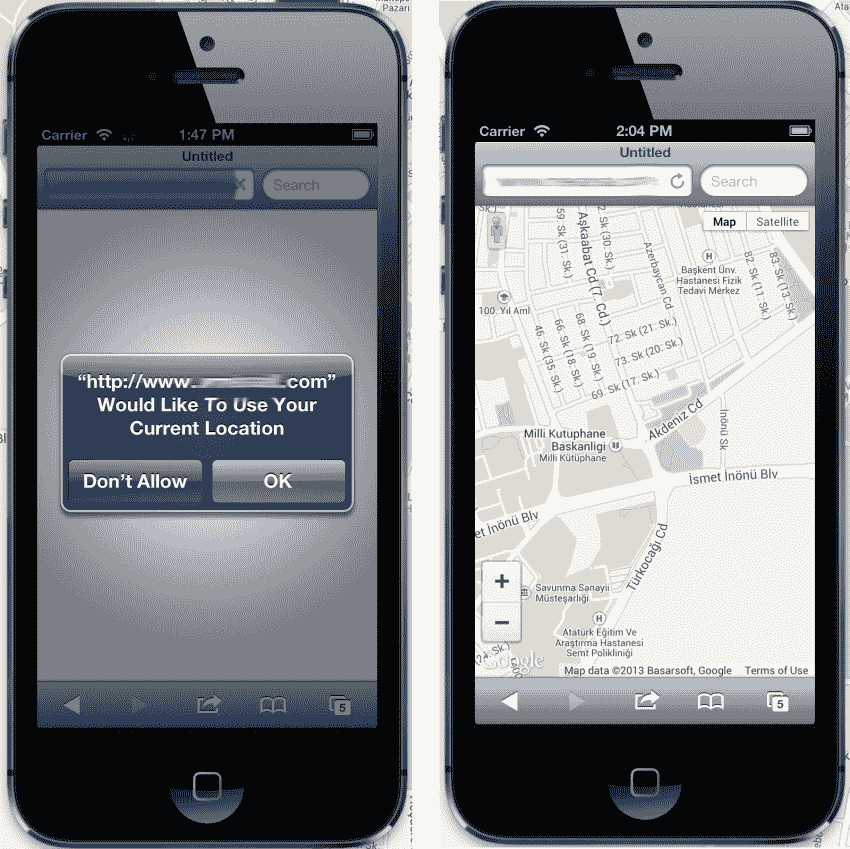
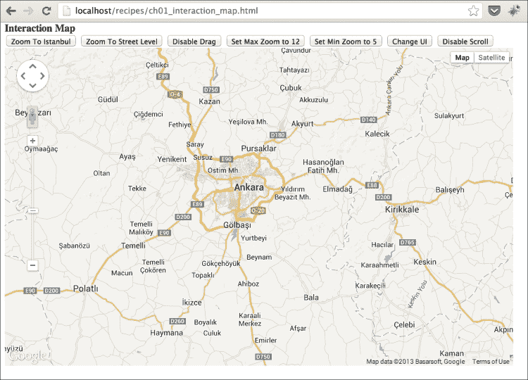
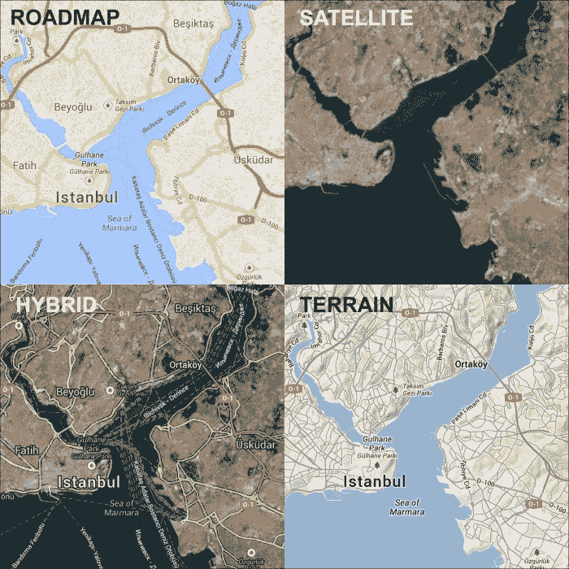
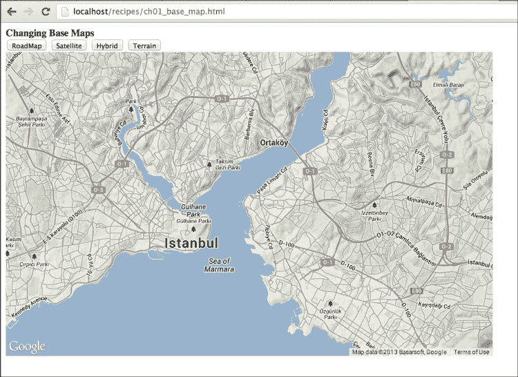

# 第一章. Google Maps JavaScript API 基础

在本章中，我们将涵盖以下主题：

+   在自定义 DIV 元素中创建简单地图

+   创建全屏简单地图

+   从 Web 移动到移动设备

+   通过编程方式更改地图属性

+   更改基础地图

# 简介

位置正变得越来越受欢迎，而 Google 是这个领域的主要变革者之一。大多数网站都有一个带有 Google Maps 的联系页面，显示企业的位置。这是 Google Maps JavaScript API 的最简单用法。还有其他更高级的用法，可以在地图上显示不同的信息。本书包含多个关于 Google Maps JavaScript API 的用法食谱，从入门到高级主题。Google Maps JavaScript API 由多个部分组成，如栅格/矢量图层、控件、事件和服务，这些内容都在以下章节中进行了介绍。

Google Maps JavaScript API 有开源和商业替代品，例如 OpenLayers、Leaflet、Bing Maps、MapQuest 和 Here Maps（以前称为诺基亚地图），但 Google Maps JavaScript API 在基础地图、卫星图像和 API 本身方面有很好的支持。例如，API 可以用来在地图上显示一个位置或政府机构的所有数据。

Google Maps JavaScript API 不是一个免费的地图展示工具，但它的免费使用限制对于大多数开发者来说已经足够了。每天每个网站有 25,000 次地图加载的限制，这发生在地图在网页上初始化时计算。

# 在自定义 DIV 元素中创建简单地图

当你使用地图应用工作时，创建地图是你能做的最重要的任务。地图是应用的主要部分，用户与之交互，所有可视化操作都发生在这里。这部分可能看起来很 trivial，但所有后续章节都依赖于这个应用的部分。

本食谱将指导你通过在网页上创建简单地图视图的过程。

### 注意

如前言所述，我们需要一个网络服务器来托管我们的 HTML、JavaScript 和 CSS 文件，以及一个网络浏览器来在客户端解释它们。

## 准备工作

如前所述，Google Maps JavaScript API 与 HTML、CSS 和 JavaScript 代码一起工作。因此，在探索本书时，拥有一个具有 HTML、JavaScript 和 CSS 处理能力的文本编辑器会是一个很好的帮手。

对于 Mac 用户，有很多商业或免费的文本编辑器，例如 TextWrangler、BBEdit、Sublime Text 或 WebStorm。它们都能很好地处理 HTML、JavaScript 和 CSS。

对于 Windows 用户来说，也有不同的文本编辑器，但 **Notepad++** 是最常用和推荐的。

选择编辑器取决于你的计算机使用习惯，因此没有确切的方法或推荐给用户选择特定类型的编辑器。每个人都有不同的感知，这些感知会影响这些选择。

你可以在 `Chapter 1/ch01_simple_map.html` 找到源代码。

### 小贴士

**下载示例代码**

您可以从您在 [`www.packtpub.com`](http://www.packtpub.com) 的账户中下载您购买的所有 Packt 书籍的示例代码文件。如果您在其他地方购买了这本书，您可以访问 [`www.packtpub.com/support`](http://www.packtpub.com/support) 并注册，以便将文件直接通过电子邮件发送给您。

## 如何操作…

这里是我们将使用 Google Maps JavaScript API 创建第一个地图的步骤。

1.  创建一个名为 `map.html` 的新空文件，并将以下代码块插入其中。此块是每个使用 Google Maps JavaScript API 的应用程序所必需的。您必须在以下代码中的 URL 中插入您的 Google Maps JavaScript API 密钥。

    ```js
    <!DOCTYPE html>
    <html>
        <head>
            <!-- Include Google Maps JS API -->
            <script type="text/javascript"
            src="img/js?key=INSERT_YOUR_MAP_API_KEY_HERE&sensor=false"></script>
    ```

    ### 小贴士

    请确保您从 Google APIs Console ([`code.google.com/apis/console`](http://code.google.com/apis/console)) 获取了您的 Google Maps JavaScript API 密钥，并将其替换为 `YOUR_API_KEY`。如果您不更改代码的这一部分，由于 Google 的 API 规则，您的地图将无法显示。同时，确保在将地图文档发布到其他位置或生产环境之前更改 API 密钥。

1.  为了将地图放置在所需的位置，以下部分是必需的。在 `<head>` 部分中，添加以下 `<style>` 元素的 HTML 样式代码，以创建宽度为 800 像素和高度为 500 像素的地图：

    ```js
    <style type="text/css">
        #mapDiv { width: 800px; height: 500px; }
    </style>
    ```

1.  将以下 JavaScript 代码行添加到代码中，以便使用 Google Maps JavaScript API 运行。不要忘记在函数外部定义 `map` 对象，以便从代码的任何部分访问它。

    ```js
      <!-- Map creation is here -->
      <script type="text/javascript">
        //Defining map as a global variable to access from //other functions
      var map;
      function initMap() {
        //Enabling new cartography and themes
        google.maps.visualRefresh = true;

        //Setting starting options of map
        var mapOptions = {
          center: new google.maps.LatLng(39.9078, 32.8252),
          zoom: 10,
          mapTypeId: google.maps.MapTypeId.ROADMAP
        };

        //Getting map DOM element
        var mapElement = document.getElementById('mapDiv');

        //Creating a map with DOM element which is just //obtained
        map = new google.maps.Map(mapElement, mapOptions);
      }
    ```

1.  添加以下行以完成代码。这部分定义了添加地图的位置和初始化地图的时间的 `<html>` 标签。

    ```js
            google.maps.event.addDomListener(window, 'load', initMap);
        </script>
      </head>
      <body>
          <b>My First Map </b>
          <div id="mapDiv"></div>
      </body>
    </html>
    ```

1.  在您最喜欢的浏览器中输入您本地服务器的 URL，其中存储着您的 `map.html` 文件，并查看结果。您将看到一个带有导航控件在左上角和基本地图控件在右上角的地图。

如前述截图所示，我们已经使用 Google Maps JavaScript API 创建了我们的简单地图。

## 工作原理…

让我们一步一步地检查代码。首先，使用代码 `<!DOCTYPE html>` 定义了 HTML5 文档。然后添加了 `<html>` 和 `<head>` 标签。

在 `<style>` 元素之前，使用 `<script>` 元素将 Google Maps JavaScript API 作为引用包含如下：

```js
<script type="text/javascript"
          src="img/js?key= INSERT_YOUR_MAP_API_KEY_HERE&sensor=false">
   </script>
```

然后在代码中添加一个新的 `<script>` 标签。在 `<head>` 部分之后，开始 `<body>` 部分。

```js
    <body>
```

以下代码行监听文档的加载。当页面完全加载时，此事件触发 `initMap` 函数。这可以防止由于 DOM 及其相关元素而出现的不可预测的行为。

```js
google.maps.event.addDomListener(window, 'load', initMap);
```

最后，我们有创建我们页面的 HTML 标签。具有 `id="mapDiv"` 的 `<div>` 元素是我们地图将显示的位置。此元素从之前定义的 CSS 标签中获取样式，宽度为 800 像素，高度为 500 像素。

### 注意

`mapDiv`元素的样式与可以在 W3Schools 网站上详细找到的 CSS 规则直接相关（[`www.w3schools.com/css`](http://www.w3schools.com/css)）。

如前所述，初始化地图的主要 JavaScript 代码将详细解释。首先，将`map`对象定义为全局对象，以便从稍后添加的每个函数中访问地图。

```js
var map;
```

然后定义`initMap`函数如下：

```js
function initMap() {

}
```

在创建地图之前，以下代码被调用以将地图的主题更改为 2013 年 5 月在 2013 年 Google IO 上宣布的最新主题。这个主题是用于新 Google Maps 的新外观；地图的制图和组件样式都是新颖且最新的；然而，使用这个新功能是可选的。如果您不使用以下代码行，您将使用旧主题。

```js
google.maps.visualRefresh = true;
```

然后，地图选项将被定义为以下内容：

```js
   var mapOptions = {
        center: new google.maps.LatLng(39.9078, 32.8252),
        zoom: 10,
        mapTypeId: google.maps.MapTypeId.ROADMAP
   };
```

地图选项有三个重要参数。

+   `center`：这是地图的纬度和经度中心。之前定义的参数是土耳其安卡拉的坐标。如果您不知道如何获取一个地方的坐标，请参考第五章中提供的菜谱，*理解 Google Maps JavaScript API 事件*。

+   `zoom`：此参数是一个整数，定义了地图显示的级别。Google Maps 的缩放级别从 0（世界级别）到 21+（街道级别）。当缩放级别增加时，用户可以看到更多细节但面积更小。

+   `mapTypeId`：此参数定义了地图上显示的基本地图类型。此参数的详细信息将在本章后面的菜谱中给出。

在创建地图对象之前，必须获取地图将显示的`div`元素。这通过以下经典 DOM 方法`getElementById`完成：

```js
    var mapElement = document.getElementById('mapDiv');
```

最后，我们已准备好创建地图对象：

```js
    map = new google.maps.Map(mapElement, mapOptions);
```

此代码获取`mapElement`和`mapOptions`对象以创建地图。第一个参数是地图将被放置的`div`元素，另一个是包含地图起始参数的`mapOptions`对象。上一行代码在给定的`div`元素上使用给定的选项创建地图，并返回地图对象以便稍后与地图交互。

### 注意

此菜谱是书中最简单的一个，但也是开始使用 Google Maps JavaScript API 最重要的一个。地图有很多参数或选项，将在后面的章节和菜谱中讨论。

还要记住，在以下菜谱中，基本代码将不会包含在书中，以便为您提供更多菜谱。以下章节和菜谱中只给出更改或必需的代码行，但您可以通过 Packt Publishing 网站（[`www.packtpub.com/support`](http://www.packtpub.com/support)）获取完整的代码，包括省略的行。

# 创建一个简单的全屏地图

应用程序可以以不同的格式进行映射。其中一些在鼠标点击或事件后显示地图，而另一些则直接以全屏模式显示。

这个配方将向您展示如何创建一个全屏地图，该地图将在 Web 或移动应用程序中使用。

## 准备工作

如前所述，一些配方将只显示代码中的更改行，以便为更多配方腾出空间。这个配方是之前配方*在自定义 DIV 元素中创建简单地图*的修改版本。

您可以在`第一章/ch01_full_screen_map.html`中找到源代码。

## 如何操作…

您可以通过遵循以下步骤轻松创建一个简单的全屏地图：

1.  让我们从创建一个名为`full_screen_map.html`的新空文件开始。然后，将之前 HTML 文件（`map.html`）中的所有代码复制并粘贴到这个文件中。

1.  在新文件中找到以下代码行：

    ```js
        <style type="text/css">
             #mapDiv { width: 800px; height: 500px; }
        </style>
    ```

1.  添加以下行并根据新值进行更改。`width`和`height`值更改为`100%`，以便在浏览器视口中使地图全屏。此外，将`body`元素的`margin`值更改为`0`以移除地图周围的全部空间。

    ```js
    <style type="text/css">
        html { height: 100% }
        body { height: 100%; margin: 0; }
        #mapDiv { width: 100%; height: 100%; }
    </style>
    ```

1.  在您最喜欢的浏览器中输入存储`full_screen_map.html`文件的本地区域 URL，查看结果。您将看到地图在左上角有导航控件，右上角有填充整个浏览器区域的基图控件。

因此，我们已经成功创建了一个简单的全屏地图。

## 它是如何工作的…

Google Maps JavaScript API 使用 HTML 标准的`div`组件来显示地图。`div`组件从 CSS 规则中获取其样式和属性，这些规则定义在顶部的`<head>`元素中。`#mapdiv`的`width`和`height`属性表明`div`组件将填充整个浏览器空间。您可以轻松修改这些`width`和`height`属性以根据您的需求更改地图尺寸。

## 更多内容...

地图的尺寸直接与 CSS 样式相关，地图尺寸与 Google Maps JavaScript API 之间没有直接关系。包含 Google Maps JavaScript API 的基本地图和覆盖层的`DIV`元素只是一个空白容器，随着`DIV`元素变大，您的地图也会变大。

## 参见

+   *在自定义 DIV 元素中创建简单地图*的配方

# 从网络设备转移到移动设备

现在，移动设备越来越受欢迎；所有流行的网站都在准备他们的移动应用或网站，以便人们可以在任何地方访问它们。自从在 HTML5 中引入了使用适当 API 访问设备位置的功能后，地图应用也变得更加流行。

在本教程中，我们将准备一个将在全屏模式下在移动浏览器中运行的映射应用程序，并且它将借助 W3C 地理位置 API 缩放到设备的地理位置。此 API 也可以从桌面浏览器访问以获取您的位置。

## 准备工作

此代码将在移动设备或模拟器上运行，因此请确保您的代码可以从您的移动设备或模拟器访问。在本教程中，我建议您将代码上传到托管服务器或网站，以便可以从您的移动设备或模拟器轻松访问。

您可以在`第一章/ch01_mobile_map.html`找到源代码。

## 如何操作…

如果您想创建一个适合移动设备的地图，应遵循以下步骤：

1.  让我们从创建一个名为`mobile_map.html`的新空文件开始。然后，将介绍在*在自定义 DIV 元素中创建简单地图*教程中的 HTML 文件（`map.html`）中的所有代码复制并粘贴到新文件中。

1.  在新文件中找到以下代码行：

    ```js
    <!-- Include Google Maps JS API -->
    <script type="text/javascript"
        src="img/js?key=INSERT_YOUR_MAP_API_KEY_HERE&sensor=false">
    </script>
    ```

1.  在之前的代码块之前插入以下行。此行告诉移动浏览器当前 Web 应用程序是为移动设备设计的：

    ```js
    <meta name="viewport" content="initial-scale=1.0, user-scalable=no" />
    ```

1.  添加以下`CSS`样式以使地图全屏显示。

    ```js
        <style type="text/css">
            html { height: 100% }
            body { height: 100%; margin: 0; }
            #mapDiv { width: 100%; height: 100%; }
        </style>
    ```

1.  然后，在创建`map`对象后添加以下代码块。此代码块将检查您的浏览器是否支持地理位置 API，并根据设备坐标设置地图中心。

    ```js
    if (navigator.geolocation) {
        navigator.geolocation.getCurrentPosition(function(position) {
            var lat = position.coords.latitude;
            var lng = position.coords.longitude;
            //Creating LatLng object with latitude and //longitude.
            var devCenter =  new google.maps.LatLng(lat, lng);
            map.setCenter(devCenter);
            map.setZoom(15);
        });
    }
    ```

1.  将您的文件上传到适当的托管站点，并在您的移动设备或模拟器上检查此 URL。您将被询问是否允许读取您的位置。如果您允许，您将看到您位置处的地图。

这就是如何实现为移动设备创建简单地图的目标。

## 它是如何工作的...

`<meta>`标签由浏览器和搜索引擎使用，对用户不可见。它们帮助浏览器了解如何表现。在我们的情况下，以下`<meta>`标签用于告诉浏览器当前网站针对移动浏览器进行了优化：

```js
<meta name="viewport" content="initial-scale=1.0, user-scalable=no" />
```

此`<meta>`标签解决了用户缩放时的缩放问题，因为缩放应该使地图放大或缩小，而不是文档本身。

为了获取设备位置，我们使用浏览器实现的 W3C 地理位置 API。HTML5 标准中有一个 navigator 命名空间，如果浏览器支持地理位置 API，则首先检查 Geolocation 子命名空间。如果`navigator.geolocation`返回一个对象，我们可以通过`getCurrentPosition`函数的帮助获取坐标。回调函数获取设备的纬度和经度并创建`google.maps.LatLng`对象。然后，使用之前创建的`devCenter`对象触发`map`对象的`setCenter`方法。这将根据设备位置更改地图的中心。

回调函数的最后一行用于设置地图的缩放级别。这可以根据您的需求进行更改。

## 还有更多...

HTML5 标准仍在进行中，W3 Geolocation API 可能会有变化。如果您想了解更多关于地理位置的信息，请参考 W3C 文档网站([`dev.w3.org/geo/api/spec-source.html`](http://dev.w3.org/geo/api/spec-source.html))。

## 参见

+   *在自定义 DIV 元素中创建简单地图* 的配方

# 通过编程更改地图属性

到目前为止，地图在其内部是交互式的。用户可以缩放地图、拖动地图、更改用户界面或启用/禁用鼠标交互。如果您想在地图之外玩地图，您应该访问地图并更改您想要的属性，或者您可以在不同情况下通过编程更改属性。通过编程更改地图属性是 Google Maps JavaScript API 的重要部分之一。在大多数地图应用中，用户搜索一个地点，应用应该聚焦在地图上的该点。这是通过 `map` 对象的函数实现的。有很多地图函数，但我们将只介绍最常用的。

在本配方中，我们将创建一个用户可以在地图外部与之交互的地图应用。使用按钮来与地图交互。

## 准备工作

在您继续之前，必须创建一个地图对象以便与之交互。如果没有定义地图对象，您将得到一个错误。这类问题通常是由于 JavaScript 的异步行为引起的。

您可以在 `Chapter 1/ch01_interaction_map.html` 中找到源代码。

## 如何操作...

如果按照给定的步骤操作，更改地图属性相当简单：

1.  让我们从创建一个名为 `interaction_map.html` 的新空文件开始。然后，将 *在自定义 DIV 元素中创建简单地图* 配方中引入的 HTML 文件（`map.html`）中的所有代码复制并粘贴到新文件中。

1.  在 `initmap()` 函数之后添加以下函数。这些函数由 HTML 中定义的按钮调用，用于与地图交互。函数将在本配方中稍后解释。

    ```js
    function zoomToIstanbul () {
        var istanbul = new google.maps.LatLng(41.0579,29.0340);
        map.setCenter(istanbul);
    }

    function zoomToStreet () {
        map.setZoom(18);
    }

    function disableDrag () {
        map.setOptions ({ draggable: false });
    }

    function setMaxZoom () {
        map.setOptions ({ maxZoom: 12 });
    }

    function setMinZoom () {
        map.setOptions ({ minZoom: 5 });
    }

    function changeUI () {
        map.setOptions ({ disableDefaultUI: true });
    }

    function disableScroll () {
        map.setOptions ({ scrollwheel: false });
    }
    ```

1.  接下来，添加以下函数以监听步骤 5 中定义的 HTML 代码中按钮的点击事件。

    ```js
    function startButtonEvents () {
        document.getElementById('btnZoomToIst' ).addEventListener('click', function(){
            zoomToIstanbul();
        });
        document.getElementById('btnZoomToStr' ).addEventListener('click', function(){
            zoomToStreet();
        });
        document.getElementById('btnDisableDrag' ).addEventListener('click', function(){
            disableDrag();
        });
        document.getElementById('btnMaxZoom' ).addEventListener('click', function(){
            setMaxZoom();
        });
        document.getElementById('btnMinZoom' ).addEventListener('click', function(){
            setMinZoom();
        });
        document.getElementById('btnChangeUI' ).addEventListener('click', function(){
            changeUI();
        });
        document.getElementById('btnDisableScroll' ).addEventListener('click', function(){
            disableScroll();
        });
    }
    ```

1.  在初始化地图时必须调用 `startButtonEvents` 函数，因此添加了以下代码行：

    ```js
    startButtonEvents();
    ```

1.  然后，在 `<body>` 标签内添加以下 HTML 代码行。这些是将在网页上显示的 `<button>` 标签。每个 `button` 元素都监听点击事件以触发相关函数。

    ```js
    <input id="btnZoomToIst" type="button" value="Zoom To Istanbul">
    <input id="btnZoomToStr" type="button" value="Zoom To Street Level">
    <input id="btnDisableDrag" type="button" value="Disable Drag">
    <input id="btnMaxZoom" type="button" value="Set Max Zoom to 12">
    <input id="btnMinZoom" type="button" value="Set Min Zoom to 5">
    <input id="btnChangeUI" type="button" value="Change UI">
    <input id="btnDisableScroll" type="button" value="Disable Scroll Zoom">
    ```

1.  在您最喜欢的浏览器中输入您本地服务器的 URL，其中存储着您的 `interaction_map.html` 文件，并查看结果。您将看到带有按钮的地图在顶部。每个按钮都会触发不同的函数以与地图交互。

作为菜谱的结果，我们可以通过编程方式更改地图属性。

## 它是如何工作的...

之前定义的每个 JavaScript 函数都用于更改地图的不同侧面。最常用的函数是更改地图的中心和缩放级别。大多数时候，人们只是在地图上从一个位置移动到另一个位置。例如，如果您正在显示咖啡连锁店的地点，地图应该聚焦在每个咖啡店的地点。以下代码创建了一个`google.maps.LatLng`对象，它将成为`setCenter()`函数的输入。`41.0579`和`29.0340`值分别是土耳其伊斯坦布尔的纬度和经度。您将用您自己的坐标值替换这些坐标值以更改地图的中心。此函数将仅更改地图的中心，而不会更改缩放级别。

```js
       var istanbul = new google.maps.LatLng(41.0579,29.0340);
       map.setCenter(istanbul);
```

如果您想放大或缩小地图以覆盖/显示一个区域，您还应该调整缩放值。例如，您的咖啡店位置在缩放级别 6 时无法为您的客户提供有效的指导。它至少应该是 15 级或更高，以便看到街道名称和确切位置。以下代码可以实现这一点：

```js
       map.setZoom(18);
```

在某些情况下，您可能不希望用户与地图进行交互，例如通过禁用鼠标拖动或滚轮滚动来固定地图位置。以下是一些`google.maps.MapOptions`对象属性的示例。这些属性与地图的属性直接相关。如果您想更改地图的一个或多个属性，您应该创建一个 JSON 对象并调用以下地图函数：

```js
        map.setOptions ({
            draggable: false,
            maxZoom: 12
        });
```

使用`setOptions()`函数，您还可以启用或禁用默认控件，但这将在第四章*使用控件*中讨论。您可以使用`setOptions()`函数设置一个或多个属性。您可以在属性旁边的注释中找到简短的解释：

```js
        map.setOptions ({
            draggable: false, //Disables the map drag
            maxZoom: 12, //Sets maximum zoom level
            minZoom: 5, //Sets minimum zoom level
            disableDefaultUI: true, //Removes the default controls
            scrollwheel: false //Disables the mouse scroll wheel
        });
```

### 小贴士

**访问地图对象**

注意将地图对象定义为全局对象以便在任何地方访问。在编写 JavaScript 时，这可能会在某些情况下引起问题。请查看以下链接以获取有关 JavaScript 和作用域的更多信息：[`coding.smashingmagazine.com/2009/08/01/what-you-need-to-know-about-javascript-scope/`](http://coding.smashingmagazine.com/2009/08/01/what-you-need-to-know-about-javascript-scope/)。

## 参见

+   *在自定义 DIV 元素中创建简单地图*的菜谱

# 更改基础地图

基础地图是映射 API 过程中的一个重要部分。基础地图显示道路、卫星图像或地形，可用于不同的情况。例如，道路图可能适合显示您的咖啡店位置，但卫星图像则不适合。卫星图像也可以用于显示地块信息，以检查它们是否绘制正确。Google Maps JavaScript API 有四种不同的基础地图，如**ROADMAP**、**SATELLITE**、**HYBRID**和**TERRAIN**。所有这些基础地图都可以在以下截图中看到，它们可以相互比较。



在这个菜谱中，我们将了解 Google Maps 基础地图，并学习如何通过编程方式更改它们。

## 准备工作

在这个菜谱中，我们将使用 JavaScript 数组来使函数的输入参数易于阅读。如果您没有相关经验，建议您在 Google 上查找 JavaScript 数组。

您可以在`Chapter 1/ch01_base_map.html`中找到源代码。

## 如何操作…

1.  如果您遵循给定的步骤，您就可以更改地图的基础地图。

1.  让我们从创建一个名为`base_map.html`的新空文件开始。然后，复制在*在自定义 DIV 元素中创建简单地图*菜谱中介绍的 HTML 文件中的所有代码，并将其粘贴到新文件中。

1.  在`initMap()`函数之后添加以下函数。它将监听在步骤 4 中添加到 HTML 代码中的按钮的点击事件。它简单地根据按钮的 ID 设置基础地图。

    ```js
    function startButtonEvents () {
        document.getElementById('btnRoad' ).addEventListener('click', function(){
            map.setMapTypeId(google.maps.MapTypeId.ROADMAP);
        });
        document.getElementById('btnSat' ).addEventListener('click', function(){
            map.setMapTypeId(google.maps.MapTypeId.SATELLITE);
        });
        document.getElementById('btnHyb' ).addEventListener('click', function(){
            map.setMapTypeId(google.maps.MapTypeId.HYBRID);
        });
        document.getElementById('btnTer' ).addEventListener('click', function(){
            map.setMapTypeId(google.maps.MapTypeId.TERRAIN);
        });
    }
    ```

1.  `startButtonEvents`函数必须在初始化地图时调用，因此添加了以下代码行在地图初始化之后。

    ```js
    startButtonEvents();
    ```

1.  然后，在地图的`div`元素之前添加以下 HTML 代码行。这些是用于更改基础地图的 HTML 按钮：

    ```js
    <input id="btnRoad" type="button" value="RoadMap">
    <input id="btnSat" type="button" value="Satellite">
    <input id="btnHyb" type="button" value="Hybrid">
    <input id="btnTer" type="button" value="Terrain">
    ```

1.  在您喜欢的浏览器中输入本地服务器的 URL，其中存储着您的`base_map.html`文件，然后查看结果。您将看到顶部带有按钮的地图。每个按钮都会根据其名称更改基础地图。

如前述截图所示，您可以轻松更改 Google 提供的基础地图。

## 工作原理...

大部分魔法都是由 API 本身完成的；您只需选择要切换到的地图类型。

这些地图类型是预定义的，但您有可能向 API 添加自己的基础地图或样式地图，并切换到它们。在第二章中介绍了添加自己的基础地图或样式地图，*添加栅格图层*。

您也可以在`mapOptions`对象中定义起始基础地图，如下所示：

```js
   var mapOptions = {
        center: new google.maps.LatLng(39.9078, 32.8252),
        zoom: 10,
        mapTypeId: google.maps.MapTypeId.TERRAIN
   };
```

在更改地图选项后，您的地图将以`TERRAIN`基础地图类型打开。

## 还有更多...

改变基础地图可能看起来是一个简单的话题，但它们背后的数学和技术并不像使用它们那样简单。在 Google Maps JavaScript API 中使用的基础地图和叠加图层是在 Web Mercator 投影系统中处理的。在这个投影系统中，角度被保留，但大型物体的尺寸和形状会发生变化。因此，看起来极地似乎比北美更大，这完全不是事实。这种投影是一种很好的方式，可以在同一张地图上展示整个世界。

请参阅后续章节以获取详细信息，或查看维基百科上的文章[`en.wikipedia.org/wiki/Mercator_projection`](https://en.wikipedia.org/wiki/Mercator_projection)。

## 参见

+   *在自定义 DIV 元素中创建简单地图* 的配方
