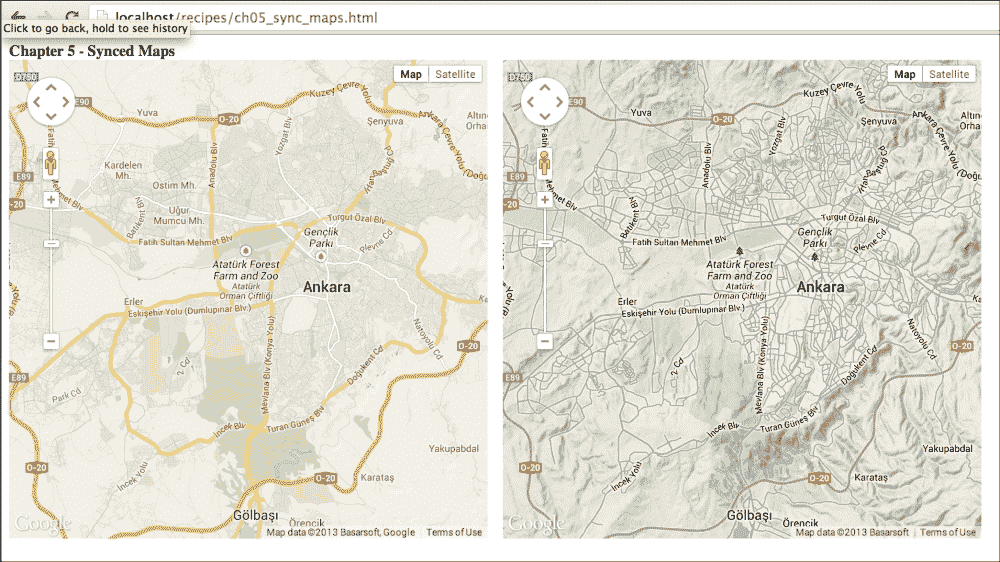
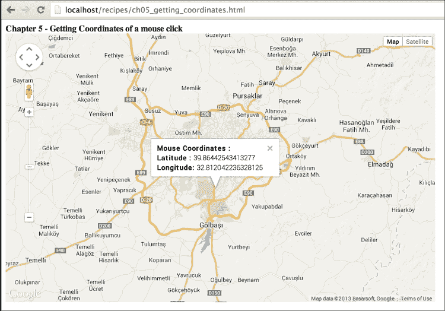
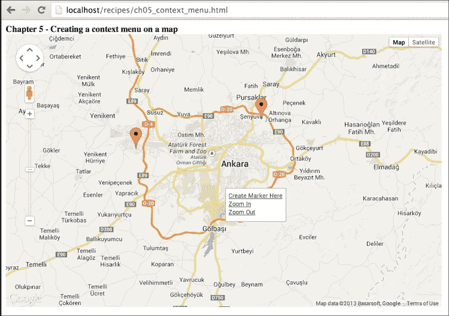
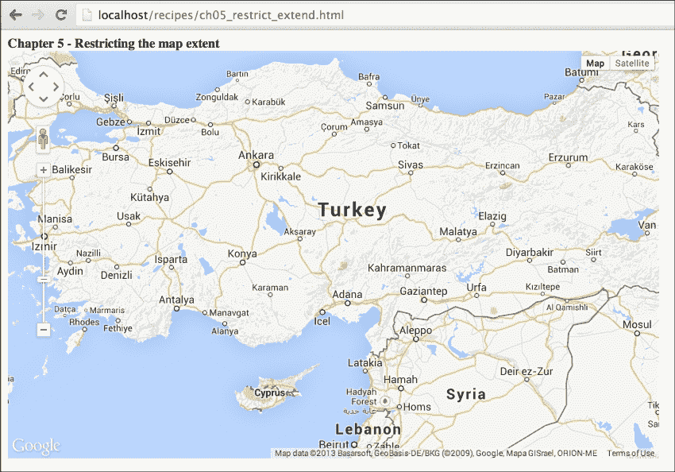
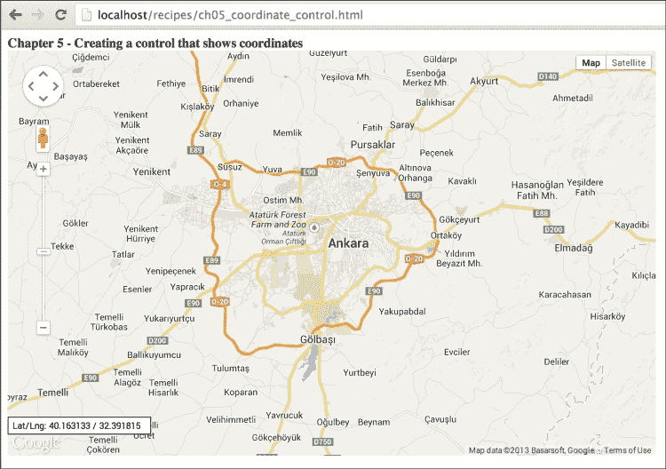
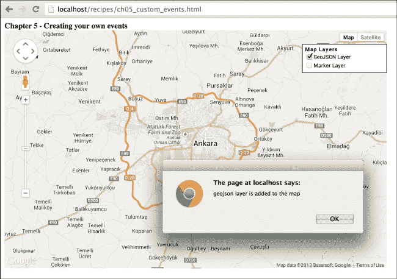

# 第五章。理解 Google Maps JavaScript API 事件

在本章中，我们将介绍：

+   创建两个并排同步的地图

+   获取鼠标点击的坐标

+   在地图上创建上下文菜单

+   限制地图范围

+   创建一个显示坐标的控制面板

+   创建您自己的事件

# 简介

如果您曾经从事 JavaScript 编程工作，您应该知道事件的重要性。事件是 JavaScript 的核心。网页交互背后都有事件。可能有用户交互或浏览器操作可以通过事件来处理。

例如，在这本书的开头每个代码中，我们都写了一些像以下这样的代码行：

```js
google.maps.event.addDomListener(window, 'load', initMap);
```

这行是一个简单的事件定义形式。这行代码告诉浏览器在所有内容加载后调用`initMap()`函数。此事件在加载所有 DOM 元素后启动映射函数是必需的。

本章介绍如何使用 Google Maps JavaScript API 中的事件以不同方式与地图交互。Google Maps JavaScript API 具有`google.maps.event`命名空间来处理事件。此命名空间具有静态方法来监听 API 中定义的事件。您应通过 Google Maps API 参考文档检查 API 中对象的受支持事件类型。

# 创建两个并排同步的地图

地图对人类很有用。借助地图，人们可以探索或比较他们周围的环境。有时他们需要并排比较两个地图以实时查看差异。例如，您可能想并排检查卫星图像和地形图，以查看山脉的位置。

本食谱向您展示如何在同一页面上添加两个地图并将它们同步，以显示相同区域，并通过 Google Maps JavaScript API 事件进行比较。

## 准备工作

您已经知道如何从前面的章节创建地图。因此，只需编写额外的代码行。

您可以在`Chapter 5/ch05_sync_maps.html`中找到源代码。

## 如何操作…

如果您想创建两个同步的地图，您应该执行以下步骤：

1.  首先，在标题中添加`div`对象的 CSS 样式以显示它们并排：

    ```js
    .mapClass { width: 500px; height: 500px; display: inline-block; }
    ```

1.  然后定义两个全局地图变量以在事件回调中访问它们：

    ```js
    var map1, map2;
    ```

1.  接下来创建初始化左侧地图的函数：

    ```js
    function initMapOne() {
      //Setting starting options of map
      var mapOptions = {
        center: new google.maps.LatLng(39.9078, 32.8252),
        zoom: 10,
        maxZoom: 15,
        mapTypeId: google.maps.MapTypeId.ROADMAP
      };

      //Getting map DOM element
      var mapElement = document.getElementById('mapDiv');

      //Creating a map with DOM element which is just obtained
      map1 = new google.maps.Map(mapElement, mapOptions);

      //Listening center_changed event of map 1 to
      //change center of map 2
      google.maps.event.addListener(map1, 'center_changed', function() { 
         map2.setCenter(map1.getCenter());
      });

      //Listening zoom_changed event of map 1 to change
      //zoom level of map 2
      google.maps.event.addListener(map1, 'zoom_changed', function() {
          map2.setZoom(map1.getZoom());
      });
    }
    ```

1.  现在，添加第二个初始化右侧地图的函数。之前创建的函数内容几乎相同，只是变量名、`div` ID、地图类型和事件处理程序中的计时器不同：

    ```js
    function initMapTwo() {
      //Setting starting options of map
      var mapOptions2 = {
        center: new google.maps.LatLng(39.9078, 32.8252),
        zoom: 10,
        maxZoom: 15,
        mapTypeId: google.maps.MapTypeId.TERRAIN
      };

      //Getting map DOM element
      var mapElement2 = document.getElementById('mapDiv2');

      //Creating a map with DOM element which is just //obtained
      map2 = new google.maps.Map(mapElement2, mapOptions2);

      //Listening center_changed event of map 2 to 
      //change center of map 1
      google.maps.event.addListener(map2, 'center_changed', function() {
          setTimeout(function() { map1.setCenter(map2.getCenter());
          }, 10);
      });

      //Listening zoom_changed event of map 2 to change
      //zoom level of map 1
      google.maps.event.addListener(map2, 'zoom_changed', function() {
          setTimeout(function() {
            map1.setZoom(map2.getZoom());
          }, 10);
      });
    }
    ```

1.  我们现在有两个地图，我们必须在开始时初始化它们，因此我们需要一个调用之前函数的单个函数：

    ```js
    //Starting two maps
    function initMaps() {
      initMapOne();
      initMapTwo();
    }
    ```

1.  当`window`元素的`load`事件上所有内容都已加载时，调用`initMaps()`函数：

    ```js
    google.maps.event.addDomListener(window, 'load', initMaps);
    ```

1.  不要忘记在 HTML 标签中添加两个`div`对象：

    ```js
    <div id="mapDiv" class="mapClass"></div>
    <div id="mapDiv2" class="mapClass"></div>
    ```

1.  前往你最喜欢的浏览器中存储你的 HTML 文件的本地区址，查看结果。你会看到两个并排的地图。当你拖动或缩放一个地图时，另一个地图也会根据变化而改变。最终的地图将看起来像以下截图：

由于这个菜谱的结果，我们可以创建两个同步显示不同地图类型相同区域的地图。

## 它是如何工作的...

这个菜谱中的重要点是保持两个地图在相同的位置和缩放级别上同步。为了实现这个目标，我们需要知道地图何时移动以及缩放级别何时发生变化。

`map` 对象有不同的触发事件。`center_changed` 和 `zoom_changed` 事件是其中两个事件。`center_changed` 事件在地图中心每次改变时都会触发。还有 `bounds_changed`、`drag`、`dragstart` 和 `dragend` 事件，这些事件也可以用来实现我们的目标，但 `center_changed` 是处理起来最简单的一个。`zoom_changed` 事件在缩放级别发生变化时触发。

要监听事件，我们需要将这些事件注册到 `google.maps.event` 命名空间中，如下所示：

```js
google.maps.event.addListener(map1, 'center_changed', function() {
  map2.setCenter(map1.getCenter());
});
```

`addListener()` 方法接收三个参数；一个要监听的对象、一个事件类型和一个事件处理器。事件处理器可以是一个之前定义过的函数或者仅在此处使用的匿名函数。在这个例子中，我们监听左地图对象——`map1`——的 `center_changed` 事件，并将右地图的中心设置为左地图的中心。缩放部分也是以同样的方式工作。当左地图的缩放级别发生变化时，`zoom_changed` 事件的处理器将右地图的缩放级别设置为左地图的缩放级别。

这对于右地图也应该是一样的，但由于无限事件循环，用于右地图的事件处理代码与左地图的代码略有不同。如果我们使用相同的事件处理代码，会在两个地图之间创建一个无限循环。这个循环会导致你的浏览器在大多数情况下崩溃。为了避免这个无限循环，我们在事件之间创建一个小的中断（10 毫秒）。这个中断将解决所有问题，用户不会注意到差异。这个中断是通过 JavaScript 的 `setTimeout()` 函数创建的。此外，还有更好的版本可以使用，这在本菜谱的 *还有更多…* 部分中解释。这个菜谱涵盖了在这些情况下使用地图事件的方法：

```js
google.maps.event.addListener(map2, 'zoom_changed', function() {
  setTimeout(function() {
    map1.setZoom(map2.getZoom());
  }, 10);
});
```

## 还有更多…

在这个菜谱中，我们的事件正在持续监听，这是预期的。但如果你需要监听一个有限时间的事件呢？有两种选择。一种选择是存储 `addListener()` 函数返回的 `google.maps.MapEventListener` 对象，并在需要时移除它，如下所示：

```js
var eventObj = google.maps.event.addListener(map1, 'center_changed',function() {
    map2.setCenter(map1.getCenter());
});
function removeListener() {
    google.maps.event.removeListener(eventObj);
}
```

另一种移除事件监听器的方法是使用`google.maps.event`命名空间中的`clearInstanceListeners()`或`clearListeners()`函数，分别用于移除给定实例的所有事件监听器或移除给定实例的指定事件监听器。以下代码示例了如何使用：

```js
var eventObj = google.maps.event.addListener(map1, 'center_changed',function() {
    map2.setCenter(map1.getCenter());
});
//This one removes all the listeners of map1 object
google.maps.event.clearInstanceListeners(map1); 
//This one removes all center_changed listeners of map1 object
google.maps.event.clearListeners(map1, 'center_changed');
```

Google Maps JavaScript API 还提供了其他方法来监听 DOM 事件，在`google.maps.event`命名空间下命名为`addDomListener()`。还有一个`addListenerOnce()`方法用于监听一次事件。

同步地图还有另一种方法。以下代码块仅同步两个地图的事件：

```js
map2.bindTo('center', map1, 'center');
map2.bindTo('zoom', map1, 'zoom');
```

## 参见

+   在第一章的*在自定义 DIV 元素中创建简单地图*食谱中，*Google Maps JavaScript API 基础知识*

# 获取鼠标点击的坐标

鼠标长期以来一直是计算机最有效的输入设备。如今，有人试图用触摸屏来改变它，但没有任何东西能比得上鼠标提供的易用性。

鼠标在地图上有不同的交互方式，如点击、双击、右键点击、移动和拖动。这些事件可以通过不同的方式处理，以与用户交互。

在这个食谱中，我们将获取地图上任何点的鼠标点击坐标。用户在鼠标点击时将看到一个信息窗口，如下面的截图所示：



这就是我们实现创建一个地图，该地图可以监听每个鼠标点击以获取坐标的方法。

## 准备工作

我们假设您已经知道如何创建一个简单的地图。我们只会介绍在鼠标点击时显示信息窗口所需的代码。

您可以在`第五章/ch05_getting_coordinates.html`中找到源代码。

## 如何做到这一点...

如果您执行以下步骤，您就可以获取地图上每个鼠标点击的坐标：

1.  首先，我们必须在 JavaScript 代码的开头添加一个`infowindow`变量，用作全局对象：

    ```js
    var infowindow = null;
    ```

1.  然后，在`map`对象初始化之后，将以下行添加到`initMap()`函数中：

    ```js
    google.maps.event.addListener(map, 'click', function(e) {
      if (infowindow != null)
        infowindow.close();

      infowindow = new google.maps.InfoWindow({
        content: '<b>Mouse Coordinates : </b><br><b>Latitude : </b>' + e.latLng.lat() + '<br><b>Longitude: </b>' + e.latLng.lng(),
        position: e.latLng
      });
      infowindow.open(map);
    });
    ```

1.  在您最喜欢的浏览器中访问本地 URL，其中存储着您的 HTML 文件，并点击地图以查看结果。每次鼠标点击都会打开一个包含坐标信息的信息窗口。

## 它是如何工作的...

在初始化地图后，我们创建一个事件监听器来处理地图上的鼠标点击事件：

```js
google.maps.event.addListener(map, 'click', function(e) {

});
```

`click`事件类型与其他事件有不同的处理程序。处理程序有一个输入参数，是一个从`google.maps.MouseEvent`类派生的对象。该对象有一个名为`LatLng`的属性，它是`google.maps.latLng`类的实例。该属性给出了鼠标点击的坐标。

我们希望在每次鼠标点击时显示一个信息窗口，并且只想看到一个信息窗口。为了实现这一点，我们在 JavaScript 代码的开头创建一个全局变量`infowindow`，并检查它是否仍然被定义。如果之前点击有一个`infowindow`对象，那么我们将按照以下方式关闭它：

```js
if (infowindow != null)
  infowindow.close();
```

在每次鼠标点击时，我们将从`e.latLng`对象创建一个新的`infowindow`对象，包含新的内容、坐标和位置。创建`infowindow`后，我们只需在之前定义的地图上打开它：

```js
infowindow = new google.maps.InfoWindow({
  content: '<b>Mouse Coordinates : </b><br><b>Latitude : </b>' + e.latLng.lat() + '<br><b>Longitude: </b>' + e.latLng.lng(),
  position: e.latLng
});
infowindow.open(map);
```

## 更多内容…

如前所述，某些事件类型有不同的事件处理程序，可以获取一个参数。这个参数是从`google.maps.MouseEvent`类派生出的一个对象。`google.maps.Map`类有以下事件，它们将`MouseEvent`对象返回给处理程序：`click`、`dblclick`、`mousemove`、`mouseout`、`mouseover`和`rightclick`。

## 参见

+   第一章中“在自定义 DIV 元素中创建简单地图”的配方，*Google Maps JavaScript API 基础知识*

# 在地图上创建上下文菜单

在用户界面中使用菜单是与用户沟通的一种方式。用户选择菜单项以与 Web 应用程序交互。某些菜单类型可以从可见位置访问，但某些菜单类型需要一些额外操作才能访问，例如**上下文菜单**。上下文菜单通常在鼠标右键单击的应用程序中显示。

在这个配方中，我们将在地图上创建一个上下文菜单，当我们右键单击地图时，该菜单将打开。此菜单包括放大、缩小和添加标记功能。您还将获得右键单击的位置，以便在例如添加标记的某些地理方法中使用它。

## 准备工作

这个配方与其他配方类似，我们假设您已经知道如何创建一个简单的地图。因此，我们只会显示添加上下文菜单的额外代码行。

您可以在`Chapter 5/ch05_context_menu.html`中找到源代码。

## 如何操作…

以下是我们需要创建一个带有上下文菜单以显示额外命令的地图的步骤：

1.  让我们从向 HTML 的标题中添加上下文菜单的 CSS 样式开始：

    ```js
    .contextmenu{
      visibility: hidden;
      background: #ffffff;
      border: 1px solid #8888FF;
      z-index: 10;
      position: relative;
      width: 100px;
      height: 50px;
      padding: 5px;
    }
    ```

1.  下一步是定义上下文菜单和坐标的全局变量：

    ```js
    var contextMenu, lastCoordinate;
    ```

1.  然后，我们将添加定义上下文菜单类的行。详细信息将在稍后解释：

    ```js
    //Defining the context menu class.
    function ContextMenuClass(map) {
      this.setMap(map);
      this.map = map;
      this.mapDiv = map.getDiv();
      this.menuDiv = null;
    };

    ContextMenuClass.prototype = new google.maps.OverlayView();
    ContextMenuClass.prototype.draw = function() {};
    ContextMenuClass.prototype.onAdd = function() {
      var that = this;
      this.menuDiv = document.createElement('div');
      this.menuDiv.className = 'contextmenu';
      this.menuDiv.innerHTML = '<a href="javascript:createMarker()">Create Marker Here</a><br><a href="javascript:zoomIn()">Zoom In</a><br><a href="javascript:zoomOut()">Zoom Out</a><br>';
      this.getPanes().floatPane.appendChild(this.menuDiv);

      //This event listener below will close the context menu //on map click
      google.maps.event.addListener(this.map, 'click', function(mouseEvent) {
          that.hide();
      });
    };

    ContextMenuClass.prototype.onRemove = function() {
      this.menuDiv.parentNode.removeChild(this.menuDiv);
    };

    ContextMenuClass.prototype.show = function(coord) {
      var proj = this.getProjection();
      var mouseCoords = proj.fromLatLngToDivPixel(coord);
      var left = Math.floor(mouseCoords.x);
      var top =  Math.floor(mouseCoords.y);
      this.menuDiv.style.display = 'block';
      this.menuDiv.style.left = left + 'px';
      this.menuDiv.style.top = top + 'px';
      this.menuDiv.style.visibility = 'visible';
    };

    ContextMenuClass.prototype.hide = function(x,y) {
      this.menuDiv.style.visibility= 'hidden';
    }
    ```

1.  现在，添加上下文菜单中要使用的函数：

    ```js
    //Defining context menu functions
    function zoomIn() {
      map.setZoom(map.getZoom() + 1);
    }

    function zoomOut() {
      map.setZoom(map.getZoom() - 1);
    }

    function createMarker() {
      var marker = new google.maps.Marker({
        position: lastCoordinate,
        map: map,
        title: 'Random Marker'
      });
    }
    ```

1.  在初始化`map`对象后添加以下代码块。此块将从`ContextMenuClass`类创建一个对象，并在`map`对象中监听右键单击以显示创建的`contextMenu`对象：

    ```js
    //Creating a context menu to use it in event handler
    contextMenu = new ContextMenuClass(map);

    //Listening the map object for mouse right click.
    google.maps.event.addListener(map, 'rightclick', function(e) {
        lastCoordinate = e.latLng;
        contextMenu.show(e.latLng);
    });
    ```

1.  前往您在最喜欢的浏览器中存储 HTML 的本地 URL，并右键单击以查看上下文菜单。

如前述截图所示，我们已创建带有上下文菜单的简单地图。

## 它是如何工作的…

JavaScript 是一种基于原型的脚本语言，它以不同于经典服务器端编程语言的方式支持面向对象编程。没有经典的类定义，但你可以使用原型来创建类或继承其他类。这本书不是一本 JavaScript 书。如果你对 JavaScript 的这些概念有任何疑问，你应该通过 google 搜索来学习详细信息。

Google Maps JavaScript API 有一个 `google.maps.OverlayView` 类，用于在地图上创建你自己的自定义类型的覆盖对象。我们将继承这个类来创建我们自己的上下文菜单类。首先，我们将定义 `ContextMenu` 类及其构造函数如下：

```js
function ContextMenuClass (map) {
  this.setMap(map);
  this.map = map;
  this.mapDiv = map.getDiv();
  this.menuDiv = null;
};
```

然后，我们将 `ContextMenu` 类的原型设置为从 `google.maps.OverlayView` 类创建的对象：

```js
ContextMenuClass.prototype = new google.maps.OverlayView();
```

`google.maps.OverlayView` 类在我们新创建的类中需要实现三个方法：`onAdd()`、`draw()` 和 `onRemove()`。除此之外，我们添加了两个方法来显示或隐藏上下文菜单。每个方法的任务如下所述：

+   `onAdd()`：在这个方法中完成 DOM 对象的创建并将它们作为 panes 的子元素添加。我们将创建一个具有在 HTML 顶部定义的 CSS 类的 `div` 对象。菜单项也通过 `innerHTML` 属性添加到这个 `div` 对象中。我们还将创建一个地图点击的事件监听器，以从其他操作中移除上下文菜单：

    ```js
    ContextMenuClass.prototype.onAdd = function () {
      var that = this;
      this.menuDiv = document.createElement('div');
      this.menuDiv.className = 'contextmenu';
      this.menuDiv.innerHTML = '<a href="javascript:createMarker()">Create Marker Here</a><br><a href="javascript:zoomIn()">Zoom In</a><br><a href="javascript:zoomOut()">Zoom Out</a><br>';
      this.getPanes().floatPane.appendChild(this.menuDiv);

      //This event listener below will close the context menu // on map click
      google.maps.event.addListener(this.map, 'click', function(mouseEvent){
          that.hide();
      });
    };
    ```

+   `draw()`：通过这个方法完成创建的元素的位置设置，但我们跳过填充这个方法的步骤。我们创建 `show()` 和 `hide()` 方法，而不是每次添加或移除上下文菜单：

    ```js
    ContextMenuClass.prototype.draw = function() {};
    ```

+   `onRemove()`：在这个方法中完成创建的元素的移除：

    ```js
    ContextMenuClass.prototype.onRemove = function() {
      this.menuDiv.parentNode.removeChild(this.menuDiv);
    };
    ```

+   `show(coord)`：在这个方法中完成在鼠标右键点击时显示上下文菜单。输入参数是一个 `latLng` 对象，因此我们必须将其转换为 `div` 元素中的像素坐标。为了实现这一点，我们需要从 `google.maps.MapCanvasProjection` 类创建额外的对象。这个类有一个名为 `fromLatLngToDivPixel` 的方法，可以将 `latLng` 对象转换为简单的 `google.maps.Point` 对象。这个对象用于设置从地图左上角开始的上下文菜单的 `x` 和 `y` 坐标。我们还将 `div` 的可见性样式更改为在地图上显示：

    ```js
    ContextMenuClass.prototype.show = function(coord) {
      var proj = this.getProjection();
      var mouseCoords = proj.fromLatLngToDivPixel(coord);
      var left = Math.floor(mouseCoords.x);
      var top =  Math.floor(mouseCoords.y);
      this.menuDiv.style.display = 'block';
      this.menuDiv.style.left = left + 'px';
      this.menuDiv.style.top = top + 'px';
      this.menuDiv.style.visibility = 'visible';
    };
    ```

+   `hide()`：在这个方法中完成上下文菜单的隐藏。我们只需将上下文菜单 `div` 的可见性属性更改为 `hidden` 以隐藏它：

    ```js
    ContextMenuClass.prototype.hide = function(x,y) {
      this.menuDiv.style.visibility = 'hidden';
    }
    ```

`ContextMenuClass` 类已经定义，但还没有从这个类创建任何对象。我们根据新类创建了一个 `contextMenu` 对象，如下所示：

```js
contextMenu = new ContextMenuClass(map);
```

为了使用这个 `contextMenu` 对象，我们应该监听 `map` 对象的 `rightclick` 事件并在其处理程序中显示上下文菜单。我们还将更新全局变量 `lastCoordinate` 以保持最后一次右键点击的坐标，以便在 `createMarker()` 函数中使用：

```js
google.maps.event.addListener(map, 'rightclick', function(e) {
  lastCoordinate = e.latLng;
  contextMenu.show(e.latLng);
});
```

上下文菜单功能在之前的章节中已有介绍，因此这里不再解释。你还可以借助`google.maps.OverlayView`类创建其他类型的覆盖层，就像本食谱中这样。

### 注意

**更多关于 JavaScript 基于原型的继承**

如果你对 JavaScript 基于原型的继承细节感兴趣，请从以下页面获取更多详细信息：[`javascript.crockford.com/prototypal.html`](http://javascript.crockford.com/prototypal.html)。

本文由*道格拉斯·克罗克福德*撰写，他是 JavaScript 的大师和 JSON 格式的创始人。我建议你阅读他的流行 JavaScript 书籍 *JavaScript: The Good Parts*，以深入了解 JavaScript。

## 参见

+   第一章 *Google Maps JavaScript API 基础知识* 的 *在自定义 DIV 元素中创建简单地图* 食谱

+   第一章 *Google Maps JavaScript API 基础知识* 的 *通过编程更改地图属性* 食谱

+   第三章 *添加矢量图层* 的 *向地图添加标记* 食谱

# 限制地图范围

Google Maps 拥有全球范围，几乎显示了地球上每一条街道。你可以使用 Google Maps JavaScript API 覆盖整个地球，但有时你需要在地图应用程序中仅显示相关区域。你可以放大到固定位置，但这并不能阻止用户移动到应用程序范围之外的其他地方。

在本食谱中，我们将监听地图事件以检查我们是否在允许的范围内。如果我们不在允许的范围内，那么我们将地图移动到该范围内的允许中心。本食谱中我们使用了土耳其的地理范围。

## 准备工作

本食谱仍在使用第一章中定义的相同地图创建过程，*Google Maps JavaScript API 基础知识*，但有一些额外的代码块用于监听地图事件和检查受限范围。

你可以在`Chapter 5/ch05_restrict_extent.html`找到源代码。

## 如何操作…

如果你执行以下步骤，限制地图范围相当简单：

1.  首先，我们必须在定义`map`变量后将`allowedMapBounds`和`allowedZoomLevel`变量作为全局变量添加。这是土耳其的地理边界：

    ```js
    var allowedMapBounds = new google.maps.LatLngBounds(
      new google.maps.LatLng(35.817813, 26.147461),
      new google.maps.LatLng(42.049293, 44.274902)
    );
    var allowedZoomLevel = 6;
    ```

1.  下一步是在初始化地图后监听地图的`drag`和`zoom_changed`事件：

    ```js
    google.maps.event.addListener(map, 'drag', checkBounds);
    google.maps.event.addListener(map, 'zoom_changed', checkBounds);
    ```

1.  然后，我们创建一个`checkBounds()`函数来处理事件触发时的情况。函数的第一部分是检查缩放级别。我们选择`6`以最小化本食谱中地图的缩放级别：

    ```js
    function checkBounds() {
      if (map.getZoom() < allowedZoomLevel) 
        map.setZoom(allowedZoomLevel);
    }
    ```

1.  以下代码行将添加到`checkBounds()`函数中，以获取允许的范围、最近的范围和地图的最近中心：

    ```js
    if (allowedMapBounds) {
      var allowedNELng = allowedMapBounds.getNorthEast().lng();
      var allowedNELat = allowedMapBounds.getNorthEast().lat();
      var allowedSWLng = allowedMapBounds.getSouthWest().lng();
      var allowedSWLat = allowedMapBounds.getSouthWest().lat();

      var recentBounds = map.getBounds();
      var recentNELng = recentBounds.getNorthEast().lng();
      var recentNELat = recentBounds.getNorthEast().lat();
      var recentSWLng = recentBounds.getSouthWest().lng();
      var recentSWLat = recentBounds.getSouthWest().lat();

      var recentCenter = map.getCenter();
      var centerX = recentCenter.lng();
      var centerY = recentCenter.lat();

      var nCenterX = centerX;
      var nCenterY = centerY;
    }
    ```

1.  `checkBounds()` 函数的重要部分是允许边界与最近边界的比较。如果 `centerX` 和 `centerY` 与 `nCenterX` 和 `nCenterY` 变量之间存在差异，则我们将地图移动到允许边界内的中心位置：

    ```js
    if (recentNELng > allowedNELng) centerX = centerX- (recentNELng - allowedNELng);
    if (recentNELat > allowedNELat) centerY = centerY- (recentNELat - allowedNELat);
    if (recentSWLng < allowedSWLng) centerX = centerX+ (allowedSWLng - recentSWLng);
    if (recentSWLat < allowedSWLat) centerY = centerY+ (allowedSWLat - recentSWLat);

    if (nCenterX != centerX || nCenterY != centerY) {
      map.panTo(new google.maps.LatLng(centerY,centerX));
    }
    else {
      return;
    }
    ```

1.  前往您在最喜欢的浏览器中存储 HTML 的本地 URL，并尝试移动土耳其附近的其他国家地图。您会看到地图会回到顶部定义的边界内允许的先前位置。

如前述截图所示，您可以通过 Google Maps JavaScript API 提供的事件轻松限制地图范围。

## 它是如何工作的...

如前述事件配方所述，Google Maps JavaScript API 为开发者提供了许多与地图活动相关的事件。我们在这个配方中使用 `drag` 和 `zoom_changed` 事件来监听。这次，我们并没有创建匿名事件处理器，因为我们为两个事件监听器使用相同的事件处理器，名为 `checkBounds()`：

```js
google.maps.event.addListener(map, 'drag', checkBounds);
google.maps.event.addListener(map, 'zoom_changed', checkBounds);
```

Google Maps JavaScript API 有 `google.maps.LatLngBounds` 类用于定义地理边界。该类的构造函数接收两个参数，这两个参数是由 `google.maps.LatLng` 类创建的对象。参数分别是西南角和东北角的地理坐标。这为我们应用程序创建了一个地理边界。西南角具有最低的纬度和经度，而东北角则具有最高的纬度和经度：

```js
var allowedMapBounds = new google.maps.LatLngBounds(
  new google.maps.LatLng(35.817813, 26.147461),
  new google.maps.LatLng(42.049293, 44.274902)
);
```

这个配方中的主要技巧在于 `checkBounds()` 函数。首先，我们获取允许边界和最近边界的最小和最大纬度和经度。`NE` 标签是纬度和经度的最大值，而 `SW` 标签是纬度和经度的最小值：

```js
var allowedNELng = allowedMapBounds.getNorthEast().lng();
var allowedNELat = allowedMapBounds.getNorthEast().lat();
var allowedSWLng = allowedMapBounds.getSouthWest().lng();
var allowedSWLat = allowedMapBounds.getSouthWest().lat();

var recentBounds = map.getBounds();
var recentNELng = recentBounds.getNorthEast().lng();
var recentNELat = recentBounds.getNorthEast().lat();
var recentSWLng = recentBounds.getSouthWest().lng();
var recentSWLat = recentBounds.getSouthWest().lat();
```

地图的中心用于检查差异并根据此值定位地图。`nCenterX` 和 `nCenterY` 值用于检查 `centerX` 和 `centerY` 值是否有变化。`if` 语句检查最近值和允许值。如果地图超出允许的范围，它将改变 `centerX` 或 `centerY` 值：

```js
var recentCenter = map.getCenter();
var centerX = recentCenter.lng();
var centerY = recentCenter.lat();

var nCenterX = centerX;
var nCenterY = centerY;

if (recentNELng > allowedNELng) centerX = centerX - (recentNELng - allowedNELng);
if (recentNELat > allowedNELat) centerY = centerY - (recentNELat - allowedNELat);
if (recentSWLng < allowedSWLng) centerX = centerX + (allowedSWLng - recentSWLng);
if (recentSWLat < allowedSWLat) centerY = centerY + (allowedSWLat - recentSWLat);
```

如果 `centerX` 或 `centerY` 值发生变化，则我们必须使用 `panTo()` 方法将地图保持在边界内；否则，使用 `return` 不做任何操作：

```js
if (nCenterX != centerX || nCenterY != centerY) {
  map.panTo(new google.maps.LatLng(centerY,centerX));
}
else {
  return;
}
```

检查允许范围可能有不同的方法，例如只检查地图的中心，但这种方法不会限制你想要的精确范围。

## 参见

+   第一章中 *“在自定义 DIV 元素中创建简单地图”* 的配方，*Google Maps JavaScript API 基础*

+   第一章中 *“通过编程更改地图属性”* 的配方，*Google Maps JavaScript API 基础*

# 创建显示坐标的控制

地理坐标对于显示你在地球上的位置非常重要。纬度和经度结合在一起形成一个二维网格，模拟地球表面。当你移动鼠标时，在地图上的控件中显示纬度和经度可以是一个很好的控件和事件结合的用法。

在第四章，*使用控件*中，我们看到了如*将自定义标志作为控件添加*的配方，并且我们也在本章中看到了如何使用地图事件。在这个配方中，我们将利用地图的`mousemove`事件创建一个显示实时坐标的控件。

## 准备工作

在这个配方中，我们将使用第一章，*Google Maps JavaScript API 基础知识*中定义的第一个配方作为模板，以跳过地图创建。

您可以在`第五章/ch05_coordinate_control.html`中找到源代码。

## 如何做到这一点...

您可以通过以下步骤轻松创建一个简单的控件，在鼠标移动时显示坐标：

1.  首先，我们将在 head 部分的样式部分添加一个 CSS 类，这将装饰坐标控件：

    ```js
    .mapControl { 
      width: 165px; 
      height: 16px; 
      background-color: #FFFFFF; 
      border-style: solid; 
      border-width: 1px; 
      padding: 2px 5px; 
    }
    ```

1.  在初始化地图后，我们将定义控件参数：

    ```js
    //Defining control parameters
    var controlDiv = document.createElement('div');
    controlDiv.className = 'mapControl';
    controlDiv.id = 'mapCoordinates';
    controlDiv.innerHTML = 'Lat/Lng: 0.00 / 0.00';
    ```

1.  然后，使用以下行向地图添加控件：

    ```js
    //Creating a control and adding it to the map.
    map.controls[google.maps.ControlPosition.LEFT_BOTTOM].push(controlDiv);
    ```

1.  现在，我们向地图添加一个事件监听器来处理`mousemove`事件并在每次`mousemove`事件中更新坐标：

    ```js
    //Listening the map for mousemove event to show it in control.
    google.maps.event.addListener(map, 'mousemove', function(e) {
      var coordinateText = 'Lat/Lng: ' + e.latLng.lat().toFixed(6) + ' / ' + e.latLng.lng().toFixed(6);
      controlDiv.innerHTML = coordinateText;
    });
    ```

1.  前往您在最喜欢的浏览器中存储 HTML 的本地 URL，并尝试移动鼠标。您将看到坐标控件在地图的左下角发生变化。

我们已经成功创建了一个简单的控件，可以在鼠标移动时显示坐标。

## 它是如何工作的...

这个配方是两个章节的结合：第四章，*使用控件*，以及本章。更多关于控件的信息可以从第四章，*使用控件*中获得。

如前所述，Google Maps JavaScript API 为我们提供了不同的事件来监听，用于不同的目的。在这个配方中，我们将使用地图的`mousemove`事件来获取鼠标的坐标。`mousemove`事件处理程序有一个输入参数来获取坐标。我们将使用`lat()`和`lng()`函数分别从`e.latLng`对象中获取纬度和经度。然后，我们将使用 Math 函数`toFixed()`将它们的十进制数固定为`6`位，以便在坐标控件中有一个有序的视图：

```js
//Listening the map for mousemove event to show it in control.
google.maps.event.addListener(map, 'mousemove', function(e) {
  var coordinateText = 'Lat/Lng: ' + e.latLng.lat().toFixed(6) + ' / ' + e.latLng.lng().toFixed(6);
  controlDiv.innerHTML = coordinateText;
});
```

代码的剩余部分与简单地图创建和创建自定义控件有关，但这不是本章的范围。

## 参考信息

+   在自定义 DIV 元素中创建简单地图的配方，*Google Maps JavaScript API 基础知识*中的*创建简单地图*配方

+   第四章，“使用控件”中的*添加您的自定义徽标作为控件*菜谱

# 创建您自己的事件

事件对于 JavaScript 编程非常重要，所有的 JavaScript 框架和 API 都为开发者提供了访问与其类相关的预定义事件类型的权限。Google Maps JavaScript API 也在做同样的事情，它为我们提供了最常用的与类相关的事件类型。但如果你需要一个自定义事件类型呢？

Google Maps JavaScript API 有一个名为 `google.maps.MVCObject` 的基类，这是大多数类继承的顶级类。该类已准备好在 `google.maps.event` 命名空间中用于自定义事件。

在这个菜谱中，我们将使用 `google.maps.MVCObject` 类创建一个自定义对象，并将其绑定到自定义事件以创建您自己的事件。自定义事件的用法可能不是一个真实世界的案例，但它会给你一个关于监听和触发您自己的事件的思路。

## 准备工作

这个菜谱仍然使用在第一章，“Google Maps JavaScript API 基础知识”中定义的相同的地图创建过程，但有一些额外的代码块用于创建目录（ToC）控件和自定义事件。

你可以在 `Chapter 5/ch05_custom_events.html` 找到源代码。

## 如何操作…

如果你执行以下步骤，你可以添加和创建你自己的事件类型：

1.  首先，我们添加我们自定义控件的 CSS 类：

    ```js
    .mapControl { 
      width: 165px; 
      height: 55px; 
      background-color: #FFFFFF; 
      border-style: solid; 
      border-width: 1px; 
      padding: 2px 5px; 
    }
    ```

1.  现在，我们在 `map` 变量之后创建一个 `customObject` 变量作为全局变量：

    ```js
    var customObject;
    ```

1.  然后，我们创建 `createTOCControl()` 来创建我们的目录控件，如下所示：

    ```js
    function createTOCControl () {
      var controlDiv = document.createElement('div');
      controlDiv.className = 'mapControl';
      controlDiv.id = 'layerTable';
      map.controls[google.maps.ControlPosition.RIGHT_TOP].push(controlDiv);
      var html = '<b>Map Layers</b><br/>';
      html = html + '<input type="checkbox" onclick="checkLayers(this)" value="geojson">GeoJSON Layer<br/>';
      html = html + '<input type="checkbox" onclick="checkLayers(this)" value="marker">MarkerLayer';
      controlDiv.innerHTML = html;
    }
    ```

1.  下一步是添加另一个名为 `checkLayers()` 的函数，该函数是从复选框的 `onclick` 事件中调用的函数：

    ```js
    function checkLayers(cb) {
      //Firing customEvent with trigger function.
      google.maps.event.trigger(customObject, 'customEvent', {layerName: cb.value, isChecked: cb.checked});
    }
    ```

1.  所有函数都准备好添加到 `initMap()` 函数中。在初始化地图后添加以下行：

    ```js
    //Creating Table of Contents Control.
    createTOCControl();

    //Creating custom object from Google Maps JS Base Class
    customObject = new google.maps.MVCObject();

    //Start listening custom object's custom event
    google.maps.event.addListener(customObject, 'customEvent', function (e) {
        var txt = '';
        if(e.isChecked) {
          txt = e.layerName + ' layer is added to the map';
        }
        else {
          txt = e.layerName + ' layer is removed from the map';
        }
        alert(txt);
    });
    ```

1.  前往您在最喜欢的浏览器中存储 HTML 的本地 URL，查看地图。当你点击内容表中的任何一个复选框时，你会看到一个包含图层名称及其状态的警告框，显示该图层是否已被添加或删除。

这是菜谱的结果，展示了触发和监听您自己定义的自定义事件。

## 它是如何工作的…

JavaScript 有一个继承，这是面向对象编程的核心概念之一。这使得你的生活更轻松，以便不必一次又一次地编写相同的方法。

Google Maps JavaScript API 既用于自身也用于 API 开发者，它使用了 JavaScript 的继承。有一些核心类是其他类的基类。Google Maps JavaScript API 有一个名为 `google.maps.MVCObject` 的基类，所有其他类都是从它产生的。

如果您想创建一个像之前食谱中那样的自定义类，您应该从`google.maps.MVCObject`类创建一个类。在本食谱中，我们只是从`MVCObject`类创建一个对象，而不是创建一个新的类。然后，我们将像监听其他事件一样监听这个创建的对象的`customEvent`：

```js
//Creating custom object from Google Maps JS Base Class
customObject = new google.maps.MVCObject();

//Start listening custom object's custom event
google.maps.event.addListener(customObject, 'customEvent', function (e) {
    var txt = '';
    if(e.isChecked) {
      txt = e.layerName + ' layer is added to the map';
    }
    else {
      txt = e.layerName + ' layer is removed from the map';
    }
    alert(txt);
});
```

触发自定义事件比监听它要容易得多。我们使用`google.maps.event.trigger()`函数来触发事件，并附带额外的参数。参数应以 JSON 对象格式发送到事件处理器：

```js
//Firing customEvent with trigger function.
google.maps.event.trigger(customObject, 'customEvent', {layerName: cb.value, isChecked: cb.checked});
```

在本食谱中创建自定义事件不能直接用于实际案例，但这应该能给你一个关于如何使用它们的想法。为了高效使用内存，事件应该谨慎使用。

## 参见

+   第一章的*在自定义 DIV 元素中创建简单地图*食谱，*Google Maps JavaScript API 基础知识*

+   第四章的*将您的自有标志作为控件添加*食谱，*使用控件*
