# 第六章. Google Maps JavaScript 库

在本章中，我们将涵盖：

+   在地图上绘制形状

+   计算多边形和多边形的长度/面积

+   编码坐标

+   搜索并显示附近的地点

+   使用自动完成选项查找地点

+   向地图添加拖动缩放

+   创建自定义弹出窗口/信息框

# 简介

本章深入探讨了 Google Maps JavaScript API 的一部分附加 JavaScript 库。当你引用 Google Maps API 时，这些库默认不会添加到你的应用程序中；然而，这些库可以手动添加。

这些库被分为以下六个类别：

+   `drawing`

+   `geometry`

+   `places`

+   `panoramio`

+   `visualization`

+   `weather`

在前面列表中的最后三个库——`panoramio`、`visualization`和`weather`——在第二章中已经详细讨论过，*添加栅格图层*，涉及它们的相关主题和用法。在本章中，我们将详细了解`Drawing`和`Geometry`库。我们还将使用两个外部库。

这些库的目的是作为核心 API 的扩展，确保 Google Maps JavaScript API 能够自给自足，以提供它所提供的所有任务。这意味着，没有这些额外库，你也可以使用 API 进行开发而不会遇到任何问题。

此外，这些库在某种程度上是自主的。它们有非常明确和精心设计的目标和边界，因此添加它们将提供额外的功能，但移除它们不会从核心 API 中移除任何功能。

这额外的库的可选性确实解释了 API 加载速度的加快。除非你明确请求这些库，否则它们不会被加载。这种组件化结构让你可以选择是否包含加载这些库的成本。

本章将首先处理`drawing`库，这将使你能够在基础地图上绘制矢量覆盖。然后，它将处理`geometry`库，获取矢量覆盖的属性，如长度和面积。最后，`places`库将详细解释如何在 Google Maps JavaScript API 中搜索地点并显示这些地点的详细信息。

# 在地图上绘制形状

你可能已经探索了*第三章，添加矢量图层*中的矢量覆盖。不深入细节，你可以使用 Google Maps JavaScript API 编程添加标记、线和多边形。但如果你想要绘制这些矢量覆盖——不是通过编程，而是通过鼠标点击或触摸手势，就像在 AutoCAD 或 ArcGIS for Desktop 中一样——你会怎么做？

`drawing`库处理这项工作，使你能够根据你的偏好绘制矢量形状，并在基础地图上显示它们。

在本配方中，我们将详细介绍如何绘制形状、处理它们广泛的选项以及如何处理它们特定的事件。

## 准备工作

第一章 第一部分的配方 *Google Maps JavaScript API 基础* 将完成我们的工作。我们将修改 Google Maps API 引导 URL 以包含此配方。

## 如何操作...

以下步骤显示了您如何获得绘图控制并使用该控制绘制一些形状：

1.  通过添加 `libraries` 参数修改 Google Maps API 引导 URL：

    ```js
    <script type="text/javascript"
        src="img/js? libraries=drawing&sensor=false">
    </script>
    ```

1.  创建 `drawingManager` 对象：

    ```js
    var drawingManager = new google.maps.drawing.DrawingManager();
    ```

1.  启用绘图功能：

    ```js
    drawingManager.setMap(map);
    ```

    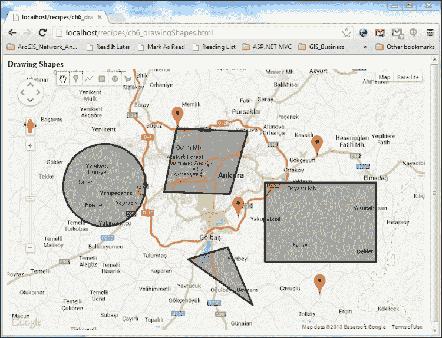

在前面的截图中，您可以看到通过点击左上角按钮可以绘制的各种形状。

## 它是如何工作的...

使用 Google Maps JavaScript API 将绘图功能添加到您的应用程序中非常简单。首先，您必须将 `libraries` 参数包含在 Google Maps JavaScript API URL 中，并在其中包含 `drawing` 值以将 `drawing` 库包含到您的应用程序中：

```js
&libraries=drawing
```

接下来，您可以使用 `drawing` 库支持的函数和对象，以及标准的 Google Maps JavaScript API。

要绘制矢量形状，您必须有一个 `DrawingManager` 对象：

```js
var drawingManager = new google.maps.drawing.DrawingManager();
```

拥有一个 `DrawingManager` 对象，您就拥有了所有的绘图功能，但您必须将其附加到当前地图实例上才能使用它：

```js
drawingManager.setMap(map);
```

在此之后，您将看到一个包含标记、折线、矩形、圆形和多边形绘图按钮的绘图控制。通过使用这些按钮，您可以绘制任何想要的矢量叠加。在工具集中，您还可以看到一个平移工具，用于退出绘图模式以使用平移和缩放控制。如果您想再次绘制矢量形状，请按相关按钮（标记、折线等）并在地图上绘制。

## 还有更多...

到目前为止，拥有绘图功能非常简单，您可以通过添加两行代码来实现它。然而，有一系列广泛的选项可供使用，这些选项与 `DrawingManager` 对象和您绘制的矢量形状相关。了解它们是值得的，因为它们可以丰富您在应用程序中的绘图体验。

可以在 `DrawingManager` 的初始化过程中或通过其 `setOptions` 方法修改 `DrawingManager` 的设置。所有与 `DrawingManager` 类相关的设置都是 `DrawingManagerOptions` 类的属性。

让我们修改我们的配方以包含 `DrawingManager` 选项：

```js
var drawingManager = new google.maps.drawing.DrawingManager({
    drawingControl: true,
});
```

`drawingControl` 属性可以启用或禁用在地图 UI 中看到的绘图控制：

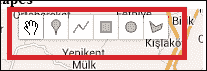

将 `drawingControl` 属性设置为 `false` 将会隐藏绘图控制。其默认值为 `true`；因此，尽管它没有包含在我们的原始配方代码中，但它显示在地图上。

重要的是要注意，绘图功能是通过将 `DrawingManager` 类附加到地图上实现的。

```js
drawingManager.setMap(map);
```

因此，隐藏绘图控制与绘图功能无关。实际上，您可以使用自己的用户控件来使用`DrawingManager`而不是标准绘图控件。

绘图控制在其`drawingControlOptions`属性中嵌入了自己的选项。记住从第四章，*使用控件*，您可以在 Google Maps UI 中预定义的位置放置您的控件，无论是默认控件还是您实际开发的控件。

`drawingControl`属性也不例外。您可以使用以下代码片段来定位`drawingControl`：

```js
var drawingManager = new google.maps.drawing.DrawingManager({
    drawingControl: true,
    drawingControlOptions: {
        position: google.maps.ControlPosition.BOTTOM_CENTER
    }
});
```

上述代码在地图 UI 中的反映方式如下：

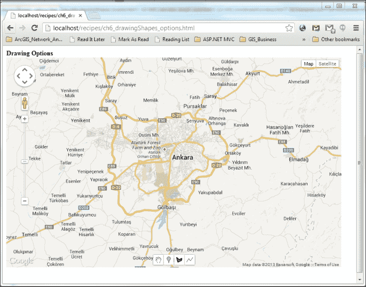

注意，`drawingControl`属性被放置在底部中央，正如我们在`drawingControlOptions`属性的`position`属性中提到的。

### 注意

**google.maps.ControlPosition 的完整列表**

控制位置的完整列表可以在以下链接的 Google Maps JavaScript API 参考文档中找到：

[`developers.google.com/maps/documentation/javascript/reference`](https://developers.google.com/maps/documentation/javascript/reference)

除了`position`属性之外，您还可以选择您想要绘制的形状类型，换句话说，您想要包含在`drawingControl`中的按钮：

```js
var drawingManager = new google.maps.drawing.DrawingManager({
    drawingControl: true,
    drawingControlOptions: {
        position: google.maps.ControlPosition.BOTTOM_CENTER,
        drawingModes: [
            google.maps.drawing.OverlayType.MARKER,
            google.maps.drawing.OverlayType.POLYGON,
            google.maps.drawing.OverlayType.POLYLINE
        ]
    }
});
```

我们显然选择了在`drawingModes`属性中列出的数组中的三种绘图形状类型：

+   标记

+   多边形

+   多段线

这些在`drawingControl`属性中体现出来：

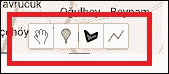

默认情况下，所有矢量形状按钮都在`drawingControl`中可用。这意味着，除了我们示例中列出的三种类型之外，以下形状也是可用的：

+   矩形

+   圆形

如果您已经按照这个步骤做到这里，您可能已经意识到，在您的应用程序开始时，您可以像往常一样缩放和拖动地图。然后，您必须点击`drawingControl`属性中的矢量覆盖按钮来开始绘制形状。

然而，您可以通过设置来更改这一点。例如：

```js
var drawingManager = new google.maps.drawing.DrawingManager({
    drawingMode: google.maps.drawing.OverlayType.POLYGON,
    ...
});
```

`drawingMode`属性采用矢量形状类型`google.maps.drawing.OverlayType`作为其数据类型，并设置该矢量形状类型以便可以绘制。在我们的示例中，当用户点击地图时，他们立即开始绘制`POLYGON`矢量覆盖。

但是，如果程序流程中需要程序化地更改`drawingMode`，会发生什么呢？幸运的是，有一个解决方案：

```js
drawingManager.setDrawingMode(null);
```

将属性设置为`null`会使`drawingMode`属性变为默认值，允许最终用户像往常一样使用 Google Maps JavaScript UI。这意味着点击地图不会绘制任何矢量形状覆盖。

您也可以使用`drawingManager`的`setOptions`方法达到相同的目的：

```js
drawingManager.setOptions({
   drawingMode: google.maps.drawing.OverlayType.POLYGON,
});
```

到目前为止，我们已经处理了`drawingManager`和`drawingControl`属性选项。但我们将要绘制的形状及其样式怎么办？正如您所预期的，您可以在`google.maps.drawing.DrawingManagerOptions`中设置您绘制的矢量形状的属性：

```js
var drawingManager = new google.maps.drawing.DrawingManager({
   ...
   polylineOptions: {
       strokeColor: 'red',
       strokeWeight: 3
   },
   polygonOptions: {
        strokeColor: 'blue',
        strokeWeight: 3,
        fillColor: 'yellow',
        fillOpacity: 0.2
   }
...
});
```

我们现在可以绘制如下所示的形状：

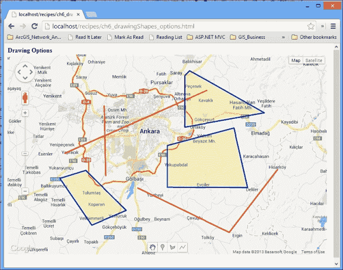

您可能已经观察到多边形和折线形状的样式已经完全改变。折线变成了红色，因为它们的`strokeColor`属性被设置为`red`，而多边形的`strokeColor`属性被设置为`blue`，它们的`fillColor`为`yellow`，透明度接近透明——`0.2`——这样您就可以通过它们看到基础地图。

对于每种矢量覆盖类型，`drawingManager`都有一个`options`属性：

+   `markerOptions`

+   `polylineOptions`

+   `polygonOptions`

+   `circleOptions`

+   `rectangleOptions`

对于矢量覆盖，有许多有趣的属性，其中大多数对所有覆盖类型都是通用的。我们已涉及根据您的喜好自定义样式的线条和填充属性。

例如，您可以尝试`editable`和`draggable`属性，这些属性值得注意：

```js
polygonOptions: {
            strokeColor: 'blue',
            strokeWeight: 3,
            fillColor: 'yellow',
            fillOpacity: 0.2,
            editable: true,
            draggable: true
}
```

前面的代码片段使得在谷歌地图 UI 上绘制的多边形可编辑，如下面的截图所示（您必须通过在绘图控制中点击平移按钮退出多边形绘图模式）：

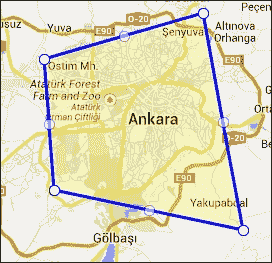

观察代表构成整个多边形的节点（`LatLng`对象）的白点。您可以通过点击和拖动这些点来改变这些点的位置；这将允许您改变多边形的形状，如下面的截图所示：

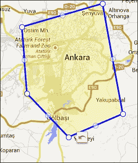

您可能已经注意到位于南边缘中间的白点已被向下拖动，因此多边形的形状已经改变。

除了改变原始形状外，您还可以拖动形状，如下面的截图所示：

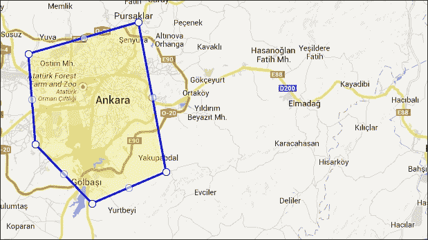

如您所见，在第二张截图中，形状已经向东移动。

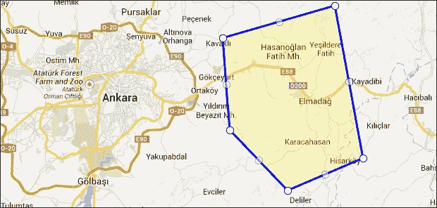

当`draggable`属性设置为`true`并且鼠标位于形状上时，您可以将形状拖动到地图上的任何位置。

### 注意

**google.maps.drawing.DrawingManager 属性完整列表**

`DrawingManager`属性和相关选项的完整列表可以在以下链接的谷歌地图 JavaScript API 参考文档中找到：

[`developers.google.com/maps/documentation/javascript/reference#DrawingManager`](https://developers.google.com/maps/documentation/javascript/reference#DrawingManager)

`DrawingManager`不仅限于其属性和选项；它还有一些与之相关的事件。这些事件在您完成绘制形状时触发：

```js
google.maps.event.addListener(drawingManager, '    polygoncomplete', function(polygon) {
    polygon.setEditable(true);
    polygon.setDraggable(true);
});
```

你可能会注意到事件的类型是`polygoncomplete`，并且有一个回调函数接受一个参数，即已经完成的多边形。

每种形状类型都有一个事件：

+   `markercomplete`

+   `linestringcomplete`

+   `polygoncomplete`

+   `rectanglecomplete`

+   `circlecomplete`

还有一种额外的事件类型涵盖了所有这些形状类型：

```js
google.maps.event.addListener(drawingManager, 'overlaycomplete', function(event) {
     if (event.type == google.maps.drawing.OverlayType.POLYGON) {
          event.overlay.setEditable(true);
          event.overlay.setDraggable(true);
     }
});
```

前一个事件的行为与上一个示例相同。而不是`shapecomplete`模式，事件有一个`overlaycomplete`参数。这个事件对于所有形状类型特别有用。然而，作为一个针对所有形状的通用事件，你也可以从`event.type`获取形状类型，并从`event.overlay`获取绘制形状的引用。利用这些，你可以在一个事件处理器中为不同的形状类型设置条件语句。

# 计算折线和多边形的长度/面积

如本章第一道菜谱所述——*在地图上绘制形状*——你可以根据你的喜好绘制形状。但关于这些形状的信息，例如，它们的长度和面积信息，你了解多少呢？

Google Maps JavaScript API 在`geometry`库中提供了收集这些信息的机会。从这个库中，你可以访问静态实用函数，这些函数提供了长度/面积计算等信息。

本菜谱将展示如何获取绘制形状的长度和面积信息。

## 准备工作

在查看*在地图上绘制形状*的菜谱之前，可以让你更容易地工作，因为需要很多关于绘制形状及其背景的细节。

## 如何操作...

你可以通过以下步骤查看你形状的面积和长度信息：

1.  将`drawing`和`geometry`库添加到 bootstrap URL 中：

    ```js
    <script type="text/javascript"
        src="img/js? libraries=drawing,geometry&sensor=false">
    </script>
    ```

1.  使用以下设置创建一个`drawingManager`对象：

    ```js
    var drawingManager = new google.maps.drawing.DrawingManager({
        drawingMode: null,
        drawingControl: true,
        drawingControlOptions: {
           position:
                google.maps.ControlPosition.BOTTOM_CENTER,drawingModes: [
            google.maps.drawing.OverlayType.POLYGON,
            google.maps.drawing.OverlayType.POLYLINE
            ]
        },
        polylineOptions: {
            strokeColor: 'red',
            strokeWeight: 3
        },
        polygonOptions: {
            strokeColor: 'blue',
            strokeWeight: 3,
            fillColor: 'yellow',
            fillOpacity: 0.2
      }
    });
    ```

1.  启用绘图功能：

    ```js
    drawingManager.setMap(map);
    ```

1.  为你的多边形完成添加事件监听器：

    ```js
    google.maps.event.addListener(drawingManager, 'polygoncomplete', function(polygon) {
        var path = polygon.getPath();
        var area =     google.maps.geometry.spherical.computeArea(path);
        var length = google.maps.geometry.spherical.computeLength(path);
        console.log('Polygon Area: ' +  area/1000000 + ' km sqs');
        console.log('Polygon Length: ' +  length/1000 + ' kms');
    });
    ```

1.  为你的折线添加事件监听器：

    ```js
    google.maps.event.addListener(drawingManager, 'polylinecomplete', function(polyline) {
        var path = polyline.getPath();
        var length = google.maps.geometry.spherical.computeLength(path);
        console.log('Polyline Length: ' +  length/1000 + ' kms');
    });
    ```

    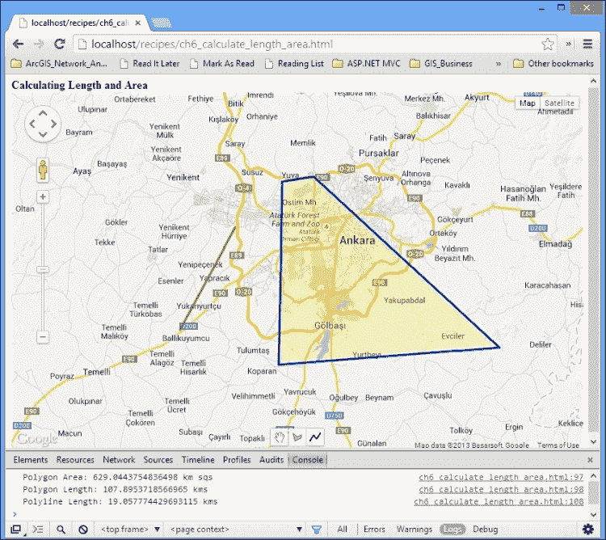

如前一张截图所示，你可以在控制台窗口中查看面积和长度信息。

## 工作原理...

要使用 Google Maps JavaScript API 中的`drawing`和`geometry`实用工具，我们在代码顶部的 Google Maps JavaScript API bootstrap URL 中添加了两个库——`drawing`和`geometry`：

```js
libraries=drawing,geometry
```

需要注意的是，你可以通过逗号分隔每个列表来添加多个库，就像在这个例子中一样。

我们在`initMap()`函数本身中添加了`drawingManager`对象，在常规地图细节之后。在这个`drawingManager`对象中，我们设置了属性，以便我们只能绘制折线和多边形：

```js
drawingModes: 
[
    google.maps.drawing.OverlayType.POLYGON,
    google.maps.drawing.OverlayType.POLYLINE
]
```

我们不需要任何标记绘制，因为没有与标记相关的长度和面积信息。

在应用程序开始时，我们暗示用户可以使用标准地图控件（缩放、平移等）而不是绘制形状：

```js
drawingMode:null,
```

这种对用户输入的控制特别适用于专业应用程序，因为即使应用程序是唯一的绘图应用程序，用户也可能需要首先使用平移和缩放控件来指定他们的绘图区域。

我们已经将 `drawingControl` 对象放置在地图 UI 的底部中央：

```js
position: google.maps.ControlPosition.BOTTOM_CENTER,
```

您可以自行决定将 `drawingControl` 放置在哪里；我们只是选择了 `BOTTOM_CENTER` 作为示例。

我们最终将 `drawingManager` 对象附加到地图实例上以启用功能：

```js
drawingManager.setMap(map);
```

在完成所有这些设置后，用户可以打开他们的应用程序，并根据他们的意愿绘制多边形和多段线。但是，我们如何获取他们形状的长度和面积信息呢？

我们必须添加事件处理器来确保他们已经完成了形状的绘制。对于每个多边形和多段线，都必须执行长度和面积的计算。因此，我们使用了 `polygoncomplete` 和 `polylinecomplete` 事件。首先，让我们对多边形进行计算：

```js
google.maps.event.addListener(drawingManager, 'polygoncomplete', function(polygon) {
    var path = polygon.getPath();
    var area = google.maps.geometry.spherical.computeArea(path);
    var length = google.maps.geometry.spherical.computeLength(path);
    console.log('Polygon Area: ' +  area/1000000 + ' km sqs');
    console.log('Polygon Length: ' +  length/1000 + ' kms');
});
```

在用户完成绘制每个多边形时触发的 `polygoncomplete` 事件处理器中，我们首先获取他们所绘制的多边形的路径：

```js
var path = polygon.getPath();
```

`getPath()` 方法返回一个 `MVCArray`，该对象为 `LatLng` 类型，包含构成多边形的经纬度对。例如，对于我们所绘制的想象中的多边形，调用 `polygon.getPath().getArray().toString();` 会得到以下结果：

```js
"(39.92132255884663, 32.7337646484375),(39.75048953595117, 32.754364013671875),(39.78110197709871, 33.061981201171875),(39.98132938627213, 33.0084228515625)"
```

现在已经很清楚，所绘制的想象中的多边形由四个经纬度对组成。

为什么我们需要多边形的路径？我们需要它是因为我们使用的 `computeArea()` 函数不接受多边形，而是接受其路径作为参数：

```js
var area = google.maps.geometry.spherical.computeArea(path);
```

这个 `spherical` 命名空间代表什么？

正如您所观察到的，地图是二维表面。然而，地球的表面不是。为了在二维画布上反映地球表面，需要使用投影。然而，这种反映并不像最初看起来那么平滑。它伴随着代价；地球的形状和属性会发生扭曲。为了处理这些副作用，需要球面几何计算，而 `google.maps.geometry.spherical` 正好就是为了这个目的而存在的。

当您调用 `computeArea()` 或 `computeLength()` 方法时，面积计算会像将形状扭曲到地球表面一样进行，考虑到地球的曲率。

这两个方法的返回值单位是米。我们将它们转换为平方千米和千米，以便在控制台窗口打印时具有更有意义的值：

```js
console.log('Polygon Area: ' +  area/1000000 + ' km sqs');
console.log('Polygon Length: ' +  length/1000 + ' kms');
```

`polygoncomplete` 和 `polylinecomplete` 事件的处理器在 `polylinecomplete` 中是相同的，除了在 `polylinecomplete` 中没有面积计算。

## 还有更多...

有很大的可能性，将长度和面积信息附加到形状上会很方便。你可以扩展 `Polygon` 和 `Polyline` JavaScript 类来实现这一点。但请记住，扩展 JavaScript 对象可能会导致意外的错误；你可能会覆盖不同库的对象扩展。因此，在扩展 JavaScript 类之前请三思：

```js
google.maps.Polygon.prototype.getArea = function()
{
    return google.maps.geometry.spherical.computeArea(this.getPath());
};

google.maps.Polygon.prototype.getLength = function(){
    return google.maps.geometry.spherical.computeLength(this.getPath());
};

google.maps.Polyline.prototype.getLength=function(){
    return google.maps.geometry.spherical.computeLength(this.getPath());
};
```

在扩展了 `Polygon` 和 `Polyline` 类之后，你可以直接从它们的对象中调用 `getArea()` 和 `getLength()` 方法：

```js
polygon.getArea();
polyline.getLength();
```

## 参见

+   本章中的 *在地图上绘制形状* 菜单

# 编码坐标

你使用 Google Maps JavaScript API 绘制的折线和多边形由经纬度对的 `LatLng` 对象数组组成。

这些数组的长度显著增加，尤其是在你有太多节点的形状，例如长折线或具有过多细节的多边形的情况下。

处理这些数组（可以通过折线和多边形的 `getPath()` 方法检索）是一个主要问题，尤其是在你必须将形状保存到数据库中时。序列化和反序列化长数组通常是笨重的。

然而，你可以使用 Google 的 **polyline 编码算法**压缩形状的路径。

### 注意

**关于 Google polyline 编码算法的详细信息**

你可以在以下链接中找到有关 polyline 编码算法的详细信息：

[`developers.google.com/maps/documentation/utilities/polylinealgorithm`](https://developers.google.com/maps/documentation/utilities/polylinealgorithm)

通过使用 `geometry` 库，你可以编码和解码折线和多边形的路径。

本菜谱将向你展示如何编码和解码折线和多边形的路径。

## 准备工作

快速查看本章的第一个菜谱——*在地图上绘制形状*——将很有帮助，因为它涵盖了使用 Google Maps JavaScript API 绘制形状的每一个细节。

## 如何操作...

这里有一些你可以使用的步骤来查看你路径的编码和解码版本：

1.  将 `geometry` 和 `drawing` 库添加到 bootstrap URL：

    ```js
    <script type="text/javascript"
       src="img/js? libraries=drawing,geometry&sensor=false">
    </script>
    ```

1.  组织你的 HTML，以便你可以在一个 `div` 元素中查看形状的原始、编码和解码坐标：

    ```js
    <div>
        <H3>Original, Encoded and Decoded Coordinate Pairs:<H3>
        <div id="loggingDiv"></div>
    </div>
    ```

1.  在你的 `initMap()` 函数中保留对 `loggingDiv div` 元素的引用：

    ```js
    loggingDiv = document.getElementById('loggingDiv');
    ```

1.  在创建 `drawingManager` 并将其附加到地图实例之后，在你的 `initMap()` 函数中创建一个 `polylinecomplete` 事件处理程序：

    ```js
    google.maps.event.addListener(drawingManager, 'polylinecomplete', function(polyline){
        var path = polyline.getPath();

        var coords = path.getArray();

        var text = '<b>Original Coordinates:</b> ' + coords;

        var encodedCoords = google.maps.geometry.encoding.encodePath(path);

        text += '<br/><b>Encoded Coordinates:</b> ' + encodedCoords;

        var decodedCoords = google.maps.geometry.encoding.decodePath(encodedCoords);

        text += '<br/><b>Decoded Coordinates:</b> ' + decodedCoords;

        loggingDiv.innerHTML = text;
    });
    ```

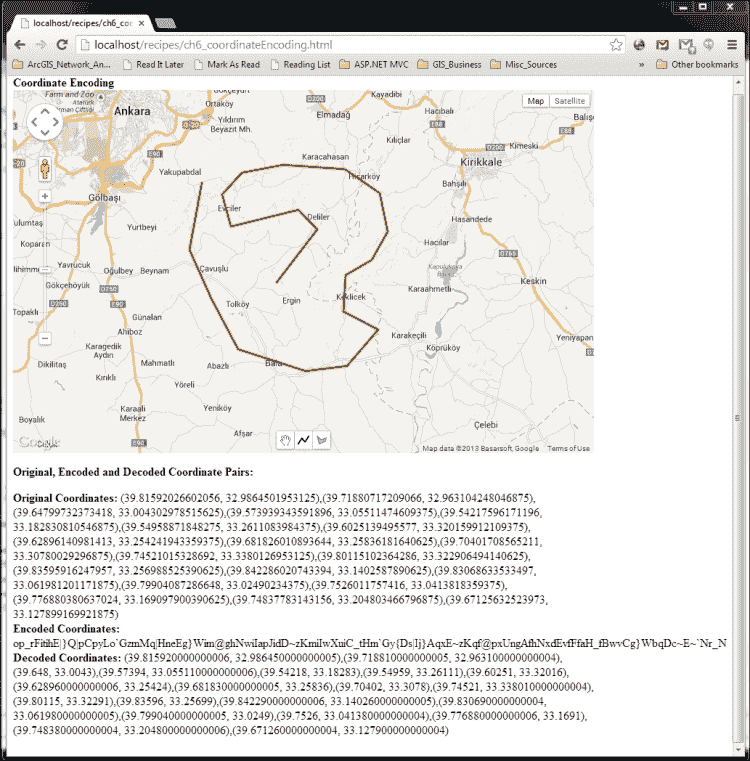

你可以查看你路径的原始、编码和解码版本，如前一个屏幕截图所示。

## 它是如何工作的...

当你完成绘制折线时，会触发 `polylinecomplete` 事件。你可以以下方式获取包含你的折线的 `LatLng` 对象类型的 `MVCArray`：

```js
var path = polyline.getPath();
```

拥有路径对象后，你可以通过使用 `encodePath()` 方法轻松地进行编码：

```js
var encodedCoords = google.maps.geometry.encoding.encodePath(path);
```

`encodePath()`方法接受`LatLng`对象类型的对象`MVCArray`或`LatLng`对象的数组。因此，在我们的食谱中，这也将是可能的：

```js
var encodedCoords = google.maps.geometry.encoding.encodePath(coords);
```

`encodePath()`方法返回一个适合保存到数据库的字符串，并且可以节省大量用于序列化和反序列化操作的时间：

```js
op_rFitihE|}Q|pCpyLo`GzmMq|HneEg}Wim@ghNwiIapJidD~zKmiIwXuiC_tHm`Gy{Ds|Ij}AqxE~zKqf@pxUngAfhNxdEvfFfaH_fBwvCg}WbqDc~E~`Nr_N
```

不进行编码，`coords`数组将看起来像这样：

```js
(39.81592026602056, 32.9864501953125),(39.71880717209066, 32.963104248046875),(39.64799732373418, 33.004302978515625),(39.573939343591896, 33.05511474609375),(39.54217596171196, 33.182830810546875),(39.54958871848275, 33.2611083984375),(39.6025139495577, 33.320159912109375),(39.62896140981413, 33.254241943359375),(39.681826010893644, 33.25836181640625),(39.70401708565211, 33.30780029296875),(39.74521015328692, 33.3380126953125),(39.80115102364286, 33.322906494140625),(39.83595916247957, 33.256988525390625),(39.842286020743394, 33.1402587890625),(39.83068633533497, 33.061981201171875),(39.79904087286648, 33.02490234375),(39.7526011757416, 33.0413818359375),(39.776880380637024, 33.169097900390625),(39.74837783143156, 33.204803466796875),(39.67125632523973, 33.127899169921875)
```

对折线和多边形进行编码不是单向操作。你可以按照以下方式解码编码的坐标对：

```js
var decodedCoords = google.maps.geometry.encoding.decodePath(encodedCoords);
```

`decodePath()`方法接受以字符串形式的编码坐标，并返回一个`LatLng`对象的数组。

# 搜索并显示附近的地点

Google Maps 不仅仅是具有巨大制图质量的美丽基础地图或定期更新的卫星图像。在日常生活中，你作为 Google Maps 的普通用户，无疑已经使用 Google Maps 搜索过地点；无论是纽约的大都会艺术博物馆，还是罗马的普通*药房*。

这些信息在 Google Maps 中，但如何通过 Google Maps JavaScript API 访问并提供服务呢？

`places`库正是为此目的而存在的，它使你能够使用某些搜索参数来查找地点。

你可以进行附近的搜索，地点结果将靠近你提供的位置，最常见的是用户的位置。你可以在一定范围内搜索，或者只需指定一个搜索字符串。你甚至可以请求额外的详细信息，例如相关照片、评论评分、电话号码和特定地点的营业时间。

本食谱将专注于使用 Google Maps JavaScript API 的`places`库进行附近的搜索。

## 准备工作

本食谱将使用`drawing`库，因此建议回顾本章的第一食谱——*在地图上绘制形状*——并刷新对该主题的理解。

## 如何操作...

你可以绘制一个圆，使用关键词在这个圆内搜索地点，并按照以下步骤获取每个地点的详细信息：

1.  将`drawing`和`places`库添加到 bootstrap URL：

    ```js
    <script type="text/javascript"
       src="img/js? libraries=drawing,places&sensor=false">
    </script>
    ```

1.  将`circles`和`markers`全局变量添加到在`initMap()`函数外部推送和弹出相应的覆盖物：

    ```js
    var circles;
    var markers;
    ```

1.  添加一个`popup`全局变量来保存`infoWindow`对象：

    ```js
    var popup;
    ```

1.  在`initMap()`函数中初始化`circles`和`markers`数组以及`infoWindow`对象：

    ```js
    circles = new Array();
    markers = new Array();
    popup = new google.maps.InfoWindow();
    ```

1.  在创建`drawingManager`对象并将其附加到地图实例后，在`initMap()`函数中创建一个`circlecomplete`事件处理器（从第 6 项到第 12 项的内容将在这个事件处理器中）：

    ```js
    google.maps.event.addListener(drawingManager, 'circlecomplete', function(circle){

    });
    ```

1.  在`circlecomplete`事件处理器内部，将`drawingMode`设置为`null`：

    ```js
    drawingManager.setDrawingMode(null);
    ```

1.  将最新绘制的圆添加到`circles`数组中，然后反转数组内的顺序：

    ```js
    circles.push(circle);
    circles.reverse();
    ```

1.  弹出之前的圆圈并将它的地图句柄设置为 null，以便只显示最后绘制的圆圈：

    ```js
    while(circles[1]){
        circles.pop().setMap(null);
    }
    ```

1.  清除之前绘制的标记：

    ```js
    while(markers[0]){
        markers.pop().setMap(null);
    }
    ```

1.  创建附近的搜索设置，将位置设置为圆心，将半径设置为圆的半径。此外，添加一个 `keyword` 属性以返回包含该关键字的地点：

    ```js
    var nearbyPlacesRequest = {
        location: circle.getCenter(),
        radius: circle.radius,
        keyword: 'pizza'
    };
    ```

1.  获取 `PlacesService` 服务对象的句柄：

    ```js
    var placesService = new google.maps.places.PlacesService(map);
    ```

1.  使用回调函数发送请求：

    ```js
    placesService.nearbySearch(nearbyPlacesRequest, resultsCallback);
    ```

1.  在 `initMap()` 函数外部，为 `nearbySearch` 请求创建一个回调函数，使用以下代码片段：

    ```js
    function resultsCallback(results, status) {
        if (status == google.maps.places.PlacesServiceStatus.OK) {
            for (var i = 0, l=results.length; i < l; i++) {
                pinpointResult(results[i]);
            }
        }
    }
    ```

1.  创建一个函数来根据地点结果创建标记（从第 15 步到第 17 步将在该函数中执行）：

    ```js
    function pinpointResult(result) {

    }
    ```

1.  在 `pinpointResult()` 函数内部创建标记：

    ```js
    var marker = new google.maps.Marker({
        map: map,
        position: result.geometry.location
    });
    ```

1.  向标记添加点击事件处理程序，以便当它被点击时，`infoWindow` 对象弹出：

    ```js
    google.maps.event.addListener(marker, 'click', function() {
        var popupContent = '<b>Name: </b> ' + result.name + '<br/>' + '<b>Vicinity: </b>' + result.vicinity + '<br/><b>Rating: </b>' + result.rating; 
        popup.setContent(popupContent);
        popup.open(map, this);
    });
    ```

1.  将标记推送到 `markers` 数组：

    ```js
    markers.push(marker);
    ```

    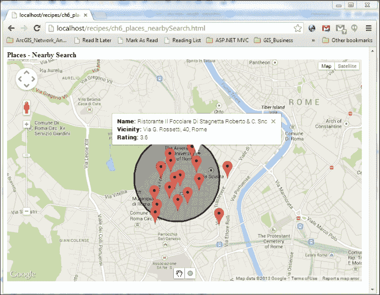

如前图所示，您可以绘制一个圆圈，使用关键字搜索此圆圈内的地点，并获取每个找到的地点的详细信息。

## 它是如何工作的...

此配方的步骤需要您多花一点时间；然而，本质是简单的。暂时忘记 `circles` 和 `markers` 数组以及相关的逻辑细节；只需专注于附近的搜索：

```js
var nearbyPlacesRequest = {
	location: circle.getCenter(),
   radius: circle.radius,
   keyword: 'pizza'
};
```

在 `circlecomplete` 事件处理程序（在我们完成绘制圆圈后触发）中，我们放置一个 `nearbyPlacesRequest` 对象。此对象应该是 `google.maps.places.PlaceSearchRequest` 类型。

`location` 属性设置应该作为地点搜索中心的 `LatLng` 对象。通常，在附近的搜索中，此属性根据用户的位置设置。但在此配方中，我们将其绑定到绘制的圆圈中心，因为您可以按照需要绘制和搜索多次。

通过 `radius` 属性设置 `location` 的距离，以便返回位于圆心一定距离内的地点。在我们的配方中，我们设置了绘制的圆的半径。

最后，`keyword` 属性过滤地点，以便返回包含关键字的地点。请注意，所有信息不仅包括地点的名称或类型，还包括地址和评论，这些将与关键字匹配。因此，请准备好返回一个包含关键字 "pizza" 的自助餐厅的评论。

准备好请求参数后，下一步是发送请求。首先，我们创建一个 `PlacesService` 对象，将当前的地图实例作为参数：

```js
var placesService = new google.maps.places.PlacesService(map);
```

通过使用 `placesService` 对象，我们可以发送我们的请求：

```js
placesService.nearbySearch(nearbyPlacesRequest, resultsCallback);
```

`nearbySearch` 方法接受两个参数，第一个参数是我们嵌入在 `nearbyPlacesRequest` 对象中的旧请求参数，第二个参数是返回结果的回调函数。在我们的配方中，第二个参数是 `resultsCallback` 函数：

```js
function resultsCallback(results, status) {
    if (status == google.maps.places.PlacesServiceStatus.OK) {
        for (var i = 0, l=results.length; i < l; i++) {
            pinpointResult(results[i]);
        }
    }
}
```

这个回调函数在这里接受两个参数（实际上，它还有一个与搜索分页相关的第三个参数）：搜索中找到的地点数组和服务状态。在回调函数中，我们首先检查服务状态是否正常。然后我们遍历 `results`，它是一个 `PlaceResult` 类型的数组，为每个返回的地点创建标记并填充 `infoWindow` 对象。

我们可以为每个地点创建一个关联的标记，如下面的代码片段所示：

```js
var marker = new google.maps.Marker({
    map: map,
    position: result.geometry.location
});
```

`result` 对象的 `geometry` 属性嵌入了一个 `location` 属性，它属于 `LatLng` 类类型。这非常适合 `Marker` 类的 `position` 属性。

我们可以通过在标记的 `click` 事件处理器中附加的 `popup` 对象来获取地点的详细信息：

```js
google.maps.event.addListener(marker, 'click', function() {
    var popupContent = '<b>Name: </b> ' + result.name + '<br/>' + '<b>Vicinity: </b>' + result.vicinity + '<br/><b>Rating: </b>' + result.rating; 

    popup.setContent(popupContent);
   popup.open(map, this);
});
```

你可能已经注意到，我们正在使用地点的 `name`、`vicinity` 和 `rating` 属性作为弹出窗口的内容。`name` 表示地点名称，`vicinity` 返回地址信息的一部分，而 `rating` 值是地点的评论评分，0.0 是最低分，5.0 是最高分。

## 更多内容...

搜索附近地点的详细信息和选项不仅限于本食谱中展示的选项。我们在这里将进一步探讨。首先，是 `nearbyPlacesRequest` 对象。该对象内部包含的属性有：`location`、`radius` 和 `keyword`。

然而，我们的对象所属的 `PlaceSearchRequest` 类比本食谱中展示的还要多。例如，你可以提供一个 `LatLngBounds` 对象而不是位置和半径：

```js
var requestBounds = new google.maps.LatLngBounds(
    new google.maps.LatLng(39.85, 32.74),
    new google.maps.LatLng(40.05, 32.84)
);

var nearbyPlacesRequest = {
    bounds: requestBounds,
    keyword: 'pizza'
};
```

请记住，一个选项是使用 `bounds`，另一个选项是使用 `location` 和 `radius` 配对。对于 `PlaceSearchRequest` 类，使用其中一个选项是强制性的。

要过滤地点结果，使用 `keyword` 并非唯一解决方案。你可以尝试使用 `name` 属性直接匹配地点名称。例如，以下代码给出了名称中包含 `Buckingham` 的地点：

```js
var nearbyPlacesRequest = {
    location: circle.getCenter(),
    radius: circle.radius,
    name: 'Buckingham'
};
```

如果你绘制的圆圈位于伦敦，它可能会同时显示白金汉宫以及附近的一批酒店。

你可以使用 `types` 属性来选择返回的地点类型。这个属性接受一个类型数组，例如：

```js
var nearbyPlacesRequest = {
    location: circle.getCenter(),
    radius: circle.radius,
    types: ['stadium', 'car_rental', 'library','university','administrative_area_level_3']
};
```

Google Maps 已经覆盖了极其广泛的地点类型。你可以插入你想要的任何地点类型，从汽车租赁到大学，就像我们做的那样。

### 注意

**地点类型完整列表**

你可以在以下位置找到完整的地点类型列表：

[Google 地点 API 支持的地点类型](https://developers.google.com/places/documentation/supported_types)

除了 `types`、`name` 和 `bounds` 之外，`PlaceSearchRequest` 类中还有许多其他属性，例如 `openNow`，这是一个非常实用的属性，可以显示在搜索时开放的地点。

### 注意

**PlaceSearchRequest 类的完整属性列表**

您可以在以下位置找到 `PlaceSearchRequest` 类的完整属性列表：

[`developers.google.com/maps/documentation/javascript/reference#PlaceSearchRequest`](https://developers.google.com/maps/documentation/javascript/reference#PlaceSearchRequest)

除了在请求附近搜索时出现的选项池之外，还有另一组属性在返回结果中；换句话说，由 `PlaceResult` 类表示的地点。

例如，`PlaceResult` 类的 `icon` 属性，我们可以在以下代码块中在 `pinpointResult()` 函数内部使用：

```js
var placeIcon = {
    url: result.icon,
    scaledSize: new google.maps.Size(30, 30)
};

var marker = new google.maps.Marker({
    map: map,position: result.geometry.location,
    icon: placeIcon
});
```

此代码块将返回带有各自图标的地点：

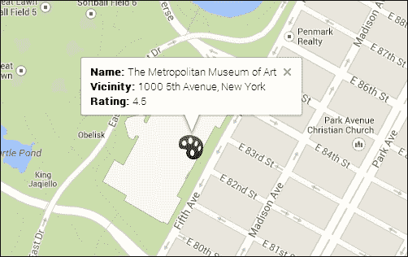

注意前一个屏幕截图中的画家调色板图标，它与返回的地点相结合，即纽约大都会艺术博物馆。

您还可以访问该地点所属的类型。`PlaceResult` 类的 `types` 属性返回一个字符串数组中的类型。因此，`Result.types` 属性返回以下参数，用于纽约大都会艺术博物馆：

```js
["art_gallery", "museum", "establishment"]
```

如果您更改标记的点击处理程序，您还可以获取有关地点在搜索时是否开放的搜索信息，如下面的代码片段所示：

```js
google.maps.event.addListener(marker, 'click', function() {
    var popupContent = '<b>Name: </b> ' + result.name + '<br/>' + '<b>Vicinity: </b>' + result.vicinity; 
    if (result.opening_hours){
        if (result.opening_hours.open_now){
            popupContent += '<br/><b>Is Open Now: </b> '
            + 'YES'
        }
        else {
            popupContent += '<br/><b>Is Open Now: </b> '
            + 'NO'
        }
    }
    popup.setContent(popupContent);
    popup.open(map, this);
});
```

使用前面的代码，您可能会得到以下信息：

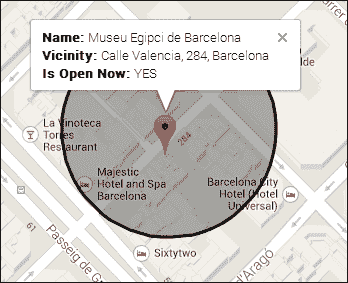

### 注意

**PlaceResult 类的完整属性列表**

您可以在以下位置找到 `PlaceResult` 类的完整属性列表：

[`developers.google.com/maps/documentation/javascript/reference#PlaceResult`](https://developers.google.com/maps/documentation/javascript/reference#PlaceResult)

# 使用自动完成选项查找地点

Google Maps JavaScript API 提供了多种搜索地点和获取额外信息的方法。您可以使用附近搜索，并获取有关地点的详细信息，包括它们的几何形状，正如您在本章中名为 *搜索并显示附近地点* 的配方中所观察到的。

有没有想过使用具有自动完成功能的文本字段来控制搜索地点？您可以硬编码它，但这样做没有必要，因为 Google 已经有了一个专门为此目的的功能。

在本配方中，我们将介绍 Google Maps JavaScript API 的 `places` 库的自动完成功能。

## 准备工作

本配方将使用本章中 *搜索并显示附近地点* 配方中引入的与 `places` 库相关的概念。建议您阅读此配方，以便对地点及其属性有一个整体的理解。

## 如何操作...

您可以通过以下步骤添加文本字段并使用自动完成功能搜索地点：

1.  插入一个用作自动完成字段的输入 HTML 元素：

    ```js
    <div id="searchDiv">
    <input id="autocomplete_searchField" type="text" size="40"  placeholder="Search for Places">
    </div>
    ```

1.  在`initMap()`函数外部定义标记和弹出变量为全局变量：

    ```js
    var markers;
    var popup;
    ```

1.  在`initMap()`中初始化全局变量：

    ```js
    markers = new Array();
    popup = new google.maps.InfoWindow();
    ```

1.  获取 ID 为`searchDiv`的`div`标签，并在使用`initMap()`选项创建地图后将其作为自定义控件推入：

    ```js
    var searchDiv = document.getElementById('autocomplete_searchField');
    map.controls[google.maps.ControlPosition.TOP_CENTER].push(searchDiv);
    ```

1.  获取输入元素的句柄：

    ```js
    var searchField = document.getElementById('autocomplete_searchField');
    ```

1.  为自动完成搜索请求提供属性：

    ```js
    var searchOptions = {
        bounds: new google.maps.LatLngBounds(
           new google.maps.LatLng(8.54, 17.33),
            new google.maps.LatLng(39.67, 43.77)
        ),
       types: new Array()
    };
    ```

1.  通过提供要使用的输入 HTML 元素，即`searchField`和`searchOptions`，来获取`autocomplete`对象：

    ```js
    var autocompleteSearch = new google.maps.places.Autocomplete(searchField, searchOptions);
    ```

1.  为`autocomplete`对象创建一个`place_changed`事件处理器（步骤 9 到 11 将在这个事件处理器中）：

    ```js
    google.maps.event.addListener(autocompleteSearch, 'place_changed', function() {
    });
    ```

1.  在事件处理器中，首先清除之前的标记：

    ```js
    while(markers[0]) {
        markers.pop().setMap(null);
    }
    ```

1.  在自动完成搜索的响应中获取`PlaceResult`对象：

    ```js
    var place = autocompleteSearch.getPlace();
    ```

1.  如果地点有几何形状，调用一个函数来创建相关的标记：

    ```js
    if (place.geometry) {
        pinpointResult(place);
    }
    ```

1.  创建一个用于创建标记并为标记添加点击事件处理器的函数：

    ```js
    function pinpointResult(result) {
        var placeIcon = {
            url: result.icon,
            scaledSize: new google.maps.Size(30, 30)
        };

        var marker = new google.maps.Marker({
            map: map,
            position: result.geometry.location,
            icon: placeIcon
        });

        map.setCenter(result.geometry.location);
        map.setZoom(16);

        google.maps.event.addListener(marker, 'click', function() {
           var popupContent = '<b>Name: </b> ' + result.name + '<br/>' + '<b>Vicinity: </b>' + result.vicinity;

            popup.setContent(popupContent);
            popup.open(map, this);
        });
        markers.push(marker);
    }
    ```

    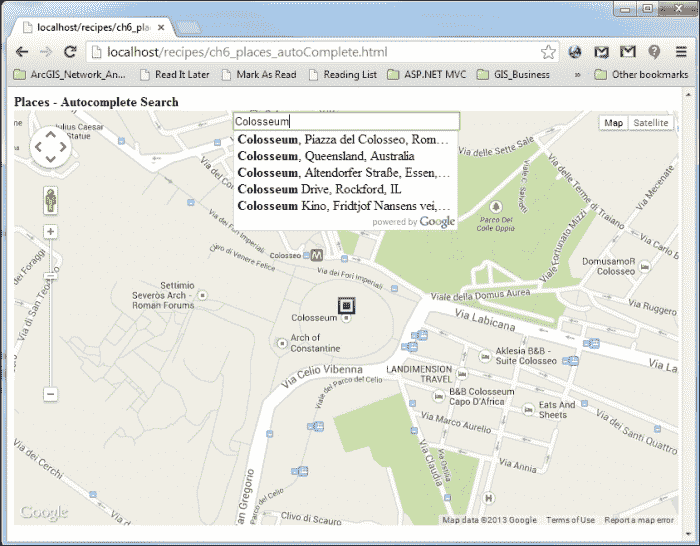

你可以使用前面截图所示的自定义搜索功能：

## 它是如何工作的...

在这个食谱中，我们首先创建了一个带有一些占位文本的输入元素（注意，这在不支持旧浏览器的浏览器中不受支持），它将作为我们的搜索地点的文本字段：

```js
<input id="autocomplete_searchField" type="text" size="40"  placeholder="Search for Places"></input>
```

然后，我们在 Google Maps JavaScript API 中添加了`div`容器标签作为自定义控件，以便在 Google Maps UI 中包含文本字段：

```js
var searchDiv = document.getElementById('searchDiv');
map.controls[google.maps.ControlPosition.TOP_CENTER].push(searchDiv);
```

我们在名为`searchOptions`的`AutocompleteOptions`对象中设置自动完成搜索的属性：

```js
var searchOptions = {
   bounds: new google.maps.LatLngBounds(
   new google.maps.LatLng(8.54, 17.33),
        new google.maps.LatLng(39.67, 43.77)
    ),
   types: new Array()
};
```

在前面的代码片段中，`bounds`用于定义要找到的地点的边界。在这里，我们将其设置为一个大预定义的边界；你可以将其设置为另一个你喜欢的`LatLngBounds`对象。

对于这个食谱，`types`数组是空的；实际上，这个数组用于限制要找到的地点的类型，无论是商业、城市还是地区。在我们的例子中，它是空的，所以我们的搜索将返回每种类型的`PlaceResult`对象。

我们使用两个成分创建了我们的自动完成对象：`searchField`是输入元素，`searchOptions`具有`bounds`和`types`属性：

```js
var autocompleteSearch = new google.maps.places.Autocomplete(searchField, searchOptions);
```

然后，我们为我们的`Autocomplete`对象创建了一个`place_changed`事件处理器，当用户选择提供的`PlaceResult`时会被触发：

```js
google.maps.event.addListener(autocompleteSearch, 'place_changed', function() {
    while(markers[0]) {
        markers.pop().setMap(null);
    }

    var place = autocompleteSearch.getPlace();
    if (place) {
        if (place.geometry) {
            pinpointResult(place);
        }
    }
});
```

在事件处理器中，我们取消映射在地图上的标记；然后，我们调用`getPlace()`方法来获取此上下文中的`PlaceResult`类型的`Place`对象。如果该地点存在并且具有几何形状（意味着找到了合适的`PlaceResult`实例），我们调用`pinpoint()`函数从`PlaceResult`创建标记，并为标记附加一个点击事件处理器以弹出相关的`InfoWindow`对象：

## 更多内容...

在我们的食谱中，我们在`searchOptions`对象中设置`bounds`属性为一个预定义的边界：

```js
bounds: new google.maps.LatLngBounds(
    new google.maps.LatLng(8.54, 17.33),
    new google.maps.LatLng(39.67, 43.77)
),
```

这行代码将自动完成操作设置为在主要但不仅限于特定`LatLngBounds`对象内查找搜索地点。因此，如果您意外地给出一个小边界并发现结果在边界之外，请不要感到惊讶。

我们将边界设置为`LatLngBounds`对象，例如地图的边界，之后您可以更改它：

```js
autocompleteSearch.setBounds(map.getBounds());
```

但如果您需要将边界设置为当前视口，该视口在您平移和缩放地图时更新怎么办？有一种方法，如下所示：

```js
autocompleteSearch.bindTo('bounds', map)
```

通过使用此`bindTo()`函数，`bounds`属性被绑定到当前视口边界，并在它更改时更新。

除了`bounds`属性外，还有一个`types`属性，我们将其设置为空数组，但它不需要为空以过滤掉由我们的`autocompleteSearch`对象完成的预测：

```js
types: ['(regions)']
```

这将渲染`autocompleteSearch`对象，仅搜索行政区域而不是所有地点。因此，当您输入`colos`时，罗马的斗兽场不会出现，因为只有允许在`autocompleteSearch`对象中显示的行政区域；您可以在以下屏幕截图中观察到这一点：

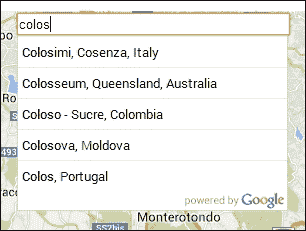

### 注意

**google.maps.places.AutocompleteOptions 类中 `types` 属性的完整条目列表**

您可以在以下位置找到`AutocompleteOptions`类中`types`属性的完整条目列表：

[`developers.google.com/maps/documentation/javascript/reference#AutocompleteOptions`](https://developers.google.com/maps/documentation/javascript/reference#AutocompleteOptions)

# 将拖动缩放添加到地图

Google Maps 有一个缩放控件，JavaScript API 利用这个控件为程序员提供各种选项。这是一个非常实用且易于使用的控件。但还有其他缩放的方法；例如，通过拖动框绘制感兴趣的区域，这样地图就会缩放到该区域。

这种功能在标准的 Google Maps JavaScript API 及其任何库中都不存在；您必须自己编写代码。或者，您可以使用以下链接中由好人开发的实用库：

[`code.google.com/p/google-maps-utility-library-v3/wiki/Libraries`](https://code.google.com/p/google-maps-utility-library-v3/wiki/Libraries)

他们的一个库，`KeyDragZoom`，正是为此缩放功能而设计的，我们将在本食谱中使用这个库。

## 准备工作

您必须从以下链接下载`keydragzoom.js` JavaScript 源文件（截至本书编写时，最新版本为 2.0.9），并将其放置在与我们的食谱源代码相同的目录中：

[`google-maps-utility-library-v3.googlecode.com/svn/tags/keydragzoom/`](http://google-maps-utility-library-v3.googlecode.com/svn/tags/keydragzoom/)

## 如何做到这一点...

下面是执行通过拖动框进行缩放并放大框内区域的步骤：

1.  使用对`keydragzoom`.`js`文件的引用：

    ```js
    <script type="text/javascript" src="img/keydragzoom.js">
    </script>
    ```

1.  在 `initMap()` 函数中设置所有与地图相关的选项后启用此功能：

    ```js
    map.enableKeyDragZoom({
        visualEnabled: true,
        visualPosition: google.maps.ControlPosition.LEFT,
        visualPositionOffset: new google.maps.Size(35, 0),
        visualPositionIndex: null,
        visualSprite: 'http://maps.gstatic.com/mapfiles/ftr/controls/dragzoom_btn.png',
        visualSize: new google.maps.Size(20, 20),
        visualTips: {
            off: "Turn on",
            on: "Turn off"
        }
    });
    ```

    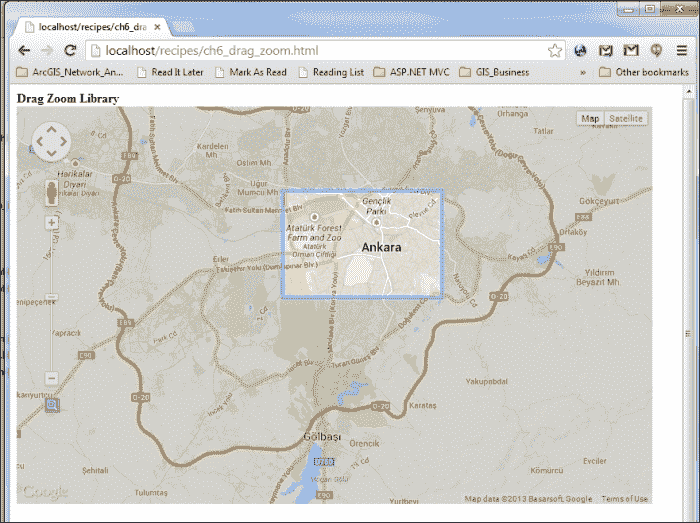

您可以通过拖动一个框来使用缩放功能，如图中所示的前一个截图。

## 如何工作...

您可以通过按下控制按钮并绘制一个框来执行拖动缩放，或者更简单的方法是，按住 *Shift* 键并绘制一个框来缩放框内的区域。

要执行此操作，我们首先在我们的配方中添加了拖动缩放库的 JavaScript 源文件。在设置地图选项并使用地图实例后，我们可以通过使用地图实例的 `enableKeyDragZoom()` 方法来启用拖动缩放功能。

此扩展方法不是 Google Maps JavaScript API 的一部分，而是随 `keydragzoom` 库一起提供。有几个相关的选项嵌入在 `KeyDragZoomOptions` 类中。

请记住，在其最简单形式中，您可以通过启用它来使用键拖动缩放功能：

```js
map.enableKeyDragZoom();
```

唯一的区别是您必须使用 *Shift* 键作为您唯一的操作方式，因为没有拖动缩放控制按钮。

`KeyDragZoomOptions` 类中嵌入的属性都是关于放置在标准缩放控制按钮下方的控制按钮：

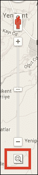

`visualEnabled` 属性设置控制是否可见，因此如果此属性为 `false`，则不需要其他属性。`visualPosition` 属性设置控制位置；我们将其放置在左侧。有关控制位置的详细描述，请参阅第四章中的*更改控件位置*配方，*使用控件*。

### 注意

**KeyDragZoomOptions 类中的属性完整列表**

您可以在以下链接中找到 `KeyDragZoomOptions` 类中属性的完整列表：

[`google-maps-utility-library-v3.googlecode.com/svn/tags/keydragzoom/2.0.9/docs/reference.html`](http://google-maps-utility-library-v3.googlecode.com/svn/tags/keydragzoom/2.0.9/docs/reference.html)

## 参见

+   您可以在第四章中查看 Google Maps JavaScript API 控件及其使用，*使用控件*。

# 创建自定义弹出窗口/信息框

我们已经在第三章中创建了弹出窗口或信息框，*添加矢量图层*。正如那里所述，几乎每个地图应用都有显示与其上显示的特征相关的信息的能力。这些信息可以与标记或地图相关。而不是在地图上显示所有信息，弹出窗口或信息框仅在需要时使用。

Google Maps JavaScript API 有一个 `google.maps.InfoWindow` 类来为开发者创建默认的信息框。在某些情况下，您需要自定义信息框来显示信息。有两种方法可以做到这一点：

+   第一种方法是通过创建一个继承自`google.maps.OverlayView`类的自定义类，并填充显示/隐藏信息框的方法，使用自定义 CSS 样式。

+   另一种更简单的方法是使用为你创建的库。在 Google Code 上有一个名为`google-maps-utility-library-v3`的项目，它包含扩展 Google Maps JavaScript API 的多个库。以下是链接：

    [Google Maps Utility Library v3 库](https://code.google.com/p/google-maps-utility-library-v3/wiki/Libraries)

    此项目有一个名为`InfoBox`的库，它使得创建自定义信息框或地图标签成为可能。

在这个菜谱中，我们将使用之前提到的库来创建可以绑定到标记和地图的自定义信息框。同一个信息框根据其绑定显示不同的信息。如果需要向地图添加更多信息，我们还将添加一个简单的地图标签。

## 准备工作

第一章的第一道菜谱，*Google Maps JavaScript API 基础*，将完成我们的工作。我们将在此菜谱中添加内容。

## 如何操作...

通过完成以下步骤，您可以获取自定义信息框：

1.  首先，访问以下地址以获取最新的`InfoBox`源代码，并将其保存到`lib`目录下的`infobox.js`文件中。我们使用了以下 URL 下的`/1.1.9/src/infobox_packed.js`文件：

    [Google Maps Utility Library v3 代码库](http://google-maps-utility-library-v3.googlecode.com/svn/tags/infobox/)

1.  然后，我们通过创建一个简单的地图配方来获取代码，并将以下代码添加到页面中，以添加我们的库：

    ```js
    <script type="text/javascript" src='lib/infobox.js'></script>
    ```

1.  下一步是使用`div`元素的帮助来创建信息框的内容：

    ```js
    //Creating the contents for info box
    var boxText = document.createElement('div');
    boxtext.className = 'infoContent';
    boxText.innerHTML = '<b>Marker Info Box</b> <br> Gives   information about marker';
    ```

1.  现在我们创建一个对象来定义信息框的选项：

    ```js
    //Creating the info box options.
    var customInfoBoxOptions = {
        content: boxText,
        pixelOffset: new google.maps.Size(-100, 0),
        boxStyle: {
            background: "url('img/tipbox2.gif') no-repeat",
            opacity: 0.75,
            width: '200px'
        },
        closeBoxMargin: '10px 2px 2px 2px',
        closeBoxURL: 'img/close.gif',
        pane: 'floatPane'
    };
    ```

1.  我们可以以下述方式初始化我们的自定义信息框：

    ```js
    //Initializing the info box
    var customInfoBox = new InfoBox(customInfoBoxOptions);
    ```

1.  此外，我们创建一个 JSON 对象来定义地图标签的选项：

    ```js
    //Creating the map label options.
    var customMapLabelOptions = {
        content: 'Custom Map Label',
        closeBoxURL: "",
        boxStyle: {
            border: '1px solid black',
            width: '110px'
        },
        position: new google.maps.LatLng(40.0678,   33.1252),
        pane: 'mapPane',
        enableEventPropagation: true
    };
    ```

1.  然后，我们以以下方式初始化地图标签并将其添加到地图中：

    ```js
    //Initializing the map label
    var customMapLabel = new InfoBox(customMapLabelOptions);
    //Showing the map label
    customMapLabel.open(map);
    ```

1.  创建一个简单的标记，该标记将被绑定到信息框：

    ```js
    //Initializing the marker for showing info box
    var marker = new google.maps.Marker({
        map: map,
        draggable: true,
        position: new google.maps.LatLng(39.9078,    32.8252),
        visible: true
    });
    ```

1.  当地图准备就绪时，我们将打开与标记绑定的信息框：

    ```js
    //Opening the info box attached to marker
    customInfoBox.open(map, marker);
    ```

1.  我们应该为标记和地图创建事件监听器，以便在它们的点击事件中显示信息框。当点击标记或在某些点上点击地图时，信息框将出现在标记的底部：

    ```js
    //Listening marker to open info box again with contents //related to marker
    google.maps.event.addListener(marker, 'click', function (e) {
        boxText.innerHTML = '<b>Marker Info Box</b> <br> Gives information about marker';
        customInfoBox.open(map, this);
    });

    //Listening map click to open info box again with //contents related to map coordinates
    google.maps.event.addListener(map,'click', function (e) {
        boxText.innerHTML = '<b>Map Info Box</b> <br> Gives information about coordinates <br> Lat: ' + e.latLng.lat().toFixed(6) + " -   Lng: ' + e.latLng.lng().toFixed(6);
        customInfoBox.setPosition(e.latLng);
        customInfoBox.open(map);
    });
    ```

1.  您还可以监听信息框的事件。我们将向信息框关闭按钮的点击事件添加一个监听器：

    ```js
    //Listening info box for clicking close button
    google.maps.event.addListener(customInfoBox, 'closeclick', function () {
            console.log('Info Box Closed!!!');
    });
    ```

1.  前往您在最喜欢的浏览器中存储 HTML 文件的本地 URL；您将看到一个带有信息框的弹出窗口。如果您点击地图，您将在信息框内看到鼠标点击的坐标，或者如果您点击标记，您将看到与标记相关的内容的信息框。地图的右上角还有一个固定的地图标签，其中包含一些内容；它说**自定义地图标签**。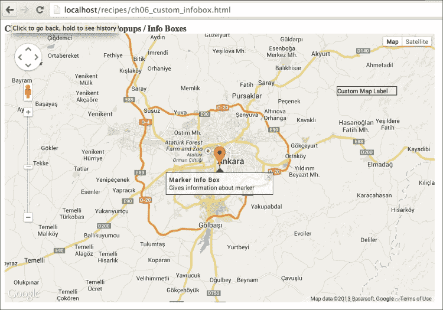

您可以获取您自定义的信息框，如图中所示的前一个屏幕截图。

## 它是如何工作的...

在您的 Web 应用程序中使用库是常见的。库的使用为开发者节省了开发和调试时间。与您有限的案例相比，库在不同的环境中针对不同的案例进行了测试。

如前所述，您也可以编写自己的自定义类来显示自定义信息框或地图标签，但这并不是一开始就发现美洲大陆的建议方法。我们使用了名为`InfoBox`的库，它是为此目的编写的。该库的文档类似于 Google Maps JavaScript API 文档（可在[`google-maps-utility-library-v3.googlecode.com/svn/tags/infobox/1.1.9/docs/reference.html`](http://google-maps-utility-library-v3.googlecode.com/svn/tags/infobox/1.1.9/docs/reference.html)找到）。在本书编写时，该库的最新版本是 1.1.9。如果您使用的是新版本，请更新库。

`InfoBox`库建立在 Google Maps JavaScript API 的基类`google.maps.OverlayView`之上，用于向地图添加额外的图层或视图。

如预期的那样，需要内容，这些内容在`div`元素中定义。

```js
    //Creating the contents for info box
    var boxText = document.createElement('div');
    boxtext.className = 'infoContent';
    boxText.innerHTML = '<b>Marker Info Box</b> <br> Gives information about marker';
```

`InfoBox`库可以通过其构造函数初始化，使用从`InfoBoxOptions`类创建的参数显示信息框，如下所示：

```js
    //Creating the info box options.
    var customInfoBoxOptions = {
        content: boxText,
        pixelOffset: new google.maps.Size(-100, 0),
        boxStyle: {
            background: "url('img/tipbox2.gif') no-repeat",
            opacity: 0.75,
            width: '200px'
        },
        closeBoxMargin: '10px 2px 2px 2px',
        closeBoxURL: "img/close.gif",
        pane: 'floatPane'
    };
```

`InfoBox`库可以通过其构造函数初始化，使用从`InfoBoxOptions`类创建的参数创建地图标签，如下所示：

```js
    //Creating the map label options.
    var customMapLabelOptions = {
        content: 'Custom Map Label',
        closeBoxURL: '',
        boxStyle: {
            border: '1px solid black',
            width: '110px'
        },
        position: new google.maps.LatLng(40.0678, 33.1252),
        pane: 'mapPane',
        enableEventPropagation: true
    };
```

`InfoBoxOption`类的参数在以下列表中解释：

+   **content**：这可以是一个字符串或一个 HTML 元素。在我们的例子中，我们使用了 HTML `div`元素来创建一个漂亮的装饰信息框。您可以使用`CSS`样式元素来创建您自定义的信息框。

+   **pixelOffset**：这是信息框从左上角起像素偏移量。在这个食谱中，我们想要使信息框居中，所以我们使用了信息框宽度的一半。

+   **boxStyle**：这定义了用于信息框的 CSS 样式。在这个食谱中使用的`background`样式属性显示了上箭头图像。这是一个放置在信息框中间的定制图像。`width`和`opacity`样式属性的名称暗示了它们的使用方式。

+   **closeBoxMargin**：用于定义关闭框在 CSS 边距样式值中的位置。在本食谱中，我们使用了信息框顶部的向上箭头，因此我们必须将关闭框移动到箭头图像下方。

+   **closeBoxURL**：这是关闭框的图像 URL。这里使用的是 Google 的标准关闭框图像。如果您不想添加关闭框，请将此属性设置为空。

+   **pane**：这是信息框将出现的面板。如果您将其用作信息框，则使用`floatPane`。如果您将其用作地图标签，则使用`mapPane`。

+   **position**：这是由`google.maps.LatLng`类创建的对象中定义的信息框或地图标签的地理位置。

+   **enableEventPropagation**：用于传播事件。如果您使用`InfoBox`类作为地图标签，则不需要获取标签的事件。在这种情况下，地图的事件更为重要。

不论是信息框还是地图标签，您都可以使用`open()`方法显示`InfoBox`对象。如果没有锚点，例如标记，它只接受一个地图参数；否则，您应该添加第二个参数作为锚点对象。以下有两个用法示例：

```js
    //Showing the map label    
    customMapLabel.open(map);
    //Opening the info box attached to marker
    customInfoBox.open(map, marker);
```

如果您需要更改信息框的位置，如事件处理程序中所示，您应使用类的`setPosition()`方法。此方法获取由`google.maps.LatLng`类创建的对象。

```js
    //Changing the position of info box    
    customInfoBox.setPosition(e.latLng);
```

在本食谱中使用的活动是第五章*理解 Google Maps JavaScript API 事件*的主题。我们没有深入探讨，但对于某些目的，`InfoBox`类的活动也需要处理。下面的代码块将监听关闭按钮的点击，这将导致信息框的关闭。监听器的事件处理程序将只向控制台记录一条消息以供演示：

```js
    //Listening info box for clicking close button
    google.maps.event.addListener(customInfoBox, 'closeclick', function () {
        console.log('Info Box Closed!!!');
    });
```

如您所见，在前面的代码中，Google Maps JavaScript API 具有许多潜力，可以通过额外的库来提取。Google Maps JavaScript API 为您提供了基础，您可以在其上构建任何您想要的东西。

## 参见

+   第一章*Google Maps JavaScript API 基础知识*中的*在自定义 DIV 元素中创建简单地图*食谱

+   第五章*理解 Google Maps JavaScript API 事件*中的*获取鼠标点击坐标*食谱
