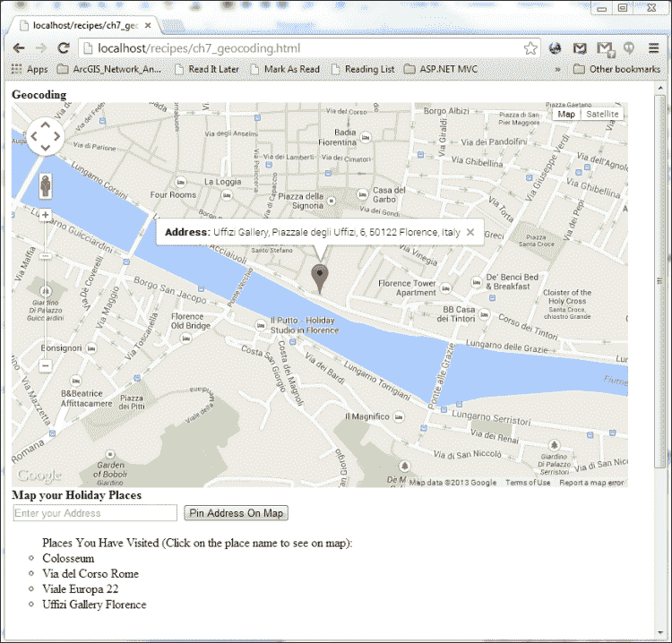
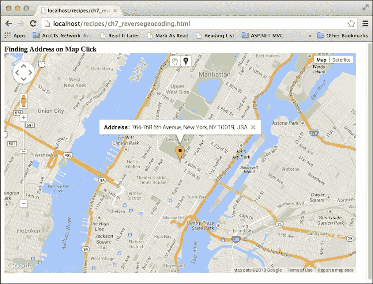
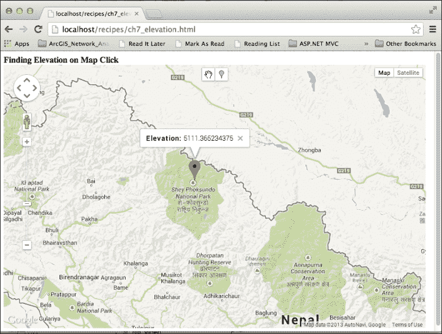
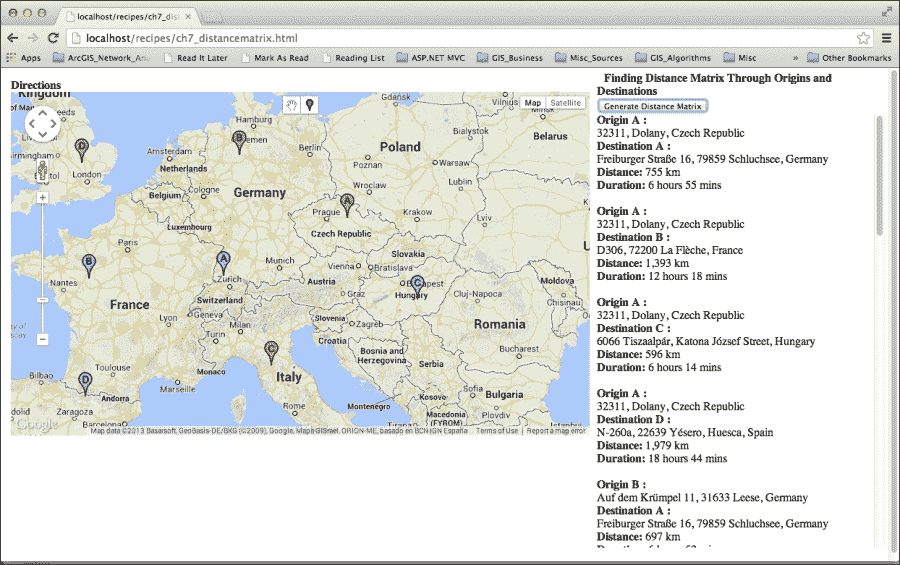
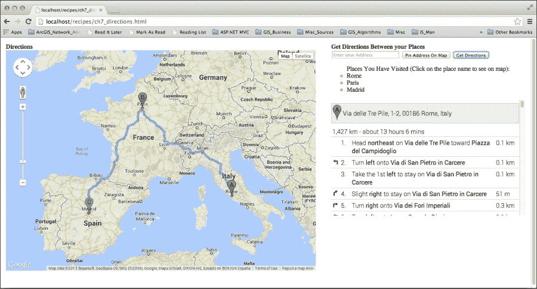
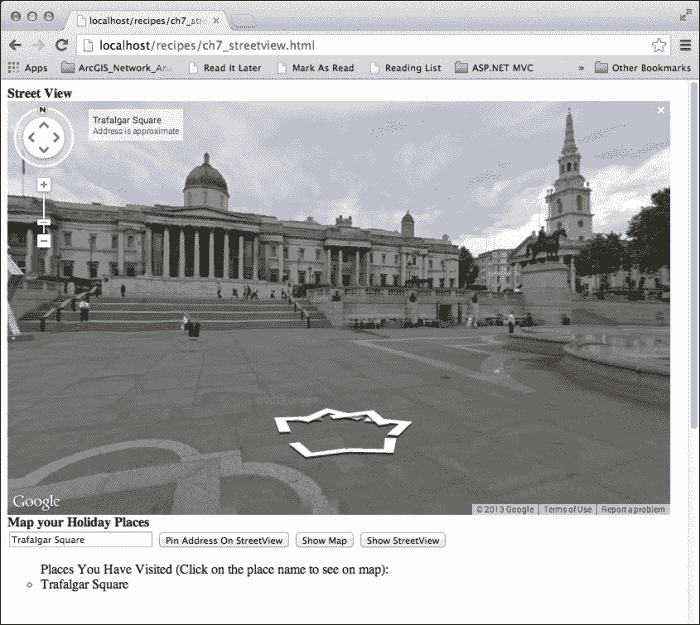

# 第七章。使用服务

在本章中，我们将涵盖：

+   查找地址的坐标

+   通过点击在地图上查找地址

+   通过点击在地图上获取海拔

+   为给定位置创建距离矩阵

+   获取给定位置的路线

+   将街景添加到您的地图中

# 简介

本章重点介绍 Google Maps JavaScript API 提供的各种服务。这些服务增加了显著的功能，在很大程度上将 Google Maps 与其竞争对手区分开来。底层数据的可靠性和质量使得这些服务更加受到重视，因为这允许使用 Google Maps 的应用程序提供额外的功能。

这些服务通常遵循异步模式，其中请求发送到外部服务器，并提供一个回调方法来处理响应。

### 注意

这些服务并非在全世界范围内都可用；存在限制或配额——即使可用——以防止滥用这些服务。在相关食谱中将提供关于这些服务的详细信息。

这些服务的优点在于，作为 Google Maps JavaScript API 的一部分，它们与 API 的类和对象完全兼容。

例如，您可以使用 Google Maps API 路线服务查找两个地址之间的路线。首先，您提供必要的参数进行请求。然后，通过使用您的回调函数，如果一切顺利，您将获得路线。但是，对于时间延迟，您可能需要考虑将路线叠加到基础地图上的方法。幸运的是，API 提供了这样的基础设施，因此只需一行额外的代码，您就可以在基础地图上观察您请求的路线。

本章将详细描述每种服务类型，包括地理编码、路线、海拔、距离矩阵和街景，每个食谱都包含一个相关场景。

# 查找地址的坐标

在地图上定位地址或地点一直是一项繁琐的任务，Google Maps JavaScript API 通过地理编码服务简化了这项任务。地理编码在其最简单的定义中，是将地理坐标与地址信息相关联，无论是仅一个街道名称，详细的建筑编号和邮政编码，还是仅一个地区名称。

通过拥有您各自地址的坐标，您可以在地图应用程序中轻松地将它们叠加。

在本食谱中，您将成功输入您的假日地点和地址，然后在您的应用程序中将它们作为标记映射到基础地图上。

## 准备工作

本食谱将利用在第三章中“向地图添加标记”食谱中引入的与添加矢量图层相关概念，特别是标记。建议您阅读此食谱，以便对矢量图层及其属性有一个整体的理解。

## 如何做到这一点...

您可以通过以下步骤定位您的地址：

1.  创建 HTML 标记，以便您可以输入您的地址并搜索它们：

    ```js
    <input id="addressField" type="text" size="30"  placeholder="Enter your Address" />
    <input type="button" id="listAddressBtn" value="Pin Address On Map" />
    <p id="placesText"></p>
    <ul id="addressList" class="addressList"></ul>
    ```

1.  定义全局`geocoder`对象：

    ```js
    var geocoder;
    ```

1.  在您的`initMap()`函数中初始化`geocoder`对象：

    ```js
    geocoder = new google.maps.Geocoder();
    ```

1.  获取`listAddressBtn`按钮元素并添加一个`click`事件监听器：

    ```js
    var listAddressBtn = document.getElementById('listAdressBtn');
    listAddressBtn.addEventListener('click', function(){
        listAddresses();
    });
    ```

1.  创建一个函数，用于在`addressList`元素上列出地址并发送地理编码请求：

    ```js
    function listAddresses() {
        //get text input handler
        var addressField = document.getElementById('addressField');
        //get addressList <ul> element handle
        var addressList = document.getElementById('addressList');
        if (addressList.children.length === 0) {
            var placesText = document.getElementById('placesText');
            placesText.innerHTML = 'Places You Have Visited (Click on the place name to see on map):';
        }
        //create a list item
        var listItem = document.createElement('li');
        //get the text in the input element and make it a //list item
        listItem.innerHTML = addressField.value;
        listItem.addEventListener('click', function() {
            geocodeAddress (listItem.innerHTML);
        });
        //append it to the <ul> element
        addressList.appendChild(listItem);
        //call the geocoding function
        geocodeAddress(addressField.value);
    }
    ```

1.  创建一个用于地理编码输入地址的函数：

    ```js
    function geocodeAddress(addressText) {
        //real essence, send the geocoding request
        geocoder.geocode( {'address': addressText}, function(results, status) {
            //if the service is working properly...
            if (status == google.maps.GeocoderStatus.OK) {
                //show the first result on map
                pinpointResult(results[0]);
            } else {
                alert('Cannot geocode because: ' + status);
            }
        });
    }
    ```

1.  在地图上放置一个标记，并将其`InfoWindow`对象附加以显示其详细信息：

    ```js
    function pinpointResult(result) {
        var marker = new google.maps.Marker({
            map: map,
            position: result.geometry.location
        });

        map.setCenter(result.geometry.location);
        map.setZoom(16);

        //infowindow stuff
        google.maps.event.addListener(marker, 'click', function() {
            var popupContent = '<b>Address: </b> ' + result.formatted_address;
            popup.setContent(popupContent);
            popup.open(map, this);
        });
    }
    ```

1.  您的地址将如以下截图所示在地图上标记：

## 它是如何工作的...

发起地理编码请求实际上非常简单。首先，您创建一个`Geocoder`对象：

```js
geocoder = new google.maps.Geocoder();
```

然后，您从`geocoder`对象调用`geocode()`方法，向其地址参数提供一个地址、地点或地区名称：

```js
geocoder.geocode( {'address': addressText}, function(results, status) {…});
```

此方法接收地址，将其发送到谷歌服务器进行地理编码，并通过回调函数以`GeocoderResult`对象数组的形式返回结果。

响应以数组形式按最相关匹配的顺序返回。例如，当您搜索`Colosseum`时，第一个`GeocoderResult`对象的`formatted_address`属性是：

```js
Colosseum, Piazza del Colosseo, 1, 00184 Rome, Italy
```

第二个是：

```js
Colosseum, Enschede, The Netherlands
```

您可以迅速理解，古罗马的著名且高度旅游的斗兽场比第二个结果更受欢迎。当然，您可以通过限制地图边界和国家代码来偏置结果（我们将在接下来的章节中详细回顾）。然而，如果没有任何干预，您将通过各种国家和大陆看到高人气地理编码结果位于顶部。

`GeocoderResult`对象具有`geometry`属性，这样您就可以通过在基础地图上叠加标记来查看它。在我们的配方中，`pinpointResult()`函数利用了这一点，其中它将名为`result`的`GeocoderResult`对象作为其唯一参数：

```js
    function pinpointResult(result) {
        var marker = new google.maps.Marker({
            map: map,
            position: result.geometry.location
        });
    ...
    }
```

## 还有更多...

地理编码服务请求和响应有一系列广泛的选择和属性。让我们首先从请求开始。除了是`GeocodeRequest`对象的主要和必需参数的`address`参数（作为`Geocoder`对象的`geocode()`方法的第一个参数提供）之外，还有一个`bounds`属性，您可以使用它来指定返回的地理编码结果，如下面的代码所示：

```js
    geocoder.geocode({
        'address': addressText,
        'bounds': new google.maps.LatLngBounds(
        new google.maps.LatLng(25.952910068468075, -15.93734749374994),
        new google.maps.LatLng(57.607047845370246, 54.37515250625006)
        )
        },
        function(results, status) {...}
    );
```

当您提供`bounds`属性时，例如前面代码中用于覆盖欧洲的属性，然后当您搜索 Sun Street 时，第一个结果是英国。这是因为`bounds`属性偏置了在提供的`LatLngBounds`对象内部存在的地理编码结果。当您删除`bounds`属性时，相同搜索的第一个结果来自美国。

此外，您还可以通过使用`region`参数来偏置结果，其中接受 IANA 语言区域子标签。

### 注意

IANA 语言区域子标签的完整列表可以在[`www.iana.org/assignments/language-subtag-registry/language-subtag-registry`](http://www.iana.org/assignments/language-subtag-registry/language-subtag-registry)找到。

关于`GeocodeRequest`对象的详细信息可以在[`developers.google.com/maps/documentation/javascript/reference#GeocoderRequest`](https://developers.google.com/maps/documentation/javascript/reference#GeocoderRequest)找到。

例如，在以下代码中，将`region`参数设置为`'ve'`（如委内瑞拉所示），并搜索`'Valencia'`，将首先返回委内瑞尔的`'Valencia'`市：

```js
    geocoder.geocode({
        'address': addressText,
        'region':'ve'},
        function(results, status) {...}
    );
```

如果没有`region`参数，将首先返回西班牙的`'Valencia'`市。

将返回的结果及其属性传递给`GeocoderResult`对象，该对象携带一个精度指示器，因为某些地理编码过程涉及插值和匹配，而不是一对一的相等。

结果的值存储在`GeocoderResult`对象的`geometry`属性中，该属性包含`location_type`属性。这些值按照从高到低的精度顺序排列：

+   `google.maps.GeocoderLocationType.ROOFTOP`

+   `google.maps.GeocoderLocationType.RANGE_INTERPOLATED`

+   `google.maps.GeocoderLocationType.GEOMETRIC CENTER`

+   `google.maps.GeocoderLocationType.APPROXIMATE`

在前面的代码中，`ROOFTOP`值表示确切的地址，`RANGE_INTERPOLATED`表示道路的某些部分之间存在插值，`GEOMETRIC_CENTER`表示道路或区域的几何中心，最后`APPROXIMATE`告诉我们返回的结果位置是一个近似值。

例如，当我们搜索“William Village”时，第一个结果的`formatted_address`是：

```js
    "Bremerton, WA, USA"
```

结果的几何形状的`location_type`属性是`APPROXIMATE`。这通常发生在搜索短语与返回结果之间没有直接联系的情况下，正如我们的例子一样。

除了地理编码过程的精度之外，我们还可以通过`GeocoderResult`对象的`types`属性获取该对象类型。`types`属性是一个数组，表示返回结果所属的类别。

例如，对于罗马的斗兽场，`types`属性是：

```js
    ["point_of_interest", "establishment"]
```

而对于罗马的 Via del Corso，它是：

```js
    ["route"]
```

对于佛罗伦萨的乌菲齐美术馆，它是：

```js
    ["museum", "point_of_interest", "establishment"]
```

### 注意

`GeocoderResult`对象的`types`属性的可能值的完整列表可以在[`developers.google.com/maps/documentation/javascript/geocoding #GeocodingAddressTypes`](https://developers.google.com/maps/documentation/javascript/geocoding #GeocodingAddressTypes)找到。

需要注意的是，通过回调函数获取的地理编码请求结果需要另一个参数，这个参数是关于请求状态的。这个参数最显著的可能值包括：

+   `google.maps.GeocoderStatus.OK`

+   `google.maps.GeocoderStatus.ZERO_RESULTS`

+   `google.maps.GeocoderStatus.OVER_QUERY_LIMIT`

+   `google.maps.GeocoderStatus.REQUEST_DENIED`

+   `google.maps.GeocoderStatus.INVALID_REQUEST`

除了`GeocoderStatus.OK`之外的所有值都指向一个问题。在所有这些问题中，`GeocoderStatus.OVER_QUERY_LIMIT`需要特别注意。在本章的介绍中，我们已经提到，所有这些 Google Maps 服务在地理和请求速率方面都受到限制。当你的地理编码服务使用超出限制时，就会触发此状态码。

### 注意

可以在[`developers.google.com/maps/documentation/business/articles/usage_limits#limitexceeded`](https://developers.google.com/maps/documentation/business/articles/usage_limits#limitexceeded)找到关于`OVER_QUERY_LIMIT`状态码的详细解释。

可以在[`developers.google.com/maps/documentation/javascript/geocoding#GeocodingStatusCodes`](https://developers.google.com/maps/documentation/javascript/geocoding#GeocodingStatusCodes)找到`GeocoderStatus`对象可能值的完整列表。

## 参考以下内容

+   第三章中的*在地图上添加标记*配方，*添加矢量图层*

# 通过点击地图查找地址

在前面的配方中，我们手头有地址，我们的目标是找到地图位置；换句话说，地球上的地址坐标。但是，如果我们有确切的坐标并尝试找到与这些确切坐标匹配的地址会发生什么呢？

这个过程被称为逆向地理编码，它是将坐标转换为可读地址的过程。

在本配方中，我们将利用 Google Maps JavaScript API 的逆向地理编码功能。当用户点击地图时，我们将找到用户点击的地址并立即显示给他/她。

## 准备工作

查阅第六章中的“在地图上绘制形状”配方 *Drawing shapes on the map*，这将使你的工作更加轻松，因为该配方需要更详细地了解绘制形状及其背景。

## 如何操作…

下面是允许用户点击地图并找到他/她点击的地方的地址的步骤：

1.  将`geocoder`对象定义为全局变量：

    ```js
    var geocoder;
    ```

1.  将`popup`对象定义为全局变量：

    ```js
    var popup;
    ```

1.  在`initMap()`函数中初始化`geocoder`和`popup`对象：

    ```js
    geocoder = new google.maps.Geocoder();
    popup = new google.maps.InfoWindow();
    ```

1.  在`initMap()`函数内部创建`drawingManager`对象：

    ```js
    var drawingManager = new google.maps.drawing.DrawingManager(
    {
        //initial drawing tool to be enabled, we want to be in //no drawing mode at start
        drawingMode:null,
        //enable the drawingControl to be seen in the UI
        drawingControl:true,
        //select which drawing modes to be seen in the //drawingControl and position the drawingControl itself
        drawingControlOptions: {
            //select a control position in the UI
            position: google.maps.ControlPosition.TOP_CENTER,
            //selected drawing modes to be seen in the control
            drawingModes:[
            google.maps.drawing.OverlayType.MARKER	
            ]
        }
    });
    ```

1.  启用绘图功能：

    ```js
    drawingManager.setMap(map);
    ```

1.  为用户绘制的标记完成添加事件监听器，执行逆向地理编码任务并找到地址：

    ```js
    google.maps.event.addListener(drawingManager, 'markercomplete', function(marker) {
        //get the LatLng object of the marker, it is necessary //for the geocoder
        var markerPosition = marker.getPosition();
        //reverse geocode the LatLng object to return the //addresses
        geocoder.geocode({'latLng': markerPosition}, function(results, status) {
            //if the service is working properly...
            if (status == google.maps.GeocoderStatus.OK) {
                //Array of results will return if everything //is OK
                if (results) {
                    //infowindow stuff
                    showAddressOfResult(results[0],marker);
                }
            }
            //if the service is not working, deal with it
            else {
                alert('Reverse Geocoding failed because: ' + status);
            }
        });
    });
    ```

1.  创建一个函数，用于在标记绘制的`InfoWindow`对象上显示地址：

    ```js
    function showAddressOfResult(result, marker) {
        //set the center of the map the marker position
        map.setCenter(marker.getPosition());
        map.setZoom(13);

        //create the InfoWindow content
        var popupContent = '<b>Address: </b> ' + result.formatted_address;

        //set the InfoWindow content and open it
        popup.setContent(popupContent);
        popup.open(map, marker);
    }
    ```

1.  现在，你可以点击并获取以下截图所示的信息窗口中的地址信息：

## 它是如何工作的...

如果你已经查看本章的“根据地址查找坐标”菜谱，你可能已经意识到我们再次使用了前面展示的相同的`geocoder`对象：

```js
    geocoder = new google.maps.Geocoder();
```

然而，这次我们是以`LatLng`对象的形式提供坐标对，而不是地址文本，用于熟悉的`geocoder`对象的`geocode()`方法：

```js
    geocoder.geocode({'latLng': markerPosition}, function(results, status) {
    ...
    });
```

实际上，`geocode()`方法还有一个我们没有在前一个菜谱中讨论的属性；那就是接受`LatLng`对象的`latlng`属性。

因此，`geocoder`对象的`geocode()`方法可以双向使用，既可以用于地理编码，也可以用于反向地理编码。对于地理编码，我们必须使用`address`属性来填写我们想要获取位置的地址。对于反向地理编码，我们必须使用`latlng`属性来填写我们想要获取地址信息的`LatLng`对象。

我们通过使用标记的`getPosition()`方法来获取用户绘制的标记的`LatLng`对象：

```js
    var markerPosition = marker.getPosition();
```

在我们的回调函数中，我们必须为我们的反向地理编码请求提供，当我们的请求回复时，我们有两个参数会获取它们的值：

```js
    function(results, status) {
        ...
    }
```

第一个参数是一个`GeocoderResult`对象数组，第二个参数是一个`GeocoderStatus`对象数组。

### 注意

你可以在本章的“根据地址查找坐标”菜谱中查看`GeocoderStatus`对象的可用的详细分解，该菜谱在`GeocoderResult`对象中。

在测试服务状态后，如果一切正常，我们可以与我们的`GeocoderResult`对象数组一起工作：

```js
    if (status == google.maps.GeocoderStatus.OK) {
        //Array of results will return if everything //is //OK
        if (results) {
            //infowindow stuff
            showAddressOfResult(results[0], marker);
        }
    }
```

我们选择了第一个对象，因为它是最精确的。例如，对于我们的菜谱中的标记位置，完整的地址信息数组是：

```js
    results[0].formatted_address: "764-768 5th Avenue, New York, NY 10019, USA"
    results[1].formatted_address: "5 Av/West 60 - 59 St, New York, NY 10019, USA"
    results[2].formatted_address: "New York, NY 10153, USA"
    results[3].formatted_address: "5 Av/59 St, New York, NY 10022, USA"
    results[4].formatted_address: "New York, NY 10019, USA"
    results[5].formatted_address: "Midtown, New York, NY, USA"
    results[6].formatted_address: "Manhattan, New York, NY, USA"
    results[7].formatted_address: "New York, NY, USA"
    results[8].formatted_address: "New York, NY, USA"
    ...
    results[10].formatted_address: "New York, USA"
    results[11].formatted_address: "United States"
```

你可以观察到，从数组的开始迭代到结束，我们最终到达了`"United States"`，这是我们反向地理编码请求中最不精确的地址信息。

## 参见

+   本章的“根据地址查找坐标”菜谱

+   第六章“在地图上绘制形状”菜谱

# 通过点击地图获取高程

Google Maps JavaScript API 提供了关于高程数据的信息，相对于海平面返回正值。它还以负值提供关于海底深度的信息。

使用`ElevationService`对象，我们可以获取单个位置以及路径上的高程信息。

在这个菜谱中，我们首先将展示如何从用户选择的单个点获取高程数据，然后我们将使用路径重复相同的场景。

## 准备中

建议快速浏览第六章中的*在地图上绘制形状*配方，因为该配方涵盖了使用 Google Maps JavaScript API 绘制形状的每个细节。

## 如何做到这一点...

如果你遵循给定的步骤，你可以查看你选择的地点的海拔数据：

1.  将`elevator`对象定义为全局变量：

    ```js
    var elevator;
    ```

1.  将`popup`对象定义为全局变量：

    ```js
    var popup;
    ```

1.  在`initMap()`函数内部初始化`elevator`和`popup`对象：

    ```js
    elevator = new google.maps.ElevationService();
    popup = new google.maps.InfoWindow();
    ```

1.  在`initMap()`函数内部创建`drawingManager`对象：

    ```js
    var drawingManager = new google.maps.drawing.DrawingManager(
    {
        //initial drawing tool to be enabled, we want to be in //no drawing mode at start
        drawingMode:null,
        //enable the drawingControl to be seen in the UI
        drawingControl:true,
        //select which drawing modes to be seen in the //drawingControl and position the drawingControl itself
        drawingControlOptions: {
            //select a control position in the UI
            position: google.maps.ControlPosition.TOP_CENTER,
            //selected drawing modes to be seen in the control
            drawingModes: [
            google.maps.drawing.OverlayType.MARKER	
            ]
        }
    });
    ```

1.  启用绘制功能：

    ```js
    drawingManager.setMap(map);
    ```

1.  为用户绘制的标记完成添加事件监听器，使用`elevator`对象发送请求，并找到标记位置的海拔数据：

    ```js
    google.maps.event.addListener(drawingManager, 'markercomplete', function(marker) {
        //get the LatLng object of the marker, it is necessary //for the geocoder
        var markerPosition = marker.getPosition();
        //embed the marker position in an array
        var markerPositions = [markerPosition];
        //send the elevation request and get the results in the //callback function
        elevator.getElevationForLocations({'locations': markerPositions}, function(results, status) {
            //if the service is working properly...
            if (status == google.maps.ElevationStatus.OK) {
                //Array of results will return if everything //is OK
                if (results) {
                    //infowindow stuff
                    showElevationOfResult(results[0], marker);
                }
            }
            //if the service is not working, deal with it
            else {
                alert('Elevation request failed because: ' + status);
            }
        });
    });
    ```

1.  为在标记的`InfoWindow`对象上显示海拔数据创建一个函数：

    ```js
    function showElevationOfResult(result, marker) {
        //set the center of the map the marker position
        map.setCenter(marker.getPosition());
        map.setZoom(13);

        //create the InfoWindow content
        var popupContent = '<b>Elevation: </b> ' + result.elevation;

        //set the InfoWindow content and open it
        popup.setContent(popupContent);
        popup.open(map, marker);
    }
    ```

1.  现在，你将得到你点击的点的海拔，如下面的截图所示：

## 它是如何工作的...

我们使用`ElevationService`对象获取海拔数据：

```js
elevator = new google.maps.ElevationService();
```

`elevator`对象有一个`getElevationForLocations()`方法，它接受一个`LatLng`对象数组，以返回特定`LatLng`对象所代表每个位置的海拔数据。换句话说，如果你在数组中分配了三个`LatLng`对象，你将在回调函数中获得一个包含三个`ElevationResult`对象的数组：

```js
elevator.getElevationForLocations({'locations': markerPositions}, function(results, status) {
...});
```

然而，请注意，当`LatLng`对象的数量嵌入在数组中时，海拔的准确性会降低。因此，如果你想获得高精度，你必须选择只包含单个元素的`LatLng`数组，正如我们案例中所示。

为`getElevationForLocations()`方法的`locations`属性提供了`LatLng`对象数组。然而，我们手头有一个`marker`对象来处理当用户绘制标记时触发的`markercomplete`事件：

```js
    google.maps.event.addListener(drawingManager, 'markercomplete',   function(marker)
    {...});
```

因此，我们将单个标记位置转换为只包含一个元素的数组：

```js
    var markerPosition = marker.getPosition();
    var markerPositions = [markerPosition];
```

在回调函数中，我们获取服务状态以及`ElevationResult`对象数组：

```js
    function(results, status) {
        //if the service is working properly...
        if (status == google.maps.ElevationStatus.OK) {
            //Array of results will return if everything //is OK
            if (results) {
                //infowindow stuff
                showElevationOfResult(results[0],marker);
            }
        }
        //if the service is not working, deal with it
        else {
            alert('Elevation request failed because: ' + status);
        }
    }
```

`status`参数的类型为`ElevationStatus`，其常量与`GeocoderStatus`对象非常相似，如下列所示：

+   `google.maps.ElevationStatus.OK`

+   `google.maps.ElevationStatus.UNKNOWN_ERROR`

+   `google.maps.ElevationStatus.OVER_QUERY_LIMIT`

+   `google.maps.ElevationStatus.REQUEST_DENIED`

+   `google.maps.ElevationStatus.INVALID_REQUEST`

除了`ElevationStatus.OK`之外，所有状态值都指向一个问题。其他值在其名称中都有明确的解释。

### 注意

`ElevationStatus`对象的可能值完整列表和详细信息可以在[`developers.google.com/maps/documentation/javascript/reference# ElevationStatus`](https://developers.google.com/maps/documentation/javascript/reference# ElevationStatus)找到。

`results`参数的类型是`ElevationResult`。`ElevationResult`对象有三个属性，称为`elevation`、`location`和`resolution`。我们在`showElevationOfResult()`函数中使用了`elevation`属性：

```js
    var popupContent = '<b>Elevation: </b> ' + result.elevation;
```

高程数据是地形为正数，海洋底部为负数。

位置属性是`ElevationResult`的`LatLng`对象，而分辨率属性是用于生成/插值此高程数据的样本点之间的距离（以米为单位）。分辨率越高，高程数据越不准确。

## 相关内容

+   第六章中的*在地图上绘制形状*配方

# 为给定位置创建距离矩阵

Google Maps JavaScript API 包含一些有趣且特别有用的属性，其中之一就是距离矩阵服务。使用此服务，您可以计算多个起点和目的地之间的旅行时间和距离。

这特别有用，当您想要对您的旅行节点有一个一对一的报告时，无论是配送业务还是仅夏季节日。此服务为您提供了您选择的旅行方式（驾驶、步行和骑行）的旅行时间和距离；您可以看到针对每个起点和终点的结果。

值得注意的是，此服务的输出不能映射到基础地图上；您可以获取关于旅行时间和持续时间的详细信息，但对于路线，您必须使用本章后面详细解释的路线服务*获取给定位置的路线*。

在本配方中，我们将定位起点和目的地，并获取我们位置的距离矩阵结果。

## 准备工作

此配方将使用绘图库；因此，建议您阅读第六章中的*在地图上绘制形状*配方，*Google Maps JavaScript 库*，并了解相关主题。

## 如何操作…

您可以绘制起点和终点，然后通过点击按钮请求距离矩阵。您可以通过遵循以下步骤了解如何操作：

1.  添加 HTML `input`元素，类型为`button`，以启动距离矩阵请求：

    ```js
    <input type="button" id ="generateDistanceMatrix" value="Generate Distance Matrix" />
    ```

1.  定义全局变量：

    ```js
    //define an array that includes all origin LatLng objects
    var originLatLngs;
    //define an array that includes all destination LatLng objects
    var destinationLatLngs;
    //define a global DistanceMatrixService object
    var distanceMatrixService;
    //define a global markerCount variable
    var markerCount;
    //define a global matrixResultDiv variable
    var matrixResultDiv;
    ```

1.  在`initMap()`函数中初始化全局变量：

    ```js
    //initialize originLatLngs array
    originLatLngs = [];
    //initialize destinationLatLngs array
    destinationLatLngs = [];
    //initialize markerCount - the count of markers to be drawn
    markerCount = 0;
    //assign matrixResultDiv to the specific div element
    matrixResultDiv = document.getElementById('matrixResultDiv');
    ```

1.  获取`button`元素并添加一个`click`事件处理器：

    ```js
    var generateDistanceMatrixBtn = document.getElementById('generateDistanceMatrix');
    generateDistanceMatrixBtn.addEventListener('click', function(){
        makeDistanceMatrixRequest();
    });
    ```

1.  在`initMap()`函数中初始化`distanceMatrixService`对象：

    ```js
    distanceMatrixService = new google.maps.DistanceMatrixService();
    ```

1.  在`initMap()`函数内创建`drawingManager`对象：

    ```js
    var drawingManager = new google.maps.drawing.DrawingManager(
    {
        //initial drawing tool to be enabled, we want to be in //no drawing mode at start
        drawingMode: null,
        //enable the drawingControl to be seen in the UI
        drawingControl: true,
        //select which drawing modes to be seen in the //drawingControl and position the drawingControl itself
        drawingControlOptions: {
            //select a control position in the UI
            position: google.maps.ControlPosition.TOP_CENTER,
            //selected drawing modes to be seen in the control
            drawingModes: [
            google.maps.drawing.OverlayType.MARKER
            ]
        }
    });
    ```

1.  启用绘制功能：

    ```js
    drawingManager.setMap(map);
    ```

1.  为用户绘制的标记完成添加事件监听器，根据标记指向的位置设置标记图标，是起点还是目的地，并限制标记的总数：

    ```js
    google.maps.event.addListener(drawingManager, 'markercomplete', function(marker) {
        //count the number of markers drawn
        markerCount++;

        //limit the number of markers to 10
        if (markerCount > 10) {
            alert('No more origins or destinations allowed');
            drawingManager.setMap(null);
            marker.setMap(null);
            return;
        }

        //distinguish the markers, make the blue ones be //destinations and red ones origins
        if (markerCount % 2 === 0) {
            destinationLatLngs.push(marker.getPosition());
            marker.setIcon('icons/b' + destinationLatLngs.length + '.png');
        }
        else {
            originLatLngs.push(marker.getPosition());
            marker.setIcon('icons/r' + originLatLngs.length + '.png');
        }
    });
    ```

1.  创建一个函数，通过使用 `getDistanceMatrix()` 方法为 `distanceMatrixService` 对象准备请求属性并发送请求：

    ```js
    function makeDistanceMatrixRequest() {
        distanceMatrixService.getDistanceMatrix(
            {
                origins: originLatLngs,
                destinations: destinationLatLngs,
                travelMode: google.maps.TravelMode.DRIVING,
            },
            getDistanceMatrixResult
        );
    }
    ```

1.  为 `distanceMatrixService` 对象的 `getDistanceMatrix()` 方法调用创建一个名为 `getDistanceMatrixResult` 的回调函数：

    ```js
    function getDistanceMatrixResult(result, status) {
        //clear the div contents where matrix results will be //written
        matrixResultDiv.innerHTML = '';

        //if everything is OK
        if (status == google.maps.DistanceMatrixStatus.OK) {
            //get the array of originAddresses
            var originAddresses = result.originAddresses;
            //get the array of destinationAddresses
            var destinationAddresses = result.destinationAddresses;

            //there are two loops, the outer is for origins, //the inner will be for destinations,
            //their intersection will be the element object //itself
            for (var i = 0, l= originAddresses.length; i < l; i++) {
                //get the elements array
                var elements = result.rows[i].elements;
                for (var j = 0, m= elements.length;  j < m; j++) {
                    var originAddress = originAddresses[i];
                    var destinationAddress = destinationAddresses[j];
                    //get the element object
                    var element = elements[j];

                    //get distance and duration properties for //the element object
                    var distance =  element.distance.text;
                    var duration = element.duration.text;
                    //write the results to the div for each //element object

                    writeDistanceMatrixResultOnDiv(originAddress, destinationAddress, distance, duration, i, j);
                }
            }
        }
    else {
            alert('Cannot find distance matrix because: ' + status);
        }
    }
    ```

1.  创建一个函数，由前面列出的回调函数调用，将结果写入 `matrixResultDiv` 对象：

    ```js
    function writeDistanceMatrixResultOnDiv(originAddress, destinationAddress, distance, duration, originAddressCount, destinationAddressCount) {
        //get the existing content
        var existingContent = matrixResultDiv.innerHTML;

        var newContent;
        //write the Origin Address and Destination Address //together with travel distance and duration
        newContent = '<b>Origin ' + letterForCount(originAddressCount) + ' :</b><br />';
        newContent += originAddress + '<br />';
        newContent += '<b>Destination ' + letterForCount(destinationAddressCount) + ' :</b><br />';
        newContent += destinationAddress + '<br />';
        newContent += '<b>Distance: </b> ' + distance + '<br />';
        newContent += '<b>Duration: </b> ' + duration + '<br />';
        newContent += '<br />';

        //add the newContent to the existingContent of the //matrixResultDiv
        matrixResultDiv.innerHTML = existingContent + newContent;
    }
    ```

1.  创建一个将计数转换为字母的函数；目的是将计数与标记图标匹配：

    ```js
    function letterForCount(count)
    {
        switch (count)
        {
            case 0:
            return 'A';
            case 1:
            return 'B';
            case 2:
            return 'C';
            case 3:
            return 'D';
            case 4:
            return 'E';
            default:
            return null;
        }
    }
    ```

1.  你现在将拥有你选择点之间的距离矩阵，如下截图所示：

## 工作原理...

在我们的菜谱中，我们允许用户将标记指向他们选择的地点下方。然而，我们遵循的方案是，第一个标记将指向第一个起点，第二个将指向第一个目的地，第三个将指向第二个起点，第四个将指向第二个目的地位置，依此类推。此外，我们限制绘制的标记数量为 10 个。

这就是绘制标记的过程。然后，我们将准备要提供给 `distanceMatrixService` 对象的起点和目的地位置。对象初始化如下代码所示：

```js
    distanceMatrixService = new google.maps.DistanceMatrixService();
```

用户按下输入按钮元素，我们通过 `getDistanceMatrix()` 方法触发请求：

```js
    function makeDistanceMatrixRequest() {
        distanceMatrixService.getDistanceMatrix(
        {
            origins: originLatLngs,
            destinations: destinationLatLngs,
            travelMode: google.maps.TravelMode.DRIVING,
        },
        getDistanceMatrixResult
    );
}
```

在这里，我们将 `originLatLngs` 传递给 `origins` 属性，其中 `originLatLngs` 是从用户绘制的标记中收集的 `LatLng` 对象数组——在 `drawingManager` 对象的 `markercomplete` 事件监听器中的奇数标记：

```js
    if (markerCount % 2 === 0) {
        destinationLatLngs.push(marker.getPosition());

    }
    else {
        originLatLngs.push(marker.getPosition());

  }
```

`destinations` 属性在 `destimationLatLngs` 数组中按照相同的逻辑设置。

作为快速提醒，`destinations` 和 `origins` 属性可以接受地址字符串数组以及 `LatLng` 对象数组，就像在我们的例子中一样。

我们在请求中使用的第三个属性是 `travelMode` 属性，它用于设置旅行模式。除了 `TravelMode.DRIVING` 之外，此属性还有其他选项：

+   `TravelMode.WALKING`

+   `TravelMode.BICYCLING`

除了携带 `origins`、`destinations` 和 `travelMode` 属性的 `DistanceMatrixRequest` 对象外，我们还为 `getDistanceMatrix()` 方法调用提供了一个名为 `getDistanceMatrixResult` 的回调函数。`getDistanceMatrixResult` 函数有两个参数：一个是服务的响应，另一个是服务状态。如下代码所示：

```js
    function getDistanceMatrixResult(result, status)
    {...}
```

在这个函数中，首先我们检查服务是否正常工作：

```js
    if (status == google.maps.DistanceMatrixStatus.OK)
    {...}
```

### 注意

`DistanceMatrixStatus`对象的完整列表和可能值的详细信息可以在[`developers.google.com/maps/documentation/javascript/reference# DistanceMatrixStatus`](https://developers.google.com/maps/documentation/javascript/reference# DistanceMatrixStatus)找到。

然后，我们处理类型为`DistanceMatrixResponse`对象的结果，该对象携带字符串数组`originAddresses`和`destinationAddresses`以及名为`rows`的`DistanceMatrixResponseRow`数组。首先，我们获取`originAddresses`和`destinationAddresses`数组：

```js
    var originAddresses = result.originAddresses;
    var destinationAddresses = result.destinationAddresses;
```

`rows`数组由另一个名为`elements`的数组组成，其中其子元素是`DistanceMatrixResponseElement`类型。因此，我们必须有两个循环来遍历`DistanceMatrixResponseElement`对象：

```js
    for (var i = 0, l=originAddresses.length; i < l; i++) {
        //get the elements array
        var elements = result.rows[i].elements;
        for (var j = 0, m=elements.length;j < m; j++) {
            ...
            var element = elements[j];
                    ...
        }
    }
```

`DistanceMatrixResponseElement` 对象有两个突出的属性，我们在我们的配方中使用了它们：一个是距离，另一个是持续时间。它们在以下代码中进行了详细说明：

```js
    var distance =  element.distance.text;
    var duration = element.duration.text;
```

通过使用这些属性，我们达到了相应起始地址和目标地址的特定距离和持续时间属性。

## 参见

+   在第六章的*在地图上绘制形状*配方中，*Google Maps JavaScript 库*中

# 为给定位置获取路线

在两个或更多位置之间拥有路线图一直是用户、驾驶员、游客等人的最爱。对于驾驶、步行或任何其他交通方式，导航产品的需求通过这些产品的销售来衡量。

一个好的路线服务需要包含综合道路数据，并填充多个属性，如交通流向、转弯限制、桥梁和地下隧道。希望 Google Maps 在后台有这些数据；因此，对于 Google 来说，在 Google Maps 中包含此功能是非常自然的。

在 Google Maps 中，路线可能是最常用的功能之一。它也包含在 Google Maps JavaScript API 中，为开发者提供了在所选位置之间以广泛选项生成路线的编程能力。

在这个配方中，首先我们将让用户输入一个地址或任何地点的位置，使用 Geocoder 服务将其标记出来，然后按照它们进入的顺序提供它们之间的路线。

## 准备工作

本配方将使用与本章开头*为地址查找坐标*配方中引入的 Geocoder 服务相关的概念。强烈建议您阅读此配方，以便对 Geocoder 及其用法有一个全面的了解。

## 如何做到这一点...

您可以通过执行以下步骤输入您的地址并获取它们之间的路线：

1.  插入一个`ContainerDiv` HTML 元素，该元素将被放置在地图的`div`元素的右侧：

    ```js
    <div id="DirectionsContainerDiv">
        <div id="PlacesContainerDiv">
            <b>Get Directions Between your Places</b></br>
            <input id="addressField" type="text" size="30"  placeholder="Enter your Address" />
            <input type="button" id ="pinAddressOnMapBtn" value="Pin Address On Map" onclick="listAddresses()" />
            <input type="button" id = "getDirectionsBtn" disabled value="Get Directions" onclick="getDirections()" />
            <p id="placesText"></p>
            <ul id="addressList" class="addressList">
            </ul>
        </div>
        <div id="DirectionsListContainerDiv">
            <div id="DirectionsListDiv">
            </div>
        </div>
    </div>
    ```

1.  定义全局变量：

    ```js
    //define global marker popup variable
    var popup;
    //define global geocoder object
    var geocoder;
    //define global markers array
    var markers;
    //define global DirectionsService object
    var directionsService;
    //define global DirectionsRenderer object
    var directionsRenderer;
    ```

1.  在`initMap()`函数中初始化全局变量：

    ```js
    //initialize geocoder object
    geocoder = new google.maps.Geocoder();
    //initialize markers array
    markers = [];
    //initialize directionsService object
    directionsService = new google.maps.DirectionsService();
    //initialize directionsRenderer object
    directionsRenderer = new google.maps.DirectionsRenderer();
    ```

1.  给出`directionsRenderer`的指令，以便它在地图上绘制路线，并在地图的右侧列出路线：

    ```js
    //directionsRenderer will draw the directions on current //map
    directionsRenderer.setMap(map);
    //directionsRenderer will list the textual description of //the directions
    //on directionsDiv HTML element
    directionsRenderer.setPanel(document.getElementById('DirectionsListDiv'));
    ```

1.  创建一个函数，用于列出用户输入的地址并调用执行地理编码的函数：

    ```js
    function listAddresses() {
        //get text input handler
        var addressField = document.getElementById('addressField');
        //get addressList <ul> element handle
        var addressList = document.getElementById('addressList');
        if (addressList.children.length == 0) {
            var placesText = document.getElementById('placesText');
            placesText.innerHTML = 'Places You Have Visited (Click on the place name to see on map):';
        }
        //create a list item
        var listItem = document.createElement('li');
        //get the text in the input element and make it a list //item
        listItem.innerHTML = addressField.value;
        listItem.addEventListener('click', function() {
            pinAddressOnMap(listItem.innerHTML);
        });
        //append it to the <ul> element
        addressList.appendChild(listItem);
        //call the geocoding function
        pinAddressOnMap(addressField.value);
        if (addressList.children.length > 1) {
            //get getDirectionsBtn button handler
            var getDirectionsBtn = document.getElementById('getDirectionsBtn');
            //enable the getDirectionsBtn
            getDirectionsBtn.disabled = false;
        }
        addressField.value = '';
    }
    ```

1.  创建一个执行实际地理编码任务的函数：

    ```js
    function pinAddressOnMap(addressText) {
        //real essence, send the geocoding request
        geocoder.geocode({'address': addressText}, function(results, status) {
            //if the service is working properly...
            if (status == google.maps.GeocoderStatus.OK) {
                //show the first result on map
                pinpointResult(results[0]);
            } else {
                alert('Cannot geocode because: ' + status);
            }
        });
    }
    ```

1.  创建一个函数，用于放置用户输入地址信息的地理编码结果标记，并将`InfoWindow`对象附加到其上以显示其详细信息：

    ```js
    function pinpointResult(result) {
        var marker = new google.maps.Marker({
            map: map,
            position: result.geometry.location,
            zIndex: -10
        });

        map.setCenter(result.geometry.location);
        map.setZoom(16);

        //infowindow stuff
        google.maps.event.addListener(marker, 'click', function() {
            var popupContent = '<b>Address: </b> ' + result.formatted_address;
            popup.setContent(popupContent);
            popup.open(map, this);
        });
        markers.push(marker);
    }
    ```

1.  最后，可以通过使用`getDirectionsBtn`按钮处理程序来调用实际路线。创建一个函数，用于向`directionsService`对象发送请求，确保结果在地图上绘制并列出：

    ```js
    function getDirections() {
        //define an array that will hold all the waypoints
        var waypnts = [];
        //define a directionsRequest object
        var directionRequest;

        //if there are stops other than the origin and the //final destination
        if (markers.length > 2) {
            for (i=1;i<=markers.length-2;i++) {
                //add them to the waypnts array
                waypnts.push({
                    location: markers[i].getPosition(),
                    stopover: true
                });
            }

            //prepare the directionsRequest by including //the waypoints property
            directionRequest = {
               origin:markers[0].getPosition(),
               destination: markers[markers.length-1].getPosition(),
              waypoints: waypnts,
              travelMode: google.maps.TravelMode.DRIVING
            };
        }
        else {
            //this time, do not include the waypoints property as //there are no waypoints
            directionRequest = {
                origin:markers[0].getPosition(),
                destination:markers[markers.length-1].getPosition(),
                travelMode: google.maps.TravelMode.DRIVING
            };
        }

        //send the request to the directionsService
        directionsService.route(directionRequest, function(result, status) {
            if (status == google.maps.DirectionsStatus.OK) {
                directionsRenderer.setDirections(result);
            }
            else
            {
                alert('Cannot find directions because: ' + status);
            }
        });
    }
    ```

1.  现在，您将看到您选择点之间的路线，如下面的截图所示：

## 它是如何工作的...

在这个菜谱中，我们同时使用了`GeocoderService`和`DirectionsService`。然而，为了避免冗余（强烈建议阅读本章的*查找地址坐标*菜谱），我们将主要关注`DirectionsService`，准备请求属性，发送和获取绘制到地图上的结果，以及它的逐步文本描述。

首先，我们正在等待用户输入要地理编码并在地图上显示的地址。这些是我们将生成路线的地点。我们正在收集用户地理编码请求的结果标记，以便我们可以使用它们来生成路线：

```js
    function pinpointResult(result) {
        ...
        markers.push(marker);
    }
```

一旦地理编码地址的数量超过 1，标有**获取路线**的按钮就会启用，以便用户可以请求在他们的地理编码地址之间获取路线：

```js
    function listAddresses()
    {
        ...
        if (addressList.children.length > 1) {
            //get getDirectionsBtn button handler
            var getDirectionsBtn = document.getElementById('getDirectionsBtn');
            //enable the getDirectionsBtn
            getDirectionsBtn.disabled = false;
        }
        ...
    }
```

在此之后，只要我们准备好了基础设施，就可以生成路线，所以使用以下代码：

```js
    directionsService = new google.maps.DirectionsService();
    directionsRenderer = new google.maps.DirectionsRenderer();
```

`DirectionsService`对象负责将`DirectionsRequest`对象发送到谷歌的服务器，而`DirectionsRenderer`对象，正如其名称所暗示的，将`DirectionsResult`对象渲染到地图上及其文本描述。

对于`DirectionsRequest`来说，起点和终点是逻辑上的必需项；然而，在起点和终点之间可能有途经点。如果用户地理编码了两个地址并点击了**获取路线**按钮，就没有途经点的位置，第一个地址成为起点，而第二个地址成为终点。

如果地理编码地址列表中有超过两个地址，第一个将是起点，最后一个将再次是终点。此外，在地址之间将存在途经点。我们正在考虑这些因素来准备`DirectionsRequest`参数，如下面的代码所示：

```js
function getDirections() {
    ...
    //if there are stops other than the origin and the //final destination
    if (markers.length > 2)
    {
        for (var i=1, markers.length;i<=l-2;i++)
        {
            //add them to the waypnts array
            waypnts.push({
                location: markers[i].getPosition(),
                stopover: true
            });
        }

        //prepare the directionsRequest by including //the waypoints property
        directionRequest = {
            origin:markers[0].getPosition(),
            destination:markers[markers.length-1].getPosition(),
            waypoints: waypnts,
            travelMode: google.maps.TravelMode.DRIVING
        };
    }
    else
    {
        //this time, do not include the waypoints property as //there are no waypoints
        directionRequest = {
            origin:markers[0].getPosition(),
            destination:markers[markers.length-1].getPosition(),
            travelMode: google.maps.TravelMode.DRIVING
        };
    }
    ...
}
```

您可能已经意识到，我们为 `directionsRequest` 对象的 `origin` 和 `destination` 属性提供了 `LatLng` 对象。这并不一定非得如此：您也可以为 `origin` 和 `destination` 属性，以及我们添加到 `waypnts` 数组中的 `DirectionsWaypoint` 对象的 `location` 属性提供字符串形式的地址。此外，`DirectionsWaypoint` 对象还有一个 `stopover` 属性。它指定了航点实际上是一个停靠点，并分割了路线。`DirectionsRequest` 对象的另一个属性是 `travelMode`，我们选择了 `DRIVING`。

### 注意

`TravelMode` 对象可能值的完整列表和详细信息可以在[`developers.google.com/maps/documentation/javascript/reference#TravelMode`](https://developers.google.com/maps/documentation/javascript/reference#TravelMode)找到。

我们包含了一些大多数情况下都需要用到的属性；然而，`DirectionsRequest` 对象还有更多。

### 注意

`DirectionsRequest` 对象属性的完整列表可以在[`developers.google.com/maps/documentation/javascript/reference#DirectionsRequest`](https://developers.google.com/maps/documentation/javascript/reference#DirectionsRequest)找到。

在准备好我们的 `directionsRequest` 对象后，我们可以通过 `directionsService` 对象的 `route()` 方法发送请求：

```js
    function getDirections() {
        ...
        //send the request to the directionsService
        directionsService.route(directionRequest, function(result, status) {
            if (status == google.maps.DirectionsStatus.OK) {
                directionsRenderer.setDirections(result);
            }
            else
            {
                alert('Cannot find directions because: ' + status);
            }
        });
    }
```

`route()` 方法接受两个参数：一个是 `DirectionsRequest` 对象，另一个是返回 `DirectionsResult` 和 `DirectionsStatus` 对象的回调函数。

我们使用 `status` 对象测试一切是否按计划进行，该对象是 `DirectionsStatus` 类型。

### 注意

`DirectionsStatus` 对象的常量完整列表可以在[`developers.google.com/maps/documentation/javascript/reference#DirectionsStatus`](https://developers.google.com/maps/documentation/javascript/reference#DirectionsStatus)找到。

然后，我们使用旧的 `directionsRenderer` 对象将结果映射到 `div` 元素上，并添加文本描述：

```js
    directionsRenderer.setDirections(result);
```

但是，`directionsRenderer` 对象是如何知道在哪里映射结果，或者写入哪个 `div` 元素上的？希望我们已经在 `initMap()` 函数中提前向 `DirectionsRenderer` 对象提供了指令：

```js
    directionsRenderer.setMap(map);
    directionsRenderer.setPanel(document.getElementById('DirectionsListDiv'));
```

`DirectionsRenderer` 对象的 `setMap()` 方法将 `DirectionsResult` 对象映射到选定的地图对象。同样，`setPanel()` 方法用于选择一个 HTML `div` 元素，以便在它上面写入逐步说明。这样我们就可以在我们的地图实例中同时显示我们的路线。地图立即放大以显示整个路线，我们可以借助带有字母的额外标记来查看我们的行程顺序。

## 参见

+   本章中关于*查找地址坐标*的配方

# 将街景添加到您的地图中

Google Maps 已经拥有高质量的地图数据，并且持续更新，同时还有最新的卫星图像。尽管这些已经足够让 Google Maps 变得如此受欢迎和成功，但还有一种观点引起了极大的兴趣——街景。

街景是该服务覆盖的道路的 360 度全景视图。

### 注意

可以在[`maps.google.com/intl/ALL/maps/about/behind-the-scenes/streetview/`](http://maps.google.com/intl/ALL/maps/about/behind-the-scenes/streetview/)找到提供街景的国家和城市的完整列表。

在这个配方中，我们将介绍如何向当前视图添加街景全景，在地图视图和街景之间切换，并设置全景属性。

## 准备工作

在这个配方中，我们将利用本章中“*寻找地址坐标配方*”中介绍的与地理编码服务相关的概念。强烈建议阅读这个配方，以便对 Geocoder 及其用法有一个大致的了解。

## 如何操作…

以下步骤将使您的地理编码地址在街景中可见：

1.  首先，使用 HTML 标记：

    ```js
    <div id="addressDiv">
        <b>Map your Holiday Places</b><br />
        <input id="addressField" type="text" size="30"placeholder="Enter your Address" />
        <input type="button" id="pinAddress" value="Pin Address On Map" onclick="listAddresses()">
        <input type="button" value="Show Map" onclick="showMap()">
        <input type="button" value="Show StreetView" onclick="showStreetView()">
        <p id="placesText"></p>
        <ul id="addressList" class="addressList">
        </ul>
    </div>
    ```

1.  定义全局对象：

    ```js
    var geocoder;
    var streetView;
    ```

1.  在 `initMap()` 函数中初始化全局对象：

    ```js
    geocoder = new google.maps.Geocoder();
    //initialize streetView object of type StreetViewPanorama
    streetView = map.getStreetView();
    ```

1.  创建一个用于在 `addressList` 元素上列出地址并调用地理编码函数的函数：

    ```js
    function listAddresses() {
        //get text input handler
        var addressField = document.getElementById('addressField');
        //get addressList <ul> element handle
        var addressList = document.getElementById('addressList');
        if (addressList.children.length == 0) {
            var placesText = document.getElementById('placesText');
            placesText.innerHTML = 'Places You Have Visited (Click on the place name to see on map):';
        }
        //create a list item
        var listItem = document.createElement('li');
        //get the text in the input element and make it// a list item
        listItem.innerHTML = addressField.value;
        listItem.addEventListener('click', function() {
            pinAddressOnMapOrStreetView(listItem.innerHTML);
        });
        //append it to the <ul> element
        addressList.appendChild(listItem);
        //call the geocoding function
        pinAddressOnMapOrStreetView(addressField.value);
    }
    ```

1.  创建一个用于地理编码地址的函数：

    ```js
    function pinAddressOnMapOrStreetView(addressText) {
        //send the geocoding request
        geocoder.geocode({'address': addressText}, function(results, status) {
            //if the service is working properly...
            if (status == google.maps.GeocoderStatus.OK) {
                //show the first result on map, either on
                showAddressMarkerOnMapOrStreetView(results[0]);
                if (streetView.getVisible())
                {
                    //set the streetView properties, its //location and "Point Of View"
                    setStreetViewOptions(results[0].geometry.location);
                }
            } else {
                alert('Cannot geocode because: ' + status);
            }
        });
    }
    ```

1.  创建一个用于在地图上放置标记的函数，用于地理编码的地址：

    ```js
    function showAddressMarkerOnMapOrStreetView(result) {
        var marker = new google.maps.Marker({
            map:map,
            position: result.geometry.location
        });
        map.setCenter(result.geometry.location);
        map.setZoom(16);
    }
    ```

1.  创建一个用于设置街景全景属性的函数：

    ```js
    function setStreetViewOptions(location)
    {
        //set the location of the streetView object
        streetView.setPosition(location);
        //set the "Point Of View" of streetView object
        streetView.setPov({
            heading: 0,
            pitch: 10
        });
    }
    ```

1.  创建一个用于显示熟悉地图视图的函数，该函数通过带有“**显示地图**”标签的 HTML 点击按钮调用：

    ```js
    function showMap()
    {
        var pinAddressBtn = document.getElementById('pinAddress');
        pinAddressBtn.value = 'Pin Address On Map';
        streetView.setVisible(false);
    }
    ```

1.  创建一个用于显示以地图中心位置为位置的街景全景的函数，该函数通过带有“**显示街景**”标签的 HTML 点击按钮调用：

    ```js
    function showStreetView() {
        var pinAddressBtn = document.getElementById('pinAddress');
        pinAddressBtn.value = 'Pin Address On StreetView';
        setStreetViewOptions(map.getCenter());
        streetView.setVisible(true);
    }
    ```

1.  现在，您将拥有带有街景的地理编码地址，如下面的截图所示：

## 它是如何工作的...

在我们的配方中，我们的目标是执行地理编码地址的普通任务，同时在同一地图的 `div` 元素中提供 Google Maps JavaScript API 的街景功能。为此，我们需要可用的 `StreetViewPanorama` 对象：

```js
    streetView = map.getStreetView();
```

此对象使我们能够在我们的地图 `div` 元素内或在我们自己的单独 `div` 元素内显示街景。

### 注意

`StreetViewPanorama` 类的属性和方法完整描述可以在[`developers.google.com/maps/documentation/javascript/reference#StreetViewPanorama`](https://developers.google.com/maps/documentation/javascript/reference#StreetViewPanorama)找到。

然后，当点击带有“**显示街景**”标签的按钮时，我们可以显示街景，提供 `map` 对象的中心位置作为 `LatLng` 对象：

```js
    setStreetViewOptions(map.getCenter());
```

然后，我们通过指定位置和设置 `streetView 对象` 的视角来设置 `StreetViewPanorama` 对象的属性：

```js
    function setStreetViewOptions(location) {
        //set the location of the streetView object
        streetView.setPosition(location);
        //set the "Point Of View" of streetView object
        streetView.setPov({
            heading: 0,
            pitch: 10
        });
    }
```

`setPosition()` 方法接受 `LatLng` 对象作为其参数，我们提供地图中心或地理编码地址的位置。通过使用 `setPov()` 方法，我们安排了街景的相机视角。要有一个相机视角，对象必须对准真实北方和街景的起点——通常是街道上的车辆。

`StreetViewPov` 对象的 `heading` 属性是相对于真实北方的角，其中 0 度是真实北方，90 度是东方，180 度是南方，270 度是西方。在我们的配方中，我们将 `heading` 属性设置为 0 度。

`pitch` 属性是相对于街景车辆的角。这意味着 90 度是完全向上，观看天空或云朵，而-90 度通常是完全向下，观看道路地面。
