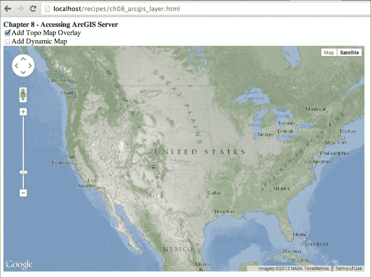

# 第八章.通过高级教程精通 Google Maps JavaScript API

在本章中，我们将介绍以下内容：

+   将 WMS 图层添加到地图中

+   将 Fusion Tables 图层添加到地图中

+   将 CartoDB 图层添加到地图中

+   使用 Google Maps JavaScript API 访问 ArcGIS Server

+   使用 Google Maps JavaScript API 访问 GeoServer

# 简介

Google Maps JavaScript API 可能看起来像是一个仅显示基本地理相关功能的简单库，但实际上有很多功能可以探索。Google Maps JavaScript API 为开发者提供了许多基础类，用于构建针对不同情况的复杂解决方案，特别是对于**地理信息系统**（GIS）。

Google Maps JavaScript API 与 GIS 服务和工具具有很大的潜力。大多数 GIS 解决方案都需要基础地图和服务来支持工具本身，而 Google Maps JavaScript API 凭借其基础地图和服务是最佳解决方案。

有不同的 GIS 解决方案，从专有软件和服务到开源解决方案，如 Google Fusion Tables、CartoDB、ArcGIS Server 或 GeoServer。在本章中，我们将将这些服务器或服务与 Google Maps JavaScript API 集成。由于篇幅限制，省略了一些 GIS 服务创建过程。如果您需要更多信息，请查阅 Packt Publishing 的其他书籍，深入了解细节。

# 将 WMS 图层添加到地图中

**Web Map Service**（WMS）是**开放地理空间联盟**（OGC）的一个标准，用于通过互联网发布由地图服务器使用来自各种地理空间源（如 shapefiles 或地理空间数据库）生成的地理参照地图图像。WMS 服务中使用了各种版本，但最常用的版本是 1.1.1 或 1.3.0。WMS 有两个必需的请求类型：`GetCapabilities`和`GetMap`。

本教程展示了如何通过扩展`google.maps.OverlayView`类将 WMS 图层添加到 Google Maps JavaScript API 中。

## 准备工作

到目前为止，您应该已经知道如何创建地图，所以本教程中只解释了额外的代码行。

您可以在`Chapter 8/ch08_wms_map.html`中找到源代码。

## 如何操作…

如果您按照以下步骤操作，将 WMS 图层添加到地图上相当简单：

1.  首先，创建一个`wms.js`文件，稍后将其包含在 HTML 中。此 JavaScript 文件包含一个`WMSUntiled`类，编写方式如下：

    ```js
    function WMSUntiled (map, wmsUntiledOptions) {
      this.map_ = map;
      this.options = wmsUntiledOptions;
      this.div_ = null;
      this.image_ = null;
      this.setMap(map);
    }
    ```

1.  然后，通过继承`google.maps.OverlayView`类扩展我们的基类：

    ```js
    WMSUntiled.prototype = new google.maps.OverlayView();
    ```

1.  下一步是实现`OverlayView`类的三种方法。

    ```js
    WMSUntiled.prototype.draw = function() {
      var overlayProjection = this.getProjection();
      var sw = overlayProjection.fromLatLngToDivPixel (this.map_.getBounds ().getSouthWest());
      var ne = overlayProjection.fromLatLngToDivPixel (this.map_.getBounds().getNorthEast());
      var div = this.div_;
      if (this.image_ != null)
        div.removeChild(this.image_);

      // Create an IMG element and attach it to the DIV.
      var img = document.createElement('img');
      img.src = this.prepareWMSUrl();
      img.style.width = '100%';
      img.style.height = '100%';
      img.style.position = 'absolute';
      img.style.opacity = 0.6;
      this.image_ = img;
      div.appendChild(this.image_);

      div.style.left = sw.x + 'px';
      div.style.top = ne.y + 'px';
      div.style.width = (ne.x - sw.x) + 'px';
      div.style.height = (sw.y - ne.y) + 'px';
    };

    WMSUntiled.prototype.onAdd = function() {
      var that = this;
      var div = document.createElement('div');
      div.style.borderStyle = 'none';
      div.style.borderWidth = '0px';
      div.style.position = 'absolute';

      this.div_ = div;
      this.getPanes().floatPane.appendChild(this.div_);

      google.maps.event.addListener(this.map_, 'dragend', function() {
          that.draw();
      });
    };

    WMSUntiled.prototype.onRemove = function() {
      this.menuDiv.parentNode.removeChild(this.div_);
      this.div_ = null;
    };
    ```

1.  最后，添加以下方法来完成`WMSUntiled`类：

    ```js
    WMSUntiled.prototype.prepareWMSUrl = function() {  
      var baseUrl = this.options.baseUrl;
      baseUrl += 'Service=WMS&request=GetMap&CRS=EPSG:3857&';
      baseUrl += 'version=' + this.options.version;
      baseUrl += '&layers=' + this.options.layers;
      baseUrl += '&styles=' + this.options.styles;
      baseUrl += '&format=' + this.options.format;

      var bounds = this.map_.getBounds();
      var sw = this.toMercator(bounds.getSouthWest());
      var ne = this.toMercator(bounds.getNorthEast());

      var mapDiv = this.map_.getDiv(); 
      baseUrl += '&BBOX=' + sw.x + ',' + sw.y + ',' + ne.x + ',' + ne.y;  
      baseUrl += '&width=' + mapDiv.clientWidth + '&height=' + mapDiv.clientHeight;    
      return baseUrl;
    };

    WMSUntiled.prototype.toMercator = function(coord) {
      var lat = coord.lat();
      var lng = coord.lng();
      if ((Math.abs(lng) > 180 || Math.abs(lat) > 90))
        return;

      var num = lng * 0.017453292519943295;
      var x = 6378137.0 * num;
      var a = lat * 0.017453292519943295;

      var merc_lon = x;
      var merc_lat = 3189068.5 * Math.log((1.0 + Math.sin(a)) / (1.0 - Math.sin(a)));

      return { x: merc_lon, y: merc_lat };
    };

    WMSUntiled.prototype.changeOpacity = function(opacity) {
      if (opacity >= 0 && opacity <= 1){
        this.image_.style.opacity = opacity;
      }
    };
    ```

1.  现在必须将此 JavaScript 类文件添加到 HTML 中，在添加 Google Maps JavaScript API 之后：

    ```js
    <script type="text/javascript" src="img/wms.js"> 
    </script>
    ```

1.  在初始化地图后，我们创建以下 WMS 选项：

    ```js
    var wmsOptions = {
      baseUrl: 'http://demo.cubewerx.com/cubewerx/cubeserv.cgi?',
      layers: 'Foundation.gtopo30',
      version: '1.1.1',
      styles: 'default',
      format: 'image/png'
    };
    ```

1.  最后，我们使用步骤 1 到 4 中创建的 WMS 选项初始化 WMS 图层：

    ```js
    var wmsLayer = new WMSUntiled(map, wmsOptions);
    ```

1.  前往您在浏览器中存储 HTML 文件的本地 URL，并查看结果。以下来自 WMS 的拓扑地图显示在谷歌地图的卫星基础地图上：

如前一个截图所示，我们向我们的地图添加了一个 WMS 层。

## 它是如何工作的...

WMS 是一个用于提供地理参考图像的标准。WMS 的主要思想是根据地图的宽度/高度和边界框以及额外的参数（如投影类型、图层名称和返回格式）来提供图像。

网上大多数针对谷歌地图 JavaScript API 的 WMS 类都是基于瓦片结构的，这是大多数地图 API 的基础。这种瓦片结构获取每个瓦片的边界框并将其发送到服务器。这在用户交互方面可能是一个好的用法，因为用户只有在拖动地图时才会得到缺失的瓦片，但地图服务器存在一个问题。如果没有缓存机制，大量瓦片而不是单个图像会导致地图服务器负载很大。

在这个菜谱中，我们使用了无瓦片结构从服务器获取 WMS 图像。这种方法在用户交互中每次都从服务器获取一个图像，在某些情况下可能很有用。关于这种方法的信息不多，所以我们鼓励您阅读并实现这两种方法，用于您的地理网络应用程序。

命名为 `WMSUntiled` 的 JavaScript 类是在不同的文件中创建的，以便使 HTML 文件易于阅读。这个类以函数式风格创建，并将方法添加到构造函数的原型上：

```js
function WMSUntiled (map, wmsUntiledOptions) {
  this.map_ = map;
  this.options = wmsUntiledOptions;
  this.div_ = null;
  this.image_ = null;
  this.setMap(map);
};
```

谷歌地图 JavaScript API 有一个基类可以扩展，称为 `google.maps.OverlayView`。`WMSUntiled` 类扩展了这个类，在地图上创建 WMS 叠加层：

```js
WMSUntiled.prototype = new google.maps.OverlayView();
```

`OverlayView` 类需要实现三个方法来显示叠加层，分别是 `draw()`、`onAdd()` 和 `onRemove()`。`onAdd()` 和 `onRemove()` 方法分别在初始化和移除时被调用。在 `onAdd()` 方法中，通过 `appendChild` 函数创建并添加 `div` 元素到地图上。同时，在这个方法中启动监听地图的 `drag` 事件，以便在用户拖动时绘制 WMS 层。`onRemove()` 方法移除之前创建的 `div` 元素：

```js
WMSUntiled.prototype.onAdd = function() {
  var that = this;
  var div = document.createElement('div');
  div.style.borderStyle = 'none';
  div.style.borderWidth = '0px';
  div.style.position = 'absolute';

  this.div_ = div;
  this.getPanes().floatPane.appendChild(this.div_);

  google.maps.event.addListener(this.map_, 'dragend', function() {
    that.draw();
  });
};

WMSUntiled.prototype.onRemove = function() {
  this.menuDiv.parentNode.removeChild(this.div_);
  this.div_ = null;
};
```

类中最重要的部分是 `draw()` 方法。这个方法创建一个 `img` 元素，并在 `onAdd()` 方法中将这个元素附加到创建的 `div` 元素上。如果之前创建了 `img` 元素，它将被从 `div` 元素中移除。`img` 的源是从类的另一个方法 `prepareWMSUrl()` 获取的：

```js
var div = this.div_;
if (this.image_ != null)
  div.removeChild(this.image_);
var img = document.createElement('img');
img.src = this.prepareWMSUrl();
img.style.width = '100%';
img.style.height = '100%';
img.style.position = 'absolute';
img.style.opacity = 0.6;
this.image_ = img;
div.appendChild(this.image_);
```

我们需要像素坐标来放置`div`元素。我们获取图层的投影，以便在地图上正确定位`div`和`img`元素。`fromLatLngToDivPixel()`方法将`LatLng`坐标转换为屏幕像素，这些像素用于将`div`元素放置在正确的位置：

```js
var overlayProjection = this.getProjection();
var sw = overlayProjection.fromLatLngToDivPixel (this.map_.getBounds().getSouthWest());
var ne = overlayProjection.fromLatLngToDivPixel (this.map_.getBounds().getNorthEast());
```

WMS 有一个边界框参数（`BBOX`），它定义了地理参照图像的边界。`BBOX`参数必须与 CRS 参数中定义的单位相同。Google Maps 基于 Web Mercator 投影，定义为`EPSG:900913`或`EPSG:3857`。Google Maps JavaScript API 使用 Web Mercator 作为基础投影，但给我们的是定义为`EPSG:4326`的地理投影的`LatLng`对象。为了在 Google Maps 上获取正确的 WMS 图像，需要将坐标从`EPSG:4326`转换为`EPSG:3857`。这种转换可以通过类的`toMercator()`方法完成。

`prepareWMSUrl()`方法从`wmsoptions`对象获取大多数参数并创建一个 WMS URL 来获取地理参照图像。`BBOX`和`width`/`height`参数从地图函数中收集：

```js
WMSUntiled.prototype.prepareWMSUrl = function() {
  var baseUrl = this.options.baseUrl;
  baseUrl += 'Service=WMS&request=GetMap&CRS=EPSG:3857&';
  baseUrl += 'version=' + this.options.version;
  baseUrl += '&layers=' + this.options.layers;
  baseUrl += '&styles=' + this.options.styles;
  baseUrl += '&format=' + this.options.format;

  var bounds = this.map_.getBounds();
  var sw = this.toMercator(bounds.getSouthWest());
  var ne = this.toMercator(bounds.getNorthEast());

  var mapDiv = this.map_.getDiv();
  baseUrl += '&BBOX=' + sw.x + ',' + sw.y + ',' + ne.x + ',' + ne.y;
  baseUrl += '&width=' + mapDiv.clientWidth + '&height=' + mapDiv.clientHeight;
  return baseUrl;
};
```

`WMSUntiled`类处理几乎所有事情。为了将 WMS 图层添加到 Google Maps JavaScript API 中，你需要定义 WMS 图层的参数并从`WMSUntiled`类创建一个对象。由于我们提供了`map`作为参数，因此不需要将 WMS 图层添加到`map`对象中：

```js
var wmsOptions = {
  baseUrl: 'http://demo.cubewerx.com/cubewerx/cubeserv.cgi?',
  layers: 'Foundation.gtopo30',
  version: '1.1.1', 
  styles: 'default',
  format: 'image/png'
};
var wmsLayer = new WMSUntiled(map, wmsOptions);
```

从服务器获取 WMS 有很多参数，但这本书的范围之外。本例中使用的示例 WMS 服务器在你想要使用时可能不可用，因此请使用你自己的 WMS 服务器以确保服务的可用性。

## 还有更多…

如食谱开头所述，我们创建一个叠加类来将 WMS 图层添加到 Google Maps JavaScript API 中，而不使用瓦片结构。这只是一个针对开发者的用例。你应该检查你的情况中的瓦片和非瓦片结构。本章中有一个使用瓦片结构的示例，即*使用 Google Maps JavaScript API 访问 GeoServer*食谱。

## 参见

+   第一章中*在自定义 DIV 元素中创建简单地图*的食谱，*Google Maps JavaScript API 基础知识*

+   *使用 Google Maps JavaScript API 访问 GeoServer*食谱

# 将 Fusion Tables 图层添加到地图中

Fusion Tables([`tables.googlelabs.com/`](http://tables.googlelabs.com/))是 Google 提供的一个实验性工具，用于存储不同类型的表格数据。对于地理开发者来说，Fusion Tables 非常重要，因为它支持点、折线和多边形等要素类型。它还支持地址、地点名称或国家的地理编码，使 Fusion Tables 成为您要素的强大数据库。Fusion Tables 还有一个 API，允许开发人员将其连接到不同的应用程序。Fusion Tables 有一些限制，但这些限制对于大多数开发者来说已经足够了。

OpenStreetMap POI 数据库可以通过不同的来源下载。我们以 KML 格式下载了瑞士的餐厅 POI 数据库并将其导入到 Fusion Tables 中。这个表中共有 7967 个点。在这个菜谱中，我们将使用这个表作为示例来帮助我们可视化。

如以下截图所示，可以使用 Fusion Tables 查看瑞士 POI 数据库的餐厅地图视图：


这就是我们实现将 Fusion Tables 层添加到显示数千个点的地图中而不会出现问题的方法。

## 准备工作

我们假设您已经知道如何创建一个简单的地图。我们只会介绍添加 Fusion Tables 层所需的代码。

您可以在`第八章/ch08_fusion_tables.html`中找到源代码。

## 如何操作…

如果您想将 Fusion Tables 层添加到地图中，应执行以下步骤：

1.  首先，在添加 Google Maps JavaScript API 之后，添加以下行以简化我们的工作：

    ```js
    <script src="img/jquery-1.10.1.min.js"></script>
    ```

1.  然后，在地图的 DIV 元素之前添加以下 HTML 代码，以便与 Fusion Tables 层进行交互：

    ```js
    <input type="checkbox" id="status"/>HeatMap Enabled <input type="text" id="query"/> <input type="button" id="search" value="Search"/><br/>
    ```

1.  现在，在`map`对象初始化后创建 Fusion Tables 层并将其添加到地图中，如下所示：

    ```js
    var layer = new google.maps.FusionTablesLayer({
      query: {
        select: 'geometry',
        from: '1_1TjGKCfamzW46TfqEBS7rXppOejpa6NK-FsXOg'
      },
      heatmap: {
        enabled: false
      }
    });
    layer.setMap(map);
    ```

1.  下一步是监听复选框的`click`事件，在普通视图和热力图视图之间切换：

    ```js
    $('#status').click(function() {
      if (this.checked) {
        layer.setOptions({ 
          heatmap: { enabled: true } });
      }
      else {
        layer.setOptions({
          heatmap: { enabled: false } });
      }
    });
    ```

1.  添加以下行以监听**搜索**按钮的`click`事件，根据文本框中输入的值过滤 Fusion Tables 层：

    ```js
    $('#search').click(function() {
      var txtValue = $('#query').val();
      layer.setOptions({query: { 
        select: 'geometry', 
        from: 
        '1_1TjGKCfamzW46TfqEBS7rXppOejpa6NK-FsXOg', 
        where: 'name contains "' + txtValue + '"' } });
    });
    ```

1.  前往您本地存储 HTML 的 URL，并在您喜欢的浏览器中点击地图以查看结果。如果您点击热力图复选框，Fusion Tables 层将转换为热力图。您还可以使用**搜索**按钮搜索餐厅名称：

前面的截图还显示了添加到地图中的过滤后的 Fusion Tables 层。

## 它是如何工作的...

如前所述，Fusion Tables 是一个实验性工具，根据文档，Google Maps JavaScript API 下与 Fusion Tables 相关的类也是实验性的。就我们所知，Fusion Tables 和 Google Maps JavaScript API 下的类都是稳定的，可以用于生产环境，但使用它们在您的地理 Web 应用程序中存在风险。

顺便说一句，请确保您的表不超过 100,000 行，以便正确使用，因为 API 中有写入的限制。

Fusion Tables 支持导入各种数据类型，如 CSV、TSV、TXT 或带有几何坐标的 KML。Fusion Tables 的几何列可以有不同的格式，例如 KML 格式的几何列、地址列，或单列或两列单独的纬度/经度坐标。如果您有地址或城市名称，这些列也可以进行地理编码，以便在您的应用程序中使用。我们上传了一个从 OpenStreetMap 收集的 KML 文件到 Fusion Tables，其中包含许多带有名称的餐厅点。

Fusion Tables 还有一个 REST API，用于访问和操作表格中的数据，无论是否使用 OAuth，都可以与 Google Maps JavaScript API 无关。

在 Google Maps JavaScript API 中有一个 `google.maps.FusionTablesLayer` 类，用于访问和可视化来自 Fusion Tables 的数据。我们需要表 ID 和几何列的名称来访问 Google Maps JavaScript API 中的 Fusion Tables 层。请记住，您的表必须共享为公开或未列出，才能通过 Google Maps JavaScript API 访问。开发者可以通过在 Fusion Tables 网页界面中导航到 **文件** | **关于** 来获取表 ID。以下代码块是添加 Fusion Tables 到 Google Maps JavaScript API 所必需的：

```js
var layer = new google.maps.FusionTablesLayer({
  query: {
    select: 'geometry',
    from: '1_1TjGKCfamzW46TfqEBS7rXppOejpa6NK-FsXOg'
  },
  heatmap: {
    enabled: false
  }
});
layer.setMap(map);
```

如果您想在 API 开启时启用热图选项，应在 `heatmap` 参数下将启用选项设置为 `true`。我们将在我们的菜谱中用 `checkbox` 选项切换这些参数，如下所示：

```js
$('#status').click(function(){
  if (this.checked) {
    layer.setOptions({heatmap: { enabled: true } });
  }
  else {
    layer.setOptions({heatmap: { enabled: false } });
  }
});
```

使用热图是总结您拥有的数据并显示大多数点聚集位置的好方法。热图主要在各种领域中用于显示重要地点，例如犯罪地图中最密集的犯罪地点。如果用户启用了热图，您将在应用程序中看到以下结果。以下地图用红色显示了餐厅人口密集的区域：


Fusion Tables 还支持使用类似 SQL 的查询过滤行。可以将 SQL 查询添加到 `query` 参数的 `where` 字段。这可以是一个起始值，也可以稍后添加以过滤可视化的数据。在这个菜谱中，我们根据文本框中输入的值过滤我们的数据。以下代码监听 **搜索** 按钮，当点击发生时，它获取文本框的值，并根据文本框的值设置 Fusion Tables 层的选项。过滤后的数据立即显示在地图上：

```js
$('#search').click(function() {
  var txtValue = $('#query').val();
  layer.setOptions({ 
  query: { 
    select: 'geometry', 
    from: '1_1TjGKCfamzW46TfqEBS7rXppOejpa6NK-FsXOg', where: 'name contains "' + txtValue + '"' } });
  });
```

`google.maps.FusionTablesLayer` 类还具有根据过滤器更改地图样式的能力。您可以根据列的值更改点的标记类型、多边形的线颜色或填充颜色。

如果开发者了解限制，Fusion Tables 可以成为存储、分析和可视化您数据的良好候选。开发者也不要忘记 Fusion Tables 仍然处于实验阶段，因此 Google 未来可能会在 Fusion Tables 中做出一些改变，这可能导致您的应用程序停止。

### 注意

**关于数据更多信息**

本应用程序使用的数据可以从 [`poi-osm.tucristal.es/`](http://poi-osm.tucristal.es/) 下载，该数据使用 OpenStreetMap 作为来源。本食谱中使用的数据与代码一起提供。数据也可以从 Fusion Tables 作为公开共享获取。

## 相关内容

+   在第一章 *Google Maps JavaScript API 基础* 的 *在自定义 DIV 元素中创建简单地图* 食谱中，*Google Maps JavaScript API 基础*

+   在第二章 *添加栅格图层* 的 *创建热图* 食谱中，*添加栅格图层*

# 将 CartoDB 图层添加到地图中

CartoDB 是一个云上的地理空间数据库，允许在网络上存储和可视化数据。使用 CartoDB 将允许您快速创建基于地图的可视化。根据 CartoDB 网站 ([www.cartodb.com](http://www.cartodb.com))，您可以使用 CartoDB 以以下方式：

+   使用 CartoDB 控制台上传、可视化和管理您的数据

+   使用地图嵌入工具快速创建和自定义您可以通过公共 URL 嵌入或共享的地图

+   使用 SQL API 分析和整合您存储在 CartoDB 上的数据到您的应用程序中

+   对于您网站或应用程序上 CartoDB 地图的更高级集成，请使用 `CartoDB.js`

CartoDB 是一个开源项目，您可以从 GitHub 分叉代码并开始在您自己的硬件上启动自己的 CartoDB 实例，但 CartoDB 的力量在于云后端。CartoDB 基于 PostgreSQL、PostGIS 和 Mapnik，这些是目前最受欢迎和功能强大的开源地理工具。

开发者有一个免费层来探索 CartoDB 的功能，存储限制最高为 5 MB，并且有五个表。

在本食谱中，从 CartoDB 控制台导入简化版的世界边界数据以进行操作。以下截图显示了世界边界的表格视图和地图视图。这些数据将在 Google Maps JavaScript API 的帮助下通过 `CartoDB.js` 库发布：


现在以下截图显示了世界边界的地图视图：


## 准备工作

在本食谱中，我们假设您已经知道如何创建一个简单的地图。因此，我们只展示添加 CartoDB 图层到 Google Maps 基础地图上的额外代码行。

您可以在 `Chapter 8/ch08_cartodb_layer.html` 找到源代码。

## 如何做…

如果您执行以下步骤，您可以将 CartoDB 图层添加到地图中：

1.  首先，将 CartoDB 相关文件添加到 HTML 文档中：

    ```js
    <link rel="stylesheet" href="http://libs.cartocdn.com/cartodb.js/v3/themes/css/cartodb.css" />
    <!--[if lte IE 8]>
    <link rel="stylesheet" href="http://libs.cartocdn.com/cartodb.js/v3/themes/css/cartodb.ie.css" />
    <![endif]-->
    <script src="img/cartodb.js"></script>
    ```

1.  然后，在 CartoDB 文件之后添加 jQuery 文件：

    ```js
    <script src="img/jquery-1.10.1.min.js"></script>
    ```

1.  下一步是在`map`变量之后添加一个全局变量，以便从任何地方访问：

    ```js
    var cartoLayer;
    ```

1.  地图初始化后，添加以下行以定义层的制图。这可以是一个单行字符串，但为了提高可读性，将其分为多行：

    ```js
    var cartoStyle = '#world_borders { ' + 
      'polygon-fill: #1a9850; ' +
      'polygon-opacity:0.7; ' +
      '} ' +
      '#world_borders [pop2005 > 10000000] { ' +
      'polygon-fill: #8cce8a ' +
      '} ' +
      '#world_borders [pop2005 > 40000000] { ' +
      'polygon-fill: #fed6b0 ' +
      '} ' +
      '#world_borders [pop2005 > 70000000] { ' +
      'polygon-fill: #d73027 ' +
    '} ';
    ```

1.  代码中的重要部分是以下 CartoDB 层的初始化：

    ```js
    //Creating CartoDB layer and add it to map.
    cartodb.createLayer(map, {
      user_name: 'gmapcookbook',
      type: 'cartodb',
      sublayers: [{
        sql: 'SELECT * FROM world_borders',
        cartocss: cartoStyle,
        interactivity: 'cartodb_id, name, pop2005, area',
      }]
    })
    .addTo(map)
    .done(function(layer) {
      cartoLayer = layer;

      //Enabling popup info window
      cartodb.vis.Vis.addInfowindow(map, layer.getSubLayer(0), ['name', 'pop2005', 'area']);

      //Enabling UTFGrid layer to add interactivity.
      layer.setInteraction(true);
      layer.on('featureOver', function(e, latlng, pos, data) {
        $('#infoDiv').html('<b>Info : </b>' + data.name + ' (Population : ' + data.pop2005 + ')');
      });
    });
    ```

1.  现在，添加以下部分以监听**搜索**按钮的`click`事件，以便根据文本框的值更新地图内容：

    ```js
    //Listening click event of the search button to filter the //data of map
    $('#search').click(function() {
      var txtValue = $('#query').val();
      cartoLayer.setQuery('SELECT * FROM world_borders WHERE name LIKE \'%' + txtValue + '%\'');
      if (txtValue == '') {
       cartoLayer.setCartoCSS(cartoStyle);
      }
      else { cartoLayer.setCartoCSS('#world_borders { polygon-fill: #00000d; polygon-opacity:0.7; }');
      }
    });
    ```

1.  不要忘记在地图的`div`元素前后添加以下行：

    ```js
    <input type="text" id="query"/> <input type="button" id="search" value="Search"/><br/>
    <div id="mapDiv"></div>
    <div id="infoDiv">--</div>
    ```

1.  前往您在最喜欢的浏览器中存储 HTML 的本地 URL，并查看位于 Google Maps 基础地图之上的 CartoDB 层。当您在地图上移动时，地图的底部行会根据鼠标放置的位置而改变。当您点击地图时，您还会看到有关该国家的信息窗口，如图中所示：

通过这个菜谱的结果，我们可以将 CartoDB 层添加到地图中，该地图从您的数据源获取实时数据。

## 它是如何工作的...

如前所述，CartoDB 基于 PostGIS 和 Mapnik 技术，因此您可以使用 CartoCSS 作为层的样式语言。CartoCSS 类似于 CSS，但有一些额外的标签来定义制图。在本菜谱中，我们将根据人口值定义一个面状制图。使用人口值对于制图来说似乎很简单，但这是最容易理解 CartoCSS 的方法：

```js
var cartoStyle = '#world_borders { ' +
    'polygon-fill: #1a9850; ' +
    'polygon-opacity:0.7; ' +
    '} ' +
  '#world_borders [pop2005 > 10000000] { ' +
    'polygon-fill: #8cce8a ' +
    '} ' +
  '#world_borders [pop2005 > 40000000] { ' +
    'polygon-fill: #fed6b0 ' +
    '} ' +
  '#world_borders [pop2005 > 70000000] { ' +
    'polygon-fill: #d73027 ' +
  '} ';
```

`#world_borders`层是 CartoDB 仪表板中定义的层的名称。第一个括号包括具有多边形填充和多边形不透明度的层中所有要素。第二个括号针对人口超过 1000 万的要素，使用不同的颜色。第三个括号和第四个括号分别针对人口超过 4000 万和 7000 万的要素，使用不同的颜色。因此，我们在这个 CartoCSS 标签中根据国家的人口定义了四个不同的类别。每个 CartoCSS 规则都会覆盖之前写入的规则。

现在我们有了层的制图，是时候创建层并将其添加到地图中了：

```js
cartodb.createLayer(map, {
  user_name: 'gmapcookbook',
  type: 'cartodb',
  sublayers: [{
    sql: 'SELECT * FROM world_borders',
    cartocss: cartoStyle,
    interactivity: 'cartodb_id, name, pop2005, area'
  }]
})
.addTo(map)
```

我们已经使用了链式方法来创建层并将其添加到地图中。以下部分将在稍后解释。有一个`user_name`字段来定义您的 CartoDB 账户。定义层的重点在于`sublayers`字段。您可以定义多个层，但我们将在此处只添加一个层。`sublayers`字段中的 JavaScript 对象非常重要。`sql`字段定义了要在地图上显示哪些要素。您甚至可以在这里编写非常复杂的 SQL 查询，就像您的 PostGIS 数据库一样。`cartocss`字段是您定义层制图的部分。这已经在之前定义了，所以只需将那个变量传递到这个字段即可。

下一个字段是 `interactivity` 字段。这很重要，因为它背后是称为 **UTFGrid** 的技术。UTFGrid 是一个用于栅格化交互数据的规范。根据引入此标准的 MapBox，UTFGrid 解决这个问题的方法是将多边形和点在 JSON 中栅格化为文本字符的网格。每个特征由一个独特的字符引用，并通过其字符代码与 JSON 数据相关联。结果是便宜、快速的查找，即使是 Internet Explorer 7 也能立即完成。

使用 UTFGrid，你可以在加载层瓦片图像的同时将一些属性数据加载到客户端，并且可以在鼠标移动时显示这些属性数据，而无需向服务器发送任何请求。这是与用户交互最快的方式，并从服务器卸载负载。当真正需要时，你仍然可以从服务器获取详细信息。大多数时候，用户对这种快速的数据交互非常满意，无需从服务器获取更多信息。

### 注意

**关于 UTFGrid 的更多信息**

如果你对 UTFGrid 的更多技术细节感兴趣，以下网址建议进一步参考：

+   [`github.com/mapbox/utfgrid-spec`](https://github.com/mapbox/utfgrid-spec)

+   [`www.mapbox.com/developers/utfgrid/`](https://www.mapbox.com/developers/utfgrid/)

正如我们之前所讨论的，有一个名为 `interactivity` 的字段。这个字段应该填写将要用于交互的列名；确保交互对用户来说快速是很重要的。因此，不建议添加复杂的文本列以显示在交互中，以增加 UTFGrid 的加载。然后我们使用链式方法将此层添加到地图中。

我们已将 CartoDB 层添加到地图中，但仍有缺失的部分来激活交互。我们添加另一个链式方法来添加必要的功能，如下所示：

```js
.done(function(layer) {
  cartoLayer = layer;
  //Enabling popup info window
  cartodb.vis.Vis.addInfowindow(map, layer.getSubLayer(0), ['name', 'pop2005', 'area']);
});
```

当层被创建并添加到地图中时，会调用 `done()` 方法。首先，我们将局部变量 `layer` 赋值给全局变量 `cartoLayer`，以便稍后操作 `layer` 变量的 SQL 查询。然后，我们使用 `cartodb.vis.Vis.addInfoWindow()` 方法激活信息窗口。但激活 UTFGrid 还需要一些代码部分，如下所示：

```js
layer.setInteraction(true);
layer.on('featureOver', function(e, latlng, pos, data) {
  $('#infoDiv').html('<b>Info : </b>' + data.name + ' (Population : ' + data.pop2005 + ')');
});
```

第一行激活了 UTFGrid 交互，但我们仍然需要知道在哪里以及何时显示数据。通过层的 `featureOver` 事件，我们捕捉到每个鼠标移动，从 UTFGrid 获取相关数据，并在定义的 `div` 元素上显示。我们只在鼠标移动时显示层的 `name` 和 `pop2005` 字段。

菜谱的最后部分是通过输入国家名称来搜索国家。这部分就像编写 SQL 查询。在 **搜索** 按钮的每个 `click` 事件中，我们获取文本框的值并将其赋值给一个名为 `txtValue` 的局部变量：

```js
$('#search').click(function() {
  var txtValue = $('#query').val();
});
```

当我们拥有 `txtValue` 变量时，我们通过使用 `setQuery()` 方法设置 CartoDB 图层的查询：

```js
cartoLayer.setQuery('SELECT * FROM world_borders WHERE name LIKE \'%' + txtValue + '%\'');
```

如果 `txtValue` 变量为空，我们将恢复定义的制图；否则，我们将使用 `setCartoCSS()` 方法将图层的制图颜色更改为黑色，以查看哪些国家被选中：

```js
if (txtValue == '') {
  cartoLayer.setCartoCSS(cartoStyle);
}
else {
  cartoLayer.setCartoCSS('#world_borders { polygon-fill: #00000d; polygon-opacity:0.7; }');
}
```

以下截图是在搜索包含 `Turk` 的国家名称后获取的：


正如我们在本配方中看到的，CartoDB 是一个面向所有人的完整解决方案，从基本的地图可视化到复杂的 GIS 分析。您可以使用 PostGIS 的全部功能在您的地理网络应用程序后面。

## 参见

+   第一章中 *Google Maps JavaScript API 基础* 的 *在自定义 DIV 元素中创建简单地图* 配方

# 使用 Google Maps JavaScript API 访问 ArcGIS Server

ArcGIS Server 是由 ESRI 开发的地图和空间服务器。它是一款专有软件，但它的功能和与桌面软件的集成使 ArcGIS Server 比其他空间服务器产品更出色。ArcGIS Server 是面向企业公司或机构的完整空间服务器解决方案。ArcGIS Server 用于创建和管理 GIS 网络服务、应用程序和数据。ArcGIS Server 通常在组织内部署在 **面向服务的架构**（**SOA**）或云计算环境中。

ESRI 为 ArcGIS Server 发布了适用于多个平台的 API，但 ESRI 不支持 Google Maps JavaScript API v3。曾经有一个 Google Maps JavaScript API v2 的扩展，但它不与新 API 一起工作。有一个开源库可以将 Google Maps JavaScript API v3 扩展以与 ArcGIS Server 一起工作。

在本配方中，我们将使用开源库与 ArcGIS Server 一起工作。我们将向 Google Maps JavaScript API 添加瓦片和动态图层。我们还通过鼠标点击识别动态图层，并显示底层信息。

### 注意

**关于开源 ArcGIS Server 库的更多信息**

Google Maps JavaScript API v3 的 ArcGIS 服务器链接是一个开源库，可以在以下网址找到。建议下载并检查该库：[`google-maps-utility-library-v3.googlecode.com/svn/trunk/arcgislink/docs/reference.html`](https://google-maps-utility-library-v3.googlecode.com/svn/trunk/arcgislink/docs/reference.html)。

## 准备工作

此配方仍在使用第一章中定义的相同地图创建过程，即 *Google Maps JavaScript API 基础*，但有一些额外的代码块用于添加 ArcGIS 瓦片/动态图层，并监听鼠标点击以识别动态图层。

您可以在 `Chapter 8/ch08_arcgis_layer.html` 找到源代码。

## 如何操作…

以下是我们需要使用 Google Maps JavaScript API 访问 ArcGIS Server 的步骤：

1.  首先，从以下地址下载 Google Maps JavaScript API v3 的 ArcGIS Server 链接：[`google-maps-utility-library-v3.googlecode.com/svn/trunk/arcgislink/docs/reference.html`](https://google-maps-utility-library-v3.googlecode.com/svn/trunk/arcgislink/docs/reference.html)。

1.  下一步是将下载的库添加到你的 HTML 文件中：

    ```js
    <script src="img/arcgis.js"></script>
    ```

1.  在这个菜谱中还需要 jQuery 库：

    ```js
    <script src="img/jquery1.10.1.min.js"></script>
    ```

1.  我们还需要一些全局变量，如下所示：

    ```js
    var overlays = [];
    var infowindow = null;
    ```

1.  现在，创建一个名为`tiledMap`的瓦片地图图层，其不透明度为`0.6`：

    ```js
    //Creating a tiled map layer
    var topoMapURL = 'http://server.arcgisonline.com/ArcGIS/rest/services/World_Topo_Map/MapServer';
    var tiledMap = new gmaps.ags.MapType(topoMapURL, {
      name: 'TopoMap',
      opacity: 0.6
    });
    ```

1.  然后，创建一个名为`dynamicMap`的动态地图图层，其不透明度为`0.8`。同时，添加版权控制到地图中：

    ```js
    //Creating a dynamic map layer
    var dynamicMapURL = 'http://sampleserver1.arcgisonline.com/ArcGIS/rest/services/Demographics/ESRI_Census_USA/MapServer';
    var copyrightControl = new gmaps.ags.CopyrightControl(map);
    var dynamicMap = new gmaps.ags.MapOverlay(dynamicMapURL, {
      opacity: 0.8
    });
    ```

1.  我们还需要一个与动态地图图层使用的相同 URL 进行识别的地图服务：

    ```js
    //Creating a map service layer
    var mapService = new gmaps.ags.MapService(dynamicMapURL);
    ```

1.  现在，开始监听`map`对象上的每个鼠标点击事件：

    ```js
    //Listening map click event for identifying
    google.maps.event.addListener(map, 'click', identify);
    ```

1.  让我们创建一个在每个鼠标点击事件上被调用的函数：

    ```js
    //Function that is called on each mouse click
    function identify(evt) {
      mapService.identify({
        'geometry': evt.latLng,
        'tolerance': 3,
        'layerIds': [5],
        'layerOption': 'all',
        'bounds': map.getBounds(),
        'width': map.getDiv().offsetWidth,
        'height': map.getDiv().offsetHeight
      }, function(results, err) {
        if (err) {
          alert(err.message + err.details.join('\n'));
        } else {
          showResult(results.results, evt.latLng);
        }
      });
    }
    ```

1.  之后，我们将在信息窗口中显示结果：

    ```js
    //Function that is showing the result of identify
    function showResult(results, position) {
      if (infowindow != null) {
        infowindow.close();
      }

      var info = '<b>State Name : </b>' + results[0].feature.attributes.STATE_NAME + '<br><b>2007 Population : </b>' + results[0].feature.attributes.POP2007;
      infowindow = new google.maps.InfoWindow({
        content: info,
        position: position
      });

      infowindow.open(map);

      removePolygons();

      for (var j=0; j < results[0].geometry.rings.length; j++){
        addPolygon(results[0].geometry.rings[j]);
      }
    }
    ```

1.  接下来，我们添加用于显示多边形的函数。这个函数在之前的菜谱中使用：

    ```js
    //Function that is used for adding polygons to map.
    function addPolygon(areaCoordinates) {
      //First we iterate over the coordinates array to create 
      // new array which includes objects of LatLng class.
      var pointCount = areaCoordinates.length;

      var areaPath = [];
      for (var i=0; i < pointCount; i++) {
        var tempLatLng = new google.maps.LatLng(areaCoordinates[i][1], areaCoordinates[i][0]);
        areaPath.push(tempLatLng);
      }
      //Polygon properties are defined below
      var polygonOptions = {
        paths: areaPath,
        strokeColor: '#FF0000',
        strokeOpacity: 0.9,
        strokeWeight: 3,
        fillColor: '#FFFF00',
        fillOpacity: 0.25
      };

      var polygon = new google.maps.Polygon(polygonOptions);

      //Polygon is set to current map.
      polygon.setMap(map);

      overlays.push(polygon);
    }
    ```

1.  现在，添加以下用于删除所有多边形的函数：

    ```js
    //Function that is used for removing all polygons
    function removePolygons() {
      if (overlays) {
        for (var i = 0; i < overlays.length; i++) {
          overlays[i].setMap(null);
        }
        overlays.length = 0;
      }
    }
    ```

1.  以下代码块监听复选框并切换瓦片和动态图层的可见性：

    ```js
    //Start listening for click event to add/remove tiled map layer
    $('#statusTile').click(function(){
      if (this.checked) {
        map.overlayMapTypes.insertAt(0, tiledMap);
      }
      else {
        map.overlayMapTypes.removeAt(0);
      }
    });

    //Start listening for click event to add/remove dynamic map layer
    $('#statusDynamic').click(function(){
      if (this.checked) {
        dynamicMap.setMap(map);
      }
      else {
        dynamicMap.setMap(null);
      }
    });
    ```

1.  最后一步是添加必要的复选框 HTML 标签：

    ```js
    <input type="checkbox" id="statusTile"/>Add Topo Map Overlay <br/>
    <input type="checkbox" id="statusDynamic"/>Add Dynamic Map <br/>
    ```

1.  前往你最喜欢的浏览器中存储 HTML 的本地 URL，并通过点击附近的复选框启用**添加拓扑地图覆盖**。以下拓扑地图显示在卫星基础地图上：

因此，我们已经成功创建了一个使用 Google Maps JavaScript API 访问 ArcGIS Server 图层的地图。

## 它是如何工作的...

ArcGIS Server 具有与 Google Maps JavaScript API 一起使用的不同功能。在这个菜谱中用于访问 ArcGIS Server 的库几乎包含了 ArcGIS Server REST API 的所有方法。该库基于 Google Maps JavaScript API 的基类创建，因此使用它并不像预期的那样困难。

在这个菜谱中使用的服务 URL 由 ESRI 提供服务，因此你可以无任何问题地用于开发目的。如果你想在生产环境中使用它们，请联系 ESRI 获取有效许可证。

在第一步中，我们将添加一个在卫星基础地图上显示世界拓扑的瓦片地图。借助`gmaps.ags.MapType`类，你可以轻松地创建一个带有地图服务 URL 的瓦片地图：

```js
var topoMapURL = 'http://server.arcgisonline.com/ArcGIS/rest/services/World_Topo_Map/MapServer';
var tiledMap = new gmaps.ags.MapType(topoMapURL, {
  name: 'TopoMap',
  opacity: 0.6
});
```

添加和删除瓦片地图的方式与我们在第二章中做的一样，*添加栅格图层*。请获取图层的索引。这个索引在从地图中移除图层时使用：

```js
// Adding layer to the map.
map.overlayMapTypes.insertAt(0, tiledMap);
// Removing layer from the map
map.overlayMapTypes.removeAt(0);
```

由于库的存在，创建动态图层也非常简单。库处理绘制动态图层所需的所有代码。在这个菜谱中使用的示例动态图层是 CENSUS 数据层，它包含有关美国各州、县或人口普查区的人口统计信息：

```js
var dynamicMapURL = 'http://sampleserver1.arcgisonline.com/ArcGIS/rest/services/Demographics/ESRI_Census_USA/MapServer';
var dynamicMap = new gmaps.ags.MapOverlay(dynamicMapURL, {
  opacity: 0.8
});
```

以下为 CENSUS 层的截图：


添加和删除动态图层与覆盖层相同，因为 `gmaps.ags.MapOverlay` 类是从 `google.maps.OverlayView` 基类扩展而来的：

```js
// Adding layer to the map.
dynamicMap.setMap(map);
// Removing layer from the map
dynamicMap.setMap(null);
```

识别地图图层对于大多数地理网络应用来说是一项非常重要的任务。这为用户提供了关于已知点的图层信息。为了实现这一点，我们需要定义一个地图服务，如下所示。`gmaps.ags.MapService` 类仅获取在动态图层之前定义的 URL 参数：

```js
var mapService = new gmaps.ags.MapService(dynamicMapURL);
```

当地图发生 `click` 事件时，我们需要使用名为 `identify` 的函数来处理它。这个函数获取 `latLng` 对象并触发 `gmaps.ags.MapService` 类的 `identify` 方法：

```js
function identify(evt) {
  mapService.identify({
    'geometry': evt.latLng,
    'tolerance': 3,
    'layerIds': [5],
    'layerOption': 'all',
    'bounds': map.getBounds(),
    'width': map.getDiv().offsetWidth,
    'height': map.getDiv().offsetHeight
  }, function(results, err) {
    if (err) {
        alert(err.message + err.details.join('\n'));
    } else {
        showResult(results.results, evt.latLng);
    }
  });
}
```

`identify` 方法获取以下参数：

+   `geometry`: 这将获取 `LatLng`、`Polyline` 或 `Polygon` 对象。

+   `tolerance`: 这是鼠标点击处的屏幕像素距离。

+   `layerIds`: 这个数组包含图层 ID。在这个菜谱中，值 `5` 定义了该州图层。

+   `layerOption`: 这些选项可以是 `top`、`visible` 或 `all`。

+   `bounds`: 这将获取由 `LatLngBounds` 类创建的对象。这定义了地图的当前边界。

+   `width`: 这是指地图 `div` 元素的宽度。

+   `height`: 这是指地图 `div` 元素的高度。

函数的返回值包含一个包含属性和几何数据的特征数组。结果函数可以遍历这个数组，并在信息窗口中显示属性数据。每个特征的几何也可以在地图上显示。`identify` 操作的结果如下截图所示：


如果你有许可证，ArcGIS Server 是与 Google Maps JavaScript API 一起使用的强大工具。还有一些其他 GIS 功能，如地理处理、地理编码或几何服务，由于范围限制，这些功能不包括在这个菜谱中，但它们的用法与 `identify` 操作没有不同。

Google Maps JavaScript API 是一种完美的地图工具，并且与这类服务和库结合使用非常强大。

## 更多内容...

在这个菜谱中，我们专注于 ArcGIS Server，但 ESRI 还有一个名为 ArcGIS Online 的替代云解决方案([www.arcgis.com](http://www.arcgis.com))。它是 ArcGIS Server 的云版本，其服务的使用几乎与 ArcGIS Server 的服务相同。

## 参见

+   在 第一章 的 *在自定义 DIV 元素中创建简单地图* 菜谱中，*Google Maps JavaScript API 基础*

+   在 第三章 的 *向标记或地图添加弹出窗口* 菜谱中，*添加矢量图层*

+   在 第三章 的 *向地图添加多边形* 菜谱中，*添加矢量图层*

+   第五章中*理解 Google Maps JavaScript API 事件*的*获取鼠标点击坐标*食谱

# 使用 Google Maps JavaScript API 访问 GeoServer

GeoServer 是一个用 Java 编写的开源地图服务器，允许用户共享和编辑地理空间数据。它是可以发布 OGC 兼容服务（如 WMS 和 WFS）的流行开源地图服务器之一。**Web 地图服务**（**WMS**）用于发布地理参考图像和简单查询。另一方面，**Web 要素服务**（**WFS**）用于将矢量数据发布到任何类型的 GIS 客户端。WFS 主要用于数据共享目的。

在本食谱中，我们将使用 GeoServer 的一个标准已发布服务，名为`topp:states`，格式为 WMS。正如本章中*将 WMS 图层添加到地图*食谱中所述，WMS 有不同的请求类型，如`GetMap`或`GetCapabilities`。我们还将使用`GetFeatureInfo`对`GetMap`请求的附加功能。这个新请求获取地图上点的信息。此外，在本食谱中，我们使用瓦片结构来获取 WMS 图像，以便将本章中*将 WMS 图层添加到地图*食谱中的无瓦片结构与本食谱中的瓦片结构进行比较。

## 准备工作

在本食谱中，我们将使用第一章中定义的第一个食谱，即*Google Maps JavaScript API 基础*，作为模板以跳过地图创建。

你可以在`Chapter 8/ch08_geoserver.html`找到源代码。

## 如何操作…

在执行以下步骤后，你可以轻松地使用 Google Maps JavaScript API 访问 GeoServer：

1.  首先，我们创建一个`wms-tiled.js`文件，稍后将其包含在 HTML 中。这个 JavaScript 文件包含了`WMSTiled`和`WMSFeatureInfo`类。让我们按照以下方式添加`WMSTiled`类：

    ```js
    function WMSTiled(wmsTiledOptions) {

      var options = {
        getTileUrl: function(coord, zoom) {
          var proj = map.getProjection();
          var zfactor = Math.pow(2, zoom);

          // get Long Lat coordinates
          var top = proj.fromPointToLatLng(new google.maps.Point(coord.x * 256 / zfactor, coord.y * 256 / zfactor));
          var bot = proj.fromPointToLatLng(new google.maps.Point((coord.x + 1) * 256 / zfactor, (coord.y + 1) * 256 / zfactor));

          //create the Bounding box string
          var ne = toMercator(top);
          var sw = toMercator(bot);
          var bbox = ne.x + ',' + sw.y + ',' + sw.x + ','+ ne.y;

          //base WMS URL
          var url = wmsTiledOptions.url;
          url += '&version=' + wmsTiledOptions.version;
          url += '&request=GetMap';
          url += '&layers=' + wmsTiledOptions.layers;
          url += '&styles=' + wmsTiledOptions.styles;
          url += '&TRANSPARENT=TRUE';
          url += '&SRS=EPSG:3857';
          url += '&BBOX='+ bbox;
          url += '&WIDTH=256';
          url += '&HEIGHT=256';
          url += '&FORMAT=image/png';
          return url;
        },
        tileSize: new google.maps.Size(256, 256),
        isPng: true
      };

      return new google.maps.ImageMapType (options);
    }
    ```

1.  然后，创建`WMSFeatureInfo`类及其`getUrl`方法：

    ```js
    function WMSFeatureInfo(mapObj, options) {
      this.map = mapObj;
      this.url = options.url;
      this.version = options.version;
      this.layers = options.layers;
      this.callback = options.callback;    
      this.fixedParams = 'REQUEST=GetFeatureInfo&EXCEPTIONS=application%2Fvnd.ogc.se_xml&SERVICE=WMS&FEATURE_COUNT=50&styles=&srs=EPSG:3857&INFO_FORMAT=text/javascript&format=image%2Fpng';

      this.overlay = new google.maps.OverlayView();
      this.overlay.draw = function() {};
      this.overlay.setMap(this.map);
    }

    WMSFeatureInfo.prototype.getUrl = function(coord) {
      var pnt = this.overlay.getProjection(). fromLatLngToContainerPixel (coord);
      var mapBounds = this.map.getBounds();
      var ne = mapBounds.getNorthEast();
      var sw = mapBounds.getSouthWest();

      var neMerc = toMercator(ne);
      var swMerc = toMercator(sw);
      var bbox = swMerc.x + ',' + swMerc.y + ',' + neMerc.x + ',' + neMerc.y;

      var rUrl = this.url + this.fixedParams;
      rUrl += '&version=' + this.version;
      rUrl += '&QUERY_LAYERS=' + this.layers + '&Layers=' + this.layers;
      rUrl += '&BBOX=' + bbox;
      rUrl += '&WIDTH=' + this.map.getDiv().clientWidth + '&HEIGHT=' + this.map.getDiv().clientHeight;
      rUrl += '&x=' + Math.round(pnt.x) + '&y=' + Math.round(pnt.y);
      rUrl += '&format_options=callback:' + this.callback;
      return rUrl;
    };
    ```

1.  在`wms-tiled.js`文件的最后一步是添加`toMercator()`方法：

    ```js
    function toMercator(coord) {
      var lat = coord.lat();
      var lng = coord.lng();
      if ((Math.abs(lng) > 180 || Math.abs(lat) > 90))
        return;

      var num = lng * 0.017453292519943295;
      var x = 6378137.0 * num;
      var a = lat * 0.017453292519943295;

      var merc_lon = x;
      var merc_lat = 3189068.5 * Math.log((1.0 + Math.sin(a)) / (1.0 - Math.sin(a)));

      return { x: merc_lon, y: merc_lat };
    }
    ```

1.  现在，我们有了我们的 JavaScript 类文件；在添加 Google Maps JavaScript API 后，添加以下行：

    ```js
    <script src="img/wms-tiled.js"></script>
    ```

1.  我们还需要将 jQuery 库添加到 HTML 文件中：

    ```js
    <script src="img/jquery-1.10.1.min.js"></script>
    ```

1.  现在，从`wms-tiled.js`文件中创建一个瓦片 WMS：

    ```js
    //Creating a tiled WMS Service and adding it to the map
    var tiledWMS = new WMSTiled({
      url: 'http://localhost:8080/geoserver/topp/wms?service=WMS',
      version: '1.1.1',
      layers: 'topp:states',
      styles: ''
    });
    map.overlayMapTypes.push(tiledWMS);
    ```

1.  下一步是从`WMSFeatureInfo`类创建一个对象，以便稍后在事件监听器中使用：

    ```js
    //Creating a WMSFeatureInfo class to get info from map.
    var WMSInfoObj = new WMSFeatureInfo(map, {
      url: 'http://localhost:8080/geoserver/topp/wms?',
      version: '1.1.1',
      layers: 'topp:states',
      callback: 'getLayerFeatures'
    });
    ```

1.  最后一步是监听地图的`click`事件以从地图获取信息：

    ```js
    google.maps.event.addListener(map, 'click', function(e){
      //WMS Feature Info URL is prepared by the help of
      //getUrl method of WMSFeatureInfo object created before
      var url = WMSInfoObj.getUrl(e.latLng);
      $.ajax({
        url: url,
        dataType: 'jsonp',
        jsonp: false,
        jsonpCallback: 'getLayerFeatures'
      }).done(function(data) {
        if (infowindow != null) {
          infowindow.close();
        }

        var info = '<b>State Name : </b>' + data.features[0].properties.STATE_NAME + '<br><b>Population : </b>' + data.features[0].properties.SAMP_POP;
        infowindow = new google.maps.InfoWindow({
          content: info,
          position: e.latLng
        });

        infowindow.open(map);
      });
    });
    ```

1.  前往你喜欢的浏览器中存储 HTML 的本地 URL，并尝试点击你想要获取信息的地图位置。

上一张截图是本食谱的结果，显示了在 Google Maps JavaScript API 上由 GeoServer 创建的 WMS 图层。

## 作用原理...

访问 GeoServer 与访问 WMS 服务器没有太大区别，因为它们共享相同的标准。使用 GeoServer，你可以根据你的安全标准在自己的服务器上发布你的数据。

在这个食谱中，我们在 Mac OS X 上安装了一个新的 GeoServer，其示例数据已准备好提供 WMS 和 WFS 服务。我们使用美国示例州数据在 WMS 中显示交互。

在我们的案例中，我们从`localhost`的 80 端口提供 HTML 文件，但 GeoServer 在`localhost`的 8080 端口运行。这在我们案例中是一个问题，因为我们无法在获取信息时访问 GeoServer，这是由于 HTML 的跨站脚本安全限制。解决方案是使用 JSONP 格式来跨越限制。GeoServer 可以提供 JSONP 格式，但您应该从选项中激活它。

在本章的*将 WMS 层添加到地图*食谱中，我们使用了无瓦片结构来获取 WMS 图像，但这次我们使用瓦片结构来获取 WMS 图像。在无瓦片和瓦片 WMS 使用的截图中的差异可以观察到，瓦片 WMS 中州名的缩写出现多次，因为同一州的几何形状可以在瓦片 WMS 的不同图像中看到。正如所说，选择权在你，根据你的地理 Web 应用需求，选择瓦片或无瓦片。

在 WMS 中创建瓦片结构的方式与我们在第二章的*将瓦片覆盖添加到地图*食谱中做的方式完全相同，*添加栅格层*。这里的重要部分是创建每个瓦片的 URL。每个瓦片的`BBOX`参数计算如下：

```js
var proj = map.getProjection();
var zfactor = Math.pow(2, zoom);
// get Long Lat coordinates
var top = proj.fromPointToLatLng(new google.maps.Point(coord.x * 256 / zfactor, coord.y * 256 / zfactor) );
var bot = proj.fromPointToLatLng(new google.maps.Point((coord.x + 1) * 256 / zfactor, (coord.y + 1) * 256 / zfactor));
//create the Bounding box string
var ne = toMercator(top);
var sw = toMercator(bot);
var bbox = ne.x + ',' + sw.y + ',' + sw.x + ',' + ne.y;
```

需要进行投影变换以获取恰好适合 Google Maps 基础地图的瓦片。Google Maps 具有 Web Mercator 投影，因此覆盖层需要使用此投影。

URL 需要的另一个参数是 WMS 标准参数，但请确保根据 WMS 版本了解参数的差异。

在本食谱中使用的`SRS`参数是`EPSG:3857`，它与`EPSG:900913`、`ESRI:102113`或`ESRI:102100`等价。这里提到的所有`SRS`参数都定义了 Web Mercator 投影系统。

`WMSFeatureInfo`类是为创建 WMS 获取信息请求而编写的。URL 的参数很重要，如下所示：

+   `x`：这是鼠标的像素 x 坐标。

+   `y`：这是鼠标的像素 y 坐标。

+   `width`：这是地图`div`元素的宽度。

+   `height`：这是地图`div`元素的高度。

+   `info_format`：这是一个字符串，描述了信息的返回格式。在这种情况下，使用`Text`/`JavaScript`以 JSONP 格式获取信息。

+   `query_layers`：这是要查询的层的逗号分隔列表。

+   `layers`：这是要显示的层的逗号分隔列表（来自`GetMap`请求）。

+   `bbox`：这是显示的地图的边界框。

+   `format_options`：对于 JSONP 是必需的，用于定义`callback`函数的名称。`callback`函数的名称必须与 jQuery AJAX 请求中获取信息时相同，以避免任何错误。

`getUrl`方法接受`LatLng`对象作为输入，但在`GetFeatureInfo`请求中需要屏幕坐标。我们想出了一个技巧，以便在`getUrl`方法中将`LatLng`转换为屏幕坐标。在构造函数中，我们使用`google.maps.OverlayView`类创建一个覆盖层，并使用其功能将`LatLng`转换为屏幕坐标：

```js
var pnt = this.overlay.getProjection ().fromLatLngToContainerPixel(coord);
rUrl += '&x=' + Math.round(pnt.x) + '&y=' + Math.round(pnt.y);
```

`google.maps.Projection`类有一个名为`fromLatLngToPoint()`的方法，用于将`LatLng`对象转换为屏幕坐标，但这个方法并不像预期的那样工作。这个方法将`LatLng`坐标转换为世界比例的屏幕坐标，但我们需要获取地图`div`引用中的屏幕坐标。为了实现这一点，我们使用`google.maps.MapCanvasProjection`类的方法`fromLatLngToContainerPixel()`。

我们没有详细讲解如何监听地图`click`事件并显示弹出窗口。此外，我们使用了 jQuery 的`ajax`方法来获取 JSONP 请求，这也不在本书的范围之内。如果您想了解这些主题的详细信息，请参考相关章节的先前菜谱。

## 参见

+   在第一章的“在自定义 DIV 元素中创建简单地图”菜谱中，*Google Maps JavaScript API 基础知识*

+   在第三章的“向标记或地图添加弹出窗口”菜谱中，*添加矢量图层*

+   在第五章的“获取鼠标点击坐标”菜谱中，*理解 Google Maps JavaScript API 事件*

+   *向地图添加 WMS 图层*的菜谱
