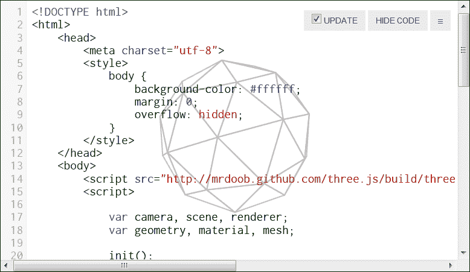
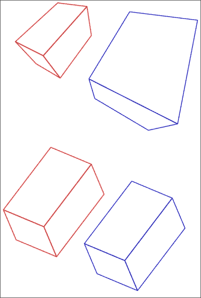
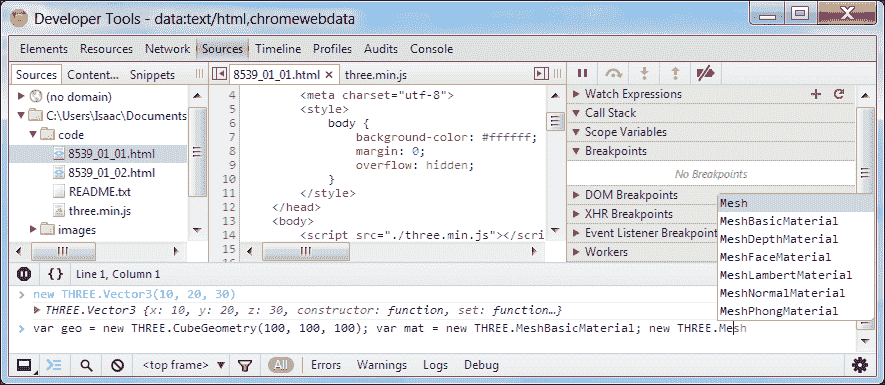

# 第一章. 欢迎来到 Three.js

本章将带你通过一个新的 Three.js 项目从零开始。我们将介绍 Three.js 是什么，如何开始为其编写代码，以及基本场景的组成部分。

# 三维.js 的奇妙世界

Three.js 是一个简化在网页浏览器中显示 3D 图形的 JavaScript 库。艺术家、大型品牌以及许多人越来越多地使用 Three.js 来提供可以触及数百万人的沉浸式在线体验，这些体验可以在许多平台上运行。在[`threejs.org/`](http://threejs.org/)上可以找到许多令人鼓舞的技术演示。

Three.js 通常与一种名为**WebGL**的新技术一起使用，这是一个用于渲染图形而不需要插件的 JavaScript API。该 API 基于**OpenGL**，一个桌面图形 API（**GL**代表**图形库**）。因为它使用客户端的图形处理单元来加速渲染，所以 WebGL 非常快！然而，许多移动浏览器以及 IE 10 及以下版本不支持 WebGL。幸运的是，Three.js 还支持使用**HTML5 Canvas API**以及其他技术，如**可缩放矢量图形**进行渲染。

### 注意

你可以在[`caniuse.com/webgl`](http://caniuse.com/webgl)找到有关浏览器支持的最新信息。

Three.js 最初由*Ricardo Cabello*编写和维护，他也被称为*Mr.Doob*。该库是开源的（MIT 许可），可以从其 GitHub 页面获取，[`github.com/mrdoob/three.js`](https://github.com/mrdoob/three.js)。Three.js 的文档可在网上找到，[`threejs.org/docs/`](http://threejs.org/docs/)。当文档不足时，最佳查看位置是项目的`examples`文件夹，其中包含大量演示不同功能的示例。你可以在[`threejs.org/examples/`](http://threejs.org/examples/)上在线浏览这些示例。如果你需要了解某个类的实现方式或它公开的方法和属性，`src`文件夹中的源代码也值得浏览。开发者们在问答网站**StackOverflow**上回答有关 Three.js 的问题，所以如果你对某事感到困惑，你可以浏览带有`three.js`标签的问题或提出自己的问题。

### 小贴士

本书使用 Three.js 项目的版本 r61 编写。API 的某些部分仍在开发中，但任何可能发生变化的内容将在引入时指出。

# 让我们编码！

由于 Three.js 在网页浏览器中运行，它可以在许多不同的平台上运行和开发。实际上，我们将直接在浏览器中构建我们的第一个 Three.js 项目！

打开[`mrdoob.com/projects/htmleditor/`](http://mrdoob.com/projects/htmleditor/)。你应该会看到 HTML 和 JavaScript 代码叠加在一个旋转的球形形状之上，如下面的截图所示：



在线 Three.js 编辑器

这就是 Three.js 的`Hello, World`程序——在浏览器中渲染旋转形状所需的最小代码。当你更改任何代码时，预览将自动更新，所以你可以尝试玩一玩，看看会发生什么。例如，尝试将`THREE.MeshBasicMaterial`更改为`THREE.MeshNormalMaterial`。如果你将`IcosahedronGeometry`更改为`TorusKnotGeometry`会发生什么？尝试调整一些数字。你能让形状旋转得更快或更慢吗？

# 已见，场景已见

让我们更深入地了解我们的旋转形状世界，并解释它是如何工作的。你可以在这个在线编辑器中跟随本节，或者将代码输入到一个新的 HTML 文件中。

首先，是 HTML 模板：

```js
<!DOCTYPE html>
<html>
  <head>
    <meta charset="utf-8">
    <style>
      body {
        background-color: #ffffff;
        margin: 0;
        overflow: hidden;
      }
    </style>
  </head>
  <body>
    <script src="img/three.min.js"></script>
    <script> /* …your code here… */ </script>
  </body>
</html>
```

这里没有什么令人惊讶的。我们基本上只是包含了 Three.js，并移除了浏览器默认的页面边距。《canvas》元素，我们将渲染场景到这个元素上，将通过我们的 JavaScript 添加到 DOM 中。

### 注意

而不是使用来自 GitHub CDN 的 Three.js 文件，你应该下载最新的 Three.js 构建版本，并将本地副本包含到你的项目中。完整的 Three.js 脚本可以在项目的`build`文件夹中找到，或者可以从[`raw.github.com/mrdoob/three.js/master/build/three.js`](https://raw.github.com/mrdoob/three.js/master/build/three.js)下载。在生产环境中，你将想要使用压缩版本（`three.min.js`）。

现在是时候来点有趣的：告诉 Three.js 显示一些内容。首先，让我们声明我们将需要的对象：

```js
var camera, scene, renderer;
var geometry, material, mesh;
```

然后，让我们给它们赋值并解释它们的作用：

```js
  scene = new THREE.Scene();
```

`Scene`类表示影响屏幕上显示内容的对象列表，例如 3D 模型和灯光。（Three.js 提供的每个类都是作为全局`THREE`变量的一个属性调用的。）一个场景本身并不很有用，所以让我们往里面放些东西。

### 提示

**下载示例代码**

你可以从你购买的所有 Packt 书籍的账户中下载你购买的所有示例代码文件。[`www.packtpub.com`](http://www.packtpub.com)。如果你在其他地方购买了这本书，你可以访问[`www.packtpub.com/support`](http://www.packtpub.com/support)并注册，以便将文件直接通过电子邮件发送给你。

一个`mesh`对象可以在场景中显示，使用`THREE.Mesh`构造函数实例化。它由`geometry`组成，这是对象的形状，以及一个`material`，这是一个颜色、图像或其他纹理，它定义了形状的面的外观。在这种情况下，我们将使用的几何形状是`IcosahedronGeometry`，它基于一个 20 边形，近似于球体。构造函数接受一个半径和细节，其中细节是分割 20 面体的每条边的次数，以添加更多面并使形状更接近球体：

```js
  geometry = new THREE.IcosahedronGeometry(200, 1);
  material = new THREE.MeshBasicMaterial({ color: 0x000000, wireframe: true, wireframeLinewidth: 2 });
  mesh = new THREE.Mesh(geometry, material);
```

`MeshBasicMaterial` 是一种不受周围光照影响的材质。我们传递的选项包括十六进制格式的颜色（就像你在 CSS 中使用的那样），是否显示形状为纯色或突出边缘，以及绘制线框的厚度。

### 小贴士

有许多其他类型的几何形状和材料。第二章 *构建世界* 详细描述了它们。

现在我们可以将我们的网格添加到场景中：

```js
  scene.add(mesh);
```

我们已经组装了我们想要显示的内容，所以下一步就是实际显示它。Three.js 通过 **渲染器** 完成此操作，它对场景中的对象进行一些计算，然后要求浏览器以特定格式（如 WebGL）显示结果。默认情况下，渲染器创建一个新的 `<canvas>` 元素，应该添加到 DOM 中：

```js
  renderer = new THREE.CanvasRenderer();
  renderer.setSize(window.innerWidth, window.innerHeight);
  document.body.appendChild(renderer.domElement);
```

在这里，我们使用 `CanvasRenderer` 作为显示场景的方法。（我们将在 第二章 *构建世界* 中介绍其他渲染器，如 `WebGLRenderer`。）我们还通过 `setSize()` 调用告诉渲染器以浏览器窗口的全尺寸显示场景。然后我们将渲染器的画布添加到 DOM 中，使用 `appendChild(renderer.domElement)`。

### 小贴士

避免使用 CSS 改变画布的大小；使用渲染器的 `setSize` 方法代替，该方法设置画布元素的 `width` 和 `height` HTML 属性。这是因为 CSS 描述的是显示大小，而不是渲染大小。也就是说，如果画布以 800 x 600 的分辨率渲染，但 CSS 显示为 1024 x 768，渲染将被拉伸以填充空间，就像你指定了比实际大小更大的 CSS 图像大小一样。这可能会导致扭曲，并难以在“屏幕空间”和“画布空间”之间进行转换。

我们最后需要的是一个 `camera` 对象，如下面的代码片段所示，这是 Three.js 使用它来告诉渲染器场景应该从哪个视角显示。如果玩家站在你的虚拟世界中，他们的屏幕代表他们能看到的内容，那么 `camera` 就是他们的眼睛，`renderer` 就是他们的大脑，而 `scene` 就是他们的宇宙。

```js
  camera = new THREE.PerspectiveCamera(75, window.innerWidth / window.innerHeight, 1, 1000);
  camera.position.z = 500;
```

`PerspectiveCamera` 实例从空间中的一个单独点显示世界，就像你的眼睛一样。这由于距离产生了一点点扭曲（远离的物体看起来更小）。还有一个 `OrthographicCamera` 类，就像从平面上向外看。正交相机有时用于 **等距**（也称为 **2.5D**）游戏和关卡编辑器，以获得物体相对尺寸的准确视图。你可以在以下图中看到差异：



摄像机投影。上方是透视投影，下方是正交投影。

`PerspectiveCamera` 对象的参数是视野（以度为单位），它控制着摄像机镜头的宽度；纵横比，画布宽度与高度的比率；近平面视锥体，物体可以离摄像机多近仍然可见；以及远平面视锥体，物体可以离摄像机多远仍然可以被渲染。你很少需要更改这些值

还要注意，我们通过将 `camera.position.z` 赋值来改变摄像机的位置。Three.js 使用一个**空间坐标系**，其中默认情况下，x 轴从左到右增加，z 轴从后向前增加，y 轴向上增加。大多数对象都有一个 *position* 和 *scale*，它们都由一个三维向量表示（具体为 `THREE.Vector3`）。它们还有一个由 `THREE.Euler` 实例表示的 *rotation*，这是一个抽象，允许将旋转处理得就像向量一样。所有对象都初始化在位置（0, 0, 0），也称为**原点**。旋转也从（0, 0, 0）开始，缩放从（1, 1, 1）开始。向量非常灵活，但通常你只需要对它们进行 `x`、`y` 和 `z` 属性的赋值。例如，如果我们想向上移动摄像机，我们可以增加 `camera.position.y`。

最后，我们可以通过请求渲染器从摄像机的视角显示场景来展示场景：

```js
  renderer.render(scene, camera);
```

哈喽，一个静态的 3D 显示！如果你一直跟着我们从头开始重建场景，现在是你真正看到你工作成果的时候了。只需在浏览器中打开 HTML 文件。（如果你是从 GitHub 而不是本地加载 `three.js` 文件，你需要连接到互联网。）

一个静态的场景并不很有趣，所以让我们通过构建一个渲染循环来添加动画：

```js
animate();

function animate() {

  requestAnimationFrame(animate);

  mesh.rotation.x = Date.now() * 0.00005;
  mesh.rotation.y = Date.now() * 0.0001;

  renderer.render(scene, camera);

}
```

这里的关键是 `requestAnimationFrame()`，当浏览器准备好绘制新帧时，它会执行传递给它的函数。在这个函数中，我们执行对场景的任何必要的更新（在这个例子中，就像我们之前改变摄像机的 `position` 向量一样，改变网格的 `rotation` 向量），然后请求渲染器像之前一样重新绘制画布。

将所有内容整合在一起（并且为了清晰起见，将设置代码封装在一个函数中），我们得到：

```js
var camera, scene, renderer;
var geometry, material, mesh;

init();
animate();

function init() {

  camera = new THREE.PerspectiveCamera( 75, window.innerWidth / window.innerHeight, 1, 1000 );
  camera.position.z = 500;

  scene = new THREE.Scene();

  geometry = new THREE.IcosahedronGeometry( 200, 1 );
  material = new THREE.MeshBasicMaterial( { color: 0x000000, wireframe: true, wireframeLinewidth: 2 } );

  mesh = new THREE.Mesh( geometry, material );
  scene.add( mesh );

  renderer = new THREE.CanvasRenderer();
  renderer.setSize( window.innerWidth, window.innerHeight );

  document.body.appendChild( renderer.domElement );

}

function animate() {

  requestAnimationFrame( animate );

  mesh.rotation.x = Date.now() * 0.00005;
  mesh.rotation.y = Date.now() * 0.0001;

  renderer.render( scene, camera );

}
```

它正在动画化！你现在已经在浏览器中构建了你的第一个 3D 世界。因为它是用 JavaScript 编写的，你也可以很容易地将其发送给你的朋友。（在在线编辑器中，点击右上角的堆叠条形图图标 ，然后点击 **下载** 按钮，并将下载的文件重命名为 `.html` 扩展名。）

### 小贴士

在 Three.js 仓库和在线上，您会发现的大多数 Three.js 示例都将所有代码放在一个单独的 HTML 文件中。这对于小型项目来说很方便，但对于大型项目来说则不健康。尽管本书中的大多数代码足够小，可以管理在一个文件中，但我们仍将尝试使用使代码可维护的模式。第五章，*设计和开发*专门讨论了在规模上表现良好的设计。

# 选择你的环境

Google Chrome 浏览器通常被认为是 WebGL 支持的领先者，因此许多 Three.js 开发者主要在最新的稳定版 Chrome 或名为 **Canary** 的 alpha 发布分支中进行工作。Chrome 还有很多其他优点，例如高级性能分析、模拟触摸事件的能力以及支持检查画布帧。（您可以通过 Chrome 开发者工具的设置访问这些功能。画布检查在 [`www.html5rocks.com/en/tutorials/canvas/inspection/`](http://www.html5rocks.com/en/tutorials/canvas/inspection/) 上有很好的解释。）如果您想尝试仍在开发中的 WebGL 功能，您可以在 Canary 的 **about:flags** 页面上启用其中的一些功能。

当涉及到编码时，在线的 Three.js 编辑器非常适合测试小型、孤立的构思，但对于更复杂的项目来说，它会很快变得繁琐。大多数编程环境都有良好的 JavaScript 支持，但有些比其他更好。

Chrome 还有一个适用于某些人的脚本编辑环境。如果您打开 Chrome 开发者工具 (*Ctrl* / *Cmd* + *Shift* + *I*) 并切换到 **Sources** 选项卡，您可以将 Chrome 配置为编辑来自您本地文件系统的文件。此环境包括语法高亮、调试、自动完成、压缩文件的源映射、可视化的版本控制以及能够在不重新加载页面的情况下即时运行代码的能力。此外，您还可以存储代码片段以供重用，具体请参阅 [`developers.google.com/chrome-developer-tools/docs/authoring-development-workflow#snippets`](https://developers.google.com/chrome-developer-tools/docs/authoring-development-workflow#snippets)。

你可以在下面的屏幕截图中看到编辑器的样子：



Google Chrome 开发者工具

如果你更喜欢在 Chrome 编辑器之外工作，频繁切换窗口和重新加载页面可能会很麻烦。有几个工具试图解决这个问题。LiveReload ([`livereload.com/`](http://livereload.com/)) 和 Tin.cr ([`tin.cr/`](http://tin.cr/)) 是最知名的；它们是浏览器扩展，当你保存文件时，会自动重新加载页面。你可能还想要尝试 LightTable ([`www.lighttable.com/`](http://www.lighttable.com/))，这是一个实验性的 IDE，它也支持自动重新加载，并且还包括了用于可视化管理你的代码的工具。

如果你使用 Sublime Text 作为你的编辑器，你可以通过包管理器或从 Three.js 仓库本身（在`/utils/editors`）安装 Three.js 命令的自动完成支持。

# 摘要

我们已经使用 Three.js 构建了我们的第一个 3D 世界。在本章中，我们学习了 Three.js 是什么以及它的功能，回顾了 Three.js 场景的基本组件，并设置了我们的编辑环境。我们首次使用了`场景`、`渲染器`、`相机`、`网格`、`几何`和`材质`组件。

在下一章中，我们将更详细地介绍这些组件，包括不同类型的渲染器、几何和材质组件。我们还将添加光照效果，制作一个更高级的场景。
