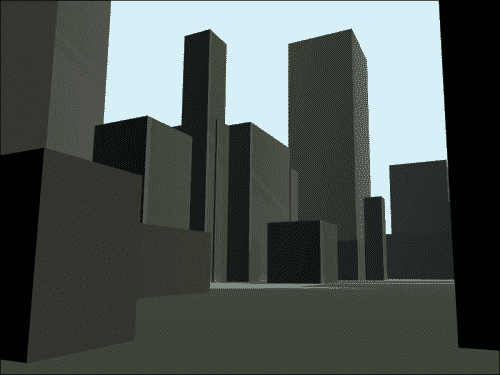
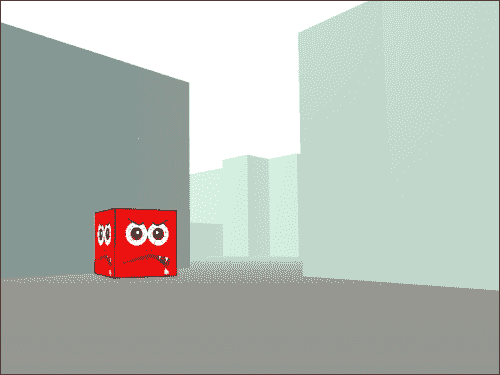

# 第三章. 探索和交互

本章解释了用户如何与我们的游戏互动。我们还将涵盖一些物理知识，并利用所学知识创建一个基本的单人第一人称射击游戏。

# 键盘移动和鼠标环顾四周

为了移动我们的相机，我们将封装一些状态，所以让我们在新的 JavaScript 文件中定义一个`KeyboardControls`类：

```js
function KeyboardControls(object, options) {
  this.object = object;
  options = options || {};
  this.domElement = options.domElement || document;
  this.moveSpeed = options.moveSpeed || 1;

  this.domElement.addEventListener('keydown', this.onKeyDown.bind(this), false);
  this.domElement.addEventListener('keyup', this.onKeyUp.bind(this), false);
}

KeyboardControls.prototype = {
  update: function() {
    if (this.moveForward)  this.object.translateZ(-this.moveSpeed);
    if (this.moveBackward) this.object.translateZ( this.moveSpeed);
    if (this.moveLeft)     this.object.translateX(-this.moveSpeed);
    if (this.moveRight)    this.object.translateX( this.moveSpeed);
  },
  onKeyDown: function (event) {
    switch (event.keyCode) {
      case 38: /*up*/
      case 87: /*W*/ this.moveForward = true; break;

      case 37: /*left*/
      case 65: /*A*/ this.moveLeft = true; break;

      case 40: /*down*/
      case 83: /*S*/ this.moveBackward = true; break;

      case 39: /*right*/
      case 68: /*D*/ this.moveRight = true; break;
    }
  },
  onKeyUp: function (event) {
    switch(event.keyCode) {
      case 38: /*up*/
      case 87: /*W*/ this.moveForward = false; break;

      case 37: /*left*/
      case 65: /*A*/ this.moveLeft = false; break;

      case 40: /*down*/
      case 83: /*S*/ this.moveBackward = false; break;

      case 39: /*right*/
      case 68: /*D*/ this.moveRight = false; break;
    }
  }
};
```

在构造函数中，我们添加了对`keydown`事件和`keyup`事件的监听器，以便在按键按下时，我们可以追踪我们应该移动的方向。（在 JavaScript 中，按下的键通过数字键码来识别。）在我们的`update`方法中，我们只需按照指定的方向移动。这是通过检查我们在键事件期间设置的标志来实现的，这样我们就可以在每一帧中轮询键盘状态。然后，我们可以通过使用`new` `KeyboardControls(camera)`来声明控制器，并在我们的动画循环中调用`controls.update(delta)`来使控制器影响每一帧的相机。

如果你以前编写过事件驱动的 JavaScript，那么大部分内容应该看起来很熟悉，而且不难看出如何以不同的方式扩展以支持不同的控制机制。幸运的是，大多数应用程序的控制方式相当相似，因此 Three.js 提供了一系列默认的控制处理器，这些处理器为你处理了大部分工作。这些控制器位于`examples/js/controls`目录中，而不是主库中，所以如果你想要使用它们，需要确保在 HTML 文件中单独包含它们。如果你想得到稍微不同的行为，可以自由地复制并扩展现有的控制器，而不是每次都从头开始编写自己的控制器。

可用的控制器有：

| 构造函数 | 重要属性 | 说明 |
| --- | --- | --- |
| `FirstPersonControls` | `movementSpeed = 1.0` `lookSpeed = 0.005` `constrainVertical = false` `freeze = false` | 使用键盘移动（*WASD*或箭头键用于前进/后退/侧滑；使用*R*或*F*上下移动）并通过跟随鼠标来环顾四周。 |
| `FlyControls` | `movementSpeed = 1.0` `rollSpeed = 0.005` | 按键移动（*WASD*），倾斜（*QE*），并通过锁定鼠标来环顾四周。 |
| `OculusControls` | `freeze = false` | 使用 Oculus Rift 虚拟现实头盔。 |
| `OrbitControls` | `enabled = true` `target = new THREE.Vector3()` `zoomSpeed = 1.0` `minDistance = 0` `maxDistance = Infinity` `rotateSpeed = 1.0` `keyPanSpeed = 7.0` `autoRotateSpeed = 2.0` | 使用鼠标或触摸控制旋转、平移和缩放，并保持沿正 y 轴的*up*方向。 |
| `PathControls` | `duration = 10000` `waypoints = []` `lookSpeed = 0.005` `lookVertical = true` `lookHorizontal = true` | 沿着预定义的路线移动，并通过跟随鼠标来环顾四周。 |
| `PointerLockControls` |  | 使用键盘移动（*WASD*或箭头键用于前进/后退/侧滑/跳跃）并通过锁定鼠标来环顾四周。需要画布处于指针锁定模式。 |
| `TrackballControls` | `enabled = true` `rotateSpeed = 1.0` `zoomSpeed = 1.2` `panSpeed = 0.3` `minDistance = 0` `maxDistance = Infinity` | 使用鼠标或触摸控制旋转、平移、缩放和倾斜。 |
| `TransformControls` | `size = 1` | 在对象周围创建一个控件，允许用户旋转、缩放和移动它。主要用于编辑器。 |

所有的`controller`构造函数都将`camera`作为它们的第一个参数。

让我们将`FirstPersonControls`控制器添加到上一章的城市示例中，并尝试飞越城市，从街道上观察城市。首先，我们需要添加 JavaScript 文件：

```js
<script src="img/FirstPersonControls.js"></script>
```

然后，我们将添加一些全局变量：

```js
var controls, clock;
```

接下来，我们将在`setupThreeJS()`中实例化`controls`变量和`clock`变量：

```js
clock = new THREE.Clock();
controls = new THREE.FirstPersonControls(camera);
controls.movementSpeed = 100;
controls.lookSpeed = 0.1;
```

一个`clock`是一个计时器。我们将在这个案例中使用它来跟踪我们绘制每一帧之间经过的时间量。此外，请注意，我们改变了相机移动和观察的速度；否则，感觉非常迟缓。

最后，我们将更改`setup()`函数中的动画循环以更新我们的控制器：

```js
requestAnimationFrame(function animate() {
  renderer.render(scene, camera);
 controls.update(clock.getDelta());
  requestAnimationFrame(animate);
});
```

更新控制器允许相机在渲染每一帧时移动。时钟的`getDelta`方法返回自上次调用`getDelta`方法以来经过的时间（以秒为单位），因此在这种情况下，它返回自上次渲染最后一帧以来经过的秒数。内部，控制器使用这个差值来确保动画随时间平滑。现在我们可以飞越我们的城市了！

你可以在下面的屏幕截图中看到城市可能从地面上看起来是什么样子：



飞越城市

# 点击

在屏幕上点击以选择或与之交互是一个常见的要求，但由于需要将屏幕 2D 平面上点击的位置投影到 Three.js 的 3D 世界中，所以这比听起来要困难一些。为了做到这一点，我们从一个称为射线的想象线绘制到 3D 空间中鼠标可能的位置，并查看它是否与任何东西相交。

为了进行投影，我们首先需要一个投影仪：

```js
projector = new THREE.Projector();
```

然后我们需要在画布的点击事件上注册一个监听器：

```js
renderer.domElement.addEventListener('mousedown', function(event) {
  var vector = new THREE.Vector3(
     renderer.devicePixelRatio * (event.pageX - this.offsetLeft) / this.width * 2 - 1,
    -renderer.devicePixelRatio * (event.pageY - this.offsetTop) / this.height * 2 + 1,
    0
    );
  projector.unprojectVector(vector, camera);

  var raycaster = new THREE.Raycaster(
    camera.position,
    vector.sub(camera.position).normalize()
  );
  var intersects = raycaster.intersectObjects(OBJECTS);
  if (intersects.length) {
    // intersects[0] describes the clicked object
  }
}, false);
```

### 提示

之前的代码假设你正在使用`PerspectiveCamera`类。如果你正在使用`OrthographicCamera`类，投影仪有一个实用方法返回一个适当的射线投射器，并且你不需要首先反投影向量：

```js
var raycaster = projector.pickingRay(vector, camera);
```

之前的代码监听渲染器画布上的`mousedown`事件。然后，它创建一个新的`Vector3`实例，其中包含鼠标在屏幕上的坐标，相对于画布中心的百分比是画布宽度的百分比。然后，这个向量相对于相机进行反投影（从 2D 空间到 3D 空间）。 

一旦我们有了表示鼠标位置的 3D 空间中的点，我们就使用`Raycaster`绘制一条线到它。它接收的两个参数是起始点和指向结束点的方向。我们通过减去鼠标和相机位置并规范化结果来确定方向，即通过将每个维度除以向量的长度来缩放它，以便没有维度具有大于`1`的值。最后，我们使用射线通过`intersectObjects`方法检查给定方向（即鼠标下方）上是否有对象。`OBJECTS`是一个要检查的对象数组（通常是网格），确保根据你的代码适当地更改它。返回一个位于鼠标后面的对象数组，并按距离排序，因此第一个结果是点击的对象。

`intersects`数组中的每个对象都有一个`object`、`point`、`face`和`distance`属性。分别，这些属性的值是点击的对象（通常是`Mesh`）、表示空间中点击位置的`Vector3`实例、点击位置的`Face3`实例，以及从相机到点击点的距离。

也可以通过投影而不是反投影来实现反向（3D 到 2D）：

```js
var widthHalf  = 0.5 * renderer.domElement.width  / renderer.devicePixelRatio,
  heightHalf = 0.5 * renderer.domElement.height / renderer.devicePixelRatio;

var vector = mesh.position.clone(); // or an arbitrary point
projector.projectVector(vector, camera);

vector.x =  vector.x * widthHalf  + widthHalf;
vector.y = -vector.y * heightHalf + heightHalf;
```

在此代码运行后，`vector.x`和`vector.y`将持有相对于画布左上角的指定点的水平和垂直坐标。（确保你实际上指定了想要指定的点，而不是使用`mesh.position.clone()`，并且你已经实例化了你的`projector`。）注意，如果原始 3D 点不在屏幕上，则生成的坐标可能不在画布上。

### 小贴士

当你的玩家疯狂点击射击敌人时，最不想看到的是整个屏幕突然变成蓝色，因为浏览器认为用户正在尝试选择某个东西。为了避免这种情况，你可以在 JavaScript 中使用`document.onselectstart = function() { return false; }`取消`select`事件，或者在 CSS 中禁用它：

```js
* {
  -webkit-user-select: none;
  -moz-user-select: none;
  -ms-user-select: none;
  user-select: none;
}
```

# 定时

当我们开始构建更真实的示例时，你会注意到 delta 参数被传递到影响物理的函数中。这些 delta 表示自上次计算物理以来的时间量，并且它们用于平滑随时间移动。

在代码中移动对象的最简单方法是简单地改变对象的位置。例如，为了在画布上移动一个对象，你可能会在动画循环中写入`obj.x += 10`，以便每帧移动 10 个单位。这种方法的问题在于它依赖于帧率。换句话说，如果你的游戏运行缓慢（即每秒帧数较少），你的对象看起来也会移动缓慢；而如果你的游戏运行得快（即每秒帧数较多），你的对象看起来也会移动得快。

一种解决方案是将速度乘以渲染帧之间的时间差。例如，如果你想使你的物体每秒移动 600 个单位，你可能会写`obj.x += 600 * delta`。这样，你的物体将随着时间的推移移动一个恒定的距离。然而，在低帧率和高速的情况下，你的物体在每一帧都会移动很大的距离，这可能导致它做一些奇怪的事情，比如穿过墙壁。在高帧率下，计算物理可能需要的时间可能比帧之间的时间更长，这将导致你的应用程序冻结并崩溃（这被称为*死亡螺旋*）。此外，我们希望实现完美的可重复性。也就是说，每次我们用相同的输入运行应用程序时，我们都希望得到完全相同的输出。如果我们有可变的帧时间差，由于累积的舍入误差，我们的输出会随着程序运行时间的增长而发散，即使在正常的帧率下也是如此。

一个更好的解决方案是将物理更新时间步长与帧刷新时间步长分开。物理引擎应该接收固定大小的时差，而渲染引擎应该确定每帧应该发生多少物理更新。固定大小的时差避免了不一致的舍入误差，并确保帧之间没有巨大的跳跃。以下代码显示了如何将帧之间的时间分成离散的块以用于物理计算：

```js
// Globals
INV_MAX_FPS = 1 / 60;
frameDelta = 0;
clock = new THREE.Clock();

// In the animation loop (the requestAnimationFrame callback)…
frameDelta += clock.getDelta();
while (frameDelta >= INV_MAX_FPS) {
  update(INV_MAX_FPS); // calculate physics
  frameDelta -= INV_MAX_FPS;
}
```

首先，我们声明`INV_MAX_FPS`，这是我们想要渲染的最大每秒帧数的倒数（在这个例子中是`60`）。这是我们通过`update`函数提供给物理引擎的时间步长，你可能需要根据你的模拟运行速度进行调整（记住，大多数显示器无法以每秒超过 60 帧的速度刷新，通常认为 30 帧以上是可接受的）。然后，我们开始跟踪我们的`frameDelta`，这是自上次物理更新以来的累积时间。我们的时钟将用于跟踪渲染帧之间的时间。

在动画循环中，我们首先将自上次渲染以来经过的时间加到`frameDelta`上，然后执行所需的固定大小的物理更新。我们可能在`frameDelta`中剩下一些时间，但将在下一帧中用完。

对于我们的目的，“物理更新”既包括我们世界中物体的移动，也包括玩家摄像机的移动。

# 第一人称射击项目

让我们编写一个真正的游戏！这个项目将比我们之前做的任何项目都要大，所以让我们首先明确我们要完成什么。我们将构建一个基于竞技场的第一人称射击游戏，具有以下功能：

+   基于体素地图的世界

+   一个可以在世界中四处查看、奔跑和跳跃的玩家

+   指针锁定和全屏，以便玩家能够完全沉浸在桌面或控制台游戏中

+   玩家应该能够射击四处游荡的敌人，而敌人应该反击

+   当玩家被射击时，玩家和敌人的健康应该恶化，当玩家健康耗尽时，玩家应该重生。

+   当玩家被射击时，玩家的屏幕应该闪烁红色。

+   应该有一个带有准星和健康指示器的**HUD**（抬头显示）。

+   我们不太关心光照或纹理，除了玩家必须能够看到并感知深度距离。

### 注意

完整的代码太长，无法在此处包含，但您可以从[`www.packtpub.com`](http://www.packtpub.com)的账户中在线下载，或者从[`www.packtpub.com/support`](http://www.packtpub.com/support)将文件通过电子邮件发送给您。本节其余部分涵盖了代码中的有趣摘录。

第一步是编写 HTML 代码。在之前的示例中，我们将所有代码都写在一个 HTML 文件中，但这是一个更大的项目，因此我们应该将代码拆分成单独的文件，并从我们的`index.html`文件中引用它们。我们还想在基本的 HTML 文档中添加一些用户界面元素，特别是包括一个用户必须点击才能进入游戏的`start`屏幕和一个`hurt` div，它只是一个透明的红色叠加层，当玩家被敌人子弹击中时，我们会在屏幕上短暂闪烁，作为有用的警告。

```js
<html>
  <head>
    <!-- ... -->
 <link rel="stylesheet" href="main.css" />
  </head>
  <body>
    <div id="start"><div id="instructions">
      Click to start
    </div></div>
    <div id="hud" class="hidden">
      <!-- ... -->
      <div id="hurt" class="hidden"></div>
    </div>
    <script src="img/three.min.js"></script>
 <script src="img/main.js"></script>
  </body>
</html>
```

当我们开始编写类时，也会将`main.js`文件拆分成几个不同的文件。为了简单起见，我们将所有内容都放在了同一个文件夹中。在第五章中，我们更深入地探讨了大型项目的更好组织结构。

## 设计地图

现在我们有一个放置代码的地方，我们需要一个有趣的世界来查看。让我们设计一个要使用的地图。例如：

```js
var map = "XXXXXXX  \n" +
          "X     X  \n" +
          "X  S  X  \n" +
          "X     X  \n" +
          "X   S XXX\n" +
          "XXX     X\n" +
          "  XX  S X\n" +
          "   X    X\n" +
          "   XXXXXX";
map = map.split("\n");
var HORIZONTAL_UNIT = 100,
    VERTICAL_UNIT   = 100,
    ZSIZE = map.length * HORIZONTAL_UNIT,
    XSIZE = map[0].length * HORIZONTAL_UNIT;
```

我们的地图表示为一个字符串，其中`X`表示墙壁，`S`表示玩家可以进入世界的位置。我们将字符串拆分成一个数组，以便更容易访问，然后决定每个体素的大小（在本例中，由`HORIZONTAL_UNIT`和`VERTICAL_UNIT`变量指示的 100 * 100 * 100），并使用`XSIZE`和`ZSIZE`跟踪地图的整体大小。

接下来，我们需要使用我们的地图来生成 3D 世界：

```js
for (var i = 0, rows = map.length; i < rows; i++) {
  for (var j = 0, cols = map[i].length; j < cols; j++) {
    addVoxel(map[i].charAt(j), i, j);
  }
}
```

这相当直接——遍历地图并在指定的行和列中添加一些内容。我们的`addVoxel`方法看起来类似于以下代码：

```js
function addVoxel(type, row, col) {
  var z = (row+1) * HORIZONTAL_UNIT - ZSIZE * 0.5,
      x = (col+1) * HORIZONTAL_UNIT - XSIZE * 0.5;
  switch(type) {
    case ' ': break;
    case 'S':
      spawnPoints.push(new THREE.Vector3(x, 0, z));
      break;
    case 'X':
      var geo = new THREE.CubeGeometry(HORIZONTAL_UNIT, VERTICAL_UNIT, HORIZONTAL_UNIT);
      var material = new THREE.MeshPhongMaterial({
        color: Math.random() * 0xffffff
      });
      var mesh = new THREE.Mesh(geo, material);
      mesh.position.set(x, VERTICAL_UNIT*0.5, z);
      scene.add(mesh);
      break;
  }
}
```

为了看到我们的世界，我们还需要添加光照（最简单的方法是使用一个或两个类似于我们在城市项目中使用的`DirectionalLights`）和您可能还想添加雾来帮助深度感知。您可以手动调整摄像机的`position`和`rotation`来查看您刚刚构建的内容，或者临时添加类似于我们在城市项目中使用的`FirstPersonControls`。由于我们只使用我们的地图来添加墙壁，因此您还应该添加一个地板，就像我们在城市项目中做的那样，使用一个单一的大平面。

## 构建玩家

现在我们已经有一个世界了，让我们创建一个可以在其中移动的玩家。我们需要一个`Player`类来跟踪每个玩家的状态，因此让我们在一个新文件中扩展`THREE.Mesh`，我们将这个文件称为`player.js`：

```js
function Player() {
  THREE.Mesh.apply(this, arguments);
  this.rotation.order = 'YXZ';
  this._aggregateRotation = new THREE.Vector3();
  this.cameraHeight = 40;
  this.velocity = new THREE.Vector3();
  this.acceleration = new THREE.Vector3(0, -150, 0);
  this.ambientFriction = new THREE.Vector3(-10, 0, -10);
  this.moveDirection = {
    FORWARD: false,
    BACKWARD: false,
    LEFT: false,
    RIGHT: false
  };
}
Player.prototype = Object.create(THREE.Mesh.prototype);
Player.prototype.constructor = Player;
```

我们通过在`Player`构造函数内部调用`Mesh`构造函数并复制其`prototype`，将`Player`实现为`THREE.Mesh`类的一个子类。这意味着玩家自动具有几何形状、材质、位置、旋转和缩放，并且我们还可以实现自己的功能（例如速度和加速度）。请注意，玩家功能类似于控制器，因为它包含移动和四处张望的代码，不同之处在于输入事件处理程序绑定在类外部，以便使其可重用。

这里可能看起来有些奇怪的是改变`rotation.order`。旋转是通过欧拉表示法跟踪的，它包括围绕每个轴的弧度角以及轴向旋转应用的顺序。默认顺序是`'XYZ'`，首先旋转上下（x），然后左右（y）。在这种配置下，如果玩家在垂直查看后水平查看，世界将看起来倾斜。为了可视化这一点，想象倾斜一个甜甜圈，使其远离你的那一侧向上，靠近你的那一侧向下；这就是 x 旋转，或**俯仰**。如果你然后从前面到左边在甜甜圈周围移动你的手指，这就是 y 旋转，或**偏航**。（将甜甜圈向右倾斜将是 z 旋转，或**翻滚**。）请注意，如果你从甜甜圈的中间向外看向你手指，你的头部相对于世界是倾斜的。因此，我们必须将欧拉顺序更改为`'YXZ'`，以便使相机相对于世界而不是相对于自身旋转。通过这个改变，我们首先移动我们的手指，然后倾斜甜甜圈，使我们的手指向上或向下移动，而不是甜甜圈的前面，最终我们得到一个水平的头部。

要实际实现这种四处张望的功能，我们将锁定鼠标并跟踪其移动。由于 API 有些冗长，我们将使用库来简化这个过程。您可以从[`github.com/IceCreamYou/PointerLock.js`](https://github.com/IceCreamYou/PointerLock.js)获取`PointerLock.js`，以及来自*布拉德·多赫蒂*的 BigScreen 库，链接为[`github.com/bdougherty/BigScreen`](https://github.com/bdougherty/BigScreen)。一旦我们包含了这些库，启动游戏的过程将类似于以下代码，该代码在开始动画之前请求浏览器进入全屏和指针锁定模式：

```js
document.getElementById('start').addEventListener('click', function() {
  if (BigScreen.enabled) {
    var instructions = this;
    BigScreen.request(document.body, function() {
      PL.requestPointerLock(document.body, function() {
        instructions.className = 'hidden';
        startAnimating();
      }, function() {
        stopAnimating();
      });
    }, function() {
      instructions.className = 'exited';
      stopAnimating();
    });
  }
});
```

指针锁定和全屏 API 只能在用户采取行动（点击或按键）时启用，作为安全预防措施，以防止攻击者劫持您的屏幕，因此在这种情况下我们正在等待点击。一旦我们进入全屏，我们可以监听`mousemove`事件来旋转玩家：

```js
document.addEventListener('mousemove', function(event) {
  player.rotate(event.movementY, event.movementX, 0);
}, false);
```

### 提示

在这里，`event.movementX`属性和`event.movementY`属性通过`PointerLock.js`库在所有浏览器中进行了归一化。

`rotate()`方法只是简单地改变玩家的`_aggregateRotation`向量。在这里，我们假设玩家已经被实例化，如下面的代码所示：

```js
player = new Player();
player.add(camera);
scene.add(player);
```

是的，我们刚刚将`camera`添加到了`player`中。结果是，任何是`THREE.Object3D`的子对象都可以添加其他对象。这些子对象可以通过父对象的`children`数组访问，并且它们将与父对象一起分组，以便运动、旋转和缩放可以组合。换句话说，如果一个子对象的局部位置是`(0, 0, 5)`，而父对象的位置是`(0, 0, 10)`，那么子对象在世界的位置将是`(0, 0, 15)`。旋转和缩放的工作方式类似。在这种情况下，我们使用这种组合来使我们的相机跟随玩家移动。

### 小贴士

因为子对象的位置、旋转和缩放都是相对于父对象的位置、旋转和缩放而言的，所以你可以通过将相机放置在正 z 轴上（可能在 y 轴上稍微高一点）并给`player`对象一个几何形状和材质（记住，`Player`是从`Mesh`继承的，所以你可以使用`new Player(geometry, material)`来实例化一个玩家）来创建一个第三人称相机。

## 玩家运动

我们很快就会完成代码，以便四处查看，但由于它与玩家的移动密切相关，让我们先来解决这个问题。

### 物理运动

正确实现运动是一个复杂的话题。虽然简单地给一个对象的位置加上一个恒定速度在某些模拟中可能有效，但更高级的游戏将希望有加速度（例如，用于重力）以及可能的其他力。线性力的最直接方法是跟踪加速度和速度向量并将它们相加：

```js
// When the mesh is instantiated
mesh.velocity = new THREE.Vector3(0, 0, 0);
mesh.acceleration = new THREE.Vector3(0, 0, 0);

// Called in the animation loop
function update(delta) {
  // Apply acceleration
  mesh.velocity.add(mesh.acceleration().clone().multiplyScalar(delta));
  // Apply velocity
  mesh.position.add(mesh.velocity.clone().multiplyScalar(delta));
}
```

这被称为**欧拉**积分（发音为“oiler”，而不是“yew-ler”）。一个简单的修改就给了我们**中点**积分，这可以在准确性上带来合理的改进。我们所需做的只是在使用速度之前和之后将加速度应用一半：

```js
  var halfAccel = mesh.acceleration.clone().multiplyScalar(delta * 0.5);
  // Apply half acceleration (first half of midpoint formula)
  mesh.velocity.add(halfAccel);
  // Apply thrust
  mesh.position.add(mesh.velocity.clone().multiplyScalar(delta));
  // Apply half acceleration (second half of midpoint formula)
  mesh.velocity.add(halfAccel);
```

要理解它是如何工作的，请考虑以下图表：


欧拉法与中点积分

我们积分公式的目标是尽可能接近真实位置。在图中，垂直跳跃发生在我们的时间步长，即物理更新计算的地方。中点曲线只是将欧拉曲线平移，使得中点位置和真实位置之间的面积相互抵消。当应用加速度、急速和非线性力时，会引入更多的误差，但就我们的目的（以及我们的空间）而言，中点公式是在简单性和准确性之间的一种合理的折衷。

**四阶龙格-库塔**方法（也称为**RK4**）是另一种常用的方法，用于计算随时间变化的运动。RK4 在帧之间预测几个中间状态，从而为下一帧的状态提供更精确的最终近似。增加准确性的代价是增加了复杂性和降低了速度。由于其复杂性，我们在这里不会介绍它，但通常如果你需要像这样复杂的东西，你可能会希望将物理处理委托给下一节中提到的碰撞处理库之一。

### 更新玩家的移动和旋转

让我们监听移动键，以便我们知道何时移动玩家：

```js
document.addEventListener('keydown', function(event) {
  switch (event.keyCode) {
    case 38: // up
    case 87: // w
      player.moveDirection.FORWARD = true;
      break;
    case 37: // left
    case 65: // a
      player.moveDirection.LEFT = true;
      break;
    case 40: // down
    case 83: // s
      player.moveDirection.BACKWARD = true;
      break;
    case 39: // right
    case 68: // d
      player.moveDirection.RIGHT = true;
      break;
    case 32: // space
      player.jump();
      break;
  }
}, false);
```

我们将在每一帧检查这些标志，以确定应用多少推力。我们还需要一个`keyup`监听器，它几乎与`keydown`监听器相同，不同之处在于当相关键被释放时，它应该将我们的方向设置回`false`。

现在，终于可以实施玩家的`update`方法了：

```js
Player.prototype.update = (function() {
  var halfAccel = new THREE.Vector3();
  var scaledVelocity = new THREE.Vector3();
  return function(delta) {
    var r = this._aggregateRotation
      .multiplyScalar(delta)
      .add(this.rotation);
    r.x = Math.max(Math.PI * -0.5, Math.min(Math.PI * 0.5, r.x));
    this.rotation.x = 0;

    if (this.moveDirection.FORWARD) this.velocity.z -= Player.SPEED;
    if (this.moveDirection.LEFT) this.velocity.x -= Player.SPEED;
    if (this.moveDirection.BACKWARD) this.velocity.z += Player.SPEED;
    if (this.moveDirection.RIGHT) this.velocity.x += Player.SPEED;

    halfAccel.copy(this.acceleration).multiplyScalar(delta * 0.5);
    this.velocity.add(halfAccel);
    var squaredVelocity = this.velocity.x*this.velocity.x + this.velocity.z*this.velocity.z;
    if (squaredVelocity > Player.SPEED*Player.SPEED) {
      var scalar = Player.SPEED / Math.sqrt(squaredVelocity);
      this.velocity.x *= scalar;
      this.velocity.z *= scalar;
    }
    scaledVelocity.copy(this.velocity).multiplyScalar(delta);
    this.translateX(scaledVelocity.x);
    this.translateZ(scaledVelocity.z);
    this.position.y += scaledVelocity.y;
    this.velocity.add(halfAccel);

    this.velocity.add(scaledVelocity.multiply(
      this.ambientFriction
    ));

    this.rotation.set(r.x, r.y, r.z);
    this._aggregateRotation.set(0, 0, 0);
  };
})();
```

这里有很多事情在进行中。首先要注意的是，我们的方法定义立即调用一个匿名函数，该函数返回我们的实际方法定义。我们这样做是为了创建一些辅助对象以提高效率。大多数 Three.js 数学运算都是在原地进行的（而不是返回每个操作的结果的新对象），这意味着为了使用现有的数学对象（如`acceleration`向量）进行计算，我们要么需要克隆它们，要么将值复制到一个`helper`对象中，这样我们就可以在不产生副作用的情况下对其进行操作。克隆会产生过多的垃圾回收，这意味着如果浏览器必须处理我们快速创建然后丢弃的所有对象，它将会滞后。相反，我们定义了`halfAccel`向量，例如，在闭包中（这样它就不会污染全局命名空间），并使用它进行向量数学运算。这种模式在 Three.js 库本身中经常被使用。

几乎在`update`方法中的其他所有操作都是加法和乘法。为了观察周围环境，我们汇总鼠标在每一帧之间的移动距离，然后在玩家更新时添加相应的旋转量。此外，加速度和速度部分应该看起来很熟悉——它与我们刚刚在*物理移动*部分提到的相同的中点策略。不过，我们还需要对一些问题保持敏感。首先，我们限制`r.x`以约束玩家向上和向下看的距离，这样他们就不会混淆上下方向。其次，我们希望*前进*的概念相对于世界而不是相机的方向，这样我们就可以向上看并向前走，而不会在所看方向上飞到空中。为此，我们在将速度添加到位置之前重置俯仰角（使玩家向前看而不是向上或向下看）。最后，我们添加摩擦力，这允许玩家在给定方向移动后减速并停止。在你的实际游戏中，你可能希望根据玩家是否在空中使用不同级别的摩擦力。

## 玩家碰撞

检测碰撞有几种不同的方法：

+   **体素**：如第二章中所述，*构建世界*，设计世界的一种常见方法是用字符串或图像来表示可重复的构建块，例如乐高积木。使用这种方法时，检查角色与世界之间的碰撞最快的方法是简单地检查角色的坐标是否在地图指定的用于构建块的区域之内。这避免了比较 3D 形状的复杂性。

+   **光线**：就像我们之前使用`Raycaster`类来检测点击的对象一样，我们也可以使用它来检测多个对象之间的碰撞，使用`intersectObjects()`方法。为此，我们可以从需要检查碰撞的对象（如玩家）向多个方向发射光线；例如，我们可以从玩家的位置向玩家的每个顶点发射光线。如果交点距离小于玩家位置到顶点的距离，则表示发生了碰撞。这种方法有几个问题。首先，对于大量顶点或动态对象来说，它效率不高。其次，如果对象不在光线的方向上，它们可能会逃避免检测。最后，光线使用对象形状的近似来检查交点，因此不规则形状的对象可能会被错误地选中。然而，这是最简单的一般性方法，可以在不使用额外库或了解世界布局的情况下工作。

+   **交点**：我们可以手动比较对象的几何形状和位置，以查看它们是否重叠。由于检测复杂 3D 形状之间的碰撞在数学上是困难的，因此大多数游戏使用简化的近似值而不是实际几何形状来简化计算。即便如此，除非我们使用非常简单的形状（如盒子或球体，它们并不能很好地近似我们的对象），否则 3D 碰撞检测算法既复杂又慢。如果没有一些复杂的优化，如使用名为**八叉树**的数据结构来确保只有附近的对象需要检查碰撞，这也会很耗费计算资源。如果你想要尝试实现自己的碰撞检测，Three.js 在`examples/js`文件夹中包含了一个八叉树的实现。

+   **库**：幸运的是，我们不必手动进行复杂的碰撞检测，因为有几个库可以为我们处理这些复杂性。它们还处理碰撞响应和相关物理。主要的竞争者包括：

    +   **Ammo.js**是一个从 C++编译到 JavaScript 的大型但完整的库。它可在[`github.com/kripken/ammo.js/`](https://github.com/kripken/ammo.js/)找到。

    +   **Cannon.js**是一个从头开始用 JavaScript 编写的较小库，部分灵感来自 Three.js 的概念。它可在[`github.com/schteppe/cannon.js`](https://github.com/schteppe/cannon.js)找到。

    +   **Physi.js**是 Ammo 或 Cannon 与 Three.js 之间的桥梁，它还在单独的线程中运行物理模拟以避免阻塞渲染。它可在[`github.com/chandlerprall/Physijs`](https://github.com/chandlerprall/Physijs)找到。

对于我们的射击游戏，我们将使用体素碰撞和一些手动交点。不幸的是，所有物理库都很大，所以我们没有足够的空间在这里介绍它们的 API。然而，Cannon.js 和 Physi.js 在其项目页面上提供了专门用于与 Three.js 一起使用的示例。

### 体素碰撞

如果我们现在尝试在世界中行走，我们只会穿过地板。让我们创建一个函数来检查玩家与体素世界之间的碰撞：

```js
function checkPlayerCollision(player) {
  player.collideFloor(floor.position.y);
  var cell = mapCellFromPosition(player.position);
  switch (cell.char) {
    case ' ':
    case 'S':
      break;
    case 'X':
      moveOutside(cell, player);
      break;
  }
}
```

我们的`collideFloor`方法确保玩家保持在地板的 y 位置之上。然后，`mapCellFromPosition`方法从玩家的位置查找地图单元格，以确定玩家是否在墙壁或开放空间中。如果玩家正在与墙壁碰撞，`moveOutside()`方法通过将玩家移向最近的单元格来将玩家移出墙壁。从位置查找单元格的过程与我们最初放置每个体素时使用的正好相反：

```js
var XOFFSET = (map.length+1) * 0.5 * HORIZONTAL_UNIT,
    ZOFFSET = (map[0].length+1) * 0.5 * HORIZONTAL_UNIT,
    col = Math.floor((position.x+XOFFSET) / HORIZONTAL_UNIT) - 1,
    row = Math.floor((position.z+ZOFFSET) / HORIZONTAL_UNIT) - 1,
    char = map[mapRow].charAt(mapCol);
```

## 机器人

现在我们已经让玩家工作起来，是时候添加敌人机器人了。敌人可以是像用户一样的`Player`，所以除了初始化它们之外，我们主要需要添加的是自主行为。我们没有足够的空间在这里深入讨论人工智能策略，所以我们只是偶尔随机设置每个机器人的`moveDirection`标志：

```js
bot.rotation.y = Math.random() * Math.PI * 2;
bot.moveDirection.FORWARD = Math.random() < 0.8;
```

## 子弹

最后，让我们添加射击功能，以便我们可以粉碎那些敌人！首先，我们将在`bullet.js`中创建一个新的`Bullet`类，类似于我们为`Player`类所做的那样。子弹只是具有`direction`向量和`speed`标量的网格，因此它们的`update`方法可以相当简单：

```js
Bullet.prototype.update = (function() {
  var scaledDirection = new THREE.Vector3();
  return function(delta) {
    scaledDirection.copy(this.direction).multiplyScalar(this.speed*delta);
    this.position.add(scaledDirection);
  };
})();
```

当子弹被射出时，我们将设置子弹的方向。子弹可以朝向摄像机的方向射出，或者从敌方机器人向玩家射出。为了获取相关方向，我们的`shoot`函数将类似于以下代码：

```js
var shoot = (function() {
  var negativeZ = new THREE.Vector3(0, 0, -1);
  return function(from, to) {
    bullet = new Bullet();
    bullet.position.copy(from.position);
    if (to) {
      bullet.direction = to.position.clone().sub(from.position).normalize();
    }
    else {
      bullet.direction = negativeZ.clone().applyEuler(from.rotation);
    }
    bullets.push(bullet);
    scene.add(bullet);
  };
})();
```

我们通过减去他们的位置来获取一个玩家到另一个玩家的方向。如果用户正在射击，那么我们不一定瞄准任何东西，所以我们只需要摄像机正在看的方向。我们从玩家的旋转中检索这个方向。

## 更新游戏循环

将所有这些整合在一起，我们应该得到一个类似以下的功能，它执行我们游戏的所有行为：

```js
function update(delta) {
  player.update(delta);
  checkPlayerCollision(player);

  for (var i = bullets.length - 1; i >= 0; i--) {
    bullets[i].update(delta);
    checkBulletCollision(bullets[i], i);
  }

  for (var j = 0; j < enemies.length; j++) {
    var enemy = enemies[j];
    enemy.update(delta);
    checkPlayerCollision(enemy);
    if (enemy.health <= 0) {
      spawn(enemy);
    }
    shoot(enemy, player);
    move(enemy);
  }

  if (player.health <= 0) {
    spawn(player);
  }
}
```

此函数计算所有物理（包括移动和碰撞检测），触发自主行为，如机器人向目标射击，并实现游戏逻辑（如玩家健康过低时死亡）。它在动画循环的每一帧中被调用。delta 参数是物理时间步长，因此它应该始终与本章*时间*部分中讨论的相同值相同。

写了这么多代码！不过，我们得到了一个很棒的基于竞技场的第一人称射击游戏，你可以将其上线并发送给所有你的朋友。你可以从以下图像中看到所有这些工作的样子：



游戏完成后的截图

# 摘要

在本章中，我们学习了如何实现用户交互和游戏物理。我们还构建了一个完整的单人第一人称射击游戏。在下一章中，我们将通过导入模型、粒子系统、声音和后期处理效果来丰富我们的世界。
