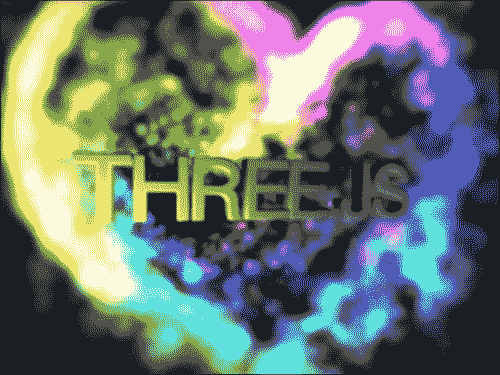
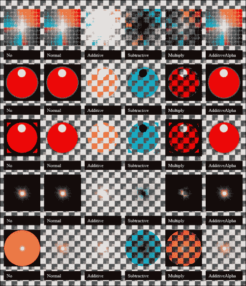
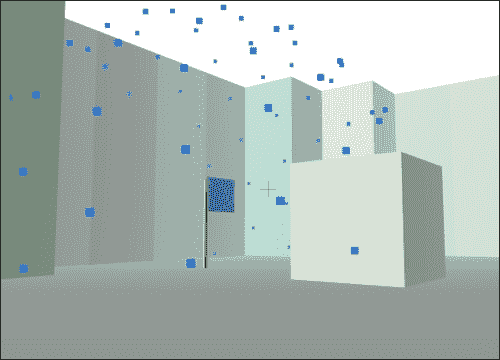
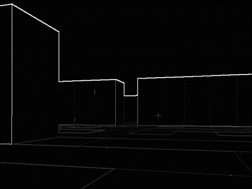

# 第四章。添加细节

本章解释了如何管理外部资产，如 3D 模型，以及如何使用粒子系统、声音和图形效果为你的世界添加细节。它还将详细说明我们在第三章中构建的竞技场第一人称射击游戏，将其转变为夺旗游戏。

# 设置 CTF

为了有一个合适的夺旗游戏，我们首先需要拥有队伍。有一些事情需要与特定的队伍相关联：

+   旗帜（以及旗帜颜色）

+   玩家（以及玩家的皮肤）

+   生成点

+   子弹（如果你想要避免同队伤害）

+   可能的地图装饰/材质

将这些元素中的每一个与一个队伍关联的最简单方法是为它们添加一个具有简单值（如`R`或`B`）的属性来表示红队或蓝队（或任何其他队伍名称）。一个更高级的方法可能是创建一个`Team`类，该类包含属于该队伍的所有内容的引用，因为这可以提供优化，例如限制需要执行的碰撞检查的数量。但是，如果你这样做，确保在从世界中移除某些东西（如子弹）时从`Team`容器中删除所有适当的引用，以避免内存泄漏。

接下来，我们需要修改我们的地图以添加红队和蓝队的旗帜，我们将分别用`R`和`B`表示：

```js
var map = "XXXXXXX   \n" +
          "X  S  X   \n" +
          "X  R  X   \n" +
          "X     XX  \n" +
          "X      XXX\n" +
          "XXX      X\n" +
          "  XX     X\n" +
          "   X  B  X\n" +
          "   X  S  X\n" +
          "   XXXXXXX";
```

现在我们需要将这些旗帜实际添加到世界中。然而，旗帜不是简单的几何原形形状，因此我们希望导入一个更复杂的网格。

# 资产管理

原始几何形状非常适合测试，但任何严肃的游戏今天都可能大量使用在 Blender、Maya 或 3ds Max 等专业程序中创建的 3D 模型。这些模型需要导入到 Three.js 场景中，并转换为具有几何和材质的`THREE.Mesh`对象。幸运的是，Three.js 为各种文件格式提供了名为**loaders**的导入器。

## 导入器

对于我们的旗帜，我们将使用一个简单的 Collada 格式的网格。（Collada 是一种基于 XML 的格式，用于存储 3D 网格和动画数据，文件以`.dae`结尾。）你可以从 Packt Publishing 网站下载我们的旗帜网格。`ColladaLoader`不包括在主 Three.js 库中，但可以从`examples/js/loaders/ColladaLoader.js`复制，然后将其包含在你的 HTML 中，如下所示：

```js
<script src="img/ColladaLoader.js"></script>
```

然后，模型可以像这样加载：

```js
var loader = new THREE.ColladaLoader();
loader.load('flag.dae', function(result) {
  scene.add(result.scene);
});
```

通常需要调整和重新定位导入的模型，因此你可能会想在将网格添加到世界之前设置`result.scene.scale`和`result.scene.position`。你可以在下一张截图看到加载的模型：


蓝队的旗帜

### 注意

默认情况下，在本地`file:///` URL 上导入网格将不会工作。这是因为当 JavaScript 请求文件时，浏览器的默认安全设置拒绝返回本地系统文件。为了绕过这个限制，你可以运行一个本地 HTTP 服务器或更改浏览器安全设置，具体方法请参阅[`github.com/mrdoob/three.js/wiki/How-to-run-things-locally`](https://github.com/mrdoob/three.js/wiki/How-to-run-things-locally)。

还有许多其他用于其他文件格式的模型加载器，包括 CTM、OBJ、MTL、PLY、STL、UTF8、VRML 和 VTK。这些位于`examples/js/loaders`文件夹中。几乎所有的加载器都有一个`load`方法，就像之前提到的`ColladaLoader`方法一样，该方法在加载完成后调用一个函数。然而，加载器没有标准化的格式，其中一些工作方式略有不同。特别是，传递给回调函数的参数取决于文件类型。你应该检查你想要使用的加载器的`examples`文件夹中的演示，以确保你正确处理返回的结果。

在我们的例子中，我们从`ColladaLoader`获取一组子网格（在`result.scene`中），因为 Collada 文件可以包含多个网格。我们需要修改标志的材质，以确保每个标志反映其队伍的颜色：

```js
result.scene.children[1].material = new THREE.MeshLambertMaterial({
  color: type === 'R' ? 0xee1100 : 0x0066ee,
  side: THREE.DoubleSide,
});
```

回想一下，在上一章中我们设置相机跟随玩家时，我们将相机添加到了`player`对象中。每当以这种方式将对象分组时，它们可以通过父对象的`children`数组访问。在这种情况下，我们使用该数组来改变旗帜布料部分的材质，使其变为蓝色或红色，具体取决于它属于哪个队伍。

除了标准 3D 模型文件格式的加载器之外，库中还包含了一些 Three.js 特定的加载器。特别是，`THREE.JSONLoader`被设计用来加载单个网格，而`THREE.SceneLoader`可以加载整个场景（包括灯光、相机和其他 Three.js 实体）。

### 注意

除了 3D 模型之外，还有一些内置的加载器用于其他资产。例如，我们已经看到了`THREE.TextureLoader`在`THREE.ImageUtils.loadTexture`背后的工作。你也可以直接加载网格的各个部分，包括几何形状、图像和材质。其他对象，如灯光、相机，甚至任意资源也可以加载。然而，这些加载器通常在库的底层调用，而不是直接由开发者调用，因为通常加载整个模型或场景比加载单个部分更有意义。因此，我们在这里不会介绍这些加载器，但如果你想要了解更多，可以在`src/loaders`文件夹中找到它们。

与 `ColladaLoader` 类似，`JSONLoader` 使用一个带有回调的 `load` 方法。然而，回调接收一个 `THREE.Geometry` 对象作为其第一个参数。并非所有 3D 模型都有关联的材料，但如果对象有材料，它们将以数组的形式作为第二个参数传递给回调：

```js
var loader = new THREE.JSONLoader();
loader.load('model.js', function(geometry, materials) {
  var material = materials && materials.length ?
    new THREE.MeshFaceMaterial(materials) :
    new THREE.MeshBasicMaterial({ color: 0x000000 });
  var mesh = new THREE.Mesh(geometry, material);
  scene.add(mesh);
});
```

如第二章《构建世界》中所述，`MeshFaceMaterial` 是一个容器，它将多个材料映射到网格的不同面上。

`SceneLoader` 与其他加载器略有不同，因为它可以使用其他加载器来处理场景的特定部分：

```js
var loader = new THREE.SceneLoader();
loader.addGeometryHandler('ctm', THREE.CTMLoader);
loader.addHierarchyHandler('dae', THREE.ColladaLoader);
loader.load('scene.js', function(result) {
scene.add(result.scene);
});
```

如果场景包含外部模型，`SceneLoader` 将尝试使用适当的处理程序导入它。使用 `addGeometryHandler` 方法添加仅支持单个网格的文件格式的加载器，并使用 `addHierarchyHandler` 添加支持多网格场景的文件格式的加载器（DAE、OBJ 和 UTF8）。在这个例子中，CTM 和 DAE 文件将被正确加载。

## 导出到 Three.js

Three.js 项目包括用于 3ds Max、Maya 和 Blender 3D 建模程序的扩展，以便更容易地将模型导出为 Three.js JSON 格式。这些扩展有一些限制；例如，一些修改器如平滑组不支持。有两种常见的替代方案可以避免这些问题。第一种是将模型导出为 DAE 等格式，并使用相应的 Three.js 导入器。另一种方法是导出模型为 OBJ 格式，然后在`utils/converters`文件夹中运行 Python 转换器脚本，将模型转换为 Three.js JSON 格式。选择文件格式主要是权衡文件大小（文件检索所需时间）和初始化（文件解析所需时间）。你可能需要为性能敏感的项目测试不同的格式。

### 小贴士

Python 转换器是为 Python 2.x 编写的，可能不适用于 3.x。

导入模型时出现最常见的问题是由于没有导出所有必需的属性。在你的建模程序的导出对话框中，如果可以选择，请确保勾选这些属性的复选框：

+   顶点

+   面部

+   法线

+   皮肤/材质/纹理贴图/纹理坐标/UV/颜色

+   翻转 YZ

+   形态动画（如果适用）

+   所有网格（如果适用）

你的建模软件可能没有所有这些选项，你可能还需要检查其他复选框。

为了安全起见，你可能还想确保你导出的模型是一个顶级对象，而不是与其他事物组合在一起，模型没有被平移或旋转，缩放设置为`1`，并且你已经删除了模型的历史记录。

## 从 Three.js 导出

Three.js 在`examples/js/exporters`文件夹中提供了几个导出器，允许以各种格式保存场景或对象，包括 OBJ、STL 和 JSON。与加载器一样，几乎任何 Three.js 实体都可以导出，但最常见的方法是导出一个完整的网格或场景。`SceneExporter`工具在这里是最常见的工具，使用它相当直接：

```js
var exporter = new THREE.SceneExporter();
var output = JSON.stringify(exporter.parse(scene), null, "\t");
```

然后，`output`值可以被保存到一个`SceneLoader`可以稍后读取的 JSON 文件中。需要注意的一个主要问题是自定义属性不会被导出。这包括添加到对象实例中的非标准属性、Three.js 类子类提供的属性、不继承自 Three.js 类的自定义类，以及不属于`scene`的任何内容。如果你需要任何这些内容被导出，你可能最好编写一个自定义导出器和导入器，可能从 Three.js 提供的其中一个开始。

## 管理加载器

现在，当我们的 CTF 地图初始化时，我们要求一个加载器获取旗帜模型。这没问题，因为模型相当小，我们只需要加载一个模型。然而，如果我们有很多模型或者它们很大，我们可能会注意到它们在加载完成后突然出现在地图上，即使我们已经开始玩游戏。为了解决这个问题，较大的项目应该在玩家开始玩游戏之前预加载资源。为此，只需要禁止进入地图，直到最后一个模型的回调函数执行完毕。不幸的是，如果我们有很多模型并且必须逐个加载它们，可能会很难跟踪剩余的模型数量。当模型加载时，如果没有任何事情发生，用户也可能失去兴趣。

通常，这是通过使用`SceneLoader`一次性加载所有模型来解决的。`SceneLoader`对象有一个`callbackProgress`属性，它包含一个在场景中的每个对象完成加载后调用的函数。该回调函数接受两个参数，`progress`和`result`。`progress`对象有四个数值属性，可以用来显示进度条：`totalModels`、`totalTextures`、`loadedModels`和`loadedTextures`。`result`对象包含到目前为止已加载的所有实体，它也是当所有加载完成后传递给加载器`load`回调函数的`onLoad`参数的值。

对于进度条，可以考虑如下 HTML 代码，其中外层 div 有一个定义的宽度：

```js
<div id="bar"><div id="progress"></div></div>
```

在这种情况下，你可以在`callbackProgress`处理程序中包含如下代码：

```js
var total = progress.totalModels + progress.totalTextures,
    loaded = progress.loadedModels + progress.loadedTextures,
    progressBar = document.getElementById('progress');
progressBar.style.width = Math.round(100 * loaded / total) + '%';
```

如果你不能使用`SceneLoader`或者出于其他原因不想使用它，你必须手动将你的加载器连接起来。然而，Three.js 未来将开始使用**加载管理器**。加载管理器是与加载器一起工作的对象，用于跟踪多个资源何时完成加载。截至 Three.js 版本 r61，加载管理器 API 尚不稳定，并且许多加载器中尚未实现。

## 网格动画

使用动画模型与使用普通模型没有太大区别。除了在 Three.js 中手动更改网格几何形状的位置外，还有两种类型的动画需要考虑。

### 小贴士

如果你只需要在不同值之间平滑地过渡属性——例如，为了使门旋转以动画打开，你可以使用[Tween.js 库](https://github.com/sole/tween.js)来这样做，而不是直接动画化网格。*Jerome Etienne*有一个关于如何进行这种动画的很好的教程，可以在[`learningthreejs.com/blog/2011/08/17/tweenjs-for-smooth-animation/`](http://learningthreejs.com/blog/2011/08/17/tweenjs-for-smooth-animation/)找到。

### 形变动画

形变动画将动画数据存储为一系列位置。例如，如果你有一个具有*缩小*动画的立方体，你的模型可以保留立方体顶点的完整大小和缩小大小的位置。然后动画将包括在每个渲染或**关键帧**期间在这两种状态之间进行插值。表示每种状态的数据可以包含顶点目标或面法线。

要使用形变动画，最简单的方法是使用`THREE.MorphAnimMesh`类，它是普通网格的子类。在下面的示例中，如果模型使用法线，则应仅包含突出显示的行：

```js
var loader = new THREE.JSONLoader();
loader.load('model.js', function(geometry) {
  var material = new THREE.MeshLambertMaterial({
    color: 0x000000,
    morphTargets: true,
 morphNormals: true,
  });
  if (geometry.morphColors && geometry.morphColors.length) {
    var colorMap = geometry.morphColors[0];
    for (var i = 0; i < colorMap.colors.length; i++) {
      geometry.faces[i].color = colorMap.colors[i];
    }
    material.vertexColors = THREE.FaceColors;
  }
 geometry.computeMorphNormals();
  var mesh = new THREE.MorphAnimMesh(geometry, material);
  mesh.duration = 5000; // in milliseconds
  scene.add(mesh);
  morphs.push(mesh);
});
```

我们首先将材质设置为知道网格将使用`morphTargets`属性进行动画，并且可选地使用`morphNormal`属性。接下来，我们检查颜色是否会在动画期间改变，如果是这样，则将网格面设置为它们的初始颜色（如果你知道你的模型没有`morphColors`，你可以省略该块）。然后计算法线（如果我们有它们）并创建我们的`MorphAnimMesh`动画。我们设置整个动画的`duration`值，最后将网格存储在全局`morphs`数组中，这样我们就可以在物理循环中更新它：

```js
for (var i = 0; i < morphs.length; i++) {
  morphs[i].updateAnimation(delta);
}
```

在内部，`updateAnimation`方法只是更改网格应在其动画中插值的位置集。默认情况下，动画将立即开始并无限循环。要停止动画，只需停止调用`updateAnimation`。

### 骨骼动画

骨骼动画通过使顶点群跟随“骨骼”的运动来一起移动网格中的顶点。这通常更容易设计，因为艺术家只需要移动几个骨骼，而不是可能成千上万的顶点。这也通常更节省内存，原因相同。

要使用形变动画，使用`THREE.SkinnedMesh`类，它是普通网格的子类：

```js
var loader = new THREE.JSONLoader();
loader.load('model.js', function(geometry, materials) {
  for (var i = 0; i < materials.length; i++) {
    materials[i].skinning = true;
  }
  var material = new THREE.MeshFaceMaterial(materials);
  THREE.AnimationHandler.add(geometry.animation);
  var mesh = new THREE.SkinnedMesh(geometry, material, false);
  scene.add(mesh);
  var animation = new THREE.Animation(mesh, geometry.animation.name);
  animation.interpolationType = THREE.AnimationHandler.LINEAR; // or CATMULLROM for cubic splines (ease-in-out)
  animation.play();
});
```

在这个示例中，我们使用的模型已经具有材质，因此与形态动画示例不同，我们必须更改现有的材质而不是创建一个新的材质。对于骨骼动画，我们必须启用**皮肤**，这指的是材质如何随着网格的移动而包裹网格。我们使用`THREE.AnimationHandler`实用程序来跟踪我们在当前动画中的位置，并使用`THREE.SkinnedMesh`实用程序来正确处理我们的模型骨骼。然后我们使用网格创建一个新的`THREE.Animation`并播放它。动画的`interpolationType`决定了网格在状态之间如何过渡。如果您想使用立方样条插值（慢-快-慢），请使用`THREE.AnimationHandler.CATMULLROM`而不是`LINEAR`插值。

我们还需要在物理循环中更新动画：

```js
THREE.AnimationHandler.update(delta);
```

同时使用骨骼和形态动画是可能的。在这种情况下，最好的方法是将动画视为骨骼动画，并手动更新网格的`morphTargetInfluences`数组，如 Three.js 项目中的`examples/webgl_animation_skinning_morph.html`中所示。

# 粒子系统

现在我们已经放置了旗帜，并且我们已经学会了如何管理我们需要的资源来装饰我们的世界，让我们添加一些额外的视觉效果。我们将首先查看的第一种效果是粒子系统。

粒子是始终面向摄像机的平面，通常成组在一起形成一个*系统*，以产生一些效果，如火焰或蒸汽。它们对于创建像这样五彩斑斓的心形等出色视觉效果至关重要：



来自 examples/webgl_particles_shapes.html 的示例中的粒子，形状由 zz85 设计

## 捕获旗帜

当玩家捕获旗帜时，我们希望启动一个庆祝性的烟花式展示，所以如果您还没有这样做，请继续添加捕获旗帜的机制。核心逻辑应该在一个函数中，我们将在物理循环中的每个玩家上调用此函数：

```js
function checkHasFlag(unit) {
  var otherFlag = unit.team === TEAMS.R ? TEAMS.B.flag : TEAMS.R.flag;
  if (unit.hasFlag) {
    var flag = unit.team === TEAMS.R ? TEAMS.R.flag : TEAMS.B.flag;
    if (flag.mesh.visible && isPlayerInCell(flag.row, flag.col)) {
      otherFlag.mesh.traverse(function(node) {
        node.visible = true;
      });
      unit.hasFlag = false;
    }
  }
  else if (otherFlag.mesh.visible && isPlayerInCell(otherFlag.row, otherFlag.col)) {
    otherFlag.mesh.traverse(function(node) {
      node.visible = false;
    });
    unit.hasFlag = true;
  }
}
```

如果玩家拥有对手的旗帜，我们会检查他们是否站在自己的旗帜上，以便他们可以得分；如果玩家没有旗帜，我们会检查他们是否站在另一面旗帜上，以便他们可以偷取它。当旗帜被偷走时，它会被标记为不可见，当它被归还时，它会被标记为可见。（此代码不包括在先前的示例中，但当旗帜携带者死亡时，旗帜也需要被归还。）

### 小贴士

对象的`visible`属性是一个布尔值，用于控制它们是否被渲染。在 WebGL 渲染器中，设置此属性不会影响子对象，尽管它会影响其他渲染器中的子对象。对于多部分网格，这一点很重要，因为它们通常以层次结构导入。要设置对象及其所有子对象的可见性，您可以使用`traverse`方法，该方法为层次结构中的每个对象调用回调函数：

```js
object.traverse(function(node) {
  node.visible = false;
});
```

## 粒子和精灵

`CanvasRenderer` 和 `WebGLRenderer` 使用不同的对象来表示单个粒子。当使用画布时，使用 `THREE.Particle`：

```js
var material = new THREE.ParticleBasicMaterial({
  color: 0x660000,
  map: null, // or an image texture
});
var particle = new THREE.Particle(material);
```

如您所见，粒子基本上是由颜色或图像组成的。同样，在使用 WebGL 时，使用 `THREE.Sprite`：

```js
var material = new THREE.SpriteMaterial({
  color: 0x660000,
  map: null, // or an image texture
  opacity: 1.0,
  blending: THREE.AdditiveBlending,
});
var sprite = new THREE.Sprite(material);
```

Sprite 与粒子基本上相同，只是它们还支持不同的混合模式。支持的混合模式在以下屏幕截图中显示：



不同的混合模式，如 examples/webgl_materials_blending.html 中的示例所示

在这两种情况下，您可以使用 `position` 和 `scale` 向量，就像我们之前使用网格一样，只是 `scale.z` 没有作用。

## 粒子系统

粒子系统是一种同时创建和管理大量粒子的方法。它们使用几何形状将粒子放置在每个顶点上。这有一个好处，那就是您可以使用我们之前已经看到的内置工具来操纵几何形状。例如，您可以使用带有导入的动画几何形状的粒子系统。然而，它们也有一些限制。首先，创建动态效果可能很困难，因为您必须手动编码它们，例如通过在每一帧中更新每个单独粒子的速度。其次，您不能添加和删除粒子（尽管您可以将其不透明度设置为零），因此您必须预先分配可能需要的粒子数量。第三，每个粒子系统只能使用一种材质，因此给定系统中的所有粒子都将具有相同的图像、大小和旋转（尽管您可以独立地更改它们的颜色）。

为了我们 CTF 游戏的目的，当创建旗帜时，我们将创建一个庆祝的粒子系统：

```js
var geometry = new THREE.IcosahedronGeometry(200, 2);
var mat = new THREE.ParticleBasicMaterial({
  color: type === 'R' ? TEAMS.R.color : TEAMS.B.color,
  size: 10,
});
var system = new THREE.ParticleSystem(geometry, mat);
system.sortParticles = true;
system.position.set(x, VERTICAL_UNIT * 0.5, z);
scene.add(system);
```

这将在初始化的旗帜周围创建出大致球形的微小粒子。`sortParticles` 属性指示是否应按深度对粒子进行排序，以便靠近摄像机的粒子出现在远离摄像机的粒子之前。有时，当粒子移动和重叠时，排序粒子可能会产生奇怪的爆裂效果，因此您可能想要测试并看看哪种效果更适合您。此外，当您有数万个粒子时启用排序可能会很昂贵，尽管在我们的示例中只有几百个粒子应该没问题。

为了完成效果，我们实际上想通过将 `system.visible = false` 使系统不可见，然后在稍后捕获旗帜时临时使其可见。此外，如果粒子四处移动，我们的粒子将更有趣。我们可以通过更改其旋转向量来旋转整个粒子系统：

```js
system.rotation.y += delta * 1.5;
```

您可以在以下屏幕截图中看到结果：



庆祝粒子效果

我们也可以直接移动几何形状的顶点。为此，我们首先需要在创建粒子系统之前将 `geometry.dynamic = true` 设置为 true，然后每次更改顶点位置时都设置 `geometry.verticesNeedUpdate = true`。

对于我们的游戏，我们不需要这样做，但也可以通过更改`geometry.colors`数组来改变单个粒子的颜色。你可以为每个顶点（在相同的索引处）填充一个颜色，并且该颜色将与粒子的材质颜色或图像混合。

你可能想要对粒子做一些事情，可能会变得相当复杂。例如，为了模拟瀑布的喷雾，你可能需要使用应用了一些物理学的粒子。为了简化类似的高级用例，已经出现了两个库。其中一个，称为**Sparks**，实际上是包含在 Three.js 的`examples/js`文件夹中的。它也在线上可用，网址为[`github.com/zz85/sparks.js`](https://github.com/zz85/sparks.js)，由*zz85*编写。由*Luke Moody*和*Lee Stemkoski*编写的一个较新的库可在[`github.com/squarefeet/ShaderParticleEngine`](https://github.com/squarefeet/ShaderParticleEngine)找到，尽管相对未经测试，但其 API 更简单，且在重量上更轻。

# 声音

虽然 Three.js 是一个图形库，但在`examples/js/AudioObject.js`中有一个实验性的`THREE.AudioObject`类，它使用 Web Audio API 来支持 3D 音效。该对象继承自`Object3D`，因此可以附加到其他对象并放置在世界中。它旨在使用空间精确的 3D 音效。主要的限制是，由于浏览器不兼容，该类仅从 Three.js 版本 r61 开始与 Chrome 兼容。

### 小贴士

就像外部模型一样，音频通过 AJAX 加载，因此默认情况下本地文件 URL 无法工作。

话虽如此，让我们继续尝试在捕获旗帜时添加一些欢呼声。首先，当初始化我们的旗帜时，我们将创建我们的`AudioObject`实例：

```js
var cheering = new THREE.AudioObject('cheering.ogg', 0, 1, false);
scene.add(cheering);
```

此代码创建了一个对象来播放`cheering.ogg`文件，音量为`0`，播放速率为`1`，且不循环。我们最初将音量设置为零，因为`AudioObject`会立即播放声音，而我们只想在捕获旗帜时播放。为此，让我们在捕获旗帜时触发声音播放：

```js
THREE.AudioObject.call(cheering, 'cheering.ogg', 1, 1, false);
```

`AudioObject`不提供再次播放声音的方法，因此我们必须调用构造函数来强制它这样做。这次，我们将音量设置为`1`。人群疯狂了！

如果你将最终参数设置为`true`而不是`false`，你也可以使用这个来播放循环声音或甚至音乐。

# 渲染器效果和后处理

有时，改变整个显示效果可以给游戏或区域增添很多个性。Three.js 支持两种主要类型的效果：渲染器和后处理。

渲染器效果可以在`examples/js/effects`中找到。它们改变渲染器输出的内容，通常是通过以不同的设置多次渲染场景来实现的。例如，Anaglyph 效果会产生熟悉的红蓝阴影，与 3D 眼镜配合使用可以使场景从屏幕中突出出来，这是通过为左眼、右眼和一次组合渲染场景来实现的。设置起来很容易：

```js
effect = new THREE.AnaglyphEffect(renderer);
effect.setSize(renderer.domElement.width, renderer.domElement.height);
```

然后只需调用`effect.render(scene, camera)`而不是`renderer.render(scene, camera)`。除了 ASCII 效果外，所有其他渲染器效果的工作方式都相同，ASCII 效果需要添加一个单独的画布，以便将其渲染为文本字符。

后处理效果通过在场景上应用 GLSL 着色器来实现。`examples/js`、`examples/js/postprocessing`和`examples/js/shaders`文件夹中有许多可以使用的着色器。其中大多数只是有趣，但有一些在游戏中很有用。例如，**DOF**（**景深**）效果会模糊远处的物体，并将近处的物体聚焦。

`examples/js/postprocessing`中的`EffectComposer`使应用后处理变得更容易，并允许使用多个效果。例如，要使用`EdgeShader`，首先在您的 HTML 中添加必要的文件：

```js
<script src="img/EdgeShader.js"></script>
<script src="img/CopyShader.js"></script>
<script src="img/ShaderPass.js"></script>
<script src="img/RenderPass.js"></script>
<script src="img/MaskPass.js"></script>
<script src="img/EffectComposer.js"></script>
```

然后设置效果：

```js
composer = new THREE.EffectComposer(renderer);
composer.addPass(new THREE.RenderPass(scene, camera));
var effect = new THREE.ShaderPass(THREE.EdgeShader);
effect.uniforms['aspect'].value.x = renderer.domElement.width;
effect.uniforms['aspect'].value.y = renderer.domElement.height;
composer.addPass(effect);
effect = new THREE.ShaderPass(THREE.CopyShader);
effect.renderToScreen = true;
composer.addPass(effect);
```

此代码在两个后处理渲染过程中请求应用边缘和复制着色器。边缘效果需要了解画布大小，并且效果将在复制着色器应用后渲染。最后一步是将我们的`renderer.render(scene, camera)`调用替换为`composer.render()`，您可以在下一张截图看到，这是一个相当戏剧性的结果：



我们带有边缘着色器后处理器的游戏

如前所述，着色器是用 GLSL 而不是 JavaScript 编写的，并且它们可以变得相当复杂。因此，我们在这里不会讨论如何编写它们。然而，您可以在[`glsl.heroku.com/`](https://glsl.heroku.com/)浏览并 fork 其他人编写的着色器。Three.js 的作者*Mr.doob*也编写了一个着色器编辑器，网址为[`www.mrdoob.com/projects/glsl_sandbox/`](http://www.mrdoob.com/projects/glsl_sandbox/)，*Thibaut Despoulain*也编写了一个，网址为[`shdr.bkcore.com/`](http://shdr.bkcore.com/)。请注意，着色器可以用来显示几乎任何东西，但大多数着色器作为后处理来说并没有意义。

# 摘要

在本章中，我们学习了如何管理 3D 模型和动画。我们还探讨了粒子系统、声音和视觉效果。此外，我们利用所学知识将我们的第一人称射击游戏从第三章，*探索和交互*，转变为夺旗游戏。在下一章中，我们将讨论游戏设计概念、工作流程过程、性能考虑和网络。
