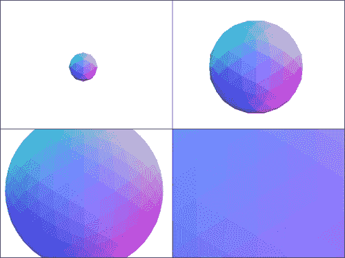

# 第五章：设计与开发

虽然其他章节已经关注了 Three.js API 及其如何用于构建游戏，但本章讨论了如何利用 Three.js 和 Web 平台制作**优秀的**游戏。我们将利用到目前为止所学的内容作为基础，来探索游戏设计概念和开发流程，研究性能考虑因素，并介绍基于 JavaScript 的游戏网络。

# 网络游戏设计

基于 WebGL 构建的游戏，其质量可以与或超过游戏机，这是可能的，而且这样做是一个值得追求的目标。此外，为网络构建游戏也提供了一个利用桌面游戏和游戏机无法实现的功能的机会，尽管也存在一些缺点。

例如，你可以围绕将游戏数据放在 URL 中构建机制。除了仅仅表示保存/加载点之外，URL 还可以编码拾取物、位置、随机种子或其他信息。加入分享功能后，用户就可以通过电子邮件或推文将链接发送给朋友，并立即进入游戏中的相同位置。与游戏机游戏不同，网络游戏可以利用病毒式动态、浏览器的普遍性和低门槛来吸引更多用户并引入新的游戏玩法。你可以想象需要一定数量玩家才能完成的协作解谜游戏——这个概念对于昂贵的游戏机游戏来说可能并不可靠。

同时，购买昂贵游戏机的玩家可能更有可能付出努力来克服初始的学习曲线。除非用户预先为你的游戏付费，否则重要的是要意识到用户可以像他们到达时一样轻易地离开你的游戏。游戏始终是关于平衡难度和参与度的；这是一个相同的公式，但考虑从点击你的着陆页到第一次品尝甜蜜满足感之间的时间间隔比以往任何时候都更重要。

基于 Web 的游戏还受益于强大的 API 和集成传统。当然，游戏机游戏也可以使用 API，但根据定义，基于 Web 的游戏通常可以依赖玩家拥有互联网连接，因此你可以想象游戏元素，如 Google Earth 的图像、基于 Foursquare 数据的位置名称和提示，以及积极使用社交网络的 AI 角色。特别是，你可以轻松地将支付处理集成到你的游戏中，可能甚至是在收银台或 ATM 机上叠加，并合理预期许多用户将能够通过键盘更容易地输入他们的信用卡信息，而不是使用游戏手柄。这为非传统支付方式打开了大门，这些支付方式不需要预先收费购买游戏，更类似于移动游戏通常从应用内销售中赚钱的方式。

此外，笔记本电脑用户对摄像头和麦克风的访问需求正在迅速增长，Chrome 和 Firefox 现在通过 WebRTC API 支持这些外围设备。这项技术的潜在用途远不止简单的聊天。环境声音可以被检测并用于调整游戏音乐的节奏。借助一些机器视觉或 Leap Motion 设备，用户可以通过挥手直接与游戏互动，而不是操纵鼠标。想象一下一款《过山车大亨》游戏，你真的可以拿起游客并将他们扔到公园的另一边！机器视觉还有许多其他酷炫的应用。*约翰·卡马克*（多款标志性游戏如《毁灭战士》和《雷神之锤》的首席程序员）最近建议在用户眨眼时进行垃圾回收。麻省理工学院的研究表明，摄像头视频可以用来准确识别游客的心率，这可以让游戏调整它们的节奏以匹配（或补偿）用户的兴奋程度（[`people.csail.mit.edu/mrub/vidmag/`](http://people.csail.mit.edu/mrub/vidmag/））。而且，手部追踪技术已经被用于 3D 建模、游戏开发，甚至火箭设计。

其他外部设备，如 Oculus Rift 增强现实头盔，也可以得到支持，以便更深入地集成到你的环境中。（Three.js 实际上在`examples/js/controls`文件夹中包含了一个 Oculus Rift 的控制器）。例如，手机可以用作网络游戏的控制器，正如在[http://cykod.com/blog/post/2011-08-using-nodejs-and-your-phone-to-control-a-browser-game](http://cykod.com/blog/post/2011-08-using-nodejs-and-your-phone-to-control-a-browser-game)和[`blog.artlogic.com/2013/06/21/phone-to-browser-html5-gaming-using-node-js-and-socket-io/`](http://blog.artlogic.com/2013/06/21/phone-to-browser-html5-gaming-using-node-js-and-socket-io/)中描述的那样。一些浏览器也提供了对传统 USB 游戏控制器的实验性支持；一个帮助实现这一点的库可以在[`www.gamepadjs.com/`](http://www.gamepadjs.com/)找到。手机和平板电脑甚至可以用作额外的屏幕——可能是用于小地图、物品清单或后视镜。

话虽如此，鉴于网络普遍可用，考虑一下可能访问你的游戏的设备和它们可能面临的限制。不同的屏幕尺寸和分辨率并不新鲜，但触摸控制尤其可能给 3D 游戏带来挑战。尽管如此，将传统的网络开发技术应用于游戏可以产生创造性的解决方案。例如，采用优雅降级/渐进增强的方法，移动用户可以收到观众视角或其他简化的游戏版本。或者，当没有键盘和鼠标时，你可以提供屏幕上的控制，可能使用 HTML5 虚拟游戏控制器库([`github.com/austinhallock/html5-virtual-game-controller`](https://github.com/austinhallock/html5-virtual-game-controller))。

最后一点需要思考：由 Three.js 驱动的游戏可以与现有网站无缝集成。例如，大多数游戏需要菜单，而在 HTML 中创建它们比在 3D 中要容易得多。不要觉得你的整个应用程序必须仅显示在画布上。另一方面，如果你想发挥创意，你实际上可以在 Three.js 环境中嵌入 HTML。你可以在[`learningthreejs.com/blog/2013/04/30/closing-the-gap-between-html-and-webgl/`](http://learningthreejs.com/blog/2013/04/30/closing-the-gap-between-html-and-webgl/)和[`jensarps.de/2013/07/02/html-elements-in-webgl-recursion/`](http://jensarps.de/2013/07/02/html-elements-in-webgl-recursion/)了解更多关于如何做到这一点。

# 性能

在某些方面，浏览器中 3D 游戏性能的考虑与控制台和桌面游戏非常相似。最大的区别是所有资源必须（至少最初）流式传输到客户端，而不是从磁盘读取。对于具有数十亿字节资产的复杂 3D 游戏，克服低带宽客户端的这一限制可能是一个严重的挑战。

### 小贴士

如传奇程序员**唐纳德·克努特**所写：

> "过早优化是万恶之源。"

本节讨论了最佳实践和建议，以从你的游戏中获得出色的性能，但在投入大量精力之前，你应该测量和测试你的应用程序，以查看瓶颈在哪里，以及这些努力是否值得。

# 带宽/网络限制

为了应对带宽限制，你应该做的第一件事是应用传统的优化，这些优化是网络开发者多年来一直在使用的：使用`gzip`压缩服务器发送的内容，合并并压缩 JavaScript 以最小化浏览器需要向服务器发出的请求数量，优化你的图像，启用 Keep-Alive 头，从有限数量的域中提供资产，并使用头信息利用浏览器缓存，以及其他技术。

### 小贴士

优化网站通常是一个特别详细的话题，但本节主要专注于解释针对游戏的优化。如果您想了解更多关于 **Web 性能优化**（**WPO**）的信息，可以从 Google 和 Yahoo! 的这些规则开始：

+   [`developers.google.com/speed/docs/best-practices/rules_intro`](https://developers.google.com/speed/docs/best-practices/rules_intro)

+   [`developer.yahoo.com/performance/rules.html`](http://developer.yahoo.com/performance/rules.html)

然而，复杂的游戏无法依赖于浏览器缓存来处理用户的回访，因为浏览器对缓存资源在整个网站中可以消耗的最大内存量有限。当用户浏览其他网站时，您的游戏资源可能会被推离缓存，而且缓存的大小可能对于所有资源来说也太小了。因此，下一个需要寻找优化的地方是在您的游戏内部进行缓存，以最小化需要发出的服务器请求数量。这可以通过三种方式实现。首先，您可以将资源存储在其他缓存中。IndexedDB API ([`developer.mozilla.org/en-US/docs/IndexedDB`](https://developer.mozilla.org/en-US/docs/IndexedDB)) 支持存储文件，而 Web Storage API ([`developer.mozilla.org/en-US/docs/Web/Guide/API/DOM/Storage#localStorage`](https://developer.mozilla.org/en-US/docs/Web/Guide/API/DOM/Storage#localStorage)) 支持存储字符串（包括 JSON，因此您可以存储导出的 Three.js 对象）。Chrome 还支持 FileSystem API ([`www.html5rocks.com/en/tutorials/file/filesystem/`](http://www.html5rocks.com/en/tutorials/file/filesystem/))，它可以管理一个沙盒化的本地文件系统。其次，您可以通过在客户端生成一些资源来减少您需要的资源总数。例如，如果您需要不同颜色的相似纹理，动态地在客户端修改这些纹理可能比请求服务器上的多个图像更有意义。或者，如果您可以用一个方程组来描述网格应该如何动画，您可能考虑在客户端手动动画它而不是发送动画数据。第三，您确保您的代码结构允许重用资源而不是反复请求它们。例如，如果两个网格使用相同的纹理，您应该尝试只加载一次纹理，而不是两次。

最后，您可以使用比标准基于文本的文件具有更高压缩率的二进制格式来导入网格，以减少服务器需要发送到客户端的资产大小。为此，您应该将您的网格导出为 Wavefront OBJ / MTL 文件，然后使用 `utils/converters/obj/convert_obj_three.py` 中的转换脚本生成一个 `THREE.BinaryLoader` 可以导入的文件。（运行脚本的说明在文件顶部。）

除了减少从服务器检索的资源总大小外，你还可以在用户不需要看到它的情况下尽可能多地加载数据。例如，如果玩家从菜单进入你的游戏，你可以在玩家浏览菜单时开始加载，而不是等到他们点击开始游戏。你也可以等到玩家进入游戏后再加载场景中最初不可见的部分，以便让玩家尽可能快地开始游戏。例如，基于线性任务的游戏可以等到玩家到达某些检查点时再加载地图的部分。只是确保你有一个后备计划，以防资源加载缓慢且玩家过早地到达未加载的区域。你可能想要有一个门，直到资源加载完毕才打开。你也可以在玩家处于过渡位置时暂时暂停游戏。

# 细节级别

类似地，当用户开始玩游戏时，你可以加载低多边形网格和低分辨率纹理，并在游戏过程中用更高细节的资产替换它们，无论是当加载较大资产时还是当用户足够接近它们以看到改进的细节时。后者技术称为**细节级别**（**LOD**），Three.js 使用 `THREE.LOD` 对象内置了对它的支持。例如，我们可以修改我们在第一章中构建的旋转形状示例，根据我们离球体有多近来改变球体的细节。首先我们需要改变我们如何将网格添加到场景中：

```js
geometry = [
  [new THREE.IcosahedronGeometry(200, 4), 50],
  [new THREE.IcosahedronGeometry(200, 3), 300],
  [new THREE.IcosahedronGeometry(200, 2), 1000],
  [new THREE.IcosahedronGeometry(200, 1), 2000],
  [new THREE.IcosahedronGeometry(200, 0), 8000],
];
material = new THREE.MeshNormalMaterial();

lod = new THREE.LOD();
for (var i = 0; i < geometry.length; i++) {
  var mesh = new THREE.Mesh(geometry[i][0], material);
  lod.addLevel(mesh, geometry[i][1]);
}
scene.add(lod);
```

`LOD` 对象存储不同复杂性的对象以及应使用更高细节版本的距离。为了使网格在相机靠近或远离时改变细节，我们将在动画循环中更新 `LOD` 对象：

```js
scene.traverse(function(object) {
  if (object instanceof THREE.LOD) {
    object.position.z = 2500 * Math.cos(Date.now() / 1000);
    object.update(camera);
  }
});
```

我们在这里添加了一点点移动，这样我们就可以通过设置 `camera.position.z = 3000` 来更好地看到细节的变化。现在你应该能够看到细节的动态变化，如下面的截图所示：



随着相机靠近而细节增加的球体

# 渲染优化

Three.js 还内置了对其他与细节相关的优化支持，以便使处理更快。**剔除**，即从渲染中排除隐藏对象的过程，是一个常见的例子。Three.js 基于边界球体进行**视锥剔除**，这意味着它会避免花费宝贵的计算时间来计算屏幕外对象的视觉信息。它还默认进行**背面剔除**，隐藏网格面的背面。然而，它不进行**遮挡剔除**，这意味着它不知道不要渲染一个位于相机前方但被更靠近相机的另一个对象遮挡的对象。这些优化的含义是，大型网格通常应该分成几个较小的网格，如果只有大型网格的一部分在屏幕上，就可以减少计算量，并且默认情况下，缩短可视距离不会带来任何好处。这种简单的改变可能对于顶部视角游戏就足够了，在这种游戏中，很少有对象被其他对象遮挡。其他游戏，如第一人称射击游戏，其中建筑物或地形可能会阻挡长距离的视野，可能需要以其他方式补偿。例如，如果你有非常大的或详细的场景，你可能需要手动进行遮挡剔除。游戏引擎通常使用一种称为**深度测试**的技术来完成这项工作，但对于封闭布局（如建筑物的内部）来说，一个更简单的方法是根据视距创建包含世界不同区域的不可见立方体，然后在玩家足够接近时切换这些区域内部网格的可见性。

我们已经在第二章中讨论了合并几何体的优势，*构建世界*，但你还可以通过将静态几何体转换为 `BufferGeometry` 来获得额外的性能提升。`BufferGeometry` 通常比标准 `Geometry` 渲染更快，因为它使用的数据结构更接近将被传递给 GPU 的数据结构，而不是人类容易理解的数据结构。因此，它更难操作，但如果你知道你的几何体不会改变，它工作得很好。使用 `BufferGeometry` 的最简单方法是使用 `examples/js/BufferGeometryUtils.js` 中的实用工具从现有的 `Geometry` 转换。

```js
THREE.BufferGeometryUtils.fromGeometry(geometry);
```

你可以使用结果与网格相同的方式使用正常几何体。

另一种强大的优化是改变画布的分辨率。假设 `renderer` 和 `camera` 是全局变量，你可以使用此函数来做到这一点：

```js
var resize = (function() {
  var canvas = renderer.domElement;
  canvas.style.width = canvas.width + 'px';
  canvas.style.height = canvas.height + 'px';
  var originalWidth = canvas.width;
  var originalHeight = canvas.height;
  return function(scale) {
    canvas.width = Math.round(originalWidth*scale);
    canvas.height = Math.round(originalHeight*scale);
    camera.aspect = canvas.width / canvas.height;
    camera.updateProjectionMatrix();
    renderer.setSize(canvas.width, canvas.height);
  }
})();
```

你可以通过调用`resize(0.5)`这样的函数来使用此功能，这将允许渲染器只绘制`0.5*0.5 = 25%`的像素，即使画布在屏幕上占据相同的空间。（`scale`参数始终相对于画布的原始大小。）这是因为画布基本上只是图像。就像你可以在 CSS 中通过不改变其实际大小来调整图像的大小一样，你也可以调整画布的大小。在我们的`resize`函数中，我们首先通过改变其`width`和`height`属性来减小画布的实际大小，然后使用 CSS 的宽度和高度样式将其放回原来的大小。结果是，画布占据的屏幕空间与原来相同，但每个实际像素显示得更大。这显著减少了渲染场景所需的计算量，尽管场景会变得模糊。

### 小贴士

改变画布的分辨率会影响你需要计算用户点击位置的方式。你应该跟踪画布的当前缩放比例，并相应地调整第三章中点击方法中的屏幕空间向量，*探索和交互*：

```js
  var vector = new THREE.Vector3(
    scale *  renderer.devicePixelRatio * (event.pageX - this.offsetLeft) / this.width * 2 - 1,
    scale * -renderer.devicePixelRatio * (event.pageY - this.offsetTop) / this.height * 2 + 1,
    0.5
    );
```

为了速度而牺牲视觉细节的技术在结合帧率测试时特别有用。如果在某个测试期间，帧率低于某个特定阈值的时间超过给定百分比，你可能想要降低游戏的细节级别。（在实施此方法之前，你应该找出你的瓶颈是什么。如果你的帧率低是因为你的物理循环运行时间过长，降低视觉细节可能帮助不大。）

### 小贴士

如果物理是你的瓶颈，你可以按照第三章中讨论的，以低于渲染的帧率运行你的物理，第三章：探索和交互。你也可能想要考虑使用 Web Worker API（[`developer.mozilla.org/en-US/docs/Web/Guide/Performance/Using_web_workers`](https://developer.mozilla.org/en-US/docs/Web/Guide/Performance/Using_web_workers)）来并行执行 JavaScript 代码。这可以允许在不阻塞渲染的情况下计算运动和碰撞。在第三章中引入的 Physi.js 库，*探索和交互*，会自动执行此操作。

# 电池续航和 GPU 内存

尽管带宽/网络速度和处理器时间通常是影响 Three.js 游戏性能的最主要因素，但电池寿命和内存限制也可能发挥作用。对于硬核游戏，你可能可以假设用户已经插上电源，但更休闲的游戏应该意识到更多的处理通常意味着更多的电池消耗。在内存方面，问题更多是关于存储空间，而不是图形卡有限的嵌入式内存，它可以进行快速计算。你可以通过使用压缩纹理来限制你消耗的 GPU 板载内存量。通常，图像（如 JPG 和 PNG）在发送到 GPU 之前会被解压缩，但压缩纹理使用一种特殊的格式，允许 GPU 以压缩状态将它们保存在嵌入式内存中。由于压缩只对 GPU 有影响，实际上并不节省网络带宽。Three.js 支持 DDS 格式的压缩纹理。你可以这样将 DDS 纹理导入到 Three.js 中：

```js
var texture = THREE.ImageUtils.loadCompressedTexture(imagePath);
```

生成的`texture`值可以像处理普通图像一样处理；例如，你可以将其用作材质的`map`属性的值，Three.js 将自动知道如何处理它。

### 小贴士

要创建 DDS 图像，你可以使用 Gimp 的插件([`code.google.com/p/gimp-dds/`](https://code.google.com/p/gimp-dds/))或 Photoshop([`developer.nvidia.com/nvidia-texture-tools-adobe-photoshop`](https://developer.nvidia.com/nvidia-texture-tools-adobe-photoshop))。

# 性能测量工具

最后，还有一些非常有用的工具可以用来测量 JavaScript 的性能。方便的是，Three.js 的原始作者编写了一个名为 Stats.js 的库([`github.com/mrdoob/stats.js`](https://github.com/mrdoob/stats.js))，用于跟踪帧率，这是游戏中最关键的性能统计指标。对于全面的跟踪，Google 的 Web Tracing Framework([`google.github.io/tracing-framework/index.html`](http://google.github.io/tracing-framework/index.html))难以匹敌，它甚至提供了一个跟踪 WebGL 游戏的示例。你还可以使用来自*Jerome Etienne*的 RenderStats 库([`github.com/jeromeetienne/threex.rendererstats`](https://github.com/jeromeetienne/threex.rendererstats))轻松获取一些关于屏幕几何形状的统计数据。

对于暴力调试，你可能还想要尝试 console-extras 库，它使得在不输出数千条消息的情况下记录主游戏循环中发生的事情变得更加容易([`github.com/unconed/console-extras.js`](https://github.com/unconed/console-extras.js))。

# 网络和多人游戏

游戏网络很困难，因为网络的目标是在多个设备上保持游戏状态同步，但网络延迟阻止了设备以足够的速度进行通信以保持该状态偶尔不一致。此外，浮点舍入误差会在同一组输入（这是第三章中讨论的计时和移动技术发挥作用的地方，*探索和交互*），因为精度的小差异可能导致随时间产生巨大的差异）。因此，网络代码成为协调差异的过程。

根据游戏的需求，基本上有两种不同的网络方法。实时战略（RTS）和回合制游戏通常使用一种称为**锁步**的方法，这是一种对等模型，其中每台参与比赛的个人电脑都会将其命令发送给比赛中的其他所有电脑。这种模型的主要优势是只需要发送少量数据（玩家的命令）到网络上，因此当游戏状态非常大时（例如，当地图上有成千上万的单位时）非常有用。然而，在锁步模式下运行游戏依赖于所有玩家拥有游戏状态的相同副本，这在理论上是伟大的想法，但出于几个原因难以维持。首先，尽管 JavaScript 规范声明浮点计算应该是确定的，但在实践中，不同实现之间可能存在细微的差异，这可能导致客户端无法同步。

第二，所有客户端都将看到游戏以最延迟客户端的速度运行，因为必须收集每个玩家的命令才能前进以确保同步。因此，必须采取额外预防措施，以防止客户端通过假装具有更高的延迟并在做出决定之前等待其他电脑的命令来作弊。当一台机器需要特别长的时间来返回命令时，延迟问题也会造成麻烦。在这种情况下，游戏可能不得不放弃那个玩家。由于使用锁步的原因是整个游戏状态太大，无法在网络中传输同时保持同步，因此玩家在游戏开始后可能无法加入（或重新加入）。

游戏网络的其他方法是客户端-服务器预测模型，通常工作方式如下：

1.  客户端触发一些输入（例如按下键或移动鼠标）以改变游戏状态。

1.  客户端输入被发送到服务器。

1.  可选地，服务器将输入转发给其他客户端。

1.  服务器处理从所有玩家接收到的输入，进行协调，并在特定时间生成游戏状态的新的、权威的描述。

1.  如果服务器转发了其他客户端的输入，客户端会接收到这些输入，并通过预测服务器认为状态应该是什么来继续更新本地游戏状态。

1.  服务器定期向每个客户端发送权威游戏状态的最新完整描述。

1.  客户端调整其状态以与服务器官方状态同步。

与锁步相比，这里的主要区别是客户端可以独立推进游戏，整个游戏状态可以从服务器发送，以确保每个玩家看到的内容与其他人看到的内容非常接近。这对于像 FPS 或像大型多人在线游戏这样的多人游戏来说是一个更好的模型，因为玩家通常经历的延迟效应不那么剧烈。

为了减少玩家可能感受到的延迟，我们设计客户端-服务器通信为异步的，因为从服务器获取新的游戏状态可能因为网络延迟而花费很长时间。由于我们试图在等待服务器的同时本地运行游戏，当我们最终从服务器获得权威更新时，我们需要调整客户端。调整客户端可能很棘手。首先，当我们从服务器获得响应时，它发送给我们的状态将是过去的。为了处理这个问题，我们需要记录自上次我们获得官方服务器更新以来的所有玩家输入，将游戏回滚到新接收到的权威游戏状态，然后在此基础上重新播放任何更近期的输入。结果将是我们对服务器认为当前时间游戏状态应该是什么的最新猜测，这可能会与我们实际上向玩家展示的内容略有不同。我们本可以将当前游戏状态瞬间切换到理想的游戏状态，但这会使游戏看起来抖动，因为事物可能会突然传送。相反，如果状态之间的差异足够小，客户端应该在当前状态和预期的理想状态之间进行插值。如果我们偏离得太远，我们可以切换回服务器状态，但否则我们会在几帧内滞后，以确保平滑性。切换通常发生在复杂的物理交互或玩家碰撞时。

理想情况下，我们只想将玩家的输入发送到客户端，因为它们比完整游戏状态小（因此占用的网络数据包更少）。这可能是有数千名玩家的大型多人在线游戏的唯一合理处理方式。然而，这可能会因为浮点数舍入误差而随着时间的推移产生漂移，所以这可能不足以成为像第一人称射击游戏这样紧张动作游戏的唯一解决方案。作为折衷方案，输入可以频繁发送，而完整游戏状态只定期发送；然后客户端可以使用输入来预测游戏应该如何进展。

当然，并非所有物理现象都是由用户输入驱动的。如果你的游戏具有受自然驱动的游戏玩法物理特性，例如风或雪崩，你可能需要服务器在没有客户端预测的情况下模拟物理现象，而客户端只需处理一些延迟。另一方面，你可以在客户端完全模拟一些物理现象。例如，天空中的云彩在各个客户端上是否完全处于相同的位置并不重要，因为它们通常只是装饰性的。

服务器跟踪的游戏状态通常至少包括所有可移动角色的位置和速度、状态的唯一标识符以及时间戳。服务器不需要向每个客户端发送完整的场景导出，因为这会非常昂贵。然而，服务器确实需要模拟整个场景，以便准确更新游戏状态。

### 注意

想了解更多关于锁步的信息，请查看[`www.altdevblogaday.com/2011/07/09/synchronous-rts-engines-and-a-tale-of-desyncs/`](http://www.altdevblogaday.com/2011/07/09/synchronous-rts-engines-and-a-tale-of-desyncs/)和[`www.altdevblogaday.com/2011/07/24/synchronous-rts-engines-2-sync-harder/`](http://www.altdevblogaday.com/2011/07/24/synchronous-rts-engines-2-sync-harder/)。

想了解更多关于客户端-服务器预测的信息，请查看[`gafferongames.com/networking-for-game-programmers/what-every-programmer-needs-to-know-about-game-networking/`](http://gafferongames.com/networking-for-game-programmers/what-every-programmer-needs-to-know-about-game-networking/)。

想了解关于在权威状态和客户端状态之间进行插值的信息，请参阅[`www.gamedev.net/page/resources/_/technical/multiplayer-and-network-programming/defeating-lag-with-cubic-splines-r914`](http://www.gamedev.net/page/resources/_/technical/multiplayer-and-network-programming/defeating-lag-with-cubic-splines-r914)。

Rob Hawkes 有一个关于使用 HTML5 进行多人游戏开发的精彩 Google 技术演讲，其中包含许多关于克服常见陷阱的建议。您可以在[`www.youtube.com/watch?v=zj1qTrpuXJ8`](https://www.youtube.com/watch?v=zj1qTrpuXJ8)观看。

## 技术

Web Sockets API ([`developer.mozilla.org/en-US/docs/WebSockets`](https://developer.mozilla.org/en-US/docs/WebSockets)) 是在 JavaScript 中与游戏服务器保持快速连接的最实用方式，使用 Web Sockets 的最简单方法是使用服务器上的 node.js ([`nodejs.org/`](http://nodejs.org/)) 和 socket.io 库 ([`socket.io/`](http://socket.io/))。Node.js 允许 JavaScript 成为一等的服务器端语言，因此您可以一次编写游戏代码，并减少对服务器端和客户端模拟之间差异的担忧。在单一语言中编写服务器端和客户端代码在心理上也要容易得多。

### 注意

Web sockets 是我们目前能做的最好的选择，因为 JavaScript 在访问互联网方面没有桌面和控制台游戏那么多的控制权，这是出于安全考虑。Web sockets 实际上相当不错，但它们基于 **TCP**，这是一种常见的互联网访问方式，确保了可靠性但偶尔会造成延迟。许多使用客户端-服务器预测的桌面和控制台游戏使用 **UDP** 来访问互联网，它服务于与 TCP 相同的目的，但为了最小化延迟而牺牲了数据完整性保证。

Voxel.js ([`voxeljs.com/`](http://voxeljs.com/)) 是一个使用 Three.js 的网络游戏框架的好例子。如果你正在构建类似 Minecraft 的游戏，这是一个很好的起点。有关使用 Socket.io 和 Node.js 在 JavaScript 中编写游戏网络代码的更多信息及代码示例，可以在 [`buildnewgames.com/real-time-multiplayer/`](http://buildnewgames.com/real-time-multiplayer/) 找到。它以二维游戏为例，但所有内容都同样适用于三维游戏。

## 反作弊

在多人游戏中阻止作弊者是一个一般性的难题，在 JavaScript 中尤其困难，原因有三。一是很难检测客户端输入是否自动化或他们的显示是否非法更改；二是 JavaScript 代码相对难以混淆和验证，而不会带来显著的性能损失；三是作弊程序可以直接且容易地覆盖你的客户端代码。因此，反作弊努力通常集中在尽可能将逻辑从客户端移动到服务器，检测客户端活动的异常模式，最小化作弊的好处，并可能创建足够的烦人障碍，让一些有抱负的作弊者放弃。常见的方法包括：

+   只允许客户端向服务器发送白名单内的输入，而不是任意值；这允许受信任的计算机（服务器）执行重要计算，并避免让作弊者发出非法请求，例如`addPoints(1000000)`

+   跟踪用户玩游戏的时间长度；如果用户连续玩 48 小时，那么值得调查

+   跟踪用户操作之间经过的时间；如果用户每隔 10 分钟（可疑地准确）或 16 毫秒（可疑地快）点击屏幕的同一部分，他们可能正在自动化他们的行为

+   报告“快速瞄准”，这是第一人称射击游戏中的一种行为，即当没有任何障碍物时，立即转向射击目标，即使目标不在屏幕上，也永远不会错过

+   使调试更困难，例如通过禁用控制台日志记录（`console = {}`）并将整个客户端代码包裹在一个闭包中，以防止任何全局变量轻易被作弊者的脚本访问

+   让用户更容易报告滥用行为

这当然不是一份详尽的清单，而且完全阻止作弊者是非常困难的，但这些建议是一个合理的起点。

### 小贴士

通常认为在单玩家模式中防止客户端作弊是不好的做法，除非是其他玩家可以看到的物品，例如高分。

# 开发流程

不论你是作为爱好构建游戏的个人还是大型游戏出版商的开发者，你都可以从遵循从 Web JavaScript 开发和在其他平台上的游戏开发中吸取的一些最佳实践中受益。你还可以在不偏离你喜欢的游戏开发流程的情况下构建基于 Three.js 的游戏。

## JavaScript 最佳实践

在前面的章节中，我们并没有非常关注我们代码的高级结构。我们编写了一些作为单个 HTML 文件的示例，并将 FPS 和 CTF 项目拆分为单独的文件，但对于精炼的游戏，我们应该更加小心，尤其是在与团队合作时。一般的编码课程适用：

+   根据文件类型/目的将资源放在文件夹中。例如，在较高层次上，你可能会有`css`、`js`、`images`、`models`和`sounds`这样的文件夹。在`js`文件夹中，根据目的组织 JavaScript 文件；将库、源代码和生成代码分开。

+   避免在类构造函数中放置直接处理用户输入事件监听器的代码，因为这会使它们更难重用和扩展。

+   使用单独的文件来配置/常量，你可以调整这些文件来改变游戏的感觉。

+   检测特性而不是浏览器，因为不同的浏览器版本支持不同的特性，某些特性可以在浏览器设置中打开或关闭。

+   避免在动画循环中使用`setTimeout`和`setInterval`作为计时器，因为有很多单独的计时器可能会导致性能问题。相反，检查动画循环中经过的时间，例如使用`Date.now()`或`THREE.Clock`。

    ### 小贴士

    如果你的游戏可以暂停，确保你不会包含暂停期间的时间流逝。

+   虽然将整个应用程序用 JavaScript 编写可能感觉很自然，但尽量避免在 JavaScript 中创建新的 DOM。这样做很慢，而且 HTML 和 CSS 存在是有原因的。（此外，不要害怕使用 HTML 和 CSS；有时这比编写自定义着色器要简单得多。）

+   使用样式指南。你选择哪个并不特别重要，但保持一致的样式有助于避免那些在其他情况下容易受到 JavaScript 动态类型和表达性语法影响的愚蠢错误。

+   对于习惯于经典面向对象编程的开发者来说，JavaScript 的原型继承往往感觉有些奇怪。主要优势在于它是动态的（您可以在创建后向原型和对象添加新属性）；没有*菱形问题*（您永远不会因为多个祖先而出现歧义）；并且在没有僵化结构的情况下简单地做您想做的事情要简单得多。我们已经看到 Three.js 使用了一个继承模式；您也可以在代码中使用面向对象模式，了解 JavaScript 在这方面而不是与其弱点作斗争的优势会有所帮助。

强烈推荐使用 Grunt ([`gruntjs.com/`](http://gruntjs.com/))来简化您的发布和测试工作流程，因为它有助于最小化从做出更改到在实际操作中测试它之间的时间。Grunt 是一个命令行工具，执行预定义的任务，因此您可以轻松地执行其他发布步骤。例如，生产代码应该被压缩、连接，并检查语法错误，Grunt 可以使用 UglifyJS 和 JSHint 项目来完成这些任务。如果您的项目是开源的、足够大，或者有足够的人需要单独的文档，JSDuck ([`github.com/senchalabs/jsduck`](https://github.com/senchalabs/jsduck))是一个有用的工具，可以从代码注释中自动生成它（Grunt 也支持它）。您可以在[`flippinawesome.org/2013/07/01/building-a-javascript-library-with-grunt-js/`](http://flippinawesome.org/2013/07/01/building-a-javascript-library-with-grunt-js/)找到关于如何开始使用 Grunt 的精彩教程。

## 现有的工作流程和关卡开发

为了制作基于 Three.js 的游戏，工作室现有的游戏开发流程可能不需要太多更改。一些程序员可能甚至不需要学习 JavaScript，如果他们已经熟悉它，因为许多语言编译成 JavaScript。现有的流程可以保持不变，用于测试和生成，以及开发提案、概念、分镜脚本、模型、纹理、声音和其他资源。最大的挑战在于组装这些资源——将关卡构建到 Three.js 场景中。目前还没有为需要它们的 Three.js 游戏设计关卡的优秀工具，部分原因是因为 Three.js 是一个图形库，而游戏有很多难以很好地为单个工具概括的自定义要求。关卡编辑器通常与游戏引擎及其提供的类紧密相关。

原始的 Three.js 作者创建了一个场景编辑器，您可以在[`mrdoob.github.io/three.js/editor/`](http://mrdoob.github.io/three.js/editor/)尝试使用。这对于小型项目很有用，但对于大型项目来说很快就会变得难以控制（尤其是在多人同时在一个项目上工作时）。此外，场景编辑器无法处理自定义对象，如出生点，因此如果您使用它，至少每个级别的部分将需要使用自定义代码来定义。

因此，如果你需要创建多层结构或者需要以可视化的方式创建，你可能需要构建自己的场景布局工具。你可以通过几种方式来实现这一点。首先，Three.js 场景编辑器是 Three.js 项目的一部分（位于 `editor` 文件夹中），所以你可以从这里开始并对其进行编辑。其次，你可以尝试为现有的级别开发工具编写导出器或为其保存文件编写转换器，然后编写自定义的 Three.js 加载器。第三，你可以尝试从头开始编写自己的工具。好消息是，一旦你编写了一个，你就可以在其他项目中再次使用它。

### 小贴士

显然，如果你打算构建多个 Three.js 项目，编写可重用组件是有帮助的。在编写自己的组件之前，你可能想查看由 *Jerome Etienne* 开发的两个 Three.js 辅助库：一个名为 **tQuery** 的扩展系统，以及一系列称为 **THREEx** 的实用工具，分别可在 [`jeromeetienne.github.io/tquery/`](http://jeromeetienne.github.io/tquery/) 和 [`jeromeetienne.github.io/threex/`](http://jeromeetienne.github.io/threex/) 找到。

Voxel.js ([`voxeljs.com/`](http://voxeljs.com/)) 是一个拥有自己级别编辑器的游戏引擎的好例子。它还包含许多模块（包括一个多人模块），你可以将其插入。它专为类似 Minecraft 的游戏设计，但你可能也能将其作为其他大型项目的起点。

# 摘要

在本章中，我们学习了设计和开发高质量网页游戏。我们涵盖了游戏设计和开发中独特的网络方面，以及 Three.js 如何支持这些方面；重要的性能考虑因素；以及基本的客户端-服务器和同步网络。

你现在已经准备好拥抱下一代游戏了。恭喜你！
