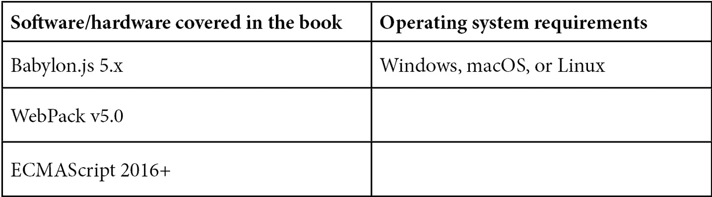

# 前言

3D 应用和游戏开发的世界是一个广阔且不断变化的领域。通过 WebGL 将现代 GPU 硬件的所有令人惊叹的功能暴露给网络浏览器，任何人只要有一些 JavaScript 知识，就能实现 AAA 质量的交互式渲染。Babylon.js 正是实现轻松体验和强大应用（使用 WebGL 技术构建）的正确工具。

虽然浏览器软件和硬件标准的改变和演变以它们自己的速度和自己的时间表进行，但 Babylon.js 是一个优先考虑保持向后兼容性的框架。为 BJS 2.0 编写的代码在 BJS 5.20 中运行时几乎不需要任何修改，因此产品经理和利益相关者可以放心使用 BJS，对其代码的长期稳定性有信心。

如果 Babylon.js 是 WebGL 的通行证，那么这本书就是您掌握 Babylon.js 的通行证。好吧，我们得现实一点，你可能不会在本书结束时成为第二十级的 Babylon.js 开发者，但你会学到关键的概念和技术，这将使你能够选择继续前进！

所有这些开始变得像是一种糟糕的销售说辞，所以我们还是放弃这种虚伪，直接谈谈正题。你可能需要了解 3D 游戏或应用开发。作为一个人类，你也渴望娱乐。这本书试图通过尽可能避免无聊，同时仍然传递重要的知识，来满足这两个需求。娱乐与启迪，一包搞定。

# 本书面向的对象

这本书是为那些因为认为自己数学不好而避免编码的艺术家（给自己更多信用吧！），渴望离开电子表格的游戏设计师，以及梦想创造未知世界的开发者而写的。这本书是为那些想在课堂外学习的学生，想在课堂内让学生学习的老师，以及希望他们的青少年孩子学到一些东西的父母而写的。

# 本书涵盖的内容

*第一章*，*太空卡车操作手册*，概述了太空卡车和 Babylon.js 的 3D 开发世界。

*第二章*，*Babylon.js 入门*，通过一个简单的 3D 动画场景让我们开始（或重温）Babylon.js。

*第三章*，*建立开发工作流程*，为快速未来的开发提供了一个坚实的设计和构建时间体验。

*第四章*，*创建应用*，涉及构建一个有状态的应用程序，该程序将托管游戏。

*第五章*，*添加剪辑场景和处理输入*，通过命令式创建一个动画“剪辑场景”，并学习如何处理不同类型的用户输入。

*第六章*，*实现游戏机制*，开始了游戏主要路线规划阶段的构建。在这里，我们将现有的物理引擎与轨道力学和模拟重力相结合。

*第七章*，*处理路线数据*，涉及添加与空间生物群落相对应的随机遭遇表。

*第八章*，*构建驾驶游戏*，带我们了解动态生成路线并允许玩家沿着路线驾驶。

*第九章*，*计算和显示评分结果*，讨论了使用 GUI 编辑器捕获和显示玩家性能统计的复用对话框。

*第十章*，*通过光照和材质改进环境*，介绍了我们如何通过增强关键视觉元素来改善游戏的外观和感觉。

*第十一章*，*探索着色器的表面*，讨论了扩展类比来解释着色器以及编写不涉及编写任何着色器代码的着色器代码。

*第十二章*，*测量和优化性能*，解释了测试运行时性能的启发式方法和改进策略，以及使用 SceneOptimizer 工具的动态运行时优化。

*第十三章*，*将应用程序转换为 PWA*，探讨了将应用程序准备为**渐进式 Web 应用程序**（**PWA**）的过程。然后我们将其发布到主要应用商店，并添加离线使用支持。

*第十四章*，*扩展主题，扩展*，在深入研究 CMS 或电子商务场景中的逼真光线追踪和 Babylon.js 之前，探讨了使用 WebXR 和 Babylon Native 的 AR/VR。

# 为了充分利用这本书

在参与这本书中的活动之前，您至少应该对 JavaScript 有初步的了解，至少到您不会因为看到可能最初不熟悉的代码而感到困扰。了解基本 3D 概念和术语也有帮助。如果您是 Babylon.js、JavaScript 或 3D 开发的初学者，那么从 Babylon.js 的起始页面[`doc.babylonjs.com/journey/theFirstStep`](https://doc.babylonjs.com/journey/theFirstStep)开始是一个绝佳的选择。



建议使用具有 Mozilla 或 Chrome 渲染引擎的网页浏览器，因为它对各种 WebGL 和 WebGPU 功能的支持程度最高。已知 Safari（WebKit）在支持列表中与所列的其他引擎相比，功能相似但支持程度显著落后。

**如果您使用的是本书的数字版，我们建议您亲自输入代码或从本书的 GitHub 仓库（下一节中提供链接）获取代码。这样做将帮助您避免与代码复制粘贴相关的任何潜在错误。**

*Babylon.js 社区是获取与 BJS 相关一切帮助的最有价值的资源。作为一个开源项目，Babylon.js 通过其致力于的贡献者社区保持活力。谁可以贡献？任何人。可以贡献什么？几乎任何东西。加入 BJS 社区，在官方论坛[`forum.babylonjs.com`](https://forum.babylonjs.com)上，与团队见面！*

# 下载示例代码文件

您可以从 GitHub 下载本书的示例代码文件：[`github.com/jelster/space-truckers/`](https://github.com/jelster/space-truckers/)。如果代码有更新，它将在 GitHub 仓库中更新。

我们还有其他来自我们丰富图书和视频目录的代码包，可在[`github.com/PacktPublishing/`](https://github.com/PacktPublishing/)找到。查看它们！

# 下载彩色图像

我们还提供了一份包含本书中使用的截图和图表彩色图像的 PDF 文件。您可以从这里下载：[`packt.link/CGb69`](https://packt.link/CGb69)。

# 使用的约定

本书中使用了多种文本约定。

`文本中的代码`：表示文本中的代码单词、数据库表名、文件夹名、文件名、文件扩展名、路径名、虚拟 URL、用户输入和 Twitter 昵称。以下是一个示例：“`createSpinAnimation`方法从`createStartScene`调用，以便将`spinAnim`变量提供给场景的其他控制代码。”

代码块按以下方式设置：

```js

planets.forEach(p => {
    p.animations.push(spinAnim);
      scene.beginAnimation(p, 0, 60, true, BABYLON.Scalar.RandomRange(0.1, 3));
});
```

当我们希望您注意代码块中的特定部分时，相关的行或项目将以粗体显示：

```js

planets.forEach(p => {
        glowLayer.addExcludedMesh(p);
        p.animations.push(spinAnim);
        scene.beginAnimation(p, 0, 60, true, BABYLON.Scalar.RandomRange(0.1, 3));
    });
```

任何命令行输入或输出都按以下方式编写：

```js
npx webpack –config webpack.common.js
```

**粗体**：表示新术语、重要单词或屏幕上看到的单词。例如，菜单或对话框中的单词以粗体显示。以下是一个示例：“点击**运行**现在应该显示一个在天空中可以旋转的漂亮星系。”

小贴士或重要注意事项

看起来是这样的。

# 联系我们

我们始终欢迎读者的反馈。

`customercare@packtpub.com`并在邮件主题中提及书名。

**勘误表**：尽管我们已经尽一切努力确保内容的准确性，但错误仍然可能发生。如果您在这本书中发现了错误，我们将不胜感激，如果您能向我们报告这一点。请访问[www.packtpub.com/support/errata](http://www.packtpub.com/support/errata)并填写表格。

`copyright@packt.com`并附上材料的链接。

**如果您有兴趣成为作者**：如果您在某个领域有专业知识，并且有兴趣撰写或为书籍做出贡献，请访问 [authors.packtpub.com](http://authors.packtpub.com)。

# 分享您的想法

一旦您阅读了《与 Babylon.js 走得更远》，我们很乐意听听您的想法！请点击此处直接进入此书的亚马逊评论页面并分享您的反馈。

您的评论对我们和科技社区都至关重要，并将帮助我们确保我们提供高质量的内容。

# 第一部分：构建应用程序

本书的第一部分建立了将在后续章节中利用的重要基础。从对太空卡车和 Babylon.js 的概述开始，我们将构建游戏托管应用程序的主要支柱。虽然建议对 Babylon.js 有基本了解，但主要要求是您需要对 JavaScript 或类似编程语言有所了解。

本节包括以下章节：

+   *第一章*, *太空卡车操作手册*

+   *第二章*, *Babylon.js 入门*

+   *第三章*, *建立开发工作流程*

+   *第四章*, *创建应用程序*

+   *第五章*, *添加剪辑场景和处理输入*
