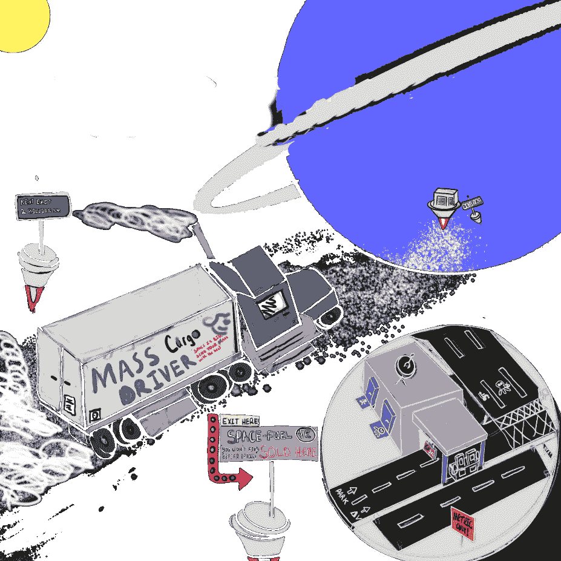
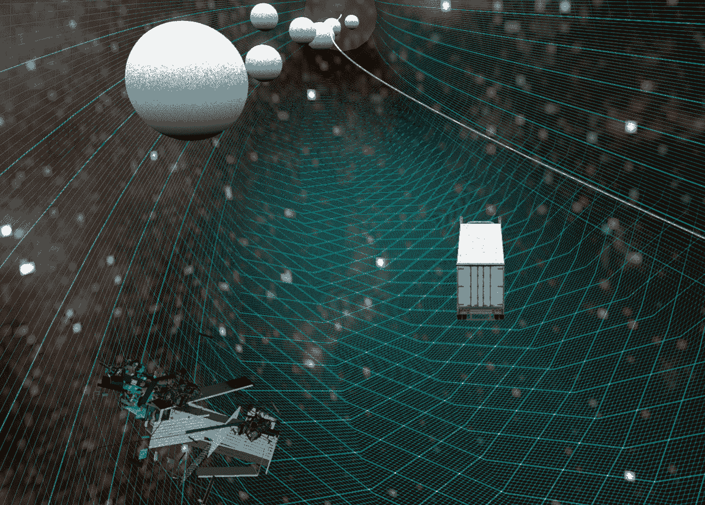
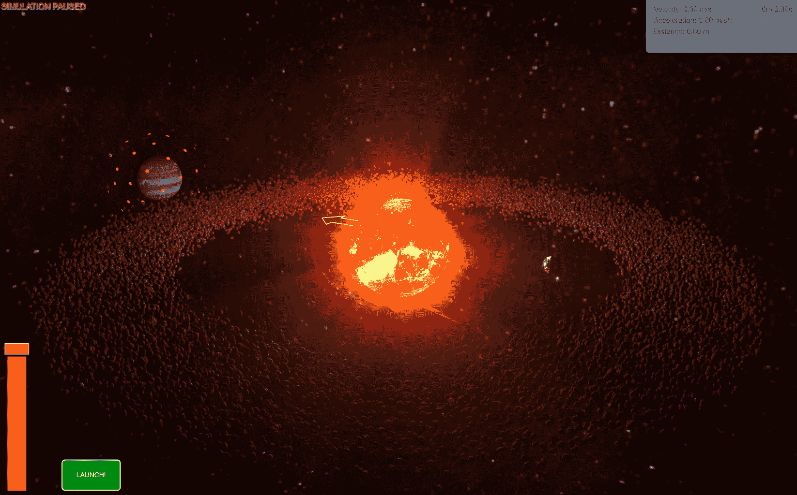
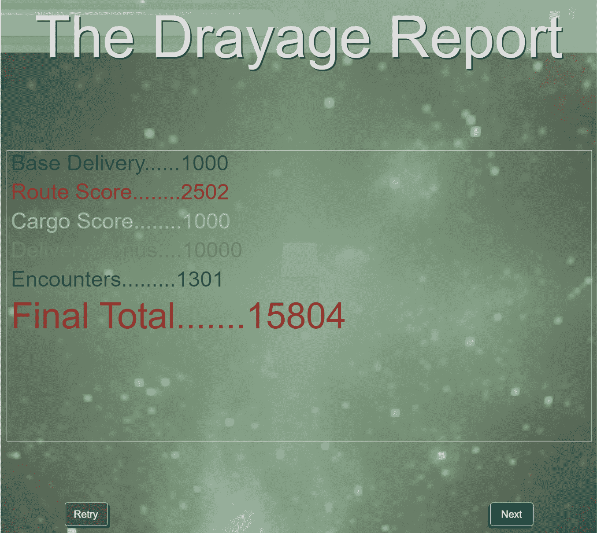
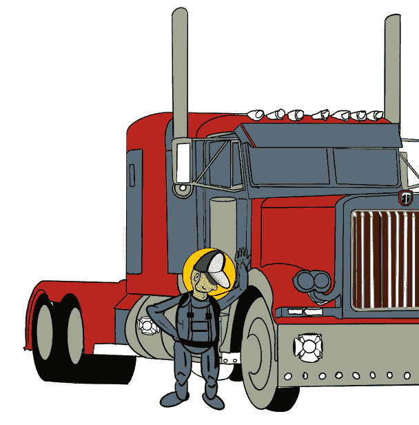
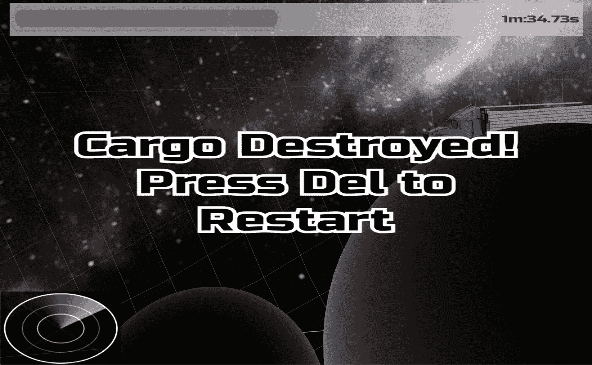
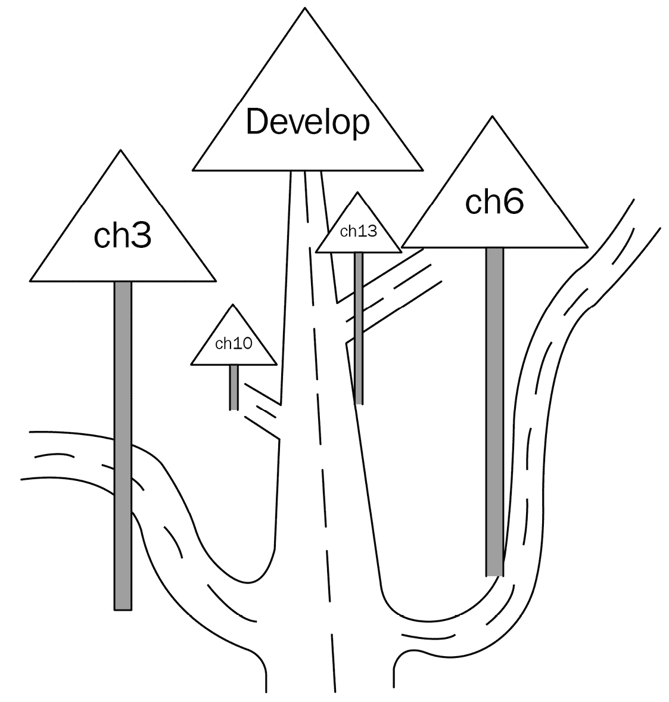

# Space-Truckers 操作手册

并不是一种非常情感成熟的立场，仅凭封面来判断一本书，但你看过这本书的封面吗？如果你喜欢，那么请，无论如何，你这位反文化影响者，请继续阅读这本书吧！

如果出于某种原因你不喜欢封面，那么恭喜你，你实际上是在翻过新的一页来看里面的内容——与那些*一些*肤浅的笨蛋不同。毕竟，我们不会做出那种微不足道的评判。

注意

有时，相关信息将呈现在这些注意事项框中。有时，这些相同的框将包含完全无关但可能是不敬的信息。在任何时候，或者在任何时候（有时），你应该注意这些框中的内容。

无论你是封面团队还是内容团队，很明显，你非常聪明，举止得体，仅仅因为你开始阅读这本书。我们将在接下来的 14 章中一起踏上旅程。这不是你在睡前寻找观看内容时翻阅频道时可能会遇到的旅程。这是一次穿越广阔而浩瀚的**Babylon.js**生态系统的旅程。这不是一次狩猎之旅，但确实是一次旅行。然而，它不是一次奥德赛。主要是因为你实际上不必真正去任何地方，而且当你不阅读这本书时，你可以随时回到你的日常生活，也许还有其他原因。

重要注意事项

就像它的不那么出名的表亲 Note 一样，重要的注意事项框偶尔会露面。通常，这些用于你可能后悔不知道的事情之前…

在我们这次旅途中，我们将覆盖大量内容，但你们不会是无准备的旅行者。我们的总体目标是构建一个由通用网络应用程序托管的游戏。在接下来的三个独立部分中，我们将逐步完成以下三件事：

+   创建并设置一个应用程序和开发工作流程，为*Space-Truckers: The Video Game!*提供一个生存空间

+   在我们的应用程序上添加额外的功能（托管*Space-Truckers: The Video Game!*）

+   放大细节级别，以接受广泛的增强并补充我们的良好知识

每一章都将建立在上一章的基础上。有可能某一章中的代码需要在后续章节中进行修改，这应该被视为我们不断深化对如何构建应用程序以实现当前目标的理解的反映。除了这一章之外，每一章都包含指向游戏代码的链接，这些链接与章节文本的上下文相同，此外还有针对内容的实时演示和 Playground 链接。

在我们构建应用的同时，我们将越来越少地提供逐行代码的细节，转而提供更多上下文和/或与“内部工作原理”相关的信息。别担心，代码和游乐场示例仍然在那里帮助您找到方向！我们将探讨一些概念，这些概念本身就可以占据比这本不太短的书籍还要长的整本书，而我们将在更少的篇幅中展开这些话题。因此，我们将从高层次覆盖一些领域，而其他领域将进行更深入的讨论。

我们将从玩家的角度开始介绍游戏，然后转向查看底层游戏和应用设计。作为结尾，我们将通过参观太空卡车 GitHub 仓库和其他在线资源来结束这次第一段旅程。让我们以经典文学的方式从结尾开始。

注意

对于这个场景的电影版本，想象一下当我们过渡到不同的世界时，有一种闪烁的溶解效果和适当的声音效果…

## 介绍太空卡车世界

天文学家最近开始收到一个神秘的信号，显然来自我们的太阳系之外。这个信号远非随机噪声，它似乎包含以文本、音频和视觉内容形式的结构化数据——一个外星传输！传输从术语和数学的基本入门开始，迅速发展到描述某种大型塑料盘，上面印有信息中称为“多媒体互动内容”的东西，然后连接到显示设备并旋转（多么荒谬！）数千转/分钟，同时激光束读取烧录在旋转盘上的凹槽。激光束。凹槽。旋转的轮子。所有这些都是荒谬的，但外星人的感觉又怎么能解释呢？

以下是从该传输中恢复的内容重建，并烧录在现在被称为“死海光盘”上的内容。由于其穿越时空的性质，传输的部分内容没有收到，数据无法恢复。同时，数据的关联性质导致其他部分被损坏。因此，您即将看到的许多图像和静态画面代表的是使用我们可用的最佳工具和资源修复的数据。

才华横溢的专业工程师、科学家，甚至是社会学家团队长期辛勤工作，以重建我们认为留下或发送给我们这个记录的人们——或我们收到的记录——的外观：


图 1.1 – 对太空卡车传输发起者的外观的最佳猜测

下一个部分包含从传输中恢复的重建文本和图像内容。因为原始信息是以象征性表达而非任何人类语言，所以最新的 GPT-3 文本生成 AI 被训练在传输的符号上，以便它能产生以下内容，并与其他本书内容格式保持一致。

# 那么，你想要成为一名太空货车司机吗？

```js
BEGIN TRANSMISSION
```



图 1.2 – 太空货车司机传动系统的重建。可能是一幅“一天的生活”图像

成为太空货车司机不是胆小鬼或孤独者能做的事情。这里充满了危险和危险 – 但也有财富和名望的诱惑。自从传奇太空货车司机温切尔·张（呼号：火箭猫）著名的“大巡游”以来，整个系统中的每个孩子都长大渴望效仿他。在用尽他的反作用质量交付货物后，他救了数百万在太空土豆大饥荒后受苦的挨饿儿童。遗憾的是，这一无私的行为让他的太空车漂泊无家可归。张的太空货车在漂向太阳之外的黑暗中失踪。他最后的传输，尽管混乱，但包含了一段可恢复的文本片段：

“冷酷无情的方程式不会关心饥饿或饥荒。 <无法解读>…[b]因为我们都是太空货车司机。这就是我们所做的。”

太空货车司机张是成为太空货车司机意味着什么的杰出典范，但公平地说，这个行业的阴暗面也不容忽视。未被公开的是太空货车司机的高流失率。有些人因为独自在星星之间而发疯，而有些人则在完成任务后拒绝再次外出。其他人离开一个地方，却永远无法到达他们预定的目的地。



图 1.3 – 太空货运是一项危险的事业

当然，计算机可以帮助，其他技术也贡献于帮助使太空货运安全可靠。然而，在处理不可预见的情况时，没有任何硬件或软件能与人类大脑的湿件相提并论，这就是为什么太空货车司机需要坐在他们的太空车驾驶座上。

在任何太空车轮能够触碰到太空路面之前，我们的司机需要知道去哪里。太空调度中心提供路线规划服务，通过他们的详细轨道和发射模拟，可以评估和尝试不同的潜在路线，而不会对太空货车司机造成风险。



图 1.4 – 规划路线涉及调整发射时机以及正确瞄准。左侧栏控制发射推力 – 越高速度越快

尽管有风险，但潜在回报相当高。完成太空运输对太空货车司机来说有可变支付，太空币的奖励或扣除基于驾驶员在战场上的表现。模拟路线的因素包括总通行时间、消耗的燃料（发射力）以及总行程距离。



图 1.5 – 当一切顺利时，太空货运的报酬很高

可以遇到许多不同的障碍，没有两条路线是相同的，但评分因素确保在比较运行时，高分榜是 G.O.A.T. 太空货车的不二仲裁者。

注意

在这个语境中，G.O.A.T. 并不是指任何动物。所有时间最伟大的太空货车司机是一个精选和精英群体 – 适当表示尊敬！

在太空货运中，时间至关重要，但安全也同样重要。通过关注后者以服务于前者，太空货车司机有最大的机会完成太空运输并获得在太空海滩上花费工资的机会。

永远不要忘记，太空货车司机 – 行星运动的冷酷、硬性方程式并不关心你是否拥有足够的空气呼吸或热量保持温暖。在仪器故障的情况下，随身携带计算尺，去寻找你的财富，运送货物吧！



图 1.6 – “太空货车司机”及其“太空装备”的恢复图像。太空货车司机是前景中的小人物

```js
END TRANSMISSION
```

对于那些发送招募传单的人来说，太空货车司机的生活肯定充满了迷人的财富和危险的旅行！回到现实世界是困难的，但重要的是我们要分解太空货车司机设计和组装的各个要素。理想情况下，随着你通过这本书的进展，你将拥有这个基础，帮助你保持对一切如何放置和组合的了解。

# 太空货车：视频游戏设计

太空货车的核心思想很简单：将东西从 A 点运送到 B 点，在太空中！（不一定要画出最后一个词，但这有助于营造氛围。）作为一款游戏，它被分为几个不同的阶段或状态：

+   降落（主页）屏幕

+   启动屏幕

+   菜单（包括高分）

+   路线规划

+   驾驶 + 得分

每个这些屏幕（在这里用作“状态”的同义词）都将被建立，然后在本书的进程中进一步改进，以及一个支持并协调它们之间的基础应用程序。

## 降落

当玩家导航到 `space-truckers.com`（或测试网站，`dev.space-truckers.com`）时，首先看到的是这个页面。这是一个简单的 HTML 页面，包含一个行动号召：“启动。”然而，在底层，这个 HTML 页面是主应用程序画布的宿主——所有渲染输出都绘制在这个 WebGL 上下文中。它负责加载打包的 Web 应用程序以及注册一个 Service Worker（参见*第十三章**，将应用程序转换为 PWA*）来管理和预取资源。作为 DOM 宿主，它提供了对网络浏览器以及通过它对宿主机器资源的访问，例如播放声音或从游戏手柄或 VR 硬件读取输入的能力。更多关于这方面的内容，请参阅*第三章**，建立开发工作流程*。

## 启动画面

在音乐和喜剧中，暖场表演作为将观众带入特定心态或情绪的方式，在主要头牌表演之前进行。毕竟，当你已经调到 7 的时候，把音量调到 10 以上要容易得多！Space-Truckers 的启动画面也起到了这个作用，同时为我们提供了一个展示底层框架并宣称这款游戏**由 Babylon.js 提供支持**的机会。一旦简短的动画内容完成，应用程序进入“吸引模式”，以吸引玩家继续游戏。

## 菜单

游戏的交通枢纽，主菜单，是玩家开始新游戏、查看高分、返回主页以及可能进行更多操作的地方。音效和动画选择图标为闪烁的背景增添了一丝动感。菜单系统最初在*第四章**，创建应用程序*的“Space-Truckers：主菜单”部分中进行了介绍。

## 路线规划

主要游戏阶段之一，路线规划模拟，是玩家成为内容创作者的地方。使用俯视图，驾驶员在出发前规划他们的路线。从初始的起始轨道，靠近最内层的行星，玩家必须平衡使用多少发射力与瞄准和时机，以便将模拟的货物放置在通往目标行星的路径上。一旦发射，货物完全受重力和大卫·牛顿爵士的控制。小贴士：瞄准你想要到达的地方之前，但一定要考虑到太阳的引力。因为这是一个路线模拟，失败没有后果——玩家可以自由尝试多次，以找到下一阶段驾驶的完美路线。

## 驾驶与得分

在规划好路线后，玩家接下来需要亲自驾驶，引导他们的空间卡车通过运输通道，同时避免与在路线规划阶段记录的随机事件发生碰撞。玩家的单位在自由落体中漂移，因此任何给定方向的累积速度将保持不变，除非后来被相反的加速度抵消。碰撞会导致损坏，足够的损坏将使卡车及其货物被摧毁。



图 1.7 – 驾驶阶段的碰撞有后果

在一个更积极的消息中，完成课程后，玩家的得分将被计算。有几个不同的因素会影响最终总分的计算。路线的长度、模拟完成路线所需的时间与玩家所用的时间，以及路线规划中的初始发射速度都是影响评分的因素之一。如果玩家的分数足够高，那么它将取代一个之前的高分记录者，将玩家的所选首字母放入传奇大厅。

这就是游戏的核心内容。与任何此类高级概述一样，它必然缺少一些细节，但它为我们提供了关于本书将要开发内容的整体图景。要了解更多细节，我们首先需要了解在哪里可以找到这些细节，以及如何在 GitHub 仓库中为空间卡车手找到相关的背景信息。

# 空间卡车手：仓库

探索是发现新知识的重要学习策略。其对立面，利用，是将知识转化为可操作技能的同样重要的策略。最大化学习的关键是适当应用每种类型的学习，在适当水平和时间。通过两者之间的紧密迭代交流，可以在短时间内学到很多东西。

我们的旅程中有许多停留点和路标，以帮助和引导我们朝着目的地前进，为了最大限度地提高学习效果，每一章都代表了我们朝着目标进化的一个阶段，包括可运行的可执行示例（探索）以及在该旅程阶段的应用程序的确切源代码。



图 1.8 – 在旅途中查看应用程序源代码与阶段的关系

我们通过使用 Git 分支以简单的方式完成这项任务——每个章节都有一个分支，涉及应用代码。此外，每个章节可能包含一个或多个针对该章节内容的特定 Playground 片段（有关更多信息，请参阅*第二章*，*在 Babylon.js 中入门*）。片段在许多方面都很整洁，其中之一是它们可以有多个版本。在片段的不同版本之间切换是查看示例如何演变的好方法，并且可以帮助了解为什么特定的代码片段表现如故。

可能事情进行得很好，但后来你发现自己卡在了某个你无法解决的问题上。这也是可以的——有地方你可以寻求帮助！在[`github.com/jelster/space-truckers/discussions`](https://github.com/jelster/space-truckers/discussions)的讨论板上创建一个帖子或添加到现有的帖子中，以提问、评论或对仓库和/或书籍的内容表示关注。更普遍的问题可以在 BJS 社区论坛上发布——[`forum.babylonjs.com`](https://forum.babylonjs.com)。为 GitHub 和 BJS 论坛创建账户相对快速且不痛苦。

小贴士

如果你计划创建 BJS 论坛和 GitHub 账户登录，先注册 GH 可以节省一半的努力。然后，当你创建论坛账户时，你可以选择**使用 GitHub 登录**选项，提供你新创建的 GH 账户信息。

Space-Truckers 仓库不仅包含源代码和讨论，还托管了游戏的 Issue Tracker（[`github.com/jelster/space-truckers/issues`](https://github.com/jelster/space-truckers/issues)），人们可以在那里请求新功能或提交错误报告——这也是那些希望为项目做出贡献的人可以查看以找到适合他们能力的事情的地方。

小贴士

另一个通过本书成本按比例提供的专业小贴士：浏览带有标签 **good-first-issue** 和 **needs-help** 的问题。这些是仓库维护者需要帮助或认为问题代表了代码库的温和引入的问题。

社区贡献是**开源软件**（**OSS**）的核心，但由于它们主要是由志愿者驱动的，因此工作总是比能够完成工作的人多。因此，每当有人提交一个解决现有问题的 Pull Request（要合并到代码库的更改集）时，大多数维护者都会感到非常高兴！

小贴士

对这些内容感到厌倦了吗？完全可以理解。最后的建议：即使是像 BJS 这样的项目，有很多人全职维护，也存在这个问题。维护者可能不需要为了保持服务器运行而四处筹集捐款，但他们确实需要争取时间来完成我们希望他们完成的所有事情！

当感觉像是通过消防水龙带吸收所有新知识时，综合和掌握新事物可能会很困难。这就是为什么 Space-Truckers 的代码库按章节进行分支。尽管单个章节不一定与主分支或开发分支（分别代表生产环境和测试环境）中代表的主游戏版本相似，但每个分支都具有在书中该点所需的复杂度，不再更多。换句话说，应用程序的演变将反映我们旅程的展开。

# 摘要

接下来的十三章每章都代表我们旅程的一个里程碑，还有很多东西要看和完成。驶上太空高速公路，前方太空道路似乎延伸到无限。实际上，每条路在旅程开始时看起来都是这样。通过专注于眼前的事物，无限可以变得有限，复杂的任务也可以变得可管理。

就像这本书被分成章节和部分一样，Space-Truckers 也被分成不同的阶段或状态。着陆页面是开始游戏的发射台（有意为之），而启动屏幕则准备观众并设定氛围。同时，主菜单屏幕作为主游戏状态和其他状态之间的导航中心。

游戏有两个（左右）阶段。路线规划是玩家使用轨道力学模拟来规划太空货物的路线，从起点到达目的地行星。发射的方向和力量由玩家在发射前设定，发射的时间也是玩家决定路线的重要因素。

在规划了路线之后，下一个游戏阶段将使用该路线创建一个充满障碍物（随机遭遇）的隧道，玩家现在必须驾驶太空货车通过隧道到达终点。时间很重要，但将货物尽可能完好无损地运送到目的地也同样重要。一旦到达目的地，第三个、准游戏阶段就会登场。

得分是通过几个因素来计算的，这些因素将在*第九章**，计算和显示得分结果*中详细说明。玩家在路线规划中的决策以多种方式影响最终得分，从时间目标到燃料成本。只有最高分会被保存在高分屏幕上，这是应用程序的 Web 和 PWA 版本都有的一个功能。

所有关于 Space-Truckers 的工作都跟踪和管理在**Space-Truckers: GitHub 仓库**中。此外，书中（除少数例外）的每一章在源代码中都有自己的分支。这允许你在与相应章节的内容的上下文中查看整体应用程序的状态。你还可以通过在 Space-Truckers: 讨论板或 BJS 官方社区论坛上发帖来获得额外的帮助。

接下来，我们将通过回顾 BJS 框架和生态系统的基本知识，逐步积累一些动力。我们将探讨一些工具、资源和技巧，并在必要时（重新）介绍 BJS 中的渲染工作原理。我们将了解 Playground，并通过创建一个简单的加载动画来开始构建我们的应用程序的过程。系好安全带，太空卡车手——我们即将踏上征程！
