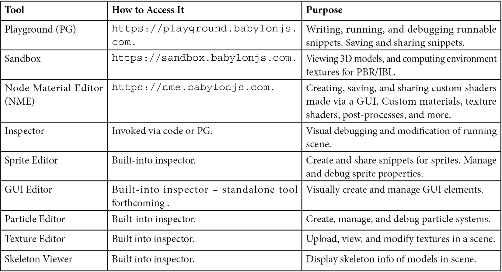
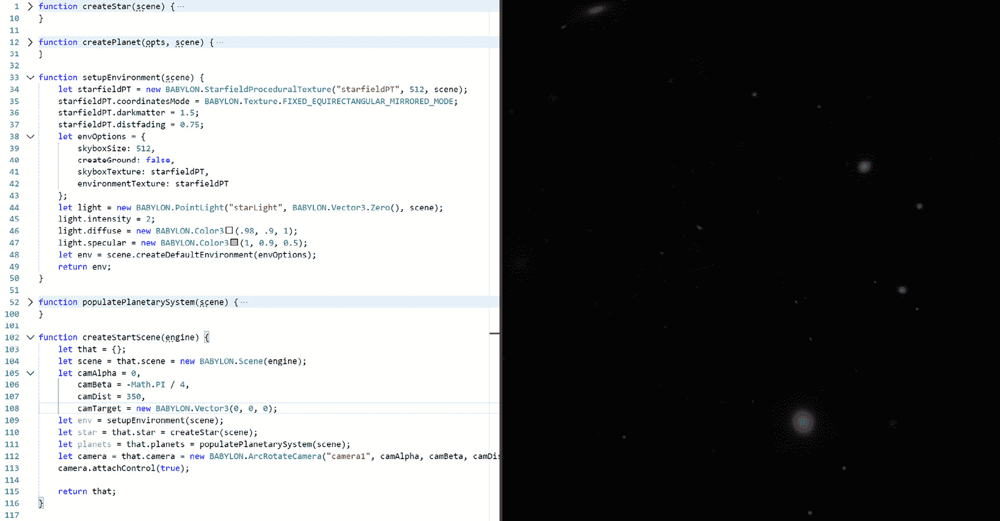
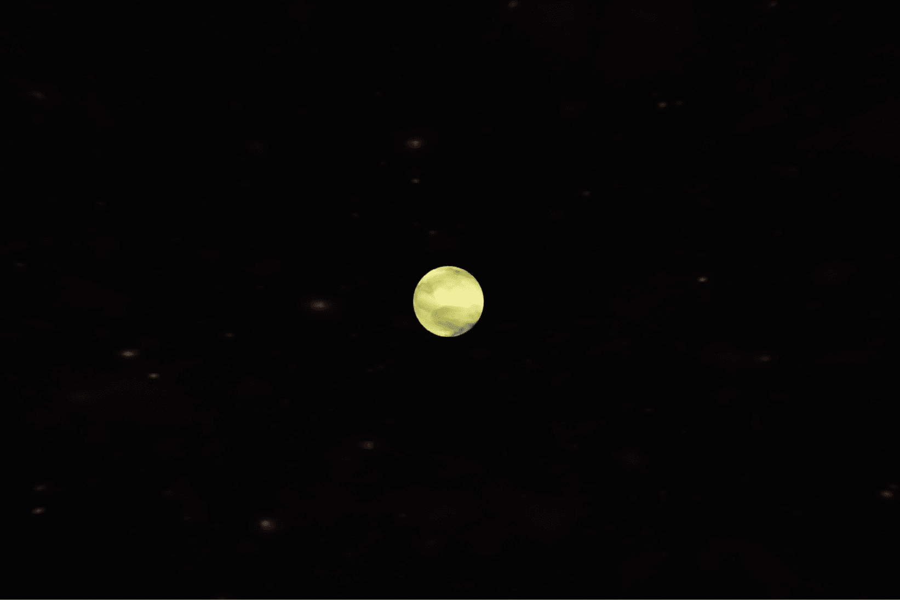
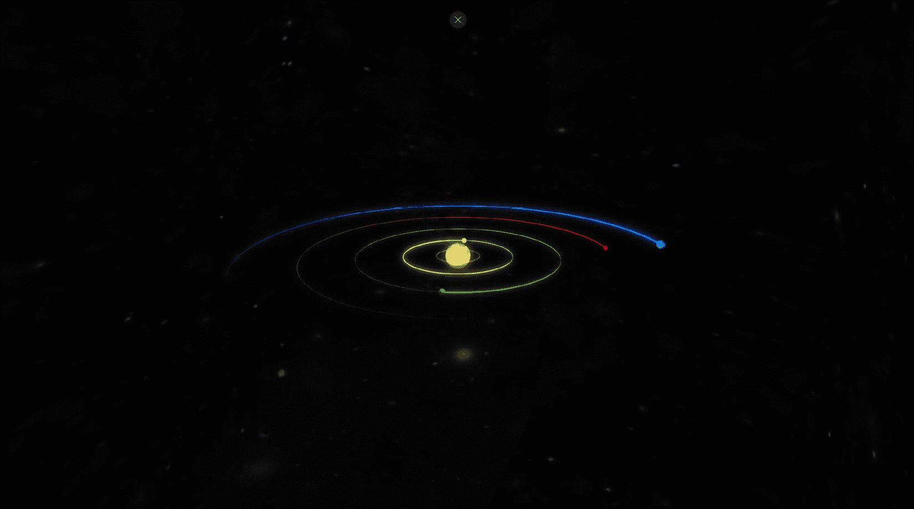

# 第二章：加强 Babylon.js

带着夸张的风险，**Babylon.js**（**BJS**）在如何轻松、快速且**有趣**地处理 3D 图形和游戏方面堪称不可思议。大多数游戏和图形引擎在大小和计算资源需求方面都有相当大的体积，但 BJS 不同，因为它可以在网页浏览器中运行。BJS 团队创建了一个丰富的基于网页的工具生态系统，涵盖了广泛的开发生命周期和工作场景，从多个角度支持开发者和设计师。在建立一些共同词汇并复习一些基础知识之后，我们将从**Babylon.js 游乐场**（**PG**）开始我们的旅程。在这一章之后，我们将通过创建和渲染一个基本的动画场景来为 Space-Truckers 打下基础，这个场景使用了 PG 以及资产库中的内容。

为了从我们现在所在的地方到达我们想要到达的地方，我们将工作分为以下部分：

+   补充或更新 Babylon.js 知识

+   在游乐场中构建我们的场景

+   动画轨道

+   扩展主题

# 技术要求

就像软件中的大多数事情一样，你将使用 Babylon.js 获得最佳结果。PG 片段只需要一个支持**WebGL**的网页浏览器，但对于一些基于桌面的 BJS 网页工具集，如**节点材质编辑器**（**NME**），则需要桌面浏览器。强烈建议在 PG 中输入代码时使用键盘。关于浏览器支持，尽管在特定设备和平台周围有一些例外，但 Edge、Chrome 和 Firefox 的最新版本都支持 WebGL2，并且对较新的 WebGPU 功能的支持在不断增加。有关支持 WebGL2 的浏览器供应商的最新列表，请参阅[`caniuse.com/webgl2`](https://caniuse.com/webgl2)。

# 补充或更新 Babylon.js 知识

当开始一个新的项目时，很容易被需要完成的不同事情的数量所压倒。如果再加上不熟悉的技术或领域，即使是经验丰富的软件老手在面对挑战时也可能感到有些退缩。这种感觉是可以接受的！克服并超越这种感觉的关键既困难又简单：你只需要找到一个原子化、定义明确的任务，然后只做那个任务。在完成几个这样的任务之后，你可以退一步，根据你现在的知识重新评估事情。很可能会发现，你最初认为需要做的工作其实并不需要。

无论你是探索 BJS 可能性的资深游戏开发者，还是从未编写过游戏的初学者，从简单开始并迭代构建可能是获得可用、即时结果的最佳方式。让我们从基础知识开始。以下截图是 BJS 4.2 版本发布内容的一部分，展示了 BJS 如何以高视觉保真度渲染场景。


图 2.1：来自 Babylon.js 主页的实时交互式演示。在瓶子和平面（以及内部）可以看到半透明的阴影、反射和折射，就像不同物质在现实世界中投射出不同的阴影一样。（[`playground.babylonjs.com/#P1RZV0`](https://playground.babylonjs.com/#P1RZV0)）

## BJS 的基本知识

BJS 是一个基于 WebGL 的全功能 3D 渲染引擎，用 TypeScript 编写并编译为 JavaScript。尽管通常通过网页浏览器访问，但当前版本不需要 HTML DOM 或 Canvas 元素，这意味着它可以在服务器上“无头”运行。BJS 团队有一个非常明确的目标和使命，如 BJS 主页所示([`www.BJS.com`](https://www.BJS.com))：

“我们的使命是创造世界上功能最强大、最美丽、最简单的 Web 渲染引擎之一。我们的热情是让它对每个人完全开放和免费。我们是艺术家、开发者、创造者和梦想家，我们希望让它尽可能简单，以便每个人都能将他们的想法变为现实。”

BJS 支持广泛的输入和输出场景，从游戏手柄和基于加速度计的输入到单视口或多视口输出（例如，VR/AR）。该引擎的完整规格列表可在[`www.babylonjs.com/specifications`](https://www.babylonjs.com/specifications)找到。从规格中不太明显的是，对 WebGPU 的支持仅限于浏览器厂商对标准的实现，因此如果你看到有关浏览器发布 WebGPU 支持的新闻，你可以确信 BJS 将能够充分利用它，而无需你做任何事情！

小贴士

当我使用来自其他 3D/图像编辑工具（如 Blender）导入的资产时，我总是忘记应用坐标约定。BJS 使用的 3D 坐标系是“左手坐标系”，这意味着正*y*轴（默认情况下）指向“向上”的方向，正*x*轴指向“向右”，正*z*轴指向“相机方向”。

## 从入门开始学习

任何浏览 BJS 文档的人都会很快意识到该文档是多么的详尽和全面。鉴于入门内容的优质，本书尝试重新创建[`doc.babylonjs.com/start`](https://doc.babylonjs.com/start)中的基本教程将是毫无意义的浪费宝贵空间。如果您是第一次冒险进行游戏开发、BJS 或 JavaScript，强烈建议您花时间至少浏览一下前面链接的入门教程。不用担心离开——您回来时，一切都会像您离开时一样完好无损！

## 工具箱工具

作为 JavaScript 基础的优点之一是，它非常容易提供基于 Web 的工具，允许用户在紧密的迭代循环中实时编码和渲染。BJS 的**游乐场**（**PG**）可能是 BJS 工具链中最突出的成员，但这不应减少我们将要介绍的其他工具的实用性和重要性。以下表格总结了各种工具及其用途：



在整本书中，我们将大量使用 PG；我们将用它来快速组合一段代码或测试一个概念，然后再将其集成到我们的应用程序代码中。同样，**检查器**（及其相关工具）也将因其强大的场景调试功能而得到大量使用。最后，随着我们深入到《Space-Truckers》的制作，NME 将在本书的后面部分进行介绍。

注意

在本书中，**游戏**一词的典型用法是指整个**应用程序**中专门用于游戏机制、逻辑和循环的部分。

## BJS 的资产类型

BJS 支持许多不同类型的文件和格式，无论是直接还是间接（通过导出插件）。在选择和/或为您的游戏创建资产时，重要的是要制定一个生产工作流程，以最大限度地减少摩擦，同时不牺牲质量——我们将在下一章中了解更多关于这一点。以下是 BJS 支持的几种最常见的第三方工具和文件类型：

+   纹理/图像：

    +   DDS (DXT1, 4bpp, 和 RGBA)

    +   PNG/JPEG/BMP

    +   TGA

    +   HDR

+   3D 模型：

    +   GLTF (首选)

    +   OBJ

    +   STL

    +   BLENDER/3DS Max/Maya (导出插件)

+   声音：

    +   WAV

    +   MP3

    +   MP4

    +   M4A

+   字体：

    +   TrueType

    +   OTT

然而，对我们当前目的来说，更相关的是 BJS 的**资产库**。您可以在[`doc.babylonjs.com/toolsAndResources/assetLibraries`](https://doc.babylonjs.com/toolsAndResources/assetLibraries)查看资产类别并按类别浏览条目，但资产库的真正力量在于能够从 PG 中引用和加载它们！让我们从创建场景开始，就是这样。打开您选择的浏览器并前往 BJS PG：[`playground.babylonjs.com`](https://playground.babylonjs.com)。

# 构建游乐场场景

**Babylon.js 游乐场**的设计宗旨是提供用户以最简单、最短的可能路径来渲染场景中的内容。打开你选择的网页浏览器，导航到[`playground.babylonjs.com/`](https://playground.babylonjs.com/)，你将看到代码片段的基本轮廓。这个基本的模板片段简单地创建了一个新的**场景**和一个**相机**来渲染它，但这也是一个很好的起点！

在游乐场的左侧是代码编辑器，右侧是渲染画布。关于游乐场，重要的是要知道每个片段在两个方面是独特的，这两个方面都包含在片段的 URL 中。第一个井号（#）符号之后的字符是片段的 ID，第二个井号之后的数字是修订版本。每次创建片段时，都会分配一个唯一的标识符，每次保存该片段时，都会创建一个新的修订版本。例如，**#L92PHY#36**指向一个示例，展示了 FPS 相机中的多个视口，当前修订版本为 36。因此，只需更改 URL，就可以逐步通过特定片段的修订历史。

注意

```js
#0UYAPE#42. That is, snippet 0UYAPE at revision 42.  
```

尽管我们将在游戏中使用 PG 的代码片段，但我们需要做一些初步的结构化工作，以便我们可以轻松且可靠地在我们的 PG 片段和源代码库之间传输代码（更多内容请参阅*第三章**，建立开发工作流程）。在本书和代码片段中，我们将尽可能使用**ES6**语法。这使我们能够访问一些重要的语言特性，我们将利用这些特性来帮助保持我们的代码可读性和可维护性。

小贴士

ES6 建议：优先选择`let`而不是`var`。

所有的重点都在提升（hoisting）和闭包（closures）上。使用`var`关键字声明的变量在其声明的作用域内有效，但也可能在包含的作用域（称为“提升”）内有效。此外，你可以在使用之前引用一个`var`，而不会抛出运行时错误。当一个变量使用`let`语句声明时，它只在其声明的作用域内可用，并且必须在使用之前声明；否则，将会抛出错误。通常，你应该优先使用`let`而不是`var`，因为它将更容易防止和暴露过于常见但可能相当微妙的缺陷。当然，如果你不打算更改值，你应该使用`const`而不是`let`。

## 建立 AppStartScene

一个新的 PG 片段从单个代码块开始——`createScene`函数。正如代码注释也指出的那样，`engine`和`canvas`全局变量在窗口的上下文中可用。

重要提示

在 BJS 4.2+中已经移除了 HTML Canvas 元素作为依赖项，但出于向后兼容性的原因，涉及 HTML Canvas 元素的方法仍然按预期工作。

### 修改 createScene 函数

为了使代码的重用更容易，我们将对初始函数模板进行一些小的修改。我们不会将场景的所有逻辑都放入同一个`createScene`函数中，而是尽可能地将逻辑细分到原子函数中。初始化例程将在一个新函数中完成，该函数将返回一个包含已填充场景对象的对象：

```js

let createScene = function () {
    let eng = engine;
    let startScene = createStartScene(eng);
    return startScene.scene;
}; 
```

一个敏锐的观察者会注意到我们尚未实现`createStartScene`函数，这当然是下一步。它的目的是创建和初始化场景及其元素 - 请参阅以下列表。低摩擦变化至关重要，因此为了便于以后更改，我们将每个功能部分放入其自己的函数中（有意为之）：

+   弧形旋转相机

+   点光源

+   星星（太阳）

+   背景天空盒

+   行星 - 四颗岩石行星和一颗气态巨行星

是时候填写并填充这个新的函数`createStartScene`了。首先，我们正在创建场景和相机，在调用即将编写的函数（加粗）之前指定一些具体细节，这些函数将创建相应的元素：

```js

function createStartScene(engine) {
    let that = {};
    let scene = that.scene = new BABYLON.Scene(engine);
    let camAlpha = 0,
        camBeta = -Math.PI / 4,
        camDist = 350,
        camTarget = new BABYLON.Vector3(0, 0, 0);
    let camera = that.camera = new BABYLON.ArcRotateCamera("camera1", camAlpha, camBeta, camDist, camTarget, scene);    
    let env = setupEnvironment(scene);
    let star = that.star = createStar(scene);    
    let planets = that.planets = populatePlanetarySystem(scene);
    camera.attachControl(true);    
    return that;
}
```

为了节省您在脑海中计算的努力，`camBeta`（或，相机相对于目标纬度的弧度值）大约为 0.785 弧度 - 45 度，位于围绕`camDist`半径目标的想象圆的赤道和极点之间。当然，这段代码目前还不能编译或运行，因为我们还没有定义`setupEnvironment`、`createStar`或`populatePlanetarySystem`。为这些函数添加占位符实现以确保代码按预期运行。生成的场景是空的，但这是我们进度中的一个良好检查点。现在是时候填充占位符并让我们的场景活跃起来！在继续之前，别忘了保存（*Ctrl* + *S*）您的代码片段。

### 设置环境

默认环境相当单调且昏暗。场景的主要光源将是一个位于星系中心的**点光源**，而天空盒则提供了场景的透视感。天空盒的纹理特别引人注目，因为一个看起来吸引人的天空盒在文件大小方面往往相当大。我们关心这一点，因为我们打算将这个场景用作加载图形，这意味着它需要尽可能快地加载并开始渲染。通过互联网连接加载大纹理不太可能帮助我们实现这一目标，因此我们将使用 Babylon.js 的**程序纹理库**中的**星场程序纹理**（见[`doc.babylonjs.com/toolsAndResources/assetLibraries/proceduralTexturesLibrary`](https://doc.babylonjs.com/toolsAndResources/assetLibraries/proceduralTexturesLibrary)以获取可用的程序纹理的完整列表）即时创建纹理。

提示

每个`darkmatter`，它控制空洞（空隙），以及`distfading`，它控制渲染纹理的清晰度或模糊度。以下代码中列出的值是通过试错得到的，所以请尝试看看你最喜欢什么！

`PointLight`，正如其名所示，是一个从空间中的单个点向球形壳辐射光线的光源。由于场景的黑暗和其较大的尺寸，光线在设置漫射和镜面颜色通道的类似太阳的颜色之前会增强。我们使用`createDefaultEnvironment`方法以及一些之前定义的选项来创建天空盒和相关的背景材质。该方法返回一个`EnvironmentHelper`实例，我们将友好地将其返回给`setupEnvironment`的原始调用者：

```js

function setupEnvironment(scene) {
    let starfieldPT = new BABYLON.StarfieldProceduralTexture("starfieldPT", 512, scene);
    starfieldPT.coordinatesMode = BABYLON.Texture.FIXED_EQUIRECTANGULAR_MIRRORED_MODE;
    starfieldPT.darkmatter = 1.5;
    starfieldPT.distfading = 0.75;
    let envOptions = {
        skyboxSize: 512,
        createGround: false,
        skyboxTexture: starfieldPT,
        environmentTexture: starfieldPT
    };
    let light = new BABYLON.PointLight("starLight", BABYLON.Vector3.Zero(), scene);
    light.intensity = 2;
    light.diffuse = new BABYLON.Color3(.98, .9, 1);
    light.specular = new BABYLON.Color3(1, 0.9, 0.5);
    let env = scene.createDefaultEnvironment(envOptions);
    return env;
}
```

点击**运行**应该会显示一个在天空中可以旋转的漂亮星系。如果一切正常，现在是一个保存你工作的好时机。



图 2.2 – 星系天空盒环境

### 诞生一颗星星

我们星星的网格是一个简单的球体，但当我们添加标准材质和一些颜色通道时，结果是一个单色调、看起来平坦的圆圈——不太像“星星”。通过结合一个`BABYLON.Texture`，我们可以用很少的努力得到更细腻的外观：

```js

function createStar(scene) {
    let starDiam = 16;
    let star = BABYLON.MeshBuilder.CreateSphere("star", 
        { diameter: starDiam, segments: 128 }, scene);
    let mat = new BABYLON.StandardMaterial("starMat",
        scene);
    star.material = mat;
    mat.emissiveColor = new BABYLON.Color3(0.37, 0.333,
        0.11);
    mat.diffuseTexture = new BABYLON.Texture
        ("textures/distortion.png", scene);
    mat.diffuseTexture.level = 1.8;
    return star;
}
```

在不改变`diffuseTexture.level`值的情况下，`emissiveColor`往往会淡化扭曲或被漫射纹理的像素值完全熄灭。这个值，1.8，是通过试错得到的（就像在应用设计/游戏开发中经常出现的许多“魔法数字”一样）。如果你最近没有保存进度，这是一个很好的检查点来保存你的工作。



图 2.3 – 发射色与漫射扭曲纹理的组合

### 产生行星

剩下唯一需要创建的顶级场景元素是`populatePlanetarySystem`函数。这个实现的经典例子是组合软件模式的强大功能——这是一个我们稍后会再次讨论的话题。有一个可能被认为是中心控制逻辑的形式，即`populatePlanetarySystems`，它负责定义各种行星体的数量和独特属性。然后它要求另一个函数，新的`createPlanet`方法，来处理实际对象的构建。最后，它将行星收集到一个数组中，并将其返回给调用者。

我们希望能够创建具有不同特性的不同类型的行星，因此在我们的`populatePlanetarySystems`方法中，我们创建了一个对象数组，用于定义每个行星。有关行星数据的完整列表，请参阅[`playground.babylonjs.com/#0UYAPE#26`](https://playground.babylonjs.com/%230UYAPE%2326)：

```js

let hg = {
    name: "hg",
    posRadians: BABYLON.Scalar.RandomRange(0, 2 * Math.PI),
    posRadius: 14,
    scale: 2,
    color: new BABYLON.Color3(0.45, 0.33, 0.18),
    rocky: true
}; //...
```

`posRadians`属性生成介于 0 到 360 度（以弧度为单位）之间的随机值，而`posRadius`属性指定行星应位于原点的距离——它距离太阳有多远。行星的整体大小由其`scale`因子决定，而`color`属性。我们稍后将介绍最后一个属性。场景的缩放可能很棘手，但您可以使用相对缩放指南来帮助确定适当的数字范围。

您不必坚持现实数字——您是否曾经被告知“太空很大。真的很大”？事实上，它确实太大，无法适应我们的小视口，因此当选择行星的`posRadius`时，可能更容易从不同的角度来考虑数字。通过将轨道半径视为行星之间的相对步骤，我们可以得出一个看起来不错（但可能不是现实稳定）的行星系统。我们的`starDiameter`是 16，给我们一个半径为 8 个单位。我们的最内层行星`“hg”`至少需要 8 + 2 = 10 个单位，以避免与恒星相交；将其放置在 14 个单位似乎很合适。移动到后续行星，通过将每个行星放置在 1.5–1.8 倍的位置，前一个行星的轨道半径将给出看起来不错的结果，而且与我们的太阳系中找到的比率相差不远——这就是您知道它将很有趣的原因！

这就留下了`rocky`属性。这个标志将通知我们的逻辑，在返回填充的数组之前，需要将不同的纹理集应用到`createPlanet`函数中的`planets`数组：

```js

planets.push(createPlanet(hg, scene));
planets.push(createPlanet(aphro, scene));
planets.push(createPlanet(tellus, scene));
planets.push(createPlanet(ares, scene));
planets.push(createPlanet(zeus, scene));
return planets;
```

显示我们的行星系统所需的最终子任务是实现`createPlanet`函数。在这个方法中，我们执行以下操作：

1.  使用**MeshBuilder**创建一个新的**Mesh**球体。

1.  为传入的`Color3`值创建一个新的`diffuseColor`和`specularColor`。

1.  根据`rocky`标志的值分配纹理。

1.  将材质分配给网格。

1.  根据传入的`scale`、`posRadians`和`posRadius`值缩放和定位`planet`。

这可能一开始并不明显，但我们也将材料的`specularPower`设置为零。这是因为否则我们会在我们的行星上得到非常闪亮的斑点，使它们看起来更像台球而不是岩石或气态球体。对于岩石行星，我们正在引入`bumpTexture`（即来自 BJS **纹理库**的`diffuseTexture`。对于没有可见表面的行星，我们使用扭曲纹理来在大气中添加云带的外观：

```js

function createPlanet(opts, scene) {
    let planet = BABYLON.MeshBuilder.
        CreateSphere(opts.name, { diameter: 1 }, scene);
    let mat = new BABYLON.StandardMaterial(planet.
        name + "-mat", scene);
    mat.diffuseColor = mat.specularColor = opts.color;
    mat.specularPower = 0;
    if (opts.rocky === true) {
        mat.bumpTexture = new
            BABYLON.Texture("textures/rockn.png", scene);
        mat.diffuseTexture = new
            BABYLON.Texture("textures/rock.png", scene);
    }
    else {
        mat.diffuseTexture = new BABYLON.Texture
            ("textures/distortion.png", scene);
    }
    planet.material = mat;
    planet.scaling.setAll(opts.scale);
    planet.position.x = opts.posRadius *
        Math.sin(opts.posRadians);
    planet.position.z = opts.posRadius *
        Math.cos(opts.posRadians);
    return planet;
}
```

在这段代码到位后，你应该能够**运行**场景，并获得一个非常好的结果，显示我们的中心恒星和四个不同大小和颜色的行星，它们与恒星的距离各不相同。

![Figure 2.4 – Star system with planets and a skybox

![Figure 2.04_B17266.jpg]

图 2.4 – 带有行星和天空盒的星系

**保存**这个片段并系好安全带，因为接下来，我们将学习两种不同的方法和风格来使我们的行星移动。

# 动画轨道

BJS 有许多不同的方式来完成任何给定的任务；在场景中动画化对象也不例外。在 BJS 中动画化的不同方法包括以下几种：

+   定义一个可重用的`BABYLON.Animation`对象，它将在一个**关键帧**数组之间插值指定的属性。

+   从文件中导入预构建的动画 – `BABYLON`、`GLTF`、`GLB`、`OBJ`等。

+   使用`OnPreRenderObservable`在每一帧渲染之前更新对象属性（例如，位置、旋转、颜色等）。

对于我们的标题屏幕动画，我们将使用第一种和第三种方法来分别动画化我们的小小太阳系的旋转和圆形轨道。在后面的章节中，我们将看到第二种方法的应用。

## 给星星和行星加上旋转效果

星星和行星的旋转相当简单，但它可以作为对关键帧动画原理和实践的良好复习。由于动画可以循环或循环播放，对于给定的动画通常不需要大量的帧。我们将遵循几个简单的步骤来添加一个`createSpinAnimation`函数，该函数返回一个新的**Animation**实例。

首先，我们确定动画目标将改变哪些属性。在这种情况下，只是目标节点的`rotation.y`值。我们可以说我们的动画应该在 2 秒内完成一个完整的圆（360 度或 2 * Pi 弧度）。接下来，确定动画应包含的总帧数，即`Scalar.TwoPi`的数量。这就是我们需要实现创建和设置动画属性的代码：

```js

function createSpinAnimation() {
    let orbitAnim = new BABYLON.Animation("planetspin",
        "rotation.y", 30,
        BABYLON.Animation.ANIMATIONTYPE_FLOAT,
        BABYLON.Animation.ANIMATIONLOOPMODE_CYCLE);
    const keyFrames = [];
    keyFrames.push({
        frame: 0,
        value: 0
    });
    keyFrames.push({
        frame: 60,
        value: BABYLON.Scalar.TwoPi
    });
    orbitAnim.setKeys(keyFrames);
    return orbitAnim;
}
```

`createSpinAnimation`方法从`createStartScene`中被调用，以便将`spinAnim`变量提供给场景的其他控制代码。

动画创建完成后，可以将其添加到一个或多个不同的`mesh.animations`数组中。这将把动画附加到特定的`Animation`对象上，该对象没有`start`函数或等效的函数。这是因为动画本身对其目标是无知的，允许它在任意数量的不同网格上使用。从`star`开始，然后遍历我们的`planets`数组，我们将`spinAnim`添加到每个网格：

```js

let spinAnim = createSpinAnimation();
star.animations.push(spinAnim);
scene.beginAnimation(star, 0, 60, true);
```

要开始动画，你需要调用`scene.beginAnimation`函数，传递起始帧、结束帧、速度参数以及动画对象。我们希望它循环播放，所以我们将`true`作为最后一个参数传递给该方法：

```js

planets.forEach(p => {
    p.animations.push(spinAnim);
      scene.beginAnimation(p, 0, 60, true,
          BABYLON.Scalar.RandomRange(0.1, 3));
});
```

当场景运行时，动画会自动开始，你可以观察到所有天体的旋转。

## 制作轨道运动

与`scene.onBeforeRenderObservable`不同。在游戏引擎循环的上下文中，这是更新逻辑发生的地方。在`createPlanet`的末尾，我们将添加代码来附加事件监听器，以及跟踪行星轨道参数的附加数据：

```js

planet.orbitOptions = opts;
planet.orbitAnimationObserver = 
    createAndStartOrbitAnimation(planet, scene);
```

我们的`createAndStartOrbitAnimation`方法需要推导出许多值。其中两个，轨道半径（`posRadius`）和角位置（`posRadians`），被添加到`planet`作为`orbitOptions`属性。

`周期`轨道是行星完成一次完整公转所需的时间（360 度或 2 * Pi 弧度）并且以秒为单位。我们希望每个行星都有一个不同的周期，远处的天体完成轨道所需的时间比近处的天体长，但我们不想不厌其烦地调整值直到它们看起来不错。物理学——或者更具体地说，牛顿力学——为我们提供了计算行星轨道速度的方程，给定其与给定大质量体的距离（半径）。知道位置随时间的变化率，可以计算出角速度：

```js

function createAndStartOrbitAnimation(planet, scene) {
    const Gm = 6672.59 * 0.07;
    const opts = planet.orbitOptions;
    const rCubed = Math.pow(opts.posRadius, 3);
    const period = BABYLON.Scalar.TwoPi * Math.sqrt
        (rCubed / Gm);
    const v = Math.sqrt(Gm / opts.posRadius);
    const w = v / period;
    const circum = Scalar.TwoPi * opts.posRadius;
    let angPos = opts.posRadians;
```

`Gm`常数是任意选择的，以确保随着半径的变化，轨道速度有一个平滑的分布。所需的状态变量是`angPos`，它每帧通过`w`增加，并通过调用`Scalar.Repeat`语句保持在有效范围内。一般来说，将这些运动学的角分量视为计数器或钟表指针是有用的；随着时间的推移，通过角速度增加角位置并计算位置分量来完成逻辑：

```js

let preRenderObsv = scene.onBeforeRenderObservable.add(sc => {
    planet.position.x = opts.posRadius * Math.sin(angPos);
    planet.position.z = opts.posRadius * Math.cos(angPos);
    angPos = BABYLON.Scalar.Repeat(angPos + w,
        BABYLON.Scalar.TwoPi);
});
return preRenderObsv;
```

返回`preRenderObsv`对象不是使这工作所必需的，但这是一个好习惯，这样我们就可以在不再需要时干净地处置观察者。现在，当场景运行时，行星都以独特的方式围绕太阳旋转。这一切看起来都很棒，但在我们继续之前，我们还可以做最后一件事来真正让场景变得生动。按**保存**并继续到最后一部分。

## 轨迹线

为了完成这个动画，我们将使用`createAndStartOrbitAnimation`方法来为每个行星的轨道添加线条，这是一个做这件事的好地方。我们声明我们的`TrailMesh`，并将其传递给`planet`以附加，同时指定路径带的轨道（长度）周长，并指定我们希望路径立即开始。同时，我们还创建了一个新的材质，并将其与路径网格关联：

```js

planet.computeWorldMatrix(true);
let planetTrail = new BABYLON.TrailMesh(planet.name + 
    "-trail", planet, scene, .1, circum, true);
let trailMat = new BABYLON.StandardMaterial
    (planetTrail.name + "-mat", scene);
trailMat.emissiveColor = trailMat.specularColor =
    trailMat.diffuseColor = opts.color;
planetTrail.material = trailMat;
```

在添加路径网格之前，我们需要强制重新计算行星的**世界矩阵**；否则，路径将从起源到行星位置出现伪影。就是这样！随着它们的移动，轨道描绘出漂亮的圆圈，但场景仍然感觉有点暗淡。

## 使用 GlowLayer 发光层增强效果

默认情况下，BJS 不会将材质的发射色通道添加到光照计算中 – 发射纹理和颜色不会使场景变亮。使物体发光很容易；只需将此行添加到`createStartScene`方法中：

```js

let glowLayer = new BABYLON.GlowLayer("glowLayer", scene);
```

除非另有说明，否则 GlowLayer 将对场景中的每个网格产生影响。我们不希望行星发光，所以当我们遍历行星以动画化它们的旋转时，将行星添加到 GlowLayer 的网格排除列表中：

```js

planets.forEach(p => {
        glowLayer.addExcludedMesh(p);
        p.animations.push(spinAnim);
        scene.beginAnimation(p, 0, 60, true,
            BABYLON.Scalar.RandomRange(0.1, 3));
    });
```

点击**运行**来查看结果。如果你对结果不满意，你可以调整相机的海拔和角度（分别为**beta**和**alpha**），距离等。无论如何，请确保保存代码片段并享受你的劳动成果。一旦你欣赏完你的作品，请将你的代码片段发布在[`github.com/jelster/space-truckers/discussions/21`](https://github.com/jelster/space-truckers/discussions/21)上的板上，在那里你可以查看其他人的创作，分享和讨论 – 但别忘了回来，还有更多工作要做！



图 2.5 – 带有 GlowLayer 和轨迹网格的完成轨道动画

# 扩展主题

完成的代码片段满足了我们应用的即时需求，但这并不意味着没有改进它的方法！以下是一些你可能自己尝试的想法，这些想法可以增强场景。通过在 Space-Truckers 讨论板([`github.com/jelster/space-truckers/discussions`](https://github.com/jelster/space-truckers/discussions))或 BJS 论坛([`forum.babylonjs.com/`](https://forum.babylonjs.com/))上发布和分享你的代码片段来加入 BJS 和 Space-Truckers 社区。讨论板和论坛不仅是为了分享你的成就，它们还是一个你可以发布你遇到的问题或问题的场所，有一个热爱帮助的活跃社区。

你可以执行以下操作：

+   移除行星轨迹的螺旋状外观。旋转动画和轨迹网格都归行星所有。当行星旋转时，轨迹网格会被扭曲。解决这个问题的一个方法可能是向场景中添加一个**TransformNode**，并将行星归它所有。保持行星上的旋转动画，但将**TrailMesh**和轨道动画关联并指向**TransformNode**。

+   用粒子系统替换恒星当前纹理。**ParticleHelper**有一个**太阳**效果，可以为场景带来酷炫的效果。有关此内容的文档在[`doc.babylonjs.com/divingDeeper/particles/particle_system/particleHelper`](https://doc.babylonjs.com/divingDeeper/particles/particle_system/particleHelper)，其中还提供了有关如何创建自定义**ParticleSets**的有用信息。创建自定义粒子系统的最简单（也许是最好的）选项是使用**粒子**模式的 NME ([`nme.babylonjs.com/`](https://nme.babylonjs.com/))。NME 对于着色器来说就像 PG 对于场景一样，这意味着就像你可以保存和分享 PG 片段一样，你也可以保存和分享 NME 片段。它们在这个上下文中的区别在于，你可以在 PG 中使用 NME 片段，但不能反过来。

+   在一个**倾斜**轨道上添加一颗彗星，当它在其椭圆轨道通过场景中的恒星时，它会变得更亮并显示出尾巴。倾斜仅仅意味着物体包含 y 轴，当它“上下摆动”穿过轨道平面时。椭圆轨道具有与圆形轨道相同的周期，轨道半径与椭圆的**半长轴**（沿着椭圆长边分割椭圆的线的长度）相同，但不同之处在于，沿着其路径移动的物体在椭圆轨道上以最接近点（**近点**）的速度最快。

+   给最外层的气态巨行星添加一个环系。一种方法是使用 MeshBuilder 创建一个平面环状网格，然后使用 BJS 的**父子关系**将环系附着到行星上。另一种基于前者的方法是使用**固体粒子系统**（**SPS**）生成数十甚至数百个小岩石来构成环系。这可以看作是即将到来的预览：在下一章中，我们将使用 SPS 来创建一个小行星带。

+   向一个多岩石的行星添加云的镜面反射、地形凹凸（法线）图，使其看起来像真实世界的行星。BJS 的**资产库**包含了地球地形的等高图以及各种云和地面效果的纹理。**材质库**也有一些有趣的选项可以探索，以使行星独特且吸引人——享受乐趣！

+   让摄像机以电影般的方式在系统中平移和缩放。选择我们之前讨论过的动画方法之一，针对场景的`camera`。根据你的方法和计划，你可能想要取消或更改摄像机的目标为**TransformNode**。这个新的、不可渲染的节点充当一种“标记”，可以移动以改变摄像机视图，从而改变位置。另一个选项是探索不同于当前**ArcRotateCamera**的摄像机类型。

# 摘要

在本章的整个过程中，我们通过在 PG 中创建一个简单的场景来刷新和提升我们对 BJS 的了解。我们学习了如何以不同的方式动画化场景，以及如何从 BJS 资产库中加载纹理和其他资产。希望我们在旅途中有点乐趣，但这只是冰山一角，关于后续章节中将要介绍的内容。如果你需要一点 BJS 的复习，希望这已经让你热身并准备好继续前进。如果你是 BJS 的新手，那么希望这已经赋予你继续前进到下一章的信心。在下一章中，我们将认真开始 Space-Truckers，通过设置本地开发环境、源代码控制和调试来着手进行。

# 进一步阅读

BJS 文档网站包含大量的知识和内容。以下是文档中一些相关的页面，它们更详细地介绍了本章中涉及的主题：

+   一旦你学会了如何进行单个动画，请阅读有关动画序列、分组和组合的内容，从[这里](https://doc.babylonjs.com/divingDeeper/animation/sequenceAnimations)开始。

+   了解如何将不同类型的资产文件导入场景，以及加载器的工作原理，请参阅[这里](https://doc.babylonjs.com/divingDeeper/importers/loadingFileTypes)。

+   深入探索：在[Mesh 部分](https://doc.babylonjs.com/divingDeeper/mesh/glowLayer)有关于 GlowLayer 如何工作的详细信息。

+   关于不同类型相机及其属性的详细信息，请参阅[这里](https://doc.babylonjs.com/divingDeeper/cameras/camera_introduction)。值得一提的是，无论你在文档中看到提到`FreeCamera`、`TouchCamera`或`GamepadCamera`，你应该用`UniversalCamera`来替换或使用，因为它取代了这三个，保留它们是为了向后兼容的原因。
