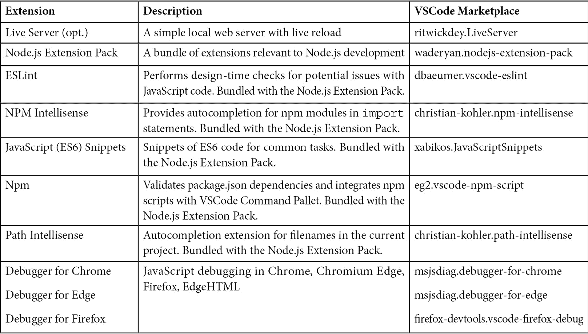
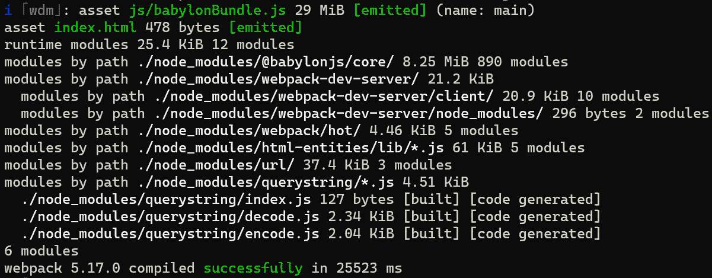
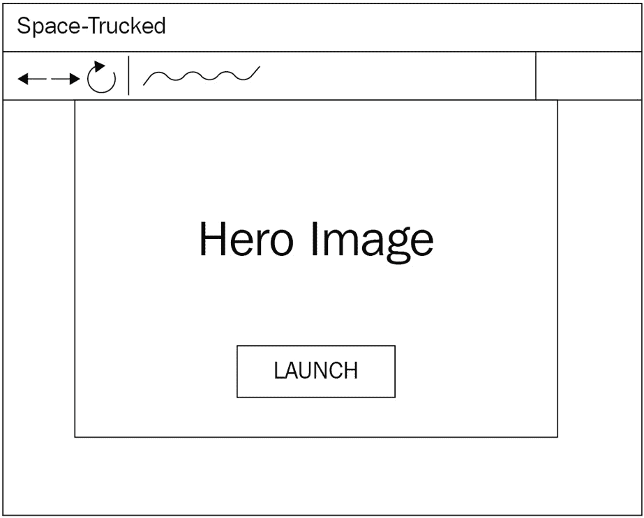
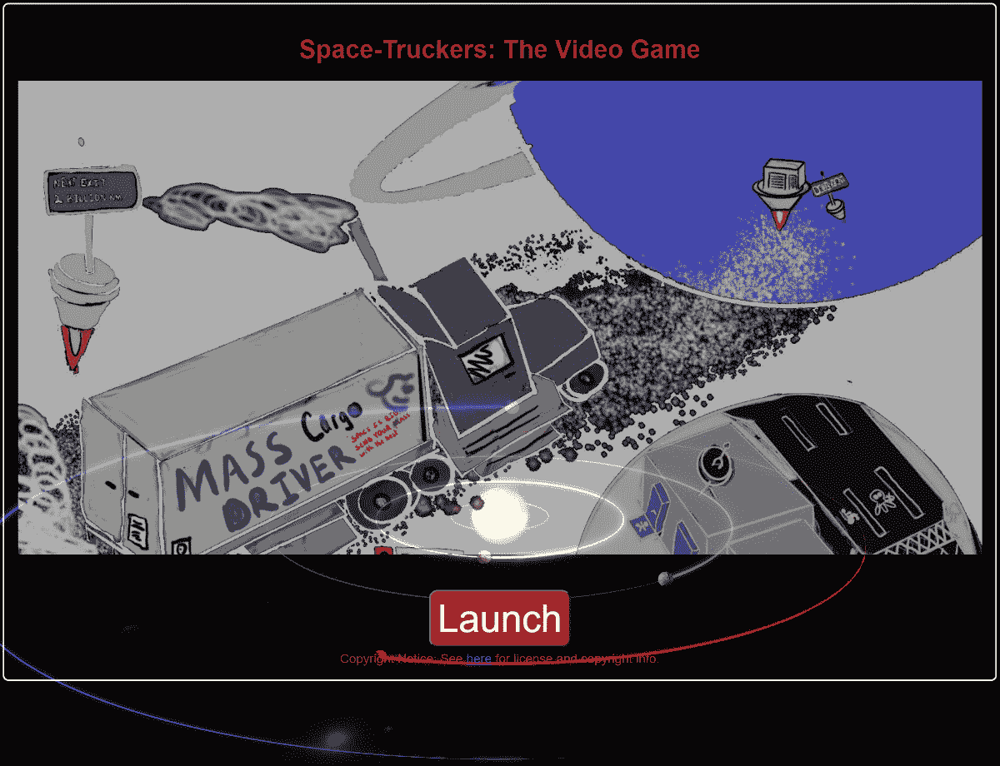

# 3

# 建立开发工作流程

虽然**Babylon.js 游乐场**（**PG**）是一个非常灵活且强大的工具，用于开发、运行和共享 3D 渲染场景，但它也在传统 Web 应用程序的开发工作流程中占有一席之地。通过消除摩擦，有效地实现了有效的软件开发。这里的摩擦是指任何在编写代码和执行结果之间设置障碍的东西，它几乎可以采取任何形式，从平凡到神秘。例如，假设在代码更改后到更改的代码在开发者的 Web 浏览器中运行之间需要一个小时。那么开发者将被迫在每次新的构建中包含尽可能多的内容，这使得理解任何单个更改对应用程序行为的影响变得更加困难。在这种情况下，注意力会被稀释，进步是渐进的，并不与所需的努力成比例，这就是为什么对开发工作流程的小幅调整可以带来巨大的收益。在本章中，我们将探讨许多潜在**Babylon.js**开发工作流程中的一个，到本章结束时，您将拥有快速高效构建游戏所需的工具，这些游戏可以像您思考设计一样快速地发展！

每个人都会有不同的方法来接近开发的结构和流程，这是完全可以接受的。以下每个部分都展示了工作流程的一个方面，旨在最大化开发效率和质量，同时最小化技术债务和不确定性：

+   设置环境

+   构建游乐场片段

+   从游乐场过渡到应用程序

+   构建着陆页

# 技术要求

运行 BJS PG 的基本要求在*第二章*“提高 Babylon.js 技能”中详细说明，但除了这些要求之外，还有一些我们将要使用的额外开发工具。

重要提示

尽管示例等都是基于基于 Windows 的开发者体验，但遵循本书没有操作系统要求。所有讨论的工具都可在多个平台上使用，并且将在可行的地方突出显示或指出语法或用法的差异。

每个单独项目的具体用法将在随附的章节材料中介绍，并假设您对工具及其用法有一定的了解。有关设置和配置特定工具的信息，请参阅该工具文档的相应链接。

+   **Visual Studio Code**是我们首选的 IDE，可在所有平台上使用，工作出色，且免费：[`code.visualstudio.com`](https://code.visualstudio.com)

+   **Node.js v14.15.4 (LTS)**或更高版本：[`docs.npmjs.com/`](https://docs.npmjs.com/)

+   **Node 包管理器 (npm) CLI v6.x（LTS 版本）** 或更高版本，通过在 [`docs.npmjs.com/cli/v6/configuring-npm/install`](https://docs.npmjs.com/cli/v6/configuring-npm/install) 列出的节点版本管理器安装。

+   **Git** 版本控制客户端。此外，为了能够提交 **Pull Requests**、提交 **问题** 或参与 **讨论**，需要一个有效的 GitHub 账户：[`github.com`](https://github.com)

## TypeScript 用户注意事项

如果您更喜欢使用 **TypeScript** 而不是纯 JavaScript 进行所有编码，那很好！Babylon.js 本身是用 **TypeScript** 编写的，并且完全支持在 BJS 中开发。跟随这本书中的代码是可能的，并且语法和结构的不同并不总是会被解释或指出。话虽如此，考虑到以下两个主要变化，代码在这两种语言之间应该具有很大的兼容性：

1.  游戏场代码片段应使用 TypeScript 模式。这有一个稍微不同的模板。从 [`www.babylonjs-playground.com/ts.xhtml#`](https://www.babylonjs-playground.com/ts.xhtml#) 开始，点击 `createScene` 方法被封装为 `Playground`。声明新的类并在 `createScene` 方法中使用它们，就像在常规 JavaScript 中使用一样。

1.  当将使用 PG 编写的类进行集成时，非常重要的一点是要添加 `export class Foo { //… }`)。由于您将使用 **tsc**（**TypeScript 编译器**）来输出 JavaScript，有时您将需要 **导入**某些 Babylon.js 模块以利用它们的 **副作用**。有关如何为 Babylon.js 配置 **TypeScript** 的更多信息，请参阅 [`doc.babylonjs.com/divingDeeper/developWithBjs/npmSupport#typescript-support`](https://doc.babylonjs.com/divingDeeper/developWithBjs/npmSupport#typescript-support)。

# 设置环境

有效的软件开发依赖于能够自信地向应用程序的结构中引入更改。引入、更改或删除代码的信心来自于 a) 能够使用新的更改运行代码，以及 b) 不处于撤销更改会带来自身风险的境地。让我们暂时放下这个想法，回过头来从头开始。

## 准备步骤

进入这一步的 *先验* 假设是您已经设置了 **Git**、**VSCode**、**Node.js** 和 **NPM**，并且它们都准备就绪。还建议使用像 **ESLint** 这样的代码检查工具。如果您知道自己在做什么，现在就可以开始设置和配置这些工具。不用着急，这只是这本书的其余部分在等待——如果你在哼唱 *伊帕内玛的女孩* 的同时工作，这可能会更快。**VSCode** 拥有一个丰富的扩展生态系统，可以使您的生活更加轻松。以下是一些您可能想要安装的扩展（或它们的等效项）的列表。转到 **VSCode** 中的 **扩展** 面板，然后搜索适当项目的 **Marketplace ID**：



图 3.1 – 有用的 VSCode 扩展列表

如果你还没有完全了解在哪里以及如何做这类事情，这里有一些你可以做的事情。忽略电梯音乐，在额头绑上头巾，然后直接进入 80 年代电影蒙太奇序列。你可能首先想要在这个页面上设置一个书签——蒙太奇包括一系列的特写镜头，你将翻到本章末尾的 *进一步阅读* 部分，阅读并跟随链接，最终成功安装……然后翻回你的书签，准备继续旅程。

## 初始化所有事物

这里有一些不起眼的任务在进行中——比如在 GitHub 中创建一个新的 Git 仓库并在本地克隆它，这些细节过于详细，不适合在此展开。相反，这里是一个粗略的清单，列出在这个步骤中你预期要执行的任务：

1.  创建一个新的 **Git** 仓库。如果在 **GitHub** 中创建，可能需要本地 **克隆** 仓库。

1.  在仓库中添加一个 `.gitignore` 文件——目前真正需要的只是输出 `dist/` 文件夹和 `node_modules/` 文件夹的条目。

1.  创建一些文件夹——`src`、`dist`、`public` 和 `assets`——分别用于存放源代码、打包输出和游戏资源。

1.  运行 `npm init` 以创建应用的 `package.json` 文件。

1.  使用此命令将 webpack 和核心 Babylon.js 库及其依赖项作为开发者依赖项安装：

    ```js
    npm install -–save-dev webpack webpack-cli webpack-
      dev-server webpack-merge clean-webpack-plugin file-
      loader html-webpack-plugin source-map-loader url-
      loader eslint `@babylonjs/core 
    ```

1.  安装我们将要使用的额外 Babylon.js 模块：

    ```js
    npm install -save-dev @babylonjs/materials
      @babylonjs/loaders @babylonjs/gui
      @babylonjs/procedural-textures @babylonjs/post-
      processes @babylonjs/serializers
      @babylonjs/inspector
    ```

在解决好包依赖项之后，是时候为我们的新应用程序添加一些基础组件了。

## 脚本和 ESLint 配置

在不久的将来，我们将想要能够围绕我们的应用程序的构建和部署任务添加一些自动化。使这个过程尽可能无摩擦的关键是尽可能利用（和类似）的应用程序基础设施。保持简单，将脚本集中在单个任务上，将有助于未来更容易实现自动化。

### package.json 脚本

我们希望首先添加到 `package.json` 文件中的有三个基本命令。这些是简单的脚本，将允许本地和生产的构建以及源代码的代码检查。我们将在下一节中讨论开发与生产构建的区别，但就目前而言，将这些脚本添加到 `package.json` 文件中：

+   `start`：webpack 开发服务器和相关打包过程，用于本地开发。命令：`npx webpack serve --mode development`

+   `build`：以生产配置运行 webpack。命令：`npx webpack --mode production`

+   `lint`：确保我们的代码没有任何大的“糟糕！”。命令：`npx eslint`

检查您的工作中的错别字，并确保保存并提交您的`package.json`和`package.lock.json`文件。到目前为止，我们在设置应用程序的清单中仍然缺少几个项目，所以让我们把它们完成，以便我们可以在我们的旅程上继续前进！

重要提示

虽然将整个 Babylon.js 库简单地引用并加载到应用程序中是可能的，但这样做效率极低——因为 BJS 做了很多，库中有很多内容，这意味着它们在大小和复杂性上相当大。客户端被迫在应用程序能够对输入做出响应之前下载完整的 JS 包，这降低了用户对应用程序性能的感知。减少应用程序足迹的最现代和有效的方法之一是利用**ES6**的一个功能，称为**tree shaking**。tree shaking 的过程会产生只包含代码中实际使用的依赖项的代码输出，从而产生更小、更快、更高效的 JavaScript 模块。

有什么缺点吗？正如您将看到的，每个导入的类型都必须有自己的`import`语句，但除此之外，还必须指定类型的完整路径——而不仅仅是包含的包。尽管如此，好处可能非常显著——正如我在这个 pull request 中评论的那样：[`github.com/jelster/space-truckers/pull/15`](https://github.com/jelster/space-truckers/pull/15)。起始场景的大小从 8.91 MB 减少到 3.11 MB，减少了超过 50%！

Babylon.js 存在的时间比 ES6 模块支持的时间更长，团队已经承诺在引擎中支持向后兼容性。这就是为什么您会注意到在某些地方，这种妥协导致需要仅为了副作用而导入模块——**MeshBuilder CreateXXXX** API 是这一点的突出例子。BJS 文档中有更多信息位于[`doc.babylonjs.com/divingDeeper/developWithBjs/treeShaking`](https://doc.babylonjs.com/divingDeeper/developWithBjs/treeShaking)，可以解释更多关于为什么以及哪些模块以这种方式行为的原因。

我们之前查看的 PG 示例在构建方面并没有要求特殊处理，但这是因为 PG 的目标与我们要实现的目标不同。我们正在构建一个完整的应用程序，它不能依赖于 PG 相同的奢侈（例如，使用 CDN 获取 Babylon.js 库）。为了做到这一点，我们将牺牲 PG 灵活但低效的加载所有内容的方法，以换取 webpacked 应用程序的紧凑性和效率。

### 添加 ESLint 配置

使用 VSCode 在你的仓库根目录中添加一个新文件，命名为 `.eslintignore`。这是一个文本文件，我们将用它来排除某些目录被 lint 工具检查，从而提高响应性和可靠性。我们不希望检查 `node_modules` 目录，因为我们没有在这些库上工作。同样，我们也不关心已经打包并输出的 JavaScript 代码——`dist/` 文件夹中的任何内容。将以下行添加到刚刚创建的 `.eslintignore` 文件中：

```js
node_modules
dist
```

保存并关闭文件。

## 配置 Webpack

在根目录中添加另一个新文件，命名为 `webpack.common.js`，然后创建另外两个分别命名为 `webpack.dev.js` 和 `webpack.prod.js` 的文件。我们将基础 Webpack 配置放在 `webpack.common.js` 文件中，并在脚本运行时使用 `webpack-merge` 合并特定环境的配置。同时，在 `src` 中创建一个新的空文件，命名为 `index.js`，在 `public/` 目录中创建一个空的 `index.xhtml` 文件。这将作为未来工作的占位符，同时允许我们测试和验证当前的配置。

注意

`dist/` 文件夹。其他相关资产也可能受到影响，从生成正确的 URL 路径到将标记模板渲染到输出目录等。查看 **Webpack** 仓库以及 [`github.com/webpack/webpack`](https://github.com/webpack/webpack) 上的文档，了解更多关于配置和插件选项的信息。

### 开发模式与生产模式

在生产构建上下文中运行时，实际上只有两件事需要发生。首先，Webpack 执行其任务，将 `src/` 文件夹中的所有 `.js` 脚本打包并打包，将结果输出到 `dist/` 文件夹。其次，将应用程序的入口点——`index.js`——的脚本引用注入到 `index.xhtml` 文件中，这是提供给网络浏览器的文件。

本地开发与生产构建的需求略有不同。我们希望能够尽快看到对代码所做的更改的结果，这排除了在更改后从头开始重新打包所有内容的可能耗时过程。相反，**webpack 开发服务器**足够智能，既能缓存构建输出，又能选择性地仅重新构建已更改的部分。通过到浏览器的 **WebSocket** 连接，当新包被编译时，会自动刷新页面，从而进一步缩小迭代过程中的差距。我们还想发出 JavaScript **源映射**，以帮助调试以及为开发服务器提供非打包内容的路径。

### 常见 Webpack 配置

无论 Webpack 是用于开发还是生产使用，我们总是想确保我们的目标目录被清理掉任何旧的或可能过时的源文件。我们将使用 `CleanWebpackPlugin` 来实现这个目的，并使用 `HtmlWebpackPlugin` 将适当的脚本引用注入到我们的 `index.xhtml` 模板中。

回到 `webpack.common.js` 文件，让我们添加一些 `import` 语句并定义 `module.exports` 桩函数：

```js

const path = require("path");
const HtmlWebpackPlugin = require(«html-webpack-plugin»);
const { CleanWebpackPlugin } = require(«clean-webpack-
  plugin");
const appDirectory = __dirname;
module.exports = env => {
    return {
    };
};
```

你可能会注意到，与我们的应用程序的其他部分不同，我们的 Webpack 配置没有使用指定在客户端启动应用程序的脚本的 `entry` 对象；它将被注入到网站的默认 `index.xhtml` 登录页面的 `<script>` 标签中。

重要提示

在跨平台环境中工作时，文件和文件夹路径可能会很复杂。`__dirname` Webpack 提供的变量是一个很好的方法来避免问题，因为它将正确且一致地表示 `fs.cwd()` 的等效值。

`entry` 项目和可能的其他配置元素在读取和写入文件时需要知道要使用的基本路径，因此我们指定并计算这个值。在此同时，我们也可以将输出条目添加到我们的配置中。该对象指定了打包结果要输出的位置，为了帮助识别潜在的其它脚本，我们将其命名为 `babylonBundle.js`。最后，我们实例化新的 `CleanWebpackPlugin` 和 `HtmlWebpackPlugin` 模块。

重要提示

添加到插件数组中的插件顺序很重要！请确保你的 `CleanWebpackPlugin` 总是位于插件列表的顶部，以便它首先运行。

`HtmlWebpackPlugin` 被赋予了我们的公开服务 HTML `index.xhtml` 页面的路径，并被告知将正确的脚本标签注入到文档中。一旦完成，我们将在完成常见的（也是最大的）配置设置之前快速测试我们的配置：

```js

module.exports = {
    const appDirectory = __dirname; 
    return {
        entry: «./src/index.js"),
        output: {
            filename: «js/babylonBundle.js",
            path: path.resolve(appDirectory, "./dist")
        },
        plugins: [
            new CleanWebpackPlugin(),
            new HtmlWebpackPlugin({
                template: path.resolve("public/index.xhtml"),
                inject: true
            })
        ]
    };
};
```

通过指定一个 `assetModuleFilename` 模式，我们正在指示 `assets` 子文件夹使用原始文件名、扩展名和任何查询字符串参数。为了测试我们的配置，请确保你已经保存了所有内容，并在终端窗口中输入以下命令（确保你的工作目录与存储库的根目录相同）：

```js
npx webpack –config webpack.common.js
```

如果一切顺利，你应该在命令窗口中看到一些文本，一些绿色文本，并且没有错误。那太好了，但还没有太多的事情发生，所以我们还不能休息——我们离完成这一部分非常接近了！

### 解析器和加载器配置

作为处理源代码的一部分，Webpack 将编译一个包含所有各种 **导入**（或对 CommonJS 模块使用 require）的列表，并调用一个使用匹配规则来选择适当逻辑以解析请求位置的处理管道。

注意

这是一个**TypeScript**用户将看到他们的实现与这个 ES6（类似）实现之间有显著差异的领域。BJS 团队的**Raanan Weber**已经将一个 TypeScript 启动存储库发布在[`github.com/RaananW/babylonjs-webpack-es6`](https://github.com/RaananW/babylonjs-webpack-es6)。这里列出的 TypeScript Webpack 代码被设计得尽可能接近 Raanan 的启动模板，以便在阅读本文和你的代码之间过渡更容易。

为了避免在静态资产 URL 中编码环境差异的需要，我们使用`source-map-loader`帮助匹配运行时代码中的符号与源代码中的位置。在此之前，我们的配置需要一个`resolve`对象，该对象指定了一个`extensions`数组以启用搜索。将此作为返回的配置的属性添加，位于`output`属性下方。这部分配置可能看起来像这样：

```js

// entry, output, etc…        
        resolve: {
            extensions: [".js"],
            fallback: {
                fs: false,
                path: false,
            },
        },
        module: {
            rules: [  
             {
                test: /\.(png|jpg|gif|env|glb|stl)$/i,
                use: [
                {
                  loader: "url-loader",
                  options: {
                    limit: 8192,
                  },
                 },
               ],
        },
// plugins, etc.
```

在`modules`属性的`rules`列表中定义了`test`在执行以查看给定的加载器是否能够处理请求时，什么构成了一个独立的模块。对于资产/资源模块类型的长的正则表达式本质上是一个列表，列出了我们希望被视为资产的、不需要进一步处理就复制到输出目录的所有不同文件扩展名。

### Webpack 开发和生产配置

在我们的`webpack.dev.js`中，我们将利用`webpack-merge`插件来扩展 webpack。这个方便的实用工具会将两个 webpack 配置对象合并在一起，并返回合并后的结果。为什么这很方便呢？因为我们将能够拥有独立的开发和生产配置，而无需将它们的名称硬编码到`webpack.common.js`或`package.json`脚本中。如果我们想添加另一个环境配置，我们只需要添加新的 webpack 配置文件，合并我们的通用配置，然后将我们的`npx webpack --config`参数指向适当的文件。

我们实际上只需要从我们的开发配置中获取两样东西，这些在通用配置中是没有的。首先，使用`npx webpack serve`启动的 web 服务器的配置。其次，我们指定我们希望我们的源映射与脚本一起内联发送。顶层模式“开发”确保 webpack 不会采取适合生产的各种优化路径。这就是我们完成后的`webpack.dev.js`的样子：

```js

const { merge } = require('webpack-merge');
const common = require('./webpack.common.js');
const path = require('path');
const appDirectory = __dirname;
const devConfig = {
    mode: "development",
    devtool: "inline-source-map",
    devServer:  {
        contentBase: path.resolve(appDirectory, "public"),
        compress: true,
        hot: true,
        open: true,
        publicPath: "/"
    }
};
module.exports = merge(common, devConfig);
```

创建`webpack.prod.js`甚至更简单，因为我们不需要开发服务器配置，并且它与我们的开发配置共享相同的顶层`require`语句集合。为了减小我们的脚本包的大小，我们将选择不输出源映射，并且除了将模式设置为**生产**之外，这就是唯一的区别：

```js

const { merge } = require('webpack-merge');
const common = require('./webpack.common.js');
const prodConfig = {
    mode: "production"
};
module.exports = merge(common, prodConfig);
```

在我们稍微转移一下焦点之前，让我们将一些标记放入`public/index.xhtml`文件中。现在我们不需要太多，所以让我们从以下简单的标记开始：

```js

<!doctype html>
<html lang="en">
<head>
  <meta charset="utf-8">
  <title>Space-Truckers: The Video Game!</title>
    <style>
      html,
      body {
        overflow: hidden;
        width: 100%;
        height: 100%;
        margin: 0;
        padding: 0;
      }
      canvas {
        width: 100%;
        height: 100%;
        touch-action: none;
      }
    </style>
  </head>
  <body>
  </body>
</html>
```

这就足够我们通过确保在运行`npm run start`之前所有文件都已保存来检查我们的进度。成功将通过启动你的网络浏览器和类似以下截图的控制台输出指示：



图 3.2 – 成功打包后的 Webpack 输出

当 Webpack 开发服务器运行时，你对源代码所做的任何更改都将自动刷新你的浏览器。请保持开发服务器运行，因为我们将要开始利用它！

# 制作 PG 代码片段

在我们能够在我们的应用程序中使用我们的 PG 代码之前，我们需要做一些轻微的重构。一点准备可以节省以后大量的时间！我们将要更改的是可能在不同 PG 和本地环境中变化的代码片段，例如纹理路径和 URL，以及一些小的结构修改。为了方便起见，这里有一个链接到重构后的代码片段。如果你是刚刚加入我们的旅程，请使用下面的链接。如果你一直在跟随，请用你自己的代码片段 URL 替换以下一个。首先，打开你喜欢的浏览器，导航到你的代码片段或到[`playground.babylonjs.com/#0UYAPE#42`](https://playground.babylonjs.com/%230UYAPE%2342)。

## 清理 BABYLON 命名空间前缀

在 PG 中编码时，你可能发现了一件令人烦恼的事情，那就是在 PG 中总是需要在 BJS 类型前加上`BABYLON`命名空间。这并不理想，但我们可以通过在我们的代码片段顶部添加所有各种类型的别名来消除对这些命名空间的需求。在我们的 PG 代码片段中，别名将被定义为从各种 BJS 类型组成的`const`：

```js

const { Mesh,
MeshBuilder,
StandardMaterial, 
// ...
} = BABYLON; 
```

然后，我们可以进行查找和替换（*Ctrl + F* 或 *Command + F*）字符串`BABYLON.`（不要忘记句号！）来完成本节的修改工作。为了预览这一进展，当我们将其移动到我们的 VSCode 环境中时，我们将将其转换为`import`语句。像我们现在这样事后进行重构并不是最佳做法；在未来，我们将从这种结构开始编写代码片段，并随着时间的推移逐步构建。这样，它将不会花费太多的精力！

## 提取魔法字符串

在我们的代码片段中使用了三个单独的纹理（不包括程序化纹理），我们希望使其更容易更改特定的 URL 或文件路径。我们首先通过在 PG 中定义一组`const`字符串来包含 PG 特定的路径：

```js

const distortTexture = "textures/distortion.png";
const rockTextureN = "textures/rockn.png";
const rockTexture = "textures/rock.png";
```

然后，我们可以进入`createStar`和`createPlanet`函数，并将硬编码的路径替换为我们的常量表达式：

```js

mat.diffuseTexture = new Texture(distortTexture, scene);
```

一旦替换了所有硬编码的字符串值，点击**保存**并刷新页面，以确保片段仍然可以正常运行，注意任何缺失的纹理，并修复可能出现的任何缺失引用。有了这些更改，从在 PG 中运行到在我们的应用程序中使用它将是一个平稳的过渡。

# 从 PG 过渡到应用程序

PG 是一个丰富、健壮且可扩展的方式，可以快速开始编写和运行代码，但我们的应用程序与 PG 有不同的需求，我们需要考虑并满足这些需求。我们希望确保我们的代码既易于更改又易于理解，但幸运的是，我们可以采取一些小步骤，这些步骤将在以后产生重大影响。

## 创建引擎实例

现在，最直接的问题就是：我们如何将这里的勇敢片段插入到我们的应用程序中，而不会让它变成一种既是自虐又是自律的练习？秘密在于准备。当我们构建 PG 片段时，我们将逻辑尽可能原子化地结构到各种离散的`index.js`中，这些文件将取代 PG 的`engine`初始化。将以下内容添加到创建`canvas`元素的部分下方：

```js

let eng = new Engine(canvas, true, null, true);
let startScene = createStartScene(eng);
eng.runRenderLoop(() => {
    startScene.scene.render();
});
```

这是一个相当标准的 Babylon.js `Engine`初始化。`Engine`构造函数有许多有趣的参数和配置选项，我们将在稍后进一步探讨。现在，我们主要使用引擎的默认设置，除了为了期待其即将到来而启用`createStartScene`。

## 添加和导入起始场景

在你的项目`src`文件夹中创建一个新文件，命名为`startscene.js`。将 PG 片段中的所有内容复制并粘贴到这个新文件中，*除了* `createScene` 函数。由于我们之前已经打下了基础，所以只需要进行一些小的修改！

将`const`改为`import`，也将`=`替换为`from` `“@babylonjs/core”`作为源导入的名称。`StarfieldProceduralTexture`不是核心 BJS 框架的一部分，因此我们还需要将此条目从导入列表中拉出，并为其提供一个单独的条目：`import { StarfieldProceduralTexture } from “@babylonjs/procedural-textures”`;。

最后的修改是将我们的`const`纹理路径替换为指向`/assets/textures`文件夹中适当纹理的`import`语句。

重要提示

如果你还没有下载三个纹理并将它们放在资产目录中，现在是一个好时机。纹理的 URL 前缀是[`www.babylonjs-playground.com/textures/`](https://www.babylonjs-playground.com/textures/)，后面跟着纹理的名称和扩展名（例如，`rock.png`）。我们希望能够在整个应用程序中使用一致的路径来引用资源，因此我们使用`import`语句。

为什么我们不直接使用资源的在线版本，而不是在本地复制它？这是个好问题。在本书的后面部分，我们将介绍如何将 Space-Truckers 变成一个**渐进式 Web 应用**（**PWA**），以及如何使资产可用于离线使用。

当`import`语句包含在构建输出中时。此外，资产被分配了一个唯一的文件名，这有助于在修改资产时打破激进的缓存：

```js

import distortTexture from
  "../assets/textures/distortion.png";
import rockTextureN from "../assets/textures/rockn.png";
import rockTexture from "../assets/textures/rock.png";
```

## 导出和导入起始场景

在我们的`startscene.js`中添加最后一项，我们就可以准备好将其连接到游戏中了！如果我们回顾一下我们代码片段函数的整体设计，我们可以很容易地看出，唯一需要的“公共”函数就是`createStartScene`函数。让我们通过在函数声明中添加`export default`来使这个函数对消费者可用：

```js

export default function createStartScene(engine) {
```

保存文件并切换回你的`index.js`。由于我们已经在文件导入列表的顶部添加了对`createStartScene`的调用和随后的`import`：`import createStartScene from “./startscene”;`。保存文件并检查**Webpack 输出**是否包含任何错误。当你的浏览器刷新时，你应该会看到一个熟悉的场景被渲染出来。向前迈进，给自己鼓掌吧——你已经完成了将我们的主要应用程序背景场景引入进来！然而，还有一些东西仍然缺失，那就是当访客首次到达网页但尚未启动游戏时可以看到的东西。如果我们不先询问就接管访客的浏览器并开始下载 MBs 的内容，那就有些失礼了，所以我们将推出一个欢迎垫，即着陆 HTML 页面。

# 构建着陆页

尽管它是基于 Web 并由 Web 服务器托管，但 Space-Truckers 中有一个关键原则在起作用：这是我们之前没有做很多但只是暗示过的游戏。这个原则是我们无论如何都要避免在游戏中使用 HTML DOM。现在，为了公平起见，这并不是对在任何地方使用 HTML 或 CSS 的完全禁止，只是在任何重要的地方。这样做的原因是我们想给未来的自己一个礼物，使得将 Space-Truckers 定位到 Babylon Native 变得无缝；使用 HTML DOM 的代码与 BJS Native 不兼容。话虽如此，我们仍然需要做一些 HTML 和 CSS 的工作，使着陆页对访客更加友好。

## 概念（艺术）

当 Space-Truckers 还处于构思阶段时，早期的概念草图有助于确立游戏的外观、感觉和设置的各种不同方面。以下图展示了我们希望我们的着陆页看起来像什么：



图 3.3 – HTML 着陆页设计

当用户导航到 Space-Truckers 网站时，他们会看到一个居中的图片，其功能类似于书籍封面试图传达书籍内容的方式。一个用于启动游戏的行动号召按钮显著且清晰地位于视口的中心，吸引访客点击按钮并玩游戏。最后，我们还有一个包含标准隐私政策、支持、仓库、许可、版权声明等的小型网站页脚。

注意

我们希望我们的标记结构能够在从高 dpi（但屏幕尺寸小）的手机或平板电脑到大屏幕电视和显示器提供的更大但分辨率较低的屏幕尺寸范围内适当地显示。纵横比也同样重要！

## 稳稳着陆

如果一切顺利，我们的着陆页面将类似于这个。我们现在不会太在意字体或背景图片，我们更想了解我们想要如何布局和设计各种元素。



图 3.4 – Space-Truckers 着陆页面。前景内容之后是第二章中创建的动画绕行行星，这些行星是在《在 Babylon.js 中提升》这一章节中制作的。

要实现这一点，需要在`/public/index.xhtml`页面添加一些 HTML 标记和 CSS 样式。我们还需要对`index.js`文件进行一些额外的修改，将`background-canvas`类添加到新创建的 HTML Canvas 中，该 Canvas 是通过`canvas.classList.add(`background-canvas`);`附加到文档的，所以先完成这个修改，然后在 VSCode 中打开`public/index.xhtml`文件。需要添加的内容很多，可能会占用过多的页面空间，所以在这个阶段，你有几个选择：

+   完成家庭作业，构建 HTML/CSS 以获得前面的截图

+   从[`github.com/jelster/space-truckers/tree/ch3-final`](https://github.com/jelster/space-truckers/tree/ch3-final)获取完成的文件（总共有两三个，包括对`index.js`的修改）

没有正确或错误答案；最重要的是你能在你拥有的时间内享受并从中学到最多的东西！这本书的每一章在 Git 中都有一个相应的分支（和标签）。保留整个分支及其提交历史的目的，是给你一个机会看到代码是如何逐个提交地演变的，同时避免向主分支的提交历史中添加过多的噪音。

# 摘要

在 Webpack、ES6 导入和 CSS 恶作剧的狂潮中，我们完成了一个关键过程，它从简单的 PG 片段开始，以一个动画着陆页结束。在这个过程中，我们设置了我们的本地开发脚本，以便我们可以利用现代 JavaScript 功能，如 tree-shaking 来优化我们的包捆绑大小，同时仍然能够快速集成和查看应用程序中的更改。

从这里接下来应该对任何曾经站在标有“启动”字样的大红按钮前的人来说相当明显。是时候按按钮了，让它做些有趣的事情！是的，我们将实现我们的应用程序的启动时体验，这涉及到在应用程序中建立一些状态机制。如果你还没有完成这一部分，别担心，还有更多要做！

# 扩展主题

对于想要将启动页面个性化或想要深入了解本章开启的潜在可能性的个人，以下是一些你可能考虑做的事情：

+   为启动按钮添加一个酷炫的悬停进/出效果，当光标悬停在它上面时，应用颜色和/或动画效果。点击按钮时也做同样的事情。

+   通过链接到 GitHub 仓库等，改善着陆页的导航结构。

+   将中心英雄区域变成一个可以填充额外概念艺术、截图、游戏视频等的图片轮播。

+   使用 CSS 以有趣的方式将画布动画与英雄图像混合。你可以做不同类型的混合，如差异、排除、屏幕等，以及其他酷炫的转换。
