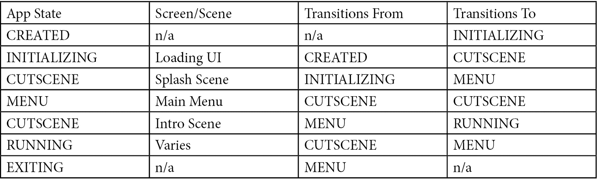
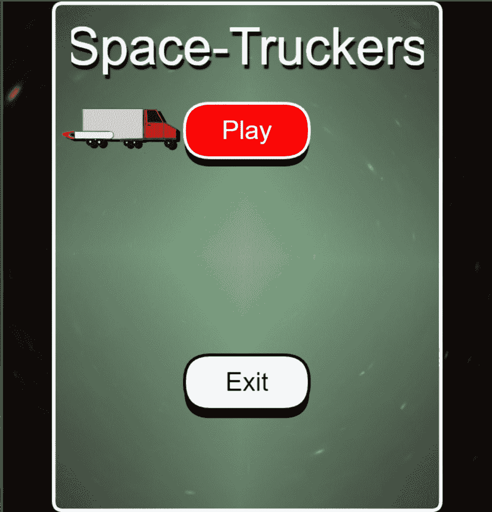

# 第四章：创建应用程序

Space-Truckers 应用程序需要能够维护和在不同屏幕之间切换一组离散状态，例如菜单屏幕和游戏屏幕。应用程序状态之间的转换通常是由于用户交互（例如，用户选择菜单项）或作为某些操作（如应用程序启动或退出）的一部分而发生的。在这里，我们推导出基本的应用程序流程，然后使用它来构建一个基本框架，用于呈现和切换任意屏幕。

在第一章中，我们看到了 Space-Truckers 游戏的全部辉煌和美丽。然后我们立即在沙盒中创建加载屏幕的动画，然后放慢速度来构建游戏所需的支持应用程序基础设施。我们可能觉得我们一直专注于游戏设计之外的事情，自然地想要专注于诸如引入 3D 模型和纹理或编程游戏机制等活动。不用担心——我们将在不久的将来达到那里！*第二部分：构建游戏*正是关于这些话题，但没有本章和随附章节的工作，就没有东西可以连接一个主题相关的有趣沙盒片段和代码片段集合。

重要提示

本章将代表代码和内容呈现方式的更大转变。从现在开始，代码列表将倾向于显示代码片段或突出显示更大代码块中的有趣区域。始终会提供链接到仓库或沙盒，以便您可以检查您的作品或使用代码跳过前进！

本节和本章的工作是构建必要的软件和逻辑组件，以使从单个组件中产生一个统一且引人入胜的体验。在本章的整个过程中，我们将编写代码以实现状态管理和转换逻辑，以支持在这些标题下核心游戏机制的未来开发：

+   添加自定义加载用户界面

+   Space-Truckers：状态机

+   Space-Truckers：主菜单

+   集成主菜单

## 技术要求

对于本章，我们将继续使用在*第三章*中介绍的开发流程，即*建立开发工作流程*。如果你是刚刚加入我们的旅程或者还没有自己编写代码，你可以通过克隆或检出 Space-Truckers：GitHub 仓库中的`ch3-final`标签来赶上进度：[`github.com/jelster/space-truckers/tree/ch3-final`](https://github.com/jelster/space-truckers/tree/ch3-final)。在为本章的材料编写任何代码之前，通常一个好的做法是创建一个新的**git**分支来跟踪上一章的**分支**或**标签**。这很不寻常，因为你通常会设置你的分支来跟踪**develop**或**main**。然而，在这种情况下，你想要比较的是在开始之前，从存储库的提交历史中特定点的提交，而不是之后的所有内容都已被涵盖。

# 添加自定义加载用户界面

当我们开始获得一些动力和势头时，我们首先必须让我们的引擎预热，然后才能考虑换挡。进行一次简短的代码管理练习正是提高这些转速的方法！一旦我们找到了最佳点，我们就会直接利用这项工作来构建我们的加载界面。记住，当我们通过复杂性的比喻变速箱前进时，我们将看到更少的细节，例如以下内容，同时也会覆盖更大的范围。

## 单独练习：重构 StartScene 以提取 AstroFactory

为了为这个和未来的某些功能打下基础，我们希望从**startScene**中提取所有与创建新行星相关的逻辑，这些新行星不是特定于场景的。这个逻辑被放入一个新的**astroFactory**类中。这次重构的基本要素很简单，但关键在于创建一个行星数据对象的数组，然后遍历这个数组，调用**AstroFactory**的各种方法来组合场景的对象。将这次重构视为一种特殊的练习或挑战，但不要过于担心。目的是尝试应用新的知识，而不是给予通过或失败的评价！或者，如果你觉得不需要练习或想跳过这个练习，可以从检查以下提交 URL 的补丁差异开始编写代码：[`github.com/jelster/space-truckers/commit/9821811`](https://github.com/jelster/space-truckers/commit/9821811)。花时间理解材料，但别忘了回来继续本章和整本书的内容！

## 自定义加载界面类型

Babylon.js 提供了一个默认的加载 UI，在`engine.displayLoadingUI()`方法调用时自动出现。无论以何种方式调用，我们都会用我们自己设计的 UI 替换默认的加载 UI。Babylon.js 文档指定了`displayLoadingUI()`和`hideLoadingUI()`的详细信息——这些看起来熟悉吗？向项目的源代码中添加一个新的 JS 文件，并将其命名为`createStartScene`函数，来自我们老朋友`**startscene.js**`。

`engine`实例（`createStartScene`方法所需的）。在构造函数中，我们将初始化并分配一些类级别的属性供以后使用——包括`_startScene`：

```js

constructor(engine) {
    this._totalToLoad = 0.00;
    this._loadingText = "Loading Space-Truckers: The Video 
        Game...";
    this._currentAmountLoaded = 0.00;
    this._engine = engine;
    this._startScene = createStartScene(engine);
}
```

这样就完成了加载界面的构建。现在，我们需要实现`LoadingScreen`接口的成员，以便在适当的时候显示和隐藏 UI。这仅仅是通过使用显示和隐藏方法切换一个`_active`布尔标志来完成的；我们将让不久后我们将编写的其他代码来决定如何处理它：

```js

displayLoadingUI() {
    this._active = true;        
}
hideLoadingUI() {
    this._active = false;   
}
```

最后需要做的是有条件地渲染场景。由于我们在构造函数中传入了引擎实例，我们将在构造函数的末尾添加一个简单的渲染例程来调用`runRenderLoop`：

```js

 engine.runRenderLoop(() => {
    if (this._startScene && this._active === true) {
        this._startScene.scene.render();
    }
});
```

我们已经完成了大部分工作，但在我们可以称之为完成的任务之前，还有一些事情要做。

## 通过进度显示增强加载界面

我们添加了一个所谓的非确定性进度条，但如果我们想显示一些文本以及已加载资源的百分比呢？尽管我们的项目还没有这些资源，但很快就会有。幸运的是，为了支持这一点，我们只需要做几件小事。

### 添加属性 getter

`loadingUIText`；它可能会被外部代码调用或查询。不过，既然我们在做这件事，让我们添加以下额外的 getter：

```js

get progressAvailable() {
    return this._progressAvailable;
}
get currentAmountLoaded() {
    return this._currentAmountLoaded;
}
get totalToLoad() {
    return this._totalToLoad;
}
get loadingUIText() {
    return this._loadingText;
}
```

一个敏锐的眼睛可能会注意到`progressAvailable`getter 使用了一个在构造函数中没有定义的字段。这个设置和管理的地方与`currentAmountLoaded`和`totalToLoad`获取其值的地方相同——`onProgressHandler`函数。

### 处理进度

`onProgressHandler`是一个事件处理程序，它订阅了由 Babylon.js 组件（如`AssetManager`和`SceneLoader`）发出的 HTTP 和其他进度事件：

```js

onProgressHandler(evt) {
    this._progressAvailable = evt.lengthComputable === true;
    this._currentAmountLoaded = evt.loaded || this.
        currentAmountLoaded;
    this._totalToLoad = evt.total || this.
        currentAmountLoaded;
    if (this._progressAvailable) {
        this._loadingText = "Loading Space-Truckers: 
            The Video Game... " + ((this._current
                AmountLoaded / this._totalToLoad) * 100).
                    toFixed(2);
    }        
}
```

`evt`事件数据对象用于设置`progressAvailable`属性值。如果进度事件没有可计算的长度，`currentAmountLoaded`在未完成时设置为`0`（false），在完成时设置为`1`（true）。否则，它设置为已加载的字节数。如果我们能计算出加载的百分比，我们就这样做，并相应地设置`loadingUIText`后端字段。加载界面的最后一部分是显示`loadingText`和进度字符串（如果可用）。

### 显示加载文本和进度

为了在我们的场景中显示文本，我们将使用 Babylon.js 的**2D GUI**系统。关于这一点，在本章的后面部分会有更多介绍，所以现在，请将以下内容复制并粘贴到`SpaceTruckerLoadingScene`构造函数的末尾：

```js

this._textContainer = AdvancedDynamicTexture.CreateFullscre
    enUI("loadingUI", true, this._startScene.scene);
const textBlock = new TextBlock("textBlock", this._
    loadingText);
textBlock.fontSize = "62pt";
textBlock.color = "antiquewhite";
textBlock.verticalAlignment = Container.VERTICAL_ALIGNMENT_
    BOTTOM;
textBlock.paddingTop = "15%";
this._textContainer.addControl(textBlock);
```

我们在这里所做的只是创建一个新的`AdvancedDynamicTexture`，其大小与渲染画布相匹配，然后添加一个**TextBlock**，我们在将其添加到纹理的控制集合之前对其进行了一些大小、颜色和位置的调整。

注意

如果`onProgressHandler`可用，它将更新`loadingUIText`的值。

我们已经完成了加载屏幕功能，现在是在`index.js`组件中全局连接它的时候了。这只是一行代码，它是在创建`eng`实例之后立即添加的：

```js

const eng = new Engine(canvas, true, null, true);
logger.logInfo("Created BJS engine");
eng.loadingScreen = new SpaceTruckerLoadingScreen(eng);
```

就这些了！现在，每当代码请求引擎显示加载 UI 时，我们的小行星动画就会显示出来。虽然这看起来可能是一个微不足道的功能，但完成这个应用程序的部分使我们准备好稍微改变一下节奏，并检查我们如何管理 Space-Truckers: The Application 的整体行为。

# Space-Truckers: 状态机

对于熟悉游戏开发的人来说，可能会熟悉游戏结构围绕一系列循环的概念。更新循环运行模拟和物理，根据最新更新移动对象并应用效果。渲染循环是场景实际绘制到屏幕上的时刻。我们之前已经看到了这样的例子，比如当我们为`**scene.onBeforeRenderObservable**`添加事件监听器时，但这比我们现在关注的级别要低。我们的应用程序将作为多个不同 BJS 场景的宿主，因此它需要一种定期更新应用程序状态以及告诉活动场景进行渲染的方法。最后，它必须能够管理在不同场景之间的转换。

我们正在构建的应用程序在如何响应输入以及随时间演变其内部状态方面有一些隐含的要求。例如，当玩家选择菜单项或退出当前游戏时，系统必须通过改变（或“变异”）其数据来填充和渲染子菜单，或者返回主菜单。隐含的要求会导致软件设计不良，因此我们将从使隐含的显式化开始。

## 日志间歇

我们的应用程序即将变得更加复杂，因此现在是开始添加基本仪表和调试消息的好时机——我们总是可以在以后增强和改进日志程序，但没有它们的话，随着代码量的增加，开始的地方会更加困难。带有其导出类 `ConsoleProxy` 的源文件 `logger.js` 是一个围绕控制台对象的极其基本的包装器，它提供了将不同级别的日志消息（INFO、WARN、ERROR 和 FATAL）记录到控制台（如果存在）的功能。不同的日志方法具有相同的主体（如果你觉得这让你感到困扰，修复它并提交一个 PR！开源软件的美丽之处正在发挥作用），为了节省空间，以下代码中只展示了其中一个函数：

```js

class ConsoleProxy {
    constructor(console) {
        this._console = console;
        this._consoleIsPresent = this._console == true;
        this._messageBuffer = [];
    }
    logInfo(message) {
        const logObj = { type: "INFO", message: message};
        if (this._consoleIsPresent) { 
            this._console.log(logObj);
            return;
        }
        this._messageBuffer.push(message);
    }
// …
}
const theProxy = new ConsoleProxy(console);
export default theProxy;
```

之前的大部分代码相当标准——你几乎在任何自制的应用程序框架中都能看到这种类型。`constructor` 接受一个 `console` 参数，它使用该参数来设置存在标志。这是因为不能保证 `console` 对象总是可用，我们不希望任何日志调用失败并导致应用程序的其他部分出现问题。当控制台不可用时，`_`messageBuffer` 数组用作后备。在这种情况下，可以通过附加调试器并读取日志数组的内 容来访问应用程序日志。如果需要，可以轻松扩展以适应当前场景。`theProxy` 在导出为单个对象之前被实例化。日志记录器的消费者不会实例化一个新的日志实例——他们只需调用 `export default` 行，并将 `theProxy` 改为 `logger`。我们希望这部分内容方便使用，以便我们可以轻松地测试和验证代码的正确行为，或者你可以参考片段 **#EK321G** 作为起始参考模板。

## 生成器和 function* 迭代器

从软件设计的角度来看，我们将把我们的状态机视为一种 **迭代器**，或者一种循环结构，其中每次迭代 **yield** 下一个（或当前）状态，同时也允许调用者指定状态条件。提供这种功能的 JavaScript 语言结构被称为 **生成器函数**，或 **函数***。

MDN Web Docs 在 [`developer.mozilla.org/en-US/docs/Web/JavaScript/Reference/Statements/function*`](https://developer.mozilla.org/en-US/docs/Web/JavaScript/Reference/Statements/function*) 中这样描述生成器和它们的行为：

“生成器是可以退出并在以后重新进入的函数。它们的上下文（变量绑定）将在重新进入时被保存……”

“当调用迭代器的 `next()` 方法时，生成器函数的主体将执行，直到遇到第一个 `yield` 表达式，该表达式指定了要从迭代器返回的值”

“使用带有参数的`next()`方法将恢复生成器函数的执行，用`next()`的参数替换执行暂停处的`yield`表达式”

“在生成器中，当执行`return`语句时，将使生成器完成”

### 编写生成器函数

查看实际代码比阅读其描述更有帮助，因此让我们启动一个新的 Playground Snippet 并编写一些代码。使用基础 PG 片段（为我们的生成器函数存根使用`createScene`函数）：

```js

    function* appStateMachine() {
        let currentState = "INDETERMINATE";
        yield currentState;
        yield currentState + "-POST";
        yield "DONE";
    }
```

记住，当此函数体执行时，每当遇到`yield`语句时，控制权都会转移。`value`由迭代器返回，其形式为一个看起来如下结构的对象：`{ value: <yielded value>, done: false|true }`。在先前的代码中，我们在`currentState`变量之前定义并设置了一个局部变量`currentState`。在执行恢复后，代码再次产生，这次在隐式**返回**之前带有短语`“DONE”`。

### 使用生成器

为了最好地说明我们刚刚定义的`appStateMachine`生成器的某些非直观行为。请在自己的 Playground 中跟随，或者跳过并加载本节结果的下一个片段修订版（我们从 0 开始）——**#EK321G#1**。

使用我们的`appStateMachine`生成器的第一种——可以说是最简单的方法——是使用`yield`语句：

```js

    let index = 0;
    const asm = appStateMachine();
    for (const a of asm) {
        logger.logInfo("Index " + index++, a);
    }
```

在先前的片段中，在递增之前将索引变量的值记录到控制台，这是一种方便显示代码行为的方式。打开您的浏览器开发者工具，在点击**运行**后查看控制台输出。输出应类似于以下内容：

```js
{type: "INFO", message: "Index 0"} "INDETERMINATE"
{type: "INFO", message: "Index 1"} "INDETERMINATE-POST"
{type: "INFO", message: "Index 2"} "DONE"
```

您可以从`Index`值的`0`到`2`的进展中看到，`yield`语句是如何在生成器函数和`for...of`循环之间切换代码执行的。这意味着`of`迭代生成器最适合那些循环逻辑不需要做很多繁重工作或如果您编写的代码需要正确顺序地协调许多不同的异步操作，并且您不需要对迭代有精细控制的情况。

除了迭代生成的函数之外，另一种用法是手动调用`next()`函数来转移控制。每次调用都相当于之前讨论的循环结构的迭代，但请记住，区别在于，你不会直接得到`yield`语句中包含的任何值，而是返回一个具有`value`和`done`属性的迭代器对象：

```js

    const asm2 = appStateMachine();
    let s0 = asm2.next();
    let s1 = asm2.next();
    let s2 = asm2.next();
    let s3 = asm2.next();
    logger.logInfo("s0", s0);
    logger.logInfo("s1", s1);
    logger.logInfo("s2", s2);
    logger.logInfo("s3", s3);
```

运行此代码将产生与先前代码相同的输出，但多出一个值。与只有三个单独的索引值不同，这种方法让你拥有四个：

```js
{type: "INFO", message: "s3"} {value: undefined, done: true}
```

这个`“s3”`对象没有值，并且它的`done`标志被设置为`true`，表示序列已完成。任何对`asm2.next()`的进一步调用都将返回相同的`undefined`值和`true`标志。这种方法的优点是，生成器的消费者可以有很多控制权来决定何时以及如何调用`next()`，这是我们创建第一个状态机时即将使用的一个关键特性。

## 状态机的定义

计算机科学中的一个核心概念是**有限状态机**（**FSM**）——或者简称为**状态机**——根据我们的目的，它通过以下重要属性被定义和描述：

1.  系统在任何给定时间只能处于一个状态。

1.  状态机有有限数量的可能状态。从实用角度来看，至少有一个初始状态和一个最终状态用于系统。

1.  状态之间的转换是在响应命令、外部输入或环境中的其他变化（例如，时间流逝）时触发的。

1.  在渲染帧之前，状态机应该用有关状态的最新信息进行更新。

让我们更详细地看看这些点。

### 一次一个状态

这一点相当直观。一个给定的状态机可能只能处于一个状态，无论可能有多少个有效的状态——不存在混合、聚合或混合类型的状态。在代码术语中，这意味着我们的状态机将只有一个字段或属性来表示其当前状态。这并不是说特定的状态机不能有具有自己状态的属性（例如，一个动画可能处于 RUNNING 状态），只是整个状态机在任何给定时间只能被分类为处于一个状态。在撰写本文时，量子计算尚未达到主流可用性，巧妙地避免了任何关于潜在本征态的讨论——潜在状态的概率组合——并将主题内容牢固地根植于经典计算理论。呼，真是个解脱！

### 有限数量的状态，起始和结束状态

机器需要有一个初始状态来开始，也应该有一个结束状态。技术上，结束状态和初始状态可以是相同的，但这并不构成非常有趣或相关的软件。在起始和结束之间可以有任意数量的状态，尽管为了保持实用性，我们只会关注定义其中的一小部分。

### 当发生某些事情时发生转换

听起来很傻，但这是真的。在给定的更新周期过程中，应用程序或游戏逻辑可能会接收到触发状态转换的输入事件。我们 FSM 定义的一部分是调用任何给定状态转换的逻辑。这意味着我们的代码将包含具有诸如`goToMainMenu`等名称的转换方法。

注意

如果有帮助，试着将状态视为描述系统内部数据的单一、离散组合的简写方式。状态转换是控制一个内部数据组合向另一个不同数据排列的突变逻辑。

### 更新状态机

所有这些的总和是我们可以频繁地推进或进化机器状态的机制。因为我们将要管理多个场景，我们不能使用像`scene.onPreRenderObservable`这样的东西，因为我们已经为像动画行星轨道这样的东西使用过了。相反，我们将利用`engine.runRenderLoop`回调作为确保无论渲染哪个场景，我们的更新逻辑都会被调用的方式。这也很好地满足了在渲染帧之前更新状态的要求。

重要提示

如果您需要确保动画和物理同步，或者如果您需要帧率无关的渲染，您需要确保执行以下两项操作：

a) 在创建引擎实例时设置选项参数的`deterministicLockstep`标志

b) 使用`onBeforeStep`以及`onAfterStep`可观察对象，而不是使用`onPre/onAfterRenderObservable`集合来执行状态更新

在我们了解了如何构建应用程序的下一部分之后，是时候查看我们设计的具体细节，并开始原型化 Playground 片段。

## Space-Truckers：应用程序状态图

在我们深入编写 FSM 的代码之前，我们应该花点时间弄清楚我们将要构建什么。我们需要在开始时做出的一项重要区分是应用程序的游戏和非游戏部分。游戏将有自己的状态机来管理游戏的各个阶段，每个阶段又可以有自己的迷你状态机。完全是状态机！以下图显示了每个状态以及它们之间的转换。图中的圆圈代表由外部输入触发的事件或转换，例如用户点击按钮：

![图 4.1 – 来自早期 Space-Truckers 设计流程的状态图，展示了应用程序和游戏状态 – 状态之间的转换（线条和箭头）是按顺序发生的（例如初始化）或作为输入事件的结果（例如用户取消）

![img/Figure_4.01_B17266.jpg]

图 4.1 – 来自早期 Space-Truckers 设计流程的状态图，展示了应用程序和游戏状态 – 状态之间的转换（线条和箭头）是按顺序发生的（例如初始化）或作为输入事件的结果（例如用户取消）

现在，我们将忽略图表的下半部分。作为一个早期迭代版本，其中一些内容（即，剪辑场景）无论如何都是充满希望的。查看图表的上半部分，如果我们考虑加载界面处于**初始化**状态，那么我们可以看到状态和应用屏幕之间的一对一对应关系。这也应该开始变得清楚，每个屏幕也对应一个 BJS 场景。沿着这些思路推理，我们可以将不同的**CutScene**和**Splash Screen**项目概括为同一事物的两个独立实例（尽管内容不同，但这在这里并不相关）。以下是图表中我们已识别出的屏幕和场景：



图 4.2 – 应用级状态和转换规则的表格

这看起来可能需要吸收很多内容，但实际上并没有看起来那么复杂。现在是时候打开**VSCode**并开始添加一些新的代码了。你可以在这里跟随，或者如果你更愿意复制、粘贴并修改现有代码，请访问片段**#EK321G#6**。记住，随着你将片段整合到代码中，你需要进行类似我们在上一章中进行的类似类型的调整。

## 几乎无限循环状态

我们将要添加到我们的项目中的第一个东西是`appstates.js`，到项目的`/src`目录。由于这是一个非常简单且不会改变的对象，我们可以使用`Object.freeze`来确保在运行时值不会被更改：

```js

export default Object.freeze({
    CREATED: 0,
    INITIALIZING: 2,
    CUTSCENE: 3,
    MENU: 4,
    RUNNING: 5,
    EXITING: 6
});
```

在添加了`spaceTruckerApplication.js`之后，包含一个名为（惊喜！）`SpaceTruckerApplication`的`class`定义：

```js

class SpaceTruckerApplication {
}
```

这个类是这个应用程序的核心类（正如其名称所暗示的）。随着时间的推移，它将变得更大，所以在你开始通过定义我们的`appStateMachine`函数来着手之前，请珍惜它所有可爱的简洁性。在类内部添加一个函数定义。

如我们之前讨论的，状态机需要有一个且只有一个当前状态。在状态计算中，能够将当前状态与之前的状态的任何值进行比较非常有用，因此在`Generator`函数的主体中添加一些变量声明来包含这些值，以及一个辅助函数来更改它们：

```js

function* appStateMachine() {
        let previousState = null;
        let currentState = null;
        function setState(newState) {
            previousState = currentState;
            currentState = newState;
            logger.logInfo("App state changed. Previous 
                state:" + previousState + « 
                    New state: " + newState);
            return newState;
        }
}
// … create scene, camera return scene
```

现在，我们可以将注意力转向状态机的输出——它将返回给调用者的内容。我们之前的小样本一旦达到其序列的末尾就会简单地停止（返回`done: true`），但我们希望我们的有限状态机（FSM）在应用程序运行期间一直运行，并且我们事先不知道这意味着要调用生成器的`next()`方法多少次。我们解决这个问题的方法是将这个调用放在一个无限循环中。

每次循环首先从调用者那里接收输入，以指示所需的`nextState`——调用者通过将值作为参数传递给`setState`方法来执行实际的状态更改。一旦发生这种情况，代码将检查是否满足达到最终状态（`AppStates.EXITING`）的条件，如果是，则返回`currentState`——否则，它将在循环的顶部`yield`回调用者：

```js

while (true) {
    let nextState = yield;
      if (nextState !== null && nextState !== undefined) {
            setState(nextState);
            if (nextState === AppStates.EXITING) {
                return currentState;
            }
        }
}
```

我们的状态机实现（目前）已完成，现在是时候连接支持应用程序逻辑了。

## 添加构造函数和支持逻辑

我们需要通过从我们的生成器创建一个函数以及其他创建任务来初始化状态机，因此，在我们的新类中添加一个构造函数。由于我们使用这个类创建和管理场景，我们需要带上`_engine`。在此期间，我们不妨调用生成器并添加一个用于跟踪要渲染的场景的字段。最后，构造函数中的最后一个动作是将应用程序的状态从之前的`undefined`值转换为`CREATED`。我们将通过调用即将创建的`moveNextAppState`函数来完成这项工作（请参阅以下代码块）：

```js

constructor(engine) {
    this._engine = engine;
    this._currentScene = null;
    this._stateMachine = this.appStateMachine();
    this.moveNextAppState(AppStates.CREATED);
}
```

写出像`this._stateMachine.next().value`这样的语句可能会很繁琐，更糟糕的是，它向不需要知道这类信息的代码揭示了内部实现细节，这使得未来进行更改变得更加困难。让我们通过添加一些访问器属性来获取`currentState`和`activeScene`，来保护我们其余的代码免受这种处理的困扰。此外，正如之前提到的，我们将添加`moveNextAppState`辅助方法来帮助我们隐藏向状态机传递和接收值的过程：

```js

    get currentState() {
        return this._stateMachine.next();
    }
    get activeScene() {
        return this._currentScene;
    }
    moveNextAppState(state) {
        return this._stateMachine.next(state).value;
    }
```

在我们继续之前，有一点非常重要需要注意，即应用程序必须尊重其边界，在构建期间不要尝试执行重型加载任务。

这种类型的任务是为`AppStates.INITIALIZING`保留的，而这样做的原因对于用户体验至关重要。我们不希望在用户明确决定启动游戏之前执行任何可能将大量数据传输到客户端的操作。这尊重了那些可能对游戏感兴趣但数据或带宽连接有限的人，并强制在基于 HTML 的着陆页和基于 WebGPU 或 WebGL 的游戏之间进行清晰的分离。

重要提示

我们之前查看的状态图是在用户点击我们着陆页上的**启动**按钮时**开始**的。

点击着陆页的`run`按钮对`SpaceTruckerApplication`类的影响。这是我们将引擎的`runRenderLoop`回调与我们的`applicationStateMachine`连接起来的地方：

```js

    run() {
        this._engine.runRenderLoop(() => {
            // update loop
            let state = this.currentState;
            switch (state) {
                case AppStates.CREATED:
                case AppStates.INITIALIZING:
                    break;
                case AppStates.CUTSCENE:
                    break;
                case AppStates.MENU:
                    break;
                case AppStates.RUNNING:
                    break;
                case AppStates.EXITING:
                    break;
                default:
                    break;
            }
            this._currentScene?.render();
        });
    }
```

在`runRenderLoop`回调中，我们通过使用 getter 方法调用`_applicationStateMachine.next()`函数（无任何参数）来获取`currentState`。目前没有什么可看的，但占位符的`switch`语句显示了每个状态的处理位置。前两个状态`CREATED`和`INITIALIZING`被分组，因为它们没有被渲染——或者至少在`INITIALIZING`的情况下，加载 UI 是该状态的渲染输出。一旦完成场景选择和管理，将调用`_currentScene`的`render()`方法（如果存在）。

将`run`的初始调用连接起来，我们将在`index.js`文件中添加两行。还需要清理一些现在已过时的代码——我们不希望`index.js`调用`createStartScene`，也不希望它与引擎的渲染循环交互。在创建和设置`SpaceTruckerLoadingScreen`之后，声明并实例化一个新的`SpaceTruckerApplication`实例。由于它作为一个类型名称已经相当好，只需将其称为`theApp`。接下来，在**启动**按钮的点击处理程序中添加一行来调用`theApp.run()`。在开发过程中，在代码的关键区域添加日志语句可能会有用，以帮助理解应用程序的运行行为，因此要充分使用它们！这是我们应用程序的状态管理功能的基本框架，已经全部连接好，准备填充更多有趣的状态和行为。为此，我们开始具体化这些状态和行为，为构建主菜单做准备。

## 编写初始化逻辑

返回到状态图，一旦应用程序完成初始化，它应该过渡到显示开场画面（场景）然后再过渡到主菜单。这是一个很好的线性进展，因此借助`await` ES6 特性实现起来很简单。

由于`INITIALIZING`状态是构建后的第一个状态，它应该是`run()`方法中首先发生的事情。随着这个变化，我们还需要将`run()`方法标记为`async`，以便我们能够使用这个语言特性，因此将函数的前几行更改为以下内容：

```js

    async run() {
        await this.initialize();
    // …
```

现在，添加`initialize`函数的功能。我们希望这个方法完成几个任务，其中一些我们将暂时进行模拟。另一个方法占位符`goToMainMenu`帮助我们完成状态图的第一个部分，我们将构建以下内容：

```js

    async initialize() {
        this._engine.enterFullscreen(true);
        this._engine.displayLoadingUI();
        this.moveNextAppState(AppStates.INITIALIZING)
        // for simulating loading times
        const p = new Promise((res, rej) => {
            setTimeout(() => res(), 5000);
        });
        await p;
        this._engine.hideLoadingUI();
        this.goToMainMenu();       
    }
```

首先，我们从引擎请求全屏会话。这相当于用户选择他们的网络浏览器的全屏选项，我们希望在开始任何严肃的渲染之前做这件事——在没有渲染内容时应用画布缩放或大小更改要快得多。接下来，我们想要显示引擎的加载 UI——如果你还记得，我们在代码库中用我们自己的自定义加载 UI 替换了它。

注意

当在 Playground 中运行时，将显示默认的 Babylon.js 加载 UI，而不是我们的自定义 UI。

之后，我们就正式进入了`INITITIALIZING`状态，因此我们通过调用带有新状态的`moveNextAppState`来过渡到该状态。最后，我们通过创建一个在超时后解决的新的`Promise`来模拟 5 秒的加载时间。我们在隐藏加载 UI 和启动下一个状态转换到`MENU`状态之前等待这个操作完成。

## 转换到主菜单

`goToMainMenu`函数定义非常简单，因为它有一个非常具体的任务。它需要在转换到`MENU`状态之前创建一个（即将创建的）`MainMenuScene`类的实例。将以下函数定义添加到类中：

```js

    goToMainMenu() {
        this._engine.displayLoadingUI();        
        this._mainMenu = new MainMenuScene(this._engine);
        this._engine.hideLoadingUI();
        this.moveNextAppState(AppStates.MENU);        
    }
```

在我们可以完成连接我们的状态机之前，还需要进行一个更改。在我们的主`Update`循环中，在`AppStates.MENU`情况语句下，我们需要将`_currentScene`值设置为我们的主菜单场景：

```js

    case AppStates.MENU:
       this._currentScene = this._mainMenu.scene;
       break;
```

当然，这目前还不存在，现在是解决这个缺陷的好时机！创建另一个新的 JS 文件，`mainMenuScene.js`，并在代码片段中添加一个名为`MainMenuScene`的占位类。实现其构造函数以接受一个引擎实例；它还应该创建一个新的`scene`。为了与现有的背景融合，我们将`scene.clearColor`设置为不透明的黑色，分别为`0`，`0`，`0`和`1`。相机的距离参数设置为`-30`，看起来有些随意——然而，这个值在我们渲染动画背景时将变得非常重要。这是你的类定义在添加基本元素后的样子（不要忘记添加`import`语句为`Scene`，`Vector3`和`ArcRotateCamera`，并在文件顶部添加`from “@babylonjs/core”`，在文件底部添加`export default MainMenuScene`！）：

```js

class MainMenuScene {
    get scene() {
        return this._scene;
    }
    constructor(engine) {
        this._engine = engine;
        let scene = this._scene = new Scene(engine);
        const camera = new ArcRotateCamera("menuCam",
            0, 0, -30, Vector3.Zero(), scene, true);
    }
}
export default MainMenuScene;
```

检查是否有语法错误或其他问题，并确保保存和提交你的工作。这里的事情即将变得更加有趣！

我们基本状态机的最终列表在代码片段**#EK321G#6**中。不要被看似缺乏成就所欺骗——使用视觉指标来衡量进度并不总是明智的。我们已经通过这个基础工作打下了基础，这将有助于我们未来的努力，随着我们寻求在多个场景和屏幕之间进行协调，这将会更有意义。我们将要构建的第一个屏幕是主菜单，在我们的图中，它不是序列中的下一个状态——启动场景才是——但我们在构建一些作为构建过场场景所需的部分显示和转换逻辑之后将返回那里。

# Space-Truckers: 主菜单

几乎所有现有的视频游戏都有的一个主要共同特征是它们都有一个主菜单。太空卡车手也不例外，但我们首先必须坐下来，弄清楚我们想要我们的菜单看起来如何，然后我们才能制作它。我们从菜单布局和元素的基本概念草图开始，然后将其用作构建菜单片段的指南。从背景到前景，我们将逐步构建 GUI 菜单显示，添加容器、标题块，然后是准备拖放到代码库中的按钮！

## 基本设计

首先，让我们考虑应用程序的导航结构。根据我们的状态图（*图 4.1*），我们可以看到有几个不同的分支可以从菜单应用程序状态转换。除了最初进入主菜单的转换外，每条路径都代表一个不同的菜单项或选择选项：

+   从**菜单**转换到**运行**将由用户通过点击**播放**按钮触发。

+   点击**退出**按钮可以触发退出应用程序。

+   通过点击相应的按钮可以访问附加菜单。最初，我们只会创建一个**高分**子菜单。

在外观上，我们希望菜单功能上吸引人，并在一段时间内在前景和背景中展示一些动态行为。另一个考虑因素是，由于玩家可能使用游戏手柄或控制器而不是键盘和鼠标，我们希望有一个**选择指示器**，显示玩家通过点击或按下他们控制器上的相应按钮将调用哪个菜单项。以下草图显示了在没有背景的情况下这可能看起来如何：

![Figure 4.3 – A Main Menu design sketch

![img/Figure_4.03_B17266.jpg]

图 4.3 – 主菜单设计草图

为了让菜单在背景中脱颖而出，我们将用渐变或其他半透明图像填充它，同时给容器添加边框。

背景不需要有很多内容 – 时间和带宽限制可能会将这块特定内容放在低优先级轨道上。这没关系，因为我们可以快速轻松地放置一些看起来不错且能实现我们想要的功能的东西 – 你还记得我们那位老朋友**星域程序纹理**（**PT**）吗？我们将使用它为菜单添加一个酷炫的太空主题背景，然后我们将对其进行动画处理，以产生旅行的错觉。

在你的网络浏览器中切换回游乐场，点击**新建**图标来为我们的主菜单创建一个新的片段。

## 设置主菜单片段

了解我们计划如何将我们的片段中的代码在某个时候传输到我们的代码库中，这是一个很好的机会，投入时间和精力使这个过程尽可能快、可靠和准确。

我们可以通过在片段顶部定义一些别名来开始，这些别名对应于各种`BABYLON`组件和命名空间，就像我们在*第三章*中做的那样，*建立开发工作流程*：

```js

const {
    Color4,
    Vector3,    
    ArcRotateCamera,
    Scene    
} = BABYLON;
```

随着我们涉及来自本地文件的更多`MainMenuScene`类定义，此列表中将有更多项目需要添加。

注意

我们刚刚定义的别名列表中的项目在集成到代码库时需要转换为**导入**语句。

当我们准备集成和提交更改时，我们将通过本质上执行相同操作的反向操作来更新本地文件。在片段的`createScene`函数中，实例化一个新的`MainMenuScene`实例并返回其场景属性，这样就会将我们的萌芽`MainMenuScene`类连接到片段的渲染循环中：

```js

var createScene = function () {
    const mainMenu = new MainMenuScene(engine);
    return mainMenu.scene;
};
```

简短明了，我们再也不用考虑这个片段的这一部分了。

## 构建背景

我们将从场景的一般环境和背景设置开始，所以滚动到类定义并添加一个名为`_setupBackgroundEnvironment`的新实例方法。这就是我们将实例化和配置作为屏幕背景的星系 PT 的地方。这也是我们将设置纹理以在一段时间内逐渐动画化，从而产生穿越星系的错觉的地方。

在构造函数的末尾调用`this._setupBackgroundEnvironment()`，这样我们就可以立即使用运行按钮来查看结果。然而，在编写函数的主体之前，将这些类型添加到顶部的别名定义列表中：

+   `HemisphericLight`

+   `StarfieldProceduralTexture`（单独一行，你以后会感谢自己的）

+   `StandardMaterial`

+   `CylinderBuilder`

+   `Texture`

场景已经有一个位于原点-30 单位处并指向原点的相机，但它还需要一盏灯以及照亮该灯的东西。与我们在加载界面中使用立方体网格作为天空盒不同，我们将创建一个圆锥形形状，通过为每个端盖制作不同半径的管子来实现。将星系 PT 应用到圆柱体的内部需要我们将`backFaceCulling`设置为`false`，因为我们想看到内部面。为了动画化星系，我们可以在渲染每一帧之前简单地增加`StarfieldProceduralTexture`的`time`属性：

```js

_setupBackgroundEnvironment() {
    const light = new HemisphericLight("light", new Vector3
        (0, 0.5, 0), this._scene);
    const starfieldPT = new StarfieldProceduralTexture
        ("starfieldPT", 1024, this._scene);
    const starfieldMat = new StandardMaterial("starfield", 
        this._scene);
    const space = CylinderBuilder.CreateCylinder("space", 
          { height: 64, diameterTop: 0, diameterBottom: 64,
              tessellation: 512 }, 
          this._scene);
    starfieldMat.diffuseTexture = starfieldPT;
    starfieldMat.diffuseTexture.coordinatesMode = Texture.
        SKYBOX_MODE;
    starfieldMat.backFaceCulling = false;
    starfieldPT.beta = 0.1;
    space.material = starfieldMat;
    return this._scene.onBeforeRenderObservable.add(() => {
        starfieldPT.time += this._scene.getEngine().
            getDeltaTime() / 1000;
    });
}
```

`HemisphericLight`是 Babylon.js 中的一种光源，它模拟了环境光照类型。通过玩弄**漫反射**、**镜面反射**以及这种类型的光的独特之处**地面颜色**的组合，你可以实现许多有趣的效果，但鉴于我们的需求相当简单，我们目前不需要这样做。

重要提示

将场景的 delta 时间除以 1,000 设置了星系闪烁和移动的速度。尝试删除除法语句，看看会发生什么！

完成函数，我们遵循与我们在创建加载屏幕的行星轨道动画时相同的模式，通过注册`onBeforeRenderObservable`并返回**观察者**来整洁地处理。如果一切顺利，点击**运行**按钮应该会显示我们星系的美丽画面，随着它缓慢地移动而闪烁和闪耀。

点击`#16XY6Z`查看此开发阶段此代码片段的完整代码。

## 创建高级动态纹理和 GUI

当涉及到 Babylon.js 2D GUI 系统中的广泛功能时，可能会有很多内容需要吸收。更详细的 GUI API 文档可以在[`doc.babylonjs.com/divingDeeper/gui/gui`](https://doc.babylonjs.com/divingDeeper/gui/gui)找到，但我们现在将要使用它的内容应该要么刷新你的记忆，要么提供足够的基础知识以开始学习。向别名列表添加新类型，但不是将它们放入`BABYLON`对象中，而是添加一个新的`BABYLON.GUI`条目，它与`BABYLON`条目类似，包含来自`BABYLON.GUI`命名空间的下述类型：

+   `AdvancedDynamicTexture`

+   `Rectangle`

+   `Image`

+   `StackPanel`

+   `TextBlock`

+   `Control`

在`MainMenuClass`中添加一个名为`_setupUi`的新方法，并在构造函数中添加一行代码，在函数底部调用它。

目前我们不会尝试对菜单 UI 做任何复杂的设计，所以`_setupUi`函数首先需要做的是在（默认的）全屏模式下创建`BABYLON.GUI.AdvancedDynamicTexture`类的一个实例。这将产生一个与渲染画布大小相同的 2D 纹理，控件被绘制在其上，然后这个纹理被渲染在场景之上。我们将进行的一个小调整是告诉纹理以理想大小渲染——这将有助于避免由于下采样或上采样效果引起的渲染文本的模糊。为了允许其他类实例方法访问纹理，将其分配给`_guiMenu`属性：

```js

const gui = AdvancedDynamicTexture.CreateFullscreenUI("UI");
gui.renderAtIdealSize = true;
this._guiMenu = gui;
```

接下来，我们需要添加一个`Rectangle`控件来包含实际的菜单项。我们不想让它完全不透明，但它应该有一个对比鲜明的背景颜色或渐变。

## 添加菜单容器和背景

对于网页开发者和设计师来说，有很多希望令人感到舒适熟悉的概念正在发挥作用。GUI 控件树是一个类似于`AdvancedDynamicTexture`的层次结构，无论是直接还是间接。通常，展示它比描述它更容易，所以添加以下代码来定义我们的菜单容器和基本外观：

```js

        const menuContainer = new Rectangle("menuContainer");
        menuContainer.width = 0.8;
        menuContainer.thickness = 5;
        menuContainer.cornerRadius = 13;
        this._guiMenu.addControl(menuContainer);
        this._menuContainer = menuContainer;
```

宽度设置为画布大小的百分比（`0.8`），这样菜单就不会覆盖整个背景，而边框宽度（厚度）以像素为单位，而角落半径以度为单位——你明白了吗？

小贴士

Intellisense 可以成为您的最佳朋友，在提供 GUI 控件上众多属性的快速描述方面，尤其是当涉及到确定使用的单位（例如像素或百分比）时。

接下来，我们想要添加一个图像控件来持有菜单的背景。关于图像，创建一个漂亮的背景图像纹理很容易，但如果它在 PlayGround 中看不到，那又有什么用呢？所以，现在是时候施展魔法了…

## 图像旁白：引入外部内容

Babylon.js PlayGround 在其网络服务器的配置中有一个功能，允许从许多知名和建立的存储库主机（如 GitHub）共享跨源资源（**CORS**）。通过构建到我们源存储库的适当 URL，我们可以在 PlayGround 片段中加载纹理、声音和模型——就像在 **Babylon.js 资产库** 中一样！为了演示这是如何工作的，请将以下行添加到片段的顶部（第一行）：

```js

const menuBackground = https://raw.githubusercontent.com/jelster/space-truckers/ch4/assets/menuBackground.png
     + "?" + Number(new Date());
```

将 URL 分解，以下是您如何将此策略应用于任何公开托管的 GitHub 存储库：

1.  从基本 URL [raw.githubusercontent.com](http://raw.githubusercontent.com) 开始，按顺序添加存储库所有者（或拥有组织）的名称和存储库本身的名称——例如，`raw.githubusercontent.com/jelster/space-truckers`。

1.  接下来，添加一个路径段，用于指定从哪个分支或标签中检索资产。对于本书，资产将列在其章节对应的分支中，但对于许多其他存储库，这将是 `main`、`master` 或可能是 `develop`。

1.  最后，将路径的其余部分添加到资产中，包括文件扩展名。因为这些文件有相当健壮的缓存头，所以当进行内容生产时，通常将一个使用缓存的字符串（如当前日期和时间）附加到 URL 的末尾是个好主意，这样您可以确保始终看到文件的最新版本。

使用 `menuBackground` URL，创建一个 `Image` 并将其添加到我们之前添加的 `menuContainer`：

```js

        const menuBg = new Image("menuBg", menuBackground);
        menuContainer.addControl(menuBg);
```

通过点击 **运行** 测试您的进度，修复任何问题，然后当然要确保 **保存** 片段。要检查自己或从本章的最新片段开始，请使用 **#16XY6Z#1**。它应该看起来是这样的：

![图 4.4 – #16XY6Z#1 的主菜单具有星系 PT 背景，以及一个半透明的渐变填充矩形，该矩形将包含菜单项]

![img/Figure_4.04_B17266.jpg]

图 4.4 – #16XY6Z#1 的主菜单具有星系 PT 背景，以及一个半透明的渐变填充矩形，该矩形将包含菜单项

## 布局标题和菜单项

回到*图 4.2*，我们可以看到菜单屏幕可以被分成一个两行的网格——一行用于标题，一行用于菜单项。为了确保按钮和选择图标都按照我们想要的方式对齐，我们需要网格有三个列，每个列宽是网格宽度的三分之一（网格本身的宽度为 0.8 或 80%）。使用 `addColumnDefinition` 和 `addRowDefinition` 方法来完成此操作，使得设置非常简单，可以添加到我们的 `_setupUi` 方法中：

```js

        const menuGrid = new GUI.Grid("menuGrid");
        menuGrid.addColumnDefinition(0.33);
        menuGrid.addColumnDefinition(0.33);
        menuGrid.addColumnDefinition(0.33);
        menuGrid.addRowDefinition(0.5);
        menuGrid.addRowDefinition(0.5);
        menuContainer.addControl(menuGrid);        
        this._menuGrid = menuGrid;
```

标题文本是定义游戏或应用程序外观和感觉的重要因素，通过其字体和显示方式，但我们将回到这个话题，在*第七章**，处理路由数据*。现在，我们将使用默认字体并确保文本按需自动调整大小。将 `TextBlock` 垂直对齐到网格的顶部将确保无论有多少按钮，标题都始终保持在正确的位置。添加一些样式以添加阴影和填充，结果代码类似于以下内容：

```js

        const titleText = new TextBlock("title", "Space-
            Truckers");
        titleText.resizeToFit = true;
        titleText.textWrapping = GUI.TextWrapping.Ellipse;
        titleText.fontSize = "72pt";
        titleText.color = "white";
        titleText.width = 0.9;
        titleText.verticalAlignment = Control.
            VERTICAL_ALIGNMENT_TOP;
        titleText.paddingTop = titleText.paddingBottom = 
            "18px";
        titleText.shadowOffsetX = 3;
        titleText.shadowOffsetY = 6;
        titleText.shadowBlur = 2;
        menuContainer.addControl(titleText);
```

通过运行它并保存您的进度来检查您的作品。对于跟随的人，这可以在**#16XY6Z#2**中找到。下一个任务是编写一些功能来填充菜单的可选择按钮项。我们将做很多这些，所以我们可以少重复，就能节省更多的按键。

## 填充菜单项

类似于我们添加并实现 `_setupUi` 函数的方式，我们将通过添加 `_addMenuItems` 函数和构造函数调用表达式到我们的类中开始我们的最新任务。我们知道我们希望菜单中的所有按钮共享某些属性值的子集，但不是全部。特定菜单项实例的独特属性可以通过如下简单对象定义：

```js

const pbOpts = {
    name: "btPlay",
    title: "Play",
    background: "red",
    color: "white",
    onInvoked: () => console.log("Play button clicked")
};
```

一个按钮需要有一个独特的名称，并且还需要一些文本来显示。前景色和背景色应该针对每个项目具体指定，当然，当按钮被选中时采取的操作当然也符合特定按钮的特性。在 `_addMenuItems` 定义中但在 `pbOpts` 表达式之前，添加这个局部辅助函数来创建并填充具有给定属性的按钮控件：

```js

function createMenuItem(opts) {
    const btn = Button.CreateSimpleButton(opts.name || "", 
        opts.title);
    btn.color = opts.color || "white";
    btn.background = opts.background || "green";
    btn.height = "80px";
    btn.thickness = 4;
    btn.cornerRadius = 80;
    btn.shadowOffsetY = 12;
    btn.horizontalAlignment = Control.
        HORIZONTAL_ALIGNMENT_CENTER;
    btn.fontSize = "36pt";
    if (opts.onInvoked) {
        btn.onPointerClickObservable.add((ed, es) => 
            opts.onInvoked(ed, es));
    }
    return btn;
}
```

使用从我们的辅助方法返回的按钮，我们只需将其添加到菜单网格中：

```js

const playButton = createMenuItem(pbOpts);
this._menuGrid.addControl(playButton, this._menuGrid.
    children.length, 1);
```

与其 `addControl` 函数的相同函数不同，**Grid** 的 `addControl` 函数接受可选的 **行** 和 **列** 分配作为其第二个和第三个参数。这使得我们可以通过获取其子行数来在不了解其索引的情况下在最后一行插入一个项。我们希望按钮居中，所以列始终相同——一列。

通过根据这些选项添加退出按钮并不要忘记**保存**来完成按钮的设置！要比较检查点片段，请参阅**#16XY6Z#3**：

```js

const ebOpts = {
    name: "btExit",
    title: "Exit",
    background: "yellow",
    color: "black",
    onInvoked: () => console.log("Exit button clicked")
}
```

我们在本章中已经走了很长的路，但我们还没有完成。到目前为止，我们已经处理了很多不同的事情，我们计划构建的所有功能都已完成——现在，我们只需要将这个功能整合到我们的代码的其余部分。

## 添加菜单项选择和指示器

尽管有一大批玩家会想要并享受使用键盘和鼠标来玩《太空卡车手》，但它也应该是一个使用游戏手柄也能享受的体验。在下一章中，我们将更详细地探讨如何处理游戏手柄输入，为此，我们需要主菜单的项目可被选择，而无需调用它们的动作，也不需要在它们上方有鼠标指针悬停。一个选择指示器图标将起到这个作用，显示在当前所选菜单项旁边的图标，并显示在适当的按钮按下时将调用的命令或选项。

在我们到达所选项目的视觉方面之前，让我们以获取和设置函数对的形式给我们的类添加一些辅助属性，我们将称之为 `selectedItemIndex`。获取值很简单，使用 `return this_selectedItemIndex`。设置它稍微复杂一些。我们想要确保索引不超过菜单项的数量，并且当达到菜单项的末尾时，我们希望它从第一个项目重新开始。当所选项目索引改变时，我们还想执行其他一些操作，但设置方法不是执行任何比简单逻辑更复杂的地方，如下所示：

```js

   get selectedItemIndex() {
       return this._selectedItemIndex || -1;
   }   
   set selectedItemIndex(idx) {
        const itemCount = this._menuGrid.rowCount;
        const newIdx = Scalar.Repeat(idx, itemCount);
        this._selectedItemIndex = newIdx;
        this._selectedItemChanged.notifyObservers(newIdx);
    }
```

我们之前在动画行星轨道时看到了 `Scalar.Repeat` 的用法。然后，我们使用它来确保弧度值保持平滑的圆形。同样，我们希望选择在达到末尾时平滑地循环。新项目（在前面代码中突出显示）是一个我们尚未声明的类成员，即 `_selectedItemChanged` 观察者。

## 指示选择并对变化做出反应

调用 `scene.onBeforeRenderObservable`。然而，这一次，我们不是在一个 BJS 对象上使用内置的可观察者，而是我们自己声明的一个。使用语义与我们所使用的其他可观察者完全相同——调用 `add()` 方法来注册一个函数，每当可观察者被触发时都会调用该函数。创建可观察者同样简单，通过创建一个新的 `MainMenuScene` 构造函数，添加代码来创建 `_selectedItemChanged` 可观察者，然后调用其 `add` 方法来注册我们的选择改变逻辑：

```js

this._selectedItemChanged = new Observable();
this._selectedItemChanged.add((idx) => {
    const menuGrid = this._menuGrid;
    const selectedItem = menuGrid.getChildrenAt(idx, 1);
    if (selectedItem[0].isEnabled !== true) {
        this.selectedItemIndex = 1 + idx;
    }
    this._selectorIcon.isVisible = true;
    menuGrid.removeControl(this._selectorIcon);
    menuGrid.addControl(this._selectorIcon, idx);
});
```

当选择改变时，事件处理程序会传递新选择项的索引——它在网格中的行。有时，我们可能想要显示不可选的菜单项，因此我们检索所选项目，然后检查从所选行的第二列检索的项目是否`isEnabled`。如果不是这种情况，那么我们就增加`selectedItemIndex`——确保使用属性设置器而不是直接更改后端字段的值。我们事件处理程序的最后部分再次代表了我们还没有添加的内容——选择图标。这首先隐藏图标，然后从网格中移除它，并在新位置重新添加它。现在，再次在构造函数中添加对`this._createSelectorIcon()`的方法调用，然后向类中添加同名的函数声明。函数的主体应该如下所示：

```js

_createSelectorIcon() {
    const selectorIcon = new BABYLON.GUI.Image
        ("selectorIcon", selectionIcon);
    selectorIcon.width = "160px";
    selectorIcon.height = "60px";
    selectorIcon.horizontalAlignment = Control.
        HORIZONTAL_ALIGNMENT_CENTER;
    selectorIcon.shadowOffsetX = 5;
    selectorIcon.shadowOffsetY = 3;
    selectorIcon.isVisible = false;
    this._menuGrid.addControl(selectorIcon, 1, 0);
    this._selectorIcon = selectorIcon;
}
```

这使用最终的未声明常量`selectionIcon` URL 字符串创建了一个新的`GUI.Image`。方法中的其余部分是我们不久前编写的样板代码。

注意

为了避免与 HTML DOM Image 类型混淆，Playground 中使用的是完全限定的名称。

通过在片段顶部添加`selectionIcon` URL 字符串来总结本节倒数第二个任务：

```js

const selectionIcon = "https://raw.githubusercontent.com/jelster/space-truckers/ch4/assets/ui-selection-icon.PNG" + "?" + Number(new Date());
```

随意替换存储库中的图片，如果你想看到它在生产游戏中使用，请发送包含它的**Pull Request**给我们！最后，我们希望在场景完全加载并等待用户输入后自动选择菜单中的第一个项目。我们通过在构造函数末尾添加一行简单的代码来实现这一点：

```js

scene.whenReadyAsync().then(() => this.selectedItemIndex = 0);
```

点击**运行**应该显示一个精心制作的主菜单——点击**保存**并祝贺自己。看看你在这本书的一个相对较短章节的一个相对较小的部分中完成了多少，然后思考你最终会走多远！为了比较你的代码进行故障排除或赶上进度，请参阅片段**#16XY6Z#4**。主菜单看起来不错，但尽管背景中有星系闪烁，它仍然需要一点动作来给它一些活力和能量。坦白说，**退出**按钮的蜂黄色也不是我们想要的外观，所以让我们在继续之前花点时间纠正这些问题。

## 视觉改进和选择图标动画

我们想要做的最简单的更改是将我们的`ebOpts`对象的颜色属性设置为字符串颜色**black**。对于下一个更改，我们将在选择图标上添加一个小动画，使其看起来像卡车漂浮在菜单项旁边。这是一个两步的过程，每个步骤的组件应该都来自最近的使用经验。

首先，我们需要使用名为 `_selectorAnimationFrame` 的类成员跟踪图标的当前动画帧。其次，我们需要注册一个 `onBeforeRenderObservable`，它将在渲染场景中的每一帧之前执行一个新函数 `_selectorIconAnimation`。在该函数中，我们增加当前帧（如果需要则循环）并使用该值根据我们的圆形待机 – 正弦函数来计算图标沿垂直轴的位置。这就是动画函数应该类似的样子：

```js

_selectorIconAnimation() {
    const animTimeSeconds = Math.PI * 2;
    const dT = this._scene.getEngine().
        getDeltaTime() / 1000;
    this._selectorAnimationFrame = Scalar.Repeat(this._
    selectorAnimationFrame + dT * 5, animTimeSeconds * 10);
    this._selectorIcon.top = Math.sin(this.
        _selectorAnimationFrame).toFixed(0) + "px";
}
```

完成整个动画周期所需的总时间由第一个表达式给出，而自上一帧渲染以来经过的时间（以秒为单位）由第二个表达式给出。正如我们之前在 `set selectedItemIndex` 中所做的那样，当 `_selectorAnimationFrame` 达到帧计数时，我们在这里循环它，但同时我们通过任意因子缩放一些值，以产生新的 `top` 位置（以像素为单位），该位置在最后一行中设置。运行此操作应该会导致退出按钮的颜色更加令人愉悦，以及显示卡车选择图标的微妙浮动外观。



图 4.5 – 包含卡车图标浮动动画的主菜单片段

如果这开始感觉重复，那么这是好事，因为这意味着这本书中的材料开始深入人心！片段 **#16XY6Z#5** 有最新的代码；如果您还没有准备自己的，请导航到这个片段，并确保您已经打开了 VSCode，并准备好接受应用程序的新 Main Menu。

# 集成主菜单

尽管标题可能令人畏惧，但实际上我们不需要做太多工作就能将我们的片段中的所有工作整合到应用程序的代码结构中。事实上，在完成本章的所有努力和旅程之后，当我们完成这部分工作的时候，可能会感觉有点反高潮。

最直接和简单的方法是将片段中的整个 `MainMenuScene` 类复制粘贴到您的本地文件中，确保完全替换现有的类声明。您只需要稍微调整您的 `import` 语句；以下是其中两个最相关的行，其中发生了变化：

```js

import { Scene, Vector3, Scalar, Observable, Sound, HemisphericLight } from "@babylonjs/core";
import { AdvancedDynamicTexture, Rectangle, Image, Button, Control, TextBlock, Grid, TextWrapping } from "@babylonjs/gui";
```

对于选择图标图像资产，请从片段的 URL 下载或自己制作。无论哪种方式，都要为它添加一个 `import` 语句：

```js

import selectionIcon from "../assets/
    ui-selection-icon.PNG";
```

要么等待开发 webpack 输出完成，要么运行 webpack 进程来测试你的更改，并且别忘了提交和推送你的工作——没有理由因为遗漏几个按键而丢失工作。早些时候，当我们讨论我们的状态机时，我们了解到除了状态行为之外，定义从这些状态到其他状态的过渡也很重要。在过渡的话题上，现在有一个新的过渡！

## 进入和离开过渡

当我们查看我们的主菜单与 SpaceTruckerApplication 状态机的集成时，有两个函数我们还没有实现和连接。这两个函数是主菜单的两个过渡函数。换句话说，我们需要定义当我们过渡到 MENU 状态以及从该状态退出时会发生什么逻辑。命名这些新函数实际上相当简单——`_onMenuEnter`和`_onMenuLeave`。虽然我们可能希望在以后实现更多复杂的行为，但现在，我们将说，当菜单开始或停止成为应用程序的当前状态时，我们希望它相应地淡入或淡出。

实现这一点的最简单方法是通过动画化`menuContainer.alpha`属性，在`0`到`1`（进入）或`1`到`0`（离开）之间。与选择图标动画一样，我们需要存储`fadeIn`和`fadeOut`的当前帧。与选择图标动画不同，动画应该持续的时间是有限的，因此我们还需要存储过渡的总`duration`值。在每一帧之间，我们应该将当前的`alpha`值设置为仅略低于前一个值的值，这样过渡看起来就更加平滑。最后，当动画结束时，我们希望（在离开过渡的情况下）将菜单的可见性设置为`false`，以及任何其他需要进行的清理工作。有趣的是，进入和离开过渡的逻辑几乎相同，只是`SmoothStep`函数中用于插值`alpha`值的范围需要交换。下面是`_onMenuEnter`函数：

```js

_onMenuEnter(duration) {
    let fadeIn = 0;
    const fadeTime = duration || 1500;
    const timer = BABYLON.setAndStartTimer({
        timeout: fadeTime,
        contextObservable: this._scene.
            onBeforeRenderObservable,
        onTick: () => {
            const dT = this._scene.getEngine().
                getDeltaTime();
            fadeIn += dT;
            const currAmt = Scalar.SmoothStep(0, 1, fadeIn 
                / fadeTime);
            this._menuContainer.alpha = currAmt;
        },
        onEnded: () => {
            this.selectedItemIndex = 0;
        }
    });
    return timer;
}
```

我们不是使用 JavaScript 中标准的定时器创建方法`setTimeout`，而是使用`BABYLON.setAndStartTimer`实用函数。通过将`contextObservable`附加到`scene.onBeforeRenderObservable`，`onTick`方法会在每一帧渲染之前一致地被调用。当定时器完成时，`onEnded`函数会被调用，正如其名称所暗示的。在我们的情况下，我们希望在菜单完全过渡进来之后再显示选择图标，所以我们将在那里设置`selectedItemIndex`。在构造函数中，我们可以用`scene.whenReadyAsync`调用的`onMenuEnter`函数替换掉使用的回调，如下所示：

```js

       scene.whenReadyAsync().then(() => this._onMenuEnter());
```

保存文件并运行应用程序。你应该会看到菜单在几秒钟内淡入，然后出现选择项。了解更多关于此和其他相关功能的信息，请访问 https://doc.babylonjs.com/divingDeeper/events/observables#setandstarttimer，但也许可以稍等片刻再去做那件事——现在是时候完成本章了！

如前所述，`onMenuLeave` 函数几乎与其 `onMenuEnter` 对应函数相同（除了 `onEnded` 回调），只是在 `SmoothStep` 中交换了术语（如下）。添加 `onMenuLeave` 函数并使用更改后的表达式：

```js

const currAmt = Scalar.SmoothStep(1, 0, fadeOut / fadeTime);
```

连接 `onMenuLeave` 很简单：在 `_addMenuItems` 方法的 `ebOpts` 对象定义中，将 `onInvoked` 函数更改为类似以下的内容：

```js

onInvoked: () => {
    console.log("Exit button clicked");
    this._onMenuLeave(1000);
}
```

再次保存并测试你的工作以确保它按预期运行。看起来和表现都非常出色，但在我们能够停下来休息之前，还有最后一件事要做。

## 菜单收尾工作

这里有点太安静了，对于一个应该吸引人并有趣的主菜单屏幕来说。不过，我们可以用音乐的力量来解决这个问题！虽然我们将在后面更详细地介绍播放声音和音乐，但机会难得，所以这里尽可能用最少的字数给出快速且简单的版本：

### 添加导入语句

```js

import titleMusic from "../assets/sounds/space-trucker-title-theme.m4a";
```

### 从构造函数加载并播放音乐

```js

this._music = new Sound("titleMusic", titleMusic, scene, () => console.log("loaded title music"), { autoplay: true, loop: true, volume: 0.5 });
```

### 享受这些感觉

```js

<enjoy the music> 
```

好吧，也许最后一部分有点过于夸张；我们确实想在某个时候停止音乐。在 `_onMenuLeave` 的 `onEnded` 回调中调用 `this._music.stop()` 以在点击 **退出** 按钮时停止播放声音。一旦你运行了应用程序并纠正了任何问题，就是时候将更改提交到源代码控制，并享受一杯提神的饮料——我们完成了本章！

# 摘要

在本章中，我们经历了一段旅程。有些人可能会认为这更像是一场艰难的跋涉，这并不不公平——我们在这里已经艰难地穿越了一些相当密集的材料！尽管有相当多的理论和高级概念被抛出，但回想一下本章所取得的成就——我们最初是从一个启动动画的着陆页开始的。现在，我们有一个启动到 *应用程序* 的着陆页。

接下来，我们将探讨如何以产生一致和可预测的行为的方式处理接受不同形式和方法的输入问题——请继续关注我们，不要害怕花时间回顾你第一次没有理解的内容。令人惊讶的是，理解需要多次阅读才能真正掌握，但如果这不起作用，你发现自己在理解或跟随上遇到困难，请不要担心。导航到 Space-Trucker 讨论区或 Babylon.js 论坛，向社区发布你的问题或问题——你不是一个人在战斗！

# 扩展主题

事情正在逐渐积累动力，但这并不意味着没有更多可以探索和扩展的东西！以下是一些你可能想要查看、探索或构建到本章代码中的想法：

+   创建或扩展 Babylon.js 的常规 **Animation** 类型功能，以包括 2D **GUI** 控制 – 或者 – 实现一个模拟 Animation 对象行为的具有 **GUI** 控制的类。

+   你能否在 `SpaceTruckerLoadingScreen.js` 代码中找到缺陷？如果你在脑海中阅读它，这可能会有些微妙，但代码中确实存在逻辑缺陷。运行它不会抛出任何错误，但在某些条件下，它确实会在运行时产生可见的效果。

+   不要使用单个全屏的 `AdvancedDynamicTexture`，而是使用一个或多个绘制到场景中网格上的网格附加纹理，这些纹理可以以有趣的方式动画化。

+   在主菜单显示超过 30 秒且没有用户输入后，添加一个吸引模式。吸引模式是街机游戏的一个功能，它将游戏置于一个非交互式演示模式，旨在吸引路人的注意。你对于吸引模式有什么想法？
