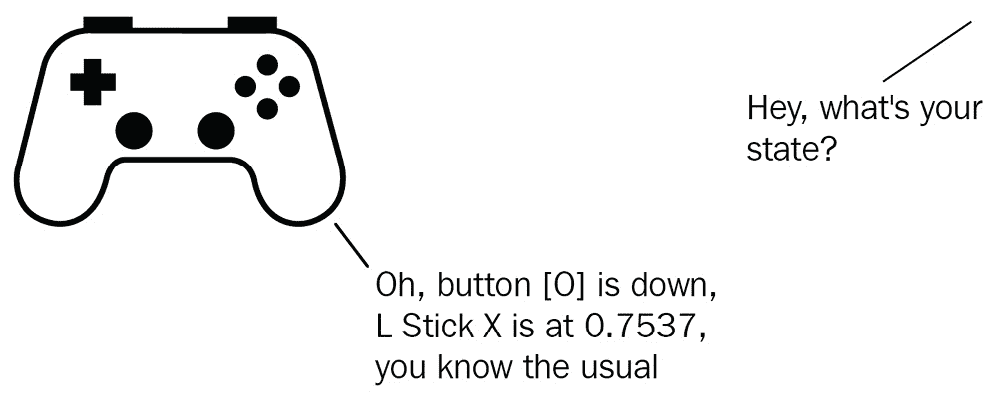

# 5

# 添加场景剪辑和处理输入

我们迄今为止完成的大部分工作都为整个几乎看不见和听不到的整体做出了贡献。我们唯一要求用户执行或甚至监听的动作只是一个按钮点击。多么无聊——而且安静。但这一切都将改变！在本章中，我们将通过添加一个启动屏幕来为我们的应用程序启动增添一些趣味，这个屏幕告诉世界他们即将看到的一切都是“由 Babylon.js 提供动力”的过程，同时为玩家提供他们的第一次 Space-Truckers 体验。我们还将通过添加多种不同设备类型的输入以及将输入处理为游戏中的动作的逻辑，让用户在游戏世界中拥有更多的自主权。

这似乎在如此短的章节中要涵盖很多东西，但多亏了 Babylon.js 中完成任务是多么容易，进度可能会比你想象的要快。

在本章中，我们将涵盖以下主题：

+   Space-Truckers – 启动屏幕

+   设计输入系统

我们将要做的所有事情都将基于我们在之前章节中完成的工作，但如果你只是从这里开始学习，也没有关系——继续阅读以获取完成本章所需源代码的技术细节。

# 技术要求

这是我们第一次扩展技术要求，但几乎对每个人来说都不会感到惊讶，因为要与特定类型的输入设备一起工作——无论是鼠标和键盘、Xbox™控制器、索尼 PlayStation™控制器，甚至是 VR 摇杆——都需要手头有一个这样的设备，或者（最坏的情况）下载并安装一个合适的模拟器/应用程序。话虽如此，Space-Truckers 应该可以使用以下输入类型进行游戏：

+   键盘和鼠标

+   虚拟摇杆/触摸屏

+   Xbox™控制器

+   索尼 PlayStation™控制器

+   通用游戏手柄

需要一个合适的音频输出设备来播放音乐和声音。

本章将遵循与之前章节相似的模式，我们将在将它们集成到应用程序的代码库之前构建一个或多个 PlayGround 片段。如果您想找到一个参考点或开始您旅程的地方，起始代码位于[`github.com/jelster/space-truckers/tree/ch4`](https://github.com/jelster/space-truckers/tree/ch4)。现在，事情都安排妥当后，我们可以全神贯注于我们的第一个任务：构建启动屏幕！

# Space-Truckers – 启动屏幕

没有什么比一个引人注目的入场更能吸引观众的注意力了，而没有人比那位伟大的威廉·莎士比亚更懂得这一点。翻看他的任何一部戏剧的前几页，就能发现从《罗密欧与朱丽叶》中敌对帮派的街头斗殴到《仲夏夜之梦》中婚礼被打断的众多激动人心的场景。这位剧作家知道如何吸引观众的注意力——在那个时代这是一个显著的成就——就像他毫无顾忌地从历史和神话（有时同时进行！）中掠夺他的故事一样，我们也将毫无顾忌地掠夺他在我们的工作中使用的技巧。

我们将考察的具体灵感来自 S 先生的想法，即吸引观众的注意力，为他们即将体验的内容做好准备。对于太空卡车司机来说，我们没有计划任何华丽的战斗场景或奇幻的婚礼，但我们确实有我们的喷溅屏幕！

在上下文中观察喷溅屏幕，用户刚刚点击了常规 HTML 网页上的**启动**按钮，将页面过渡到 WebGL，并渲染我们在*第二章**，在 Babylon.js*中构建的动画加载屏幕。立即在喷溅屏幕完成（无论是运行到结束还是因为用户选择跳过）之后，用户将被带到我们在上一章中构建的**主菜单**屏幕。通过一系列动画序列和音频配乐的配合，用户将被完全带入太空卡车司机的氛围中。

## 场景分镜

虽然让思绪飘向可能出现的喷溅场景的潜在途径很容易，但我们将其留作公关活动™，而是从极其简单的东西开始，然后将其用作扩展的基础。分镜板不必是一个极其复杂和计划周详的物品。用于分镜的时间是不在尝试分镜中提出想法的时间，所以不要担心它看起来好不好，要担心的是这些板是否捕捉到了你想要发生的场景的一系列快照。以下图表显示了构成喷溅屏幕分镜的草图系列：


图 5.1 – 喷溅屏幕序列的分镜。由于是草图，给出的时间数字不应直接作为依据

让我们通过按时间顺序走过场景来逐步分析这个图表。在时间=0 时，我们有一个空白的舞台（屏幕）。经过 2 秒钟后，带有“由...提供支持”字样的第一个面板完全可见。在那之后半秒（或 T+2.5 秒）标志着退出子序列的开始，另一个半秒后（或 T+3 秒）面板完全隐藏。第一个面板描述的总时间是 3 秒。有了这个解释，其他三个面板也应该是有意义的。每个面板都推进场景，从左上角开始，向右移动，然后回到左面板。面板中显示的图像根据给定的时序淡入淡出，但那些数字应该仅用作粗略的指南标记——重要的是要调整这些值到你喜欢的程度。

如果你将故事板与最终的启动屏幕序列进行比较，会发现一些明显的相似之处；面板几乎都是相同的，顺序也相同，标注的时间也大致相同，等等。这显示了设计从开始到结束的演变，并有助于强调故事板的一个核心观点——这些板不是全部的故事！这些诚实的草图是为了确定一个基准，为涉及的基本元素和时序提供一个大致的定义，这样我们就可以专注于其他实施方面——比如代码。

## 构建场景

我们在代码中构建启动屏幕时，需要学习的一个新概念就是我们尚未遇到过的。其他所有内容都将使用我们在前几章中以一种或另一种方式使用过的技术组合，所以希望这看起来相当简单！对于本章的这一部分，我们将专门在**PlayGround**（**PG**）中工作——如果你在跟随，这就是你想要加载 PG 并添加新片段的地方。

重要提示

代码列表将继续变得更加完整，更多地关注讨论中的特定方面或代码区域，这些方面或区域是重要的、棘手的或非直观的。本章的完整代码可以在[`github.com/jelster/space-truckers/tree/ch5`](https://github.com/jelster/space-truckers/tree/ch5)找到。不要犹豫，将它拉出来，与你的进度进行比较或检查你的工作——有时候，解释是不够的，你需要看到正在工作的代码！

当我们从故事板中分离出各种动画序列时，场景的立即结构或排序方式会立即显现出来。故事板中的每一块代表场景在特定时间发生的一个独特的快照，因此我们需要想出一个在代码中表示这些场景片段的方法。我们希望它是一个可重用的组件，并且我们希望能够使用 `CutSceneSegment` 的力量，以及一个新的 `SplashScene` 类，可以用来组合和管理这些片段，并具有适当的时序和过渡。

### `CutSceneSegment` 类

`CutSceneSegment` 类是一个简单的容器，可以表示场景序列的原子部分，尽管它很简单，但并非没有行为。一个 `CutSceneSegment` 应该能够 `start` 和 `stop` 其序列，可能还会循环播放。同样，其他组件可能需要知道何时完成一个片段，因此一个 `onEnd` 可观察者将使我们更容易编写控制逻辑来管理多个片段的顺序。因为我们不恨自己，也不想花时间调试神秘地表现不佳的代码，所以我们将 `CutSceneSegment` 的实例视为 **不可变**。也就是说，一旦我们创建了对象，我们就不会尝试通过替换包含的动画等方式来改变它。

重要提示

你能保密吗？有 JavaScript 经验的人可能会认为“不可变”这个词被错误地应用了。虽然从严格的技术意义上讲，我们处理的对象不是不可变的，但我们的想法是，我们只是假装它是不可变的。如果我们按原样使用它，而且没有人告诉，那么一个对象是否不可变有什么关系呢？但是要小心——很容易混淆软件思考的方式和在代码中表达这些概念的方式，所以不要将此误解为特定语言的指导！

虽然能够在单个 `CutSceneSegment` 中控制多个目标场景元素会很方便，但我们不需要这种复杂性来实现我们的故事板场景。这个决定与关于不可变性的先前决定相结合，对我们如何编写类的 **构造函数** 有两个重要的影响。

首先，我们需要获取一个 `target`，该片段将对其操作。这可以是任何可以动画化的东西，所以，几乎任何你想要动画化的 BJS 类型都可以在这里使用（除了 `animationSequence` 中的类型。当然，“ctor”（就像酷孩子们称呼的那样）需要引用当前场景，这为我们提供了以下方法签名：

```js

class CutSceneSegment {
    //loopAnimation = false;
    //animationGroup;
    //onEnd = new Observable();
    constructor(target, scene, ...animationSequence) { ... }
```

你可能不熟悉高亮显示的语言结构。没关系，因为虽然这并不罕见，但它也不是你可能在日常 JavaScript 中遇到的东西。在 `animationSequence` 前面的三个点 (`.`) 表示该参数被视为一个任意的 params-style 数组。这仅仅是一块方便的“语法糖”，允许函数的调用者避免创建和传递一个 `Array`，而是传递由逗号分隔的元素列表。下面的代码片段显示了数组作为后跟的三个参数传递：

```js

new CutSceneSegment(billboard, scene, fadeAnimation,
  scaleAnimation, rotateAnimation);
```

在 `CutSceneSegment` 构造函数中，我们需要完成两个主要任务：

1.  从 `animationSequence` 中的每个动画创建一个 `TargetedAnimation`。

1.  将目标动画添加到一个新的 `AnimationGroup` 中。

按照相反的顺序，`AnimationGroup` 是项目中的新功能。不要试图过度思考它——它确实和它的名字所暗示的一样。接下来，因为我们已经有了只需要定位的动画，我们可以遍历 `animationSequence` 集合，并使用 `AnimationGroup` 的 `addTargetedAnimation` 方法来完成绑定。关于 `AnimationGroup` 属性和方法的不同方面的更多信息，请参阅 Babylon.js 文档网站 [`doc.babylonjs.com/divingDeeper/animation/groupAnimations`](https://doc.babylonjs.com/divingDeeper/animation/groupAnimations)。除了之前的循环逻辑之外，`AnimationGroup` 的使用与单个 `Animation` 非常相似。完成这些任务后，构造函数剩下的就是将 `CutSceneSegment.onEnd` 成员属性委托给 `AnimationGroup.onAnimationGroupEndObservable`。下面是整个 `constructor` 的样子：

```js

constructor(target, scene, ...animationSequence) {
    this._target = target;
    let ag = new AnimationGroup(target.name + 
      "-animGroupCS", scene);
    for (var an of animationSequence) {
        ag.addTargetedAnimation(an, target);
    }
    this.animationGroup = ag;
    this.onEnd = ag.onAnimationGroupEndObservable;
    this._scene = scene;
}
```

完成 `CutSceneSegment` 类的是 `start` 和 `stop` 方法。这些方法非常简单，只是调用 `this.animationGroup` 的相应函数。当我们想要循环一个 `CutSceneSegment`（这不是典型的用法）时，我们可以在调用 `start` 之前将 `loopAnimation` 标志设置为 true：

```js

start() {
    this.animationGroup.start(this.loopAnimation);
}
stop() {
    this.animationGroup.stop();
}
```

这就完成了 `CutSceneSegment` 类。它准备好在即将为 `SplashScene` 类编写的代码中使用，我们将为故事板中的每个面板创建一个段，然后再按顺序播放它们。不过，首先，让我们为场景添加另一组构建块——驱动场景视觉的动画。

### 动画

对于场景，我们只需要三种不同的动画类型。关键帧和目标可能不同，但被动画化的基本属性是相同的。在类声明之外，添加 `flipAnimation`、`fadeAnimation` 和 `scaleAnimation` 的声明。为了保持帧率相同，我们将 `animationFps` 声明为 `const`：

```js

const animationFps = 30;
const flipAnimation = new Animation("flip", "rotation.x",
  animationFps, Animation.ANIMATIONTYPE_FLOAT, 
  ANIMATIONLOOPMODE_CONSTANT, true);
const fadeAnimation = new Animation("entranceAndExitFade",
  "visibility", animationFps,
  Animation.ANIMATIONTYPE_FLOAT,
  Animation.ANIMATIONLOOPMODE_CONSTANT, true);
const scaleAnimation = new BABYLON.Animation("scaleTarget",
  "scaling", animationFps, Animation.ANIMATIONTYPE_VECTOR3,
  Animation.ANIMATIONLOOPMODE_CYCLE, true);
```

到现在为止，这应该已经很熟悉了，除了高亮显示的`true`参数；这指示 Babylon.js 动画引擎使动画能够与其他动画混合。这并不一定是我们立即在场景中利用的东西，但一开始正确配置它对于将来需要时是很重要的。

重要提示

在 BJS PlayGround 中，IntelliSense 有时会将 `BABYLON.Animation` 类型与具有相同名称的浏览器或 DOM 类型混淆。添加 `BABYLON` 前缀可以帮助消除混淆，但记住稍后要移除它——当代码本地集成时，你不需要它。

所有部件都已准备就绪并放置到位，以便我们开始构建 `SplashScene` 类，我们将创建并组装 CutSceneSegments 以形成一个完整的场景。

### SplashScene 类

在设计类或组件的代码结构时，一个好的开始方式可能是简单地识别和捕获任何目前已知的状态变量作为类成员，即使其值将在稍后设置。这样的一个例子就是 `currentSegment`。这个属性持有当前正在播放的 `CutSceneSegment`。我们将在构造函数中填充各种片段，但通过在 `constructor` 外声明成员（而不是在 `this.foo = 3` 中定义它），我们提高了代码的可读性——这对于任何面向生产的代码来说都是极其重要的！以下是我们想要定义的类成员：

+   `currentSegment`

+   `poweredBy`

+   `babylonBillboard`

+   `communityProduction`

+   `dedication`

+   **onReadyObservable = new Observable()**

+   **skipRequested = false**

前面的每个片段（除了高亮显示的，很明显的原因）都对应于故事板上的一个面板——按照执行顺序，有助于提高可读性。尽管我们将在本章的稍后部分使用它，但 `onReadyObservable` 存在是为了表示所有资产都已加载完成，并且剪辑场景准备开始。`skipRequested` 的情况类似——在本章的稍后部分，我们将添加玩家跳过剪辑场景的能力，所以现在添加它是合理的。由于我们已经在那个区域工作，添加连接它的少量代码也很简单，这又少了一件需要担心的事情。

构造函数中已经有了足够的设置代码，所以一个有前瞻性的人可能会考虑添加方法占位符来封装每个片段的设置过程！将注意力转向 `createScene` 函数，我们希望尽快看到东西，所以让我们连接逻辑的一端，这将允许我们的片段在彼此之间转换。

就像我们之前的 PlayGround 片段结构一样，`SplashScene` 构造函数需要一个 `BABYLON.Engine` 实例作为参数传递，它使用这个实例来创建场景。同样简单的是 `createScene` 函数，它仅在 PlayGround 中使用。如果需要复习，以下是如何在 `createScene` 的主体中将代码与 PlayGround 连接起来的方法：

```js

const splashScreen = new SplashScene(engine);
splashScreen.onReadyObservable.add(() =>
  splashScreen.run());
return splashScreen.scene;
```

我们需要能够离散地控制 `SplashScene` 的开始和停止，因此构造函数不是开始播放 CutSceneSegments 的地方。相反，我们将添加一个 `run` 方法（在前面的片段中突出显示），以响应 `onReadyObservable` 的信号来执行这些任务。现在，随着我们对 `SplashScene` 进行增强和扩展，我们将能够在此基础上构建，而无需担心所有内容同时开始。

如果你眯起眼睛足够多，并且可能暂时没有保护地盯着太阳看，`SplashScreen.run()` 函数看起来非常类似于 `SpaceTruckerApplication` 运行函数中的 `run` 函数。

重要提示

在没有适当的眼部保护的情况下，不要直接看太阳！即使是有阻挡紫外线功能的太阳镜，对眼睛的保护也不充分，可能会导致永久性损伤。相关的是，永远不要从编程技术书籍中获取户外活动的建议。祝你好运。

它们看起来如此相似的原因是它们都执行类似的功能。面临相似问题，解决方案也相似，所以我们就到这里：

```js

run() {
    this.currentSegment.start();
    let prior, curr = this.currentSegment;
    this.onUpdate = this.scene.onBeforeRenderObservable
    .add(() => {
        if (this.skipRequested) {
            this?.currentSegment.stop();
            this.currentSegment = null;
            return;
        }
        curr = this.currentSegment;
        if (prior !== curr) {
            this.currentSegment?.start();
        }
    });
}
```

尽管这个场景没有使用我们在上一章中看到的 `function*` 生成器，但它仍然符合简单状态机的类型。当前状态（由 `currentSegment` 表示）在每一帧都会被轮询并与前一帧的值进行比较。如果它们不同，那么这意味着一个新的片段已经被交换进来，并且必须调用其 `start` 方法来继续序列。由于它非常直接，而且因为我们已经在这里，所以还添加了管理玩家希望跳过预告片直接进入主菜单用例的逻辑。唯一真正值得注意的事项是，将 `this.currentSegment = null` 与 `?.` 操作符组合起来，以防止对未定义值调用方法；如果 `currentSegment` 为空（从代码的角度来看），那么预告片要么还没有开始，要么已经结束。

为了提供一个稳定的平台来创建 CutSceneSegments，我们还需要在构造函数逻辑中添加一些内容，如下面的代码所示：

```js

const scene = this.scene = new Scene(engine);
scene.clearColor = Color3.Black();
this.camera = new ArcRotateCamera("camera", 0, Math.PI / 2,
  5, Vector3.Zero(), scene);
this.light = new HemisphericLight("light", new Vector3(0,
  1, 0), scene);
this.light.groundColor = Color3.White();
this.light.intensity = 0.5;
const billboard = this.billboard =
  PlaneBuilder.CreatePlane("billboard", {
    width: 5,
    height: 3
}, scene);
billboard.rotation.z = Math.PI;
billboard.rotation.x = Math.PI;
billboard.rotation.y = Math.PI / 2;
const billMat = new StandardMaterial("stdMat", scene);
billboard.material = billMat;
```

设置场景、摄像机和灯光现在应该相当标准了，尽管使用`billboard`摄像机渲染场景，有`light`照亮`billboard`，还有`billboard`显示我们的内容——无论那是什么！我们希望`billboard`垂直于摄像机的视图，因此设置初始旋转。这些值可能看起来有点奇怪，但很快就会变得有意义。现在我们已经有了渲染剪辑场景的框架，是时候开始定义剪辑场景片段了！我们已经进行了一些操作而没有保存（或者如果你有很好的自律，可能没有），所以现在是运行代码片段并检查任何明显的问题或错误的好时机，然后再保存以备将来参考。

### “由我们提供动力”的剪辑场景片段

参考我们的初始故事板，作为我们的第一个片段，我们有一个显示风格化的“由我们提供动力”图像的`billboard`。时间设置是合理的，而且完全可用。然而，它的问题是它太无聊了。让我们通过在整个片段中缓慢旋转`billboard`来增加一些趣味，使用我们之前创建的`flipAnimation`。同时，我们将在适当的时间应用`fadeAnimation`来淡入淡出`billboard`。为了保持构造函数的大小在可控范围内，向`SplashScene`添加一个新的成员函数，并将其命名为`buildPoweredByAnimations`。然后，在函数体中，首先为片段的每个关键时间事件声明常量：

```js

        const start = 0;
        const enterTime = 2.5;
        const exitTime = enterTime + 2.5;
        const end = exitTime + 2.5;
```

上述代码片段中的值是通过实验得到的，所以请随意尝试其他值，直到找到适合你的正确值。在计算出绝对时间值后，我们还可以计算每个时间事件相关的帧号：

```js

        const entranceFrame = enterTime * animationFps;
        const beginExitFrame = exitTime * animationFps;
        const endFrame = end * animationFps;
```

当我们想要定义动画的`flipKey`值代表目标的**旋转**的**y**分量时，这些帧号很重要：

```js

const keys = [
            { frame: start, value: 0 },
            { frame: entranceFrame, value: 1 },
            { frame: beginExitFrame, value: 0.998 },
            { frame: endFrame, value: 0 }
        ];
        fadeAnimation.setKeys(keys);
        const flipKeys = [
            { frame: start, value: Math.PI },
            { frame: entranceFrame, value: 0 },
            { frame: beginExitFrame, value: Math.PI },
            { frame: endFrame, value: 2 * Math.PI }
        ];
        flipAnimation.setKeys(flipKeys);
```

在根据计算出的帧时间定义了每个相关的关键帧之后，将那些关键帧通过调用`setKeys`传递给动画是很重要的。这符合我们重用`Animations`的计划，因为关键帧被复制到与目标关联时创建的`TargetAnimation`实例中；我们只需在需要时再次调用`setKeys`并使用一组新的关键帧即可。

重要提示

我们为这个`CutSceneSegment`建立的模式将被用于其余的片段。换句话说，这将在测试中用到！

我们`buildPoweredByAnimations`函数需要做的最后一件事是创建并返回一个新的`CutSceneSegment`，将所有内容组合在一起：

```js

const seg0 = new CutSceneSegment(this.billboard,
  this.scene, fadeAnimation, flipAnimation);
return seg0;
```

在 `SplashScene` 构造函数中，我们将调用 `buildPoweredByAnimations` 函数来创建 `poweredBy` 对象变量。将 `poweredBy` 分配给 `this.currentSegment` 将确保当调用 `run` 时，序列开始。之后，我们需要加载“由…提供支持”的图像作为纹理，我们可以使用 `billMat`。由于这涉及到外部图像资产，请添加对图像文件的顶级声明（有关构建资产的完整 GitHub URL 的更多信息，请参阅上一章）。在这个初始情况下，它将是一个名为 [`raw.githubusercontent.com/jelster/space-truckers/develop/assets/powered-by.png`](https://raw.githubusercontent.com/jelster/space-truckers/develop/assets/powered-by.png) 的文件。使用该 URL 构建一个新的 `billMat.diffuseTexture` 属性。

重要提示

确保在将其分配给材质之前加载纹理！

在运行时，你应该在广告牌平面上看到图像，这是在保存之前测试你工作的好方法！

### 转换到下一个 CutSceneSegment…以及更远的地方

当 `CutSceneSegment` 开始运行时，它可能会对场景中涉及的不同演员和场景元素的状态做出某些假设。例如，一个以特定模式减弱灯光的照明动画可能需要强度值从特定水平开始。同时，一个给定的部分不能“知道”关于其他部分或它们之间关系的任何信息——尽管有一个至关重要的、但有保留的例外。在 `CutSceneSegment` 完成后，`onEnd` 可观察者是理想的解决方案——同时也是一个保留条件！为了在构造函数中方便地保持一些局部变量在作用域内，我们可以调用 `onEnd.addOnce(() => { … })`。函数体是我们想要整理场景中的对象的地方，同时指定 Splash Scene 序列中的下一个部分：

```js

        poweredBy.onEnd.addOnce(() => {
            console.log("powered End");
            billMat.diffuseTexture = babylonTexture;
            billboard.rotation.x = Math.PI;
            this.light.intensity = 0.667;
            billboard.visibility = 0;
            this.currentSegment = babylonBillboard;
        });
```

在我们立即的情况下，下一个部分将是 `babylonBillboard` 部分，所以在 `poweredBy.onEnd` 处理器中使最后一个语句为 `this.currentSegment = babylonBillboard`。在表达式之前，我们需要重置 Babylon.js 标志纹理的 `billMat.diffuseTexture`。

重要提示

在继续到下一个部分之前，尝试运行 PlayGround 片段以查看其外观并测试是否存在任何重大错误是个好主意。打开浏览器的开发者工具查看记录的消息可以帮助你获得对时间的感觉！

那是什么？新的部分不存在，`buildBabylonAnimation` 函数也不存在：对于纹理，使用 [`raw.githubusercontent.com/BabylonJS/Brand-Toolkit/master/babylonjs_identity/fullColor/babylonjs_identity_color.png`](https://raw.githubusercontent.com/BabylonJS/Brand-Toolkit/master/babylonjs_identity/fullColor/babylonjs_identity_color.png) 和对于 `animationSequence`，使用 `fadeAnimation`：


在添加`buildBabylonAnimation`方法后，请确保在构造函数中调用它，以便您可以订阅新段落的`onEnd`可观察对象。在`babylonBillboard.onEnd`处理程序中，由于在此段落中没有移动，因此不需要重新定位 billboard，但需要为下一个段落做好准备，希望这是一个熟悉的节奏。

下一个段落被称为`communityProduction`，在功能上与上一个段落相同，只是纹理不同，位于[`raw.githubusercontent.com/jelster/space-truckers/develop/assets/splash-screen-community.png`](https://raw.githubusercontent.com/jelster/space-truckers/develop/assets/splash-screen-community.png)。它也仅使用`fadeAnimation`。以下是该段落中需要的主要相关时间和数字：


就像上一个段落一样，`communityProduction.onEnd`处理程序将负责设置下一个段落 – `callToAction` – 并将`billMat.diffuseTexture`更改为下一个，由于缺乏更好的名称，我们将称之为`rigTexture`。这种纹理被渲染到`billboard`网格上，在淡入后，我们将对其`scaling`属性应用循环动画，使其看起来更加动态。

重要提示

故事板指示这个面板是版权声明等内容的所在地，但没有任何理由这些内容不能放在其他同样有用但不太突出的地方。相反，我们将使该面板包含一个 Space-Trucker 图像，该图像将以准备等待指示状态缓慢地脉冲缩放和透明度，等待玩家交互。

在不久的将来，我们将添加一些输入管理。为此，我们需要一种显示适当格式化文本的方法。在一个块中。就像一个`TextBlock`一样。我们的`SplashScreen`将需要使用**BABYLON.GUI**。

### 最后一个段落

我们的最终`CutSceneSegment` – `callToAction` – 跟随了与其他相似的路径，即我们使用`billBoard`来显示一个`diffuseTexture`，使其淡入场景。在这里，段落开始出现分歧，因为不是再次淡出，我们希望它淡入然后循环，永远不会完全淡出。同时，我们将使用`scaleAnimation`来改变`billboard`网格沿其*X*-和*Z*-轴的缩放。这将给二维平面图像在动画循环时带来深度和缩放的假象，这意味着它看起来很酷！以下是该段落中每个动画的时间安排：


当达到结束时间时，我们希望我们的**行动号召**（**CTA**）文本变得可见，邀请我们按下一个键或轻触触摸屏以继续。在巴德最喜欢的技巧之一中，这里有一些预示（不是阴影那种，而是文学上的）——**CTA**的微妙目的是让应用程序能够弄清楚玩家想使用哪种输入。这是两个实体之间的一种非常直接的联系手段，否则它们几乎没有任何能力理解对方，而且它之所以有效，是因为它的二进制（讽刺！它燃烧！）简单性通过玩家拿起设备并参与输入来传达用户的偏好。

在我们继续之前，我们需要通过创建前面提到的`BABYLON.GUI.AdvancedDynamicTexture`来完成构造函数的实现：`callToActionTexture`。创建、配置 GUI 的属性并向其中添加`TextBlock`现在已经成为一项熟悉的练习（尽管在*第十章*“通过光照和材质改进环境”中，我们将介绍 GUI 编辑器！），所以接下来的列表应该不需要太多解释：

```js

// ... create billboard textures used in segments
let callToActionTexture = 
    this.callToActionTexture =
      BABYLON.GUI.AdvancedDynamicTexture.
      CreateFullscreenUI("splashGui");
let ctaBlock = new TextBlock("ctaBlock", 
    "Press any key or tap the screen to continue...");
ctaBlock.textWrapping = BABYLON.GUI.TextWrapping.WordWrap;
ctaBlock.color = "white";
ctaBlock.fontSize = "16pt";
ctaBlock.verticalAlignment = 
    ctaBlock.textVerticalAlignment =
      TextBlock.VERTICAL_ALIGNMENT_BOTTOM;
ctaBlock.paddingBottom = "12%";
ctaBlock.isVisible = false;
callToActionTexture.addControl(ctaBlock);
// ... call the builder functions
// ... Attach onEnd delegates
```

有一样东西不要忘记，那就是将`ctaBlock`（突出显示）的初始可见性设置为`false`。如果你想在`callToAction.onEnd`的处理程序之前显示它，那就去做吧——这是你的游戏！一旦你将所有内容添加到构造函数中，就试试看并修复出现的任何错误。点击**保存**，然后确保你戴上耳机或以其他方式提高电脑的音量——是时候加入主题曲了！

### 淡入标题音乐

到现在为止，我们已经对`SplashScene`进行了这么长时间的工作，它可能开始显得有点平淡，而这正是我们不能再接受的事情。在*第四章*“创建应用程序”中，我们将太空卡车手主题曲添加到了`SplashScene`的转折处。

回想一下，你希望不是很久以前，你读过这个亮点吗？

“尽管我们将在本章的后面部分才会使用它，但`onReadyObservable`用于指示所有资源已加载完成，场景准备开始。”

好吧，“本章后面的部分”现在就开始。由于我们已经将其他所有东西都安排妥当，现在只剩下四个任务来完成这个家伙并带它回家：

1.  在[`raw.githubusercontent.com/jelster/space-truckers/develop/assets/music/space-trucker-title-theme.m4a`](https://raw.githubusercontent.com/jelster/space-truckers/develop/assets/music/space-trucker-title-theme.m4a)添加一个字符串来保存歌曲的 URL（或替换你自己的）。

1.  在`readyToPlayCallback`中创建一个新的`SplashScene.onReadyObservable.notifyObservers`。将音量设置得非常低——`0.01`效果很好——以给音量增长留出空间。

1.  在`SplashScene.run`方法中添加对`this.music.play()`的调用。

1.  通过调用 `this.music.setVolume(0.998, 500)` 在一段时间内提高音量（也在 `run` 方法中）。

执行常规的运行、修复问题、重复所需操作，然后保存。如果您遇到麻烦或想比较您的结果与已知的“工作”片段，请查看 [`playground.babylonjs.com/#DSALXR`](https://playground.babylonjs.com/#DSALXR)。仍然似乎无法让事情正常工作？前往 Space-Truckers GitHub 讨论板 [`github.com/jelster/space-truckers/discussions`](https://github.com/jelster/space-truckers/discussions)，从社区获得帮助，留下反馈或错误报告，并获取自本书出版以来的代码更新。在 PG 中有一个可运行的示例，可以帮助您探索想法和概念，但现在，是时候象征性地摘下我们更抽象和理论的游戏设计师帽子，戴上我们更具体和务实的软件工程师工作头盔——在我们将 PG 代码与应用程序集成时，我们将需要这些品质。

## 集成 SplashScene

工作集成阶段是光鲜亮丽的优雅 PG Snippet 与现实世界中冷酷丑陋的真相相遇的地方。这是事情最有可能出错的地方，也是应用程序代码中的错误被揭露的地方。这种情况发生的原因与编写代码的人的性格和属性关系不大，尽管有时可能会感觉是这样。在这个阶段发现的任何错误或缺陷都是对原始代码编写时未知内容的反映，这意味着有机会对其进行改进！

### 看到差异

由于您有这份文本的帮助来指导您的努力，您将免于追踪和修复在 `SpaceTruckerApplication.js` 组件中发现的两个问题，以及我们将对类结构进行的其他一些更改。包括上述两个问题，以下是我们需要完成以集成 `SplashScreen` 的事项列表：

+   将新文件添加到 `/src - cutSceneSegment.js` 和 `splashScene.js`

+   在新文件中添加适当的导入，并复制类定义

`spaceTruckerApplication.js` 文件将经历这些任务带来的最大变化：

+   移除在 `spaceTruckerApplication` 中用于模拟加载时间的占位符 `Promises`。随着这些占位符的消失，我们也可以从它们的主函数中移除 `async` 标识符。

+   在 `initialize` 方法中实例化场景，而不是之前的地点。

+   在 `goToOpeningCutscene` 中注册一个监听 `onReady` 事件的观察者。

最后，以下是两个本应阻止应用程序正确进展和渲染的问题：

+   （问题）`AppStateMachine` 应该产生 `currentState`。

+   （问题）在`engine.runRenderLoop`回调中的逻辑需要是一个类级别的函数，以便正确访问`this`。可以通过将箭头函数提取为类级别函数来解决这个问题——即`this._engine.runRenderLoop(() => this.onRender());`。

最直观地查看更改的方式是将**启动屏幕**查看为应用程序的一部分。

无论如何访问，我们需要比较的修订范围可以用`ch4...6db9f7e`表达式表示。将其用作`git diff`的参数，或者将其粘贴到浏览器中作为`<repo URL>/compare/<修订范围>`的尾随路径，或者在这种情况下，[`github.com/jelster/space-truckers/compare/ch4...6db9f7e`](https://github.com/jelster/space-truckers/compare/ch4...6db9f7e)。

根据你的开发环境的具体情况，差异将以不同的方式显示。无论具体工具如何，几乎每个**差异**都会根据给定修订范围内的单个已更改文件组织其报告。**VSCode 的** **时间轴**功能将显示打开文件的提交历史；可以通过点击**时间轴**面板中的修订版本来查看差异。

小贴士

在每次提交或合并之前养成仔细检查这些差异的习惯可以提高你的编码能力，以及代码的质量。一个迹象表明你可能在一个提交中做了太多事情，就是有一个复杂且长的更改集。将工作分解成更小的组件，并分别提交，这样不仅任何**拉取请求**（**PR**）的审阅者会感谢你，而且你会发现自己在更快、更有信心地前进。

GitHub 的网页界面在查看**修订版本**、**分支**甚至**分叉**（也称为**上游仓库**）之间的差异时也非常有用。对于希望成为软件开发高手的人来说，导航和理解不同的报告是一项关键技能，但面对如此多的信息，不可避免地会产生噪音，这可能很困难。GitHub 会尝试为你做些这方面的工作，例如默认情况下折叠大的差异，但不幸的是，处理信号与噪音比不佳的方法并不是事后可以追溯的；它只有在**提交**或**推送**时应用才有效。这个解决方案是从一开始就注意并构建具有高信号与噪音比的提交。以下是一些有助于此的建议：


当需要时，将差异用作参考指南，尝试独立完成之前列出的活动。当然，既然你已经在查看差异，如果你只想立即继续，可以自由地拉取**提交 6db9f7e**的代码。以下图显示了运行应用程序、点击**启动**按钮以及结束启动屏幕后你应该到达的位置：


图 5.2 – 启动屏幕完成并等待用户输入

我们很快就会深入探讨那个提交的**补丁**中包含的所有项目 – 一些熟悉，一些新项目 – 的细节，但在我们这样做之前，让我们快速回顾一下到目前为止我们已经取得的成果。

从一组故事板面板开始，这些面板展示了场景在不同时间点的快照，我们使用这些面板来确定各种动画和过渡的时间。然后，我们编写了一些可重用的代码来定义 `CutSceneSegment`，以及其他与动画对象相关的逻辑。最后，我们编写了包含 `SplashScreen` 类及其相关的资产和 `CutSceneSegment` 协调逻辑的 `SplashScreen` 类，这构成了场景的全时间线。这是一项很大的成就 – 不要忽视这一点！

接下来，我们将继续探讨游戏开发中不太受重视的一个领域：输入系统。鉴于其重要性，我们将在本章的剩余部分详细介绍 Space-Truckers 输入系统的功能和实现方式。

# 设计输入系统

**用户界面**（**UI**）的主题通常非常重视视觉元素、布局和设计。对于大多数网络应用来说，跟踪指针、触摸或点击以及键盘输入的基本功能由网络浏览器处理，它反过来将许多责任委托给底层**操作系统**（**OS**）。当使用像 Babylon.js 这样的网络原生应用程序库时，开发者可以利用这些已经存在的抽象来快速轻松地将用户交互元素添加到他们的场景中。在本节中，我们将学习如何添加可以动态支持多种输入的应用程序框架，然后实现将任意输入映射到游戏中的动作或命令的方法。

据说，模仿是最真诚的赞美形式，所以让我们通过“窃取”（在礼貌的场合被称为“研究”）Babylon.js 团队的相机输入管理代码来赞美他们。以 **FreeCamera** 为例（了解更多信息请参阅 [`github.com/BabylonJS/Babylon.js/blob/master/packages/dev/core/src/Cameras/Inputs/freeCameraGamepadInput.ts`](https://github.com/BabylonJS/Babylon.js/blob/master/packages/dev/core/src/Cameras/Inputs/freeCameraGamepadInput.ts))，以下是控制器和应用程序之间数据流的方式：


图 5.3 – 从人类输入设备（HID）通过网络浏览器的 API 流入，到 HTML/Canvas，再到 Babylon.js 以及 FreeCamera 输入系统的各个组件

数据从顶部开始，由设备本身发送数据到连接的主操作系统，该操作系统（通过其设备驱动程序接口）将原始输入数据转换为与网络浏览器或本地主机接口兼容和熟悉的结构。最终，它进入 Babylon.js，在那里它被整理、处理、过滤并传递，直到达到其目标：**FreeCamera**。以下是一个 PG，它代表我们将要讨论的实际输入系统的略微简化版本——如果您迷路了，请将其用作工作参考：[`playground.babylonjs.com/#78MJJ8#64`](https://playground.babylonjs.com/%2378MJJ8%2364)。

## 定义主菜单控制方案

尽管我们现在不会为游戏阶段定义控制映射，但我们将使用此模式建立的基石将使添加任何任意控制映射变得快速、轻松且容易，当它们成为必要的时候。该表显示了我们在菜单系统中感兴趣处理的各个输入和动作：


图 5.4 – 将菜单控制映射到各种输入

当涉及到基本的键盘和（鼠标）指针交互时，Babylon.js 的`onKeyboardObservable`和`onPointerObservable`属性允许订阅者分别通知键盘和鼠标（触摸）交互。`GamepadManager`（可通过场景的`gamepadManager`属性访问）和`VirtualJoystick`在添加游戏手柄及其虚拟触摸等效物时很有用，当鼠标和键盘不是目标时。您可以在 Babylon.js 文档中了解更多信息，请参阅[`doc.babylonjs.com/divingDeeper/input/virtualJoysticks`](https://doc.babylonjs.com/divingDeeper/input/virtualJoysticks)和[`doc.babylonjs.com/divingDeeper/input/gamepads`](https://doc.babylonjs.com/divingDeeper/input/gamepads)。

重要提示

如前所述，输入处理的话题足够复杂，以至于需要占用这些页面有限的很大一部分空间来逐行审查所有代码，所以列出的代码将在特定讨论区域的各个部分中被突出显示。尽管如此，您不必担心无法跟上，您仍然可以检查完整的源代码，并且 PG 片段的链接也不会消失！

## 映射输入数据

尽管上一节中的控制表在游戏或应用程序的用户手册中会很好地工作，但如何利用该表中的信息在这个应用程序中并不那么清晰。

在 JavaScript 中映射`foo[“property”]`），索引将在我们称之为`inputActionMaps.js`的新源文件中表示。在其中，我们将定义所有与映射输入到动作相关的各种对象常量和辅助函数：

```js

const inputControlsMap = {
    /* Keyboard Mappings */
    w: 'MOVE_UP', 87: 'MOVE_UP',
    s: 'MOVE_DOWN', 83: 'MOVE_DOWN',
    a: 'MOVE_LEFT', 65: 'MOVE_LEFT',
    d: 'MOVE_RIGHT', 68: 'MOVE_RIGHT',
    //...
    PointerTap: 'ACTIVATE',
    //...
    button1: 'ACTIVATE', buttonStart: 'ACTIVATE',
    buttonBack: 'GO_BACK', button2: 'GO_BACK',
    dPadDown: 'MOVE_DOWN', lStickDown: 'MOVE_DOWN',
};
export default { inputControlsMap, ...};
```

在左侧（属性名称或`button1`和`buttonStart`成员。尽管看起来重复且冗余，但在实际设备代码和处理它们的逻辑之间有一个间接层，这为系统提供了大量的灵活性。

当涉及到处理各种类型的游戏手柄输入时，间接引用再次派上用场。`BABYLON.DeviceType`枚举定义了每个支持的游戏手柄设备的常量。我们将使用另一个对象映射来存储每个特定设备的输入如何与我们的`inputControlsMap`定义相匹配：

```js

const gamePadControlMap = {
    /* deviceType */
    2: [
        { 0: 'button1' }, // BABYLON.Xbox360Button.A
        { 1: 'button2' },
        { 2: 'button3' },
        { 3: 'button4' }
    ]
};
```

上述代码展示了 Xbox360 控制器映射在非常基础的层面上的样子。正如注释所示，`deviceType`数组中的每个对象都对应控制器上的不同输入索引。

接下来，我们将学习如何在运行时使用这种映射信息来解析来自连接设备的输入，但首先，让我们稍微退后一步，以获得更广阔的视角——不要退得太远，我们不想被所有这些内容压垮！以下图表说明了我们需要解决的不同关注点，以便能够处理《Space-Truckers》中的输入：

![Figure 5.5 – 处理输入 第一部分/4。本节涵盖了将来自多个设备和类型的输入数据映射到标准化的结构中，这些结构可以解析为游戏或应用级别的操作]

![Figure 5.05_B17266.jpg]

![Figure 5.5 – 处理输入 第一部分/4。本节涵盖了将来自多个设备和类型的输入数据映射到标准化的结构中，这些结构可以解析为游戏或应用级别的操作]

仅关于设计输入模型等话题，就能写出整本书，但这里要吸取的重要信息是，我们正在编写或即将编写的代码的目标是隐藏（或**抽象**）输入处理细节，使其从游戏核心逻辑中分离出来。游戏逻辑并不关心或需要知道用户是想用键盘还是手柄来移动他们的卡车——它只需要知道用户想要移动他们的卡车以及移动的方向！

## 输入管理

当涉及到管理特定的输入和设备时，`SpaceTruckerInputManager`（请参考代码[`github.com/jelster/space-truckers/blob/ch5/src/spaceTruckerInput.js`](https://github.com/jelster/space-truckers/blob/ch5/src/spaceTruckerInput.js)）负责管理订阅和取消订阅设备事件等低级设备管理任务，从底层 Babylon.js 输入抽象层检索输入，并将其准备用于处理成动作。

**合并**，或从多个设备聚合输入，可能既棘手又繁琐——这对需要集中注意力和回忆的编码来说不是最好的组合。通过分解复杂性来解决棘手的问题是第一步；第二步在某种程度上（或许可以说是讽刺性地）比第一步更复杂，因为更多地取决于个人找到方法继续前进到终点。

### 处理输入

在潜在软件设计方面需要做出的最常见决定之一是（在代码中）将各种责任分配在哪里。有时为了方便，可能会倾向于将所有逻辑、数据和代码都放入一个单独的文件中，但除非这一切都在 PG 中进行，否则增强和维护应用程序将很快在所有实际方面变成一个无法控制的噩梦。

**SpaceTruckerInputManager**（**STIM**）管理复杂性的方法之一是维护单独的、针对特定设备的注册逻辑。不同的设备以不同的方式呈现其数据；某些类型的输入适合订阅可观察对象以接收输入事件：


图 5.6 – 事件传播的可观察对象 – 在此情况下为 onKeyDownObservable

另一些则更适合在每一帧的基础上轮询其状态：



图 5.7 – 模拟输入（摇杆轴、触发器等）需要轮询以获取设备当前状态

为了使事情更有趣，许多设备混合了范式，一些输入通过可观察事件暴露出来，而一些则只能通过轮询获得！所有这些数据都汇总到一个 `inputMap` **哈希表**（又出现了！）中，其中包含所有已注册输入的当前状态。

输入管理器必须根据礼仪优雅地处理任何一种情况，因此它应该这样做。在订阅者离开后留下悬挂的订阅被认为是不良的礼仪，因此我们必须确保输入管理器也像一位好客人一样清理自己的东西。这意味着我们需要跟踪我们的订阅及其来源，以便我们可以使用 `Observable.remove`。幸运的是，我们还有一个并行需求，即输入管理器需要能够访问给定的场景。

### 输入注册

无论何时一个 `SpaceTruckerInputManager`，无论谁在调用 `registerInputForScene`，它只需要将 `sceneToRegister` 添加到其 `inputSubscriptions` 数组中。添加到列表中的对象映射以注册的场景为键，因为 `SpaceTruckerInputManager` 的生命周期遵循 `Scene.onDisposeObservable`（突出显示）。订阅数组包含返回的 `enableKeyboard`、`enableMouse` 和 `enableGamePad` 的集合）：

```js

registerInputForScene(sceneToRegister) {
    logger.logInfo("registering input for scene",
      sceneToRegister);
    const inputSubscriptions = this.inputSubscriptions;
    const registration = {
        scene: sceneToRegister, subscriptions: [
            this.enableKeyboard(sceneToRegister),
            this.enableMouse(sceneToRegister),
            this.enableGamepad(sceneToRegister)
        ]
    };
    sceneToRegister.onDisposeObservable.add(() =>
      this.unregisterInputForScene(sceneToRegister));
    inputSubscriptions.push(registration);
    sceneToRegister.attachControl();
}
```

上述提到的设备启用函数返回一个具有非常特定形状的对象——而这个形状是使一切顺利结合的关键之一（请原谅这里的双关语）。

### 检查输入

为了处理需要轮询的输入，每种设备都需要有一个 `checkInput` 方法，该方法知道如何检索输入并将其放置到 `SpaceTruckerInputManager.inputMap` 哈希表中。对于仅利用可观察值在其输入表面化的设备，`checkInput` 函数可以是一个空操作或空函数，不执行任何操作。具有混合或仅轴输入（例如，摇杆、操纵杆、扳机——任何返回的输入不是总是 0 或 1 的输入类型）的设备实现 `checkInput` 以在每次调用时（每帧）读取游戏手柄的状态。由于诸如归一化输入等问题是不同游戏手柄模型共享的担忧，`inputActionMap.js` 中的实用函数（在以下代码块中引用为 `SpaceTruckerControls`）被利用以确保轴输入值在范围 *-1 <= value <= 1* 内。其他函数接受这些归一化值并将它们映射到特定的输入方向，这取决于输入是否超过阈值值：

```js

const checkInputs = () => {
    const iMap = this.inputMap;
    if (!this.gamepad) { return; }
// handle quantitative or input that reads between 0 and 1
//(on/off) inputs are handled by the onButton/ondPad Observables
    let LSValues = SpaceTruckerControls
        .normalizeJoystickInputs(this.gamepad.leftStick);
    SpaceTruckerControls
        .mapStickTranslationInputToActions(LSValues, iMap);
    let RSValues = SpaceTruckerControls
        .normalizeJoystickInputs(this.gamepad.rightStick);

    SpaceTruckerControls
        .mapStickRotationInputToActions(RSValues, iMap);
};
```

上述代码块来自 `spaceTruckerInput.js`，并作为 `enableGamepads` 方法中定义的 `checkInputs` 函数对象的一部分。对于任何类型的模拟输入设备，输入中都会有一定程度的精度和噪声。为了处理这个问题，输入被“归一化”（也就是说，报告的值在范围 `-1 <= x <= 1` 内）使用静态方法。

### 处理输入订阅

`enableDevice` 合同的另一个属性是 `dispose` 方法。这是一个函数，就像 `checkInputs` 一样，它包含所有必要的特定逻辑来取消订阅任何观察者并清理自身。这两个属性允许 `inputManager` 的消费者完全不了解输入是如何被应用程序收集的具体细节。这使得代码更简单，并让我们有更多精力关注其他事情（例如，完成本章的剩余部分）。这就是 `enableGamepad` 方法的返回值看起来像这样：

```js

return {
            checkInputs,
            dispose: () => {
                this.gamepad = null;
                manager.onGamepadConnectedObservable
                   .remove(gamepadConnectedObserver);
                manager.onGamepadDisconnectedObservable
                   .remove(gamepadDisconnectedObserver);
            }
        };
```

所有关于观察者、可观察的和订阅的讨论可能会让人困惑。这就是你正在品尝的复杂性，但希望随着我们讨论 `getInputs` 方法的最后一部分，这种味道会转变为更令人愉悦的强大、功能性的风味。

### `getInputs` 方法

虽然我们希望场景每帧都检查输入，但我们还没有定义将调用该逻辑的是什么，或者它将在应用程序中的哪个位置发生。因为 `getInputs` 函数将场景作为其唯一参数。`sceneInputHandler` 本地常量。`sceneInputHandler.subscriptions` 数组中的每个订阅都会在 `forEach` 循环中调用其 `checkInputs` 函数；回想一下，每个订阅代表一种特定的输入类型，而 `checkInputs` 函数会将最新的值填充到 `SpaceTruckerInputManager.inputMap` 中。

由于 `inputMap` 包含了屏幕的所有各种输入，因此会迭代一个条目数组并将其映射到一个包含 `lastEvent` 属性的输入事件结构中：

```js

getInputs(scene) {
    const sceneInputHandler = this.inputSubscriptions
          .find(is => is.scene === scene);
    if (!sceneInputHandler) {
        return;
    }
    sceneInputHandler.subscriptions
        .forEach(s => s.checkInputs());
    const im = this.inputMap;
    const ik = Object.keys(im);
    const inputs = ik
        .map((key) => {
            return { 
action: controlsMap[key], 
lastEvent: im[key] 
            };
        });
    if (inputs && inputs.length > 0) {
        this.onInputAvailableObservable
            .notifyObservers(inputs);
    }
    return inputs;
}
```

然后将生成的输入数组返回给调用者，并通过 `onInputAvailableObservable`（目前未使用）进行分发。注意这个讨论中的大缺口，即关于在哪里以及谁调用 `getInputs` 函数的问题。这确实是一个好问题，但并不是 `SpaceTruckerInputManager` 需要关心的问题——这是下一个主题的内容：输入处理：


图 5.8 – 到目前为止涵盖的四个组件中的两个

## 输入处理

将原始输入映射到游戏或应用程序输入是输入管理的关键部分，这是我们迄今为止涵盖的输入系统的两个组件。这可能对于相对简单的应用程序或游戏来说已经足够了，但 Space-Truckers 有不同的需求。它需要能够选择性地将输入路由到屏幕，而不需要了解该输入的任何细节。它还需要处理输入状态——不仅仅是当前的，还包括过去的。

有一个点，向一位杰出的房客提出额外的请求变得不礼貌，如果我们的房客是 `SpaceTruckerInputManager`，那么要求它承担这些责任就是……好吧，这实在是太多了。我们需要另一个组件来承担这个负担：`SpaceTruckerInputProcessor`。

### 附加控制

与其兄弟组件 `SpaceTruckerInputManager` 的 `registerInputForScene` 和 `unRegisterInputForScene` 方法类似，`attachControl` 和 `detachControl` 函数。然而，与它的兄弟不同，STIP 函数不接受一个调用 `registerInputForScene` 的 `SpaceTruckerInputProcessor.attachControl` 方法：

```js

attachControl() {
    if (!this.controlsAttached) {
        this.scene.attachControl();
        this.inputManager.registerInputForScene(this.scene);
        this.onInputObserver =
          this.inputManager.onInputAvailableObservable
        .add((inputs) => {
           this.inputAvailableHandler(inputs);
        });
        this.controlsAttached = true;
    }
}
```

此外，作为将控制权附加到屏幕的一部分，`inputManager.onInputObservable` 被订阅了 `SpaceTruckerInputProcessor.inputAvailableHandler`，以便在接收到一组新的输入时得到通知。这是一个简单的小方法，它只是将接收到的输入推入 `inputQueue`，该队列作为 `update` 方法的一部分进行处理。

### 更新

这就是魔法发生的地方。在快速检查以确保可以处理输入之后，调用`inputManager.getInputs`，这反过来又触发一个函数外的过程，最终将信息填充到`inputQueue`中。这可能不会及时完成更新函数逻辑的其他部分，但这没关系，因为它将在下一帧中处理：

```js

update() {
    if (!this.controlsAttached) {
        return;
    }
    this.inputManager.getInputs(this.scene);
    this.lastActionState = this.actionState;
    const inputQueue = this.inputQueue;
    while (inputQueue.length > 0) {
        let input = inputQueue.pop();
        this.inputCommandHandler(input);
    }
}
```

当前将动作映射到状态（`this.actionState`）的映射被复制到`this.lastActionState`中，以保留它供后续处理输入时使用。然后，`inputQueue`中的项目逐个被清空并由`inputCommandHandler`分发。

### 输入命令处理器

这种表面上看似简单的方法实际上做了很多看似不可能的事情。这都归功于（第三次总是幸运！）`actionMap`的力量。`actionMap`类成员是一个对象映射，它将游戏动作（`ACTIVATE`）与宿主屏幕中的可执行函数相关联——这是一个我们很快就会深入探讨的话题——它使用它来查找和调用与给定动作相关联的游戏逻辑：

```js

inputCommandHandler(input) {
    input.forEach(i => {
        const inputParam = i.lastEvent;
        const actionFn = this.actionMap[i.action];
        if (actionFn) {
            const priorState = this.lastActionState 
                ? this.lastActionState[i.action] : null;                  
            this.actionState[i.action] =
              actionFn({priorState}, inputParam);
        }
    });
}
```

按照惯例，我们传递一个包含`lastActionState`的对象，以及从`inputManager`传递过来的事件对象，并将返回值存储在之前提到的对象映射`actionState`中。每个单独的`actionFn`决定返回什么，以及如何处理传入的状态值，而无需`inputProcessor`处理具体细节——既整洁又方便！

### 构建动作映射函数

`buildActionMap`所做的是所谓的`actionList`，`actionDef.action`字符串属性用于在`SpaceTruckerInputProcessor.screen`对象中查找具有相同名称的函数：

```js

buildActionMap(actionList, createNew) {
    if (createNew) {
        this.actionMap = {};
    }
    actionList.forEach(actionDef => {
      const action = actionDef.action;
        const actionFn = this.screen[action];
        if (!actionFn) {
            return;
        }
        this.actionMap[action] = actionDef.shouldBounce() ? 
             bounce(actionFn, 250, this) : actionFn;
    });
}
```

如果找到，`actionMap`将在可选地用预处理`bounce`函数包装后填充找到的函数，以防止它在给定时间段内被调用过多……这把我们带到了我们输入系统的最后一个组件：动作处理：


图 5.9 – 输入处理、输入管理和输入数据映射已覆盖。仅剩动作处理

## 动作处理

我们在过去的几页中深入探讨了多个层次的抽象和间接，现在我们终于到了所有这一切开始发挥作用的地方——动作处理。虽然之前的步骤仅限于特定的类或实例类型，但动作处理器本身就是屏幕。

### 习惯性动作

听起来像是一个糟糕的 2000 年代初期的封面乐队名字，但这是一个术语，用于描述我们在特定屏幕上命名和描述动作函数的方式。这比听起来简单得多：对于每个`state`参数的动作。如果您需要获取有关输入事件的更多信息，请向函数添加第二个参数以接受`inputEvent`。

重要注意事项

记住，动作是游戏特定的概念，例如 `MOVE_UP` 或 `ACTIVATE`。这些只是为这个游戏命名的名称；你可以随意命名它们！

以 `SpaceTruckerMainMenuScreen` 为例，`MOVE_UP` 和 `MOVE_DOWN` 动作应该增加或减少菜单项的 `selectedItemIndex`。`ACTIVATE` 动作应该调用菜单项。以下是我们在编码 `MOVE_UP` 动作时的样子：

```js

MOVE_UP(state) {
    logger.logInfo("MOVE_UP");
    const lastState = state.priorState;
    if (!lastState) {
        const oldIdx = this.selectedItemIndex;
        const newIdx = oldIdx - 1;
        this.selectedItemIndex = newIdx;
    }
    return true;
}
```

类似地，`ACTIVATE` 在通过调用其 `onPointerClickObservable.notifyObservers` 方法来模拟点击事件之前，检索 `selectedItem`。

### 跳过启动屏幕

作为在本章早期构建启动屏幕的一部分，我们在场景中添加了一个 `skipRequested` 标志，但从未有任何东西会改变这个值……直到现在！`ACTIVATE` 动作不需要知道按下了哪个键——它只需要知道它确实发生了；只是最初按下了键。这使得这部分逻辑相当简单：

```js

ACTIVATE(state) {
    const lastState = state.priorState;
    if (!this.skipRequested && !lastState) {
        logger.logInfo("Key press detected. Skipping cut
          scene.");
        this.skipRequested = true;
        return true;
    }
    return false;
}
```

在 `SpaceTruckerSplashScreen.update` 函数中，调用了 `actionProcessor.update` 函数，反过来，在 `SpaceTruckerApplication.Render` 中调用，但仅当它是当前活动屏幕时。


图 5.10 – 输入系统的所有四个组件

# 摘要

回顾本章前面的页面，可能会觉得我们并没有完成太多，但不要低估自己——本章中我们讨论的内容并不容易理解或掌握！构建和编排 `SplashScreen` 的顺序开始增加我们代码的复杂性，不计页面上从那转向输入所引起的心理冲击。

如前所述，并且现在不再重复，关于输入处理的主题可以写整整厚厚的教科书，而我们试图将其压缩到那部分的一小部分。不仅如此，我们现在能够以更清晰的画面来处理未来的功能，了解所有非游戏特定任务的管理和处理方式。

该陈述可以扩展到涵盖本节中的这一章和其他章节——我们现在已经建立了大部分支持应用程序，这让我们有更多精力关注下一节中的主题！在第二节中，我们将构建游戏机制，设置光照和材质，以及更多更多。

# 扩展主题

从哪里开始？有如此多的有趣事物和可能性可以探索！以下是一些你可以做的事情来进一步学习和增强 `SplashScreen`：

+   在开始部分添加相机动画，使相机沿着路径移动和旋转，这样`广告牌`面板的可见尺寸将以大约与音乐音量上升相同的速率增长

+   向场景添加背景环境效果，类似于我们在主菜单和程序星系纹理中所做的那样

+   将最终静态图像替换为网格、纹理、材质或其他内容

输入系统也是一个很好的灵感来源。以下是一些可以考虑的点：

+   实现对您最喜欢的游戏手柄或摇杆设备的支持。使用此测试网站查看您的设备发出的各种输入和值：[`luser.github.io/gamepadtest/`](https://luser.github.io/gamepadtest/)

+   修改输入系统以允许多个同时连接的用户——即本地多人游戏

+   将摇杆灵敏度设置暴露给应用程序，以便玩家可以在游戏中编辑

# 第二部分：构建游戏

在本书的第二部分，我们将基于第一部分的基础来实施构成**《太空卡车手：视频游戏》**的主要组件。随着内容的增多，速度加快，因为要涵盖的材料远多于容纳的空间。

本节包括以下章节：

+   *第六章*, *实现游戏机制*

+   *第七章*, *处理路线数据*

+   *第八章*, *构建驾驶游戏*

+   *第九章*, *计算和显示得分结果*

+   *第十章*, *通过照明和材质改善环境*
