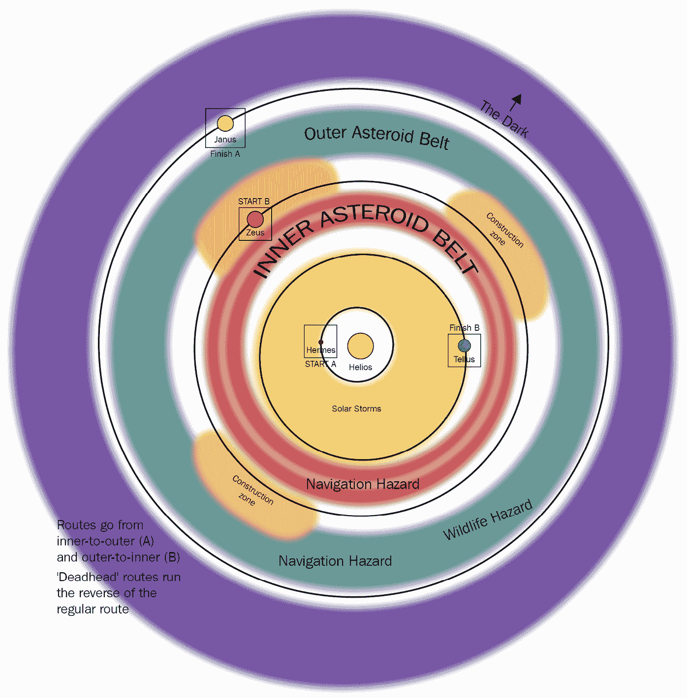
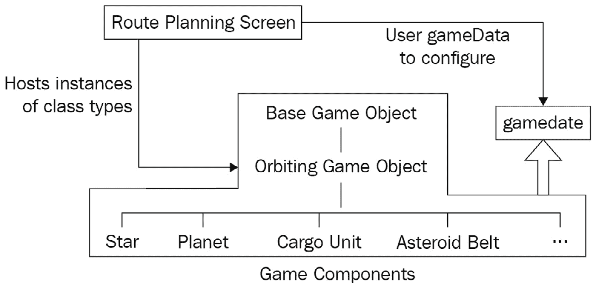
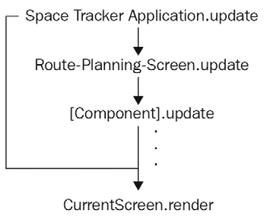
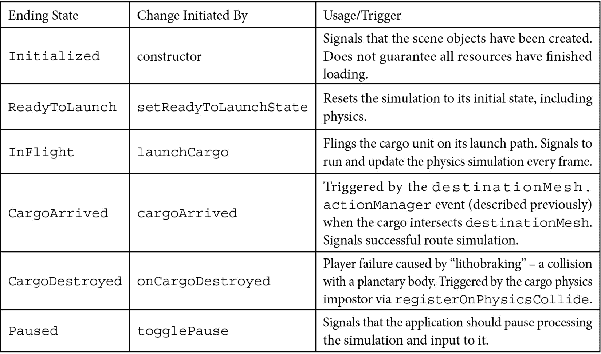
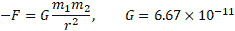
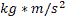
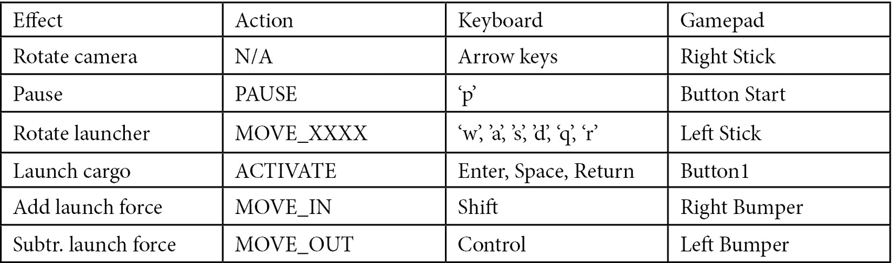

# 实现游戏机制

前几章的重点是稳固地构建**Space-Truckers**的应用基础。现在，是时候换挡（如果可以这样说的話）并看看我们想要如何实现游戏的第一阶段：**路线规划**。面对一个单一、令人畏惧、复杂的问题时，我们通常会将其分解为两个主要方面：模拟和游戏元素。在本章中，我们将首先查看游戏的模拟部分，然后在模拟之上叠加游戏机制，这样我们可以自由迭代。

这是现实秀和游戏秀中常见的策略，主持人会发表一段听起来像是即将揭示重大秘密的演讲，但随后节目却切换到广告。这与我们的情况相关，因为我们将执行类似的*误导*——我们不会直接进入激动人心的模拟和游戏机制，而是首先进行短暂的偏离，以便我们了解如何在 Space-Truckers 中管理音乐和声音。虽然时间不长，但当我们继续将更多功能集成到应用程序中时，这将是一个实用的补充。

在本章中，我们将涵盖以下主题：

+   声音管理的偏离

+   设计路线模拟的游戏元素

+   创建轨道力学模拟

+   定义规则 – 游戏机制

# 技术要求

本章的第一部分涉及音频文件和播放它们，因此拥有扬声器或其他听声音输出的方式是有帮助的，但不是必需的。像往常一样，源代码可在 GitHub 上找到：[`github.com/jelster/space-truckers/tree/ch6`](https://github.com/jelster/space-truckers/tree/ch6)。

如你所预期，大多数来自前几章的技术要求都适用于本章，因为我们正在继续在那里开始的工作。

## 有用的知识

以下是一些有用的知识：

+   在软件技术的领域之外，还有一些概念和技能在进入这一部分之前需要具备一定的了解。如果你不认识或不熟悉这些内容，请不要担心——这正是你最初阅读这本书的原因——为了学习！这包括三维空间中的向量运算，如加法、减法、乘法等，以及归一化（1-单位）向量与非归一化向量的区别。

+   基本运动学物理——基于时间计算某物的速度或位置，包括和不包括加速度。

+   熟悉力和动量关系。

注意

计算机应该擅长处理数字，而不是你。如果你不认为自己擅长数学，请不要惊慌——我们已经为你准备好了！

## 来自 Babylon.js 文档的有用链接

以下是一些有用的链接：

+   物理引擎和力：[`doc.babylonjs.com/divingDeeper/physics/forces`](https://doc.babylonjs.com/divingDeeper/physics/forces)

+   网格副本、克隆和实例——查看**固体粒子系统**（**SPS**）、实例和瘦实例：[`doc.babylonjs.com/divingDeeper/mesh/copies`](https://doc.babylonjs.com/divingDeeper/mesh/copies)

+   环境天空盒（我们将在*第十章*“通过光照和材质改进环境”中进一步探讨）：[`doc.babylonjs.com/divingDeeper/environment/skybox`](https://doc.babylonjs.com/divingDeeper/environment/skybox)

+   事件和动作：[`doc.babylonjs.com/divingDeeper/events/actions`](https://doc.babylonjs.com/divingDeeper/events/actions)

# 声音管理的另辟蹊径

在我们的旅程中，之前已经提到过播放音乐和音效的话题——主题歌曲声音是作为我们在*第五章*“添加剪辑场景和处理输入”中构建的启动屏幕的一部分播放的。声音播放得很正常，一切似乎都工作得很好，那么为什么需要无端地*使事情变得更复杂*呢？这是一个很好的问题，因为在软件中，最好的方法往往也是最简单的，简单是好的，因为它意味着出错的可能性更少（按定义）。在软件中，出错的可能性更少，修改、添加和改进就变得既容易又便宜，这对工程和会计来说都是好事——一石二鸟的特别优惠！

所有这些最终想要表达的是，尽管在独立情况下，将`BABYLON.Sound`实例直接加载并直接在屏幕上播放是可行的，但当涉及多个场景和屏幕时，问题就会出现。主要原因在于`AudioEngine`与场景独立，而声音则不是。当我们想要协调多个不同场景中多个声音的启动、停止和音量时，这就会引发问题。

## 声音、音轨和音频引擎

类似于如何使用**WebGL2**/**WebGPU**画布进行渲染，Babylon.js 中使用的底层音频引擎基于**Web Audio**规范。如果您对此感兴趣，并且/或者如果您有失眠，请查看[`webaudio.github.io/web-audio-api/`](https://webaudio.github.io/web-audio-api/)。要了解更多关于该规范之上构建的抽象的详细信息，相关的 Babylon.js API 文档可以在[`doc.babylonjs.com/typedoc/classes/babylon.sound`](https://doc.babylonjs.com/typedoc/classes/babylon.sound)找到。

在音频方面，我们需要将应用程序能够做到以下事情或具有以下特性进行总结：

+   我们需要能够控制相关类型声音组的总体音量（增益）级别，例如背景音乐、UI 反馈声音和游戏音效

+   应该能够轻松更换底层的音频资产，而无需更改任何消费组件的代码

+   音频组件的消费者应该能够轻松访问底层的 `BABYLON.Sound`

+   应该协调音频资产的异步加载，以确保在发出准备就绪信号之前，场景的所有资产都已完成任务

为了完成第一项任务，我们将利用 `BABYLON.SoundTrack` 的功能。这种类型名称很好地说明了它的作用！通过 `SoundTrack.addSound` 函数，声音实例与 `SoundTrack` 相关联。任何属于给定 `SoundTrack` 的声音的总体音量可以通过 `setVolume` 函数来控制。当然，`SoundTrack` 中还有其他方法，但我们现在感兴趣的是这两个提到的函数。

回顾需求列表，第三个可以通过属性访问器提供，而第二个需求可以通过创建一个将*友好*的字符串标识符与对象映射之间的映射来满足（参见*第五章*，*添加场景和输入处理*，*设计输入系统*部分，了解更多关于此的示例）。最后一个需求可以通过使用 JS 标准的 `Promise` 对象的功能轻松满足。我们很快就会看到这些是如何一起工作的，但花点时间回顾一下之前讨论的详细需求，了解这是如何融入更大的图景中是值得的。

识别缺失的需求和解决与这些需求相关问题的潜在机会的一个有用方法是，在脑海中想象一个涉及当前问题的具体场景。在这种情况下，想象游戏画面。其中正在发生事情——玩家输入命令，应用程序响应以确认输入，并且在游戏中发生事件。同时，在玩家携带舱发射或坠毁时，背景中播放着机械嗡嗡声和尖叫声。在任何给定时间，都有大量的音频样本正在播放，但它们都有适合其类别或声音类型的不同音量。记住这个目标，因为当我们深入研究细节时，这个整体*大图景*将有助于引导并保持我们按正确的方向前进。

## SpaceTruckerSoundManager

前两个步骤——设计和构建——关注我们如何使用 Babylon.js 的音频功能来创建我们的音频组件的具体细节，而第三个步骤关注我们如何使用该组件。以下代码片段的完整代码可以在 Space-Truckers GitHub 仓库的此章节分支中找到：[`github.com/jelster/space-truckers/blob/ch6/src/spaceTruckerSoundManager.js`](https://github.com/jelster/space-truckers/blob/ch6/src/spaceTruckerSoundManager.js)。

### 设计

我们需要一些辅助逻辑来封装 Babylon.js 对象，并帮助我们管理它们的生命周期和行为。因为我们非常富有想象力，所以我们将它称为 `SpaceTruckerSoundManager`——听起来怎么样？可能有很多不同的构建方式，但我们希望 *尽可能简单且可能有效的方法*，那就是 `spaceTruckerSoundMap.js` 和它的 `soundFileMap`：

```js

const soundFileMap = {
    "title": { url: titleSongUrl, channel: 'music', 
      loop: true },
    "overworld": { url: backgroundMusicUrl, 
      channel: 'music', loop: true },
    "whoosh": { url: uiWhooshSoundUrl, 
      channel: 'ui', loop: false }
};
```

每个声音文件的 URL 由相关的 `import` 语句提供，对象键是一个任意（但唯一）的字符串名称。声音将被添加到的 `SoundTrack` 以及控制自动循环的 `loop` 标志是 `soundFileMap` 的另外两个数据点，因此让我们继续了解 `SpaceTruckerSoundManager` 如何使用它。

### 构建

每个 `SpaceTruckerSoundManager` 实例都初始化与相关场景，以及一个或多个 `soundId` 列表。这些存储在 `registeredSounds` 对象映射中，可以通过调用 `sound(id)` 访问器函数来检索给定的 `Sound`：

```js

registeredSounds = {};
sound(id) {
    return this.registeredSounds[id];
}
```

三种不同的 `SoundTracks` 存储在 `channels` 属性中，并在构造函数中初始化：

```js

constructor(scene, ...soundIds) {
    this.channels.music = new SoundTrack(scene, 
      { mainTrack: false, volume: 0.89 });
    this.channels.sfx = new SoundTrack(scene, 
      { mainTrack: true, volume: 1 });
    this.channels.ui = new SoundTrack(scene, 
      { mainTrack: false, volume: 0.94 });
```

如前所述，`constructor` 接收 `scene` 和一个 `soundIds` 列表；之前未提及的是，构造函数完成后，组件尚未准备好使用——组件的 `onReadyObservable` 属性将在 `SpaceTruckerSoundManager` 完成加载和准备所有子 `Sound` 实例后通知订阅者：

```js

Promise.all(onReadyPromises).then(readyIds =>
  this.onReadyObservable.notifyObservers(readyIds));
```

构造函数的大部分逻辑由对 `soundIds` 列表的循环组成。在循环内部是负责实例化和管理如何加载该 `Sound` 的逻辑，其状态由 `prom` 表示。当 `Sound` 的 `onLoaded` 回调触发时，新加载的 `Sound` 将被添加到适当的通道 `SoundTrack`，并且承诺成功解决：

```js

const onReadyPromises = [];
soundIds.forEach(soundId => {
    const mapped = soundFileMap[soundId];
    const chan = this.channels[soundId] ?? 
        scene.mainSoundTrack;
    // guard logic omitted for length
    const prom = new Promise((resolve, reject) => {
        const sound = new Sound(soundId, mapped.url, scene, 
           () => {
            chan.addSound(this.registeredSounds[soundId]);
            resolve(soundId);
        }, {
            autoplay: false,
            loop: mapped.loop,
            spatialSound: mapped.channel === 'sfx'
        });
        sound.onEndedObservable.add((endedSound, state) 
          => {
                this.onSoundPlaybackEnded
                    .notifyObservers(endedSound.name);
            });
        this.registeredSounds[soundId] = sound;
        });
        onReadyPromises.push(prom);
    });    
}
```

个体异步 `Promises` 以两种方式协调：首先，构建一个包含所有需要解决以继续的不同异步调用的承诺数组。其次，`Promise.all` 方法接受这个承诺数组，并返回另一个承诺，当解决时，将包含数组中每个承诺的结果。换句话说，它等待一切完成，然后宣布完成。

由于我们无法将构造函数标记为`async`，因此无法等待 Promise 的结果。相反，我们将一个函数附加到`Promise.then`链上，该链反过来通过`onReadyObservable`发出就绪信号。值得注意的是，没有任何错误或异常处理或捕获——这是我们希望在更健壮的生产应用中包含的内容！

### 集成

启动屏幕（见*第五章*，*添加场景和输入处理*)已经播放了声音，因此我们希望用初始化在构造函数中的`SpaceTruckerSoundManager`实例来替换它：

```js

this.audioManager = new SpaceTruckerSoundManager
  (scene, 'title');
this.audioManager.onReadyObservable.addOnce(_ =>
  this.onReadyObservable.notifyObservers());
```

场景将在`audioManager.onReadyObservable`触发之前就已经完成加载和初始化，因此我们将使用该事件来表示屏幕的整体就绪状态。为了使重构无缝且易于进行，`SplashScene`中的音乐字段被更改为`get music()`访问器，该访问器从底层的`audioManager`检索*标题*声音：

```js

get music() {
    return this.audioManager.sound("title");
}
```

因此，不需要对其他代码进行任何更改，就可以将`SpaceTruckerSoundManager`集成到`SplashScreen`中——它已经准备好了！这标志着我们的小插曲结束，但这不会是我们最后一次看到它，因为我们将在本章的后面直接使用它。然而，现在我们将转换话题，来探讨路线模拟及其构建方式。

# 设计路线模拟的游戏元素

Helios 星系是《太空卡车司机》的背景设定，但到目前为止，我们还没有深入探讨这其中的含义。在许多虚构和非虚构书籍中都有详尽的描述，那就是太空是巨大的。真的非常大。在太阳系的尺度上，涉及的距离与事物的相对大小相比是如此之大，试图在我们的游戏中准确表示这个巨大的尺度既不有趣也不高效。

## Helios 系统概述

下面的图是一个从鸟瞰视角对 Helios 系统——太空卡车司机的家园——的相当风格化的视图。括号内的行星体显示了两种不同的起始和结束路线可能性——向外延伸到太阳，反之亦然。在下面的图中，不同的阴影区域对应于玩家在驾驶阶段可能遇到的不同潜在情况：



图 6.1 – 路线规划游戏地图的描述

最接近的行星是赫尔墨斯，之所以这样称呼，是因为它在赫尔墨斯的紧密轨道上快速移动。在游戏世界中，它是路线规划的主要起始位置。从赫尔墨斯出发的路线将结束于宙斯繁忙的建筑工地。另一种选择，*B*路线，从围绕泰勒斯行星的恒星稍远的地方开始，其目的地是遥远的冰工厂伊纳斯。

在任意一组起点和终点之间，都存在着整个太阳系那么多的潜在危险和障碍。靠近动荡的恒星，太阳风暴是常见的。它们可以通过扭曲和卷曲太空道路，迫使操作员驾驶他们的车辆和货物穿过它们以保持准确的导航，从而毁掉太空货车的日子。在蓝色和绿色的宝石泰勒斯轨道之后，又出现了一个导航危险，即一个密集的陨石带。

在现实世界中，没有足够厚的陨石带可以成为有意义的导航危险，但在太空货车的世界中，几十年的陨石开采作业已经散布和释放了足够的碎片，使得它成为穿越岩石障碍物船只的真正问题。在陨石带之后是气态巨行星宙斯，它是赫利俄斯系统中行星的巨人，那里工业活动如蜂群般闪烁和闪耀，日夜不息。繁忙的工厂需要持续的原料、备件和供应，这就是太空货车的作用所在。然而，直接到达宙斯并不像看起来那么容易。

满足于将他们的工业仅仅局限于巨大行星的轨道，最近在领先和落后的拉格朗日点进行的工程项目利用了所谓的*特洛伊*和*希腊*家族的陨石中丰富的资源。任何熟悉道路建设的人都知道，道路施工中的延误、绕行和偶尔的交通指挥员指挥被转移的交通，那些施工区域在太空中也没有什么不同！

在宙斯系统的发光熔炉和工厂之后，一切开始变得黑暗和寒冷。冰冻巨行星詹纳斯位于内系统温暖嗡嗡的活动和外系统宁静黑暗之间的入口处。太空货车在这个区域出发和到达，进行运送在阳光明媚的地方收集的储存能量的旅程，带着装满维持内系统生命至关重要的冰冻挥发物的满载货物离开。然而，他们并不孤单——大量简单的太空生命在这片寒冷而遥远的平原上漫游。他们不习惯看到访客，这对那些在长途跋涉末尾的粗心大意的太空货车驾驶员来说是一个导航危险。

将所有内容整合在一起，以下截图展示了路线规划开始时系统的样子：


图 6.2 – 路线规划屏幕的 ReadyToLaunch 阶段。这显示了大多数参与者，包括恒星、目的地网格、行星、发射箭头和货物

现在我们已经从宏观的角度审视了整个系统，是时候分析个别演员并寻找它们之间的共同点了。这使我们能够开始创建游戏组件，这些组件将有助于服务游戏概念，这在某种程度上就像列出工作要求清单。

## 演员及其行为

在我们深入探讨构成路线规划屏幕的不同对象和组件的具体细节之前，让我们先看看我们的游戏对象在对象层次结构中的样子。基本思路是，我们知道我们的游戏对象需要一些数据和行为，但同时我们希望避免编写重复的代码。我们需要能够更新或推进模拟，有时需要非常精细的粒度，因此我们通常会避免让组件注册它们自己的`onBeforeRender`处理程序，而是提供一个`update(deltaTime)`方法来达到相同的目的。以下是描述我们各种组件如何相互交互、如何与数据以及与应用程序交互的一种方式：




图 6.3 – 路线规划屏幕中涉及的游戏组件的类图

在前面的图中，类的抽象层次结构位于中心。`BaseGameObject`是最少派生的（例如，它不扩展任何其他类型），而游戏概念的各个类是最派生的。`RoutePlanningScreen`托管这些游戏组件类的各种实例，并以类似于整体渲染管道的方式管理它们的行为：




图 6.4 – SpaceTruckerApplication 的更新和渲染周期，简化版

每当`SpaceTruckerApplication`调用`RoutePlanningScreen.update`方法时，`RoutePlanningScreen`都会遍历其自己的子组件，并（可选地）调用它们的更新方法。当所有这些完成并且`RoutePlanningScreen`完成其更新周期后，屏幕最终被渲染。这个图中缺少了一些步骤，比如物理步骤的前后，但这就是我们的游戏基础状态如何改变和发展的机制。这就是我们描述游戏对象所需的最基本行为的方式，所以让我们利用这些知识来编写代码吧！

### 抽象`BaseGameObject`类

`BaseGameObject`类（其源代码见[`github.com/jelster/space-truckers/blob/ch6/src/baseGameObject.js`](https://github.com/jelster/space-truckers/blob/ch6/src/baseGameObject.js)）提供了我们不想在游戏对象之间重复的低级共享功能。它是任何我们可能希望在`Scene`中渲染的对象的最小公倍数。`BaseGameObject`的许多属性都是简单的代理，允许访问构成游戏对象的 Babylon.js 组件的底层属性，例如`Vector3`旋转属性访问器：

```js

get rotation() { return this.mesh?.rotation; }
set rotation(value) { this.mesh.rotation = value; }
```

除了整合对各种组件和数据属性的访问之外，`BaseGameObject`还提供了两个关键行为：`update`和`dispose`。

在这个基类中，`update`方法似乎没有做太多，因为它只是更新了`lastSceneTime`属性，但它的作用很重要；许多类型的行为需要跟踪自上一帧渲染以来经过的时间以及前一个值，以便正确地集成诸如速度和加速度之类的因素。

重要提示

如果一个扩展类依赖于`deltaTime`和/或`lastSceneTime`值，确保在其`update`方法中首先调用`super.update(deltaTime)`。

对于有传统**面向对象编程（OOP**）语言经验的开发者来说，这种用法可能很熟悉：一个抽象基类为其更派生的类提供公共功能。一个例子是我们实现的轨道力学模拟。

### 定义轨道力学模拟元素

`Planet`类（将在稍后介绍）基于`OrbitingGameObject`类（[`github.com/jelster/space-truckers/blob/ch6/src/orbitingGameObject.js`](https://github.com/jelster/space-truckers/blob/ch6/src/orbitingGameObject.js)），而`OrbitingGameObject`又派生自`BaseGameObject`原型。`OrbitingGameObject`提供了一套关于涉及轨道运动和重力加速度的各种计算的基本数据和行为——那些我们否则会在代码库的多个地方重复的、既复杂又有趣的物理和数学内容。尽管它并不打算直接渲染此类对象，但通过适当地设置`mesh`和`material`属性，仍然可以这样做。以下表格总结了`OrbitingGameObject`的数据和行为：

![Figure 6.5 – OrbitingGameObject 组件的行为和数据摘要

![Figure 6.05_B17266.jpg]

图 6.5 – OrbitingGameObject 组件的行为和数据摘要

通过抽象掉轨道和重力计算的具体细节，更派生的类更容易理解、构建和维护。一个很好的例子是`Planet`类。

### 实现星体和行星

`Planet`类的构造函数逻辑的主体（[`github.com/jelster/space-truckers/blob/ch6/src/route-planning/planet.js`](https://github.com/jelster/space-truckers/blob/ch6/src/route-planning/planet.js)）主要致力于读取输入的`planData`，然后实例化和配置组件的渲染特定方面——例如创建材质、加载和应用纹理等任务。请注意，在`Planet`类文件中没有提到与我们的轨道模拟相关的内容——只有使特定的`Planet`实例与其他实例不同的具体细节。

为了帮助这项工作，该类是数据驱动的：传递给构造函数的`planData`包含了所需的所有数据。这就是我们一直在应用的混合继承/组合模式的美妙之处；我们的每个组件只需要关注它被设计用来完成的具体任务，而无需关心其他任何事情！因此，典型的`planData`看起来是这样的：

```js

{
        name: "tellus",
        posRadians: Scalar.RandomRange(0, 2 * Math.PI),
        posRadius: 750,
        scale: 30,
        color: new Color3(0.91, 0.89, 0.72),
        diffuseTexture: earthDiffuseUrl,
        normalTexture: earthNormalUrl,
        specularTexture: earthSpecularUrl,
        lightMapUrl: earthCloudsUrl,
        mass: 1e14
    } 
```

也许这看起来很熟悉？在*第二章*中，我们看到了一个用于生成加载屏幕中环绕行星的非常相似的结构——只是增加了一些新的成员（例如`质量`）。同样，`Star`类（https://github.com/jelster/space-truckers/blob/ch6/src/route-planning/star.js）可以非常简洁，尽管它不像其他游戏对象那样环绕，但它确实参与了引力计算。

通过设置`autoUpdatePosition = false`，星星将不会在世界的中心位置移动。这使得构造函数和随后的类相当简单：

```js

constructor(scene, options) {
    super(scene, options);
    this.autoUpdatePosition = false;
    const starData = options;

    this.mesh = MeshBuilder.CreateSphere("star", 
      { diameter: starData.scale }, this.scene);
    this.material = new StandardMaterial("starMat",
      this.scene);
    this.material.emissiveTexture = new
      Texture(starData.diffuseTexture, this.scene);
}
```

我们剧中的最后两个角色是玩家的化身，也称为**货物**，以及构成小行星带的危险岩石集合。我们将在后面介绍货物，因为在我们介绍小行星带之前，我们首先需要介绍一个重要的新概念——**瘦实例**。如果你对数字和数学有恐惧（如果你有，那也没关系！），提前警告你——前方有矩阵和四元数，但无需担心——你不需要解决任何复杂的*数学*问题。所有艰苦的工作和深入思考都是由 Babylon.js 中的函数完成的，所以我们只需要了解何时以及如何使用它们！

### 程序化生成小行星带

在我们讨论`AsteroidBelt`类（[`github.com/jelster/space-truckers/blob/ch6/src/route-planning/asteroidBelt.js`](https://github.com/jelster/space-truckers/blob/ch6/src/route-planning/asteroidBelt.js)）的细节之前，我们应该回顾一下在渲染网格的上下文中的一些定义和概念。首先，重要的是要理解在最简单的层面上，什么是**网格**。从最简单的解释开始，网格是在 3D 空间中按特定顺序排列的一组点。更深入地说，网格是在 3D 空间中可以一起定位、旋转和缩放的点的集合。用极其精确的术语来说，网格是一组向量数组，作为一组矩阵的组合，分别表示 3D 模型各部分的定位、平移和旋转。虽然网格的几何形状一次发送到 GPU，但相同的几何形状可以被 GPU 链接（重用）以渲染所需的所有额外实例。

在常规实例的情况下，重要的是要理解，尽管网格几何形状没有在 GPU 中复制，但由于需要每帧迭代每个实例以进行处理，因此仍然存在 CPU（JavaScript）开销。这是能够保留对单个实例控制权的代价，但某些情况可能不需要那么多的控制。这就是薄实例发挥作用的地方。

注意

如果你使用过 3D 建模工具，如 Blender，Babylon.js 中的薄实例被称为 Blender 中的链接对象。

我们在这里关注的本质概念是，在某些情况下，我们可能需要数百、数千甚至数万个给定网格的独立副本来渲染到特定的场景中，但我们不希望承担处理和维护该网格几何形状多个副本所需的内存或 CPU 开销。想想森林中的树木（例如，[`playground.babylonjs.com/#YB006J#75`](https://playground.babylonjs.com/%23YB006J%2375))，或者由乐高®组成的海洋（例如，[`playground.babylonjs.com/#TWQZAU#3`](https://playground.babylonjs.com/%23TWQZAU%233))，或者，就我们案例而言，大量的小行星——巨大的漂浮太空岩石（例如，[`playground.babylonjs.com/#5BS9JG#59`](https://playground.babylonjs.com/%235BS9JG%2359))，向 Babylon.js 社区成员*Evgeni_Popov*致敬）。

在考虑（薄）实例时，需要记住的关键限制如下：

+   所有实例，无论是薄实例还是其他实例，都必须共享相同的材质。

+   尽管比克隆网格更高效，但实例仍然受 CPU 和 GPU 的限制。

+   对于薄实例，你必须通过手动操作特定实例的矩阵值来操纵单个实例的属性（例如，位置、缩放、旋转等）。

+   所有细实例总是被绘制（或不是）——没有方法可以隐藏或跳过单个细实例的渲染

+   纤细实例将碰撞检查作为一个单独的、巨大的网格；无法为单个实例注册碰撞检测

即使考虑到这些限制，使用细实例渲染小行星带也是有意义的——我们至少需要一千（或更多...）个这样的实例，所以我们不需要对它们进行太多控制，而且由于我们希望它们看起来相对均匀，它们共享相同的材质是可以的。我们将在稍后更深入地探讨我们将用于小行星的材质，所以现在让我们看看我们是如何通过类比的力量创建每个小行星的细实例的。

重要提示

我们假设实例的缩放、位置和旋转分量具有相同的符号（这在矩阵术语中被称为具有相同的符号**行列式**）。你不应该直接混合符号相反的元素。例如，以下语句会导致混合行列式符号：

`Matrix.Compose(new Vector3(-1, 1, 1),Quaternion.Identity(), newVector3(2, 1, 0))`

这是因为第一个参数中的负号与表示正`1`的`Identity`四元数相冲突。

研究黑洞的天体物理学家有一种有趣的方式来描述他们科学研究的特性。

想法是，任何给定的黑洞只有三个可观察的特性——电荷、质量和唯一定义它的脊柱，而像人、恒星和植物这样的东西，有相当多的附加属性使它们——以及你——独一无二。就像这个`Float32Array`用作矩阵缓冲区。大小应该是要创建的小行星数量的九倍，以存储结果数据。

对于我们想要创建的每一个小行星，我们必须执行以下操作：

1.  生成一组三个向量，分别对应位置、旋转和缩放。

1.  随机设置每个向量的分量值为一个在限制范围内的数字。

1.  将新向量添加到相应的数组中。

1.  在数组中创建并添加一个新的、空的四元数和矩阵。

1.  将旋转向量转换为四元数。

1.  使用向量和四元数来组合矩阵。

1.  将矩阵元素复制到矩阵缓冲区。

1.  将`thinInstance`缓冲区设置在目标网格上，使其与矩阵缓冲区中的实例相匹配。

当我们随机生成值时，我们需要确保这些值都在有效参数范围内，并且我们可以通过几种不同的方式来完成。第一种用于缩放和旋转向量值，有助于创建从光滑的`IcoSphere`网格开始的粗糙、岩石状表面。因为`Math.random()`返回一个介于零和一之间的浮点数，所以我们通过一个表示我们想要生成的值范围中的最大值的因子来扩展这个数字——换句话说，当随机值等于一时。

由于也可能得到零值，比例有一个额外的加性常数以确保至少有一个最小值。一个类似但更简单的表达式为每个轴生成旋转。`Vector3` 缩放适用于定义小行星实例的缩放和旋转，但指定位置需要另一种方法。

再次强调，我们必须从线性思维转变为角度思维。使用 Babylon.js 的 `Scalar.RandomRange()` 工具函数，我们可以通过定义 `innerBeltRadius` 和 `outerBeltRadius`（即，我们生成一个随机数 `rTheta`，然后与另一个介于 0 和 2 * π 之间的随机数组合）来在环面（甜甜圈形状）的某个位置生成一个随机点。

注意

回想一下，正弦和余弦函数的输入是以弧度为单位的，一个完整的圆可以用 2 * π 或大约 6.28319 弧度来描述。

小行星在世界的位置中 *X* 和 *Z* 轴的值是通过将径向（角度）值转换为世界坐标来计算的——例如，`Math.sin(theta)` 或 `Math.cos(theta)`——这会产生一个归一化值，然后乘以我们的随机比例常数，以正确放置对象在世界中。因为我们使用一个非常简化的数学模型来在空间中分布小行星，所以我们可以通过将随机数的半数乘以密度配置常数来处理垂直的 *Y* 轴：

```js

this.positions.push(new Vector3(
    Math.sin(theta) * rTheta,
    (Math.random() - 0.5) * density,
    Math.cos(theta) * rTheta
));
```

更新小行星的旋转、位置或比例是一个两步的过程。第一步是让 `AsteroidBelt` 类修改对应于所需小行星实例的索引处的所需数组中的值。在更新循环中，每个小行星的旋转值通过修改 `this.rotations[i]` 来进行微调。

完成这一步后，第二步与原始生成算法相同，方便地分解为类中的 `updateMatrices` 函数。创建和更新薄实例数据之间的唯一区别在于，当我们更新时，我们使用 `mesh.thinInstanceBufferUpdated` 而不是 `mesh.thinInstanceSetBuffer`。

注意

关于使用 Babylon.js 与网格、实例和 GPU 的技术细节，请参阅官方文档[`doc.babylonjs.com/divingDeeper/mesh/copies/instances`](https://doc.babylonjs.com/divingDeeper/mesh/copies/instances)和[`doc.babylonjs.com/divingDeeper/mesh/copies/thinInstances`](https://doc.babylonjs.com/divingDeeper/mesh/copies/thinInstances)。

现在终于到了将我们一直在看的所有内容整合在一起的时候，开始检查实际的**路线规划屏幕**。尽管由于缺乏明显的**整体关注点**可能显得有些混乱，但我们还没有建立适当的环境来捕捉那个画面。尽管如此，跟随这种概述可能仍然很困难，所以这里又是另一个 PG（Playground）派上用场的时候。如前所述，这个片段([`playground.babylonjs.com/#5BS9JG#59`](https://playground.babylonjs.com/%235BS9JG%2359))是行星模拟的初步、基本实现，尽管它与游戏代码不完全相同，但它展示了之前描述的所有概念，以及我们尚未涉及的一些概念！

### 添加`CargoUnit`类

`CargoUnit`类是游戏将玩家投射到游戏世界中的这一部分。它继承自`OrbitingGameObject`，但它不会自动更新其位置——就像我们刚刚查看的`Star`类一样。与`Star`类不同，这里发生了一些额外的事情。

从数据开始，`CargoUnit`类跟踪一些游戏特定的飞行信息，例如`timeInTransit`和`distanceTraveled`。`isInFlight`布尔标志与`PLANNING_STATE.InFlight`隐式相关联，如果之前不明显的话。这些和其他数据由`RoutePlanningScreen`和`PlanningScreenGui`（稍后详细介绍）消耗，并作为希望现在熟悉的更新方法模式的一部分进行更新。

在更新过程中，有一些逻辑用于将货物的旋转指向飞行方向，这涉及到一点向量数学，但更重要的是，有一些逻辑将当前帧累积的重力作用到箱子上。由于力是按每秒的效果来计算的，因此必须使用`deltaTime`将其缩放到自上一帧以来经过的时间量。在应用力之后，我们清除`currentGravity`字段，以防止力渗透到渲染帧之间：

```js

update(deltaTime) {
        super.update(deltaTime);
        if (this.isInFlight) {
            this.lastGravity = this.currentGravity.clone();
            const linVel =
              this.physicsImpostor.getLinearVelocity();
            this.lastVelocity = linVel.clone();
            linVel.normalize();
            this.timeInTransit += deltaTime;
            this.distanceTraveled +=
              this.lastVelocity.length() * deltaTime;    

            this.rotation = Vector3.Cross(this.mesh.up,
              linVel);
            this.physicsImpostor.applyImpulse(this.
              currentGravity.scale(deltaTime),
              this.mesh.getAbsolutePosition());
            this.currentGravity = Vector3.Zero();
        }
    }
```

向量叉积是一种数学运算，它接受两个正交向量（即，两个相互垂直的向量）并产生一个新的向量，该向量指向与**两个输入**都垂直的方向。通过输入`cargoUnit`的（归一化）物理速度以及局部**向上**轴，我们得到了`cargoUnit`必须采用的旋转坐标，以便将其指向行进方向。

注意

对像`cargoUnit`这样的非对称质量体施加的力将导致角旋转，或扭矩，使单位围绕其质心疯狂旋转。这并不像游戏崩溃那样糟糕，但也不算好，尤其是当与`TrailMesh`结合使用时！通过将旋转指向行进方向，我们确保重力作用力传递到单位的线性速度，而不是角速度。此外，我们还防止`TrailMesh`扭曲成结——这是生成下一阶段路线时的一个关键因素。

在转移焦点之前，定义 CargoUnit 的行为是我们需要覆盖的最后一件事。除了更新行为外，该类还实现了三个其他动作。

`reset`、`launch`和`destroy`动作从其名称中就可以很好地解释。`reset`方法在模拟重新启动时被调用，例如当玩家按下键盘上的*Delete*键时。它在将自身移动回初始起始位置并设置`isInFlight`标志为`false`之前，会清除`CargoUnit`中存储的所有状态数据。`launch`函数是实例化`TrailMesh`的地方，以及发射器初始的*推动*；它负责适当地设置`isInFlight`标志。最后，当`SpaceTruckerApplication`确定`CargoUnit`已被正式*销毁*时，会调用`destroyed`函数，例如，当遇到一个不喜欢撞击的障碍物时。它负责确保`CargoUnit`在碰撞后不会以无限速度飞走，而是保持在原地。

在这么短的时间内，确实需要覆盖大量的不同概念和类，但还有更多内容可以探索，我们不可能在这个话题上停留更长时间。我们多次提到，我们最终会详细介绍如何使用物理引擎实现飞行机制，我们几乎已经到达了可以创建关键知识量的点。这种知识将推动我们向更深入的理解和进步迈进——请耐心等待！

## 建立基本路线规划屏幕

在 Space-Truckers 中，我们至今为止所做的工作中，`SpaceTruckerPlanningScreen`([`github.com/jelster/space-truckers/blob/ch6/src/route-planning/spaceTruckerPlanningScreen.js`](https://github.com/jelster/space-truckers/blob/ch6/src/route-planning/spaceTruckerPlanningScreen.js))无疑是其中最复杂的。我们已经准备好通过首先查看单个组件来管理这种复杂性；由于需要尝试和跟踪的事情更少，我们更容易专注于手头的话题。让我们分解屏幕的不同方面，使其更容易管理。我们将关注三个基本类别或方面 – 到现在为止，这应该开始变得熟悉了 – 数据、行为和状态转换。每个都有其独特的角色，通过依次理解每个方面，我们将为创建模拟的下一步做好准备。

### 数据的开发

运行模拟和体现游戏机制需要大量的不同数据。其中一些，如`launchForce`、`origin`和`cargo`，处理游戏机制，而其他一些，如`planets`数组、`asteroidBelt`和`star`对象，存储用于引力模拟所需的信息。`onStateChangeObservable`被其他组件（例如，位于[`github.com/jelster/space-truckers/blob/ch6/src/route-planning/route-plan-gui.js`](https://github.com/jelster/space-truckers/blob/ch6/src/route-planning/route-plan-gui.js)的`PlanningScreenGui`类）用于响应`gameState`属性的变化，这是一个`PLANNING_STATE`键之一的枚举值：

```js

static PLANNING_STATE = Object.freeze({
        Created: 0,
        Initialized: 1,
        ReadyToLaunch: 2,
        InFlight: 3,
        CargoArrived: 4,
        GeneratingCourse: 6,
        CargoDestroyed: 7,
        Paused: 8
    });
```

为此屏幕定义的数据补充是`preFlightActionList`（见*第五章*，*添加场景和输入处理*)，它指定了这个类应该处理哪些输入动作的名称，以及输入是否应该被*反弹*，或防止在短时间内重复：

```js

const preFlightActionList = [
    { action: 'ACTIVATE', shouldBounce: () => true },
    { action: 'MOVE_OUT', shouldBounce: () => false },
    { action: 'MOVE_IN', shouldBounce: () => false },
    { action: 'GO_BACK', shouldBounce: () => true },
    { action: 'MOVE_LEFT', shouldBounce: () => false },
    { action: 'MOVE_RIGHT', shouldBounce: () => false },
]; 
```

在这个特定实例中，我们的行为将与之前提到的因素如`launchForce`相联系，允许玩家使用已配置的任何输入方法来选择他们的发射方向、时机和速度 – 除了触摸和视觉控制（这些必须在 GUI 中创建和托管）。

如您所预期，构造函数是大多数屏幕对象初始化的地方。游戏组件，如`soundManager`、`actionProcessor`、`camera`、`lights`、`skybox`等，都是在这里创建和配置的。对于照明，我们使用一个强度调至一千万的`PointLight` – 空间的广阔是黑暗的 – 我们想要确保`star`的光线能以我们想要的方式照亮场景。这涵盖了构造函数中发生的许多熟悉事件，但还有更多超出我们熟悉范围的事情在进行中。

### 数据驱动的驾驶行为

驱动代码设计的一个重要因素是需要尽可能通过数据来驱动模拟的行为（而不过度）。这意味着我们不是直接将值硬编码到`SpaceTruckerPlanningScreen`中，而是定义`gameData`文件来保存我们的配置值。通过阅读传递给构造函数的配置数据，可以轻松使用任意、易于更改的值来运行模拟（关于重构以适应迭代的更多内容将在稍后讨论）。例如，起源星球和目的地星球等信息存储在`gameData`中，以及关于系统的物理信息（例如，`PrimaryReferenceMass`，即中心星体的重量）。

`SpaceTruckerPlanningScreen`的一些组件是在类内部定义的。一个例子是`launchArrow`网格，它是通过结合`arrowLines` `Vector3`数组和`MeshBuilder.CreateDashedLines`函数创建的，该函数从传入的点数组返回一个网格。其他网格则简单得多，例如`destinationMesh`——一个与`Planet`关联的球体，用于视觉和碰撞目的。

准备实现游戏机制是我们任务的一部分，因此我们将创建并设置带有`ActionManager`的`destinationMesh`，该`ActionManager`将监视与`cargo.mesh`（玩家的货物单位）的交点，如果发生这种情况，将调用`cargoArrived`函数：

```js

this.destinationMesh.actionManager = new ActionManager(this.scene);
this.destinationMesh.actionManager.registerAction(
   new ExecuteCodeAction(
       {
           trigger:
             ActionManager.OnIntersectionEnterTrigger,
           parameter: this.cargo.mesh
       },
       (ev) => {
           console.log('mesh intersection triggered!', ev);
           this.cargoArrived();
       }
   ));
```

`cargoArrived`的目的是为`Screen`设置当前状态，以及任何其他需要的与状态改变相关的动作来停止模拟。目前这已经足够，但稍后我们将向此函数添加额外的行为。

与`SpaceTruckerApplication`在其每帧的`update`方法中采取不同的动作集合类似（参见*第三章*，*建立开发工作流程*），通过切换`currentState`来控制其行为，`SpaceTruckerPlanningScreen`也是如此。首先要做的是计算自上次渲染帧以来经过的毫秒数，这可以通过使用`deltaTime`参数（用于测试）或通过`scene.getEngine().getDeltaTime()`获取（如果缺失）。之后，`actionProcessor`更新其输入列表和动作映射。现在，是时候`switch`到`gameState`了：

```js

switch (this.gameState) {
    case SpaceTruckerPlanningScreen.PLANNING_STATE.Created:
        break;
    case SpaceTruckerPlanningScreen.
        PLANNING_STATE.ReadyToLaunch:
        this.star.update(dT);
        this.planets.forEach(p => p.update(dT));
        this.asteroidBelt.update(dT);
        this.cargo.update(dT);
        this.cargo.position = this.origin.position.clone().
          scaleInPlace(1.1, 1, 1);
        break;
    case SpaceTruckerPlanningScreen.
        PLANNING_STATE.InFlight:
        this.star.update(dT);
        this.planets.forEach(p => p.update(dT));
        this.asteroidBelt.update(dT);
        this.cargo.update(dT);
        let grav =
          this.updateGravitationalForcesForBox(dT);
        this.cargo.physicsImpostor.applyImpulse(grav,
          this.cargo.mesh.getAbsolutePosition());
        break;
    // ...and so on
}
```

从这个语句中可以看出，当`gameState`处于`ReadyToLaunch`或`InFlight`阶段时，各种天体会调用它们的`update`方法。换句话说，只有当游戏状态是`ReadyToLaunch`或`InFlight`时，模拟才会前进。这引发了一个整体问题：我们将如何实现此屏幕的标志性功能：**轨道力学模拟**。

### 状态转换

如前所述关于`cargoArrived`函数的讨论，屏幕的`gameState`变化是由`cargoArrived`和类似函数触发的。以下是不同状态变化、引发变化的函数及其用法的总结：



除了`setReadyToLaunchState`函数外，这个屏幕中的所有状态变化都源于游戏中的事件发生或直接用户输入。`setReadyToLaunchState`是例外的原因在于，虽然屏幕作为整体应用程序初始化过程的一部分被创建，但某些事情只有在场景正在渲染时才能发生。此外，我们需要能够任意地将屏幕重置到其初始状态，这样玩家在想要尝试新路线时不必重新启动整个应用程序。以下是一个使用`CargoArrived`状态的基本成功路线的示例：


图 6.6 – 在目标行星成功到达后的路线规划屏幕。轨迹网格显示了货物从起点到终点的路径

在讨论路线的话题上，一开始可能很难弄清楚如何获得成功的货物发射，所以这里有一个快速提示——朝向与轨道运动相反（逆行）的方向瞄准，以获得更直接的飞行路径。如前一张截图所示，你可以看到货物单元的轨迹相对于相机呈逆时针方向，而行星则呈顺时针方向轨道运行。

理解我们考察的路线规划屏幕的三个方面有助于建立输入与应用程序应如何行为（其输出）之间的联系。行为被定义为依赖于数据来驱动该行为的特定细节。游戏数据指定了行星可能与其恒星轨道的距离、它们的质量等等，但应用程序状态是最终控制和决定它们在星舞中移动与否及其移动多少的因素。

# 创建轨道力学模拟

当思考`SpaceTruckerPlanningScreen`中涉及的各种组件时，考虑模拟的运行方式很重要。每一帧（实际上，它可能每帧超过一次，但为了简单起见，我们将采用每帧一次），物理模拟更新其内部状态。这个状态对我们来说大部分是透明的——尽管如果需要我们总能访问它——但它通过在对象的位置和/或旋转上所做的物理步骤变化而显现。为了使我们的`CargoUnit`执行必要的引力摇摆，我们需要告诉物理模拟它应该施加的力，这个力是从系统累积的引力中计算出来的。

虽然外观非常相似，但`InFlight`游戏状态与`ReadyToLaunch`有两个主要区别：当我们处于`InFlight`状态时，我们希望货物受到系统中所有不同质量天体的重力影响。为了保持整洁，我们将汇总所有这些力的任务封装到`updateGravitationalForcesForBox`函数中：

```js

updateGravitationalForcesForBox(timeStep) {
    const cargoPosition = this.cargo.position;
    let summedForces =
      this.star.calculateGravitationalForce(cargoPosition);
    this.planets.forEach(p => summedForces.addInPlace(p.
      calculateGravitationalForce(cargoPosition)));
    return summedForces.scaleInPlace(timeStep);
}
```

这个函数的优点在于，它可以利用`OrbitingGameObject`提供的基功能来获取每个组件对货物单元所承受的总体力的贡献，尽管我们正在混合不同类型的对象，如*星星*和*行星*。返回的`Vector3`被传递给`physicsImpostor`（见*理解物理*部分）作为施加在货物对象上的冲量*推力*。从那里，我们让物理引擎接管更新货物单元位置和速度的任务。

## 理解物理

大多数人都熟悉这样一个寓言故事：艾萨克·牛顿在头上被一个掉落的苹果砸中后想出了他的万有引力理论，以及他是如何改变我们思考我们所居住的世界和我们所居住的宇宙的方式。我们不需要记住这些方程就能体验到重力的效果——作为一种自然法则，它并不在乎人们对它的看法如何。星星在夜空中旋转闪烁，行星在宇宙的舞蹈中旋转，所有这一切——至少从 17 世纪科学家的角度来看——都可以用几个方程来描述。

重要提示

我们将在这里稍微深入一些物理和代数，但与更现实的模拟相比，这将大大简化。例如，通过假设我们的行星都具有完美的圆形轨道，我们消除了实现椭圆轨道所需更复杂方程的需要。我们简化这一点的另一个例子是，力计算只在对`cargoUnit`进行，而不是在每一个质量天体之间进行，正如现实世界中的情况一样。

第一条也是最基本的是牛顿第一定律。它描述了物体、施加在物体上的力以及物体对加速的抵抗——它的惯性之间的关系：


图 6.7 – 牛顿第一定律。作用在物体上的力（一个矢量）等于物体的质量乘以其当前的加速度。这通常被重新排列以求解 m 或 a 未知数

由于当我们运行模拟时，我们最终想要计算的是力，我们可以用以下方程替换前面方程的左边。两个质量值相互抵消，得出一个相当奇怪的结论——对我们计算来说，只有大体的质量才是重要的。`cargoUnit` 的质量根本不考虑：



图 6.8 – 牛顿万有引力定律。在 OrbitingGameObject 中实现。引力常数 (G) 的值已经通过实验验证到许多小数位

用日常语言来说，这个方程可以这样表述：一个给定质量 (*m1*) 的物体在距离另一个质量 (*m2*) 的 *r* 处所受的力 (*F*) 等于一个常数 (*G*)，乘以两个质量的乘积除以它们之间距离的平方。在计算术语中，我们分别计算力的方向（通过两个物体位置的向量减法）和其大小（通过前面的方程），或称为比例，然后再组合并返回一个最终结果向量。

单位的选择可以是任意的，但必须保持一致；本文假设使用公制系统，因为理智是一种珍贵的财产，应该珍惜。因此，质量以千克为单位，半径以米为单位。这使得得到的力具有单位 。换句话说，这是衡量 1 千克质量在 1 秒内由施加的力加速多快的度量，被称为 N，即牛顿。更不明显的是方程的一些含义。

首先，力，*F*，是一个矢量值，不是一个标量。这意味着力既有方向分量也有大小分量。

第二，与具有正负 *电荷* 的电力和磁力不同，重力始终是正的。因为数学家们一直在试图证明他们的理论，他们有一种幽默感，这个事实在方程中用负号表示，表明物体总是被引力质量吸引，而不是被推开。

第三，物体所受的力是由所有可能影响该物体的质量产生的力的总和所决定的。这意味着从被审查物体的对立位置产生的相等或更强的结果力可能会减少整体力，甚至完全抵消。

最后关于这个话题的补充说明，针对那些可能对微积分和数值积分有一定了解的人：尽管我们物理计算之间的时间步长可能大约是 1/60 秒，但通过求和的直接积分方法本质上是不准确的。然而，这已经足够准确，允许模拟展现出我们使用简化的轨道物理模型所期望看到的涌现行为。单个物体对的引力计算完整实现包含在 `OrbitingGameObject.calculateGravitationalForce(position)` 中。代码也可以在 [`github.com/jelster/space-truckers/blob/8a8022b4cac08f1df9e4c7cfc8ff7c6275c71558/src/orbitingGameObject.js#L72`](https://github.com/jelster/space-truckers/blob/8a8022b4cac08f1df9e4c7cfc8ff7c6275c71558/src/orbitingGameObject.js#L72) 查看。

希望这次对抽象方程的简短探讨并没有太过令人畏惧，因为这就是最糟糕的部分（目前如此...），理解这些方程的结构有助于阐明模拟的 `InFlight` 行为。但在模拟可以进行任何 `InFlight` 计算之前，必须初始化和配置物理引擎及其依赖的数据。

## 推动模拟物理的引擎

Babylon.js 的发行版包含对四个独立物理引擎的原生支持：**Cannon**、**Oimo**、**Energy** 和 **Ammo**。每个引擎都有其优缺点，尽管并不完美，但 Space-Truckers 中使用的是 **Ammo** 物理库。选择取决于个人项目的需求以及开发者的偏好，但有一些与开发者经验相关的实际问题值得理解。

Babylon.js 背后的团队致力于维护对用户的向后兼容性支持。正如我们在 *第三章* 中讨论的，*建立开发工作流程*，Babylon.js ES6 库保留了当时使用的先前版本的一些模式，例如仅具有副作用 `import` 语句的使用。更复杂的是，Babylon.js 团队并不拥有或维护任何物理引擎本身——只有库的 Babylon.js 插件包装器——但 CDN 和 *完整* 的 Babylon.js 发行版都捆绑了所有支持的引擎。

由于使用 ES6 模块进行摇树优化（tree-shaking）的目的是仅打包和加载所需的源文件，因此有必要在 `package.json` 中添加一个或多个物理引擎的引用。不幸的是，目前没有任何带有可用 Babylon.js 插件的库在 NPM 上发布受信任、验证和更新的包，但 Ammo 的 GitHub 仓库在过去几年中显示出最一致的活动，表明它很可能继续在更新、错误修复和功能增强上保持活跃开发，这正是 Node 直接从 GitHub 仓库引用包的支持非常方便的地方。

重要提示

Ammo.js 物理库的初始化等待 Ammo 的承诺。为确保库已正确初始化和加载，需要一个包装器。`/src/externals/ammoWrapper.js` 模块首先导入 `ammo.js` 库，并导出两个变量：`ammoModule` 本身以及一个在解决之前填充 `ammoModule` 的 `ammoReadyPromise`。

在 `SpaceTruckerPlanningScreen` 中，`ammoReadyPromise` 作为构造逻辑的一部分被导入和解决，确保在调用 `initializePhysics` 时，`AmmoJsPlugin` 已经拥有了完成其工作所需的一切（有关 `initializePhysics` 的更多信息，请参阅下一节）。

使用已经构建和证明的物理引擎的好处是，除了设置物理模拟的所需参数外，没有太多的事情要做。这是在 `SpaceTruckerPlanningScreen.initializePhysics` 方法中完成的。

## 配置飞行中的物理模拟

`initializePhysics` 方法在对象构造期间不会被调用，因为我们知道屏幕最初不会向玩家显示，我们想要确保在用物理引擎做任何事情之前，场景已经完全设置好，包括所有涉及的网格。它是由 `setReadyToLaunchState` 调用的，由于该方法可以通过几种不同的方式调用，`initializePhysics` 函数不能对引擎的当前状态做出假设。这就是为什么在每次飞行之前都会重置和清除物理引擎的原因 – 保持引擎和游戏之间的接口不透明，使得代码更简单。

我们首先想要确保并做的是将 `scene.gravity` 设置为 `Vector3.Zero` – 否则，它将默认为地球正常的值（`0, -9.8, 0`）。这是一个太空模拟，如果玩家以错误的速度和方向下落，那就无法通过审查！接下来，我们必须在完全禁用引擎之前销毁任何现有的物理模拟器。这为将新创建的 `AmmoJSPlugin` 传递给 `scene.enablePhysics` 方法铺平了道路。让我们慢下来一会儿 – 什么是 `PhysicsImpostor`？

大多数网格（或者至少大多数有趣的网格）将具有复杂的几何形状。网格的整体形状可能在所有轴上不对称，并且可能会有凸面或凹面，这取决于问题的角度，可能会遮挡或隐藏几何形状的其他部分。一些网格也可能具有密集的几何形状，顶点数在数十万或更多。对这些复杂的几何形状进行物理运算——当我们在这个上下文中提到物理时，我们主要指的是碰撞计算——是复杂的、不准确的，并且速度极慢。

为了在帧之间的短时间内使这些计算工作，我们必须用一个可以近似实际网格形状的简单几何形状来替代原始形状。这种近似通常是一个简单的形状，如`Box`、`Sphere`或`Cylinder`。对于开发者来说，挑战在于选择最适合应用物理的网格的冒充者类型。

物理冒充者这个名字听起来很酷，但在功能上，它也可能被视为在处理物理引擎时代表网格进行操作的代理对象。它包含诸如质量、线性和角速度以及摩擦值等信息，正如你所预期的那样，但还有一个逻辑来控制冒充者如何在引擎和网格之间同步数据。

启用物理引擎的`AmmoJSPlugin`后，每个`planet`、`star`和`cargoUnit`的`physicsImpostor`属性都将填充从`gameData`配置中读取的适当值，类似于这里所示：

```js

this.star.physicsImpostor = new
  PhysicsImpostor(this.star.mesh,
  PhysicsImpostor.SphereImpostor, {
    mass: this.config.starData.mass,
    restitution: 0,
    disableBidirectionalTransformation: false,
}, this.scene);
```

一旦创建了冒充者，`cargoUnit.physicsImpostor`将订阅`onCargoDestroyed`方法处理程序，该处理程序负责将游戏状态从`InFlight`转换为`CargoDestroyed`。

这是一段很大的铺垫，但结果却有点令人失望——物理和重力这样的复杂东西难道不应该更加复杂吗？也许应该是这样的，但多亏了很多人在很长的时间里付出了辛勤的努力，它不再是那样了！这确实是一个幸运的事情，因为它让我们能够更多地关注游戏机制以及它们如何与轨道模拟相匹配。

# 定义规则 - 游戏机制

典型的商业应用程序开发侧重于将应用程序的责任划分为逻辑段，这些段层层叠加，用户在一侧，而应用程序的基础设施在另一侧。数据和命令按顺序从一个层传递到另一个层，因为用户发起的事件与系统和应用程序事件同时传播。理想情况下，代码既有松散耦合的特点，又有紧密耦合的特点。

这可能听起来像是一个悖论或矛盾——同一时间如何既能松又能紧？答案是它可以同时做到，因为这两个特性往往相互关联。组件之间的松散耦合意味着对其中一个的更改对另一个的影响很小或没有影响。一个紧密耦合的系统是指功能被限制在少数几个代码或应用程序组件中；完成特定任务所需的一切都在手边。

在开发游戏时，我们努力以类似的方式将其结构化——不是因为它在类图中看起来很漂亮，而是因为它使得更改、扩展、修复和增强变得容易。现在，让我们提供一个关于基本游戏机制（也称为`RoutePlanningScreen`）的摘要。

## 可控发射参数

路线规划中主要游戏循环的一个关键部分是玩家应该能够控制他们发射的时机、角度和速度。这仅适用于`ReadyToLaunch`阶段。应强制执行最小和最大发射速度，最小和最大值的具体值由经验迭代（例如，试错）确定。

玩家应该能够通过视觉判断发射因素，无论是否有查看底层数据的帮助。如果玩家对他们的对齐方式不满意或想要重新开始，他们应该能够重置到起始参数。在*支持输入控制*部分，我们将查看输入映射，以了解玩家应该如何从他们的角度进行交互。接下来，我们将讨论玩家在游戏中可能成功或失败的情况，以及什么定义了特定的场景。

## 去往各个地方并无处不在地坠毁

在场景的`gameData`中，应该指定一个给定的游戏玩法中的`origin`和`destination`行星。这些应该对玩家可见，以便他们知道自己在哪里以及他们需要去哪里。潜在的危害和障碍应该对玩家可见。在玩家选择将他们的货物发射到弹道轨迹后，如果`CargoUnit`接触到我们的`Star`或任何`Planet`，游戏将以失败状态结束（`CargoDestroyed`）。

如果玩家能够将他们的发射对齐，使其在某个半径内与目的地相交，他们将被认为是成功规划了他们的飞行路线。如果玩家选择拒绝给定的飞行计划，模拟将像其他地方一样重置。如果玩家接受飞行计划，游戏玩法将进入下一阶段。

未来游戏阶段以及得分机制将在本书的后续章节中介绍。要了解更多关于基本游戏设计的信息，Space-Truckers 的原版游戏设计文档可以在[`github.com/jelster/space-truckers/blob/develop/design/game-design-specs.md`](https://github.com/jelster/space-truckers/blob/develop/design/game-design-specs.md)找到。虽然大部分已经过时，但它可以提供关于游戏元素如何随时间演变和成长的进一步见解，同时通过查看各种概念草图可能会带来一些乐趣。

## 支持输入控制

在上一章中，我们探讨了输入处理和控制系统。该系统定义了一个`inputActionMap`，将每个可能的输入映射到动作（命令）的名称。给定动作的具体含义和效果由实现该动作的代码以及特定于屏幕的代码决定。

让我们全面看看路线规划的控制方案。一些条目自上一章以来是新的；指针（触摸/鼠标）操作假设是围绕 GUI 元素进行的（参见*使用 GUI 显示游戏信息*部分），除非另有说明，相机控制使用原生键映射：



`GamePad`控制方案以 Xbox®控制器为导向，但其他类型的控制器也可以通过少量努力得到支持——参见*第五章*，*添加场景和输入处理*，以及`inputActionMap.js`文件中的`gamePadControlMap`常量，该文件位于[`github.com/jelster/space-truckers/blob/ch6/src/inputActionMaps.js`](https://github.com/jelster/space-truckers/blob/ch6/src/inputActionMaps.js)。

对于这些动作中的每一个，我们已经在本章的早期部分单独介绍了其功能实现，所以我们不会花费时间讨论其操作，因为我们只通过查看用户输入来查看反馈循环的一半。我们需要通过检查游戏向用户呈现的信息来关闭这个循环。

## 使用 GUI 显示游戏信息

当人们想到**UIs**时，首先想到的是图形界面——网页、开始菜单等。虽然视觉媒介是人与计算机之间沟通的主要手段之一，但音频和其他输出渠道也绝对是我们需要考虑的——只是现在还不是时候。我们将在下一章中加强视觉和听觉的环境效果。现在，让我们看看 GUI 是如何构建的。

与用于渲染我们的 GUI 元素的 `AdvancedDynamicTexture` 不同，这一点不会改变。然而，不同之处在于 `SpaceTruckerPlanningScreen` 包含一个 `PlanningScreenGui` 的实例（见 [`github.com/jelster/space-truckers/blob/ch6/src/route-planning/route-plan-gui.js`](https://github.com/jelster/space-truckers/blob/ch6/src/route-planning/route-plan-gui.js)）。反过来，`PlanningScreenGui` 在其构造函数中接受 `SpaceTruckerPlanningScreen` 实例，允许它访问所有需要动态更新 GUI 的数据。我们需要在场景加载完成并且屏幕完全构建后执行我们的 UI 初始化和配置；否则，我们的 GUI 将需要包含一个最终的意大利面式的条件和非空检查的混乱。

避免这种情况很简单：监听 `scene.onReadyObservable`，然后使用它来实例化 GUI。为了在构建和配置时间之间提供额外的灵活性，`bindToScreen` 函数创建了实际的 UI 组件，将显示对象与屏幕中的网格链接，并执行其他样板式的创建任务。这完成了 GUI 的静态配置，但我们希望——不，我们要求——GUI 应该与模拟和游戏的最新数据大致实时更新。这正是我们双管齐下的组合发挥作用的地方！

第一拳是通过事件订阅 `SpaceTruckerPlanningScreen.onStateChangeObservable` 并使用 `onScreenStateChange` 函数给出的：

```js

this.planningScreen.onStateChangeObservable.add(state => {
    const currentState = state.currentState;
    this.onScreenStateChange(currentState);
}); 
```

这确保了每当游戏状态发生变化时，例如从 `ReadyToLaunch` 变为 `InFlight`，GUI 都会得到通知。该方法中的逻辑会查看 `newState` 以确定哪些控件应该可见，文本应该是什么颜色。这解决了需要协调 UI 变更与状态变更的问题，而这一拳击比喻的另一面则是作为 `update` 方法一部分进行的每帧控件更新的致命一击。

在 `update` 方法中，数字被格式化为显示格式，控件更新它们的文本属性，发射箭头根据当前的发射力进行缩放。基本上，任何不直接影响游戏的内容都会在这个方法中更新。需要显示动态更新数据的问题也得到了解决——我们可以停止我们坚定不移的要求，并宣布胜利！

这是一件好事，我们不仅因为我们在相当少的文字中涵盖了大量的信息，而且因为拳击比喻对于太空卡车来说非常不符合品牌形象，而且它已经变得相当陈旧。让我们回顾一下我们刚刚讨论的内容，并看看一些关于你可以如何练习使用这些概念的想法。

# 摘要

我们在完成`SpaceTruckerSoundManager`后开始了这一章，它维护了一个所有声音资产的内部目录，并使这些资产可供想要播放声音的托管屏幕使用。尽管它看起来做了很多事情，但当涉及到实际的 Babylon.js 声音时，它喜欢将责任委托给声音。

通过`SpaceTruckerSoundManager`定义的不同 SoundTracks 提供了混合不同声音和来源的能力，并且它们使得在不需要编写关于音量级别的逻辑代码的情况下同时播放背景音乐和游戏音效变得非常容易。这是因为每个声轨都有一个音量（增益）控制。

在回顾了`GameObject`类层次结构之后，我们深入——或者更准确地说，是跌入——了渲染演员构建的具体细节。准备好工具箱后，我们创建了`SpaceTruckerPlanningScreen`并设置了一系列状态及其之间的转换。从那里，我们跳入了基本的引力物理学——这听起来是不是很酷？找到一种方法，在工作中的下一次对话中提及你了解引力物理学，并深思熟虑地抚摸你的下巴。

然后，我们了解了一些关于`Ammo.js`物理引擎如何设置和配置到我们的项目中的信息。在将行星设置为运动状态后，我们将注意力转向了添加一些游戏元素。玩家控制的发射参数、碰撞检测以及显示玩家的统计数据都迅速进入了我们的清醒意识，留下我们面对前进的道路。

在下一章中，我们将从我们将放置的粒子系统中爆发太阳耀斑和 prominence。稍后，我们将探索遭遇区域，并在完善路线规划并准备游戏下一阶段的同时，专注于捕获路线数据。

扩展主题

你是否还没有准备好进入下一章？你是否在试图弄清楚你刚刚阅读的所有内容是如何工作的时遇到了困难？跳转到 Space-Truckers 讨论板([`github.com/jelster/space-truckers/discussions`](https://github.com/jelster/space-truckers/discussions))去搜索答案或发布你的问题，以便其他人可能能够帮助你解答。如果你还没有准备好继续前进，但感觉你对事物有了很好的掌握，为什么不尝试用这些想法来增强屏幕呢：

+   当游戏开始时，让摄像机从一个很远的地方开始，然后拉向恒星，在这样做的同时对系统进行一次巡游，最后结束在起始摄像机位置。有好多方法可以完成这个任务，但一个潜在的方法是创建一个动画和一系列关键帧来指定摄像机的位置。另一种可能的方法是使用`autoFramingBehavior`，同时调整摄像机的惯性和其他相关值。

+   使游戏手柄的扳机可用于调整发射力；拉动左侧可以减小力，而拉动右侧可以增加力。本质上，这会与当前的按钮按下方式相同，只是不断增加的常数值会被缩放或替换为扳机值（扳机是正轴，而另一个是负轴）。

+   认为物理计算太不准确了吗？你对矩阵数学的*复杂性*嗤之以鼻吗？当有人说你*不合理*时，你开始质疑自己的存在吗？好吧，这里有一个挑战：在模拟中根据`deltaTime`调整力的部分添加一个基本的数值积分器。

（较简单）使用欧拉方法通过当前速度和帧的`deltaTime`以及前一帧的速度和位置来计算货物的新的/未来的位置（[`en.wikipedia.org/wiki/Euler_method`](https://en.wikipedia.org/wiki/Euler_method)）。

（较难）使用 Verlet 积分来完成同样的任务（[`en.wikipedia.org/wiki/Verlet_integration`](https://en.wikipedia.org/wiki/Verlet_integration)）。

+   好吧，也许最后一个要求有点过于严格，但仍然有一种冲动想要做点什么来让代码不那么糟糕……这里有一个挑战，它并不特别要求了解上述任何主题，但确实需要工程经验和优秀的源代码理解能力：将核心引力模拟集成到 Babylon.js 物理插件/引擎中。

+   如果你完成了这些事情中的任何一项，请务必通过在 Space-Truckers 讨论区、Babylon.js 论坛上发布链接或通过提交 Pull Request 的方式与世界分享你的工作！
