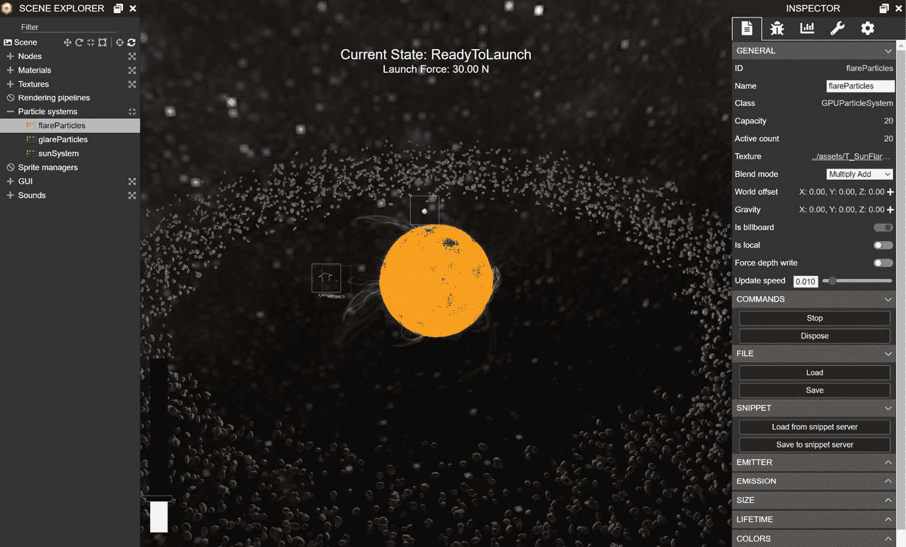
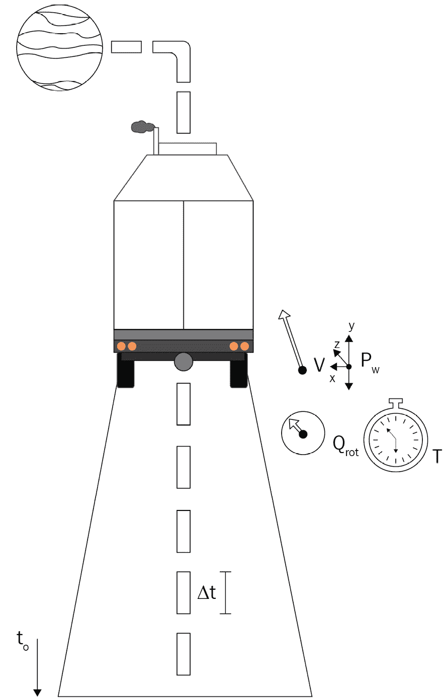
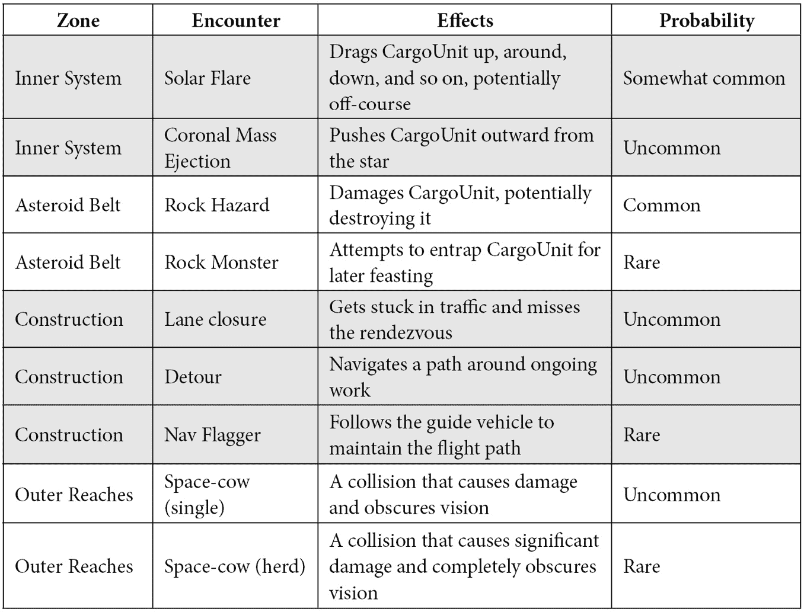
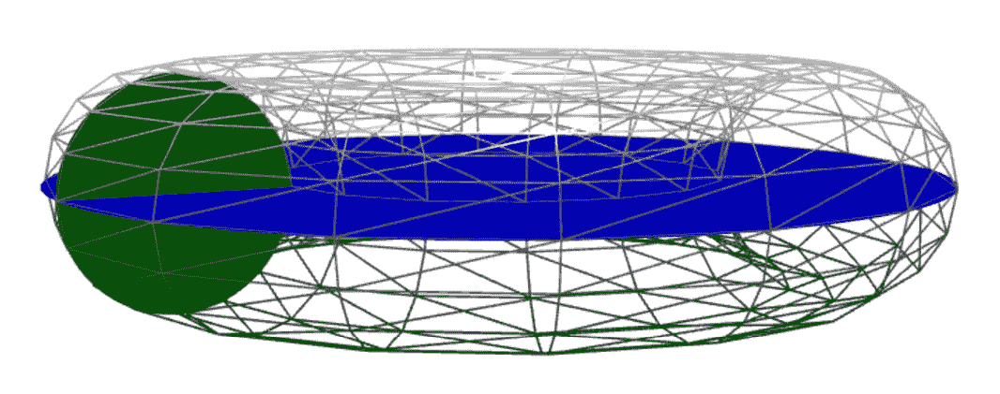

# 第七章：处理路线数据

尽管我们目前不会探讨路线规划和路线驾驶之间的过渡，但从大局来看，生成路线是 Space-Truckers 游戏玩法的一个关键部分。在本章中，我们将继续之前的做法，简要地偏离到一个相关的话题——在这种情况下，这个话题将是使用一些粒子系统来美化太阳渲染。

在我们对粒子系统的偏离之后，我们将直接探讨如何从路线规划中捕获、处理和整合数据，形成一个基于位置的丰富遭遇集，这将随后驱动下一阶段的玩家挑战。

使这一切成为可能的是一种技术，其根源可以追溯到 RPG 的最早时期——当黑暗的地下城充满了危险的龙，玩家在遭遇表中掷骰子以决定他们的命运时。Space-Truckers 的遭遇表按区域分类，并在决定 Space-Trucker 的命运中扮演着类似的角色。每个区域都有一系列可能的遭遇，以及该遭遇发生的基概率或机会。大多数遭遇都携带玩家必须采取行动以避免或减轻的潜在危险，而更少的情况下，其他遭遇可能会有益的效果（如果管理得当）。

在本章中，我们将涵盖以下主题：

+   偏离到实用系统

+   标记路线

+   定义遭遇区域

+   选择遭遇

+   添加遭遇视觉效果

到本章结束时，我们将稍微美化一下路线规划环境，但就应用覆盖的区域而言，对最终用户体验的实质性影响不会很大。这是可以的——它最终会产生巨大的影响！然而，为了实现这一点，我们必须构建一些逻辑来处理和准备路线以供遭遇使用。

# 技术要求

本章的技术先决条件并没有太大的不同，但有一些概念和技术可能对本章的主题有用。

如果你感到迷茫、被复杂性压倒或对某个特定领域有困难，以下是一些需要研究的话题：

+   粒子系统：[`doc.babylonjs.com/divingDeeper/particles`](https://doc.babylonjs.com/divingDeeper/particles)

+   扭曲集形状：[`doc.babylonjs.com/divingDeeper/mesh/creation/set/torus`](https://doc.babylonjs.com/divingDeeper/mesh/creation/set/torus)

+   扭曲（数学）：[`www.mathsisfun.com/geometry/torus.xhtml`](https://www.mathsisfun.com/geometry/torus.xhtml)

+   更多扭曲数学：[`www.geeksforgeeks.org/calculate-volume-and-surface-area-of-torus/`](https://www.geeksforgeeks.org/calculate-volume-and-surface-area-of-torus/)

本章的源代码位于[`github.com/jelster/space-truckers/tree/ch7`](https://github.com/jelster/space-truckers/tree/ch7)，其中包含本章以及之前章节的所有工作。此外，还有一些独立的改进、错误修复和调整，这些内容在本书之前的内容中并未涉及。虽然如果能详细讨论这些内容会很好，但在现有的时间和空间内这是不可能的！然而，在相关的地方，这些变化将会被指出。然而，大多数变化并没有引入任何新的概念或技术，而是对现有的内容进行了细化、修复或增强。

# 粒子系统的小插曲

粒子系统是图形编程的一个领域，就像输入处理这个主题一样，可以有一整本书专门介绍粒子系统，从基本理论到具体实现。我们在这里不会深入到那个程度，因为我们还有许多其他事情要做，除了学习粒子系统！以下是你需要了解的关于粒子系统的一般知识。稍后，我们将探讨它们与 Babylon.js 的关系，以及我们如何利用它们带来乐趣和利润。

想想你最近玩过的最后一款视频游戏。如果是一款基于文本的游戏，那么就想想你最近玩过的非文本游戏。游戏中有没有爆炸效果？有没有爆炸的魔法火球？又或者是烟花或篝火？这些都是游戏开发者可能会使用粒子系统的例子。

让我们回顾一下。粒子是一个具有离散生命周期（创建和死亡）的单一实体。它通常不是用一个网格表示，而是用一个纹理表示，因为大多数粒子是二维的横幅纹理或精灵。纹理或图像具有透明度属性，以不同的方式与其他场景混合。如果“透明度属性”这个词让你感到困惑，那么回忆一下透明度指的是 alpha 通道，这个通道的属性是向引擎发出的指令，告诉它如何将这个通道与重叠的颜色混合或混合。这意味着，通常，粒子总是以直接面向摄像机的方向排列，并且它将具有淡入淡出的能力。

粒子系统不仅仅是粒子的集合。粒子系统定义并控制其组成粒子的整个生命周期。它通过几个主要机制来完成这项工作：

+   **发射器**：粒子开始其生命周期的网格或节点。发射器的不同属性允许对网格的一部分和发射形状进行粒度控制，以及发射的粒子数量和发射速率。

+   **粒子属性**：包括视觉和行为属性，前者包括大小、缩放、旋转、颜色和速度，后者包括寿命。

+   **动画、噪声和混合效果**：向系统中添加噪声可以增强粒子系统的真实感，而动画则提供了动态的外观和感觉。

如果一个粒子系统由粒子组成，那么粒子系统的集合又是什么呢？这被称为粒子系统集，这也是我们将要使用的东西，以给 Space-Truckers 的太阳增添一点“光辉”！

重要提示

那最后一句话可能有点过头了。

使用粒子系统集的优势在于我们可以使用单一的综合逻辑来一次性加载、启动和停止所有系统。尽管我们将在不久的将来使用粒子系统集，但在 Babylon.js 中还有其他几种不同但相关的生成和管理粒子的方法。

## Babylon.js 的不同粒子系统

BJS 粒子系统的家族树并不像希腊众神那样复杂，但它与那个传奇的家谱共享的是代际分离。

### “经典”CPU 粒子系统

这就是每个人都知道、喜爱和熟悉的东西。三种的原始风味，这为最终开发者（即你）提供了对粒子行为每个方面的最大程序控制。因为它每帧都在 CPU 上运行，所以它必须与其他需要在帧之间发生的事情共享帧预算中的时间。如果目标帧率为 60 FPS，那么帧内预算仅为 1/60 秒或略低于 17 毫秒。正如任何中间的孩子兄弟所知，妥协是关键！

### “新浪潮”GPU 粒子系统

由于图形加速器在今天的计算环境中几乎无处不在（由某个 Web-GPU JavaScript 框架……为证），因此用于编程它们的工具也变得更加强大。稍后，在第十一章*表面下的着色器*中，我们将更详细地探讨如何轻松有效地利用这种力量来娱乐（以及盈利！）但就目前而言，相关的事实是，我们以前在 CPU 上运行的相同粒子系统现在直接在 GPU 上执行和更新。这种变化的最大影响是可用粒子的数量急剧增加。不再需要担心几百个粒子对性能的影响，当粒子数量达到数万时，同样的担忧才开始出现——这是一个相当大的改进！

### “硬核”固态粒子系统

当踏板触碰到路面，事情变得真实起来时，就是时候拿出杀手锏了。**固体粒子系统**（**SPS**）是由一个三维网格构成的，而不是由点状粒子构成的。每个粒子实例必须与其他 SPS 实例共享相同的材质，但其他属性，如位置、缩放、旋转等，都由开发者控制。SPS 粒子可以启用物理效果，并提供碰撞支持。这种程度控制和细节的缺点是，每个属性都必须单独设置和控制——这与根据与之关联的各种属性值演变的常规粒子系统不同。为系统硬编码单个值是繁琐的、容易出错的，而且维护起来也不是很有趣。对于游乐场和原型来说，这样做是可以的，但对我们应用来说，我们希望能够将粒子系统表示为可以独立于应用程序行为进行管理的数据。

## 从保存的数据加载粒子系统

当处理 CPU 或 GPU 粒子系统时，通过代码逐个输入和调整每个特定属性可能会非常繁琐且容易出错。万能的 Babylon.js 检查器（赞美其疯狂的好性质！）可能是迭代不同属性值以实时查看它们的最快方式，但如何有效地捕捉粒子系统集中每个粒子的每个属性当前状态，一开始可能看起来很困难。然而，就像 Babylon.js 中的许多事情一样，有多种方法可以实现相同的目标。幸运的是，有多种方法可以得到相同的结果；它们都利用了**ParticleHelper**的不同方法。所有三种方法都在检查器中可用（见*图 7.2*），可以根据项目需求选择最合适的方法。

### ExportSet/保存到文件（检查器）

首先是纯粹程序化的方法，即调用`ParticleHelper.ExportSet(setA, setB,…)`。该函数的输出是一个 JSON 字符串，然后可以将其保存到文件或存储在其他地方。在将多个系统组合在一起后，在游乐场中使用此方法最简单。使用检查器，可以通过在场景资源管理器中选择所需的系统，然后在**文件**标题下的**保存…**按钮处点击，将单个系统保存为 JSON。这对于单个系统设置很有用，但为了将多个系统保存到文件，**ExportSet**是最佳选择。

### 将代码片段保存到代码片段服务器（检查器）

在浏览器中打开 Babylon.js Playground（这里有一个参考链接：[`playground.babylonjs.com/#735KL4#15`](https://playground.babylonjs.com/%23735KL4%2315)）——注意特定的 Playground 是通过一个唯一的组合来识别的，包括哈希（#735KL4 部分）和修订版（#15）。嗯，以这种方式使 Playground 资源可引用的想法非常成功，以至于这个概念已经扩展到 Babylon.js 的许多其他领域。

想在 `ParticleHelper.CreateFromSnippetAsync` 中加载 GUI 设置。您可以在官方文档中了解更多关于粒子系统片段服务器的内容：[`doc.babylonjs.com/divingDeeper/particles/particle_system/particle_snippets`](https://doc.babylonjs.com/divingDeeper/particles/particle_system/particle_snippets)。

### 使用内置的粒子系统集

亚里士多德在他那个时代就已经是一位有影响力的人物，他关于事物由四种“元素”组成——空气、土地、火焰和水——的观点被广泛接受为真理，这主要归功于良好的营销。在这种精神下，Babylon.js 为您提供了一个基本的“元素”粒子系统集目录，供您使用。以下是可用的效果（更多关于它们的信息，请参阅文档中的[`doc.babylonjs.com/divingDeeper/particles/particle_system/particleHelper#available-effects`](https://doc.babylonjs.com/divingDeeper/particles/particle_system/particleHelper#available-effects)）：

+   **爆炸**：非常适合用来炸毁东西。

+   **雨**：为额外的忧郁感加分。

+   **烟雾**：用于表示新教皇的选择非常有用，但也适用于许多其他事情。记住，有烟的地方，通常……

+   **火焰**：无论是篝火、火炬还是传统的房屋火灾，这里都是开始的地方。

+   **太阳**：大奖！这个粒子集包括耀斑、动态变化的面部，以及光环的模糊光芒。但有一个问题……

备注

还有一个理论认为事物由这些微小、不可分割的粒子组成，称为（*ἄτομος*，或*atomos*），但其主要支持者德谟克利特并不像亚里士多德那样受欢迎，所以没有人听他的。现在谁才是最后的赢家，亚里士多德？

提到的这个问题是什么？这不是一个大问题。它有点——不，它正是大问题的反面。这是一个小问题，一个是规模问题。太阳效果非常适合我们的需求，但它太小了，太小了，太小了。我们需要能够将其放大以匹配我们的天文比例，但它的缩放方式或位置不会很精确——这需要一些实验。在 [`playground.babylonjs.com/#J9J6CG#9`](https://playground.babylonjs.com/%23J9J6CG%239) 的 Playground 中展示了最终被纳入 Space-Truckers 代码库 JSON 数据中的调整。

备注

虽然在本书中包含所有各种游戏设计方面和涉及的决定是理想的，但事先预知一切是不可能的。此外，本书的大小也有实际的限制。因此，在适用的情况下，将提供指向 GitHub Issues 的链接，这些 Issues 提供有关功能或游戏部分的详细信息。GitHub 中的 Issues 可以链接到其他 Issues 和 Pull Requests（以及其他内容），这使得快速评估和评估与特定 Issue 或功能相关的代码变得容易。与我们当前的工作相关，这个问题 – *星系应该偶尔出现耀斑和活动* ([`github.com/jelster/space-truckers/issues/71`](https://github.com/jelster/space-truckers/issues/71)) – 从 Babylon.js 文档和 Playground 片段中汇总链接，以提供对期望结果的见解。评论和链接的 Pull Requests 展示了问题的历史和演变。这并不是说我们不会涵盖游戏设计或其细节——远非如此！简单来说，软件中的事物以与其他商品和行业（如出版业）不成比例的速度发展和变化。希望了解游戏如何演变的人可以通过阅读记录该变化的 Issues 来实现。

在我们可以深入了解这些变化之前，我们必须弄清楚如何从 JSON 文件加载和启动粒子系统集。尝试这样做会有摩擦。**ParticleHelper** 是设计和构建的，重点是减少开发者的复杂性，其中某些方面可能成为我们目标的障碍。

### 从 JSON 文件解析

其中一个最终成为障碍的便利功能是 `PracticalHelper` 的 `CreateAsync` 方法仅接受一个字符串，表示要创建的系统的类型——即“雨”、“烟”、“太阳”等等。然后，这个字符串将与 `ParticleHelper.BaseAssetsUrl` 结合使用，以构建 JSON 文件的完整 URL。除非明确覆盖，否则 `BaseAssetsUrl` 的值为 [`github.com/BabylonJS/Assets/tree/master/particles/`](https://github.com/BabylonJS/Assets/tree/master/particles/)。文件夹的结构将 JSON 文件放在 `/systems` 子文件夹中，并将纹理放在 `/textures` 子文件夹中——这是一个很好的、一致的约定，对于大多数用例都工作得很好，但不是我们的情况。与我们的设置冲突的主要问题如下：

+   我们的文件夹结构与常规假设的不同

+   多个资源需要使用相同的纹理

+   我们正在使用 webpack 来打包和管理我们的资源和依赖项，因此我们的设计时文件夹结构略不同于运行时

+   依赖于外部来源的核心游戏资源和数据会复杂化并阻止离线/本地/PWA 类型的场景

第一项和最后一项可以通过使用相对路径和覆盖`BaseAssetsUrl`并使其类似于`document.baseURI`来在一定程度上缓解。然而，中间两项需要更多的思考来解决。检查**ParticleHelper**的源代码（见[`github.com/BabylonJS/Babylon.js/blob/master/packages/dev/core/src/Particles/particleHelper.ts`](https://github.com/BabylonJS/Babylon.js/blob/master/packages/dev/core/src/Particles/particleHelper.ts)）揭示，没有实际的方法可以覆盖计算 JSON 文件 URL 的传统逻辑。然而，一旦过了这一步，解析和初始化粒子系统集就非常直接了。这里的问题并不是我们不能使用传统方法，而是由于 webpack，我们不需要找出如何加载 JSON 数据——我们已经有它了，而**ParticleHelper**期望需要检索相同的。是时候开始像 1980 年代中期的每个人都喜欢的领域工程师 MacGyver 一样思考了。

**MacGyver 会怎么做**（**WWMD**）？MacGyver 最大的优势并不是他高大威猛，或者他能在拳击中踢坏坏蛋的屁股。甚至不是他那让奥林匹克神（或女神！）都嫉妒的华丽长发。不，MacGyver 最大的优势是他能够通过建造、破解或以其他方式科学地摆脱他发现自己陷入的几乎所有困境。通过关注周围的环境，然后应用他对各个领域（广泛）的（广泛）知识，他证明了敏锐的视角和聪明的头脑可以克服几乎任何障碍。让我们用 MacGyver 的视角来看这个问题：

“*在炸弹爆炸之前，我们需要获取一个粒子系统集！JSON 数据已经加载，但 ParticleHelper 需要 URL 字符串，而且只剩下最后一分钟，然后一切都会爆炸…我们还剩下什么，看看…啊！将对象数据传递给 ParticleSystemSet.Parse，完全绕过 ParticleHelper，但必须快速——我们正在耗尽时间!*”

所以，根据上面的 MG（MG 在这里），我们不想使用`ParticleSystemSet.Parse`，因为那就是`Parse`方法（[`doc.babylonjs.com/typedoc/classes/babylon.particlesystemset#parse`](https://doc.babylonjs.com/typedoc/classes/babylon.particlesystemset#parse)）。知道我们是从一个从正确的定义文件反序列化的普通 JavaScript 对象开始，他得出了一个相当明显（事后看来，自然如此）的结论：由于结果（一个`name`属性。多亏了 MG，我们有了所需的工具，能够将太阳粒子系统集与我们的应用程序集成！

## 适配太阳粒子系统集

概念验证游乐场([`playground.babylonjs.com/#J9J6CG#9`](https://playground.babylonjs.com/%23J9J6CG%239))让我们对游戏中要缩放的物体有一个大致的了解，但要实现我们想要的太阳系统，还有更多工作要做。游乐场只有一个三个粒子系统中的一个 – 焰系统 – 而还有另外两个；也就是说，太阳和眩光系统。这些也必须正确缩放和配置。完成这项工作的最佳方式是按照以下步骤进行：

1.  前往 Babylon.js 资产仓库，并将所需的 JSON 和纹理文件保存到本地仓库中。例如，日落位于[`github.com/BabylonJS/Assets/blob/master/particles/systems/sun.json`](https://github.com/BabylonJS/Assets/blob/master/particles/systems/sun.json)。

1.  打开`sun.json`文件，并将纹理路径更改为反映项目的文件夹结构。使用相对路径，但请确保考虑消耗脚本的相对路径，而不是 JSON 文件的路径。在`Star`类中，添加必要的代码来加载并启动集合（见[`github.com/jelster/space-truckers/blob/ch7/src/route-planning/star.js#L26`](https://github.com/jelster/space-truckers/blob/ch7/src/route-planning/star.js#L26)）。

1.  在应用程序运行并在适当的屏幕上时，通过按适当的键组合（默认为*Shift* + *Alt* + *I*）打开**检查器**窗口。修改系统的属性，并等待更改生效。

1.  更新各个系统的属性，使其与所需值匹配。

1.  转到(3)。

结果将是你认为看起来最酷的东西，但如果你想从现有的定义开始，或者只是跟随现有的定义，你可以在[`github.com/jelster/space-truckers/blob/ch7/src/systems/sun.json`](https://github.com/jelster/space-truckers/blob/ch7/src/systems/sun.json)找到它：



图 7.1 – 在 Sun 粒子系统适应了 Space-Truckers 的规模之后。检查器窗口对于实时看到不同值的效果至关重要

通常，可能需要增加太阳和眩光粒子的数量，但无论变化如何，都要确保等待几秒钟，以便它传播到新产生的粒子，因为有些粒子的寿命可能只有几秒钟！

在本节中，我们了解了 Babylon.js 中可用的不同类型的粒子系统，以及一些快速迭代以找到我们想要的视觉效果的技术。希望我们通过发挥老麦克的聪明才智，找到了加载和适应在飞行中穿越系统的 Sun `CargoUnit`问题的解决方案，让他感到自豪。

# 标记路线

Space-Truckers 游戏玩法的一个关键方面是 `CargoUnit` 在路线规划阶段所采取的路径如何影响驾驶阶段的挑战——以及奖励。我们已经处理了路线规划的弹道飞行力学，所以现在，我们需要捕捉那条路线以及它穿越的环境数据。以下图表显示了我们的路线的主要属性以及它们可能如何表示：

![图 7.2 – 在路线规划飞行阶段捕获了各种遥测数据。每个样本都收集了位置、旋转、速度和时间戳]



图 7.2 – 在路线规划飞行阶段捕获了各种遥测数据。每个样本都收集了位置、旋转、速度和时间戳]

在这里，`CargoUnit` 负责保存其路径的想法，这转化为 `CargoUnit` 类，从而获得一个新的 `routePath[]` 属性，以及 `reset()` 和 `update()` 方法中的相关逻辑来清除和更新路径，分别。数据本身很简单，尽管我们很快就会涉及到 `encounterZone` 字段：

```js

let node = new TransformNode("cargoNode", this.scene, 
    true);
node.position = this.mesh.position.clone();
node.rotationQuaternion = this.mesh.rotationQuaternion?.
    clone() ?? 
    Quaternion.FromEulerVector(this.rotation.clone());
node.scaling = this.lastVelocity.clone();
node.velocity = this.lastVelocity.clone();
node.gravity = this.lastGravity.clone();
node.time = this.timeInTransit;
node.encounterZone = this.encounterManager.
    currentZone?.name;
```

`TransformNode` 是 `TransformNode` 中一个非渲染对象，在 *添加遭遇视觉元素* 部分很有用。因为它们实现了计算和放置节点在世界场景中的位置所需的一切，`TransformNodes` 在许多不同的应用中都很有用。这包括能够成为场景中其他对象的父节点和/或子节点。一些例子包括通过父化 `PhysicsImpostor` 制作的“摄像机推车”。

由于这段代码紧跟在我们刚刚计算出的速度、重力和旋转属性之后，我们确保我们有最新和最准确的数据。为什么我们要将旋转存储为 **四元数** 而不是我们已有的 **Vector3** 表示形式呢？原因是我们将想要在 **局部空间** 而不是 **世界空间** 中对网格顶点执行一些数学变换，而预先计算好的四元数使得计算更加简单，同时也更加高效。

重要提示

不要忘记 JavaScript 引用类型是按引用分配的，而不是按值分配——因此需要克隆 Vector3 属性值。

虽然捕捉路径遥测数据的工作已经完成，但在这些数据开始在游戏中变得有用之前，还有更多的工作要做。其中一项工作就是实现**遭遇表**及其相关的**遭遇区域**的概念。之后，我们就可以开始将这两个概念整合到**SpaceTruckerEncounterManager**中。如果您想深入了解我们将要讨论的不同组件及其高级设计的历史和联系，[`github.com/jelster/space-truckers/issues/70`](https://github.com/jelster/space-truckers/issues/70)是一个不错的起点。

# 定义遭遇区域

**遭遇表**正如其名所示：它是一张基于随机因素的某些事件发生的概率表格。在桌面和 RPG 风格的游戏中，随机因素由掷一个或多个不同面数的骰子提供。在基于计算机的游戏中，情况相同，只是我们不会掷物理骰子，而是根据随机数生成器的输出生成遭遇。

与游戏中的许多其他对象一样，**遭遇区域**（**EZs**）是可更新的游戏组件，而每个遭遇都充当定义该遭遇的数据容器。这使得**遭遇管理器**可以选择哪个 EZ 应该负责运行遭遇检查，从而简化了在 EZ 中所需的逻辑。简单，对吧？

## 遭遇概述

遭遇表的架构很简单。每一行都是游戏设计师希望使其成为可能的具体事件或遭遇。表格中的概率列表示该事件发生的可能性，以 0（完全没有机会）到 1（保证发生）之间的数字形式表示。这是一个好的开始，但我们还需要能够根据它们在世界中的空间位置进一步对遭遇进行分组；在暗淡的外层系统区域遭遇太阳耀斑有什么意义吗？这就是遭遇区域概念的作用所在。

## 遭遇区域和遭遇表

遭遇区域是针对游戏世界中特定空间位置的遭遇表，如前所述。从内系统到外层区域，每个遭遇区域都有独特的潜在遭遇供玩家应对——或者从中受益！以下是一个按区域分组的遭遇表，它是 Space-Truckers 游戏设计规范的一部分。虽然不完整且故意模糊具体细节，但它仍然清楚地展示了该功能应该如何工作以及与其他功能的交互：



图 7.3 – Space-Truckers 遭遇的设计。来源：[`github.com/jelster/space-truckers/issues/65`](https://github.com/jelster/space-truckers/issues/65)

在实现遭遇时，将会有不同的需求，因此每种遭遇类型都会有不同结构的解决方案。幸运的是，我们目前不需要定义那些具体细节，所以我们将暂时将其搁置一边，退一步看看**遭遇区域**如何跟踪**货物单元**。

## 跟踪交集

每个 EZ 都需要为`CargoUnit`网格的动作管理器注册交集退出和进入触发器，但我们不希望为每个区域编写代码来做这件事——如果我们改变`EncounterZones`的数量，或者想要改变交集的使用方式怎么办？幸运的是，这个问题可以很容易地解决。

当调用`SpaceTruckerEncounterManager`的`initialize`方法时，会遍历`encounterZones`列表，使用`forEach`循环。在其它动作中，每个区域都会通过`cargo.mesh`作为参数传递给其`registerZoneIntersectionTrigger`方法。这个函数在`meshToWatch.actionManager`上执行交集注册，将相应的`OnIntersectionExitTrigger`和`OnIntersectionEnterTrigger`分别连接到遭遇区域的`onExitObservable`和`onEnterObservable`。

注意

`SpaceTruckerEncounterManager`是`CargoUnit`的一个成员。

`SpaceTruckerEncounterManager`的主要目的是（正如其名称所暗示的）管理其构成区域中的遭遇，但为了能够做到这一点，它需要知道当前正在穿越的哪个 EZ `cargoUnit`。你可能会最初推测，由于`EncounterZone`具有环面形状，嵌套（但不重叠）的区域只有在穿过网格时才会触发它们的交集触发器，但在实践中并非如此。

对复杂网格进行交集计算是一个非常计算密集的过程，这使得它不适合用于实时处理应用。相反，Babylon.js 所做的是使用成本更低且计算效率更高的边界框交集计算。虽然速度快，但它们并不能非常准确地模拟正在测试的实际几何形状，从而导致一个问题，即货物单元似乎对应用程序来说不仅位于其位置区域，还位于其周围所有嵌套区域！

为了解决这个问题，`SpaceTruckerEncounterManager`通过`inAndOut`字段跟踪所有触发的交集。每当区域发出进入信号时，该字段就会增加，对于相反的情况则减少，它是一个表示`currentZone`索引的整数，该索引偏移量为遭遇区域的总数：

```js

get currentZone() {
    let zidx = this.encounterZones.length - this.inAndOut;
    return this.encounterZones[zidx]?.zone;
}
```

此属性在多个区域中使用，从`CargoUnit`到路线规划 GUI，但遭遇管理器中的底层区域需要预先用定义每个区域边界和特征的数据进行填充。

## 遭遇区域和游戏数据

**遭遇区域**（就像大多数软件组件一样）由其行为和数据定义。数据来自遭遇区域的定义，看起来像这样：

```js

asteroidBelt: {
    id: "asteroid_belt",
    name: "Asteroid Belt",
    innerBoundary: 1000,
    outerBoundary: 1700,
    encounterRate: 0.2,
    colorCode: "#ff0000",
    encounters: [
        { id: 'rock_hazard', name: 'Rock Hazard', image
            hazard_icon, probability: 0.90 },
        { name: '', id: 'no_encounter', probability: 0.1, 
            image: '' }
    ]
}
```

在构建时，`SpaceTruckerEncounterZone`使用这个结构（作为构造函数的参数传递）来初始化和配置 EZ。一些属性是自解释的，但`innerBoundary`和`outerBoundary`需要明确的定义，以及`encounterRate`。一旦我们覆盖了这些，我们将深入探讨遭遇数组及其工作方式。

`innerBoundary`字段是环面描述的外圆的半径。虽然从概念上看这是合理的，但它与 Babylon.js 的`createTorus`方法有所不同，该方法是控制网格大小的“旋钮和开关”，主要参数是`diameter`和`thickness`。这两个值听起来如果我们传递`outerBoundary`和`(outerBoundary – innerBoundary)`，应该会工作得很好，但仔细阅读参数描述告诉我们一个不同的故事。

最直观的方式是通过取一段电线，将其弯曲成半径为`2 * r`的半圆来想象各种参数如何相互配合。现在，想象一下取一个半径为`2 * R`的小纸垫。环面的外边界并不等同于直径参数——它等于直径加上一半的厚度。内边界等于直径的一半减去一半的厚度。这不是最好的描述方式，但这是描述它的一种方法！这里有一个比描述更好的东西——一个用于该类比的可视化，可在标题中的游乐场链接找到：



]

图 7.4 – 环面（torus）的性质。直径由一个实心圆表示，其厚度由一个较小的圆圈描述。这个游乐场可以在[`playground.babylonjs.com/#P2YP2E#1`](https://playground.babylonjs.com/%23P2YP2E%231)找到。

为什么我们要经历这些弯弯绕绕？因为以这种方式构建，我们可以快速轻松地比较和调整遭遇区域与行星轨道，正如在**gameData**中定义的那样。

最后，回到 EZ 数据，`encounterRate`字段是一个百分比（0 – 1）数字，表示该区域一般发生遭遇的频率。每个区域独立保持自己的遭遇表，然后使用该表来确定可能发生哪些遭遇。既然我们谈论到了遭遇和随机数，我们不妨尝试理解如何具体实现从遭遇表中选择条目的逻辑。为此，我们需要讨论一个叫做**累积分布质量函数**的东西。

# 选择遭遇

首次实现此类功能的开发者可能会设计一个简单的函数`getEncounter`，该函数在搜索具有小于或等于骰子点数的概率的第一个遭遇之前，先随机选择一个数字作为骰子点数。让那位开发者感到沮丧的是，这种简单的方法也是不正确的！虽然这种方法在掷骰子以确定单一遭遇的机会时是有效的，但当存在多个潜在的遭遇时，它将不起作用。以下是简化形式的**小行星带遭遇表**：

```js

encounters: [
            { id: 'rock_hazard', name: 'Rock Hazard',
                 image: hazard_icon, probability: 0.90 },
            { name: '', id: 'no_encounter', probability: 
                0.1, image: '' }
        ]
```

遭遇表中的每一项都有一个相关的概率因子，其总和通常（但并非必须，因为我们将很快编写一些代码）等于 1（100%）。当你想要从表中随机选择一个条目时，必须考虑所有可能发生的事件。将计算事件输出响应随机数输入的过程称为**累积（质量）分布函数**（**CMDF**）。在**EncounterZone**源代码（见[`github.com/jelster/space-truckers/blob/ch7/src/encounterZone.js#L44`](https://github.com/jelster/space-truckers/blob/ch7/src/encounterZone.js#L44)）中，CMDF 是通过构造函数实现的，它是一个两步过程。

## 求和概率

在第一步中，我们计算所有单个遭遇的概率总和。这一步将允许应用程序处理单个概率不都加到 1 的情况，并在第二步中使用。当我们到达那里时，遭遇表从定义中填充：

```js

var total = 0;
definition.encounters.forEach((e, i) => {
    total += e.probability;
    this.encounterTable.push(e);
});
```

这一步的目的在于，虽然我们无法保证概率的总和一定会达到 1，但我们可以在下一步中归一化这个总和，以便表中的每个条目都能在 CMDF 中得到正确和成比例的表示。

## 填充 CMDF 结果

第二步涉及再次遍历`encounters`列表（在预先烘焙`cumulativeDistribution`数组的第一个元素之后）并将条目填充到第二个数组中——即上述的`cumulativeDistribution`数组。这个集合的条目代表了整个空间的**CMDF**，因此可以用作索引来查找任意输入的值：

```js

this.cumulativeDistribution[0] = this.encounterTable[0].
    Probability / total;
for (var I = 1; i < definition.encounters.length; i++) {
    this.cumulativeDistribution[i] = 
        this.cumulativeDistribution[i - 1] + 
            definition.encounters[i].probability / total;
}
```

注意，由于循环是向后的，第一个元素是在循环之外计算的，然后循环从`this.cumulativeDistribution[i]`等于前一个元素的值加上当前遭遇的`probability`份额对`total`的份额开始。这只需要在初始化时发生一次。一旦到位，现在就可以“掷骰子”并实现更正确的`getEncounter`形式。

## 掷遭遇检查

每次调用 `update` 方法时，逻辑将评估是否发生了遭遇，然后决定将要发生哪个遭遇。它需要考虑自上一帧以来经过的时间，因为它会将遭遇与玩家的帧率联系起来——这不是我们想要的！一旦考虑了这一点，并且确实有区域指示遭遇，就会调用 `getEncounter` 方法从 `encounterTable` 中检索一个随机条目。检索到的遭遇随后作为事件参数传递给 `onEncounterObservable`，让任何订阅者都知道 `encounter`：

```js

const encounterProbability = this.encounterRate * deltaTime;
if (Math.random() < encounterProbability) {
    let encounter = this.getEncounter();
    console.log('encounter ' + encounter?.name);
    this.onEncounterObservable.notifyObservers(encounter);
} 
```

这就是整个更新循环。如果生活总是像这些解决方案一样优雅和简单，也许人们会相处得更好，因为 `getEncounter` 方法简化为一条正确、尽管有些晦涩的 JavaScript 代码：

```js

for (var i = 0; i < this.cumulativeDistribution.length && (diceRoll > this.cumulativeDistribution[i]); i++) {};  
```

这之所以有点晦涩，是因为你可能已经注意到，`for` 循环没有主体！循环中没有主体，简单来说，是因为没有这个必要。循环的目的是找到符合 `diceRoll` 数字的索引 (`i`)。一旦这个条件得到满足，`i` 值由于使用 `var` 而不是 `let` 声明而保留下来。遭遇本身作为索引被检索并返回给调用方法以进行分发。

## 监听遭遇

一旦 `SpaceTruckerEncounterManager` 被用作经纪人并聚合器，在 `onEncounter` 观察者方法中分发 `Encounter` 的消息，同样的观察者被订阅到所有区域的 `onEncounterObservable`，这为我们提供了所需的事件聚合，以及 `lastFlightPoint` 遥测包。

遭遇和 `cargoData` 然后被打包在一起并推入 `encounterEvents` 数组以供将来参考。新添加元素的下标随后被传播给 `onNewEncounterObservable` 的观察者：

```js

const cargoData = this.cargo.lastFlightPoint;
const idx = this.encounterEvents.push({ encounter,
    cargoData });
this.onNewEncounterObservable.notifyObservers(idx - 1);
```

我们向 `encounterEvents` 集合传递索引（或指针）的原因是我们想确保我们可以干净利落地在任何时候处理这些对象；如果对象被传递到事件中，系统可能无法确定是否可以从已处理的对象中释放内存——这种情况称为内存泄漏。

到目前为止，我们已经检查和讨论了定义、定位和生成不同类型遭遇所需的基础设施。这些遭遇将在本书的驾驶阶段游戏逻辑中详细介绍。然而，在我们对遭遇的理解仍然新鲜的时候，让我们看看遭遇如何在路线规划屏幕的上下文中被使用和展示。

# 添加遭遇视觉效果

这是我们之前在*标记路线*部分的工作发挥作用的时刻。回想一下，当我们的`CargoUnit`沿着轨迹下落时，它不断地留下一条面包屑线来标记其路径。这是通过`CargoUnit.trailMesh`组件可视化的，除了在场景重置时需要初始化和销毁，它几乎不需要我们干预。我们需要一种类似的无为而治的方式来渲染沿路径发生的遭遇的视觉效果，这正是我们刚刚介绍的工作旨在实现的。

重要提示：

虽然以下部分最终被从游戏中删除，但演示的技术值得保留在口袋里。

## 将 2D 标签放入 3D 空间

虽然 Babylon.js 中有一个 3D GUI 系统，但我们的当前需求不需要使用完整的 3D UI。然而，3D GUI 的一个优点是，它很容易在 World Space 中定位元素——原因应该很清楚。

注意

与笑话不同，解释这个不会有风险。明显的理由是，由于需要结合相机位置、世界位置和屏幕位置变换来获得正确的坐标，而不是在相同坐标空间中运行的 3D GUI 系统，因此关于 3D 世界空间点的 2D 元素定位可能会变得复杂。

坐标变换固有的复杂性，幸运的是，被 BJS GUI 框架隐藏起来，对开发者来说——`linkWithMesh`和`moveToVector`都允许调用者将 GUI 控件放置在**世界空间**中的某个位置。这在某种程度上是好的，但我们仍然需要有一个地方来挂载视觉效果，并为未来的增强和行为提供基础。

如果你是在休息后回到这一节的，你可以感谢过去的自己把所有这些部件都放到了合适的位置。如果你一直在快速浏览这一章（不要停下来——不会停下来——不能停下来！），那么请给自己鼓掌。花时间正确地认可自己和之前行为对当前情况的影响——无论是好是坏——都是非常重要的。换句话说，这将会很容易。

记得我们是如何使用`TransformNode`来追踪我们的货物飞行路径的吗？这就是最终证明那个决定是正确的时刻。大多数`linkWithMesh`函数，其名称暗示你只能传递一个网格。这是一个错误，尽管可以理解，但可以通过研究该方法的文档并看到参数的名称是`mesh`，而参数的预期类型是我们老朋友**变换节点**来纠正！

注意

严格来说，文档没有错误，因为`TransformNode`类型。

`PlanningScreenGui` 组件在其构造函数中已经可以访问 `planningScreen` 字段中 `encounterManager` 属性，因此我们可以订阅其 `onNewEncounterObservable` 以在发生新的 encounter 时得到通知。在观察者函数中，我们从 encounter 本身获取图像 URL，并使用它来创建 Babylon.js GUI 元素，然后将其链接到航线的相关 `TransformNode`：

```js

const encounter = evt.encounter;
let panel = new Rectangle("panel-" + encounter.name);
let image = new Image("image-" + encounter.name, 
    encounter.image);
image.alpha = 0.68;
panel.addControl(image);
panel.thickness = 0;
this.gui.addControl(panel);
this.encounterPanels.push(panel);
panel.linkWithMesh(evt.cargoData);
```

这就是放置在正确位置并带有正确图像的视觉效果，所以现在，让我们考虑显示 encounter 时还涉及哪些内容。首先，我们希望有一个声音效果播放。这可以通过将 `SpaceTruckerPlanningScreen` 注册到 `onNewEncounterObservable` 来完成，如下面的代码所示：

```js

this.encounterManager.onNewEncounterObservable.add(enc => 
        this.soundManager.sound("encounter").play());
```

虽然我们现在没有使用实际的 encounter 索引，但这种方法允许它在未来轻松扩展——例如，允许单个 encounters 指定它们自己的声音播放。当发生 encounter 时，我们不想图标简单地出现，没有任何喧哗。我们想确保玩家的注意力被吸引到它上面，但只是短暂的一瞬间。实现这一目标的一种方法是将面板最初渲染得比最终大小大得多，然后动画化面板，使其缩小到最终大小和位置。

## 动画化 encounter 面板

在 *第四章* *创建应用程序* 中，我们看到了如何静态定义一个 **动画**，稍后将其作为 **AnimationGroup** 的一部分针对特定对象进行定位。我们在这里将使用相同的技术来定义涉及缩小 encounter 面板的动画。

重要提示

尽管看起来可能不是这样，几乎任何对象都可以成为 `GUI.Image` 组件的 `scaleX` 和 `scaleY` 属性的目标。

注意，这里涉及两个独立的动画——一个用于 *X* 轴，另一个用于 *Y* 轴——因为使用了 `AnimationGroup` 和 `addTargetedAnimation` 方法，并指定了目标 `panel` 和 `panelShrink` 动画，之后动画开始：

```js

let animationGroup = new AnimationGroup("shrinkAnimationGroup-"+ encounter.name, 
    this.scene);
animationGroup.addTargetedAnimation(panelShrinkX, panel);
animationGroup.addTargetedAnimation(panelShrinkY, panel);
animationGroup.start(false, 1.0, 0, 180, true);   
```

这为我们提供了 encounters 的良好展示，仅剩下我们尚未覆盖的一个用例——重置路线规划屏幕。

## 清除 encounter 面板

遇到 GUI 元素的列表是为了应对这种场景而收集的，这个列表是 `encounterPanels` 数组。由于每个 GUI 控件都实现了 `dispose` 函数，我们可以通过遍历数组并依次调用每个元素的 `dispose` 方法来重置 encounters UI。为了避免需要预测每个需要这样做的地方，我们可以在最合理的地方添加逻辑——即 `onScreenStateChange` 观察者函数。每当它执行逻辑以过渡到 `ReadyToLaunch` 状态时，encounter 面板会清除所有元素，并且所有子元素都会被销毁：

```js

this.encounterPanels.forEach(panel => {
    panel.children.forEach(child => child.dispose());
    panel.dispose();
});
```

就这些了。

重要提示

当然，这还远不止这些！在遭遇视觉的背景下，还有许多许多可以做到和正在做的事情，但总的来说，所有这些都基于本节和本章中提出的相同概念。如果你还没有这样做，别忘了提醒自己：游戏开发很困难，有很多移动部件！

尽管我们只介绍了如何清除遭遇界面面板，但这种模式完成了创建和销毁的循环。

注册监听 `EncounterManager.onNewEncounterObservable` 通知组件新的遭遇，而将 `SpaceTruckerPlanningScreen.onStateChangeObservable` 设置为 `ReadyToLaunch` 状态则会清除任何现有的状态。

# 摘要

让我们退一步，回顾一下本章所涵盖的内容。首先，我们走了一条旁路来参观各种 Babylon.js 粒子系统，利用并调整了太阳粒子系统集来满足我们的需求。

我们可以从三个大致的区别类别中观察粒子系统——“经典”、“新浪潮”和“硬核”名称。每个名称都指的是始终可用的基于 CPU 的粒子系统、基于 GPU 的 GPU 粒子系统以及混合的 **固体粒子系统**（**SPS**）。前两种系统基于 2D 招牌和精灵——这些可以通过精灵表等动画化——而 **SPS** 使用源网格生成粒子，这些粒子可以进一步分配任何所需的材料（我们将在 *第十章*，*通过光照和材料改进环境*）。

加载自定义粒子系统集涉及捕获包含每个粒子系统特定参数的序列化 JSON 文件，这些参数适用于适当的结构。这可以通过调用 `ParticleHelper.ExportSet(setA, setB,…)` 来完成。从 URL 加载保存的 JSON 很容易，但从中加载本地 URL 则要复杂一些。然而，通过回退到 `ParticleSystemSet.Parse` 函数，我们可以以任何我们想要的方式加载 **ParticleSystemSet** 的数据！

在对粒子系统的偏离之后，我们检查了 **CargoUnit** 在其飞行过程中捕获的遥测数据，以及我们如何使用 **TransformNodes** 来表示空间位置。这证明对于在不编写大量代码的情况下轻松显示视觉效果至关重要，并且为理解遭遇区域的工作原理提供了一个良好的入门途径。

每个**遭遇区域**可以被视为*Space-Truckers*世界中一个独特的生物群落或环境。从温暖的**内系统**到寒冷的**外系统**，每个区域都有其可能遭遇的一套潜在事件。通过内边界和外边界定义，将这些方便的**gameData**数值转换为用于创建一组嵌套的环面网格的参数值，涉及一些简单的数学计算。这些网格不进行渲染，但它们的**ActionManagers**用于注册针对**CargoUnit**的**IntersectionEnter**和**IntersectionExit**触发器。当它穿越系统时，**SpaceTruckerEncounterManager**会跟踪玩家的**CargoUnit**当前正在穿越的区域。

当穿越一个特定区域时，该区域的`update`方法会在每一帧进行一次加权随机检查，以决定是否应该有一个从区域遭遇表中选择的事件发生。遭遇区域构造函数预先计算表中的每个条目的**累积质量分布函数**值，使概率归一化，以确保总和为 1。如果遭遇被“掷出”，则掷出的值（介于 0 和 1 之间的数字）被用作函数的输入，该函数返回指向指定事件的索引。**SpaceTruckerEncounterManager**监听这些遭遇区域事件。

负责聚合遭遇数据与**CargoUnit**数据，并通知订阅者如何找到生成的遭遇数据，**onNewEncounterObservable**是组件如**PlanningScreenGui**更新自己的主要方式，无需在应用程序的组件中散布适当的逻辑。在**PlanningScreenGui**中，在创建启动屏幕时首先完善的技巧派上用场。在这里，我们可以定义一些动画，这些动画针对遭遇的图像面板，使其在进入时产生缩放效果。

在`linkWithMesh`函数中，并传入从飞行遥测中捕获的**TransformNode**。

与往常一样，本章讨论的代码可在[`github.com/jelster/space-truckers/tree/ch7`](https://github.com/jelster/space-truckers/tree/ch7)找到，尽管在这个历史时刻游戏仍然不完整，但我们可以通过本章的内容指出具体和有价值的进展——永远不要忘记为自己在旅程中取得的进步给予肯定！关于代码、书籍或应用的讨论板[`github.com/jelster/space-truckers/discussions`](https://github.com/jelster/space-truckers/discussions)是发布有关代码、书籍或应用的提问的好地方。想要贡献？导航到[`github.com/jelster/space-truckers/issues`](https://github.com/jelster/space-truckers/issues)并浏览吸引你的开放问题，或者创建一个新的问题来讨论你的增强、错误或新功能。在下一章中，我们将充分利用路线和生成的遭遇来构建驾驶迷你游戏。在这个过程中，我们将学习如何将摄像机视角切换到第一人称视图，将贴图应用到网格上，以及更多！

注意

有一个专门针对首次贡献者以及缺乏 Babylon.js 和/或 Space-Truckers 经验或熟悉度的人的问题类别——它被称为**良好入门问题**。想要让麦格维感到自豪并修复其他人无法修复的问题吗？查看**需要帮助**标签！

# 扩展主题

总是有比时间和空间更多内容和建议，因此这里有一些方法可以帮助你利用本章的内容进一步挑战自己。在进入下一章或之后的任何时候，将这些视为你澄清和融合在这里学到的教训的经验发射台：

+   在路线规划阶段的飞行阶段，当货物与某物碰撞时，基于火花粒子样本的新粒子系统将被触发。

+   Space-Truckers 的世界丰富多彩，游戏可以展示更多的这种丰富性。使用动画粒子系统让这些区域生动起来：

    +   轨道制造可能看起来像是一系列闪烁的灯光，这些灯光来自机动推进器和焊接火炬，围绕着阴影中的块状结构聚集。

    +   在太空建设和太空高速公路区域内的交通也可以用闪烁的灯光群来近似表示，这些灯光在周围快速移动

+   添加从除**gameData**文件之外的外部来源加载遭遇列表的功能。源可以是相对路径或远程路径，对于每个区域，将重新计算新的列表的 CMDFs。

+   制作一个增强的随机数生成器，该生成器将权衡或重新掷骰随机值，以避免在 *Y* 掷中超过 *X* 次返回相同的值。

+   计算机生成的随机数往往会出现不切实际的聚集和簇状分布——小行星就是一个很好的例子。尽管如此，还有其他方法可以权衡和生成随机数序列。偷偷前往 GitHub 上 Space-Truckers 源代码的`ch10`分支，看看`randomGenerator`模块是如何实现`getGaussianRandom`的，以其中一个例子为例。
