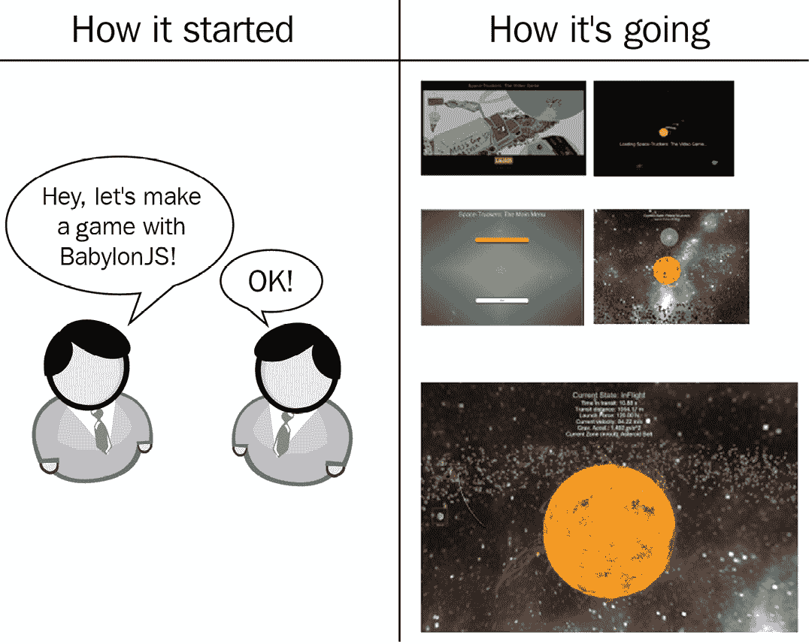
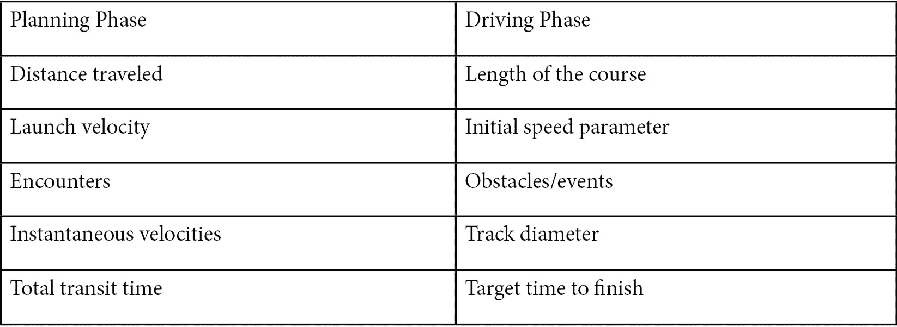
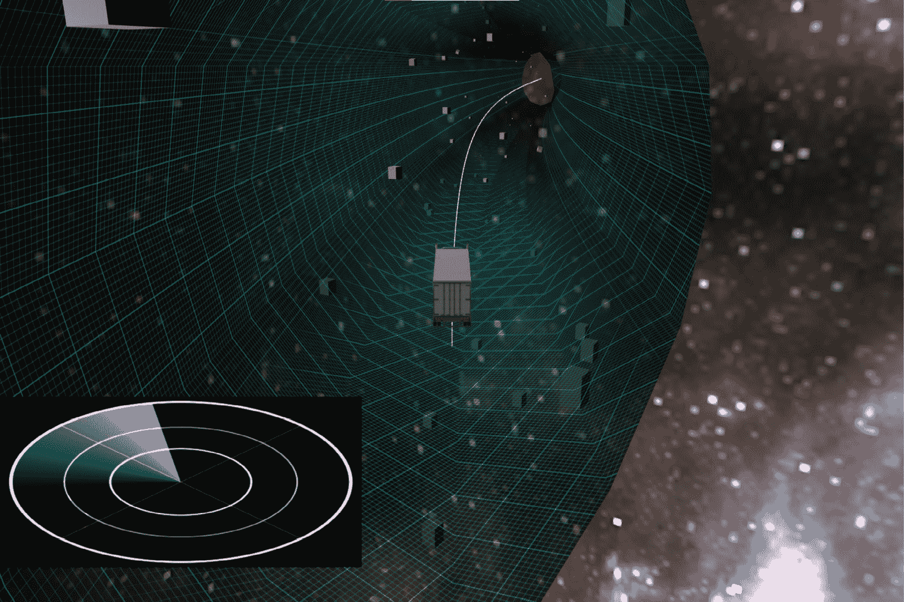
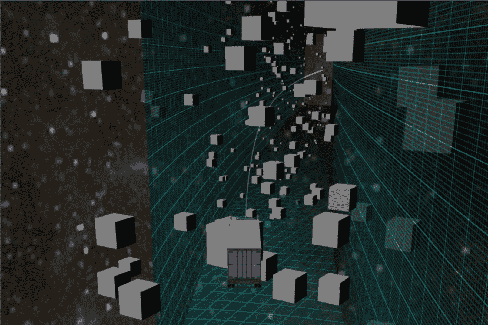
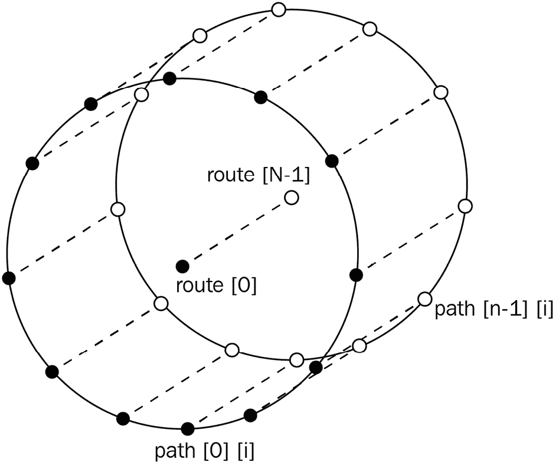
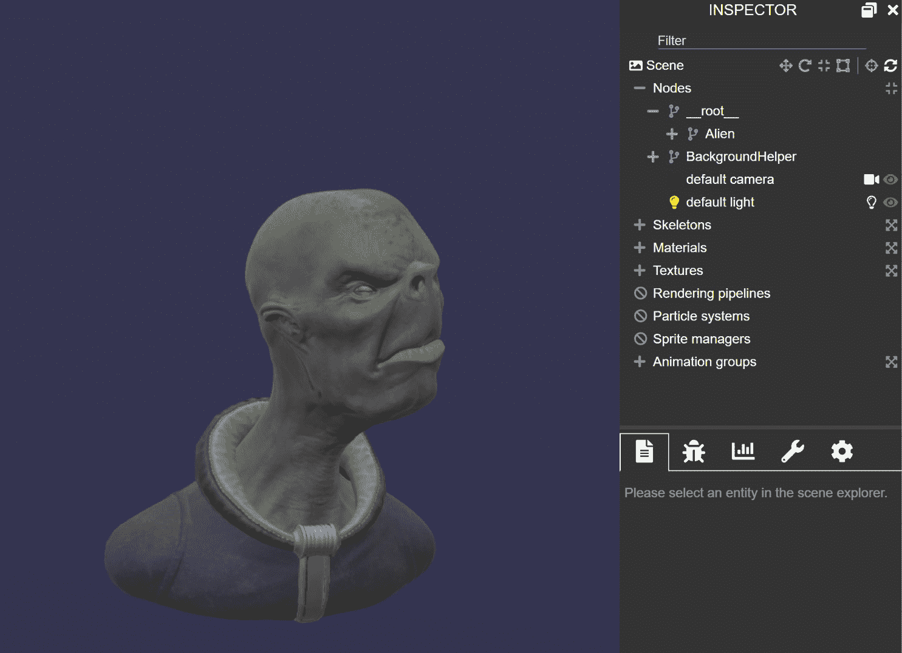
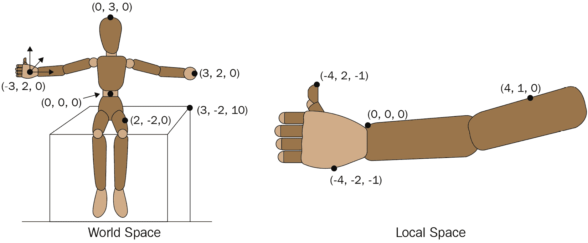
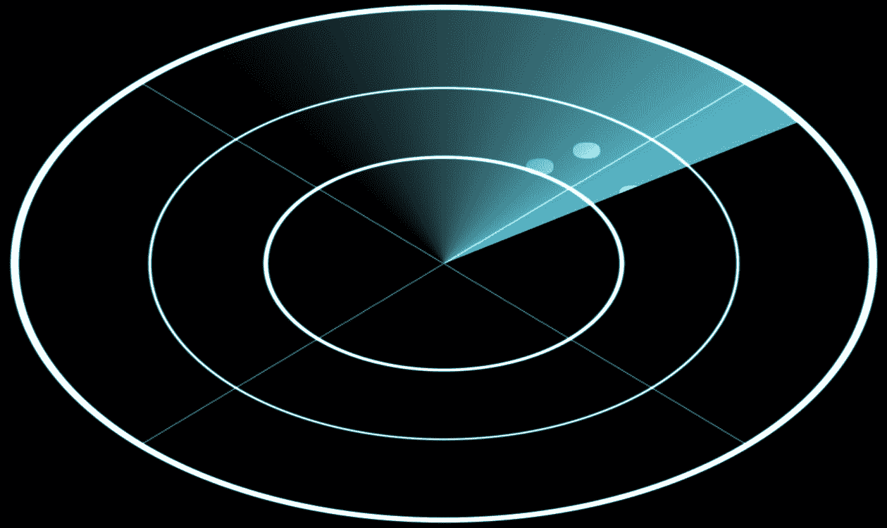

# 8

# 构建驾驶游戏

虽然可能难以相信，但我们已经正式过了 halfway point – 虽然终点仍然遥不可及，但我们已经取得了如此大的进展，以至于很难看到我们的起点。在前六章中，我们构建了大量功能，涵盖了几乎令人叹为观止的主题多样性。以下图显示了我们的起点和现在：



图 8.1 – 起始与现在的对比。一组显示我们进展的屏幕截图

从设置基本网络应用程序到实现随机遭遇，我们已经投入了大量代码到这个阶段，但我们不会停止，甚至不会减速！将这本书做到这个程度显示了可嘉的坚持和决心 – 本章将是所有这些努力的回报。游戏开发中更令人愉快的一个方面也是更明显的一个方面 – 那就是开始着手核心游戏玩法和逻辑代码。不幸的是，正如有软件开发和发布经验的人所证实的那样，构建和交付软件的所有其他活动往往占据了可用项目时间的很大一部分。

在本章中，我们将构建 Space-Truckers 的驾驶阶段。除了我们之前学到的某些技术外，我们还将为老工具箱引入一些新工具。我们将通过在场景中添加第二个相机来提升一个档次，该相机将渲染**图形用户界面**（**GUI**）。我们将根据前一阶段的模拟路线生成路线，并允许玩家沿着该路线驾驶他们的卡车，避开障碍物（如果他们能的话）。我们的场景将使用物理引擎，就像前一阶段一样，但我们将利用物理引擎的能力来模拟碰撞、摩擦等结果。我们将介绍一些内容，但将更详细的检查推迟到未来的章节 – 在这种情况下，相关的章节和部分将被链接，以便于参考。

所有这些令人兴奋的主题将有望为我们在前面所面临的更平凡但同样重要的任务——构建必要的逻辑——提供充分的补偿。在本章结束时，我们将拥有一个可玩的游戏，这将为我们下一章的学习打下基础，我们将继续完成整个游戏的生命周期，同时学习如何计算和显示得分结果。

在本章中，我们将涵盖以下主题：

+   驾驶阶段的原型设计

+   与应用程序集成

+   添加遭遇

+   制作迷你地图

# 技术要求

从技术角度来看，本章没有要求任何之前章节中未列出的内容，但有一些技术领域，在阅读本章时拥有实际知识可能是有用的：

+   **多视图**：[`doc.babylonjs.com/divingDeeper/cameras/multiViewsPart2`](https://doc.babylonjs.com/divingDeeper/cameras/multiViewsPart2)

+   **层掩码**：[`doc.babylonjs.com/divingDeeper/cameras/layerMasksAndMultiCam`](https://doc.babylonjs.com/divingDeeper/cameras/layerMasksAndMultiCam)

+   **深度层掩码**：[`doc.babylonjs.com/divingDeeper/scene/layermask`](https://doc.babylonjs.com/divingDeeper/scene/layermask)

+   **加载任何文件类型**：[`doc.babylonjs.com/divingDeeper/importers/loadingFileTypes`](https://doc.babylonjs.com/divingDeeper/importers/loadingFileTypes)

+   **极坐标**：[`tutorial.math.lamar.edu/Classes/CalcII/PolarCoordinates.aspx`](https://tutorial.math.lamar.edu/Classes/CalcII/PolarCoordinates.aspx) 和 [`math.etsu.edu/multicalc/prealpha/Chap3/Chap3-2/`](https://math.etsu.edu/multicalc/prealpha/Chap3/Chap3-2/)

# 驾驶阶段的原型设计

有很多工作要做，所以让我们直接进入正题。由于驾驶阶段的设计方式，玩家必须沿着在之前游戏阶段由玩家预先确定的路线驾驶他们的卡车。整体计划的路线性质决定了驾驶路线的相似整体特征。诸如总通行时间、距离和速度等因素都属于这种特征。其他因素，如路径上的随机遭遇，则更局限于路径的特定部分。每个遭遇的行为是可变的，但所有遭遇都将采取一种迫使玩家在驾驶太空卡车时做出选择以避免/获得碰撞的一般形式。捕捉两个阶段之间的相关性是一个重要的设计规范，将非常有用——以下是为此目的创建的 Space-Trucker 问题中列出的内容：



图 8.2 – 路线规划与驾驶阶段变量的比较。来源：[`github.com/jelster/space-truckers/issues/84`](https://github.com/jelster/space-truckers/issues/84)

一些属性在相位之间存在直接的 1:1 相关性，例如总通行时间和行驶距离。其他属性则用作比例或其他间接影响因素，例如点速度影响路线的直径。所有这些内容将在本章的后续部分变得非常有用，但就目前而言，我们将把注意力转向构建一个演示驾驶阶段核心原理的游乐场。

## 游乐场概述

在软件中进行原型设计，就是将特定问题或兴趣领域简化到其本质。这迫使我们提出问题——为了评估特定方法的可行性，需要的最小特征、属性、功能等集合是什么？在我们的驾驶阶段原型中，我们不需要通过规划阶段来达成目标——我们只需要能够处理该阶段生成的路线数据。专注于这个问题，将我们的路线数据连接到驾驶阶段的问题并不是我们现在试图解决的问题（尽管我们当然可以通过以促进构建该逻辑的方式结构化我们的代码来为未来的自己提供帮助！）。这节省了可以用于其他地方的思维带宽和能量，这也是我们将开始的地方。

重要提示

[`playground.babylonjs.com/#WU7235#49`](https://playground.babylonjs.com/%23WU7235%2349) 的游乐场是本章该部分的参考。

我们需要物理引擎正常工作，以便我们可以测试卡车、障碍物和速度之间的交互和关系。我们需要确定加载第一个 3D 资产模型（半挂卡车）的正确缩放、方向和导入设置。最后，我们需要弄清楚如何在玩家面前的雷达 GUI 上绘制即将到来的障碍物。这似乎是一项相当大的任务，但多亏了 Babylon.js 内置的功能，其复杂性远低于表面看起来那么多。以下截图展示了这些元素如何在游乐场演示中结合在一起：



图 8.3 – 空间卡车手驾驶阶段游乐场，见 [`playground.babylonjs.com/#WU7235#49`](https://playground.babylonjs.com/%23WU7235%2349)

在视口的中心是我们的游戏主角，即同名空间卡车手。空间道路在他们面前延伸，散布着填充遭遇地点的无纹理方块。在屏幕的左下角，雷达显示器以圆形扫过，揭示即将到来的障碍物作为亮点。摄像机与卡车相连，因此玩家的视角始终在卡车后面和略高位置——这是经典的第三人称视角。控制很简单——*W* 和 *S* 在卡车的前进方向上加速和减速，而 *A* 和 *D* 分别向左和向右加速。垂直加速由 *上箭头* 和 *下箭头* 键管理，旋转由 *右箭头* 和 *左箭头* 管理；通过按 *Delete* 键重置演示。尽量快速到达路径的尽头！

让我们转到查看演示代码以及演示的结构。立即，我们可以看到一些相似之处，但也有一些与我们的先前 PlayGround 演示结构不同的地方。在最顶部是各种资产 URL 和 `gameData` 对象，然后我们到达最引人注目的差异：`async drive(scene)` 函数。

这，正如 `async` 前缀所暗示的，是在函数体中的表达式中一个 `await` 语句，二是提供一个容器，用于封装演示中使用的所有 ***var***-ious 对象和值。

注意

本书编辑为让你忍受刚才那个糟糕的双关语表示歉意。

狂野的双关语已经释放，我们将继续查看 `drive` 函数上方的 PG 的前几行。为了加载我们的路线数据，我们将选择将 `jQuery.getJSON` 的调用包装在一个承诺中，该承诺解析为路线路径点的数组：

```js

var scriptLoaded = new Promise(
    (resolve, reject) =>
        $.getJSON(routeDataURL)
            .done(d => resolve(d))
);
```

这要求我们将 `createScene` 方法指定为 `async`，这样我们就可以在完成驾驶阶段初始化逻辑后，编写一个简单的 harness 来实例化并返回 PlayGround 的 Scene：

```js

var createScene = async function () {
    var routeJSON = await scriptLoaded;
    var scene = new BABYLON.Scene(engine);
    const run = await drive(scene, routeJSON);
    run();
    return scene;
};
```

`drive` 函数负责创建和/或加载任何可能需要一些时间才能完成的资产或资源，因此它也被标记为 `async`。这个函数中包含大量的代码，为了使其更容易处理，逻辑被拆分成了几个辅助方法。在这些方法之前，构建或定义了基本场景和环境设置的逻辑。这些是可能被任何或所有（可能是异步的）辅助函数需要的元素，包括以正确的顺序调用这些辅助函数。一旦这些任务完成，就返回 `run` 函数：

```js

await loadAssets();
initializeDrivingPhase();
initializeGui();
return run;
```

我们将在本章的 *制作迷你地图* 部分介绍 `initializeGui` 方法，在建立更多上下文之后。在 `drive` 函数中，可能是我们希望在 PlayGround 中证明的最重要的辅助函数是 `calculateRouteParameters(routeData)` 方法。这是驾驶阶段世界创建的工作马，可能对游戏玩法如何演变有最大的影响，因为它决定了玩家驾驶的路线属性。

## 生成驾驶路径

在 *第七章* *处理路线数据* 中，我们设置 `cargoUnit` 记录 `routeData`：时间、位置、速度、旋转和重力都在渲染的每几个帧中捕获到数据点集合中（包括遭遇，我们将在 *添加遭遇* 部分中讨论）。遥测数据是一个充满创意和有趣想法的深井（参见 *扩展主题*），但就目前而言，我们将仅使用 *PlayGround 概述* 部分中描述的位置、速度和重力路线值来生成路线路径。

函数的开始部分从`gameData`中获取`routeDataScalingFactor`；尽管目前设置为`Vector3`值，而不是普通的 JavaScript 对象。

重要提示

采取这样的主动措施来减少快速迭代的摩擦，对于建立势头至关重要！

完成这些后，我们使用来自遥测数据的定位向量来构建一个新的`Path3D`实例：

```js

let path3d = new Path3D(pathPoints.map(p => p.position),
  new Vector3(0, 1, 0), false, false);
let curve = path3d.getCurve();
```

来自 Babylon.js 文档([`doc.babylonjs.com/divingDeeper/mesh/path3D`](https://doc.babylonjs.com/divingDeeper/mesh/path3D))

“一个`Path3D`是由曲线上的点的位置向量序列创建的数学对象。”

`Error! Hyperlink reference not valid.`

换句话说，一个`Path3D`代表了一组有序的坐标点，并具有一些有趣和有用的特性。

注意

称其为“数学对象”的原因是它不是场景的成员，也不参与渲染。这听起来也比称之为“非渲染的抽象几何数据结构”酷多了。

`getCurve()`方法是一个实用方法，它会返回定义路径的点序列，但在`Path3D`中还有更多有用的价值点，我们很快就会探索。不过，首先，我们希望显示玩家在规划阶段所采取的具体路径，作为穿过空间道路中间的直线。这很简单——我们使用曲线数组在调用`MeshBuilder.CreateLines`时，这就是全部！有关更多信息，请参阅[`doc.babylonjs.com/divingDeeper/mesh/creation/param/lines`](https://doc.babylonjs.com/divingDeeper/mesh/creation/param/lines)。在那之后，我们开始构建空间道路的几何形状，这是事情开始变得有趣的地方。

构成我们空间道路基础的几何形状是带状物——一系列一个或多个路径，每个路径至少有两个`Vector3`点。提供的路径顺序与路径本身结合使用，以产生具有巨大灵活性的几何形状，尽管这可能很有趣，但尝试复制在带状物文档中已经创建的优秀示例可能会适得其反。从那些文档中，这个思想实验很好地解释了我们目前正在研究的概念：

“想象一下在现实世界中一条长而窄的带状物，其长度上有一条线。关闭路径形成一个带状物的环，而关闭数组则会形成一个管状物。”

关闭数组看起来是我们想要的选项，而不是关闭路径本身，因为我们希望我们的道路是封闭的，但又不像是甜甜圈或环。这让我们面临一些选择，关于我们希望如何实现这一点，但只有在确立了通过原型化实现它的价值之后，这在这个情况下才成为我们选择实现路径的无限循环论证的链接。

在原型化路径创建（或软件中的任何原型化过程）时，在某个阶段你会意识到需要从只是拼凑一些东西来测试其是否可行，并考虑到构建一个更稳健的产品的需求。Playground 片段**#WU7235#11**（[`playground.babylonjs.com/#WU7235#11`](https://playground.babylonjs.com/%23WU7235%2311)）展示了大约从**第 168 行**开始的原型化逻辑可能的样子（为了清晰起见，已移除注释）：

```js

let pathA = [];
let pathB = [];
let pathC = [];
let pathD = [];
for (let i = 0; i < pathPoints.length; i++) {
    const { position, gravity, velocity } = pathPoints[i];
    let p = position;
    let speed = velocity.length();
    let pA = new Vector3(p.x+speed, p.y-speed, p.z+speed);
    let pB = new Vector3(p.x-speed, p.y-speed, p.z-speed);
    let pC = pB.clone().addInPlaceFromFloats(0, speed * 2,
      0);
    let pD = pA.clone().addInPlaceFromFloats(0, speed * 2,
      0);
    pathA.push(pA);
    pathB.push(pB);
    pathC.push(pC);
    pathD.push(pD);
}
```

这是一个路径几何的方案，其形式为四边形的方框（两端是开放的）。前面的代码使用四个独立的点数组 – 每个角落一个 – 来捕捉路径，它在沿着路线的每个点循环时记录路径。这看起来是这样的：



图 8.4 – 原型路径几何硬编码为制作一个四边形的方框，两端开口。使用了四个路径。简单而有效，但极其有限 ([`playground.babylonjs.com/#WU7235#11`](https://playground.babylonjs.com/%23WU7235%2311))

任务完成！我们在这里就结束了，对吧？错了。这只是一个开始！庆祝成就当然可以，但最好是将庆祝的规模与最终目标所取得的成就相匹配。一个方框形状可以证明我们可以从实际路线数据中创建一个可玩路径演示，但这看起来既不有趣也不吸引人。为了将其提升到一个能够令人惊讶和愉悦用户的地方，我们需要让它更加球形而不是方形。为了做到这一点，我们需要添加更多的路径段，而我们的原型就在这里达到了极限。

参考前面的代码列表，带状路径的每条路径都已预定义，形式为`pathA`、`pathB`、`pathC`和`pathD`数组。如果我们想添加更多段，我们需要手动添加额外的路径数组，以及适当的逻辑，以正确定位彼此不是 90 度直角的路径段——这使得我们的当前方法变得更加困难。有一种特定的思维方式更喜欢直接面对这类问题，使用蛮力。他们可能会添加`pathE`、`pathF`或`pathG`数组，并基于硬编码的数字预先计算路径相对于彼此的偏移量，尘埃落定后，出来的结果可能工作得很好……直到需要再次更改段数。或者更糟糕的是，需要根据例如设备性能特性*动态地*设置路径数量。这就是为什么有必要想出一个更好的前进方法。

让我们回到我们最初开始的原始游乐场——`NUM_SEGMENTS`常量。接下来，我们需要实例化新的路径数组来保存每条路径。我们通过一个简单的循环来完成这个操作：

```js

const NUM_SEGMENTS = 24;
let paths = [];
for (let i = 0; i < NUM_SEGMENTS; i++) {
    paths.push([]);
}
```

太好了，我们准备好了路径数组的数组。现在，是时候填充这些路径了，所以我们设置了一个外层循环遍历`routePath`，包含一个内层循环遍历每个路径数组。但我们如何确定每条路径的每个点的位置？仅仅使用像原型中那样对每个点位置使用简单的常数偏移量是不够的；每个路径段的点将彼此有不同的偏移值。在下面的图中，环形或环形形状是一个单独的横截面段，所有点都位于同一平面（数学家称之为点的仿射集）：



图 8.5 – 创建路线几何的点从中心点开始，该点沿直径顺时针移动，为每个离散段添加路径点

从当前路线位置开始，并以此作为中心点。现在，专注于通过`routeData`执行最外层循环的单一实例，我们知道我们需要创建与所需段数相等的点。我们还知道这些段应该均匀且连续地分布在假设圆的直径周围。

注意

我们使用圆而不是球体的原因是，相对于给定的路线点，每个路径段的*Z*轴值对于该点的每个路径段始终相同。这相当自相矛盾，因为这也是定义圆的一种相当曲折的方式！

将这些事实放在一起，并结合我们已知的关于圆和三角函数的知识，我们就有了一种实现我们想要的方法。唯一剩下的障碍是：我们如何改变正在计算的单独路径上的位置偏移量？幸运的是，这个问题并没有看起来那么大。

让我们再次提醒自己关于圆和三角函数的事实。正弦和余弦函数各自接受一个输入角度（除非另有说明，否则以弧度为单位），并输出一个介于-1 和 1 之间的值，分别对应于角度相关的*X*-和*Y*-轴值。一个完整的圆包含两倍的 Pi（3.14159…）弧度，或大约 6.28 弧度。如果我们把线段的数量除以 6.28 弧度，我们就会得到单个线段所跨越的弧，但如果我们把线段的数量除以当前迭代的线段的零基索引，那么我们就会得到更有用的事情——我们当前线段的位置在 0..1 之间。换句话说，一个百分比，或比率。通过将这个比率乘以两倍的 Pi 值，我们得到…线段的位置，以弧度为单位！剩下的只是将结果按代表所需半径（或直径，对于*X*-轴）的值进行缩放，并将其添加到路径集合中：

```js

for (let i = 0; i < pathPoints.length; i++) {
    let { position, velocity } = pathPoints[i];
    const last = position;
    for (let pathIdx = 0; pathIdx < NUM_SEGMENTS;
      pathIdx++) {
        let radiix = (pathIdx / NUM_SEGMENTS) *
          Scalar.TwoPi;
        let speed = velocity.length();
        let path = paths[pathIdx];
        let pathPoint = last.clone().addInPlaceFromFloats(
            Math.sin(radiix) * speed * 2,
            Math.cos(radiix) * speed, 0);
        path.push(pathPoint);
    }
}
```

在前面的代码列表中，从`速度`向量到确定空间道路的大小。我们必须在修改它之前`克隆`最后一个点；否则，我们最终会破坏应用程序其余部分所需的数据。通过将`NUM_SEGMENTS`的值设置为`4`并逐步以递增的数字运行沙盒，我们可以很容易地看到更新的逻辑现在可以处理任意数量的线段——这比我们的第一代原型有了巨大的改进！当我们准备从*初始化驾驶阶段*部分开始那个过程时，这段代码将准备好与应用程序集成。但在那之前，我们还需要在其他领域证明一些事情。`loadAssets`函数是我们列表中的下一个。

## 异步加载资产

在这个沙盒中，我们将作为`loadAssets`函数的一部分异步加载两样东西——半挂车模型和雷达程序纹理资产。我们需要确保在继续之前所有异步函数调用都已经完成，通过返回一个只有在所有其构成承诺都这样做之后才会解决的承诺来实现。这就是在`loadAssets()`中看起来像什么：

```js

return Promise.all([nodeMatProm, truckLoadProm])
          .then(v => console.log('finished loading
            assets'));
```

`nodeMatProm` 是使用在 Babylon.js 中广泛使用的一种模式创建的，我们最近在上一章关于加载 `ParticleSystemSet` JSON 的讨论中使用过。但在这个 Playground 中，我们不是直接加载 JSON，而是从 Babylon.js Snippet Server 加载数据。具体来说，我们正在加载来自 **节点材质编辑器**（**NME**）的片段，然后我们将使用它来创建显示在 GUI 上的雷达程序纹理。关于这些元素的更多细节将留待 *第十一章*，*Shader 的表面之下* 中讨论。

```js

const nodeMatProm = NodeMaterial.ParseFromSnippetAsync
  (radarNodeMatSnippet, scene)
      .then(nodeMat => {
         radarTexture = nodeMat.createProceduralTexture(
         radarTextureResolution, scene);
      });
```

虽然可能很明显，`radarTexture` 是一个包含 `radarTextureResolution` 值的变量。创建一个“简单”的游戏原型的一个困难之处在于，即使是简单的东西也需要创建和管理相当数量的配置数据。`gameData` 结构的作用是集中和整合对这些类型值的访问；当我们想在函数中使用一个或多个这些值时，我们可以使用 JavaScript 的 **解构** 功能来简化代码并使其更易于阅读：

```js

const { 
        truckModelName, 
        truckModelScaling, 
        radarTextureResolution } = gameData;
```

正如我们在前面的代码块中看到的，`radarTextureResolution` 用于确定程序纹理的渲染高度和宽度（以像素为单位），而我们将很快看到 `truckModelName` 和 `truckModelScaling` 的用途。`SceneLoader.ImportMeshAsync` 方法（新引入 v5！）接受一个可选的模型名称列表，以及包含要加载的网格的适当文件的路径和文件名（例如，`.glb`、`.gltf`、`.obj` 等），以及当前场景。返回的承诺解析为一个包含加载文件 `meshes`、`particleSystems`、`skeletons` 和 `animationGroups` 的对象，尽管在这个场景中我们只将使用网格集合。

注意

你可以在 [`doc.babylonjs.com/divingDeeper/importers/loadingFileTypes#sceneloaderimportmesh`](https://doc.babylonjs.com/divingDeeper/importers/loadingFileTypes#sceneloaderimportmesh) 了解更多关于 `SceneLoader` 及其相关功能的信息。

一旦我们加载了半挂车的模型文件，我们还需要做一些额外的工作，才能开始使用加载的资产。以 GLTF 或 GLB 格式保存的模型在导入 Babylon.js 时会带有一些额外的属性，这些属性可能会妨碍我们，所以让我们简化并设置 `truckModel` 以适应游戏世界：

```js

const truckLoadProm = SceneLoader.ImportMeshAsync
  (truckModelName, truckModelURL, "", scene)
    .then((result) => {
        let { meshes } = result;
        let m = meshes[1];
        truckModel = m;
        truckModel.setParent(null);
        meshes[0].dispose();
        truckModel.layerMask = SCENE_MASK;
        truckModel.rotation = Vector3.Zero();
        truckModel.position = Vector3.Zero();
        truckModel.scaling.setAll(truckModelScaling);
        truckModel.bakeCurrentTransformIntoVertices();
        m.refreshBoundingInfo();
    }).catch(msg => console.log(msg));
```

我们处理管道的前几行对结果结构中的变量进行了一些方便的设置，但然后在处理 `meshes` 数组中的第一个网格之前，我们将 `truckModel` 的父级设置为 `null`，这是怎么回事，`SCENE_MASK` 又是什么意思？

注意

更多关于层掩码及其如何工作的信息，请参阅文档：[`doc.babylonjs.com/divingDeeper/cameras/layerMasksAndMultiCam`](https://doc.babylonjs.com/divingDeeper/cameras/layerMasksAndMultiCam)。

第二个问题的答案是，简而言之，相机可以分配一个特定的编号，这个编号只允许具有兼容的 `layerMask` 的网格被该相机渲染。我们使用 `layerMask` 属性来隐藏非 GUI 网格从主场景相机中，例如。第一个问题的答案在于从 GLB 或 GLTF 文件加载资产的具体细节。当 Babylon.js 读取文件时，在模型层次结构的根位置放置了一个名为 `__root__` 的不可见变换节点。尽管在简单场景中不会引起任何问题，但在处理物理、父节点、碰撞和变换时，它成为一个主要的障碍。以下截图说明了在 **场景检查器** 窗口中看起来是什么样子：



图 8.6 – Alien.gltf 模型。场景检查器窗口显示了 __ 根 __ 变换节点。来源：[`playground.babylonjs.com/#8IMNBM#1`](https://playground.babylonjs.com/%238IMNBM%231)

我们感兴趣的是与 Alien 几何体一起工作，但由于它被连接到 `__root__` 节点，对 `Alien` 的位置、旋转或缩放的任何更改都是在相对于该根节点的坐标系中评估的，这会导致不希望的和不可预测的结果。这个问题的解决方案很简单，回答了我们之前关于 `loadAssets` 代码中发生了什么的问题——取消所需网格的父节点并丢弃根节点。一旦完成，我们卡车加载方法中的其余代码都是为模型进行的家务设置——有一些重要的考虑事项需要记住：

+   操作顺序很重要，但不是你想象中的那种方式。在给定帧中对 `TransformNode`（`Mesh` 是其子类）的更改按照固定的顺序 **变换、旋转、缩放**（**TRS**）应用。

+   使用 `setParent(null)` 而不是将 `mesh.parent` 设置为 `null` 的替代方案。`setParent` 函数保留位置和旋转值，而将父节点设置为 `null` 则不会。这会导致从网格中移除任何根变换，这就是为什么我们需要重置位置和旋转向量。

+   一旦变换被清除并且缩放被设置为适合世界的值，网格几何体将需要生成新的边界信息。否则，碰撞将无法正常工作。这个问题的解决方案是在调用 `mesh.refreshBoundingInfo()` 之前调用 `mesh.bakeCurrentTransformIntoVertices()` 的两步过程。

重要提示

通常，不建议在存在更好的选项（如 **parenting** 和 **pivotPoints**）时调用 `bakeCurrentTransformIntoVertices`。在这种情况下，我们需要执行此步骤，因为我们已经从根节点移除了父级。有关此主题的更多信息和建议，请参阅[`doc.babylonjs.com/divingDeeper/mesh/transforms/center_origin/bakingTransforms`](https://doc.babylonjs.com/divingDeeper/mesh/transforms/center_origin/bakingTransforms)。

如前所述，调用 `Promise.all` 与未解决的承诺的结果是返回的 `loadAssets`，使我们回到了这次讨论的起点！初始化主要完成——或者至少是最耗时的部分完成——现在随着半挂车模型的可用性，`initializeDrivingPhase` 函数已被调用以设置场景的其他元素。此函数设置摄像机，从 `routePaths` 创建地面带状网格，设置物理属性，等等。

## 初始化驾驶阶段场景

如本章引言所述，玩家的视点是第三人称视角，摄像机位于半挂车后面，并从上方俯视。随着卡车的移动（平移）或旋转（嗯，旋转），摄像机从其偏移位置模仿每一个动作。这是通过将现实世界的类比很好地匹配到软件中的一种情况，即 `cameraDolly`。

摄像车通常是一种在电影行业中使用的工程式手推车，它允许操作摄像机的摄影师在多个维度上平滑移动并捕捉画面。我们的摄像机车不使用轨道，但它通过随卡车移动来保持相同的面向前方方向，无论卡车的世界空间方向如何。这可以通过几个步骤完成：

1.  创建一个 `TransformNode` 作为“摄像机车”：

    ```js
    var cameraDolly = new TransformNode("dolly", scene);
    ```

1.  定义一个 `ArcRotateCamera` 并设置其基本属性。我们正在从 `gameData` 结构中修补属性值以减少代码量：

    ```js
    for (var k in followCamSetup) {
        followCamera[k] = followCamSetup[k];
    }
    ```

1.  操作顺序对于这一步和下一步都很重要！首先，将 `cameraDolly` 父级设置为 `truckMesh`。

1.  现在，将 `followCamera` 父级设置为 `cameraDolly`：

    ```js
            cameraDolly.parent = truckModel;
            followCamera.parent = cameraDolly;
    ```

在 `initializeDrivingPhase` 方法中发生的第一件事是创建摄像机并设置视口。这里简要说明一下这一点。

如果一个 `(0,0)` 并且大小为 `(1,1)`。换句话说，默认视口的左上角位于 `(0,0)`，右下角位于 `(1,1)`；整个屏幕都被它覆盖。当场景只有一个摄像机时，这非常理想，但在许多情况下，在场景中某个位置放置一个渲染到整个屏幕较小部分的第二个摄像机是有用的——想想提供迷你地图的策略游戏或具有后视镜显示的赛车游戏。

在大多数情况下，场景中应该只在一个相机中渲染某些元素，但在另一个相机中不渲染，这正是我们与层掩码建立联系的地方。通过设置所有相关相机和网格的`layerMask`，我们可以根据网格在场景中的作用高效地显示或隐藏几何形状。我们的驾驶屏幕目前有两个独立的层掩码：`SCENE_MASK`和`GUI_MASK`。巧妙地切换网格的`layerMask`属性可以允许对相机渲染进行精细控制；如果我们想在某个相机上显示网格，我们可以显式地将它的`layerMask`设置为`SCENE_MASK`或`GUI_MASK`（分别为`0x00000001`和`0x00000002`）。如果我们想在两个相机上显示网格，我们可以设置和/或保留默认的层掩码值（`0xFFFFFFFF`）。现在我们知道了视口的情况，我们可以回到函数代码。

在设置好视口之后，执行之前列出的父级步骤。`MeshBuilder.CreateRibbon`方法是下一个关注的点，我们将数组或路径数组传递到函数的选项中，并获取我们的路径几何形状，然后对其进行一些属性调整，并分配一个网格材质（目前是这样）：

```js

var groundMat = new GridMaterial("roadMat", scene);
var ground = MeshBuilder.CreateRibbon("road", {
    pathArray: route.paths,
    sideOrientation: Mesh.DOUBLESIDE
}, scene);
ground.layerMask = SCENE_MASK;
ground.material = groundMat;
ground.visibility = 0.67;
ground.physicsImpostor = new PhysicsImpostor(ground,
    PhysicsImpostor.MeshImpostor,
    {
        mass: 0,
        restitution: 0.25
    }, scene);
```

在创建出带状物、分配了材质，并将一个物理模拟器同样创建并分配给地面网格之后，恢复系数属性使得任何撞击墙壁的物体都比之前具有更小的动量反弹。这是新的，但这里使用的模拟器类型（`MeshImpostor`）也有一些转折（在先前的代码块中突出显示）——与之前我们查看的其他`PhysicsImpostor`类型（`Box`和`Sphere`）不同。`MeshImpostor`之前仅在 CannonJS 物理插件中可用，在那里它仅限于与球体交互。

与使用物理启用对象的几何形状的粗糙近似不同，它使用那个几何形状本身来提供精确的碰撞检测！代价是，随着网格几何结构的复杂度增加，碰撞计算变得更加昂贵。不过，对于我们的需求来说，应该没问题，因为我们不需要我们的障碍物（即，遭遇）与路径交互，只需让卡车具有复杂的碰撞计算需求。在我们完成准备工作并准备好编写运行时逻辑之前，还有一些任务需要完成！

在设置`truckModel`的物理属性——尽管使用了同样适用但更简单的`BoxImpostor`——之后，我们在设置`OnIntersectionExitTrigger`之前在路径上生成一些样本障碍物，该触发器会在卡车退出`routePath`带状网格的界限时调用`killTruck`。`spawnObstacles`函数将在*添加遭遇*部分进行讨论，因此跳过对这个问题的讨论将我们引向了实践中熟悉的设置`ground.actionManager`的过程，使用适当的触发器（参见*在* *第七章**中定义遭遇区域*，处理路线数据*）——另一个足够熟悉以至于可以跳过的部分。现在，我们接近`initializeDrivingPhase`函数的最后一部分——（重新）设置卡车到其起始位置和状态。

使用我们的样本路线数据，我们可以通过实验确定卡车在世界空间中的起始坐标，其初始旋转以及其他类似的值。我们会通过试错法迭代地细化我们的值，直到结果令人满意，但那会满足我们的要求吗？不。

注意

如果你看到有人以这种方式提出问题，答案几乎总是“不。”这是本章中那种修辞写作的第二种情况。你能找到第三种吗？

那种整个试错的方法不会“满足我们的要求”，不，谢谢先生！我们可以通过回忆我们已经确切地知道卡车应该从哪里开始，它应该指向哪里，以及它应该以多快的速度移动，这些信息都包含在我们的朋友`route.path3d`中，来极大地简化这个过程。在之前关于`Path3D`的讨论中已经提到，它是一个数学结构，它提供的两个更有用的函数`getPointAt`和`getTangentAt`被用来帮助我们定位卡车，但我们并没有深入探讨为什么它们是有用的。

考虑一个由几个点组成的任意长度的路径。路径上的每个点都有一组描述位置的向量（当然是！），`Path3D`实例，这使得处理起来变得容易。

如果我们将点的位置在路径点集合中的位置（即它在数组中占据的索引）视为索引与元素总数的比率，那么我们就可以很容易地想象这个比率是一个百分比，或者一个介于 0 和 1 之间的数（包括两者）。`Path3D`模块都接受一个表示路径上百分比的数字（介于 0 和 1 之间）来进行操作，并包括相关的`getNormalAt`、`getBinormalAt`和`getDistanceAt`函数。

注意

还有更多的插值函数可以探索！有关完整列表，请参阅[`doc.babylonjs.com/divingDeeper/mesh/path3D#interpolatio`](https://doc.babylonjs.com/divingDeeper/mesh/path3D#interpolatio)。

这很有用，因为你不需要知道路径的长度或其中有多少个点，就能获得有用的信息。在`resetTruck`函数中，我们获取路线中第一个点的位置和切线——路径的起点——然后相应地设置卡车的属性：

```js

const curve = route.path3d.getPointAt(0);
const curveTan = route.path3d.getTangentAt(0);
truckModel.position.copyFrom(curve);
truckModel.rotationQuaternion =
  Quaternion.FromLookDirectionRH(curveTan, truckModel.up);
truckModel.physicsImpostor.setAngularVelocity(currAngVel);
truckModel.physicsImpostor.setLinearVelocity(currVelocity);
```

由于物理引擎设置并使用`rotationQuaternion`属性，我们无法直接使用`getTangentAt(0)`提供的向量——我们需要使用`FromLookDirectionRH`方法将其转换为四元数。此函数接受两个向量作为参数：第一个，表示所需的前进方向的向量，然后是另一个表示正交的向量（例如，沿所有轴垂直），返回值是一个表示输入向量的四元数。在设置卡车的位置和旋转后，有必要重置卡车的物理值，因为从物理引擎的角度来看，移动和旋转的效果需要被考虑。因此，`reset`方法是一个确定性函数——每次调用时对场景状态的影响总是相同的。这使得它在初始化后立即使用以及玩家选择这样做时都非常有用。我们在这个 Playground 的更新方法中监听那个玩家输入。

## 运行更新循环

到目前为止讨论的大多数代码都与当前上下文直接相关。这正是 Babylon.js 及其工具的伟大之处——许多常见任务只需几行代码即可完成。`update`方法是一个很好的例子，但它也是 Playground 中需要完全更改代码以与应用程序集成的少数几个地方之一，这仅仅是因为应用程序比 Playground 的范围更广（有关更多信息，请参阅下一节，*与应用程序集成*）。因此，我们不会深入研究函数的具体细节，而是专注于卡车是如何通过其中的逻辑来控制的机制。

卡车可以在三个平移轴（前进/后退、左/右、上/下）和一个旋转轴（偏航轴）上被控制，这似乎需要处理运动的总共八种不同的逻辑。然而，由于一对动作（例如，左和右）只是彼此的相反值，我们只需要考虑四种——这是一个很好的复杂性降低。在每个帧中，delta 帧时间变量被用来将`truckAcceleration`和`truckTurnSpeedRadians`缩放到正确的值；`currVelocity`和`currAngVel`计数变量跟踪累积的变化，然后在更新过程的最后将这些变化应用到物理模型的线性和角速度上。这就像我们过去所做的那样，但正在使用一些我们尚未见过的数学工具，值得我们仔细研究。

改变前进或后退的平移速度很简单——只需获取卡车网格的当前前进向量，将其乘以`currAccel`，然后将其加到`currVelocity`计数器上；后退向量由前进向量的相反值组成：

```js

if (keyMap['KeyW']) {
    currVelocity.addInPlace(currDir.scale(currAccel));
}
else if (keyMap['KeyS']) {
    currVelocity.addInPlace(currDir.scale(currAccel)
        .negateInPlace());
}
```

所有的`Vector3`数学方法都有各种风味，允许开发者控制操作是否应该分配内存或重用现有对象。在这种情况下，我们使用`addInPlace`函数来避免创建新的向量对象，而使用`currDir.scale(currAccel)`函数调用创建一个新的`Vector3`，以避免破坏卡车网格的前进向量——这是引擎用于正确渲染所依赖的值。

重要提示

知道何时以及如何进行内存分配和释放对于渲染流畅的场景至关重要。参见*第十三章*，*将应用程序转换为 PWA*，获取更多信息和建议。

回到我们卡车的控制逻辑，数学技巧在于我们如何确定应用剩余的平移和旋转力的方向。将卡车向左或向右移动是通过取卡车的前进向量和卡车向上向量的叉积来完成的——结果是指向左或右方向的向量（使用`negateInPlace`的相同技巧可以从相同的输入中得到相反的一侧）：

```js

let left = Vector3.Cross(currDir, truckModel.up);
currVelocity.addInPlace(left.scale(currAccel / 2));
```

允许玩家以与其他方向相同的速度进行侧滑可能会让卡车失去控制，所以我们将其值减半，以帮助玩家控制速度。在将累积的速度变化整合并重置累积计数器后，相应的线性和角物理属性被设置，同时设置一个角“阻尼”机制以帮助缓解控制：

```js

linVel.addInPlace(currVelocity);
truckModel.physicsImpostor.setLinearVelocity(linVel);
angVel.addInPlace(currAngVel);
currVelocity.setAll(0);
currAngVel.setAll(0);
// dampen any tendencies to pitch, roll, or yaw from
   physics effects
angVel.scaleInPlace(0.987);
truckModel.physicsImpostor.setAngularVelocity(angVel);
```

这就是游乐场更新方法的结束，也是我们对驾驶阶段原型的考察的结束。在查看我们希望通过游乐场实现的整体目标后，我们学习了如何将原始路线数据转换为包含路径的分段管道。在异步加载方法中，我们看到了如何导入并准备 GLTF 模型，以便在看到`initializeDrivingPhase`函数设置路径上的摄像机、物理和障碍物之前使用场景。通过`reset`方法，我们看到了如何使用`Path3D`方法正确地定位卡车，无论它在哪里以及处于何种状态。不计入 GUI（我们将在下一章中介绍），我们已经看到了如何实现原型中的每个目标。这是游戏下一步进展的坚实基础，即集成我们的游乐场到游戏其余部分的过程，这是一个不那么有趣但最终更有回报的过程。

# 集成到应用程序中

通过构建游乐场驾驶演示，我们揭示了用于应用程序代码的技术和基本设计方法。我们的代码结构使得我们能够简单地将关键功能部分直接提升并转移到应用程序代码库中，但前提是我们必须先进行修改以做好准备。

除了游乐场逻辑之外，`SpaceTruckerApplication`中还有各种钩子需要添加或修改，以便正确地执行驾驶阶段，其中一些包括能够在不经过路线规划的情况下加载到驾驶游戏中。我们的基本输入控制需要适应 Space-Truckers 的输入系统，以及向输入系统添加新功能的需求。所有这些工作都始于对游乐场代码的解构和引入。

## 将游乐场拆分

`spaceTruckerDrivingScreen`是驾驶阶段主要逻辑所在的地方，类似于我们将路线规划模块放入`/src/route-planning`子目录中，我们将驾驶阶段代码和数据放入一个`/src/driving`文件夹中。在该文件夹内，同样地，就像`route-planning`文件夹一样，有一个`gameData.js`文件，我们将放置同名游乐场对象。从游乐场添加到`gameData`对象的新内容是`environmentConfig`部分；这些数据包含有关环境纹理 URL 和其他部署时间特定信息的部分。

注意

我们将使用遭遇系统（参见本章后面的*添加遭遇*部分）来填充路径上的障碍物，这样就可以从应用程序代码中省略`obstacleCount`属性。

虽然这与路线规划的代码设计不太一致，但`Driving`屏幕将环境创建代码分离到它自己的模块`environment.js`中。仅导出`initializeEnvironment`函数，这个模块展示了有时并不总是需要创建 JavaScript 类来封装和抽象逻辑——有时候，一个简单的函数就能很好地完成工作：

```js

const initializeEnvironment = (screen) => {
    const { scene } = screen;
    var light = new HemisphericLight("light", new
      Vector3(0, 1, 0), scene);
    light.intensity = 1;
    var skyTexture = new CubeTexture(envTextureUrl, scene);
    skyTexture.coordinatesMode = Texture.SKYBOX_MODE;
    scene.reflectionTexture = skyTexture;
    var skyBox = scene.createDefaultSkybox(skyTexture,
      false, skyBoxSize);
    skyBox.layerMask = SCENE_MASK;
    screen.environment = { skyBox, light, skyTexture };
    return screen.environment;
};
export default initializeEnvironment;
```

上述代码列表中的代码与我们之前在游乐场中看到的内容没有特别的不同，除了屏幕参数代表的是函数要针对的目标`SpaceTruckerDrivingScreen`实例。为了确保我们可以访问（并且稍后正确地处置）环境数据，返回给调用者的是一个复合数据结构，包含`skyBox`、`hemisphericLight`和`skyTexture`。这与`environment.js`、`driving-gui.js`中的`initializeEnvironment`方法的`initializeGui`函数类似。关于这一点的一个小细节是，与`initializeEnvironment`不同，`initializeGui`方法被标记为`async`，但这个模块中正在发生的事情的细节将在下一章中**等待**。

注意

在干预成为必要之前，恶作剧的笑话可以有多糟糕？

我们驾驶阶段的最后一个组件是谦逊的卡车。驾驶阶段的“路线规划”的`cargoUnit`的对应物，我们的`Truck`类是从`BaseGameObject`派生出来的，其中它继承了其基类的`update`、`dispose`以及各种其他属性。我们能够直接使用游乐场的`loadAssets`方法中的大部分代码，并且我们只需要从游乐场的`update`方法中获取非输入处理代码来与卡车一起使用（屏幕将负责输入动作和处理）。现在我们已经定义了屏幕的逻辑和行为，让我们看看这个逻辑是如何应用到应用程序中的。

## 转换到驾驶屏幕

在常规游戏过程中，驾驶阶段紧随路线规划阶段之后。当玩家成功将货物单元运送到目的地时，他们会被要求确认路线或重试。在确认的选择上，屏幕提升`routeAcceptedObservable`以通知感兴趣的各方事件，其中主要订阅者是`SpaceTruckerApplication`的`initialize`方法：

```js

this._routePlanningScene.routeAcceptedObservable.add(() 
  => {
    const routeData = this._routePlanningScene.routePath;
    this.goToDrivingState(routeData);
});
```

对于其他屏幕（主菜单、启动屏幕和路线规划），我们采取了在`SpaceTruckerApplication.initialize`方法中创建和加载屏幕的方法。这种方法消除了在之前提到的屏幕之间转换时的延迟，但这种方法不适用于驾驶屏幕。

正如你可能从本章早些时候的讨论中回忆起来的，驾驶屏幕在构造时需要提供 `routeData`。由于我们尚未能够在玩家创建路线之前确定玩家的路线，因此我们必须将屏幕的构建推迟到那时。我们还应该记住，尽管屏幕可能不会占用渲染时间，但它肯定会消耗内存——在我们过渡到新的游戏状态时，我们明智地处理路线规划屏幕并释放其资源。这是 `goToDrivingPhase` 函数的工作：

```js

goToDrivingState(routeData) {
    this._engine.displayLoadingUI();
    routeData = routeData ??
      this._routePlanningScene.routePath;
    this._currentScene?.actionProcessor?.detachControl();
    this._engine.loadingUIText = "Loading Driving
      Screen...";
    this._drivingScene = new SpaceTruckerDrivingScreen
      (this._engine, routeData, this.inputManager);     
    this._currentScene = this._drivingScene;
    this._routePlanningScene.dispose();
    this._routePlanningScene = null;
    this.moveNextAppState(AppStates.DRIVING);
    this._currentScene.actionProcessor.attachControl();
}
```

许多代码是针对我们编写的处理状态转换的方法族的标准代码，例如从 `_currentScene` 中分离控制并将其附加到新的 `_drivingScene` 和 `moveNextAppState` 的过程，主要区别在于 `_routePlanningScene` 的处理方式。

屏幕的销毁逻辑相当简单。与场景直接关联的大多数资源将随着场景一起被销毁，但还必须确保 `SoundManager` 和 `EncounterManager` 一起被销毁：

```js

dispose() {
    this.soundManager.dispose();
    this.onStateChangeObservable.clear();
    this.routeAcceptedObservable.clear();
    this.encounterManager.dispose();
    this.scene.dispose();
}
```

当处理你有所控制的对象时，`Observable.clear()` 方法很有用，因为它排除了知道或拥有通过 `Observable.add` 创建的原始订阅的任何需要或引用。驾驶阶段转换的最后一部分是当应用程序启动时直接加载驾驶阶段的快捷方式，使用示例路线数据而不是玩家的模拟路线。这是通过在浏览器的 URL 中包含 `testDrive` 查询字符串值来完成的；当它存在且玩家跳过启动屏幕时，它将使用示例 JSON 路线数据：

```js

const queryString = window.location.search;
if (queryString.includes("testDrive")) {
    this.goToDrivingState(sampleRoute);
}
```

这是一种由 Babylon.js 的基本基于网页的特性所启用的巧妙技巧——我们可以轻松地使用熟悉的网页开发技巧和工具来简化测试！能够快速跳转到已填充的、“已知良好”的驾驶阶段，使我们能够快速添加和测试应用程序的各种代码片段，这导致我们关注游乐场和我们的应用程序之间的主要差异区域——`Truck` 组件如何更新输入。

## 卡车更新和输入控制

立即，有一个需要解决的问题，那就是处理用户输入的方面。我们的游乐场使用了一个非常简单的输入方案，这需要重构以使用 `SpaceTruckerInputProcessor`（参见*第五章*，*添加场景和输入处理*)。由于实际的每帧更新逻辑被委派给 `Truck` 组件（参见 *Splitting Up the Playground* 部分），`SpaceTruckerDrivingScreen` 的 `update` 方法变得非常简单：

```js

update(deltaTime) {
        const dT = deltaTime ?? 
          (this.scene.getEngine().getDeltaTime() / 1000);
        this.actionProcessor?.update();
        if (this.isLoaded) {
            this.truck.update(dT);
        }
    }
```

`isLoaded` 标志用于帮助防止在异步初始化逻辑执行期间/时处理不必要的更新。必须在调用卡车的更新方法之前更新输入，以确保已读取并设置了最新值。查看驾驶阶段的控制方案，很明显它与路线规划阶段的控制方案之间存在差异。应用程序需要一种方法来指定仅适用于当前活动屏幕的新或修改后的控制图方案。

## 补丁输入图

原始的 `inputActionMap` 定义了与路线规划屏幕和主菜单相关的动作集合，但我们需要支持一些在映射文件中不存在的额外动作。我们还需要重新定义用于在路线规划期间控制摄像头的特定输入。合并这些更改，我们有一个“补丁”可以应用到 `inputActionMap` 上：

```js

const inputMapPatches = {
    w: "MOVE_IN", W: "MOVE_IN",
    s: "MOVE_OUT", S: "MOVE_OUT",
    ArrowUp: 'MOVE_UP',
    ArrowDown: 'MOVE_DOWN',
    ArrowLeft: 'ROTATE_LEFT',
    ArrowRight: 'ROTATE_RIGHT'
};
SpaceTruckerInputManager.patchControlMap(inputMapPatches);
```

`patchControlMap` 函数是 `SpaceTruckerInputManager` 类的一个静态方法。它有一个相应的 `unPatchControlMap` 函数，该函数将给定的输入图补丁还原到之前的值：

```js

static patchControlMap(newMaps) {
    tempControlsMap = Object.assign({}, controlsMap);
    Object.assign(controlsMap, newMaps);
}
static unPatchControlMap() {
    controlsMap = tempControlsMap;
    tempControlsMap = {};
}
```

`Object.assign` 的两种不同用法值得关注。第一种用法使用一个新空对象 (`{}`) 来创建原始 `controlsMap` 的副本或克隆，而第二种用法则是将 `newMaps` 中的属性复制到现有的 `controlsMap` 中。这会导致覆盖任何现有的属性，并从输入补丁中创建新属性。虽然可以通过将它们添加到 `SpaceTruckerInputManager.dispose()` 函数中手动进行解补丁，但它作为 `dispose` 函数的一部分自动执行。

如果现在感觉我们比本章早期开始的速度快得多，那是因为这是真的——我们已经通过我们的游乐场演示将驾驶屏幕最复杂的部分处理掉了。游乐场代码被分解成不同的函数，可以拆分出来并制作成它们自己的源文件（进行一些修改），然后由 `SpaceTruckerDrivingScreen` 消费和编排。我们研究了需要通过在浏览器 URL 中附加查询字符串来加载样本路线数据所需的 `SpaceTruckerApplication` 状态机更改，然后转向更新控制方案和添加屏幕补丁输入控制图的能力。现在我们已经看到它是如何与应用程序集成的，是时候看看遭遇如何影响驾驶阶段的游戏玩法了。

# 添加遭遇

要将遭遇从路线规划阶段捕获到驾驶阶段，首先需要将它们捕获到路线中。对 `SpaceTruckerEncounterManager.onEncounter` 函数进行轻微修改即可完成任务：

```js

const cargoData = this.cargo.lastFlightPoint;
cargoData.encounter = encounter;
```

代码（突出显示）的添加将遭遇实例添加到路线中的最后一个遥测数据点，以便我们在处理路线时可以使用。在`calculateRouteParameters`中，我们确保将遭遇数据包含在结果`routePath`结构中，包括位置、速度和重力加速度。

现在已经找到了并处理了遭遇，我们可以生成遭遇本身了。目前，我们在构造函数中创建一个临时的球形网格，作为生成遭遇时的模板：

```js

// temporary until the encounter spawner is implemented
this.tempObstacleMesh = CreateSphere("tempObstacle",
  this.scene);
this.tempObstacleMesh.visibility = 1;
this.tempObstacleMesh.layerMask = 0;
```

将`tempObstacleMesh.visibility`设置为`1`（完全可见）同时将`layerMask = 0`（完全不渲染），看起来可能有些矛盾，但当我们查看`spawnObstacle(seed)`函数体以及它是如何将`tempObstacle mesh`作为模板来创建网格的各个**实例**时，这就有意义了：

```js

let point = pathPoints[seed];
let {encounter, position, gravity, velocity} = point;
let encounterMesh = tempObstacleMesh.createInstance
  (encounter.id + '-' + seed);
```

在*第六章* *实现游戏机制*中，我们看到了几种高效复制单个网格到场景中的不同方法，数百次甚至数千次。在那个案例中，我们使用了瘦实例来程序化生成和渲染小行星带，因为功能和摩擦的平衡满足了我们的需求。在这个案例中，我们创建更多 CPU 密集型实例网格，因为我们希望启用物理，动画属性如缩放和位置，并对结果网格的特性有更多控制。同时，由于实例都是在 GPU 上的同一绘制调用中绘制的（因此共享渲染特性），改变可见性属性将对所有实例产生相同的效果。然而，`layerMask`在实例之间并不共享，这就是为什么我们用它来隐藏用于实例化的网格。

尽管从长远来看，这些元素不需要保留在代码库中；`tempObstacleMesh`就是这样一个例子。虽然它对我们替换为更适合遭遇的网格集非常重要，但它不是立即取得进展所需的功能。我们如何确保我们不会在未来忽视这个区域？由于我们使用 GitHub，我们可以创建一个 Issue 来跟踪它。

注意

请参阅[`github.com/jelster/space-truckers/issues/92`](https://github.com/jelster/space-truckers/issues/92)了解之前描述的问题的历史。

与 Issue 中捕获的需求不同，能够在驾驶路线上放置遭遇作为障碍物是一个关键路径功能，因为没有它，我们就无法正确地将这些障碍物绘制到玩家的雷达 UI 显示中。现在我们有了它们，我们有足够的上下文来查看遭遇是如何与 GUI 系统结合来制作迷你地图的。

# 制作迷你地图

在下一章的大部分内容将专注于 Babylon.js GUI 的同时，我们将涉足 Playground 的`initializeGui`方法这一主题。

注意

在应用中，这种逻辑包含在`/src/driving/`目录下的`driving-gui.js`模块中。除了将加载 Node Material 的代码移动到其中之外，代码与 Playground 中的代码相同。

在本章的开头，我们在*初始化驾驶阶段场景*部分讨论了视口，并描述了两个主要特征——视口的大小和位置。对于主场景相机，视口拉伸整个屏幕大小，但对我们 GUI 系统来说，视口的定义不同。

## GUI 相机

`initializeGui`函数一开始就立即定义了相机和视口，但它也将相机设置为正交模式。这是一种将 3D 场景渲染到 2D 屏幕上的不同方式，可以基本上总结为是一种渲染对象而不进行距离或透视校正的相机模式：

```js

let guiCamera = new UniversalCamera("guiCam", new
  Vector3(0, 50, 0), scene);
    guiCamera.layerMask = GUI_MASK;
    guiCamera.viewport = new Viewport(0, 0, 1 - 0.6, 
      1 - 0.6);
    guiCamera.mode = UniversalCamera.ORTHOGRAPHIC_CAMERA;
    guiCamera.orthoTop = guiViewportSize / 2;
    guiCamera.orthoRight = guiViewportSize / 2;
    guiCamera.orthoLeft = -guiViewportSize / 2;
    guiCamera.orthoBottom = -guiViewportSize / 2;
    scene.activeCameras.push(guiCamera);
```

在我们的代码中，`guiViewportSize`对应于相机在其视场中应该覆盖的单位数。该值被取来用于计算相机相应的顶部、右侧、左侧和底部坐标。最后，`guiCamera`被推入场景的`activeCameras`数组以通过相机开始渲染。一旦设置好相机和视口，相机就需要有东西可以渲染，而这正是`radarMesh`的工作。

作为简单的平面，`radarMesh`从其`StandardMaterial`分配的纹理中获得魔力。第一个纹理是我们之前提到过的，那就是从我们加载的`NodeMaterial`创建的雷达过程纹理（有关`NodeMaterial`和 NME 的更多信息，请参阅*第十一章*，*Shader 的表面摩擦*），第二个是我们老朋友的`AdvancedDynamicTexture`的变体：

```js

let radarMesh = MeshBuilder.CreatePlane("radarMesh", 
  { width: guiViewportSize, height: guiViewportSize },
  scene);
radarMesh.layerMask = GUI_MASK;
radarMesh.rotation.x = Math.PI / 2;
//...
let radarGui =
  AdvancedDynamicTexture.CreateForMeshTexture(radarMesh,
  radarTextureResolution, radarTextureResolution, false);
```

`CreateFullScreenUI`是我们过去在定义 GUI 容器时使用过的，而`CreateForMeshTexture`与之非常相似。`CreateForMeshTexture`不是创建与屏幕高度和宽度相同的纹理，而是为特定的网格执行相同的操作。然后可以将 GUI 纹理分配给网格的材质，作为其纹理之一：

```js

radarMesh.material = radarMaterial;
radarMaterial.diffuseTexture = radarGui;
```

在 GUI 系统设置并分配给雷达网格之后，遍历遭遇以创建代表每个遭遇的单独 GUI“亮点”：

```js

encounters.forEach((o, i) => {
    let blip = new Rectangle("radar-obstacle-" + i);
    o.uiBlip = blip;
    blip.width = "3%";
    blip.height = "3%";
    blip.background = "white";
    blip.color = "white";
    blip.cornerRadius = "1000";
    radarGui.addControl(blip);
});
var gl = new GlowLayer("gl", scene, { blurKernelSize: 4,
  camera: guiCamera });
```

熟悉 CSS 的开发者可能会记得使用在正方形上设置高角落半径的技巧来将其变成圆形，但除此之外，在这段代码中我们之前没有看到过任何东西。在`initializeGui`函数中发生的最后一件事是创建一个用于照亮雷达并增强其外观的 GUI 专用发光层。定义 GUI 元素意味着将一些新工具放入我们的工具箱中，而将它们用于雷达的运行时行为来验证这些工具不是更好吗？

## 极坐标下的 Blip 绘图

通常，当我们谈论特定物体的位置，比如遭遇，我们会用它在世界空间中的位置来表示，这是渲染场景的最高级 3D 坐标系。有时，通常在模型及其子网格或骨骼的上下文中，所提到的位置是相对于父网格或变换节点的原点或中心给出的。这被称为本地空间位置，并通过世界矩阵与世界位置相关联。在本章中，当我们加载半挂车模型并移除父根节点时（参见本章前面较早的*异步加载资源*部分），我们看到了处理这些元素的一个例子。以下图表展示了表示坐标的不同方式：



图 8.7 – 本地空间和世界空间坐标系是笛卡尔坐标系，它们将位置描绘为向量元素的组合

有时，用不同的形式表示坐标可能会有优势。极坐标系统就是表示某物相对于另一物的位置的替代方法之一。

在极坐标中，绘图的原点表示单位在空间中的位置，所有其他对象都绘制在该圆的中心。这些对象的坐标可以仅用两个变量来捕捉：**角度**（**theta**，或**θ**）和**距离**（**r**，或半径）。

重要提示

由于雷达在二维空间中，而位置在三维空间中，所以我们使用*X*轴和*Z*轴，而*Y*轴被丢弃。关于该轴上物体位置的信息作为从原点到正在绘制的物体的向量距离的一部分被保留。

一旦我们知道所需的操作，完成这个数学问题就出奇地简单。为了确定向量的距离，我们可以从卡车位置减去遭遇障碍物的位置，并通过`Vector3.length()`函数获得它，但更直接的方法是使用静态的`Vector3.Distance()`函数。对于`theta`的值有多个到达同一目的的路径：

```js

let r = Vector3.Distance(obstacle.absolutePosition,
  absolutePosition);
let theta = Vector3.GetAngleBetweenVectorsOnPlane
  (absolutePosition, up, obstacle.absolutePosition);
```

`Vector3.GetAngleBetweenVectorsOnPlane`非常适合我们的使用，因为它会自动考虑卡车和障碍物之间的高度差异，通过将每个对象投影到由卡车的向上向量定义的同一平面上。然而，下一部分有点棘手，因为我们的坐标系将`(0, 0)`放在中心，而 GUI 系统的放置将原点放在左上角边界：

```js

let posLeft = Math.cos(theta) * r;
let posTop = -1 * Math.sin(theta) * r;
uiBlip.left = posLeft * 4.96 - (r * 0.5);
uiBlip.top = posTop * 4.96 - (r * 0.5);
```

当设置`uiBlip`的左和上属性时，在纠正原点位置之前，这些点会根据网格的大小进行缩放。结果，如以下截图所示，是圆形的 Blip，以一种酷炫的方式显示它们相对于玩家的位置：



图 8.8 – 雷达 GUI 元素以玩家（圆圈中心）的相对距离和角度来绘制遭遇的位置

虽然这一节可能很短，但它确实充满了甜蜜的知识和成果。关于雷达网格纹理及其构建，还有一些谜团需要揭开，但这些将留待我们旅程的后续章节。通过这一节，我们知道了如何绘制极坐标，以及如何设置带有层掩码和视口的多人相机场景。这是结束我们在这个领域工作的好方法，并为接下来要做的事情做好了准备！

# 摘要

让我们退一步，看看在这一章中我们走了多远。当我们开始时，我们只有一些路线数据和关于我们想要发生什么的模糊想法。完成它之后，我们现在有一个可以从路线规划到驾驶的从头到尾可以玩的游戏！

在旅途中，我们利用游乐场帮助我们定义了驾驶阶段游戏玩法的原型演示。正是在那个游乐场中，我们学会了如何将原始路线数据转换为可配置的带状网格，其段落数量可以多也可以少，正如我们所希望的那样。当我们学习如何加载和准备此类资产以用于我们的场景时，引入了半挂车 GLB 资产。一旦我们学会了如何设置场景，我们就定义了物理属性，并使用`MeshImpostor`让我们的卡车能够从路线的墙壁上弹跳，以及一种自动“杀死”卡车的方法，如果它越界了。所有这些工作都为我们与应用程序的顺利集成奠定了基础。

从分而治之的方法开始，我们将游乐场的代码拆分成了不同的功能责任区域。然后，我们将管道连接到从启动屏幕（带有`?testDrive` URL 查询字符串）或路线规划屏幕的`onCargoAccepted`事件过渡。使用示例路线数据快速跳入驾驶阶段使得迭代和测试与运行时和输入系统的其余集成变得容易。

对于驾驶阶段，我们的输入处理需求与规划阶段不同，因此为了支持这一点，我们添加了使用更新后的输入到动作映射集来路径化基本输入动作图的功能。为了不让我们的太空卡车在它的路线上感到孤单，我们将注意力转向通过`routeData`将遭遇与驾驶屏幕连接起来。

在我们向整体`routeData`添加遭遇数据后，使用（目前）球体网格作为遭遇实例的源是直接的。我们稍后会改变这一点，但在此期间，我们不想阻碍我们为任何侧任务所获得的任何来之不易的动量。同样，我们学习了如何设置我们的备用 GUI 相机以及极坐标——将遭遇绘制到我们的雷达程序纹理/GUI 网格上。综合来看，我们正处于开始我们旅程下一章的绝佳位置，我们将介绍 GUI。

到目前为止，我们一直将 GUI 保持到最小。即便如此，在分配属性值时，相当于基本样板代码的东西可能会相当令人惊讶。没有人想写那么多代码，也没有人想维护它。在下一章中，我们将学习我们如何解决这两个问题，同时介绍一些我们甚至不知道存在的其他问题，当我们深入探讨全新的**Babylon.js GUI 编辑器**时。

在此之前，如果你想花更多时间探索本章中的想法和概念，请查看下一节的*扩展主题*部分以获取想法和项目。一如既往，Space-Truckers：[`github.com/jelster/space-truckers/discussions`](https://github.com/jelster/space-truckers/discussions)的讨论板是提问和与同行的 Space-Truckers 交流想法的地方，而 Babylon.js 论坛是参与更大 Babylon.js 社区的地方。如果代码有问题或你有想看到实现的想法？请随意在 Space-Truckers 仓库中创建一个 Issue！

# 扩展主题

以下是一些你可以尝试的扩展主题：

+   当卡车在遭遇的设定距离内时，添加“遭遇警告”UI 指示。

+   当飞船撞到墙壁侧面时，播放适当的声音效果。播放效果的声音大小应与撞击的能量成比例。如果能在碰撞位置定位声音，则加分。

+   遭遇表暗示着某种静态的东西。通过从 GitHub 上托管的远程索引仓库加载潜在遭遇的列表，使遭遇更加动态。社区成员可以通过提交包含新遭遇定义的 Pull Request 来贡献新的遭遇。一旦被接受并合并，遭遇就可以在游戏会话中使用。

+   作为前一条清单的前提，为每次遭遇添加使用不同网格/材料组合的能力是必要的。从遭遇数据中读取网格 URL，但请注意，你并不是为每次遭遇的实例创建新的网格/材料！

+   另一个遭遇功能可能是让每种遭遇类型能够定义和控制其行为。在下一章的*高级协程使用*部分中概述了一种简单且酷的方法来实现这一点。
