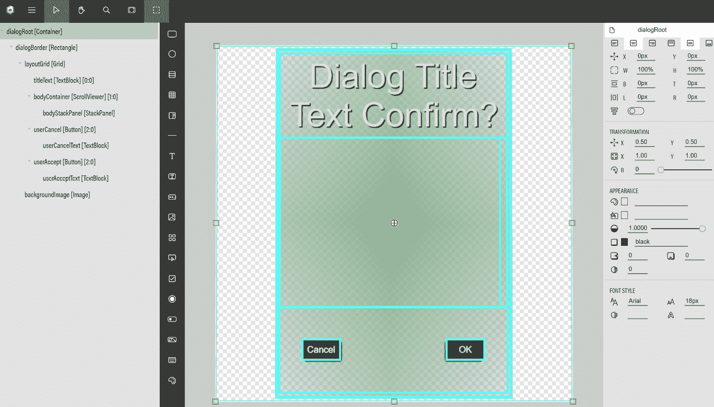

# 计算和显示评分结果

无论游戏是以软件的形式实现，还是以剪裁的纸板的形式实现，几乎所有的游戏，无论其来源或格式如何，都有内在的方式在游戏过程中向玩家提供关于其表现的反馈。无论是反映进球数还是玩家保持钢球在挡块之间不落下的能力，评分过程是游戏与玩家在最直观层面上连接的地方。

在本章中，我们将介绍两个新的强大工具，这两个工具都是 Babylon.js 版本 5 的新特性：`src/route-planning/route-plan-gui.js`。回想一下，为了仅显示一个基本的 GUI，就需要编写大量的样板代码、易出错的代码，以及最终令人厌烦的代码。涉及的代码大多属于“使这个对象变成这种颜色，并放置在这里”的类型，这使得在运行时难以可视化组件和元素的外观。GUIE 允许开发人员或设计师将应用程序的表示与行为逻辑分开——这是一个大多数开发者都非常熟悉的概念！除了 GUIE 之外，我们还将介绍另一个极其强大的工具——协程。

协程的行为和构建方式对于那些阅读过*第四章*，“空间卡车手 - 状态机”部分的人来说非常熟悉，但与专门用于管理我们的应用程序状态的具体目的不同，协程是由一个任意定义的函数生成器构建的（有关 JavaScript 中`function`生成器的复习，请参阅*第四章*，“创建应用程序”），并将其附加到`BabylonJS.Observable`上。大多数时候，这个 Observable 将是场景的`onBeforeRenderObservable`，这意味着协程在每一帧之前执行，但任何 Observable 都可以运行协程。`yield`关键字与我们将很快看到的某些其他元素结合使用的行为使得协程成为在游戏逻辑需要跨越多个渲染帧时使用的完美工具，我们将利用这一特性来显示评分结果。

作为对 GUIE 和协程的考察的一部分，我们将在将评分跟踪逻辑放入游戏的其他部分之前，构建一个可重用的对话框系统，该系统将作为我们的评分对话框和结果屏幕的基础。尽管这可能看起来像是一种倒退的方法，但首先能够显示分数将帮助我们了解应用程序的其他部分需要跟踪和计算什么。还有多少事情可以做，而且应该做？当然！总会有更多的事情要做，但在软件开发中，知道哪些事情*必须*做，以及哪些事情只需要*做*，是一项重要的技能。

在本章中，我们将涵盖以下主题：

+   介绍 Babylon.js GUI 编辑器

+   构建可重用对话框组件

+   计算分数

+   使用协程创建评分对话框

# 技术要求

对于本章，软件或硬件方面没有新的或额外的要求，但在 Babylon.js 文档或其他地方有一些主题，在我们探索这些领域时可能会很有用：

+   Babylon.js 2D GUI 系统在[`doc.babylonjs.com/divingDeeper/gui`](https://doc.babylonjs.com/divingDeeper/gui)

+   协程（Babylon.js）在[`doc.babylonjs.com/divingDeeper/events/coroutines`](https://doc.babylonjs.com/divingDeeper/events/coroutines)

+   GUI 编辑器用户指南/手册在[`doc.babylonjs.com/toolsAndResources/tools/guiEditor`](https://doc.babylonjs.com/toolsAndResources/tools/guiEditor)

# 介绍 Babylon.js GUI 编辑器

模板代码是指具有简单、标准化和经常重复特性的代码。作为软件开发人员，出于一些非常好的原因，通常最好自己不编写这种类型的代码。首先，模板代码的本质是重复的，这使得它容易受到语法或其他表面逻辑缺陷（即，拼写错误、手指粗大等）的影响。其次，维护起来很困难，因为当需要引入更改时，这些更改通常需要在模板代码的整个范围内进行。最后（至少对我们来说），阅读和编写这种类型的代码真的很无聊。

为了解决这些问题（以及其他相关问题），Babylon.js 团队创建了 GUIE。作为 Babylon.js v5.0 版本中引入的众多新工具和功能之一，GUIE 在 Babylon.js 生态系统中填补了一个重要的空白。就像它的兄弟一样，动画曲线编辑器、节点材质编辑器和 Playground，GUIE 及其关联的片段服务器托管在[`gui.babylonjs.com`](https://gui.babylonjs.com)，并且具有类似的双重能力，可以与唯一 ID 和修订版一起工作以实现持久性，或者直接与 JSON 文件一起工作。

重要提示

Babylon.js 支持两种基本的 GUI 类型：2D 和 3D。2D GUI 使用高级动态纹理（见*高级动态纹理*部分）渲染到实用层，而 3D GUI 系统在实用层上渲染网格。本章以及本书的大部分内容主要关注 2D GUI。然而，2D 和 3D 系统具有非常相似的 API。有关 3D GUI 系统的更多信息，请参阅[`doc.babylonjs.com/divingDeeper/gui/gui3D`](https://doc.babylonjs.com/divingDeeper/gui/gui3D)。

在我们开始查看 GUIE 的界面和功能之前，如果我们先从复习或入门开始，了解 Babylon.js GUI 组件在**高级动态纹理**（**ADT**）层面的工作方式，这将是有用的。

## 高级动态纹理

在这本书的整个过程中，我们一直在使用 ADT 和 2D GUI 系统，但到目前为止，我们还没有尝试窥视 ADT 的内部，看看它做了什么。要做到这一点，让我们先去掉“高级”这个词的部分，首先关注更基础的**动态纹理**（**DT**）。

DT 是一个设计时集成组件，在一端暴露了 HTML5 Canvas 绘图 API；在 Babylon.js 一端，它暴露了一个 `BABYLON.DynamicTexture`。因为它派生自常规的 `BABYLON.Texture`，它通常通过将 DT 分配到材料中适当的纹理槽来渲染。在 [`playground.babylonjs.com/#5ZCGRM#2`](https://playground.babylonjs.com/%235ZCGRM%232) 的游乐场中演示了如何使用 DT 绘制简单文本的基本原理，但任何 Canvas API 都可以通过 DT 的 `getContext` 函数访问。

注意

查看 [`developer.mozilla.org/en-US/docs/Web/API/Canvas_API`](https://developer.mozilla.org/en-US/docs/Web/API/Canvas_API) 了解更多关于画布 API 及其不同功能和能力的信息，以及 [`doc.babylonjs.com/divingDeeper/materials/using/dynamicTexture`](https://doc.babylonjs.com/divingDeeper/materials/using/dynamicTexture) 了解更多关于 BabylonJS DT 的信息。

以这种方式访问画布 API 为希望渲染字符串或其他 UI 元素的开发者提供了巨大的灵活性，但代价是要求这些开发者必须管理大量本质上属于模板代码的内容。听起来熟悉吗？Babylon.GUI 系统是集成一端在画布 API 之上的更高层抽象，就像其前身**动态纹理**一样，**高级动态纹理**构成了另一端。

简而言之，ADT 是由 Babylon.GUI API 生成和管理的**过程纹理**。就是这样。如果觉得这个定义有些令人失望，考虑到之前的铺垫，那么你很幸运，因为细节要复杂得多，远不止一个简单的过程纹理。我们可以从想象 ADT 如何融入整体场景和渲染过程开始：


图 9.1 – 画布 API 和 Babylon.js 渲染层，它们承载着众多不同的功能，如检查器、发光层、Gizmos 等

如果我们将 HTML 画布类比为用于绘画的布画布，那么一个层就像画布上的一层独立的油漆；多个层重叠和混合以创建整个作品。正如现实世界的画布一样，像素（或油漆块）放置的顺序对于最终外观很重要——通常情况下，最后放置在画布上的颜色将是该像素的占主导地位的颜色。

当使用`AdvancedDynamicTexture.CreateFullScreenUI`创建时，ADT 被渲染为那些层之一，ADT 的`isForeground`属性决定了其层是否在所有其他层之前渲染。关键的是，这也意味着 ADT 会受到与其他层相同类型因素的影响（例如，层遮罩和后处理；参见*第八章*，*构建驾驶游戏*，*异步加载资源*部分了解更多）。当全屏 UI 不是合适的工具时，可以通过使用`AdvancedDynamicTexture.CreateMeshTexture`函数创建它，就像使用任何纹理一样使用`AdvancedDynamicTexture`。这就是我们在*第八章*，*构建驾驶游戏*，*制作迷你地图*部分所做的那样，所以这是一个好兆头，表明我们准备好向更高层次迈进，开始使用更好的工具来处理`AdvancedDynamicTexture`，无论其类型如何。同样，GUIE 将为我们节省大量的时间和精力，所以让我们简要地浏览一下，并开始工作吧！

## 使用 GUIE 进行 UI 设计

如往常一样，Babylon.js GUIE 的最新文档可以在[`doc.babylonjs.com/toolsAndResources/tools/guiEditor`](https://doc.babylonjs.com/toolsAndResources/tools/guiEditor)找到，但一些基本原理仍然值得回顾。最顶部的水平菜单，带有*汉堡*图标，包含用于管理缩放级别、复制和粘贴控件等功能的控制项。

在导航面板的空白区域单击会显示 ADT 的属性。这些属性除了用于渲染布局画布外，还包括用于以各种格式加载和保存 GUI 的按钮。以下截图从右到左显示了 GUI 编辑器的不同区域 – 导航树、布局画布和属性面板，分别：



图 9.2 – GUIE 的三个主要工作区域，从左到右：导航面板、布局画布和属性面板。布局显示了当前选中的 layoutGrid 容器元素。来源：[`gui.babylonjs.com/#923BBT#37`](https://gui.babylonjs.com/%23923BBT%2337)

控制树可以在左侧的导航面板中看到，与布局画布由可插入的控件图标的垂直列表隔开。这些控件中可能更重要的一组是各种类型的容器。

从**StackPanels**到**Grids**，再加上一些**ScrollViewers**和**Rectangles**来使布局更加完整，容器元素的行为正如你所期望的那样，如果你习惯了这些概念。图 9.2 所示的 GUI 是一个简单的对话框设计，内容被拆分到布局 Grid 的三个单独的行中。这个控件反过来又包含在 Rectangle 对话框边框中，而对话框边框又包含在整个 UI 的 dialogRoot 容器中。

如果你不太熟悉容器及其行为，快速阅读 BJS 文档中关于容器的部分可能值得（并且信息量丰富！）在[`doc.babylonjs.com/divingDeeper/gui/gui#containers`](https://doc.babylonjs.com/divingDeeper/gui/gui#containers)。可以通过在视觉布局面板中拖动处理柄或直接设置特定值来调整和布局视觉元素 – 使用前者来获得近似值，使用后者来达到像素级的精确度！

注意

当前支持的控件列表及其相关文档部分的链接可以在[`doc.babylonjs.com/toolsAndResources/tools/guiEditor#supported-controls`](https://doc.babylonjs.com/toolsAndResources/tools/guiEditor#supported-controls)找到。

行索引从零开始，因此中间行是第一行，包含对话框的主要内容。以下图表说明了 layoutGrid 的三个行如何分别分配 25%、50%和 25%的可用高度：


]

图 9.3 – layoutGrid 及其子控件的简化视图。顶部和底部行各占可用高度的 25%，而中间行在渲染时分配剩余的 50%可用高度

让我们依次查看每一行。第一行包含`titleText`控件；正如其名称所暗示的，它正是你所期望的那样 – 一个用于显示对话框标题的容器。第二行，中间行包含主要显示内容，因此需要为它的滚动查看器（允许任意长或宽的子内容 – 这是一个值得注意的有用特性，稍后将会用到）以及它自己的`userCancel`和`userAccept`按钮留出最多的空间。这些按钮将在下一节中与点击逻辑连接，并且将使用相对（百分比）定位来确保按钮保持在它们各自的侧面。

注意

HTML/CSS 开发者可能愤怒地想知道为什么我们不使用列和跨单元格，或者使用水平 StackPanel 的对齐方式。这些方法确实很棒——如果可用跨单元格或全对齐对齐，但它们目前不可用（在撰写本文时），因此必须寻求替代方法！

我们 GUIE 之旅的最后一站与其说是编辑器的功能，不如说是一个强烈推荐的命名工作流程实践，即在树中命名控件：

![图 9.4 – 命名控件的控件树结构。拥有清晰、指示性的名称对于有效地将 GUIE 与应用程序集成至关重要。布局网格容器中的子元素在树中显示它们各自的[row:column]索引

](img/Figure_9.4_B17866.jpg)

图 9.4 – 命名控件的控件树结构。拥有清晰、指示性的名称对于有效地将 GUIE 与应用程序集成至关重要。布局网格容器中的子元素在树中显示它们各自的[row:column]索引

如果你阅读过某种类型的奇幻体裁，那么你就会知道，拥有某物的名称赋予了对该物的控制力，我们的 GUI 控件树也不例外！我们将 GUI 定义与 JavaScript 逻辑结合的集成模式将依赖于使用控件名称的权力在需要时召唤它，但我们将看到如何使用`Control.findByName`作为 Babylon.js GUI 及其核心框架中功能提供的整洁集成选项的一部分！

## 与 GUIE 的集成

是时候超越 GUIE，看看我们如何在简单的 Playground 设置中利用其输出了。位于 https://playground.babylonjs.com/#WIVN8Z#6 的 Playground 将是我们本节的开端；我们将在下一节中构建并完成它；也就是说，*构建可重用对话框组件*。现在，让我们运行 Playground，并在显示区域中的任何地方点击或轻触以召唤一个对话框。点击其中一个按钮将关闭或生成一个新的对话框，具体取决于点击的是哪个。

现在，让我们专注于`createScene`函数。它非常简短——少于 40 行代码，其中大部分代码用于订阅`DialogBox`组件和场景的`onPointerObservable`的各种 Observables。定义初始对话框`opts`对象并创建`DialogBox`实例，完成了我们的 Playground 的场景创建逻辑，使我们能够专注于如何将`const DIALOG_GUI_SNIPPET = "923BBT#32"`这一行转换为交互式组件，使我们更接近了解`DialogBox`的工作原理。

在`DialogBox`类定义的正上方——第 60 行——定义了`CONTROL_NAMES`常量：

```js

const CONTROL_NAMES = Object.freeze({
    cancel: 'userCancel',
    accept: 'userAccept',
    titleText: 'titleText',
    bodyText: 'dialogText',
    acceptText: 'userAcceptText',
    cancelText: 'userCancelText',
    dialog: 'dialogBorder',
    bodyScrollViewer: 'bodyContainer',
    bodyStackPanel: 'bodyStackPanel',
});
```

回想一下我们提到名称的重要性。这就是那个讨论变得重要的地方！它也成为了我们代码中唯一需要了解我们 GUI 结构具体信息的部分，这使得我们可以在一定程度上修改我们的 GUI，而无需对应用程序代码进行相应的更改。

好的——现在，我们有一个可以用来通过代码访问控件的控件名称映射，但我们还没有加载任何内容供我们的代码访问。我们需要创建一个 `AdvancedDynamicTexture` 的实例——全屏模式是可以的——并且我们还想确保文本和线条在最终渲染的任何大小上都是清晰和锐利的：

```js

this.advancedTexture = AdvancedDynamicTexture
     .CreateFullscreenUI("dialog", false, scene,
          Texture.NEAREST_NEAREST, true);
```

在缩放纹理时使用 `NEAREST_NEAREST` 作为采样方法可以获得最佳文本效果，而最后一个参数的 `true` 标志则启用自适应缩放，以获得无论缩放如何都看起来很好的效果。现在我们已经有了可以托管 GUI 的东西，是时候将此 GUI 加载到 ADT 中了。

因为我们想将 `DIALOG_GUI_SNIPPET` 作为源来加载我们的 GUI，所以我们需要使用 `AdvancedDynamicTexture` 实例中的 `parseFromSnippetAsync` 方法。由于该函数是异步的，这意味着我们可以从适当标记的 `async` 函数中等待其完成：

```js

this.scene.executeWhenReady(async () => {
     await this.advancedTexture
           .parseFromSnippetAsync(DIALOG_GUI_SNIPPET,
             false);
     this.dialogContainer.isVisible = false;
```

一旦 `advancedTexture` 从片段服务器完成加载 GUI 定义（并且在前面的情况下，选择不重新缩放纹理），它就可以通过 `advancedTexture.getControlByName()` 访问。为了避免代码中的重复，我们可以在类或对象中定义属性访问器来封装获取或设置这些控件值的逻辑：

```js

get dialogContainer() {
    return this.advancedTexture
           .getControlByName(CONTROL_NAMES.dialog);
}
get titleText() {
    let ctrl = this.advancedTexture
            .getControlByName(CONTROL_NAMES.titleText);
    return ctrl.text;
}
set titleText(value) {
    let ctrl = this.advancedTexture
            .getControlByName(CONTROL_NAMES.titleText);
    ctrl.text = value;
}
```

在前面的代码中，有两个获取控件的示例，以及一个控件文本值的示例。此外，最后一个属性显示了设置 `titleText` 控件的文本值的类似过程。这些属性访问器和类似的其他组件构成了 `DialogBox` 类的核心部分，这是下一节的主题。

`AdvancedDynamicTexture.getControlByName`。

现在，使用这个工具、数据和代码的组合，是时候将理论付诸实践了。我们需要一种更简单的方法来实现对话框的概念，在我们的应用程序中至少有两个地方需要对话框功能——路线确认和评分。这个问题说明了需要构建一次可以使用在多种情况下的东西。

# 构建可重用对话框组件

一个可重用组件能够在特定代码库的多个位置和上下文中使用。设计一个可重用组件与设计一个单一用途组件在几个方面有所不同。其中最相关的一点是，可重用组件的功能必须设计成用户可定制的，而无需为使用它而重新编写基本代码。

当我们查看如何将 `advancedTexture.getControlByName` 包装在获取或设置访问器中时，我们已经检查了 `DialogBox` 的某些部分，因此让我们在此基础上制作一个重要的提醒/笔记。

重要提示

`CONTROL_NAMES` 枚举列出了 `DialogBox` 类实现的全部属性，但属性的数量多于控件的数量。获取或设置如 `titleText` 或 `bodyText` 这样的属性是直接操作文本控件的 `text` 属性。

我们组件的关键部分将是初始化（构造）逻辑，这很重要，因为它需要解析 GUI 数据、入口和退出管理，以及处理按钮点击等事件。在检查了这些功能的运作方式之后，我们将把这些单独的部分组合起来，以构建路线确认对话框提示。

## 构建 DialogBox 类

`DialogBox` 类的构造函数接受一个选项对象和一个场景实例作为其两个参数。这些参数主要用于预先填充对话框的内容，但 `displayOnLoad` 参数是一个行为标志，它控制 `DialogBox` 在加载和初始化完成后是否应该可见。当值为 `false` 时，必须显式调用 `show()` 方法来显示对话框：

```js

const {
  bodyText, titleText,
  displayOnLoad, acceptText,
  cancelText
} = options; //...later...
if (bodyText) { this.bodyText = bodyText; }
this.titleText = titleText ?? "Space-Truckers: The Dialog
  Box";
this.acceptText = acceptText ?? "OK";
this.cancelText = cancelText ?? "Cancel";
```

构造函数逻辑确保对话框将包含任何必需的内容，即使它们没有被调用者指定。之前，我们查看 `AdvancedDynamicTexture` 的创建，以及如何使用 `parseFromSnippetAsync` 填充 GUI 元素。这是我们用于 Playground 从片段服务器加载的模式。对于应用程序，我们将使用 `advancedTexture.parseContent()` 加载定义 UI 的 JSON 文件——这是一个非异步方法，它还消除了在 `scene.executeWhenReady` 的回调中运行初始化逻辑的需要，我们在 Playground 中使用了它。这是我们 Playground 的 `DialogBox` 类和最终将出现在 Space-Truckers 应用程序中的唯一有意义的区别。这突出了使用 PG 进行迭代代码设计的强大功能！

构造函数的其余部分致力于订阅和连接 `DialogBox` 类的子组件。我们的两个按钮的点击事件处理程序被类包装，并且分别由 `onAcceptedObservable` 和 `onCancelledObservable` 处理：

```js

this.#acceptPointerObserver =
  this.acceptButton.onPointerClickObservable
    .add(async (evt) => {
        await this.onAccepted();
        this.onAcceptedObservable.notifyObservers();
    });
this.#cancelPointerObserver =
  this.cancelButton.onPointerClickObservable
    .add((evt) => {
        await this.onCancelled();
        this.onCancelledObservable.notifyObservers();
    });
this.scene.onDisposeObservable.add(() => {
    this.dispose();
});
```

为了避免资源泄露，我们在非公共类成员（用 `#` 前缀表示）中捕获了从订阅方法返回的观察者，并在 `dispose` 方法中进行清理：

```js

dispose() {
    if (this.#showTimer) {
        this.#showTimer = null;
    }
    this.onAcceptedObservable?.clear();
    this.onAcceptedObservable?.cancelAllCoroutines();
    this.onCancelledObservable?.clear();
    this.onCancelledObservable?.cancelAllCoroutines();
    this.advancedTexture?.clear();
} 
```

任何正在进行的异步操作都必须取消，包括任何协程（有关协程的定义，请参见 *使用协程创建评分对话框* 部分）。我们的游乐场中的 `createScene` 函数演示了当初始确认 `DialogBox` 在 `onAccept` 处理程序中被销毁时，如何实现这一点，其位置被新的 `DialogBox` 替换。

我们的基本 `DialogBox` 定义了与用户交互的两个显式交互点：接受和取消按钮。它还定义了两种行为：显示和隐藏。接下来，我们将学习这两个是如何相互关联的，以及如何确保显示和隐藏方法仅在 `DialogBox` 类完成转换后完成。

## 处理按钮点击和更改可见性

除了处理 `acceptButton` 和 `cancelButton` 的点击事件外，`onAccepted` 和 `onCancelled` 函数还为 `DialogBox` 类提供了自定义器，以便在通知外部观察者事件之前运行自定义逻辑——默认行为通过在触发 Observable 之前隐藏对话框来显示这一点。

```js

    onAccepted() {
        return this.hide();
    }
    onCancelled() {
        return this.hide();
    }
```

`onAccepted` 和 `OnCancelled` 都返回一个 `Promise`，当对话框完成隐藏时解决。如果调用者关心等待对话框完全显示或隐藏，可以使用标准的异步或 Promise 解决模式——即 `await myDialog.show()` 或 `myDialog.hide().then(…)`。至于显示或隐藏 `DialogBox` 的逻辑，它使用 `BABYLON.setAndStartTimer` 工具函数与 `Scalar.SmoothStep` 函数一起触发 `DialogBox` 类的淡入或淡出（注意，由于空间原因，以下列表中省略了一些代码）：

```js

return new Promise((resolve, reject) => {
   this.dialogContainer.alpha = 1;
   this.#showTimer = setAndStartTimer(
   {
       timeout: this.#fadeInTransitionDurationMs,
       onTick: (d) => this.dialogContainer.alpha = Scalar
                      .SmoothStep(0.998, 0, d.completeRate),
       onEnded: () => {
           this.advancedTexture.isForeground = false;
           this.dialogContainer.isVisible = false;  
           resolve();
        },
        breakCondition: this.dialogContainer == null
     });
   }
});
```

在前面的代码中，大部分动作发生在 `setAndStartTimer` 选项的 `onTick` 和 `onEnded` 回调中。对话框以不透明度 `1` 开始，并在经过一段时间的 `#fadeInTransitionDurationMs`（大约 800 毫秒）后以不透明度 `0` 结束。在此期间，使用 `onTick` 参数的 `completeRate` 进行插值，给出一个从 `0` 到 `1` 的值，表示计时器完成进度的距离。

`onEnded` 回调将 `DialogBox` 类从前景渲染中移除（参见本章前面的 *高级动态纹理* 部分），并在解决原始 Promise 之前将 GUI 的 `isVisible` 设置为 `false`。另一方面，`breakCondition` 确保如果 `DialogBox` 实例在完成隐藏或显示动画之前被销毁，计时器不会尝试调用已销毁的对象。

注意

`show()` 函数几乎与 `hide()` 函数相同，但它更像是一个镜像反转图像，而不是一个克隆。这是因为它从完全透明开始，最终完全隐藏。

让我们回顾一下如何使用 `DialogBox` 类的五个简单步骤：

1.  创建一个包含至少一个 `guiData` 字段的 `opts` 对象，其中包含一个片段 ID：

    ```js
    let opts = {
        bodyText: "Your flight plan appears to be viable!"
            + '\n'
            + "Would you like to file it with Space-
              Truckers Traffic Control (STC)?",
        titleText: 'Route Planning Success',
        displayOnLoad: false,
        acceptText: 'Launch!',
        cancelText: 'Retry',
        guiData: DIALOG_GUI_SNIPPET // e.g., "923BBT#32"
    };
    ```

1.  实例化一个新的 `DialogBox` 实例，传入之前创建的 `opts` 对象和场景的引用：

    ```js
    let dialog = new DialogBox(opts, scene);
    ```

1.  将观察者附加到对话框的 `onAcceptedObservable` 和 `onCancelledObservable` 以响应用户输入（在这种情况下，调用 `createScoringDialog`）：

    ```js
    dialog.onAcceptedObservable.add(async () => {
            dialog.dispose();
            dialog = createScoringDialog(null, scene);
    });
    dialog.onCancelledObservable.add(()=>console.log
      ('cancelled'))
    ```

1.  如果（可选的）`displayOnLoad` 标志未设置为 `true`，则调用 `show` 方法以显示 `DialogBox` 类：

    ```js
    dialog.show();
    ```

1.  要取消或隐藏对话框，请点击 `cancelButton` 或调用 `hide()` 函数。要延迟操作直到 `DialogBox` 类完全淡出，可以等待从 `hide` 返回的 Promise：

    ```js
    await dialog.hide();
    ```

在我们的可重用 `DialogBox` 完成概念验证形式后，让我们快速看一下如何通过查看路线规划屏幕如何使用它来提示玩家进入游戏玩法下一阶段，来了解与 Space-Truckers 应用程序集成的实践。

## 在成功规划路线后提示用户

从游乐场对 `DialogBox` 类的更改不需要太多。然而，如 *构建 DialogBox 类* 部分所述，我们将从使用从远程服务器加载的片段切换到从游戏资源文件夹加载的 JSON 文件。

从 GUIE 保存 GUI JSON 定义后，定义被添加到 `/src/guis` 文件夹中的 `gui-dialog-buttons-scroll.json`。不过，需要做一个重要的更改，所以打开文件并找到任何外部资源（*`.png`），将它们的 URL 从绝对路径更改为指向 `assets` 文件夹中适当文件的相对路径。例如，用作 `DialogBox` 背景的图像在修改后看起来会是这样：

```js

"source":"/assets/menuBackground.png"
```

`DialogBox` 类本身位于 GUI JSON 旁边，在 `guiDialog.js` 文件中，并且根据我们从片段服务器切换到 JSON 的变更，我们必须在将 `guiData` 属性值传递给 `DialogBox` 构造函数之前，将此导入添加到文件顶部：

```js

import stackedDialog from "./gui-dialog-buttons-
  scroll.json";
// later…
this.advancedTexture.parseContent(stackedDialog, false);
```

转到 `SpaceTruckerPlanningScreen`，我们需要在文件中添加对 `DialogBox` 的 `import`：

```js

import DialogBox from "../guis/guiDialog";
```

`SpaceTruckerPlanningScreen` 已添加一个新的 `routeConfirmationDialog` 属性，在构造函数的末尾初始化，其中包含的逻辑如果你已经阅读了本章的全部内容，应该非常熟悉：

```js

this.routeConfirmationDialog = new DialogBox({
    bodyText: 'Successful route planning! Use route and
      launch?',
    titleText: 'Confirm Flight Plan',
    acceptText: 'Launch!',
    cancelText: 'Reset',
    displayOnLoad: false
}, this.scene);
this.routeConfirmationDialog.onAcceptedObservable.add(() =>
  {
    this.routeAcceptedObservable.notifyObservers();
    this.gameState = PLANNING_STATE.RouteAccepted;
    this.routeConfirmationDialog.hide();
});
this.routeConfirmationDialog.onCancelledObservable.add(()
  => {
    this.routeConfirmationDialog.hide();
    this.setReadyToLaunchState();
});
```

现在，毫无疑问，实际用于确认对话框中的复制品可能需要一些改进，但至少目前它能完成任务——也许你会是那个提交拉取请求将其改为更有趣内容的人？

在有趣的话题上，对话框的`onAcceptedObservable`处理程序做了几件有趣的事情。首先，它通知任何感兴趣的各方玩家已经接受了路线。然后，它更新`gameState`以反映新的现实，在隐藏`routeConfirmationDialog`并允许订阅`routeAcceptedObservable`的任何逻辑从该点开始处理之前。这与 Playground 示例没有太大不同，而且也不需要太多时间就能启动！但我们现在想保留这种感觉，因为接下来，我们将对应用程序进行一系列有针对性的更改，以收集、处理和计算游戏得分数据。

# 计算得分

从玩游戏中获得的大部分乐趣来自于游戏可以以不同方式向玩家提供反馈——积极的或消极的。这是游戏设计师与玩家在情感层面上建立联系的大好机会。将积极的事件和结果与玩家的行为联系起来，在游戏和玩家之间创建了一个反馈循环，而在游戏中最古老、最真实的关系之一就是积分累积的概念。

在`DialogBox`中使用的评分系统最初是空的，但在给出最终得分之前，它会逐行显示每个类别的得分。

在构建捕获和计算得分的逻辑之前，定义一个示例得分中的所需得分数据模型是有用的。这是评分过程逻辑的期望输出，无论该逻辑如何生成数据。这将让我们了解在应用程序的其他地方需要做出哪些更改以支持评分系统。

## 得分系统设计

由**Space-Truckers**生成并使用的得分数据可以分为三大类：**得分因素**、**乘数**和**最终得分**。得分因素是反映路线规划和驾驶性能基本属性的类别。遭遇次数、路线长度和初始发射力都是在路线规划阶段固定并设置的，但在驾驶阶段（直到玩家到达目的地）货物的状况是动态的（为了提供背景，已提供了一些示例值）：

```js

scoreFactors: {
    routeLength: 12450.25,
    cargoCondition: 0.768,
    encounters: 125,
    launch: 100.00
},
multipliers: {
    transitTime: { expected: 180, actual: 150, factor: 1.2  },
    delivery: 1.0,
    condition: 0.768,
    encounterTypes: 1.05
},
finalScores: {
    'Base Delivery': 1000,
    'Route Score': 14940,
    'Cargo Score': 11474,
    'Delivery Bonus': 10000,
    'Encounters': 1312,
    'Final Total': 38726
}
```

以下`scoreFactors`是乘数。这些值被用于评分计算，以各种方式修改一个或多个`scoreFactors`，我们将在下一节“累加和统计分数”中详细介绍。然而，在我们继续之前，还有一件事要做。最后一个——你甚至可以说是一个最终——部分要涵盖。`finalScores`是从`scoreFactor`和乘数组合中得出的分类和汇总的值。这就是最终将以“这里是底线……”这样的方式显示给玩家的内容。

忽略任何关于如何捕获评分数据的细节仍然是一种有用的策略，因为尽管我们可能知道评分数据的一般形状，但直到我们知道如何计算这些分数，我们不会确切知道需要捕获哪些数据和位置。

## 累加和统计分数

评分逻辑包含在 `src/scoring/spaceTruckerScoreManager.js` 文件中。类似于我们之前使用示例评分进行隔间化的方式，使用此组件的消费者只需要调用默认导出 `computeScores` 并传入一个路由数据结构，就可以返回一个 `score` 对象。`computeScores` 函数是一个简单的协调函数——它的唯一目的是协调调用其他各种计算单个评分区域的函数：

```js

let computeScores = function (route) {
    let score = createDefaultScoring();
    calculateEncounterScoreToRef(route, score);
    calculateRouteScoreToRef(route, score);
    calculateCargoScoreToRef(route, score);
    calculateBonusScoreToRef(route, score);
    calculateFinalScoreToRef(score);
    console.log(score);
    return score;
}
```

在前一个列表的第二行中的 `createDefaultScoring` 函数包含 `0` 或空白值。随着 `score` 对象在各个 `calculateXXXScoreToRef` 方法之间传递，其值通过连续的函数调用逐步构建和使用。

这些函数名称上的 `ToRef` 后缀表示它们将修改一个参数（通常是按照惯例提供的最后一个参数），而不是创建一个新实例。这在 `Vector` 和 `Matrix` 对象中最为常见，但命名的一致性对于代码库的长期健康至关重要！接下来是各个子节，它们将详细说明评分计算的各个方面。

由于我们仍在开发过程中，我们不会过于担心使这些计算平衡和调整到我们可能想要的程度。我们需要做的是建立一个基本的方法来提供一种动态评分体验，这样我们稍后准备好平衡和调整时可以轻松返回。

### 遭遇分数

我们首先计算遭遇分数。一开始，我们就知道我们想要得到一个遭遇列表，并且我们将想要使用这个列表来累加每个遭遇的单独修正值，以得到最终的遭遇修正值。如果我们假设路由参数包含一个 `pathPoints` 对象集合（有关详细信息，请参阅 `/src/driving/spaceTruckerDrivingScreen.calculateRouteParameters` 函数），并且 `pathPoints` 集合中的任何给定条目可能或可能不包含一个关联的遭遇，该遭遇包含一个十进制的 `scoreModifier` 值，那么我们可以使用简单的 `map` 和 `reduce` 操作：

```js

const { pathPoints } = route;
const encounters = pathPoints
    .map(p => p.encounter)
    .filter(e => e);
scoreFactors.encounters = encounters.length;
let encounterModifier = 
    1 + encounters.map(e => e.scoreModifier)
        .reduce((prev, curr, cidx, arr) => {
            return prev + curr;
        });
multipliers.encounterTypes = encounterModifier;
let encounterScore = 100 * encounters.length * 
  multipliers.encounterTypes;
finalScores['Encounters'] = encounterScore;
```

之前的代码使用了一个简单的提取函数调用`map`，该函数检索`scoreModifier`值——一个数字。接下来，它将`scoreModifier`数字数组传递给`reduce`函数。`Array.reduce`（如果你还不熟悉）是一个有用的聚合工具，它将一个函数作为其主要参数。在遍历数组`arr`时，函数会依次对每个`curr`元素调用，将`prev`操作的结果与`cidx`位置的`curr`元素值一起传递。这仅仅是一种花哨的说法，即`reduce`操作会计算一个数字数组的所有元素的总和！这个聚合值成为`encounterModifier`，它与总的遭遇次数一起用来确定总的遭遇得分值。

### 路线得分

路线得分计算与遭遇得分计算略有不同。路线得分的主要因素是整体路线的长度（货物在到达之前需要行驶多远），但还有几个同样重要的修正因子。当涉及到路线的`transitTime`时，有两个相关的值：计划中的运输时间和实际的（驾驶阶段）运输时间。这两个值的比率加上一个常数，给出了`transit.factor`，这是一个重要的乘数，它以两种方式使用。首先，它应用于`distanceTraveled`；然后应用于`launchForce`值，这在路线规划阶段使用。第一个值从第二个值中减去，以产生最终的路线得分值：

```js

transit.factor = 0.5 + route.transitTime /
  route.actualTransitTime;
finalScores['Route Score'] = 
(route.distanceTraveled * transit.factor) – 
(route.launchForce * transit.factor);
```

### 货物得分

货物得分主要基于货物到达时的状态，这意味着它反映了玩家在驾驶阶段的表现。货物开始时的状态值为 100。当发生遭遇或足够快的碰撞时，路线路径可以降低该值（有关更多信息，请参阅*捕获得分数据*部分），该值在经过状态乘数缩放后用作货物得分的基础：

```js

const { cargoCondition } = route;
scoreFactors.cargoCondition = cargoCondition;
let cargoScore = 10 * cargoCondition *
  multipliers.condition;
finalScores['Cargo Score'] = cargoScore;
```

### 奖励得分

如果玩家以完美的状态交付他们的货物，那么将获得额外的奖励。在这种情况下，交付奖金应用于`finalScores`：

```js

if (route.cargoCondition >= 100) {
   s.finalScores['Delivery Bonus'] = DELIVERY_BONUS;
} else { s.finalScores['Delivery Bonus'] = 0;}
```

### 最终得分

一旦所有各种子得分都被计算并相乘，就是时候将它们全部加起来以得到我们的总得分。在填充了`BASE_DELIVERY_SCORE`之后，我们使用`Object.values`生成一个数字数组，我们（听起来熟悉？）将其传递给另一个`reduce`操作以得到最终的“总分”得分值：

```js

let { finalScores } = score;
finalScores['Base Delivery'] = BASE_DELIVERY_SCORE;
let finalScore = Object.values(finalScores)
  .reduce((prev, curr) => prev + Number(curr));
score.finalScores['Final Total'] = finalScore;
```

将这些计算组合起来有助于我们了解路线中已经可用的数据以及需要收集的数据。毕竟，关于游戏会话的信息远不止路线路径！

## 捕获得分数据

以样本评分数据作为指导，我们可以逆向工作，以确定在捕获之前生成评分数据的应用程序中的位置。这可能会导致需要更新或更改现有的数据结构和代码，但没关系，因为我们也将对所需的更改进行修改，以便玩家能够完成驾驶阶段，并看到他们最终得分以全貌显示！

### 丰富路线数据

第一个，也可能是最大的变化是，我们为`SpaceTruckerPlanningScreen`添加了一个新的`routeData`属性，它包装了游戏后期评分计算所需的所有数据（有关更多信息，请参阅*累计和总计分数*部分）：

```js

    get routeData() {
        return {
            route: this.cargo.routePath,
            launchForce: this.launchForce,
            transitTime: this.cargo.timeInTransit,
            distanceTraveled: this.cargo.distanceTraveled
        }
    }
```

`Cargo`对象的`routePath`跟踪遭遇和其他路径特定数据，而其他值提供基线旅行时间和路线长度。遭遇已经被作为与遭遇相关的`cargoData`的一部分捕获，但需要为在`route-planning/gameData.js`文件中列出的每个遭遇添加额外的`scoreModifier`字段：

```js

{
   name: 'Rock Hazard',
   id: 'rock_hazard',
   image: hazard_icon,
   probability: 0.89,
   scoreModifier: 0.019
}
```

还有更多的工作要做，但这已经完成了评分方面的数据收集部分。接下来，我们需要添加一个触发器来启动评分过程（前提是玩家已经完成了路线…）并显示评分对话框。

### 完成驾驶阶段

到目前为止，`SpaceTruckerDrivingScreen.killTruck`函数一直在无差别地执行其名称所暗示的严酷职责。然而，今天却不同。今天，卡车的死神有了良心：

```js

let closestPathPosition =
  path3d.getClosestPositionTo(mesh.absolutePosition);
// not close enough!
if (closestPathPosition < 0.976) {
    this.reset();
    return;
}
this.completeRound();
```

当方法被`onMeshIntersectExit`动作触发器调用时，它会将网格的绝对（世界参考）位置与路线最近的 Path3D 段进行比较。参见*第八章*，*构建驾驶游戏*，*生成驾驶路径*部分，了解更多关于 Path3D 及其与路线路径的关系。

注意

Path3D 以介于 0（开始）和 1（结束）之间的标准化路线形式公开位置。

如果卡车意外地离目的地太远而退出其路线路径（从而触发此方法），那么收割的严酷任务将继续像过去一样进行。让我们不要沉溺于过去，而是展望涉及调用`SpaceTruckerDrivingScreen`类的`completeRound`方法的美好未来。需要发生的头两件事是我们想要隐藏驾驶阶段的 GUI，我们通过将适当的`layerMask`设置为`0`来实现这一点。接下来，我们将屏幕过渡到`DRIVING_STATE.RouteComplete`状态，以防止对可能影响评分的模拟进行进一步更新，说到评分，这紧接着就是：

```js

completeRound() {
    this.gui.guiCamera.layerMask = 0x0;
    this.currentState = DRIVING_STATE.RouteComplete;
    this.route.actualTransitTime = this.currentTransitTime;
    // gather data for score computation
    let scoring = computeScores(this.route);
    let scoreDialog = createScoringDialog(scoring, this);
    scoreDialog.onAcceptedObservable
     .addOnce(() =>
       this.onExitObservable.notifyObservers());
    scoreDialog.onCancelledObservable
     .addOnce(() => this.reset());
    this.scoreDialog = scoreDialog;
}
```

一旦收集并计算了得分数据，就会调用`createScoringDialog`（来自`/src/scoring/scoringDialog.js`）来完成必要的`DialogBox`创建和管理；`completeRound`需要做的只是将`onAcceptedObservable`和`onCancelledObservable`属性连接到适当的逻辑。然后，从驾驶屏幕的角度来看，我们就准备就绪了！

`createScoringDialog`函数与这本书非常相似；它从熟悉的部分开始，然后在进展过程中加入一些完全出乎意料或不熟悉的内容，直到最后，似乎一切都像魔法一样运作。让我们通过查看函数的熟悉部分来结束这一节：

```js

    let opts = {
        bodyText: 'Time to earn payday!',
        titleText: 'The Drayage Report',
        displayOnLoad: true,
        acceptText: 'Main Menu',
        cancelText: 'Retry'
    };
    const { scene, soundManager } = drivingScreen;
    const sound = soundManager.sound('scoring');

    let scoreDialog = new DialogBox(opts, scene);
    let dialog = { scoreDialog };
    dialog.height = "98%";
    let scoringCo = scoringAnimationCo();
```

这与[`playground.babylonjs.com/#SQG1LV#28`](https://playground.babylonjs.com/%23SQG1LV%2328)中的 Playground 略有不同，但这仅仅是因为 PG 没有`SpaceTruckerSoundManager`来检索和管理下一节使用的声音。在这段代码的最后几行之前，并没有什么不寻常的地方。这也是介绍 Babylon.js v5 中更令人兴奋的功能之一的绝佳机会——协程！

计算得分本身的逻辑尽可能简单，不再复杂——它只需要直接传递给它的数据来操作，但那些数据需要从某个地方来。不同的得分类别来自游戏的不同组件；遭遇增加它们的乘数，行驶和路线规划中的通行时间被计算，而卡车在行驶过程中跟踪货物的健康状况。这些因素和乘数都贡献于最终得分，这些得分会在得分对话框中显示。

# 使用协程创建得分对话框

如果你来自 Unity、Unreal 或其他游戏引擎的工作背景，你可能熟悉协程的概念。在这些环境中，协程的定义与在 Babylon.js 中定义的方式非常相似：一个跨多个渲染帧运行的状态方法。

虽然它可能暗示了多个线程的存在，但在大多数框架中（例如 Unity 和当然还有 JavaScript！），通常并非如此。C#编程语言使用迭代器以及**yield**关键字来实现协程，但在 JavaScript 中，我们使用一个（剧透警告！）**函数*生成器**。没有人能预料到*第四章*，“创建应用程序”中的回调吧！我们不会将它们作为应用程序状态机的一部分来使用，而是要定义使得分对话框的得分条目从零开始计数的逻辑，同时播放收银机类型的声响。最后，我们将通过查看一个独立的 Playground 示例来将事情推向高潮，展示如何设计由多个独立可重用行为组成的控制器系统。

## 检查函数生成器

有关 JavaScript 函数生成器的更详细概述，请参阅 *第四章*，*创建应用程序*，*太空卡车手——状态机* 部分。这里有一个快速示例，帮助提醒我们它们是如何工作的以及如何使用它们。假设我们的设计师为打印报告的行设计了一套调色板。我们可以定义一个 `nextColor()` 星函数，它将在每次迭代时产生一个新的十六进制颜色字符串：

```js

function* nextColor() {
    while (true) {
        yield "#0d5088";
        yield "#94342c";
        yield "#e2ba77";
        yield "#787b6d";
    }
}
let colorPicker = nextColor();
```

当通过调用 `nextColor()` 生成函数时，它将始终按顺序从列表中产生一个颜色，当请求时。这在哪里发挥作用？`createScoringBlock(label)` 函数负责创建和样式化实际显示在得分 `DialogBox` 中的 GUI 元素，每次调用时都调用 `colorPicker.next()` 来产生一个新的值：

```js

// ...inside the createScoringDialog function scope
// ...inside the function* scoringAnimationCo scope
function createScoringBlock(label) {
    let scoreBlock = new TextBlock("scoreLine",
      `${label}`);
    scoreBlock.width = "100%";
    scoreBlock.color = colorPicker.next().value;
    scoreBlock.textHorizontalAlignment =
      Control.HORIZONTAL_ALIGNMENT_LEFT;
    // …snip…
    return scoreBlock;
}
```

这就是我们对 `function*` 概念的简要回顾，所有内容都整理得很好。现在，让我们深入到 `scoringDialog.js` 中，看看这些如何在协程和 Babylon.js 中发挥作用，我们将解开 `scoringAnimationCo` 并将其用于我们的 `DialogBox` 中！

## 使用协程计算玩家得分

协程很棒，因为它们允许开发者通过相对简单的逻辑（当正确实现时）表达复杂的行为。每当协程想要将控制权返回给调用者时，它都会调用 `yield` ——带有或没有参数（见 *高级协程使用* 部分）。协程的 `BABYLON.Observable` 的返回时间和方式。

重要提示

Babylon.js v5 可观察 API 中的新功能是 `Observable.runCoroutineAsync` 和 `Observable.cancelAllCoroutines` 函数。有关更多信息，请参阅 [`doc.babylonjs.com/divingDeeper/events/coroutines`](https://doc.babylonjs.com/divingDeeper/events/coroutines)。

如果将协程附加到场景的渲染事件可观察对象之一，每当宿主可观察对象被触发时，协程将在每一帧运行。如果附加到 `scene.onPointerObservable`，则每当指针移动或与场景交互时，协程都会触发。当与 JavaScript 闭包的工作方式结合使用时，这非常强大——由于迭代函数是一个有状态的构造，它可以记住并跟踪在多个模拟/渲染帧中演变的事件和条件。

这使得协程非常适合实现一种类似“收银台”风格的累计玩家得分，并配合之前作为 `createScoringDialog` 函数一部分创建的 `DialogBox` 类来展示最终总计。协程逻辑可能看起来很简单：给定由得分管理器生成的得分对象（见 *累计和总计得分* 部分）和场景，遍历最终得分属性中的每个属性，并通过从零开始计数来在 `DialogBox` 类中显示其值：

![图 9.5 – `scoringAnimationCo` 行为的逻辑流程图。圆圈代表带有可选 `Tools.DelayAsync` 使用的 `yield` 语句。矩形列出采取的行动

图 9.5 – `scoringAnimationCo` 行为的逻辑流程图。圆圈代表带有可选 `Tools.DelayAsync` 使用的 `yield` 语句。矩形列出采取的行动

前面的图示显示还需要处理几个其他部分：`bodyStack` StackPanel 的高度需要调整以适应添加到其中的新行，包含 `bodyStack` 控件的滚动条需要设置为新的最大值，以确保当前文本行完全可见，等等。

尽管这个逻辑看起来很复杂，但它包含的代码行数远远不到 100 行！如果我们只看协程的实际逻辑，而不包括状态管理代码，我们甚至需要更少的代码来编写：

```js

for (let i in finalScores) {
    yield Tools.DelayAsync(500);
    // ...snip... compute and adjust height    
    yield Tools.DelayAsync(1800);
    if (skipCountUp) {
        // display score right away
    }
    else {
        const MAX_COUNT = 50;
        while (frameCounter <= MAX_COUNT) {
            let currProgress = frameCounter / MAX_COUNT;
            sound.play();
            let speed = Scalar
                    .SmoothStep(0, score, currProgress);
            scoreBlock.text =
                     `${label}.........${speed.toFixed()
                      .toLocaleString()}`;
            frameCounter++;
            yield Tools.DelayAsync(50);
          }
        }
        yield;
      }
      return;
```

`MAX_COUNT` 的值是通过实验任意确定的；它控制计数动画的长度。进度由 `SmoothStep` 函数控制，该函数开始时速度较慢，然后在接近结束时加速，然后缓慢停止。每次将 `Tools.DelayAsync` 作为 `yield` 的参数传递时，协程将暂停自身一段时间——尽可能接近指定的时间——然后继续执行。

注意

由于帧时间增量并不总是等于指定的确切时间，协程可以暂停的时间可能会略微长于指定的时间。

一切都说完了，最终返回的是 `returns` 而不是 `yields`，这表示完成并通知宿主的 `onBeforeRenderObservable` 可以清理并销毁该协程函数实例。从启动代码的角度来看，我们只有两行简单的代码——一行用于创建迭代函数，另一行用于启动它运行：

```js

let scoringCo = scoringAnimationCo();    
scene.onBeforeRenderObservable.runCoroutineAsync(scoringCo);
```

在这个场景中，我们不想阻塞执行并等待协程完成，然后继续执行 `createScoringDialog`，但如果我们在做不同的事情，比如作为协程的一部分进行异步 HTTP 调用，那么等待或捕获 `runCoRoutineAsync` 返回的 Promise 将是明智的。因此，它可以像任何其他异步操作一样使用和传递，允许更高级的场景和复杂的行为。

## 高级协程使用

除非你是泰坦尼克号的乘客，否则有好消息：这只是冰山一角！因为协程利用了函数迭代器的底层机制，可以使用 `yield*` 操作符将多个 `function*` 迭代链接成一个单一的协程，如 [`playground.babylonjs.com/#5Z2QLW#1`](https://playground.babylonjs.com/%235Z2QLW%231) 中的游乐场所示。

注意

查看 [`developer.mozilla.org/en-US/docs/Web/JavaScript/Reference/Operators/yield*`](https://developer.mozilla.org/en-US/docs/Web/JavaScript/Reference/Operators/yield*) 获取更多关于使用 `yield*` 操作符的详细信息及示例。

`yield*` 操作符在 `function*` 体的上下文中使用，并提供了一种“传递”另一个迭代函数结果的方法——或者，这是定义中容易忽略的部分（强调添加）：

“`yield*` 表达式用于委托给另一个生成器或可迭代对象。”

虽然在我们的例子中没有使用，但这将允许开发者编写一个协程，例如，从由设备传感器填充的数组中生成值流，以及其他许多应用。在我们的例子中，我们类似于通过调用另一个 `function*` 将可重用代码提取到函数中，使用 `yield*` 操作符。

看起来是一个小细节，但这种执行其他迭代函数的能力使我们能够使用软件设计的强大组合模式，将简单的构建块组合起来以表达复杂的行为。我们从 `function* think()` 协程开始。它被适当地命名，因为它的任务是决定球体网格接下来要做什么：

```js

function* think() {
    while (true) {
        yield Tools.DelayAsync(1500);
        yield* moveToTarget(new Vector3(PERIMETER / 2, 1,
          0));
        yield Tools.DelayAsync(1500);
        yield* patrolCo();
        yield* moveToTarget(new Vector3(0, 1, 0));
    }
}
```

将前面的代码视为*主要控制器*，或者更通俗地说，是游戏对象的 AI。它可以读取环境并做出决定。在我们的情况下，它等待一秒半后，使用以下代码片段中列出的 `moveToTarget` 函数和期望的目标位置调用该函数。这使球体从其位于右侧边界的中间位置移动。在短暂的延迟之后，调用 `patrolCo` 函数。

`function* patrolCo` 是另一个组合元素，它结合了多个 `moveToTarget` 迭代以及逻辑，以在每次移动方向改变时改变球体的颜色：

```js

function* patrolCo() {
    let targetVector = new BABYLON.Vector3(0, 1, 0)
    yield;
    sphereMat.diffuseColor = BABYLON.Color3.Random();
    targetVector.set(PERIMETER / 2, 1, 0);
    yield* moveToTarget(targetVector);
    sphereMat.diffuseColor = BABYLON.Color3.Random();
    targetVector.addInPlaceFromFloats(0, 0, PERIMETER / 2);
    // ...snip... 
    yield* moveToTarget(targetVector);
    return;
}
```

每组 `yield*` 语句将执行委托给 `moveToTarget` 函数，这是本例中的真正的工作马。这种行为正如其名——它将行为的主语（在我们的例子中是球体网格）尽可能移动到给定的目标世界位置。`maxDelta` 值限制了球体在任何给定帧中可以覆盖的地面量（由于协程是由 `onBeforeRenderObservable` 承载和执行的）：

```js

const maxDelta = 0.0075;
function* moveToTarget(targetPosition) {
    let hasArrived = false;
    while (!hasArrived) {
        let dir = targetPosition.subtract(sphere.position);
        if (dir.length() <= 0.75) {
            hasArrived = true;
        }
        dir.scaleInPlace(maxDelta);
        sphere.position.addInPlace(dir);
        yield;
    }
    return;
}
```

移动方向是通过减去两个相关位置向量来计算的，其结果用于确定球体是否到达目的地，以及通过添加指向 `targetPosition` 的缩放向量来移动球体。到达后，迭代函数将控制权返回给调用迭代函数——无论是 `patrolCo()` 还是 `think()`，然后继续其迭代链中的下一步。

这个简单的示例可以很容易地通过添加额外的 `function*` 定义来扩展额外的行为和逻辑。就像一个行为库或工具箱，简单的行为如 `moveToTarget` 被缝合成更复杂的行为，如 `patrolCo`，而 `patrolCo` 又由不断沉思游戏世界的整体 `think` 函数迭代器编排。可以快速以这种方式构建一个完整的非玩家演员/控制器！希望通过在隔离的游乐场中展示这些概念，更容易看到组合如何使整体大于部分之和。

# 摘要

在本章中，我们取得了许多成果。从设计并保存 `DialogBox` 到片段服务器和 JSON 开始。学习如何与 `DialogBox` 组件一起使用它，并通过添加路线规划确认对话框进行测试。

带着这些初步结果，我们转向 Space-Truckers 中使用的评分系统以及计算游戏每个评分区域的逻辑。完成这项任务所需的数据在过程中变得明显，因此我们对 **Space-Trucker 应用程序** 进行了必要的修改以捕获评分数据。由于我们已经建立了基础对话框结构，因此很容易从捕获和样本评分数据中创建 **评分对话框**。

然而，仅仅在我们的评分对话框中显示分数是不够的，所以我们还在 Babylon.js v5 中引入了另一个新功能：`BablyonJS.Observable`（但主要在 `onBeforeRenderObservable` 中使用），协程允许简单地编写和执行复杂的跨帧逻辑。通过 `scoringAnimationCo`，最终得分对象的每一行都会从零开始显示并计算到最终值。

离开评分对话框，我们通过学习如何使用多个 `moveToTarget` 和 `patrolCo` 的协程来结束本章。

在下一章中，我们将通过深入研究环境、**基于图像的照明**（**IBL**）以及如何使用 Babylon.js 的**基于物理的渲染**（**PBR**）来探讨 Space-Truckers 的空间。从为 IBL 转换图像的工作流程到添加后处理效果，我们将看到如何通过几行代码轻松地制作出既吸引人又高效的内容！

# 扩展主题

重要的是不要过多关注 `DialogBox` 设计 UI 的细节——这本书不是一本关于图形设计的书，这让大家如释重负——所以这里有一些想法和资源，可以帮助你将 UI 冒险提升到下一个层次：

+   Babylon.js 团队在 2022 年 8 月举办了一场夏季活动，鼓励社区成员提交他们使用 GUIE 创建的令人惊叹的 UI 构建。为那些没有现有项目的人提供了两个“入门”模板：

    +   [`playground.babylonjs.com/#QCH724#1`](https://playground.babylonjs.com/%23QCH724%231)

    +   [`playground.babylonjs.com/#QCH724#1`](https://playground.babylonjs.com/%23QCH724%231)

这两个样本分别是一个主菜单系统和游戏内菜单及库存系统——当你以本章所学为基础，将它们结合起来时，你可以构建出哪些类型的东西呢？

+   空间卡车主菜单在很大程度上是命令式编写的，而不是像 GUIE JSON 文件那样的声明式。正如我们所见，声明式数据驱动的 UI 构建和维护要容易得多，所以尝试将这种知识应用到主菜单上，通过用`DialogBox`替换一些在代码中创建的 GUI 组件来实现。

+   可组合的协程可以提供一种简单易行的方法来为游戏或应用程序添加有趣的行为。为驾驶阶段中的任意遭遇实例添加一种运行协程“行为”的方式。遭遇本身应该提供协程，但它需要提供当前游戏状态信息：

    +   三个组件协同工作可以帮助干净地分离和定义此功能：

        +   执行“思考”的行为组件

        +   一个提供状态信息的“思考”上下文

        +   行为可以执行的一系列动作（例如，“移动”、“进食”、“散开”、“获取目标”等等）

    +   遭遇协程可能加载网格和材质，设置一些值，并在开始其行为“思考”循环之前执行其他初始化任务。

    +   动作可以是其他协程行为，例如巡逻行为。
