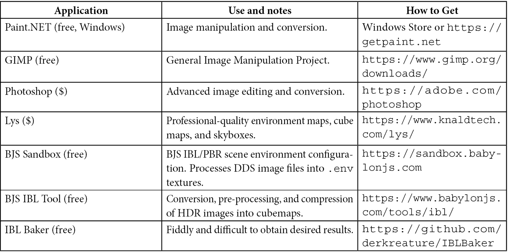
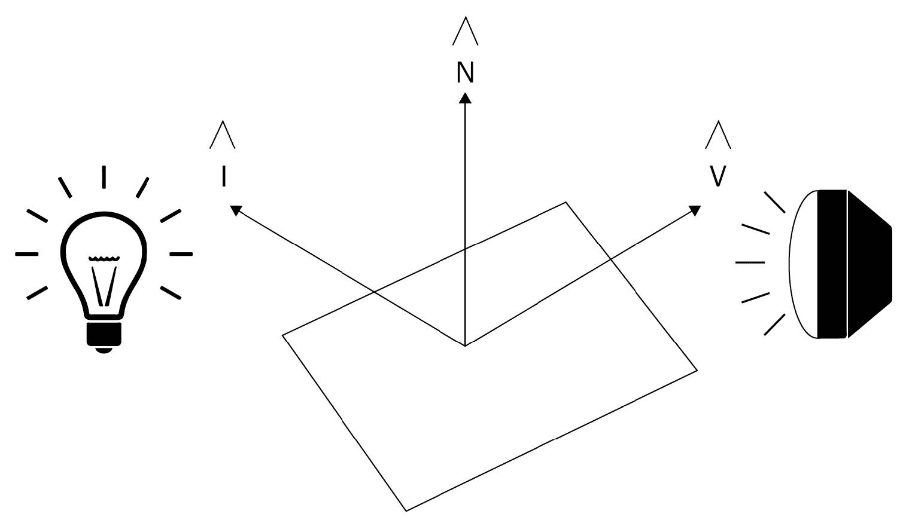
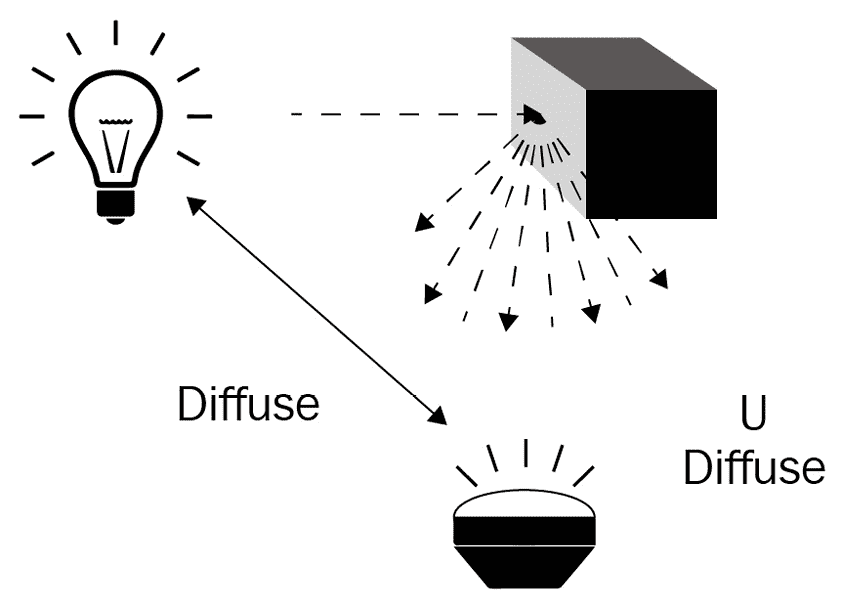
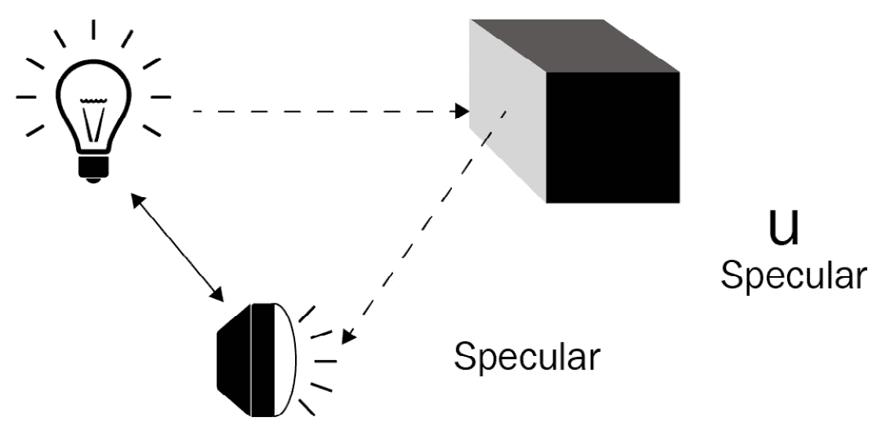
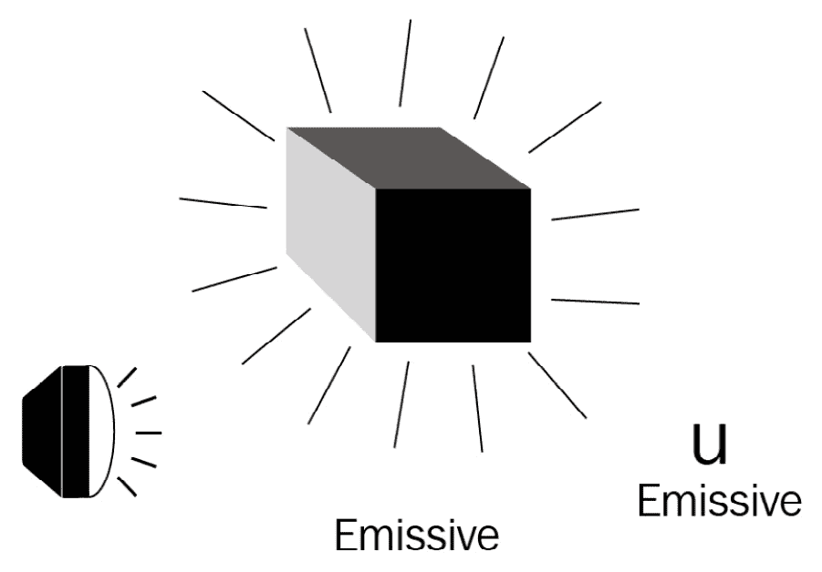
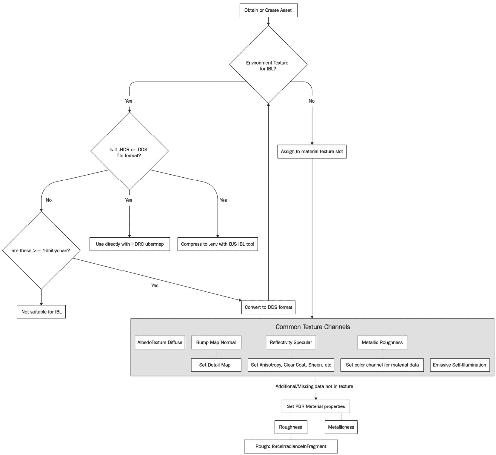
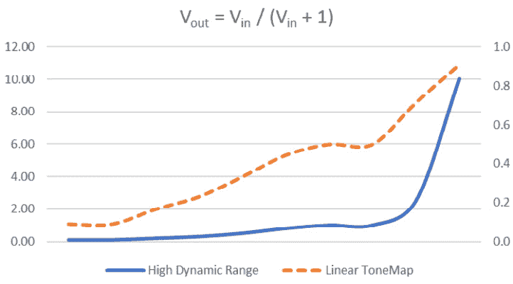
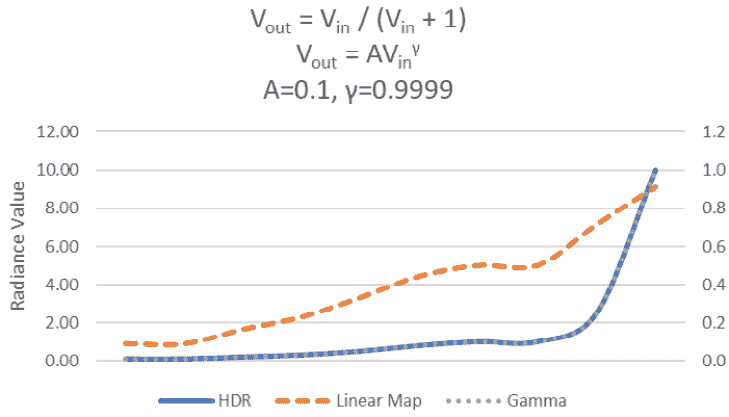
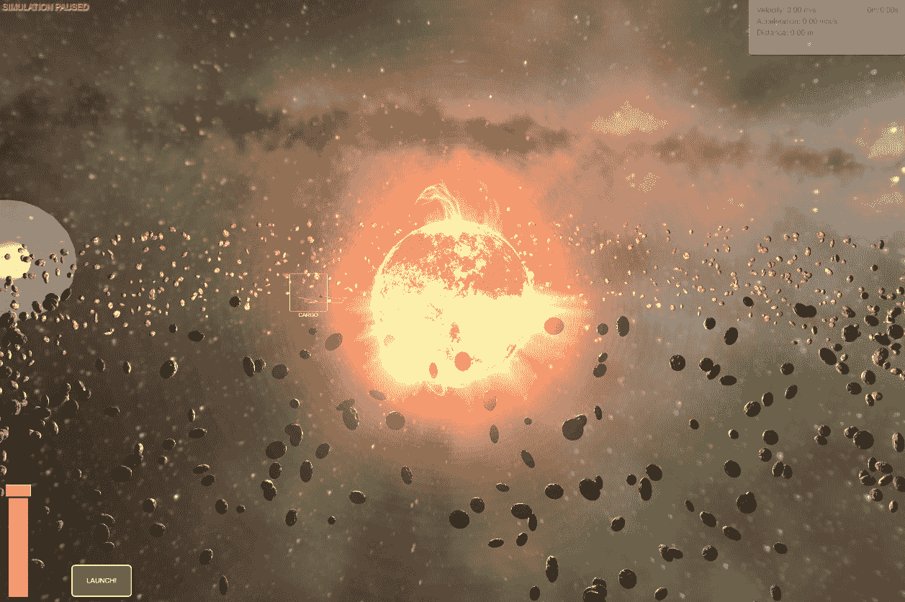

# 10

# 通过光照和材质改善环境

欢迎来到第十章！这一章由数字 5 带来了两次。Babylon.js v5 不仅带来了强大且快速的特性，还带来了一套新工具，以帮助处理游戏引擎可能从框架中请求的几乎所有领域。我们已经与其中的一些工具一起工作过，包括刚刚过去的这一章关于**GUI 编辑器**（**GUIE**）。之前，我们除了与**GUIE**和**Playground**一起工作外，还与**Inspector**中的**粒子编辑器**一起工作。但这还不是全部，远非如此。

在本章中，我们将介绍**IBL 工具包**和**沙盒**，一个巨人的阴影笼罩着我们。强大的**节点材质编辑器**（**NME**）将是下一章的主题，我们将利用这一章来为它做准备，通过提升我们对 3D 图形编程中一些重要主题的知识水平。

当谈到游戏或 3D 应用程序的图形体验时，光照可能是对场景整体外观和感觉贡献最大的单一因素。像我们之前或将要讨论的许多主题一样，关于这些主题有大量的更深入、更精心编写、更全面的文本库。因此，我们的目标将是提供一个基于实际使用场景的坚实基础，以阐述这些原则。无论希望实现什么样的视觉效果，当前实时 3D 渲染的最佳和最高效的光照技术是**基于图像的光照**（**IBL**），其中场景的主要光源，正如其名所示，是一种特别准备好的图像纹理。

注意

1993 年的电影《侏罗纪公园》开创了这项技术，作为捕捉现场光照以用于场景计算机生成元素的方法。

然而，这一章不仅仅关于光照。在场景中有意义地讨论光照而不涉及材质的概念是非常困难的。简单来说，**材质**是我们用来描述光线如何与表面交互的数学术语。这个定义中包含了很多内容，但像往常一样，Babylon.js 提供了一个捷径，即**PBRMaterial**。这有助于将数学中最复杂的部分——无论是这本书中还是你的代码中——隐藏在光鲜的抽象背后，而我们将负责知道需要设置哪些参数以及设置什么值。

在我们尝试从照明主题的火流中汲取知识之前，还有一些其他的事情需要我们处理。请确保查看*技术要求*部分，其中包含一些与本章主题相关的帖子、书籍和文章的链接。还有一个你可以用于 Scrabble 游戏或用来给你的朋友（他们不幸没有像你一样阅读这本书）留下深刻印象的时髦词汇列表，以及一个用于处理和准备图像以供项目使用的免费和付费软件列表。不要因为你的知识快速增长而感到内疚——当你阅读第一部分了解自上次访问代码库以来我们所做和改变的所有不同事情时，你会感到很高兴。

在本章中，我们将涵盖以下主题：

+   材料和照明以及 BRDF

+   使用 PBR 材料和 IBL 场景

+   色度映射和基本后期处理

# 技术要求

本章的源代码位于[`github.com/jelster/space-truckers/tree/ch10`](https://github.com/jelster/space-truckers/tree/ch10)的 ch10 目录中。虽然我们仍将查看一些 Playground 代码，但本章的大部分工作都在其他地方。对于处理图像和纹理，以下非详尽的工具列表将有助于准备和转换图像资产以供 Babylon.js 使用。

## 工具

以下工具将帮助你在本章中：



## 术语表（简略版）

以下是一些在本章或阅读其他关于 3D 照明和材料主题的资源时可能会遇到的常见缩写和术语列表。这远非完整，但可以作为扩展词汇的起点：

+   **直接绘制表面**（**DDS**）：一种用于存储高分辨率图像的文件格式。这包括 MIP 贴图。Babylon.js 支持所谓的“遗留”DX1 DDS 格式。

+   **MIP 贴图**：在某些 3D 图形领域被称为金字塔，MIP 贴图是一系列逐渐缩小、分辨率较低的原始图像的再现。这用于许多应用，如**细节级别**（**LOD**）和存储预计算的照明值。

+   **基于物理的渲染**（**PBR**）：这是一种模拟光线与某些表面材料相互作用后行为的技术。镜面/光泽度模型和粗糙度/金属度模型是两种方法。对于两个主要参数，分别有镜面/光泽和粗糙/金属的配对，其值在[0,1]范围内。

+   **基于图像的照明**（**IBL**）：一种场景照明的技术，它通过将图像的球形投影结合进来提供照明。

+   **天空盒**：一个内部纹理化的网格立方体，相机位于其中。这是通过使用一个特别布局的单个图像或六个单独的图像来实现的。位于立方体内部的相机将纹理视为非常遥远的地方。

+   **环境纹理**：这是一种特殊的纹理类型；它是“IBL”中的“I”。

+   **BRDF**：代表**双向反射分布函数**（发音类似于“Bird”），这是一个数学函数，它向整体渲染函数贡献项，该函数将反射角度与入射和出射光量相关联。

+   **渲染函数**：当实现时，这被称为渲染管线。这是一个用于计算 2D 像素最终屏幕颜色的数学函数，该像素描绘了 3D 场景的一部分。该像素的最终颜色值受许多不同因素的影响，例如光照或摄像机的位置。

+   **材质**：这是一个资产或代码组件，当应用于网格几何体时，定义了光线对网格的影响行为。

+   **亮度**：这是对给定单位面积内光量的测量。

+   **动态范围**：场景中最亮和最暗部分之间的比率。

+   **色调映射**：用于将 HDR 图像适配用于非 HDR 显示或媒介。

+   **色彩空间**：特定文件或图像格式可以表示的颜色范围。这通常以每通道字节数表示；例如，R8G8B8A8。

## 推荐阅读

在阅读本章之前、期间或之后，这里有一些资源链接，可以帮助你快速浏览。其中一些更侧重于概念方面，而文档链接则非常实用：

+   如维基百科所述的 BRDF：[`en.wikipedia.org/wiki/Bidirectional_reflectance_distribution_function`](https://en.wikipedia.org/wiki/Bidirectional_reflectance_distribution_function)

+   由获得奥斯卡奖的工程团队描述的 PBR BRDF，该团队在专业电影中率先采用该技术：[`www.pbr-book.org/`](https://www.pbr-book.org/)

+   官方 BJS 文档：

    +   设置 HDR 环境以与 PBR 一起使用：[`doc.babylonjs.com/divingDeeper/materials/using/HDREnvironment`](https://doc.babylonjs.com/divingDeeper/materials/using/HDREnvironment)

    +   所有那些你从未想过想要了解的关于**PBRMaterial**属性的知识：[`doc.babylonjs.com/divingDeeper/materials/using/masterPBR`](https://doc.babylonjs.com/divingDeeper/materials/using/masterPBR)

    +   不同反射和折射功能的突破：[`doc.babylonjs.com/divingDeeper/materials/using/reflectionTexture`](https://doc.babylonjs.com/divingDeeper/materials/using/reflectionTexture)

+   Babylon.js 用于建模金属粗糙度材料的 Khronos Foundation BRDF 参考实现：[`www.khronos.org/registry/glTF/specs/2.0/glTF-2.0.xhtml#appendix-b-brdf-implementation`](https://www.khronos.org/registry/glTF/specs/2.0/glTF-2.0.xhtml#appendix-b-brdf-implementation)

+   两个独立的硬核 BRDF 定义，以及适合科学或工程模型的现实 PBR 的示例实现：

    +   [`math.nist.gov/~FHunt/appearance/brdf.xhtml`](https://math.nist.gov/~FHunt/appearance/brdf.xhtml)

    +   [`developer.nvidia.com/gpugems/gpugems/part-iii-materials/chapter-18-spatial-brdfs`](https://developer.nvidia.com/gpugems/gpugems/part-iii-materials/chapter-18-spatial-brdfs)

+   对于教科书读者：《游戏和交互式应用必备数学》，第 3 版。范·赫特和毕晓普著。2016 年泰勒弗朗西斯集团。([`www.essentialmath.com`](https://www.essentialmath.com))

+   HDR 图像编码：[`www.anyhere.com/gward/hdrenc/hdr_encodings.xhtml`](http://www.anyhere.com/gward/hdrenc/hdr_encodings.xhtml)

# 材料和 BRDF

将 3D 场景比作现实世界的电影工作室场景是一个显而易见但很有用的类比。有些部分是显而易见的，比如场景和舞台、摄像机和灯光，而有些则不是。网格是演员和场景道具，而材料则是他们的服装。本节内容全部关于服装和灯光，但如果不深入探讨场景中光线建模的理论基础，讨论这两者都很难。

这一部分内容有点复杂，所以这里先快速浏览一下我们将要讨论的内容。首先，我们将涉猎一点符号数学和一些非常基础的微积分。接下来，我们将探讨光如何以不同的方式反射和与表面相互作用，以及它在 3D 中的建模或近似方法。这将为我们学习材料及其在高级数学中的关系提供一个坚实的基础。之后，我们将介绍 PBR 和环境，以结束我们的探索之旅。现在是时候深入研究了！

## 介绍 BRDF

光线以入射或反射的形式进行建模——用下标 i 和 r 表示——代表的是测量到的光线量，这些光线要么是照射到物体上（正在被反射），要么是从物体上发出的（从它反射出来）。这两个场景的术语是**辐射**，表示从物体反射出的光线，以及**辐照度**，表示入射光线的量。入射辐射和反射辐照度之间的比率是通过 BRDF 的一些推导来计算的：

如果你不是 3 级微积分或更高水平的专家，这个数学表达式看起来可能会让人害怕，但当我们用它的工作原理重新表述方程时，它并不像看起来那么糟糕。反射辐射的变化（dLr）取决于入射（Li）光线与表面法线（n）之间的角度——用于计算θ，输入值由(ωi, ωr)的组合表示。任何实现此功能的代码都必须满足三个重要的约束条件，以真实地模拟物理系统：

+   fr(ωi, ωr)的结果必须大于或等于零。

+   交换(ωi, ωr)的术语会产生相同的结果。这被称为互易性。

+   能量必须守恒。换句话说，进入特定区域的总辐射通量和从该区域发出的总辐射通量必须小于或等于一。

幸运的是，我们不必直接处理这个方程的实现，但了解驱动 Babylon.js 中高级抽象的底层力量是好的。在本节稍后，我们将探讨**PBRMaterial**参数如何影响底层 BRDF，但首先，我们将继续探索光照背后的理论和概念。

## 在 3D 应用程序中如何模拟光线

为了减少所需的光照计算的数量和复杂性，我们需要简化我们对光的处理方式。就我们的目的而言，光表现为从其源头发出的射线，然后以确定的方式从表面反射。在这些计算中，可能会有大量单个参数对结果有贡献，但核心中，只有少数参数包含对光照计算至关重要的术语：光方向（I）、辐射（L）、表面法线（n）和观察位置（V）。由于需要计算物体表面法线和入射点之间的角度，BRDF 对每个光源进行一次评估，对场景中的每个光样本进行一次评估：



图 10.1 – 参与光照计算的基参数。归一化向量 I 和 V 分别代表光的方向和观察者的方向，而归一化向量 n 指向表面法线的方向

归一化向量 I 指向光源，而向量 L（有时在方程中用ω表示）提供强度。当你将这些结合起来，你就得到了光在物体上每个颜色上的亮度（亮度）。不同的光源使用不同的方程来计算 I 和 L 的值。两个例子是点光源，它在所有方向上均匀辐射光，和聚光灯，它在单一方向上辐射光。这两种类型的光都能照亮物体，但它们的属性导致了表面交互中的不同行为。

注意

确保 I、N 和 V 向量被归一化，以保留变换后值之间的关系。最终值通过从 L 计算出的颜色或标量值进行缩放。

**辐射度**的质量是衡量每平方米面积上入射光量的度量，如果想要技术上精确的话。更通俗地说，辐射度是特定光源的亮度。与辐射度相辅相成的是颜色。从物理学的角度来看，颜色是由特定光包的波长定义的，或者是由光子包含的能量量。在计算上，颜色通常表示为 Vector3 或 Vector4 量，这取决于是否使用了 alpha 透明度通道。能够将颜色作为向量处理是一种非常有用的技术，因为整个向量计算工具箱就可以应用于混合和混合颜色。然而，在我们知道要执行哪些类型的计算之前，我们需要更多地了解反射光的类型。

### 散射

当光线达到观察位置时，它可以沿着几乎无限多种不同的路径组合到达。散射照明项指的是从物体表面均匀散射的光。另一种说法是，一束光线击中物体表面会向所有可能的方向散射散射光。散射的光会受到物体漫反射材料设置指定的颜色或从纹理查找的影响：



图 10.2 – 散射光向所有方向散射

### 镜面

照明模型中的镜面项表示从物体直接反射到观察者的光。根据该术语的值，这可以使物体具有“闪亮”的外观，近似于光滑或粗糙的表面。当入射光束、物体和观察者之间的角度接近 90 度时，镜面项会受到强烈影响：



图 10.3 – 镜面光直接被观察者反射

### 发射

与其他照明术语不同，发射项与外部光源无关，而是由物体本身产生的光。对于照明设计来说，重要的是它不会照亮场景中的其他物体。因此，发射照明有时被称为自发光：



图 10.4 – 发射照明或自发光只照亮物体本身

到目前为止，我们已经讨论了 Uem、Uspec 和 Udiffuse 术语的定义，但我们没有说明如何首先计算这些值，也没有说明如何组合这些值。如果你对此好奇，可以参考本章的“推荐阅读”部分，了解更多关于这些方程式细节的信息。我们将要讨论的最后一种照明项是环境光，这是最简单的照明形式之一。

### 环境光

当在 3D 应用程序的上下文中讨论环境光时，它指的是一类对表面有影响但路径并不直接来自光源的光照贡献者。一个直观的例子是多云无日照的日子。在这样的日子里，来自环境的光似乎来自每个方向；它是全方向的。阴影（即**环境遮挡**或**AO**）可以预先烘焙，制作简单且渲染速度快：

![Figure 10.5 – 环境光不依赖于方向，来自光源环境的间接照射。它通过场景中具有恒定值的单一颜色进行近似]

![Figure 10.05_B17866.jpg]

![Figure 10.5 – 环境光不依赖于方向，来自光源环境的间接照射。它通过场景中具有恒定值的单一颜色进行近似]

由于光线从光源到接收器经过物体表面的间接路径，我们通过为每个场景设置单一颜色来近似环境贡献。环境光没有方向，因此其亮度在整个场景中保持恒定。

定义光的基本特性和行为只是光照问题的一部分。问题的另一部分是表面材料特性，它决定了来自特定方向且具有给定视位置的入射光会发生什么。现代 3D 引擎和资产创建工具已经接受**材料**的概念作为定义物体表面在任何给定角度和点对光反应的手段。

## 材料和纹理

在概念层面上，一种材料是一种**BRDF**实现；材料包含一组数据与逻辑的组合，这些数据与逻辑被插入到整体图形管道的相关术语中（参见*第十一章*，*着色器的表面处理*，了解更多关于图形管道和着色器的内容），以可编程着色器、纹理和其他属性的形式存在。结合前几节的概念，我们将看到为什么使用术语**材料**来涵盖着色器和纹理的特定配置是有意义的，并介绍允许以**PBR**形式实现实时逼真光照场景的近似。

### 材料概述

在 Babylon.js 中，有两个基本的通用材质组件，以及一系列专门的组件库，允许您以非常少的努力添加酷炫和有趣的效果。例如，熔岩材质通过程序化模拟熔岩效果应用于网格，而毛皮材质则使网格看起来像毛茸茸的。您甚至可以使用 **VideoTexture** 将外部源的视频渲染到场景中！浏览 **Babylon.js 材质库** 并了解如何使用它们，请参阅[`doc.babylonjs.com/toolsAndResources/assetLibraries/materialsLibrary`](https://doc.babylonjs.com/toolsAndResources/assetLibraries/materialsLibrary)。

**标准材质**是 Babylon.js 中的工作马材料。一般来说，材质（例如，**标准材质**）将颜色、纹理属性和着色器分组，这有一个重要的性能影响：每个不同的材质都会在单独的调用中绘制到屏幕上。通常，通过减少绘制调用可以获得更好的性能，因此应避免创建特定材质的新实例，而应尽可能将现有实例分配给网格。**PBR 材质**是 Babylon.js 对 PBR（物理基础渲染）的实现，我们将在稍后详细讨论这一技术。

无论是使用标准材质还是 PBR，都取决于场景的需求。大多数情况下，正确设置的 **PBR 材质** 将比使用 **标准材质** 的材质具有更高的照片级真实感。这种真实感是以更高的计算成本为代价的。考虑到涉及到的更复杂的 BRDF，这并不总是最合理的选择。例如，在路线规划屏幕上对恒星（如太阳）的描绘应使用 **标准材质**，因为它通过发射光照自发光。**发射光照**并不一定与 PBR 过程相矛盾，但在太阳的例子中，任何 PBR 的视觉优势都丢失在发射的眩光中。

如前所述，材质是一个容器和包装器，用于资产和可执行逻辑。回顾更早的讨论，它负责在其 BRDF 中计算各种光照项。对于专用材质，**环境光**、**镜面光**、**发射光**和**漫反射**选项可能因材质类型而异，但对于 **标准材质** 和 **PBR 材质**，每个光照项都可以通过颜色或一组一个或多个不同的纹理图像来指定。

### 纹理和材质

为特定项设置颜色，例如漫反射项，会在该材质覆盖的每个网格上均匀引入该颜色。这可能适用于某些场景，但它会使场景看起来非常单调乏味。将纹理分配给不同的项是这里的方法，而且这也是复杂性开始显著增加的地方（好像它还不够复杂一样！）另一个使事情复杂化的因素是，你想要使用的纹理的选择和类型可能在 **StandardMaterial** 和 **PBRMaterial** 之间有所不同。

重要提示

你可能在 Babylon.js 的文档和 API 中注意到对 **PBRMetallicRoughnessMaterial** 和 **PBRSpecularGlossinessMaterial** 的提及。这些材质提供了快速从使用 **StandardMaterial** 转换到 **PBRMaterial** 的途径，几乎不需要费力，或者可以快速将 PBR 添加到场景中，但代价是对参数的精细控制。有关简化 PBRXXXMaterials 和通用 **PBRMaterial** 之间差异的更多信息，请参阅 [`doc.babylonjs.com/divingDeeper/materials/using/masterPBR#from-metallicroughness-to-pbrmaterial`](https://doc.babylonjs.com/divingDeeper/materials/using/masterPBR#from-metallicroughness-to-pbrmaterial)。

对纹理资产进行着色是 3D 图形设计的一个子技能，需要练习、耐心和以略微扭曲的方式观察世界的能力。如果一个网格的材质是它的服装，那么材质的纹理就是网格的上衣。网格为每个顶点定义了一个二维坐标集，通常称为 `(u,v)` 而不是 `(x,y)`。它是纹理上的一个 `[0,1]` 点，当采样时，定义了网格上该点的颜色。这种查找被称为使用 **纹理贴图**。

关于贴图的话题，想想如何将球形地球投影到一张平面上。尽管澳大利亚的面积大约是三倍，但格陵兰岛看起来大小相同。这是将球面表面映射到平面表面固有的扭曲，其明显程度在很大程度上取决于纹理创建时覆盖的几何形状。当我们介绍球形环境贴图时，我们将回到这个话题，但回到 **纹理贴图** 的话题，它在我们当前讨论中最相关的是查找方面。

提示

当查看 Babylon.js 的 **PBRMaterial** 时，**Albedo** 对 **Diffuse** 的作用就像 **Reflectivity** 对 **Specular** 的作用。可以为每个光照项设置颜色，作为纹理提供相同效果的替代或补充。

正如我们在之前关于 *如何模拟光线* 的讨论中看到的，照明不仅仅是根据纹理查找特定颜色并根据光源距离调整其强度。前面的 *提示* 给出了在材质之间转换基础纹理术语的类比，但通常在材质中会涉及不止一个纹理。

当额外的图像纹理与 `diffuseTexture` 中的 `albedoTexture` 或 `bumpTexture` 混合时。一个 **环境**（有时也称为 **遮挡**）纹理和其他光照因素，如 **表面法线 (N)**，不是常规纹理图像的一部分，而是作为包含在一个或多个单独纹理图像中的数据提供。大多数 3D 内容创建软件具有生成和创建这些替代类型纹理的不同能力，因此，大多数可以通过资产市场等途径获得的 3D 模型已经包含这些纹理。充分利用这些纹理的关键在于知道将哪些东西连接到哪些值，因此，在我们探讨如何提供这些参数之前，让我们先了解我们可以提供哪些参数！

### PBR 作为一种不同的 BRDF 类型

通过 **BRDF** 的“透镜”观察 **PBRMaterial**，尽管输出与任何其他 BRDF 的形状（即格式）相同，但到达这些值的方法却相当不同。这体现在一系列不同的参数上，这些参数控制着材料对光照行为的非常具体方面。以下是一个常用属性列表及其简要描述，按照它们在 Babylon.js 文档中的顺序排列，文档地址为 [`doc.babylonjs.com/divingDeeper/materials/using/masterPBR`](https://doc.babylonjs.com/divingDeeper/materials/using/masterPBR)。此页面包含许多 Playground 示例，展示了设置各种 PBR 属性的不同效果，这些效果在理解可用的选项时可能很有用：

+   **金属度**: 这影响镜面项并决定材料有多像导电或金属物质。

+   **粗糙度**: 这指定了表面的平滑程度。更平滑的表面将会有更尖锐的镜面高光（即，光亮的斑点）。

+   `#sub-surface`): 这是一类用于从肤色到半透明反射材料等物品中的属性。这特别适用于 Babylon.js v5.0 中的折射和半透明度。它还控制散射效果。

+   `#clear-coat`): 这用于描述材料最顶层表面与光照的相互作用。一辆光亮干净的抛光汽车在其实际漆色之上仅可见一层清漆层。

+   `#anisotropy`): 这用于塑造非对称反射（镜面高光）并且高度依赖于视角和入射角度。

可以在 **PBRMaterial** 上配置许多不同的参数和设置，因此值得退后一步看看 PBR 中包含的内容。

## PBR 和 IBL

从正式的角度来说，`useRoughnessFromMetallicTextureAlpha`和`useMetallnessFromMetallicTextureBlue`可以允许资产设计师以及开发者，在运行时提供材质数据时具有广泛的灵活性，从而在创意上更加高效。当内存和计算资源有限时，这一点至关重要——处理单个纹理远比处理三个单独的纹理要好。PBR 可以在场景中产生非常好的效果，但与 IBL 结合使用时效果更佳。

重要提示

尽管与**肠易激综合症**（**IBS**）的缩写有表面上的相似之处，但 IBL 与你的或任何人的肠道都没有关系。PBR 也是如此，以防需要澄清。

**IBL**是一种照明场景的技术，它从图像源中获取场景的主要光照信息。尽管可能仍然存在其他光源，例如**点光源**，但它们的存在是为了提供次要和/或补充照明。IBL 是 PBR 技术的一个明显不同的类别，但如果不使用可以利用它的 PBR 材质来设置 IBL 场景，那就没有太多意义！IBL 的工作方式是在渲染过程中，采样一个特别捕获和准备的**高动态范围**（**HDR**）图像——这是一个作为**立方体贴图**准备的图像——来提供 Li 值，而不是特定的光源。

## 环境纹理和反射纹理

使用 IBL 和 PBR 的一个好处是，在正确的设置下，那些原本复杂难以通过程序建模的事物，可以简单地从物理光照模拟中产生。以城市场景为例。

夜幕降临，黑暗的餐厅门口上方闪烁着霓虹灯。场景的中心是一个四岔路口，一辆汽车在那里发生了事故。挡风玻璃上的反射显示出周围的建筑，而破碎的玻璃窗片在霓虹灯招牌的廉价啤酒广告的闪烁中闪耀着。从破裂的消防栓中涌出的水流到街道上，在逐渐扩大的水坑的波纹面上，可以看到驾驶员卷曲的头发从安全气囊的两侧爆炸开来，她可见的眼睛似乎随着波纹的水坑而颤抖。多么丰富的描述啊！

在传统的或更准确地说，如今更传统的渲染方法中，前面段落中描述的几乎所有细节都需要为单一用途和目的定制制作和编码。使用 IBL 和 PBR 以及适当的纹理资产，可以让设计师创建和使用只有在你能在廉价黑色侦探小说中读到的那种细节的场景！IBL 设置的组成部分自然是图像部分。这个图像被称为**环境纹理**，正如之前提到的，它是为**PBRMaterial**实例提供光照信息的样本。

虽然当然可以为每个**PBRMaterial**指定一个单独的环境贴图，但通常在**Scene**上设置它更容易，我们将在下一节中更详细地了解如何完成这项任务，即*与 PBR 材料和 IBL 场景一起工作*。一个可能的环境纹理和材料的反射纹理可能不同的特定用例是汽车的倒车镜，它不仅显示了环境，还显示了场景中物体的反射——这是 IBL 和环境光照所无法做到的。

在这个场景中，一个常见的解决方案是使用**Reflection Probe**动态生成一个反射纹理。这是一种**Render Target Texture**（它本身是一种程序纹理），可以从指定位置的角度使用一系列渲染目标来跟踪，从而提供更新的环境贴图。Babylon.js 文档中包含了更多关于如何使用反射探针的详细信息：[`doc.babylonjs.com/divingDeeper/materials/using/reflectionTexture#dynamic-environment-maps-rendertargettexture-and-friends`](https://doc.babylonjs.com/divingDeeper/materials/using/reflectionTexture#dynamic-environment-maps-rendertargettexture-and-friends)。

在本节中，我们介绍了一系列新的概念，例如**BRDF**以及一些与模拟光照相关的参数和术语，从理解漫反射、镜面（反照率）、发射和环境光照源之间的区别开始。这为我们探索具有重点的 Babylon.js **PBRMaterial**这一材料概念奠定了基础。**PBRMaterial**实现了一种称为 PBR 的技术，它使用环境提供的照明信息，结合一系列材料属性，以逼真地模拟光线在粗糙和光滑、平滑和暗淡的表面上的行为。一旦我们了解了材料和光照，我们就探讨了如何使用**IBL**进一步增强渲染场景的真实感。

在下一节中，我们将理论付诸实践，了解使用之前讨论的概念所需的不同资产。在了解一些涉及的资产类型以及与之相关的文件和图像格式之后，我们将探讨制作这些资产所需的工具以及如何使用它们。

这是一个复杂的话题，所以如果你觉得还不是一切都很有意义，那么花点时间看看 Babylon.js 文档中列出的 Playground 示例是完全可以的。如果这一节对你来说主要是复习，那么你可能对这一章前面“推荐阅读”部分中链接的一些更高级主题感兴趣。

# 与 PBR 材料和 IBL 场景一起工作

**StandardMaterial**在能够使用各种类型的资产方面非常宽容。它不介意纹理是每像素 8 位、16 位还是 3 位，也不介意是 JPEG、GIF 还是 PNG – 它会用它来绘制网格。虽然这在**PBRMaterial**中也大致正确，因为它是一个健壮的组件，能够处理广泛的输入，但任何**PBRMaterial**的渲染外观对不足或不正确格式的纹理数据非常敏感。我们将探讨 Babylon.js PBR 实现的具体要求，以及有助于创建符合这些规范的资产的工具。稍后，我们将讨论启发式方法——一套指南——如何决定将哪些资产和值放入哪些属性中，以实现材料特定的外观。让我们首先检查一些表示数字图像的方法。 

## 图像格式和文件类型

位图是最简单的图像类型。名字已经说明了一切——它是一个按顺序排列的值数组（或映射），每个值代表图像中单个像素的单个通道（红色、绿色或蓝色）。当图像解压缩到（通常是 GPU）RAM 中时，结果是位图。由于每个像素都映射到内存中的不同位置，因此从图像中的任意位置查找值非常快。然而，当在磁盘上存储图像时，目标是优化文件大小，以牺牲计算速度为代价。

能够支持 HDR 图像的文件格式只有少数几种。两种流行的原生 HDRI 格式是**HDR**和**EXR**。RAW 图像格式尽可能接近数字相机的传感器捕获像素值，这意味着可能需要在不同的设备上进行校准以获得一致的结果。某些图像类型，如 TIFF，可以作为其他图像的容器，同样，一些格式提供了广泛的选择，例如**DDS**。尽管 GIF 和 JPEG 很受欢迎，但它们并不是能够表示**HDRI**的格式，尽管它们仍然能够显示看似 HDR 的图像。这是通过称为**色调映射**的过程实现的，我们将在探讨完为什么 JPEG 不是 HDRI 之后讨论它。为此，我们将涵盖位深度和动态范围。

## 位深度和动态范围

当思考图形及其显示方式时，将其分解为基本概念是有用的。图像的每个像素都有红色、绿色和蓝色颜色通道的值（某些图像可能还有一个用于透明度的额外 alpha 通道）。

如果我们使用一个字节（8 位）来表示每个通道，那么每个像素就有 24 或 32 位，这取决于是否存在专门的 alpha 通道。每个颜色通道只能取 0 到 255 之间的值，总共 65,536 种可能的独特颜色在**颜色空间**中。这听起来颜色很多——确实如此——但它远远低于人眼所能分辨的颜色范围。更重要的是，在显示技术的背景下，它无法在没有**色调映射**的情况下正确地表示 HDR。色调映射是将无限缩小到有限的过程，通过离散的步骤进行。

在零和一之间是无穷大，或者如果你使用 32 位浮点数来表示颜色通道，那么它就足够接近无穷大了。另一方面，1:256 这个更小且可计数的比例是 8 位通道中可能的全动态范围。要成为**高动态范围图像**（**HDRI**），图像需要能够使用 16 位或 32 位浮点数来表示红色、绿色和蓝色颜色通道。这总共是每像素 48/96 位，理论上可以实现 1:无穷大的动态范围。然而，实际上，这可能会占用相当大的空间——一个 4K 图像大约有 830 万个像素，以 96 bpp 计算，原始大小约为 800 MB！

但不仅如此。用于 PBR 和 IBL 的图像需要具有所谓的**米普贴图**，这些米普贴图可以在加载时生成，也可以预先烘焙到图像文件中。**米普贴图**是主纹理的较低分辨率版本，其使用方式类似于网格的**细节级别**（**LOD**），其中远离的对象使用更详细的纹理进行渲染，从而节省内存和渲染时间。就像自动 LOD 对网格起作用一样，Babylon.js 可以在加载纹理时生成米普贴图。

注意

几乎所有购买过现代 AAA 游戏下载版的人都知道，这些高质量的纹理伴随着高带宽和高磁盘使用成本。*使命召唤*系列的最后一部作品，*现代战争*，超过 175 GB！如果资产在压缩后都是这个大小，那么考虑一下纹理的大小，这将回答在游戏过程中那些 GB 的 RAM 都在做什么的问题。

一个艺术资产在图像查看器中看起来不错固然重要，但它的大小和格式必须正确，以确保它在整个图像中包含或保留完整的颜色和亮度范围。幸运的是，仅 Babylon.js 生态系统内就有一些可用的工具可以帮助完成这项任务。

## 用于 PBR 和 IBL 的资产的使用和创建

由于使用 PBR 和 IBL 消费和使用资产的方式多种多样，很难确定在哪里使用什么，以及为什么。专门为特定项目创建的资产最有可能带来最佳的整体效果，但同时也存在需要自己创建资产或购买或委托他人创建资产的技能和知识，或者需要购买资产的财务资源的固有困难。无论以何种方式获取纹理或其他资产，都需要更多决策来评估其适合性和与 Babylon.js 的兼容性。以下图表说明了您可以使用的高级别决策过程来评估给定的纹理资产，称为 IBL 中的“我”：



图 10.6 – 使用纹理和 IBL/PBR 的高级别评估流程。这是一个定性评估，而不是定量评估，因此其他因素，如纹理分辨率，仍然很重要进行评估

让我们逐一概述这些节点的亮点。请记住，资产是否适合与 PBR 和 IBL 一起使用并不一定意味着它是有用的。同时，考虑资产将被查看的上下文也很重要；一个仅在相机远处渲染的高分辨率纹理有什么好处？

### 获取资产

这一步是较为复杂且难以定义的步骤之一。获取适当的 3D 资产的过程将因几个基本因素而有很大差异：

+   获取专业图形艺术家的服务（以及他们工作所需的时间！）

+   从供应商处购买/获取资产包

+   自我创作能力 – 例如，自己制作所有内容

+   从多种来源混合组装资产

重要提示

无论您选择哪种方法或路径，在决定包含艺术资产之前，务必确保您有明确和免费的许可和权利使用该艺术资产。

如果您有资源，最好是聘请专业艺术家或艺术家团队，但这些人不免费绘画。准备好为他们的工作支付报酬。购买一套预制的资产通常几乎与定制资产一样好，但它们的优势在于几乎可以立即部署，代价是缺乏灵活性——任何更改或文件转换都由您负责。除非您是多面手——也就是说，在多个领域（如 Babylon.js 著名的创建者 **Deltakosh**）专业熟练，否则通常将时间和精力用于对资产的轻微编辑会更好。

重要提示

不要忽视浏览 Babylon.js 资产库——它包含许多非常实用的“基础”纹理和网格资产，这些资产已经准备好供您将其放入项目中！从 v5 版本开始，资产管理员是一个工具，可以直接将 BJS 资产的引用注入到游乐场中。您可以在[`doc.babylonjs.com/toolsAndResources/assetLibrarian`](https://doc.babylonjs.com/toolsAndResources/assetLibrarian)了解更多信息。

最后一个选项，按需资产合并，是其他三个选项的折中方案，因此基本上提供了每个选项的大部分缺点和少数优点。这个方法唯一的优势是其灵活性，这是无法被超越的。这是一种最低的共同分母，采用这种方法需要小心和努力，以提供应用程序的一致外观和感觉。作为这种方法的一个推论，总是存在通过代码程序设置材质属性的“逃生门”，而不使用纹理。

### 环境纹理、转换和压缩

要在 Babylon.js 中用作 PBR 的 HDRI，环境纹理必须以 HDR 格式。如果不是，则需要将其转换为 HDR 或 DDS 格式，如果它可以存储每个颜色通道的 16 位或 32 位浮点表示。从那时起，有几个选项，但从场景质量的角度来看，重要的是要确保图像已经准备为单个**等经线**或一系列**立方体贴图**图像。

在将世界平面的地图适应到球体上的过程中，环境贴图代表周围环境的球形或全景视图。作为使用球体的替代方案，也可以以相同的方式使用立方体，每个面的投影图像展开成六个单独的图像或图像部分。有关**立方体贴图**的更多信息，请参阅[`doc.babylonjs.com/divingDeeper/environment/skybox#about-skyboxes`](https://doc.babylonjs.com/divingDeeper/environment/skybox#about-skyboxes)。

重要提示

当环境纹理是立方体贴图时，HDR 渲染不可用，可能会出现接缝或其他视觉伪影。

如在*位深度和动态范围*部分所述，存储所有这些浮点图像数据需要很大的空间，这在处理基于 Web 的应用程序时可能非常重要。在应用程序中使用 DDS 或 HDR 图像（[`www.babylonjs.com/tools/ibl/`](https://www.babylonjs.com/tools/ibl/)）的最简单方法是在[Babylon.js IBL 工具](https://www.babylonjs.com/tools/ibl/)中使用。使用前面描述的作为等角图的准备好的图像将给出最佳结果，但这不是必需的。将你想要使用的图像文件拖放到页面中央面板，稍等片刻——你可能不会立即看到任何变化，因为处理图像可能需要一些时间，这取决于其大小和类型。一旦工具完成，将发生两件事：首先，图像将出现在页面上，准备就绪作为预览。其次，一个`.env`文件将被下载到你的电脑上。这个文件是源图像的压缩和预处理版本，通过文件大小的快速比较将显示出源文件和输出文件之间的*显著*差异——30 MB 可以轻松压缩到几百 KB！你可以在[`doc.babylonjs.com/divingDeeper/materials/using/HDREnvironment#what-is-a-env-tech-deep-dive`](https://doc.babylonjs.com/divingDeeper/materials/using/HDREnvironment#what-is-a-env-tech-deep-dive)了解更多关于 rle-RGBE 格式和允许实现这种压缩的额外预计算数据。

### 分配给材质纹理槽

*图 10.6*的非环境纹理部分展示了 Babylon.js **PBRMaterial**中一些更常用的纹理通道，以及在使用时需要注意的一些事项。例如，当使用纹理来定义材质的金属和/或粗糙度参数时，可能需要指定哪个颜色通道（R、G 或 B）包含相关数据值。

**PBRMaterial**的一些属性扩展成一组新的属性，其中许多可以接受纹理作为指定值的手段。清漆、次表面和细节图（等等）各自都有自己的一套参数和纹理，可以用来提高最终输出的质量，从而产生一个令人眼花缭乱的配置组合。不必担心试图理解并可视化每一个选项及其工作原理——在下一章中，我们将学习**节点材质编辑器**（**NME**）如何帮助理解这些选项。

在本节中，我们基于前几节建立的理论基础，学习 HDR 图像是如何在数字上表示和存储的。HDR 图像位于**线性色彩空间**（与**伽玛**或**sRGB**空间相对——也就是说，每个颜色通道使用多少位以及位的使用方式）中，并且每个颜色至少使用 16 位浮点数。大多数情况下，在标准动态范围图像中，线性颜色位于[0,1]的范围内。然而，HDRI 的范围在实用层面上可以从[0, ∞]变化。例如，一个包括晴朗天空中的太阳的场景的 HDRI 可能具有[0, 150000]的范围！

存储 HDR 图像的常用文件格式有几个，但与 Babylon.js 资产一起使用支持最好的是 HDR 和 DDS。环境纹理需要布局在球面表面的矩形投影上——即等角投影——或者作为一系列六个图像的立方体贴图。**Babylon.js IBL 工具**可以用来查看放置在其上的图像的细微细节，但更重要的是，它可以转换和压缩 HDR 或 DDS 图像，使其在网页上使用时的大小更加易于管理：ENV 文件格式。

大多数计算机显示器和打印技术无法渲染如此广泛的值范围——实际上，任何能够准确表示太阳亮度的显示器，对于观看者来说都会是一个极其热辣的体验。要在非 HDR 显示器上准确渲染 HDR 图像，必须将颜色值重新映射回[0,1]的范围。这个过程被称为**色调映射**，并且是完成场景展示的重要步骤之一，被称为**后期处理**。

# 色调映射和基本后期处理

虽然本节在色调映射和后期处理之间分为几个独立的子节，但从技术上来说，色调映射是一种后期处理。在本章的背景下，这是一个足够重要的主题，值得占用一些篇幅来解释。

后期处理是一个熟悉的概念，但可能用了一种不熟悉的语言。当你将猫耳朵叠加到 FaceTime、Zoom 或 Teams 通话中时，你正在使用后期处理。如果你选择 Instagram 滤镜，你也在使用后期处理。当你想在 TikTok 中给自己添加一个酷炫的运动模糊效果时，你也在使用后期处理。Babylon.js 内置了多种不同的内置效果，既有细微的也有明显的，为了避免你记住并创建最常见的后期处理效果，还有一个默认渲染管线，它将所有基本功能打包在一起，以即插即用的方式提供。

## 色调映射

正如我们在上一节中讨论的，将 HDR 图像渲染到非 HDR 显示介质上需要通过色调映射的过程，将每个像素颜色的值从可能的无穷大范围重新映射到一个明确的有限范围内。有几种不同的算法和方法可以实现这一点，但无论具体细节如何，任何色调映射都不可避免地需要做出妥协。

我们可以说，我们有一组数字 – [0.1, 0.1, 0.2, 0.3, 0.5, 0.8, 1.0, 1.0, 2.5, 10] – 我们需要将其重新映射到零和一之间的范围。以下是一个图表，显示了使用最简单的色调映射技术前后该系列的变化：



图 10.7 – 预色调映射和后色调映射结合辐射值与 HDR 值的图表。这种映射并不能完美地捕捉原始值的动态范围

前一个图表中的虚线显示了如何将实线所代表的范围压缩到图表的零和一之间。理想的映射应该尽可能地模仿实线 – 但在这个简单的线性映射中并非如此。这对于许多应用来说是足够的，但其他映射函数可以使我们更接近匹配曲线。伽玛校正函数使用两个常数，A 和γ，这些常数必须单独计算或手动确定，以便以更接近原始曲线的方式映射值：



图 10.8 – 使用伽玛校正的色调映射产生几乎与原始图像无法区分的曲线。两个常数的值必须分别确定

当提供适当的常数 A 和伽玛的值时，虚线与原始 HDR 亮度曲线完美重叠。这种技术的缺点是，这些常数可能会因显示设备、操作系统和其他潜在变量而有所不同。幸运的是，Babylon.js 在它的内置图像处理和后处理功能中为你完成了色调映射的所有工作。

## 后处理和渲染管线

假设阅读这篇文章的任何人熟悉实时相机滤镜的概念。只需切换一下开关，你的照片就会变成老式照片，再切换一下，它就会变成漫画书海报，这一切都在实时进行。如果你曾经好奇过这类事物是如何工作的，那么从后处理开始是个不错的选择！将后处理想象成是实时 Photoshop，用于你的场景。在游戏中，一些更明显的后处理包括雨或雪的落下、屏幕震动以及始终经典的“醉酒踉跄”效果。

在 Babylon.js 中，有几种不同的方式来实现、导入和使用后处理，但所有后处理效果的工作方式都是一样的：它们从纹理开始。这种纹理在帧的开始就像一个装裱的空白画布；空白处的颜色是场景的清除颜色。如果数字渲染过程中的每个阶段都像是在画布上手动渲染油漆的步骤，那么我们感兴趣的帧渲染管道中的时间点就是油漆已经铺在画布上但尚未干燥和固定的部分。这个纹理是将场景的所有几何形状转换成相对于摄像机的位置，然后转换到 2D 屏幕空间的结果。后处理处理的是这个纹理的单独像素，而不是场景的几何形状。Babylon.js 有几个现成的**PostProcessRenderingPipelines**和**PostProcesses**，可以通过一行或两行代码添加。在下一章中，我们将探讨如何创建后处理以及实现这一点的两种不同方法。让我们不要让下一章抢了本章的风头，继续探讨更多内置的后处理功能，比如体积光散射——也就是“上帝之光”。

### 添加体积光散射后处理效果

让我们看看在路线规划屏幕上使用内置后处理的一个简单而具体的例子。当一个强烈的光源位于物体和观察者后面时，以斜角击中物体的光线可能会散射，从而产生一种独特的眩光效果，使太阳看起来更加明亮！这种效果被称为体积光散射（也称为“上帝之光”），使用起来非常简单，你甚至不需要知道它是如何工作的。以下是需要的两行代码（为了清晰起见，分多行显示）：

```js

var godrays = new VolumetricLightScatteringPostProcess(
    'godrays', 1.0, this.scene.activeCamera,
    this.mesh, 100, Texture.BILINEAR_SAMPLINGMODE,
    this.scene.getEngine(), false, this.scene);
godrays._volumetricLightScatteringRTT.renderParticles =
  true;
```

这些行代码被添加到`Star.mesh`球体上，使用活动相机进行渲染。最后一行设置了一个内部属性，指示在后期处理中使用的内部**渲染目标纹理**将粒子渲染到效果中。

以下截图展示了应用此后处理的效果。相当大的改进：

![图 10.9 – 通过后处理添加的体积光散射效果，给路线规划屏幕上的明亮阳光造成了相机眩光的效果]



图 10.9 – 通过后处理添加的体积光散射效果，给路线规划屏幕上明亮的太阳造成的相机眩光感

Babylon.js 除了 VLSPP 之外，还提供了多种开箱即用的后处理效果，其中大部分同样易于使用。如果这些都不符合您的需求，您始终可以选择以多种形式创建自己的后处理效果，我们将在下一章中介绍。就当前主题而言，我们将探讨如何通过默认渲染管线后处理，用一小段代码就能获得大量渲染质量提升。

### 默认渲染管线

与前文相比，这个说法并不那么冗长，但**默认渲染管线**通过其可爱且实用的效果组合来弥补这一点。一个勤奋浏览视频游戏图形设置菜单的浏览器（谁不是呢？）会认出构成这个**渲染管线**的许多后处理效果。管线中包括与材质级别上可用的相同**图像处理**效果，但还有其他一些，如 Bloom、胶片颗粒、FXAA 等！每个效果都提供了合理的默认设置，但了解这些设置很重要，以便可以根据具体情况进行调整。BJS 游乐场在[`playground.babylonjs.com/#Y3C0HQ#146`](https://playground.babylonjs.com/%23Y3C0HQ%23146)是来自 Babylon.js 文档页面的默认渲染管线的完整示例——它有一个交互式用户界面，允许您快速更改参数或启用/禁用后处理并查看其效果。玩一玩这个示例，以了解不同类型的效果及其设置如何仅通过少量调整就能完全改变场景的外观和感觉！使用这个渲染管线是获得高质量图像的基本筹码；这是一个良好的起点。

应用或游戏的外观和感觉的演变不可避免地包括添加其他独特的后期处理和效果组合。这就是使游戏或应用程序与其他游戏或应用程序区别开来的原因，这也是艺术和美学有很多空间的地方。在本节中，我们讨论了**色调映射**如何将高动态范围图像或场景“转换”为显示器能够渲染的范围。由于在执行色调映射时需要做出一些妥协，因此存在不同类型的色调映射算法，这导致了输出中不同的视觉差异。我们学习了色调映射如何作为基于材料或基于像素的图像处理效果的一部分融入后期处理管道。这些效果具有共同的配置，并包括除色调映射之外的一些调整。其他后期处理效果包含在默认渲染管道中的图像处理效果中。这些效果包括 FXAA、光晕、胶片颗粒等。

# 摘要

这章可能感觉要么非常长，要么非常短，要么非常无聊，这取决于你现有的知识和经验。现实世界中光的行为极其复杂，因此在场景中模拟它时，有必要对该行为进行简化和假设。

从光源到目标材料的射线旅行中，光是通过某种**双向反射分布函数**（**BRDF**）的实现来建模的。此函数计算从光源在给定输入点和角度处的（非）辐射或亮度。该函数有一组术语，每个术语都在单独的函数中计算，然后组合以提供结果。

漫反射项（也称为反照率）负责解释从材料表面均匀散射的光，有点像点光源均匀地向所有方向投射光。镜面反射是指从材料直接反射到相机或观察者那里的光，它具有明亮、可能尖锐的轮廓。镜面反射光的具体贡献很大程度上取决于材料的特性；金属、光滑的表面比粗糙、非金属的表面更能一致地反射光。发射光也称为自发光，因为它没有光源作为起点，并且它不会影响其他材料的照明。最后，环境光照是一个总称，用于任何从其源头间接到达相机的光照类型。大气散射是环境光照源的一个例子。

描述光线在网格上行为的不同质量和属性被分组到称为材质的组件中。材质实现了各种关键功能，这些功能被用于 BRDF（双向反射分布函数）。Babylon.js 的**StandardMaterial**满足大多数基本的场景需求，这些需求不需要进行逼真的渲染，而**PBRMaterial**提供了一个**基于物理的渲染**（**PBR**）BRDF 实现，该实现紧密模拟了不同表面类型（从粗糙到光滑，从光亮到暗淡）的真实世界行为。

为了使 PBR（基于物理的渲染）有效地工作，场景的环境需要提供必要的光照信息。**基于图像的照明**（**IBL**）是一种技术，在渲染时对一种特殊类型的图像进行采样，以提供关于场景在当前相机位置和视角下的光照信息。使这种图像类型特殊的是，它使用 16 位或 32 位浮点数来表示每个颜色通道（红色、绿色、蓝色，有时还有 Alpha）的图像数据。用更多的位来表示一个数字意味着，从实用角度来看，场景中最亮和最暗区域之间的亮度比或范围可以有效地是无限的。这正是定义并允许捕获和存储 HDR 照片或图像的原因。

这种纹理被称为**环境纹理**，但在天空盒的上下文中，它以**反射纹理**的形式出现；两者使用相同的纹理执行相同的任务，但采用不同的方法。静态场景的环境或反射纹理可以通过几种方式预先生成。它们可以使用 Blender 或 Maya 等 3DCC 工具从现有场景中“烘焙”出来，它们可以被配置适当的相机从渲染输出中捕获，或者它们可以使用 GIMP 或 Photoshop 等工具从现有图像中手动准备。这些方法将无法考虑到场景的网格及其属性，因此可以使用如反射探针这样的动态方法来实时生成反射纹理。

一旦你获得了 HDR 图像，关于下一步要做什么有几个选择。DDS 和 HDR 图像的文件大小可能相当大，因此，Babylon.js IBL 工具是转换图像为 ENV 格式以在 Babylon.js 场景中使用的地方。在**PBRMaterial**上有几个不同的参数和纹理槽可供分配，但通过 BJS 文档、Playground 示例，当然还有这本书，你应该有足够的装备来探索它们！

一旦场景在 GPU 上渲染完成，并不一定立即传递到显示设备。**后处理**以一系列管道的形式被采用，允许场景相机的输出依次以不同的方式进行处理。内置的**图像处理**提供了许多常见的图像校正和调整，这些你可能从智能手机的图片编辑软件中熟悉，但还有其他后处理可供选择，这些后处理只受限于 RAM 和想象力。

当与 PBR/HDR 场景一起工作时，最重要的后处理之一是**色调映射**。这是一个数学运算，将无法由大多数显示设备表示的**高动态范围**转换为标准范围的颜色和亮度。因为这涉及到将可能无限（或至少非常大）的空间压缩到一个更有限的空间，所以会有一些保真度和准确性的损失。因此，有不同算法用于执行此映射，这些算法强调亮度或颜色曲线的不同区域。

在下一章中，我们将深入探讨一个硬核主题——着色器。Babylon.js 有许多方式允许开发者编写、管理和应用标准 GLSL 代码。这意味着什么以及着色器是什么将在稍后定义，所以系好安全带——下一章将是一次疯狂的旅程！

# 扩展主题

没有比尝试从未知领域雕刻熟悉的东西更好的方式来学习新事物了。同时，确定最佳切割位置和内容可能很困难。以下是一些想法、练习和例子，可能为你提供一个良好的起点：

+   使用你现实世界中的一个例子，创建该例子的环境的逼真再现：

    +   使用你的智能手机或设备上的相机捕捉周围立方体或球面贴图纹理，以尽可能高的质量。

    +   将图片导入到图像编辑工具中，调整图片以使其具有高动态范围（确保以 32 位 RGBA 格式保存！）。

    +   将 HDR 图像导出为 DDS 格式，然后使用 BJS 纹理工具将其转换为 ENV 文件。

    +   创建一个使用你环境的 PG，并通过将一些网格放入环境中来测试它。确保配置并给他们一个**PBR 材质**！

+   天空盒不必与场景的环境（反射）纹理共享相同的纹理。通过修改 Space-Truckers 路线规划场景以使用高质量的压缩 ENV 文件的天空盒来演示这一点。

+   使用静态背景环境进行反射并不意味着场景不能即时创建一个对场景动态的反射纹理。使驾驶阶段的路线网格闪亮并具有反射性，然后使用反射探头（有关如何使用它们，请参阅[`doc.babylonjs.com/divingDeeper/environment/reflectionProbes`](https://doc.babylonjs.com/divingDeeper/environment/reflectionProbes)）使 Space-Road 的表面反射卡车经过时的图像。

+   一些系统可以处理后期处理增加的负载，但其他系统（尤其是移动设备）可能无法维持一个令人满意的帧率。允许 Space-Truckers 的最终用户启用后期处理并调整变量。稍后，这可以连接到设置对话框，或者可能链接到场景优化（有关更多详细信息，请参阅*第十二章*，*测量和优化性能*）。

# 第三部分：走得更远

书的最后一部分是我们将开发的游戏从粗糙的演示转变为完整的应用程序。作为额外奖励，最后一章包含了一系列未在其他文本中讨论的不同主题。嘉宾贡献者为 Babylon.js 世界中的其他感兴趣的主题提供了额外的背景和细节。

本节包含以下章节：

+   *第十一章*，*探索着色器表面*

+   *第十二章*，*测量和优化性能*

+   *第十三章*，*将应用程序转换为 PWA*

+   *第十四章*，*扩展主题，扩展*
