# 探索着色器的表面

泰坦尼克号前船长爱德华·J·史密斯无疑会是第一个承认冰山可见表面只是巨大物体一小部分的船长。当用作类比时，短语“冰山一角”通常被理解为可见的并不代表整个事物。

注意

上述对爱德华·史密斯船长的奇怪具体提及，是 Trivia Night（知识之夜）上一个极好的随机事实。

同样，探索一个主题的表面会唤起孩子们试图挖洞到达地球另一侧的意象。与一个按比例的地球仪并置，它暗示了挖掘者任务的浩大。这绝不是减少了孩子们从他们荒唐的冒险中获得的乐趣，但通过描绘地壳、地幔和核心的不同层，它承认一项严肃的尝试不仅是在更大规模上做现有的事情。

前一段落几乎可以直接出自一本自助书籍，它试图用类比重重打击读者的头脑，但它确实准确地描述了本章的主题。从广义上讲，本章的主题是着色器和 GPU 编程，重点是工具以及如何使用这些工具来服务于这一主题。这使我们面临一个像之前遇到的问题一样的问题：当我们查看输入和控制系统时（*第五章**，添加场景和输入处理*）。如您所忆，问题在于要获得对这一主题的深入理解所需的材料量，需要一本自己的书来适当涵盖它！

与之前的情况一样，我们将尽可能涵盖基础知识，同时为你在学习这一主题时决定采取的任何下一步学习打下基础。这意味着可能会有一些东西没有得到太多空间，但（希望）由可用的优秀链接和资源来弥补。

本章我们将涵盖以下主题：

+   理解着色器概念

+   在 Babylon.js 中编写和使用着色器

+   使用节点材质编辑器进行着色器编程

这只是可能涵盖主题的一小部分，但到本章结束时，你将了解足够多的知识，可以立即在当前项目中发挥作用，同时也有足够的根基来了解你下一步学习的方向。

# 技术要求

本章的技术要求与之前相同；然而，有一些主题和领域可能有用，需要复习或补充：

+   **向量数学运算**：这包括加法、减法、点积、叉积和其他运算。你不需要执行计算或记住任何方程，但了解它们的含义或目的（例如，你可以使用向量减法来找到两个对象之间的方向）是使知识有用的关键。

+   **函数图像**：Windows 和 macOS 都内置或提供免费的可用图形计算器，可以绘制输入的方程图。这在理解不同输入下片段代码的输出非常有用。图形绘制就像使用 TI-89 一样！仅在线选项是 Desmos 图形计算器，位于 [`www.desmos.com/calculator`](https://www.desmos.com/calculator)。

# 理解着色器概念

在独立 GPU 变得普遍之前的日子里，将像素绘制到屏幕上的方式与今天大不相同。现在的孩子们根本不知道可编程着色器让事情变得有多好！当时，你会直接将像素颜色值写入内存中的一个缓冲区，这个缓冲区将成为发送到显示器的下一帧。专用图形处理器作为附加组件的出现和普及始于 1990 年代末，这彻底改变了整个行业。显示像素的访问被抽象为两个主要的 **应用程序编程接口**（**API**）：DirectX 和 OpenGL。这些接口的演变有着极其丰富的历史，但这本书不是关于图形硬件接口及其历史的书籍——这是一本关于当前 3D 图形开发的书籍，所以我们只需将细节留给那些专著，并简要总结它们。

为了避免开发者和最终用户软件需要支持每种型号和品牌的显卡，开发了一套 API，硬件制造商可以据此实现。两个竞争标准应运而生——DirectX 和 OpenGL——在接下来的十年左右的时间里，随着每个标准试图适应和改变快速发展的图形技术格局，随之而来的是一系列的戏剧性事件。我们将通过查看着色器本身来结束本节，这需要我们理解着色器如何与计算机硬件和软件的其余部分相关联。然而，在我们能够理解这一方面之前，我们需要了解为什么一开始就需要做出这些类型的区分。

## **GPU 与 CPU 的区别**

图形处理器并不是以与常规 CPU 相同的方式构建的。在基本的硬件层面上，图形处理器是围绕快速执行某些类型任务而构建的。这意味着应用程序需要包含专门的代码，以充分利用这些能力。与为网站的前端或后端编写的代码不同，那里的代码是顺序执行的，一条指令接着另一条指令，GPU 希望尽可能并行执行尽可能多的操作。然而，这并不是描述 GPU 编程方式与我们的先前经验和直觉不同的一个很有启发性的方式。一个更好的类比可能是考虑一位画家如何将一幅大型壁画绘制到墙上，正如*图 11.1*所示。

就像人们熟悉的消费级打印程序一样，大多数打印都是由称为光栅化的过程完成的 – 打印头扫描纸张，在特定的时间和地点喷洒特定颜色的墨水，并将其放置在打印颜色图案的对应位置。这样，图片就是从一角到另一角，逐行、逐像素地逐渐构建起来的。我们的画家以类似的方式工作，从画作的某一部分开始，一块一块地构建壁画：

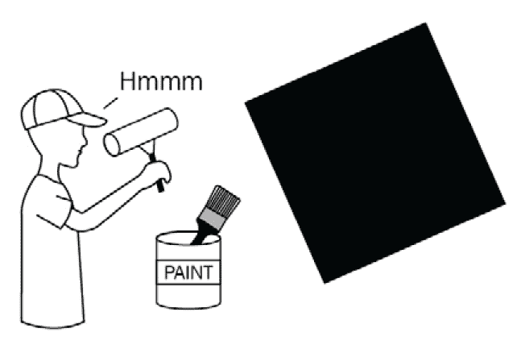

图 11.1 – 传统计算的类比是一位画家自己完成整个肖像，这类似于 CPU 处理指令的方式

与我们那位作为 CPU 的孤独画家相比，图形处理器放弃了光栅化过程，转而采用更分散的散弹射击方法来绘制图像。在这里，数千名画家都被分配去处理同一幅画的不同小部分。没有任何一个“画家”了解他们的同伴在做什么；他们只是按照指令来绘制他们的小部分画面：

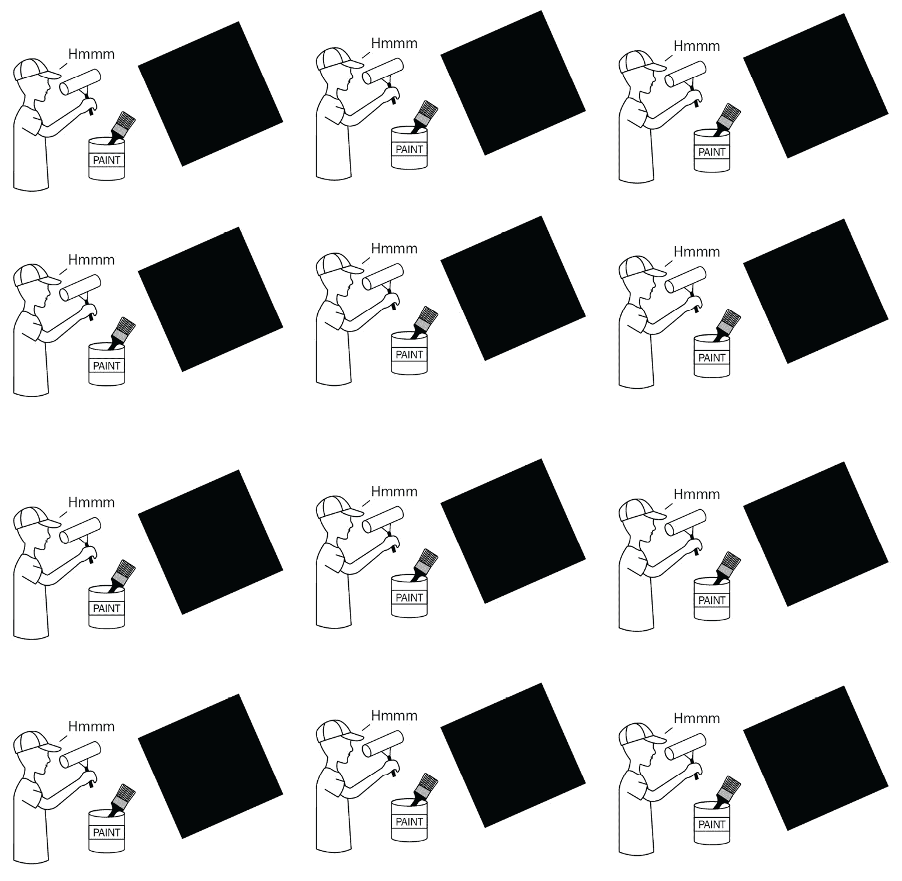

图 11.2 – 图形卡同时执行指令，每个“画家”只得到一小部分完整画布来工作，并且对其他画家一无所知

正是通过这种方式，图形卡可以处理每秒数亿次的计算，以驱动现代 3D 图形应用程序和游戏。正如前面的图表所暗示的，不是只有一个画家（处理器）有系统地铺下每一笔和每一层颜料，直到画面完成，而是一群画家各自执行相同的指令集，但数据完全特定于他们自己的画布部分。

## 着色器是 GPU 应用程序

应用程序如何利用这种处理方式？更重要的是，开发者如何编写利用这种大规模并行处理资源的代码？要全面且恰当地回答这些问题，需要（再次）一本完整的书。本章的“扩展主题”部分包含了几本这样的优秀著作！我们将历史背景、基本概念和艰难的数学留给更值得的声音，而将重点放在编写指令的更实际方面，这些指令以图形卡程序的形式，更常见地被称为着色器，交给那些成千上万的画家。

在图形渲染过程中，我们从场景中的各种数据开始，例如几何形状、光照和材质，并以屏幕上显示的帧结束。这个结果包括像素及其颜色，屏幕上每个显示点的像素/颜色组合。在场景和屏幕之间，有几个重要的步骤，但在高层次上，这是渲染管线：

![图 11.3 – 简化的渲染管线。以场景作为初始输入，依次执行的着色器程序将场景几何形状转换为像素位置，然后最终将像素位置转换为颜色]

![img/Figure_11.03_B17266.jpg]

图 11.3 – 简化的渲染管线。以场景作为初始输入，依次执行的着色器程序将场景几何形状转换为像素位置，然后最终将像素位置转换为颜色

管道中的每一步都接收来自前一步输出的输入。我们感兴趣的每个步骤的特定逻辑由一个单独的着色器程序处理和表示。然而，请记住，在这个上下文中，一个单独的着色器程序是一段将以大规模并行方式执行，与屏幕或场景的每个部分相关的数据作为输入，以及它们输出的处理等效物。

## 关于着色器

如前所述，着色器是一种在 GPU 上运行的可执行程序。着色器程序提供一组常量，或称为统一变量，这些变量包含着色器可以使用的输入数据。着色器还可以引用纹理作为采样输入 – 我们将在本章后面利用这一强大功能。一些常见的统一变量示例包括动画时间乘数、向量位置或颜色，以及其他对向着色器提供配置数据有用的数据。给定着色器的输出各不相同；对于一个顶点着色器，输出是在顶点级别从世界空间到屏幕空间的给定几何投影。片段着色器的输出则完全不同 – 它是一个像素颜色值。更高级的是**WebGPU 计算着色器**，其输出可以是任意的 – 本章后面我们将更详细地探讨这一点！

我们在这里将要处理的着色器程序类型分为两大类：**顶点**和**片段**。尽管它们被作为独立的事物引入，但它们通常包含并定义在相同的着色器代码中。目前编写着色器程序使用的两种主要语言是：**硬件光照和着色语言**（**HLSL**）和**OpenGL 着色语言**（**GLSL**）。第一种，**HLSL**，被微软 DirectX 图形 API 使用。我们不会在 HLSL 上花费任何时间，因为**WebGL**、**WebGL2**和**WebGPU**（有一个注意事项；见以下*注意*）都使用第二种语言，**GLSL**。由于 Babylon.js 建立在 WebGL/2/GPU 平台上，因此我们将重点关注我们的简要概述中的 GLSL。

注意

**WebGPU**使用 GLSL 的一个变体，称为**wGLSL**，但由于 Babylon.js 非常注重保持向后兼容性，您可以选择使用 wGLSL 或继续用常规 GLSL 编写着色器——无论哪种方式，您都可以通过 Babylon.js 转换着色器代码的方式继续使用 WebGPU。有关 wGLSL 和 Babylon.js 转换功能的更多信息，请参阅[`doc.babylonjs.com/advanced_topics/webGPU/webGPUWGSL`](https://doc.babylonjs.com/advanced_topics/webGPU/webGPUWGSL)。

HLSL 和 GLSL 在语法风格上与 C/C++编程语言家族相关，尽管 JavaScript 是一种更高级的语言，但对于熟悉它的人来说，应该有足够熟悉的概念，以便为学习 GLSL 打下良好的基础。从 JavaScript 开始，最重要的是记住，与 JS 不同，GLSL 是强类型的，并且不喜欢自己推断变量和此类数据的类型。还有其他需要注意的怪癖，例如，当浮点变量被设置为整数值时，需要给数字添加一个`.`后缀。这很好地过渡到更多地讨论着色器程序与其他软件程序的不同之处。

作为一类软件，着色器有几个独特的特性：

+   它们是无状态的。因为一个特定的图形处理器（一个图形卡可能有数千或数百万个可用）可能在这一刻被分配渲染 Instagram 图片的任务，它同样可能在下一次渲染电子邮件或文本文档。着色器所需的所有数据，无论是纹理、常量还是统一变量，都必须在着色器内部定义或在运行时传递给它。

+   没有访问共享状态或线程数据的能力——每个进程独立运行，执行时对其邻居一无所知。

+   着色器代码是针对整个视图或屏幕空间编写的，但给每个实例提供的指令必须以这种方式制定，即每个实例都得到相同的方向，但产生所需的个别结果。

在前两个项目之间，第三个项目的产生是着色器获得令人难以置信的难度声誉的起源。就像所有事情一样，编写着色器代码需要练习。最终，随着练习的深入，它将变得越来越容易，你将能够轻松地进入着色器思维模式，解决越来越复杂和困难的问题；你很快就会想知道所有这些喧嚣究竟是为了什么！在下一节中，你将了解将自定义着色器融入项目的几种不同方法。再次提醒，如果这超出了你的舒适区，不要过于担心下一节——让它慢慢渗透。我们在这里讨论的概念将在我们学习如何使用 **节点材质编辑器**（**NME**）来编写着色器代码时变得非常有用，而你则可以专注于你想要完成的工作。

# 在 Babylon.js 中编写和使用着色器

由于着色器是用纯文本定义的，因此在项目中存储和加载着色器有众多不同的方法。在学习了一些关于着色器代码结构的知识之后，我们将回顾一些实现这一目标的方法。**创建您的自己的着色器**（**CYOS**）工具是 Babylon.js 操场（Babylon.js Playground）的着色器版本，并且是编写 Babylon.js 着色器代码的一种方式。访问 **CYOS** 网址 [`cyos.babylonjs.com`](https://cyos.babylonjs.com) 可以在左侧面板看到着色器代码，并在右侧实时预览输出结果：

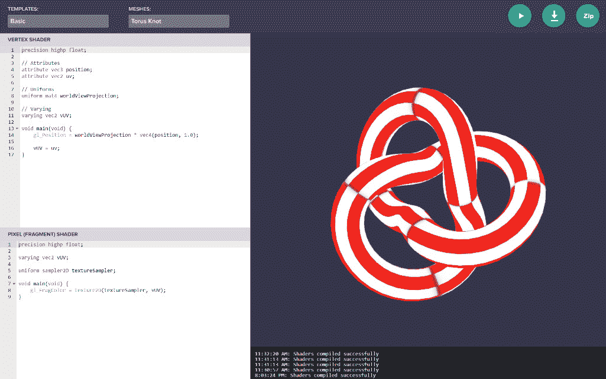

图 11.4 – Babylon.js 创建您的自己的着色器工具的功能与 BJS 操场类似

在前面的屏幕截图中，你可以看到在左侧面板中定义了顶点和片段着色器的着色器代码，而实时预览显示在右侧。可以从下拉菜单中选择起始模板，以及用于预览的不同网格。

就像操场一样，您可以将您的作品保存到片段服务器，或者下载一个包含嵌入模板 HTML 文件的着色器代码的 ZIP 文件。同样，就像 PG 一样，播放按钮会实时编译并运行您的着色器程序的结果。这就是工具的整体机制和用法。现在，让我们看看它是如何融入我们所学到的不同类型着色器的知识中的。

## 片段着色器和顶点着色器

让我们提醒自己，顶部的部分，如 `constructor` 函数等，着色器程序至少需要为 `void main(void)` 函数提供一个定义，因为这是由 GPU 执行的函数。在主函数之外，子程序或辅助函数通常被用来封装和隔离代码，就像你可能会对任何其他编写良好的代码所做的那样。着色器的输入在顶部指定，与其他声明一起。根据着色器的类型和定义方式，可能会有几个不同的任意声明，但始终提供的是 `position` 和 `uv` 属性声明。前者是 **Vector3**，而后者是 **Vector2**；两者都代表来自源网格几何形状的数据：

+   顶点的局部空间 `position` 是相对于网格原点的坐标，而不是世界原点。

+   `uv` 属性是纹理坐标。之所以这样称呼，是为了避免与纹理空间之外的 `xy` 坐标混淆。

其他声明包括以下内容：

+   一个称为 `worldViewProjection` 的统一四乘四矩阵，它包含将顶点位置从局部转换为世界，然后转换为视图（屏幕或二维）空间所需的变换。

+   一个可变（可变或更改的引用类型变量）`vUV`。这是传递给片段着色器的一份数据（可选），对于从采样纹理中查找像素颜色非常重要。

顶点着色器的输出是一个 Vector3，以 `gl_Position` 变量的形式，必须在 `main` 函数结束之前在着色器中设置。它的值是通过将提供的矩阵变换应用于位置值（在应用任何自定义计算之后）来计算的。

重要提示

这里没有涵盖这些概念的大量细节，否则我们就无法涵盖其他主题的所有内容。然而，这些基础知识应该足以帮助你开始能够阅读和理解着色器代码，这是达到熟练的第一步！

CYOS 屏幕代码面板的下半部分是片段着色器所在的位置。片段着色器不是接收网格的顶点位置，而是接收以`varying vUV`形式存在的 2D 屏幕位置，并将颜色输出到`gl_FragColor`。这个颜色值代表了屏幕上当前像素的最终颜色。当使用着色器中的纹理时，`textureSampler`引用 GPU 内存中加载的纹理，使用纹理坐标`vUV`来查找颜色值。这些坐标可以由网格几何形状（在材料的情况下）、视图或屏幕坐标（用于后期处理或粒子）、某些计算过程（如过程式生成的数字艺术）或这三种技术的某种组合提供。更改标记为**模板**的下拉选择器，以查看更多如何使用着色器用于娱乐和盈利的示例！

## 计算着色器（新到 v5！）

可编程着色器的可用性展示了现代 GPU 在桌面应用程序中的强大功能。随着最新的**WebGL2**和**WebGPU**标准越来越普遍地被主要网络浏览器供应商实现，这种功能现在也适用于网络应用程序。在着色器方面，**WebGPU**最大的特性是新一代旨在通用计算的着色器，被称为**计算着色器**。

有关如何编写和使用**WebGPU 计算着色器**的特定文档，请访问[`doc.babylonjs.com/advanced_topics/shaders/computeShader`](https://doc.babylonjs.com/advanced_topics/shaders/computeShader)。顶点和片段着色器在完成范围和范围上被有意限制，特别是当这些任务不直接涉及场景几何时。另一方面，计算着色器是一种运行更任意（尽管不是更少大规模并行）的计算和输出的方式。让我们看看计算着色器擅长解决的具体问题类型。

在这个场景中，我们想要模拟水侵蚀对地形的影响。例如，海洋潮汐围攻沙堡或长期风化作用下的山脉，当底层计算具有更高的分辨率时，这些情况会更准确——涉及的粒子越多，每个粒子就能代表整体流体体积越小的一部分。有几个因素使得这个场景非常适合使用计算着色器。在建模流体时，使用近似值来简化计算。如前所述，单个计算单元的数量和大小直接关系到整个模拟的准确性和性能。如果模拟是一幅壁画，其绘画速度和分辨率或细节取决于有多少“画家”被分配来处理壁画的绘制。计算着色器成为理想选择的原因是，顶点和片段着色器在可以更新多少、什么类型和哪些数据方面有更多的限制，而计算着色器能够写入输出（类似于纹理）而不直接显示在屏幕上。它们甚至使从 GPU 向 CPU 传递数据变得更加实用，尽管如果你能避免的话，这仍然不是一个好主意——向那个方向传递任何数据都将是一个缓慢的操作。此外，增加的计算能力使得更准确但计算密集型的计算成为可能。

这可能看起来不是什么大事，但实际上很重要。能够持续并引用计算着色器的输出和输入，可以带来巨大的实用性——就像 Inspector Gadget 和他的标志性口号。大喊“Go Go Gadget Compute shader！”然后任何事都可能发生！计算着色器的输出可以用来驱动地形高度图，计算矢量场的值，以及更多。

注意

查看 [`playground.babylonjs.com/?webgpu#C90R62#12`](https://playground.babylonjs.com/?webgpu%23C90R62%2312) 了解如何使用计算着色器通过高度图和动态地形模拟侵蚀。注意查询字符串中添加了 `webgpu` —— 运行 **WebGPU** 示例需要支持 **WebGPU** 的浏览器。截至 2022 年 4 月，只有 Chrome 和 Edge Canary 版本支持 **WebGPU** 功能。查看 [`github.com/gpuweb/gpuweb/wiki/Implementation-Status`](https://github.com/gpuweb/gpuweb/wiki/Implementation-Status) 了解基于 Chromium 的浏览器中最新实现支持和状态。

**计算着色器**需要**WebGPU**，并且伴随着大量的复杂性，但一些问题值得这种额外的复杂性。能够并行执行大量计算，计算着色器与顶点或片段着色器不同，因为它们可以写入纹理或其他存储缓冲区，从而读取和写入可以由渲染管线中的其他进程使用的值。尽管它在最终上升至广泛采用和取代**WebGL2**的过程中仍处于起步阶段，并且仅在主要网络浏览器中开始出现支持，**WebGPU**和**计算着色器**是值得尽早熟悉的技术。

## 继续着色器代码之旅

如前所述，着色器这个主题足够广泛和复杂，足以成为一本书的主题，而不仅仅是章节。幸运的是，这样的书确实存在，其中最好的之一是**Patricio Gonzalez Vivo**和**Jen Lowe**所著的《着色器之书》。它完全免费，可在[`thebookofshaders.com`](https://thebookofshaders.com)访问。《着色器之书》自称是“通过片段着色器的抽象和复杂宇宙的温和逐步指南”，并且描述与实际情况非常接近。正如它所说，这本书只关注片段着色器，但其更大的价值来自于它提供的着色器代码思维沉浸和实践。书中充满了自执行示例和练习，很快你就可以开始享受并有效地使用着色器了！

让我们通过这张实用的表格回顾一下不同类型的着色器及其用途：

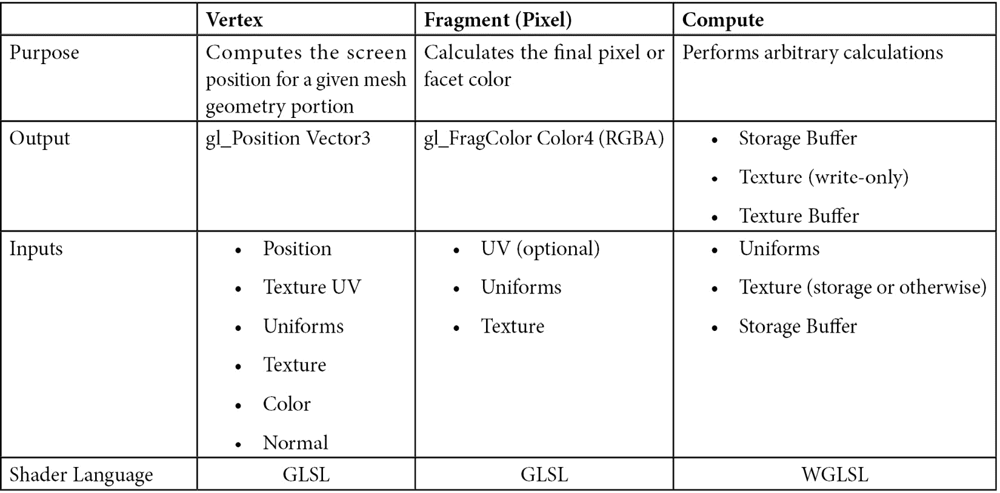

WebGL2 使得在网页浏览器中暴露着色器逻辑和 GPU 功能变得非常容易，因此在学习着色器的旅程中有很多工具和资源可以探索。也许你的经验更多在设计艺术方面，编写代码的想法可能让你感到害怕或以其他方式令人望而却步。也许简单地同时记住你想要达成的目标以及顶点和片段着色器语法的概念很困难。或者可能是你不确定如何编写特定的着色器效果，需要实验和探索以发现如何继续。所有这些原因，以及许多未列出的原因，都是仔细研究 Babylon.js 的一个旗舰功能——**节点材质编辑器**（**NME**）的好理由。这就是我们在下一节将要做的。

# 使用节点材质编辑器进行着色器编程

由于在本书中多次被提及，NME 可能已经获得了几乎神话般的地位，成为一款生产力工具。它的即插即用、拖放特性使得几乎任何人都可以使用视觉块来组装着色器。它以无缝的方式与检查器集成，民主化了 GPU。它与 Playground 的简单部署提供了一个从复杂到实用的短跑道。NME 可能是自面包遇到黄油以来最好的事情。

所有这些陈述都是真实的，除了关于 NME 比面包和黄油更好的部分——这一点并不成立。它比面包和黄油更好，但仅仅略逊于单独的面包。这是一条薄薄的发酵线，但值得烘焙。抛开夸张的说法，NME 确实是 Babylon.js 工具箱中最强大，如果不是最强大的工具之一。

在本节中，我们将学习如何充分利用 NME。到结束时，你会发现“以节点思考”变得很容易！首先，我们将探索如何创建和应用**NodeMaterial**到网格上。接下来，我们将探索使用 NME 创建程序纹理。最后，我们将简要看看如何使用 NME 创建后处理。

## 使用 NME 构建地球材质

有时候，在学习新事物时，有一个具体的例子去努力实现，而这个例子就是最终的目标，这可能会很有帮助。其他时候，从最终目标的原子子集开始，而不是从成品例子开始，可能会更加启发人心。我们将要开始的目标——我们的第一个原子子集——将会很简单：创建一个新的 NodeMaterial，将纹理渲染到球体网格上。容易，对吧？

注意

与大多数类似形式的修辞问题不同，前一个问题答案是明确且响亮的“YES！”。如果之前没有明显地感觉到 Babylon.js 对易用性给予了极高的重视，那么回到这本书的前几章重新阅读（或者简单地第一次阅读）可能会有所帮助。没关系，没有人会因为你浏览或跳过而评判你！好吧，好吧。也许有一点。但不多。

在我们完成本章的过程中，我们将首先详细介绍如何使用 NME 完成各种任务的机制，但随着我们进入以下部分，我们将不得不从这些机械细节中退出来，以确保我们有足够的空间和时间来探讨更宏观的主题。一如既往，Babylon.js 文档是学习我们正在讨论的主题的绝佳地方，其中包括关于 NME 的丰富材料，包括组合游乐场和 NME 示例，用于各种任务。BJS 论坛是查看社区示例、征求反馈和提问的好地方。甚至还有一个专门用于 NME 示例的线程，[`forum.babylonjs.com/t/node-materials-examples`](https://forum.babylonjs.com/t/node-materials-examples)！让我们开始吧。

### NME 概述

导航到 [`nme.babylonjs.com`](https://nme.babylonjs.com)；默认材质模式“空白画布”是初始要加载的节点图。分为四个功能区域和一个第五个预览面板，第一个面板 – 左侧的垂直列 – 包含可以放置到工作画布中间面板的不同节点的可搜索列表：

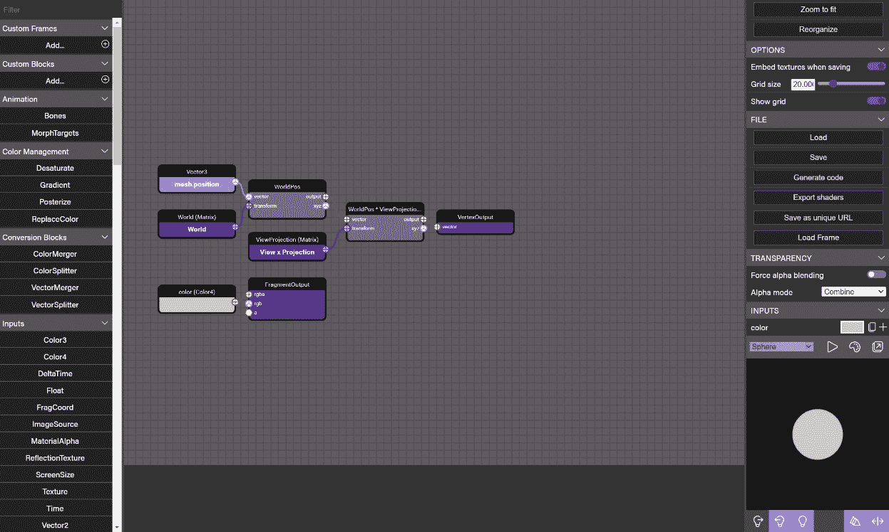

图 11.5 – 默认节点材质编辑器视图

在前面的屏幕截图中，左侧面板包含节点列表。中间面板的工作画布是显示节点及其连接的地方，而右侧面板显示所选项目的上下文属性。注意渲染预览面板。

右侧面板显示可以修改的上下文属性列表，如果没有选择任何内容，则显示片段属性和选项。在**属性**面板的底部（如果最初不可见，请向下滚动）中藏有**预览**面板。立即将其弹出到一个自己的窗口中 – 能够立即看到更改的效果是这种类型开发成功的关键之一。底部的水井或沟槽，根据您如何称呼它，包含节点图着色器编译过程的控制台输出 – 如果最后一行是红色，则您的节点没有编译！

重要提示

有时，很难判断某个特定的更改是否非常微妙，或者它是否完全没有效果。始终确保检查您最新的控制台输出是否没有着色为红色或包含错误；否则，您可能会将损坏的节点与无效的更改混淆！

### 背景上下文

节点通过在两个相关节点上特定连接端口之间的线条连接。任何给定的节点都代表可以在一系列输入和输出上执行的操作，通过从前者拖动线条到后者来连接。节点及其连接的图遵循两个简单的规则，这些规则导致产生惊人的复杂行为。

首先，节点总是接受左侧连接器的输入，并在其右侧输出值。节点内部在输入和输出之间发生的事情是节点的私事。这个有趣的影响是，统一体、属性、常量或其他外部提供的数据没有输入连接器。相反，值通过代码、检查器或在设计时的属性面板中设置。相反，一些节点只包含输入而没有输出连接器。这些是节点着色器代码生成的端点；换句话说，它们代表适用着色器的返回值，例如片段着色器的颜色和顶点着色器的位置向量。由于它们是着色器计算的最后结果，它们必须始终是节点图中最后一个项目。

节点图的第二规则，并且遵循第一条规则，是只有连接到输出节点的节点才包含在生成的着色器代码中。记住，最终目标是生成用于顶点着色器的向量和用于片段的颜色。这意味着一个正确构建的节点图执行从开始到结束的顺序路径（通常是左到右），但由从终点到起点的路径定义（相反，或右到左）。

这种心理模型的不匹配（试着快速说五遍！）有时会使得可视化达到特定目标所需的步骤变得困难。这就是为什么在不需要对应用程序进行无关更改的情况下，使事物易于更改或添加变得重要的原因。在我们的案例中，我们将构建我们的工作结构，以便我们可以逐步构建一个超高细节和质量的地球材料。

回到 NME 窗口，将**片段**和**顶点**输出节点拖到右边，为新添加的节点腾出空间。确保渲染预览设置为**球体**，并且如果你还没有这样做，将预览弹出到一个单独的窗口。现在，我们准备好实现我们的第一个微观目标——学习如何添加和使用纹理。

### 将纹理添加到材质中

在节点材质编辑器的材质模式默认配置中，顶点着色器的输入为`mesh.position`、`World Matrix`和`View Projection Matrix`。将创建一系列`texture`以过滤列表并显示连接到纹理块`uv`连接器的`mesh.uv`节点。一般来说，这是一个一致的模式——如果节点块所需的输入不存在，它们将自动添加：

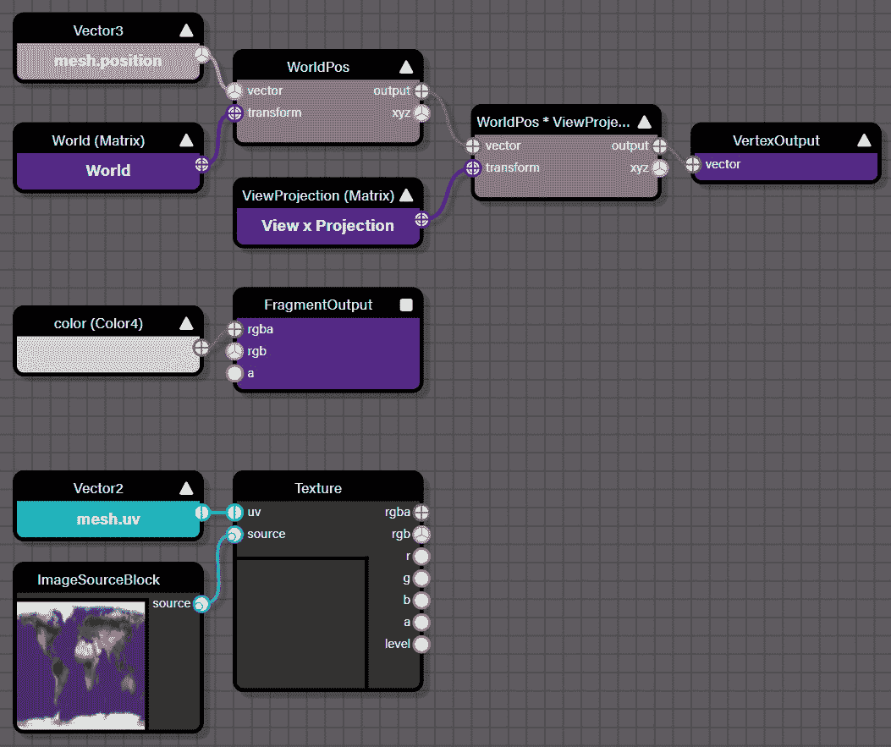

图 11.6 – 将纹理节点拖动到表面也会添加 mesh.uv 值。这个值用于选择与网格顶点对应的纹理部分

前面的截图显示了设置，但也显示了我们的下一步：将 `Texture` 块的源输入端口拖动出来，如前一个截图所示。边做边整理是一个好习惯，所以如果节点尚未重命名，请选择节点并更改 `baseTexture`。通过引入纹理，我们已经实现了初始目标的一半。现在，我们需要将它绘制到预览网格上。

完成这一点非常简单，但记住涉及的底层机制是有价值的，因为它们很快就会变得重要。回想一下，顶点着色器传递了网格位置和对应于该顶点位置的 UV 纹理坐标，这些坐标将 `UV` 坐标传递到片段着色器。现在，我们需要采样纹理以设置片段着色器的最终颜色，我们通过拖动 `FragmentOutput` 节点的 `rgb` 输出的 `rgb` 输入来实现这一点。查看渲染预览；应该可以看到一个看起来熟悉的地球：

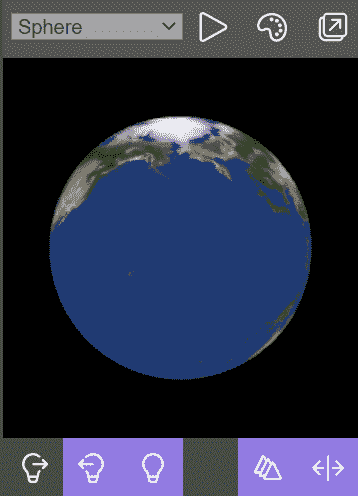

图 11.7 – 添加 baseTexture 并对其采样以用于片段输出的地球材料的渲染预览

您可以将您的作品与 #YPNDB5 中的片段进行比较。如果您的预览与前面的截图不完全匹配，没关系——这只是一个预览，重要的是您可以看到球体上的纹理。我们的第一个任务已经完成！接下来是什么？现在是时候开始添加节点到我们的图中，这些节点将使用额外的纹理来为我们的地球材料添加更多细节。

### 混合云层

首先，在画布上添加另一个纹理节点和图像源。将它们命名为 `cloudTexture` 和 `cloudTextureSource`，并将文件上传或链接到[`raw.githubusercontent.com/jelster/space-truckers/develop/assets/textures/2k_earth_clouds.jpg`](https://raw.githubusercontent.com/jelster/space-truckers/develop/assets/textures/2k_earth_clouds.jpg)，以便将云纹理加载到设计表面。将云层叠加到基础纹理上的最简单方法是将每个纹理的颜色混合在一起，因此拖动一个 `Mix Cloud and Base Textures`。这突显了节点的一个重要属性，可能会让那些不熟悉这种编辑表面的人感到意外——类型匹配。

当节点最初添加到画布上时，输入和输出端口都是实心的红色，这表明输入和输出的类型尚未指定。在这种情况下，可能的类型可能包括 2、3 或 4 个元素的向量（或由相同数量的颜色组成的颜色），一个单一的标量数字，甚至是一个矩阵。块变成哪种类型取决于节点第一次连接的类型。将两个纹理的`rgb`端口连接到节点的单独输入，并将片段着色器的输出替换为混合云彩和基础纹理节点的输出以完成操作。云彩在渲染预览中可见，但它们有点淡，难以看清。

这可以通过在混合到基础纹理颜色之前对云彩颜色应用一个缩放因子来轻松修复。这种颜色的混合是一个非常常见的操作，尤其是在我们进入下一节，*程序纹理和 NME*时更是如此。添加一个浮点输入块，并将其命名为`cloudBrightness`。给它一个初始值约为`1.25`，然后将其用作新添加到画布上的缩放节点的输入因子。将这个节点命名为`Scale Cloud Levels`，并将另一个输入连接到`cloudTexture`节点的输出。`Scale Cloud Levels`节点的输出将替换`Mix Cloud and Base Textures`节点的输入：

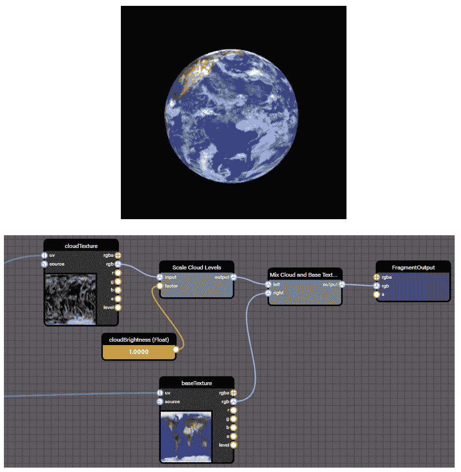

图 11.8 – (a) 在添加云彩纹理和缩放因子到基础纹理颜色后，可以看到云彩在宁静的地球上方漂浮。(b) 混合和缩放云彩纹理与基础地球纹理的节点材质图。云彩亮度值可以设置为与云彩所需的外观和感觉相匹配的值

结果应该看起来像第一张截图。如果它不是这样，请比较你的节点图与第二张截图或#YPNDB5#1 中的片段，看看它们之间可能有什么不同。一旦你对输出满意，保存片段为唯一的 URL 会是一个好主意。

注意

当你在使用 NME（NME 未知）处理某个项目时，最快的方式是将片段保存为 URL，直到你准备好下载定义文件并在你的项目中使用它。

我们的**地球材质**现在看起来相当不错，但有什么比无聊的静态纹理更酷的呢？一个动态纹理！让我们让云彩动起来，给我们的材质增添一些活力。

### 框架动画

当我们考虑动画时，很容易忘记场景中有很多不同的动画方法。其中最简单、最直接的方法是在时间上操作纹理坐标（`uv` 值）。此外，只需改变 `u`（或 *X* 轴）值，纹理就会以从东到西或从西到东的方式移动，这可能与地球同步卫星的外观相似！

在 `scaleSceneTime` 节点中搜索并添加 `timeScaleFactor`，我们可以在设计和运行时控制动画的精确速度。

重要提示

为什么我们使用时间而不是时间差？记住，着色器没有对过去事件的记忆。它们只处理传入的数据，而传入的数据在帧之间不会持续。因此，我们不是存储时间差并将其添加到 `u` 坐标，而是使用总场景时间和比例。

保持节点图可读性很重要，这不仅是为了你未来的自己，也是为了阅读它的人。做到这一点的一个很好的方法是将节点组织成可折叠的框架。将三个时间、比例和乘法节点靠近排列，然后按住 *Shift* 键，同时点击并拖动一个框围绕三个节点以创建一个框架：

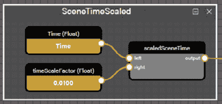

图 11.9 – SceneTimeScaled 框架封装了将动画帧计数器暴露给节点图其余部分的逻辑。这是框架的展开形式

框架是一种简单快捷的方法，可以将复杂的节点图变得更加易于管理，就像函数有助于将代码片段彼此分离和隔离一样。`SceneTimeScaled` 框架（或任何框架）甚至可以通过下载其 JSON 定义，然后使用 `cloudTexture` U 坐标在不同的节点材料之间重用。

与我们将云纹理与基础纹理混合时涉及的所有内容都是同一类型不同，我们需要能够改变 Vector2 值的单个元素。首先，我们需要将源向量拆分成其组成部分，然后在 `x` 组件中添加 `scaledSceneTime` 值。然后，我们将重新组合向量并将其连接到 `cloudTexture` UV 输入：

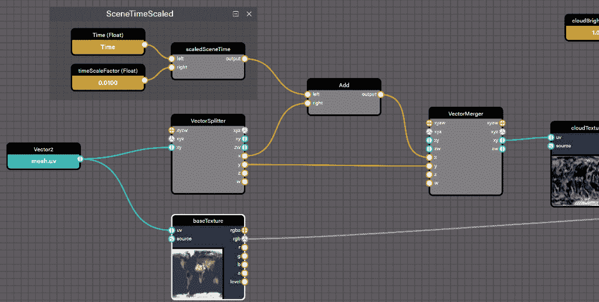

图 11.10 – 使用向量合并和向量拆分节点将 SceneTimeScaled 框架与 u (x) 纹理坐标连接

当连接完成后，打开渲染预览，惊叹于在宁静的蓝色海洋上缓慢移动的云层。如果你没有看到预期的结果，仔细检查输出，确保最后一行（当前行）不是一个错误或红色。如果需要，将你的 NME 图与 T7BG68#2 中的图进行比较，看看你做了什么不同。

NME 材料模式的内容远不止我们在短短几段文字中所取得的成就。在那短短的文字空间里，我们能够利用 NME 在 **材料模式** 下创建一个动画地球仪的渲染效果，并使用来自 NASA 的好心人提供的高分辨率纹理。将节点拖拽到画布上正变得越来越熟悉的活动，因为我们学会了如何将纹理混合到最终的片段颜色中，甚至可以动画化云层。通过练习和经验，使用内置的 **时间** 计数器和 **向量分割器** 以及 **合并器** 节点将变得像呼吸一样自然。然而，NME 不仅仅能将纹理映射到网格上，还有更多内容需要探讨。在下一节中，我们将移除 **顶点着色器**，专注于 **片段着色器**，以便我们最终了解我们的雷达程序纹理是如何构建的（更多信息请参阅 *第九章*，*计算和显示评分结果*，了解这是如何融入游戏的）。

## 程序纹理和 NME

在大多数专业研究领域，一个特别困难的学科基础往往是早期就交给学生，以此来筛选或淘汰那些可能不太自信的学生。听起来很严厉，但让学生早期接触他们选择领域的现实可以是一种节省时间和精力的有价值方式，既对学生也有利于教师。本章的这一部分 **不是** 为了达到那种效果，因为假设你是出于选择和兴趣而在这里，这不是一个门槛练习，而是一个包容性的练习。NME 的 **程序纹理** 模式仍然包含顶点着色器的输出 – 并且它仍然需要在画布上存在 – 但我们的注意力将集中在片段着色器上，因为还有什么比 **片段着色器** 更适合同时处理一大堆任意像素呢？没有！在程序纹理的情况下，片段着色器输出到一个纹理缓冲区而不是屏幕缓冲区 – 这正是后处理所使用的。正如我们通过雷达纹理所看到的，这个纹理然后可以被应用到场景中的各种材质纹理槽位上进行渲染。

正是基于这种考虑和理念，我们应该接受雷达纹理的节点图 – 它不是用来吓跑那些可能不太自信的人的稻草人，而是用来支持和鼓励那些人的。这就是为什么我们将从最简单的节点图开始，这个节点图仍然传达了基本内容。之所以这样做，是因为虽然制作这个纹理涉及到相当多的移动部件，但一旦分解开来，每个部件都相对容易理解。请按照文本加载 NME 中的片段 XB8WRJ#13，并参考以下图表了解纹理每个具体组件的说明：

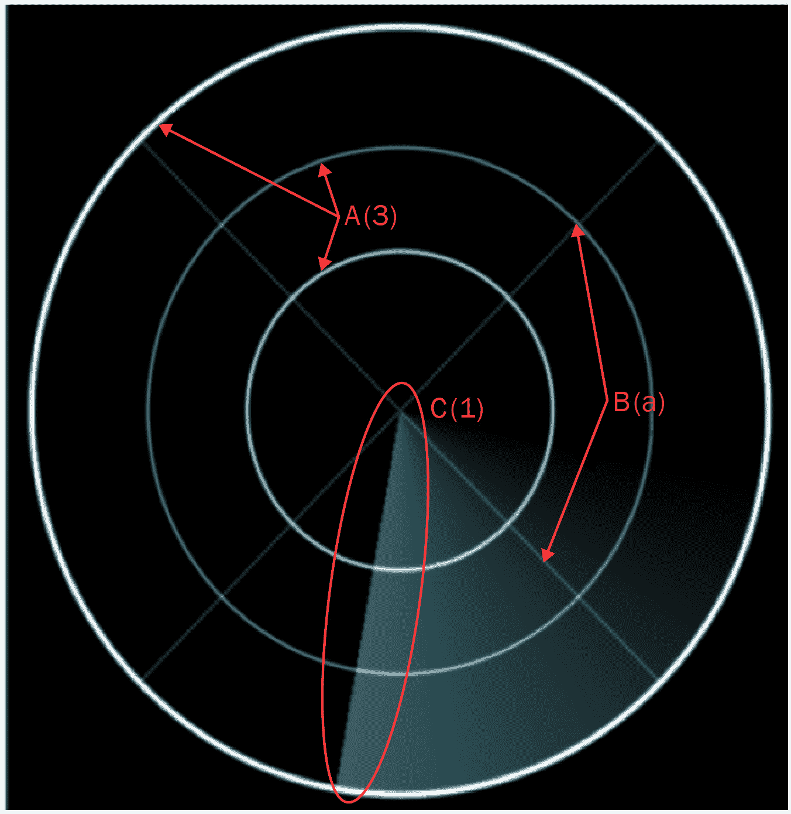

图 11.11 – 雷达程序纹理的组件

在前面的图中，三个圆圈（A）、两条交叉线（B）和扫过的线条（C）可以独立于彼此进行检查。三个同心圆将纹理绑定在一起，每个都是略带不同色调的浅蓝色。在中心相遇，每个都垂直于另一个，并且相对于向上方向呈 45 度角的是交叉线，色调为较深的蓝灰色。纹理的静态部分还包括扫过的线条，这是一块带有不透明度渐变的青色动画披萨切片。在下面的屏幕截图中，节点图完全折叠到其最大的组成部分。*图 11.12*中的每个元素在下面的屏幕截图中都有自己的框架：

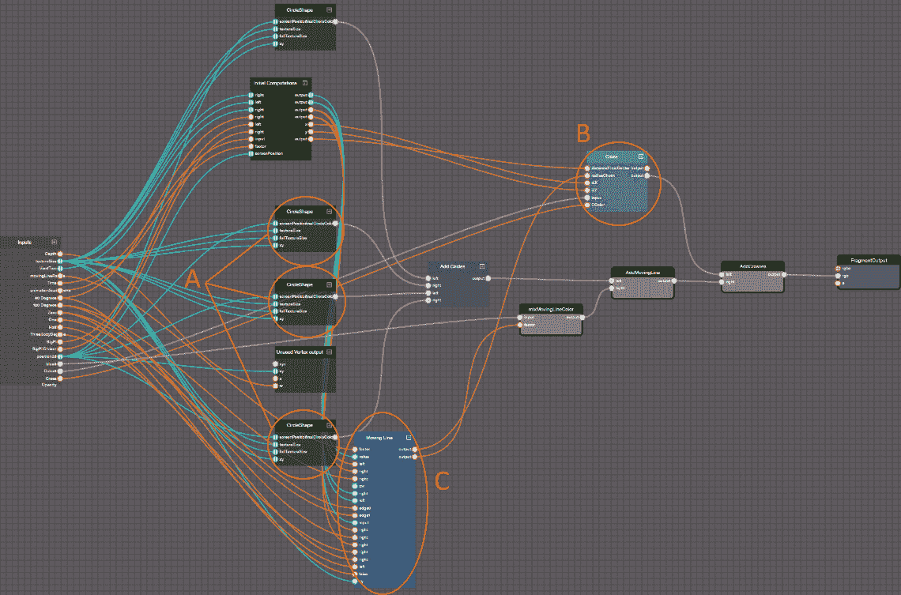

图 11.12 – 雷达程序纹理的节点图

在将雷达程序纹理的主要元素分组后，节点图仍然复杂，但更容易理解。在 NME 中组织和命名元素非常重要！为了参考，NME 片段可以在#XB8WRJ#13 找到。

要检查着色器图的任何单个部分的详细信息，展开框架以查看组成该部分片段着色器逻辑的步骤。每个框架的输出略有不同。每个**CircleShape**框架在**Add Circles**框架中输出一个颜色值，正如其名称所暗示的，将颜色值相加。程序形状生成的关键元素是，不属于形状的像素将被分配一个清晰或空的颜色值。这就是为什么，如果你查看**CircleShape**、**Cross**或**Moving Line**框架内部，你会找到导致输出设置为 0 到 1 之间[0…1]的值的条件节点和其他节点操作。0 的值意味着像素根本不是形状的一部分。任何其他值都表明像素最终颜色的相对亮度。

最终的颜色值是通过将每个元素定义的颜色（各种蓝色或白色色调）分别按该亮度因子缩放，然后将它们与所有其他元素的颜色输出相加得到的。就像魔法一样，形状从空白画布中浮现出来！关于魔法，本章开头提到的基本参考资料之一是*着色器之书*。雷达程序纹理是从其形状章节中列出的**ShaderToy**示例改编的，该章节位于[`thebookofshaders.com/07/`](https://thebookofshaders.com/07/)。尽管网站上找不到节点图，但每个代码片段都是交互式的。任何对程序纹理或类似主题感兴趣的人都应该抽出时间和精力阅读这本简洁、温和且组织得惊人的资源，作为继续在这一领域旅程的一部分。

与程序纹理非常相似，NME 的后处理模式是与片段着色器相反工作的。让我们快速浏览一下 NME 中后处理的景观。

## 使用 NME 开发后处理

与程序纹理模式不同，`Current Screen`节点。这个节点是一个输入纹理，它被传递到片段着色器中。它包含了一个没有后处理的帧的截图预览。你可以为这个设置任何纹理；它的目的只是提供后处理输出的视觉反馈。

可以用 NME 构建的最简单的后处理之一是永不过时的淡入/淡出机制：

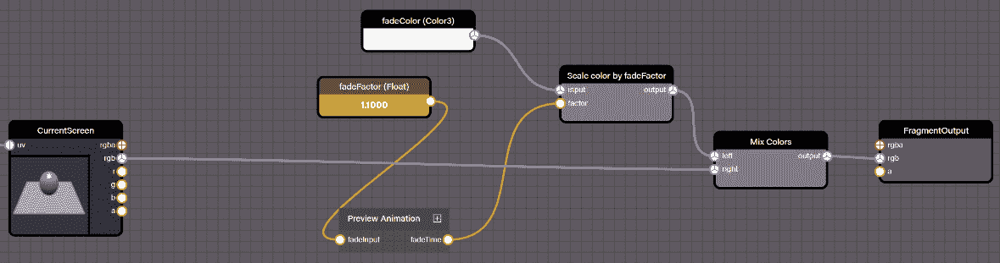

]

图 11.13 – MNE 中的简单淡入/淡出后处理

预览动画帧用于提供后处理在实际操作中的动画视图。`fadeFactor`统一变量控制效果的程度。代码片段托管在 Z4UNYG#2。

在前一张截图所示的逻辑中，`fadeColor`节点通过`fadeFactor`进行缩放。为了帮助可视化效果，`Preview Animation`帧传递了从 0（完全黑色）到 1（正常）再到 10（完全白色）的`fadeFactors`。

重要提示

由于我们的比例从零开始，将 10 分配给`fadeFactor`与将事情提高到 11 一样，因为这就是 Babylon.js 所能达到的。你已经收到警告了！

我们本节开始时，学习了 NME 的基础知识，并使用我们新学的技术构建了一个高分辨率的**地球材料**，其中包括动画云覆盖。因为我们花了时间来讲解基础知识，所以我们能够在这个关于**程序纹理**的话题上取得进展。我们了解到，它们与**材料**构建得非常相似，除了所有工作都是在片段着色器中完成的。像程序纹理一样，**后处理**不针对场景几何形状操作。后处理在功能上与程序纹理相同，因为**当前屏幕**节点是屏幕上每个像素的渲染纹理缓冲区。

# 摘要

如果感觉我们一直在回避对这个以及其他我们在本章中已经涵盖的主题的深入探讨，那么要么是你有很好的直觉，要么是你阅读了本章的标题。正如本章标题所暗示的，我们只是在触及一个不仅广度大而且复杂性深的主题的表面。这并不意味着我们没有涵盖很多材料——恰恰相反！我们本章开始时，通过学习一些着色器概念以及顶点、片段和计算着色器之间的区别来入门。每种类型的着色器都是一种专门软件程序，它在 GPU 上为屏幕上的每一块几何形状（顶点）和每一个像素（片段）运行一次。

没有任何着色器实例会记住前一个帧中发生的事情，也不知道它们的邻居在做什么。这使得着色器程序在最初使用时有点令人费解。幸运的是，Babylon.js 中使用的着色器代码语言是**GLSL**，如果你习惯于使用 Python 或 JavaScript，你应该对此很熟悉。

**计算着色器**是 Babylon.js v5.0 的新功能，是**WebGPU**工具箱中的一个强大新补充。计算着色器是着色器的一种更通用的形式，与顶点或片段着色器不同，它们能够将输出写入不仅仅是纹理目标或网格位置。因此，它们可以执行复杂系统（如流体动力学、天气、气候模拟等）的并行计算，以及更多等待被发明的事物。

一旦我们对着色器有了坚实的基础理解，我们就将这一知识应用于使用 NME 编写着色器程序。NME 有几种操作模式，我们再次从基础开始，使用材质模式和平行地球材质。在快速学习如何添加和混合纹理后，我们通过添加动画效果到云纹理上，并在过程中学习帧，为这个蛋糕增添了糖霜。

当我们试图理解更加复杂的雷达程序纹理时，关于帧的知识派上了用场。忽略顶点输出，程序纹理和后处理模式作用于片段输出。这种相似性使得它很容易过渡到后处理编辑器。始终优雅且易于实现，基本的淡入/淡出效果很快就能融入我们对这个重要主题不断增长的理解中。

就像冰山露出水面的尖顶一样，着色器和 NME 中还有许多东西比表面可见的要多。如果这一章要公正地对待这个主题，无疑需要再增加几百页！请确保查看下一节*扩展主题*，以获取下一步的建议和行动指南。

在穿越 Babylon.js 广阔世界的旅程中，我们已经取得了惊人的进展，但仍有更多领域需要探索。在下一章中，我们将从快速通道开始转向出口车道，但在到达目的地终端之前，我们还需要标记几个地标。从现实世界的角度来看，我们将把焦点重新转向整体应用程序，学习如何让 Space-Truckers 在离线状态下运行并记录高分，然后再发布到主要的应用商店。如果这听起来像是一种令人耳目一新的环境变化，那么请继续阅读！否则，如果你在寻找一些支线任务来保持 Shader 领域的活力，*扩展主题*部分可能有一些有趣的挑战可以接受。下一章见！

# 扩展主题

这里有一些关于如何进一步使用 NME（特别是）以及一般着色器资源的想法：

+   使用本章中我们学到的技术为地球材质创建程序云。一种方法是从现有的云纹理开始，并使用某种类型的噪声节点对其进行扭曲。

+   《着色器之书》（[`thebookofshaders.com/`](https://thebookofshaders.com/））是一个免费在线资源，虽然它仍在不断进化中，但正如作者所描述的，它“是一个温和的、逐步引导您进入片段着色器这个抽象而复杂的宇宙的指南。”尽管它完全专注于片段着色器，但它无疑是一个弹簧驱动的垫脚石，有助于提高您对着色器的理解。每一章都介绍了示例、练习以及必要的材料——尝试在 NME 中重现这本书中的示例。在 BJS 论坛上发布您的结果，看看其他人做了什么。[https://forum.babylonjs.com/c/demos/9](https://forum.babylonjs.com/c/demos/9)。

+   理解 GPU 中发生的事情可能很困难，特别是因为没有简单的方法可以附加调试器并像许多人习惯于常规代码那样逐步执行代码。SpectorJS 是一个浏览器扩展，可以提供关于 GPU 上发生的事情的见解。您可以在[`spector.babylonjs.com/`](https://spector.babylonjs.com/)了解更多信息。

+   沿着模拟货物所经过的路线挤压的 TrailMesh 在其旅途中会穿过不同的遭遇区域。创建一个节点材质或纹理，它接受遭遇区域信息并使用它为每个区域渲染独特的轨迹网格。

+   与前面的要点相关，创建一个在路线规划期间遭遇发生时触发的效果。该效果应位于遭遇的位置，并且可以根据遭遇的类型不同而不同（尽管不一定需要）。出于游戏玩法的目的，它可能不应该向玩家透露太多信息，但确实可以引起兴趣！

+   Babylon.js 文档包含许多关于 NME 的主题和资源。它还包含链接到各种 YouTube 视频，这些视频提供了关于使用 NME 不同方面的教程：

    +   在代码中创建和使用节点材质。如果您正在撰写关于编程的论文或书籍，并希望听起来很聪明，“强制性地将 JavaScript 反射到 GLSL”是一个不错的标题：[`doc.babylonjs.com/divingDeeper/materials/node_material/nodeMaterial`](https://doc.babylonjs.com/divingDeeper/materials/node_material/nodeMaterial)。

    +   相关视频列表可以在前一个链接的底部找到。视频主题包括 PBR 节点、程序投影纹理、程序节点材质、各向异性等！
