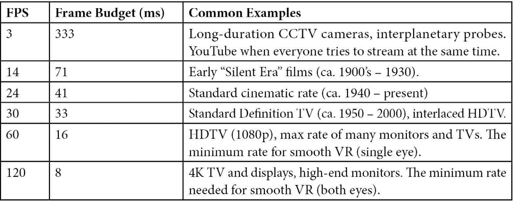
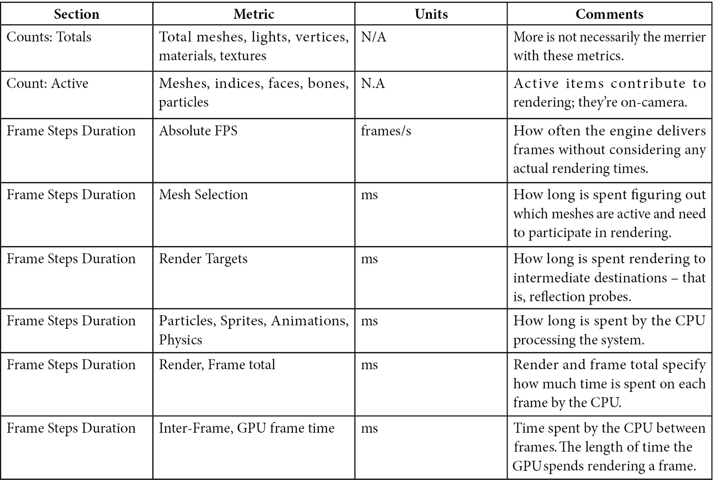
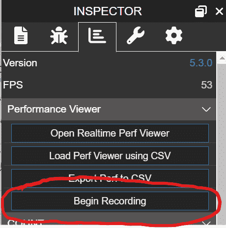

# 测量和优化性能

在软件工程领域，人们经常听到这样的说法：“过早优化是万恶之源。”这通常是由资深的开发者对资历较浅的开发者非常了解地传授的。无论是刮胡子还是不刮胡子，几乎总是需要做出严肃的声明，以获得这种声明所伴随的庄严气氛。不管传达方式如何奇怪，遵循这些建议是明智的。

在软件设计方面，没有比在软件仍在大量构建时开始进行性能相关更改更糟糕的方法了。这反过来是因为代码库的优化与代码的可读性、可维护性以及引入新功能和更改的便利性成反比。换句话说，代码库越优化，人们理解代码并对其进行更改就越困难。

在我们的旅程的这个阶段，我们已经建立了一个完整的端到端应用程序体验。尽管可能还有一些粗糙的边缘，但所有主要功能都已在该应用程序中实现，这使得检查应用程序的性能成为一个理想的时间点。然而，与此同时，我们对 Space-Truckers 在除最基本层面之外的其他层面上的性能了解不多。我们的第一个任务是明确的：我们必须捕捉一个基准性能配置文件，或者说为路线规划和驾驶阶段各捕捉一个配置文件。

Babylon.js 的 **实时性能查看器** 可以记录 Babylon.js 场景中与性能相关的广泛指标的实时性能统计。有了这些工具，我们将能够识别 Space-Truckers 代码库中的“热点”，然后针对这些热点进行选择性的性能优化，但这并不能告诉我们如何提高性能或在我们工具中寻找什么。至少目前还不是这样！

我们之前还没有讨论过，一个网络应用的广泛性和覆盖面也意味着必须由开发者支持更多不同类型的潜在硬件和软件配置。我们如何避免必须测试、验证和修复每个设备、软件和显示组合的功能？通过了解场景中哪些区域或场景对系统哪个部分施加了最大压力，我们可以将优化从设计时间推迟到运行时，并在实时进行处理。Babylon.js 的 **场景优化器** 是动态平衡性能和渲染质量的理想解决方案，它可以根据目标帧率和当前帧率之间的差异，开启和关闭不同的性能优化。

除了运行时的 **场景优化器** 之外，我们还可以做其他事情来提高 Babylon.js 应用程序的性能。我们将继续使用并重新测量我们做出的任何更改的影响，首先是单独的，然后是全部的，因为如果你没有比较的东西，你怎么知道是否有所改进？修辞的回答是，你不能——除非你在测量程序和捕获测量方面保持一致，但作为 Software That Does Magic™ 的挑剔和有条理的创造者，你已经掌握了这一点！

重要提示

严肃地说，有助于加强和促进这种开发工作的强大力量是利用 Git 的强大功能。每次你保存源代码文件的更改时，至少考虑暂存该更改，如果可能的话，提交它。对于不起作用的提交，选择回滚而不是继续前进。换句话说，通过与源代码控制合作，而不是对抗它，你可能会惊讶地发现你可以多么快地完成任务！

对于这一点，我们 Babylon.js 长途旅行的倒数第二个阶段，将查看我们应用程序的网络性能。具体来说，我们将看到我们的资产和数据资源如何影响加载时间和带宽使用。今天的网络浏览器几乎都支持强大的缓存功能，以及本地存储机制，如 **IndexedDb**，这是一个浏览器提供给其内部运行的脚本的微型 SQL 服务器。这有什么相关性？

注意

如果你错过了，修辞问题又流行起来了！

**IndexedDB** 的相关性在于我们可以用它来存放所有我们的资产——纹理、声音、JSON 等。我们不需要从服务器下载所有内容，而是在浏览器本地存储资源。这是一个缓存资产的绝佳位置。这使我们为下一章探讨将 Space-Truckers 转换为可安装发布的 **渐进式网络应用**（**PWA**）做好了准备。但首先，让我们回顾一下本章涵盖的主题以及一些技术要求和推荐。

本章将涵盖以下主题：

+   知道要测量什么

+   测量性能和识别瓶颈

+   使用场景优化器提高运行时性能

# 技术要求

本章中的大多数要求与之前章节的要求相同，但一些新工具对于性能测量和改进非常有用。以下是本章新引入的或特定的工具：

+   这不是必需的，但在进行性能捕获工作时拥有多个显示器非常有帮助。准确和一致性的测量可能已经足够困难——如果可能的话，不要在混合中添加更多变量！

+   场景优化器：[`doc.babylonjs.com/divingDeeper/scene/sceneOptimizer`](https://doc.babylonjs.com/divingDeeper/scene/sceneOptimizer)

+   使用八叉树优化：[`doc.babylonjs.com/divingDeeper/scene/optimizeOctrees`](https://doc.babylonjs.com/divingDeeper/scene/optimizeOctrees)

+   BVH 文章/信息链接

# 知道要测量什么

量子力学有一个叫做**不确定性原理**的概念。以物理学家维尔纳·海森堡的名字命名，这个原理可以概括为：测量某个数量本身会影响该数量的观测值。虽然对我们目前受限于非量子系统的人来说，这仅仅是一个类比，但它作为我们在采取测量和指标时的一个有用警告：不要让仪器影响我们对应用程序性能的测量。

从一些一般性指南开始，我们将查看一些需要关注和考虑的关键因素，以便收集有意义的测试数据。使用这些指南来建立基本背景，我们将开始学习一些关键术语，这将使我们能够在本章的后续部分中更具体地了解。

## 一般性指南

当我们回顾和检查获取性能配置文件的各种方法和程序时，我们会根据需要介绍工具特定的步骤。但首先，让我们看看一些普遍适用的指南。

### 将外部因素降至最低

计算机在在进程之间共享计算时间切片方面相当出色，但我们最好关闭所有其他浏览器窗口并关闭任何可能与我们竞争资源的非必要程序。不，这并不像预期的那样“真实世界”，但这里的目的是收集干净、一致的数据，这不必遵守“真实世界”的规则。反抗。

### 选择一个目标分辨率并坚持使用

这可能比看起来要复杂一些。仅仅选择最高可能的分辨率并使用最高像素密度的显示确实是一种很好的方法来压力测试图形应用程序，但这不会产生一个非常有用的性能配置文件。分辨率太低，GPU 也不会感到压力，同样也不会产生一个非常有用的配置文件。采用类似 Veruca Salt 和 Goldilocks 的方法，选择一个位于中上范围的值，避免“红线”CPU 或 GPU，但仍然让这些组件为它们的电子工作！

### 比较苹果和苹果

确保你的比较是等效的，考虑所有其他因素。遵循相同的测试程序——抵制“改进”或走捷径的诱惑——并在测试运行之间以相同的方式收集数据。如果方法不同，那么你的结果很可能不会告诉你你所认为的。

### 在测量之间只改变一个因素

您可能对自己做的最不有帮助的事情之一就是在进行一组更改后推迟重新测量。例如，假设您重构了一个方法，然后在应用程序的其他地方进行了一组更改。重复几次，现在您已经失去了确定您的更改是否改善了任何东西的能力——无论应用程序的性能是变好还是变差！这种情况也很糟糕，因为您在未来的更改中也受到限制，这些更改可能不会导致您试图更改的代码回归。通过将每个连贯的更改集一起提交，并在每次主要更改后重新测量以验证您对代码行为的假设，来避免陷入这种境地。

上述指南并非不可更改的规则——它们是旨在帮助您主动避免得出错误结论及其后果的建议。这当然很有帮助，但并非直接相关。为了帮助将这些建议与有用的背景联系起来，我们首先将探讨哪些类型的指标很重要。然后，我们将探讨收集这些数据的工具。最后，我们将应用所学知识来查找和修复 Space-Truckers 代码库中潜伏的性能瓶颈和资源压力。

## 性能相关术语

“*我想变得更快!*”

是的，Ricky Bobby，我们所有人都是这样。当提到汽车或赛车时，这个短语的含义是明确的，但对于一个 3D 应用程序来说，“[快速]”意味着什么呢？当然，对于一台笔记本电脑来说，突然以 200 公里每小时的速度在燃烧的塑料云中起飞绝不是什么好事！至少，不是没有轮子的笔记本电脑。刹车也同样重要。

对于 3D 应用程序和游戏来说，相应的度量标准当然是帧率，或**每秒帧数**（**FPS**）。

注意

不幸地靠近**第一人称射击游戏**（**FPS**），值得注意的是这两个并不是直接相关的，这再次提醒我们上下文很重要。

就像高速公路上发布的限速标志旨在限制（至少在理论上）道路上驾驶员的最高速度一样，每秒可以渲染的帧数最终受到一个内在最大值的限制，这个最大值与进行渲染的显示设备或监视器的刷新率相匹配。在旧时代，这受到**阴极射线管**（**CRT**）显示器中电子枪穿越屏幕宽度和高度速度的限制。那是野蛮的时代。在当今更加先进的显示技术时代，**发光二极管**（**LED**）显示器可以以惊人的速度开关。以下是一些典型的 FPS 值和例子，您可能从现实世界中认识：



FPS 是一个方便的指标，因为它几乎完全无歧义——更高的值几乎总是更好的。唯一的真正例外是在功率消耗比保持高帧率更重要的场景中。因为这与运行时采取的行动有关，所以我们将在本章的*使用场景优化器提高运行时性能*部分稍后探讨如何处理这种情况。更高的 FPS 的丑陋副作用是，用于获取所有所需帧间处理的时间更少，无论是在 GPU 内部还是在 CPU 上。

这个**帧预算**，在上一张表的第二左列中显示，决定了在帧间时间期间可能发生的事情。超过预算，帧率会下降。预算过低，就会浪费本可以渲染额外帧或运行其他处理任务的时间。可以通过减少 CPU 帧时间或 GPU 帧时间来管理性能。有时，两者之间会有交叉——一个很好的例子是用于路线规划阶段的小行星带的薄实例（有关更多信息，请参阅*第七章*的*粒子系统中的偏离*部分，*处理路线数据*）。

每一帧，小行星的旋转和位置矩阵由在 CPU 上运行的代码更新，然后这些矩阵被复制到 GPU 中。然后这些矩阵被传递到顶点和片段着色器中，它们在单个 Draw 调用中将这些矩阵应用于场景中的每个实例。虽然这是一个非常快速的过程，但在 CPU 上存在一个潜在的瓶颈，那就是对每个薄实例的循环，它重新计算这两个矩阵。理论上，任何对此处的改进都会提高性能或在不严重降低性能的情况下渲染的小行星的最大数量。

将计算任务转移到 GPU 上时，当设备被分配了太多（或更少、更慢）的着色器程序，这些程序竞争相同的有限帧预算时，可能会出现瓶颈。着色器执行的原始数量以每秒进行的**Draw**调用次数表示，并作为执行着色器所花费的 GPU 帧内时间的补充。由于每个 Draw 调用都与一个单一的材料相关联（某些材料会对 Draw 进行多次调用），场景中不同材料的数量与 GPU 每秒被要求切换上下文以运行该材料的着色器程序的次数直接相关。

在硬件上，GPU 在上下文（着色器）之间的切换已经进行了残酷的优化，但这并不是完全免费的。每次切换都会带来一小部分开销，虽然单个切换微不足道，但大量切换累积起来可能会导致显著的损失。因此，减少绘制调用次数可以直接通过减少上下文切换来提高性能，间接地通过不再调用的着色器代码。

重要提示

最快的代码是不存在的代码。想想看。

还有一些其他值得定义的指标，但它们从名称或上下文中最为明显。然而，有一个例外，那就是绝对帧率（Absolute FPS）。绝对帧率是指每秒可以处理的帧数，不计实际渲染时间。这是衡量 CPU 方面通过其更新循环表现如何的一个指标。

与本书中的大多数内容一样，前面的术语并不是对 3D 性能编程领域的全面概述，但作为下一部分的入门，它已经足够全面。一个舒适的帧率——至少达到 60 FPS——大约有 16 毫秒的帧预算，在这段时间内，必须完成处理模拟和为下一帧做准备所需的所有处理。GPU 在执行这类任务时非常快，但就像过载的 CPU 可能会因为服务过多的竞争进程而旋转和翻滚一样，GPU 也可能因为着色器程序而过载。

为了帮助我们理解关于 CPU、GPU、负担以及在实际场景中发生的所有其他内容的讨论，我们需要了解如何以及测量什么。仅仅测量事物通常是不够的。就像化学学生在笔记本上规划他们的实验步骤一样，我们需要学习如何规划我们的测试策略，以及如何解读结果。在下一节中，我们将承担规划、执行和解读性能测试的任务，但在那之前，我们需要更多地了解那些将帮助我们完成这些任务的工具。

# 测量性能和识别瓶颈

有效的解决问题的开始是明确界定需要解决的问题。有时，这并不明显，有时，可能存在多个问题似乎是最重要的。通常，使界定问题困难的是它被呈现为一个定性陈述，就像这样：“路线规划屏幕性能不佳。”

这样的声明在一个意义上是不含糊的——对其含义没有疑问——但在另一个意义上是完全晦涩的，因为我们不了解性能有多差。这就是定性数据和具体、定性的度量之间的基本区别。没有前者，就无法理解整体情况，没有后者，就无法知道是否任何行动已经解决、缓解，甚至变得更糟。因此，收集有关路线规划屏幕性能的定量数据是我们需要采取的第一步，以便我们能够更好地定义我们的胜利条件。

## 检查路线规划性能

Babylon.js 检查器是一个多功能的有用工具。如果你对检查器还不熟悉，现在查看[`doc.babylonjs.com/toolsAndResources/tools/inspector`](https://doc.babylonjs.com/toolsAndResources/tools/inspector)文档，以及再次回顾*第二章*，*Babylon.js 入门*，将是一个不错的时间，以帮助你入门。检查器长期以来一直有一个 **性能** 选项卡，显示有关当前运行场景的各种统计数据，但直到 Babylon.js v5.0 版本发布，还没有简单的方法来捕获和分析这些指标随时间进展的情况。**性能分析器**是一个可扩展的工具，有两个类似的概念但不同的实践模式：无头和实时。

重要注意事项

如果你不记得，在运行 Space-Truckers 时打开检查器的快捷键是 *Shift* + *Alt* + *I*。

## 实时性能查看器指标

在实时模式下运行时，会渲染一个实时图表，显示从可用指标列表中选择的指标。相比之下，无头模式只显示内容，但会捕获可以稍后导出为 CSV 格式以进行进一步分析的数据。这三个选项（启动/停止、实时、无头和导出到 CSV）在 BJS 文档中有更详细的介绍，请参阅[`doc.babylonjs.com/toolsAndResources/tools/performanceProfiler`](https://doc.babylonjs.com/toolsAndResources/tools/performanceProfiler)。以下表格列出了性能分析器收集的默认指标，以及这些指标的基本说明：



前述每个指标的具体值将取决于硬件和软件环境，因此特定的目标值并不很有用。指标的不同属性分组通常反映了值所采用的维度或单位。顶部部分侧重于计数指标——例如网格、顶点、纹理等的数量。之后，是时间指标，显示了场景的特定部分在帧内和帧间消耗的时间量。性能分析器捕获并以此基础集的指标在视觉图表中显示。让我们继续看看我们的分析过程是什么样的。

## 定义测试程序

根据本章之前提出的指南，我们需要定义一个可重复的过程来分析应用程序。没有必要过度复杂化这一点，所以我们来做最简单的事情。我们希望刷新应用程序的网页以重置和清除内存等，然后我们希望让应用程序稍微稳定一下，找到它的节奏，在我们投放一些货物并获取更多测量数据之前。最后一步是将我们的性能配置文件保存到 CSV 文件中，以便将来加载到性能查看器中进行基本分析。

重要提示

除非有特定的原因不这样做，否则始终评估在生产环境模式下构建的代码的性能和捕获指标！

这是我们测试过程的样子。记住，我们希望在每次对代码进行重大更改时重复这一系列步骤，以便我们可以理解该更改的影响：

1.  刷新浏览器，启动游戏，并导航到路线规划

1.  允许游戏稳定 10 秒

1.  开始捕获

1.  允许 10 秒稳定并建立基线

1.  将货物单元发射到空旷的空间

1.  收集数据 10 秒

1.  停止捕获并导出到 CSV

更彻底的测试过程还应该包括摄像头的平移和缩放，但这个程序将充分满足我们的需求。在本书的这个阶段，*步骤 1*不需要进一步阐述。*步骤 2*也很直接，切中要点。*步骤 3*是我们需要暂停以详细了解该步骤包含的内容。

在我们开始捕获配置文件之前，我们需要通过按*Shift* + *Alt* + *I*键组合来启动 BJS 检查器。右侧窗格中的**统计信息**选项卡包含我们的目标信息，但首先，请从浏览器窗口中分离**检查器**窗格（如果需要，可以关闭场景浏览器），以免占用或覆盖应用程序窗口的任何部分。如果您使用多个显示器，将一个显示器专用于浏览器窗口可能很方便，但这不是必需的。只需记住关于使用相同屏幕尺寸和分辨率的指南！准备好后，请按以下截图中的**开始录制**按钮：



图 12.1 – 检查器的统计标签页包含用于启动、停止、导出和查看性能配置文件数据的控件

通过点击**开始录制**按钮，我们可以以无头模式启动性能配置文件。这使我们获得了更好的准确性，因为，向海森堡博士致敬，我们的测量不会对应用程序的执行产生太大的影响。

*步骤 4* 包含一个困难的任务，那就是在 10 秒内不触碰任何东西，等待应用稳定。这前 10 秒也有助于建立运行时的基准配置文件，我们可以用它来比较测试期间采取的不同操作。当规定的时间过去后，*步骤 5* 是将发射器指向一片空旷的空间并发射——我们想要捕捉游戏在飞行中的行为。让货物单元再巡航 10 秒后，*步骤 6* 已经完成，因此 *步骤 7* 接着到来，我们点击**停止录制**按钮，然后点击**导出性能到 CSV**按钮，以下载它。现在我们已经完成了配置文件的捕获，是时候检查它了。

## 查看和分析捕获的配置文件

查看性能配置文件最快的方式是使用**CSV**按钮选择**加载性能查看器**，然后选择之前捕获并新鲜下载的 CSV 文件以启动性能查看器。

重要提示

根据你是本地操作还是针对已部署的环境，你的浏览器的弹出窗口阻止程序可能会激活并阻止**实时性能查看器**窗口显示。确保你禁用或添加例外到你的阻止规则，以允许窗口出现！

你对性能图的第一个印象可能是有人洒了一盒彩色意大利面或可能是拾取棒，现在需要清理。这是因为所有指标都是在加载时选定的。点击组标题上的主切换按钮以禁用所有计数项，只留下 FPS。有选择地移除具有非常小值的项——如果某件事完成所需时间少于毫秒，有更好的事情要担心！现在图表更容易理解了！使用鼠标滚轮放大和缩小，同时通过拖动在时间轴上平移。

这将使我们从观察一个更大的整体画面转变为对事物进行越来越细粒度的观察，其中有一些值得注意的事项。

### 初始评估

注意帧间时间似乎与 FPS 成反比？也就是说，如果你仔细观察这两个数据系列，你会看到每当帧间时间在相反方向上有类似的位移时，FPS 都会急剧下降。在这个格式中，另一个显而易见的是，每当帧与帧之间的时间增加时，帧数就会相应减少。

如果我们将 GPU 帧时间添加到这张图中，一个更加细致的画面开始显现。尽管存在例外和异常值，但在大多数帧间时间增加（紧接着 FPS 下降）的区域，GPU 帧时间会有相应的*减少*：

![图 12.2 – 性能配置文件的一部分快照

![img/Figure_12.02_B17266.jpg]

图 12.2 – 性能配置文件的一部分快照

在前面的图中，顶部较深的线条最初是 FPS，而最底部的线条是帧间时间。中间的是 GPU 帧时间。

如果 GPU 帧时间在改善，为什么 FPS 却在下降？如果没有关于 Space-Truckers 应用程序及其组成的了解，专家可能需要一些时间来弄清楚这种奇怪联系的原因，但本书 Space-Highways 的资深程序员读者可能已经确切知道这意味着什么以及是什么导致了这种情况。

### 整合外部知识

尽管 CPU 和 GPU 基本上是独立运行的，但影响一个的事件或条件仍然可以间接影响另一个。在我们的**路线规划屏幕**的情况下，我们可以推断 GPU 帧时间下降是因为它在等待 CPU 告诉它做什么。因此，帧间时间的增加是 FPS 下降和 GPU 帧时间减少的直接原因。

回想一下*第六章*，*实现游戏机制*，并回忆我们在*构建小行星带*部分是如何实现小行星带的。带子由成百上千个单独的岩石网格组成，这些网格作为一组**薄实例**以程序方式生成。请注意，正如我们在*第七章*，*处理路线数据*中讨论的那样，薄实例运行在 GPU 上，因此速度极快。

检查粒子帧步骤的时间通常支持这一说法，因为 CPU 在管理粒子上的时间足够短，不太可能是场景中使用的两个明显不同的系统（太阳粒子系统也是一个基于 GPU 的**粒子系统**，而小行星**薄实例**是另一个）的原因。那么，为什么我们要关注小行星带作为我们高帧间瓶颈的来源呢？这是因为我们的薄实例并不是静态保持在原地的——它们各自旋转。为了实现这种旋转，我们实施了一个方案，在该方案中，我们在 CPU 上本地存储了一组旋转、位置和缩放数据。每一帧，我们遍历小行星集合，调整每个小行星的旋转值，在向 GPU 发出刷新**薄实例缓冲区**的信号以更新屏幕上的对象之前，更新它们的矩阵：

```js

Ior (lIt i = 0; i < this.numAsteroids; ++i) {
    this.rotations[i].x += Math.random() * 0.01;
    this.rotations[i].y += Math.random() * 0.02;
    this.rotations[i].z += Math.random() * 0.01;
}
this.updateMatrices();
this.mesh.thinInstanceBuf"erUpda"ed("matrix");
```

`gameData` 用于路线规划屏幕的数据包含一个 `asteroidBeltOptions` 配置对象，该对象反过来包含一个控制创建和管理小行星（**薄实例**）数量的数字属性。接下来，是时候通过运行实验来测试我们的假设了。

### 验证假设

将小行星的数量更改为当前值的约 75%，然后重新运行性能配置文件。应该立即明显地看出，帧间时间得到了改善，整体 FPS 也有所提高。正如我们所希望的，GPU 帧时间要么保持不变，要么呈上升趋势，支持我们关于 GPU 等待过载 CPU 工作的推测。

如果你希望做得更彻底（而且你应该这样做，如果你还在学习的话！），再次更改小行星的数量，但这次朝相反的方向，然后在测试之后重新进行。结果，再次支持我们提出的解释，即小行星的数量与 FPS 成反比，并且这种相关性在运行之间应该是一致的，展示了故事的定量和定性两个方面。

一定要将小行星的数量更改恢复原状，因为这是一个“一刀切”不适用的情况——不同的 CPU 能够支持不同数量的小行星而不会影响性能。我们需要能够在运行时根据应用程序的性能动态更改小行星的数量。再次证明，Babylon.js 拥有完成这项工作的完美工具——场景优化器。**Babylon.js 检查器**是进行性能分析和改进的起点。**统计信息**标签包含了一系列汇总的计数——纹理、网格等等——以及时间，如 GPU 时间和 FPS。补充这些，指标显示是新的实时性能查看器，它使用相同的指标绘制性能随时间演变的图表。它可以在实时和头身模式下运行，但头身模式对性能的影响最小。

通过点击按钮即可捕获和导出性能数据到 CSV 文件，但建立一个测试程序与收集到的数据一样重要（如果不是更重要的话！）！在定义我们的程序后，我们看到了如何执行它以捕获性能配置文件。在分析配置文件后，出现了一种趋势，表明 CPU 可能存在瓶颈，这是由于场景中涉及的行星薄实例数量造成的。由于捕获配置文件非常容易——改变行星数量并重新运行测试不需要很长时间，而且结果似乎证实了我们将行星数量与整体帧率联系起来的断言。

改善这种情况并不像仅仅减少行星数量那么简单。因为这与 CPU 处理各种矩阵计算的能力紧密相关，不同的 CPU 对相同的变量会有不同的反应。一个动态设置的行星数量，与 CPU 可以处理的数量相匹配，将是完美的解决方案。在下一节中，我们将了解如何使用场景优化器，无论是其原始的、开箱即用的配置，还是使用自定义策略。

# 使用场景优化器提高运行时性能

为特定平台开发游戏有其独特的挑战和好处。控制台游戏的好处是具有标准硬件规格和驱动程序可以针对，但代价是相同的硬件规格在其他领域，如 RAM 或**视频 RAM**（**vRAM**），造成了严重的限制。基于浏览器的游戏也有自己的双刃剑——JavaScript 和网络的普遍性给硬件规格受限的控制台开发者带来了类似的问题，以及 PC 开发者必须面对的某些问题，这些问题是由于广泛的硬件组合造成的。

使用本章和本书前几章的工具和课程，很容易想象编写一些代码——可能是一个协程——来监控应用程序的实时性能，并根据需要调整各种设置以提高帧率。然而，想象起来可能很容易，也许原型设计或创建一个在少数有限情况下工作的概念验证原型也很容易。但魔鬼总是在细节中，而且需要投入相当的时间和精力，这些时间和精力本可以用于其他用途。

幸运的是，并且希望到这一点已经有些重复了，Babylon.js 已经通过**SceneOptimizer**为您提供了支持([`doc.babylonjs.com/divingDeeper/scene/sceneOptimizer`](https://doc.babylonjs.com/divingDeeper/scene/sceneOptimizer))。每当指定的采样间隔通过（默认情况下，每 2,000 毫秒），**SceneOptimizer**会检查当前帧率，如果它没有接近或达到目标，则应用队列中的下一个优化。如果优化能够采取进一步行动，它将保留在队列中，直到报告它不能再提供帮助。

通过`SceneOptimizerOptions`对象，**SceneOptimizer**从一系列策略队列中工作，每个策略提供不同类型的性能优化，允许在保持稳定帧率的同时优雅地降低场景质量。

内置优化策略可以执行的一些操作示例如下：

+   将多个相似网格合并成一个网格

+   禁用阴影和/或后期处理

+   降低纹理分辨率或硬件缩放

+   减少粒子数量

每个具体的**优化**都有一个优先级值，数值较低的优化首先应用。为了更方便，**SceneOptimizerOptions**提供了一套静态工厂方法，允许您根据愿意在场景中允许的视觉降级程度指定一组优化 - 低、中或高。有关具体优化用于何种降级级别的详细信息，请参阅之前提到的链接中的文档。有趣的是，**SceneOptimizer**可以被配置为反向运行 - 而不是降低场景质量，它将启用或应用效果，直到帧率下降到或低于目标。这在能量受限的场景中很有用，其中能量消耗是一个重要考虑因素，但不是我们将要讨论的领域（有关更多内容，请参阅*扩展主题*！）。

除了内置的优化策略之外，还可以定义自定义优化策略。这对于我们的主要目的非常有用，并且不需要超过一行或两行的 JavaScript 代码。我们将在*为小行星带创建自定义优化策略*部分稍后创建一个自定义策略，但首先，在我们学习走路之前，让我们先学习如何爬行，通过学习一些关于**SceneOptimizer**的知识。不要被高大的章节标题所迷惑 - 当我们查看其机制时，它相当简单！

## 理解场景优化器及其工作模式

Babylon.js 场景优化器以两种模式之一执行：改进模式和…`!isInImprovementMode`。这有点像内部玩笑，因为这是由`true`设置的最后一个参数确定的属性，优化会一直应用，直到达到目标帧率或我们用完了可应用的策略。当设置为`false`时，它执行相反的操作或增强视觉效果，同时帧率在目标帧率之上。每个优化（即使是自定义优化）都会根据设置的任何模式调整其行为，因此一个试图提高帧率的策略在优化模式下可能会关闭阴影，而在增强模式下会打开它们。

`SceneOptimizerOptions`模块使用的优化/增强策略列表。虽然可以从空白选项集开始，手动创建和添加策略，但`SceneOptimizerOptions`提供了一套静态工厂方法，可以根据动作的激进程度或广泛程度创建预定义的策略集。这三种方法从`LowDegradationAllowed`到`HighDegradationAllowed`（有关每个策略中包含的具体策略的更多信息，请参阅[`doc.babylonjs.com/divingDeeper/scene/sceneOptimizer#options`](https://doc.babylonjs.com/divingDeeper/scene/sceneOptimizer#options)）。

重要提示

改变`isInImprovementMode`的值不会影响**SceneOptimizer**的行为——它只能设置的唯一地方是在构造函数中！

一旦设置了`sceneOptimizer.start()`并使用`sceneOptimizer.stop()`停止，为了帮助调试和故障排除（以及其他潜在用途），**SceneOptimizer**有一组三个可观察对象，分别在应用优化、成功或失败时触发。

任何要用于`apply`和`getDescription`的**Optimizer**（对于那些喜欢代码模式的人来说，这是一个策略）。`apply(scene, optimizer)`方法针对每个优化调用，并带有与`getDescription`当前`priority`匹配的`priority`，负责返回一个人类可读的文本描述，说明优化对给定场景做了什么。这就是基本水平上的全部内容——简单如承诺！从这个简单的基础上构建，现在我们已经准备好了，让我们关注之前提到的那个自定义优化。

## 为小行星带创建自定义优化策略

在本章的早期，我们使用了`thinInstanceCount`属性，这似乎是一个自定义优化策略的良好候选者。

尽管存在多种定义`sceneOptimizerOptions.addCustomOptimization`方法的方式。这个函数接受三个参数——`apply`和`getDescription`的回调以及一个表示`priority`的值，这个值并非巧合地恰好是我们最近讨论过的**Optimizer**接口合同！

[游乐场](https://playground.babylonjs.com/%2317ZX41%2310)是我们在*第六章*，“实现游戏机制”中查看的一些早期 PGs 的修改和简化版本。这个 PG 只包含中心恒星和 TI 小行星带。调整`asteroidBeltOptions.number`的值，直到你得到一个较低的帧率，然后点击`fastOptimizer`来查看`createScene`方法体。大部分内容应该很容易理解，但一个可能的难题是这一行代码：

```js

optimizerOptions.optimizations.forEach(o => o.priority += 1);
```

这里发生了什么？嗯，我们希望我们的 TI 优化器在尝试其他任何优化器之前先运行。是的，就像我们是一个独生子或第一个孩子一样——极其自私和以自我为中心——但这是我们自己的应用程序，我们知道我们在做什么。大部分时间是这样。但我们也不能允许其他优化以相同的优先级运行，因为我们不想在尝试其他任何改进措施之前改变除了 TI 数量之外的其他任何东西。因此，我们在`optimizerOptions`对象中的每个现有优先级上循环，将其优先级提升到比之前更高的值（默认值为零）。这样，在下一行，当我们以优先级`0`调用`addCustomOptimization`时，我们知道我们的东西是第一位的。去你的，年轻的兄弟姐妹们！自定义优化定义可以适应两种操作模式，在其完整版本中，它能够根据退化要求自动计算实例数量的最小值和最大值。以下代码为了简洁和清晰而进行了缩减，但除此之外，它与它的“大哥”在[`github.com/jelster/space-truckers/blob/ch12/src/thinInstanceCountOptimization.js`](https://github.com/jelster/space-truckers/blob/ch12/src/thinInstanceCountOptimization.js)上是一样的：

```js

let optimizerOptions = new SceneOptimizerOptions(targetFps,
  2000);
optimizerOptions.addCustomOptimization((scene, opt) => {
    let currTI = mesh.thinInstanceCount;
    if (!opt.isInImprovementMode) {
        if (currTI <= MIN_INSTANCE_COUNT) {
            return true;
        }
        mesh.thinInstanceCount = Math.ceil(currTI * 0.91);
    }
    else {
        if (currTI >= MAX_INSTANCE_COUNT) {
            return true;
        }
        mesh.thinInstanceCount = Math.ceil(currTI * 1.09);
    }
    return false"
}, () => "Change thin ins"ance count");
```

前面代码中有趣的地方在于，我们不是通过固定的、固定的数量来改变 TI 的数量，而是以大约 9%的增量来改变它。这使得设计师和开发者可以更自由地对基本小行星数量进行更改，而无需对其他不同规模的价值进行其他更改。希望这很容易看出，如何轻松地对应用程序的视觉质量进行运行时调整，以满足目标帧率，因为这就是我们将要讨论的主题的范围，至少在本版书中是这样。

**SceneOptimizer**并没有什么神奇之处，尽管它为开发者节省时间的效果确实可能让人感觉如此。考虑到网络应用可以访问的无数个单独的性能特性，可能或实际的手动优化变得更为困难且昂贵。在设计时进行的性能优化与在运行时动态应用的优化之间的平衡可能是为尽可能广泛的受众获得美丽和流畅视觉效果的关键。

`SceneOptimizerOptions`对象定义了将要执行的一组优化以及是否应该运行它们以提高帧率以改善视觉效果。提供了许多内置优化，可以使用`SceneOptimizerOptions.LowDegradationAllowed`及其配套方法快速创建，但自定义优化几乎同样快速且易于使用。我们的自定义优化器会改变 TIs 的数量，直到达到目标帧率。通过传递一个`apply`函数、一个`getDescription`函数和一个优先级数字到`optimizerOptions.addCustomOptimization`，将自定义优化器添加到优化集合中，目的是让它独立运行。因此，在我们这样做之前，我们必须调整现有的优化优先级，以确保我们的优化既排在第一位，又独立于队列中。

# 摘要

当将内容浓缩成提纲形式时，可能看起来我们在这章中并没有涵盖很多内容，但事实远非如此！当然，关于性能优化和测量的许多重要领域几乎没有提及。我们没有涉及使用**八叉树**来加速碰撞和网格选择([`doc.babylonjs.com/divingDeeper/scene/optimizeOctrees`](https://doc.babylonjs.com/divingDeeper/scene/optimizeOctrees))，切换各种便利缓存以减少内存占用([`doc.babylonjs.com/divingDeeper/scene/reducingMemoryUsage`](https://doc.babylonjs.com/divingDeeper/scene/reducingMemoryUsage))，或者任何其他几乎二十种具体的优化启发式方法([`doc.babylonjs.com/divingDeeper/scene/optimize_your_scene`](https://doc.babylonjs.com/divingDeeper/scene/optimize_your_scene))，这些方法构成了改进的“低垂的果实”领域。尽管如此，这也是可以的。这本书的标题是以“走得更远”开头，而不是“深入挖掘”，我们总可以在第二版（如果有的话！）中深入这些细节。

我们所涵盖的是如何思考和学习性能测试和剖析的基础知识，从一般指南和建议开始，然后过渡到 Babylon.js v5 新引入的**实时性能查看器**工具。利用这些技能，我们捕获了我们的应用程序，并使用它来识别表明性能对变化敏感的因素，例如在路线规划小行星带中渲染的小行星数量。最后，我们看到了如何通过**场景优化器**轻松进行基本场景优化。我们通过一个自定义优化策略解决了之前识别的性能瓶颈，该策略将逐渐减少薄实例的数量，直到帧率达到可接受的水平。

在下一章中，我们将学习如何将我们的游戏从普通 Web 应用提升到渐进式 Web 应用。这将是我们使游戏完全可玩并随时可供所有人访问的最终步骤；到下一章结束时，我们将有一个可以离线运行并发布到主要应用商店的应用程序！

# 扩展主题

正如往常一样，在本章中我们探讨的主题还有更多值得学习和探索的内容。以下是一些你可以进一步参与和实践本章所学知识的方法。别忘了在 Babylon.js 论坛或[`forum.babylonjs.com`](https://forum.babylonjs.com)和[`github.com/jelster/space-truckers/discussions`](https://github.com/jelster/space-truckers/discussions)的 Space-Truckers 讨论板上发布你的问题和分享你的成就：

+   对小行星带数据进行更全面的定量分析，以提取帧数和 asteroid 数量之间的精确关系。具体的帧数与 asteroid 比率是多少？拥有 CSV 文件在这里很有用，因为像 Excel、Sheets 和 Google Sheets 这样的电子表格工具是对比和计算这些数字的最佳方式。

+   有没有方法可以重写`AsteroidBelt.update`方法来减少 CPU 帧间时间？也许如果可以将小行星以包或批次处理，就不必逐个循环遍历每个小行星了…

+   沿着前面提到的要点，我们是否可以重构小行星带，使其行为与当前完全相同，但全部在 GPU 上完成？鉴于我们在上一章中学到的关于着色器和节点材料的知识，答案应该是热情的“YES!”。现在就去证明这一点吧！

+   将自定义小行星场景优化策略反转，以添加薄实例而不是移除它们。将此集成到应用程序中，以便场景尝试保持 24 到 60 帧每秒之间的舒适 FPS 范围。

+   为用户提供配置整体图形质量偏好设置的选项。他们的选择可能会影响包含以改善视觉效果或性能的特定`SceneOptimizerOptions`。
