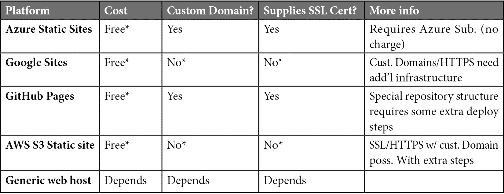
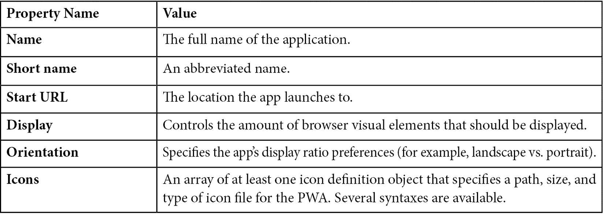

# 13

# 将应用转换为 PWA

在过去的几章中，可能已经逐渐变得明显，我们正在接近旅程的终点。穿越 Babylon.js 的广阔乡村，我们看到了很多，也做了很多，Space-Truckers 由于我们的努力已经是一个功能完整的游戏。现在，在我们进入第十四章的“扩展主题，扩展”章节的旁路之前，我们还需要在本章中完成高速公路上的最后一程。

虽然我们接近了终点，但这并不意味着我们已经到达那里——在 Space-Truckers 或轨道力学方面，接近并不算数，只有马蹄铁和手榴弹才算数。Space-Trucker，我们前面还有一段路要走，在我们达到服务时间限制之前还有时间，所以让我们继续前进吧！

在本章中，我们将揭示 Babylon.js 与 **渐进式网络应用**（**PWAs**）之间的交集。PWA 是一个中间空间，是基于浏览器的传统网络应用（无论这些天意味着什么）和原生桌面应用之间的混合体。它们可以像网站一样浏览，像应用一样安装，并且在没有互联网连接的情况下离线运行。用户还可以从他们的设备或主要的 App 商店中找到并安装 PWA——无论是 Google Play、Microsoft 还是 Apple。这为开发者提供了更大的空间，允许潜在用户发现他们的应用，同时实现成本和努力都相对较低。

重要提示

Apple 对 PWAs 的支持远远落后于其他提供商。对在 iOS 上运行的 PWA 施加了一些严重的限制和限制，并且在支持不同功能时可能会有自己的怪癖。请参阅优秀的第三方网站 [`firt.dev/notes/pwa-ios/`](https://firt.dev/notes/pwa-ios/)，了解 Safari 和 iOS 的最新功能支持。

将我们的现有网络应用转换为 PWA 既简单又容易，但确实需要对应用进行一些修改。需要一个 Service Worker 来支持离线功能，需要一个清单来描述我们的 PWA 的特性。这包括图标、描述，甚至可能还有用于商店提交的截图。然而，Space-Truckers 缺少的一个最终特性我们将在本章中实现（如果我们没有这样的东西，这还算得上是“走得更远”的章节吗？）。

这个功能在历史上导致了无数争论和兄弟姐妹、好朋友之间的紧张关系。这个功能使得人们可以吹嘘自己的高分，回想起那些经典的荣耀日子，如 *Galaga*、*Pac-Man* 和 *Donkey Kong*。当然，这个功能是一个高分榜。我们追求的是一个比那些日子稍微现代一点的计分板，因为我们的计分板将保存不仅仅是前 10 名的高分；它还将通过将数据保存到 **IndexedDB** 来保留这些分数在应用程序启动和计算机重启之间的状态。

这就是本章计划的全部内容——与之前的章节不同，这里需要的概念性和理论性讨论要少得多，所以让我们开始吧。不过，首先让我们快速浏览一下本章的 *技术要求部分*。与之前的不同，这是因为，正如我们很快就会了解到的那样，PWA 有一些特定的主机要求必须满足。

我们将在本章中介绍以下主题：

+   PWA 简介

+   将 Space-Truckers 应用程序转换为 PWA

+   使用 IndexDB 持久化分数

+   存储和显示高分

# 技术要求

本章有新的技术要求，尽管成本很低甚至没有成本，但确实需要您做出一些决定，并可能需要进行一些研究，以帮助您达到最适合您项目的具体结果。在讨论 **安全套接字层**（**SSL**）证书要求之后，我们将介绍一些托管您的 PWA 的更受欢迎的选项。

## 主机要求

简单来说，SSL 是一种机制，通过它客户端可以验证特定服务器的身份并建立加密的通信通道。它实际上是 HTTPS 中的“s”！SSL 连接是 PWA 的一个必要条件，没有例外。尽管没有例外，实际上有一个例外，那就是 localhost 回环地址，这使得测试更加容易。在大多数情况下，获取有效的 SSL 证书是免费且易于执行的。根据您的托管设置，SSL 支持甚至可能已经集成到托管平台中！请查阅您特定提供商的文档，了解更多有关如何获取和绑定站点到证书的信息。

## 托管您的 PWA 的选项

在将应用程序制作成 PWA 方面，主机提供商并没有什么特别之处；任何支持 SSL 的公开网站都有能力托管 PWA。某些环境可能会使围绕 SSL 或 HTTPS 基于的 Web 应用程序的组织和流程变得更容易或更难，因此这里有一个表格列出了一些主要的托管选项：



如果你的应用程序源代码已经在 GitHub 上托管，GitHub Pages 是一个最简单的选择。部署到 GH 页面站点涉及将提交推送到一个特别命名的（且从未合并的）分支。在我们的情况下，提交的内容实际上是 `npm run build` 的输出——`dist/ 文件夹`及其所有内容。

`.github/workflows` 文件夹包含详细信息。

Google 和 AWS 静态站点都是独特的产品，尽管如此，它们仍然提供了与之前两个相同的基本服务。AWS 通过 AWS Amplify 提供静态网站，而 Google 也在其云存储产品中提供了类似的服务。这些服务旁边带有星号的原因是，基础产品不支持自定义域名，也不支持在这些自定义域名上提供 HTTPS，至少不是默认情况下。开发者需要做更多工作来添加其他必要的基础设施组件（例如 HTTPS 代理），以实现和满足自定义域名和 SSL 或 HTTPS 的要求。有关如何进行此操作的更多信息，请参阅下一节提供的文档——我们面前没有足够的道路可以避开这个话题的细节！

## 资源和阅读

+   PWA Builder – [`pwabuilder.com`](https://pwabuilder.com)

+   IndexedDB API – [`developer.mozilla.org/en-US/docs/Web/API/IndexedDB_API`](https://developer.mozilla.org/en-US/docs/Web/API/IndexedDB_API)

+   Azure 静态 Web 应用：

    +   [`docs.microsoft.com/en-us/azure/static-web-apps/`](https://docs.microsoft.com/en-us/azure/static-web-apps/)

    +   [`docs.microsoft.com/en-us/azure/storage/blobs/storage-blob-static-website-how-to?tabs=azure-portal`](https://docs.microsoft.com/en-us/azure/storage/blobs/storage-blob-static-website-how-to?tabs=azure-portal)

+   AWS Amplify – [`aws.amazon.com/amplify/hosting/`](https://aws.amazon.com/amplify/hosting/)

+   Google 静态站点 – [`cloud.google.com/storage/docs/hosting-static-website`](https://cloud.google.com/storage/docs/hosting-static-website)

+   GitHub Pages 和 PWAs - [`christianheilmann.com/2022/01/13/turning-a-github-page-into-a-progressive-web-app/`](https://christianheilmann.com/2022/01/13/turning-a-github-page-into-a-progressive-web-app/)

+   Service Workers 和 Workbox：

    +   [`developer.chrome.com/docs/workbox/service-worker-overview/`](https://developer.chrome.com/docs/workbox/service-worker-overview/)

    +   [`developer.chrome.com/docs/workbox/`](https://developer.chrome.com/docs/workbox/)

+   本章的源代码位于 Space-Truckers GitHub 仓库的 `ch13` 分支中 - [`github.com/jelster/space-truckers/tree/ch13`](https://github.com/jelster/space-truckers/tree/ch13)

+   操场 URL 列在其相关部分

# PWAs 简介

如介绍中先前所述，PWA 是一种介于网络应用程序和常规桌面应用程序之间的混合类型的应用程序。在没有额外上下文的情况下，这是一个几乎无意义的描述。不是个别单词，也不是“Web App”这个术语缺乏清晰性，那么对于一个网络应用程序来说，“渐进式”意味着什么呢？

好吧，正如我们大多数人当然所意识到的，网络浏览器的安全模型与常规应用程序或游戏大不相同。在浏览器沙盒环境中运行的 JavaScript，按照设计，对底层机器的硬件和文件系统有极其有限的访问权限。对我们讨论来说重要的是对脚本的限制，以及浏览器中广泛的支持实现，这意味着任何给定的网络应用程序可能或可能没有访问某些设备功能和功能。在这些类型的案例中，或者当应用程序被广泛分发到不同的设备和软件配置文件中时，对于应用程序能够根据托管设备拥有的和愿意与浏览器应用程序共享的内容，按需“渐进式”和优雅地增强或降低其功能，这一点非常重要。

这就引出了下一个问题：PWA 是如何工作的？一个网络应用程序必须满足三个主要定义要求，才有资格被网络浏览器安装为 PWA。这些要求是 **SSL**、**Service Workers** 和 **(Web) Manifests** （**SSM**）。这么多需要消化的词汇，时间却如此有限。让我们准备一把沙拉叉，更详细地探讨这些内容。

注意

如果你喜欢（或者如果你只是真的很喜欢让人困惑），你可以使用 MMS 或甚至 SMS 作为首字母缩略词。做你自己吧！

## SSL

通过 HTTPS 进行，这是一个不可协商的要求 – 而且原因很好！将网络应用程序作为 PWA 安装大大扩展了应用程序的功能，但同时也相应地使主机机器及其数据面临更大的风险，恶意或不称职的参与者可能会访问它。要求客户端和服务器之间建立安全连接既不能弥补不称职或糟糕的编码，也不能保证涉及的服务器免受恶意意图的侵害。它所保证的是，托管站点的身份已经得到验证，确认为该站点所声称的那样。

## Service Workers

以前用于从离线使用中获取和检索资产，SW 是从与主应用程序代码分离的 JavaScript 文件中加载的代码。在无 DOM 的沙盒中运行，SW 仍然是应用程序和底层网络之间的关键中介。SW 允许应用程序以透明的方式离线使用 – 应用程序中没有任何部分知道当它为资源发出网络请求时，它实际上是在与 SW 通信。

每当脚本、HTML 标签或 CSS 定义触发来自 Web 应用程序的网络请求时，该请求会被 Service Worker 拦截和处理。然后，Service Worker 可以选择从其缓存中返回指示的资源给调用者，或者刷新其缓存后再返回资源。为了使这一过程更加有效，Service Worker 在安装和激活后的首要任务是预先获取所有资源并将它们提前放入其缓存中。

## Web 清单

最后，要“解锁”浏览器中 PWA 的功能，需要的是一个 Web 清单。这是一个简单的 JSON 格式文件，通常以 `.webmanifest` 扩展名，它向 Web 浏览器和其他清单消费者提供了关于应用程序的各种有用信息。除了包含关于应用程序的基本信息，如名称、描述和版本外，清单还包含允许开发者指定图标图像的章节，这些图像可以以不同的尺寸和比例显示在宿主操作系统（例如 iOS 主屏幕）上，显示方向偏好、截图，甚至年龄和内容评级。在 Mozilla 开发者文档网站上查看可能的元素及其含义的完整列表，请访问 [`developer.mozilla.org/en-US/docs/Web/Manifest`](https://developer.mozilla.org/en-US/docs/Web/Manifest)。

这些不同的元数据共同工作，描述了应用程序应该如何呈现以及其预期行为的参数。此外，当在应用商店中列出 PWA 时，Web 清单被大量利用。能够一次性定义应用程序的元数据并在任何地方发布的好处应该是显而易见的，但如何轻松地为这些属性定义值则不是那么简单。幸运的是，就像使用 Babylon.js 一样，有许多工具和资源可以帮助加快这个过程。

我们将在稍后介绍 PWA 的工具和机制，但首先让我们总结一下我们对 PWA 以及它们如何工作的了解。当用户浏览到一个启用了 PWA 的网站时，浏览器中会出现一个图标，表示可以为当前网站安装一个应用程序。点击该图标将原本的普通网站转换为一个离线可用、可固定到开始菜单的应用程序，与原生应用程序无法区分。

使得这一切成为可能的是 PWA 必须正确配置的三个具体事物——SSM 三重奏：（S）SL 连接，一个（S）ervice Worker 来预先获取和缓存离线使用的资源，以及一个 Web（M）anifest。拥有 SSL 连接意味着托管 PWA 的网站是通过 HTTPS 协议访问的，并且需要获得有效的证书来执行此目的。SWs 是运行在浏览器应用程序代码的独立沙盒中的 JavaScript 代码组件。它们透明地拦截请求并返回存储在本地的缓存资源。Web Manifest 描述了托管操作系统和浏览器需要知道的一切，以便安装 PWA。此外，Web Manifest 还充当应用商店包列表，这意味着通过准备单个商店提交的努力，可以提交到所有主要的应用商店。

在下一节中，我们将增强 Space-Truckers：Web 应用，使其成为 Space-Truckers：渐进式 Web 应用。我们将看到两个简单的包，加上一点代码和 WebPack 配置，就足以完成这项工作。从某种意义上说，转换的简单性和容易性可能有点令人失望，但别担心——我们很快就会看到，当我们来到高分榜时，我们会添加一些更炫酷、更有特色的东西！

# 将 Space-Truckers 应用转换为 PWA

正如我们在本节之前简要讨论的那样，PWA 的一个标志性的——或称特征性——功能是其能够优雅地适应不同的条件和托管环境。当网络连接丢失时，应用程序应该如何表现？当发布应用程序的新版本时会发生什么？当资源发生变化时，你如何确保删除任何旧的缓存资源版本，并存储新的版本？

## 将“P”融入 PWA

这些都是很好的问题，它们提出了需要解决的真实的技术和工程挑战。如果你是那些美丽、好奇、聪明且有点疯狂的人之一，你应该准备好自己可能会失望。虽然，再次强调，这些都是值得研究和理解的有价值的话题，但这是一个工具已经发展到可以知道很少关于底层技术的情况下完成很多事情的情况。这个部分——或者更确切地说，整个章节——的总体简洁性可能没有逃过你的注意，这只是一个提示，说明了将“P”融入 PWA 是多么容易。

也可能这本书的作者最初计算了承诺的页数，并意识到预算的页数已经很久以前就超出了，但这里没有人来争论哪个是哪个，对吧？

注意

*[是的，实际上，我们非常关注页面数量。 —— 编辑们]*

那么，为了尽快进入正题，并且避免进一步激怒编辑们，让我们一步步来，将 Space-Truckers 转换成一个 PWA。

### 第一步 – 安装 Workbox WebPack 插件

**Workbox** 是由 Google 维护的一个开源项目，旨在使 SW 的创建、使用和管理变得顺畅和简单。该项目还维护了一个与 **WebPack** 集成的插件（见 *第四章*，*创建应用程序*），并自动为你生成 SW 代码。使用以下命令将它们作为开发依赖项安装到项目中，与 **CopyPlugin** 一起：

```js
npm i workbox-webpack-plugin copy-webpack-plugin --save-dev
```

`copy-webpack-plugin` 是一个简单的插件，它将静态文件从指定的目录复制到与 webpack 输出相同的目录中，这在我们需要将图标和 **Web Manifest** 包含在构建中时非常有用。

### 第二步 – 配置 WebPack 插件

我们已经将新插件提供给 WebPack，现在我们需要将它们导入到 `webpack.common.js`：

```js

const WorkboxPlugin = require('workbox-webpack-plugin');
const CopyPlugin = require('copy-webpack-plugin');
```

接下来，我们将使用各自的选项实例化插件。如果你还记得 *第三章*，*建立开发工作流程*，WebPack 插件的运行顺序是它们被定义的顺序。这些新插件需要在将包注入 HTML 模板和清理目标目录之后运行：

```js

plugins: [
    new CleanWebpackPlugin(),
    new HtmlWebpackPlugin({
        template: path.resolve(appDirectory, "public/index.xhtml"),
        inject: true
    }),
    new WorkboxPlugin.GenerateSW({
        clientsClaim: true,
        skipWaiting: true,
        maximumFileSizeToCacheInBytes: 8388608,
    }),
    new CopyPlugin({
        patterns: [
            { from: path.resolve(appDirectory,
              'public/assets/icons'), to:
              path.resolve(appDirectory,
              'dist/assets/icons') },
            { from: path.resolve(appDirectory,
              'public/manifest.json'), to:
              path.resolve(appDirectory,
              'dist/manifest.webmanifest') }
        ]
    })
]
```

`GenerateSW` 和 `InjectManifest`，它们的使用案例分别属于“基础”和“高级”类别。我们的需求目前非常基础，所以我们使用 `GenerateSW` 插件。它的配置有标志指定 SW 应立即声明匹配的客户端（对于升级场景）以及跳过等待旧工作者被销毁。最重要的是，我们将 `maximumFileSizeToCacheInBytes` 设置为其默认值的四倍。这是因为我们希望尽可能多的资产被本地缓存。

在后续步骤中创建这些文件之前，我们将对 `index.xhtml` 文件进行一些修改。

### 第三步 – 修改 index.xhtml

需要对存储库 `/public` 文件夹中的 `index.xhtml` 文件进行两项重要修改。第一项是在文件的 `<head>` 标签中添加一个 `<link>` 标签用于 Web Manifest。第二项是在页面加载时加载和注册 SW 的简短 `<script>` 标签：

```js

<link rel="manifest" href="./manifest.webmanifest" />
<script>
  if ('serviceWorker' in navigator) {
    window.addEventListener('load', () => {
      navigator.serviceWorker.register('service-worker.js')
      .then(registration => {
        console.log('SW registered: ', registration);
      }).catch(registrationError => {
        console.log('SW registration failed: ',
          registrationError);
      });
    });
  }
</script>
```

按照 PWA 倡导的优雅增强策略，我们的脚本对应用程序的其他部分是完全透明的——当它存在时，一切正常工作。在检查浏览器是否支持 SWs 后，使用 SW 脚本的名字和路径调用 `navigator.serviceWorker.register` 函数。这个脚本由 `GenerateSW` 生成并输出到 `/dist` 文件夹，所以文件引用似乎不存在不应该让你感到困扰！

在这个阶段，运行应用应该会生成预期的控制台消息，表明成功注册和操作了 SW。可能出现的常见问题包括 SW 的路径或文件名不正确，或者 `GenerateSW` 配置不正确。这样，PWA 要求中的 SW 部分就满足了——让我们来填写缺失的 Web Manifest。

### 第 4 步 – 添加 Web Manifest

如前文在 *PWA 简介* 部分所述，Web Manifest 是一个开发者友好的、JSON 格式的文件，描述了 PWA 的属性和特征。为了保持开发时的体验，我们将 Web Manifest 放入 `/public` 文件夹中，作为 `index.xhtml` 的同级文件。这确保了当我们的链接在 `webpack-dev-server` 上托管或为生产环境构建并从 `/dist` 文件夹托管时，链接能够正常工作。

文件名为 `manifest.json`，位于 `/public` 文件夹中，然后在构建时重命名为 `manifest.webmanifest`。以下是一些更重要属性：



对于 `icons` 数组，数组中的每个条目指定了一个图标，包括空白分隔的大小列表，以及一个路径，该路径直接指向一个文件或带有大小前缀的基本文件名——例如，`myicon`，其中文件名为 `48x48-myicon` 和 `52x52-myicon`。为每个可能的图标大小提供条目不是必需的，尽管根据源图像，可能会出现一些扭曲和意外的显示效果。在此阶段，当应用程序在本地 Web 服务器上运行时，浏览器应该能够“点亮”，允许将网站作为 PWA 安装。如果不行，请打开浏览器开发者工具并检查相关的控制台错误。在 Google Chrome 和 Microsoft Edge 浏览器的 **Lighthouse** 选项卡中可以扫描网站的各种问题以及优化问题，包括涉及 PWA 的问题。

Web Manifest 架构定义了许多其他属性，尽管不是很多是必需的，但许多是推荐的。要查看 manifest 中可用的更多属性，请参阅 [`developer.mozilla.org/en-US/docs/Web/Manifest`](https://developer.mozilla.org/en-US/docs/Web/Manifest)。手动创建和管理所有不同的元数据可能很困难，更不用说创建图标了，这就是为什么有工具可以帮助我们快速完成任务。之前讨论过的一个这样的工具是 Workbox 项目。另一个我们尚未讨论的工具是 **VSCode** 的 **PWABuilder 扩展**。

## 使用 PWABuilder 扩展

手动执行前面的步骤有一些好处。你在学习过程中可以精细控制每个细节，同时了解所有事物的内部结构。这同样是一个繁琐且容易出错的过程。前面步骤的一个替代方案是使用官方的**Visual Studio Code PWABuilder 扩展**。这个扩展由维护着优秀资源[PWABuilder.com](http://PWABuilder.com)的同一团队开发和维护，使得设置 PWA 变得快速且简单。除了为各种 PWA 组件生成源代码外，该扩展还可以验证现有网站以检查其 PWA 准备状态——这对于调试非常有用。

从**VSCode**扩展市场安装扩展后，打开扩展的左侧面板，以显示**Web Manifest**和**Service Worker**面板。在相应的面板上点击**+**图标以生成这些资源。在生成应用程序图标时，根据你的设置，PWA 扩展可能会生成整个范围的图标大小——数量可能超过 60 个。因此，一旦图标生成，你可以随意将这些文件缩减到最适合的一组大小。务必更新清单以删除这些文件！

在生成 SW 时，扩展会询问你是否想要`npm`包（例如`workbox`），并提供一个代码片段供你复制粘贴到`index.xhtml`中。代码看起来熟悉吗？

制作 PWA 的最后一步当然是发布应用程序到 HTTPS 主机。具体细节取决于你的主机提供商，但 Google、AWS 和 Microsoft 都提供了可以简化发布过程的 VSCode 扩展。无论涉及哪个提供商，目标都是运行`build`脚本，然后将`/dist`文件夹中的所有文件复制到主机网站的根目录。

正如本节引言中所承诺的，可用的工具和技术使得创建和部署 PWA 变得极其简单和快速。需要一系列四个简单的步骤——添加两个 Webpack 插件包以生成 Service Worker，修改`webpack config`，然后修改`index.xhtml`以注册 SW 和链接资源，最后添加 Web Manifest 来描述所需更改的范围。无论这些更改是手动执行还是借助如 PWA Builder Extension 之类的扩展，都会为应用开发者打开一个丰富的原生应用功能世界。我们还没有看到 PWAs 的全部功能和范围，所以请访问[PWABuilder.com](http://PWABuilder.com)了解更多关于它们可以执行的不同酷炫技巧！

在我们结束本章内容之前，还有一个话题需要探讨。高分是像`IndexedDB`这样的街机风格游戏的基础，大多数现代浏览器内置的`IndexedDB`对象存储是解决这类问题的绝佳方案，在接下来的章节中，我们将学习如何创建一个组件来利用它。

# 使用 IndexedDB 持久化分数

需要在本地客户端存储信息的 Web 开发者传统上只有有限的选择，其中大多数都有显著的缺点。最古老和最简单的方法之一是谦逊的浏览器 cookie。这些存储在客户端浏览器上的小文本文件会随着浏览器客户端发出的每个请求一起发送到服务器。正因为如此，以及类似的原因，cookie 并不是解决许多如果不是大多数客户端存储需求的效率高或实用的解决方案，包括我们自己的。要深入了解不同客户端存储的优缺点，请参阅[`web.dev/storage-for-the-web/`](https://web.dev/storage-for-the-web/)。

**IndexedDb 对象存储**（**IDB**）是一个客户端、浏览器沙盒数据库，在主要浏览器和平台上享有广泛且一致实现的跨平台支持。尽管一个网站允许存储的数据量限制在浏览器可用的磁盘空间内，但我们的应用程序除了资产之外，对存储空间的要求非常有限。

重要提示

虽然可以使用 IDB 作为纹理、网格等资产的缓存，但使用本章早期设置的 SW（Simple Web）设置对这些资产来说要容易得多、效率更高，并且整体上更适合。

本节的重点是 IDB 的基础知识以及我们如何在我们的应用程序中使用它。在花点时间回顾`IndexedDb`的基础元素之后，我们将编写一些代码，用更适用于应用层的辅助函数包装底层的 IDB 函数。然后，我们将看到如何将这些辅助函数集成到我们在下一节中使用的 Playground 中，即*存储和显示高分*。

## 了解 IndexedDB

`IndexedDB`是由**万维网联盟**（**w3c**）维护的官方 API 规范，该组织还负责大多数基于 Web 的标准，如 HTML 和 CSS。规范可以在[`w3c.github.io/IndexedDB/`](https://w3c.github.io/IndexedDB/)找到，但在这里我们不需要深入探讨以了解 IDB 的工作原理。

对于 IDB 规范在 Web 浏览器中的广泛支持让我们有信心可以继续使用这些 API，并且相同的代码应该在不同的浏览器中工作得一样好——关键短语是“应该工作”。不要忽略在不同浏览器和版本之间的测试。否则，你可能会面临很高的风险，遇到使用与您不同的设置的最终用户的支持问题！

当涉及到使用 IDB API 时，有两点需要注意。首先，它们是异步的。其次，操作通过各种事件处理函数产生结果。当一个异步操作被调用时，该函数的返回值不会立即可用——该函数不返回任何内容。此外，操作可能成功也可能失败。在前一种情况下，结果由特定于操作和对象的特定事件处理函数产生。`IDBOpenRequest`对象具有`onsuccess`、`onerror`和`onupgradedneeded`等事件处理程序，而`IDBObjectStore`对象具有`transaction.oncomplete`等事件。正如一些名称所暗示的，操作失败的情况由`onerror`处理函数处理。

一个重要的考虑因素是如何管理`indexedDB.open`函数的各种代码路径。`onsuccess`事件产生一个`IDBDatabase`实例，但这只是故事的一部分。当请求一个不匹配任何现有对象存储的数据库名称和当前模式版本的唯一组合（`Open`操作的第一个和第二个参数）时，将触发`onpugradeneeded`事件。正是在那时，特定的对象存储创建了其模式，添加了任何索引，并执行了任何版本更改迁移。

对于我们开始编写代码来说，这些基础概念已经足够了！我们需要编写一些辅助代码，这些代码将基于事件异步的`IndexedDB`函数，并使它们在我们的应用程序中易于使用。

## 使用 IndexedDB

与`IndexedDB`相关的所有不同需求、场景和数据模式定义构成了几个动态部分。因此，我们的第一个任务将是围绕这些操作构建一个包装器，以函数返回 Promise 的形式公开所需的 API。有几个库实现了类似的辅助代码，但为了我们的简单需求，自己编写代码更具说明性和实用性。

注意

以下代码模式在 JavaScript 编程中很常见，作为一种将较低级别或遗留编程接口包装成更易于高级应用程序消费的形式的方法。如果您不熟悉这种模式，它是一个值得拥有的工具箱中的有用工具！

代码片段**#U20E4X**包含了我们将用于本部分和下一部分的内容，所以请跟随我们的步伐，一起探索一些更有趣、更不透明和更复杂的样本部分。

我们将首先声明并存储`SpaceTruckersDb`函数作为我们的外部作用域。该函数的主体包含我们工作集的变量，这些变量在辅助函数之间共享以保持内部状态，以及一个包含种子`scoreData`的`const`数组：

```js

let SpaceTruckersDb = function () {
    const scoreData = [
        { name: "AAA", score: 10000 },
        { name: "BBB", score: 7000 },
        { name: "CCC", score: 5000 },
        { name: "DDD", score: 3400 },
        { name: "EEE", score: 3000 },
        { name: "FFF", score: 2500 },
        { name: "GGG", score: 2000 },
        { name: "HHH", score: 1000 },
        { name: "III", score: 1000 },
        { name: "JBE", score: 500 },
    ];
    let indexedDbIsSupported = window.indexedDB;
    const currentSchemaVersion = 1;
    const databaseName = "SpaceTruckersDb";
    const tableName = "HighScores";
    var database;
// ... 
return { retrieveScores, addScore, readyPromise };
```

跳到函数的底部，我们返回一个包含辅助函数的对象，这些函数用于检索分数列表以及添加新的分数。与这些函数并列的是`readyPromise`，它用于在调用者选择的时间检查并确保完整初始化。由于我们的需求非常简单，目前不需要任何额外的逻辑或方法。

整个示例中最复杂的逻辑是第一步——初始化 IDB 对象数据库以及相应的对象存储（或表），我们使用它来存储应用程序的评分数据。这很棘手处理，因为代码可能需要根据对象存储是否已存在以及对象存储的架构版本是否与请求的最新版本匹配来采取多个潜在分支。

这就是`onupgradeneeded`事件处理器必须处理的内容。我们从`readyPromise`代理函数体的顶部开始，通过调用`indexedDb.open`来执行操作。这返回（这是 IDB API 中唯一发生这种情况的时候之一）一个带有其伴随的`onerror`、`onsuccess`以及当然的`onupgradeneeded`事件的`openDbRequest`对象。错误逻辑很简单——拒绝`readyPromise`并传递抛出的错误。成功逻辑也很简单——只需将数据库变量设置为`event.target.result`，并用它来解决承诺。

注意

记住，对于给定的`currentSchemaVersion`和`databaseName`，脚本第一次运行时不会触发`onsuccess`事件。相反，会触发`onupgradeneeded`。

让我们看看`onupgradeneeded`事件会发生什么。在从事件对象中提取数据库之后，我们创建`objectStore`本身。`autoIncrement`标志表示新记录应分配一个自动递增的键，随后是创建非唯一分数索引。这很重要，也是必需的，以确保分数按正确的排名顺序存储：

```js

openDbRequest.onupgradeneeded = (event) => {
    database = event.currentTarget.result;
    database.onerror = handleError;
    let objectStore = database.createObjectStore(tableName,
      {
            autoIncrement: true
      });
    objectStore.createIndex("score", "score", 
      {unique: false});
    objectStore.transaction.oncomplete = (event) => {
        let scoreStore = database
       .transaction(tableName, "readwrite")
            .objectStore(tableName);
        scoreData.forEach(scoreD =>
          scoreStore.add(scoreD));
        resolve(database);
    };
};
```

在创建分数索引后继续操作，我们将一个函数附加到`objectStore.transaction`的`oncomplete`事件。这个函数立即对同一表（`scoreStore`）发起一个`readwrite`事务，然后用于用一组初始高分（`scoreData`）填充最初为空的分数表。在将种子数据添加到存储后，我们解决`readyPromise`——不需要等待写事务完成。这是我们为此组件拥有的最复杂的逻辑。

`retrieveScores` 和 `addScore` 函数都是基于 `onupgradeneeded` 事件逻辑所展示的主要主题的简化变体。一个带有请求的只读或读写权限的 `txn` 对象被创建。然后从事务中检索 `objectStore` 并用于执行 `getAll` 或 `add` 操作。对于 `getAll`，结果在 `objectStore.getAll` 返回的对象的 `onsuccess` 处理程序中产生，类似于 `indexedDB.open` 的结果在 `onsuccess` 中产生。

## 概述

如此简单，我们已经创建了一个可重用的组件，我们可以将其作为高分屏幕的一部分放入 Space-Truckers 应用程序中！在我们继续下一节之前，让我们回顾一下我们关于 `IndexedDB` 的学习内容。

IDB 是一种基于浏览器的存储机制，具有存储大量数据的能力。虽然基本存储方式是基于对象的，但 IDB 有包含一组一个或多个对象存储或表的数据库的概念。每个表的架构必须在创建时或架构版本升级时定义。这是通过传递给 `indexedDB.open` 函数的 `currentSchemaVersion` 来定义的。当当前版本不存在或低于请求的版本时，`onupgradeneeded` 事件被触发。

在此事件期间，创建对象存储，定义它们的索引，并填充它们的数据。在升级版本时，在事件处理程序中包含迁移逻辑很重要——否则，数据将会丢失！在我们的情况下，我们不需要迁移分数数据，而且我们不太可能很快需要进行实质性的更改来要求架构更改（请参阅本章末尾的 *扩展主题* 部分以获取一些可能涉及该操作的想法）。

由于访问 IDB API 的模式本身不支持 Promises，我们已将所需的操作包装在一个支持 Promises 的包装器中。`readyPromise` 是实际初始化和打开对象存储的地方，也是 `onupgradeneeded` 逻辑所在之处。一旦 `readyPromise` 解决，`getScores` 和 `addScore` 方法就变得可用。这些函数也返回它们各自操作的 Promises，生成分数列表或确认已添加新分数。

我们的 IDB 包装函数是我们为了构建高分屏幕而必须构建的工具——现在，是时候使用它们了。在本章的最后部分，我们将结合我们刚刚学到的内容以及我们关于协程的知识，再加上我们可重用的 GUI DialogBox 组件，来创建一份美味的沙拉，那就是 Space-Truckers：高分榜！

# 存储和显示高分

沿着我们在上一节结束的烹饪主题，本节是关于将我们的成分组合成一顿饭。所有艰苦的工作和学习都已经发生，所以这一节会很快过去——这样我们就可以开始大快朵颐了！我们将使用[`playground.babylonjs.com/#VBMMDZ#23`](https://playground.babylonjs.com/%23VBMMDZ%2323)上的游乐场作为现场示例——继续跟随或尝试在本节描述和代码片段中提到的示例中复制功能。

重要提示

不要尝试吃掉你的电脑，或者任何不是食物的东西——我们只是在用隐喻，尽管这个隐喻比必要的还要夸张！事实上，让我们完全改变主题。在本节的剩余部分，我们将采用经典的盗窃风格，类似于*Ocean’s Eleven*。

## 《盗窃案》

仅依靠“肌肉”即`DialogBox`的不情愿帮助，将分数列表扔到屏幕上并就此结束是不够的。同样，仅引入机智的“破锁匠”`SpaceTruckersDb`来完成工作也是不够的。如果我们真的想完成这项重大任务，即《高分》，每个分数都需要有一个盛大的亮相。否则，至少它们不应该像一群喧闹的猴子冲击香蕉桶一样同时出现在屏幕上。对于需要记录的新高分，我们需要能够以“传统”的三字母格式收集用户的姓名，这种格式是老式街机柜所使用的。我们需要“智慧”来进行思考。我们需要我们的老朋友**协程**“为了最后一次工作而‘退休归来’”。

为了以激动人心的子章节总结我们的计划，想象一个引人入胜的蒙太奇序列，展示对《队伍》来说完成这项工作有多困难（实际上，并不困难，但请随我这么说），让我们开始吧。

## 肌肉

我们将使用`DialogBox`组件来托管高分显示（参见*第九章*中的*“构建可重用对话框组件”部分，*计算和显示得分结果*）。分数本身托管在`bodyContainer`中。每个分数都是一个仅包含名称和分数属性的对象。`getScoreTextLine`辅助函数接受一个单独的分数对象，并返回一个可以显示在`TextBox`中的格式化字符串：

```js

function getScoreTextLine(s) {
    if (!s.score) {
        return s.name;
    }
    let scoreText = s.score.toFixed(0);
    let text = `${s.name}${'.'.repeat
      (20 - scoreText.length)}${s.score}\n`;
    return text;
}
```

虽然我们期望`s.score`值存在，但我们仍然检查其缺失，因为添加新分数的过程必然排除了输入姓名的可能性。我们还期望分数是一个完整的整数值，但我们将其转换为固定字符串，小数点后没有零分，以确保安全。返回一个格式字符串，考虑分数值文本表示的长度。

## 破锁匠

持久性逻辑将由我们在上一节中构建的 `SpaceTruckersDb` 提供。其函数由 `scoreBoardCoro` 调用和管理。正如当前主题形式所要求的，关于“撬锁者”的更多内容将不会包含在我们的“大脑”审查中。

## 大脑

`DialogBox` 以及输入新得分的编辑模式。当 `scoreBoardCoro` 作为函数被调用（作为准备运行协程的一部分——见 *第九章**，计算和显示得分结果*，了解更多），`newScore` 参数用于传入等待三个字母品牌的新高分。如果存在，则设置 `editHighScores` 标志，并将一个占位符 `scoreToAdd` 添加到已由 `databaseManager` 获取的得分列表中，该列表在进入时立即初始化。同样，`nameInput` 的 `nameInput.onTextChangedObservable` 限制了输入长度为三个字符或更少。此外，当检测到按下 *Enter* 键时，它还会采取行动，将 `editHighScores` 标志设置为 `false`：

```js

nameInput.onTextChangedObservable.add((ev, es) => {
    if (ev.text.indexOf('↵') >= 0 || ev.text.length >= 3 || 
        ev.currentKey === "Enter") {
            scene.editHighScores = false;
    }
});
// ...
while (scene.editHighScores) {
    yield Tools.DelayAsync(1000);
}
```

一旦协程完成等待退出编辑模式，如果有 `newScore`，这意味着用户已经输入了他们的首字母，得分正在等待保存。我们在清理涉及收集用户输入的控制之前完成这项工作：

```js

if (newScore) {
    scoreToAdd.name = nameInput.text.substring(0,3);
    await databaseManager.addScore(scoreToAdd);
    console.log('saved newScore', scoreToAdd);
    virtualKB.disconnect();
    virtualKB.dispose();
    newScore = null;
    nameInput.dispose();
    scoreToAdd = null;
    scores = await databaseManager.retrieveScores();
    await displayScores(scores);
}
```

在清理了控制之后，我们从存储中刷新 `scores` 列表，将一切恢复到干净、初始的状态。如果没有 `newScore`，协程的工作就完成了，工作也就完成了——得分已经在协程执行的开始时检索并显示。有了这样一支技艺高超的团队和精心的准备，对于跟随的人来说，展示得分的任务本身既简短又甜蜜。

## 工作

组建团队是至关重要的第一步，规划工作内容是第二步，现在到了执行计划的时候了。以下是以下步骤在事件线性序列中的蒙太奇快捷方式：

1.  (`yield`) 直到“撬锁者”（`databaseManager`）表示它已准备好。

1.  从“撬锁者”（`databaseManager`）获取 `scores` 列表并将其放入 `scores` 数组中。

1.  展示“肌肉”（`DialogBox`）。等待它完全进入后再继续。

1.  如果“大脑”表示还有另一个得分要添加（`newScore`），则会发生以下情况：

    +   `editHighScores` 标志被设置

    +   创建了一个不带名称的占位符得分条目，并将其添加到 `scores` 列表中

    +   输入元素被放置以收集玩家的首字母（`nameInput` 和 `virtualKB`）

    +   一只“小鸟”（即观察者）监听输入元素的变化，当按下 *Enter* 键或输入了三个或更多元素时，会切换出 `editHighScores` 模式

1.  “主持人”展示得分（调用 `displayScores`）。

1.  在等待编辑标志落下（当`editHighScores`为`true`时使用`yield`）的过程中，紧张感逐渐升级。

1.  准备逃跑，但首先，“大脑”扫描新“解放”的分数（`scoreToAdd`）。

1.  在跳上逃跑车辆之前，“主持人”上演了一场烟雾弹表演（清除并重新显示存储中的分数）。

1.  我们看到《船员》团队成功完成工作后走向夕阳。字幕滚动，灯光亮起。


图 13.1 – 在添加或编辑模式下的《太空卡车手》高分排行榜

目前还没有计划制作续集（…） – 然而，扩展版（导演剪辑版）展示了勇敢的盗贼完成工作后的情况，以及将之前讨论的代码片段与整体《太空卡车手》应用程序整合的细节。

## 整合

`DialogBox`组件的美丽之处在于它可以被插入到现有的场景中。这是好事，因为我们希望能够在两个不同的地方显示屏幕 – `HighScoreScreen`是一个高级包装函数，它实例化和启动`ScoreBoard`协程，返回`scoreBo.dialog`实例，以便调用者可以监听其关闭。

这在连接到也新添加的**高分**按钮的`onHighScoreActionObservable`中是如何实现的，该按钮由以下选项数据定义：

```js

const highScoreOpts = {
    name: "btHighScores",
    title: "High Scores",
    background: "green",
    color: "black",
    onInvoked: () => {
        logger.logInfo("High Scores button clicked");
        this._onMenuLeave(1000, () =>
          this.onHighScoreActionObservable.
          notifyObservers());
    }
}
```

这与其他作为`MainMenuScene`构造函数的`_addMenuItems`私有函数部分添加的菜单按钮使用的相同模式 – 菜单在通知`onHighScoreActionObservable`观察者有有趣的事情发生之前淡出了一秒钟。

该观察者的订阅者是在`MainMenuScene`构造函数的构造函数中设置的，负责设置`scoreDialog`并在用户点击**返回**后返回 UI 到**主菜单**：

```js

this.onHighScoreActionObservable.add(async () => {
    this.isTopMost = false;
    let scoreDialog = HighScoreScreen(this.scene);
    scoreDialog.onCancelledObservable.add(() => {
    this._onMenuEnter(1000);
    this.isTopMost = true;
});
```

我们已经将`isTopMost`标志引入到`MainMenuScene`中，以便我们知道是否处理输入（参见`MainMenuScene.update`函数）或者是否有任何`DialogBox`实例负责这项任务。一旦我们设置了该标志，我们就通过`HighScoreScreen`函数显示并获取`scoreDialog`实例。现在`scoreDialog`实例可用，我们就可以将其逻辑附加到`onCancelledObservable`上，该逻辑重新显示菜单并将其设置为处理输入。

类似地，`scoringDialog`将其处理程序附加到其`onAcceptedObservable`上，这与`MainMenuScreen.onHighScoreActionObservable`处理程序所做的一样：

```js

scoreDialog.onAcceptedObservable.add(async () => {
    let score = scoreData.finalScores['Final Total'];
    await scoreDialog.hide();
    let scoreScreen = HighScoreScreen(scene, score);
    scoreScreen.onCancelledObservable.add(async () => {
        await scoreDialog.show();
    });
});
```

这里的主要区别在于在调用`HighScoreScreen`之前，我们正在提取`Final Total`分数值并将其与场景一起传递到函数中，以便它可能被添加为列表中的新条目。

能够通过少量修改现有组件来满足新要求，是软件架构和设计的一个巅峰成就，这使得它成为结束本节的绝佳地方。在本节中，我们概述了持久化和显示高分过程中涉及的事件序列和参与者。现有的`DialogBox`组件被重用来托管分数板，而本章前面的部分构建的`IndexedDB`组件提供了存储，`ScoreBoard`协程则协调一切。

集成最简单的情况是从`isTopMost`标志到高分屏幕的过渡，这样它就知道在显示对话框时不要处理输入，我们还添加了`onHighScoresActionObserver`来指示何时切换屏幕。其余的只是将适当的显示和隐藏逻辑连接到各种对话框事件。还能做些什么呢？太多了！请参阅本章末尾的*扩展主题*部分，以获取一些关于可以贡献的改进想法。

# 概述

我们本章从关注将我们的应用转变为 PWA 所需的要素以及如何实现开始。我们通过实现应用的高分榜结束本章，并在其中我们学到了很多。让我们回顾一下我们学到了什么。

PWA 是一种应用类型，它模糊了常规网站和传统原生应用之间的界限。与桌面应用一样，PWA 可以在没有网络连接的情况下离线运行。它能够访问宿主计算机的文件系统和硬件设备。此外，与桌面应用一样，PWA 可以通过 App Store（如苹果 App Store、谷歌 Play 或微软商店）发布和部署。与桌面应用不同，PWA 可以通过单个 URL 访问，并以功能减少的常规 Web 应用的形式运行。当遇到不同的限制或约束时，应用会优雅地增强或降低其功能，这使得 PWA 适用于广泛的场景。

一个网络应用程序要被视为 PWA，需要三个元素：用于保护连接的 SSL 托管，用于预缓存和拦截请求的 SW，以及用于定义应用程序元数据的 Web Manifest。在 SSL 下托管网站需要一系列步骤，这些步骤因具体的托管提供商而异，并且非常依赖于特定的托管提供商。例如，Azure Static Web Apps 允许具有自定义域名的网站无需开发者提供或购买证书即可使用 SSL，而 Google 和 AWS 都要求提供额外的基础设施来支持某些或所有 SSL 场景。SW 是运行在浏览器沙箱执行环境中的代码片段。它们可以做各种事情，但在我们的简单应用程序用例中，我们使用它们来进行预缓存和资产的加载。当应用程序从远程 URL 请求特定资源时，SW 会拦截请求并从本地缓存中提供响应，从而允许在不修改任何应用程序代码的情况下实现透明的离线机制。Web Manifest 充当应用程序对任何感兴趣系统的主描述符。它是一个包含一些必需元素和许多可选元素的 JSON 文档，用于将 PWA 打包和发布到应用商店，以及指定 PWA 安装后的外观和感觉。

当涉及到在客户端存储数据的不同方式时，不再需要依赖于如 cookies 之类的机制来持久化任意数量的数据。IndexedDb 浏览器服务为应用程序提供了一个对象存储，可以存储任意大量的数据。尽管使用 IDB 的编程模式并不复杂，但最好通过包装它们以更易于处理的方式与 Promises 集成。我们的需求足够简单，以至于我们不需要在这里使用许多现有的可以与 IDB 一起工作的库，因为我们只需要能够添加一个分数并检索分数列表。

高分屏幕展示了`DialogBox`组件的美丽与强大，用于显示，IDB 组件用于持久化，以及一个协程来管理所有这些到`SpaceTruckerHighScores`组件中。`DialogBox`的通用性使我们能够轻松地将新的高分屏幕集成到 Space-Truckers 应用程序的其余部分。主菜单和**得分对话框**都为计分板提供托管，允许得分达到标准的玩家使用物理键盘或虚拟键盘输入他们的三个字母的首字母。

可以增强和添加到应用程序中的内容有很多，但开源项目的美妙之处在于任何人都可以为其做出贡献——甚至是你！查看并发布有关游戏或书籍的**讨论板**上的问题或评论。仓库中列出的问题涵盖了不同的人确定需要解决或实现的各种工作。不同的标签以不同的方式表示和分类问题——例如，*“良好入门问题”* 标签旨在为新贡献者提供一个简单或直接的任务，以便他们能够轻松上手，并且可以在不讨论的情况下相对容易地完成。查看 [`github.com/jelster/space-truckers/issues`](https://github.com/jelster/space-truckers/issues) 上的问题列表和 [`github.com/jelster/space-truckers/discussions`](https://github.com/jelster/space-truckers/discussions) 上的讨论。

我们的空间之旅信号已开启，我们正准备进入旅行的最终阶段——我们正接近终点！在我们通过当地街道和十字路口导航到太空码头进行交付的过程中，我们还有一些未了的事宜要处理。下一章将是一个大杂烩，我们将尝试尽可能多地涵盖我们之前未涉及的所有内容。当地导游将帮助我们穿越这些蜿蜒曲折的街道，同时我们将探讨一些前沿主题，如实时光线追踪（路径行进）、**WebXR**、VR 和 AR 应用程序，以及 Babylon Native，但也会涉及一些重要的实用主题，例如使用 Babylon.js 与 CMS 或电子商务应用程序。请系好安全带——这次旅行还没有结束！

# 扩展主题

+   使用 SW 执行除了获取和缓存数据之外的任务。通过将 Space-Trucker 渲染移至 *离屏画布*，将你的帧率提升到极致。本质上，你将使用 SW 在与 JavaScript 通常卡在的单个主执行线程不同的执行线程上执行实际的渲染工作。Babylon.js 文档在 [`doc.babylonjs.com/divingDeeper/scene/offscreenCanvas`](https://doc.babylonjs.com/divingDeeper/scene/offscreenCanvas) 对此有更详细的说明。

+   添加一个按钮或键组合，从数据库中清除所有现有得分。这是一个两阶段特性：第一个任务是向 `SpaceTruckerDb` 添加删除或清除得分的功能，第二个任务是提供一种调用该功能的方法。

+   动画化列表中每个单独得分的进入效果。如果效果随得分排名而变化，则加分。如果玩家获得高分时能展示一场精彩的烟花表演，则额外加分。

+   将入口 JavaScript 模块拆分，使着陆页、得分和主菜单在最初加载的模块中，而驾驶和路线规划部分在单独的模块中。这将极大地提高初始页面加载时间，并允许 SW 更高效地获取游戏资源。
