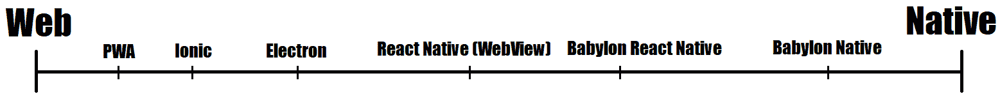
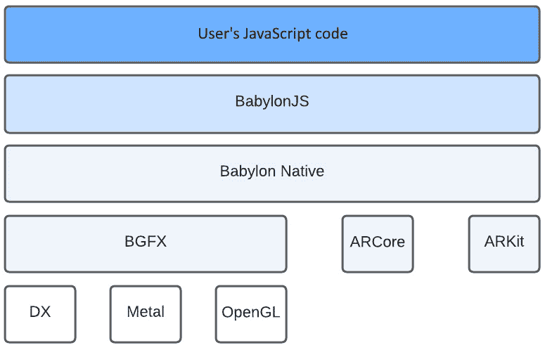
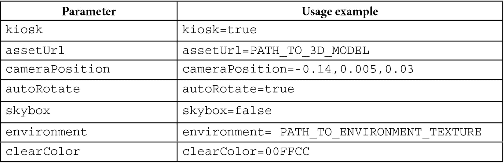

# 扩展主题，扩展

这是一章关于结束，但同时也是关于开始。我们在这段漫长的旅程中可能即将到达目的地，但这只是你与 Babylon.js 个人旅程的开始。在这一章中，我们放弃任何线性或顺序进展的假象，而是将在几个不同的主题之间跳跃，每个主题都将为你提供独立的起点，帮助你与 Babylon.js 一同走得更远。

在导航不熟悉的街道时，有一个向导是有用的，这个人对某个地区有深入了解。一个有深厚实践经验的人，知道如何引导游客和新来者到最好的地方和景点。我们的 Space-Dispatcher 已经找到了几位有才华的人，他们将会向我们展示在旅行中我们没有看到或了解到的 Babylon.js 的区域。

在这一章中，我们将参观 BJS 的两个活跃的施工现场。在第一个施工现场，我们将了解将 Babylon.js 的简单优雅从网络直接带到设备硬件上的持续努力——Babylon Native。第二个施工现场涵盖了激动人心的世界（“元宇宙”）——**增强现实**（**AR**）和**虚拟现实**（**VR**）的世界，形式为 **WebXR**——基于 Web 的 AR/VR 应用程序的新标准。

在这些停留之后，我们将遇到我们的第一位向导，BJS 社区成员，论坛上的连续帮助者，Andrei Stepanov，他将带我们通过装卸码头进入 Babylon.js 商场。他将通过一次游览展示如何轻松地将 BJS 与内容管理系统和电子商务平台结合使用，展示最新小工具的璀璨展示。与 Stepanov 先生告别后，我们接下来将访问一个闪亮的新交通枢纽，以便去见我们的最后一位向导，Erich Loftis。

Erich 已经在一段时间的个人旅程中四处游历，他将通过他寻求 3D 图形中真实感圣杯——**实时光线（路径）追踪**的故事来娱乐和启发我们。这只是即将到来的预览，因为现在是时候向右转，戴上安全帽，我们即将进入我们的第一个 AR 和 VR 施工现场——**WebXR**。

在任何特定的技术领域，总有更多东西可以学习，当话题迅速变化时，这一点加倍或更多。**WebXR** 是开发基于 Web 的 AR 和 VR 的标准，并且由于其快速发展的标准和支持混合体，它符合“加倍或更多”的政策。当我们学习 **WebXR** 时，我们不会关注标准的每一个特性——那就像在热浪中试图在山坡上滑冰一样。我们将关注 Babylon.js 的特性和功能，这些特性和功能允许你作为开发者编写利用 **WebXR** 的应用程序，同时降低这些不断变化的标准和 API 所涉及的风险。

下面是本章我们将涉及的主题：

+   使用**WebXR**进行 AR 和 VR

+   **Babylon.js Native 项目**之旅

+   将 3D 内容融入网站

+   路径追踪到高级渲染

# 使用 WebXR 进行 AR 和 VR

摩尔定律不可阻挡的步伐，以稳定的速度将越来越大的计算能力带入越来越小的微芯片中，已经持续了足够长的时间，以至于普通消费者在智能手机和平板电脑中拥有了惊人的原始计算硅含量。现在的智能手机处理能力已经足够强大，以至于可以设想 AR 和 VR 等场景。

AR 是一个涵盖大量不同用例和场景的应用程序类别。这些场景的共同特征是它们利用设备的摄像头、位置、朝向和其他传感器将 3D 内容嵌入到对现实世界的描绘中。VR 与 AR 非常相似，只是内容不是沉浸在使用者的世界中（现实世界），而是使用者沉浸在内（虚拟世界）。

考虑到 AR 和 VR 体验，重要的是要记住，两者更多的是一个光谱，而不是一个二元性质——没有规则说某物必须使用*X*百分比的特性才能被认为是 AR 或 VR 应用程序。那将是一个愚蠢的守门人。

注意

如果你正在寻找一个酷炫的乐队名字，现实-虚拟性光谱/连续体都是听起来很酷的选项！更多关于虚拟性光谱的信息，请参阅[`creatxr.com/the-virtuality-spectrum-understanding-ar-mr-vr-and-xr/`](https://creatxr.com/the-virtuality-spectrum-understanding-ar-mr-vr-and-xr/)。

考虑这一点——一个应用程序可能只支持基本的头部跟踪和立体视觉，但它仍然是一个 VR 应用程序。同样，一个简单的应用程序，在视频流中的人像上绘制兔耳朵，从技术上讲也可以被认为是 AR 应用程序。在讨论 Web 开发中的 AR 和 VR 时，大多数情况下都假设重点是 VR 方面。从历史上看，这一点是准确的，但情况并不总是如此。通过考察一些历史背景，我们可以更清楚地了解这种情况是如何发生的，以及何时可以期待这种变化。

## 互联网上 AR/VR 简史

在广泛的 Web 开发世界中，已经有许多尝试为 VR 内容制定一套标准化的 API，例如**VRML**标准。最后的但不是最后一次努力被称为**WebVR**，它旨在为 VR 内容提供支持，几乎没有考虑 AR——这不是因为忽视，而是因为 AR 直到最近才以任何商业可访问的形式存在（我们可以称之为大约 2015 年左右）。

到 2018 年，很明显，为了使 AR 成为一种商业上可行的应用，它需要在网络上运行。问题是欺骗性地简单，但解决起来却非常困难。消费者不希望不得不安装五个不同的应用程序来浏览五个不同的家具店，只是为了在潜在买家的客厅中展示家具选择，但他们很高兴去一个提供同样服务的网站！不幸的是，即使是基本的 AR 也需要访问通常不可用于浏览器 JavaScript 沙盒的设备和传感器数据，而且性能有时也可能不尽如人意。

**WebXR** 标准于 2018 年由一个涵盖硬件和软件制造商的行业联盟推出。该标准封装和抽象了许多之前 **WebVR** 标准中遗漏的领域，例如物体/身体部位跟踪、统一控制器界面，这些界面考虑了 AR/VR 可能的多种不同输入，以及一般而言，编程世界级体验所需的一切。所有酷炫的孩子们（苹果、谷歌、Meta/Facebook、三星、微软等）都是这个标准机构的一部分，这意味着开发者和消费者都应该能够从商业 AR/VR 空间的创新爆炸中受益。或者至少应该是这样。专注于 AR 的设备，如微软的 HoloLens，以及专注于 VR 的设备，如 Oculus，已经开始在消费电子市场普及，但支持 **WebXR** 标准的进展最多只是受到了该联盟最有影响力成员的行动——或者更确切地说，是没有采取行动——的阻碍。

当大多数联盟成员都在忙于实施关键的 **WebXR** 功能和标准时，其中一位成员——苹果公司——却主要坐在场边。他们最近发布了基于新 iOS 硬件的应用程序软件开发工具包，名为 **ARKit**，这可能是苹果公司不支持 **WebXR** 的潜在原因。允许 **WebXR** 所需的硬件访问将有效地打破 **WebKit** 对 iOS 网页渲染的铁腕控制。这是令人遗憾的，因为在美国，iOS 大约占 60% 的市场份额，这意味着大多数美国市场对那些希望在网页上开发和提供 AR 体验和产品的公司、个人和组织来说都是不可访问的（相比之下，iOS 在美国以外的全球市场份额不到 30%。Android 拥有海外市场的大部分份额）。在苹果公司方面，情况并没有好太多：截至 2022 年夏季，苹果公司似乎不太可能在接下来的 6 到 12 个月内在其 **WebKit** 渲染引擎中发布对 **WebXR** 的支持。

重要提示

待决的反垄断诉讼和立法辩论正在世界各地的许多法院和立法机构中持续进行。有可能这些事项中的一些结果可能导致苹果允许在 iOS 上使用替代网络引擎（如 Chromium）。如果发生这种情况，所有赌注都将无效！

在谈论 **WebXR** 不支持 iOS、标准不断变化和频繁的破坏性更改这样令人沮丧的话题时，有什么积极的一面？如何保持乐观，为什么你愿意让自己承受这种软件工程上的痛苦？现在让我们大家一起说：因为 Babylon.js 有你的支持——用 **WebXR** 体验助手将尖锐的痛苦转化为钝痛。

## 使用 WebXR 体验助手，今天构建明天

Babylon.js 的一个基本原则是向后兼容性至关重要。在 BJS 1.0 上编写 10 年前的代码在 BJS 5.0 中仍然大部分有效，这在谈论技术和网络时真是一项了不起的成就！然而，当处理像 **WebXR** 这样一个功能和 API 可能迅速出现和消失的东西时，尝试构建一个针对这种移动目标的生产应用还有意义吗？

注意

回顾我们之前关于修辞疑问及其答案的讨论，你应该已经知道那个问题的答案是“YES！”

BJS 的 `WebXRExperienceHelper` 是一个组件，它确实做了它所说的——即通过设置沉浸式会话所需的所有必要元素来帮助实现 **WebXR**。提供的 **默认体验**是为 VR 会话设置的，包括基本的指针跟踪和传送功能，当然，还提供了与 **FeatureManager** 协作启用、附加和使用其他功能的能力。

理解 **FeatureManager** 的工作方式的重要概念是启用特定功能的过程——无论是在特定版本、最新版本还是稳定版本——并使其可用于附加到场景。启用功能并将其附加到场景是一个两步过程，包括它们相关的相反操作，如禁用和分离，这是应用程序代码中的两步。对于应用程序来说，但隐藏在引擎盖下的是一系列子操作。例如，在功能启用阶段发生浏览器功能检测、设备能力枚举等。启用过程的结果使 **WebXRSession** 具有与新启用功能相关的新 **Observables**。现在，这些 Observables 可用于将这些功能附加到特定场景。

这个概念之所以重要，是因为虽然使用 `WebXRExperienceHelper` 或 `FeatureManager` 不是必需的，但这些组件为你的代码提供了从外部变化的影响中隔离自己的关键能力。生产应用程序可以自信地利用用户设备上可用的最新 VR/AR 功能，而不用担心当标准或网络浏览器对标准的支持发生变化时，它们会突然崩溃。提供的高级抽象允许开发者编写、扩展和维护利用尖端浏览器功能的应用程序，同时优雅地降低不支持这些功能的设备的性能。

**WebXR** 在基于 Chrome 和 Mozilla 的浏览器中提供了许多令人兴奋的功能和能力，尽管一些可能需要用户通过标志“取消隐藏”功能。使用 **WebXR** 构建的应用程序的类型和功能才刚刚开始被探索，Babylon.js 团队打算全程帮助开发者使用它们。不幸的是，这是我们在这个建筑工地访问的时间——毕竟，还有其他地方要去，还有其他东西要看，我们还有时间表要遵守！

## 进一步阅读

+   *WebXR 体验助手*: [`doc.babylonjs.com/divingDeeper/webXR/webXRExperienceHelpers`](https://doc.babylonjs.com/divingDeeper/webXR/webXRExperienceHelpers)

+   *WebXR 功能管理器*: [`doc.babylonjs.com/divingDeeper/webXR/webXRFeaturesManager`](https://doc.babylonjs.com/divingDeeper/webXR/webXRFeaturesManager)

+   演示和游乐场：[`doc.babylonjs.com/divingDeeper/webXR/webXRDemos`](https://doc.babylonjs.com/divingDeeper/webXR/webXRDemos)

我们的下一次访问将是前往 Babylon.js 的“元都市”新科技园区。这个园区是 **Babylon Native** 项目的家——这是一个令人印象深刻、雄心勃勃且特别复杂的任务。在研究其他领域的同时，Native 提供了一个可能的解决方案，以解决围绕 iOS 对 **WebXR** 支持的问题。让我们在参观 Babylon Native 生态系统校园的过程中了解更多关于 Native 以及该解决方案的样子。

# Babylon.js 原生项目的游览

Babylon.js 主要用于作为网络应用程序的一部分，但那并不是它能增加价值的唯一地方。有时，一个应用程序需要使用相同的代码库针对多个平台。其他时候，现有的设备应用程序希望能够轻松地添加与应用程序目的次要相关的 3D 渲染活动（例如，在科学模拟中，渲染器只是将模拟的输出绘制到屏幕上）。具体要求可能包括在包括 iOS 在内的平台上需要 AR 功能。

在这些场景（以及未列出的更多场景）中，Babylon.js 都有机会为应用程序增加价值。通常所说的“Babylon Native”在单一、正确的意义上实际上是一系列适用于特定范围场景的技术。每个场景都是不同的，应该有针对具体情况特定需求的解决方案，而构成 Babylon Native 的技术集允许开发者根据需要选择何时何地应用它们。理解这些技术的一种方法是将它们展示在一个光谱上，一端是完全本地应用，另一端是完全网络原生应用：



图 14.1 – 应用类型光谱。来源：[`github.com/BabylonJS/BabylonNative/blob/master/Documentation/WhenToUseBabylonNative.md`](https://github.com/BabylonJS/BabylonNative/blob/master/Documentation/WhenToUseBabylonNative.md)

前面的图表（摘自 BJS Native 文档，见标题中的链接）是展示 Native 集体的一种方法，它显示了特定组件或框架与本地设备硬件接近的相对规模。

在他关于 BJS Native 技术基础的博客文章中 [`babylonjs.medium.com/a-babylon-native-backstage-tour-f9004bebc7fb`](https://babylonjs.medium.com/a-babylon-native-backstage-tour-f9004bebc7fb)，Sergio 从不同的角度解释了 Babylon Native 部分是如何适应的：



图 14.2 – 在没有 WebGL 的情况下 Babylon Native 的工作分层图。图源：[`babylonjs.medium.com/a-babylon-native-backstage-tour-f9004bebc7fb`](https://babylonjs.medium.com/a-babylon-native-backstage-tour-f9004bebc7fb)

无论使用 **Babylon React Native** 还是简单的 **Babylon Native**，前面的图表显示了 **Babylon Native** 的统一抽象层如何覆盖与各种硬件组件（如 BGFX 跨平台图形驱动程序、ARCore 和 ARKit 等其他设备传感器和输入 API 抽象）通信的丑陋和有时混乱的混乱。有了这些概念在心中，我们现在可以考虑一些潜在的用法场景，在这些场景中，仔细查看 Babylon Native 提供的选项是有意义的。

## 选择 Babylon Native

是否将 Babylon Native 适用于特定项目是一个复杂的问题。Native 的文档有一个专门的页面，包含一个问卷，以帮助您确定哪些方法值得深入研究——哪些则不然——虽然这些信息很有帮助，但通过一个假设的场景可以更好地理解。

如果您的应用程序基于**React Native**，则有两种集成选项：轻量级集成和完全集成。轻量级选项是使用**WebView**托管 WebGL 上下文和画布。这有一个优点，即能够利用 JavaScript 的**即时编译**（**JIT**），这意味着在某些平台上，JS 代码将比不使用 WebView 时更快。完全集成选项是使用**Babylon React Native**。以下是我们可以想象的应用程序可能的样子。

## 巴比伦本地应用的演变

LARP 玩家应用程序是一个为**现场动作角色扮演者**（Live Action Role Players）设计的应用程序——这些人喜欢将桌面游戏中的桌面拿掉，并使用应用程序自己进行游戏，通过应用程序协调事件、聊天等，拥有人们从现代 Web 应用程序中期待的所有不同奢华功能。“玩家应用程序”使用 React 构建，并一直保持着稳定的发布，增强和扩展了网站的功能。应用程序的创建者希望允许活动调度员能够离线管理活动（因为有时活动空间没有信号），所以他们增加了 PWA 功能，让每个人都感到满意。

然后，有一天，一些 LARP 玩家在玩**宝可梦 GO**时突然意识到，虽然 LARP 很酷，但更酷的是用 AR 进行 LARP！玩家将能够看到他们施展的法术的视觉效果，通过技能检定来探测陷阱，并在一个被赋予生命的幻想世界中四处探索。他们现有的 LARP 工具包括一些嵌入到物品（例如，一把剑）中的自制的蓝牙连接设备，通过闪烁或蜂鸣来注册命中和类似的游戏管理任务，但这只是其中的一部分。许多成员拥有 iOS 设备，而其他人则使用 Android，甚至还有一些人坚持使用经过大量修改的 Windows Mobile 版本（愿他们的灵魂得到祝福）。2021 年，该小组在一项 Cosplay 比赛中获得了一等奖，这为他们提供了足够的资金来购买一套**HoloLens**头戴设备和一套**Oculus VR**设备，供一位因健康问题无法亲自参加活动的成员使用。增强现实功能的玩家应用程序需要能够与这些设备通信，以便有用，并利用玩家应用程序中的现有功能（例如，显示玩家的库存）。最后，该小组开发了一个自定义的 C#桌面应用程序，他们称之为“GM 应用程序”，用于连接这些蓝牙设备，并作为游戏的裁判（通常称为**GM**或**游戏大师**）。应用程序的维护者有机会以有价值且明确的方式逐步将应用程序演变为其愿景：

1.  将应用迁移到**React Native**应用程序中，该应用程序的行为与当前完全相同。

1.  使用 Babylon 在**WebView**中添加基本的渲染功能。这将允许团队以与 Web 应用程序相同的代码库发布相同的功能。

在 BT 和 WiFi 设备之间建立本地网格连接，将数据输入到 **React Native** 应用程序中。

1.  在 C# 应用程序中集成 **Babylon Native** 的纯 3D 场景渲染，以向 GM 展示不同的动作视图（想象一下一场剑斗，剑上嵌入了传感器，场景通过传感器传达剑的状态）。

1.  将渲染责任从 **WebView** 转移到 **Babylon React Native**。使用 Babylon.js 与 **WebXR** 结合，利用设备功能将场景渲染到实时图像流或远程位置的 VR 设备上。

1.  享受 LARPing（生活体验角色扮演游戏）的乐趣！

这个示例并不旨在全面或详尽，但它通过暗示涵盖了相当广泛的潜在用例。当开始一个原生项目时，考虑是否可以使用不同的框架（如 Unity 或 Unreal）更容易地实现相同的目标是值得的。同时，也要记住，在撰写本文时，项目的当前（2022 年夏季）状态仍然不够成熟，因此存在功能支持的局限性和空白。请查看下一节中的链接，以获取 Babylon Native 支持和未支持功能的最新信息。

## 进一步阅读

由于项目正在快速演变，文档也在不断更新。以下是一些链接，您可以从中了解更多关于 Babylon Native 和 Babylon React Native 的信息：

+   [`www.babylonjs.com/native/`](https://www.babylonjs.com/native/)

+   [`www.babylonjs.com/reactnative/`](https://www.babylonjs.com/reactnative/)

尽管时间很短，但我们对 Babylon Native 校园的概述已经涵盖了该区域各个小径上标记的重要指南和标志。作为一个技术集合，Babylon Native 主要是关于根据不同情况选择合适的工具。已经使用 React 或使用 React Native 的 Web 应用程序是目前最稳定和最先进的实现，但如果您想构建在 iOS 上运行的 AR 应用程序，Babylon Native 是您应该遵循的道路。每种方法都有其优点和缺点，有些可能相当重要。好消息是，无论选择哪种方法，您编写的与 Babylon.js 交互的代码在多平台目标场景中不需要更改。

接下来，我们将与我们的第一位指南安德烈·斯捷潘诺夫（Andrei Stepanov）一起处理业务。安德烈已经与 Babylon.js 和 **内容管理系统**（**CMSs**）合作很长时间了，因此他是给我们快速浏览 BJS 如何用于电子商务和 CMS 商业场景的完美人选。

# 将 3D 内容集成到网站中

当涉及到理解如何在现实世界的以客户为中心的业务场景中使用 Babylon.js 时，没有比 Andrei 更有知识的人了，他在 BJS 社区论坛上以“Labris”的名字发帖。作为 MetaDojo 的资深 3D 开发者（[`metadojo.io`](https://metadojo.io)），他通过构建符合规格的 3D 体验来满足和取悦客户。Andrei 不仅满足于仅仅谈论如何使用 Babylon.js 构建和创作，他还是 **BabylonPress** 网站的建设者（[`babylonpress.org`](https://babylonpress.org)），该网站展示了使用 BJS 与 **WordPress** 内容管理系统结合的不同示例和模式。

## Babylon.js 和 CMS

Babylon.js 让我们从头开始构建非常复杂的 JS 3D 应用程序。同时，有许多情况需要将 Babylon.js 集成到已经存在的网站（带有 CMS）中——这是一个允许用户创建、编辑、发布和存储数字内容的应用程序——或者只是某些 HTML 模板。

有许多不同的方法可以实现这一点，在不同的层面上。它们将取决于具体需求，特别是“3D 用户体验”，你需要提供。由于不同 CMS 的数量和种类众多，我们无法在这里描述所有可能的解决方案，因此我将在接下来的几个小节中仅解释一些最常见解决方案和途径。

### Babylon Viewer

Babylon.js 拥有一个官方扩展，名为 Babylon Viewer，这可能会简化许多集成所需的时间。它甚至有自己的 HTML 标签，`<babylon></babylon>`，在其中你可以定义所有需要的参数。

要在准备好的环境中显示 3D 模型——其中已经调整了灯光、阴影、反射等——你只需向查看器添加一个脚本引用，如下所示：

```js

<script
  src="img/babylon.viewer.js">
</script>
```

然后，添加一个 `<babylon>` 标签，并将模型属性设置为指向 `.gltf` 或 `.glb` 文件：

```js

<babylon model="model.gltf"></babylon>
```

除了 `.gtlf` 和 `.glb` 格式外，还有 `.babylon`、`.obj` 和 `.stl` 格式。它的简单性使得 Babylon Viewer 能够轻松集成到任何 CMS 中，使其成为需要在大用户可编辑的 CMS 中显示大量不同 3D 模型（电子商务、游戏网站和 3D 艺术家博客）的理想选择。有关不同 Babylon Viewer 配置的更多信息，请参阅此处：[`doc.babylonjs.com/extensions/babylonViewer/configuringViewer`](https://doc.babylonjs.com/extensions/babylonViewer/configuringViewer)。

### Babylon Viewer 3D WordPress 插件

基于 **Babylon Viewer** 的基础，还存在一个社区扩展：**Babylon Viewer 3D WordPress 插件**。这允许你使用 **Shortcode** 来显示 3D 模型和 3D 场景：

```js

[babylon]model.gltf[/babylon]
```

你可以在 Babylon-wordpress-plugin 的 GitHub 主页上的 `README` 文件中使用 3D 查看器 [`github.com/eldinor/babylon-wordpress-plugin`](https://github.com/eldinor/babylon-wordpress-plugin)。

### 亭式模式和 Iframes

关于 iframe 实现，值得提一下的是，**Babylon 沙盒**([`sandbox.babylonjs.com/`](https://sandbox.babylonjs.com/))有一个特殊的“展台”模式，允许您使用其功能与任何适当格式的 3D 模型。例如，看看这个美丽的例子（琥珀中的古蚊 3D 模型）——在**Khronos Group**文章中关于**GLTF**透明度的例子：[`www.khronos.org/news/press/new-gltf-extensions-raise-the-bar-on-3d-asset-visual-realism`](https://www.khronos.org/news/press/new-gltf-extensions-raise-the-bar-on-3d-asset-visual-realism)。

URL 中嵌入的不同查询字符串元素允许内容创建者或管理员定义源 3D 文件以及所有其他参数，例如相机位置、自动旋转行为、天空盒和环境纹理。

要使用“展台模式”，请根据以下表格定义 URL。第一个参数在[`sandbox.babylonjs.com/`](https://sandbox.babylonjs.com/)之后以`?`开头；所有其他参数在参数之前以`&`开头。另外请注意，由于 Babylon.js 是一个开源项目，您可以创建并托管自己的 Sandbox 版本！



表 14.1 – BJS 沙盒 Iframe 参数表

最后，您将得到一个像这样的 HTML 链接——相当长的链接：

[`sandbox.babylonjs.com/?kiosk=true&assetUrl=https://raw.githubusercontent.com/wallabyway/gltf-presskit-transparency/main/docs/MosquitoInAmber_withRefraction.glb&cameraPosition=-0.14,0.005,0.03&autoRotate=true&skybox=true&environment=https://assets.babylonjs.com/environments/studio.env`](https://sandbox.babylonjs.com/?kiosk=true&assetUrl=https://raw.githubusercontent.com/wallabyway/gltf-presskit-transparency/main/docs/MosquitoInAmber_withRefraction.glb&cameraPosition=-0.14,0.005,0.03&autoRotate=true&skybox=true&environment=https://assets.babylonjs.com/environments/studio.env)

### BJS 游乐场和 Iframe

另一个特别有用的选项是直接从 Babylon 游乐场显示场景的特殊 HTML 模板。只需在游乐场 URL 之前添加`frame.xhtml`，它就会以全屏显示渲染区域，但底部工具栏会显示 FPS、重新加载和编辑按钮。

这里有一个例子：[`www.babylonjs-playground.com/frame.xhtml#6F0LKI#2`](https://www.babylonjs-playground.com/frame.xhtml%236F0LKI%232)。

要仅显示渲染区域，请使用`full.xhtml`作为前缀。有关 Playground URL 格式的更多信息，请参阅此处：[`doc.babylonjs.com/toolsAndResources/tools/playground#playground-url-formats`](https://doc.babylonjs.com/toolsAndResources/tools/playground#playground-url-formats)。此选项的结果是您可以然后使用该 URL 作为 iframe 图像元素的源 – 请参阅[`developer.mozilla.org/en-US/docs/Web/HTML/Element/iframe`](https://developer.mozilla.org/en-US/docs/Web/HTML/Element/iframe)了解如何定义 iframe 元素。

### Babylon.js 在 CMS 中

最后，如果您正在寻找 Babylon.js 和 CMS 之间更紧密的集成，您需要考虑以下通用步骤。确保您有以下条件：

+   Babylon.js 脚本已正确加载。根据 CMS 的不同，如果网页上要显示 3D 内容，您也可以有条件地加载 Babylon.js。

+   CMS 支持上传 3D 文件（大多数现代 CMS 都有有限的允许文件扩展名）。

+   需要一个合适的 canvas 元素来显示。为每个 Babylon canvas 分配一个唯一的 ID 是有意义的（例如，借助帖子 ID 或其他 CMS 变量）。

+   Canvas 和 BJS 引擎元素已正确连接，以响应调整大小。

在这里，应用的复杂性和规模仅取决于您的创造力。服务器端语言可以在将其交付给 JS 客户端之前预处理任何所需的数据，使我们能够构建一个真正的 3D CMS，其中所有用户体验和交互都在 3D 空间中发生。

Babylon.js 不仅仅是一个用于二维网站的 JavaScript 框架；它是构建多用户 3D 世界和元宇宙的关键组件之一，至少按照当前这个术语的含义来说。

在单个网页上加载 3D 模型与在许多不同的网页上加载可能的大量 3D 模型之间有很大的区别。管理和变更过程的管理至关重要，但在 Andrei 的指导下，您将准备好面对这些挑战以及更多。现在，电子商务或 CMS 应用中的 3D 内容与大约 50 年前的照片真实渲染技术有什么关系呢？当然，是 Babylon.js！是时候继续我们的旅程，从高度实用的 3D 编程转向高度实验性的方面了。

# 路径追踪到高级渲染

我们“扩展主题，扩展”之旅的最后一站是与音乐家、工程师和图形奇才 Erich Loftis。他将引导我们了解他实现**实时路径追踪**（**RTPT**）与 Babylon.js 的故事。RTPT——也被称为**光线追踪**或简称**RT**——是一种基于路径追踪的渲染技术，Nvidia 和 AMD 等公司才刚刚开始在 AAA 商业游戏中提供，而且仅以特定的方式提供。通过重述 Erich 的旅程，为什么这项技术在实时游戏和模拟中如此难以实现的原因可能会变得非常清晰。

## Erich Loftis 的《光线追踪及其历史》

RT 是一种在计算机上渲染逼真图像和效果的技术。它遵循光学定律，并模拟了物理光束在现实世界中的行为。因此，RT 可以产生真正照片般的图像。**RT**是照片级离线渲染的标准。因为它已经进入实时应用和游戏（其中光栅化是无争议的王者），因此了解它内部的工作原理至少是基础性的。

通过利用强大的**Babylon.js**引擎，我们可以利用这种理解来创建自己的**基于物理的渲染器**，它可以直接在浏览器中运行。这很重要，因为它打开了在任何平台或设备上体验照片级图形的大门，甚至包括你的手机。当然，到达这个点的旅程并不完全是最直接或容易的，但正如你将从演示和示例中看到的那样，努力是完全值得的！

### 我的 RT 之旅

正是体验**RT**在所有设备上的梦想促使我创建了一个**three.js**的路径追踪渲染器，始于 2015 年。在过去的 7+年里，我一直在缓慢但稳步地进行研究、构建、改进和优化一个基于浏览器的渲染器，它不仅能够产生高质量的、照片般的图像，而且旨在每秒 30-60 帧的速度实现这一点！请查看我在**GitHub**上持续进行的项目，在那里你可以尝试数十个可点击的演示：[`github.com/erichlof/THREE.js-PathTracing-Renderer`](https://github.com/erichlof/THREE.js-PathTracing-Renderer)。

一段时间以前，在 2020 年，一位 Babylon.js 开发者联系了我，问我是否可以为他们制作一个类似的渲染器。我必须在这里声明，我多年来主要使用**three.js**，但我一直钦佩并印象深刻的是令人惊叹的**Babylon.js**库。当我同意将我的光线/路径追踪系统从 three.js 移植到 BJS 时，我对 BJS 论坛社区同样印象深刻。他们非常友好和乐于助人，是了不起的人！没有他们的帮助和支持，我们无法让 BJS 渲染器运行起来。因此，在我们深入之前，我要向大家快速致谢——谢谢，BJS 社区！

### RT 或光栅化？

要在 BJS 和浏览器中实现交互式、实时 RT 需要什么？首先，让我们快速了解一下渲染 3D 图形的两种主要技术。一旦我们了解了它是如何工作的，我们也会看到为什么我们想要尝试使用 BJS 来尝试这条 RT 路线。

当涉及到在 2D 屏幕上显示 3D 图形时，有两种主要方法：**光栅化**和**RT**。简而言之，光栅化通过首先将**场景几何形状**（以 3D 顶点的形式）投影到屏幕上，然后以许多平坦的 2D 三角形的形式呈现。任何占据设备显示屏幕三角形区域的像素都会被发送到像素着色器（也称为片段着色器）。当片段着色器在像素上运行时，会计算其最终的显示颜色。所有这些彩色像素组成了我们在设备上看到的最终图像。

相比之下，RT 通过首先处理显示上的每个像素来渲染图像。对于屏幕上的每个像素，都会构建一个从相机位置开始的几何**射线**。从相机指向，这个**相机射线**然后向其像素所在的位置（通常是你的屏幕）发射。穿透目标像素后，相机射线继续进入 3D 场景。然后它会模拟现实世界中物理光射线如何与其环境相互作用。

只有在管线中的这个阶段，我们才会考虑场景几何形状。每个相机像素射线都会与场景中的每个 3D 形状进行交点测试。射线击中表面时，记录该位置的颜色和光照，然后产生一个“反弹”射线，并沿新方向发送。这个方向由击中表面的材料属性决定。此外，反弹射线必须像其父射线一样检查整个场景几何形状（每个 3D 形状或三角形）的任何交点，因此无论你愿意等待多长时间，都会重复整个过程。当像素的相机射线及其产生的反弹射线与场景完成交互后，光线追踪器会报告该像素的最终颜色。就像光栅化一样，我们最终在屏幕上得到一满屏的彩色像素，但到达这些结果所采取的路径完全不同！

这两种渲染方法在真实感和速度方面都有权衡。**光栅化**（占所有 3D 图形的 99%）拥有完整的 GPU 硬件支持，因此非常快且高效。然而，也存在一个缺点。一旦 GPU 完成将场景的三角形投影和光栅化到 2D 屏幕上，周围 3D 场景的信息就会丢失。为了检索这些丢失的全局场景信息，必须使用复杂的技术，如光照贴图、阴影贴图、反射探针等。换句话说，需要大量的图形知识和额外的工作才能接近 RT 质量的视觉效果。

另一方面，RT 可以自动生成最真实的图形，直接从盒子里出来！在光栅化中难以实现甚至不可能实现的光照效果，在 RT 算法中自然地出现。然而，截至 2022 年，RT 并未被大多数 GPU 硬件广泛支持。所有 CPU 都可以运行 RT 程序，但 CPU 并不是为了大规模并行而设计的。因此，与 GPU 上的硬件加速光栅化相比，基于传统 CPU 的软件 RT 非常慢。即使 RT 软件被移动到完全在 GPU 上运行的着色器中（正如我们在这里的项目中将要做的），在该着色器中仍需要进行几个 RT 算法优化，并且/或者如果希望以交互式帧率实现 RT，还需要一个不错的加速结构，例如**边界体积层次**（**BVH**）。

### 选择 RT 路径

因此，在事先了解这些权衡（以及一些直到我项目进行多年后才了解的权衡——哈哈！），我决定选择 RT 路径。现在，我将快速跳到我开始使用 Babylon.js 作为宿主引擎实现 RT 的时候。我将概述必要的设置，以及一些代码片段来展示一些实现细节。让我们直接进入正题！

由于我们现在正在遵循 RT 方法，我们必须找到一种方法从相机构建一个视锥体射线穿过屏幕上的每一个像素。获取屏幕像素的一个常见方法是创建一个**全屏后处理效果**，或者简称为**后处理**（正如你在*第十章*，*通过光照和材质改善环境*中学到的）。由于后处理是一个常见操作，BJS 有一个非常方便的库包装器，它为我们处理了所有的**WebGL**样板代码和后处理设置。在 BJS 中，这个辅助工具被称为**EffectWrapper**。以下是一个典型的后处理创建示例：

```js

const { Effect, RenderTargetTexture, Constants } = BABYLON;
const store =
  Effect.ShadersStore["screenCopyFragmentShader"];
const screenCopyEffect = new EffectWrapper({
     engine: engine,
     fragmentShader: store,
     uniformNames: [],
     samplerNames: ["pathTracedImageBuffer"],
     name: "screenCopyEffectWrapper"
});
```

现在，这里的设置变得有点棘手，不是因为`pathTracingEffect`），我们在所有像素上进行光线追踪并保存它们的颜色结果，通过使用**渲染目标纹理**（**RTT**）：

```js

const pathTracingRenderTarget =
    new RenderTargetTexture("pathTracingRenderTarget",
     {width, height}, pathTracingScene, false, false, 
     Constants.TEXTURETYPE_FLOAT, false,
     Constants.TEXTURE_NEAREST_SAMPLINGMODE,
     false, false, false, Constants.TEXTUREFORMAT_RGBA);
```

这个大的`screenCopyEffect`（然后反馈到下一个动画帧的第一个后处理`pathTracingEffect`）。现在，我们的 GPU 光线追踪器可以使用其先前的结果（它自己的像素颜色历史）与它目前从 RT 计算的新鲜像素颜色结果进行混合。换句话说，它不断地与自身混合和混合。经过大约几百帧，这个 ping-pong 反馈过程将迅速产生非常平滑的抗锯齿结果，似乎在我们眼前神奇地收敛！渲染设置的最后一块拼图是一个最终的监视器输出后处理（命名为`screenOutputEffect`）。它的任务是执行**噪声过滤**，然后是**色调映射**（你可以在*第十章*的*色调映射和基本后处理*部分了解），最后是一些**伽玛校正**（也在*第十章*的*色调映射和基本后处理*部分了解），以在数字监视器和屏幕上产生更令人愉悦的颜色输出。

总的来说，我们需要总共三个后处理效果：

+   `pathTracingEffect`: 这个效果会在每个单独的像素上进行所有 RT 计算。它会使用后续的`screenCopyEffect`提供的任何像素历史信息来与自身进行混合。它输出到**RenderTargetTexture (RTT**)，最终被传递给后续的后处理。

+   `screenCopyEffect`: 这个效果接收前面后处理提供的 RTT 输出，并将其复制/保存到自己的 RTT 中。然后，它将这个保存的副本发送回前面的`pathTracingEffect`以用于与自身混合。

+   `screenOutputEffect`: 这个后处理负责屏幕的最终颜色输出。它接收前面的`pathTracingEffect` **RTT**（其中包含迄今为止所有经过精细处理、**ping-pong**混合的光线追踪像素结果），应用其特殊的过滤器和对像素颜色的调整，然后直接输出到屏幕。

注意

前两个效果组成了**ping-pong 缓冲区**，或者说是反馈循环。

现在我们已经为我们的自定义系统设置了逐步细化我们的光线追踪图像的功能，并且可以正确地显示最终的像素颜色输出，我们只需要做最后一件事——实际的 RT！让我们暂时转换一下思路，简要讨论一下 RT 和**路径追踪**（**PT**）之间的相似之处和不同之处，以及我们的光线追踪器/路径追踪器在浏览器中施展魔法需要什么。

### PT 之路

为了最好地理解 RT 和 PT 之间的关系，让我们简要回顾一下 CG 历史中 RT 发现和技术的发展历程。在 1968 年，亚瑟·阿佩尔发明了光线投射（Ray Casting），这是一种开创性的技术，其中数学光线从摄像机通过每个像素射出。这些摄像机光线在 3D 场景中首先击中的物体决定了我们在图像中看到的内容。然后，在 1979 年，特纳·惠特德发明了 RT，它依赖于阿佩尔在 1968 年之前的光线投射技术，但通过遵循光学定律多次递归地执行，以捕捉从镜面（镜子、玻璃等）表面反射和折射的物理上准确的反射和折射。接着，在 1986 年，詹姆斯·嘉吉亚发明了 PT，这是 RT 的最终演变。在所有之前的 RT 技术基础上，嘉吉亚添加了蒙特卡洛积分（随机采样和平均），以随机采样材料 BRDFs（特别是漫反射表面），以捕捉诸如焦散和相互反射的漫反射表面“反弹照明”等物理光效。PT 的名字来源于追踪（随机采样）光线在场景中与不同类型材料相互作用时可能采取的所有可能路径，然后收集所有这些光路径的贡献，以产生一个真实、逼真的图像。

看了这个简化的 RT/PT 历史，希望你能看到 PT 是如何与 RT（以及之前的光线投射）相关联、演变并改进的。由于我想要最逼真的图形效果，我选择了更复杂的**蒙特卡洛 PT**方法（1986 年嘉吉亚风格），它能够捕捉到光栅化甚至更老式的 RT 无法实现的灯光效果。而且，多亏了我们努力建立逐步精炼的后处理效果系统，我们随机采样的**蒙特卡洛**PT 结果可以正确地平均和随着时间的推移进行细化，最终形成**真实图像**。这基本上意味着在你的浏览器中实现逼真的渲染！

### 浏览器中的 PT

现在，让我们来讨论场景几何以及 PT 在定义场景方面需要什么。我们有两种方法来告诉 PT 片段着色器场景中有什么。第一种也是最简单的方法是在片段着色器本身中简单地编写一个 GLSL 函数，将整个场景的几何形状作为着色器的一部分来定义。所有对象/形状都是硬编码的，并依次列出。如果场景中形状/对象的数量不超过 20 个左右，这没问题，但一旦你涉及到数百个对象，或者更糟糕的是，使用一个典型的具有数千个三角形（每个三角形都被每条射线测试！）的模型，我们的路径追踪器就会停止工作。为了极大地加快速度并保持 PT 的交互性，我们需要使用加速结构，例如**BVH**。**BVH**基本上就是一个紧密包围三角形模型（s）的边界框的二叉树。在测试交点时，如果射线错过了一些较大的边界框，它们可以跳过模型的大部分区域。要了解如何构建 BVH，请查看我在[`github.com/erichlof/Babylon.js-PathTracing-Renderer/blob/main/js/BVH_Fast_Builder.js`](https://github.com/erichlof/Babylon.js-PathTracing-Renderer/blob/main/js/BVH_Fast_Builder.js)上的自定义 BVH 构建器代码。回想一下，路径追踪器（在片段着色器内部）必须能够访问整个场景，而且由于我们无法将包含数千个三角形的绝大多数大型场景放入着色器**uniforms**（大多数显卡都有一个硬性限制），我们将 BVH 及其所有边界框紧密打包到一个数据纹理中。这个 BVH 纹理将使我们的 GPU 路径追踪器能够快速轻松地访问整个优化后的场景几何形状（通过简单的纹理查找）。

接下来，所有的光线追踪器和路径追踪器都需要一个形状交点库来进行与各种原始形状的射线交点测试，例如球体、盒子和三角形。在 RT 刚刚出现的时候，计算机的速度足够快，可以与简单的数学形状相交。这些形状的例子包括球体、圆柱体、圆锥体和平面，它们都属于称为二次曲面的形状类别。射线与这些二次曲面形状相交的解决方案是通过简单地解该形状的二次方程来处理的。这就是为什么当你查看更早期的光线追踪图像时，场景中只包含棋盘格平面和不同大小和材料的球体（或其他二次曲面）。在 RT 的早期几年，对于与更复杂的三角形几何体（如我们今天使用的）相交的数学是相当理解的，但需要很多年计算机才能足够快，能够处理与整个由数千个三角形组成的多边形 3D 模型进行射线测试。在过去的 7 年里，我收集了几乎所有我能找到的用于确定射线与各种形状相交的例程。以下是我`PathTracingCommon.js`文件的链接，其中包含所有这些交点例程：[`github.com/erichlof/Babylon.js-PathTracing-Renderer/blob/main/js/PathTracingCommon.js`](https://github.com/erichlof/Babylon.js-PathTracing-Renderer/blob/main/js/PathTracingCommon.js)。同样重要的是，这些处理**蒙特卡洛 PT**风格不同光源类型（点、聚光灯、方向性、区域和 HDRI）和材料类型（来自*第十章**章节 10**，通过光照和材料改善环境*)的函数也包含在这个库文件中。

### 进一步阅读

嗯，很遗憾，在这篇更通用的概述风格文章中，没有足够的空间来详细说明我的**GLSL** PT 着色器代码（所有 RT/PT 算法都在这里发生）。然而，如果你想看看一些 GLSL 中 RT/PT 的精彩示例（我也从中学习了很多），请查看 Shadertoy 上的这些着色器：

+   [`www.shadertoy.com/view/Xtt3DB`](https://www.shadertoy.com/view/Xtt3DB)

+   [`www.shadertoy.com/view/XsSSWW`](https://www.shadertoy.com/view/XsSSWW)

+   [`www.shadertoy.com/view/XdcfRr`](https://www.shadertoy.com/view/XdcfRr)

+   [`www.shadertoy.com/view/tddSz4`](https://www.shadertoy.com/view/tddSz4)

如果你想要深入探讨 RT 和 PT 的理论与实践，我认为没有比 Scratchapixel 更好的资源了。这个惊人的网站包含了你需要了解的一切关于光栅化、RT、PT 以及一般图形的知识：[`www.scratchapixel.com/`](https://www.scratchapixel.com/).

最后，为了看到这篇文章的所有部分融合在一起，请查看 Babylon.js **路径追踪** 渲染器：[`github.com/erichlof/Babylon.js-PathTracing-Renderer`](https://github.com/erichlof/Babylon.js-PathTracing-Renderer)

这是我们正在进行的项目，其中包含几个可点击的演示，展示了 PT 的不同领域。与 Space-Truckers OSS 项目一样，这个 BJS **路径追踪** 渲染器项目对 Pull Requests 开放。如果你开始涉足这个令人着迷的实时渲染（RT）和路径追踪（PT）的世界，我们非常乐意看到你的贡献！不过，有一个警告——一旦你走上了 RT 和 PT 的道路，就很难停下来！

享受渲染！

# 摘要

在我们穿越 BJS **元都市** 的旅程中，我们看到了许多新事物。我们听说了一些正在建设中但已准备营业的新奇事物，例如带有 **WebXR** 的 **VR** 和 **AR**。为了帮助开发者利用这些奇迹，我们了解了 Babylon.js 提供的 **WebXRExperienceHelper**。与 **FeaturesManager** 协同工作，它允许开发者有信心地针对快速演变和变化的标准进行编码。

Babylon.js 是一个将向后兼容性作为其基石原则之一的项目，因此随着硬件的改进——或者更多产品向 **WebXR** API 开放其硬件——功能将随着浏览器供应商添加支持而“点亮”。虽然今天将 iOS（以及 **WebKit**）包括在支持的软件列表中将是件好事，而且虽然我们可以哀叹一个本可以存在的世界，但使用 Babylon.js 的应用程序将准备好在那天最终到来时充分利用这一机会。

直到那时，开发者和设计师有几种潜在的方法，这些方法理想上允许最大的代码重用和最低的摩擦来实现和维护。**Babylon.js Native** 项目是一系列工具和技术，跨平台或原生项目的工作者可以利用这些工具和技术来获得最大的生产力和效率。这些工具涵盖了从全功能的裸机 BJS Native 到我们熟知并喜爱的“纯”BJS 的光谱。在两者之间，**Babylon React Native** 为已经使用 React 和 React Native 的开发者提供了一种将 BJS 集成到他们的应用程序中的方法，而在光谱的另一端，将 **WebGL** 上下文托管在 **WebView** 中为在任意软件应用程序中集成潜在的本地设备应用程序提供了另一条途径。

Babylon.js 不仅仅关于制作像《太空卡车》这样的游戏。作为一个通用的 3D 应用开发平台，BJS 为我们打开了整个宇宙的可能性，等待好奇的探险者去解锁。也许那些好奇的探险者中会有你！每一枚硬币都有其另一面，拥有如此多的可能性意味着很难在与其他《太空卡车》旅程的相同背景下，对其中更有趣的部分给出很好的描述。这正是我们的两位向导发挥作用的地方。作为 BJS 其他一些领域的长期探险者，Andrei Stepanov 和 Erich Loftis 有很多东西可以与社区分享。

通过他的**Babylon Viewer 3D WordPress 插件**以及他广泛而详细的示例网站[babylonpress.org](http://babylonpress.org)，该网站展示了查看器，Andrei 让我们看到了如何使用**短代码**将 3D 模型作为内容编辑器包含进来，一旦在 CMS 页面中注入了适当的脚本引用。通过告诉我们他进入 PT/RT 的旅程，Erich Loftis 反过来也让我们看到了图形渲染技术的创新历史以及它们在计算机图形世界中的应用。

他们每个人都为我们提供了他们各自主题的独特见解和方法，帮助我们指引到这本书的终点站。尽管这是旅程的结束，但它只是另一段旅程的开始。然而，与这本书不同的是，这段新旅程——你的旅程——并没有被记录或写下来，也没有任何预先确定的路线。这条路线将走向何方，它包含什么，完全取决于你。无论目的地是笼罩在雾中还是被灯塔照亮，你并不孤单。BJS 社区在那里帮助你、支持你，当然，引导大家。BJS 论坛[`forum.babylonjs.com`](https://forum.babylonjs.com)是提问、遇见像 Erich 和 Andrei 这样的人，以及从其他社区成员那里学习的好地方。

祝你在旅程中好运——基于 Web 的 3D 世界和 BJS 社区都在等待着你！
