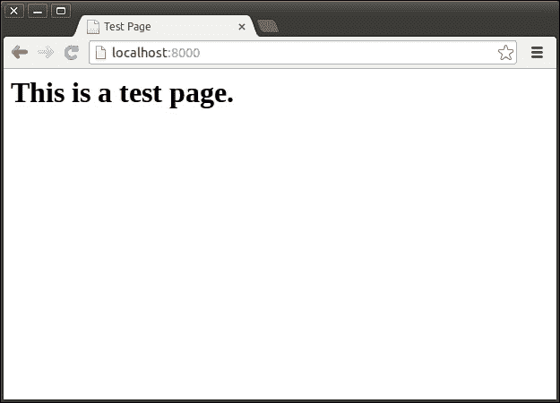
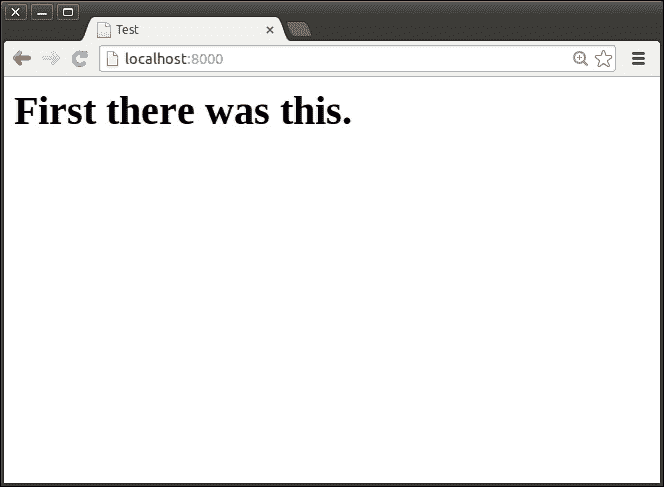
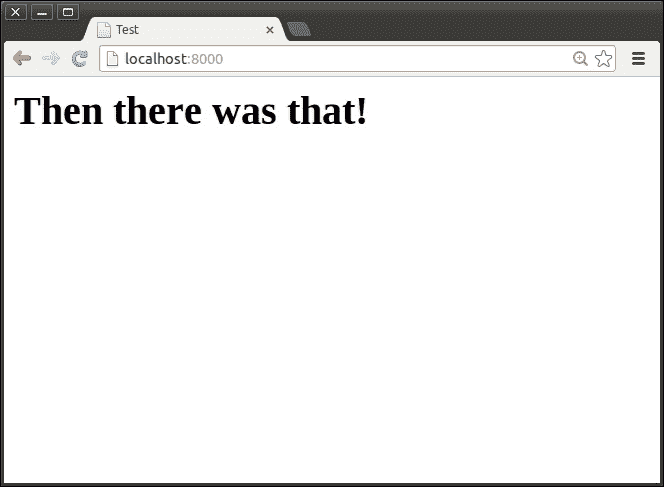

# 第一章. 使用 Grunt 入门

在本章中，我们将涵盖以下内容：

+   安装 Grunt CLI

+   在项目中安装 Grunt

+   安装插件

+   设置基本网络服务器

+   监视文件变化

+   设置 LiveReload

+   仅处理已更改的文件

+   导入外部数据

# 简介

**Grunt** 是一个基于 **Node.js** 平台构建的流行的新任务自动化框架。它提供了一系列功能，允许您通过自动化重复性任务（如检查代码质量、运行测试、编译模板和代码、发布到各种类型的服务等）来简化项目工作流程，节省时间和精力。

任务自动化自软件开发之初就存在，可能被视为其存在的一个显著原因。毕竟，我们主要是编写程序来自动化重复性任务。

Grunt 本身主要是一个高度可插拔的框架，它为配置自动化任务提供了一个一致的接口。实际的任务逻辑由大量称为 **插件** 的模块提供，这些插件利用此框架，通常倾向于专注于某些功能集。

在撰写本文时，Grunt 项目已有超过 3 年的历史，在 **npm** 公共包注册表中提供了超过 3,000 个插件，并为创建或贡献现有插件项目提供了工具和指南。

目前，大量项目正在以各种方式积极使用 Grunt，其中最引人注目的是 Yeoman、Modernizr、AngularJS 和 JQuery 项目。

### 小贴士

如果您还没有访问过，请务必访问 Grunt 网站。那里充满了优秀的指南和文档，并且是找到您所需插件的最佳地点。网站地址如下：

[`gruntjs.com/`](http://gruntjs.com/)

# 安装 Grunt CLI

为了使用 Grunt 配置文件，需要安装 Grunt 的 **命令行界面**（**CLI**）工具。

命令行工具，如 Grunt CLI，通常全局安装。这意味着它们安装在您终端中当前活跃的 Node.js 安装之上，而不是在当前项目路径中，这通常是情况。

### 小贴士

在本书中，我们将使用 Grunt 的 0.4.x 版本，它需要 Node.js 0.8.x 或更高版本。

## 如何操作...

以下步骤将引导我们安装 Grunt CLI 并测试其安装是否成功。

1.  假设您已经全局安装了 Node.js，以下命令用于安装 Grunt CLI：

    ```js
    $ npm install --global grunt-cli

    ```

1.  如果安装成功，`grunt` 命令现在应该在终端上可用。通过在您的终端中输入 `grunt` 并确认它返回的消息类似于以下内容来测试：

    ```js
    grunt-cli: The grunt command line interface. (v0.1.13)

    Fatal error: Unable to find local grunt.

    If you're seeing this message, either a Gruntfile wasn't found or grunt hasn't been installed locally to your project. For more information about installing and configuring grunt, please see the Getting Started guide:

    http://gruntjs.com/getting-started

    ```

## 它是如何工作的...

`npm install` 命令会在 npm 的 **公共包注册库** 中查找 `grunt-cli` 包，一旦找到，就会下载并安装它。

使用 `-g` 参数与 `install` 命令一起表示我们想要安装的包应该全局安装，这意味着它应该安装在我们终端中当前活动的 Node.js 版本上。

在默认的 Node.js 设置中，一个用于可执行二进制文件的文件夹将自动添加为路径，该路径应由终端扫描以查找可执行命令。这使得在安装此包后，`grunt` 命令自动可用，因为其可执行二进制文件由包的安装信息提供并指示。

# 在项目中设置 Grunt

为了使项目能够使用 Grunt 框架，它将需要安装其库并设置一个最基本配置文件。库提供了所有 Grunt 插件所需的框架和工具，而配置文件提供了一个起点，从这里我们可以开始加载插件并调整其行为。

## 准备工作

对于一个项目来说，以某种方式打包以帮助跟踪依赖项、二进制文件、脚本、维护者和其他重要信息通常是一个好主意。基于 Node.js 的项目的标准包格式是 **CommonJS**。

### 小贴士

要了解更多关于 CommonJS 的信息，您可以查看以下网址中的其规范：

[`wiki.commonjs.org/wiki/Packages/1.1`](http://wiki.commonjs.org/wiki/Packages/1.1)

CommonJS 包的核心是 `package.json` 文件。该文件包含关于包的所有重要信息，并以 JSON 格式存储。创建 `package.json` 文件的最简单方法就是使用 `npm init` 命令。该命令会提出一系列问题，并根据提供的答案生成一个 `package.json` 文件。以下是在运行该命令时提出的问题示例：

```js
name: (grunt-book) myproject
version: (0.0.0)
description: My first Grunt project.
entry point: (index.js)
test command:
git repository:
keywords:
author:
license: (ISC)

```

在回答这些问题之后，将在当前路径下生成一个包含以下内容的 `package.json` 文件：

```js
{
  "name": "myproject",
  "version": "0.0.0",
  "description": "My first Grunt project.",
  "main": "index.js",
  "scripts": {
    "test": "echo \"Error: no test specified\" && exit 1"
  },
  "author": "",
  "license": "ISC"
}
```

### 小贴士

在以下网址可以找到关于 `package.json` 文件的另一个实用指南：

[`browsenpm.org/package.json`](http://browsenpm.org/package.json)

## 如何操作...

以下步骤将指导我们在项目中安装 Grunt 框架库并创建一个最基本配置文件。

1.  首先，我们将安装 Grunt 库到当前项目路径中，并将其添加到我们的项目依赖中。所有这些都可以通过以下命令完成：

    ```js
    $ npm install --save grunt

    ```

    ### 小贴士

    由于我们在 `install` 命令中使用了 `--save` 标志，Grunt 包将被添加到项目包的依赖列表中。这可以通过查看 `package.json` 文件中的 `dependencies` 属性来确认。

    当你想将安装的包添加到`devDependencies`属性中时，可以使用`--save-dev`标志与`install`命令一起使用，该属性列出了设置开发环境所需的依赖项。

1.  接下来，我们将设置一个空的配置文件，它至少可以允许 Grunt 运行，并为未来的任务配置提供一个位置。让我们在我们的项目根目录中创建一个名为`Gruntfile.js`的文件，其内容如下：

    ```js
    module.exports = function (grunt) {
      grunt.initConfig({});
      grunt.registerTask('default', []);
    };
    ```

1.  现在我们已经安装了 Grunt 库并设置了基本的配置文件，我们可以使用`grunt`命令来测试它是否按预期工作。在终端中运行`grunt`命令现在应该产生类似于以下内容的输出：

    ```js
    Done, without errors.

    ```

    ### 小贴士

    不指定任何参数运行`grunt`命令时，总是会尝试运行`default`任务，在我们的当前示例中，它被设置为不执行任何操作。

## 它是如何工作的...

当使用 Grunt CLI 工具时，它总是寻找最近的名为`Gruntfile.js`的文件，然后尝试从中加载配置。在配置文件中，有一个导出的函数接收一个参数。这个参数是一个对象，它为我们提供了访问 Grunt 框架以加载、创建和配置任务的权限。

到目前为止，我们没有加载或创建任何任务，也没有定义任何配置。我们的`default`任务也被设置为不执行任何操作，因此运行`grunt`命令除了报告它已成功完成外，没有做任何事情。

# 安装插件

Grunt 可以提供的所有功能都包含在以 Node.js 包形式提供的插件中。在本食谱中，我们将通过安装插件的流程来准备我们后续的所有食谱。

在我们的示例中，我们将安装`contrib-jshint (0.10.0)`插件。安装此插件所使用的相同步骤可以用来安装插件包索引中提供的任何其他插件。

## 准备工作

在本例中，我们将使用我们在本章的*在项目中设置 Grunt*食谱中创建的基本项目结构。如果你还不熟悉它的内容，请务必参考它。

## 如何操作...

以下步骤将指导我们在项目中安装插件并加载它包含的任务：

1.  安装插件的第一步是在当前项目路径中安装包含它的包。在我们的示例中，我们将安装包含在`grunt-contrib-jshint`包中的`contrib-jshint`插件。我们可以使用以下命令安装此包并将其添加到我们的项目依赖项中：

    ```js
    $ npm install --save grunt-contrib-jshint

    ```

1.  接下来，我们需要加载插件包中包含的任务，以便它们可以在我们的配置中使用。这是通过使用`loadNpmTasks`函数完成的，该函数由传递给配置文件的`grunt`对象提供。添加此功能后，我们的配置文件应类似于以下内容：

    ```js
    module.exports = function (grunt) {
      grunt.initConfig({});
      grunt.loadNpmTasks('grunt-contrib-jshint');
      grunt.registerTask('default', []);
    };
    ```

1.  现在我们已经安装了包并加载了其任务，我们可以在配置中使用这些加载的任务。在我们的例子中，我们加载了 `jshint` 任务，这使得我们能够以类似以下方式使用它：

    ```js
    module.exports = function (grunt) {
      grunt.initConfig({
        jshint: {
          sample: {
            files: 'src/*.js'
          }
        }
      });
      grunt.loadNpmTasks('grunt-contrib-jshint');
      grunt.registerTask('default', []);
    };
    ```

## 更多内容...

随着你开始使用越来越多的 Grunt 插件，你很快就会想知道是否有办法优化这个过程。幸运的是，有人已经在这条路上走在了前面，并创建了 `load-grunt-tasks` 工具，该工具自动从你项目依赖中提到的所有包中加载任务。这意味着我们不再需要为每个安装的插件添加 `loadNpmTasks` 调用。

以下步骤说明了此实用程序的用法，从我们在主菜谱中早期完成的工作继续：

1.  在当前项目路径中安装此实用程序的包，并使用以下命令将其添加到依赖项中：

    ```js
    $ npm install --save load-grunt-tasks

    ```

1.  现在我们可以通过导入包并将 `grunt` 对象传递给它来在我们的配置文件中使用它。现在我们正在使用这个实用程序，我们也可以删除我们用来加载插件的 `loadNpmTasks`。

    ```js
    module.exports = function (grunt) {
      require('load-grunt-tasks')(grunt);
      grunt.initConfig({
        jshint: {
          sample: {
            files: 'src/*.js'
          }
        }
      });
      grunt.registerTask('default', []);
    };
    ```

    ### 小贴士

    默认情况下，`load-grunt-tasks` 插件只会加载以 `grunt` 开头的插件名称。此行为可以通过使用 `pattern` 选项进行自定义。要了解更多关于 `load-grunt-tasks` 插件的信息，请参考以下网址中的插件页面：

    [`github.com/sindresorhus/load-grunt-tasks`](https://github.com/sindresorhus/load-grunt-tasks)

# 设置基本 Web 服务器

在基于 Web 的项目的开发过程中，简单的 Web 服务器总是很有用。它们可以轻松设置并用于从你的本地机器提供 Web 内容，这样你就不必担心不断将你的实验性更改部署到远程服务提供商。

我们将使用 `contrib-connect` `(0.8.0)` 插件，它为我们提供了基于 **Connect** 服务器框架设置和运行简单 Web 服务器的功能。默认情况下，它将只从目录中提供文件，但它还有一个额外的优点，即能够利用许多可用的 Connect 中间件插件。

### 小贴士

你可以在以下网址了解更多关于 Connect 服务器框架及其中间件插件的信息：

[`github.com/senchalabs/connect`](https://github.com/senchalabs/connect)

## 准备工作

在本例中，我们将使用本章中 *在项目中设置 Grunt* 菜谱中创建的基本项目结构。如果你还不熟悉其内容，请务必参考。

## 如何操作...

以下步骤将引导我们设置一个开发服务器，该服务器从位于我们项目目录中的目录中提供文件。

1.  我们将首先安装包含 `contrib-connect` 插件的包，并按照本章“安装插件”食谱中提供的说明加载其任务。

1.  从插件中加载 `connect` 任务后，我们可以在配置中使用它。为此，我们在配置中添加以下内容：

    ```js
    connect: {
      server: {
        options: {
          base: 'www',
          keepalive: true
        }
      }
    }
    ```

    ### 小贴士

    `base` 选项表示服务器应在哪个目录中查找请求的文件。您希望与开发服务器一起提供的所有内容都可以放置在这个目录中。这包括 HTML 页面、JavaScript 源文件、样式表、图像等等。

    `keepalive` 选项在请求的任务完成后仍保持服务器运行。如果您单独运行 `connect` 任务，这通常是首选的，但如果在它完成后还有其他任务将无限期运行，则不是必需的。

1.  让我们添加一个简单的文件，这样我们就可以从我们的服务器上提供它，以便我们可以用它来测试。在项目根目录下创建一个名为 `www` 的目录，然后在其中创建一个名为 `index.html` 的文件，内容如下：

    ```js
    <html>
      <head>
        <title>Test Page</title>
      </head>
      <body>
        <h1>This is a test page.</h1>
      </body>
    </html>
    ```

    ### 小贴士

    与许多其他网页服务器一样，此任务启动的 Connect 服务器将始终在请求 URL 未指定文件名的情况下在文件夹中查找 `index.html` 文件。

1.  现在，我们可以使用 `grunt connect` 命令来运行我们的网页服务器，这将产生输出，表明服务器已启动，以及可以访问的 URL：

    ```js
    Running "connect:server" (connect) task
    Waiting forever...
    Started connect web server on http://0.0.0.0:8000

    ```

1.  最后，我们可以使用我们最喜欢的浏览器访问输出中提到的 URL。这将显示我们的示例页面，通过运行的服务器提供：

## 更多内容...

`connect` 任务提供了许多有用的配置选项，允许我们自动打开浏览器、指定服务器应运行的端口和主机名、从多个目录提供文件、使用其他 Connect 中间件插件以及向创建的服务器添加额外功能。

### 在默认 URL 上打开默认网页浏览器

为了在默认的 URL 上自动打开我们喜欢的网页浏览器，我们可以将 `open` 选项设置为 `true`，就像以下示例中那样：

```js
options: {
  base: 'www',
  keepalive: true,
  open: true
}
```

### 在特定 URL 打开特定网页浏览器

当我们想要使用默认浏览器以外的其他浏览器打开非默认 URL 时，我们可以向 `open` 选项提供一个对象，该对象指定了我们确切想要的内容。以下代码指定了一个 URL、用于打开它的浏览器以及一旦打开就应调用的回调函数：

```js
options: {
  base: 'www',
  keepalive: true,
  open: {
    target: 'http://localhost:8000/test.html',
    appName: 'firefox',
    callback: function() {
      console.log('Test URL opened in Firefox!');
    }
  }
}
```

### 小贴士

**下载示例代码**

您可以从您在 [`www.packtpub.com`](http://www.packtpub.com) 的账户下载示例代码文件，以获取您购买的所有 Packt Publishing 书籍。如果您在其他地方购买了这本书，您可以访问 [`www.packtpub.com/support`](http://www.packtpub.com/support) 并注册，以便将文件直接通过电子邮件发送给您。

### 使用特定端口

连接任务默认使用的端口是`8000`，但如果你想要使用不同的端口，可以使用`port`选项来指定你想要的端口，如下面的代码片段所示：

```js
options: {
  port: 3000,
  base: 'www',
  keepalive: true
}
```

### 自动选择可用端口

如果你在启动服务器时不确定哪些端口可用，让服务器自动选择一个开放的端口会非常有用。将`useAvailablePort`选项设置为`true`将启用此行为。以下是这个行为的代码片段：

```js
options: {
  base: 'www',
  keepalive: true,
  useAvailablePort: true
}
```

### 使用特定主机名

如果你希望服务器连接到特定的主机名而不是默认的`0.0.0.0`，你可以使用以下方式利用`hostname`选项：

```js
options: {
  base: 'www',
  keepalive: true,
  hostname: 'something.else.com'
}
```

### 从多个目录中提供文件

如果你有多于一个目录包含你想要提供服务的文件，那么你可以提供一个包含目录名称的数组给`base`选项来查找内容。以下是一个代码片段供你参考：

```js
options: {
  base: ['www', 'other'],
  keepalive: true
}
```

### 小贴士

当使用数组作为`base`选项时，服务器将从左到右在每个目录中查找请求的资源，一旦找到就返回资源。如果示例中的两个目录都包含一个`index.html`文件，对根 URL 的请求将返回`www`目录中的`index.html`文件。

### 使用中间件

如果我们想要使用 Connect 框架提供的许多现有中间件插件之一，我们可以将`middleware`选项设置为函数，该函数通过向其中添加所需的中间件来修改中间件堆栈。

1.  首先，我们需要安装我们想要使用的中间件，在我们的例子中，这个中间件是和 Connect 服务器框架一起打包的。我们可以使用以下命令来安装框架包：

    ```js
    $ npm install --save connect

    ```

1.  现在，我们修改`connect`任务中`server`目标的选项，以便它将`compress`中间件添加到堆栈中：

    ```js
    options: {
      base: 'www',
      keepalive: true,
      middleware: function(connect, options, middlewares) {
        middlewares.push(
          require('connect').middleware.compress()
        );
        return middlewares;
      }
    }
    ```

    ### 小贴士

    `middleware`选项也可以设置为数组，但这将替换`connect`任务提供的默认堆栈。默认的中间件允许从由`base`选项指定的目录中提供文件服务。

### 向创建的服务器添加功能

有时候，与`connect`任务创建的服务器一起工作会有所帮助。一个很好的例子是我们想要让我们的服务器能够处理**Socket.IO**交互。这可以通过向`onCreateServer`选项提供一个函数来实现，该函数以任何你喜欢的方式与创建的服务器一起工作：

```js
options: {
  base: 'www',
  keepalive: true,
  onCreateServer: function(server, connect, options) {
    var io = require('socket.io').listen(server);
    io.sockets.on('connect', function (socket) {
      // do something with socket
    });
  }
}
```

### 小贴士

此示例假设你已经安装了`socket.io`包。你可以在其网站上了解更多关于`socket.io`的信息：

[`socket.io/`](http://socket.io/)

# 监视文件变化

开发环境中常见的另一个需求是，当某些文件发生变化时自动运行特定任务。这在您希望实时监控代码质量或一旦资源更改就重新编译它们，以便更改的效果无需手动干预时特别有用。

`contirb-watch` `(0.6.1)` 插件允许我们在观察到文件事件时监视一组特定的文件，并运行一组指定的任务。

## 准备工作

在本例中，我们将使用我们在本章的 *在项目中设置 Grunt* 菜单中创建的基本项目结构。如果您还不熟悉其内容，请务必参考它。

## 如何做这件事...

以下步骤将引导我们设置一个 `watch` 任务，每次观察到文件更改时，都会在 JavaScript 源文件上启动代码质量分析。

1.  我们将首先按照本章 *安装插件* 菜单中提供的说明安装包含 `contrib-watch` 插件的包，并加载其任务。

1.  对于我们的示例，我们将使用 `jshint` 任务来分析 JavaScript 源文件的质量。让我们按照本章 *安装插件* 菜单中提供的说明安装 `contrib-jshint` 插件并加载其任务。

1.  我们还需要一个 JavaScript 源文件，我们可以监视其更改并对其进行质量分析。让我们在我们的项目根目录中创建一个名为 `sample.js` 的文件，并为其提供以下内容：

    ```js
    var sample = 'Sample';
    console.log(sample);
    ```

1.  现在，我们可以设置一个示例 `jshint` 任务，我们将通过添加以下内容到我们的配置中，使用 `watch` 任务来运行它：

    ```js
    jshint: {
      sample: {
        src: ['sample.js']
      }
    }
    ```

1.  在安装插件并配置示例任务后，我们现在可以配置 `watch` 任务的目标，每次名为 `sample.js` 的样本文件更改时，都会运行 `jshint` 任务。这是通过添加以下内容到我们的配置中实现的：

    ```js
    watch: {
      sample: {
        files: ['sample.js'],
        tasks: ['jshint']
      }
    }
    ```

1.  最后，我们可以使用 `grunt watch` 命令启动任务，这将产生以下输出以确认它正在运行：

    ```js
    Running "watch" task
    Waiting...

    ```

1.  为了测试我们的设置，我们现在可以修改 `sample.js` 文件并保存更改。这应该会产生类似以下内容的输出，告知我们文件事件：

    ```js
    Running "watch" task
    Waiting...
    >> File "sample.js" changed.
    Running "jshint:sample" (jshint) task
    >> 1 file lint free.

    Done, without errors.
    Completed in 1.0s at Wed Jan 1 2014 00:00:00 GMT - Waiting...

    ```

## 还有更多...

`watch` 任务插件提供了许多有用的配置选项，允许我们监视多个文件，运行一系列任务，防止任务运行时进程的创建，启用任务运行的中断，指定重新运行任务前的等待时间，仅在特定文件事件上运行任务，允许任务杀死监视进程，以及当监视器启动时运行任务一次。

### 监视多个文件

如果我们想监视多个文件，可以使用标准 Grunt `files`配置的模式匹配能力。以下配置示例将监视项目根目录或其任何子目录中具有`txt`扩展名的所有文件：

```js
watch: {
  sample: {
    files: ['**/*.txt'],
    tasks: ['sample']
  }
}
```

### 小贴士

你可以在以下网址了解更多关于文件配置以及它所支持的 globbing 模式的信息：

[`gruntjs.com/configuring-tasks#files`](http://gruntjs.com/configuring-tasks#files)

### 运行一系列任务

如果我们想在观察文件事件时每次运行多个任务，我们只需将任务添加到传递给`tasks`配置的数组中即可：

```js
watch: {
  sample: {
    files: ['sample.txt'],
    tasks: ['sample', 'another', 'finally']
  }
}
```

### 小贴士

使用`tasks`配置指定的任务将按它们在数组中放置的顺序逐个运行。

### 防止任务运行时进程的创建

`watch`任务的默认行为是在各自的子进程中启动每个被触发的任务。这防止了触发的任务失败导致`watch`任务本身失败。作为副作用，它还会为每个任务克隆监视器进程的上下文。然而，可以通过将`spawn`选项设置为`false`来禁用此行为，这会使任务启动得更快，并允许它们之间共享上下文。以下展示了这种配置的示例：

```js
watch: {
  sample: {
    files: ['sample.txt'],
    tasks: ['sample'],
    options: {
      spawn: false
    }
  }
}
```

### 启用任务运行的中断

监视器的默认行为是在等待由前一个更改触发的任务完成之后，再次等待更改。通过将`interrupt`选项设置为`true`，当检测到更改时，监视器将停止运行任务并重新启动它们。以下展示了这种配置的示例：

```js
watch: {
  sample: {
    files: ['sample.txt'],
    tasks: ['sample'],
    options: {
      interrupt: true
    }
  }
}
```

### 指定在重新运行任务之前的等待期

监视器在之前任务运行后检查文件更改的默认等待期是`500ms`。这个时间可以通过将`debounceDelay`选项设置为所需的毫秒数来更改。以下展示了这种配置的示例：

```js
watch: {
  sample: {
    files: ['sample.txt'],
    tasks: ['sample'],
    options: {
      debounceDelay: 1000
    }
  }
}
```

### 仅在特定的文件事件上运行任务

除了更改之外，文件还可以被添加和删除。监视器的默认行为是观察所有这些事件，但如果只想在特定事件上运行任务，可以将`event`选项设置为`changed`、`added`、`deleted`或`all`。

以下示例将仅在名为`sample.txt`的文件被添加或删除到与配置文件相同路径的情况下启动`sample`任务：

```js
watch: {
  sample: {
    files: ['sample.txt'],
    tasks: ['sample'],
    options: {
      event: ['added', 'deleted']
    }
  }
}
```

### 允许任务终止监视器进程

由监视器启动的任务引发的警告和失败，默认情况下不会中断其执行。将`forever`选项设置为`false`将禁用此行为，并允许子任务在警告和失败时停止监视器进程。以下展示了这种配置的示例：

```js
watch: {
  options: {
    forever: false
  },
  sample: {
    files: ['sample.txt'],
    tasks: ['sample']
  }
}
```

### 小贴士

注意，`forever`选项仅是任务级别的选项，不能为单个目标指定。

### 监视器启动时运行任务一次

如果您希望在监视器启动后立即运行`tasks`选项中指定的任务，而不仅仅是观察文件事件时才运行，可以将`atBegin`选项设置为`true`。以下展示了这种配置的示例：

```js
watch: {
  sample: {
    files: ['sample.txt'],
    tasks: ['sample'],
    options: {
      atBegin: true
    }
  }
}
```

# 设置 LiveReload

一旦您运行了一个提供构成您的 Web 应用程序的页面、代码和资源的开发服务器，您将注意到每次您希望观察所做的更改时，都必须刷新浏览器。

这就是**LiveReload**工具及其组成库发挥作用的地方。它旨在在页面或代码文件更改时自动重新加载浏览器内容，甚至可以在不刷新浏览器内容的情况下实时应用 CSS 和图像更改。

我们可以使用本章其他部分讨论的两个插件来为我们的项目设置 LiveReload。由`contrib-connect (0.8.0)`插件提供的开发服务器可以被配置为接受 LiveReload 触发器，而`contrib-watch (0.6.1)`插件用于发送它们文件事件。

## 准备工作

在这个例子中，我们将使用本章*在项目中设置 Grunt*配方中创建的基本项目结构。如果您还不熟悉它的内容，请务必参考它。

在这个配方中，我们还使用了`contrib-connect`和`contrib-watch`插件，它们已经在本章的*设置基本 Web 服务器*和*监视文件变化*配方中分别进行了讨论。如果您还不熟悉它们讨论的内容，请参考这些配方。

## 如何操作...

以下步骤将引导我们设置一个监视任务，当它观察到从本地开发服务器提供的 HTML 页面发生变化时，将自动触发刷新。

1.  我们将首先按照本章*安装插件*配方中提供的说明安装包含`contrib-connect`和`contrib-watch`插件的包，并通过加载它们的任务。

1.  为了我们的示例，我们将在`www`目录中创建一个名为`index.html`的文件，这是我们希望在浏览器中查看并在对其做出更改时自动更新的文件。该文件的以下内容如下：

    ```js
    <html>
      <head>
        <title>LiveReload Test</title>
      </head>
      <body>
        <h1>First there was this.</h1>
      </body>
    </html>
    ```

1.  接下来，我们将设置我们的开发服务器，它将从`www`目录中提供`index.html`文件。除了标准配置外，我们还将`livereload`选项设置为`true`，表示开发服务器应启用浏览器接收 LiveReload 触发器。所有这些操作都是通过向我们的配置中添加以下内容来完成的：

    ```js
    connect: {
      dev: {
        options: {
          base: 'www',
          livereload: true
        }
      }
    }
    ```

    ### 小贴士

    将`livereload`选项的值设置为`true`会将`connect-livereload`包含在 connect 服务器的中间件堆栈中。中间件随后会在所服务的页面的 HTML 代码中插入一段代码，使浏览器能够接受 LiveReload 触发器。

    由于监视器进程将在服务器启动后继续运行，因此可以排除`keepalive`选项。这意味着 Grunt 进程不会结束，这也会停止它启动的服务器。

1.  现在，我们将设置一个监视器来观察`www/index.html`文件中的文件事件。除了标准配置外，我们还将`livereload`选项设置为`true`，表示每当观察到更改时，应发送适当的 LiveReload 触发器。这是通过向我们的配置中添加以下内容来完成的：

    ```js
    watch: {
      www: {
        files: ['www/index.html'],
        options: {
          livereload: true
        }
      }
    }
    ```

1.  最后，我们可以使用`grunt connect watch`命令启动我们的服务器和监视器，这将产生指示两者启动的输出：

    ```js
    Running "connect:dev" (connect) task
    Started connect web server on http://0.0.0.0:8000

    Running "watch" task
    Waiting...

    ```

1.  现在，我们可以使用我们最喜欢的浏览器打开输出中提到的 URL，它应该显示由服务器提供的我们的示例页面：

1.  让我们通过更改`www/index.html`文件并保存它来尝试 LiveReload 功能。这个动作应该在启动服务器和监视器的终端中产生以下输出：

    ```js
    >> File "www/index.html" changed.
    Completed in 0.001s at Wed Jan 01 2014 00:00:00 GMT – Waiting...

    ```

1.  切换回我们当前打开`http://0.0.0.0:8000` URL 的浏览器，我们现在应该看到更新的页面，而无需手动刷新：

# 仅处理已更改的文件

当运行以某种方式处理文件的任务时，你很快就会意识到你可能不希望它在每次执行时处理所有文件。当任务必须处理的文件数量变得相当大时，这一点尤其正确。

在这种情况下，`newer (0.7.0)`插件可以通过确保每次调用运行时只处理自任务上次运行以来更改的文件来提供帮助。它可以与任何使用标准`files`配置的插件一起使用，并且当使用监视器在检测到文件更改时重新运行任务时变得特别有用。

## 准备中

在本例中，我们将使用本章中“在项目中设置 Grunt”食谱中创建的基本项目结构。如果你还不熟悉它的内容，请务必参考它。

## 如何操作...

以下步骤将引导我们使用`newer`插件来检查自上次运行以来更改的 JavaScript 源代码文件的代码质量。

1.  我们将首先安装包含`newer`插件的包，并按照本章中“安装插件”食谱中提供的说明加载其任务。

1.  在我们的示例中，我们还将安装`contrib-jshint`插件，并按照本章中“安装插件”食谱中提供的说明加载其任务。

1.  在安装了所有必需的插件后，我们现在可以为`jshint`任务添加示例配置，该任务将对`src`目录中的所有 JavaScript 文件执行代码质量检查。这是通过向我们的配置中添加以下内容来完成的：

    ```js
    jshint: {
      sample: {
        src: 'src/**/*.js'
      }
    }
    ```

    ### 小贴士

    注意，`jshint`插件要求你在目标内部的`src`配置中直接指定任务要针对的文件。在其他情况下，通常建议使用`files`配置来指定你的目标文件。

1.  现在，我们可以通过在终端中使用`grunt jshint`命令运行`jshint`任务几次来观察其行为。每次运行它，我们都会看到它扫描`src`目录中的所有文件。这应该每次都产生相同的输出，类似于以下内容：

    ```js
    Running "jshint:sample" (jshint) task
    >> 3 files lint free.

    ```

1.  为了使用`newer`插件，我们在我们希望运行的任务的名称前添加`newer:`。在第一次运行`grunt newer:jshint`命令时，`newer`插件将缓存已处理文件的最后修改时间戳。这会产生类似于以下内容的输出：

    ```js
    Running "newer:jshint" (newer) task

    Running "newer:jshint:sample" (newer) task

    Running "jshint:sample" (jshint) task
    >> 3 files lint free.

    Running "newer-postrun:jshint:sample:.cache" (newer-postrun) task

    ```

1.  当我们再次运行`grunt newer:jshint`命令时，我们会看到没有文件被`jshint`任务处理，这会产生类似于以下内容的输出：

    ```js
    Running "newer:jshint" (newer) task

    Running "newer:jshint:sample" (newer) task
    No newer files to process.

    ```

1.  现在，我们可以更改`src`目录中的一个文件，并再次运行命令以查看更改的文件是否再次被处理：

    ```js
    Running "newer:jshint" (newer) task

    Running "newer:jshint:sample" (newer) task

    Running "jshint:sample" (jshint) task
    >> 1 file lint free.

    Running "newer-postrun:jshint:sample:1:.cache" (newer-postrun) task

    ```

## 还有更多...

当使用`contrib-watch`插件提供的`watch`任务时，仅处理更改的文件变得特别有用。`watch`任务会在每次观察到文件更改时重新运行其指示的任务，这在开发过程中可能会相当频繁，如果任务针对大量文件，可能会花费相当多的时间。

以下步骤提供了一个如何结合使用`newer`插件和`contrib-watch`的示例，并继续我们在主要配方中完成的工作：

1.  我们将首先按照本章中“安装插件”配方中提供的说明安装包含`contrib-watch`插件的包，并通过加载其任务来使用它。

1.  现在，我们将添加一个`watch`任务，当它观察到`src`目录中包含的任何 JavaScript 文件发生变化时，将运行`jshint`任务。我们还将使用`newer:`前缀来预置`jshint`任务，表示我们只想处理实际更改的文件。这是通过在我们的配置中添加以下内容来实现的：

    ```js
    watch: {
      jshint: {
        files: ['src/**/*.js'],
        tasks: ['newer:jshint']
      }
    }
    ```

1.  现在，我们可以通过在终端中使用`grunt watch`命令来启动`watch`任务。这应该会产生类似于以下内容的输出，表明监视器正在运行：

    ```js
    Running "watch" task
    Waiting...

    ```

1.  如果我们现在在`src`目录下更改并保存一个文件，我们应该看到类似以下输出，表明只有更改的文件被`jshint`任务处理过：

    ```js
    >> File "src/file.js" changed.
    Running "newer:jshint" (newer) task

    Running "newer:jshint:sample" (newer) task

    Running "jshint:sample" (jshint) task
    >> 1 file lint free.

    Running "newer-postrun:jshint:sample:1:.cache" (newer-postrun) task

    ```

# 导入外部数据

在大多数编码实践中，最佳实践是尽可能地将逻辑和数据分离。同样的规则也适用于 Grunt 配置逻辑以及它所使用的数据。

一个非常常见的使用外部数据的情况是使用包含在`package.json`文件中的项目信息。诸如项目名称和版本号之类的信息可能不会太经常改变，但一旦它们改变，我们可能更愿意不想在项目的每个地方都去找它们。

幸运的是，Grunt 框架为我们提供了允许我们轻松从外部文件读取数据并将其存储在配置中的函数。然后，这些存储的数据也可以通过自动处理所有配置的字符串模板轻松使用。

## 准备工作

在本例中，我们将使用本章中“在项目中设置 Grunt”配方中创建的基本项目结构。如果您还不熟悉它的内容，请务必参考它。

## 如何操作...

以下步骤将指导我们如何在使用`package.json`文件中的数据生成 JavaScript 源文件的优化版本时使用它。

1.  在我们的例子中，我们将使用`contib-uglify`插件，它可以用来压缩 JavaScript 源文件。让我们按照本章中“安装插件”配方中提供的说明来安装它并加载其任务。

1.  为了本例的需要，我们还需要一个简单的 JavaScript 源文件。让我们在我们的项目目录根目录下创建一个名为`sample.js`的文件，并用以下代码填充它：

    ```js
    module.exports = function () {
      var sample = 'Sample';
      console.log(sample);
    };
    ```

1.  接下来，我们将通过使用`grunt.file.readJSON`函数并将其结果分配给配置中名为`pkg`的属性，来导入我们项目中的`pacakge.json`文件中的数据。添加此之后，我们的配置对象应类似于以下内容：

    ```js
    {
      pkg: grunt.file.readJSON('package.json')
    }
    ```

    ### 小贴士

    注意，属性名`pkg`仅用于本例，几乎可以是任何名称，除了配置中可用的任务名称。

1.  现在我们已经从我们的项目包中导入了数据，我们可以设置一个`uglify`任务，该任务将使用`package.json`文件中包含的版本号作为结果文件名称的一部分来压缩名为`sample.js`的 JavaScript 源文件。这是通过向我们的配置中添加以下内容来完成的：

    ```js
    uglify: {
      sample: {
        files: {
          'sample_<%= pkg.version %>.js': 'sample.js'
        }
      }
    }
    ```

    ### 小贴士

    Grunt 使用**Lo-Dash**字符串模板系统。您可以在以下 URL 了解更多信息：

    [`lodash.com/docs/#template`](http://lodash.com/docs/#template)

1.  最后，我们可以使用`grunt uglify`命令来测试我们的设置，这应该会产生类似于以下内容的输出：

    ```js
    Running "uglify:sample" (uglify) task
    File sample_0.0.0.js created: 81 B → 57 B

    ```

1.  我们现在也可以查看我们新创建的压缩版本的`sample.js`文件，该文件应位于`sample_0.0.0.js`中，其内容应类似于以下内容：

    ```js
    module.exports = function(){var a="Sample";console.log(a)};
    ```

## 更多内容...

YAML 格式提供了另一种存储人类可读数据并可以轻松导入到我们的配置中的流行方式。以下基于我们在主要配方中所做的工作的示例演示了此功能：

1.  首先，我们将创建一个简单的 YAML 文件，用于我们的示例。让我们在我们的项目根目录中创建`sample.yaml`，并给它以下内容：

    ```js
    version: 0.0.0

    ```

1.  现在我们需要做的就是将调用`grunt.file.readJSON`改为导入我们的样本 YAML 文件。我们通过将`pkg`配置更改为以下内容来实现这一点：

    ```js
    pkg: grunt.file.readYAML('sample.yaml')

    ```

1.  如果我们现在运行 Grunt 的 `uglify` 命令，我们应该看到与之前相同的结果，输出类似于以下内容：

    ```js
    Running "uglify:sample" (uglify) task
    File sample_0.0.0.js created: 81 B → 57 B

    ```
