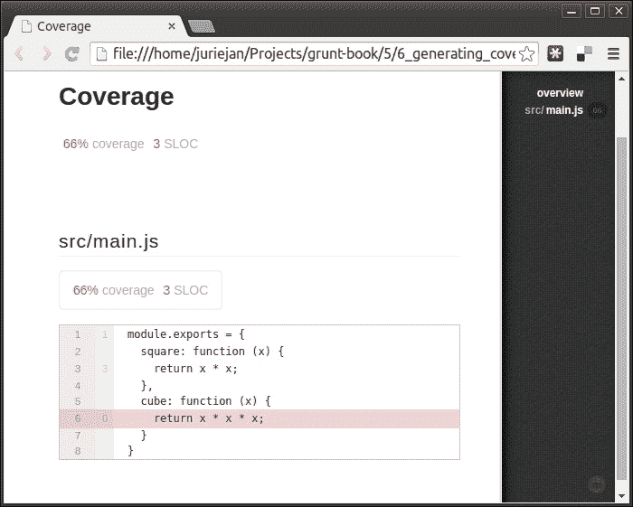

# 第五章：运行自动化测试

在本章中，我们将介绍以下食谱：

+   运行 Jasmine 测试

+   运行 QUnit 测试

+   运行 NodeUnit 测试

+   运行 Mocha 客户端测试

+   运行 Mocha 服务器端测试

+   使用 Mocha 和 Blanket 为服务器端代码生成覆盖率报告

+   使用 Mocha 和 Blanket 为客户端代码生成覆盖率报告

+   使用 QUnit 和 Istanbul 为客户端代码生成覆盖率报告

# 简介

随着软件单元的大小和复杂度的增加，每次修改后确保其行为符合其规范可能变得相当耗时。为此，通过增加软件单元的整体可靠性和质量，自动化测试变得非常有价值，无需进行持续的手动测试。

一个项目可以实施各种级别的测试，从函数或类级别的单元测试，到利用整个应用程序堆栈的集成测试。大多数测试框架都提供这一整个范围，可能只需添加一些工具。

与测试相关，还值得提及的是测试驱动开发（test-driven development）的实践，在这种实践中，开发者首先为期望的改进或新功能创建（最初失败的）测试用例，然后进行最小限度的开发以使测试用例通过。为了完成它，开发者将审查编写的代码并将其重构到可接受的标准。

# 运行 Jasmine 测试

在这个食谱中，我们将使用 `contrib-jasmine (0.7.0)` 插件在 **PhantomJS** 浏览器环境中运行我们的自动化 **Jasmine** 测试。

## 准备工作

在这个例子中，我们将使用我们在 第一章 中 *在项目中安装 Grunt* 食谱中创建的基本项目结构。如果你还不熟悉其内容，请务必参考它。

## 如何做到这一点...

以下步骤将引导我们创建一个示例代码库，一些针对代码库运行的测试，以及设置 Grunt 在 PhantomJS 浏览器环境中为我们运行它们。

1.  我们将首先按照 第一章 中 *安装插件* 食谱提供的说明安装包含 `contrib-jasmine` 插件的包，该食谱位于 第一章，*开始使用 Grunt*。

1.  然后，我们在项目目录中创建一个简单的 JavaScript 源文件，其中包含我们想要测试的函数。让我们称它为 `main.js` 并向其中添加以下内容：

    ```js
    function square(x) {
      return x * x;
    }
    ```

1.  现在，我们可以编写一个简单的测试套件，使用 Jasmine 框架来测试 `square` 方法。让我们在项目目录中创建一个名为 `tests.js` 的文件，并添加以下内容：

    ```js
    describe('Square method', function() {
      it('returns 4 for 2', function () {
        expect(square(2)).toBe(4);
      });
      it('returns 9 for 3', function () {
        expect(square(3)).toBe(9);
      });
      it('returns 16 for 4', function () {
        expect(square(4)).toBe(16);
      });
    });
    ```

1.  在创建代码库和测试之后，我们现在可以向配置中添加以下 `jasmine` 任务，该任务将加载 `main.js` 中的代码，并在 `tests.js` 文件中运行测试：

    ```js
    jasmine: {
      src: 'main.js',
      options: {
        specs: 'tests.js'
      }
    }
    ```

1.  然后，我们可以使用`grunt jasmine`命令来运行任务，这将产生以下输出，告知我们测试结果：

    ```js
    Running "jasmine:src" (jasmine) task
    Testing jasmine specs via PhantomJS

     Square method
     ✓ returns 4 for 2
     ✓ returns 9 for 3
     ✓ returns 16 for 4

    3 specs in 0.015s.
    >> 0 failures

    ```

## 更多内容...

`jasmine`任务为我们提供了几个有用的选项，可以与基本测试运行功能一起使用。我们将探讨如何加载用于测试的辅助工具，如何在运行测试之前加载库，如何加载测试所需的样式，以及如何为规范运行器提供自定义模板。

### 在测试中加载辅助工具

如果我们想使用自定义的等价性测试器或匹配器，我们可以在运行测试之前使用`helpers`选项来包含它们。在下面的示例中，我们指示在运行测试之前应加载包含在`helpers.js`文件中的自定义辅助工具：

```js
jasmine: {
  src: 'main.js',
  options: {
    specs: 'tests.js',
    helpers: 'helpers.js'
  }
}
```

### 在运行测试之前加载库

如果我们想要测试的代码依赖于第三方库，而这些库既没有在源代码、规范或辅助工具中加载，我们可以使用`vendor`选项来加载它们，如下面的示例所示：

```js
jasmine: {
  src: 'main.js',
  options: {
    specs: 'tests.js',
    vendor: ['lodash.min.js']
  }
}
```

### 加载测试所需的样式

如果我们的测试依赖于浏览器中存在特定的 CSS 样式，我们可以使用`styles`选项来加载它们，如下面的示例所示：

```js
jasmine: {
  src: 'main.js',
  options: {
    specs: 'tests.js',
    styles: 'styles.css'
  }
}
```

### 为规范运行器提供自定义模板

当编写在浏览器内部运行的源代码的测试时，需要一些 HTML 元素，如固定元素，这种情况可能相当常见。向生成的规范运行器（`test.html`）添加 HTML 的最简单方法是对其生成的模板进行自定义。

以下步骤将引导我们获取默认规范运行器模板，对其进行自定义，并将其用作我们的模板：

1.  默认规范运行器模板可以从`contrib-jasmine`插件的存储库中检索并保存到`runner.tmpl`文件中。

    ### 小贴士

    在撰写本文时，默认规范运行器模板可以从以下链接下载：

    [`github.com/gruntjs/grunt-contrib-jasmine/raw/master/tasks/jasmine/templates/DefaultRunner.tmpl`](https://github.com/gruntjs/grunt-contrib-jasmine/raw/master/tasks/jasmine/templates/DefaultRunner.tmpl)

1.  一旦我们将默认模板保存为`runner.tmpl`，我们就可以对其进行一些修改。在下面的示例中，我们只是添加了一个带有一些文本的元素：

    ```js
    <!doctype html>
    <html>
    <head>
      <meta charset="utf-8">
      <title>Jasmine Spec Runner</title>
      <link rel="shortcut icon" type="image/png" href="<%= temp %>/jasmine_favicon.png">
      <% css.forEach(function(style){ %>
        <link rel="stylesheet" type="text/css" href="<%= style %>">
      <% }) %>
    </head>
    <body>
      <% with (scripts) { %>
        <% [].concat(polyfills, jasmine, boot, vendor, helpers, src, specs,reporters).forEach(function(script){ %>
        <script src="img/<%= script %>"></script>
        <% }) %>
      <% }; %>
      <div id="test">Test</div>
    </body>
    </html>
    ```

1.  自定义模板准备就绪后，我们将使用`template`选项来指示它应在生成运行器时使用：

    ```js
    jasmine: {
      src: 'main.js',
      options: {
        specs: 'tests.js',
        template: 'runner.tmpl'
      }
    }
    ```

1.  这样现在就可以在我们的测试中将`test`元素可用，允许我们在规范中包含类似以下测试：

    ```js
    describe('Test element', function() {
      it('has test text', function () {
        expect(window.test.innerHTML).toBe("Test");
      });
    });
    ```

# 运行 QUnit 测试

在这个菜谱中，我们将使用`contrib-qunit (0.5.2)`插件在**PhantomJS**浏览器环境中运行我们的自动化**QUnit**测试。

## 准备中

在本例中，我们将使用在第一章中“在项目中安装 Grunt”食谱中创建的基本项目结构。如果您还不熟悉其内容，请务必参考。

## 如何操作...

以下步骤将引导我们创建一个示例代码库、针对代码库运行的一些测试、设置测试环境以及配置 Grunt 为我们使用 PhantomJS 浏览器运行它们。

1.  我们将首先按照第一章中“安装插件”食谱提供的说明来安装包含`contrib-qunit`插件的包，该食谱位于“使用 Grunt 入门”。

1.  然后，我们将在项目目录中创建一个简单的 JavaScript 源文件，其中包含我们想要测试的函数。让我们称它为`main.js`，并为其提供以下内容：

    ```js
    function square(x) {
      return x * x;
    }
    ```

1.  现在，我们可以使用 QUnit 框架编写一组简单的测试，针对`square`方法。让我们在项目目录中创建一个名为`tests.js`的文件，并包含以下内容：

    ```js
    QUnit.test("Square method functionality", function(assert) {
      assert.equal(square(2), 4);
      assert.equal(square(3), 9);
      assert.equal(square(4), 16);
    });
    ```

1.  由于测试是在浏览器内运行的，而`contrib-qunit`插件不会自动包含它，因此我们必须将 QUnit 库和样式表下载到项目目录中。

    ### 小贴士

    在撰写本文时，QUnit 库及其配套样式表可以从以下链接下载：

    [`code.jquery.com/qunit/qunit-1.15.0.js`](http://code.jquery.com/qunit/qunit-1.15.0.js)

    [`code.jquery.com/qunit/qunit-1.15.0.css`](http://code.jquery.com/qunit/qunit-1.15.0.css)

1.  为了将之前步骤中设置的所有部分整合在一起，我们现在需要创建一个测试环境，该环境将加载我们的代码库、测试和所有必需的库。让我们在我们的项目目录中创建一个名为`test.html`的文件，并包含以下内容：

    ```js
    <!DOCTYPE html>
    <html>
      <head>
        <meta charset="utf-8">
        <title>QUnit basic example</title>
        <link rel="stylesheet" href="qunit-1.15.0.css">
        <script src="img/qunit-1.15.0.js"></script>
        <script src="img/main.js"></script>
        <script src="img/tests.js"></script>
      </head>
      <body>
        <div id="qunit"></div>
        <div id="qunit-fixture"></div>
      </body>
    </html>
    ```

1.  现在代码库、测试和测试环境都已就绪，我们可以在配置中添加以下`qunit`任务：

    ```js
    qunit: {
      main: {
        src: 'test.html'
      }
    }
    ```

1.  然后，我们可以使用`grunt qunit`命令来运行此任务，它应该会生成以下输出，告知我们测试结果：

    ```js
    Running "qunit:main" (qunit) task
    Testing test.html .OK
    >> 3 assertions passed (18ms)

    ```

## 更多内容...

`qunit`任务为我们提供了几个有用的选项，可以与基本测试运行功能一起使用。我们将探讨从网络服务器加载测试、在测试失败后继续执行、抑制 PhantomJS 浏览器控制台输出以及向 PhantomJS 实例传递参数。

### 从网络服务器加载测试

如果我们希望从网络服务器而不是从文件系统上的文件直接加载我们的测试环境及其所有部分，我们可以使用`urls`选项，并提供我们想要运行的测试环境的绝对 URL。

以下示例将指导我们将所需的文件移动到可以从中提供服务的目录中，设置一个基本的 Web 服务器来提供这些文件，并修改我们的配置以从 Web 服务器测试文件。

1.  我们将首先按照第一章中“安装插件”部分的说明来安装包含`contrib-connect`插件的包，这部分内容在[《使用 Grunt 入门》](https://wiki.example.org/feynmans_learning_method)中。

1.  然后，我们可以在项目根目录中创建一个名为`www`的目录，并将`main.js`、`qunit-1.15.0.css`、`qunit-1.15.0.js`、`test.html`和`tests.js`文件移动到其中。

1.  现在，我们可以通过添加以下`connect`任务配置来设置基本的 Web 服务器，该服务器将从`www`目录中提供文件：

    ```js
    connect: {
      server: {
        options: {
          base: 'www'
        }
      }
    }
    ```

1.  在服务器准备好为我们所需的测试环境提供文件后，我们可以修改我们的`qunit`任务配置，从适当的 URL 加载它：

    ```js
    qunit: {
      main: {
        options: {
          urls: ['http://localhost:8000/test.html']
        }
      }
    }
    ```

1.  要测试我们的设置，我们可以运行`grunt connect qunit`命令来启动 Web 服务器并运行其上托管的测试环境。这应该会产生类似于以下输出的结果：

    ```js
    Running "connect:server" (connect) task
    Started connect web server on http://0.0.0.0:8000

    Running "qunit:main" (qunit) task
    Testing http://localhost:8000/test.html .OK
    >> 3 assertions passed (19ms)

    ```

### 在测试失败后继续执行

`qunit`任务的默认行为是在任何测试失败时使整个任务失败。这反过来会导致在`qunit`任务之后排队的任何任务都不会执行。通过将`force`选项设置为`true`，正如以下示例中所示，我们可以指示任务本身不应因测试失败而失败：

```js
qunit: {
  main: {
    src: 'test.html',
    options: {
      force: true
    }
  }
}
```

### 抑制 PhantomJS 浏览器控制台输出

`qunit`任务的默认行为是将无头 PhantomJS 浏览器生成的控制台输出打印到任务运行的命令行。如果我们想防止控制台输出被打印，我们可以将`console`选项设置为`false`，如下例所示：

```js
qunit: {
  main: {
    src: 'test.html',
    options: {
      console: false
    }
  }
}
```

### 向 PhantomJS 实例传递参数

如果我们想在 PhantomJS 进程启动时传递一些选项，我们可以像在命令行中提供一样，将它们与常规选项一起提供。

### 小贴士

可以在以下 URL 找到 PhantomJS 可执行程序接受的参数列表：

[`phantomjs.org/api/command-line.html`](http://phantomjs.org/api/command-line.html)

以下示例通过将`load-images`选项设置为`false`来禁用浏览器中图像的加载：

```js
qunit: {
  main: {
    src: 'test.html',
    options: {
      '--load-images': false
    }
  }
}
```

# 运行 NodeUnit 测试

在本食谱中，我们将使用`contrib-nodeunit (0.4.1)`插件来运行我们的自动化**NodeUnit**测试。

## 准备工作

在本例中，我们将使用在第一章中“在项目中安装 Grunt”部分的说明中创建的基本项目结构。如果你还不熟悉其内容，请务必参考它。

## 如何操作...

以下步骤将指导我们创建一个示例代码库，创建一些针对代码库运行的测试，并配置 Grunt 为我们运行它们。

1.  我们将首先按照第一章中“安装插件”配方提供的说明安装包含`contrib-nodeunit`插件的包。

1.  然后，我们将在项目目录中创建一个简单的 JavaScript 源文件，其中包含并导出一个我们想要测试的函数。让我们称它为`main.js`，并添加以下内容：

    ```js
    module.exports.square = function (x) {
      return x * x;
    }
    ```

1.  现在，我们可以使用 NodeUnit 框架编写一组简单的测试，以测试`square`方法。我们还需要将`square`方法导入到我们的测试套件中，因为`nodeunit`任务不会自动执行此操作。让我们在项目目录中创建一个名为`tests.js`的文件，并包含以下内容：

    ```js
    var square = require('./main').square;

    module.exports.testSquare = {
      'Square method returns 4 for 2': function (test) {
        test.equal(square(2), 4);
        test.done();
      },
      'Square method returns 9 for 3': function (test) {
        test.equal(square(2), 4);
        test.done();
      },
      'Square method returns 16 for 4': function (test) {
        test.equal(square(2), 4);
        test.done();
      }
    }
    ```

1.  在我们的代码库和测试创建完成后，我们现在可以向我们的配置中添加以下`nodeunit`任务，它将运行`tests.js`文件中包含的测试：

    ```js
    nodeunit: {
      main: {
        src: 'tests.js'
      }
    }
    ```

1.  我们可以使用`grunt nodeunit`命令运行此任务，这将产生以下输出，告知我们测试结果：

    ```js
    Running "nodeunit:main" (nodeunit) task
    Testing tests.js...OK
    >> 3 assertions passed (10ms)

    ```

## 还有更多...

`nodeunit`任务为我们提供了一些有用的选项，可以与基本测试运行功能一起使用。我们将探讨如何使用替代报告器和将报告器输出发送到文件。

### 使用替代报告器

如果我们想要改变测试结果显示的方式，我们可以通过指定一个替代报告器来使用替代报告器。

### 小贴士

`reporter`选项的默认值是`grunt`，但它可以被设置为以下 URL 中`module.exports`对象列出的任何一种报告器：

[`github.com/caolan/nodeunit/blob/master/lib/reporters/index.js`](https://github.com/caolan/nodeunit/blob/master/lib/reporters/index.js)

在以下示例中，我们使用`reporter`选项来指示我们希望测试结果以 HTML 格式报告：

```js
nodeunit: {
  main: {
    src: 'tests.js',
    options: {
      reporter: 'html'
    }
  }
}
```

### 将报告器输出发送到文件

如果我们希望在运行`nodeunit`任务时将测试报告的结果存储在文件中，我们可以使用`reporterOutput`选项来指示应该接收它的文件，如下面的示例所示：

```js
nodeunit: {
  main: {
    src: 'tests.js',
    options: {
      reporterOutput: 'result.txt'
    }
  }
}
```

# 运行 Mocha 客户端测试

在这个配方中，我们将使用`mocha (0.4.11)`插件在**PhantomJS**浏览器环境中运行我们的自动化**Mocha**测试。

## 准备工作

在这个示例中，我们将使用我们在第一章中“在项目中安装 Grunt”配方中创建的基本项目结构，即*使用 Grunt 入门*。如果你还不熟悉其内容，请务必参考。

## 如何操作...

以下步骤将指导我们创建一个示例代码库，创建一些针对代码库运行的测试，并配置 Grunt 在 PhantomJS 浏览器环境中为我们运行它们。

1.  我们将首先按照 第一章 中 *安装插件* 部分的说明来安装包含 `mocha` 插件的包，该部分位于 *使用 Grunt 入门*。

1.  然后，我们将在项目目录中创建一个简单的 JavaScript 源文件，其中包含我们想要测试的函数。让我们称它为 `main.js`，并为其提供以下内容：

    ```js
    function square(x) {
      return x * x;
    }
    ```

1.  现在，我们可以使用 Mocha 和 **Expect.js** 框架为 `square` 方法编写一个简单的测试套件。让我们在项目目录中创建一个名为 `tests.js` 的文件，并包含以下内容：

    ```js
    describe('Square method', function() {
      it('returns 4 for 2', function () {
        expect(square(2)).to.be(4);
      });
      it('returns 9 for 3', function () {
        expect(square(3)).to.be(9);
      });
      it('returns 16 for 4', function () {
        expect(square(4)).to.be(16);
      });
    });
    ```

1.  由于测试是在浏览器内运行的，而 `mocha` 插件不会自动包含它，因此我们需要将 Mocha 库和样式表下载到项目目录中。

    ### 小贴士

    在撰写本文时，Mocha 库及其配套的样式表可以从以下链接下载：

    [`github.com/visionmedia/mocha/raw/master/mocha.js`](https://github.com/visionmedia/mocha/raw/master/mocha.js)

    [`github.com/visionmedia/mocha/raw/master/mocha.css`](https://github.com/visionmedia/mocha/raw/master/mocha.css)

1.  由于 Mocha 框架默认不包含 Expect.js 断言库，我们还需要将其下载到我们的项目目录中。

    ### 小贴士

    在撰写本文时，Expect.js 库可以从以下链接下载：

    [`github.com/LearnBoost/expect.js/raw/master/index.js`](https://github.com/LearnBoost/expect.js/raw/master/index.js)

    注意，对于我们的当前示例，我们将下载提到的 `index.js` 文件，并将其文件名更改为 `expect.js`。

1.  为了将我们设置的所有部分整合在一起，我们现在需要创建一个测试环境，该环境加载我们的代码库、测试和所有必需的库。让我们在我们的项目目录中创建一个名为 `test.html` 的文件，并包含以下内容：

    ```js
    <html>
      <head>
        <meta charset="utf-8">
        <title>Mocha Tests</title>
        <link rel="stylesheet" href="mocha.css" />
      </head>
      <body>
        <div id="mocha"></div>
        <script src="img/main.js"></script>
        <script src="img/expect.js"></script>
        <script src="img/mocha.js"></script>
        <script>
          mocha.setup('bdd');
        </script>
        <script src="img/tests.js"></script>
      </body>
    </html>
    ```

1.  在我们的代码库、测试和测试环境准备就绪后，我们现在可以向我们的配置中添加以下 `mocha` 任务：

    ```js
    mocha: {
      main: {
        src: 'test.html',
        options: {
          run: true
        }  
      }
    }
    ```

    ### 小贴士

    `mocha` 任务将代码注入到 PhantomJS 浏览器中，以便在测试运行完成后收集测试结果。为了捕获结果，需要调用 `mocha.run` 方法来启动环境中包含的测试执行，这个方法调用需要在代码注入之后运行。将 `run` 选项设置为 `true` 确保在代码注入完成后调用此方法。

1.  我们可以使用 `grunt mocha` 命令来运行此任务，它应该会产生以下输出，告知我们测试结果：

    ```js
    Running "mocha:main" (mocha) task
    Testing: test.html

     3 passing (105ms)
    >> 3 passed! (0.10s)

    ```

## 还有更多...

`mocha`任务为我们提供了几个有用的选项，可以与它的基本测试运行功能一起使用。我们将探讨从网络服务器加载测试、将报告输出发送到文件、显示 PhantomJS 浏览器的控制台输出、显示源错误、指定 Mocha 测试运行器的选项以及使用替代报告器。

### 从网络服务器加载测试

如果我们希望从文件系统上的文件而不是从网络服务器加载我们的测试环境及其所有部分，我们可以使用`urls`选项，通过传递我们想要运行的测试环境的绝对 URL 来实现。

以下示例将指导我们将所需的文件移动到可以从中提供服务的目录，设置一个基本网络服务器以提供这些文件，并修改我们的配置以从网络服务器测试文件。

1.  我们将首先按照第一章中*安装插件*食谱提供的说明安装包含`contrib-connect`插件的包。

1.  然后，我们可以在项目根目录中创建一个名为`www`的目录，并将`expect.js`、`main.js`、`mocha.css`、`mocha.js`、`test.html`和`tests.js`文件移动到其中。

1.  现在，我们可以设置基本网络服务器，通过添加以下`connect`任务配置来从`www`目录提供文件：

    ```js
    connect: {
      server: {
        options: {
          base: 'www'
        }
      }
    }
    ```

1.  在服务器准备好为测试环境提供文件后，我们现在可以修改`mocha`任务的配置，从适当的 URL 加载它：

    ```js
    mocha: {
      main: {
        options: {
          run: true,
          urls: ['http://localhost:8000/test.html']
        }  
      }
    }
    ```

1.  要测试我们的设置，我们可以运行`grunt connect qunit`命令以启动网络服务器并运行其上托管的测试环境。这应该会产生类似于以下内容的输出：

    ```js
    Running "connect:server" (connect) task
    Started connect web server on http://0.0.0.0:8000

    Running "mocha:main" (mocha) task
    Testing: http://localhost:8000/test.html

     3 passing (110ms)
    >> 3 passed! (0.11s)

    ```

### 将报告输出发送到文件

如果我们希望在运行`mocha`任务时将测试的报告结果存储在文件中，我们可以使用以下示例中的`dest`选项来指定应接收它的文件：

```js
mocha: {
  main: {
    src: 'test.html',
    dest: 'result.txt',
    options: {
      run: true
    }
  }
}
```

### 显示 PhantomJS 浏览器的控制台输出

默认情况下，当`mocha`任务运行时，PhantomJS 浏览器的控制台输出不会显示在命令行输出中。如果我们想显示输出，我们可以将`log`选项设置为`true`，如下面的示例所示：

```js
mocha: {
  main: {
    src: 'test.html',
    options: {
      run: true,
      log: true
    }  
  }
}
```

### 显示源错误

`mocha`任务的默认行为是忽略在将要运行的测试源文件中遇到的语法错误。如果遇到错误，源文件将不会加载，这可能会在没有有用错误消息的情况下导致所有测试失败。

如果我们想了解源中遇到的错误，我们可以将`logErrors`选项设置为`true`，如下面的示例所示：

```js
mocha: {
  main: {
    src: 'test.html',
    options: {
      run: true,
      logErrors: true
    }  
  }
}
```

### 指定 Mocha 测试运行器的选项

如果我们想要直接将一些选项指定给在`mocha`任务背后运行的 Mocha 测试运行器，我们可以使用`mocha`选项提供它们。以下示例使用`grep`选项来指示仅运行描述中包含字符串`'2'`的测试：

```js
mocha: {
  main: {
    src: 'test.html',
    options: {
      run: true,
      mocha: {
 grep: '2'
 }
    }  
  }
}
```

### 小贴士

可用选项及其解释的列表可以在以下 URL 中找到：

[`mochajs.org/#usage`](http://mochajs.org/#usage)

### 使用替代报告器

如果我们想要更改测试结果显示的方式，我们可以通过指定`reporter`选项来使用替代报告器。

### 小贴士

`reporter`选项的默认值是`dot`，但它可以设置为以下 URL 中列出的任何报告器：

[`mochajs.org/#reporters`](http://mochajs.org/#reporters)

注意，在提及的 URL 中列出的各种报告器的名称，大部分情况下在使用`reporter`选项指示它们时需要大写。

在以下示例中，我们使用`reporter`选项来指示我们希望以 JSON 格式报告测试结果：

```js
mocha: {
  main: {
    src: 'test.html',
    options: {
      run: true,
      reporter: 'JSON'
    }  
  }
}
```

# 运行 Mocha 服务器端测试

在这个菜谱中，我们将使用`mocha-test (0.11.0)`插件来运行我们的自动化**Mocha**测试。

## 准备工作

在这个例子中，我们将使用我们在第一章中提供的*在项目中安装 Grunt*菜谱中创建的基本项目结构。如果你还不熟悉其内容，请务必参考它。

## 如何操作...

以下步骤将引导我们创建一个示例代码库，创建一些要针对代码库运行的测试，并配置 Grunt 为我们运行它们。

1.  我们将首先通过遵循第一章中提供的*安装插件*菜谱中的说明来安装包含`mocha-test`插件的包，*使用 Grunt 入门*。

1.  然后，我们可以在我们的项目目录中创建一个 JavaScript 源文件，该文件包含并导出我们想要测试的函数。让我们称它为`main.js`，并将其以下内容添加到其中：

    ```js
    module.exports.square = function (x) {
      return x * x;
    }
    ```

1.  现在，我们可以编写一组简单的测试，使用 Mocha 框架来测试`square`方法。我们还需要将`square`方法和`assert`库导入到我们的测试套件中，因为`mochaTest`任务不会自动执行此操作。让我们在项目目录中创建一个名为`tests.js`的文件，并添加以下内容：

    ```js
    var assert = require('assert');
    var square = require('./main').square;

    describe('Square method', function() {
      it('returns 4 for 2', function () {
        assert.equal(square(2), 4);
      });
      it('returns 9 for 3', function () {
        assert.equal(square(3), 9);
      });
      it('returns 16 for 4', function () {
        assert.equal(square(4), 16);
      });
    });
    ```

1.  在我们的代码库和测试创建完成后，我们现在可以将以下`mochaTest`任务添加到我们的配置中，该任务将运行`tests.js`文件中的测试：

    ```js
    mochaTest: {
      main: {
        src: 'tests.js'
      }
    }
    ```

1.  然后，我们可以使用`grunt mochaTest`命令运行任务，该命令应该会输出测试结果，类似于以下内容：

    ```js
    Running "mochaTest:main" (mochaTest) task

     3 passing (6ms)

    ```

## 更多内容...

`mochaTest` 任务为我们提供了几个有用的选项，这些选项可以与它的基本测试运行功能一起使用。我们将探讨如何使用替代报告器、使用正则表达式选择测试、检查全局变量泄漏、将报告器输出发送到文件以及将额外模块加载到测试环境中。

### 使用替代报告器

如果我们想要更改测试结果显示的方式，可以通过指定 `reporter` 选项来使用一个替代的报告器。

### 提示

`reporter` 选项的默认值是 `dot`，但它可以设置为以下 URL 中列出的任何报告器之一：

[`mochajs.org/#reporters`](http://mochajs.org/#reporters)

注意，当使用此插件引用时，提到的各种报告器的名称都应该写成小写。

在以下示例中，我们使用 `reporter` 选项来指示我们希望将测试结果以 JSON 格式报告：

```js
mochaTest: {
  main: {
    src: 'tests.js',
    options: {
      reporter: 'json'
    }
  }
}
```

### 使用正则表达式选择测试

很常见的情况是我们只想测试测试套件中的一部分测试。我们可以通过向 `grep` 选项提供一个 **正则表达式** 来针对特定的测试进行定位，该正则表达式将与我们的套件中测试的描述进行匹配。

在以下示例中，我们指定只运行描述中包含 `'2'` 字符串的测试：

```js
mochaTest: {
  main: {
    src: 'tests.js',
    options: {
      grep: '2'
    }
  }
}
```

### 检查全局变量泄漏

通常认为在 JavaScript 中使用全局变量是不良做法，因为各种库使用的变量名或由 JavaScript 环境暗示的变量名之间可能会发生冲突。

如果我们希望在源代码或测试代码中遇到全局变量时收到警告，可以将 `ignoreLeaks` 选项设置为 `false`。此外，我们还可以使用 `globals` 选项来指定当作为 `globals` 定义时应忽略的变量名。

以下示例将全局泄漏检测打开，并指示如果 `allowedGlobal` 变量名在全局范围内定义，则应忽略它。

```js
mochaTest: {
  main: {
    src: 'tests.js',
    options: {
      ignoreLeaks: false,
 globals: ['allowedGlobal']
    }
  }
}
```

### 将报告器输出发送到文件

当运行 `mochaTest` 任务时，如果我们希望将测试的输出结果存储在文件中，可以使用 `captureFile` 选项来指定接收结果的文件，如下面的示例所示：

```js
mochaTest: {
  main: {
    src: 'tests.js',
    options: {
      captureFile: 'result.txt'
    }
  }
}
```

### 将额外模块加载到测试环境中

`require` 选项可以在运行测试之前将模块加载到我们的测试环境中。这允许我们使用库，而无需将它们导入到每个测试套件中。

在以下示例中，我们加载 `should.js` 模块，以便在测试中使用 **Should.js** 库：

```js
mochaTest: {
  main: {
    src: 'tests.js',
    options: {
      require: ['should']
    }
  }
}
```

### 提示

注意，为了使此示例正常工作，`should` 包需要在本地或全局范围内安装。

# 使用 Mocha 和 Blanket 生成服务器端代码的覆盖率报告

在本菜谱中，我们将使用 `blanket (0.0.8)`、`mocha-test (0.11.0)` 和 `contrib-copy (0.5.0)` 插件来运行我们的自动化 **Mocha** 测试，同时生成针对它们运行的源代码的 **覆盖率报告**。

## 准备工作

在本例中，我们将使用在 第一章 中 *在项目中安装 Grunt* 菜单创建的基本项目结构，该章节介绍了 *开始使用 Grunt*。如果您还不熟悉其内容，请务必参考它。

## 如何操作...

以下步骤将引导我们创建一个示例代码库，为代码库编写一些测试用例，并在运行测试的同时配置 Grunt 生成覆盖率报告。

1.  我们将首先按照 第一章 中 *安装插件* 菜单提供的说明安装包含 `blanket`、`mocha-test` 和 `contrib-copy` 插件的包，该章节介绍了 *开始使用 Grunt*。

1.  然后，我们可以创建一个包含并导出两个函数的 JavaScript 源文件，其中我们只测试其中一个。让我们在我们的项目目录中创建名为 `src/main.js` 的文件，并包含以下内容：

    ```js
    module.exports = {
      square: function (x) {
        return x * x;
      },
      cube: function (x) {
        return x * x * x;
      }
    }
    ```

1.  现在，我们可以编写一组简单的测试，使用 Mocha 框架来测试 `square` 方法。我们还需要将 `square` 方法以及 `assert` 库导入到我们的测试套件中，因为 `mochaTest` 任务不会自动执行此操作。让我们在项目目录中创建名为 `tests/main.js` 的文件，并包含以下内容：

    ```js
    var assert = require('assert');
    var square = require('../src/main').square;

    describe('Square method', function() {
      it('returns 4 for 2', function () {
        assert.equal(square(2), 4);
      });
      it('returns 9 for 3', function () {
        assert.equal(square(3), 9);
      });
      it('returns 16 for 4', function () {
        assert.equal(square(4), 16);
      });
    });
    ```

1.  现在我们已经建立了代码库，我们可以通过添加以下 `blanket` 任务到我们的配置中来设置其 **仪器化**：

    ```js
    blanket: {
      main: {
        src: 'src/',
        dest: 'coverage/src/'
      }
    }
    ```

1.  为了让我们的测试能够使用我们代码库的仪器化版本，我们现在还应该在配置中添加以下 `copy` 任务，该任务将测试用例复制到可以访问到仪器化代码库的位置，就像它访问常规代码库一样：

    ```js
    copy: {
     tests: {
     src: 'tests/main.js',
     dest: 'coverage/tests/main.js'
     }
    }

    ```

1.  为了将这些步骤串联起来，我们在配置中添加了以下 `mochaTest` 任务，该任务将在测试用例可以访问到经过仪器化的代码库的位置运行测试，这表明它应该以 `html-cov` 格式报告结果，并最终将其保存到 `result.html` 文件中：

    ```js
    mochaTest: {
      main: {
        options: {
          quiet: true,
          reporter: 'html-cov',
          captureFile: 'result.html'
        },
        src: 'coverage/tests/main.js'
      }
    }
    ```

1.  我们现在可以通过运行 `grunt blanket copy mochaTest` 命令来测试我们的设置，这应该在项目目录中生成一个名为 `result.html` 的文件，其外观如下：

## 更多内容...

本菜谱中讨论的插件组合可以产生多种配置，因此我们将只关注最常见的要求，即以 **LCOV** 格式报告结果。

### 以 LCOV 格式输出覆盖率结果

代码覆盖率结果的 LCOV 格式在用于报告和分析的服务中非常流行。

### 提示

**Coveralls** 服务是一个很好的例子，你可以将生成的 LCOV 结果发送到该服务以跟踪其历史记录并提供更图形化的表示。

更多信息请参阅 [`coveralls.io/`](http://coveralls.io/)。

以下步骤将指导我们安装 Mocha 的 LCOV 报告器，并修改我们的配置以使用它。

1.  我们将按照 第一章 中 *安装插件* 菜谱提供的说明，安装包含 `mocha-lcov-reporter` 插件的包。

1.  现在，我们可以修改 `mochaTest` 任务的配置，以使用新安装的报告器输出结果：

    ```js
    mochaTest: {
      main: {
        options: {
          quiet: true,
          reporter: 'mocha-lcov-reporter',
     captureFile: 'result.lcov'
        },
        src: 'coverage/tests/main.js'
      }
    }
    ```

1.  我们现在可以通过运行 `grunt blanket copy mochaTest` 命令来测试我们的设置。这应该在项目目录中生成一个名为 `result.lcov` 的文件，该文件已准备好提供给众多可用服务之一。

# 使用 Mocha 和 Blanket 生成客户端代码覆盖率报告

在本菜谱中，我们将使用 `blanket-mocha (0.4.1)` 插件在 **PhantomJS** 环境中运行我们的自动化 **Mocha** 测试，使用 **Blanket.js** 库为它们运行的源代码生成 **覆盖率报告**，并将结果与指定的阈值进行比较。

## 准备工作

在本例中，我们将使用在 第一章 中创建的基本项目结构，即 *在项目中安装 Grunt* 菜谱，*使用 Grunt 入门*。如果你还不熟悉其内容，请务必参考它。

## 如何操作...

以下步骤将指导我们创建一个示例代码库，创建一些针对它的测试，并配置 Grunt 以生成覆盖率报告并将结果与阈值进行比较。

1.  我们将按照 第一章 中 *安装插件* 菜谱提供的说明，安装包含 `blanket-mocha` 插件的包。

1.  然后，我们在项目目录中创建一个简单的 JavaScript 源文件，其中包含两个函数，其中一个我们将对其进行测试。让我们称它为 `main.js` 并向其中添加以下内容：

    ```js
    function square(x) {
      return x * x;
    }
    function cube(x) {
      return x * x * x;
    }
    ```

1.  现在，我们可以编写一个简单的测试套件，使用 Mocha 和 Expect.js 框架对 `square` 方法进行测试。让我们在项目目录中创建一个名为 `tests.js` 的文件，并添加以下内容：

    ```js
    describe('Square method', function() {
      it('returns 4 for 2', function () {
        expect(square(2)).to.be(4);
      });
      it('returns 9 for 3', function () {
        expect(square(3)).to.be(9);
      });
      it('returns 16 for 4', function () {
        expect(square(4)).to.be(16);
      });
    });
    ```

1.  由于测试是在浏览器内运行的，并且 `blanket_mocha` 插件不会自动包含它，因此我们不得不将 Mocha 库和样式表下载到项目目录中。

    ### 小贴士

    在撰写本文时，Mocha 库及其配套样式表可以从以下链接下载：

    [`github.com/visionmedia/mocha/raw/master/mocha.js`](https://github.com/visionmedia/mocha/raw/master/mocha.js)

    [`github.com/visionmedia/mocha/raw/master/mocha.css`](https://github.com/visionmedia/mocha/raw/master/mocha.css)

1.  由于 Mocha 框架默认不包含 Expect.js 断言库，我们还需要将其下载到我们的项目目录中。

    ### 提示

    在撰写本文时，可以从以下链接下载 Expect.js 库：

    [`github.com/LearnBoost/expect.js/raw/master/index.js`](https://github.com/LearnBoost/expect.js/raw/master/index.js)

    注意，对于我们的当前示例，我们将下载提到的 `index.js` 文件，并将其文件名更改为 `expect.js`。

1.  我们还必须手动将 Blanket.js 客户端库包含到我们的测试设置中，这意味着我们必须将其下载到我们的项目目录中。

    ### 提示

    在撰写本文时，可以从以下链接下载 Blanket.js 客户端库：

    [`github.com/alex-seville/blanket/raw/master/dist/qunit/blanket.js`](https://github.com/alex-seville/blanket/raw/master/dist/qunit/blanket.js)

1.  为了将 Mocha 和 Blanket.js 库连接起来，我们还需要包含一个适配器，该适配器也应下载到我们的项目目录中。

    ### 提示

    在撰写本文时，可以从以下链接下载 Mocha 到 Blanket.js 的适配器：

    [`github.com/ModelN/grunt-blanket-mocha/raw/master/support/mocha-blanket.js`](https://github.com/ModelN/grunt-blanket-mocha/raw/master/support/mocha-blanket.js)

1.  由于 `blanket_mocha` 任务需要将 Blanket.js 结果反馈给 Grunt，因此我们需要将适当的报告器下载到我们的项目目录中。

    ### 提示

    在撰写本文时，可以从以下链接下载适当的 Blanket.js 报告器：

    [`github.com/ModelN/grunt-blanket-mocha/raw/master/support/grunt-reporter.js`](https://github.com/ModelN/grunt-blanket-mocha/raw/master/support/grunt-reporter.js)

1.  为了将我们设置的所有部分整合在一起，我们现在需要创建一个测试环境，该环境加载我们的代码库、测试和所有必需的库。让我们在我们的项目目录中创建一个名为 `test.html` 的文件，并包含以下内容：

    ```js
    <html>
      <head>
        <meta charset="utf-8">
        <title>Mocha Tests</title>
        <link rel="stylesheet" href="mocha.css" />
      </head>
      <body>
        <div id="mocha"></div>
        <script src="img/expect.js"></script>
        <script src="img/mocha.js"></script>
        <script src="img/main.js" data-cover></script>
        <script src="img/blanket.js"></script>
        <script src="img/mocha-blanket.js"></script>
        <script>
          mocha.setup('bdd');
          if (window.PHANTOMJS) {
            blanket.options('reporter', 'grunt-reporter.js');
          }
        </script>
        <script src="img/tests.js"></script>
      </body>
    </html>
    ```

    ### 提示

    注意，`script` 标签中提供的 `data-cover` 属性导入了 `main.js` 代码库。此属性应包含在导入需要生成覆盖率报告的文件的每个 `script` 标签中。

1.  在我们的代码库、测试和测试环境准备就绪后，我们现在可以将以下 `blanket_mocha` 任务添加到我们的配置中：

    ```js
    blanket_mocha: {
      main: {
        src: ['test.html'],
        options: {
          threshold: 70
        }
      }
    }
    ```

    ### 提示

    我们在这里使用 `threshold` 选项来指示每个文件应达到的最小代码覆盖率百分比。如果最终百分比低于此阈值，任务将返回失败。

1.  然后，我们可以使用`grunt blanket_mocha`命令运行任务，这将产生输出，告知我们测试和覆盖率结果，类似于以下内容：

    ```js
    Running "blanket_mocha:main" (blanket_mocha) task
    Testing: test.html

     3 passing (3ms)

    Per-File Coverage Results: (70% minimum)
    PASS : 1 files passed coverage

    Unit Test Results: 3 specs passed! (0.00s)
    >> No issues found.

    ```

## 还有更多...

`blanket-mocha`任务为我们提供了几个有用的选项，可以与它的基本测试运行和覆盖率报告功能一起使用。我们将探讨指定全局平均的成功阈值、指定特定文件的成功阈值以及指定特定模块的成功阈值。

### 指定全局平均的成功阈值

如果我们想要设置一个阈值，使得目标源代码中所有文件的平均覆盖率百分比应超过，我们可以使用`globalThreshold`选项，如下例所示：

```js
blanket_mocha: {
  main: {
    src: ['test.html'],
    options: {
      threshold: 70,
      globalThreshold: 70
    }
  }
}
```

### 指定特定文件的成功阈值

此外，还可以使用`customThreshold`选项指定特定文件应遵守的阈值，如下例所示：

```js
blanket_mocha: {
  main: {
    src: ['test.html'],
    options: {
      threshold: 70,
      customThreshold: {
 'main.js': 70
 }
    }
  }
}
```

### 指定特定模块的成功阈值

如果我们想要为模块应遵守的平均覆盖率百分比指定一个阈值，我们可以使用`modulePattern`、`moduleThreshold`和`customModuleThreshold`选项。

`modulePattern`选项接受一个**正则表达式**，其中第一个分组将用于确定模块的名称。`moduleThreshold`选项用于指示所有识别的模块应遵守的平均阈值，而`customModuleThreshold`选项可以用来指定每个特定模块的阈值。

以下示例通过文件名中`src`目录之后的第一个目录名称来识别模块，检查所有模块的平均代码覆盖率百分比是否高于`70`，以及`one`模块的代码覆盖率百分比是否高于`60`：

```js
blanket_mocha: {
  main: {
    src: ['test.html'],
    options: {
      threshold: 70,
      modulePattern: './src/(.*?)/',
 moduleThreshold: 70,
 customModuleThreshold: {
 one: 60
 }
    }
  }
}
```

# 使用 QUnit 和 Istanbul 生成客户端代码的覆盖率报告

在本配方中，我们将使用`qunit-istanbul (0.4.5)`插件在**PhantomJS**环境中运行我们的自动化**QUnit**测试，使用**Istanbul**库为他们运行的源代码生成**覆盖率报告**，并将结果与指定的阈值进行比较。

## 准备工作

在本例中，我们将使用我们在第一章中“在项目中安装 Grunt”配方中创建的基本项目结构，即*使用 Grunt 入门*。如果您还不熟悉其内容，请务必参考。

## 如何操作...

以下步骤将引导我们创建一个示例代码库，创建一些针对它运行的测试，并配置 Grunt 以生成覆盖率报告并将结果与阈值进行比较。

1.  我们将首先按照 第一章 中 *安装插件* 菜单提供的说明安装包含 `qunit-istanbul` 插件的包。

1.  然后，我们将在项目目录中创建一个简单的 JavaScript 源文件，其中包含两个函数，其中一个我们将对其进行测试。让我们称它为 `main.js` 并提供以下内容：

    ```js
    function square(x) {
      return x * x;
    }
    function cube(x) {
      return x * x * x;
    }
    ```

1.  现在，我们可以编写一组简单的测试，使用 QUnit 框架对 `square` 方法进行测试。让我们在项目目录中创建一个名为 `tests.js` 的文件，并包含以下内容：

    ```js
    QUnit.test("Square method functionality", function(assert) {
      assert.equal(square(2), 4);
      assert.equal(square(3), 9);
      assert.equal(square(4), 16);
    });
    ```

1.  由于测试是在浏览器内运行的，并且 `qunit-istanbul` 插件不会自动包含它，因此我们需要将 QUnit 库和样式表下载到项目目录中。

    ### 小贴士

    在撰写本文时，QUnit 库及其配套样式表可以在以下链接找到：

    [`code.jquery.com/qunit/qunit-1.15.0.js`](http://code.jquery.com/qunit/qunit-1.15.0.js)

    [`code.jquery.com/qunit/qunit-1.15.0.css`](http://code.jquery.com/qunit/qunit-1.15.0.css)

1.  为了将之前步骤中设置的所有部分组合在一起，我们现在需要创建一个测试环境，该环境加载我们的代码库、测试和所有必需的库。让我们在我们的项目目录中创建一个名为 `test.html` 的文件，并包含以下内容：

    ```js
    <!DOCTYPE html>
    <html>
      <head>
        <meta charset="utf-8">
        <title>QUnit basic example</title>
        <link rel="stylesheet" href="qunit-1.15.0.css">
        <script src="img/qunit-1.15.0.js"></script>
        <script src="img/main.js"></script>
        <script src="img/tests.js"></script>
      </head>
      <body>
        <div id="qunit"></div>
        <div id="qunit-fixture"></div>
      </body>
    </html>
    ```

1.  现在，代码库、测试和测试环境都已就绪，我们可以将以下 `qunit` 任务添加到我们的配置中：

    ```js
    qunit: {
      main: {
        options: {
          coverage: {
            src: 'main.js',
            instrumentedFiles: 'temp/'
          }
        },
        src: 'test.html'
      }
    }
    ```

    ### 小贴士

    注意，`qunit` 任务提供的所有选项都可以用于 `istanbul` 任务的 `options` 对象中。只有 `options` 对象中 `coverage` 部分的选项用于指示此插件特有的行为。

    `src` 选项用于指示我们希望在覆盖率报告中涵盖的源文件。此选项也可以设置为数组以指示更多文件，并且还可以使用标准的 Grunt 全局匹配模式。

    `instrumentedFiles` 选项用于指示在测试运行期间将包含已仪器化文件的临时目录。请注意，此目录会自动创建和销毁。

1.  然后，我们可以使用 `grunt qunit` 命令运行任务，这将产生输出，告知我们测试和覆盖率结果，类似于以下内容：

    ```js
    Running "qunit:main" (qunit) task
    Testing test.html .OK
    >> 3 assertions passed (20ms)
    >> Coverage:
    >> -  Lines: 75%
    >> -  Statements: 75%
    >> -  Functions: 50%
    >> -  Branches: 100%

    ```

## 还有更多...

`qunit-istanbul` 任务为我们提供了几个有用的选项，可以与基本测试运行和覆盖率报告功能一起使用。我们将探讨如何指定报告输出目的地和不同级别的覆盖率阈值。

### 指定报告输出目的地

如果我们希望将覆盖率报告结果保存到文件中，可以通过提供目录名称给以下示例中的任何突出显示的选项来实现，每个选项都将结果保存为名称中提到的特定格式：

```js
qunit: {
  main: {
    options: {
      coverage: {
        src: 'main.js',
        instrumentedFiles: 'temp/',
        htmlReport: 'html/',
 coberturaReport: 'corb/',
 lcovReport: 'lcov/',
 cloverReport: 'clover/'
      }
    },
    src: 'test.html'
  }
}
```

### 在不同级别指定覆盖率阈值

如果我们想指定代码覆盖率百分比阈值，无论是行、语句、函数还是分支级别，我们可以通过使用以下示例中突出显示的任何适当命名的选项来实现：

```js
qunit: {
  main: {
    options: {
      coverage: {
        src: 'main.js',
        instrumentedFiles: 'temp/',
        linesThresholdPct: 50,
 statementsThresholdPct: 60,
 functionsThresholdPct: 70,
 branchesThresholdPct: 80
      }
    },
    src: 'test.html'
  }
}
```
