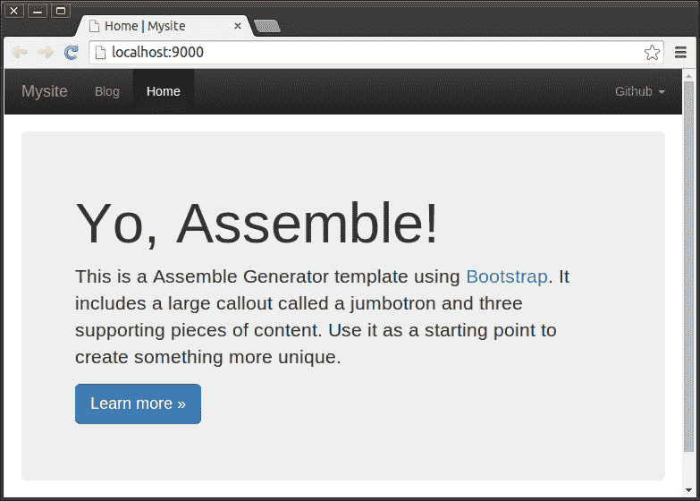
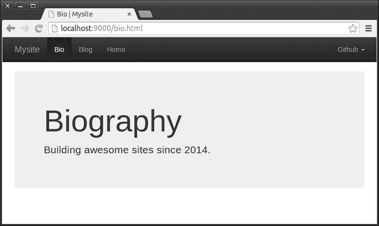
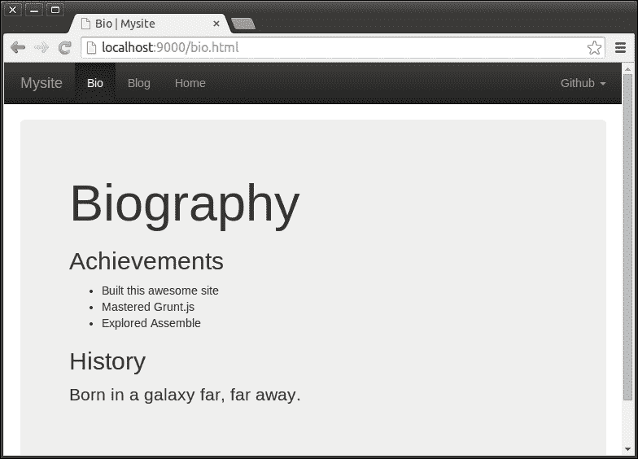
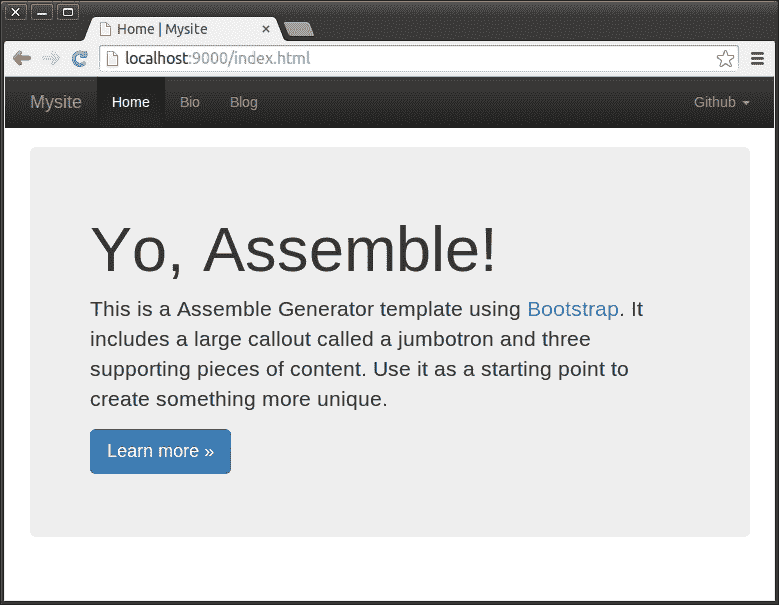
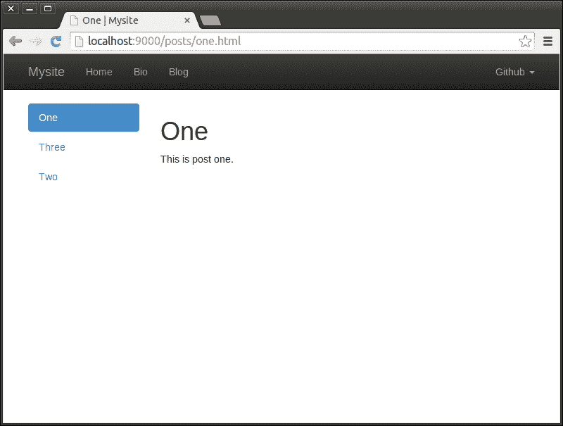

# 第十章. 静态网站

在本章中，我们将涵盖以下食谱：

+   设置基本网站项目

+   在网站上添加页面

+   在网站上添加内容

+   向网站添加数据

+   创建和使用网站布局

+   从集合生成页面

+   创建模板助手

+   使用插件

# 简介

Grunt 真正出色的领域之一是管理静态网站项目。使用 Grunt 生成静态网站可以快速且易于修改，当其优势对情况不适用时，可以取代构建传统服务器生成网站的复杂性和成本。

在本章中，我们将专注于利用**Assemble**框架构建静态网站。在核心上，Assemble 是一个 Grunt 插件，但它也使用 Grunt 来整合所有其他相关工具。

例如，我们将构建一个简单的静态网站来代表我们在互联网上的个人形象。把它想象成通过**万维网**（**WWW**）公开的简历。

# 设置基本网站项目

为了加快基于**Assemble**框架启动新项目的过程，我们将利用开发者社区提供的**Yeoman**生成器。生成器将生成一个最小化项目设置，包括我们开始所需的一切。

## 开始使用

本食谱的唯一要求是在全局范围内安装 Node.js，并在其上安装 Grunt，如第一章中“安装 Grunt CLI”食谱所述，即“开始使用 Grunt”。如果您还不熟悉其内容，请务必参考。

## 如何操作...

以下步骤将指导您安装 Yeoman 工具并使用它生成一个基本的 Assemble 项目。

1.  首先，我们需要使用`npm`工具全局安装 Yeoman 工具。这是通过输入以下命令来完成的：

    ```js
    $ npm install --global yo

    ```

1.  我们还需要安装专门针对生成 Assemble 项目的 Yeoman 生成器。这是通过输入以下命令来完成的：

    ```js
    $ npm install --global generator-assemble

    ```

1.  接下来，我们将创建一个名为`mysite`的目录，它将包含我们的静态网站项目，并使用以下类似的命令进入该目录：

    ```js
    $ mkdir mysite && cd mysite

    ```

1.  在安装了 Yeoman 和所需的生成器后，我们现在可以使用它通过运行以下命令来生成我们的插件项目：

    ```js
    $ yo assemble

    ```

1.  在运行上一个命令后，我们将被一系列问题所引导，这些问题将帮助生成器创建项目。这种交互应该看起来像以下这样：

    ```js
    ? Your project name: mysite
    ? Your project description: The best project ever.
    ? Would you mind telling me your username on Github? me
    ? Do you want to install Ass
    emble plugins? No

    ```

    ### 提示

    确保将示例`me` GitHub 用户名替换为您的用户名，并且选择不安装任何额外的 Assemble 插件。关于使用额外插件的内容将在本章后面讨论。

1.  在回答完这些问题后，生成器将创建一个简单静态网站项目所需的文件。类似于以下输出的信息将告知我们这些操作：

    ```js
    create AUTHORS
    create CHANGELOG
    create LICENSE-MIT
    create Gruntfile.js
    create package.json
    create .editorconfig
    create README.md
    create .gitignore
    create .gitattributes
    create bower.json
    create src/data/site.yml
    create src/assets/theme.css
    create src/content/markdown.md
    create src/templates/pages/blog.hbs
    create src/templates/pages/index.hbs
    create src/templates/layouts/default.hbs
    create src/templates/partials/navbar-fixed-top.hbs

    ```

1.  在创建了上述文件之后，生成器也应该自动安装在新创建的`package.json`和`bower.json`文件中提到的所需依赖项。然而，如果出现依赖项尚未安装的情况，你可以尝试使用以下命令手动安装：

    ```js
    $ bower install & npm install

    ```

1.  在创建了必要的文件并安装了依赖项之后，我们现在可以使用`grunt server`命令构建我们的网站并在本地托管。这应该会产生类似于以下内容的输出：

    ```js
    Running "clean:0" (clean) task
    >> 0 paths cleaned.

    Running "copy:bootstrap" (copy) task
    Created 4 directories, copied 12 files

    Running "copy:theme" (copy) task
    Created 1 directories, copied 1 files

    Running "assemble:pages" (assemble) task
    Assembling dist/blog.html OK
    Assembling dist/index.html OK
    >> 2 pages assembled.

    Running "connect:livereload" (connect) task
    Started connect web server on http://localhost:9000

    Running "watch" task
    Waiting...

    ```

1.  一旦`server`任务完成，它应该会自动打开你的默认浏览器，并在`http://localhost:9000/`上显示标准生成的网站。在撰写本文时，它看起来如下所示：

# 向网站添加页面

作为其核心，一个静态网站仅仅是一系列页面的集合。在我们基本设置到位后，我们可以考虑添加一个包含我们个人一些传记信息的页面。

## 入门

在这个菜谱中，我们将使用我们在本章早期“设置基本网站项目”菜谱中创建的基本项目结构。如果你还不熟悉它的内容，请务必参考它。在我们开始之前，我们还应该确保网站构建器和服务器正在运行。如果它们还没有运行，可以使用`grunt server`命令启动它们。

## 如何操作...

以下步骤将引导我们向我们的静态网站添加一个包含我们简单传记的页面：

1.  首先，我们将在`src/templates/pages`目录中创建一个名为`bio.hbs`的文件，并填充一些关于我们新页面的信息：

    ```js
    ---
    title: Bio
    heading: 'Biography'
    ---
    ```

    ### 小贴士

    文件的前部分被称为**YAML 前文部分**，它可以用来向网站构建工具提供有关页面的元数据。你可以在以下网址了解更多信息：

    [`assemble.io/docs/YAML-front-matter.html`](http://assemble.io/docs/YAML-front-matter.html)

1.  在将我们的页面信息添加到文件后，我们可以继续添加页面的 HTML 内容。让我们通过在文档开头部分之后添加以下内容来完成这个操作：

    ```js
    <div class="jumbotron">
      <h1>{{ heading }}</h1>
      <p>Building awesome sites since 2014.</p>
    </div>
    ```

    Assemble 项目生成器提供的默认模板语言是 Handlebars，这在前面代码中已经使用。你可以在以下网址了解更多关于 Handlebars 的信息：

    [`handlebarsjs.com/`](http://handlebarsjs.com/)

    确保注意，前文部分中提供的元数据可以在页面模板中使用。一个这样的例子可以在前面代码中使用`heading`变量时看到。

1.  在保存我们新创建的页面文件后，最初启动的网站构建器应该自动检测到它的添加，并继续重新编译我们的网站，生成类似于以下内容的输出：

    ```js
    >> File "src/templates/pages/bio.hbs" added.
    Running "assemble:pages" (assemble) task
    Assembling dist/bio.html OK
    Assembling dist/blog.html OK
    Assembling dist/index.html OK
    >> 3 pages assembled.

    ```

1.  一旦编译完成，它应该刷新我们的浏览器对`http://localhost:9000/`的视图，之后我们应该在网站顶部的导航栏中看到一个新的`Bio`项目。如果我们选择此项目，我们应该看到一个新页面，其外观可能如下所示：

# 向网站添加内容

在开发一个网站时，通常建议将网站的结构和内容分开。以这种方式组织可以使我们轻松编辑网站不断变化的内容，而无需每次都涉及相对静态的结构。

**Assemble**框架附带了一个实现**Markdown**文本格式化语法的库；这使我们能够轻松创建具有最小结构的内容文档，并将其渲染为格式良好的 HTML。

您可以在以下 URL 了解更多关于 Markdown 语法的知识：

[Markdown](http://daringfireball.net/projects/markdown/)

## 开始使用

在这个菜谱中，我们将继续本章中“向网站添加页面”菜谱中的项目。如果您还不熟悉其内容，请务必参考。在我们开始之前，我们还应该确保网站构建器和服务器正在运行。如果它们还没有运行，可以使用`grunt server`命令启动它们。

## 如何操作...

以下步骤将指导我们创建一个 Markdown 文档来包含我们的传记，并在页面中使用它。

1.  首先，我们将在`src/content`目录中创建一个名为`bio.md`的新文件，并用我们的传记内容以 Markdown 格式填充它：

    ```js
    ## Achievements

    * Built this awesome site
    * Mastered Grunt
    * Explored Assemble

    ## History

    Born in a galaxy far, far away.
    ```

    ### 小贴士

    在以下 URL 中可以找到 Assemble 支持的 Markdown 语法的便捷速查表：

    [Markdown 快速参考](http://assemble.io/docs/Cheatsheet-Markdown.html)

1.  在创建内容文件后，我们现在需要在我们的网站上使用它。我们将通过更改`src/templates/pages/bio.hbs`文件的内容来实现这一点：

    ```js
    ---
    title: Bio
    heading: 'Biography'
    ---
    <div class="jumbotron">
      <h1>{{ heading }}</h1>
      {{md 'src/content/bio.md'}}
    </div>
    ```

    ### 小贴士

    `md` **Handlebars**助手由附带在 Assemble 中的`handlebars-helpers`包提供。它可以通过提供字符串或包含文件路径的变量来渲染 Markdown 文件。

1.  保存修改后的`bio.hbs`文件后，我们最初启动的网站构建器应该会自动检测到它已被修改，并继续重新编译我们的网站，生成类似于以下内容的输出：

    ```js
    >> File "src/templates/pages/bio.hbs" changed.
    Running "assemble:pages" (assemble) task
    Assembling dist/bio.html OK
    Assembling dist/blog.html OK
    Assembling dist/index.html OK
    >> 3 pages assembled.

    ```

1.  如果我们现在查看位于`http://localhost:9000/bio.html`的传记页面，我们会看到我们的新内容现在显示在上面；它应该看起来像以下这样：

# 向网站添加数据

很常见的情况是，网站上的大部分内容都遵循某种模式，并且只有内容的一部分在不同页面之间有所不同。例如，显示文章的网站将使用相同的布局显示每篇文章，并以重复的方式列出它们。作为开发者，我们可能希望避免手动创建这些结构相似的页面或项目。

为了这个目的，通常建议将我们希望以这种方式显示的内容存储为数据，然后我们可以使用模板或布局来渲染它们，每个模板都将使用相同的模板呈现。

## 入门

在这个菜谱中，我们将继续使用本章前面找到的“向网站添加内容”菜谱中的项目。如果您还不熟悉其内容，请务必参考它。在我们开始之前，我们还应该确保网站构建器和服务器正在运行。如果它们尚未运行，可以使用`grunt server`命令启动它们。

## 如何做到这一点...

以下步骤将指导我们添加表示导航栏项的数据，并使用这些数据来定制导航栏的渲染。

1.  由于我们的网站只有一个导航栏，我们不妨将其直接添加到位于`src/data`目录中的现有`site.yml`文件中。此文件用于存储与网站本身相关的数据。让我们向其内容中添加以下`sections`集合：

    ```js
    title: Mysite
    sections:
      - title: Home
        dest: 'dist/index.html'
      - title: Bio
        dest: 'dist/bio.html'
      - title: Blog
        dest: 'dist/blog.html'
    ```

    ### 小贴士

    前一个文件的数据以 YAML 格式存储。以下 URL 提供了有关 YAML 格式的更多信息：[`yaml.org/`](http://yaml.org/)。

1.  接下来，我们将修改导航栏的模板，以使用我们在`site.yml`文件中提供的`sections`数据。为此，我们首先需要在位于`src/templates/partials`目录中的`navbar-fixed-top.hbs`文件中找到以下代码块：

    ```js
    {{#each pages}}
    <li{{#if this.isCurrentPage}} class="active"{{/if}}>
      <a href="{{relative dest this.dest}}">{{data.title}}</a>
    </li>
    {{/each}}
    ```

1.  一旦我们找到了上述代码块，我们可以将其替换为根据`sections`数据列出导航项的代码。这是通过替换为以下代码来完成的：

    ```js
    {{#each site.sections}}
    <li {{#is dest ../page.dest}} class="active"{{/is}}>
      <a href="{{relative ../page.dest dest}}">{{title}}</a>
    </li>
    {{/each}}
    ```

    ### 小贴士

    在这里，`#is`辅助函数用于检查页面的完整路径名是否与导航栏项应链接到的路径名相同。如果它们匹配，则该项应呈现为当前激活项。

    在这里，`relative`辅助函数用于确定从当前页面到导航项应链接到的页面的相对路径。

    这里提到的两个辅助函数都是由与 Assemble 捆绑的`handlebars-helpers`库提供的。

    Assemble 框架根据目录包含的文件名与变量同名，使`src/data`目录中的数据可用。这就是我们如何在之前的示例中使用`site`变量名来访问`site.yml`文件中的数据。

1.  保存修改后的 `navbar-fixed-top.hbs` 文件后，我们最初启动的网站构建器应该会自动检测到它已被修改，并继续重新编译我们的网站，生成类似于以下内容的输出：

    ```js
    >> File "src/templates/partials/navbar-fixed-top.hbs" changed.
    Running "assemble:pages" (assemble) task
    Assembling dist/bio.html OK
    Assembling dist/blog.html OK
    Assembling dist/index.html OK
    >> 3 pages assembled.
    ```

1.  如果我们现在查看 `http://localhost:9000/` 上的任何页面，我们会看到导航栏中的项目现在按照 `sections` 数据中项目的顺序排列：

# 创建和使用网站布局

在整个网站上保持一致的布局可以极大地提高其可用性，同时也能在开发过程中节省时间。Assemble 框架允许我们轻松地以各种方式创建和使用布局。

## 准备工作

在这个菜谱中，我们将继续在本章的 *向网站添加数据* 菜谱中工作的项目。如果您还不熟悉它的内容，请务必参考它。在我们开始之前，我们还应该确保网站构建器和服务器正在运行。如果它们还没有运行，可以使用 `grunt server` 命令启动它们。

## 如何操作...

以下步骤将引导我们创建一个新的布局模板，并设置一些使用它的示例博客页面。

1.  首先，我们将创建一个新的布局模板，它将为我们的示例博客文章页面提供布局。让我们在 `src/templates/layouts` 目录中创建一个名为 `post.hbs` 的文件，并填充以下内容：

    ```js
    ---
    layout: src/templates/layouts/default.hbs
    ---
    <div class="row">
      <div class="col-xs-3">
        <ul class="nav nav-pills nav-stacked">
          {{#each pages}}
            <li{{#if this.isCurrentPage}} class="active"{{/if}}>
              <a href="{{relative dest this.dest}}">
                {{data.title}}
              </a>
            </li>
          {{/each}}
        </ul>
      </div>
      <div class="col-xs-9">
        <h1>{{title}}</h1>
        {{> body}}
      </div>
    </div>
    ```

    ### 小贴士

    在文件的顶部 YAML 前置部分，我们使用了特殊的 `layout` 属性来指示应该用于此模板的父模板。您可以在以下网址了解更多关于 Assemble 中模板继承如何工作的信息：

    [`assemble.io/docs/Layouts.html`](http://assemble.io/docs/Layouts.html)

    构建此布局所使用的 HTML 和 CSS 组合是由默认包含在 Assemble Yeoman 生成器中的 **Bootstrap** 项目提供的。您可以在以下网址了解更多关于 Bootstrap 的信息：

    [`getbootstrap.com/`](http://getbootstrap.com/)

1.  现在，我们将创建一些使用我们新创建的布局的示例博客页面。我们将通过在 `src/templates/pages/posts` 目录中创建三个文件来完成此操作，文件名为 `one.hbs`、`two.hbs` 和 `three.hbs`。每个文件都应该包含类似于以下内容：

    ```js
    ---
    title: One
    ---
    <p>This is post one.</p>
    ```

    ### 小贴士

    这些页面的内容可以是几乎任何东西，只要至少有一个包含 `title` 和之后一些 HTML 内容的前置部分。

1.  为了使我们的新创建的页面能够渲染，我们必须添加一个新的 `assemble` 任务目标。然而，这个目标将共享现有 `pages` 目标的大部分选项，所以接下来我们将把 `pages` 目标的 `options` 移动到 `assemble` 任务配置本身中，以便它可以在 `assemble` 任务的各个目标之间共享：

    ```js
    assemble: {
      options: {
        flatten: true,
        assets: '<%= config.dist %>/assets',
        layout: '<%= config.src %>/templates/layouts/default.hbs',
        data: '<%= config.src %>/data/*.{json,yml}',
        partials: '<%= config.src %>/templates/partials/*.hbs'
      },
      pages: {
        files: {
          '<%= config.dist %>/': [
            '<%= config.src %>/templates/pages/*.hbs'
          ]
        }
      }
    }
    ```

1.  现在所有目标都共享了选项，我们可以添加一个`task`目标，该目标将为我们渲染示例文章页面。让我们向组装任务添加以下名为`posts`的任务目标：

    ```js
    posts: {
      options: {
        layout: '<%= config.src %>/templates/layouts/post.hbs',
      },
      files: {
        '<%= config.dist %>/posts/': [
          '<%= config.src %>/templates/pages/posts/*.hbs'
        ]
      }
    }
    ```

1.  为了让我们能够到达这些新生成的页面并对博客文章列表页面进行一些更改。这可以通过更改`src/templates/pages`目录中`blog.hbs`文件的內容来实现：

    ```js
    ---
    title: Blog
    ---
    <h1>Posts</h1>
    <ul>
      <li><a href="/posts/one.html">One</a></li>
      <li><a href="/posts/two.html">Two</a></li>
      <li><a href="/posts/three.html">Three</a></li>
    </ul>
    ```

1.  在我们继续之前，我们还需要处理我们在将我们的示例页面模板放置在`src/templates/pages/posts`目录时引起的一个轻微副作用。默认的`watch`任务设置，该设置触发自动编译更改的模板，没有配置为在`src/templates/pages`目录本身之外查找更改。这意味着对我们示例页面模板的更改不会触发重新编译。让我们通过更改`watch`任务的`assemble`目标的`files`配置来解决这个问题，如下所示：

    ```js
    assemble: {
      files: [
        '<%= config.src %>' +
        '/{content,data,templates}/**/*.{md,hbs,yml}'
      ],
      tasks: ['assemble']
    }
    ```

1.  最后，我们可以重新启动我们运行的服务器，以便配置更改生效。重启后，我们应该看到一些关于渲染我们的示例文章页面的额外输出：

    ```js
    Running "assemble:posts" (assemble) task
    Assembling dist/posts/one.html OK
    Assembling dist/posts/three.html OK
    Assembling dist/posts/two.html OK
    >> 3 pages assembled.

    ```

1.  如果我们现在导航到我们的网站中的博客部分`http://localhost:9000/blog.html`并跟随列表中的一个链接，我们现在应该看到使用我们新的布局模板渲染的所选文章页面：

# 从集合生成页面

如果我们在网站数据中有一个项目集合，我们很可能想使用该集合生成一些页面。例如，显示博客文章的网站可能希望为集合中的每篇文章生成一个单独的页面。

## 入门

在这个菜谱中，我们将继续本章中“创建和使用站点布局”菜谱中的项目工作。如果你还不熟悉它的内容，请务必参考它。在我们开始之前，我们还应该确保站点构建器和服务器正在运行。如果它们还没有运行，可以使用`grunt server`命令启动它们。

## 如何操作...

以下步骤将引导我们创建一个包含我们博客文章集合的数据文件，并配置我们的项目使用该集合生成页面。

1.  让我们从创建我们将从中生成页面的集合数据开始。我们可以通过在`src/data`目录中创建一个名为`posts.yml`的文件并给它以下内容来实现这一点：

    ```js
    - filename: one
     data:
     title: One
     content: <p>This is post one.</p>
    - filename: two
     data:
     title: Two
     content: <p>This is post two.</p>
    - filename: three
     data:
     title: Three
     content: <p>This is post three.</p>

    ```

    ### 小贴士

    在每个页面对象中，`filename`属性指示要生成的页面的文件名，`data`属性可以用来向页面发送任何类型的元数据，而`content`属性可以用来提供应由`body`标签渲染的内容。

    上述格式由`assemble`任务的`pages`选项确定，该选项将在本菜谱的后面使用。

1.  现在我们已经将博客帖子放入数据集合中，我们可以删除之前用来表示它们的页面模板。这可以通过简单地删除整个`src/templates/pages/posts`目录来完成。

1.  在我们的集合准备就绪并且旧的页面模板被移除后，我们现在可以更改我们的配置以从集合中渲染帖子页面。我们将通过在`assemble`任务中对`posts`目标进行以下更改来实现这一点：

    ```js
    Posts: {
      options: {
        layout: '<%= config.src %>/templates/layouts/post.hbs',
        pages: grunt.file.readYAML('src/data/posts.yml')
      },
      files: {'<%= config.dist %>/posts/': []}
    }
    ```

    ### 小贴士

    应该用于生成新页面的集合是通过`pages`选项指示的。正如前一个示例所示，我们还在使用`grunt.file.readYAML`实用程序来加载我们之前创建的`src/data/posts.yml`文件中的集合。

    文件对象中的目标不再指示应该渲染的特定`files`，而是现在指示新生成的页面应该保存到的目录。

1.  最后，我们可以重新启动在后台运行的服务器，以便配置更改生效。重启后，我们应该会看到一些额外的输出，这些输出与从提供的集合中渲染我们的帖子页面有关：

    ```js
    Running "assemble:posts" (assemble) task
    Assembling dist/posts/one.html OK
    Assembling dist/posts/two.html OK
    Assembling dist/posts/three.html OK
    >> 3 pages assembled.

    ```

1.  如果我们现在在我们的网站上导航到博客帖子项，我们应该会看到它们现在反映了由帖子集合提供的资料。

## 创建模板助手

在构建页面模板的过程中，我们经常会遇到在渲染逻辑中重复出现的模式。模板助手允许我们将这些已识别的模式之一封装起来，以便在网站上的模板中轻松重复使用。

可以向模板助手传递参数，并且助手本身的逻辑是使用常规编程语言实现的，这使得使用它们所能实现的可能性相当多。

## 开始使用

在这个菜谱中，我们将继续从“从集合生成页面”菜谱中的项目工作。如果您还不熟悉它的内容，请务必参考它。在我们开始之前，我们还应该确保网站构建器和服务器正在运行。如果它们还没有运行，可以使用`grunt server`命令启动它们。

## 如何操作...

以下步骤将引导我们创建一个模板标签，用于自动列出我们博客页面上的帖子，使用的是帖子集合中的数据。

1.  让我们从创建`lib/helpers`目录开始，该目录用于包含包含我们助手代码的源文件。

1.  现在我们已经准备好了目录，我们可以在`lib/helpers`目录中创建一个名为`pages.js`的文件，并填充以下代码：

    ```js
    module.exports.register = function(
      Handlebars, options, params
    ) {
      Handlebars.registerHelper(
        'pages',
        function(target, options) {
          var config = params.grunt.config;
          var pages = config.get('assemble')[target].options.pages;
          var result = '';
          for(var i = 0; i < pages.length; i++) {
            result = result + options.fn(pages[i]);
          }
          return result;
        }
      );
    };
    ```

    ### 小贴士

    上述助手使用由`target`参数提供的任务目标名称来查找适当的目标配置。然后，它从中提取`pages`集合并遍历此集合来渲染助手的主体，每个项目作为上下文。

    你可以在以下 URL 上阅读更多关于此文件结构和注册自定义助手的信息：

    [`assemble.io/docs/Custom-Helpers.html`](http://assemble.io/docs/Custom-Helpers.html)

1.  为了遵循我们的 Grunt 配置文件约定，我们将在 `config` 任务中添加一个属性，指示将包含可重用库的目录名称。添加属性后，任务应类似于以下内容：

    ```js
    config: {
      lib: 'lib',
      src: 'src',
      dist: 'dist'
    }
    ```

1.  由于我们在项目中添加了更多以模板助手形式存在的代码，我们可能需要修改 `watch` 任务，以便模板助手代码的更改也会触发我们网站的重建。这可以通过对 `watch` 任务中的 `assemble` 目标进行以下更改来实现：

    ```js
    assemble: {
      files: [
        '<%= config.src %>' +
          '/{content,data,templates}/**/*.{md,hbs,yml}',
        '<%= config.lib %>/helpers/*.js'
      ],
      tasks: ['assemble']
    }
    ```

1.  接下来，我们将修改我们的配置，以加载 `lib/helpers` 目录中的助手，使它们在我们的所有模板中可用。这可以通过向 `assemble` 任务的选项集合中添加以下 `helpers` 选项来实现：

    ```js
    options: {
      flatten: true,
      assets: '<%= config.dist %>/assets',
      layout: '<%= config.src %>/templates/layouts/default.hbs',
      data: '<%= config.src %>/data/*.{json,yml}',
      partials: '<%= config.src %>/templates/partials/*.hbs',
      helpers: '<%= config.lib %>/helpers/*.js'
    }
    ```

1.  在我们的模板助手加载并准备好使用后，我们可以在网站的博客页面上使用它来列出我们帖子集合中所有帖子的链接。我们通过将 `src/templates/pages/blog.hbs` 的内容更改为以下内容来实现这一点：

    ```js
    ---
    title: Blog
    ---
    <h1>Posts</h1>
    <ul>
      {{#pages 'posts'}}
        <li>
         <a href="/posts/{{filename}}.html">
          {{data.title}}
         </a>
        </li>
      {{/pages}}
    </ul>
    ```

1.  最后，我们可以重新启动在后台运行的 `server`，以便配置更改能够生效。重启后，我们应该看到在 `http://localhost:9000/blog.html` 网站博客页面渲染的列表现在反映了帖子集合中的项目：

# 使用插件

为了扩展其核心功能，Assemble 框架提供了一个插件系统。目前只有少数几个插件可用于 Assemble，但拥有插件系统使得我们能够轻松创建和重用我们自己的扩展，甚至可能与社区分享。

## 准备工作

在这个菜谱中，我们将继续从 *创建模板助手* 菜谱中工作的项目。如果你还不熟悉它的内容，请务必参考它。在我们开始之前，我们还应该确保网站构建器和服务器正在运行。如果它们还没有运行，可以使用 `grunt server` 命令启动它们。

## 如何操作...

以下步骤将引导我们使用 `assemble-middleware-sitemap` 插件生成一个格式良好的 **sitemap**，该文件可以被网络爬虫用于导航和索引网站。

1.  首先，我们需要安装包含 `assemble-middleware-sitemap` 插件的包，并将其保存到我们的包依赖中。以下命令为我们完成了这项工作：

    ```js
    $ npm install assemble-middleware-sitemap

    ```

1.  接下来，我们需要指示插件应该被 `assemble` 任务的全部目标使用。这可以通过在 Grunt 配置文件中添加 `plugins` 配置选项到 `assemble` 任务中来实现，指定新安装的插件包名称：

    ```js
    options: {
      flatten: true,
      assets: '<%= config.dist %>/assets',
      layout: '<%= config.src %>/templates/layouts/default.hbs',
      data: '<%= config.src %>/data/*.{json,yml}',
      partials: '<%= config.src %>/templates/partials/*.hbs',
      helpers: '<%= config.lib %>/helpers/*.js',
      plugins: ['assemble-middleware-sitemap']
    }
    ```

1.  最后，我们可以重新启动在后台运行的我们的服务器，以便配置更改能够生效。重启后，我们应该看到`robots.txt`和`site.xml`文件已经在`dist`目录中生成了。
