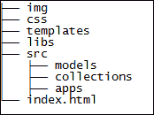
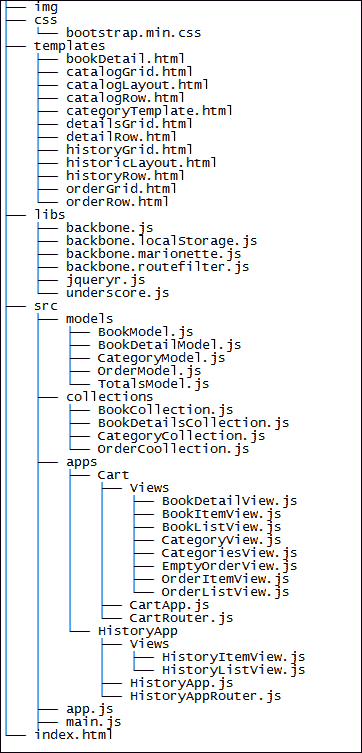

# 第七章。改变和成长

在上一章中，我们探讨了可以组合起来产生一个完全集成但松散耦合的系统的各种函数。在本章中，我们将介绍一些对 Marionette 非常有价值的外部组件，随着我们的进展，你将发现如何更改框架的一些默认功能，并将 `Marionette.js` 与外部库结合使用，以使你的应用表现更佳。以下是我们将涵盖的主题列表：

+   使用 **异步模块定义** (**AMD**)

+   使用 `Require.js` 库

+   配置 `Require.js`

+   使用文本插件加载模板

# 使用 AMD

使用 AMD，API 将帮助我们按需加载脚本，指定模块依赖关系，并减少脚本定义顺序问题。在 第五章 “分而治之——全面模块化”中，我们讨论了构建大型应用如何容易失控。需要考虑多个方面，但管理脚本模块是一个常见的场景。我们需要确保所有脚本按正确顺序加载、合并，并减少对服务器的请求次数。这似乎很简单，但随着应用的扩展，跟踪它变得非常复杂。

为了说明场景，在我们实现以下 AMD 解决方案之前，我们将使用 `Index.html` 文件中的脚本部分的一部分：

```js
<script src="img/jquery.js"></script>
<script src="img/underscore.js"></script>
<script src="img/backbone.js"></script>
<script src="img/backbone.marionette.js"></script>
<script src="img/backbone.routefilter.js"></script>
<script src="img/backbone.localStorage.js"></script>
<script src="img/bootstrap.min.js"></script>
<script src="img/Books.js"></script>
<script src="img/BaseController.js"></script>    
<!-- Cart -->
<script src="img/CartApp.js"></script>
<script src="img/CartRouter.js"></script>
<script src="img/Catalog.js"></script>
<script src="img/BookModels.js"></script>
<script src="img/Books.Data.js"></script>
<script src="img/main.js"></script>
```

此列表仅包含少量用于证明概念的文件，我们已经开始积累大量的脚本。随着我们添加更多的模块、服务、模型、视图等，它将开始变得不那么全面，并且真正难以维护。例如，在某个时刻，我们可能会失去对不再使用的文件的跟踪。在先前的代码中，所有脚本在页面加载时都会被下载，即使当前视图没有使用它们。我们的代码是模块化的，但仍然不容易编写可以即时加载、作为依赖注入并与其他模块共享的封装代码。让我们回顾一下我们如何解决这个问题。

## 使用 Require.js 库

James Burke 介绍了 `Require.js` 库，它有一个庞大的社区。作者在脚本加载方面是专家，也是 AMD 规范的贡献者。本书假设你已了解 AMD 的基础知识，因此在跳转到我们应用的实现之前，它将为你提供使用 `Require.js` 时所需的配置和样板代码的基础知识。要获取 `Require.js` 的最新构建版本，请访问项目网站，[`requirejs.org/docs/download.html`](http://requirejs.org/docs/download.html)。

## 配置 Require.js

要开始使用 `Require.js`，我们将创建一个名为 `main.js` 的文件。当然，你可以给这个文件一个更合适的名字，使其符合你的命名约定和业务领域。我们将在 `main.js` 文件中编写以下代码：

```js
require.config({
   baseUrl: 'src',
  paths: {
    jquery:     'libs/jquery',
    underscore: 'libs/underscore',
    backbone:   'libs/backbone',
    marionette: 'libs/backbone.marionette',
  },
  shim: {
    underscore: {
      exports: '_'
    },
    backbone: {
      deps: ['underscore', 'jquery'],
      exports: 'Backbone'
    },
    marionette : {
      deps : ['jquery', 'underscore', 'backbone'],
      exports : 'Marionette'
    }
  }
});
require(['jquery','underscore','backbone','marionette'], function($,_,Backbone,Marionette) {
  console.log('Hello world from the main file! ');
});
```

让我们将 `Index.html` 文件中的所有脚本引用替换为下一个脚本引用，如下所示：

```js
<script data-main="main" src="img/require.js"></script>
```

在这个脚本引用中，我们将包含所有所需配置的文件名（在我们的例子中是 `main.js` 文件）传递给 `data-main` 属性。请注意，传递的是文件名（`main`）而不是其扩展名（`.js`），因为 `Require.js` 假设它只与 JavaScript 文件一起工作；因此，不需要扩展名。源（`src`）应指向 `Require.js` 文件所在的路径。

现在，我们准备进行一个小测试，以查看我们是否走上了正确的道路。打开浏览器并在控制台，当你加载 `Index.html` 文件时，你应该会看到日志消息。

现在，让我们回顾 `main.js` 文件内容的每个部分，以更好地理解正在发生的事情。

在前面的代码片段中，我们将我们将要使用的所有库放在了 `require.config` 函数的 `paths` 部分下。在左侧，我们分配了库的别名，在右侧，我们指明了文件的路径——这个路径相对于分配的 `baseUrl` 值，在这种情况下，是 `src` 文件夹。

这个函数的第二个属性称为 **shim**。`shim` 的主要用途是针对不支持 AMD 的库，但你仍然需要管理它们的依赖项。一个完美的例子是 `Underscore.js`。在这种情况下，`Underscore.js` 被导出为 `_`，并且它不依赖于另一个库来加载。我们有一个不同的场景与 `Backbone.js` 有关，它需要 `Underscore` 才能正确工作。我们必须指定 `Underscore.js` 作为依赖项，因为 `Backbone.js` 在加载之前可能会尝试使用它。

`require` 函数放置在文件末尾，如下所示：

```js
require(['jquery','underscore','backbone','marionette'], function($,_,Backbone,Marionette) {
  console.log('Hello world from the main file!);
});
```

前面的代码将成为我们应用程序的起点。这是一个函数定义，它将导出的值作为参数。在这个阶段，我们只是在记录一条消息，但现在让我们做一些更有用的事情。

# 定义我们的应用程序模块

现在已经使用 `Require.js` 配置了核心依赖项，一旦它们被加载并准备就绪，我们就可以定义我们的 Marionette 应用程序并设置区域初始化器、命令和请求/响应处理器。这是因为我们需要一个名为 `app.js` 的单个文件内部，目的是将所有与 Marionette 应用程序对象相关的登录细节都放在这个文件中。在下面的代码中，我们的应用程序被定义并准备好作为一个 AMD 模块工作。以下是我们 `app.js` 文件的内容：

```js
define(['marionette'], function(Marionette){
  var Books = new Marionette.Application();
  Books.addRegions({
    main: '#main',
    modal: ModalRegion
  });
  Books.on('initialize:after', function () {
    if (Backbone.history) {
      Backbone.history.start();
    }
  });
  Books.startSubApp = function (appName, args) {
    var currentApp = App.module(appName);
    if (App.currentApp === currentApp) { return; }
    if (App.currentApp) {
      App.currentApp.stop();
    }
    App.currentApp = currentApp;
    currentApp.start(args);
  };
  return Books;
});
```

我们刚刚定义的书籍应用程序将在启动应用程序时在 `main.js` 文件中使用。

当我们添加新文件时，我们需要知道它的位置以及它的别名。我们通过访问`main.js`文件定义中的`paths`部分来指定这一点。在此更改后，您的`paths`部分应如下所示：

```js
paths: {
  jquery:     'libs/jquery',
  underscore: 'libs/underscore',
  backbone:   'libs/backbone',
  marionette: 'libs/backbone.marionette',
  app:        'app'
},
```

现在，我们已准备好使用此文件在`main.js`文件的`require`函数中启动我们的 Marionette 应用程序，如下所示：

```js
require(['app'], function(Books) {
  Books.start();
});
```

注意我们如何将书籍的依赖注入以启动 Marionette 应用程序，并使用 Marionette 应用程序对象的`start()`方法来触发初始化器。

## 使用 Require.js 编写子应用程序

我们定义的模块是我们的根应用程序，负责启动子应用程序。下一个示例将展示我们如何使用`Require.js`定义子应用程序。如您所见，我们可以轻松地将前面的代码适配以使用`require`函数，通过将脚本定义发送到配置文件并将必要的对象注入到模块定义中。以下代码来自`CartApp`子应用程序：

```js
define(['app'], function(Books){
  Books.module('CartApp', function (CartApp, Books, Backbone,Marionette, $, _) {
  CartApp.Controller = Marionette.Controller.extend({
    initialize: function (options) { },
    addProduct: function (model) { },
    removeProduct: function(model){ },
  });
  CartApp.addInitializer(function (args) {
    CartApp.controller = new CartApp.Controller({
      mainRegion: args.mainRegion,
    });
  CartApp.controller.show();
  });
  CartApp.addFinalizer(function () {
    if (CartApp.controller) {
      CartApp.controller.close();
      delete CartApp.controller;
    }
  });
  return Books.CartApp;
});
});
```

## 将所有组件模块化

在以下示例中，我们将展示如何编写一个用于加载`Require.js`的视图模块，但同样的概念适用于所有对象/组件。

在以下代码中，我们定义了一个名为`CategoryView.js`的视图，并在`main.js`文件中给它命名为`categoryView`的别名，这样其他文件就可以使用它。

```js
define(['app'], function(Books){
  Books.module('CartApp.CategoryView', function(View, Books, Backbone, Marionette, $, _){
    View.CategoryView = Backbone.Marionette.ItemView.extend({
      tagName : 'li',
      template: '#categoryTemplate',
      events : {
        'mouseenter .info' : 'showDetails',
        'mouseleave .info' : 'hideDetails'
      },
      showDetails : function() {
        this.$( '.info').popover({
          title:this.model.get('name'), 
          content:this.model.get('booksOnCategory')
        }); 
        this.$( '.info').popover('show');
      },
      hideDetails : function() {
        this.$( '.info').popover('hide');
      },
    });
  return Books.CartApp.CategoryView;
  });
});
```

前面的示例定义了一个作用域良好的对象。当模块没有任何依赖项且仅是一个集合时，我们通过将对象字面量传递给`define()`函数。在我们的场景中，我们的模块有依赖项，因此第一个参数应该是一个依赖项名称数组——在这种情况下，`app`是应用程序的别名——第二个参数应该是一个定义函数。

## 添加文本插件

到目前为止，我们已使用模板的 ID 定义了视图的模板属性。这个模板位于一个脚本标签内，并且始终存在于 DOM 中。但是，将所有模板放入 SPA 的 HTML 文件中不会扩展，并且会给我们带来与`Index.html`文件中所有脚本引用相同的维护问题。解决这个问题的方法就是使用文本插件。

您可以从`Require.js`页面下载文本插件。以下为下载链接：

[`requirejs.org/docs/download.html#text`](http://requirejs.org/docs/download.html#text)。

与任何其他脚本文件一样，我们需要在`main.js`文件中给它一个别名以及其路径，以便开始使用它。

文本插件的责任是从服务器获取模板并将其传递给我们的视图，这样我们就不需要在 HTML 文件中包含它。

在以下代码中，我们使用`!text/path`语法传递了模板的相对路径，并且创建视图的函数接收模板的导出名称作为参数；在这种情况下，`CategoryTemplate`。

```js
define(['app', '!text/templates/CategoryTemplate.html'], function(Books, CategoryTemplate){
  Books.module('CartApp.CategoryView', function(View, Books, Backbone, Marionette, $, _){
    View.CategoryView = Backbone.Marionette.ItemView.extend({
      tagName : 'li',
      template: CategoryTemplate,
      events : {'
        'mouseenter .info' : 'showDetails', 
        'mouseleave .info' : 'hideDetails'     
      },
      showDetails : function() {
        this.$( '.info').popover({
          title:this.model.get('name'), 
          content:this.model.get('booksOnCategory')
        });
       this.$( '.info').popover('show');
      },
      hideDetails : function() {
        this.$( '.info').popover('hide');
      },
    });
    return Books.CartApp.CategoryView;
  });
});
```

当构建大型应用程序时，这种方法更易于维护，但也许你希望为了性能优势，将初始模板保留在 HTML 文件中，其余的模板放在正确的文件结构中。

## 文件结构化

有许多不同的选项可以定义文件布局，这可能会根据项目的大小和类型而定义。最终，目标应该是创建一个易于理解、实施和维护的文件夹结构。

在以下示例中，我们将源文件分类到常见的文件夹中，例如模型和集合，以及为应用程序组件（视图和控制台）指定的特定文件夹。

我们代码所需的静态依赖项，如 CSS、图像和 JavaScript 库，应放在不同的目录下。这可以防止意外修改库代码，并让我们更好地理解实际的业务领域。

以下图片展示了我们将文件放置的基础结构：



话虽如此，让我们深入了解我们应用程序的一些细节。以下图片显示了您可能如何布局应用程序结构：



在前面的图片中，我们展示了我们的书店应用程序的结构。这种结构在这个特定情况下是有意义的。但好事是，我们创建了小而有意义的文件，它们可以以更简单、更优雅的方式相互交互，而不是包含不同组件逻辑的大文件。

## 在 Marionette 中使用 handlebars 作为模板引擎

Backbone 的一个卖点是与其他库配合良好，这一点对于 Marionette 也是适用的。如果我们想使用不同的模板引擎，我们可以轻松做到。

对于这个特定的例子，我们将使用 handlebars，我们可以从[`handlebarsjs.com/`](http://handlebarsjs.com/)下载。

下载了`Handlebars.js`文件后，我们可以通过以下行将其添加到`Index.html`文件中：

```js
<script type="text/javascript" src="img/handlebars.js">
```

或者，我们可以在`main.js`文件中指定它的别名和路径。

与 underscore 模板的语法差异在于，handlebars 表达式是`{{`，然后是一些内容，然后是`}}`，而不是`require`函数的`<%= expression %>`。因此，handlebars 模板看起来如下：

```js
<script type="text/html" id="sample-template">
<p>This is an ItemView template using handlebars<p>
{{ value1 }} </br>
{{ value2 }} </br>
</script>
```

为了在 Marionette 视图中使用此模板，我们必须调用以下语法：

```js
template : Handlebars.compile($('#sample-template').html());
```

前面的行将从 DOM 中获取模板并将其编译成一个函数，该函数稍后将由 Marionette 用于渲染视图。以下将是`ItemView`的完整代码：

```js
var SampleView = Backbone.Marionette.ItemView.extend({
  template : Handlebars.compile($('#sample-template').html())
});
```

要查看此功能的工作情况，请访问[`jsfiddle.net/rayweb_on/gXemX/`](http://jsfiddle.net/rayweb_on/gXemX/)的 JSFiddle 示例。

就这样！开始使用不同的模板引擎不需要进行全局更改。如果我们想的话，我们也可以同时使用这两个引擎，因为模板的定义是在视图层面。

# 摘要

在本章中，我们了解到为了管理我们应用日益增加的复杂性，我们必须将其分解成单独的文件。这个文件数量的增加导致另一个问题，而`Require.js`以优雅的方式解决了这个问题。`Backbone.js`的开发明显受益于`Marionette.js`的使用，以及其他库，例如`Require.js`和`Handlebars.js`等。这无疑会使我们的开发环境更加稳固，同时，对变化也更加灵活。
