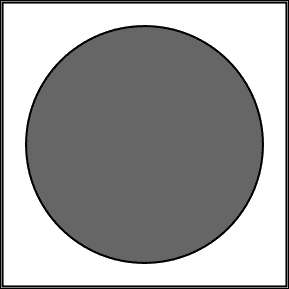

# 第二章：开始使用 CreateJS

在本章中，我们将讨论如何在 CreateJS 和 EaselJS 中处理基本对象和事件。在了解这些主题后，你可以使用 CreateJS 的基本方法和函数来创建你的形状，并通过事件来控制它们。

我们将讨论以下主题：

+   探索 CreateJS

+   与 API 一起工作

+   方法与事件

# 探索 CreateJS

EaselJS 是 CreateJS 的主要模块之一，它使开发者能够与 Canvas 元素一起工作。要使用 EaselJS，我们需要有一个`canvas`元素，因此所有形状都可以渲染到这个区域。在创建`Stage`类的实例后，我们需要将`displayObject`添加到`Stage`类中。EaselJS 支持以下功能：

+   **位图**：这用于图像。

+   **形状**和**图形**：这些用于矢量图形。

+   **精灵图集**和**精灵**：这些用于动画位图。

+   **文本**：这用于简单的文本实例。

+   **容器**：这些包含其他 DisplayObjects。

+   **DOM 元素**：这用于控制 HTML DOM 元素。

当`Stage`对象包裹`canvas`元素时，所有形状和文本都会出现在`Canvas`元素中。

### 注意

更多详情，请查看 EaselJS 文档：[`www.createjs.com/Docs/EaselJS/modules/EaselJS.html`](http://www.createjs.com/Docs/EaselJS/modules/EaselJS.html)。

让我们通过一个在 EaselJS 中创建基本形状的例子来了解一下。这里，我们有一个具有特定高度和宽度的`canvas`元素：

```js
<canvas id="demoCanvas" width="500" height="200"></canvas>

```

CreateJS 有一个`Stage`方法，它接受第一个参数为一个`canvas`元素，我们应该将我们的`canvas`元素的 ID 传递给它：

```js
var stage = new createjs.Stage("demoCanvas");

```

现在我们为我们的`canvas`元素创建了一个舞台。在下一步中，我们需要创建一个形状：

```js
var circle = new createjs.Shape();
circle.graphics.beginFill("red").drawCircle(0, 0, 50);
circle.x = 100; 
circle.y = 100; 
```

### 提示

**下载示例代码**

您可以从您在[`www.packtpub.com`](http://www.packtpub.com)购买的 Packt 书籍的账户中下载所有示例代码文件。如果您在其他地方购买了这本书，您可以访问[`www.packtpub.com/support`](http://www.packtpub.com/support)并注册以直接通过电子邮件获得文件。

在第一行，创建了一个名为`circle`的变量。它包含来自 EaselJS 的`Shape`对象。所有`Shape`对象都有一个`graphics`属性。

在下一行，我们使用`beginFill`方法将其填充为红色，然后在下一行，我们使用`drawCircle`方法创建一个圆形。`drawCircle`方法有三个参数；前两个参数用于定位圆形（x 和 y 轴的值），最后一个参数是像素半径。因此，我们创建了一个位置为`0`（相对于形状的位置）和半径为`50`的圆形。

EaselJS 支持方法链，我们可以一个接一个地调用所有函数，就像我们在之前的创建圆形和填充背景颜色的示例中看到的那样。

在创建`Shape`对象后，我们需要将其添加到我们的`stage`对象中，并按以下方式更新舞台：

```js
stage.addChild(circle);
stage.update();
```

请记住，在添加 `child` (`shape`, `circle` 等等) 之后，我们必须从 `stage` 对象中调用 `update` 方法来更新舞台；否则，代码将无法正常运行，我们也不会得到期望的结果。您可以在下面的屏幕截图中看到我们简单代码的结果：



# 与事件一起工作

`DisplayObject` 有一个方法可以向形状或对象添加事件。使用 `addEventListener`，我们可以向 `DisplayObject`（例如，`shape`）添加事件。此函数有两个强制参数：

+   事件的名称

+   事件回调函数

我们将通过以下代码了解这种处理事件的方法：

```js
displayObject.addEventListener("click", handleClick); 
function handleClick(event) {
  // Click happened.
}
```

在第一行，向 `displayObject` 添加了一个点击事件，以便当用户点击对象时调用 `handleClick` 函数。在这个例子中，`handleClick` 函数是空的。

让我们考虑我们之前的圆圈示例，并向我们的圆圈添加一个点击事件。在点击事件的回调函数内部，我们将圆圈向右移动 10 像素。以下是该代码：

```js
circle.addEventListener("click", handleClick); 
function handleClick(event) { 
event.target.x += 10; 
stage.update(); 
}
```

在第一行，我们有我们的 DisplayObject。使用 `addEventListener`，我们将点击事件添加到圆圈上。我们的回调处理程序是 `handleClick`。在这个函数内部，我们可以获取目标对象（在这个例子中是圆形形状）并通过 `event` 变量更改形状的属性（例如，宽度、高度或位置）。

`event.target` 是目标形状对象。在每次回调函数调用中，我们添加 x 属性 10，然后从 `stage` 对象中调用 `update` 函数。我们必须在更改属性后调用更新函数，以便应用更改。

记住，为了向 `DisplayObject` 添加事件，我们首先需要添加事件监听器，然后将 displayObject 添加到舞台中。以下是我们的示例的完整源代码：

```js
var stage = new createjs.Stage("demoCanvas");

var circle = new createjs.Shape();
circle.graphics.beginFill("red").drawCircle(0, 0, 50);
circle.x = 100; 
circle.y = 100; 

circle.addEventListener("click", handleClick); 
function handleClick(event) { 
  event.target.x += 10; 
  stage.update(); 
}
stage.addChild(circle);
stage.update();
```

EaselJS 有更多的事件，您可以在之前解释的相同示例中使用它们。

目前 DisplayObjects 支持以下事件：

+   `click`：用户点击并释放鼠标

+   `dblclick`：用户双击鼠标

+   `mousedown`：用户点击鼠标

+   `mouseout`：用户将鼠标指针从对象移开

+   `mouseover`：用户将鼠标指针移到对象上

+   `pressmove`：用户点击鼠标然后移动它

+   `pressup`：用户在对象上方或外部释放鼠标

+   `rollout`：用户从子元素移开

+   `rollover`：用户在子元素上悬停

### 注意

更多详细信息，请参阅 [`www.createjs.com/Docs/EaselJS/classes/DisplayObject.html#events`](http://www.createjs.com/Docs/EaselJS/classes/DisplayObject.html#events)。

# 摘要

在本章中，我们学习了如何使用 CreateJS 和 EaselJS 的基本功能和事件。我们学习了如何在 EaselJS 中创建舞台对象，`DisplayObject` 是什么，以及如何将它们附加到 `stage` 对象。

我们还在 EaselJS 中创建了第一个简单形状，一个圆。在章节的最后部分，我们讨论了如何在 EaselJS 中为一个对象添加事件监听器。

在下一章中，我们将通过复杂的示例来创建拖放交互，并在 EaselJS 中使用鼠标事件。
