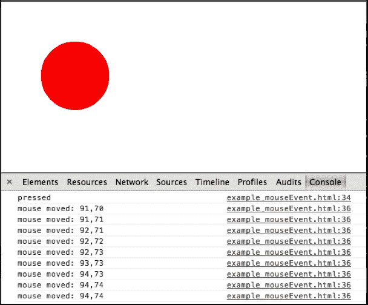

# 第三章：处理拖放交互

在本章中，我们将介绍 CreateJS 的基本事件和回调，以实现**拖放**功能。阅读本章后，您将能够理解 CreateJS 中对象的常见事件，以及如何更改宽度或高度等属性。本章将涵盖以下主题：

+   拖放场景

+   鼠标事件

+   创建拖放示例

# 场景

要创建拖放功能，我们只需要将事件绑定到`Stage`对象上的`DisplayObject`（如圆圈）上，然后随着鼠标的移动，持续更改目标对象的 x 和 y 轴。幸运的是，CreateJS 提供了许多鼠标悬停事件，我们可以利用它们来实现目标。

在接下来的章节中，我们将看到如何将事件绑定到对象上，并从鼠标光标获取信息。我们还将了解如何更改`Stage`对象中对象或形状的属性。

# 理解 on 函数

在 EaselJS 中，您可以访问所有鼠标事件，如点击、鼠标抬起等。`MouseEvent`实例作为所有鼠标事件回调的唯一参数传递。它包括`stageX`和`stageY`属性，它们表示光标相对于舞台坐标的位置。

在以下示例中，当鼠标点击圆圈时，`pressed`将被记录到控制台；之后，每当鼠标移动时，都会记录鼠标移动，直到鼠标释放。

```js
circle.on("mousedown", function(mousedownEvent) {
    console.log("pressed");
    circle.on("pressmove", function(moveEvent) { 
        console.log("mouse moved: "+moveEvent.stageX+","+moveEvent.stageY); 
    });
});
```

如您所见，我们可以简单地将鼠标事件绑定到我们的`DisplayObject`对象上，然后在每个事件回调中读取或修改属性。以下截图显示了上一个示例的输出以及鼠标事件的详细信息：



在下一节中，我们将把这些东西放在一起，创建一个简单的拖放交互。

# 创建拖放交互

在上一章中，我们了解到与 EaselJS 一起工作的第一个要求是创建一个`Stage`对象，然后将所有`DisplayObject`对象附加到它上。假设我们有一个 ID 为`demoCanvas`的`Canvas`元素。我们需要以下代码来完成同样的任务：

```js
var stage = new createjs.Stage("demoCanvas");
```

如果你想在鼠标光标离开`Canvas`元素时跟踪鼠标光标事件的移动，应将`mouseMoveOutsideproperty`设置为`true`：

```js
stage.mouseMoveOutside = true;
```

在下一步中，将创建一个圆：

```js
var circle = new createjs.Shape(); 
circle.graphics.beginFill("red").drawCircle(0, 0, 50);
```

当然，我们必须将我们的形状添加到以下所示的`stage`元素中：

```js
stage.addChild(circle);
```

现在，是时候将函数绑定到`mousedown`和`pressmove`事件上了：

```js
circle.on("mousedown", function (evt) {
    var offset = {
        x: evt.target.x - evt.stageX,
        y: evt.target.y - evt.stageY
    };

    circle.on("pressmove", function (ev) {
        ev.target.x = ev.stageX + offset.x;
        ev.target.y = ev.stageY + offset.y;
        stage.update();
    });
});
```

如你所见，我们为显示对象 `circle` 的 `mousedown` 事件设置了一个回调函数。在匿名函数内部，有一个偏移变量，它有两个属性，`x` 和 `y`。这些属性收集鼠标在形状（本例中的圆）上的每次点击的偏移值，因此我们可以使用这个偏移值来改变圆的位置。在这个例子中，`x` 或 `y` 的值可能在 +50 和 -50 之间。

之后，将一个匿名函数添加到形状的 `pressmove` 事件中。

在 `pressmove` 事件的下一个匿名函数内部，我们有两行代码。这两行代码都计算鼠标光标的当前位置，然后改变目标形状的坐标。`ev.stageX` 和 `ev.stageY` 总是给出舞台内鼠标光标的坐标。因此，使用这些属性，我们可以正确地改变目标形状的坐标。

现在一切准备就绪，但我们需要执行最后一步来完成挑战。正如我们在 EaselJS 中之前学到的，我们应该在 `stage` 事件中对对象进行任何更改后调用 `update` 函数，以更新舞台。在拖放示例中，我们正在连续更改目标形状的坐标。因此，我们也必须连续更新 `Stage` 事件；问题是如何做到这一点。这个问题的答案是，我们必须在每个事件的调用上调用 `stage.update()`，如下所示：

```js
stage.update();
```

EaselJS 将在每次更改圆的坐标后更新舞台事件。

## 完整示例

这里你可以看到创建一个简单的拖放交互的完整源代码：

```js
stage = new createjs.Stage("demoCanvas");
stage.mouseMoveOutside = true;

var circle = new createjs.Shape();
circle.graphics.beginFill("red").drawCircle(100, 100, 50);
stage.addChild(circle);

circle.on("mousedown", function(evt) {
    var offset = {
        x: evt.target.x - evt.stageX,
        y: evt.target.y - evt.stageY
    };

    circle.on("pressmove", function(ev) {
        ev.target.x = ev.stageX + offset.x;
        ev.target.y = ev.stageY + offset.y;
        stage.update();
    });
});

stage.update();
```

运行示例后，你应该看到一个红色圆圈，如下面的截图所示。通过点击并拖动圆圈，圆圈的坐标将会改变。


# 摘要

在这一章中，我们学习了如何处理 `mousedown` 和 `pressmove` 事件，如何更改对象属性，以及如何使用 EaselJS 功能连续更新舞台事件。通过结合所有提到的功能，我们可以使用 CreateJS 构建动画或拖放交互。

在下一章中，我们将讨论如何使用 CreateJS 处理对象的动画和变换，以在浏览器中开发出色的动画。
