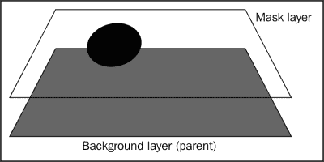
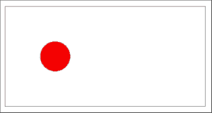
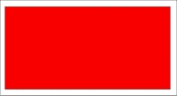
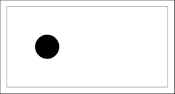
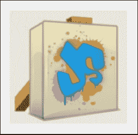
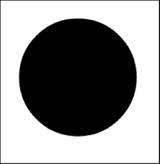
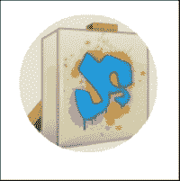
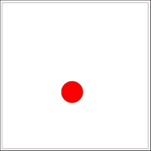

# 第八章：利用向量蒙版

在本章中，我们将讨论在 CreateJS 中使用向量蒙版以及如何使用向量蒙版开发动画或绘图。首先，我们应该了解什么是向量蒙版以及它做什么。使用向量蒙版，我们可以控制父层中哪些部分被隐藏或显示。我们甚至可以向向量蒙版添加特殊效果，使父层的那部分与其它部分不同。

在本章中，我们将介绍：

+   学习向量蒙版

+   将向量蒙版添加到现有的 `DisplayObject` 对象

+   将向量蒙版应用于图片

+   动画蒙版层

# 学习向量蒙版

向量蒙版是 EaselJS 中一个有用的功能，它允许开发者轻松地创建令人惊叹的动画或绘图。每个 `DisplayObject` 对象都有一个 `mask` 属性，您可以使用它来应用蒙版层，换句话说；在现有形状或图片上创建一个层。在应用蒙版层并更新 `stage` 事件后，您将看到新层覆盖了现有层。换句话说，您可以使用向量蒙版控制父层中隐藏或显示的部分。



此外，蒙版层也是形状，因此您可以连续更改蒙版层的属性以创建动画。

这里是使用 EaselJS 中向量蒙版的示例：

```js
/* Declare stage in usual way */
var canvas = document.getElementById("canvas");
var stage = new createjs.Stage(canvas);

/* Create the mask */
var mask = new createjs.Shape();
mask.graphics.drawCircle(0, 0, 30);
mask.x = 100;
mask.y = 100;

var bg; /* Create a red background */
var bg = new createjs.Shape();
bg.graphics.clear().beginFill("red").rect(0, 0, 400, 200);

/* Add mask to background */
bg.mask = mask;

/* Add to stage */
stage.addChild(bg);

/* update stage in usual way */
stage.update();
```

与本书中的其他示例一样，我们首先从页面中获取 `canvas` 元素，然后创建 `Stage` 对象。然后，我们使用 `Shape` 类和 `drawCircle` 函数创建一个简单的圆形。对于默认位置，我们将 `x` 和 `y` 都设置为 `100`。这个圆形是我们的向量蒙版层。

然后，我们创建一个 `bg` 变量，它包含一个填充红色的矩形。之后，我们将第一个形状（即圆形）分配给 `bg` 变量的 `mask` 属性。最后，我们将 `bg` 变量添加到舞台中。

这里是前面源代码的输出：



为了更好地理解示例，请查看以下截图。这是移除蒙版层后的输出。



如您在第一个示例中所见，我们的蒙版层仅在圆形形状中可见，但在下一个示例中，整个矩形都可见，因为没有蒙版层了。

以下截图显示了独立的蒙版层：



在将蒙版层分配给父层（红色矩形）后，矩形唯一可见的部分将是蒙版层的可见部分。

在下一节中，我们将查看一个带有蒙版层的拖放示例。

# 使用位图图像的向量蒙版

在本节中，您将通过示例学习如何使用矢量蒙版、滤镜和`Bitmap`类。`Bitmap`类是`DisplayObject`的子集；因此，它几乎具有`Shape`类的所有属性，例如`filters`、`mask`等。

这里是一个使用`Bitmap`类与矢量蒙版的示例：

```js
//query the canvas element
var canvas = document.getElementById("canvas");

//create the Stage class
var stage = new createjs.Stage(canvas);

//create the mask layer
var mask = new createjs.Shape();
mask.x = img.width / 2;
mask.y = img.height / 2;
mask.graphics.drawCircle(0, 0, 100);

var bg = new createjs.Bitmap(img);
//add blur filter
bg.filters = [new createjs.BlurFilter(50,50,10)];
bg.cache(0,0,img.width,img.height);
bg.mask = mask;
stage.addChild(bg);

stage.update();
```

在第一行，我们创建了指向页面上的`canvas`元素的`canvas`变量。然后，我们使用`Stage`类初始化了`stage`变量。

在下一行，我们使用`Shape`类初始化了一个`mask`变量。这个形状是我们的蒙版层，它是一个圆形。对于蒙版层的坐标，我们使用了`img.width / 2`和`img.height / 2`将蒙版层放置在图片的中心。然后，我们使用`drawCircle`方法创建了圆形。

然后我们创建了`bg`变量，它指向我们的图像。我们使用`Bitmap`类初始化了这个变量；`Bitmap`类的第一个参数是`Image`类。我们已使用`Image`类加载了图像。

这里是一个加载图像并使用`onload`事件的示例：

```js
var img = new Image();
img.src = "easlejs.png";

img.onload = function(evt) {
    //logic
}
```

### 注意

您可以使用相同的方法在 EaselJS 中加载图像并将它们传递给`Bitmap`类。

然后，我们在图片滤镜中添加了一个模糊滤镜，并使用`cache`方法缓存了形状。我们使用原始图像尺寸作为`cache`方法的参数。然后我们使用`mask`属性将蒙版层赋值给`bg`变量。

最后，我们将`bg`变量添加到`stage`事件中，并更新了这个事件以应用更改。

为了更好地理解差异，请查看以下没有`mask`属性的`bg`变量的输出截图。这是没有蒙版层的`Bitmap`类。



下图显示了矢量蒙版单独的情况：



下面的截图展示了带有蒙版层的最终示例结果：



如您所见，第一张截图显示了整个图像。然而，第三张图中唯一可见的部分是我们的蒙版层，即圆形。这就是矢量蒙版与图片和形状一起工作的方式。您可以创建任何形状，并用这个形状蒙版一个现有的层，例如一个图片。

在下一个示例中，我们将创建一个使用矢量蒙版的拖放交互。

# 玩转矢量蒙版

现在，我们将完成之前的示例，使用矢量蒙版创建一个简单的拖放示例。想法是在父层的`mousemove`事件中更改蒙版层的 x 和 y 坐标，这样我们只能看到覆盖现有形状的蒙版层。看起来就像只有圆形形状被拖动，但实际上我们的蒙版层正在不断变化。我们示例的源代码如下：

```js
var stage = new createjs.Stage("canvas");
var mask = new createjs.Shape();

mask.graphics.drawCircle(0, 0, 30);
mask.x = 100;
mask.y = 100;

var bg = new createjs.Shape();
bg.graphics.clear().beginFill("red").rect(0, 0, 400, 400);

bg.mask = mask;

function handlePress(event) {
    event.addEventListener("mousemove", handleMove);
}

function handleMove(event) {
    mask.x = stage.mouseX;
    mask.y = stage.mouseY;
    stage.update();
}

bg.addEventListener("mousedown", handlePress);

stage.addChild(bg);
stage.update();
```

如前一个示例所示，我们在第一行创建了一个圆形的遮罩层。我们使用 `x=100` 和 `y=100` 指定了遮罩层的默认坐标。然后，我们创建了一个 `bg` 变量，它包含背景或父层。

因为我们需要遮罩层的坐标随着鼠标光标的移动而连续变化，所以我们为 `mousedown` 和 `mousemove` 事件绑定了回调函数。然后，在 `mousemove` 回调函数内部，我们改变了遮罩层的坐标并更新了舞台。

结果看起来像是在舞台上拖放的一个球，但实际上，是随着鼠标的每一次移动而不断变化的遮罩层。



# 摘要

矢量遮罩功能是绘制和开发动画中最有用的功能之一，不仅限于 CreateJS，还适用于所有其他工具。在本章中，我们学习了如何在 EaselJS 中创建矢量遮罩层，以及如何增强它们来创建动画。当您需要将不同的过滤器应用于现有形状或图片的特定部分时，这个功能也非常有用。

在下一章中，我们将总结所有内容，从头开始使用我们已讨论过的所有 CreateJS 功能来创建一个完整的 UI。
