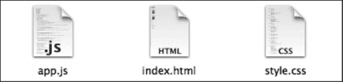
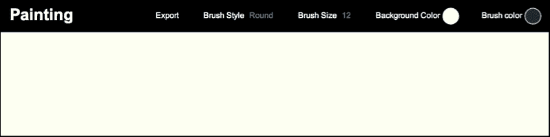
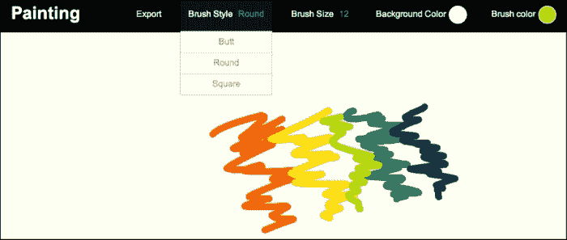

# 第九章：开发您的第一个 CreateJS 应用程序

在我们之前的章节中，您学习了构建令人印象深刻的 Web 应用程序所需的所有关于 CreateJS 的知识。在本章中，我们将总结所有内容，并学习从头开始使用 CreateJS 构建实际应用程序。我们将开发一个简单的绘画应用程序，具有更改背景颜色、画笔颜色、画笔样式、画笔大小等功能。此外，您还将了解有助于您开发更好的 JavaScript 库和应用程序的技巧和提示。

在本章中，我们将涵盖以下主题：

+   构想应用程序

+   解释应用程序的结构

+   实现应用程序的每个部分

+   从 `Canvas` 元素导出图像

# 理解您的应用程序结构

为了演示使用 CreateJS 的应用程序开发，我们将构建一个绘画应用程序。在这个应用程序中，我们将使用 EaselJS 模块和一些纯 JavaScript 片段来从 `Canvas` 元素导出图像。正如您所知，EaselJS 将所有输出渲染到 `Canvas` 元素中；有一些 JavaScript 函数可以从 `Canvas` 元素获取图像输出。

此应用程序包含三个文件：

+   `index.html`

+   `app.js`

+   `style.css`

在 `index.html` 文件中，我们创建 HTML 元素并将外部文件链接到它。`app.js` 是包含几乎所有运行应用程序的 JavaScript 代码的主要 JavaScript 文件，而 `style.css` 用于设置页面、下拉菜单和其他小元素的风格。



我们将依赖项拆分到不同的文件中，以便更好地管理它们，并在加载应用程序时提供更好的性能。外部静态文件将在浏览器中缓存，因此用户在刷新页面时不需要重新下载它们。

我们的绘画应用程序主要使用 EaselJS 功能，例如 `curveTo` 和 `beginStroke` 函数。为了控制应用程序的全局设置，如背景颜色和画笔颜色，我们使用了全局变量来保存这些设置。我们将在其他事件或函数中使用它们。当用户点击页面上的不同选项和菜单时，这些变量会发生变化。

应用程序界面的预览如下：



应用程序有一个由四个下拉菜单和一个标题组成的导航栏。用户可以通过下拉菜单更改画笔样式、画笔大小、背景颜色和画笔颜色。此外，还有一个 **导出** 链接，它将 `Canvas` 元素转换为 PNG 图像，并为用户提供下载链接，用户可以从该链接下载图像。

我们的下拉菜单使用纯 CSS 代码，因此我们不需要为它们编写任何 JavaScript 代码。在下一节中，我们将详细解释每个部分。

# 开发 index.html 文件

我们的主 HTML 页面有一个简单的结构。以下是一个 HTML 页面的 `head` 标签：

```js
<!DOCTYPE html>
<html>
<head>
   <meta http-equiv="content-type" content="text/html; charset=UTF-8">
   <title>Painting</title>
   <link rel="stylesheet" type="text/css" href="style.css">
</head>
```

在 `head` 标签中，我们只链接 CSS 文件到页面。其他 JavaScript 文件将在文件末尾连接到页面，原因是提供更好的页面加载性能。当我们向 `head` 标签添加样式表，并在 HTML 文件末尾（在关闭 `body` 标签之前）添加 JavaScript 文件时，我们的页面界面看起来会更快，因为浏览器不会等待加载所有 JavaScript 和 CSS 文件。浏览器加载 CSS 文件，因为它们在 `head` 标签中，在渲染所有 HTML 元素之后，它加载 JavaScript 文件。这个技巧给用户带来了更好的应用程序性能感。

在以下行中，我们有 `body` 和 `wrapper` 元素：

```js
<body>
   <div id="wrapper">
       <div id="header">
           <h1>Painting</h1>
```

`wrapper` 层是所有其他元素的容器。此外，`div` 标题是页面顶部黑色标题的容器，正如在输出屏幕上所见。本节还包含下拉菜单和导出链接。

选择画笔颜色的下拉菜单的源代码如下：

```js
<div id="colorPicker" class="pickerDropDown">
   <span class="hex">Brush color</span>
   <span class="fill" style="background-color: #004358;"></span>
   <div class="sub">
       <ul>
           <li>
               <a href="javascript:void(0);" class="sphexbrushColor" style="background: #FD7400;">
                  #FD7400
               </a>
           </li>
           <li>
               <a href="javascript:void(0);" class="sphexbrushColor" style="background: #FFE11A;">
                   #FFE11A
               </a>
           </li>
           <li>
               <a href="javascript:void(0);" class="sphexbrushColor" style="background: #BEDB39;">
                   #BEDB39
               </a>
           </li>
           <li>
               <a href="javascript:void(0);" class="sphexbrushColor" style="background: #1F8A70;">
                   #1F8A70
               </a>
           </li>
           <li>
               <a href="javascript:void(0);" class="sphexbrushColor" style="background: #004358;">
                   #004358
               </a>
           </li>
       </ul>
   </div>
</div>
```

每个下拉菜单都有一个具有子类的 `div` 元素。在 `div` 元素内部，我们有 `ul` 和 `li` 元素，它们定义了下拉菜单。对于颜色选择器，有一个显示当前颜色的圆形。其他下拉菜单具有相同的结构。在下拉菜单之后，我们有一个导出图像的链接。

相同的源代码如下：

```js
<div id="exportToImage" class="pickerDropDown">
   <span class="hex">
       <a href="javascript:void(0)" onclick="exportToImage(this);">Export</a>
   </span>
</div>
```

如您所见，当用户点击 `Export` 链接时，会调用一个函数。我们调用 `exportToImage` 函数，该函数将 `Canvas` 元素转换为 PNG 图像。

### 注意

我们将在下一节中更好地解释这个函数。

最后，我们有 `Canvas` 元素的定义：

```js
<div id="main">
   <canvas id="pStage"></canvas>
</div>
```

`canvas id` 对象被分配了 `pStage` 的值，并被放置在一个 `div` 元素内部。之后，我们链接了两个 JavaScript 文件。第一个文件是包含所有子集的 CreateJS 库的合并文件，第二个是 `app.js` 文件，如下所示：

```js
<script type='text/javascript' src="img/createjs-2013.12.12.min.js"></script>
<script type='text/javascript' src="img/app.js"></script>
```

我们使用 CreateJS CDN 服务器来加载主库文件。此文件已经压缩，我们可以在生产环境中使用它。

# 实现 app.js 文件

`app.js` 文件是包含绘画应用程序所有功能和逻辑的主要 JavaScript 文件。该文件由五个函数组成；其中一个是主函数，它执行其他事件的设置、配置和创建舞台。接下来的三个函数是不同鼠标事件的回调函数，最后一个函数用于从 `Canvas` 元素创建 PNG 图像。但在所有其他事情之前，我们有全局变量的声明，如下所示：

```js
var canvas, stage, drawingCanvas, oldPt, oldMidPt, bgLayer, brushColor, brushSize, bgColor, brushStyle, mouseMoveFn;
```

### 注意

我们将在下一节中详细解释每个变量的用法。

之后，我们有 `init` 函数，它是应用程序的主要函数。

```js
 canvas = document.getElementById("pStage");

 canvas.width = window.innerWidth;
 canvas.height = window.innerHeight - 73;

 //set default colors
 brushColor = "#004358";
 bgColor = "#FCFFF5";
 brushSize = 12;
 brushStyle = "round";
```

在第一行，我们使用 `getElementById` 函数获取 `Canvas` 元素。然后我们将 `Canvas` 元素的宽度和高度设置为窗口的宽度和高度，以便将画布适应到页面。我们使用 `-73` 作为 `innerHeight` 值的原因是防止页面垂直滚动，因为我们的页眉高度大约是 73 像素。之后，我们设置默认选项。您可以根据需要更改它们。

为了将 `onclick` 事件绑定到下拉菜单中，我们有一个简单的 `for` 循环，遍历 `ul` 项目并将 `onclick` 事件绑定到链接上：

```js
 //bind onclick event to the brush color picker
 for (var i = document.getElementsByClassName("brushColor").length - 1; i>= 0; i--) {
    var item = document.getElementsByClassName("brushColor")[i];

    item.onclick = function () {
        brushColor = document.querySelector("#colorPicker .fill").style.backgroundColor = this.style.backgroundColor;
    }
 };
```

在第一行，我们有一个遍历下拉项的 `for` 循环，然后为每个项绑定一个 `onclick` 事件。相同的代码也用于其他下拉菜单。最后，我们使用以下代码结束文件：

```js
 stage = new createjs.Stage(canvas);
 stage.autoClear = false;

 createjs.Touch.enable(stage);

 stage.on("stagemousedown", mouseDownCallback);
 stage.on("stagemouseup", mouseUpCallback);

 bgLayer = new createjs.Shape();
 bgLayer.graphics.beginFill(bgColor).drawRect(0, 0, canvas.width, canvas.height);
 stage.addChild(bgLayer);

 drawingCanvas = new createjs.Shape();
 stage.addChild(drawingCanvas);
 stage.update();
```

在第一行，就像我们之前的例子一样，`Stage` 是创建的对象。之后，我们将 `autoClear` 属性设置为 `false` 以便手动管理 `stage` 对象的清除。然后，我们设置 `touch` 功能为 `enable`。

我们正在开发一个绘画应用程序，因此我们需要将回调函数绑定到 `mousedown`、`mouseup` 和 `mousemove` 事件，以便管理和控制鼠标事件。在接下来的几行中，我们将回调函数绑定到 `stagemousedown` 和 `stagemouseup` 事件，这些事件用于处理鼠标点击事件。

### 注意

在绘画应用程序中，我们有一个背景层，用户可以使用下拉菜单更改颜色。

在接下来的几行中，我们创建了一个用于背景层的 `Shape` 对象，然后我们创建了下一个形状来绘制绘画线条。这两个形状都通过 `addChild` 函数添加到舞台中。

`mouseDownCallback` 事件的源代码如下所示：

```js
oldMidPt = oldPt = new createjs.Point(stage.mouseX, stage.mouseY);
mouseMoveFn = stage.on("stagemousemove", mouseMoveCallback);
```

在这个函数内部，我们收集当前鼠标光标的坐标，并添加一个回调函数到 `stagemousemove` 事件。

`mouseMoveCallback` 函数的源代码如下所示：

```js
Var midPt = new createjs.Point(Math.floor((oldPt.x + stage.mouseX) / 2), Math.floor((oldPt.y + stage.mouseY) / 2));

drawingCanvas.graphics.setStrokeStyle(brushSize, brushStyle).beginStroke(brushColor).moveTo(midPt.x, midPt.y).curveTo(oldPt.x, oldPt.y, oldMidPt.x, oldMidPt.y);

oldPt.x = stage.mouseX;
oldPt.y = stage.mouseY;

oldMidPt.x = midPt.x;
oldMidPt.y = midPt.y;

stage.update();
```

在第一行，我们使用当前鼠标位置和旧鼠标位置计算下一个 `moveTo` 函数所需的点。在下一行，我们使用当前选项创建一个描边，并将点移动到我们在第一行计算的新坐标。之后，更新旧位置，最后从 `stage` 对象调用 `update` 函数。

我们的事件最后回调函数是 `mouseUpCallback` 函数。在这个函数内部，我们取消绑定 `stagemousemove` 回调函数以停止绘制，如下所示：

```js
stage.off("stagemousemove", mouseMoveFn);
```

最后一个函数是`exportToImage`函数，它用于从`Canvas`元素获取导出的 PNG 图像。在这个函数中，我们将`Canvas`元素转换为以 64 位为基础的 PNG 图像格式，并将输出设置到链接的`href`对象中。有一个名为`toDataUrl`的函数，它将`Canvas`元素的内容转换为图像。当用户点击**导出**链接时，会调用`exportToImage`函数。以下代码解释了相同的内容：

```js
var dateTime = new Date();

obj.href = canvas.toDataURL();
obj.download = "paint_" + dateTime.getHours() + "-" + dateTime.getMinutes() + "-" + dateTime.getSeconds();
```

在文件末尾，我们调用`init`函数来启动应用：

```js
init();
```

# 最终应用的预览

一旦代码运行，我们的绘画应用就准备好使用了。以下截图展示了我们最终应用的预览：



# 摘要

在本章中，我们学习了如何从头开始使用 CreateJS 创建实际的 Web 应用，并使用这个库提供的不同功能。我们获得了如何声明全局选项以及如何通过用户输入来更改它们并在应用中应用这些更改的经验。此外，我们还学习了如何使用强大的 JavaScript API 从`Canvas`元素导出图像。

此外，我们还讨论了如何包含静态文件，如 JavaScript 和 CSS，以在加载应用时提供更好的性能。

每一个新的开始都是某个结束的开始，当你翻到这本直观指南的最后一页时，你将获得探索、发现、发展和构建令人惊叹的 Web 应用的能力，使用 CreateJS。在这个网络公民的时代，HTML5 已经崛起为一个强大的平台，你可以通过引人入胜的 Web 应用留下自己的印记。所以，大胆地去做吧，创造下一个惊人的 Web 应用，让世界为之振奋！
