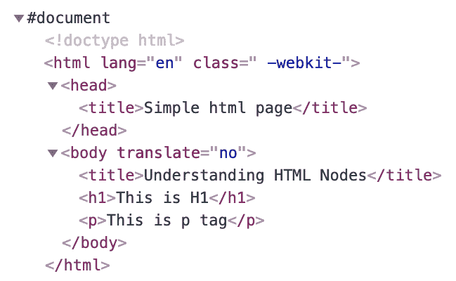
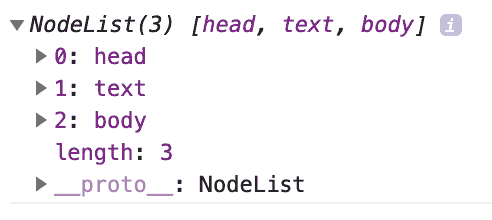
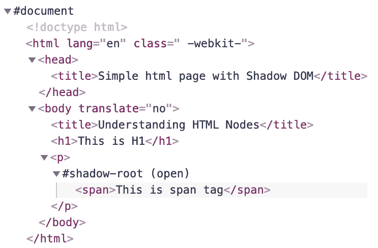
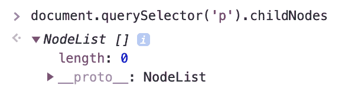
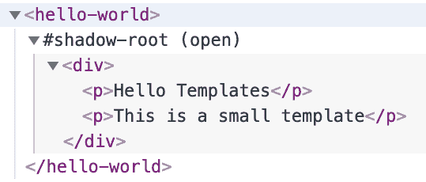

# Web Components 基础与规范

欢迎来到 Web Components 的世界。

如其名所示，Web Components 是可以在网站的不同部分重复使用的组件，同时保持封装性。它们甚至可以发布到网络上，并通过简单的导入在其他网站上使用。本书涵盖了关于 Web Components 所有的知识。包括它们由什么组成，如何使用以及适用场景。本书还涵盖了广泛的中高级概念，例如最佳实践以及将 Web Components 与其他技术集成。

在本章中，我们将讨论 Web Components 是什么，以及如何在浏览各种网站时识别它们。我们还将讨论构成 Web Components 的规范，以及详细的示例。你将能够理解自定义元素是什么，以及如何自己创建一个。你将能够借助阴影 DOM 封装你的 Web Components，并且可以使用模板来实现可重用性。

虽然本章只讨论了 Web Components 的基础知识，但到本章结束时，你将能够从头开始创建自己的 Web Components，并理解与之相关的规范。

在本章中，我们将涵盖以下主题：

+   Web Components

+   Web Component 规范

# 技术要求

为了运行代码，你需要一个简单的服务器，比如 Python 的 `SimpleHTTPServer`。为了在浏览器中查看代码，首先启动服务器。在 Mac 上，使用以下命令：

```js
py -m SimpleHTTPServer 
```

在 Windows 上，请在包含代码的文件夹中使用以下命令：

```js
py -m http.server
```

然后你只需简单地访问 `localhost:8080`。它会在那个文件夹中为你运行 `index.html`。

# Web Components

假设你有一部带触摸屏的手机。这个触摸屏是手机的一个组件，与电路板和电池等各个组件协同工作。我们中很少有人知道手机屏幕是如何单独工作的，但我们都能轻松地操作手机。同样，Web Components 也是网站复杂的构建块，它们使得网站对所有用户都变得可导航。

更重要的是，今天世界上数以百万计的手机屏幕在很大程度上基于只有少数几种设计。从根本上说，移动组件背后的技术是可重用和可适应的，同样的原则也适用于 Web Components。

上述点展示了组件方法在创建更好的产品中的有用性。现在，你可能正在想，为什么我们需要研究网页上的组件概念呢？好吧，我想让你回忆一下你最近访问的最后五个网站。这五个网站可能有一些共同点。其中一些是页眉、页脚、某种菜单以及广告部分。从功能的角度来看，所有这些功能都在做同样的事情。唯一不同的是外观和感觉。

让我们考虑另一个用例，其中网站域名相同，但在该域名上运行着多个 Web 应用。

我们都使用过 Google，或者至少使用过两个或三个 Google 服务。如果我们观察，在任何 Google 服务/网站上，右上角都有一个部分。这是你的账户信息，带有你的个人头像。它显示了你的登录账户列表：


当你从一个服务切换到另一个服务时，你将能够看到一个类似的账户信息卡片。想象一下，能够将这个功能转换成一个 HTML 标签`<account-info>`，并且能够在不同的服务上重复使用它。这可以通过 Web 组件的帮助来实现。

Web 组件是一组规范，允许用户创建具有特定外观和感觉的功能，并且可以以这种方式重复使用，使得所有这些功能都被封装起来。

就像前面的例子`<account-info>`一样，一个 Web 组件允许你将你的功能放入一个自定义的名称中，这个名称可以通过一个 HTML 标签来表示，然后封装其功能。这种封装使得其易于分发，并且可以非常容易地重复使用。

总的来说，一个 Web 组件允许你创建一个可重复使用的自定义 HTML 标签，其功能被封装，从用户那里隔离出来。

既然我们已经知道了什么是 Web 组件以及它们能做什么，让我们来谈谈 Web 组件规范。

# Web 组件规范

就像任何技术一样，Web 组件也有需要遵循的一套规范，以实现与之相关的功能。

Web 组件规范包含以下部分：

+   **自定义元素**：能够创建自定义的 HTML 标签，并确保浏览器理解如何使用这个 HTML 标签

+   **阴影 DOM**：能够封装组件内容，使其从 DOM 的其他部分隔离出来

+   **模板**：能够创建一个可重复使用的 DOM 结构，可以即时修改并输出所需的结果

这三个规范，当一起使用时，提供了一种创建自定义 HTML 标签的方法，该标签可以输出所需的结果（DOM 结构），并且可以将其封装，使其可以重复使用。

既然我们已经了解了这些规范以及它们的作用，让我们逐一深入探讨它们，并尝试查看它们的 JavaScript API。

# 自定义元素

自定义元素规范允许你创建一个自定义 HTML 标签，该标签可以作为其自身的 HTML 标签在页面上使用。为了实现这一点，我们首先需要编写一个与该 HTML 元素相关的功能类，然后我们需要注册它，以便浏览器理解这个 HTML 标签是什么，以及如何在页面上使用它。

如果你是一个对 JavaScript 中的类概念新手，以下是如何创建一个类的方法：

```js
class myClass {
  constructor() {
    // do stuff
  }
}
```

很简单，对吧？让我们使用相同的类结构来创建我们的自定义元素类，比如说`HelloWorld`：

```js
class HelloWorld extends HTMLElement {
  constructor() {
    // very important
    // needed in every constructor
    // which extends another class
    super();

    // do magic here
    this.innerText = 'Hello World';
  }
}
```

在前面的代码中，我们的自定义元素类被命名为`HelloWorld`，它从`HTMLElement`类扩展，这代表了 HTML 元素在页面上的工作方式。因此，`HelloWorld`现在知道点击事件是什么，CSS 是什么，等等，仅仅通过扩展`HTMLElement`。

在这个类中，我们有一个`constructor()`方法，它会在创建这个类的新实例时立即被调用。为了正确实例化扩展类的属性，需要调用`super()`函数。

上述代码只是创建了一个元素类定义。我们仍然需要注册这个元素。我们可以通过编写以下代码来完成：

```js
customElements.define('hello-world', HelloWorld);
```

它所做的就是通过在`customElements`接口中使用`define()`接口定义类`HelloWorld`来注册这个类；`hello-world`是将在页面上可用的自定义元素的名称。

一旦定义了它，你就可以通过简单地写下以下 HTML 标签来使用自定义元素：

```js
<hello-world><hello-world>
```

当这段代码在浏览器上运行时，它将渲染文本，**Hello World**。

最终代码：[`codepen.io/prateekjadhwani/pen/jJZmyy`](https://codepen.io/prateekjadhwani/pen/jJZmyy)。

# 自定义元素的类型

现在你已经了解了如何注册自定义元素，是时候更深入地了解自定义元素的类型了。根据需求类型，我们可以创建两种类型的自定义元素：

+   **自主自定义元素**：任何可以独立使用，而不依赖于其他 HTML 元素的元素都可以被认为是自主自定义元素。从技术角度讲，任何扩展`HTMLElement`的自定义元素都是自主自定义元素。

让我们再举一个自主自定义元素的例子。让我们创建一个`SmileyEmoji`元素，它显示一个笑脸表情符号。它看起来是这样的：

```js
class SmileyEmoji extends HTMLElement {
  constructor() {
    super();
    // let's set the inner text of 
    // this element to a smiley
    this.innerText = ''; 
  }
}

customElements.define('smiley-emoji', SmileyEmoji);
```

这将注册`smiley-emoji`自定义元素，可以使用如下方式：

```js
<smiley-emoji></smiley-emoji>
```

+   **自定义内置元素**：这种类型的自定义元素可以扩展现有 HTML 标签的功能。让我们创建一个扩展`HTMLSpanElement`而不是`HTMLElement`的自定义元素。它的功能是，比如说，需要在自定义元素的末尾添加一个笑脸表情符号：

```js
class AddSmiley extends HTMLSpanElement {
  constructor() {
    super();

    // lets append a smiley
    // to the inner text
    this.innerText += ''; 
  }
}
customElements.define('add-smiley', AddSmiley, { extends: 'span' });
```

现在，如果你有以下的 HTML，这将把笑脸添加到文本`Hello World`的末尾：

```js
<span is="add-smiley">Hello World</span>
```

最终代码：[`codepen.io/prateekjadhwani/pen/RdQarm`](https://codepen.io/prateekjadhwani/pen/RdQarm)。

尝试在浏览器、CodePen 或 JSFiddle 上运行自主自定义元素和自定义内置元素的代码。类和注册代码将在 JavaScript 块中，其余的将在 HTML 块中。

注意 `<smiley-emoji>` 和 `<add-smiley>` 自定义元素注册代码的差异。第二个使用一个额外的参数来指定它扩展的内容。

您可以使用以下代码检查自定义元素是否已经定义：

```js
customElements.get('smiley-emoji');
```

如果它尚未注册，则它将返回 undefined，如果已注册，则返回类定义。这对于大型项目来说是一个非常有用的语句，因为注册已注册的自定义元素将破坏代码。

最终代码：[`codepen.io/prateekjadhwani/pen/moXPBd`](https://codepen.io/prateekjadhwani/pen/moXPBd)。

# 阴影 DOM

这是 Web Components 的第二个规范，它负责封装。CSS 和 DOM 都可以被封装，从而隐藏在页面的其余部分。阴影 DOM 所做的是让您创建一个新的根节点，称为阴影根，它从页面的正常 DOM 中隐藏。

然而，在我们深入阴影 DOM 的概念之前，让我们先看看一个正常的 DOM 是什么样子。任何带有 DOM 的页面都遵循树状结构。这里我有一个非常简单的页面的 DOM 结构：



在前面的图片中，您可以看到`#document`是此页面的根节点。

您可以在浏览器控制台中输入`document.querySelector('html').getRootNode()`来找到页面的根节点。

如果您尝试在浏览器控制台中使用`document.querySelector('html').childNodes`获取 HTML 标签的子节点，那么您可以看到以下截图：



最终代码：[`codepen.io/prateekjadhwani/pen/aMqBLa`](https://codepen.io/prateekjadhwani/pen/aMqBLa)。

这表明 DOM 遵循树状结构。您可以通过点击节点名称旁边的箭头进一步深入这些节点。就像我在截图中所展示的那样，任何人都可以通过展开节点进入特定的节点并更改这些值。为了实现这种封装，发明了阴影 DOM 的概念。

阴影 DOM 所做的是让您创建一个新的根节点，称为阴影根，它从页面的正常 DOM 中隐藏。这个阴影根可以包含任何 HTML 内容，并且可以像任何正常的 HTML DOM 结构一样工作，具有事件和 CSS。但是，这个阴影根只能由连接到 DOM 的阴影宿主访问。

例如，假设在前面示例中的 `<p>` 标签内不是文本，而是一个连接到阴影根的阴影宿主。页面源代码将如下所示：



此外，如果你尝试获取这个 `<p>` 标签的子节点，你会看到如下内容：



注意到在阴影根中有一个 `<span>` 标签。即使这个 `<span>` 标签位于 `<p>` 标签内部，阴影根也不允许 JavaScript API 修改它。这就是阴影 DOM 如何封装其内部的代码。

最终代码：[`codepen.io/prateekjadhwani/pen/LaQxEY`](https://codepen.io/prateekjadhwani/pen/LaQxEY)。

现在我们已经知道了阴影 DOM 是做什么的，让我们来看看代码，学习如何创建我们自己的阴影 DOM。

假设我们有一个具有类名 entry 的 DOM。它看起来是这样的：

```js
<div class="entry"></div>
```

为了在这个 `div` 中创建一个阴影 DOM，我们首先需要获取这个 `.entry` `div` 的引用，然后我们需要将其标记为阴影根，然后将内容附加到这个阴影根上。所以，下面是创建 `shadowRoot` 并向其中添加内容的 JavaScript 代码：

```js
// get the reference to the div
let shadowRootEl = document.querySelector('.entry');

// mark it as a shadow root
let shadowRoot = shadowRootEl.attachShadow({mode: 'open'});

// create a random span tag
// that can be appended to the shadow root
let childEl = document.createElement('span');
childEl.innerText = "Hello shadow DOM";

// append the span tag to shadow root
shadowRoot.appendChild(childEl);
```

最终代码：[`codepen.io/prateekjadhwani/pen/JzpWYE`](https://codepen.io/prateekjadhwani/pen/JzpWYE)。

很简单，对吧？记住，我们仍在讨论阴影 DOM 规范。我们还没有开始在自定义元素中实现它。让我们回顾一下 `hello-world` 自定义元素的定义。它看起来是这样的：

```js
class HelloWorld extends HTMLElement {
  constructor() {
    super();

    // do magic here
    this.innerText = 'Hello World';
  }
}

customElements.define('hello-world', HelloWorld);
```

注意到文本 `Hello World` 目前正被添加到正常 DOM 中。我们可以使用之前在本自定义元素中讨论过的相同的阴影 DOM 概念。

首先，我们需要获取我们想要附加阴影根的节点的引用。在这种情况下，让我们通过以下代码将自定义元素本身作为阴影宿主：

```js
let shadowRoot = this.attachShadow({mode: 'open'});
```

现在，我们既可以添加一个文本节点，也可以创建一个新的元素并将其附加到这个 `shadowRoot` 上：

```js
// add a text node
shadowRoot.append('Hello World');
```

最终代码：[`codepen.io/prateekjadhwani/pen/LaQyPB`](https://codepen.io/prateekjadhwani/pen/LaQyPB)。

# 模板

到目前为止，我们只创建了需要一行或最多两行 HTML 代码的自定义元素和阴影 DOM。如果我们转向现实生活中的例子，HTML 代码可以超过两行。它可以是从几个嵌套的 `div` 到图片和段落——你明白我的意思。模板规范提供了一种在浏览器中保留 HTML 而不实际在页面上渲染它的方法。让我们看看一个小型的模板示例：

```js
<template id="my-template">
 <div class="red-border">
 <p>Hello Templates</p>
 <p>This is a small template</p>
 </div>
</template>
```

你可以在 `<template>` 标签内编写一个模板，并给它一个标识符，就像我通过 `id` 做的那样。你可以把它放在页面的任何地方；这无关紧要。我们可以通过 JavaScript API 获取其内容，然后克隆它并将其放入任何 DOM 中，就像我在下面的示例中展示的那样：

```js
// Get the reference to the template
let templateReference = document.querySelector('#my-template');

// Get the content node
let templateContent = templateReference.content;

// clone the template content
// and append it to the target div
document.querySelector('#target')
    .appendChild(templateContent.cloneNode(true));
```

同样，页面上可以有任意数量的模板，这些模板可以被任何 JavaScript 代码使用。

最终代码：[`codepen.io/prateekjadhwani/pen/ZPxOeq`](https://codepen.io/prateekjadhwani/pen/ZPxOeq)。

现在我们使用带有阴影 DOM 的相同模板。我们将保持模板不变。JavaScript 代码的更改将类似于以下内容：

```js
// Get the reference to the template
let templateReference = document.querySelector('#my-template');

// Get the content node
let templateContent = templateReference.content;

// Get the reference to target DOM
let targetDOM = document.querySelector('#target');

// add a shadow root to the target reference DOM
let targetShadowRoot = targetDOM.attachShadow({mode: 'open'});

// clone the template content
// and append it to the target div
targetShadowRoot.appendChild(templateContent.cloneNode(true));
```

我们正在做与上一个示例中相同的事情，但不是直接将代码附加到目标`div`，而是首先将一个阴影根附加到目标`div`，然后附加克隆的模板内容。

最终代码：[`codepen.io/prateekjadhwani/pen/moxroz`](https://codepen.io/prateekjadhwani/pen/moxroz)。

我们应该能够在使用阴影 DOM 的自定义元素中使用完全相同的概念。让我们试一试。

让我们编辑模板的`id`并将其命名为`hello-world-template`：

```js
<template id="hello-world-template">
  <div>
    <p>Hello Templates</p>
    <p>This is a small template</p>
  </div>
</template>
```

我们将遵循与上一个示例中相同的方法。我们将从模板引用中获取模板内容，克隆它，并将其附加到自定义元素中，使自定义元素的代码看起来如下所示：

```js
class HelloWorld extends HTMLElement {
  constructor() {
    super();

    // Get the reference to the template
    let templateReference = document.querySelector('#hello-world-template');

    // Get the content node
    let templateContent = templateReference.content;

    let shadowRoot = this.attachShadow({mode: 'open'});

    // add a text node
    shadowRoot.append(templateContent.cloneNode(true));
  }
}

customElements.define('hello-world', HelloWorld);
```

现在我们可以简单地使用以下代码在我们的页面中调用 HTML 标签：

```js
<hello-world></hello-world>
```

如果我们在开发者工具中检查 DOM 结构，我们会看到以下内容：



最终代码：[`codepen.io/prateekjadhwani/pen/ywKgBp`](https://codepen.io/prateekjadhwani/pen/ywKgBp)。

# 模块加载器 API

模块加载器 API 不是 Web 组件规范的一部分，但它确实是创建和使用多个类时非常有用的知识。正如其名所示，这个规范允许用户加载模块。也就是说，如果您有一系列类，您可以使用模块加载器将这些类加载到网页中。

如果您的构建过程涉及使用 WebPack 或 Gulp 或任何其他允许您直接或间接导入模块的工具，请随意跳过本节。

让我们从基础知识开始。假设我们的`index.html`如下所示：

```js
<!DOCTYPE html>
<html lang="en" dir="ltr">
  <head>
  </head>
  <body>
    <p>Placeholder for Random Number</p>
  </body>
</html>
```

我们可以看到在这个 HTML 文件中有一个`<p>`标签。现在，假设我们有一个名为`AddNumber`的类，其目的是向这个`<p>`标签添加一个介于 0 和 1 之间的随机数。这将使代码看起来如下所示：

```js
<!DOCTYPE html>
<html lang="en" dir="ltr">
  <head>
  </head>
  <body>
    <p>Placeholder for Random Number</p>

    <script type="text/javascript">
      class AddNumber {
        constructor() {
          document.querySelector('p').innerText = Math.random();
        }
      }

      new AddNumber();
    </script>

  </body>
</html>
```

简单吗？如果您在浏览器中打开页面，您将简单地看到一个随机数，如果您检查页面，您将看到随机数替换了`<p>`标签内的文本。

如果我们选择将其存储在 JavaScript 文件中，我们可以尝试使用以下代码导入它，其中`addNumber.js`是文件的名称：

```js
<script type="text/javascript" src="img/addNumber.js"></script>
```

现在，假设您有一个`randomNumberGenerator`函数而不是`Math.random()`方法。代码将如下所示：

```js
class AddNumber {
  constructor() {
    // let's set the inner text of
    // this element to a smiley
    document.querySelector('p').innerText = randomNumberGenerator();
  }
}
function randomNumberGenerator() {
  return Math.random();
}
new AddNumber();
```

我们还希望用户能够创建一个新的`AddNumber`类对象，而不是我们在文件中创建它。我们不希望用户知道`randomNumberGenerator`是如何工作的，因此我们希望用户只能创建`AddNumber`的对象。这样，我们就了解了模块的工作方式。作为模块的创建者，我们决定用户可以使用哪些功能以及他们不能使用哪些功能。

我们可以使用`export`关键字来帮助用户选择他们可以使用的内容。这样代码看起来会像这样：

```js
//addNumber.js

export default class AddNumber {
  constructor() {
    document.querySelector('p').innerText = randomNumberGenerator();
  }
}

function randomNumberGenerator() {
  return Math.random();
}
```

当这个文件被导入时（注意我们还没有讨论导入），用户只能使用`AddNumber`类。`randomNumberGenerator`函数对用户不可用。

类似地，如果你有另一个包含两个其他函数的文件，比如`add()`和`subtract()`，你可以像下面这样导出它们：

```js
// calc.js

export function add(x, y) {
  return x + y;
}

export function subtract(x, y) {
  return x - y;
}
```

使用导入关键字可以轻松地导入模块。在本节中，我们将讨论`type="module"`属性。

在 HTML 文件`index.html`内部，我们可以使用`type=module`而不是`type=text/javascript`来告诉浏览器我们正在导入的文件是一个模块。当我们尝试导入`addNumber.js`文件时，它将看起来像这样：

```js
<script type="module" >
  import AddNumberWithNewName from './addNumber.js';
  new AddNumberWithNewName();
</script>
```

如果我们从`calc.js`模块导入函数，它看起来会是这样：

```js
<script type="module" >
 import {add, subtract} from './calc.js';
 console.log(add(1,5));
</script>
```

注意我们如何可以更改使用`export default`导出的`AddNumber`模块的名称，以及我们如何必须使用与使用`export`导出的函数相同的名称。

# 命名导出与默认导出

在前面的例子中，即`addNumber.js`和`calc.js`，我们看到了有两种方式可以导出内容：`export`和`export default`。理解它的最简单方式如下：当一个文件使用不同的名称导出多个内容，并且这些名称在导入后不能更改时，它是一个命名导出，而当我们只从一个模块文件中导出一个内容，并且这个名称在导入后可以被更改成任何名称时，它是一个默认导出。

# 使用导入的自定义元素

假设我们需要创建一个 Web 组件，它执行一个非常简单的任务，即在内部显示一个标题和一段段落，并且自定义元素的名称应该是`<revamped-paragraph>`。这个 Web 组件的定义看起来会是这样：

```js
//revampedParagraph.js

export default class RevampedParagraph extends HTMLElement {
  constructor() {
    super();

    // template ref and content
    let templateReference = document.querySelector('#revamped-paragraph-template');
    let template = templateReference.content;

    // adding html from template
    this.append(template.cloneNode(true));
  }
}
```

我们的`index.html`文件，导入此模块的文件，将看起来像这样：

```js
<!DOCTYPE html>
<html lang="en" dir="ltr">
  <head>
    <title>Revamped Paragraph</title>

    <!--
      Notice how we use type="module"
    -->
    <script type="module">

      // imports object from the module 
      // and names it as RevampedParagraph
      // You can name it anything you want
      // since it is a default export
      import RevampedParagraph from './revampedParagraph.js';

      // We are now defining the custom element 
      customElements.define('revamped-paragraph', RevampedParagraph);
    </script>

  </head>
  <body>

    <revamped-paragraph></revamped-paragraph>

    <!--
      Template for
      Revamped Paragraph
    -->
    <template id="revamped-paragraph-template">
      <h1>Revamped Paragraph</h1>
      <p>This is the default paragraph inside
      the revamped-paragraph element</p>
    </template>

  </body>
</html>
```

注意模板是如何成为我们 HTML 的一部分，以及它在模块导入时是如何被使用的。我们将在下一章学习从 Web 组件的实际注册到它们从页面上移除时发生的一切步骤，其中我们将学习生命周期方法。但就目前而言，我们需要查看更多示例来了解如何创建 Web 组件。

让我们看看另一个例子。在这个例子中，我们需要在`index.html`文件中导入多个 Web 组件。组件如下：

+   **学生出勤表组件**：一个显示索引号、学生姓名和复选框中出勤情况的表格。这些数据是从`student.json`文件中获取的。

+   **信息横幅组件**：此组件的目的是显示这些学生所在学校的电话号码和地址。

+   **时间槽组件**：一个允许用户在三个时间组之间选择课程时间槽的组件。

让我们从第一个开始，即`<student-attendance-table>`组件。我们首先需要确定它需要什么。在我看来，这些是它需要的：

+   对`student.json`文件的`fetch`调用。

+   字符串每一行的模板。我将在这里使用模板字符串。

+   当它正在打电话时，显示默认文本“正在加载...”，当获取学生列表失败时，显示文本“无法检索学生列表”。

这就是我们的`student.json`文件看起来像这样：

```js
[
  {
    "name": "Robert De Niro",
    "lastScore": 75
  },
  {
    "name": "Jack Nicholson",
    "lastScore": 87
  },
  {
    "name": "Marlon Brando",
    "lastScore": 81
  },
  {
    "name": "Tom Hanks",
    "lastScore": 62
  },
  {
    "name": "Leonardo DiCaprio",
    "lastScore": 92
  }
]
```

这就是 Web 组件的定义看起来像这样：

```js
// StudentAttendanceTable.js

export default class StudentAttendanceTable extends HTMLElement {
  constructor() {
    super();

    // we simply called another method
    // inside the class
    this.render();
  }

  render() {
    // let put our loading text first
    this.innerText = this.getLoadingText();

    // let's start our fetch call
    this.getStudentList();
  }

  getStudentList() {
    // lets use fetch api
    // https://developer.mozilla.org/en-US/docs/Web
    // /API/Fetch_API/Using_Fetch
    fetch('./student.json')
    .then(response => {

      // converts response to json
      return response.json();

    })
    .then(jsonData => {
      this.generateTable(jsonData);
    })
    .catch(e => {

      // lets set the error message for
      // the user
      this.innerText = this.getErrorText();

      // lets print out the error
      // message for the devs
      console.log(e);
    });

  }

  generateTable(names) {
    // lets loop through names
    // with the help of map
    let rows = names.map((data, index) => {
      return this.getTableRow(index, data.name);
    });

    // creating the table
    let table = document.createElement('table');
    table.innerHTML = rows.join('');

    // setting the table as html for this component
    this.appendHTMLToShadowDOM(table);
  }

  getTableRow(index, name) {
    let tableRow = `<tr>
        <td>${index + 1}</td>
        <td>${name}</td>
        <td>
          <input type="checkbox" name="${index}-attendance"/>
        </td>
      </tr>`;

    return tableRow;
  }

  appendHTMLToShadowDOM(html) {
    // clearing out old html
    this.innerHTML = '';

    let shadowRoot = this.attachShadow({mode: 'open'});

    // add a text node
    shadowRoot.append(html);
  }

  getLoadingText() {
    return `loading..`;
  }

  getErrorText() {
    return `unable to retrieve student list.`;
  }
}

```

注意函数`getLoadingText()`和`getErrorText()`。它们的目的仅仅是返回一个文本。然后`render()`方法首先调用`getLoadingText()`方法，然后使用`getStudentList()`调用进行调用以从`student.json`文件中获取学生列表。

一旦获取到学生列表，它就会被传递到`generateTable()`方法，其中每个`name`和其`index`都会传递到`getTableRow()`方法以生成行，然后返回以成为表格的一部分。一旦表格形成，它就会被传递到`appendHTMLToShadowDOM()`方法，以便添加到组件的 shadow DOM 中。

是时候查看`<information-banner>`组件了。由于这个组件只需要显示他们学习的学校的电话号码和地址，我们可以使用`<template>`并使其工作。这是它的样子：

```js
//InformationBanner.js

export default class InformationBanner extends HTMLElement {
  constructor() {
    super();

    // we simply called another method
    // inside the class
    this.render();
  }

  render() {

    // Get the reference to the template
    let templateReference = document.querySelector('#information-banner-template');

    // Get the content node
    let templateContent = templateReference.content;

    let shadowRoot = this.attachShadow({mode: 'open'});

    // add the template text to the shadow root
    shadowRoot.append(templateContent.cloneNode(true));
  }
}
```

此外，`information-banner-template`看起来像这样：

```js
<template id="information-banner-template">
  <div>
    <a href="tel:1234567890">Call: 1234567890</a>
    <div>
      <p>Just Some Random Street</p>
      <p>Town</p>
      <p>State - 123456</p>
    </div>
  </div>
</template>
```

如您所见，它与我们在前几节中讨论的自定义元素没有太大区别。

让我们继续到最后一个自定义元素，即`<time-slot>`组件。由于它也涉及预设的时间段数量，我们可以使用`<template>`标签来完成我们的工作。

模板看起来可能像这样：

```js
<template id="time-slot-template">
  <div>
    <div>
      <input type="radio" name="timeslot" value="slot1" checked> 9:00 
      AM - 11:00 AM
    </div>
    <div>
      <input type="radio" name="timeslot" value="slot2"> 11:00 AM - 
      1:00 PM
    </div>
    <div>
      <input type="radio" name="timeslot" value="slot3"> 1:00 PM - 3:00    
       PM
    </div>
  </div>
</template>
```

`<time-slot>`组件的定义看起来像这样：

```js
// TimeSlot.js

export default class TimeSlot extends HTMLElement {
  constructor() {
    super();

    // we simply called another method
    // inside the class
    this.render();
  }

  render() {

    // Get the reference to the template
    let templateReference = document.querySelector('#time-slot-
    template');

    // Get the content node
    let templateContent = templateReference.content;

    let shadowRoot = this.attachShadow({mode: 'open'});

    // add the template text to the shadow root
    shadowRoot.append(templateContent.cloneNode(true));
  }
}
```

它与上一个组件相同。

现在我们已经编写了 Web 组件，是时候看看包含所有这些组件的`index.html`文件了。这是它的样子：

```js
<!DOCTYPE html>
<html lang="en" dir="ltr">
  <head>
    <title>Student Page</title>

    <!--
      Notice how we use type="module"
    -->
    <script type="module">

      // importing the first custom element
      import StudentAttendanceTable from './StudentAttendanceTable.js';

      // importing the second custom element
      import InformationBanner from './InformationBanner.js';

      // importing the third custom element
      import TimeSlot from './TimeSlot.js';

      customElements.define('student-attendance-table', 
      StudentAttendanceTable);
      customElements.define('information-banner', InformationBanner);
      customElements.define('time-slot', TimeSlot);
    </script>

  </head>
  <body>

    <time-slot></time-slot>
    <student-attendance-table></student-attendance-table>
    <information-banner></information-banner>

    <template id="information-banner-template">
      <div>
        <a href="tel:1234567890">Call: 1234567890</a>
        <div>
          <p>Just Some Random Street</p>
          <p>Town</p>
          <p>State - 123456</p>
        </div>
      </div>
    </template>

    <template id="time-slot-template">
      <div>
        <div>
          <input type="radio" name="timeslot" value="slot1" checked> 
           9:00 AM - 11:00 AM
        </div>
        <div>
          <input type="radio" name="timeslot" value="slot2"> 11:00 AM - 
          1:00 PM
        </div>
        <div>
          <input type="radio" name="timeslot" value="slot3"> 1:00 PM - 
         3:00 PM
        </div>
      </div>
    </template>

  </body>
</html>
```

如您所见，一个`type="module"`的`<script>`标签可以一起导入这三个组件，并注册自定义元素，这些元素可以在`<body>`标签中使用。

# 摘要

在本章中，我们讨论了 Web 组件以及我们如何在日常的网页访问中识别它们。我们还讨论了与 Web 组件相关的规范，这使得进一步理解变得更加容易。我们探讨了自定义元素以及如何创建我们自己的自定义元素。我们还讨论了阴影 DOM 以及它为我们的 Web 组件提供的一定程度的封装。然后我们讨论了模板以及它们如何在 Web 组件内部提供可重用性。此外，我们还探讨了模块以及它们如何让您动态创建和添加 Web 组件。

我们深入探讨了使用详细代码示例创建 Web 组件。通过这种方式，我们应该能够从头开始创建一个简单的 Web 组件而不会遇到任何问题。

在下一章中，我们将探讨如何利用生命周期方法让我们的 Web 组件做得更多。
