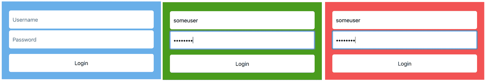
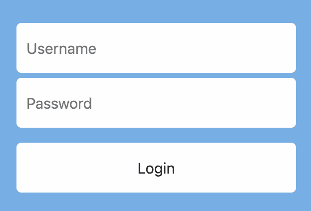

# 通用 Web 组件

在上一章中，我们讨论了 Web 组件的各种生命周期回调方法。在本章中，我们将探讨 Web 组件的样式化，并给出很多示例。样式在 Web 组件的外观和感觉中起着至关重要的作用。我们还将探讨可访问性对 Web 组件的影响，并理解金标准清单的意义以及这个金标准清单如何使 Web 组件极其易用。

在本章中，我们将涵盖以下主题：

+   Web 组件的样式化

+   Web 组件的可访问性

+   金标准清单

# Web 组件的样式化

在前面的章节中，我们探讨了使用 shadow DOM 进行封装的定制元素和不使用 shadow DOM 的定制元素。我们将为这两种类型的 Web 组件添加样式。

假设我们有一个名为 `<company-header>` 的 Web 组件。为了简化，这个头部组件需要在左侧有一个图标，并且这个图标需要有一个圆形的边框；这个图标需要是一个链接；页面的名称应该紧挨着图标，然后应该在最右侧再有两个其他链接，比如主页和关于我们。


这是在 `index.html` 文件中的使用方式：

```js
<company-header 
   icon="icon.png"
    page-name="My Page">
</company-header>
```

如果你有点冒险精神，我希望你暂时停止阅读，并根据你在前几章中获得的知识编写这个组件的完整代码。一旦你完成了，请随意继续阅读。

现在，根据为组件提供的要求信息，我们的 `index.html` 文件可能看起来像这样：

```js
<!DOCTYPE html>
<html lang="en" dir="ltr">
  <head>
    <title>Custom header</title>

    <!--
      Notice how we use type="module"
    -->
    <script type="module">

      import CompanyHeader from './CompanyHeader.js';

      // We are now defining the custom element
      customElements.define('company-header', CompanyHeader);
    </script>

  </head>
  <body>

    <company-header
        icon="icon.png"
        page-name="My Page">
    </company-header>
  </body>
</html>
```

如您所见，我们除了调用 `<company-header>` 组件的方式外，没有做任何不同的事情。让我们看看 `CompanyHeader.js` 文件。请注意，在这个例子中，我们将不使用 shadow DOM 来使用 Web 组件：

```js
// CompanyHeader.js

export default class CompanyHeader extends HTMLElement {
  constructor() {

    // We are not even going to touch this.
    super();

    // Lets provide a default icon
    this.icon = 'newicon.jpeg';

    // Then lets render the template
    this.render();
  }

  render() {
    this.innerHTML = this.getTemplate();
  }

  // Lets get icon and page-name from attributes
  static get observedAttributes() {
    return ['icon', 'page-name'];
  }

  attributeChangedCallback(name, oldValue, newValue) {
    if (name == 'icon') {
      this.icon = newValue;
    }

    if (name == 'page-name') {
      this.pageName = newValue;
    }

    // Lets re-render after getting the new attributes
    this.render();
  }

  getTemplate() {
    return `
      <a href="/">
        
      </a>
      <h1 class="heading">${this.pageName}</h1>
      <div>
        <a class="header-links" href="/home.html">Home</a>
        <a class="header-links" href="/aboutus.html">About Us</a>
      </div>
    `;
  }
}

```

`constructor()` 接口负责确保 `icon` 被设置为默认文件，并且组件能够无任何问题地正确渲染。我们也在上一节中学习了 `attributeChangedCallback()`，所以 `get observedAttributes()` 简单地创建了一个用于监听变化的属性列表。

此外，`attributeChangedCallback()` 确保更改后的属性值被正确使用。`getTemplate()` 方法简单地返回一个 ES6 模板字符串，它可以被设置为 Web 组件的 `innerHTML`。

现在我们的 Web 组件运行良好，让我们为这个组件添加样式。在 `index.html` 文件中，我们可以创建一个 `<style>` 标签并在其中添加我们的样式：

```js
<style>
  company-header {
    display: flex;
    background: #44afdc;
    align-items: center;
    padding: 0 10px;
  }
  .icon {
    width: 50px;
    height: 50px;
    border-radius: 50%;
  }
  .heading {
    flex: 1;
    color: white;
    padding-left: 20px;
  }
  .header-links {
    text-decoration: none;
    padding: 20px;
    color: white;
  }
</style>
```

这样，我们就可以将样式直接附加到 `<company-header>` 元素上。

然而，现在我们可能遇到了一个问题。可能存在一些其他带有`.heading`类名的`div`，并且这个 CSS 可能会扩散到那个其他类。您可能会争辩说我们应该通过在 CSS 前添加`company-header`来对 CSS 进行命名空间，使其看起来像下面这样：

```js
<style>
  company-header {
    display: flex;
    background: #44afdc;
    align-items: center;
    padding: 0 10px;
  }
  company-header .icon {
    width: 50px;
    height: 50px;
    border-radius: 50%;
  }
  company-header .heading {
    flex: 1;
    color: white;
    padding-left: 20px;
  }
  company-header .header-links {
    text-decoration: none;
    padding: 20px;
    color: white;
  }
</style>
```

这可能稍微解决了问题，但并没有完全解决。它仍然没有解决`.heading`类 CSS 扩散到`company-header`中的`.heading`类，然后被`company-header`命名空间标题类覆盖的问题。因此，出现了我们的阴影 DOM 规范。

让我们尝试编写一个带有阴影 DOM 的 Web 组件：

```js
// CompanyHeader.js

export default class CompanyHeader extends HTMLElement {
  constructor() {

    // We are not even going to touch this.
    super();

    // Lets provide a default icon
    this.icon = 'newicon.jpeg';

    // lets create our shadow root
    this.shadowObj = this.attachShadow({mode: 'open'});

    // Then lets render the template
    this.render();
  }

  render() {

    this.shadowObj.innerHTML = this.getTemplate();
  }

  // Lets get icon and page-name from attributes
  static get observedAttributes() {
    return ['icon', 'page-name'];
  }

  attributeChangedCallback(name, oldValue, newValue) {
    if (name == 'icon') {
      this.icon = newValue;
    }

    if (name == 'page-name') {
      this.pageName = newValue;
    }

    // Lets re-render after getting the new attributes
    this.render();
  }

  getTemplate() {
    return `
      <a href="/">
        
      </a>
      <h1 class="heading">${this.pageName}</h1>
      <div>
        <a class="header-links" href="/home.html">Home</a>
        <a class="header-links" href="/aboutus.html">About Us</a>
      </div>
    `;
  }
}
```

如您所见，大部分代码是相同的，除了我们创建一个阴影根并在其中添加我们的 HTML 的部分。

如果你现在运行代码，你会看到我们的样式在 Web 组件内部不适用。所以，CSS 不再扩散。但是，为了恢复我们的 CSS，我们需要将其作为模板的一部分添加，使其看起来像这样：

```js
getTemplate() {
    return `
      <a href="/">
        
      </a>
      <h1 class="heading">${this.pageName}</h1>
      <div>
        <a class="header-links" href="/home.html">Home</a>
        <a class="header-links" href="/aboutus.html">About Us</a>
      </div>
      <style>
        :host {
          display: flex;
          background: #44afdc;
          align-items: center;
          padding: 0 10px;
        }
        .icon {
          width: 50px;
          height: 50px;
          border-radius: 50%;
        }
        .heading {
          flex: 1;
          color: white;
          padding-left: 20px;
        }
        .header-links {
          text-decoration: none;
          padding: 20px;
          color: white;
        }
      </style>
    `;
  }
```

现在，我们的组件有了所有的 CSS 看起来很漂亮，但`:host`是什么？

虽然我们可以通过选择器在阴影根内部添加 CSS，但我们没有与阴影根本身关联的选择器，它充当 HTML 的容器。因此，我们可以通过`:host`选择器将 CSS 附加到这个阴影根。

让我们尝试另一个带有样式的示例。假设我们有一个设计 Web 组件的需求，让您通过登录表单登录。它需要一个蓝色的背景，当登录成功时，它应该变成绿色调。为了简单起见，用户名-密码检查将简单地执行`Math.random()`操作，如果这个值大于*0.5*，则登录成功：



让我们来看看代码。除了包括这个新组件之外，我们的`index.html`没有其他变化：

```js
<script type="module">

  import CompanyLogin from './CompanyLogin.js';

  // We are now defining the custom element
  customElements.define('company-login', CompanyLogin);
</script>
```

这个`CompanyLogin`类的定义在上面的代码中显示。

让我们来看看我们的 HTML 模板。我们想要一个用户名文本字段，一个密码文本字段，以及一个可以点击的按钮：

```js
getTemplate() {
  return `
    <input type="text" name="username" placeholder="Username"/>
    <input type="password" name="password" placeholder="Password"/>
    <button type="submit" class="login-button">Login</button>
  `;
}
```

然后我们需要将这个模板 HTML 添加到我们的阴影根中：

```js
// lets create our shadow root
this.shadowObj = this.attachShadow({mode: 'open'});

this.shadowObj.innerHTML = this.getTemplate();
```

我们还需要一种方法来通知我们的 Web 组件何时按钮被点击：

```js
connectedCallback() {
  this.shadowObj.querySelector('button')
    .addEventListener('click', (e) => this.handleLogin(e));
}
```

我们在这里选择了`connectedCallback()`来处理事件，因为我们只需要在 HTML 在页面上时绑定事件。我们可以在`handleLogin()`方法内部处理我们的点击事件：

```js
handleLogin(e) {
  this.username = this.shadowObj.querySelector('[name=username]').value;
  this.password = this.shadowObj.querySelector('[name=password]').value;

  // Do what ever you want with these values
  console.log(this.username, this.password);

  // We will do things as per our requirement
  let loginSuccess = Math.random();
  if(loginSuccess > 0.5) {
    this.classList.add('login-success');
  } else {
    this.classList.add('login-failure');
  }
}
```

如您所见，我们只是打印了用户名和密码的值。我选择添加一个打印示例，以便您了解这些值非常容易阅读。我们还在根据`Math.random()`函数更改实际 Web 组件的类名。

现在我们有一个工作的组件，我们可以开始工作在 CSS 上了。我们可以在我们的模板中添加我们的 CSS：

```js
<style>
  :host {
    background: #68afe8;
    padding: 20px;
    display: flex;
    flex-direction: column;
    width: 400px;
    margin: 0 auto;
  }
  :host(.login-failure) {
    background: #f35353;
  }
  :host(.login-success) {
    background: #499c19;
  }
  input {
    margin-top: 5px;
    padding: 10px;
    height: 30px;
    font-size: 15px;
    border: none;
    border-radius: 5px;
  }
  button {
    margin-top: 15px;
    padding: 10px;
    font-size: 15px;
    border: none;
    height: 50px;
    border-radius: 5px;
    cursor: pointer;
  }
</style>
```

我们再次使用 `:host` 选择器作为向我们的 Web 组件的 shadow root 添加 CSS 的方式。在 `handleLogin()` 函数中，我们向我们的 Web 组件添加 CSS 类。我们可以通过使用 `:host(<selector>)` 来定位这些类，就像我们在前面的代码中所做的那样。

当我们在浏览器上运行我们的 Web 组件时，它看起来是这样的：



根据 `random()` 函数，我们可以得到一个带有绿色背景的背景，表示登录成功，或者带有红色背景的背景。

# Web 组件的可访问性

可访问性在 Web 开发中起着至关重要的作用。我们的用户可能只能使用键盘，他们可能在使用屏幕阅读器，或者可能是色盲。确保我们的用户在所有情况下都感到舒适是制作一个良好网站的关键。同样，创建一个良好的 Web 组件也包括使其可访问。

当你创建一个 Web 组件时，你需要确保你的 Web 组件至少在某种程度上是可访问的。例如，图片应该始终有 `alt` 文本。链接应该始终有 `alt` 文本。输入字段应该有适当的 aria-labels。应该有足够的颜色对比度。Tab 顺序应该是正确的，等等。

既然我们知道如何使组件可访问，让我们看看一个小例子。假设要求是创建一个 `<header-image>` 组件，它显示一个全宽图片。为了确保这个组件是可访问的，使用的图片应该有 `alt` 文本。

让我们看看这个组件的 `getTemplate()` 函数：

```js
getTemplate() {
  return `
    
    ${this.handleErrors()}
    <style>
      img {
        width: 400px;;
      }
    </style>
  `;
}
```

在这里，我们向图片标签添加一个 `alt` 属性，并且我们从 Web 组件本身获取这个 `alt` 文本：

```js
<header-image alt="Blue Clouds"
      src="img/clouds-sky-header.jpg">
</header-image>  
```

我们还有一个名为 `handleErrors()` 的错误处理函数，它确保告诉用户组件缺少 `alt` 文本：

```js
handleErrors() {
  if(!this.getAttribute('alt')) {
    return `
      <div class="error">Missing Alt Text</div>
      <style>
        .error {
          color: red;
        }
      </style>
    `;
  }

  return ``;
}
```

当组件缺少 alt 文本时，这将在红色中显示“缺少 Alt 文本”错误消息。我们可以以同样的方式解决其他可访问性问题。

# 金标准清单

在前面的章节中，我们已经创建了 Web 组件，但除了可访问性之外，没有其他章节告诉我们什么定义了一个好的组件。所以，让我们来谈谈它。金标准清单是一个工作草案（见 [`github.com/webcomponents/gold-standard/wiki`](https://github.com/webcomponents/gold-standard/wiki)），它告诉 Web 组件的创建者为了创建一个良好且可重用的组件应该注意哪些事情。

让我们谈谈我个人认为重要的几点：

+   Web 组件应该是可访问的。为了确保 Web 组件在所有屏幕上都能工作，我们需要确保组件覆盖所有可访问性方面。

+   事件绑定应该在`connectedCallback()`中进行。这确保了绑定事件的 DOM 始终存在，从而减少了错误数量。

+   事件绑定应该在`disconnectedCallback()`中移除，从而释放不再需要的内存。

+   组件应该具有默认样式，并且具有良好的对比颜色。这将确保组件在所有时候都能被正确地看到。

+   组件还应遵循响应式设计。为了确保我们的组件能够在所有屏幕尺寸上工作而不会出现布局问题，我们应该确保我们为 Web 组件关联了响应式 CSS。

+   组件应该能够暴露事件。我们将在第五章中讨论事件，*管理状态和属性*，但这个要点的主要收获是，如果你正在构建一个需要通知其他组件状态变化的组件，它应该通过暴露事件回调来通知它们。

尽管黄金标准清单包含了许多非常好的观点，但我认为这六个观点足以使组件在可重用性方面相当不错。如果你对其他观点感兴趣，这里是可以查看完整黄金标准清单的链接：[`github.com/webcomponents/gold-standard/wiki`](https://github.com/webcomponents/gold-standard/wiki)。

# 摘要

在本章中，我们探讨了不同的样式化 Web 组件的方法，了解了可访问性以及如何在创建更完整的 Web 组件中使用它，然后探讨了黄金标准清单，它为创建良好的 Web 组件提供了指南。

在下一章中，我们将探讨可重用性以及如何在 Web 组件中使用它，以及这些 Web 组件如何发布到网络上以实现最大程度的可重用性。
