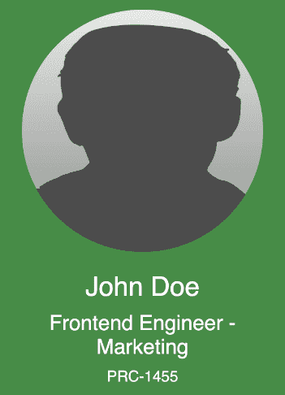
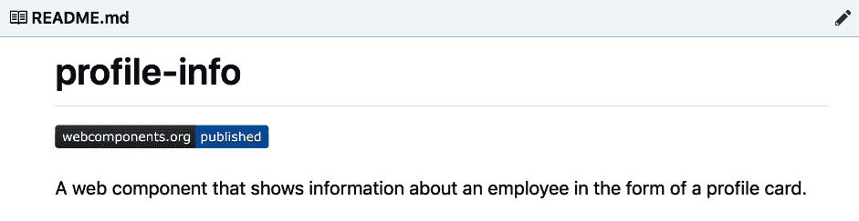
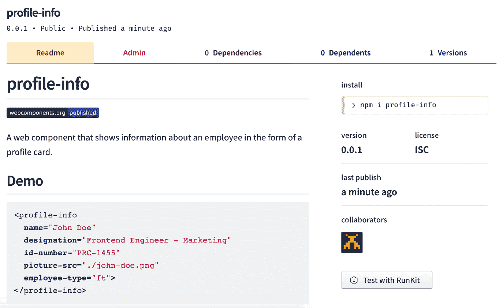
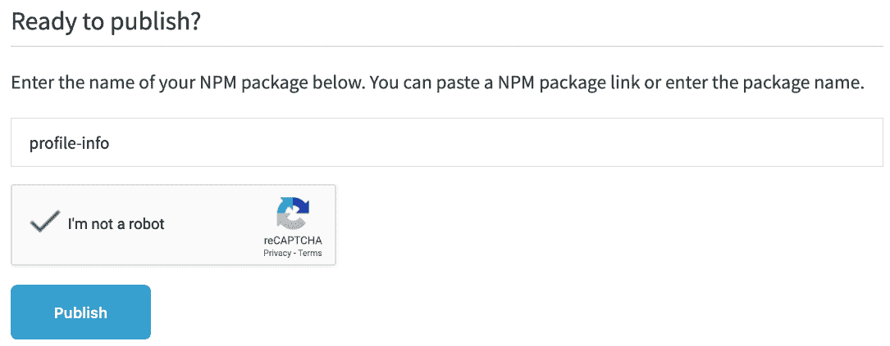
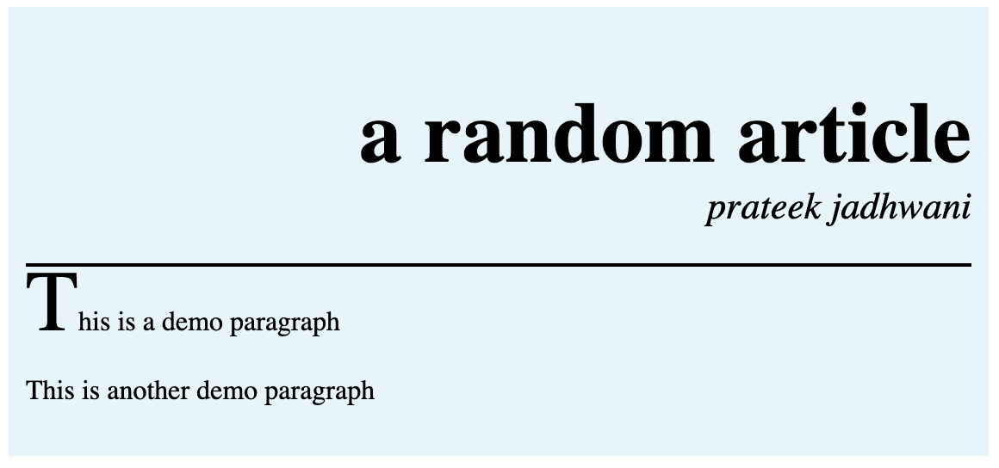

# 构建可重用 Web 组件

在上一章中，我们讨论了为我们的 Web 组件添加样式，以及了解可访问性在创建良好组件中的重要作用。然后我们讨论了黄金标准清单并探讨了单元测试。

在本章中，我们将深入探讨可重用性以及我们如何将我们的 Web 组件发布到平台上以实现最大限度的可重用性。我们还将涵盖一些关于响应式 Web 组件的例子。我们已经探讨了样式，虽然响应式 CSS 的概念并不新颖，但响应式样式的使用可以使组件看起来更好，更具可重用性。

在本章中，我们将涵盖以下主题：

+   可重用性的概念

+   响应式 Web 组件

+   发布 Web 组件

+   扩展 Web 组件 - 插槽

# 可重用性的概念

在我们深入探讨 Web 组件的可重用性概念之前，让我们通过一个例子来看看什么是可重用性。让我们以一个操作系统为例，比如 Windows 10。我们都知道有很多电脑。有些硬件相同，有些不同。但使这款软件（Windows 10）可重用的原因是它能够在不同场景下反复使用而不会出现任何问题。同样的事情也可以使 Web 组件工作。

是的，Web 组件可以被制作得极具可重用性。假设我们有一个 Web 组件`<custom-header>`。正如其名称所示，它是一个标题。并且我们访问过的几乎所有网站都有一个或另一个相同功能的标题版本。其功能如下：

1.  显示标志。

1.  点击标志应将用户带到`index.html`。

1.  显示公司名称。

1.  显示用户统计数据，即如果用户未登录，显示登录下拉菜单。如果用户已登录，显示与账户相关的链接。

1.  显示帮助链接。

1.  显示“关于我们”和“联系我们”链接。

1.  为标题提供默认背景。

1.  标题可以固定在顶部。

这些点都向我们展示了如何自定义和实现标题的各种方式。我们可以在设计 Web 组件时将这些点很好地转换为属性列表：

```js
<custom-header
  logo-url="icon.png"
  logo-alt-text="Company X logo"
  company-name-text="Company X"
  is-logged-in="user23411"
  help-link="/help.html"
  help-link-text="Help and Support"
  contact-us-link="/contact.html"
  contact-us-alt-text="Contact Us"
  background-color="#000000"
  text-color="#ffffff"
  is-sticky="true">
</custom-header>
```

或者，如果用户未登录，它可以是空的，如下所示：

```js
<custom-header
  logo-url="icon.png"
  logo-alt-text="Company X logo"
  company-name-text="Company X"
  is-logged-in=""
  help-link="/help.html"
  help-link-text="Help and Support"
  contact-us-link="/contact.html"
  contact-us-alt-text="Contact Us"
  background-color="#000000"
  text-color="#ffffff"
  is-sticky="true">
</custom-header>
```

所有这些属性使 Web 组件极具可重用性。使用此组件的人只需导入它并提供这些属性的值，而无需编写任何额外的代码。

让我们来看看另一个，但更复杂的例子。假设你正在构建一个音乐播放器。一个 Web 组件`<music-player>`可能有一系列属性使其极具可重用性。常见的属性如下：

+   歌曲名称

+   歌曲的 URL

+   播放器颜色/对比度选项

+   是否正在播放，以判断播放器是否正在播放

+   加载时播放，以判断播放器是否应在加载时开始播放

+   显示或隐藏播放列表

不常见的例子可能如下：

+   播放器大小可以设置为大型、中型或小型

+   底部粘性或顶部粘性，就像 `Soundcloud` 一样

+   喜欢或不喜欢歌曲

了解这些属性并能够实现它们在创建可重用组件中起着非常重要的作用。一个寻找具有显示喜欢或不喜欢歌曲功能的音乐播放器的用户最终会使用上面提到的 `<music-player>` 组件而不是其他东西。

可重用性的概念可以也应该应用到所有 Web 组件中。这不仅允许 Web 组件在更多场景中使用，还使得它更容易维护，因为我们确保它在更多场景中都能正常工作。

# 响应式 Web 组件

在上一章中，我们讨论了为我们的 Web 组件添加样式以使其看起来更美观。这次，我们将从可重用性的角度来探讨。如果试图重用我们的 Web 组件的人决定将其用于内联标签，或者如果 Web 组件被用作全宽组件，会发生什么？让我们看看我们的 Web 组件在不同盒模型中的显示方式以及它在不同屏幕尺寸下的外观。

# 构建 `<profile-info>` Web 组件

让我们看看一个示例 Web 组件。假设我们有一个名为 `<profile-info>` 的 Web 组件。这个 Web 组件的目的是显示员工的信息。这些信息可能包括姓名、职位、ID 号码、个人照片以及表示员工是全职员工、兼职员工还是承包商的卡片背景颜色。

这个 `<profile-info>` 组件的 HTML 结构看起来可能像这样：

```js
<profile-info
  name="John Doe"
  designation="Frontend Engineer - Marketing"
  id-number="PRC-1455"
  picture-src="img/john-doe.png"
  employee-type="ft">
</profile-info>
```

从属性列表中，我们可以看到它需要一个名称、职位、ID 号码、图片链接和员工类型。这就是它在功能方面需要做的事情。在外观和感觉方面，它需要看起来像一张带有圆形个人照片的卡片，以及所有其他剩余信息。并且根据屏幕分辨率，它应该是全宽的，或者如果屏幕是移动设备，它应该以卡片的形式显示。

让我们在 Web 组件上采用移动优先的方法，并开始编写代码：

```js
export default class ProfileInfo extends HTMLElement {
  constructor() {

    // We are not even going to touch this.
    super();

    // lets create our shadow root
    this.shadowObj = this.attachShadow({mode: 'open'});

    // Then lets render the template
    this.render();
  }

  render() {
    this.shadowObj.innerHTML = this.getTemplate();
  }

  getTemplate() {
    // Show HTML Here
  }
}
```

这是我们在前几章中介绍的最基本的部分。我们只是在创建组件骨架并确保从 `getTemplate()` 方法检索到 shadow DOM 的 HTML。

对于移动视图，卡片应该看起来像这样：



HTML 结构看起来可能像这样：

```js
getTemplate() {
  return `
    <div class="profile-info__container">
      
      <div class="profile-info__text">
        <div class="profile-info__name">
          ${this.getAttribute('name')}
        </div>
        <div class="profile-info__designation">
          ${this.getAttribute('designation')}
        </div>
        <div class="profile-info__id-number">
          ${this.getAttribute('id-number')}
        </div>
      </div>
    </div>
  `;
}
```

如果你看看类名，它们都在使用 BEM 模式。

如果你不知道 BEM 是什么，BEM 的全称是 Block Element Modifier。它是一种使用逻辑和可重用 CSS 类的方法，用于模块化 HTML 块。如果你想了解更多，请随时查看以下链接：[`getbem.com/`](http://getbem.com/)。

现在，让我们看看构建这个卡片所需的 CSS。我将 CSS 包装在另一个名为 `getStyles()` 的方法中，然后将其包含在 `getTemplate()` 方法中：

```js
getStyles() {
  return `
    <style>
      :host {
        display: block;
        font-family: sans-serif;
      }
      :host(.profile-info__emp-type-ft) {
        background-color: #7bb57b;
      }
      :host(.profile-info__emp-type-pt) {
        background-color: #ffc107;
      }
      :host(.profile-info__emp-type-ct) {
        background-color: #03a9f4;
      }

      .profile-info__container {
        display: flex;
        color: white;
        flex-direction: column;
        text-align: center;
      }
      .profile-info__picture {
        border-radius: 50%;
        width: 80vw;
        height: 80vw;
        margin: 10px auto;
      }
      .profile-info__text {
        padding: 10px;
        flex: 1;
      }
      .profile-info__name {
        font-size: 28px;
      }
      .profile-info__designation {
        font-size: 22px;
        margin-top: 10px;
      }
      .profile-info__id-number {
        margin-top: 10px;
      }
    </style>
  `;
}
```

让我们在 `getTemplate()` 方法中添加 `getStyle()` 方法：

```js
getTemplate() {
  return `
    ...
    ...
    ...
    ${this.getStyles()}
  `;
}
```

如果您查看 `getStyles()` 方法，我们有这些类：

+   `:host(.profile-info__emp-type-ft)`,

+   `:host(.profile-info__emp-type-pt)`, 和

+   `:host(.profile-info__emp-type-ct)`.

这些根据员工类型（即全职、兼职或承包商）分别更改卡片的颜色。

但我们仍然没有办法添加这些类，因此我们创建了一个新的函数 `updateCardBackground()`，它将负责将相关类添加到 Web 组件中。然后我们将在 `render()` 方法中调用这个类：

```js
updateCardBackground() {
  this.classList.add(`profile-info__emp-type-${this.getAttribute('employee-type')}`);
}

render() {
  this.shadowObj.innerHTML = this.getTemplate();

  this.updateCardBackground();
}
```

它只是在获取员工类型并将其添加到宿主类的名称中。

因此，如果员工是全职，则类变为 `.profile-info__emp-type-ft`；如果员工是兼职，则类变为 `.profile-info__emp-type-pt`；如果员工是承包商，则类变为 `.profile-info__emp-type-ct`。注意它如何从属性中获取员工类型并将其附加到字符串 `.profile-info__emp-type-` 的末尾。

现在我们已经完成了组件的创建和样式设置，让我们添加用于更大屏幕的 CSS，比如平板电脑和桌面。为了简单起见，我们将为桌面和平板电脑使用相同的 CSS。所以，让我们将以下 CSS 添加到我们的 `getStyles()` 方法中：

```js
@media screen and (min-width: 650px) {
  .profile-info__container {
    flex-direction: row;
    text-align: left;
  }
  .profile-info__picture {
    width: 100px;
    height: 100px;
    margin: 10px;
  }
}
```

这确保了 Web 组件看起来像是从联系人簿中来的，就像我们在桌面上看到的那样。并且它只会在屏幕尺寸超过 `650px` 时显示：


如果您正在与这个教程一起构建 Web 组件，请尝试更改屏幕宽度。

您可以使用类似的方法处理任何 Web 组件，并确保它在从一种屏幕尺寸移动到另一种屏幕尺寸时看起来很好。

# 发布 Web 组件

无论您是在为公司、副项目还是开源项目开发 Web 组件，您都可以通过在网络上发布您的 Web 组件，非常容易地使其可供其他人或团队成员使用。

但在您发布之前，您需要确保以下步骤已完成：

+   您的组件可以通过 `npm` 进行安装

+   在您的组件存储库中有一个适当的 README 文件，其中包含使用步骤和可以更改的属性

+   一个包含 `index.html` 文件的示例工作文件夹

让我们为 `npm` 准备我们的文件。为此，让我们在 `repo` 目录中使用终端快速执行 `npm init`。我将使用我们在上一节中讨论的 `<profile-info>` 组件。这将生成一个类似这样的 `package.json` 文件：

```js
{
  "name": "profile-info",
  "version": "0.0.1",
  "description": "A webcomponent that shows information about an employee in the form of a profile card.",
  "main": "ProfileInfo.js",
  "scripts": {
    "test": "echo \"Error: no test specified\" && exit 1"
  },
  "keywords": [
    "webcomponent",
    "component",
    "profile",
    "info",
    "employee"
  ],
  "author": "Prateek Jadhwani",
  "license": "ISC",
  "repository": "https://github.com/prateekjadhwani/profile-info"
}
```

然后，我们在组件目录中创建一个 `ReadMe.md` 文件。并在顶部添加以下文本：

```js
[](https://www.webcomponents.org/element/owner/my-element)
```

我添加了以下内容：

```js
[](https://www.webcomponents.org/element/prateekjadhwani/profile-info)
```

这将在 webcomponents.org 网站上创建一个发布徽章，供访问你的 GitHub 或 GitLab 页面的人查看。它看起来像这样：



完成此操作后，我们可以设置我们的 `Readme.md` 文件以创建一个演示部分。

你可以在 `Readme.md` 文件中添加有关属性的信息，以及如何使用它，如下所示：

```js
```html

<profile-info

name="John Doe"

designation="Frontend Engineer - Marketing"

id-number="PRC-1455"

picture-src="img/john-doe.png"

employee-type="ft">

</profile-info>

```js
```

现在你已经准备好在 NPM JS 网站上发布你的 Web 组件了。只需输入 `npm publish`，它就会将你的代码推送到网站。

你可以在[`www.npmjs.com/package/profile-info:`](https://www.npmjs.com/package/profile-info)找到这个 `<profile-info>` Web 组件。



完成这些后，你可以简单地访问[`www.webcomponents.org/publish`](https://www.webcomponents.org/publish)，滚动到“Ready To Publish?”部分，然后输入你的 npm 包名并点击发布按钮：



这将发布你的 Web 组件，任何人都可以使用。现在你的组件可以在整个网络中分发。

# 扩展 Web 组件 – 插槽

到目前为止，我们使用的是没有 HTML 内容的 Web 组件。也就是说，当我们导入我们创建的 Web 组件的 HTML 标签时，我们从未在它里面放置任何其他 HTML 标签，例如：

```js
<custom header>
    <!-- no html here -->
</custom-header>
```

这对我们正在创建的 Web 组件造成了巨大的限制。在 `<custom header>` 组件中，我们未能添加动态链接。你可以争论说，我们可以将链接数据以属性的形式放置，然后我们可以在组件定义内部运行循环来构建链接。但如果我们想用按钮而不是链接呢？如果我们想显示用户积分而不是按钮呢？所以，不能做这些事情是一个限制。

在本节中，我们将扩展我们对 Web 组件的知识，并使用插槽的概念将 HTML 内容放入我们的 Web 组件中。插槽是任何可以放置在 Web 组件内部的 HTML 标记的占位符。插槽可以有一个名称，并且这个插槽可以包含 HTML 或纯文本，这些可以在我们的组件中使用。

我们将从我们已经工作的 Web 组件 `<company-header>` 开始。该组件的 `getTemplate()` 方法如下：

```js
getTemplate() {
  return `
    <a href="/">
      
    </a>
    <h1 class="heading">${this.getAttribute('page-name')}</h1>
    <div>
      <a class="header-links" href="/home.html">Home</a>
      <a class="header-links" href="/aboutus.html">About Us</a>
    </div>
  `;
}
```

在前面的代码中，我们可以看到有两个链接，`Home`和`About Us`。如果我们想添加另一个链接，我们需要修改 Web 组件的定义，这反过来又会给维护带来问题，并且每次我们想要添加新链接时，我们都必须创建一个新的版本。

为了解决这个问题，我们将使用槽位。我们将用名为 `other-links` 的槽位替换包含链接的整个 `div`。让我们看看代码：

```js
getTemplate() {
  return `
    <a href="/">
      
    </a>
    <h1 class="heading">${this.getAttribute('page-name')}</h1>
    <div>
      <slot name="other-links"></slot>
    </div>
  `;
}
```

这样，我们就可以创建一个槽位，当我们使用 Web 组件时可以填充它：

```js
<company-header icon="icon.png" page-name="My Page">
    <ul slot="other-links" class="header-links__container">
      <li>
        <a class="header-links" href="/home.html">Home</a>
      </li>
      <li>
        <a class="header-links" href="/aboutus.html">About Us</a>
      </li>
    </ul>
</company-header>
```

在这里，我们用具有 `slot` 属性且值为 `other-links` 的 `<ul>` 标签填充槽位。你可以在该槽位内放置任何 HTML。你甚至可以用纯文本替换它。

在 Web 组件中可以有任意数量的槽位。这完全取决于你的用例。但，让我们看看另一个例子，其中我们使用了三个槽位。

# 创建 <my-article> Web 组件

让我们创建一个名为 `<my-article>` 的 Web 组件，它有三个槽位：`author`、`article-heading` 和 `article`。Web 组件的定义如下，从模板开始：

```js
getTemplate() {
  return `
    <h1 class="article-heading">
      <slot name="article-heading"></slot>
    </h1>
    <div class="article-author">
      <slot name="author"></slot>
    </div>
    <div class="article-content">
      <slot name="article"></slot>
    </div>
    ${this.getStyle()}
  `;
}
```

如你所见，有三个槽位。一个用于标题，一个用于作者姓名，一个用于内容。`getStyle()` 方法看起来像这样：

```js
getStyle() {
  return `
    <style>
      :host {
        display: block;
        background: #e4f4fb;
        padding: 10px;
      }
      .article-heading {
        text-align: right;
        text-transform: lowercase;
        font-size: 50px;
        margin-bottom: 0;
      }
      .article-author {
        text-align: right;
        text-transform: lowercase;
        font-style: italic;
        font-size: 22px;
        padding-bottom: 20px;
        border-bottom: 2px solid black;
      }
      .article-content {
        line-height: 1.5;
        margin-top: 20px;
      }
      .article-content::first-letter {
        font-size: 50px;
        line-height: 0;
      }
    </style>
  `;
}
```

当我们尝试使用它时，它看起来像这样：

```js
<my-article>
  <span slot="article-heading">A random article</span>
  <span slot="author">Prateek Jadhwani</span>
  <div slot="article">
    <p>This is a demo paragraph</p>
    <p>This is another demo paragraph</p>
  </div>
</my-article>
```

我们当然可以在调用 `<my-article>` 标签时改变槽位的顺序，它仍然会按照定义工作。输出将看起来像这样：



如你所见，我们不必担心内容的样式，只要 Web 组件内部的类负责样式即可。这也表明，使用多少个槽位取决于用户。

# 摘要

在本章中，我们讨论了可重用性以及如何确保我们的 Web 组件尽可能可重用。我们还探讨了如何将响应性融入 Web 组件以实现最大重用。

我们学习了如何在互联网上发布我们的 Web 组件，以及使用槽位让动态内容进入 Web 组件的新方法。

在下一章中，我们将探讨状态管理、属性以及事件处理在 Web 组件中的工作方式。
