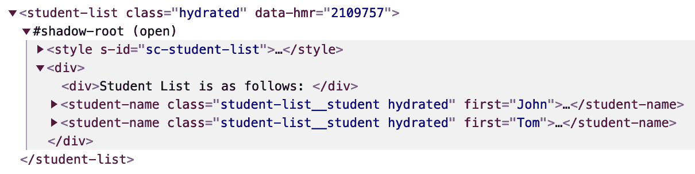

# 使用 Polymer 和 Stencil 实现 Web Components

到目前为止，我们使用纯 JavaScript 和没有依赖项构建了组件。但有时，公司会做出决定使用可以帮助简化工作流程的库。在本章中，我们将探讨两个不同的库：Polymer 和 Stencil。在幕后，这两个库都使用了 Web Components，但它们都带有自己的特性。让我们深入了解这些库。

在本章中，我们将涵盖以下主题：

+   Polymer

+   Stencil

# Polymer

Polymer 是一个库，它允许你以非常简单的方式创建自定义元素。它自带了一组功能，可以用来创建 shadow DOM，添加事件，以及使用属性和属性，就像我们在前面的章节中学到的那样。

你可以在以下 URL 找到 Polymer 项目：[`Polymer-library.Polymer-project.org/`](https://polymer-library.polymer-project.org/)。

纯 Web Components 和 Polymer 之间一个主要的不同之处在于，Polymer 自带了自己的数据系统。这意味着你可以根据这些数据进行各种计算和操作，以影响组件。你可以观察属性和属性的变化，甚至可以进行双向数据绑定，这是纯 Web Components 所缺少的。这些特性的存在有助于许多用例，并有助于使开发者的生活更加轻松。

我们现在将详细探讨如何使用 Polymer。

# Polymer 中的 Hello World

与纯 Web Components 不同，Polymer 是一个需要安装的库。但在我们安装库之前，我们将需要 Polymer 的**命令行界面**（**CLI**），它自带服务器和测试框架。我们可以使用以下命令来安装它：

```js
npm install -g Polymer-cli
```

一旦安装，你可以使用以下命令来检查是否已安装：

```js
Polymer --version
```

现在 Polymer 已安装，让我们尝试使用这个库创建一个`<hello-world>`组件。让我们创建一个名为`HelloWorld`的文件夹，然后创建一个名为`index.html`的文件。该文件的内容可以非常基础，如下所示：

```js
<!DOCTYPE html>
<html lang="en" dir="ltr">
 <head>
    <meta charset="utf-8">
    <title>Hello World</title>
  </head>
  <body>
    <p>You stuff goes here.</p>
  </body>
</html>
```

为了运行此文件，我们不会使用`SimpleHTTPServer`，而是使用由`Polymer-cli`本身提供的服务器。我们可以使用以下命令来运行服务器：

```js
Polymer serve
```

一旦运行此命令，你应该在终端中看到以下控制台输出：

```js
info: Files in this directory are available under the following URLs
 applications: http://127.0.0.1:8081
 reusable components: http://127.0.0.1:8081/components/Polymer/
```

这表明服务器正在运行，你可以看到`index.html`文件正在`http://127.0.0.1:8081/`上运行。

现在我们服务器正在运行，Polymer 也已安装，让我们开始编写我们的`<hello-world>` Polymer 组件。

由于我们将使用`Polymer`库，让我们为这个项目安装这个库：

```js
npm i @Polymer/Polymer
```

此外，让我们创建一个名为`hello-world.js`的文件。该文件的如下内容：

```js
import { PolymerElement, html } from '@Polymer/Polymer/Polymer-element.js';

class HelloWorld extends PolymerElement {
    ...
    ...
    ...
}

customElements.define('hello-world', HelloWorld);
```

在这里，我们只是简单地导入我们刚刚使用`npm`命令安装的`Polymer`库。此外，我们不是使用`HTMLElement`，而是使用`PolymerElement`。然后，我们将这个类注册为一个自定义元素。

类的定义将比原生的 Web Components 稍微复杂一些：

```js
class HelloWorld extends PolymerElement {
  constructor() {
    super();
  }

  static get template() {
    return html`
      <p>Hello World</p>
    `;
  }
}
```

这里，我们有`constructor()`方法，就像原生的 Web Components 一样，但`super()`方法调用中没有`props`。此外，我们没有手动调用`render()`方法。相反，代码是从`template()`属性自动渲染的。

我们还需要记住，与原生的 Web Components 不同，我们不是手动为 Polymer 元素创建 shadow DOM。在这里，我们使用`Polymer`库中的`html`对象将`html`贴到元素的 shadow DOM 上。

现在组件已经创建，我们可以在`index.html`文件中以以下方式使用它：

```js
<!DOCTYPE html>
<html lang="en" dir="ltr">
  <head>
    <meta charset="utf-8">
    <title>Hello World</title>
    <script type="module" src="img/hello-world.js"></script>
  </head>
  <body>
    <hello-world></hello-world>
  </body>
</html>
```

这里，我们只是导入`hello-world.js`文件，然后直接使用`<hello-world>`元素。

如你所见，`Polymer`库在节省代码行数方面非常有帮助。而且，通过这个例子，你现在知道如何创建一个 Polymer 元素。你还可以尝试创建我们在前几章中学到的其他元素。

# Polymer 中的嵌套元素

在前几章中，我们探讨了如何在其他 Web Components 内部使用不同的 Web Components 来创建复杂和嵌套的组件。这种方法不仅限于原生的 Web Components。我们也可以在 Polymer 组件内部使用它。

假设我们还有一个类似这样的`PolymerElement`：

```js
// second-element.js

import { PolymerElement, html } from '@Polymer/Polymer/Polymer-element.js';

class SecondElement extends PolymerElement {
  constructor() {
    super();
  }
  static get template() {
    return html`
      <style>
        p {
          color: red;
        }
      </style>
      <p>This is the second element</p>
    `;
  }
}

customElements.define('second-element', SecondElement);
```

如你所见，它不是一个复杂的元素。实际上，它看起来非常像`<hello-world>`元素。现在，假设我们想在`<hello-world>`元素中包含这个`<second-element>`。我们可以通过以下方式更改`<hello-world>`代码来实现：

```js
import { PolymerElement, html } from '@Polymer/Polymer/Polymer-element.js';
import './second-element.js';

class HelloWorld extends PolymerElement {
  constructor() {
    super();
  }
  static get template() {
    return html`
      <p>Hello World</p>
      <second-element></second-element>
    `;
  }
}

customElements.define('hello-world', HelloWorld);
```

这里，你可以看到我们正在从`./second-element.js`文件导入代码。我们只是通过`<second-element>`HTML 代码简单地使用它。就这么简单。

此外，如果你注意到`<second-element>`类的定义，你会发现我们也使用了一个样式标签。我们可以利用我们在前几章中学到的所有样式。

# Polymer 中的属性和属性

在前几章中，我们看到了属性和属性如何帮助我们使 Web Components 变得更好。它们有助于传递数据，以及跟踪元素的状态。同样，我们也可以为使用 Polymer 构建的元素做同样的事情。

让我们看看属性在 Polymer 中是如何工作的。假设我们有一个显示文本“Hello, Prateek”的元素，其中字符串`Prateek`是一个变量。代码看起来可能像这样：

```js
import { PolymerElement, html } from '@Polymer/Polymer/Polymer-element.js';

class HelloString extends PolymerElement {
  constructor() {
    super();
  }

  static get properties() {
    return {
      name: {
        type: String,
        value: 'No Name Provided Yet'
      }
    };
  }

  static get template() {
    return html`
      <p>Hello, [[name]]</p>
    `;
  }
}

customElements.define('hello-string', HelloString);
```

在这里，我们添加的唯一额外内容是`properties`获取函数。属性的名称是`name`，默认值是`'No Name Provided Yet'`。当您使用元素时，您可以简单地调用元素，如下所示：

```js
<hello-string></hello-string>
```

这将显示文本“Hello, No Name Provided Yet”。或者，您可以通过添加一个属性来提供名称，如下所示：

```js
<hello-string name="Prateek"></hello-string>
```

这将显示文本“Hello, Prateek”。您还可以添加多个属性。例如，您可以添加`lastname`或`age`作为属性。

但如果您有嵌套组件，并且这个文本是从父组件传来的变量呢？让我们看看这段代码会是什么样子：

```js
import { PolymerElement, html } from '@Polymer/Polymer/Polymer-element.js';
import './hello-string.js';

class StudentName extends PolymerElement {
  constructor() {
    super();
  }

  static get properties() {
    return {
      name: {
        type: String,
        value: 'John Doe'
      }
    };
  }

  static get template() {
    return html`
      <hello-string name="[[name]]"></hello-string>
    `;
  }
}

customElements.define('student-name', StudentName);
```

在这里，我们将`name`属性作为变量传递给`<hello-string>`元素中的属性。整个过程被称为**数据绑定**。如果您想了解更多关于 Polymer 中的数据绑定信息，可以访问以下链接：[`Polymer-library.Polymer-project.org/3.0/docs/devguide/data-binding`](https://polymer-library.polymer-project.org/3.0/docs/devguide/data-binding)。

在这些概念的帮助下，您应该能够轻松地创建 Polymer 元素。

# Stencil

Stencil 是一个 Web 组件的编译器。它使用 TypeScript 和 JSX 来创建 Web 组件。它甚至包含了许多在 vanilla Web 组件中缺失的功能，可以用来制作好的单页 Web 应用。

让我们通过一个`<hello-world>`组件来更好地了解 Stencil 能做什么。这个组件需要一点 TypeScript 和 JSX 的理解。如果您在任何时候想查看文档，可以在这里找到：[`Stencil-project.org/docs`](https://Stencil-project.org/docs)。

+   **TypeScript**: [`www.typescriptlang.org/`](https://www.typescriptlang.org/).

+   **JSX**: [`reactjs.org/docs/introducing-jsx.html`](https://reactjs.org/docs/introducing-jsx.html).

我会尽量使我的代码尽可能简单，这样您就不必查看文档。现在我们已经解决了这个问题，让我们使用 Stencil 创建一个 hello-world 组件。

# Hello World Stencil 组件

Stencil 提供了许多功能来构建组件。让我们首先设置文件夹来编写组件。您可以在终端中输入以下命令来完成此操作：

```js
npm init stencil
```

您将看到一系列选项，从中您可以选择组件。在选择组件选项后，您可以自由地为项目输入名称。我选择了`stenciljs-app`。这将打印出类似以下内容的输出：

```js
 Pick a starter › component
 Project name › stenciljs-app
 All setup in 8.19 s

 Next steps:
 $ cd stenciljs-app
 $ npm start

 Further reading:
 - https://github.com/ionic-team/stencil-component-starter
```

这将创建一个包含默认组件的起始项目。您可以通过输入以下命令来运行项目：

```js
cd stenciljs-app
npm start
```

这将在浏览器中的`localhost:3333`上运行`stenciljs-app`项目。它还将显示默认组件`<my-component>`作为输出的一部分。从技术上讲，这是我们在项目中默认提供的`<hello-world>`组件。但我们将从头开始创建自己的`<hello-world>`组件。

为了创建我们的 `<hello-world>` 组件，我们首先需要完成一些先决条件。这些如下：

1.  在 `src/components` 文件夹内创建一个名为 `hello-world` 的文件夹。

1.  在这个 `hello-world` 文件夹内创建一个名为 `hello-world.tsx` 的文件。我们使用 `.tsx` 扩展名，因为它是一个 TypeScript 文件。Stencil 会将此文件编译为 `.js` 文件。我们不需要担心这一点。

1.  在 `hello-world` 文件夹内创建另一个名为 `hello-world.css` 的文件。这是我们将会为这个组件编写 CSS 的地方。

现在我们已经完成了 `<hello-world>` 组件的设置，让我们开始为其编写代码。这就是 `hello-world.tsx` 的样子：

```js
import { Component, h } from '@stencil/core';

@Component({
  tag: 'hello-world',
  styleUrl: 'hello-world.css',
  shadow: true
})

export class HelloWorld {
  render() {
    return (
      <div>Hello World</div>
    );
  }
}
```

在第一行，我们正在从 `stencil` 库中导入 `Component` 和 `h` 对象。当我们谈论技术术语时，我们将称之为 `@Component` 装饰器。正如我们所见，我们只是声明了组件的标签、它需要的 CSS 样式以及组件是否需要在阴影 DOM 中渲染。在 `HelloWorld` 类中，我们只是返回这个组件的 JSX。如果你来自 React 背景，那么这应该非常简单。但如果你是 JSX 新手，为了简单起见，你可以将其视为在 JavaScript 中编写 HTML 的方式。

因此，我们已经创建了我们的第一个 Stencil 组件。现在，为了在网页上看到它，你只需在 `src` 目录下的 `index.html` 文件中添加 `<hello-world>` 标签。Stencil 会自动将其拾取，创建其包含文件，并为你编译。你只需要刷新页面。

现在我们已经知道了如何创建一个 Stencil 组件，接下来让我们深入下一节，学习如何创建嵌套的 Stencil 组件。

# 嵌套的 Stencil 组件

在上一节中，我们探讨了 `@Component` 装饰器以及它是如何帮助创建 Stencil 组件的。在本节中，我们将使用另一个名为 `@Prop` 装饰器的装饰器来声明将作为属性传递给其他组件的变量。

让我们创建一个显示学生列表的元素，称为 `<student-list>`。在 Stencil 中，它看起来像这样：

```js
import { Component, h } from '@stencil/core';

@Component({
  tag: 'student-list',
  styleUrl: 'student-list.css',
  shadow: true
})

export class StudentList {
  render() {
    return <div>
      <div>Student List is as follows: </div>
      <student-name class="student-list__student" first="John" last="Doe"></student-name>
      <student-name class="student-list__student" first="Tom" last="Hanks"></student-name>
    </div>;
  }
}
```

这里，我们正在做与 `<hello-world>` 组件中相同的事情。我们只是导入 `stencil` 库，然后在 `@Component` 装饰器中设置组件的名称和 CSS 样式。然后，在类中，我们有一个名为 `<student-name>` 的组件，它将名字和姓氏作为属性。

让我们看看 `<student-name>` 组件的定义：

```js
import { Component, Prop, h } from '@stencil/core';

@Component({
  tag: 'student-name',
  styleUrl: 'student-name.css',
  shadow: true
})

export class StudentName {
  @Prop({reflectToAttr: true}) first: string;
  @Prop() last: string;

  private getFullName(): string {
    return `${this.first} ${this.last}`;
  }

  render() {
    return <div>Student Name: {this.getFullName()}</div>;
  }
}
```

在这里，如果我们查看 `StudentName` 类，我们可以看到我们正在使用 `@Prop` 装饰器。借助这个 `@Prop` 装饰器，我们定义了两个属性：`first` 和 `last`。`first` 属性还将 `reflectToAttr` 设置为 `true`，这意味着当它在 `<student-list>` 组件内部调用时，这个属性可以被视为一个属性：



在这里，我们可以看到这个组件的阴影 DOM 中首先出现的是属性。但由于我们没有将 `reflectToAttr` 设置为 `true` 对于 `last` 属性，它不会反映在属性中。

此外，如果你注意到 `<student-list>` 组件的定义，我们没有导入 `<student-name>` 组件。我们只是开始使用这个元素。Stencil 足够智能，能够捕捉这些变化并自动将它们包含在文件中。这样，我们就可以创建嵌套元素而不用担心导入。

既然我们已经知道了如何使用 Stencil 创建嵌套组件，让我们来看看实现我们试图创建的网页性能的一种方法。

# Stencil 组件的预渲染

当我们谈论渲染单页 Web 应用时，我们基本上是将所有资源发送到页面上，然后让客户端进行所有计算以构建页面。这是一个计算密集型的过程，可能会导致网站首次有意义的绘制时间更长。

为了解决这个问题，Stencil 默认开启了预渲染功能。预渲染允许服务器在构建时生成静态的 HTML、CSS 和 JavaScript 文件，然后可以用该页面的数据进行激活。这使用户能够更快地看到页面，让搜索引擎爬虫更快地浏览网站以进行 SEO，即使在客户端禁用了 JavaScript，用户也能看到页面。

# 摘要

在本章中，我们学习了如何创建 Polymer 和 Stencil 组件。我们探讨了这些组件如何嵌套以形成更复杂的元素。我们还研究了如何在 Polymer 和 Stencil 组件中传递属性和属性到子组件。

我们还研究了 Stencil 的预渲染功能以及它是如何被用来提高网站性能的。

在下一章中，我们将探讨纯 Web 组件如何在各种其他库和框架中使用。
