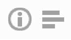
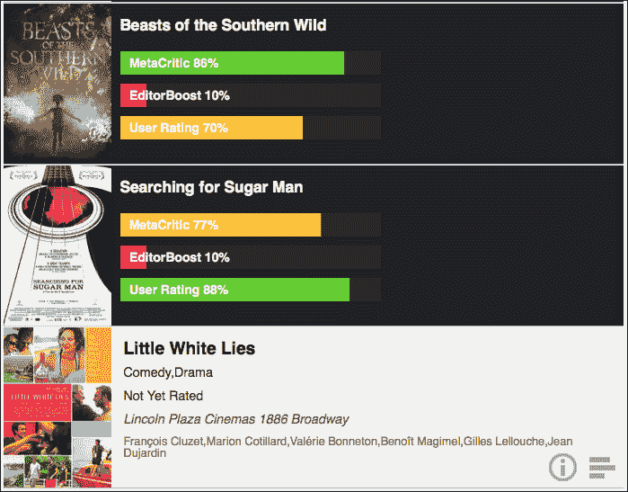
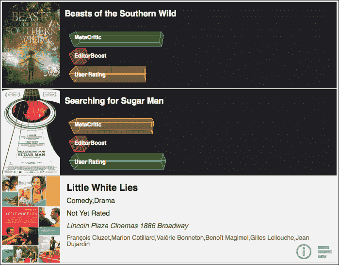
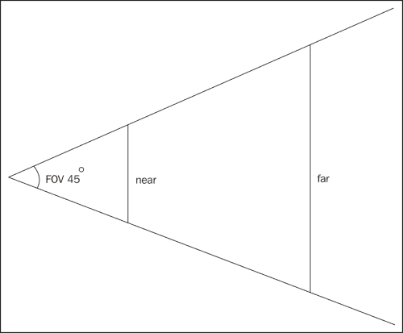

# 第七章. 应用程序：通过 Canvas 显示评分

到目前为止，我们已经看到了使用 CSS 和图像在我们的企业应用程序中布局和绘制元素的方法。如果我们需要根据动态数据创建复杂可视化或动画，使用`DOM`对象会变得复杂，其操作也会变慢。因此，HTML5 规范中引入了`canvas`标签。`canvas`标签定义了一个矩形区域，我们可以使用其 JavaScript API 在其中绘制任何内容。本章介绍了`canvas`标签用于数据可视化和简单动画。

在本章中，我们将涵盖：

+   绘制图表

+   准备我们的代码

+   一切都取决于上下文（2D 和 3D 上下文）

# 绘制图表

我们当前的 MovieNow 实现使用了`movielistings.php`网络服务提供的数据子集。一些未使用的数据包括来自 MetaCritic、EditorBoost 和一般用户评分（分别对应`avgMetaCriticRating`、`editorBoost`和`avgUserRating`）。MovieNow 用户会喜欢以条形图的形式看到这些信息。为此，我们将使用`canvas`。

### 小贴士

虽然可以使用`DOM`对象渲染此信息，但这可能较慢且更具限制性。

# 准备我们的代码

我们需要添加一个新的交互来通过点击显示评分图表。让我们移除我们当前的点击交互：

```js
$("#movies-near-me li").click(function(){
  $(this).toggleClass("open")
});
```

新交互将包括两个按钮：一个用于显示电影描述，另一个用于显示评分图表。在`img`文件夹中，您将找到一个`options.png`图像精灵。它包含信息和图表的图标。



使用`details-button`和`charting-button`类，让我们在`styles.css`中添加一些样式。每个按钮将是 45 px x 45 px，使用绝对定位将其放置在右下角：

```js
.details-button,.charting-button{
  width:45px;
  height:45px;
  cursor:pointer;
  position:absolute;
  bottom:10px;
  right:0;
  background:none;
  border:none;
  background-image:url(../img/options.png)
}
```

将详细信息按钮放置在图表按钮的左侧：

```js
.details-button{
  right:45px;
}
```

设置图表按钮的正确图像：

```js
.charting-button{
  background-position:-45px 0;
}
```

在`movienow.geolocation.js`的`displayShowtimes`函数中，我们需要更改 HTML 结构以添加我们的新按钮：

```js
<input type="button" class="charting-button" />
<input type="button" class="details-button" />
```

我们还将放置我们的图表容器及其 canvas。在此阶段，我们将使用 HTML5 自定义数据属性`data-feed`来存储每个 canvas 中的评分信息：

```js
<section class="charting">
  <h3 itemprop="name">movie.title</h3>
  <p><canvas data-feed= "MetaCritic:movie.avgMetaCriticRating,EditorBoost:movie.editorBoost,User Rating:movie.avgUserRating"></canvas></p>
</section>
```

### 注意

HTML5 自定义数据属性允许在 HTML 元素上嵌入元数据。您的属性名必须以`data-`前缀开头，后跟至少一个字符字符串；在我们的情况下，我们使用单词`feed`，因此我们的属性名是`data-feed`。它不允许使用大写字母，并且值是一个字符串。

将它们组合起来，我们得到：

```js
for (var item in movies.items) {
  movie = movies.items[item];
  var movieDesc=(movie.synopsis &&movie.synopsis.length>200)?movie.synopsis.substr(0,200)+"...": movie.synopsis;
  var movieHTML='<li itemscope itemtype="http://schema.org/Movie">';
  movieHTML+='';
  movieHTML+='<section class="main-info">';
  movieHTML+='<input type="button" class="charting-button" />';
  movieHTML+='<input type="button" class="details-button" />';
  movieHTML+='<h3 itemprop="name">'+movie.title+'</h3>';
  movieHTML+='<p class="details genre" itemprop="genre">'+Array(movie.genre).join(', ')+'</p>';
  movieHTML+='<p class="details">'+movie.mpaaRating+'</p>';
  movieHTML+='<p class="theater">'+movie.theater.title+" "+movie.theater.address+'</p>';
  movieHTML+='<p class="actors">'+Array(movie.selectedStar).join(', ')+'</p>';
  movieHTML+='</section>';
  movieHTML+='<section class="description">';
  movieHTML+='<h3 itemprop="name">'+movie.title+'</h3>';
  movieHTML+='<p>'+movieDesc+'</p>';
  movieHTML+='</section>';
  movieHTML+='<section class="charting">';
  movieHTML+='<h3 itemprop="name">'+movie.title+'</h3>';
  movieHTML+='<p><canvas data-feed= "MetaCritic:'+movie.avgMetaCriticRating+",EditorBoost:"+movie.editorBoost+",User Rating:"+movie.avgUserRating+'"></canvas></p>';
  movieHTML+='</section>';
  movieHTML+='</li>';
  html+=movieHTML;
}
```

在`styles.css`中图表元素之前添加一些间距：

```js
.charting canvas{
  margin-top:10px;
}
```

要隐藏和显示`charting`和`description`区域，我们将使用`desc`类。如果`desc`类应用于`li`标签，我们将隐藏`charting`并显示`description`。否则，我们将隐藏`description`并显示`charting`：

```js
#movies-near-me li.desc section.description, #movies-near-me li section.charting{
  display:block;
}
#movies-near-me li section.description, #movies-near-me li.desc section.charting{
  display:none;
}
```

回到 `movienow.geolocation.js`，我们定义显示图表（`showCharts`）和显示细节（`showDetails`）的方法。对于 `showCharts`，我们将使用 jQuery 的链式调用功能。`$(event.target)` 如果按钮被点击，那么我们使用 `parent()` 向上移动两级；从当前对象（`li`）中移除 `desc` 类，添加 `open` 类，并找到第一个 `canvas` 元素：

```js
$(event.target)
  .parent()
  .parent()
  .removeClass("desc")
  .addClass("open")
  .find("canvas")[0];
```

### 小贴士

jQuery 允许方法调用的连接，将每个方法应用于前一个方法的结果。这提高了性能，但有时会牺牲可读性。

我们将创建一个名为 `charts` 的函数来绘制每个画布，这个函数将 `canvas` 对象作为参数。我们的最终方法应该如下所示：

```js
this.showCharts = function(event) {
  that.charts(
    $(event.target)
      .parent()
      .parent()
      .removeClass("desc")
      .addClass("open")
      .find("canvas")[0]
  );
};
```

应用相同的思路来展示细节：

```js
this.showDetails = function(event) {
  $(event.target)
    .parent()
    .parent()
    .addClass("desc")
    .addClass("open");
};
```

添加点击事件处理程序以打开和关闭：

```js
$("#movies-near-me li .details-button").click(that.showDetails);
$("#movies-near-me li .description, #movies-near-me li .charting").click(function(){
  $(this)
    .parent()
    .removeClass("open")
});	
$("#movies-near-me li .charting-button").click(that.showCharts);
```

现在我们创建 `movienow.charts.js` 并添加 `charts` 方法：

```js
var movienow = movienow || {};
movienow.charts = (function(){
  var that = this;
  this.charts = function(canvas){
    that.drawBarChart(canvas);
  };
  this.drawBarChart = function(canvas) {
  }
})();
```

注意，`charts` 方法调用了 `drawBarChart` 方法。我们使用这个结构来更改后续的绘图方法。

记得在 `index.html` 中包含 `movienow.charts.js`：

```js
<script src="img/ios-orientationchange-fix.js"></script>
<script src="img/jquery-1.8.0.min.js"></script>
<script src="img/jquery.xdomainajax.js"></script>
<script src="img/movienow.charts.js"></script>
<script src="img/movienow.geolocation.js"></script>
<script src="img/movienow.js"></script>
```

# 一切都取决于上下文

Canvas 提供了在二维或三维空间中绘图的 API，在支持的情况下。Canvas 2D 的支持范围比 Canvas 3D 更广；后者通常在任何移动浏览器上都不被支持。

你可以通过获取画布上下文来定义要使用的 API。假设 `chart` 是我们的 `canvas` 对象。如果你想绘制二维图形，你可以使用：

```js
var context=chart.getContext("2D");
```

然后，你可以使用 2D API 来绘制，例如，一个红色的正方形，定义其颜色：

```js
context.fillStyle="#FF0000";
```

按以下方式绘制形状：

```js
context.fillRect(0,0,20,20);
```

对于 3D API，使用要复杂得多。首先，它仍然没有得到完全支持，因为一些浏览器识别 `webgl`：

```js
var context=chart.getContext("webgl");
```

当其他人使用 `experimental-webgl`：

```js
var context=chart.getContext("experimental-webgl");
```

这是因为 `webgl` 规范仍在开发中。使用 WebGL 需要了解计算机图形和诸如相机、灯光、纹理、材质、映射等概念。

## 2D 上下文

我们将创建一个水平条形图来显示 MetaCritic、EditorBoost 和用户评分。想法是使用绿色、黄色和红色来表示评分的高低。

在以下图像中，我们可以看到我们的图表设计：



根据我们已建立的 `movienow.charts.js` 结构，让我们编写 `drawBarChart` 方法。由于我们不希望在每次调用此方法时都重新绘制我们的画布，我们将使用 `painted` 类作为标志来决定画布是否已经绘制。

然后，我们可以将 `canvas` 保存为 jQuery 对象：

```js
var myCanvas=$(canvas);
```

然后，我们可以验证它是否有 `painted` 类：

```js
if(!myCanvas.hasClass("painted")){
  //DRAW HERE
  myCanvas.addClass("painted");
}
```

在我们的条件语句中，我们将包含评分信息的 `data-feed` 分割，以便遍历它，为每个评分类别构建一个条形图：

```js
var values=myCanvas.attr("data-feed").split(",");
```

然后我们获取 2D 上下文：

```js
var context=canvas.getContext("2d");
```

### Canvas 2D 绘图 API 概览

让我们回顾一下 Canvas 在二维上下文中最有用的方法：

#### 样式

Canvas 2D API 中设置样式的使用方法如下所述：

+   `context.strokeStyle(value)`: 这接收一个包含 CSS 颜色的字符串，用于描边；如果没有传递参数，则返回当前描边样式。

+   `context.fillStyle(value)`: 它接收一个包含用于填充形状的 CSS 颜色的字符串；如果没有传递参数，则返回当前填充样式。

    ### 提示

    `strokeStyle` 和 `fillStyle` 可以接收 `CanvasGradient` 或 `CanvasPattern` 作为参数，允许您绘制渐变和图案。有关如何创建渐变和图案的更多信息，您可以查看 canvas 2D API 规范：[`dev.w3.org/2006/canvas-api/canvas-2d-api.html`](http://dev.w3.org/2006/canvas-api/canvas-2d-api.html)。

+   `context.lineWidth(value)`: 它使用像素定义线的宽度。它只接受正值；如果没有传递值，则充当获取器并返回当前线宽。

+   `context.lineCap(value)`: 它设置线的端点（或帽）的样式。可能的值是 `butt`、`round` 和 `square`。如果没有传递值，则返回当前的线帽样式。

+   `context.lineJoin(value)`: 它设置线的连接样式。可能的值是 `bevel`、`round` 和 `miter`。如果没有传递值，则返回当前的线连接样式。

#### 字体样式

在 canvas 2D API 中设置字体样式的使用方法如下：

+   `context.font(value)`: 它使用 CSS 语法字符串定义字体样式。如果没有传递值，则返回当前的字体样式。

+   `context.fillText``(text,x,y[, maxWidth])`: 绘制文本。它接收一个包含要绘制信息的 `text` 字符串，以像素为单位指定 `x` 和 `y` 坐标，以及定义容器宽度最大像素值的 `maxWidth`，后者是可选的。

+   `context.strokeText(text,x,y[, maxWidth])`: 它的行为类似于 `fillText`，但只绘制文本的描边。

#### 绘制简单形状

在 Canvas 2D API 中绘制简单形状使用的方法如下：

+   `context.clearRect(x, y, w, h)`: 它定义一个坐标为 `x` 和 `y`、宽度为 `w` 和高度为 `h` 的矩形，并清除该区域内定义的所有像素。值以像素为单位。

+   `context.fillRect(x, y, w, h)`: 使用预定义的 `fillStyle` 绘制坐标为 `x` 和 `y`、宽度为 `w` 和高度为 `h` 的矩形。

+   `context.strokeRect``(x, y, w, h)`: 使用预定义的 `strokeStyle` 绘制坐标为 `x` 和 `y`、宽度为 `w` 和高度为 `h` 的矩形描边。

#### 绘制复杂形状

要创建更复杂的形状，Canvas 2D API 允许您定义路径和子路径。路径是一系列子路径的集合，而子路径是由线条或曲线连接的点列表。

当前项目不需要复杂的形状，但了解允许您绘制曲线和线条的方法，使其能够绘制任何图形是很好的。

我们需要意识到我们的上下文始终包含一个当前路径，并且不可能有多个。

+   `co``ntext.beginPath()`: 它重置当前路径

+   `context.closePath()`: 它关闭当前路径并创建一个新的路径，其第一个点使用与最后一个子路径点相同的坐标

+   `context.moveTo(x, y)`: 它使用坐标 `x` 和 `y` 创建一个新的子路径

+   `context.lineTo(x, y)`: 它在当前点和坐标为 `x` 和 `y` 的新点之间创建一条线，并将最新点添加到当前子路径中

+   `context.quadraticCurveTo(cpx, cpy, x, y)`: 它使用一个控制点创建一个二次曲线，该控制点在 x 轴上的坐标为 `cpx`，在 y 轴上的坐标为 `cpy`，在当前点和坐标为 `x` 和 `y` 的新点之间

+   `context.bezierCurveTo(cp1x, cp1y, cp2x, cp2y, x, y)`: 它使用两个控制点 cp1(`cp1x`, `cp1y`) 和 cp2 (`cp2x`, `cp2y`) 在当前点和坐标为 `x` 和 `y` 的新点之间创建一个贝塞尔曲线

+   `context.arcTo(x1, y2, x2, y2, radius)`: 它通过一个半径由参数 `radius` 定义的弧将当前点与坐标为 `x1` 和 `y1` 的新点连接起来，然后通过一个弧与之前的一个点连接，坐标为 `x2` 和 `y2`

+   `context.rect(x, y, w, h)`: 它将一个坐标为 `x` 和 `y`、宽度为 `w` 和高度为 `h` 的矩形添加到子路径列表中

+   `context.fill()`: 它将当前填充样式应用于填充子路径

+   `context.stroke()`: 它将当前描边样式应用于创建子路径的描边线

+   `context.isPointInPath(x, y)`: 如果由坐标 `x` 和 `y` 定义的点在当前路径中，则返回 `true`，否则返回 `false`

有其他方法对于更复杂的绘制和动画可能很有用；您可以在以下位置查看画布规范：[`dev.w3.org/2006/canvas-api/canvas-2d-api.html`](http://dev.w3.org/2006/canvas-api/canvas-2d-api.html)。

### 绘制图表

首先，让我们为该上下文定义文本样式以及一个用于计算当前条索引的变量（以防不是所有电影都有相同数量的评分类别）：

```js
context.font = "bold 14px sans-serif";
var index=0;
```

遍历评分类别并获取当前值：

```js
for(var i=0; i<values.length; i++){
      var info=values[i].split(":");
      var val=info[1];
}
```

我们首先绘制一个灰色条（`#292929`），它定义了宽度为 `290` 像素和高度为 `26` 像素的宽度。使用 `fillRect(x,y,width,height)` 语法，注意我们使用 `36` 来在条之间提供 10 像素的间隔：

```js
        var pos=index*36;
        context.fillStyle="#292929";
        context.fillRect(0,pos,290,26);
```

### 注意

画布原点位于画布 DOM 对象的左上角。正值位于原点下方并向右。

然后，我们可以绘制我们的颜色条。为此，我们定义一个 `getChartColor` 方法，该方法根据评分值返回不同的颜色，对于较高的评分使用绿色，对于中等评分使用黄色，对于最低评分使用红色：

```js
this.getChartColor = function(val){
  var result="";
  if(val<40){
    result="#FF0066";
  }else{
    if(val<80){
      result="#FFCC33";
    }else{
      result="#66CC33";
    }
  }
  return result;
};
```

使用我们的 `getChartColor` 方法以及当前的评分值 `val`，我们可以设置形状：

```js
context.fillStyle=that.getChartColor(val);
context.fillRect(0,pos,val*2.9,26);
```

要绘制评分类别标题，我们更改填充样式为半透明的白色，然后使用 `fillText` 语法 `fillText(text, x,y)`：

```js
context.fillStyle = "rgba(255, 255, 255, .9)";
context.fillText(info[0]+" "+val+"%", 10, pos+18);
index++;
```

### 小贴士

注意，我们可以使用十六进制、RGB 或 RGBA 颜色来定义 `fillStyle`。

最后，我们编写一个验证，如果没有数据，则显示一条消息，说明**无可用数据**：

```js
    if(index==0){
   context.fillStyle = "#FFFFFF";
      context.fillText("No Data Available", 40, 50);
    }
```

将所有内容整合：

```js
this.drawBarChart = function(canvas) {
  var myCanvas=$(canvas);
  if(!myCanvas.hasClass("painted")){
    var values=myCanvas.attr("data-feed").split(",");
    var context=canvas.getContext("2d");
    context.font = "bold 14px sans-serif";
    var index=0;
    for(var i=0; i<values.length; i++){
      var info=values[i].split(":");
      var val=info[1];
      if(val>0){
        var pos=index*36;
        context.fillStyle="#292929";
        context.fillRect(0,pos,290,26);
        context.fillStyle=that.getChartColor(val);
        context.fillRect(0,pos,val*2.9,26);
        context.fillStyle = "rgba(255, 255, 255, .9)";
        context.fillText(info[0]+" "+val+"%", 10, pos+18);
        index++;
      }
    }
    if(index==0){
   context.fillStyle = "#FFFFFF";
      context.fillText("No Data Available", 40, 50);
    }
    myCanvas.addClass("painted");
  }
};
```

在这个例子中，我们不需要清除我们的画布区域，因为我们第一次绘制后没有进行动画或更改信息。然而，如果我们确实需要重新绘制，我们可以使用：

```js
context.clearRect(0, 0, canvas.width, canvas.height);
```

### 注意

Canvas 2D 上下文提供了一种过程式绘图方法——创建位图图像。如果我们需要使用矢量图形而不是位图，可以使用可缩放矢量图形（SVG），它使用 XML 提供了一种声明式方法。要了解更多关于 SVG 的信息，你可以在这里研究 [`www.w3.org/Graphics/SVG/`](http://www.w3.org/Graphics/SVG/)。

Canvas 2D API 自 9.0 版本以来被所有现代浏览器支持，包括 Internet Explorer。正如我们在第二章中所示，*HTML 入门套件：实用工具*，仍然可以使用 ExplorerCanvas [`code.google.com/p/explorercanvas/downloads/list`](http://code.google.com/p/explorercanvas/downloads/list)来支持之前的 Internet Explorer 版本。

## 3D 上下文 – WebGL 和实验性 WebGL

现在我们已经看到了我们图表解决方案的二维实现，让我们尝试创建一个三维版本，并添加一些动画使事物更加有趣。

### 注意

当我们考虑用户体验时，一个普遍的规则是“少即是多”。这意味着保持简单可以使我们的应用程序更易于使用。在这种情况下，我们将添加不必要的动画，以便学习如何进行操作。

在我们的例子中，我们将使用 WebGL 绘制条形图，并使用 DOM 对象绘制评分类别标题。

最终实现应该看起来像以下这样：



### 进入三维世界

WebGL 规范基于嵌入式系统 OpenGL 2.0（或 OpenGL ES）规范。除非你熟悉 OpenGL 并且需要执行低级操作，否则建议你使用抽象其使用的库。其优点包括代码可读性更高、开发时间更短、更好的可扩展性。

在我们的例子中，我们选择了`Three.js`，这是一个 JavaScript 库，它通过使用其他三维库中常用的隐喻简化了 WebGL 的使用。

### 小贴士

当你必须决定使用哪个库时，请考虑项目目标，并考虑该库未来的改进和限制。

### Three.js

`Three.js`是一个 JavaScript 库，它抽象了 3D 操作，允许我们使用场景、相机、对象等简单的隐喻。您可以从[`github.com/mrdoob/three.js/`](https://github.com/mrdoob/three.js/)下载`Three.js`，并在[`mrdoob.github.com/three.js/docs/50/`](http://mrdoob.github.com/three.js/docs/50/)阅读其文档。

让我们回顾一些基本概念：

#### 场景

场景是我们可以插入对象的虚拟环境。每个对象都必须在一个`scene`中才能可视化。

您可以使用`scene = new THREE.Scene()`创建场景，并使用`scene.add(object)`向其中添加对象。

#### 相机

相机指示要可视化的场景部分。将其视为一部电影；如果我们想记录特定的地方，我们需要将相机指向它。`Three.js`提供了一个抽象的`Camera`类用于相机，两个基本相机和两个额外的相机实现。

`OrthographicCamera` 使用构造函数参数定义的立方体定义正交投影

```js
OrthographicCamera(left, right, top, bottom, near, far)
```

+   `left` – 使用表示位置的浮点数定义左平面

+   `right` – 使用表示位置的浮点数定义右平面

+   `top` – 使用表示位置的浮点数定义顶平面

+   `bottom` – 使用表示位置的浮点数定义底平面

+   `near` – 使用表示位置的浮点数定义最近的平面或近平面

+   `far` – 使用表示位置的浮点数定义最远的平面或远平面

`PerspectiveCamera` 使用视场、宽高比、近点和远点值定义透视投影：

```js
PerspectiveCamera(fov, aspect, near, far)
```

+   `fov` – 使用浮点数定义表示视场的角度

+   `aspect` – 定义由浮点数指定的相机宽高比

+   `near` – 在`OrthographicCamera`中，使用浮点数定义近平面

+   `far` – 在`OrthographicCamera`中，使用浮点数定义远平面

以下图中展示了透视相机的视觉表示：



#### 材质

材质定义了一组描述对象外观的属性。

#### 纹理

纹理使用图像（或程序性图案）定义对象的外观。

#### 网格

网格是可添加到场景的对象列表的一部分。您可以将几何体和材质分配给网格。

#### 几何体

几何体是可分配给网格的对象的表示。在我们的例子中，我们将使用`CubeGeometry`来定义我们的条形。

首先，我们将下载并将`three.js`包含在我们的`index.html`文件中：

```js
<script src="img/ios-orientationchange-fix.js"></script>        
<script src="img/jquery-1.8.0.min.js"></script>        
<script src="img/jquery.xdomainajax.js"></script>        
<script src="img/three.js"></script>
<script src="img/movienow.charts.js"></script>       
<script src="img/movienow.geolocation.js"></script>        
<script src="img/movienow.js"></script> 
```

我们然后向我们的`charts`类添加一个新参数来指定我们想要使用的渲染：

```js
this.charts = function(canvas, type){
 switch(type){
 case "3DChart":
 that.draw3DChart(canvas);
 break;
 case "barChart":
 default:
      that.drawBarChart(canvas);
      break;
 }
};
```

我们在`showCharts`方法中将默认定义为**3DChart**：

```js
this.showCharts = function(event) {  
that.charts($(event.target).parent().parent().removeClass("desc").addClass("open").find("canvas")[0], "3DChart");
};
```

现在我们来编写我们的 3D 绘图方法`draw3DChart`。像我们之前的二维绘图方法一样，这个方法将我们的`canvas`作为参数：

```js
this.draw3DChart = function(canvas) {
}
```

与之前一样，我们验证 Canvas 是否有`painted`类以避免再次初始化它。然后我们可以验证 WebGL 支持，如果不支持，我们渲染 2D 图表：

```js
this.draw3DChart = function(canvas) {
  var myCanvas=$(canvas);
  var myCanvasParent=myCanvas.parent();
  if(!myCanvas.hasClass("painted")){
    var webGlSupport=false;
    try {
      /*** VERIFICATION OF WEBGL SUPPORT ***/
      webGlSupport = !!window.WebGLRenderingContext && !!document.createElement('canvas').getContext('experimental-webgl');
    }catch(e){}
    if (webGlSupport){
    //DRAW 3D HERE
    }else{
      /** IF NOT WEBGL SUPPORT RENDERS CHART IN 2D ***/
      that.drawBarChart(canvas);
    }
  }
};
```

在`webGLSupport`内部，我们获取我们的评分数据、`canvas`尺寸和存储动画时间的变量：

```js
var data=myCanvas.attr("data-feed");
var values=data.split(",");
var w = myCanvas.width();
var h = myCanvas.height();
var lastTime = 0;
```

现在我们使用 WebGL 定义一个`three.js`渲染器，它包含我们的新画布，并设置其尺寸：

```js
var renderer = new THREE.WebGLRenderer();
renderer.setSize(w, h);
```

我们将`data`属性和`painted`类分配给渲染器 DOM 元素（`canvas`），并用这个替换我们旧的`canvas`。

```js
var newCanvas=$(renderer.domElement);
newCanvas.attr("data-feed",data);
myCanvas.addClass("painted");
myCanvas.replaceWith(newCanvas);
```

我们使用视场（FOV）45 度、基于画布尺寸的宽高比、近点为 1 和远点为 1000 来实现我们的相机，并将相机定位在 z 轴上的 700 处。

```js
var camera = new THREE.PerspectiveCamera(45, w/h, 1, 1000);
camera.position.z = 700;
```

然后我们定义我们的场景，一个用于存储稍后要渲染的网格的`bars`数组，一个类似于我们 2D 示例中的`index`，以及一个用于存储将显示标题的 DOM 对象的`labels`字符串：

```js
var scene = new THREE.Scene();
var bars=[];
var index=0;
var labels="<div class='chart-labels'>";
```

按照我们之前的示例迭代评分类别。我们使用`getChartColor`为我们当前的值获取一个颜色，并将`#`替换为`0x`，因为使用了颜色表示法：

```js
var mainColor=that.getChartColor(val).replace("#", "0x");
```

由于每个条形将有六个面，我们将有六种不同的材质。每一种都将有自己的颜色，因此我们为`colors`和`materials`定义数组。我们还在`labels`字符串中填充我们的标题信息：

```js
var colors = [mainColor, mainColor, mainColor, mainColor, mainColor, mainColor];
var materials = [];
labels+="<div>"+info[0]+"</div>";
for (var n = 0; n < 6; n++) {
  materials.push([
    new THREE.MeshLambertMaterial({
      color: colors[n],
      opacity:0.6,
      transparent: true,
      shading: THREE.FlatShading,
      vertexColors: THREE.VertexColors
    }),
    new THREE.MeshBasicMaterial({
      color: colors[n],
      shading: THREE.FlatShading,
      wireframe: true,
      transparent: true
    })
  ]);
}
```

注意，我们可以分配多个材质。在这种情况下，我们使用以下方式为我们的实体定义透明填充：

```js
THREE.MeshLambertMaterial({
  color: colors[n],
  opacity:0.6,
  transparent:
  true,
  shading: THREE.FlatShading,
  vertexColors: THREE.VertexColors
})
```

以下绘制了边缘：

```js
new THREE.MeshBasicMaterial({
  color: colors[n],
  shading: THREE.FlatShading,
  wireframe: true,
  transparent: true
})
```

每个`bar`被定义为具有几何形状的网格。使用以下`CubeGeometry`语法：

```js
CubeGeometry(width, height, depth, segmentsWidth, segmentsHeight, segmentsDepth)
```

这将创建一个新的`CubeGeometry`对象：

```js
var bar = new THREE.Mesh(new THREE.CubeGeometry(myWidth, 90, 90, 1, 1, 1, materials), new THREE.MeshFaceMaterial());
```

#### 动画我们的几何形状

我们将动画条形的增长，所以我们将它们在 x 轴上缩放。

```js
bar.scale.x=.01;
```

网格的参考点位于其中心，因此定位网格并设置重绘以管理透明几何形状，我们有：

```js
bar.position.y=200-(index*140);
bar.position.x=-500+(myWidth/2)*bar.scale.x;
bar.overdraw = true;
```

我们将条形添加到我们的场景和我们的数组中，并设置最终宽度，这是动画结束时的宽度：

```js
scene.add(bar);
bars.push({object:bar, width:myWidth});
index++;
```

因此，我们的迭代应该看起来如下：

```js
for(var i=0; i<values.length; i++){
  var info=values[i].split(":");
  var val=info[1];
  if(val>0){
    var mainColor=that.getChartColor(val).replace("#", "0x");
    var colors = [mainColor, mainColor, mainColor, mainColor, mainColor, mainColor];
    var materials = [];
    labels+="<div>"+info[0]+"</div>";
    for (var n = 0; n < 6; n++) {
      materials.push([
        new THREE.MeshLambertMaterial({
          color: colors[n],
          opacity:0.6,
          transparent: true,
          shading: THREE.FlatShading,
          vertexColors: THREE.VertexColors
        }),
        new THREE.MeshBasicMaterial({
          color: colors[n],
          shading: THREE.FlatShading,
          wireframe: true,
          transparent: true
        })
       ]);
     }
     var myWidth=val*8;
     var bar = new THREE.Mesh(new THREE.CubeGeometry(myWidth, 90, 90, 1, 1, 1, materials), new THREE.MeshFaceMaterial());
     bar.scale.x=.01;
     bar.position.y=200-(index*140);
     bar.position.x=-500+(myWidth/2)*bar.scale.x;
     bar.overdraw = true;
     scene.add(bar);
     bars.push({object:bar, width:myWidth});
     index++;
  }
}
```

到目前为止，我们还没有渲染任何东西。我们可以通过设置`labels`字符串并附加它来纠正这一点：

```js
labels+"</div>";
myCanvasParent.append(labels);
```

我们设置一个`three`结构，我们将用它来进行渲染，然后调用我们的渲染方法`animate3DChart`：

```js
var three = {
  renderer: renderer,
  camera: camera,
  scene: scene,
  bars: bars
};
that.animate3DChart(lastTime, three);
```

我们的`draw3DChart`方法如下所示：

```js
this.draw3DChart = function(canvas) {
  var myCanvas=$(canvas);
  var myCanvasParent=myCanvas.parent();
  if(!myCanvas.hasClass("painted")){
    var webGlSupport=false;
    try {
      /*** VERIFICATION OF WEBGL SUPPORT ***/
      webGlSupport = !!window.WebGLRenderingContext && !!document.createElement('canvas').getContext('experimental-webgl');
    }catch(e){}
    if (webGlSupport){
      var data=myCanvas.attr("data-feed");
      var values=data.split(",");
      var w = myCanvas.width();
      var h = myCanvas.height();
      var lastTime = 0;
      var renderer = new THREE.WebGLRenderer();
      renderer.setSize(w, h);
      var newCanvas=$(renderer.domElement);
      newCanvas.attr("data-feed",data);
      myCanvas.addClass("painted");
      /*** REPLACES ORIGINAL CANVAS WITH THREE.JS CANVAS ***/
      myCanvas.replaceWith(newCanvas);
      /*** CAMERA DEFINITION ***/
      var camera = new THREE.PerspectiveCamera(45, w/h, 1, 1000);
      camera.position.z = 700;
      /*** SCENE DEFINITION ***/
      var scene = new THREE.Scene();
      var bars=[];
      var index=0;
      var labels="<div class='chart-labels'>";
      for(var i=0; i<values.length; i++){
        var info=values[i].split(":");
        var val=info[1];
        if(val>0){
          var mainColor=that.getChartColor(val).replace("#", "0x");
          var colors = [mainColor, mainColor, mainColor, mainColor, mainColor, mainColor];
          var materials = [];
          labels+="<div>"+info[0]+"</div>";
          for (var n = 0; n < 6; n++) {
            materials.push([
              new THREE.MeshLambertMaterial({
                color: colors[n],
                opacity:0.6,
                transparent: true,
                shading: THREE.FlatShading,
                vertexColors: THREE.VertexColors
              }),
              new THREE.MeshBasicMaterial({
                color: colors[n],
                shading: THREE.FlatShading,
                wireframe: true,
                transparent: true
              })
            ]);
          }
          var myWidth=val*8;
          var bar = new THREE.Mesh(new THREE.CubeGeometry(myWidth, 90, 90, 1, 1, 1, materials), new THREE.MeshFaceMaterial());
          bar.scale.x=.01;
          bar.position.y=200-(index*140);
          bar.position.x=-500+(myWidth/2)*bar.scale.x;
          bar.overdraw = true;
          scene.add(bar);
          bars.push({object:bar, width:myWidth});
          index++;
        }
      }
      labels+"</div>";
      myCanvasParent.append(labels);
      /*** SAVE INFORMATION REQUIRED TO RENDER SCENE ***/
      var three = {
        renderer: renderer,
        camera: camera,
        scene: scene,
        bars: bars
      };
      that.animate3DChart(lastTime, three);
    }else{
      /** IF NOT WEBGL SUPPORT RENDERS CHART IN 2D ***/
      that.drawBarChart(canvas);
    }
  }
};
```

#### 结束

我们创建一个`window.requestAnimFrame`方法来抽象我们的动画`timeout`定义。注意，我们使用`1000/60`。这表示每秒 60 帧（`FPS`）：

```js
window.requestAnimFrame = (function(callback){
  return window.requestAnimationFrame ||window.webkitRequestAnimationFrame ||window.mozRequestAnimationFrame ||window.oRequestAnimationFrame ||window.msRequestAnimationFrame ||function(callback){
  /* Using 60FPS */
    window.setTimeout(callback, 1000 / 60);
  };
})();
```

对于`animate3DChart`方法，我们简单地定义一个变量来停止我们的动画（`isReady`），并缩放和定位每个`bar`，直到我们达到 100%的缩放（在这种情况下为`1`）：

```js
this.animate3DChart = function(lastTime, three){
  var isReady=false;
  for(var i=0; i<three.bars.length; i++){
    if(three.bars[i].object.scale.x<1){
      three.bars[i].object.scale.x+=.03;
      three.bars[i].object.position.x=-500+(three.bars[i].width/2)*three.bars[i].object.scale.x;
    }
    isReady=(three.bars[i].object.scale.x>=1);
  }
  lastTime = time;
  /*** SCENE RENDER USING THREE.JS ***/
  three.renderer.render(three.scene, three.camera);
  if(!isReady){
    requestAnimFrame(function(){
      that.animate3DChart(lastTime, three);
    });
  }
}
```

如果我们想让每个条形无限旋转，我们可以定义一些值来控制动画：

```js
var angularSpeed = 1.2;
var date = new Date();
var time = date.getTime();
var timeDiff = time - lastTime;
var angleChange = angularSpeed * timeDiff * 2 * Math.PI / 1000;
```

我们可以将`isReady=(three.bars[i].object.scale.x>=1)`替换为`three.bars[i].object.rotation.x += angleChange`。

要修改 x 轴上的旋转，我们可以添加以下内容：

```js
this.animate3DChart = function(lastTime, three){
  var angularSpeed = 1.2;
 var date = new Date();
 var time = date.getTime();
 var timeDiff = time - lastTime;
 var angleChange = angularSpeed * timeDiff * 2 * Math.PI / 1000;
  var isReady=false;
  for(var i=0; i<three.bars.length; i++){
    if(three.bars[i].object.scale.x<1){
      three.bars[i].object.scale.x+=.03;
      three.bars[i].object.position.x=-500+(three.bars[i].width/2)*three.bars[i].object.scale.x;
    }
    //isReady=(three.bars[i].object.scale.x>=1);
    three.bars[i].object.rotation.x += angleChange;
  }
  lastTime = time;
  /*** SCENE RENDER USING THREE.JS ***/
  three.renderer.render(three.scene, three.camera);
  if(!isReady){
    requestAnimFrame(function(){
      that.animate3DChart(lastTime, three);
    });
  }
}
```

WebGL 画布 API 并非所有浏览器都完全支持。您可以使用 Firefox 4.0+、Chrome、Opera 和从版本 5.1 开始（在 OSX 或更高版本上，但不是 iOS 设备上的 Safari 或 Windows 上的 Safari）的 3D API。

### 小贴士

WebGL 在 Safari 中默认禁用。要在 Safari 中启用 WebGL，请点击**Safari**菜单并选择**偏好设置**，然后点击**高级**选项卡。在底部，勾选**在菜单栏中显示开发菜单**复选框。打开**开发**菜单，然后选择**启用 WebGL**。

对于 Internet Explorer，您可以通过安装 Chrome Frame 插件[`www.google.com/chromeframe`](http://www.google.com/chromeframe)来启用 WebGL 支持。Google Chrome Frame 用 Google Chrome 的 WebKit 布局引擎和 V8 JavaScript 引擎的版本替换了 Internet Explorer 的渲染机制。

# 摘要

尽管画布规范仍在开发中，我们仍然可以在我们的企业应用中应用其 API，以应对无数的使用场景。图表、科学可视化、图表和动画向导只是冰山一角。作为开发者，我们应该始终充分考虑回退或替代方案，以防某些功能不受支持，以确保适当的跨平台兼容性。

下一章将介绍使用 HTML5 的拖放功能和事件委托。
